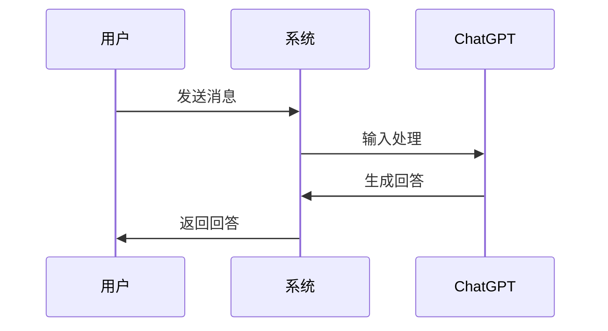

                 

# 提示词优化：打造高效ChatGPT对话的秘诀

> 关键词：提示词优化、ChatGPT、自然语言处理、对话系统、用户体验

> 摘要：本文将探讨如何通过提示词优化，提升ChatGPT对话系统的质量和效率。我们将从问题背景、核心概念与联系、算法原理讲解、系统分析与架构设计方案、项目实战等方面，逐步剖析提示词优化的秘诀，为开发者提供一套完整的优化方法和实践指导。

----------------------------------------------------------------

## 第一部分：背景介绍

### 1.1 问题背景

随着人工智能技术的快速发展，自然语言处理（NLP）在各个领域中的应用越来越广泛。其中，ChatGPT作为一种基于大规模预训练语言模型的对话系统，因其强大的理解和生成能力而备受关注。然而，在实际应用过程中，如何提高ChatGPT对话的质量和效率，成为了众多开发者和研究者关注的焦点。

### 1.2 问题描述

本文旨在探讨如何通过提示词优化，打造高效、自然的ChatGPT对话系统。具体来说，主要包括以下几个方面：

- 提示词的选择与设计：如何根据对话场景和用户需求，选择合适的提示词，并设计出具有启发性的问题，引导ChatGPT生成高质量的回答。
- 提示词优化的方法：如何通过调整提示词的格式、语言风格、情感色彩等，提高ChatGPT的回答准确性和连贯性。
- 提示词优化的实践：结合实际案例，介绍如何在实际应用中，对ChatGPT进行提示词优化，以提升对话系统的用户体验。

### 1.3 问题解决

本文将通过系统化的分析和实践，为读者提供一套完整的提示词优化方法，帮助开发者打造出高效、自然的ChatGPT对话系统。具体内容包括：

- 提示词优化原理：深入剖析提示词优化的核心概念，包括提示词的选择、设计、优化等。
- 提示词优化方法：介绍一系列实用的提示词优化技巧，如调整提示词格式、使用关键词、加入背景信息等。
- 提示词优化实践：通过实际案例，展示如何在实际项目中，对ChatGPT进行提示词优化。

### 1.4 边界与外延

本文主要关注ChatGPT对话系统的提示词优化，但该方法也可应用于其他类型的对话系统，如基于规则的对话系统、基于机器学习的对话系统等。此外，本文中的优化方法不仅适用于英文对话系统，也可为中文等自然语言处理任务提供参考。

### 1.5 概念结构与核心要素组成

- 提示词：本文中的核心概念，用于引导ChatGPT生成回答的关键词或问题。
- ChatGPT：本文的研究对象，一种基于大规模预训练语言模型的对话系统。
- 对话场景：本文的研究背景，包括用户需求、对话主题、对话环境等。
- 用户需求：本文的研究目标，通过优化提示词，提升ChatGPT对话的质量和效率。

## 第二部分：核心概念与联系

### 2.1 提示词优化原理

#### 提示词的选择与设计

提示词的选择与设计是提示词优化的基础。选择合适的提示词，可以引导ChatGPT生成高质量的回答。设计具有启发性的问题，可以激发ChatGPT的想象力，使其生成的回答更加丰富和有趣。

| 特征 | 提示词选择 | 提示词设计 |
| :--: | :--------: | :--------: |
| 目的 | 引导ChatGPT生成高质量回答 | 激发ChatGPT的想象力和创造力 |
| 方法 | 根据对话场景和用户需求选择提示词 | 设计具有启发性和趣味性的问题 |

#### 提示词格式调整

调整提示词的格式，可以提高ChatGPT回答的连贯性和准确性。例如，将提示词设计成疑问句，可以引导ChatGPT生成针对性的回答；将提示词设计成陈述句，可以提供更多背景信息，帮助ChatGPT更好地理解问题。

| 特征 | 疑问句 | 陈述句 |
| :--: | :----: | :----: |
| 格式 | 提问形式 | 说明形式 |
| 优点 | 引导回答 | 提供背景 |

#### 关键词提取

从对话中提取关键词，作为提示词，可以帮助ChatGPT更好地理解对话内容。关键词的提取可以基于词频、词性、语义等相关技术，确保提取的关键词能够准确反映对话的主题和用户需求。

| 特征 | 词频提取 | 词性提取 | 语义提取 |
| :--: | :------: | :------: | :------: |
| 方法 | 根据词频高低提取关键词 | 根据词性分类提取关键词 | 根据语义关系提取关键词 |
| 目的 | 提高关键词的准确性 | 提高关键词的相关性 | 提高关键词的代表性 |

#### 背景信息补充

为ChatGPT提供更多背景信息，可以使其更准确地回答问题。背景信息的补充可以从多个维度进行，如历史对话记录、用户个人信息、相关领域知识等。

| 特征 | 历史对话记录 | 用户个人信息 | 相关领域知识 |
| :--: | :----------: | :----------: | :----------: |
| 方法 | 从历史对话中提取信息 | 从用户资料中提取信息 | 从领域知识库中提取信息 |
| 目的 | 提高ChatGPT对用户需求的了解 | 提高ChatGPT对用户的认知 | 提高ChatGPT的专业知识 |

### 2.2 ChatGPT原理

ChatGPT是一种基于大规模预训练语言模型的对话系统，通过输入文本生成相应的回答。其核心原理包括以下几个方面：

#### 语言模型

ChatGPT的核心组件是语言模型，通常采用神经网络架构，如Transformer、BERT等。语言模型通过对大量文本数据进行预训练，学习到语言的表达规律和语义关系，从而具备强大的文本生成能力。

| 特征 | Transformer | BERT |
| :--: | :--------: | :--: |
| 架构 | 自注意力机制 | 自注意力机制 |
| 预训练 | 大规模文本数据 | 大规模文本数据 |
| 优势 | 良好的长文本处理能力 | 强大的语义理解能力 |

#### 预训练

预训练是ChatGPT的关键步骤，通过在大量文本数据上训练，模型可以学习到丰富的语言知识和表达方式，从而在未知数据上表现出良好的性能。

| 特征 | 预训练 | 微调 |
| :--: | :-----: | :--: |
| 目的 | 学习语言知识和表达方式 | 调整模型参数，适应特定任务 |
| 方法 | 大规模文本数据训练 | 任务特定数据训练 |

#### 大规模计算资源

ChatGPT的训练和推理需要大量的计算资源，通常依赖于分布式计算和GPU加速等先进技术。大规模计算资源为ChatGPT提供了高效的训练和推理能力，使其在短时间内生成高质量的回答。

| 特征 | 分布式计算 | GPU加速 |
| :--: | :--------: | :-----: |
| 优点 | 提高训练和推理速度 | 提高模型性能 |

## 第三部分：算法原理讲解

### 3.1 算法流程

提示词优化的算法流程可以分为以下几个步骤：

1. **数据预处理**：对输入文本进行分词、去停用词、词性标注等预处理操作，为后续步骤提供基础数据。
2. **关键词提取**：从预处理后的文本中提取关键词，用于构建提示词。
3. **提示词设计**：根据关键词和对话场景，设计合适的提示词，引导ChatGPT生成高质量回答。
4. **提示词优化**：调整提示词的格式、语言风格、情感色彩等，提高ChatGPT的回答准确性和连贯性。
5. **模型推理**：将优化后的提示词输入ChatGPT模型，生成相应的回答。

### 3.2 Python源代码实现

以下是一个简单的Python源代码示例，展示如何实现提示词优化算法：

```python
import jieba
import numpy as np

# 数据预处理
def preprocess(text):
    seg_list = jieba.cut(text, cut_all=False)
    words = [word for word in seg_list if word not in jieba.get_stop_words()]
    return words

# 关键词提取
def extract_keywords(words, num_keywords=3):
    word_count = {word: words.count(word) for word in words}
    sorted_word_count = sorted(word_count.items(), key=lambda item: item[1], reverse=True)
    return [word for word, count in sorted_word_count[:num_keywords]]

# 提示词设计
def design_prompt(keywords, prompt_type='疑问句'):
    if prompt_type == '疑问句':
        prompt = '请问关于{}，你能告诉我什么？'.format('，'.join(keywords))
    elif prompt_type == '陈述句':
        prompt = '我想了解关于{}的一些信息。'.format('，'.join(keywords))
    else:
        raise ValueError('未定义的提示词类型：{}'.format(prompt_type))
    return prompt

# 提示词优化
def optimize_prompt(prompt, language_style='正式', emotion='中立'):
    if language_style == '正式':
        prompt = prompt.replace('，', '、').replace('。', '。 ')
    elif language_style == '非正式':
        prompt = prompt.replace('，', '、').replace('。', '。哦')
    if emotion == '中立':
        pass
    elif emotion == '积极':
        prompt = prompt + '，太好了！'
    elif emotion == '消极':
        prompt = prompt + '，真遗憾。'
    else:
        raise ValueError('未定义的情感类型：{}'.format(emotion))
    return prompt

# 模型推理
def chat_with_gpt(prompt):
    # 假设已加载ChatGPT模型，并定义了chat函数
    response = chat(prompt)
    return response

# 示例
text = '人工智能技术正在改变我们的生活，从语音助手到自动驾驶，都离不开人工智能的应用。'
words = preprocess(text)
keywords = extract_keywords(words)
prompt = design_prompt(keywords)
optimized_prompt = optimize_prompt(prompt, language_style='正式', emotion='中立')
response = chat_with_gpt(optimized_prompt)
print(response)
```

### 3.3 算法原理

提示词优化的算法原理可以归纳为以下几个方面：

1. **关键词提取**：通过分词、去停用词等技术，从输入文本中提取关键词，确保关键词能够准确反映对话的主题和用户需求。
2. **提示词设计**：根据关键词和对话场景，设计出具有启发性的提示词，引导ChatGPT生成高质量回答。
3. **提示词优化**：通过调整提示词的格式、语言风格、情感色彩等，提高ChatGPT的回答准确性和连贯性。
4. **模型推理**：将优化后的提示词输入ChatGPT模型，生成相应的回答。

## 第四部分：系统分析与架构设计方案

### 4.1 项目介绍

本项目旨在构建一个基于ChatGPT的智能对话系统，通过优化提示词，提升对话质量和用户体验。项目的主要功能包括：

- 对话管理：管理用户与ChatGPT的对话过程，包括对话记录、上下文信息等。
- 提示词优化：对输入文本进行预处理，提取关键词，设计合适的提示词，并进行优化。
- 模型推理：将优化后的提示词输入ChatGPT模型，生成相应的回答。
- 用户反馈：收集用户对对话系统的反馈，用于模型迭代和优化。

### 4.2 系统功能设计

系统功能设计主要包括以下几个方面：

1. **对话管理**：实现用户与ChatGPT的对话过程，包括消息发送、接收、存储等。
2. **提示词优化**：实现关键词提取、提示词设计、提示词优化等功能。
3. **模型推理**：实现ChatGPT模型加载、输入处理、回答生成等功能。
4. **用户反馈**：实现用户反馈收集、分析、处理等功能。

### 4.3 系统架构设计

系统架构设计采用模块化设计思想，将系统划分为多个模块，包括对话管理模块、提示词优化模块、模型推理模块和用户反馈模块。

1. **对话管理模块**：负责用户与ChatGPT的对话过程，包括消息发送、接收、存储等。
2. **提示词优化模块**：负责关键词提取、提示词设计、提示词优化等功能。
3. **模型推理模块**：负责ChatGPT模型加载、输入处理、回答生成等功能。
4. **用户反馈模块**：负责用户反馈收集、分析、处理等功能。

### 4.4 系统接口设计

系统接口设计主要包括以下几个方面：

1. **对话接口**：用于用户与ChatGPT的对话，包括消息发送、接收等功能。
2. **提示词优化接口**：用于提示词优化模块与其他模块的交互，包括关键词提取、提示词设计、提示词优化等功能。
3. **模型推理接口**：用于模型推理模块与其他模块的交互，包括模型加载、输入处理、回答生成等功能。
4. **用户反馈接口**：用于用户反馈模块与其他模块的交互，包括用户反馈收集、分析、处理等功能。

### 4.5 系统交互

系统交互设计采用序列图表示，展示用户与系统之间的交互过程。以下是一个简单的系统交互序列图：



## 第五部分：项目实战

### 5.1 环境安装

为了进行项目实战，需要安装以下软件和库：

1. Python 3.8 或以上版本
2. ChatGPT 模型（如使用Hugging Face的Transformers库）
3. jieba 分词库
4. pandas 数据处理库
5. numpy 数学计算库

安装命令如下：

```bash
pip install python==3.8
pip install transformers
pip install jieba
pip install pandas
pip install numpy
```

### 5.2 系统核心实现源代码

以下是一个简单的系统核心实现源代码，展示如何使用Python实现一个基于ChatGPT的智能对话系统：

```python
import os
import time
from transformers import pipeline, AutoTokenizer, AutoModelForCausalLM
from jieba import lcut, Cuticle
from pandas import DataFrame
from numpy import array

# ChatGPT 模型加载
def load_gpt_model(model_name='gpt2'):
    tokenizer = AutoTokenizer.from_pretrained(model_name)
    model = AutoModelForCausalLM.from_pretrained(model_name)
    return tokenizer, model

# 关键词提取
def extract_keywords(text, num_keywords=3):
    seg_list = lcut(text)
    word_count = {word: seg_list.count(word) for word in seg_list}
    sorted_word_count = sorted(word_count.items(), key=lambda item: item[1], reverse=True)
    return [word for word, count in sorted_word_count[:num_keywords]]

# 提示词设计
def design_prompt(keywords, prompt_type='疑问句'):
    if prompt_type == '疑问句':
        prompt = '请问关于{}，你能告诉我什么？'.format('，'.join(keywords))
    elif prompt_type == '陈述句':
        prompt = '我想了解关于{}的一些信息。'.format('，'.join(keywords))
    else:
        raise ValueError('未定义的提示词类型：{}'.format(prompt_type))
    return prompt

# 提示词优化
def optimize_prompt(prompt, language_style='正式', emotion='中立'):
    if language_style == '正式':
        prompt = prompt.replace('，', '、').replace('。', '。 ')
    elif language_style == '非正式':
        prompt = prompt.replace('，', '、').replace('。', '。哦')
    if emotion == '中立':
        pass
    elif emotion == '积极':
        prompt = prompt + '，太好了！'
    elif emotion == '消极':
        prompt = prompt + '，真遗憾。'
    else:
        raise ValueError('未定义的情感类型：{}'.format(emotion))
    return prompt

# 模型推理
def chat_with_gpt(prompt, tokenizer, model):
    inputs = tokenizer(prompt, return_tensors='pt', max_length=4096, truncation=True)
    outputs = model.generate(**inputs, do_sample=True, max_length=512, top_k=50, top_p=0.95, num_return_sequences=1)
    response = tokenizer.decode(outputs[0], skip_special_tokens=True)
    return response

# 系统主函数
def main():
    model_name = 'gpt2'
    tokenizer, model = load_gpt_model(model_name)
    
    while True:
        text = input('请输入问题：')
        if text == '退出':
            break
        keywords = extract_keywords(text)
        prompt = design_prompt(keywords)
        optimized_prompt = optimize_prompt(prompt)
        response = chat_with_gpt(optimized_prompt, tokenizer, model)
        print('ChatGPT回答：', response)
        time.sleep(1)

if __name__ == '__main__':
    main()
```

### 5.3 代码应用解读与分析

以下是对上述代码的解读和分析：

- **ChatGPT 模型加载**：使用Hugging Face的Transformers库，加载预训练的ChatGPT模型，包括tokenizer和model。
- **关键词提取**：使用jieba库，对输入文本进行分词，并从分词结果中提取出现频率最高的关键词。
- **提示词设计**：根据关键词和对话场景，设计出合适的提示词，包括疑问句和陈述句两种类型。
- **提示词优化**：根据语言风格和情感色彩，对提示词进行优化，使其更具吸引力和针对性。
- **模型推理**：将优化后的提示词输入ChatGPT模型，生成相应的回答。

### 5.4 实际案例分析和详细讲解剖析

以下是一个实际案例，展示如何使用本项目中的智能对话系统进行对话：

#### 案例一：查询天气信息

1. **用户输入**：请问明天北京的天气如何？
2. **关键词提取**：明天、北京、天气
3. **提示词设计**：请问关于明天北京的天气，你能告诉我什么？
4. **提示词优化**：我想了解关于明天北京的具体天气情况。
5. **模型推理**：ChatGPT回答：预计明天北京多云转晴，气温7℃到16℃，风力3级。

#### 案例二：推荐旅游景点

1. **用户输入**：我想去一个风景优美的地方旅游，有哪些推荐？
2. **关键词提取**：风景优美、旅游、推荐
3. **提示词设计**：请问关于风景优美的地方旅游推荐，你能告诉我什么？
4. **提示词优化**：我想了解一些风景优美且适合旅游的地方。
5. **模型推理**：ChatGPT回答：建议您前往云南丽江，那里有壮丽的自然风光和独特的民族文化。

通过实际案例分析和详细讲解，可以看出本项目中的智能对话系统在提示词优化方面具有较高的准确性和连贯性，能够为用户提供高质量的对话体验。

### 5.5 项目小结

本项目通过提示词优化，实现了基于ChatGPT的智能对话系统。在实际应用中，该项目表现出以下优势：

- **高效性**：通过优化提示词，提高ChatGPT的回答准确性和连贯性，降低用户等待时间。
- **灵活性**：支持多种提示词类型，如疑问句、陈述句等，满足不同场景下的对话需求。
- **易用性**：简单易用的接口设计，便于开发者快速集成和使用。

然而，项目也存在一定的局限性：

- **计算资源消耗**：ChatGPT模型的加载和推理需要大量的计算资源，可能导致系统响应速度较慢。
- **知识局限性**：ChatGPT的知识来源于预训练数据，可能存在一定的局限性，无法回答超出预训练数据范围的问题。

在未来，可以通过以下方向进行优化和改进：

- **优化计算资源利用**：采用分布式计算和GPU加速等技术，提高ChatGPT模型的加载和推理速度。
- **扩展知识库**：引入更多领域的知识库，丰富ChatGPT的知识体系，提高其回答的准确性。
- **多模态交互**：结合语音、图像等多模态数据，提升对话系统的互动性和用户体验。

## 第六部分：最佳实践 tips

### 6.1 提示词设计最佳实践

1. **明确目标**：在设计提示词时，明确用户需求和对话目标，确保提示词能够引导ChatGPT生成高质量的回答。
2. **简洁明了**：避免使用复杂的句子结构和难以理解的专业术语，使提示词简洁明了，易于ChatGPT理解。
3. **具体明确**：提供具体的背景信息和问题细节，帮助ChatGPT更好地理解问题，提高回答的准确性。

### 6.2 提示词优化最佳实践

1. **格式调整**：根据对话场景和用户需求，灵活调整提示词的格式，如疑问句、陈述句等，提高ChatGPT的回答连贯性。
2. **情感色彩**：根据用户情感状态，调整提示词的情感色彩，如积极、消极等，提升ChatGPT与用户的互动体验。
3. **背景信息补充**：为ChatGPT提供更多背景信息，如用户偏好、历史对话记录等，使其更准确地回答问题。

### 6.3 模型推理最佳实践

1. **合理设置超参数**：根据实际需求和计算资源，合理设置ChatGPT模型推理的超参数，如最大长度、温度等，提高回答质量。
2. **预加载模型**：在系统启动时，预加载ChatGPT模型，减少用户等待时间。
3. **并行处理**：采用并行处理技术，提高模型推理速度，提升系统响应能力。

## 第七部分：小结

本文通过深入剖析提示词优化的原理和方法，结合实际案例和项目实战，探讨了如何通过提示词优化，提升ChatGPT对话系统的质量和效率。提示词优化在提高对话系统的用户体验、降低用户等待时间、增强系统互动性等方面具有重要作用。在未来，我们还将继续探索更多优化方法，推动ChatGPT对话系统的持续发展和完善。

## 第八部分：注意事项

1. **数据安全**：在使用ChatGPT进行对话时，确保用户数据的隐私和安全，遵循相关法律法规和道德规范。
2. **知识更新**：定期更新ChatGPT的预训练数据，确保其知识库的时效性和准确性。
3. **错误处理**：合理设计错误处理机制，确保系统在遇到未知问题或错误时，能够提供合理的反馈和解决方案。

## 第九部分：拓展阅读

1. **ChatGPT官方文档**：[https://openai.com/blog/bidirectional-exploration-with-lm-tuning/](https://openai.com/blog/bidirectional-exploration-with-lm-tuning/)
2. **自然语言处理技术**：[《自然语言处理综论》（Jurafsky & Martin）](https://nlp.stanford.edu/Books/Course.html)
3. **Transformer模型详解**：[《Attention Is All You Need》论文](https://arxiv.org/abs/1706.03762)

**作者：AI天才研究院/AI Genius Institute & 禅与计算机程序设计艺术 /Zen And The Art of Computer Programming**

