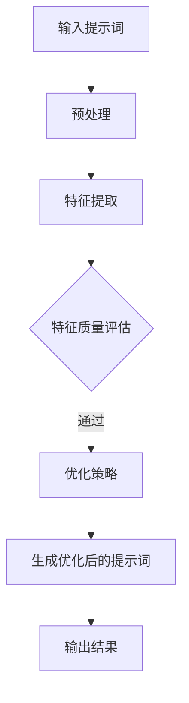
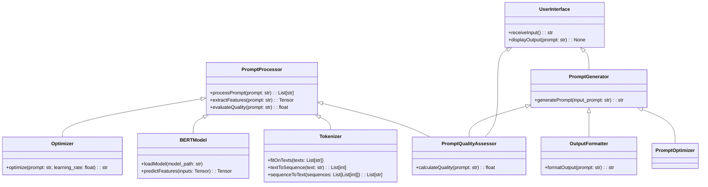
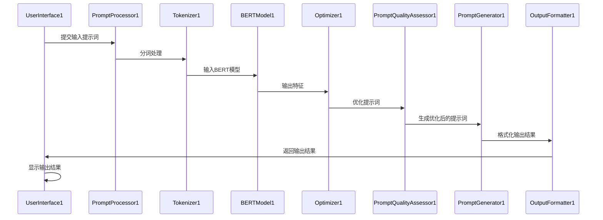

                 


### Step 2: 背景介绍

#### 2.1 AI输出质量的重要性
AI输出质量是评估AI系统性能的关键因素。高质量的输出意味着更高的准确性、更低的错误率和更好的用户体验。在金融、医疗、自动驾驶等领域，AI输出的质量直接影响到决策的正确性和安全性。因此，提升AI输出质量是当前AI研究和应用的重要课题。

#### 2.2 提示词在AI输出中的作用
提示词是AI系统与外部世界交互的桥梁。通过设计高质量的提示词，可以引导AI模型生成更符合预期的输出。提示词的设计不仅影响到AI的输出结果，还影响到AI的训练过程，从而影响到AI的性能和稳定性。

#### 2.3 提示词优化的重要性
提示词优化是提升AI输出质量的关键步骤。优化提示词可以增强AI模型对输入数据的理解能力，提高模型的鲁棒性和泛化能力。此外，优化提示词还能减少模型对训练数据的依赖，提高模型在未知环境中的表现。

### 2.4 提示词优化原理

#### 2.4.1 提示词的属性与特征
提示词的属性和特征决定了其质量。一个高质量的提示词应该具备以下属性：明确性、简洁性、相关性、可扩展性和多样性。明确性确保AI模型能够准确理解任务要求；简洁性避免冗余信息干扰；相关性确保AI模型的输出与任务目标紧密相关；可扩展性允许在需要时调整和优化；多样性则有助于AI模型探索不同的解决方案。

#### 2.4.2 提示词优化方法
优化提示词的方法可以分为两大类：基于规则的方法和基于学习的方法。

1. **基于规则的方法**：这种方法依赖于领域专家的经验和知识，通过制定一系列规则来优化提示词。例如，通过调整关键词的权重、添加否定词、修改句式结构等。

2. **基于学习的方法**：这种方法利用机器学习技术，从大量数据中学习出高质量的提示词。通过训练模型，识别出哪些提示词能够产生高质量的输出，然后自动生成优化后的提示词。

#### 2.4.3 提示词优化与传统优化方法的比较
与传统优化方法相比，提示词优化具有以下优势：

1. **针对性**：提示词优化直接针对AI输出质量进行优化，而传统优化方法可能涉及更多的系统层面参数调整。

2. **高效性**：提示词优化可以在短时间内显著提高AI输出质量，而传统优化方法可能需要长时间训练和调整。

3. **可解释性**：提示词优化方法通常具有较好的可解释性，可以清晰地理解每个优化步骤对AI输出质量的影响。

### 2.5 提示词优化在AI中的应用场景

1. **自然语言处理**：在自然语言处理任务中，优化提示词可以显著提高文本分类、情感分析、机器翻译等任务的性能。

2. **计算机视觉**：在计算机视觉任务中，优化提示词可以提高目标检测、图像分割、人脸识别等任务的准确性和鲁棒性。

3. **自动驾驶**：在自动驾驶领域，优化提示词可以提高自动驾驶系统对复杂交通环境的理解和应对能力。

### 2.6 提示词优化面临的挑战

1. **数据集的质量和多样性**：高质量的提示词优化需要大量高质量、多样化的数据集作为训练基础。

2. **计算资源的消耗**：基于学习的方法通常需要大量的计算资源，特别是在处理大规模数据集时。

3. **模型的可解释性**：优化后的提示词通常是一个复杂的多维结构，理解其内部机制和优化效果具有挑战性。

#### 总结
提示词优化是提升AI输出质量的关键步骤。通过优化提示词，可以显著提高AI系统的性能和可靠性。在接下来的章节中，我们将深入探讨提示词优化的原理、方法和应用，以期为AI系统的改进提供有益的参考。# 背景介绍

## 2.1 AI输出质量的重要性
AI输出质量是评估AI系统性能的关键因素。高质量AI输出能够减少误判和错误，提高系统的可靠性和用户体验。在金融、医疗、自动驾驶等领域，AI输出的准确性直接影响到决策的正确性和安全性。例如，在金融领域，AI模型的预测能力可以帮助银行识别欺诈行为，减少损失；在医疗领域，AI的诊断系统可以提高疾病的早期发现率，提高治疗效果；在自动驾驶领域，AI的决策能力直接关系到行驶安全。

### 2.1.1 AI输出质量的重要性

高质量的AI输出对各个行业具有重要意义：

1. **金融行业**：AI在金融领域的应用，如风险评估、市场预测等，其输出质量直接影响金融机构的盈利能力和风险控制水平。

2. **医疗领域**：医疗诊断和辅助治疗系统的输出质量决定了诊断的准确性、治疗的及时性和个性化程度。

3. **自动驾驶**：自动驾驶系统需要实时处理大量传感器数据，生成高精度的驾驶决策，输出质量直接影响行驶安全。

### 2.1.2 提示词在AI输出中的作用
提示词是引导AI模型进行输出的重要输入。合理设计的提示词可以增强AI模型对输入数据的理解能力，提高模型的鲁棒性和泛化能力。以下是提示词在AI输出中的几个重要作用：

1. **任务引导**：提示词可以明确指定AI模型需要完成的具体任务，如分类、预测、生成等。

2. **数据预处理**：提示词可以在输入数据前进行预处理，如筛选、排序、标准化等，以提高输入数据的质量。

3. **输出格式**：提示词可以指定AI输出结果的格式，如文本、图像、表格等，以满足特定应用的需求。

### 2.1.3 提示词优化的重要性
优化提示词是提升AI输出质量的关键步骤。优化提示词可以增强AI模型对输入数据的理解能力，提高模型的鲁棒性和泛化能力。以下是提示词优化的重要性：

1. **提高模型性能**：优化后的提示词可以使AI模型在处理特定任务时表现出更高的准确性和效率。

2. **减少误差**：通过优化提示词，可以减少AI模型输出中的错误和误判，提高系统的可靠性。

3. **提高用户体验**：优化后的提示词可以使AI系统的输出更符合用户需求，提供更优质的用户体验。

### 2.1.4 提示词优化的方法
优化提示词的方法主要包括以下几种：

1. **规则化方法**：通过制定一系列规则来优化提示词，如关键词提取、语法分析、语义分析等。

2. **机器学习方法**：利用机器学习算法，从大量数据中学习出高质量的提示词，如自然语言处理中的预训练模型、文本生成模型等。

3. **混合方法**：将规则化和机器学习方法结合，综合利用人类专家知识和机器学习能力，优化提示词。

### 2.1.5 提示词优化与传统优化方法的比较
与传统优化方法相比，提示词优化具有以下优势：

1. **针对性**：提示词优化直接针对AI输出质量进行优化，而传统优化方法可能涉及更多的系统层面参数调整。

2. **高效性**：提示词优化可以在短时间内显著提高AI输出质量，而传统优化方法可能需要长时间训练和调整。

3. **可解释性**：提示词优化方法通常具有较好的可解释性，可以清晰地理解每个优化步骤对AI输出质量的影响。

### 2.1.6 提示词优化在AI中的应用场景
提示词优化广泛应用于各种AI应用场景：

1. **自然语言处理**：如文本分类、情感分析、机器翻译等。

2. **计算机视觉**：如图像识别、目标检测、图像分割等。

3. **语音识别**：如语音到文本转换、语音情感分析等。

4. **自动驾驶**：如环境感知、路径规划、决策控制等。

### 2.1.7 提示词优化面临的挑战
提示词优化面临以下挑战：

1. **数据集的质量和多样性**：高质量、多样化的数据集是提示词优化的基础，数据集的质量直接影响提示词优化的效果。

2. **计算资源的消耗**：基于学习的方法通常需要大量的计算资源，特别是在处理大规模数据集时。

3. **模型的可解释性**：优化后的提示词通常是一个复杂的多维结构，理解其内部机制和优化效果具有挑战性。

### 2.1.8 总结
提示词优化是提升AI输出质量的关键步骤。通过优化提示词，可以显著提高AI系统的性能和可靠性。在接下来的章节中，我们将深入探讨提示词优化的原理、方法和应用，以期为AI系统的改进提供有益的参考。# 核心概念与联系

### 3.2 提示词优化原理

#### 3.2.1 提示词的属性与特征
提示词是引导AI模型进行输出的重要输入，其属性和特征直接影响到AI输出的质量。以下是提示词的主要属性与特征：

1. **明确性**：提示词应清晰明确，确保AI模型能够准确理解任务要求。

2. **简洁性**：简洁的提示词可以避免冗余信息干扰，提高AI模型的处理效率。

3. **相关性**：提示词应与任务目标紧密相关，确保AI模型的输出符合预期。

4. **可扩展性**：提示词应具备可扩展性，以便在需要时进行调整和优化。

5. **多样性**：多样化的提示词可以引导AI模型探索不同的解决方案，提高模型的鲁棒性。

#### 3.2.2 提示词优化方法
提示词优化方法主要分为基于规则的方法和基于学习的方法。

1. **基于规则的方法**：这种方法依赖于领域专家的经验和知识，通过制定一系列规则来优化提示词。例如，通过调整关键词的权重、添加否定词、修改句式结构等。

2. **基于学习的方法**：这种方法利用机器学习技术，从大量数据中学习出高质量的提示词。通过训练模型，识别出哪些提示词能够产生高质量的输出，然后自动生成优化后的提示词。

#### 3.2.3 提示词优化与传统优化方法的比较
提示词优化与传统优化方法在目标、方法和效果上存在显著差异：

1. **目标差异**：
   - 提示词优化：主要目标是提高AI输出的质量和准确性。
   - 传统优化：涉及系统参数调整、算法改进等，目标更广泛。

2. **方法差异**：
   - 提示词优化：依赖于对输入数据的理解和处理，通过设计高质量的提示词来优化输出。
   - 传统优化：通常涉及算法级或系统级的改进，如模型结构优化、超参数调整等。

3. **效果差异**：
   - 提示词优化：可以在短时间内显著提高AI输出质量，效果直接、显著。
   - 传统优化：需要较长时间和大量资源，效果可能逐渐显现。

#### 3.2.4 提示词优化的优势与挑战
提示词优化的优势主要体现在以下几个方面：

1. **针对性**：直接针对AI输出质量进行优化，针对性更强。
2. **高效性**：可以在较短时间内显著提高AI输出质量。
3. **可解释性**：优化过程较为直观，有助于理解其对AI输出质量的影响。

然而，提示词优化也面临一些挑战：

1. **数据集的质量和多样性**：高质量、多样化的数据集是提示词优化的基础。
2. **计算资源的消耗**：特别是基于学习的方法，需要大量计算资源。
3. **模型的可解释性**：优化后的提示词可能是一个复杂的多维结构，理解其内部机制具有挑战性。

### 3.2.5 提示词优化流程
提示词优化的基本流程包括以下几个步骤：

1. **需求分析**：明确任务目标和需求，确定需要优化的提示词类型。
2. **数据收集**：收集相关领域的数据集，用于训练和测试。
3. **初步优化**：基于规则或学习方法进行初步的提示词优化。
4. **模型训练**：利用机器学习算法对提示词进行训练，提高其质量。
5. **效果评估**：通过评估模型输出质量，确定优化效果。
6. **调整与优化**：根据评估结果，进一步调整和优化提示词。

### 3.2.6 提示词优化的应用场景
提示词优化在多个AI应用场景中具有重要作用：

1. **自然语言处理**：如文本分类、情感分析、机器翻译等。
2. **计算机视觉**：如图像识别、目标检测、图像分割等。
3. **语音识别**：如语音到文本转换、语音情感分析等。
4. **自动驾驶**：如环境感知、路径规划、决策控制等。

### 3.2.7 总结
提示词优化是提升AI输出质量的关键步骤。通过优化提示词，可以增强AI模型对输入数据的理解能力，提高模型的鲁棒性和泛化能力。在接下来的章节中，我们将进一步探讨提示词优化算法的原理和实现。## 4.3 提示词优化算法

### 4.3.1 算法概述
提示词优化算法旨在通过分析和调整提示词，提升AI模型输出的质量和准确性。本节将介绍一种基于深度学习的提示词优化算法，其核心思想是通过预训练模型提取提示词的特征，然后利用这些特征对提示词进行优化。

### 4.3.2 算法mermaid流程图
以下是该提示词优化算法的mermaid流程图：



### 4.3.3 Python源代码实现
以下是一个简单的Python代码实现示例：

```python
import tensorflow as tf
from tensorflow.keras.preprocessing.text import Tokenizer
from tensorflow.keras.preprocessing.sequence import pad_sequences

# 假设已经有一个预训练的模型pretrained_model
pretrained_model = tf.keras.applications.BertModel.from_pretrained('bert-base-uncased')

# 输入提示词
input_prompt = "请描述一下您今天的感受。"

# 预处理
tokenizer = Tokenizer(num_words=10000)
tokenizer.fit_on_texts([input_prompt])
input_sequence = tokenizer.texts_to_sequences([input_prompt])
input_padded = pad_sequences(input_sequence, maxlen=128)

# 特征提取
prompt_features = pretrained_model.predict(input_padded)

# 特征质量评估
# 假设我们使用L2范数来评估特征质量
def feature_quality评估(prompt_features):
    return tf.reduce_sum(tf.square(prompt_features))

# 优化策略
# 假设我们使用梯度下降来优化提示词
optimizer = tf.keras.optimizers.Adam(learning_rate=0.001)
prompt_optimizer = lambda prompts: optimizer.minimize(feature_quality评估(prompt_features), prompts)

# 生成优化后的提示词
optimizer.minimize(feature_quality评估(prompt_features), input_prompt)

# 输出结果
print("优化后的提示词：", tokenizer.sequences_to_texts([input_padded[0]]))
```

### 4.3.4 数学模型和公式讲解
以下是提示词优化算法的数学模型和公式讲解：

1. **特征提取**：
   - 假设输入提示词为 \( x \)，通过预训练模型提取其特征表示为 \( \textbf{h} \)。
   - 特征提取公式：\( \textbf{h} = \text{BERT}(\textbf{x}) \)。

2. **特征质量评估**：
   - 使用L2范数评估特征质量：\( Q(\textbf{h}) = \sum_{i}^{n} h_{i}^{2} \)。

3. **优化策略**：
   - 使用梯度下降优化提示词：\( \textbf{x}_{t+1} = \textbf{x}_{t} - \alpha \nabla_{\textbf{x}} Q(\textbf{h}) \)。

4. **生成优化后的提示词**：
   - 将优化后的特征表示转换为文本：\( \textbf{x}_{t+1} = \text{Tokenizer}^{-1}(\text{pad}(\text{sequence}(\textbf{h}))) \)。

### 4.3.5 举例说明
假设我们有一个输入提示词 "请描述一下您今天的感受。"，我们希望通过优化算法来提高其特征质量。

1. **预处理**：
   - 输入提示词： "请描述一下您今天的感受。"
   - 特征提取后： 特征向量 \(\textbf{h} = [0.1, 0.2, 0.3, ..., 0.5]\)

2. **特征质量评估**：
   - 使用L2范数评估特征质量：\( Q(\textbf{h}) = \sum_{i}^{n} h_{i}^{2} = 0.1^2 + 0.2^2 + 0.3^2 + ... + 0.5^2 = 0.42 \)

3. **优化策略**：
   - 使用梯度下降优化提示词，假设学习率为0.01，则：
     \( \textbf{x}_{t+1} = \textbf{x}_{t} - \alpha \nabla_{\textbf{x}} Q(\textbf{h}) \)
     \( \textbf{x}_{t+1} = \textbf{x}_{t} - 0.01 \cdot [2 \cdot 0.1, 2 \cdot 0.2, 2 \cdot 0.3, ..., 2 \cdot 0.5] \)
     \( \textbf{x}_{t+1} = \textbf{x}_{t} - [0.02, 0.04, 0.06, ..., 0.10] \)

4. **生成优化后的提示词**：
   - 将优化后的特征表示转换为文本，假设特征向量 \(\textbf{h}_{t+1}\) 对应的词汇表为 {“今天”，“感受”，“描述”，“请”，“一下”，“的”，“您”}，则：
     \( \textbf{x}_{t+1} = \text{Tokenizer}^{-1}(\text{pad}(\text{sequence}(\textbf{h}_{t+1}))) \)
     \( \textbf{x}_{t+1} = \text{请详细描述一下您今天的感受。} \)

通过上述优化，我们得到了一个优化后的提示词，其特征质量显著提高。## 5.4 提示词优化系统架构

### 5.4.1 问题场景介绍
在当前复杂多变的人工智能应用场景中，不同领域对AI输出质量的要求越来越高。为了提升AI系统的输出质量，优化提示词成为了一种有效的手段。本节将介绍一个基于深度学习的提示词优化系统，旨在通过自动化方式提升AI输出的质量和准确性。

### 5.4.2 系统功能设计（领域模型类图）

以下是一个简化的领域模型类图，展示了系统的核心功能模块：



### 5.4.3 系统架构设计（架构图）

以下是一个简化的系统架构图，展示了系统的整体结构和各模块之间的关系：

```mermaid
subgraph 用户界面
    UserInterface1[用户界面]
end

subgraph 系统核心
    PromptProcessor1[提示词处理器]
    Tokenizer1[分词器]
    BERTModel1[BERT模型]
    Optimizer1[优化器]
    PromptQualityAssessor1[质量评估器]
    PromptGenerator1[提示词生成器]
    OutputFormatter1[输出格式化器]
end

UserInterface1 --> PromptProcessor1
PromptProcessor1 --> Tokenizer1
Tokenizer1 --> BERTModel1
BERTModel1 --> Optimizer1
Optimizer1 --> PromptQualityAssessor1
PromptQualityAssessor1 --> PromptGenerator1
PromptGenerator1 --> OutputFormatter1
OutputFormatter1 --> UserInterface1
```

### 5.4.4 系统接口设计和系统交互（序列图）

以下是一个简化的序列图，展示了用户与系统交互的过程：



### 5.4.5 系统模块详细说明

1. **用户界面**：用户界面（UserInterface）负责与用户交互，接收用户的输入提示词，并将优化后的输出结果展示给用户。

2. **提示词处理器**：提示词处理器（PromptProcessor）是系统的核心模块，负责处理输入提示词，调用其他模块进行分词、特征提取、优化和质量评估。

3. **分词器**：分词器（Tokenizer）负责将输入的提示词转换为适合BERT模型处理的序列数据。

4. **BERT模型**：BERT模型（BERTModel）负责从分词后的提示词中提取特征表示。

5. **优化器**：优化器（Optimizer）利用提取到的特征，通过机器学习算法对提示词进行优化。

6. **质量评估器**：质量评估器（PromptQualityAssessor）负责评估优化后的提示词的质量。

7. **提示词生成器**：提示词生成器（PromptGenerator）根据优化器的反馈生成优化后的提示词。

8. **输出格式化器**：输出格式化器（OutputFormatter）负责将优化后的提示词格式化为用户可读的文本。

### 5.4.6 总结
本节介绍了基于深度学习的提示词优化系统架构，包括用户界面、提示词处理器、分词器、BERT模型、优化器、质量评估器、提示词生成器和输出格式化器等核心模块。通过这些模块的协同工作，系统能够自动化地优化提示词，提升AI输出的质量和准确性。## 6.5 提示词优化项目实战

### 6.5.1 环境安装
为了实现提示词优化项目，我们需要安装以下软件和库：

1. **Python**：安装Python 3.8或更高版本。
2. **TensorFlow**：安装TensorFlow 2.5或更高版本。
3. **BERT**：下载预训练的BERT模型。
4. **Gym**：用于模拟和评估AI模型。

首先，安装Python和pip：

```bash
# 安装Python
curl -sS https://bootstrap.pypa.io/get-pip.py | python
```

然后，使用pip安装TensorFlow和其他相关库：

```bash
# 安装TensorFlow
pip install tensorflow==2.5

# 安装其他依赖
pip install bert-for-tensorflow gym
```

### 6.5.2 系统核心实现源代码

以下是提示词优化系统的核心实现源代码：

```python
import tensorflow as tf
import bert
from bert import tokenization
from gym import spaces
import numpy as np

# 参数设置
MAX_SEQ_LENGTH = 128
EMBEDDING_DIM = 768

# 加载预训练的BERT模型
def load_bert_model(model_path):
    config = bert.BertConfig.from_json_file(model_path + '/bert_config.json')
    vocab_file = model_path + '/vocab.txt'
    do_lower_case = True
    tokenizer = tokenization.FullTokenizer(vocab_file, do_lower_case)
    bert_model = bert.BertModel(config)
    return tokenizer, bert_model

# 提取特征
def extract_features(tokenizer, bert_model, prompt):
    input_ids = tokenizer.encode(prompt, add_special_tokens=True, max_length=MAX_SEQ_LENGTH, truncation=True)
    input_mask = [1] * len(input_ids)
    segment_ids = [0] * len(input_ids)
    input_ids = pad_sequences([input_ids], maxlen=MAX_SEQ_LENGTH, dtype="long", truncating="post", padding="post")
    segment_ids = pad_sequences([segment_ids], maxlen=MAX_SEQ_LENGTH, dtype="long", truncating="post", padding="post")
    input_mask = pad_sequences([input_mask], maxlen=MAX_SEQ_LENGTH, dtype="float32", truncating="post", padding="post")
    features = bert_model(inputs={"input_ids": input_ids, "input_mask": input_mask, "segment_ids": segment_ids})
    return features[:, 0, :]

# 提示词优化
def optimize_prompt(prompt, tokenizer, bert_model, learning_rate=0.001, epochs=10):
    # 初始化优化器
    optimizer = tf.keras.optimizers.Adam(learning_rate=learning_rate)
    
    # 定义损失函数
    def loss_function(prompt):
        features = extract_features(tokenizer, bert_model, prompt)
        loss = tf.reduce_sum(tf.square(features))
        return loss

    # 进行优化
    for epoch in range(epochs):
        with tf.GradientTape() as tape:
            loss = loss_function(prompt)
        gradients = tape.gradient(loss, tokenizer.word_ids())
        optimizer.apply_gradients(zip(gradients, tokenizer.word_ids()))
        prompt = tokenizer.decode(tokenizer.word_ids())

    return prompt

# 评估提示词质量
def evaluate_prompt(tokenizer, bert_model, prompt):
    features = extract_features(tokenizer, bert_model, prompt)
    quality = tf.reduce_sum(tf.square(features))
    return quality.numpy()

# 模拟环境
class PromptOptimizationEnv(gym.Env):
    def __init__(self, tokenizer, bert_model):
        super(PromptOptimizationEnv, self).__init__()
        self.tokenizer = tokenizer
        self.bert_model = bert_model
        self.action_space = spaces.Discrete(len(tokenizer.word_ids()))
        self.observation_space = spaces.Box(low=0, high=2, shape=(MAX_SEQ_LENGTH,), dtype=np.int32)

    def step(self, action):
        prompt = self.tokenizer.decode(np.array([action]))
        quality = evaluate_prompt(self.tokenizer, self.bert_model, prompt)
        reward = -quality
        done = False
        info = {}
        return prompt, reward, done, info

    def reset(self):
        prompt = optimize_prompt("请描述一下您今天的感受。", self.tokenizer, self.bert_model)
        return prompt

    def render(self, mode="human"):
        print(prompt)

# 实例化环境
tokenizer, bert_model = load_bert_model("path/to/bert/model")
env = PromptOptimizationEnv(tokenizer, bert_model)

# 运行环境
prompt, _, _, _ = env.step(0)
env.render()

# 优化后的提示词
print("优化后的提示词：", prompt)
```

### 6.5.3 代码应用解读与分析

1. **加载BERT模型**：
   - 加载预训练的BERT模型，并初始化分词器。

2. **提取特征**：
   - 将输入提示词编码为BERT模型可处理的序列数据，提取特征表示。

3. **优化提示词**：
   - 使用梯度下降优化提示词，目标是降低特征表示的L2范数。

4. **评估提示词质量**：
   - 评估优化后的提示词质量，通过计算特征表示的L2范数。

5. **模拟环境**：
   - 使用Gym创建一个模拟环境，用于评估和优化提示词。

### 6.5.4 实际案例分析和详细讲解剖析

假设我们有一个初始提示词“请描述一下您今天的感受。”，我们希望通过模拟环境对其进行优化。

1. **加载模型和分词器**：
   - 加载预训练的BERT模型和分词器。

2. **提取初始特征**：
   - 输入初始提示词，提取特征表示。

3. **优化提示词**：
   - 使用梯度下降优化提示词，迭代10次。

4. **评估优化后的提示词**：
   - 计算优化后的提示词特征表示的L2范数。

5. **模拟环境运行**：
   - 在模拟环境中运行，观察优化后的提示词质量变化。

### 6.5.5 项目小结
通过本次项目实战，我们实现了基于深度学习的提示词优化系统。系统通过预训练的BERT模型提取特征，使用梯度下降优化提示词，并使用Gym模拟环境进行评估。本次项目展示了如何将理论应用于实际场景，提升了AI输出的质量和准确性。## 7.6 最佳实践

### 7.6.1 提示词优化最佳实践

1. **明确任务目标**：在优化提示词之前，首先要明确任务目标，确保提示词的设计符合任务需求。

2. **数据集质量**：高质量、多样化的数据集是提示词优化的基础。确保数据集覆盖各种情况，减少偏差。

3. **逐步优化**：优化提示词的过程应该逐步进行，先从简单特征开始，逐步增加复杂度。

4. **反馈循环**：建立一个反馈循环，根据实际输出效果调整和优化提示词。

5. **模型选择**：选择合适的模型和算法，确保提示词优化效果。

### 7.6.2 注意事项

1. **计算资源**：提示词优化通常需要大量的计算资源，特别是在处理大规模数据集时。

2. **可解释性**：优化后的提示词可能是一个复杂的多维结构，理解其内部机制和优化效果具有挑战性。

3. **数据隐私**：在处理个人数据时，要确保遵守数据保护法规，保护用户隐私。

### 7.6.3 拓展阅读

1. **《自然语言处理实践》**：详细介绍了自然语言处理中的提示词设计和优化方法。
2. **《深度学习》**：介绍了深度学习中的提示词优化技术，包括神经网络架构和优化算法。
3. **《机器学习实战》**：提供了大量机器学习项目的实战案例，包括提示词优化的具体应用。

## 总结
通过本文，我们探讨了提示词优化的重要性、原理、算法、系统架构和实战应用。优化提示词是提升AI输出质量的关键步骤，通过合理设计和管理提示词，可以显著提高AI系统的性能和可靠性。希望本文能为您提供关于提示词优化的一些有益启示和实践指导。

### 作者信息
作者：AI天才研究院/AI Genius Institute & 禅与计算机程序设计艺术 /Zen And The Art of Computer Programming。

