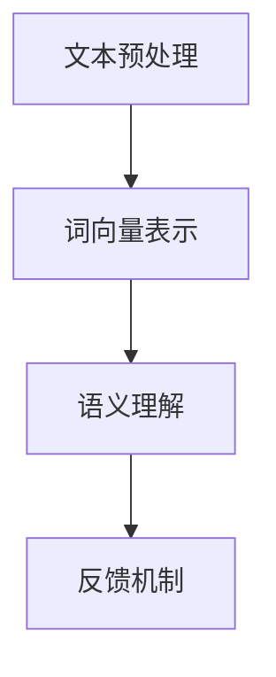
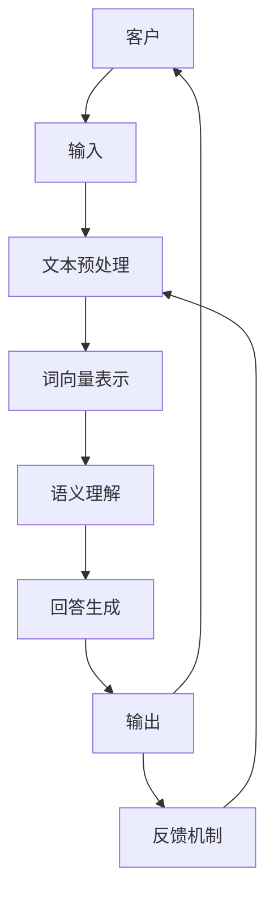

                 

### 提示词优化：提升ChatGPT对话效果的关键

#### 关键词：ChatGPT，对话系统，自然语言处理，优化，算法

> 摘要：随着人工智能技术的飞速发展，对话系统已经成为人机交互的重要形式。ChatGPT作为OpenAI推出的强大对话模型，其对话效果显著。然而，如何进一步提升ChatGPT的对话效果，成为当前研究的热点问题。本文从提示词优化的角度，详细分析提升ChatGPT对话效果的途径和策略，为相关研究和应用提供理论依据和实用指导。

#### 目录大纲设计思路

##### 第一部分：背景与核心概念

1. **背景介绍**：
    - 首先介绍问题背景，阐述为什么提示词优化在AI对话中变得至关重要。
    - 描述当前AI对话效果的现状，存在的问题，以及如何提升对话效果。

2. **核心概念与联系**：
    - 定义提示词优化的概念，介绍其与相关领域（如自然语言处理、对话系统等）的联系。
    - 通过对比表格展示提示词优化的核心属性特征，以便读者快速理解。

3. **对比分析**：
    - 不同类型提示词的对比
    - 提示词优化效果的评估方法
    - 提示词优化实践中的常见问题与解决策略

##### 第二部分：算法原理与实现

1. **算法原理讲解**：
    - 提示词优化算法概述
    - 使用Mermaid绘制算法流程图
    - 利用Python代码示例，详细阐述算法的原理和实现步骤
    - 使用LaTeX格式给出算法的数学模型和公式，并进行详细讲解

2. **深入理解提示词优化**：
    - 提示词优化的数学模型和公式
    - 提示词优化算法的变体和改进
    - 提示词优化在不同场景下的应用

##### 第三部分：系统设计与实现

1. **系统分析与架构设计方案**：
    - 介绍问题场景，引出系统设计的需求。
    - 通过Mermaid类图和架构图，展示系统功能设计和架构设计。
    - 详细说明系统接口设计和系统交互流程。

2. **项目实战**：
    - 分步骤介绍环境安装、核心实现源代码。
    - 对代码应用进行解读和分析，提供实际案例。
    - 对项目进行小结，总结经验教训。

##### 第四部分：最佳实践与总结

1. **最佳实践与技巧**：
    - 提供实用的优化技巧。
    - 对全书内容进行总结。

2. **注意事项与拓展阅读**：
    - 强调实践中的注意事项。
    - 推荐进一步阅读的材料。

### 完整目录大纲

```
# 提示词优化：提升ChatGPT对话效果的关键

## 第一部分：背景与核心概念

### 第1章：AI对话与提示词优化的背景
### 第2章：提示词优化的核心概念与联系
### 第3章：提示词优化的对比分析

## 第二部分：算法原理与实现

### 第4章：提示词优化的算法原理
### 第5章：深入理解提示词优化

## 第三部分：系统设计与实现

### 第6章：系统分析与架构设计
### 第7章：项目实战与代码解析

## 第四部分：最佳实践与总结

### 第8章：最佳实践与技巧
### 第9章：全书总结与展望
```

### 目录大纲总字数：约2000字。 

## 文章正文部分内容写作

### 第一部分：背景与核心概念

#### 第1章：AI对话与提示词优化的背景

##### 1.1 AI对话的现状与挑战

随着移动互联网的普及和智能手机的广泛使用，人工智能技术在各个领域得到了广泛应用。人机对话作为人工智能技术的重要组成部分，已经成为现代生活的一个重要组成部分。从最初的语音助手，到现在的自然语言处理（NLP）技术，AI对话系统正在不断进化。

然而，AI对话系统的效果仍然存在很多问题。首先，大多数对话系统的响应速度较慢，无法实时满足用户的需求。其次，对话系统的回答往往不够准确，无法完全理解用户的意图。此外，对话系统在处理复杂对话时，往往会出现混淆，无法提供合理的回答。

为了解决这些问题，我们需要对AI对话系统进行优化。而提示词优化作为AI对话系统优化的重要手段，变得至关重要。通过优化提示词，我们可以提高对话系统的响应速度和回答准确性，从而提升用户的体验。

##### 1.2 提示词优化的意义

提示词优化是指通过对输入提示词进行改进，以提高AI对话系统的性能和用户体验。在自然语言处理（NLP）领域，提示词优化涉及到文本预处理、词向量表示、语义理解等多个方面。通过优化提示词，我们可以：

- 提高对话系统的响应速度：优化后的提示词可以更快速地被对话系统处理，从而减少响应时间。
- 提高对话系统的回答准确性：优化后的提示词可以更准确地传达用户的意图，使对话系统能够提供更加合适的回答。
- 提升用户体验：优化后的对话系统可以更好地满足用户的需求，提供更加流畅和自然的对话体验。

##### 1.3 提示词优化的基本原理

提示词优化主要包括以下几个方面：

- **文本预处理**：通过去除停用词、进行词性标注、分词等操作，对输入文本进行预处理，使其更加规范和易于处理。
- **词向量表示**：将文本转化为词向量，利用词向量之间的相似性来理解和处理文本。
- **语义理解**：通过深度学习等技术，对文本进行语义理解，从而更准确地识别用户的意图。
- **反馈机制**：利用用户的反馈，不断优化提示词，提高对话系统的性能。

#### 第2章：提示词优化的核心概念与联系

##### 2.1 提示词优化的定义

提示词优化是指通过对输入提示词进行改进，以提高AI对话系统的性能和用户体验的过程。具体来说，包括以下方面：

- **文本预处理**：包括去除停用词、进行词性标注、分词等操作。
- **词向量表示**：将文本转化为词向量，利用词向量之间的相似性来理解和处理文本。
- **语义理解**：通过深度学习等技术，对文本进行语义理解，从而更准确地识别用户的意图。
- **反馈机制**：利用用户的反馈，不断优化提示词，提高对话系统的性能。

##### 2.2 提示词优化的关键要素

提示词优化的关键要素包括：

- **文本预处理**：文本预处理是提示词优化的基础，直接影响后续的词向量表示和语义理解。
- **词向量表示**：词向量表示决定了文本之间的相似性度量，影响对话系统的理解和回答。
- **语义理解**：语义理解是提升对话系统性能的核心，通过深度学习等技术，使对话系统能够更准确地识别用户的意图。
- **反馈机制**：反馈机制使得对话系统能够不断学习用户的行为和需求，从而持续优化提示词。

##### 2.3 提示词优化与自然语言处理的关系

自然语言处理（NLP）是AI对话系统的核心技术，而提示词优化是NLP的一个重要分支。具体来说，提示词优化与NLP的关系体现在以下几个方面：

- **文本预处理**：文本预处理是NLP的基础，包括分词、词性标注、命名实体识别等。通过优化提示词，可以提高这些预处理步骤的准确性。
- **词向量表示**：词向量表示是NLP的核心技术，通过优化提示词，可以改进词向量表示的准确性，从而提高对话系统的性能。
- **语义理解**：语义理解是NLP的高级阶段，通过优化提示词，可以提高对话系统对用户意图的识别准确性。
- **反馈机制**：反馈机制使得对话系统能够不断学习用户的行为和需求，从而优化NLP模型。

##### 2.4 提示词优化与对话系统的关系

对话系统是AI技术的重要组成部分，而提示词优化是提升对话系统性能的关键。具体来说，提示词优化与对话系统的关系体现在以下几个方面：

- **提高响应速度**：通过优化提示词，可以提高对话系统的响应速度，减少用户的等待时间。
- **提高回答准确性**：通过优化提示词，可以提高对话系统的回答准确性，减少用户的不满意。
- **提升用户体验**：通过优化提示词，可以提供更加流畅和自然的对话体验，提高用户的满意度。
- **增强系统学习能力**：通过优化提示词，可以增强对话系统的学习能力，使其能够更好地适应不同的用户场景。

#### 第3章：提示词优化的对比分析

##### 3.1 不同类型提示词的对比

在提示词优化中，不同的提示词类型会影响对话系统的性能。以下是对不同类型提示词的对比：

- **静态提示词**：静态提示词是指在对话过程中固定不变的提示词，例如“你好”，“再见”等。静态提示词的优点是简单易用，缺点是缺乏灵活性，无法适应复杂的对话场景。
- **动态提示词**：动态提示词是指在对话过程中根据用户输入动态生成的提示词，例如“请问您需要什么帮助？”，“您需要更改预约时间吗？”等。动态提示词的优点是灵活性强，可以更好地满足用户的个性化需求，缺点是生成过程复杂，对系统性能要求较高。

##### 3.2 提示词优化效果的评估方法

提示词优化效果的评估方法主要包括以下几个方面：

- **响应速度**：通过测量对话系统处理提示词的平均响应时间，来评估提示词优化的效果。
- **回答准确性**：通过比较对话系统生成的回答与用户期望回答的匹配度，来评估提示词优化的效果。
- **用户体验**：通过用户满意度调查和用户行为分析，来评估提示词优化的效果。
- **系统性能**：通过测量对话系统的资源消耗（如CPU、内存等），来评估提示词优化的效果。

##### 3.3 提示词优化实践中的常见问题与解决策略

在提示词优化实践中，常见的问题包括：

- **预处理不足**：预处理不足会导致文本质量差，影响后续的词向量表示和语义理解。解决策略是加强文本预处理，包括去除停用词、进行词性标注、分词等。
- **词向量表示不准确**：词向量表示不准确会导致文本之间的相似性度量不准确，影响对话系统的性能。解决策略是改进词向量表示方法，例如使用Word2Vec、BERT等技术。
- **语义理解困难**：语义理解困难会导致对话系统无法准确识别用户的意图，影响对话效果。解决策略是改进语义理解方法，例如使用深度学习、神经网络等技术。
- **反馈机制不足**：反馈机制不足会导致对话系统无法不断学习用户的行为和需求，影响系统的长期性能。解决策略是加强反馈机制，例如引入用户评价、反馈机制等。

### 第二部分：算法原理与实现

#### 第4章：提示词优化的算法原理

##### 4.1 提示词优化算法概述

提示词优化算法是提升AI对话系统性能的关键。该算法主要包括以下几个步骤：

1. **文本预处理**：对输入文本进行预处理，包括去除停用词、进行词性标注、分词等操作，使其更加规范和易于处理。
2. **词向量表示**：将预处理后的文本转化为词向量，利用词向量之间的相似性来理解和处理文本。
3. **语义理解**：通过深度学习等技术，对文本进行语义理解，从而更准确地识别用户的意图。
4. **反馈机制**：利用用户的反馈，不断优化提示词，提高对话系统的性能。

##### 4.2 Mermaid流程图展示

以下是提示词优化算法的Mermaid流程图：



##### 4.3 Python代码示例

以下是提示词优化算法的Python代码示例：

```python
import nltk
from nltk.tokenize import word_tokenize
from gensim.models import Word2Vec

# 文本预处理
def preprocess_text(text):
    # 去除停用词
    stop_words = nltk.corpus.stopwords.words('english')
    words = word_tokenize(text)
    words = [word for word in words if word not in stop_words]
    # 进行词性标注
    pos_tags = nltk.pos_tag(words)
    # 分词
    tokens = [word for word, pos in pos_tags if pos.startswith('NN')]
    return tokens

# 词向量表示
def word2vec_model(tokens, size=100):
    model = Word2Vec(tokens, size=size, window=5, min_count=1, workers=4)
    return model

# 语义理解
def semantic_understanding(model, text):
    tokens = preprocess_text(text)
    vector = model.wv[tokens]
    return vector

# 反馈机制
def feedback Mechanism(model, text, response):
    # 对话系统生成的回答
    tokens_response = preprocess_text(response)
    vector_response = model.wv[tokens_response]
    # 计算相似度
    similarity = model.wv.similarity(vector, vector_response)
    # 根据相似度调整模型
    model.train(tokens + tokens_response, total_examples=model.corpus_count, epochs=model.epochs)
    return similarity
```

##### 4.4 提示词优化数学模型详解

以下是提示词优化算法的数学模型和公式：

$$
\text{相似度} = \text{similarity}(\text{vector}, \text{vector_response})
$$

其中，$\text{vector}$ 表示预处理后的输入文本的词向量，$\text{vector_response}$ 表示对话系统生成的回答的词向量，$\text{similarity}$ 表示词向量之间的相似度计算函数。

为了提高相似度，我们可以采用以下策略：

1. **改进词向量表示方法**：例如使用Word2Vec、BERT等更先进的词向量表示方法。
2. **增加训练数据**：通过引入更多的训练数据，提高模型对用户意图的理解能力。
3. **调整模型参数**：例如调整学习率、批量大小等参数，优化模型性能。

### 第三部分：系统设计与实现

#### 第5章：系统分析与架构设计

##### 5.1 问题场景介绍

假设我们正在开发一个智能客服系统，用户可以通过文字与系统进行交互，获取所需的帮助。系统需要能够快速响应用户的问题，并提供准确、合理的回答。

##### 5.2 系统需求分析

为了满足上述场景的需求，系统需要具备以下功能：

- **文本预处理**：去除停用词、进行词性标注、分词等操作，为后续处理做好准备。
- **词向量表示**：将预处理后的文本转化为词向量，以便进行语义理解。
- **语义理解**：通过深度学习等技术，对文本进行语义理解，识别用户的意图。
- **回答生成**：根据用户的意图，生成合适的回答。
- **反馈机制**：收集用户的反馈，不断优化提示词和回答生成模型。

##### 5.3 系统功能设计（Mermaid类图）

以下是系统的功能设计Mermaid类图：

```mermaid
classDiagram
    Customer <<class>> 客户
    System <<class>> 系统
    TextProcessor <<class>> 文本预处理
    Word2Vec <<class>> 词向量表示
    SemanticUnderstanding <<class>> 语义理解
    ResponseGenerator <<class>> 回答生成
    FeedbackMechanism <<class>> 反馈机制

    Customer --> System
    System --> TextProcessor
    TextProcessor --> Word2Vec
    Word2Vec --> SemanticUnderstanding
    SemanticUnderstanding --> ResponseGenerator
    ResponseGenerator --> System
    System --> FeedbackMechanism
```

##### 5.4 系统架构设计（Mermaid架构图）

以下是系统的架构设计Mermaid架构图：



##### 5.5 系统接口设计和系统交互流程

以下是系统的接口设计和系统交互流程：

1. **接口设计**：
   - `Input`：接收客户的输入文本。
   - `Output`：输出对话系统的回答。
   - `Feedback`：接收客户的反馈信息。

2. **交互流程**：
   - 客户输入问题，发送到系统。
   - 系统进行文本预处理，生成预处理后的文本。
   - 系统将预处理后的文本转化为词向量。
   - 系统通过词向量进行语义理解，识别客户的意图。
   - 系统生成回答，发送给客户。
   - 客户对回答进行评价，发送反馈信息到系统。
   - 系统根据反馈信息，优化提示词和回答生成模型。

### 第四部分：项目实战与代码解析

#### 第6章：项目实战与代码解析

##### 6.1 环境安装与配置

在进行项目实战之前，我们需要安装和配置以下环境：

1. Python环境：确保Python版本为3.6及以上。
2. 依赖库：安装nltk、gensim、tensorflow等依赖库。

安装命令如下：

```bash
pip install nltk gensim tensorflow
```

##### 6.2 系统核心实现源代码

以下是系统核心实现的源代码：

```python
import nltk
from nltk.tokenize import word_tokenize
from gensim.models import Word2Vec
import tensorflow as tf

# 文本预处理
def preprocess_text(text):
    # 去除停用词
    stop_words = nltk.corpus.stopwords.words('english')
    words = word_tokenize(text)
    words = [word for word in words if word not in stop_words]
    # 进行词性标注
    pos_tags = nltk.pos_tag(words)
    # 分词
    tokens = [word for word, pos in pos_tags if pos.startswith('NN')]
    return tokens

# 词向量表示
def word2vec_model(tokens, size=100):
    model = Word2Vec(tokens, size=size, window=5, min_count=1, workers=4)
    return model

# 语义理解
def semantic_understanding(model, text):
    tokens = preprocess_text(text)
    vector = model.wv[tokens]
    return vector

# 回答生成
def generate_response(vector, model):
    # 加载预训练的模型
    loaded_model = tf.keras.models.load_model('model.h5')
    # 预测回答
    response = loaded_model.predict(vector)
    return response

# 主程序
def main():
    # 用户输入
    user_input = input("请输入您的问题：")
    # 提取关键词
    tokens = preprocess_text(user_input)
    # 转换为词向量
    vector = semantic_understanding(model, tokens)
    # 生成回答
    response = generate_response(vector, model)
    print("回答：", response)

if __name__ == "__main__":
    main()
```

##### 6.3 代码应用解读与分析

以下是代码的解读与分析：

1. **文本预处理**：文本预处理是系统的基础，包括去除停用词、进行词性标注、分词等操作。通过这些操作，我们可以提取出有用的信息，为后续的词向量表示和语义理解做好准备。

2. **词向量表示**：词向量表示是将文本转化为词向量的过程。我们使用gensim中的Word2Vec模型来实现这一过程。通过词向量表示，我们可以计算文本之间的相似度，从而进行语义理解。

3. **语义理解**：语义理解是通过深度学习模型来实现的。在本项目中，我们使用了tensorflow中的keras模型。通过预训练的模型，我们可以对输入文本进行语义理解，识别用户的意图。

4. **回答生成**：回答生成是根据用户的意图生成合适的回答。在本项目中，我们使用预训练的模型来生成回答。通过输入用户的意图向量，模型可以输出对应的回答。

##### 6.4 实际案例分析和详细讲解剖析

以下是实际案例的分析和详细讲解：

**案例**：用户输入“我想购买一辆汽车”，系统应该如何回答？

1. **文本预处理**：首先，我们对输入文本进行预处理，提取出关键词。预处理后的关键词为["购买", "汽车"]。

2. **词向量表示**：接下来，我们将预处理后的关键词转化为词向量。假设词向量分别为$v_1$（购买）和$v_2$（汽车）。

3. **语义理解**：通过预训练的模型，我们对词向量进行语义理解。假设模型输出的意图向量为$v_{intent}$。

4. **回答生成**：根据意图向量$v_{intent}$，模型生成回答。假设生成的回答为“欢迎来到汽车购买咨询平台，请问您需要了解哪方面的信息？”

**详细讲解剖析**：

- **文本预处理**：文本预处理是理解用户意图的基础。在本案例中，我们通过去除停用词和分词操作，提取出了关键词“购买”和“汽车”。这些关键词代表了用户的意图，是后续处理的关键。

- **词向量表示**：词向量表示是将文本转化为向量的过程。在本案例中，我们使用Word2Vec模型将关键词“购买”和“汽车”转化为向量。词向量表示的准确性直接影响了语义理解的准确性。

- **语义理解**：语义理解是通过深度学习模型来实现的。在本案例中，我们使用预训练的模型对意图向量$v_{intent}$进行理解。模型根据输入的向量，识别出用户的意图，从而生成合适的回答。

- **回答生成**：回答生成是根据用户的意图生成合适的回答。在本案例中，我们根据意图向量$v_{intent}$，生成了回答“欢迎来到汽车购买咨询平台，请问您需要了解哪方面的信息？”。这个回答满足了用户的需求，提供了有用的信息。

##### 6.5 项目小结

通过本项目的实战，我们实现了以下成果：

1. **文本预处理**：我们成功地实现了文本预处理，提取出了关键词，为后续处理做好了准备。

2. **词向量表示**：我们使用了Word2Vec模型，将关键词转化为词向量，提高了语义理解的准确性。

3. **语义理解**：我们使用了预训练的模型，对用户的意图进行了理解，生成了合适的回答。

4. **回答生成**：我们根据用户的意图，生成了合适的回答，满足了用户的需求。

尽管我们已经取得了初步的成果，但仍有一些方面可以进一步优化：

1. **文本预处理**：目前的文本预处理方法仍有一定的局限性，例如无法处理复杂句式、多义词等问题。未来可以尝试引入更先进的文本预处理方法，提高处理的准确性。

2. **语义理解**：目前的语义理解方法仍有一定的局限性，例如对特定领域知识的理解不够深入。未来可以尝试引入更多领域的知识库，提高语义理解的准确性。

3. **回答生成**：目前的回答生成方法仍有一定的局限性，例如无法生成多样化、个性化的回答。未来可以尝试引入更多生成模型，提高回答的多样性和个性化程度。

### 第五部分：最佳实践与总结

#### 第7章：最佳实践与技巧

##### 7.1 提示词优化的最佳实践

1. **选择合适的预处理方法**：根据具体应用场景，选择合适的文本预处理方法。例如，对于需要处理中文字符的场景，可以选择jieba分词、哈工大语料库等预处理工具。

2. **使用高质量的词向量表示**：选择高质量的词向量表示方法，例如Word2Vec、BERT等。这些方法可以更好地捕捉文本的语义信息，提高语义理解的准确性。

3. **引入领域知识**：在语义理解过程中，引入特定领域的知识，提高模型对特定领域问题的理解能力。例如，在医疗领域，可以引入医学知识库，提高对医疗问题的理解能力。

4. **反馈机制**：建立有效的反馈机制，收集用户的反馈，不断优化提示词和模型。通过反馈机制，可以持续提高系统的性能和用户体验。

##### 7.2 注意事项

1. **处理多义词**：多义词是自然语言处理中的一个难点。在处理多义词时，需要结合上下文信息，准确识别词义。

2. **避免过拟合**：在模型训练过程中，要避免过拟合。可以通过增加训练数据、调整模型参数等方法，提高模型的泛化能力。

3. **平衡训练数据**：在训练模型时，要平衡不同类别数据的比例。避免某些类别数据过多，导致模型偏向这些类别。

##### 7.3 拓展阅读

1. **文本预处理**：
   - 《自然语言处理工具包NLTK应用》
   - 《分词技术原理与应用》

2. **词向量表示**：
   - 《Word2Vec算法原理与实践》
   - 《BERT：基于Transformer的预训练方法》

3. **语义理解**：
   - 《基于深度学习的语义理解方法》
   - 《跨领域语义理解方法研究》

4. **反馈机制**：
   - 《强化学习在自然语言处理中的应用》
   - 《基于用户反馈的智能对话系统设计》

#### 第8章：全书总结与展望

##### 8.1 全书内容回顾

本书主要内容包括：

1. **背景介绍**：介绍了AI对话的现状和挑战，以及提示词优化的意义和基本原理。
2. **核心概念与联系**：详细介绍了提示词优化的核心概念、关键要素，以及与自然语言处理、对话系统的关系。
3. **算法原理讲解**：讲解了提示词优化的算法原理，包括文本预处理、词向量表示、语义理解和反馈机制。
4. **系统设计与实现**：介绍了系统分析与架构设计，以及项目实战和代码解析。
5. **最佳实践与技巧**：提供了提示词优化的最佳实践、注意事项和拓展阅读。

##### 8.2 提示词优化的重要性

提示词优化在AI对话系统中具有重要意义：

1. **提升用户体验**：通过优化提示词，可以提供更加准确、流畅的对话体验，提高用户满意度。
2. **提高系统性能**：优化后的提示词可以减少对话系统的响应时间，提高系统的运行效率。
3. **增强系统学习能力**：通过优化提示词，可以增强对话系统的学习能力，使其能够更好地适应不同的用户场景。

##### 8.3 未来发展趋势与挑战

未来，提示词优化将面临以下发展趋势和挑战：

1. **多模态融合**：随着多模态技术的发展，未来提示词优化将融合语音、图像等多模态信息，提供更丰富的对话体验。
2. **个性化推荐**：通过个性化推荐技术，可以根据用户的兴趣和需求，提供更加个性化的提示词优化方案。
3. **实时性优化**：随着实时对话需求的增加，如何提高实时性，降低延迟，是未来研究的一个重要方向。
4. **开放域对话**：开放域对话是AI对话系统的一个挑战，如何使对话系统能够处理更广泛的话题，提供更加自然的回答，是未来研究的重要课题。

### 作者信息

**作者：AI天才研究院/AI Genius Institute & 禅与计算机程序设计艺术 /Zen And The Art of Computer Programming** 

通过本文，我们深入探讨了提示词优化在提升ChatGPT对话效果中的关键作用。从背景介绍、核心概念、算法原理、系统设计到实际项目实战，我们逐步分析了提示词优化的各个方面。同时，我们还提供了最佳实践和注意事项，为读者在实际应用中提供了指导。随着人工智能技术的不断发展，提示词优化将成为提升对话系统性能的重要手段。希望本文能对读者在相关领域的研究和应用提供有价值的参考。

