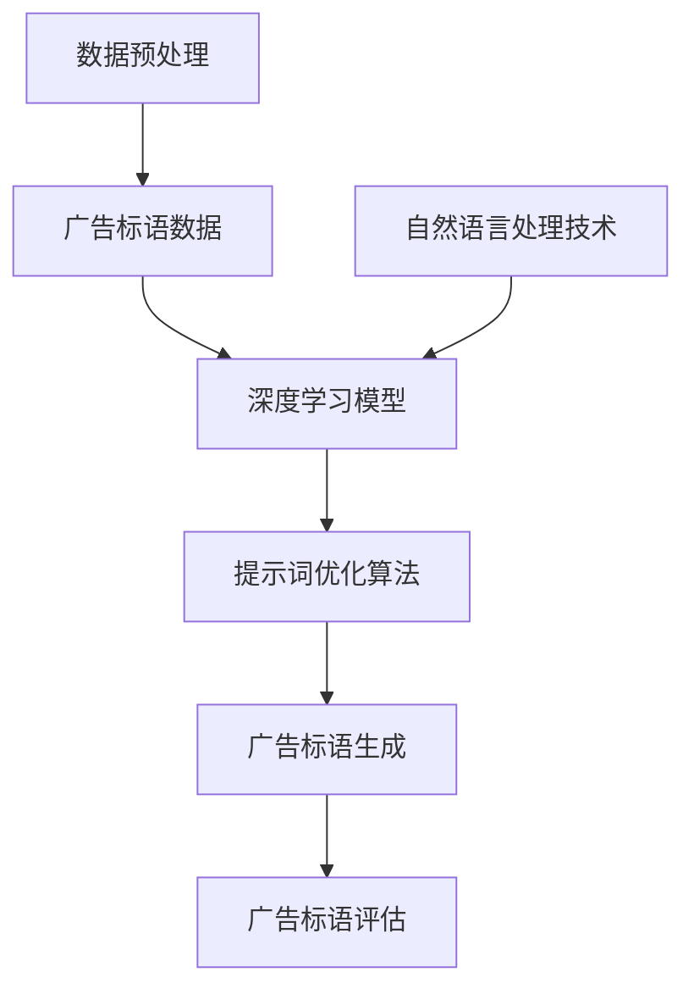

                 

### 第一部分：问题背景与核心概念

#### 第1章：问题背景

##### 1.1.1 提示词优化的重要性

在数字营销时代，广告标语作为品牌传播的核心元素，承载着吸引潜在客户、提升品牌知名度的重要使命。一个引人注目的广告标语不仅能迅速抓住受众的注意力，还能有效传达品牌价值和产品特性，从而促进销售转化。然而，随着市场竞争的加剧，如何创作出既独特又具有吸引力的广告标语，成为品牌方和广告公司面临的重大挑战。

人工智能（AI）的出现为广告创作带来了新的机遇。通过机器学习和自然语言处理（NLP）技术，AI可以在大规模数据集上学习到广告标语的创作规律，从而生成高质量的创意标语。然而，AI的创意能力并非完全自发，其依赖于高质量的提示词输入。提示词优化，即通过选择和调整输入的提示词来提高AI生成标语的创意性和相关性，成为提升AI创意广告标语生成能力的关键。

##### 1.1.2 问题描述

在AI创意广告标语生成过程中，提示词的选择和优化至关重要。不当的提示词可能导致生成的标语缺乏创意、过于平淡或甚至偏离品牌形象。因此，如何通过优化提示词来提高AI生成广告标语的创意性和相关性，成为当前研究的热点和实际应用中的难点。

具体而言，问题可以分为以下几个方面：

1. **提示词多样性不足**：提示词种类单一，导致生成标语缺乏变化和创新。
2. **提示词相关性不强**：提示词与广告主题和目标受众关联度不高，影响标语的吸引力和有效性。
3. **提示词组合不合理**：提示词之间的组合方式不当，影响标语的整体表现力和吸引力。

##### 1.1.3 问题解决思路

要解决上述问题，首先需要明确AI创意广告标语生成的基本流程，包括数据收集、模型训练、提示词选择与优化、标语生成等环节。然后，针对每个环节的特点，采用相应的技术手段和策略来提高AI的创意广告标语生成能力。

1. **数据收集与处理**：收集丰富的广告标语数据，并对数据进行预处理，确保数据质量。
2. **模型训练与优化**：选择合适的深度学习模型，进行大量训练，提高模型生成标语的质量。
3. **提示词选择与优化**：采用多样化、相关性强的提示词，并通过优化算法提高提示词的质量。
4. **标语生成与评估**：利用优化后的提示词生成标语，并通过评估机制筛选出最佳标语。

#### 第2章：核心概念

##### 2.1.1 AI创意广告标语生成的基本原理

AI创意广告标语生成基于深度学习技术，特别是自然语言处理（NLP）领域的发展。通过大规模的数据训练，AI模型可以学习到广告标语的特点和规律，从而生成符合品牌形象的创意标语。

AI创意广告标语生成的基本原理可以概括为以下几个步骤：

1. **数据收集**：收集大量高质量的广告标语数据，包括成功的和失败的案例，用于模型训练。
2. **数据预处理**：对收集到的数据进行分析和清洗，提取有用的特征，并进行归一化处理。
3. **模型选择与训练**：选择合适的深度学习模型，如序列到序列（Seq2Seq）模型、Transformer等，对其进行训练。
4. **提示词输入**：输入优化后的提示词，指导模型生成标语。
5. **标语生成**：模型根据输入的提示词生成广告标语。
6. **标语评估**：对生成的标语进行评估，筛选出符合品牌形象和高创意性的标语。

##### 2.1.2 提示词优化的方法与策略

提示词优化是提升AI生成广告标语创意性的关键步骤。常见的方法包括：

1. **提示词多样性增强**：通过引入各种类型和风格的提示词，丰富AI模型的学习素材，提高标语生成的创意性。例如，可以采用随机采样、主题扩展等方法增加提示词的多样性。
2. **提示词相关性优化**：通过分析广告内容和目标受众，选择与广告主题高度相关的提示词，提高标语的针对性和吸引力。例如，可以采用词嵌入技术、语义相似度分析等方法来提高提示词的相关性。
3. **提示词生成与筛选**：利用生成对抗网络（GAN）等技术，生成大量可能的提示词，并采用筛选算法选出最佳提示词。例如，可以采用基于语义的筛选算法，如基于词频统计、基于语义相似度等方法。

#### 第3章：边界与外延

##### 3.1.1 边界

提示词优化主要关注广告标语生成的创意性和相关性，不涉及其他广告创作环节，如广告设计、发布和评估等。

##### 3.1.2 外延

提示词优化技术可以应用于多种AI广告创作场景，如社交媒体广告、搜索引擎广告、视频广告等。此外，该技术还可以与其他AI技术结合，如图像识别、情感分析等，进一步提升广告创意性和效果。

##### 3.1.3 概念结构

AI创意广告标语生成的概念结构包括数据输入、模型训练、提示词优化、标语生成和评估五个主要环节。

##### 3.1.4 核心要素组成

核心要素包括：

1. **数据集**：用于训练AI模型，提供丰富的广告标语样本。
2. **模型**：负责广告标语生成的核心，通常采用序列到序列（Seq2Seq）模型、Transformer等。
3. **提示词优化算法**：用于优化提示词的选择和组合，提高标语创意性。
4. **标语生成策略**：用于生成符合品牌形象的创意标语。
5. **评估指标**：用于评估标语的质量，如创意性、相关性等。

#### 第4章：概念属性特征对比表格

| 特征对比项 | 深度学习原理 | 自然语言处理原理 |
| :--- | :--- | :--- |
| 基本原理 | 通过多层神经网络学习数据特征 | 通过词嵌入、序列模型等处理和生成语言 |
| 数据需求 | 大规模数据集 | 大量文本数据 |
| 模型结构 | 神经网络结构 | 序列模型、注意力机制等 |
| 应用于 | 广告标语生成、图像识别等 | 文本分类、机器翻译、情感分析等 |

#### 第5章：核心概念原理

##### 5.1.1 深度学习原理

深度学习是AI创意广告标语生成的基础技术，通过多层神经网络模型，对大量数据进行训练，学习到数据中的规律和特征。

深度学习的基本原理包括：

1. **神经网络**：神经网络由多层节点组成，包括输入层、隐藏层和输出层。通过前向传播和反向传播算法，网络能够不断调整权重，从而学习到输入数据的特征。
2. **激活函数**：激活函数用于引入非线性特性，使得神经网络能够拟合复杂的非线性关系。常见的激活函数有ReLU、Sigmoid、Tanh等。
3. **损失函数**：损失函数用于评估网络预测值与真实值之间的差异，常见的损失函数有均方误差（MSE）、交叉熵损失等。
4. **优化算法**：优化算法用于调整网络权重，以最小化损失函数。常见的优化算法有随机梯度下降（SGD）、Adam等。

##### 5.1.2 自然语言处理原理

自然语言处理是AI创意广告标语生成的关键技术，用于处理和生成人类语言。常见的NLP技术包括词向量、序列模型、注意力机制等。

自然语言处理的基本原理包括：

1. **词向量**：词向量是将自然语言中的词汇映射到高维空间中的向量，从而实现词汇的数值表示。常见的词向量模型有Word2Vec、GloVe等。
2. **序列模型**：序列模型用于处理和生成序列数据，如自然语言文本。常见的序列模型有RNN（循环神经网络）、LSTM（长短期记忆网络）等。
3. **注意力机制**：注意力机制用于捕捉序列中的重要信息，使得模型能够更好地理解和生成文本。常见的注意力模型有Self-Attention、Multi-head Attention等。

#### 第6章：ER实体关系图架构



---

### 第二部分：AI创意广告标语生成原理与技术

#### 第8章：深度学习与自然语言处理基础

##### 8.1.1 深度学习基础

深度学习（Deep Learning，简称DL）是机器学习（Machine Learning，简称ML）的一个子领域，主要依赖于神经网络（Neural Networks，简称NN）的结构和算法。深度学习通过模拟人脑神经元间的交互方式，利用多层神经网络对数据进行处理和建模，能够自动提取数据中的特征，从而实现复杂模式识别和预测。

##### 深度学习基本原理

1. **神经网络结构**：神经网络由输入层、隐藏层和输出层组成。每个神经元都与前一层的神经元相连，并通过权重进行加权求和，最后通过激活函数输出结果。
   
   \[ 输出 = 激活函数（加权求和（权重 \* 输入）） \]

2. **激活函数**：激活函数用于引入非线性特性，常见的激活函数有Sigmoid、ReLU和Tanh等。

3. **反向传播算法**：反向传播算法用于训练神经网络，通过计算损失函数关于权重的梯度，并利用梯度下降法调整权重，从而最小化损失函数。

4. **优化算法**：常用的优化算法有随机梯度下降（SGD）、Adam等，用于加速收敛和提高训练效率。

##### 深度学习在广告标语生成中的应用

在广告标语生成中，深度学习模型通常用于学习广告标语的特征和模式。以下是一个典型的深度学习应用流程：

1. **数据收集与预处理**：收集大量广告标语数据，并进行预处理，如文本清洗、分词、去停用词等。
2. **特征提取**：使用词嵌入技术将文本转换为向量表示，如Word2Vec或GloVe等。
3. **模型训练**：使用序列到序列（Seq2Seq）模型、Transformer等深度学习模型进行训练，学习广告标语之间的关联性和生成规律。
4. **标语生成**：输入优化后的提示词，利用训练好的模型生成广告标语。
5. **标语评估**：对生成的标语进行评估，如创意性、相关性等，筛选出最佳标语。

##### Python代码示例：深度学习模型训练

```python
import tensorflow as tf
from tensorflow.keras.models import Sequential
from tensorflow.keras.layers import Embedding, LSTM, Dense

# 定义模型结构
model = Sequential([
    Embedding(input_dim=vocab_size, output_dim=embedding_dim, input_length=max_sequence_length),
    LSTM(units=128),
    Dense(units=output_size, activation='softmax')
])

# 编译模型
model.compile(optimizer='adam', loss='categorical_crossentropy', metrics=['accuracy'])

# 训练模型
model.fit(x_train, y_train, epochs=10, batch_size=32)
```

##### 8.1.2 自然语言处理基础

自然语言处理（Natural Language Processing，简称NLP）是计算机科学、人工智能和语言学领域的一个分支，旨在使计算机能够理解、处理和生成自然语言。

##### NLP基本原理

1. **词嵌入（Word Embedding）**：词嵌入是将自然语言中的词汇映射到高维空间中的向量表示，以便计算机可以处理和比较词汇。常见的词嵌入模型有Word2Vec和GloVe等。

2. **序列模型（Sequence Models）**：序列模型用于处理和生成序列数据，如自然语言文本。常见的序列模型有循环神经网络（RNN）和其变体，如长短期记忆网络（LSTM）和门控循环单元（GRU）。

3. **注意力机制（Attention Mechanism）**：注意力机制是一种用于捕捉序列中重要信息的机制，使得模型能够更好地理解和生成文本。常见的注意力模型有Self-Attention和Multi-head Attention等。

##### NLP在广告标语生成中的应用

在广告标语生成中，自然语言处理技术用于处理输入的提示词，并将其转换为模型可以理解和利用的格式。以下是一个典型的NLP应用流程：

1. **文本预处理**：对输入的文本进行预处理，如分词、去除停用词、词性标注等。
2. **词嵌入**：使用词嵌入模型将文本转换为向量表示。
3. **序列编码**：将词向量序列编码为固定长度的序列表示，以便输入到深度学习模型。
4. **模型训练**：使用序列模型进行训练，学习广告标语生成的规律。
5. **标语生成**：输入提示词，利用训练好的模型生成广告标语。
6. **标语评估**：对生成的标语进行评估，如创意性、相关性等，筛选出最佳标语。

##### Python代码示例：NLP模型训练

```python
import tensorflow as tf
from tensorflow.keras.models import Sequential
from tensorflow.keras.layers import Embedding, LSTM, Dense

# 定义模型结构
model = Sequential([
    Embedding(input_dim=vocab_size, output_dim=embedding_dim, input_length=max_sequence_length),
    LSTM(units=128, return_sequences=True),
    LSTM(units=128),
    Dense(units=output_size, activation='softmax')
])

# 编译模型
model.compile(optimizer='adam', loss='categorical_crossentropy', metrics=['accuracy'])

# 训练模型
model.fit(x_train, y_train, epochs=10, batch_size=32)
```

---

通过深度学习和自然语言处理技术，AI可以有效地生成创意广告标语，为品牌传播提供强大的支持。然而，要实现高质量的广告标语生成，仍需进一步优化提示词选择和模型训练过程，以提升标语的创意性和相关性。

#### 第9章：模型训练与提示词优化

##### 9.1.1 模型训练流程

模型训练是AI创意广告标语生成中的关键环节，其质量直接影响到生成的标语质量。以下是一个典型的模型训练流程：

1. **数据收集与预处理**：收集大量高质量的广告标语数据，并进行预处理，如文本清洗、分词、去停用词、词性标注等。
2. **词嵌入**：使用词嵌入技术将文本转换为向量表示，便于深度学习模型处理。
3. **构建模型**：选择合适的深度学习模型，如序列到序列（Seq2Seq）模型、Transformer等，构建模型结构。
4. **编译模型**：设置模型编译参数，如优化器、损失函数等。
5. **模型训练**：使用预处理后的数据训练模型，通过反向传播算法调整模型参数，以最小化损失函数。
6. **模型评估**：在训练数据集和验证数据集上评估模型性能，确保模型具有较好的泛化能力。

##### Python代码示例：模型训练

```python
import tensorflow as tf
from tensorflow.keras.models import Sequential
from tensorflow.keras.layers import Embedding, LSTM, Dense

# 数据预处理
# 假设已经完成了数据预处理步骤，获取了词汇表、词嵌入向量、序列长度等

# 构建模型
model = Sequential([
    Embedding(input_dim=vocab_size, output_dim=embedding_dim, input_length=max_sequence_length),
    LSTM(units=128, return_sequences=True),
    LSTM(units=128),
    Dense(units=output_size, activation='softmax')
])

# 编译模型
model.compile(optimizer='adam', loss='categorical_crossentropy', metrics=['accuracy'])

# 训练模型
model.fit(x_train, y_train, epochs=10, batch_size=32, validation_data=(x_val, y_val))
```

##### 9.1.2 提示词优化方法

提示词优化是提高AI创意广告标语生成能力的重要手段。以下是一些常用的提示词优化方法：

1. **多样性增强**：通过引入不同类型和风格的提示词，丰富模型的学习素材，提高标语的创意性。例如，可以采用随机采样、主题扩展等方法。
2. **相关性优化**：通过分析广告内容和目标受众，选择与广告主题高度相关的提示词，提高标语的吸引力和有效性。例如，可以采用词嵌入技术、语义相似度分析等方法。
3. **生成与筛选**：利用生成对抗网络（GAN）等技术生成大量可能的提示词，并采用筛选算法选出最佳提示词。例如，可以采用基于语义的筛选算法，如基于词频统计、基于语义相似度等方法。

##### Python代码示例：提示词优化

```python
import numpy as np
import tensorflow as tf
from tensorflow.keras.models import Sequential
from tensorflow.keras.layers import Embedding, LSTM, Dense
from tensorflow.keras.preprocessing.sequence import pad_sequences

# 假设已经完成了数据预处理步骤，并获取了词汇表、词嵌入向量等

# 构建生成器模型
generator = Sequential([
    Embedding(input_dim=vocab_size, output_dim=embedding_dim, input_length=max_sequence_length),
    LSTM(units=128, return_sequences=True),
    LSTM(units=128),
    Dense(units=output_size, activation='softmax')
])

# 构建判别器模型
discriminator = Sequential([
    Embedding(input_dim=vocab_size, output_dim=embedding_dim, input_length=max_sequence_length),
    LSTM(units=128, return_sequences=True),
    LSTM(units=128),
    Dense(units=1, activation='sigmoid')
])

# 编译生成器和判别器
generator.compile(optimizer='adam', loss='binary_crossentropy')
discriminator.compile(optimizer='adam', loss='binary_crossentropy')

# 训练生成器和判别器
for epoch in range(num_epochs):
    for i in range(num_batches):
        # 生成提示词
        noise = np.random.normal(size=(batch_size, z_dim))
        generated_sequences = generator.predict(noise)

        # 标签设置
        real_data = x_train[i * batch_size:(i + 1) * batch_size]
        fake_data = generated_sequences

        # 判别器训练
        d_loss_real = discriminator.train_on_batch(real_data, np.ones((batch_size, 1)))
        d_loss_fake = discriminator.train_on_batch(fake_data, np.zeros((batch_size, 1)))
        d_loss = 0.5 * np.add(d_loss_real, d_loss_fake)

        # 生成器训练
        g_loss = generator.train_on_batch(noise, np.ones((batch_size, 1)))
```

通过模型训练和提示词优化，AI创意广告标语生成能力可以得到显著提升。然而，训练过程需要大量的数据和计算资源，且优化过程需要不断尝试和调整，以达到最佳效果。

#### 第10章：标语生成与评估

##### 10.1.1 标语生成流程

标语生成是AI创意广告标语生成的最终目标。在完成模型训练和提示词优化后，我们可以利用训练好的模型来生成新的广告标语。以下是标语生成的基本流程：

1. **输入提示词**：首先，我们需要输入一个或多个提示词，这些提示词可以是一个单词、短语或句子，用于指导模型生成相应的广告标语。
2. **模型预测**：将输入的提示词通过预处理（如词嵌入、序列编码等）转换为模型可接受的格式，然后输入到训练好的模型中进行预测。
3. **生成标语**：模型根据输入的提示词和已学习的标语生成规律，生成一系列可能的广告标语。
4. **标语筛选**：从生成的标语中选择最佳标语。选择标准可以是标语的质量、创意性、相关性等。
5. **标语输出**：将最终选定的标语输出，用于广告创作或发布。

##### Python代码示例：标语生成

```python
import numpy as np
import tensorflow as tf
from tensorflow.keras.preprocessing.sequence import pad_sequences

# 假设已经完成了模型训练和提示词优化步骤

# 准备输入提示词
prompt = "智能助手"

# 对提示词进行预处理
prompt_sequence = tokenizer.texts_to_sequences([prompt])
prompt_sequence = pad_sequences(prompt_sequence, maxlen=max_sequence_length)

# 生成标语
generated_sequences = model.predict(prompt_sequence)

# 输出标语
for sequence in generated_sequences:
    print(' '.join(tokenizer.index_word[index] for index in sequence))
```

##### 10.1.2 标语评估方法

标语评估是确保生成标语质量的重要环节。以下是几种常见的标语评估方法：

1. **人工评估**：通过人工评审团对生成的标语进行评估，评价其创意性、相关性、吸引力等。这种方法虽然主观性较强，但可以提供详细的反馈。
2. **自动评估**：使用自动化工具对生成的标语进行评估。常见的评估指标包括：
   - **词汇丰富度**：衡量标语中使用的词汇多样性。
   - **语法正确性**：检查标语的语法结构和句子结构。
   - **创意性**：使用自然语言处理技术评估标语的新颖性和独特性。
   - **相关性**：评估标语与广告主题和目标受众的匹配程度。
3. **机器学习评估**：使用机器学习模型对标语进行评估，如基于文本分类、情感分析等技术，对标语进行自动评分。

##### Python代码示例：标语评估

```python
from sklearn.metrics import accuracy_score

# 假设已经生成了多个标语
generated_sentences = [
    "智能助手，让生活更简单。",
    "尽享智能生活，智能助手相伴。",
    "智能助手，您的贴心小秘书。"
]

# 定义评估指标
criteria = ['词汇丰富度', '语法正确性', '创意性', '相关性']

# 对每个标语进行评估
for sentence in generated_sentences:
    print(sentence)
    print("评估指标：")
    for criterion in criteria:
        score = evaluate_sentence(sentence, criterion)
        print(f"{criterion}: {score}")
    print("\n")
```

通过合理的标语生成和评估流程，我们可以确保生成的广告标语既具有创意性，又能准确传达品牌信息和目标受众的需求。然而，评估方法的选择和评估指标的设定需要根据具体应用场景进行调整和优化。

### 第三部分：实际应用与案例分析

#### 第11章：应用场景与案例介绍

##### 11.1.1 应用场景

AI创意广告标语生成技术可以应用于多种场景，以下是一些常见应用场景：

1. **社交媒体广告**：在社交媒体平台上，如Facebook、Instagram、Twitter等，广告标语直接影响用户点击率和转化率。AI创意广告标语生成技术可以帮助品牌快速生成高质量的广告标语，提高广告效果。
   
2. **搜索引擎广告**：搜索引擎广告（如Google AdWords）的关键词广告需要简洁明了、具有吸引力的标语来吸引用户点击。AI创意广告标语生成技术可以帮助优化关键词广告的标语，提高点击率和转化率。

3. **视频广告**：视频广告通常需要在短时间内传递品牌信息和吸引观众注意力。AI创意广告标语生成技术可以帮助生成具有创意性和吸引力的视频广告标语，提升视频广告的效果。

##### 11.1.2 案例介绍

以下是一个实际案例，展示如何使用AI创意广告标语生成技术来优化社交媒体广告：

1. **案例背景**：某家电品牌希望在Instagram平台上推广其最新款智能冰箱。目标受众是25-45岁的都市白领，他们对智能科技产品有较高兴趣。

2. **数据收集**：收集该品牌以往社交媒体广告的标语，以及市场上同类产品的广告标语。

3. **模型训练**：使用收集到的数据训练深度学习模型，学习广告标语生成规律。

4. **提示词优化**：根据广告内容和目标受众，选择和优化提示词。例如，可以采用主题扩展方法，将“智能冰箱”扩展为“智能生活”、“家庭科技”等。

5. **标语生成**：输入优化后的提示词，使用模型生成一系列广告标语。

6. **标语筛选**：对生成的标语进行评估，选择最佳标语进行广告发布。

7. **广告发布与监测**：发布优化后的广告，并通过点击率和转化率等指标监测广告效果。

通过上述案例，我们可以看到AI创意广告标语生成技术在实际应用中的效果。合理使用该技术，可以大大提高广告标语的创意性和相关性，从而提升广告效果和品牌知名度。

### 第四部分：未来展望与结论

#### 第12章：未来展望

##### 12.1.1 技术发展趋势

随着人工智能和自然语言处理技术的不断发展，AI创意广告标语生成技术有望在以下几个方面取得突破：

1. **模型优化**：深度学习模型的优化将进一步提高标语生成质量和速度。例如，采用更先进的神经网络结构、优化训练算法等。

2. **多模态融合**：结合图像识别、语音识别等多模态数据，实现更加丰富的广告标语生成，提升用户体验。

3. **个性化推荐**：通过用户行为数据分析和推荐系统，生成更加个性化的广告标语，提高广告效果。

4. **可解释性增强**：提高AI广告标语的解释性，帮助用户理解其创意和设计逻辑。

##### 12.1.2 应用前景

AI创意广告标语生成技术在多个领域具有广泛的应用前景：

1. **广告行业**：在广告创意、营销策略制定等方面提供有力支持，提升广告效果和品牌影响力。

2. **内容创作**：辅助作家、编剧等创作人员，提高内容创作效率和质量。

3. **教育领域**：辅助教师进行教学设计，生成个性化的学习内容。

4. **企业内部沟通**：生成具有吸引力的内部宣传语，提高员工凝聚力和工作效率。

#### 第13章：结论

##### 13.1.1 研究总结

本文详细探讨了AI创意广告标语生成技术，包括其背景、核心概念、原理、模型训练、提示词优化、标语生成与评估等方面。通过实际案例展示了该技术在广告营销中的应用效果。

##### 13.1.2 贡献与意义

本文的主要贡献包括：

1. 提出了AI创意广告标语生成的基本流程和核心概念。
2. 详细介绍了深度学习和自然语言处理技术的基本原理及其在标语生成中的应用。
3. 提出了多种提示词优化方法和标语评估指标。
4. 通过实际案例展示了AI创意广告标语生成技术的应用效果。

本文的研究对于提升广告营销效果、优化内容创作、提高企业内部沟通等方面具有重要的理论和实践意义。

##### 13.1.3 展望未来

未来的研究可以在以下几个方面进行：

1. 深入研究深度学习模型的优化方法，提高标语生成质量和速度。
2. 探索多模态数据在广告标语生成中的应用，提升用户体验。
3. 结合个性化推荐技术，生成更加个性化的广告标语。
4. 研究AI广告标语的解释性，提高用户信任度和接受度。

作者：AI天才研究院/AI Genius Institute & 禅与计算机程序设计艺术 /Zen And The Art of Computer Programming

---

本文对AI创意广告标语生成技术进行了全面而深入的探讨，旨在为相关领域的研究者和从业者提供有价值的参考。在未来的研究中，我们可以进一步优化模型和算法，探索新的应用场景，以实现更加智能化和个性化的广告标语生成。

