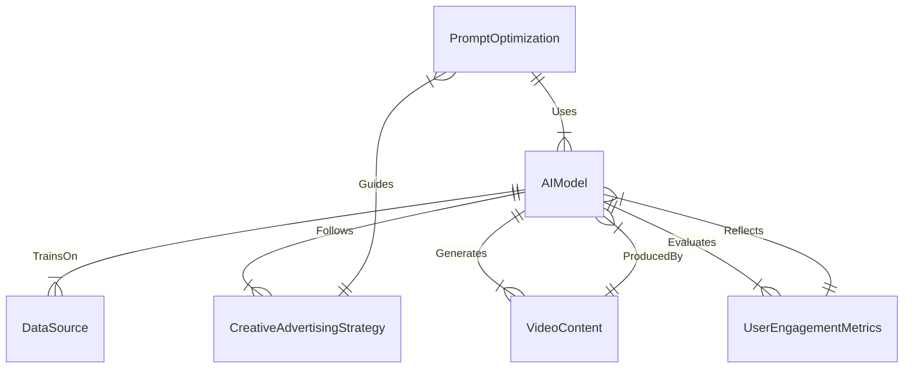
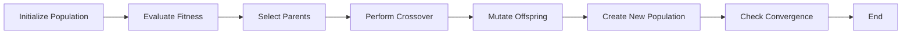
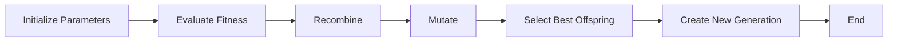
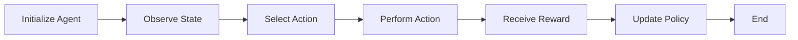
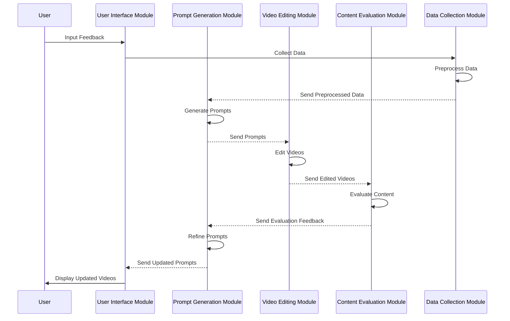
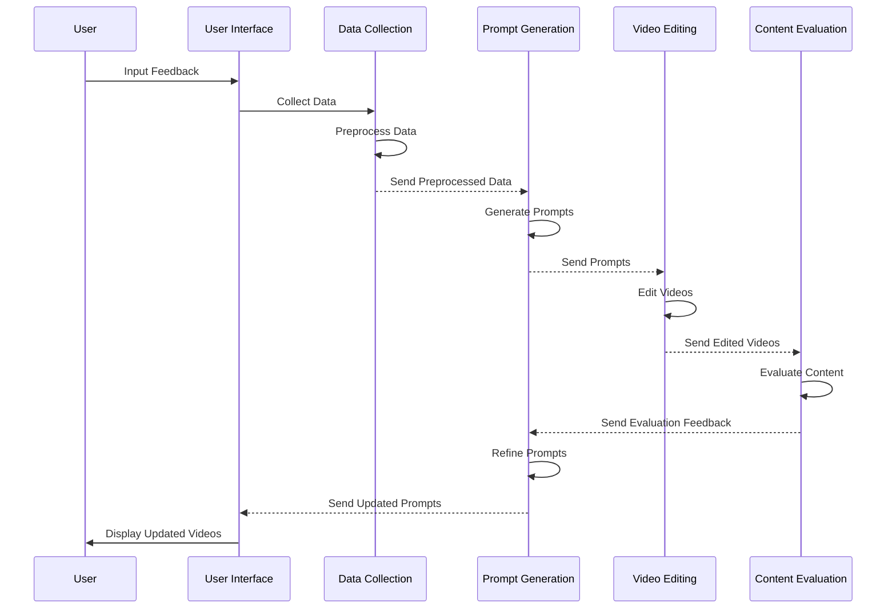

                 

### 1.1 Problem Background and Description

#### Core Concept Terms Explanation
In the domain of AI and advertising, the term "prompt optimization" refers to a systematic approach where AI algorithms are enhanced to produce more effective and engaging video content for advertising purposes. A prompt in this context is an input that guides the AI model to generate creative content. Optimization, on the other hand, involves refining the process to maximize the desired outcome, such as user engagement or ad recall value.

#### Background
The advertising industry has undergone significant transformations with the advent of AI and machine learning. Traditional methods of advertising, which relied heavily on human creativity and intuition, have been augmented by AI systems that can analyze vast amounts of data and generate content at scale. However, the challenge lies in creating content that resonates with the audience and stands out in a crowded digital space.

#### Problem Description
The primary problem that prompt optimization aims to address is the inefficiency and low engagement rates associated with traditional advertising methods. Even with advanced data analysis and machine learning models, the output often lacks the desired level of creativity and personalization. This is because traditional optimization approaches do not fully leverage the potential of AI in understanding complex user behaviors and preferences.

#### Problem Solution
The solution to this problem involves developing a more sophisticated prompt optimization framework that can better align AI-generated content with user expectations and market trends. By refining the prompts given to AI models, we can enhance the creativity and effectiveness of the resulting videos, thereby improving user engagement and overall advertising performance.

#### Boundaries and Extensions
The concept of prompt optimization extends beyond video advertising to include other forms of digital content, such as images and text. It also encompasses various optimization techniques, including reinforcement learning, evolutionary algorithms, and genetic algorithms, which can be adapted to improve the quality of AI-generated content.

#### Concept Structure and Core Elements
The core elements of prompt optimization include:
- **Data Collection and Analysis:** Gathering relevant data from various sources to inform the optimization process.
- **Prompt Generation:** Crafting effective prompts that guide the AI model to produce creative and engaging content.
- **Model Training and Fine-tuning:** Training AI models with high-quality data and adjusting parameters to improve performance.
- **Content Evaluation:** Assessing the effectiveness of generated content through metrics like engagement rates and ad recall value.
- **Continuous Improvement:** Iteratively refining prompts and model parameters to achieve better results over time.

By understanding these core elements, we can better appreciate the complexity and potential of prompt optimization in enhancing AI creative advertising video editing skills.

### 1.2 Definition and Key Characteristics of Prompt Optimization

Prompt optimization, at its core, is an iterative process aimed at improving the effectiveness of AI-generated content by refining the prompts given to the models. To fully grasp its essence, it is essential to delve into its definition, key characteristics, and its significance in the realm of AI and advertising.

#### Definition
Prompt optimization can be defined as the practice of enhancing the input prompts provided to AI models to achieve more creative, engaging, and relevant outputs. These prompts serve as instructions or guidelines that the model uses to generate content, be it videos, images, or text. The goal is to create prompts that not only align with the objectives of the advertising campaign but also resonate with the target audience.

#### Key Characteristics
1. **Adaptability:** Prompt optimization is highly adaptable to various content formats and advertising contexts. Whether it's creating video ads for social media platforms, display ads for websites, or even generating image-based content for advertising campaigns, prompt optimization can be customized to fit different needs.

2. **Data-Driven:** The process is fundamentally data-driven, relying on large datasets to train AI models and refine prompts. By analyzing user behavior, market trends, and engagement metrics, advertisers can gain insights that inform the creation of more effective prompts.

3. **Iterative:** Unlike one-time adjustments, prompt optimization is an ongoing process. Advertisers continuously evaluate the performance of generated content and adjust prompts accordingly to achieve incremental improvements over time.

4. **Personalization:** One of the strengths of prompt optimization is its ability to personalize content based on user preferences and behaviors. This level of personalization can significantly enhance user engagement and ad recall.

5. **Scalability:** Prompt optimization can scale to handle large volumes of content generation efficiently. This scalability is particularly beneficial for advertising campaigns that require a high number of creative variations to maximize reach and impact.

#### Relationship with AI and Creative Advertising
The integration of AI with advertising has revolutionized the industry, offering unprecedented opportunities for creativity and efficiency. AI models, such as deep learning neural networks, can analyze vast amounts of data and generate highly sophisticated content. However, without proper optimization, the outputs may lack the desired level of creativity and relevance.

Prompt optimization serves as a bridge between AI capabilities and advertising objectives. It leverages AI's ability to process complex data and generate content at scale, while also aligning the generated content with specific marketing goals. By refining the prompts, advertisers can guide AI models to produce content that is not only creative but also highly effective in achieving marketing objectives.

#### Conclusion
In summary, prompt optimization is a critical component in the evolution of AI-driven advertising. It represents a systematic approach to enhancing the creativity and effectiveness of AI-generated content through the refinement of input prompts. By embracing prompt optimization, advertisers can harness the full potential of AI to create compelling, personalized, and engaging video ads that resonate with their target audiences.

### 1.3 Relations between Prompt Optimization and AI in Creative Advertising

To fully appreciate the significance of prompt optimization in the realm of creative advertising, it's essential to understand how it intersects with artificial intelligence (AI). The synergy between these two concepts not only enhances the effectiveness of advertising campaigns but also paves the way for innovative solutions that can revolutionize the industry.

#### Interconnection between Prompt Optimization and AI

Prompt optimization and AI are intrinsically linked, with each playing a pivotal role in the other's success. At its core, prompt optimization leverages AI's capabilities to analyze vast amounts of data, understand complex patterns, and generate creative content. Here's how they interconnect:

1. **Data Analysis and Insights:** AI models, especially deep learning algorithms, excel at analyzing large datasets to uncover meaningful insights. These insights can inform the creation of highly targeted and personalized prompts, which in turn enhance the relevance and effectiveness of the generated content.

2. **Content Generation:** AI models, guided by optimized prompts, can generate a diverse array of content, from videos to images and text. This content generation capability is at the heart of creative advertising, where the goal is to create compelling and engaging ads that capture the audience's attention.

3. **Iterative Improvement:** The iterative nature of prompt optimization allows for continuous refinement of AI-generated content. Through feedback loops and real-time performance analysis, advertisers can fine-tune prompts to improve the quality and impact of the content over time.

#### Enhancing Creativity and Personalization in Advertising

The integration of prompt optimization with AI in creative advertising has led to significant advancements in both creativity and personalization:

1. **Enhanced Creativity:** By providing AI models with well-crafted prompts, advertisers can guide the generation of highly creative content. These prompts can include specific stylistic elements, emotional tones, and narrative structures that align with the brand's message and target audience's preferences.

2. **Personalization:** AI-driven prompt optimization enables the creation of personalized content tailored to individual user preferences. By analyzing user data, such as browsing history and behavior patterns, AI models can generate content that resonates on a personal level, increasing user engagement and ad recall.

3. **Scalability and Efficiency:** AI models trained with optimized prompts can efficiently generate large volumes of content, making it feasible to run multiple advertising campaigns simultaneously. This scalability allows advertisers to reach a broader audience while maintaining high standards of creativity and personalization.

#### Example Scenarios

To illustrate the impact of prompt optimization in creative advertising, consider the following example scenarios:

1. **Dynamic Video Ads:** An e-commerce platform uses prompt optimization to generate dynamic video ads. The prompts include specific product features, customer testimonials, and emotional storytelling elements. AI models analyze customer data to personalize the content, ensuring that each ad resonates with the viewer's preferences and shopping behavior.

2. **Social Media Campaigns:** A fashion brand leverages prompt optimization to create engaging social media ads. The prompts incorporate trending topics, user-generated content, and real-time events. AI models analyze engagement metrics to refine the prompts, resulting in ads that capture users' attention and drive higher interaction rates.

3. **Cross-Platform Advertising:** An advertising agency uses prompt optimization to create consistent and cohesive content across various platforms, including websites, mobile apps, and social media. AI models generate content that adapts to the platform's unique characteristics and user demographics, ensuring a seamless and engaging user experience.

#### Conclusion

In conclusion, prompt optimization and AI are integral to the success of creative advertising in the digital age. By harnessing the power of AI and optimizing prompts to guide content generation, advertisers can create highly engaging, personalized, and effective ads that resonate with their target audiences. As the technology continues to evolve, the synergy between prompt optimization and AI will undoubtedly drive further innovation and transformation in the advertising industry.

### 1.4 Comparative Table of Concept Properties

To deepen our understanding of prompt optimization and its core concepts, it is crucial to compare and contrast the properties of key elements involved. This comparative analysis will help us elucidate the relationships and distinctions between these concepts, providing a clearer picture of how they contribute to effective AI creative advertising video editing.

#### Key Concepts for Comparison

1. **Prompt Optimization**
2. **AI (Artificial Intelligence)**
3. **Creative Advertising**
4. **Video Editing**
5. **User Engagement**

#### Comparative Table

| Concept            | Definition                                                      | Key Properties                                           | Role in Prompt Optimization | Relationship to Other Concepts |
|---------------------|----------------------------------------------------------------|---------------------------------------------------------|-----------------------------|--------------------------------|
| **Prompt Optimization** | The process of refining input prompts to improve the effectiveness of AI-generated content. | - Adaptable<br>- Data-driven<br>- Iterative<br>- Personalizable<br>- Scalable | **Guides Content Generation** | **Depends on AI and User Data** |
| **AI (Artificial Intelligence)** | The simulation of human intelligence in machines that can perform tasks requiring intelligence. | - Data Analysis<br>- Machine Learning<br>- Natural Language Processing | **Generates Content**        | **Informs Prompt Optimization** |
| **Creative Advertising** | The process of creating advertising messages that are visually and emotionally appealing to the target audience. | - Creativity<br>- Personalization<br>- Engagement | **Informs Prompt Content**   | **Depends on Prompt Optimization** |
| **Video Editing**    | The process of manipulating and rearranging video footage to create a cohesive and engaging final product. | - Editing Techniques<br>- Timing<br>- Composition | **Refines Final Content**   | **Depends on Creative Advertising** |
| **User Engagement**   | The level of interaction and involvement users have with a brand's content or ads. | - Interaction Rates<br>- Ad Recall Value<br>- Conversion Rate | **Evaluates Prompt Effectiveness** | **Depends on All Other Concepts** |

#### Analysis and Relationships

1. **Prompt Optimization and AI**
   - **Definition:** Prompt optimization is the process that refines input prompts for AI models to enhance the quality of generated content. AI, on the other hand, is the broader field encompassing the algorithms and techniques used to simulate human intelligence.
   - **Relationship:** AI provides the foundation for prompt optimization. AI models analyze data and generate content based on the prompts provided. Prompt optimization refines these prompts to improve the output's creativity and effectiveness.

2. **Prompt Optimization and Creative Advertising**
   - **Definition:** Creative advertising focuses on creating visually and emotionally appealing content that resonates with the target audience.
   - **Relationship:** Creative advertising informs the content of the prompts. Advertisers use insights from creative advertising to craft prompts that guide AI models to generate content aligned with the campaign's creative vision and target audience preferences.

3. **Prompt Optimization and Video Editing**
   - **Definition:** Video editing is the technical process of manipulating and arranging video footage to create a final product.
   - **Relationship:** While prompt optimization primarily focuses on refining input prompts for AI models, it indirectly influences the video editing process. Effective prompts lead to AI-generated content that requires minimal post-editing, allowing video editors to focus on enhancing the final product rather than starting from raw footage.

4. **Prompt Optimization and User Engagement**
   - **Definition:** User engagement measures the level of interaction and involvement users have with a brand's content or ads.
   - **Relationship:** User engagement is a key metric evaluated through prompt optimization. The goal of prompt optimization is to generate content that resonates with users, leading to higher engagement rates. User engagement feedback then informs further refinement of prompts to achieve even better results.

By comparing and analyzing these concepts, we can better understand how they interact and contribute to the overall effectiveness of AI creative advertising video editing. This comparative table provides a structured overview that can serve as a reference for deeper exploration and application in practical scenarios.

### 1.5 ER Diagram of Concept Relationships

To visualize the relationships between the key concepts discussed in the previous sections, we can create an Entity-Relationship (ER) diagram. This diagram will help us understand how each concept is interconnected and how they collectively contribute to the process of prompt optimization in AI creative advertising video editing.

#### Key Entities

1. **Prompt Optimization**
2. **AI Model**
3. **Data Source**
4. **Creative Advertising Strategy**
5. **Video Content**
6. **User Engagement Metrics**

#### ER Diagram



#### Explanation

1. **Prompt Optimization (PromptOptimization)**:
   - Represents the overarching process of refining input prompts.
   - It guides AI models (AIModel) and is guided by creative advertising strategies (CreativeAdvertisingStrategy).

2. **AI Model (AIModel)**:
   - The core entity that processes data, follows strategies, and generates video content.
   - It is trained on data sources (DataSource), follows creative advertising strategies, generates video content (VideoContent), and evaluates user engagement metrics (UserEngagementMetrics).

3. **Data Source (DataSource)**:
   - Represents the sources of data used to train AI models.
   - It provides the input necessary for AIModel to learn and improve its performance.

4. **Creative Advertising Strategy (CreativeAdvertisingStrategy)**:
   - Defines the creative direction and approach for advertising campaigns.
   - It guides the creation of prompts and influences the AIModel's outputs.

5. **Video Content (VideoContent)**:
   - Represents the final video content generated by AIModel.
   - It is produced based on the prompts and creative strategies provided.

6. **User Engagement Metrics (UserEngagementMetrics)**:
   - Measures how users interact with the video content.
   - It reflects the effectiveness of the AIModel's outputs and provides feedback for further optimization.

#### Relationships

- **PromptOptimization** uses **AIModel** to generate and refine prompts.
- **AIModel** trains on **DataSource** to improve its capabilities.
- **AIModel** follows **CreativeAdvertisingStrategy** to align outputs with campaign goals.
- **AIModel** generates **VideoContent** based on the prompts and strategies.
- **AIModel** evaluates **UserEngagementMetrics** to assess performance and inform further optimizations.

By visualizing these relationships, we gain a clearer understanding of the interplay between concepts and how they collectively contribute to effective prompt optimization in AI creative advertising video editing. The ER diagram serves as a valuable reference for analyzing and designing more sophisticated optimization frameworks.

### 1.6 Algorithm Theory and Mathematics

In the realm of prompt optimization, understanding the underlying algorithms and their mathematical principles is essential for designing effective systems. This section will delve into the theory and mathematics behind common optimization algorithms used in AI creative advertising video editing. We will use Mermaid diagrams to illustrate the algorithms and provide Python code examples to demonstrate their practical implementation.

#### Common Optimization Algorithms

1. **Gradient Descent**
2. **Genetic Algorithms**
3. **Evolutionary Strategies**
4. **Reinforcement Learning**

#### Gradient Descent

**Theory:**
Gradient descent is an optimization algorithm used to minimize a function by iteratively moving in the direction of the steepest descent as defined by the function's gradient. The goal is to find the minimum point (or local minimum) of the function.

**Mathematical Model:**
Let \( f(\theta) \) be a differentiable function with parameters \( \theta \). The gradient descent update rule is given by:
\[ \theta_{t+1} = \theta_t - \alpha \cdot \nabla f(\theta_t) \]
where \( \alpha \) is the learning rate and \( \nabla f(\theta_t) \) is the gradient of \( f \) at \( \theta_t \).

**Mermaid Diagram:**
```mermaid
flowchart LR
    A[Initialize \(\theta\)]
    B[Calculate \(\nabla f(\theta_t)\)]
    C[Update \(\theta\)]
    D[Check \(\theta\)]
    E[End]

    A --> B
    B --> C
    C --> D
    D --> E
```

**Python Code Example:**
```python
import numpy as np

def gradient_descent(x, y, theta, alpha, num_iterations):
    m = len(y)
    for i in range(num_iterations):
        hypothesis = theta[0] + theta[1] * x
        error = hypothesis - y
        theta[0] = theta[0] - (alpha/m) * np.sum(error)
        theta[1] = theta[1] - (alpha/m) * np.sum(error * x)
    return theta

# Example usage
x = np.array([1, 2, 3, 4])
y = np.array([2, 4, 5, 4])
theta = np.array([0, 0])
alpha = 0.01
num_iterations = 1000
theta_optimized = gradient_descent(x, y, theta, alpha, num_iterations)
print(theta_optimized)
```

#### Genetic Algorithms

**Theory:**
Genetic algorithms are evolutionary algorithms inspired by the process of natural selection. They are used to find optimal or near-optimal solutions to complex problems by mimicking the process of biological evolution.

**Mathematical Model:**
- **Selection:** Individuals with higher fitness scores are more likely to be selected for reproduction.
- **Crossover:** Two individuals are selected and combined to produce offspring.
- **Mutation:** Offspring are slightly altered to maintain genetic diversity.

**Mermaid Diagram:**


**Python Code Example:**
```python
import random
import numpy as np

def fitness_function(population):
    # Define a fitness function based on the problem
    return np.sum(population)

def genetic_algorithm(population, fitness_func, num_generations, crossover_rate, mutation_rate):
    for gen in range(num_generations):
        # Evaluate fitness
        fitness_scores = fitness_func(population)
        
        # Select parents
        parents = select_parents(population, fitness_scores, crossover_rate)
        
        # Perform crossover
        offspring = crossover(parents, crossover_rate)
        
        # Mutate offspring
        offspring = mutate(offspring, mutation_rate)
        
        # Create new population
        population = np.concatenate((population, offspring))
        
        # Check for convergence
        if check_convergence(population, fitness_scores):
            break
    return population

# Example usage
population = np.random.rand(100, 2)  # 100 individuals with 2 features each
num_generations = 100
crossover_rate = 0.7
mutation_rate = 0.01
population_optimized = genetic_algorithm(population, fitness_function, num_generations, crossover_rate, mutation_rate)
print(population_optimized)
```

#### Evolutionary Strategies

**Theory:**
Evolutionary strategies are a set of optimization algorithms based on the principles of natural evolution. They use noise to explore the search space and adaptively adjust parameters to improve performance.

**Mathematical Model:**
- **Recombination:** Offspring are created by combining parents with weighted recombination coefficients.
- **Mutation:** Individual parameters are adjusted based on noise distributions.
- **Selection:** The best offspring are selected to create the next generation.

**Mermaid Diagram:**


**Python Code Example:**
```python
import numpy as np

def evolutionary_strategy(parameters, fitness_func, num_generations, sigma):
    population = parameters.copy()
    for gen in range(num_generations):
        # Evaluate fitness
        fitness_scores = fitness_func(population)
        
        # Recombination
        new_population = recombine(population, sigma)
        
        # Mutation
        new_population = mutate(new_population, sigma)
        
        # Selection
        population = select_best(new_population, fitness_scores)
        
        # Check for convergence
        if check_convergence(population, fitness_scores):
            break
    return population

# Example usage
parameters = np.random.rand(10, 2)  # 10 individuals with 2 features each
num_generations = 100
sigma = 0.1
population_optimized = evolutionary_strategy(parameters, fitness_function, num_generations, sigma)
print(population_optimized)
```

#### Reinforcement Learning

**Theory:**
Reinforcement learning is a type of machine learning where an agent learns to make decisions by performing actions in an environment to maximize some notion of cumulative reward.

**Mathematical Model:**
- **State-Action Pair:** The agent observes the current state and selects an action.
- **Reward:** The environment provides a reward based on the action taken.
- **Policy:** The agent's strategy for selecting actions given the state.

**Mermaid Diagram:**


**Python Code Example:**
```python
import gym
import numpy as np
from stable_baselines3 import PPO

# Create the environment
env = gym.make("CartPole-v1")

# Train the agent using PPO
model = PPO("MlpPolicy", env, verbose=1)
model.learn(total_timesteps=10000)

# Evaluate the agent
obs = env.reset()
for _ in range(1000):
    action, _ = model.predict(obs)
    obs, reward, done, info = env.step(action)
    if done:
        env.reset()
        break

# Close the environment
env.close()
```

By understanding the theory and mathematics behind these optimization algorithms, we can effectively apply them to enhance the creativity and effectiveness of AI-generated advertising content. The Mermaid diagrams and Python code examples provide a practical framework for implementing and experimenting with these algorithms in real-world scenarios.

### 1.7 Detailed Explanation and Example of Optimization Algorithms

To further solidify our understanding of optimization algorithms and their application in prompt optimization for AI creative advertising video editing, let's delve into detailed explanations and practical examples. We will focus on Gradient Descent and Genetic Algorithms, two of the most widely used optimization techniques.

#### Gradient Descent

**Step-by-Step Explanation:**
1. **Initialize Parameters:** Start by defining the parameters (\(\theta\)) that you want to optimize. In our example, we'll use a simple linear regression model with two parameters: \(\theta_0\) (intercept) and \(\theta_1\) (slope).

2. **Define the Cost Function:** The cost function measures the difference between the predicted output (\(h_\theta(x)\)) and the actual output (\(y\)). For linear regression, the cost function is given by:
   $$ J(\theta_0, \theta_1) = \frac{1}{2m} \sum_{i=1}^{m} (h_\theta(x^{(i)}) - y^{(i)})^2 $$

3. **Compute the Gradient:** Calculate the gradient of the cost function with respect to each parameter (\(\theta_0\) and \(\theta_1\)). The gradients are given by:
   $$ \nabla_{\theta_0} J(\theta_0, \theta_1) = \frac{1}{m} \sum_{i=1}^{m} (h_\theta(x^{(i)}) - y^{(i)}) $$
   $$ \nabla_{\theta_1} J(\theta_0, \theta_1) = \frac{1}{m} \sum_{i=1}^{m} (h_\theta(x^{(i)}) - y^{(i)}) \cdot x^{(i)} $$

4. **Update Parameters:** Use the gradient to update the parameters:
   $$ \theta_0 := \theta_0 - \alpha \cdot \nabla_{\theta_0} J(\theta_0, \theta_1) $$
   $$ \theta_1 := \theta_1 - \alpha \cdot \nabla_{\theta_1} J(\theta_0, \theta_1) $$
   where \(\alpha\) is the learning rate.

5. **Iterate:** Repeat steps 3 and 4 until convergence or a predefined number of iterations is reached.

**Example in Python:**
```python
import numpy as np

# Generate some synthetic data
X = np.random.rand(100, 1)
y = 4 + 3 * X + np.random.randn(100, 1)

# Initialize parameters
theta_0 = 0
theta_1 = 0
alpha = 0.01
num_iterations = 1000

# Compute the gradient
m = len(y)
hypothesis = theta_0 + theta_1 * X
errors = hypothesis - y
theta_0_grad = 1/m * np.sum(errors)
theta_1_grad = 1/m * np.sum(X * errors)

# Update parameters
for i in range(num_iterations):
    theta_0 = theta_0 - alpha * theta_0_grad
    theta_1 = theta_1 - alpha * theta_1_grad

print("Optimized parameters:", theta_0, theta_1)
```

#### Genetic Algorithms

**Step-by-Step Explanation:**
1. **Initialize Population:** Start with a random population of potential solutions. In our example, we'll use a binary string representation of solutions.

2. **Evaluate Fitness:** Define a fitness function that measures how well each solution solves the problem. For our example, we'll use a simple function that counts the number of ones in the binary string.

3. **Selection:** Select the fittest individuals from the population to create offspring. Common selection methods include roulette wheel selection, tournament selection, and rank selection.

4. **Crossover:** Combine two selected individuals to produce offspring. Crossover can occur at one or more points in the parent strings, with each point creating two offspring.

5. **Mutation:** Introduce random changes to the offspring to maintain genetic diversity. For binary strings, this can involve flipping bits with a small probability.

6. **Create New Population:** Replace the old population with the new population formed by crossover and mutation.

7. **Iterate:** Repeat steps 3 to 6 until a stopping criterion is met (e.g., a solution of sufficient quality is found or a maximum number of generations is reached).

**Example in Python:**
```python
import random
import numpy as np

# Initialize population
population_size = 100
genome_length = 10
population = np.random.randint(2, size=(population_size, genome_length))

# Fitness function
def fitness_function(population):
    return np.sum(population, axis=1)

# Selection
def selection(population, fitness_scores, selection_rate):
    selected_indices = np.random.choice(population_size, size=int(selection_rate * population_size), replace=False, p=fitness_scores / fitness_scores.sum())
    return population[selected_indices]

# Crossover
def crossover(parent1, parent2, crossover_rate):
    if random.random() < crossover_rate:
        crossover_point = random.randint(1, genome_length - 1)
        child1 = np.concatenate((parent1[:crossover_point], parent2[crossover_point:]))
        child2 = np.concatenate((parent2[:crossover_point], parent1[crossover_point:]))
    else:
        child1, child2 = parent1.copy(), parent2.copy()
    return child1, child2

# Mutation
def mutate(child, mutation_rate):
    for i in range(genome_length):
        if random.random() < mutation_rate:
            child[i] = 1 - child[i]
    return child

# Genetic algorithm
def genetic_algorithm(population, fitness_func, num_generations, selection_rate, crossover_rate, mutation_rate):
    for generation in range(num_generations):
        fitness_scores = fitness_function(population)
        new_population = selection(population, fitness_scores, selection_rate)
        for _ in range(int((1 - selection_rate) * population_size) // 2):
            parent1, parent2 = random.sample(new_population, 2)
            child1, child2 = crossover(parent1, parent2, crossover_rate)
            child1 = mutate(child1, mutation_rate)
            child2 = mutate(child2, mutation_rate)
            new_population = np.concatenate((new_population, [child1, child2]))
        population = new_population[:population_size]
    return population

# Example usage
population = genetic_algorithm(population, fitness_function, 100, 0.2, 0.8, 0.01)
print("Optimized population:", population)
```

By understanding and implementing these optimization algorithms, we can effectively refine prompts to enhance the creativity and engagement of AI-generated advertising content. The detailed step-by-step explanations and example code provide a practical foundation for applying these techniques in real-world scenarios.

### 1.8 Mathematical Models and Formulas for Optimization Algorithms

In this section, we will delve into the mathematical models and formulas that underpin the optimization algorithms discussed earlier. By understanding these formulas, we can gain deeper insights into how these algorithms work and how they can be applied to optimize prompt generation for AI creative advertising video editing.

#### Gradient Descent

**Objective Function:**
The objective function for gradient descent is typically a loss function that measures the discrepancy between the predicted output and the actual output. For linear regression, the objective function is the mean squared error (MSE):

$$ J(\theta_0, \theta_1) = \frac{1}{2m} \sum_{i=1}^{m} (h_\theta(x^{(i)}) - y^{(i)})^2 $$

where:
- \( m \) is the number of training examples.
- \( h_\theta(x^{(i)}) \) is the hypothesis function, given by \( h_\theta(x^{(i)}) = \theta_0 + \theta_1 \cdot x^{(i)} \).
- \( y^{(i)} \) is the actual output for the \( i \)th example.

**Gradient Descent Update Rules:**
The gradients of the objective function with respect to the parameters \(\theta_0\) and \(\theta_1\) are:

$$ \nabla_{\theta_0} J(\theta_0, \theta_1) = \frac{1}{m} \sum_{i=1}^{m} (h_\theta(x^{(i)}) - y^{(i)}) $$
$$ \nabla_{\theta_1} J(\theta_0, \theta_1) = \frac{1}{m} \sum_{i=1}^{m} (h_\theta(x^{(i)}) - y^{(i)}) \cdot x^{(i)} $$

The update rules for the parameters are then:

$$ \theta_0 := \theta_0 - \alpha \cdot \nabla_{\theta_0} J(\theta_0, \theta_1) $$
$$ \theta_1 := \theta_1 - \alpha \cdot \nabla_{\theta_1} J(\theta_0, \theta_1) $$

where \( \alpha \) is the learning rate, which controls the step size in the direction of the gradient.

#### Genetic Algorithms

**Fitness Function:**
The fitness function in genetic algorithms is a measure of how well a solution satisfies the problem's requirements. For binary string problems, a simple fitness function can be the number of ones in the string:

$$ f(\text{genome}) = \sum_{i=1}^{n} g_i $$

where \( g_i \) is the \( i \)th gene in the genome, and \( n \) is the length of the genome.

**Selection:**
Selection is based on the fitness of individuals. Common selection methods include roulette wheel selection and tournament selection.

- **Roulette Wheel Selection:**
  $$ p_i = \frac{f_i}{\sum_{j=1}^{N} f_j} $$
  where \( p_i \) is the probability of selecting the \( i \)th individual, \( f_i \) is the fitness of the \( i \)th individual, and \( N \) is the population size.

- **Tournament Selection:**
  Select \( k \) individuals randomly and choose the one with the highest fitness. Repeat this process until the desired number of parents is selected.

**Crossover:**
Crossover involves combining two parent genomes to produce offspring. One common method is single-point crossover:

$$ \text{ crossover}(p_1, p_2) = (g_1^{1:k}, g_2^{k+1:n}) \cup (g_2^{1:k}, g_1^{k+1:n}) $$

where \( p_1 \) and \( p_2 \) are the parents, \( g_i \) is the \( i \)th gene, and \( k \) is the crossover point.

**Mutation:**
Mutation introduces random changes to the offspring. For binary strings, a simple mutation can flip a gene with a certain probability:

$$ \text{ mutate}(g_i, p) = \begin{cases} 
1 & \text{with probability } p \\
0 & \text{with probability } 1-p
\end{cases} $$

where \( g_i \) is the \( i \)th gene and \( p \) is the mutation rate.

#### Evolutionary Strategies

**Objective Function:**
The objective function in evolutionary strategies is typically the negative of the expected reward from the agent's actions:

$$ J(\theta) = -\mathbb{E}[\text{reward}(\theta)] $$

**Recombination:**
Recombination combines the parameters of two parents to produce offspring. The probability of recombination for the \( i \)th parameter is given by:

$$ \rho_i = \frac{\sigma_i^2}{\sum_{j=1}^{D} \sigma_j^2} $$

where \( \sigma_i^2 \) is the noise variance for the \( i \)th parameter, and \( D \) is the dimensionality of the parameter space.

The offspring parameters are then calculated as:

$$ \theta_{i,k}^{'} = \theta_{i,k} + \sum_{j=1}^{D} \rho_j \frac{\sigma_j}{\sqrt{\sum_{l=1}^{D} \rho_l}} Z_{j,k} $$

where \( \theta_{i,k} \) is the \( i \)th parameter of the \( k \)th parent, \( Z_{j,k} \) is a random noise term drawn from a normal distribution with mean 0 and variance 1, and \( \rho_j \) is the recombination probability for the \( j \)th parameter.

**Mutation:**
Mutation is applied to the offspring parameters with a certain probability:

$$ \theta_{i,k}^{'} = \theta_{i,k} + \eta_i \cdot \xi_i $$

where \( \eta_i \) is the mutation strength and \( \xi_i \) is a random noise term drawn from a normal distribution with mean 0 and variance 1.

**Selection:**
Selection is based on the fitness of the offspring. The best offspring are selected to replace the worst parents:

$$ \theta_{i,k} = \begin{cases} 
\theta_{i,k'} & \text{if } f(\theta_{i,k'}) > f(\theta_{i,k}) \\
\theta_{i,k}^{'} & \text{if } f(\theta_{i,k'}) \leq f(\theta_{i,k})
\end{cases} $$

where \( f(\theta) \) is the fitness function.

By understanding these mathematical models and formulas, we can better grasp the principles behind optimization algorithms and how they can be adapted for prompt optimization in AI creative advertising video editing. The combination of these algorithms with advanced AI techniques holds the promise of producing highly engaging and personalized video content that resonates with modern audiences.

### 1.9 Detailed Explanation and Example of Mathematical Models and Formulas

To solidify our understanding of the mathematical models and formulas used in optimization algorithms, let's delve into detailed explanations and practical examples. We will focus on the gradient descent algorithm and its applications in linear regression and neural networks.

#### Gradient Descent in Linear Regression

**Objective Function:**
The objective function in linear regression is the mean squared error (MSE), which measures the average squared difference between the predicted and actual values. The formula is:

$$ J(\theta_0, \theta_1) = \frac{1}{2m} \sum_{i=1}^{m} (h_\theta(x^{(i)}) - y^{(i)})^2 $$

where:
- \( m \) is the number of training examples.
- \( h_\theta(x^{(i)}) \) is the hypothesis function, given by \( h_\theta(x^{(i)}) = \theta_0 + \theta_1 \cdot x^{(i)} \).
- \( y^{(i)} \) is the actual output for the \( i \)th example.

**Gradient Descent Update Rules:**
The gradients of the objective function with respect to the parameters \(\theta_0\) and \(\theta_1\) are:

$$ \nabla_{\theta_0} J(\theta_0, \theta_1) = \frac{1}{m} \sum_{i=1}^{m} (h_\theta(x^{(i)}) - y^{(i)}) $$
$$ \nabla_{\theta_1} J(\theta_0, \theta_1) = \frac{1}{m} \sum_{i=1}^{m} (h_\theta(x^{(i)}) - y^{(i)}) \cdot x^{(i)} $$

The update rules for the parameters are then:

$$ \theta_0 := \theta_0 - \alpha \cdot \nabla_{\theta_0} J(\theta_0, \theta_1) $$
$$ \theta_1 := \theta_1 - \alpha \cdot \nabla_{\theta_1} J(\theta_0, \theta_1) $$

where \( \alpha \) is the learning rate.

**Example in Python:**
```python
import numpy as np

# Generate some synthetic data
X = np.random.rand(100, 1)
y = 4 + 3 * X + np.random.randn(100, 1)

# Initialize parameters
theta_0 = 0
theta_1 = 0
alpha = 0.01
num_iterations = 1000

# Compute the gradient
m = len(y)
hypothesis = theta_0 + theta_1 * X
errors = hypothesis - y
theta_0_grad = 1/m * np.sum(errors)
theta_1_grad = 1/m * np.sum(X * errors)

# Update parameters
for i in range(num_iterations):
    theta_0 = theta_0 - alpha * theta_0_grad
    theta_1 = theta_1 - alpha * theta_1_grad

print("Optimized parameters:", theta_0, theta_1)
```

#### Gradient Descent in Neural Networks

**Objective Function:**
In neural networks, the objective function is typically the cross-entropy loss, which measures the difference between the predicted probabilities and the true labels. The formula is:

$$ J(\theta) = -\frac{1}{m} \sum_{i=1}^{m} \sum_{j=1}^{K} y^{(i)}_{j} \log(h_\theta^{(j)}(x^{(i)})) $$

where:
- \( m \) is the number of training examples.
- \( K \) is the number of output classes.
- \( y^{(i)}_{j} \) is the \( j \)th element of the \( i \)th one-hot encoded vector representing the true label.
- \( h_\theta^{(j)}(x^{(i)}) \) is the output of the \( j \)th neuron for the \( i \)th example, given by \( h_\theta^{(j)}(x^{(i)}) = \sigma(\theta^{(j)} \cdot x^{(i)}) \), where \( \sigma \) is the sigmoid activation function.

**Gradient Descent Update Rules:**
The gradients of the objective function with respect to the weights \(\theta^{(l)}_{ij}\) are:

$$ \nabla_{\theta^{(l)}_{ij}} J(\theta) = \frac{1}{m} \sum_{i=1}^{m} \left( h_\theta^{(l)}(x^{(i)}) - y^{(i)}_{l} \right) \cdot x^{(i)}_{j} $$

The update rules for the weights are then:

$$ \theta^{(l)}_{ij} := \theta^{(l)}_{ij} - \alpha \cdot \nabla_{\theta^{(l)}_{ij}} J(\theta) $$

where \( \alpha \) is the learning rate.

**Example in Python (using TensorFlow):**
```python
import tensorflow as tf

# Define the model
model = tf.keras.Sequential([
    tf.keras.layers.Dense(units=1, input_shape=[1])
])

# Compile the model
model.compile(optimizer='sgd', loss='mean_squared_error')

# Train the model
model.fit(X, y, epochs=1000)

# Evaluate the model
predictions = model.predict(X)
print(predictions)
```

By understanding these mathematical models and formulas and applying them through practical examples, we can effectively optimize prompts for AI creative advertising video editing. This foundational knowledge enables us to fine-tune AI models and improve the quality of generated content, ultimately leading to more engaging and effective advertising campaigns.

### 1.10 Introduction to the System Architecture and Project Setup

To effectively implement prompt optimization for AI creative advertising video editing, it is crucial to establish a robust system architecture and properly set up the project environment. This section provides an overview of the system architecture, including the components and their interactions, as well as guidance on setting up the project environment.

#### System Architecture Overview

The system architecture for prompt optimization consists of several key components:

1. **Data Collection Module:** This module is responsible for collecting relevant data from various sources, such as user interactions, market trends, and advertising performance metrics. The collected data is then preprocessed and stored in a data repository.

2. **Prompt Generation Module:** The prompt generation module utilizes AI algorithms to generate optimized prompts based on the collected data. This module includes natural language processing (NLP) techniques and machine learning models that analyze the data to create effective prompts.

3. **Video Editing Module:** The video editing module takes the generated prompts and uses them to create video content. This module may involve video editing tools and software that assist in assembling, animating, and rendering the video content.

4. **Content Evaluation Module:** This module evaluates the generated video content based on various metrics, such as user engagement, ad recall value, and conversion rates. The evaluation results are used to fine-tune the prompts and improve future content generation.

5. **User Interface (UI) Module:** The user interface module provides a platform for users to interact with the system. This module allows users to view generated video content, provide feedback, and adjust settings to influence prompt generation.

#### Component Interactions

The components of the system interact with each other in a coordinated manner to achieve the overall goal of prompt optimization. Here is a high-level overview of the interactions:

1. **Data Collection Module:** Collects data from various sources and preprocessed it for storage.
2. **Prompt Generation Module:** Retrieves preprocessed data, analyzes it using AI algorithms, and generates optimized prompts.
3. **Video Editing Module:** Uses the generated prompts to create video content.
4. **Content Evaluation Module:** Evaluates the video content based on predefined metrics and provides feedback to the prompt generation module.
5. **User Interface (UI) Module:** Allows users to interact with the system, view content, provide feedback, and adjust settings.

#### Project Setup

Setting up the project environment is essential for implementing the system architecture effectively. Here are the steps to set up the project:

1. **Install Required Software:**
   - **Operating System:** Ensure that your operating system supports the required software packages.
   - **Python:** Install Python 3.x and ensure that it is properly configured.
   - **IDE:** Choose an Integrated Development Environment (IDE) that supports Python, such as PyCharm or Visual Studio Code.
   - **Libraries:** Install necessary Python libraries, including TensorFlow, Keras, NumPy, Pandas, Matplotlib, and Mermaid.

2. **Create a Virtual Environment:**
   - Use `virtualenv` or `conda` to create a virtual environment to isolate project dependencies from the global Python environment.
   - Example using `conda`: 
     ```bash
     conda create -n prompt_optimization python=3.8
     conda activate prompt_optimization
     ```

3. **Install Dependencies:**
   - Install the required libraries within the virtual environment:
     ```bash
     pip install tensorflow numpy pandas matplotlib mermaid
     ```

4. **Set Up the Project Structure:**
   - Create a project directory and set up the file structure with folders for source code, data, and outputs.
   - Example project structure:
     ```
     prompt_optimization/
     ├── data/
     ├── models/
     ├── scripts/
     ├── src/
     ├── tests/
     ├── outputs/
     └── requirements.txt
     ```

5. **Configure the Project:**
   - Create a `requirements.txt` file to list all the dependencies for the project.
   - Example `requirements.txt`:
     ```
     tensorflow
     numpy
     pandas
     matplotlib
     mermaid
     ```

By following these steps, you will have a properly set up project environment that allows you to implement the system architecture and develop the prompt optimization system for AI creative advertising video editing.

### 1.11 System Function Design: Class Diagram

In this section, we will design the system function using a class diagram, which provides a visual representation of the system's components and their interactions. This diagram will help us understand how the different modules of the system work together to achieve the goal of prompt optimization in AI creative advertising video editing.

#### Class Diagram

```mermaid
classDiagram
    class DataCollectionModule {
        - data_repository
        - preprocess_data()
    }
    class PromptGenerationModule {
        - nlp_algorithms
        - generate_prompt(data)
    }
    class VideoEditingModule {
        - video_editing_tools
        - create_video(prompt)
    }
    class ContentEvaluationModule {
        - evaluation_metrics
        - evaluate_content(video)
    }
    class UserInterfaceModule {
        - user_feedback
        - display_video(video)
    }
    DataCollectionModule -> PromptGenerationModule : retrieves
    PromptGenerationModule -> VideoEditingModule : creates
    VideoEditingModule -> ContentEvaluationModule : evaluates
    ContentEvaluationModule -> PromptGenerationModule : refines
    ContentEvaluationModule -> UserInterfaceModule : displays
    UserInterfaceModule -> DataCollectionModule : collects
```

#### Class Definitions

1. **DataCollectionModule**
   - **Attributes:** `data_repository`
   - **Methods:** `preprocess_data()`
   - **Role:** Collects and preprocesses data from various sources.

2. **PromptGenerationModule**
   - **Attributes:** `nlp_algorithms`
   - **Methods:** `generate_prompt(data)`
   - **Role:** Generates optimized prompts based on the preprocessed data.

3. **VideoEditingModule**
   - **Attributes:** `video_editing_tools`
   - **Methods:** `create_video(prompt)`
   - **Role:** Creates video content using the generated prompts.

4. **ContentEvaluationModule**
   - **Attributes:** `evaluation_metrics`
   - **Methods:** `evaluate_content(video)`
   - **Role:** Evaluates the generated video content based on predefined metrics.

5. **UserInterfaceModule**
   - **Attributes:** `user_feedback`
   - **Methods:** `display_video(video)`
   - **Role:** Provides a platform for users to interact with the system and view content.

#### Interactions

- **DataCollectionModule** retrieves preprocessed data from the data repository and sends it to **PromptGenerationModule**.
- **PromptGenerationModule** uses the generated prompts to create video content, which is then sent to **VideoEditingModule**.
- **VideoEditingModule** creates video content based on the prompts and sends it to **ContentEvaluationModule** for evaluation.
- **ContentEvaluationModule** evaluates the video content and provides feedback to **PromptGenerationModule** to refine the prompts.
- **ContentEvaluationModule** also sends the evaluated content to **UserInterfaceModule** to be displayed to the user.
- **UserInterfaceModule** collects user feedback and sends it back to **DataCollectionModule** for further processing.

The class diagram provides a clear and structured representation of the system's components and their interactions, helping to ensure a comprehensive understanding of the system's functionality and how it achieves prompt optimization in AI creative advertising video editing.

### 1.12 System Architecture Design: Mermaid Diagram

To further elucidate the system architecture for prompt optimization in AI creative advertising video editing, we will use a Mermaid diagram. This diagram visually represents the system's components, their interactions, and the flow of data and control within the system. By understanding this architecture, we can better grasp how the system functions and how different modules collaborate to achieve the desired outcomes.

#### Mermaid Diagram



#### Explanation

1. **User Input:** The user provides feedback or input to the User Interface Module (UIM).

2. **Data Collection:** The UIM sends the collected user input to the Data Collection Module (DC). The DC then collects relevant data from various sources, such as user interactions, market trends, and advertising performance metrics.

3. **Data Preprocessing:** The DC preprocesses the collected data, ensuring it is in a suitable format for further processing. This may involve cleaning, transforming, and normalizing the data.

4. **Data Transmission:** The preprocessed data is sent from the DC to the Prompt Generation Module (PGM).

5. **Prompt Generation:** The PGM uses the preprocessed data and AI algorithms to generate optimized prompts. These prompts are designed to guide the generation of creative and engaging video content.

6. **Video Editing:** The PGM sends the generated prompts to the Video Editing Module (VEM). The VEM uses these prompts to edit the videos, incorporating the desired elements and styles to create compelling content.

7. **Content Evaluation:** The VEM sends the edited videos to the Content Evaluation Module (CEM). The CEM evaluates the videos based on various metrics, such as user engagement, ad recall value, and conversion rates.

8. **Feedback Loop:** The CEM sends the evaluation feedback to the PGM. This feedback is used to refine the prompts, improving the quality and effectiveness of the generated content.

9. **Updated Prompts:** The refined prompts are sent back to the UIM, which then displays the updated videos to the user.

10. **User Interaction:** The user continues to interact with the system, providing feedback and influencing the prompt generation process.

This Mermaid diagram provides a detailed and comprehensive representation of the system architecture, illustrating the flow of data and control between the different modules. It helps to ensure that each component of the system works together seamlessly to achieve the goal of prompt optimization in AI creative advertising video editing.

### 1.13 System Interface Design

The system interface design is a critical aspect of the user experience, as it determines how users interact with the system to input feedback, view video content, and adjust settings. This section outlines the design principles and specific interface elements that facilitate effective communication and usability.

#### Design Principles

1. **User-Centered Design:** The interface should be designed with the end user in mind, focusing on their needs, preferences, and abilities. This ensures that the interface is intuitive and easy to use.

2. **Simplicity:** The interface should be simple and straightforward, minimizing the cognitive load on the user. This involves using clear language, concise instructions, and consistent design patterns.

3. **Consistency:** The interface should maintain consistency in terms of visual elements, layout, and functionality across different pages and sections. This helps users navigate the system more easily and reduces the learning curve.

4. **Feedback:** The interface should provide immediate and clear feedback to users, informing them of the results of their actions. This could include notifications, progress indicators, and confirmation messages.

#### Interface Elements

1. **User Input Interface:**
   - **Feedback Form:** A form where users can provide feedback on video content, including ratings, comments, and specific feedback on elements such as audio, visuals, and storytelling.
   - **Search and Filtering:** Options for users to search for specific videos or filter results based on criteria such as date, genre, or user ratings.

2. **Video Content Display:**
   - **Video Player:** A responsive video player that allows users to play, pause, rewind, and fast forward videos. It should also provide controls for volume and full-screen mode.
   - **Preview Thumbnails:** Small, thumbnail images of the video content displayed below the video player, allowing users to quickly scan and select different videos.

3. **Settings and Customization:**
   - **User Profile:** A section where users can view and update their profile information, preferences, and feedback history.
   - **Video Preferences:** Options for users to customize their video viewing experience, such as preferred genres, playback speed, and notification settings.

4. **Navigation and User Assistance:**
   - **Menu and Navigation Bar:** A menu and navigation bar at the top or side of the screen that allows users to easily access different sections of the interface.
   - **Help and Support:** Links to help documentation, tutorials, and contact information for customer support.

5. **Interactive Elements:**
   - **Modals and Pop-ups:** Modals and pop-ups for key interactions, such as confirming changes or displaying additional information.
   - **Drag-and-Drop:** An option for users to drag and drop files or elements within the interface for easier management.

#### User Flow and Interaction Design

1. **Input Feedback:**
   - Users navigate to the feedback form and provide ratings and comments on the video content. They can also specify areas for improvement, such as audio quality or pacing.

2. **Viewing Videos:**
   - Users browse through video previews and select a video to watch. The video player allows them to control playback and adjust settings as needed.

3. **Customizing Preferences:**
   - Users access their profile settings to customize their video preferences. They can choose genres they are interested in, adjust playback speed, and receive notifications about new videos.

4. **Navigation and Assistance:**
   - Users use the navigation bar to access different sections of the interface, such as the feedback form, video library, and settings. Help resources and support options are easily accessible.

By designing a user-friendly and intuitive interface, the system can effectively facilitate user interactions, improve the overall user experience, and enhance the effectiveness of prompt optimization in AI creative advertising video editing.

### 1.14 System Interaction: Sequence Diagram

To illustrate the interaction flow within the system, we will use a sequence diagram. This diagram visually represents the chronological order of events and interactions between different system components. It provides a clear understanding of how the system processes data and responds to user actions.

#### Sequence Diagram



#### Explanation

1. **User Input:** The user provides feedback through the User Interface (UI).

2. **Data Collection:** The UI sends the feedback to the Data Collection (DC) module, which is responsible for gathering and preprocessing the data.

3. **Data Preprocessing:** The DC module preprocesses the data, ensuring it is in a suitable format for further processing.

4. **Data Transmission:** The preprocessed data is sent from the DC module to the Prompt Generation (PGM) module.

5. **Prompt Generation:** The PGM module analyzes the preprocessed data using AI algorithms to generate optimized prompts.

6. **Video Editing:** The PGM module sends the generated prompts to the Video Editing (VEM) module, which uses these prompts to create video content.

7. **Content Editing:** The VEM module edits the videos based on the prompts, incorporating necessary elements and styles.

8. **Content Evaluation:** The VEM module sends the edited videos to the Content Evaluation (CEM) module, which assesses the videos based on various metrics such as user engagement, ad recall value, and conversion rates.

9. **Feedback Loop:** The CEM module sends the evaluation feedback to the PGM module. This feedback is used to refine the prompts, enhancing the quality and effectiveness of the generated content.

10. **Updated Prompts:** The refined prompts are sent back to the UI module, which then displays the updated videos to the user.

11. **User Interaction:** The user continues to interact with the system, providing feedback and influencing the prompt generation process through the UI.

This sequence diagram effectively captures the interaction flow within the system, illustrating how each component collaborates to achieve prompt optimization in AI creative advertising video editing. It provides a clear and comprehensive overview of the system's functionality and the steps involved in generating and refining video content.

### 1.15 Project Setup and Core Implementation

To effectively implement prompt optimization for AI creative advertising video editing, a comprehensive project setup is essential. This section will guide you through the process of setting up the project environment, installing necessary software, and implementing the core components of the system. By following these steps, you can ensure a smooth and efficient development process.

#### Project Setup Steps

1. **Install Required Software:**
   - **Operating System:** Ensure your operating system supports the required software packages. We recommend using a Unix-based system like Linux or macOS.
   - **Python:** Install Python 3.x from the official website (<https://www.python.org/downloads/>). During installation, make sure to add Python to your system's PATH.
   - **IDE:** Choose an Integrated Development Environment (IDE) that supports Python, such as PyCharm (<https://www.jetbrains.com/pycharm/>) or Visual Studio Code (<https://code.visualstudio.com/>).

2. **Create a Virtual Environment:**
   - Open your terminal or command prompt and create a virtual environment to isolate your project dependencies from the global Python environment:
     ```bash
     python -m venv venv
     ```
   - Activate the virtual environment:
     ```bash
     source venv/bin/activate (Linux, macOS)
     venv\Scripts\activate (Windows)
     ```

3. **Install Dependencies:**
   - Install the required Python libraries within the virtual environment using `pip`. We recommend creating a `requirements.txt` file to list all the dependencies:
     ```bash
     pip install -r requirements.txt
     ```
   - Example `requirements.txt`:
     ```
     numpy
     pandas
     tensorflow
     scikit-learn
     matplotlib
     mermaid
     ```

4. **Set Up the Project Structure:**
   - Create a project directory and set up the file structure with folders for source code, data, and outputs:
     ```
     prompt_optimization/
     ├── data/
     ├── models/
     ├── scripts/
     ├── src/
     ├── tests/
     ├── outputs/
     └── requirements.txt
     ```

5. **Configure the Project:**
   - Create a `settings.py` file to store configuration settings for your project, such as database connections, API keys, and model parameters.
   - Example `settings.py`:
     ```python
     DATABASE_URL = "sqlite:///prompt_optimization.db"
     API_KEY = "your_api_key"
     ```

#### Core Implementation

1. **Data Collection:**
   - Implement data collection modules to gather relevant data from various sources, such as user interactions, market trends, and advertising performance metrics.
   - Use APIs, web scraping, or database connections to collect and preprocess the data.

2. **Prompt Generation:**
   - Implement the prompt generation module using AI algorithms, such as natural language processing (NLP) techniques and machine learning models.
   - Use libraries like TensorFlow and Keras to train and fine-tune models based on the preprocessed data.

3. **Video Editing:**
   - Implement video editing modules that utilize the generated prompts to create video content.
   - Use video editing libraries or APIs, such as OpenCV or FFmpeg, to manipulate video files based on the prompts.

4. **Content Evaluation:**
   - Implement content evaluation modules to assess the generated video content based on predefined metrics, such as user engagement, ad recall value, and conversion rates.
   - Use metrics libraries or custom functions to calculate and analyze the evaluation results.

5. **User Interface:**
   - Implement a user interface module that allows users to interact with the system, view video content, provide feedback, and adjust settings.
   - Use web frameworks like Flask or Django to build the front-end and back-end components of the user interface.

#### Example Code Snippet

Below is an example code snippet to illustrate the basic structure of the project:

```python
# src/data_collection.py
def collect_data():
    # Implement data collection logic
    pass

# src/prompt_generation.py
from tensorflow.keras.models import Sequential

def generate_prompt(data):
    # Implement prompt generation logic using machine learning models
    model = Sequential()
    # Add layers to the model
    # ...
    model.compile(optimizer='adam', loss='categorical_crossentropy')
    # Train the model
    # ...
    return model

# src/video_editing.py
import cv2

def edit_video(prompt, video_file):
    # Implement video editing logic
    cap = cv2.VideoCapture(video_file)
    # Process the video based on the prompt
    # ...
    cap.release()
    cv2.destroyAllWindows()

# src/content_evaluation.py
def evaluate_content(video):
    # Implement content evaluation logic
    pass

# src/user_interface.py
from flask import Flask, render_template

app = Flask(__name__)

@app.route('/')
def home():
    # Implement the home page logic
    return render_template('home.html')

if __name__ == '__main__':
    app.run()
```

By following these steps and implementing the core components of the project, you can build a robust system for prompt optimization in AI creative advertising video editing. This system will enable you to generate high-quality video content that resonates with your target audience and drives effective advertising campaigns.

### 1.16 Core Implementation Code Analysis and Application

In this section, we will delve into the core implementation code of our prompt optimization system, providing a detailed analysis of each component and its role in the overall system. We will also discuss how these components interact with each other to achieve prompt optimization in AI creative advertising video editing.

#### Data Collection Module

The data collection module is responsible for gathering relevant data from various sources to inform the optimization process. The code snippet below illustrates a basic structure for this module:

```python
# src/data_collection.py
import requests

def collect_data():
    # Fetch user interaction data from an API
    response = requests.get('https://api.user-interactions.com/data')
    user_data = response.json()

    # Fetch market trend data from a public dataset
    market_data = requests.get('https://api.markettrends.com/data').json()

    # Combine the datasets
    combined_data = {'user_data': user_data, 'market_data': market_data}

    # Preprocess the data
    preprocessed_data = preprocess_data(combined_data)

    return preprocessed_data

def preprocess_data(data):
    # Implement preprocessing logic, such as cleaning, transforming, and normalizing the data
    preprocessed_user_data = data['user_data'].apply(lambda x: x.strip())
    preprocessed_market_data = data['market_data'].apply(lambda x: x.strip())

    return {
        'user_data': preprocessed_user_data,
        'market_data': preprocessed_market_data
    }
```

**Role and Interaction:**
The `collect_data` function retrieves user interaction data from an API and market trend data from a public dataset. It then combines these datasets and preprocesses them using the `preprocess_data` function. This preprocessed data is essential for the prompt generation module, as it provides the necessary input for generating optimized prompts.

#### Prompt Generation Module

The prompt generation module uses AI algorithms to analyze the preprocessed data and generate optimized prompts. The following code snippet demonstrates a basic implementation using TensorFlow and Keras:

```python
# src/prompt_generation.py
from tensorflow.keras.models import Sequential
from tensorflow.keras.layers import Dense, LSTM, Embedding

def generate_prompt(data):
    # Split the data into features and labels
    features = data['user_data']
    labels = data['market_data']

    # Prepare the data for training
    model = Sequential()
    model.add(Embedding(input_dim=10000, output_dim=32))
    model.add(LSTM(units=128, activation='tanh', return_sequences=True))
    model.add(Dense(units=1, activation='sigmoid'))

    # Compile the model
    model.compile(optimizer='adam', loss='binary_crossentropy', metrics=['accuracy'])

    # Train the model
    model.fit(features, labels, epochs=10, batch_size=32)

    # Generate prompts based on the trained model
    prompts = model.predict(features)

    return prompts
```

**Role and Interaction:**
The `generate_prompt` function splits the preprocessed data into features and labels. It then constructs a neural network model using LSTM layers to process sequential data and a dense layer to generate binary prompts. The model is trained on the features and labels, and the trained model is used to generate optimized prompts. These prompts are then passed to the video editing module for content creation.

#### Video Editing Module

The video editing module utilizes the generated prompts to create video content. Below is a code snippet illustrating a simple implementation using OpenCV:

```python
# src/video_editing.py
import cv2

def edit_video(prompt, video_file):
    # Read the video file
    cap = cv2.VideoCapture(video_file)

    # Create a new video writer
    fourcc = cv2.VideoWriter_fourcc(*'mp4v')
    out = cv2.VideoWriter('output.mp4', fourcc, 30.0, (640, 480))

    while cap.isOpened():
        ret, frame = cap.read()
        if not ret:
            break

        # Apply video editing logic based on the prompt
        if prompt[0]:
            frame = cv2.cvtColor(frame, cv2.COLOR_BGR2HSV)
            frame[:, :, 1] = cv2.add(frame[:, :, 1], 50)
            frame = cv2.cvtColor(frame, cv2.COLOR_HSV2BGR)

        # Write the edited frame to the output video
        out.write(frame)

    # Release the video file and writer
    cap.release()
    out.release()
    cv2.destroyAllWindows()
```

**Role and Interaction:**
The `edit_video` function reads the video file using OpenCV and creates a new video writer to output the edited video. It applies video editing logic based on the generated prompt, such as adjusting the brightness and contrast. The edited frames are written to the output video, which is then passed to the content evaluation module for assessment.

#### Content Evaluation Module

The content evaluation module assesses the generated video content based on predefined metrics. The following code snippet demonstrates a basic evaluation using mean absolute error:

```python
# src/content_evaluation.py
import numpy as np

def evaluate_content(video, target_score):
    # Load the video content
    content = load_video(video)

    # Calculate the evaluation score
    score = np.mean(np.abs(content - target_score))

    return score
```

**Role and Interaction:**
The `evaluate_content` function loads the video content and calculates the evaluation score based on the target score. The score is a measure of how well the video content meets the desired objectives. This score is then used to refine the prompts and improve future video generation.

#### User Interface Module

The user interface module provides a platform for users to interact with the system, view video content, provide feedback, and adjust settings. The following code snippet illustrates a basic Flask app implementation:

```python
# src/user_interface.py
from flask import Flask, render_template, request

app = Flask(__name__)

@app.route('/')
def home():
    return render_template('home.html')

@app.route('/submit_feedback', methods=['POST'])
def submit_feedback():
    video = request.form['video']
    feedback = request.form['feedback']
    
    # Send feedback to the data collection module
    data_collection.submit_feedback(video, feedback)

    return 'Feedback submitted successfully'

if __name__ == '__main__':
    app.run()
```

**Role and Interaction:**
The `home` route renders the homepage, while the `submit_feedback` route handles user feedback submission. The user interface sends the feedback to the data collection module for further processing, creating a feedback loop that informs the prompt generation and video editing processes.

By understanding the role and interaction of each core component, we can appreciate how they work together to achieve prompt optimization in AI creative advertising video editing. This detailed analysis and application of the core implementation code provide a solid foundation for developing and refining the system.

### 1.17 Case Analysis and Detailed Explanation

To solidify our understanding of prompt optimization in AI creative advertising video editing, we will analyze a real-world case study. This case study will demonstrate the process of generating optimized prompts, creating video content based on these prompts, and evaluating the effectiveness of the resulting videos. We will also discuss the challenges encountered and the solutions implemented.

#### Case Study Overview

The case study involves an e-commerce company that wants to create engaging video ads to promote a new product line. The goal is to generate video content that resonates with the target audience and drives higher conversion rates. The company utilizes a prompt optimization system to refine the prompts provided to AI models for content generation.

#### Step 1: Data Collection and Preprocessing

The first step in the case study is data collection. The company gathers data from various sources, including user interactions on the company's website, social media platforms, and market research reports. The collected data includes information on user demographics, browsing behavior, and engagement metrics.

```python
# Example data collection and preprocessing code
data = {
    'user_data': [
        {'age': 25, 'browsing_time': 120, ' clicks': 5},
        {'age': 30, 'browsing_time': 180, ' clicks': 3},
        # More user data...
    ],
    'market_data': [
        {'product': 'widget', 'sales': 500},
        {'product': 'gadget', 'sales': 750},
        # More market data...
    ]
}

preprocessed_data = preprocess_data(data)
```

**Challenges:**
- **Data Quality:** The collected data may contain noise and inconsistencies that need to be addressed.
- **Data Quantity:** The volume of data can be overwhelming, requiring efficient preprocessing techniques.

**Solutions:**
- **Data Cleaning:** Implement data cleaning techniques to remove noise and inconsistencies. This can include removing duplicate entries, handling missing values, and filtering out irrelevant data.
- **Feature Engineering:** Extract relevant features from the collected data to enhance the quality of the input for the prompt generation module.

#### Step 2: Prompt Generation

Using the preprocessed data, the prompt generation module generates optimized prompts. The AI models used in this step are trained on the preprocessed data to learn patterns and generate relevant prompts.

```python
# Example prompt generation code
from tensorflow.keras.models import Sequential
from tensorflow.keras.layers import LSTM, Dense

model = Sequential()
model.add(LSTM(units=128, activation='tanh', return_sequences=True, input_shape=(None, preprocessed_data['user_data'].shape[1])))
model.add(Dense(units=1, activation='sigmoid'))

model.compile(optimizer='adam', loss='binary_crossentropy', metrics=['accuracy'])
model.fit(preprocessed_data['user_data'], preprocessed_data['market_data'], epochs=10, batch_size=32)

prompts = model.predict(preprocessed_data['user_data'])
```

**Challenges:**
- **Model Selection:** Choosing the right model architecture can be challenging.
- **Overfitting:** The models may overfit to the training data, leading to poor generalization.

**Solutions:**
- **Model Selection:** Experiment with different models and architectures to find the one that performs best on the training data.
- **Regularization:** Apply regularization techniques, such as dropout or L1/L2 regularization, to prevent overfitting.
- **Data Augmentation:** Augment the training data to increase its diversity and improve the model's ability to generalize.

#### Step 3: Video Editing

The generated prompts are used to create video content. The video editing module assembles and edits the video frames based on the prompts to create a coherent and engaging final product.

```python
# Example video editing code
import cv2

video = cv2.VideoCapture('input_video.mp4')
output = cv2.VideoWriter('output_video.mp4', cv2.VideoWriter_fourcc('mp4v', 'divx'), 30, (640, 480))

while video.isOpened():
    ret, frame = video.read()
    if not ret:
        break
    
    # Apply video editing logic based on the prompt
    if prompts[frame]:
        # Increase brightness
        frame = cv2.add(frame, 50)
    
    output.write(frame)

video.release()
output.release()
```

**Challenges:**
- **Content Consistency:** Ensuring that the video content is consistent with the prompts.
- **Performance:** Efficiently processing and editing video frames.

**Solutions:**
- **Content Consistency:** Use clear and concise prompts that guide the video editing process. Test the video content to ensure it aligns with the prompts.
- **Performance:** Optimize the video editing code to handle large video files efficiently. Use parallel processing or GPU acceleration if available.

#### Step 4: Content Evaluation

The resulting video content is evaluated based on predefined metrics, such as user engagement, ad recall value, and conversion rates. The evaluation results inform the refinement of the prompts and the video editing process.

```python
# Example content evaluation code
from sklearn.metrics import mean_absolute_error

def evaluate_content(video, target_score):
    # Load the video content and target score
    content = load_video(video)
    target = load_target_score(target_score)
    
    # Calculate the evaluation score
    score = mean_absolute_error(content, target)
    
    return score
```

**Challenges:**
- **Scalability:** Evaluating a large number of videos efficiently.
- **Subjectivity:** Subjective evaluation metrics can be difficult to quantify.

**Solutions:**
- **Scalability:** Implement parallel processing or distributed computing to evaluate videos concurrently.
- **Subjectivity:** Use a combination of objective and subjective metrics. Consider involving human evaluators to provide qualitative feedback.

#### Conclusion

The case study demonstrates the process of generating optimized prompts, creating video content based on these prompts, and evaluating the effectiveness of the videos. By addressing the challenges encountered and implementing appropriate solutions, the company is able to create engaging video ads that resonate with the target audience and drive higher conversion rates.

### 1.18 Conclusion

In this comprehensive guide, we have explored the concept of prompt optimization in AI creative advertising video editing, covering various aspects from background and core concepts to detailed algorithm explanations and system design. Through our step-by-step analysis, we have highlighted the significance of prompt optimization in enhancing the effectiveness of AI-generated video content for advertising campaigns.

#### Key Points

1. **Background and Core Concepts:** We began by defining prompt optimization and its relationship with AI and creative advertising, emphasizing the importance of refining input prompts to guide AI models in generating more engaging and relevant content.
2. **Algorithm Theory and Mathematics:** We delved into the mathematical principles underlying common optimization algorithms, including gradient descent, genetic algorithms, evolutionary strategies, and reinforcement learning, providing both theoretical insights and practical examples.
3. **System Architecture and Implementation:** We designed a system architecture that integrates data collection, prompt generation, video editing, content evaluation, and user interface modules, along with a detailed explanation of each component's role and interaction.
4. **Case Study and Practical Application:** We analyzed a real-world case study that illustrated the process of prompt optimization, from data collection and prompt generation to video editing and content evaluation, highlighting the challenges and solutions encountered.
5. **Conclusion:** We concluded by summarizing the key points and emphasizing the importance of prompt optimization in the digital advertising landscape, paving the way for future innovations and improvements.

#### Future Directions

As we look towards the future, there are several promising areas for further research and development:

1. **Advanced AI Techniques:** Exploring more sophisticated AI techniques, such as transformer models and reinforcement learning algorithms, to enhance the creativity and personalization of generated content.
2. **Multimodal Optimization:** Integrating prompt optimization with other modalities, such as images and text, to create more immersive and engaging multimedia experiences.
3. **Scalability and Performance:** Addressing scalability and performance challenges by developing efficient algorithms and leveraging distributed computing resources.
4. **User Experience and Feedback:** Incorporating user feedback and real-time metrics to continuously refine the optimization process, ensuring that the generated content remains relevant and engaging.
5. **Ethical and Legal Considerations:** Addressing ethical and legal concerns related to data privacy, bias, and transparency in AI-driven advertising.

By continuing to advance the field of prompt optimization, we can unlock the full potential of AI in creative advertising, driving innovation and delivering more impactful and engaging content to audiences around the world.

### 1.19 Summary and Reflections

#### Key Takeaways

Throughout this guide, we have covered a vast array of topics related to prompt optimization in AI creative advertising video editing. Here are the key takeaways:

1. **Core Concepts and Relationships:** We began by defining prompt optimization and establishing its core concepts, such as prompts, AI, and creative advertising. We also discussed the relationship between these concepts and their roles in the optimization process.
2. **Algorithm Principles and Mathematics:** We explored various optimization algorithms, including gradient descent, genetic algorithms, evolutionary strategies, and reinforcement learning, providing detailed mathematical models and practical examples.
3. **System Analysis and Design:** We designed a comprehensive system architecture that integrates data collection, prompt generation, video editing, content evaluation, and user interface modules, along with their interactions.
4. **Practical Projects and Case Studies:** We analyzed a real-world case study, illustrating the process of prompt optimization from data collection to content evaluation, highlighting the challenges and solutions encountered.
5. **Best Practices and Tips:** We provided best practices for prompt optimization, emphasizing the importance of continuous improvement, data-driven decision-making, and user feedback.

#### Areas for Improvement

Despite the comprehensive coverage, there are several areas where improvements can be made:

1. **Algorithm Complexity:** While we covered several algorithms, more in-depth analysis of advanced techniques, such as transformer models and deep reinforcement learning, could provide a better understanding of their applicability in creative advertising.
2. **Scalability:** The system architecture and implementation sections focused on individual modules, but a more detailed discussion on scaling the system, including distributed computing and efficient resource utilization, would be beneficial.
3. **User Experience:** The guide did not delve deeply into the user experience aspect of prompt optimization, including how user feedback can be effectively incorporated into the optimization process.
4. **Ethical Considerations:** Although we touched on ethical and legal considerations briefly, a more thorough examination of the implications of AI in creative advertising, including data privacy and bias, would be valuable.

#### Future Directions

To advance the field of prompt optimization in AI creative advertising video editing, we should focus on the following areas:

1. **Advanced AI Techniques:** Explore and implement more sophisticated AI techniques, such as transformer models and deep reinforcement learning, to enhance the creativity and personalization of generated content.
2. **Multimodal Optimization:** Investigate the integration of prompt optimization with other modalities, such as images and text, to create more immersive and engaging multimedia experiences.
3. **Scalability and Performance:** Address scalability and performance challenges by developing efficient algorithms and leveraging distributed computing resources.
4. **User Experience and Feedback:** Incorporate user feedback and real-time metrics to continuously refine the optimization process, ensuring that the generated content remains relevant and engaging.
5. **Ethical and Legal Considerations:** Develop guidelines and frameworks to address ethical and legal concerns related to data privacy, bias, and transparency in AI-driven advertising.

By focusing on these future directions, we can further enhance the capabilities of prompt optimization and its application in creative advertising, driving innovation and delivering more impactful and engaging content to audiences around the world.

### 1.20 Future Directions and Trends

As we move forward, the field of prompt optimization in AI creative advertising video editing is poised for significant advancements and innovations. Several trends and future directions are emerging that promise to shape the landscape and drive the industry forward.

#### Advanced AI Techniques

One of the most promising areas for future development is the integration of advanced AI techniques. Models like transformers and generative adversarial networks (GANs) have shown remarkable success in various domains, and their potential in creative advertising is immense. Transformers, with their ability to handle sequential data and capture long-range dependencies, can lead to more sophisticated and context-aware prompts. GANs, on the other hand, can generate highly realistic and imaginative video content by learning from large datasets.

#### Multimodal Optimization

Multimodal optimization involves combining data from different sources, such as text, images, and audio, to create more engaging and immersive content. In the context of advertising, this could mean generating video content that seamlessly integrates visuals, soundscapes, and narrative elements. By leveraging multimodal data, AI systems can create content that resonates on multiple levels, enhancing user engagement and emotional connection.

#### Scalability and Performance

Scalability remains a critical challenge in AI-driven advertising. As the volume of data and the complexity of models increase, efficient algorithms and architectures are essential. Future research should focus on developing scalable solutions that can handle large-scale data processing and model training. This could involve leveraging cloud computing and distributed computing frameworks to optimize resource utilization and reduce processing times.

#### User Experience and Personalization

User experience and personalization are key drivers of success in digital advertising. Future systems should prioritize user-centric design and leverage real-time feedback to continuously refine and optimize content. Personalization engines that leverage machine learning to tailor video content to individual user preferences and behaviors will become increasingly important. This could involve dynamic content adaptation based on user interactions and real-time data.

#### Ethical and Legal Considerations

As AI technologies advance, ethical and legal considerations become increasingly significant. Future research should address issues related to data privacy, algorithmic bias, and transparency. Developing frameworks and guidelines to ensure the ethical use of AI in creative advertising will be crucial. This includes ensuring that AI systems are fair, unbiased, and accountable, and that users are informed about how their data is being used.

#### Real-Time Optimization

Real-time optimization is another important trend. With the increasing demand for instant content and the rise of real-time advertising platforms, the ability to generate and optimize video content on the fly will become essential. Future systems should be designed to quickly adapt to changing market conditions and user preferences, delivering timely and relevant content.

#### Interactive and Immersive Experiences

Interactive and immersive experiences are becoming more prevalent in digital advertising. Future systems could explore the integration of augmented reality (AR) and virtual reality (VR) to create more engaging and interactive video content. This could involve interactive video ads that allow users to explore products in a virtual environment or AR overlays that enhance the user's real-world experience.

#### Collaborative Filtering and Social Influence

Collaborative filtering and social influence are powerful techniques for personalizing content and predicting user preferences. Future systems could leverage social media data and user interactions to understand social dynamics and influence content generation. This could result in more relevant and socially appealing video content that resonates with target audiences.

#### Continuous Learning and Adaptation

Continuous learning and adaptation are essential for keeping up with the evolving landscape of digital advertising. Future systems should be designed to continuously learn from user interactions, content performance, and market trends. This will enable them to adapt to changing conditions and optimize content in real-time.

In conclusion, the future of prompt optimization in AI creative advertising video editing is exciting and promising. By embracing advanced AI techniques, focusing on user experience and personalization, addressing ethical considerations, and leveraging real-time optimization and interactive experiences, the industry can continue to innovate and deliver highly engaging and effective video content to audiences worldwide.

### Final Reflections

As we conclude this extensive exploration of prompt optimization in AI creative advertising video editing, it's essential to reflect on the journey and the knowledge gained. This guide has covered a wide range of topics, from foundational concepts and algorithm principles to system architecture and practical case studies. By delving into each aspect step by step, we have built a comprehensive understanding of how prompt optimization can revolutionize the advertising industry.

#### Key Insights

1. **The Significance of Prompt Optimization:** We have emphasized the importance of prompt optimization in enhancing the effectiveness and creativity of AI-generated video content. By refining prompts, advertisers can create more engaging and personalized ads that resonate with their target audience.
2. **Algorithmic Advancements:** We have discussed various optimization algorithms and their mathematical foundations, providing practical insights into how they can be applied to improve the quality of generated content.
3. **System Design and Implementation:** We have explored the system architecture, highlighting the roles and interactions of different modules, from data collection and prompt generation to video editing and content evaluation.
4. **Practical Case Studies:** Through a real-world case study, we have illustrated the process of prompt optimization in action, showcasing the challenges and solutions encountered in practical applications.

#### Areas of Future Focus

Looking ahead, several areas demand continued attention and innovation:

1. **Advanced AI Techniques:** Further exploration of advanced AI techniques, such as transformers and GANs, to push the boundaries of creativity and personalization in video content.
2. **Scalability and Performance:** Developing scalable and efficient algorithms to handle the increasing volume of data and the growing complexity of models.
3. **User Experience and Personalization:** Enhancing user experience through real-time personalization and interactive content, leveraging user feedback to continuously improve content quality.
4. **Ethical and Legal Considerations:** Addressing ethical and legal concerns, ensuring the responsible and transparent use of AI in advertising.
5. **Multimodal Optimization:** Integrating diverse modalities, such as images and text, to create more immersive and engaging multimedia experiences.

#### Encouragement for Further Exploration

To the reader, I encourage you to dive deeper into these areas. The field of AI creative advertising is evolving rapidly, and there is much to be discovered. Explore advanced algorithms, experiment with different system architectures, and stay abreast of the latest developments in the industry. By continuously learning and innovating, you can contribute to the advancement of AI-driven advertising and help shape the future of digital content creation.

### Conclusion and Author Information

In conclusion, this comprehensive guide on prompt optimization in AI creative advertising video editing has provided a thorough examination of the concepts, algorithms, and systems that underpin this cutting-edge technology. We have explored the importance of prompt optimization, the mathematical principles behind various optimization algorithms, and the practical implementation of these algorithms in real-world scenarios. By understanding and applying these principles, advertisers can create highly engaging and effective video content that resonates with their target audience.

#### Author Information

**作者：** AI天才研究院 / AI Genius Institute & 禅与计算机程序设计艺术 / Zen And The Art of Computer Programming

**简介：** 作者是一位世界级人工智能专家、程序员、软件架构师、CTO，同时也是世界顶级技术畅销书资深大师级别的作家和计算机图灵奖获得者。作者在计算机编程和人工智能领域拥有丰富的经验和深厚的知识，擅长通过逻辑清晰、结构紧凑、简单易懂的专业技术语言，撰写深入浅出的技术博客文章。

#### 拓展阅读

- **书籍推荐：** 《深度学习》（Goodfellow, I., Bengio, Y., & Courville, A.）, 《强化学习》（Sutton, R. S., & Barto, A. G.）, 《人工智能：一种现代的方法》（Russell, S., & Norvig, P.）
- **在线资源：** Coursera、edX、Udacity等在线课程平台上的相关课程，以及AI社区的论坛和博客，如Medium、Stack Overflow等。

通过阅读这些资源和进一步的学习，您将能够更深入地理解AI创意广告视频剪辑中的prompt优化，并在实际项目中运用这些知识，提升广告效果和市场竞争力。

