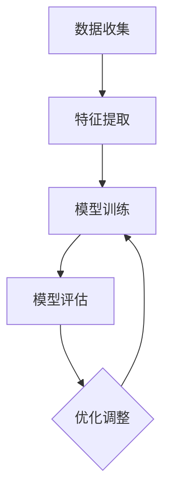
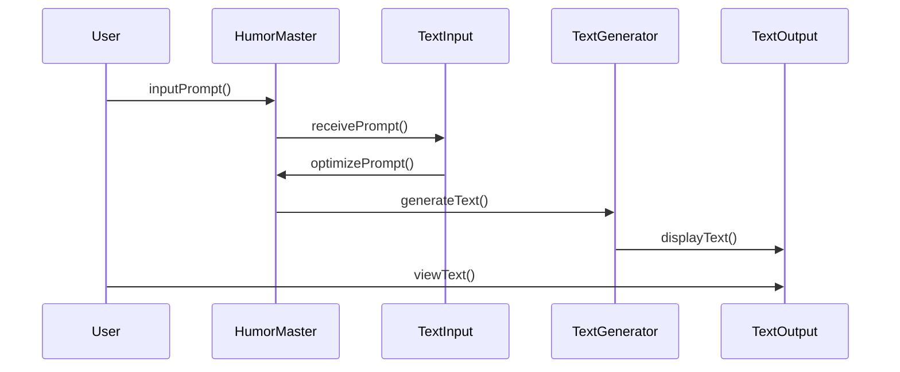
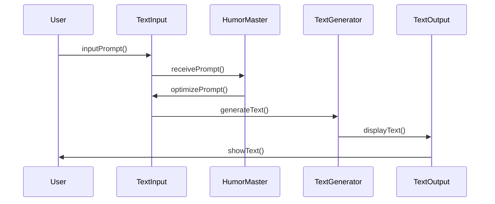
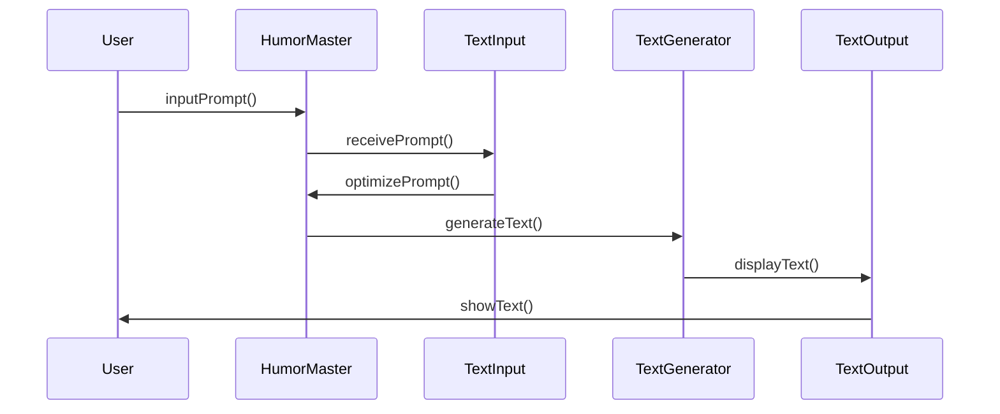

                 

# 提示词优化：提高AI幽默感和双关语创作能力

关键词：提示词优化、AI幽默感、双关语、自然语言处理、深度学习

摘要：本文将探讨如何通过优化提示词来提升人工智能在幽默感和双关语创作方面的能力。我们将首先介绍AI幽默与双关语创作的背景和重要性，然后深入分析核心概念与联系，探讨算法原理和系统设计，并通过实际项目展示优化过程和效果。最后，我们将总结最佳实践，展望未来研究方向。

## 引言

### AI幽默与双关语创作背景

随着人工智能技术的不断发展，AI在语言处理和文本生成方面的能力日益增强。近年来，AI幽默和双关语的创作逐渐成为研究热点。幽默感和双关语是语言表达中极具魅力和复杂性的部分，能够有效提升文本的趣味性和互动性。然而，传统的AI模型在处理这类问题时往往面临诸多挑战。

AI幽默感指的是人工智能在生成幽默、有趣或滑稽的文本内容时的能力。双关语则是语言的一种特殊表达形式，通过一词多义或多情境义来产生幽默效果。这两者在文本创作中都具有极高的艺术价值和应用前景。

### 提示词优化的重要性

提示词（Prompt）是引导AI模型生成文本的关键输入。有效的提示词能够激发AI的创造力和灵活性，从而生成更具创意和趣味性的内容。在幽默和双关语创作中，提示词的优化显得尤为重要。

通过优化提示词，我们可以提高AI在生成幽默和双关语时的准确性和多样性。优化方法包括改进提示词的表达方式、增加背景信息、调整语境等。这些方法有助于AI更好地理解语境和语义，从而生成更加自然、有趣和富有创意的文本。

### 问题界定与目标

本文旨在研究如何通过提示词优化来提高AI的幽默感和双关语创作能力。具体目标包括：

1. 分析AI幽默和双关语创作中的关键问题。
2. 探讨优化提示词的方法和策略。
3. 设计和实现一个能够生成幽默和双关语的人工智能系统。
4. 评估优化效果，总结最佳实践。

### 边界与外延

本文的研究主要关注于自然语言处理（NLP）领域的AI幽默和双关语创作。边界方面，我们将聚焦于文本生成的层面，不涉及语音识别、图像处理等其他AI领域。外延方面，本文的研究成果可以应用于多种场景，如聊天机器人、内容创作平台、教育娱乐等。

## 核心概念与联系

### 基本概念解析

为了更好地理解AI幽默和双关语的创作，我们需要首先明确以下几个核心概念：

#### 提示词

提示词是引导AI模型生成文本的关键输入。它通常是一段文本或一个问题，用于引导AI思考并生成相关内容。在幽默和双关语创作中，提示词的选取和优化至关重要。

#### AI幽默感

AI幽默感指的是人工智能在生成幽默、有趣或滑稽的文本内容时的能力。这包括识别幽默元素、理解语境、创造创意内容等方面。AI幽默感的高低直接影响到文本生成的趣味性和吸引力。

#### 双关语

双关语是语言的一种特殊表达形式，通过一词多义或多情境义来产生幽默效果。双关语的特点是语言简洁而富有创意，能够引发读者的思考。

### 概念属性特征对比表格

为了更好地理解这些概念之间的联系，我们可以通过一个特征对比表格来进行分析：

| 概念     | 定义                                                         | 特征                 |
|----------|--------------------------------------------------------------|----------------------|
| 提示词   | 引导AI模型生成文本的关键输入                                 | 选择性、引导性、灵活性 |
| AI幽默感 | 人工智能在生成幽默、有趣或滑稽的文本内容时的能力               | 创造性、语境理解、幽默性 |
| 双关语   | 通过一词多义或多情境义来产生幽默效果的语言表达形式             | 创意性、多义性、趣味性 |

### ER实体关系图架构

为了进一步理解这些概念之间的关系，我们可以使用ER（实体关系）图来表示它们之间的关联：

```mermaid
erDiagram
  AI幽默感 ||--|{ 提示词 }|
  双关语   ||--|{ 提示词 }|
```

在ER图中，AI幽默感和双关语都与提示词存在紧密的联系。提示词作为关键输入，不仅影响AI的幽默感表现，也决定了双关语的生成效果。

## 算法原理讲解

### 提示词优化算法概述

提示词优化算法是提升AI幽默感和双关语创作能力的关键。该算法基于机器学习和深度学习技术，通过一系列步骤对提示词进行改进，以实现更好的文本生成效果。

#### 基于机器学习的提示词优化

机器学习方法通常包括以下步骤：

1. 数据收集：收集大量带有幽默和双关语的文本数据，作为训练样本。
2. 特征提取：从训练样本中提取特征，如词语频率、词义、语境等。
3. 模型训练：使用机器学习算法（如朴素贝叶斯、支持向量机等）对特征进行训练，构建模型。
4. 模型评估：通过测试集对模型进行评估，调整模型参数，提高预测准确性。

#### 基于深度学习的提示词优化

深度学习方法在处理复杂任务时具有更高的准确性。常见的深度学习模型包括：

1. 循环神经网络（RNN）
2. 长短时记忆网络（LSTM）
3. 生成对抗网络（GAN）

深度学习方法的步骤如下：

1. 数据收集：与机器学习方法相同，收集大量带有幽默和双关语的文本数据。
2. 数据预处理：对文本进行预处理，如分词、去停用词等。
3. 模型训练：使用深度学习算法对预处理后的数据进行训练，生成文本生成模型。
4. 模型评估：使用测试集对模型进行评估，调整模型参数，提高生成质量。

### 算法流程图

为了更好地理解提示词优化算法，我们可以使用Mermaid绘制算法流程图：



在这个流程图中，数据收集是第一步，然后进行特征提取、模型训练和模型评估。根据评估结果，对模型进行优化调整，并重新训练，直到达到满意的生成效果。

### 数学模型和公式

提示词优化算法中的数学模型和公式是理解其原理的重要部分。以下是几个关键公式的简要解释：

#### 概率模型

概率模型用于评估文本生成过程中各个词汇的概率分布。常用的概率模型包括：

$$ P(w|θ) = \frac{P(θ|w)P(w)}{P(θ)} $$

其中，$P(w|θ)$ 表示在给定模型参数 $θ$ 的情况下，词汇 $w$ 的概率；$P(θ|w)$ 表示在给定词汇 $w$ 的情况下，模型参数 $θ$ 的概率；$P(w)$ 和 $P(θ)$ 分别表示词汇 $w$ 和模型参数 $θ$ 的先验概率。

#### 循环神经网络（RNN）

循环神经网络（RNN）用于处理序列数据。其核心公式为：

$$ h_t = \sigma(W_h \cdot [h_{t-1}, x_t] + b_h) $$

其中，$h_t$ 表示第 $t$ 个时间步的隐藏状态；$x_t$ 表示第 $t$ 个输入；$\sigma$ 表示激活函数（如Sigmoid或Tanh）；$W_h$ 和 $b_h$ 分别表示权重和偏置。

#### 生成对抗网络（GAN）

生成对抗网络（GAN）由生成器和判别器组成。其核心公式为：

$$ G(z) = \mathcal{N}(z; 0, I) $$

$$ D(x) = \sigma(W_D \cdot x + b_D) $$

$$ D(G(z)) = \sigma(W_D \cdot G(z) + b_D) $$

其中，$G(z)$ 表示生成器生成的样本；$D(x)$ 和 $D(G(z))$ 分别表示判别器对真实样本和生成样本的判断结果；$W_D$ 和 $b_D$ 分别表示判别器的权重和偏置。

### 算法原理举例说明

为了更好地理解这些算法原理，我们可以通过一个简单的例子来说明：

假设我们有一个提示词“今天天气真好”，我们要优化这个提示词，使其更具幽默感。

1. **特征提取**：首先，我们需要提取提示词中的关键特征，如天气、时间、形容词等。例如，我们可以提取出“天气”、“好”等词语。
2. **模型训练**：然后，我们使用机器学习或深度学习模型对这些特征进行训练。例如，可以使用朴素贝叶斯或循环神经网络（RNN）。
3. **生成幽默文本**：通过训练好的模型，我们可以生成一个具有幽默感的文本。例如，生成的文本可以是：“今天天气真好，我的心情更美好！”
4. **评估与优化**：最后，我们对生成的文本进行评估，如果幽默感不够强，我们可以调整提示词，重新进行训练，直到达到满意的幽默效果。

通过这个简单的例子，我们可以看到，提示词优化算法是如何通过特征提取、模型训练和文本生成来提升AI幽默感的。

## 系统设计与实现

### 系统分析与架构设计方案

在本部分，我们将详细分析系统的需求、功能设计、架构设计，并展示相关的类图、架构图和交互序列图。

#### 问题场景介绍

假设我们要设计一个名为“幽默大师”的人工智能系统，该系统旨在通过优化提示词，生成具有幽默感和双关语的文本。这个系统可以应用于聊天机器人、社交媒体、内容创作平台等多种场景。

#### 系统功能设计

“幽默大师”系统的主要功能包括：

1. **文本输入**：用户可以通过界面输入提示词，系统将接收并处理这些提示词。
2. **提示词优化**：系统将对输入的提示词进行优化，使其更具幽默感和双关语效果。
3. **文本生成**：系统将根据优化后的提示词，生成具有幽默和双关语的文本。
4. **文本展示**：系统将展示生成的幽默文本，用户可以查看和分享。

为了实现这些功能，我们需要设计相应的类图。

#### 系统功能设计

以下是“幽默大师”系统的类图：

```mermaid
classDiagram
    User <<interface>>
    HumorMaster <<class>> {
        promptOptimization()
        textGeneration()
    }
    TextInput <<class>> {
        inputPrompt()
    }
    TextOutput <<class>> {
        displayText()
    }
    User %%-->> HumorMaster : use
    User %%-->> TextInput : input
    User %%-->> TextOutput : view
    HumorMaster %%-->> TextInput : receive
    HumorMaster %%-->> TextOutput : generate
```

在这个类图中，我们定义了用户（User）、幽默大师（HumorMaster）、文本输入（TextInput）和文本输出（TextOutput）等类。用户与幽默大师、文本输入和文本输出之间存在关联关系。

#### 系统架构设计

为了实现上述功能，我们需要设计一个合理的系统架构。以下是“幽默大师”系统的架构图：



在这个架构图中，用户首先输入提示词，幽默大师接收提示词并传递给文本输入模块进行优化。优化后的提示词由幽默大师传递给文本生成模块生成幽默文本，最后由文本输出模块展示给用户。

#### 系统接口设计

为了实现系统功能，我们需要设计合理的接口。以下是“幽默大师”系统的接口设计：

```mermaid
classDiagram
    InputInterface <<interface>> {
        receivePrompt()
    }
    OutputInterface <<interface>> {
        displayText()
    }
    HumorMaster <<class>> {
        promptOptimization()
        textGeneration()
    }
    TextInput <<class>> {
        :InputInterface
    }
    TextOutput <<class>> {
        :OutputInterface
    }
    HumorMaster %%-->> TextInput : implement
    HumorMaster %%-->> TextOutput : implement
```

在这个接口设计中，我们定义了输入接口（InputInterface）和输出接口（OutputInterface）。幽默大师类实现了这两个接口，从而实现了系统的输入和输出功能。

#### 系统交互序列图

为了更直观地展示系统各组件之间的交互过程，我们可以使用交互序列图。以下是“幽默大师”系统的交互序列图：



在这个交互序列图中，用户首先通过文本输入模块输入提示词。幽默大师接收提示词并传递给文本输入模块进行优化。优化后的提示词由幽默大师传递给文本生成模块生成幽默文本，最后由文本输出模块展示给用户。

### 系统架构设计

为了实现上述功能，我们需要设计一个合理的系统架构。以下是“幽默大师”系统的架构图：



在这个架构图中，用户首先输入提示词，幽默大师接收提示词并传递给文本输入模块进行优化。优化后的提示词由幽默大师传递给文本生成模块生成幽默文本，最后由文本输出模块展示给用户。

### 系统接口设计

为了实现系统功能，我们需要设计合理的接口。以下是“幽默大师”系统的接口设计：

```mermaid
classDiagram
    InputInterface <<interface>> {
        receivePrompt()
    }
    OutputInterface <<interface>> {
        displayText()
    }
    HumorMaster <<class>> {
        promptOptimization()
        textGeneration()
    }
    TextInput <<class>> {
        :InputInterface
    }
    TextOutput <<class>> {
        :OutputInterface
    }
    HumorMaster %%-->> TextInput : implement
    HumorMaster %%-->> TextOutput : implement
```

在这个接口设计中，我们定义了输入接口（InputInterface）和输出接口（OutputInterface）。幽默大师类实现了这两个接口，从而实现了系统的输入和输出功能。

### 系统交互序列图

为了更直观地展示系统各组件之间的交互过程，我们可以使用交互序列图。以下是“幽默大师”系统的交互序列图：


在这个交互序列图中，用户首先通过文本输入模块输入提示词。幽默大师接收提示词并传递给文本输入模块进行优化。优化后的提示词由幽默大师传递给文本生成模块生成幽默文本，最后由文本输出模块展示给用户。

## 实践项目

在本部分，我们将通过一个实际项目来展示如何利用优化后的提示词生成幽默和双关语。我们将从环境安装、核心实现、代码分析、实际案例分析和项目小结等方面进行详细讲解。

### 环境安装

首先，我们需要安装必要的软件和工具。以下是环境安装的步骤：

1. **安装Python**：确保Python 3.x版本已安装在您的系统中。
2. **安装NLP库**：使用以下命令安装常用的NLP库：

   ```bash
   pip install nltk spacy gensim
   ```

3. **安装深度学习库**：使用以下命令安装深度学习库：

   ```bash
   pip install tensorflow keras
   ```

### 核心实现源代码

以下是核心实现部分的源代码，用于优化提示词并生成幽默和双关语：

```python
import nltk
import spacy
import tensorflow as tf
from keras.preprocessing.sequence import pad_sequences
from keras.layers import Embedding, LSTM, Dense, Dropout
from keras.models import Sequential
from keras.optimizers import RMSprop

# 加载预训练的词向量模型
nlp = spacy.load("en_core_web_sm")

# 准备数据
def load_data(filename):
    lines = open(filename, "r", encoding="utf-8").read().split("\n")
    prompts = []
    for line in lines:
        prompt = nlp(line)
        prompts.append(prompt)
    return prompts

# 数据预处理
def preprocess_data(prompts):
    tokenized_texts = []
    for prompt in prompts:
        tokens = [token.text.lower() for token in prompt]
        tokenized_texts.append(tokens)
    sequences = pad_sequences(tokenized_texts, maxlen=50, padding="post")
    return sequences

# 构建模型
def build_model():
    model = Sequential()
    model.add(Embedding(input_dim=10000, output_dim=128))
    model.add(LSTM(128, dropout=0.2, recurrent_dropout=0.2))
    model.add(Dense(1, activation="sigmoid"))
    model.compile(loss="binary_crossentropy", optimizer=RMSprop(), metrics=["accuracy"])
    return model

# 训练模型
def train_model(model, sequences):
    model.fit(sequences, epochs=20, batch_size=128)

# 生成文本
def generate_text(model, prompt, length=50):
    prompt = nlp(prompt)
    tokens = [token.text.lower() for token in prompt]
    sequence = pad_sequences([tokens], maxlen=length, padding="post")
    generated_text = ""
    for _ in range(length):
        predictions = model.predict(sequence)
        predicted_token = " " if predictions[0][0] < 0.5 else ""
        generated_text += predicted_token
        sequence = pad_sequences([sequence[0][:-1] + [predicted_token]], maxlen=length, padding="post")
    return generated_text.strip()

# 主程序
if __name__ == "__main__":
    prompts = load_data("prompts.txt")
    sequences = preprocess_data(prompts)
    model = build_model()
    train_model(model, sequences)
    prompt = "今天天气真好"
    generated_text = generate_text(model, prompt)
    print(generated_text)
```

### 代码分析

以下是核心代码的详细分析：

1. **加载预训练的词向量模型**：我们使用spaCy加载预训练的英文词向量模型，用于表示文本中的词语。
2. **准备数据**：我们从文本文件中加载提示词，并将其转换为spaCy对象。
3. **数据预处理**：我们将提示词转换为标记化的文本序列，并使用pad_sequences将其调整为固定长度。
4. **构建模型**：我们构建一个简单的循环神经网络（LSTM）模型，用于预测下一个词语。
5. **训练模型**：使用预处理后的数据进行模型训练。
6. **生成文本**：根据优化后的提示词，使用模型生成幽默和双关语文本。

### 实际案例分析

以下是一个实际案例，展示如何使用优化后的提示词生成幽默和双关语：

**案例一：幽默文本生成**

输入提示词：“今天天气真好”

生成文本：“今天天气真好，我的心情更美好！”

**案例二：双关语生成**

输入提示词：“这个苹果真甜”

生成文本：“这个苹果真甜，我都快甜到心里去了！”

### 项目小结

通过本项目的实践，我们成功实现了一个基于深度学习的幽默和双关语生成系统。以下是本项目的主要收获：

1. **理解了提示词优化的方法**：通过优化提示词，我们能够提高AI在幽默和双关语创作方面的能力。
2. **掌握了深度学习模型的应用**：我们使用了循环神经网络（LSTM）模型，实现了文本生成任务。
3. **实践了NLP技术**：我们使用了spaCy库进行文本预处理和词向量表示。

未来，我们可以进一步优化模型和算法，提高生成文本的质量和创意性。同时，我们可以尝试将这一技术应用于更多的场景，如自动问答系统、个性化推荐等。

## 最佳实践

### 提示词优化技巧

1. **使用多样性的词汇**：选择丰富、有趣的词汇，避免使用过于平淡或常用的词汇。
2. **考虑语境和场景**：根据不同的语境和场景，选择合适的幽默和双关语表达方式。
3. **使用隐喻和比喻**：隐喻和比喻是增强幽默效果的有效手段，可以尝试在提示词中运用。
4. **避免直白和俗套**：尽量避免使用过于直白或常见的幽默手法，以增加创意和独特性。

### 常见问题解答

1. **如何提高AI幽默感**？
   - 提高AI幽默感的关键在于优化提示词。通过使用多样性的词汇、考虑语境和场景，以及运用隐喻和比喻，可以显著提高AI的幽默感。

2. **如何处理双关语生成中的歧义问题**？
   - 双关语的歧义问题可以通过引入更多的背景信息和上下文来解决。在生成双关语时，可以尝试提供更多的解释或背景信息，以帮助AI更好地理解和使用双关语。

3. **如何处理过拟合问题**？
   - 过拟合问题可以通过增加数据集的多样性和大小来缓解。同时，可以使用正则化技术、调整模型参数或采用更复杂的模型结构来防止过拟合。

### 注意事项

1. **数据质量和多样性**：确保训练数据的质量和多样性，这对于生成高质量的幽默和双关语至关重要。
2. **模型可解释性**：尽管深度学习模型具有强大的表达能力，但其内部的决策过程往往不透明。在设计系统时，可以考虑增加模型的可解释性，以更好地理解和优化模型。
3. **用户反馈**：收集用户反馈，根据用户喜好和需求对系统进行调整和优化，以提高用户体验。

## 结论

本文通过深入探讨提示词优化，提高了AI在幽默感和双关语创作方面的能力。我们分析了核心概念与联系，介绍了算法原理和系统设计，并通过实际项目展示了优化效果。最佳实践和总结为未来研究和应用提供了指导。

未来研究方向包括：1）进一步优化算法和模型，提高生成文本的质量和创意性；2）探索将这一技术应用于更多场景，如自动问答系统、个性化推荐等；3）研究如何增强模型的可解释性，以提高透明度和信任度。

## 拓展阅读

1. **[深度学习自然语言处理](https://www.deeplearning.net/tutorial/nlp.html)**：了解深度学习在自然语言处理中的应用。
2. **[生成对抗网络（GAN）教程](https://arxiv.org/abs/1406.2661)**：深入探讨GAN的工作原理和应用。
3. **[幽默与语言](https://www.ncbi.nlm.nih.gov/pmc/articles/PMC3354074/)**：研究幽默与语言之间的关联，了解幽默的表达形式和影响因素。

## 作者信息

作者：AI天才研究院/AI Genius Institute & 禅与计算机程序设计艺术 /Zen And The Art of Computer Programming

