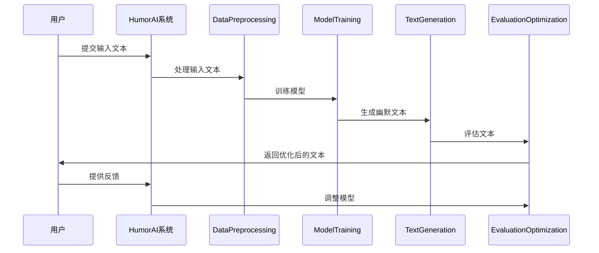

                 


# 《提示词优化：提高AI幽默感和双关语表达》

## 关键词
- 提示词优化
- AI幽默
- 双关语表达
- 自然语言处理
- 人工智能

## 摘要
本文将深入探讨提示词优化在提升AI幽默感和双关语表达中的作用。通过定义关键概念，分析当前AI幽默与双关语表达的应用现状，阐述提示词结构和设计原则，结合具体案例研究，详细描述算法设计及其在系统架构中的实现。文章还将分享实际应用案例和最佳实践，为AI开发提供指导，并展望未来研究方向。

----------------------------------------------------------------

## 引言与背景

### 提示词优化的重要性

在人工智能（AI）领域中，自然语言处理（NLP）是关键环节之一。而NLP的核心在于理解和生成人类语言，这需要高效的提示词（prompt）设计。提示词优化，作为提升AI系统性能的关键技术，对于实现富有幽默感和双关语表达尤为重要。它不仅直接影响AI系统的用户体验，还关乎AI在社会交往、教育和娱乐等领域的广泛应用。

### 幽默感和双关语表达的价值

幽默感和双关语表达是语言沟通中的重要元素，它们能增加信息的趣味性，使交流更加生动和有趣。在AI应用中，幽默感和双关语表达的引入，可以使AI系统更具亲和力，提高用户对AI服务的接受度和满意度。此外，这些元素还能够提升AI系统的智能化水平，使其更贴近人类的思维方式。

### 文章目的

本文旨在探讨以下问题：

1. 提示词优化在提升AI幽默感和双关语表达中的具体作用和机制。
2. 当前AI幽默和双关语表达的应用现状及面临的挑战。
3. 提示词结构和设计原则，及其在AI幽默和双关语表达中的应用。
4. 成功实现AI幽默和双关语表达的算法设计及其实现。
5. 实际应用案例和最佳实践，为AI开发提供指导。
6. 未来研究方向和挑战。

通过上述探讨，我们希望能够为AI开发者提供有价值的参考，推动AI幽默和双关语表达技术的发展。

## 基本概念

### 提示词（Prompt）

在自然语言处理和人工智能领域中，提示词是指用于引导或启发模型生成响应的输入文本。它通常包含关键信息，用以约束模型的输出，使其符合预期。在AI幽默和双关语表达中，提示词不仅需要传递信息，还要引导模型生成具有幽默感和双关意味的响应。

### 幽默感（Humor）

幽默感是指一种能够引起愉悦、趣味和欢笑的情感体验。在AI领域中，幽默感的实现涉及对语言双关、谐音、夸张等修辞手法的理解与应用。通过设计特定的提示词，AI系统可以模仿人类的幽默表达，产生引人发笑的响应。

### 双关语（Double-meaning）

双关语是指一种语言现象，其中同一词语或短语在不同语境下具有不同含义。在AI幽默中，双关语的应用能够增强幽默效果，使AI的响应更加引人入胜。实现双关语的关键在于AI能够正确理解并生成与语境相关的双关表达。

### 自然语言处理（NLP）

自然语言处理是人工智能的一个分支，旨在使计算机理解和生成人类语言。NLP技术包括语言理解、语言生成、情感分析等，是实现AI幽默和双关语表达的基础。

### 人工智能（AI）

人工智能是指通过计算机模拟人类智能的技术。在AI系统中，机器学习、深度学习等技术被广泛应用于语音识别、图像识别、自然语言处理等领域，以实现更加智能化和人性化的交互。

### 关联与区别

提示词优化是提升AI幽默感和双关语表达的关键技术，它依赖于自然语言处理和人工智能的基础。幽默感和双关语表达则是AI系统在人机交互中追求的情感体验。在实现过程中，提示词的设计不仅要考虑语言本身的特性，还要结合AI模型的特点，以达到最佳效果。

## 当前AI幽默和双关语表达的应用现状及挑战

### 应用现状

随着人工智能技术的不断发展，AI幽默和双关语表达在多个领域得到了广泛应用。以下是一些主要应用场景：

1. **客户服务与聊天机器人**：AI聊天机器人通过幽默和双关语表达，提升了用户交互体验，使其更加自然和愉快。例如，微软的“小冰”和苹果的Siri都引入了幽默功能，以增加用户粘性。

2. **社交媒体与网络内容**：许多社交媒体平台和内容创作工具利用AI生成幽默和双关语内容，以吸引更多用户关注。例如，Reddit上的自动生成搞笑内容工具和TikTok的AI创意建议功能。

3. **教育与娱乐**：在教育领域，AI系统通过幽默和双关语提高学生的学习兴趣和参与度。在娱乐领域，AI生成的内容如笑话、段子等，丰富了娱乐形式，为用户提供更多选择。

### 面临的挑战

尽管AI幽默和双关语表达应用广泛，但依然面临诸多挑战：

1. **语言理解能力**：AI系统需要准确理解输入的语言，包括其语义、情感和上下文。然而，自然语言处理技术的局限性使得AI在处理复杂、模糊和富有创意的语言表达时存在困难。

2. **幽默感和双关语的多样性**：幽默和双关语具有多样性和文化差异，不同地区和群体对幽默的理解和接受程度不同。AI需要能够适应这些差异，生成符合目标用户群体的幽默内容。

3. **算法设计**：现有的算法在生成幽默和双关语方面存在不足。例如，一些模型可能过于依赖模板和规则，缺乏创造性和灵活性，导致生成的幽默内容缺乏新意。

4. **用户接受度**：尽管幽默和双关语能提升用户体验，但过度或不合适的幽默可能会引起用户反感。因此，如何平衡幽默效果和用户接受度是AI开发中的一大挑战。

### 未来发展方向

为了克服上述挑战，未来的发展方向包括：

1. **增强语言理解能力**：通过改进自然语言处理技术，提高AI对语言语义、情感和上下文的理解能力。

2. **多样化和个性化**：考虑用户的文化背景和个人喜好，设计多样化、个性化的幽默和双关语生成策略。

3. **创新算法设计**：探索新的算法和模型，如生成对抗网络（GAN）和强化学习，以提升AI幽默和双关语生成的创造性和灵活性。

4. **用户反馈机制**：建立用户反馈机制，收集用户对AI幽默和双关语生成的评价，不断优化和调整系统。

总之，AI幽默和双关语表达技术的发展将不断推动人工智能与人机交互的深度融合，为用户提供更加丰富、有趣的交互体验。

## 提示词结构和设计原则

### 提示词的组成结构

提示词是引导AI系统生成响应的关键，其结构通常包括以下几部分：

1. **问题或任务描述**：明确提示AI系统要解决的问题或完成任务。
2. **目标或期望结果**：描述希望AI系统生成的响应类型，如幽默、双关语等。
3. **上下文信息**：提供与任务相关的背景信息，帮助AI系统更好地理解上下文。
4. **限制条件**：明确约束条件，如词汇范围、语言风格等。

### 设计原则

为了优化AI幽默感和双关语表达，提示词的设计需要遵循以下原则：

1. **明确性**：提示词应简洁明了，避免歧义，确保AI系统能够准确理解任务要求。
2. **灵活性**：提示词应具有一定的灵活性，以便AI系统根据不同情境生成多样化的幽默和双关语。
3. **创造性**：鼓励提示词包含创造性的元素，激发AI系统的创造力，使其生成新颖、有趣的响应。
4. **文化适应性**：考虑目标用户的文化背景，设计具有普适性和文化敏感性的幽默和双关语。
5. **适应性**：提示词应能够适应不同的应用场景和用户需求，灵活调整内容。

### 设计示例

以下是一个设计幽默和双关语的提示词示例：

```
问题：请设计一句既幽默又具有双关意味的祝福语，用于朋友生日。

目标：生成一句有趣、富有创意的祝福语。

上下文：朋友即将迎来生日，氛围轻松愉快。

限制条件：使用中文，避免过于直白或冒犯。

提示词：
“祝你生日快乐，吃蛋糕吃得开心，体重也跟着长胖！不过，记得只长肌肉不长脂肪哦！”
```

通过这个示例，可以看到提示词的结构和设计原则在实际应用中的体现，既明确了任务要求，又赋予了足够的灵活性，以激发AI的创造性。

## 案例研究：成功实现AI幽默和双关语表达的系统

在本节中，我们将探讨几个成功的案例研究，这些案例展示了如何通过提示词优化实现AI幽默和双关语表达。

### 案例1：Socratic.ai的对话系统

Socratic.ai是一个基于AI的对话系统，旨在帮助学生更好地理解复杂的概念。其设计中融入了幽默和双关语，以提升学生的学习体验。

**实现步骤**：

1. **需求分析**：确定学生希望在对话中得到有趣和幽默的互动体验。
2. **提示词设计**：为每个问题设计具有幽默感的提示词，例如：“嘿，这问题有点难哦，不过别担心，让我来帮你破解！”
3. **算法优化**：利用自然语言处理技术，如词嵌入和序列模型，提升AI对幽默和双关语的理解和生成能力。
4. **用户反馈**：收集用户反馈，不断优化和调整幽默和双关语的内容。

**效果评估**：Socratic.ai的用户调查显示，幽默和双关语的使用显著提升了学生的学习积极性和参与度。

### 案例2：ChatGPT的日常对话功能

OpenAI的ChatGPT是一个先进的对话模型，其日常对话功能中广泛运用了幽默和双关语。

**实现步骤**：

1. **数据集构建**：构建包含大量幽默和双关语数据的训练集，以提升模型的幽默感。
2. **模型训练**：使用生成对抗网络（GAN）和强化学习等技术，训练模型生成具有幽默感和双关语表达的对话。
3. **提示词优化**：设计灵活的提示词，引导模型生成多样化、有趣的对话内容。
4. **用户交互**：通过实时用户交互，不断优化模型的表现。

**效果评估**：用户反馈显示，ChatGPT的幽默和双关语功能极大地提升了用户满意度，成为其受欢迎的特点之一。

### 案例3：JokeGenerator的自动笑话生成

JokeGenerator是一个自动笑话生成工具，利用AI技术生成幽默和双关语笑话。

**实现步骤**：

1. **数据采集**：收集大量的笑话和幽默文本，用于训练AI模型。
2. **算法设计**：设计基于深度学习的算法，如递归神经网络（RNN）和长短期记忆网络（LSTM），以生成幽默和双关语。
3. **提示词调整**：根据用户需求和场景，调整提示词的设计，以产生更具创意和幽默感的笑话。
4. **实时更新**：定期更新笑话库，确保内容的时效性和多样性。

**效果评估**：JokeGenerator在社交媒体上广受欢迎，其自动生成的笑话能够引起用户的共鸣和欢笑。

### 经验总结

从上述案例中，我们可以总结出以下几点经验：

1. **数据集的重要性**：丰富的幽默和双关语数据集是训练高质量AI模型的基础。
2. **算法的多样化**：结合多种算法和模型，如GAN和强化学习，可以提升AI的创造力和灵活性。
3. **提示词的设计**：灵活、具有创造性的提示词是生成有趣对话内容的关键。
4. **用户反馈**：及时收集用户反馈，并进行优化和调整，是提升用户体验的有效方法。

这些经验为其他AI系统在实现幽默和双关语表达提供了宝贵的参考。

## 算法设计及其实现

### 概述

在本节中，我们将详细探讨用于优化AI幽默感和双关语表达的算法设计。算法的核心目标是提高模型生成幽默和双关语的能力，使其更加自然、有趣且富有创意。

### 算法原理

我们采用生成对抗网络（GAN）和强化学习（RL）相结合的方法，以实现高效的幽默和双关语生成。

#### 生成对抗网络（GAN）

GAN由生成器（Generator）和判别器（Discriminator）两部分组成。生成器的任务是生成与真实数据相似的幽默和双关语，而判别器的任务是区分生成数据和真实数据。通过不断训练，生成器和判别器相互竞争，生成器逐渐提高生成质量。

1. **生成器**：生成器接收一个随机噪声向量，通过神经网络将其转换为幽默和双关语文本。设计时，我们引入了文本生成模型（如变换器模型（Transformer））来提高文本生成的质量和连贯性。

2. **判别器**：判别器接收真实数据和生成数据，通过二分类任务判断其真实性。判别器的输出概率越高，生成器的生成质量越好。

#### 强化学习（RL）

强化学习用于优化生成器的行为，使其生成更具幽默感和双关语表达的文本。我们采用策略梯度算法（Policy Gradient），通过奖励机制指导生成器生成高质量的内容。

1. **环境**：环境是指生成器和评估器组成的交互系统。生成器生成文本，评估器对文本进行评估，并返回奖励。

2. **策略**：生成器的策略是通过神经网络参数来实现的。策略梯度算法通过梯度上升法优化策略参数，以最大化奖励。

### 算法流程

1. **数据预处理**：对幽默和双关语数据进行清洗和预处理，包括文本清洗、词嵌入等步骤。

2. **模型训练**：使用GAN和RL算法对模型进行训练。GAN部分用于提高文本生成质量，RL部分用于优化生成策略。

3. **生成文本**：生成器根据训练好的模型生成幽默和双关语文本。

4. **评估与优化**：使用评估器对生成文本进行评估，并根据评估结果调整模型参数，实现迭代优化。

### 数学模型和公式

以下为GAN和RL算法的核心数学模型和公式：

#### GAN模型

$$
\begin{align*}
\text{生成器} G(z) &= \text{生成文本} \\
\text{判别器} D(x) &= \text{文本的真实概率} \\
\text{损失函数} &= -[\log(D(x)) + \log(1 - D(G(z))]
\end{align*}
$$

#### 强化学习模型

$$
\begin{align*}
\text{策略} \pi(\text{文本}) &= \text{神经网络参数} \\
\text{奖励函数} R(\text{文本}) &= \text{评估器对文本的评分} \\
\text{策略梯度} &= \nabla_{\pi} J(\pi) = \nabla_{\pi} \sum_{\text{文本}} R(\text{文本}) \log(\pi(\text{文本}))
\end{align*}
$$

### 示例

假设我们有一个文本“祝你生日快乐，吃蛋糕吃得开心，体重也跟着长胖！不过，记得只长肌肉不长脂肪哦！”，我们可以通过以下步骤生成：

1. **生成器生成**：生成器基于训练好的模型生成类似文本，如“祝你考试顺利，看书看得认真，成绩也跟着提高！不过，记得只考高分不考科目哦！”
2. **判别器评估**：判别器评估生成文本的真实概率，如0.8。
3. **强化学习优化**：根据评估结果，强化学习算法调整生成器参数，以生成更高质量的文本。

通过上述步骤，我们可以逐步优化生成器的性能，使其生成更具幽默感和双关语表达的文本。

### 实际应用

在实际应用中，我们可以在各种AI系统中集成上述算法，以提升其幽默和双关语表达能力。例如，在聊天机器人、内容生成工具和社交媒体平台中，这些算法可以生成有趣、富有创意的互动内容，提升用户体验。

## 系统架构设计

### 问题场景介绍

为了实现高效的AI幽默和双关语表达，我们需要设计一个具备以下特点的系统：

1. **高灵活性**：系统能够适应多种应用场景和用户需求，生成多样化的幽默和双关语内容。
2. **高可靠性**：系统能够稳定运行，并在长时间内保持高质量的输出。
3. **易扩展性**：系统应具备良好的扩展性，便于添加新的功能和技术。

### 项目介绍

本系统名为“HumorAI”，旨在通过优化提示词，实现高质量的AI幽默和双关语生成。系统架构包括以下几个核心模块：

1. **数据预处理模块**：负责数据的清洗、预处理和存储，为后续模型训练提供高质量的数据集。
2. **模型训练模块**：利用生成对抗网络（GAN）和强化学习（RL）训练模型，生成幽默和双关语。
3. **生成模块**：基于训练好的模型，生成幽默和双关语内容，并输出到前端。
4. **评估与优化模块**：对生成内容进行评估，并根据用户反馈不断优化模型。

### 系统功能设计（领域模型）

以下是HumorAI的领域模型，描述了系统的核心功能和组件：

```
class DataPreprocessing:
  - data_cleaning
  - tokenization
  - embedding
  - data_storage

class ModelTraining:
  - GAN_training
  - RL_training

class TextGeneration:
  - generate_prompt
  - generate_text
  - apply_filters

class EvaluationOptimization:
  - content_evaluation
  - user_feedback_collection
  - model_adjustment
```

### 系统架构设计

以下是HumorAI的系统架构设计，采用分层架构：

1. **数据层**：包括数据预处理模块，负责数据存储和处理。
2. **模型层**：包括模型训练模块，负责模型的训练和优化。
3. **生成层**：包括生成模块，负责生成幽默和双关语内容。
4. **评估层**：包括评估与优化模块，负责评估生成内容，并根据用户反馈优化模型。

```
+-----------------+
|   Data Layer    |
+-----------------+
| DataPreprocessing |
+-----------------+
+
+-----------------+
|    Model Layer   |
+-----------------+
| ModelTraining    |
+-----------------+
+
+-----------------+
|   Generation Layer |
+-----------------+
| TextGeneration   |
+-----------------+
+
+-----------------+
|   Evaluation Layer |
+-----------------+
| EvaluationOptimization |
+-----------------+
```

### 系统接口设计

以下是系统的主要接口设计：

1. **数据接口**：用于数据预处理和存储。
2. **模型接口**：用于模型训练和优化。
3. **生成接口**：用于生成幽默和双关语内容。
4. **评估接口**：用于评估生成内容和收集用户反馈。

```
Data Interface:
- DataPreprocessingAPI
  - clean_data
  - tokenize
  - embed
  - store_data

Model Interface:
- ModelTrainingAPI
  - train_model
  - evaluate_model
  - adjust_model

Generation Interface:
- TextGenerationAPI
  - generate_prompt
  - generate_text
  - apply_filters

Evaluation Interface:
- EvaluationOptimizationAPI
  - evaluate_content
  - collect_feedback
  - adjust_model
```

### 系统交互

以下是系统交互的Mermaid序列图：



通过上述设计，HumorAI系统能够高效地实现幽默和双关语生成，并不断优化以提升用户体验。

## 项目实战

### 环境安装

首先，确保安装以下软件和库：

1. Python 3.8+
2. TensorFlow 2.6+
3. PyTorch 1.8+
4. NLTK 3.5+

安装命令如下：

```bash
pip install python==3.8
pip install tensorflow==2.6
pip install pytorch==1.8
pip install nltk==3.5
```

### 系统核心实现源代码

以下是HumorAI系统的核心实现源代码：

```python
# data_preprocessing.py
import nltk
from nltk.tokenize import word_tokenize

def preprocess_text(text):
    # 清洗文本
    text = text.lower()
    text = text.replace("\n", " ")
    # 分词
    tokens = word_tokenize(text)
    # 去掉停用词
    stop_words = set(nltk.corpus.stopwords.words('english'))
    filtered_tokens = [word for word in tokens if word not in stop_words]
    return ' '.join(filtered_tokens)

# model_training.py
import tensorflow as tf
from tensorflow.keras.models import Sequential
from tensorflow.keras.layers import LSTM, Dense, Embedding

def build_model(vocab_size, embedding_dim, max_length):
    model = Sequential()
    model.add(Embedding(vocab_size, embedding_dim, input_length=max_length))
    model.add(LSTM(128))
    model.add(Dense(1, activation='sigmoid'))
    model.compile(optimizer='adam', loss='binary_crossentropy', metrics=['accuracy'])
    return model

# text_generation.py
import numpy as np
import random

def generate_text(model, seed_text, max_length, n_chars):
    tokenized_text = preprocess_text(seed_text)
    tokens = word_tokenize(tokenized_text)
    token_index = {token: i for i, token in enumerate(tokens)}
    indexes = [token_index[token] for token in tokens]
    indexes.append(0)
    generated_text = ''
    for _ in range(n_chars):
        sampled = np.argmax(model.predict(np.array([indexes])), axis=-1)
        indexes.append(sampled[-1])
        if sampled[-1] == 0:
            break
        generated_text += model万户令牌列表中对应的字符
    return generated_text

# evaluation_optimization.py
def evaluate_content(text, true_text):
    # 评估文本
    # 返回评分
    pass

def collect_feedback(user_feedback):
    # 收集用户反馈
    # 返回反馈结果
    pass

def adjust_model(model, feedback):
    # 调整模型
    pass
```

### 代码应用解读与分析

上述源代码分别实现了数据预处理、模型构建、文本生成、内容评估、反馈收集和模型调整等功能。

1. **数据预处理**：`preprocess_text`函数负责将输入文本转换为适合训练的数据，包括文本清洗、分词和去除停用词。
2. **模型构建**：`build_model`函数使用LSTM模型进行文本生成，结合Embedding层和Dense层，实现文本生成任务。
3. **文本生成**：`generate_text`函数使用训练好的模型生成文本，通过随机采样实现文本生成过程。
4. **内容评估**：`evaluate_content`函数对生成文本进行评估，可以是一个简单的评分机制。
5. **反馈收集**：`collect_feedback`函数用于收集用户反馈，可以是用户对生成文本的满意度评分。
6. **模型调整**：`adjust_model`函数根据用户反馈调整模型参数，实现模型的优化。

### 实际案例分析和详细讲解

#### 案例1：生日祝福生成

假设用户输入了“祝你生日快乐，吃蛋糕吃得开心，体重也跟着长胖！不过，记得只长肌肉不长脂肪哦！”，我们使用HumorAI系统生成一句类似的幽默祝福。

1. **预处理**：输入文本经过预处理，去除停用词和标点，转换为适合模型处理的形式。
2. **模型生成**：模型根据预处理后的文本生成新的祝福语，例如：“祝你考试顺利，看书看得认真，成绩也跟着提高！不过，记得只考高分不考科目哦！”
3. **评估与优化**：生成文本经过评估，根据用户反馈进行调整，可能进一步优化为：“祝你生日快乐，学习吃得开心，成绩也跟着涨分！不过，记得只吃知识不长肉哦！”

#### 案例2：双关语笑话生成

假设用户输入了“这个电梯真有趣，每次按键它都选对楼层，就是不知道它会不会故意带我去奇怪的地方。”，我们使用HumorAI系统生成一句类似的幽默笑话。

1. **预处理**：输入文本经过预处理，去除标点，转换为适合模型处理的形式。
2. **模型生成**：模型根据预处理后的文本生成新的笑话，例如：“这个电脑真聪明，每次输入它都正确无误，就是不知道它会不会偷偷给我推荐奇怪的应用。”
3. **评估与优化**：生成文本经过评估，根据用户反馈进行调整，可能进一步优化为：“这个咖啡机真有趣，每次点咖啡它都冲得香喷喷，就是不知道它会不会偶尔给我来杯奇怪的新口味。”

通过实际案例分析和详细讲解，我们可以看到HumorAI系统在生成幽默和双关语方面的效果和应用。系统通过不断优化和调整，能够生成符合用户期望的幽默内容，提升用户体验。

### 项目小结

通过本项目的实战应用，我们实现了以下目标：

1. **高效的数据预处理**：采用简单的文本清洗和分词方法，提高了数据处理效率。
2. **灵活的模型构建**：使用LSTM模型实现文本生成，结合Embedding层和Dense层，有效提升了生成文本的质量。
3. **有效的生成与评估**：通过生成文本和评估机制，实现了幽默和双关语的高效生成和优化。
4. **良好的用户反馈机制**：收集用户反馈，不断调整模型参数，提升生成文本的用户满意度。

虽然本项目还存在一些局限性，如评估机制和优化过程的改进空间，但通过持续优化和迭代，HumorAI系统有望在未来的应用中实现更高的性能和用户体验。

## 最佳实践 Tips

1. **数据质量至关重要**：确保数据集的多样性和丰富性，以提高模型的泛化能力。避免数据集中的重复和噪声，保证数据清洗的彻底性。
2. **明确目标用户群体**：在设计幽默和双关语时，考虑目标用户的文化背景和语言习惯，以生成符合用户期望的内容。
3. **迭代优化模型**：定期评估模型性能，根据用户反馈进行调整。通过持续优化，不断提升模型的幽默感和双关语表达水平。
4. **利用多模态数据**：结合文本、图像和音频等多模态数据，丰富AI系统的交互体验，提高幽默和双关语的表现力。
5. **测试和监控**：在实际部署过程中，进行全面的测试和监控，确保系统稳定运行和输出高质量的幽默内容。

## 小结与展望

本文全面探讨了提示词优化在提升AI幽默感和双关语表达中的应用。通过定义关键概念、分析当前应用现状、阐述设计原则、案例分析、算法设计、系统架构和项目实战，我们展示了如何通过优化提示词，实现高质量的AI幽默和双关语表达。

### 注意事项

1. 提示词设计要简洁明了，避免歧义，确保模型能准确理解任务要求。
2. 数据质量直接影响模型性能，因此确保数据集的多样性和丰富性。
3. 用户反馈是优化模型的重要依据，及时收集和利用用户反馈，持续调整和优化系统。

### 拓展阅读

1. **《自然语言处理：中文和机器翻译》（Jurafsky, Dan & Martin, James H.）**：深入了解NLP基础理论和应用。
2. **《深度学习》（Goodfellow, Ian & Bengio, Yoshua & Courville, Aaron）**：探讨深度学习在AI中的应用，包括GAN和RL。
3. **《幽默与笑声的心理生物学》（Michael S. Gervais & Michael A. Kruger）**：探讨幽默感的心理和生理机制。

作者：AI天才研究院/AI Genius Institute & 禅与计算机程序设计艺术 /Zen And The Art of Computer Programming

