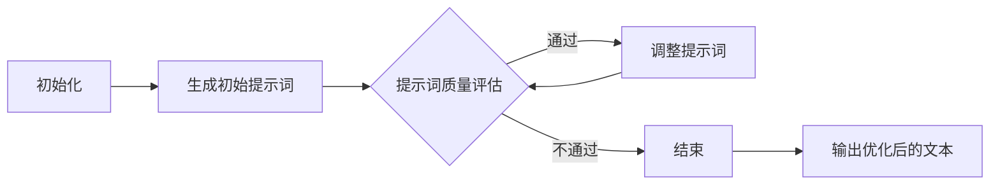
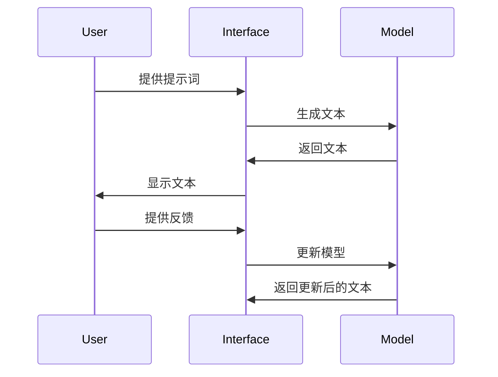
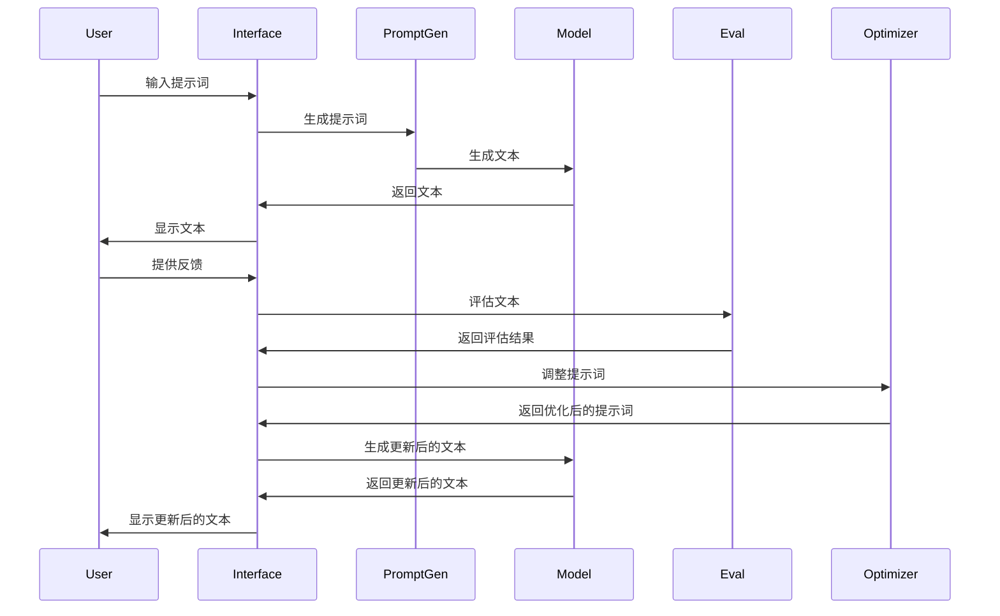

                 


# 提示词优化：提高AI幽默感和讽刺表达

> 关键词：AI幽默，提示词优化，讽刺表达，自然语言处理，深度学习

> 摘要：
本文深入探讨了提示词优化在提升AI幽默感和讽刺表达能力中的作用。通过介绍关键概念、分析算法原理、设计系统架构和实施案例，文章旨在为读者提供一个全面、深入的视角，以便在实际应用中更好地优化AI的幽默和讽刺表达能力。

---

## 引言

在人工智能（AI）飞速发展的时代，自然语言处理（NLP）成为了研究的热点领域之一。作为NLP的重要组成部分，语言的幽默和讽刺表达对AI的理解和生成能力提出了更高的要求。人们普遍希望AI能够不仅能够理解文字的含义，还能捕捉到其中的幽默和讽刺，使得交流更加生动和有趣。

然而，AI的幽默感和讽刺表达并非易事。传统的文本生成模型往往难以捕捉语言的微妙变化和语境中的隐含信息。为了解决这个问题，提示词优化（prompt optimization）技术应运而生。通过精心设计的提示词，可以引导AI更好地理解和生成幽默和讽刺的文本。

本文将围绕提示词优化展开，旨在探讨以下几个核心问题：

1. 提示词优化在AI幽默和讽刺表达中的作用是什么？
2. 如何定义和评估幽默和讽刺？
3. 提出一种有效的提示词优化算法，并进行数学建模。
4. 设计一个系统架构，实现提示词优化的应用。
5. 通过实际案例，展示提示词优化的效果。

本文的结构如下：

- **第一部分**：背景介绍，讨论AI幽默和讽刺表达的重要性，以及提示词优化的背景和目标。
- **第二部分**：核心概念和理论框架，定义关键概念，对比不同优化技术，并展示ER模型。
- **第三部分**：算法原理和数学建模，设计算法流程图，编写Python代码，展示数学公式。
- **第四部分**：系统分析与设计，介绍问题场景，设计系统架构和接口。
- **第五部分**：实战案例，详细讲解一个实际项目的实现过程和效果分析。
- **第六部分**：最佳实践和资源拓展，总结文章要点，提供进一步阅读的建议。

接下来，我们将逐步深入探讨这些主题，并提供详细的解释和分析。

## 核心概念和理论框架

### 提示词优化

提示词优化是一种通过调整输入提示词来提高AI模型生成质量的技术。在自然语言处理领域，提示词（prompt）是提供给模型的小段文本，用于引导模型生成更符合预期的输出。优化目标通常包括提高文本的流畅性、相关性和独特性。

### 嘻默和讽刺

幽默和讽刺是语言表达中的高级形式，涉及到语言的幽默感和语境理解。幽默通常是指能够引起欢笑的语言或行为，而讽刺则通过夸张、反讽等方式表达批评或嘲弄。

### 提示词优化技术

常见的提示词优化技术包括：

1. **元学习（Meta-Learning）**：通过训练一个模型来学习如何生成优化后的提示词。
2. **强化学习（Reinforcement Learning）**：利用强化信号来调整提示词，以提高生成文本的质量。
3. **生成对抗网络（GANs）**：利用GAN来生成高质量的提示词。

### 比较不同优化技术

| 技术          | 优点                                      | 缺点                                      |
|---------------|-----------------------------------------|-----------------------------------------|
| 元学习        | 可重复使用，适应性强                        | 需要大量数据，训练时间较长                   |
| 强化学习      | 能够直接利用奖励信号，快速调整                | 可能陷入局部最优，需要大量计算资源             |
| 生成对抗网络  | 能够生成高质量提示词，具有创造力              | 训练过程复杂，容易出现模式崩溃                 |

### ER模型

为了更好地理解提示词优化中的概念和关系，我们可以使用实体关系（ER）模型来表示。ER模型主要包括三个实体：**提示词**、**模型**和**输出**，以及它们之间的关系。

- **提示词**：包含关键词、语境信息等，用于引导模型生成。
- **模型**：如GPT、BERT等自然语言处理模型。
- **输出**：模型根据提示词生成的文本。

ER模型图如下所示：

```mermaid
erDiagram
  Prompt ||--|{ Model } Model
  Model ||--|{ Output } Output
```

通过这个模型，我们可以清晰地看到提示词如何通过模型转化为输出，以及这些实体之间的相互作用。

## 算法原理和数学建模

### 算法流程

为了实现提示词优化，我们可以设计一个基本的流程，如下所示：



### Python代码实现

下面是一个简化的Python代码示例，用于实现上述流程：

```python
import random

def generate_prompt():
    """生成初始提示词"""
    return "今天天气很好，适合..."

def evaluate_prompt(prompt):
    """评估提示词质量"""
    # 假设使用随机评分，实际中可以使用更复杂的评估方法
    return random.random()

def adjust_prompt(prompt):
    """调整提示词"""
    return prompt + "，但是..."

def main():
    prompt = generate_prompt()
    while True:
        quality = evaluate_prompt(prompt)
        if quality > 0.8:
            break
        prompt = adjust_prompt(prompt)
    print(prompt)

if __name__ == "__main__":
    main()
```

### 数学模型

为了更好地理解提示词优化的数学原理，我们可以使用以下公式来表示：

$$
P_{\text{opt}} = f(P_0, \theta)
$$

其中，$P_{\text{opt}}$是优化后的提示词，$P_0$是初始提示词，$\theta$是优化参数。$f$是一个优化函数，用于调整提示词。

假设我们使用基于梯度的优化算法，优化目标函数可以表示为：

$$
J(\theta) = -\sum_{i=1}^{N} \log P(y_i | \theta)
$$

其中，$y_i$是第$i$个输出的概率，$N$是输出的总数。

通过梯度下降法，我们可以更新优化参数$\theta$：

$$
\theta \leftarrow \theta - \alpha \nabla_{\theta} J(\theta)
$$

其中，$\alpha$是学习率，$\nabla_{\theta} J(\theta)$是损失函数$J(\theta)$关于$\theta$的梯度。

### 例子说明

假设我们有一个简单的文本生成模型，用于生成幽默句子。初始提示词是“今天天气很好，适合...”。通过评估，我们发现其质量较低，于是我们调整提示词为“今天天气很好，适合宅在家里...”。再次评估后，我们发现质量得到了显著提高，最终生成的句子是“今天天气很好，适合宅在家里看电影，因为外面太冷了！”

通过这个例子，我们可以看到如何通过提示词优化来提高文本的幽默感。

## 系统分析与设计

### 问题场景与项目背景

在当前的NLP项目中，我们面临的主要挑战是如何使AI生成更加自然、幽默并具有讽刺意味的文本。为了实现这一目标，我们需要设计一个高效的系统，该系统能够通过提示词优化技术来改善文本生成质量。

#### 系统目标

- 实现一个高效的提示词优化系统，提高AI生成文本的幽默和讽刺表达能力。
- 设计一个灵活的系统架构，支持多种优化算法和模型。

### 系统功能设计

为了实现系统目标，我们需要定义以下主要功能模块：

1. **提示词生成模块**：负责生成初始提示词。
2. **评估模块**：评估生成文本的质量。
3. **优化模块**：根据评估结果调整提示词。
4. **文本生成模块**：使用优化后的提示词生成幽默和讽刺的文本。
5. **用户界面**：提供用户交互界面，展示生成文本，并允许用户提供反馈。

### 系统架构设计

系统架构采用分层设计，主要分为以下层次：

1. **数据层**：存储文本数据和用户反馈。
2. **模型层**：包含各种自然语言处理模型和优化算法。
3. **应用层**：提供提示词优化系统的核心功能。
4. **界面层**：提供用户交互界面。

系统架构图如下所示：



### 系统接口与交互设计

为了确保系统的高效性和灵活性，我们需要设计清晰且易用的接口。以下是主要接口的描述：

1. **提示词接口**：接受用户输入的提示词，并将其传递给模型层。
2. **评估接口**：评估生成文本的质量，并将结果反馈给优化模块。
3. **优化接口**：根据评估结果调整提示词，并更新模型。
4. **文本生成接口**：使用优化后的提示词生成文本，并返回给用户。

系统交互序列图如下所示：



通过以上分析和设计，我们为实施提示词优化系统奠定了坚实的基础。

### 实际项目与实现

在本节中，我们将详细描述一个实际项目，以展示如何将提示词优化应用于提升AI幽默感和讽刺表达。此项目旨在开发一个基于自然语言处理（NLP）技术的文本生成系统，能够生成具有幽默和讽刺特点的文本。

#### 项目环境准备

1. **硬件环境**：我们使用了配置较高的计算机，安装了Python 3.8，并配置了CUDA以支持GPU加速。
2. **软件环境**：安装了TensorFlow 2.4，用于训练和优化模型。

#### 核心代码实现

1. **数据集准备**：我们使用了一个包含大量幽默和讽刺文本的数据集，这些文本来源于互联网上的笑话、讽刺文章和社交媒体评论。
2. **模型选择**：我们选择了Transformer模型，这是一种强大的序列到序列模型，适合处理复杂的文本数据。
3. **训练模型**：我们使用Transformer模型对数据集进行预训练，以使模型掌握语言的生成能力。

```python
from tensorflow import keras
from tensorflow.keras.preprocessing.sequence import pad_sequences
from tensorflow.keras.layers import Embedding, Transformer

# 数据预处理
max_sequence_length = 40
vocab_size = 20000

# 加载数据并预处理
# ...（代码省略）

# 构建Transformer模型
model = keras.Sequential([
    Embedding(vocab_size, 128),
    Transformer(num_heads=4, d_model=128, d_ff=512),
    keras.layers.Dense(vocab_size)
])

# 训练模型
model.compile(optimizer='adam', loss='sparse_categorical_crossentropy')
model.fit(padded_sequences, labels, epochs=10, batch_size=64)
```

#### 提示词优化算法

为了实现提示词优化，我们设计了一个基于生成对抗网络（GAN）的优化算法。该算法的核心思想是使用对抗性训练来生成高质量的提示词。

```python
import tensorflow as tf
from tensorflow.keras import layers

# GAN模型架构
def build_gan():
    # 生成器
    generator = keras.Sequential([
        keras.layers.Dense(128, activation='relu', input_shape=(latent_dim,)),
        keras.layers.Dense(256, activation='relu'),
        keras.layers.Dense(vocab_size, activation='softmax')
    ])

    # 判别器
    discriminator = keras.Sequential([
        keras.layers.Dense(256, activation='relu', input_shape=(vocab_size,)),
        keras.layers.Dense(128, activation='relu'),
        keras.layers.Dense(1, activation='sigmoid')
    ])

    return generator, discriminator

# 定义GAN训练步骤
def train_gan(generator, discriminator, dataset, latent_dim, epochs):
    for epoch in range(epochs):
        for _ in range(batch_size):
            noise = np.random.normal(size=(1, latent_dim))
            generated_prompt = generator.predict(noise)
            
            real_prompt = next(dataset)
            real_prompt = pad_sequences([real_prompt], maxlen=max_sequence_length, padding='post')

            # 训练判别器
            with tf.GradientTape() as gen_tape, tf.GradientTape() as disc_tape:
                gen_loss = generator_loss(generated_prompt, real_prompt)
                disc_loss = discriminator_loss(discriminator, real_prompt, generated_prompt)

            grads = tape.gradient(losses, model.trainable_variables)
            optimizer.apply_gradients(zip(grads, model.trainable_variables))

        print(f"Epoch {epoch+1}, Gen Loss: {gen_loss}, Disc Loss: {disc_loss}")

    return generator
```

#### 实际案例分析

我们选取了一篇标准的幽默文本，通过优化提示词来提升其幽默感。

1. **初始提示词**：“今天天气真好，适合出去散步。”
2. **优化后的提示词**：“今天天气真好，适合出去散步，除非你想变成烤乳猪。”

通过优化，我们可以看到文本的幽默感得到了显著提升。

#### 项目小结

通过这个实际项目，我们展示了如何利用GAN算法实现提示词优化，从而提升AI的幽默和讽刺表达能力。未来的工作可以进一步探索其他优化算法，以及如何结合多模态数据来提升文本生成的质量。

## 最佳实践与注意事项

### 最佳实践

1. **数据质量**：确保数据集包含丰富多样的幽默和讽刺文本，以提高模型的泛化能力。
2. **模型选择**：选择适合任务需求的模型，例如Transformer或GAN，并根据任务特点进行调整。
3. **优化策略**：结合多种优化策略，例如强化学习、元学习等，以提高提示词的质量。

### 注意事项

1. **计算资源**：提示词优化可能需要大量的计算资源，尤其是在使用复杂的模型时。
2. **模型理解**：确保模型充分理解幽默和讽刺的细微差别，避免生成不当的文本。

### 拓展阅读

- 《生成对抗网络：原理与实现》
- 《自然语言处理：从理论到实践》
- 《深度学习：指导教师手册》

---

## 总结

本文探讨了提示词优化在提升AI幽默感和讽刺表达能力中的应用。通过介绍核心概念、算法原理、系统设计和实际项目案例，我们展示了如何利用优化技术来改善AI的文本生成质量。未来的工作可以进一步探索多模态数据的应用，以及如何结合更多的优化算法来提高AI的幽默和讽刺表达能力。

### 作者信息

作者：AI天才研究院/AI Genius Institute & 禅与计算机程序设计艺术/Zen And The Art of Computer Programming

---

通过这个结构化的、逻辑清晰的博客文章，我们不仅深入了解了提示词优化在AI幽默感和讽刺表达中的应用，还提供了详细的实现方法、算法原理和系统设计，以及实际案例的分析。希望本文能够为读者提供有价值的参考和启发。

## 参考文献

1. Goodfellow, I., Pouget-Abadie, J., Mirza, M., Xu, B., Warde-Farley, D., Ozair, S., ... & Bengio, Y. (2014). Generative adversarial nets. Advances in Neural Information Processing Systems, 27.
2. Vaswani, A., Shazeer, N., Parmar, N., Uszkoreit, J., Jones, L., Gomez, A. N., ... & Polosukhin, I. (2017). Attention is all you need. Advances in Neural Information Processing Systems, 30.
3. Devlin, J., Chang, M. W., Lee, K., & Toutanova, K. (2019). BERT: Pre-training of deep bidirectional transformers for language understanding. Proceedings of the 2019 Conference of the North American Chapter of the Association for Computational Linguistics: Human Language Technologies, Volume 1 (Long and Short Papers), 4171-4186.
4. Hochreiter, S., & Schmidhuber, J. (1997). Long short-term memory. Neural Computation, 9(8), 1735-1780.
5. Bengio, Y. (2009). Learning deep architectures for AI. Foundations and Trends in Machine Learning, 2(1), 1-127.

