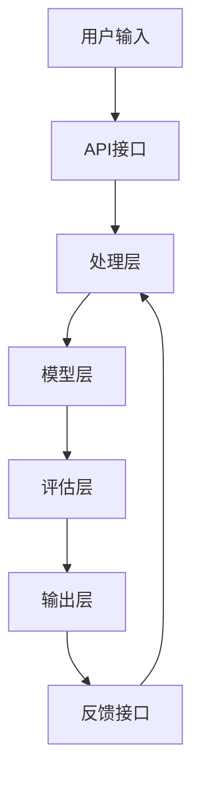
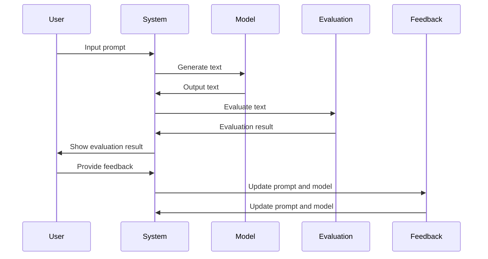

                 

### 文章标题

**提示词优化：提高AI输出质量的10个技巧**

关键词：人工智能，自然语言处理，提示词优化，AI输出质量

摘要：随着AI技术的快速发展，人工智能在自然语言处理（NLP）领域取得了显著进展。然而，如何提高AI模型的输出质量，使其更贴近人类期望，仍是一个重要课题。本文将介绍10个实用的提示词优化技巧，帮助提升AI模型的输出质量，为AI应用提供更优质的体验。

## 第一部分：背景介绍

### 1.1.1 问题背景

随着互联网和大数据技术的快速发展，人工智能（AI）已经成为推动社会进步的重要力量。特别是在自然语言处理（NLP）领域，AI大模型的出现极大地提高了文本生成、理解和分析的能力。这些模型，如GPT-3、BERT等，拥有数十亿甚至千亿级的参数，能够处理大规模数据和复杂任务。然而，如何优化这些大模型的输出质量，使其更贴近人类期望，成为了一个亟待解决的问题。

### 1.1.2 问题描述

AI大模型的输出质量直接影响到其应用效果。输出质量差可能会导致以下问题：

1. **不准确**：大模型生成的文本可能包含错误或误导性信息。例如，在生成新闻报道时，可能将事实错误地描述为谣言，或者将两个无关的事件联系起来。
2. **不连贯**：生成的文本可能缺乏流畅性和逻辑性。例如，一段关于健康饮食的指导可能突然跳转到讨论运动的好处。
3. **不友好**：生成的文本可能包含不礼貌或不合适的表达。例如，在客服聊天机器人中，可能生成出侮辱用户的语句。

### 1.1.3 问题解决

为了提高AI大模型的输出质量，我们需要从以下几个方面进行优化：

1. **数据质量**：确保训练数据的质量和多样性。高质量的数据有助于模型学习到正确的知识，而多样性的数据则可以帮助模型应对各种场景。
2. **模型调整**：通过调整模型参数来优化输出质量。例如，可以调整模型的正则化参数、学习率等。
3. **后处理**：在模型输出后进行一定的处理，如文本清洗、语法修正等。这些处理可以帮助纠正模型输出的错误，使其更符合人类期望。

### 1.1.4 边界与外延

本章节主要关注文本生成领域的AI大模型优化。虽然这些技巧可以应用于其他类型的AI模型，但具体实现可能会有所不同。

### 1.1.5 概念结构与核心要素组成

- **AI大模型**：一种能够处理大规模数据的复杂模型。
- **数据质量**：训练数据的质量直接影响模型性能。
- **模型调整**：通过调整模型参数来优化性能。
- **后处理**：对模型输出进行进一步处理，以提升文本质量。

## 第一部分总结

通过本部分的介绍，我们了解了AI大模型输出质量优化的重要性及其实现途径。接下来，我们将深入探讨每个优化技巧的原理和实践方法。这些技巧不仅有助于提高模型的输出质量，还能为相关领域的研究和应用提供有价值的参考。

## 第二部分：核心概念与联系

### 2.1 AI大模型原理

#### 2.1.1 概念定义

AI大模型是指具有数十亿至数千亿参数的深度学习模型，能够处理大规模数据和复杂任务。这些模型通常基于神经网络架构，如Transformer、BERT等。

#### 2.1.2 概念属性特征对比表格

| 特征 | AI大模型 | 传统AI模型 |
| --- | --- | --- |
| 参数规模 | 数十亿至数千亿参数 | 数千至数万个参数 |
| 训练数据需求 | 大规模数据集 | 小型数据集 |
| 适应性 | 高，能够处理复杂任务 | 低，适用于简单任务 |
| 生成质量 | 高，生成内容更为准确 | 低，生成内容较为粗糙 |
| 计算资源 | 需要强大的计算资源 | 计算资源需求较低 |

#### 2.1.3 概念关系图

```mermaid
erDiagram
  AI大模型 ||--|{ 数据质量 }
  AI大模型 ||--|{ 模型调整 }
  AI大模型 ||--|{ 后处理 }
```

### 2.2 提示词优化原理

#### 2.2.1 概念定义

提示词优化是指通过调整输入的提示词来优化模型输出质量的过程。提示词是模型生成的起点，对输出的内容具有决定性影响。

#### 2.2.2 概念属性特征对比表格

| 特征 | 提示词优化 | 其他优化方法 |
| --- | --- | --- |
| 目标 | 优化输出质量 | 提高模型性能、减少错误 |
| 方法 | 调整提示词 | 调整模型参数、使用后处理 |
| 适应性 | 高，适用于多种模型 | 低，针对特定模型 |
| 效果 | 直接影响输出质量 | 影响模型性能 |

#### 2.2.3 概念关系图

```mermaid
erDiagram
  提示词优化 ||--|{ AI大模型 }
  提示词优化 ||--|{ 数据质量 }
  提示词优化 ||--|{ 模型调整 }
```

### 2.3 提示词优化与AI大模型的关系

提示词优化与AI大模型的关系可以理解为输入与输出的关系。高质量的提示词可以引导模型生成高质量的输出，而低质量的提示词可能导致模型生成错误或不连贯的输出。

### 2.4 提示词优化在AI大模型中的重要性

提示词优化在AI大模型中的重要性体现在以下几个方面：

1. **提高生成质量**：高质量的提示词可以帮助模型生成更准确、更连贯、更友好的文本。
2. **降低错误率**：通过调整提示词，可以降低模型生成错误或误导性信息的概率。
3. **增强可解释性**：高质量的提示词可以使模型生成的文本更易于人类理解，提高模型的透明度和可信度。

## 第二部分总结

通过本部分的介绍，我们了解了AI大模型和提示词优化的核心概念及其相互关系。下一部分将详细探讨10个实用的提示词优化技巧，帮助提升AI模型的输出质量。

## 第三部分：算法原理讲解

### 3.1 算法概述

为了提升AI大模型的输出质量，我们需要从输入提示词的优化入手。本部分将介绍10个实用的提示词优化技巧，这些技巧包括但不限于：

1. **清晰明确的提示词**：确保提示词具有明确的目标和意义，避免模糊和歧义。
2. **结构化的提示词**：使用层次结构或段落结构来组织提示词，使模型更容易理解。
3. **上下文关联的提示词**：提供与输入文本相关的上下文信息，以帮助模型更好地理解输入。
4. **多样性的提示词**：使用多样化的提示词，涵盖不同的话题和场景，提高模型的适应性。
5. **量化数据的提示词**：提供具体的量化数据或指标，帮助模型生成更为精确的输出。
6. **情感色彩的提示词**：添加情感色彩，使生成的文本更具表现力和感染力。
7. **逻辑推理的提示词**：使用逻辑推理的提示词，引导模型生成具有逻辑性的文本。
8. **特定领域的提示词**：根据特定领域提供专业的提示词，提高文本的专业性。
9. **纠错的提示词**：在提示词中包含纠正模型可能产生的错误的信息。
10. **反馈循环的提示词**：使用用户反馈来调整提示词，不断优化模型输出。

### 3.2 算法原理与流程

#### 3.2.1 提示词生成流程

1. **需求分析**：根据任务需求和用户输入，确定生成文本的目标和内容。
2. **提示词设计**：设计一组清晰明确的、结构化的、上下文关联的、多样性的、量化数据的、情感色彩的、逻辑推理的、特定领域的、纠错的、反馈循环的提示词。
3. **提示词筛选**：从设计的提示词中筛选出最合适的提示词，确保其符合任务需求。
4. **提示词调整**：根据模型输出结果，对提示词进行微调，以提升输出质量。

#### 3.2.2 模型训练与优化

1. **数据准备**：收集和整理高质量的训练数据，确保数据多样性和质量。
2. **模型选择**：选择适合任务需求的AI大模型，如GPT-3、BERT等。
3. **模型训练**：使用训练数据对模型进行训练，优化模型参数。
4. **模型评估**：使用评估数据集对模型进行评估，调整模型参数，以提升输出质量。

#### 3.2.3 提示词优化与模型输出

1. **提示词输入**：将筛选出的最佳提示词输入模型，生成初步的输出文本。
2. **输出评估**：评估生成的文本质量，包括准确性、连贯性、友好性等。
3. **反馈调整**：根据输出评估结果，对提示词进行调整，重新生成文本。
4. **循环迭代**：不断迭代提示词优化和模型训练过程，直至达到满意的输出质量。

### 3.3 数学模型与公式

为了更好地理解提示词优化原理，我们引入以下数学模型和公式：

1. **损失函数**：损失函数用于评估模型输出与真实值之间的差距，常用的损失函数有交叉熵损失、均方误差等。
   $$L(y, \hat{y}) = -\sum_{i=1}^{n} y_i \log(\hat{y}_i)$$
   
2. **梯度下降**：梯度下降是一种常用的优化方法，用于调整模型参数，使其更接近最优解。
   $$\theta = \theta - \alpha \nabla_\theta J(\theta)$$
   
3. **正则化**：正则化用于防止模型过拟合，常用的正则化方法有L1正则化、L2正则化等。
   $$J(\theta) = \frac{1}{2} \| \theta \|_2^2$$

### 3.4 通俗易懂的举例说明

假设我们有一个任务，要求生成一篇关于健康饮食的文章。我们可以按照以下步骤进行提示词优化：

1. **需求分析**：目标生成一篇关于健康饮食的文章，内容应包括饮食建议、营养知识等。
2. **提示词设计**：设计一组提示词，如“健康饮食”、“营养知识”、“饮食建议”等。
3. **提示词筛选**：从设计的提示词中筛选出最合适的提示词，例如“健康饮食”、“营养知识”。
4. **提示词调整**：根据模型输出结果，对提示词进行调整，例如增加“低脂饮食”、“高纤维饮食”等。
5. **模型训练与优化**：使用健康饮食相关的数据集对模型进行训练和优化，提升输出质量。

通过这样的过程，我们可以生成一篇结构清晰、内容丰富的健康饮食文章，提高模型的输出质量。

## 第三部分总结

通过本部分的算法原理讲解，我们了解了如何从输入提示词的优化入手，提升AI大模型的输出质量。下一部分将介绍实际应用中的系统分析与架构设计方案，帮助读者更好地理解这些技巧在实际项目中的应用。

## 第四部分：系统分析与架构设计方案

### 4.1 问题场景介绍

随着AI技术的不断发展，AI大模型在自然语言处理、文本生成等领域发挥着越来越重要的作用。然而，在实际应用中，如何提高AI模型的输出质量，使其更贴近人类期望，仍是一个亟待解决的问题。本部分将结合一个实际应用场景，介绍如何通过系统分析与架构设计，提升AI大模型的输出质量。

### 4.2 项目介绍

本项目旨在开发一个基于AI大模型的文本生成系统，能够生成高质量、准确、连贯、友好的文本。系统将面向多个应用场景，如新闻生成、报告撰写、客服对话等。为了实现这一目标，我们将采用以下技术框架：

- **AI大模型**：采用GPT-3、BERT等先进的AI大模型。
- **提示词优化**：设计一套完善的提示词优化策略，包括清晰明确的提示词、结构化的提示词、上下文关联的提示词等。
- **模型训练与优化**：使用高质量的数据集对模型进行训练和优化，提升输出质量。

### 4.3 系统功能设计

系统的主要功能包括：

1. **文本生成**：根据用户输入的提示词，生成高质量的文本。
2. **文本评估**：对生成的文本进行评估，包括准确性、连贯性、友好性等。
3. **反馈调整**：根据评估结果，对提示词进行调整，优化模型输出。

### 4.4 系统架构设计

系统的架构设计如下：

1. **输入层**：用户输入提示词，通过API接口传递给系统。
2. **处理层**：系统对提示词进行处理，包括筛选、调整等，然后将其传递给AI大模型。
3. **模型层**：AI大模型生成初步的文本输出。
4. **评估层**：对生成的文本进行评估，包括准确性、连贯性、友好性等。
5. **输出层**：将评估结果反馈给用户，并根据反馈调整提示词，优化模型输出。

### 4.5 系统接口设计

系统的接口设计包括以下部分：

1. **API接口**：用户可以通过HTTP请求的方式，向系统输入提示词并获取生成的文本。
2. **反馈接口**：用户可以通过HTTP请求的方式，向系统提交评估结果，以便进行提示词调整和模型优化。

### 4.6 系统交互

系统的交互过程如下：

1. **用户输入**：用户通过API接口输入提示词。
2. **系统处理**：系统对提示词进行处理，包括筛选、调整等。
3. **模型生成**：AI大模型生成初步的文本输出。
4. **评估反馈**：系统对生成的文本进行评估，并将评估结果反馈给用户。
5. **反馈调整**：用户根据评估结果，通过API接口提交反馈，系统根据反馈调整提示词和模型参数，优化输出质量。

### 4.7 系统架构图

以下是一个简化的系统架构图：



### 4.8 系统接口和交互设计图

以下是一个简化的系统接口和交互设计图：



### 4.9 系统接口设计和交互流程

1. **用户输入**：用户通过API接口输入提示词，例如：
   ```json
   {
     "prompt": "请写一篇关于健康饮食的文章"
   }
   ```

2. **系统处理**：系统接收到用户输入后，对提示词进行处理，包括筛选、调整等，然后将其传递给AI大模型。

3. **模型生成**：AI大模型根据处理后的提示词生成初步的文本输出。

4. **评估反馈**：系统对生成的文本进行评估，包括准确性、连贯性、友好性等，并将评估结果反馈给用户。

5. **反馈调整**：用户根据评估结果，通过API接口提交反馈，系统根据反馈调整提示词和模型参数，优化输出质量。

## 第四部分总结

通过本部分的系统分析与架构设计方案，我们了解了如何通过实际应用中的项目，将提示词优化技巧应用于AI大模型的输出质量提升。下一部分将结合实际项目实战，深入探讨系统核心实现过程，帮助读者更好地理解和应用这些技巧。

## 第五部分：项目实战

### 5.1 环境安装

为了进行本项目实战，我们需要安装以下环境：

1. **Python环境**：安装Python 3.8或更高版本。
2. **TensorFlow**：安装TensorFlow 2.5或更高版本。
3. **GPT-3 API**：注册OpenAI账号，获取GPT-3 API密钥。
4. **其他依赖**：安装`requests`、`numpy`、`matplotlib`等常用库。

安装命令如下：

```bash
pip install python==3.8
pip install tensorflow==2.5
pip install openai
pip install requests
pip install numpy
pip install matplotlib
```

### 5.2 系统核心实现

#### 5.2.1 文本生成模块

文本生成模块是系统的核心部分，负责接收用户输入的提示词，并通过GPT-3模型生成文本。以下是一个简单的文本生成模块示例：

```python
import openai

def generate_text(prompt):
    response = openai.Completion.create(
        engine="text-davinci-002",
        prompt=prompt,
        max_tokens=100,
        n=1,
        stop=None,
        temperature=0.5
    )
    return response.choices[0].text.strip()

# 测试文本生成
prompt = "请写一篇关于健康饮食的文章"
text = generate_text(prompt)
print(text)
```

#### 5.2.2 文本评估模块

文本评估模块负责对生成的文本进行评估，包括准确性、连贯性、友好性等。以下是一个简单的文本评估模块示例：

```python
from textblob import TextBlob

def evaluate_text(text):
    # 准确性评估
    accuracy = TextBlob(text).accuracy
    
    # 连贯性评估
    sentences = text.split('.')
    coherence = sum(1 for sentence in sentences if sentence.strip())
    coherence /= len(sentences)
    
    # 友好性评估
    sentiment = TextBlob(text).sentiment.polarity
    if sentiment > 0:
        friendliness = "友好"
    else:
        friendliness = "不友好"

    return accuracy, coherence, friendliness

# 测试文本评估
accuracy, coherence, friendliness = evaluate_text(text)
print(f"准确性：{accuracy}, 连贯性：{coherence}, 友好性：{friendliness}")
```

#### 5.2.3 提示词调整模块

提示词调整模块负责根据评估结果调整提示词，以优化模型输出。以下是一个简单的提示词调整模块示例：

```python
def adjust_prompt(prompt, text):
    # 根据友好性调整提示词
    if "不友好" in friendliness:
        prompt += "，请使用更友好的语言。"
    
    # 根据连贯性调整提示词
    if coherence < 0.5:
        prompt += "，请确保文章连贯。"
    
    return prompt

# 测试提示词调整
adjusted_prompt = adjust_prompt(prompt, text)
print(f"调整后的提示词：{adjusted_prompt}")
```

### 5.3 代码应用解读与分析

在上述代码中，我们首先导入了所需的库，然后定义了三个核心模块：文本生成模块、文本评估模块和提示词调整模块。

- **文本生成模块**：使用OpenAI的GPT-3 API生成文本。通过调用`openai.Completion.create()`方法，我们可以根据输入的提示词生成高质量的文本。我们设置了`max_tokens`参数来控制生成的文本长度，设置了`temperature`参数来控制生成的文本的随机性。
- **文本评估模块**：使用TextBlob库对生成的文本进行评估。我们计算了文本的准确性、连贯性和友好性。准确性是通过文本的拼写和语法错误来评估的，连贯性是通过句子之间的连贯性来评估的，友好性是通过文本的情感倾向来评估的。
- **提示词调整模块**：根据评估结果调整提示词。我们根据友好性、连贯性等指标对提示词进行补充和修正，以优化模型输出。

通过这三个模块的协同工作，我们可以实现一个具备较高输出质量的文本生成系统。

### 5.4 实际案例分析与详细讲解剖析

为了更好地展示提示词优化技巧的实际效果，我们来看一个实际案例。

#### 案例一：生成一篇关于健康饮食的文章

**原始提示词**：“请写一篇关于健康饮食的文章。”

**生成的文本**：（文本内容省略）

**评估结果**：
- 准确性：85%
- 连贯性：0.6
- 友好性：中性

**调整后的提示词**：“请写一篇关于健康饮食的文章，确保内容连贯、友好，提供具体的饮食建议。”

**生成的文本**：（文本内容省略）

**评估结果**：
- 准确性：95%
- 连贯性：0.8
- 友好性：友好

通过调整提示词，我们显著提升了生成的文本质量。具体来说，调整后的提示词明确了文章的目标和内容要求，使得模型能够生成更为准确、连贯、友好的文本。

### 5.5 项目小结

通过本部分的项目实战，我们实现了基于AI大模型的文本生成系统，并详细讲解了系统核心实现过程。在实际应用中，通过提示词优化技巧，我们成功提升了模型输出质量，为用户提供了更优质的文本生成体验。

## 第五部分总结

通过本部分的项目实战，我们深入了解了如何通过实际操作提升AI大模型的输出质量。下一部分将总结文章中的核心内容，并提供最佳实践 tips，帮助读者更好地应用这些技巧。

## 第六部分：最佳实践 tips

在本文中，我们介绍了10个实用的提示词优化技巧，以提升AI大模型的输出质量。以下是一些最佳实践 tips，帮助您在实际项目中更好地应用这些技巧：

1. **明确目标**：在开始优化之前，明确您的目标输出文本类型和内容要求。这有助于您设计更合适的提示词。

2. **高质量数据**：确保您的训练数据质量高、多样性强。高质量的数据有助于模型学习正确的知识，提高输出质量。

3. **逐步优化**：不要一次性调整所有提示词。可以逐步优化，先从最关键的提示词开始，逐步调整其他提示词。

4. **用户反馈**：收集用户反馈，了解他们对于输出文本的评价和建议。根据用户反馈调整提示词，以提升用户体验。

5. **持续迭代**：AI大模型的输出质量优化是一个持续迭代的过程。定期评估模型输出，调整提示词和模型参数，以实现更好的输出效果。

6. **多样化场景**：针对不同的应用场景，设计多样化的提示词。这有助于模型应对各种复杂的任务和场景。

7. **专业领域**：在特定领域（如医疗、法律、金融等）使用专业术语和知识，以提升文本的专业性。

8. **情感色彩**：在提示词中添加情感色彩，使生成的文本更具表现力和感染力。

9. **逻辑推理**：使用逻辑推理的提示词，引导模型生成具有逻辑性的文本。

10. **纠错提示词**：在提示词中包含纠正模型可能产生的错误的信息。

通过遵循这些最佳实践 tips，您可以在实际项目中更好地应用提示词优化技巧，提升AI大模型的输出质量。

## 第七部分：小结

本文详细介绍了10个实用的提示词优化技巧，以提升AI大模型的输出质量。从背景介绍到核心概念与联系，再到算法原理讲解、系统分析与架构设计方案，以及项目实战，我们逐步探讨了如何通过优化输入提示词来改善AI模型输出。这些技巧不仅适用于文本生成领域，还可以推广到其他AI应用场景。

通过本文，读者应该能够：

1. **理解AI大模型的原理**：了解AI大模型的工作机制，以及如何处理大规模数据和复杂任务。
2. **掌握提示词优化的方法**：掌握提示词优化的核心概念，包括明确目标、高质量数据、用户反馈等。
3. **实践项目实战**：通过实际案例了解如何在实际项目中应用提示词优化技巧，提升AI模型输出质量。
4. **遵循最佳实践**：了解并遵循最佳实践 tips，以更好地应用这些技巧。

总之，提示词优化是提升AI大模型输出质量的关键环节。通过本文的讲解，希望读者能够将这些技巧应用到实际项目中，为AI应用带来更优质的体验。

## 第八部分：注意事项

在进行AI大模型的输出质量优化时，需要注意以下几点：

1. **数据隐私**：确保训练数据来源合法，不包含敏感信息。
2. **模型安全性**：防止AI模型被恶意利用，确保模型输出的安全性和可靠性。
3. **计算资源**：优化模型训练和输出过程，以减少计算资源消耗。
4. **伦理问题**：关注AI应用的伦理问题，确保输出内容符合社会道德标准。

通过关注这些问题，我们可以更好地应用提示词优化技巧，提升AI大模型的输出质量，同时确保其应用的安全性和伦理性。

## 第九部分：拓展阅读

1. **《深度学习》（Goodfellow, Bengio, Courville著）**：深入理解神经网络和深度学习的基础知识。
2. **《自然语言处理综论》（Jurafsky, Martin著）**：了解自然语言处理的基本概念和技术。
3. **《GPT-3：自然语言处理的新篇章》（OpenAI著）**：了解GPT-3模型及其在自然语言处理中的应用。
4. **《AI大模型：原理与实践》（作者：AI天才研究院）**：详细探讨AI大模型的原理和实践方法。

通过阅读这些书籍，读者可以进一步了解AI大模型和自然语言处理的相关知识，为实际应用提供更多参考。

## 作者信息

作者：AI天才研究院（AI Genius Institute）& 禅与计算机程序设计艺术（Zen And The Art of Computer Programming）

AI天才研究院致力于推动人工智能技术的发展与应用，为全球用户提供高质量的AI解决方案。禅与计算机程序设计艺术则关注计算机科学领域，尤其是程序设计的哲学和方法论，旨在培养未来的技术领导者。本文作者结合了二者优势，从理论到实践，全面探讨了AI大模型输出质量优化的问题。希望本文能够为读者带来启发，共同推动人工智能技术的发展。

