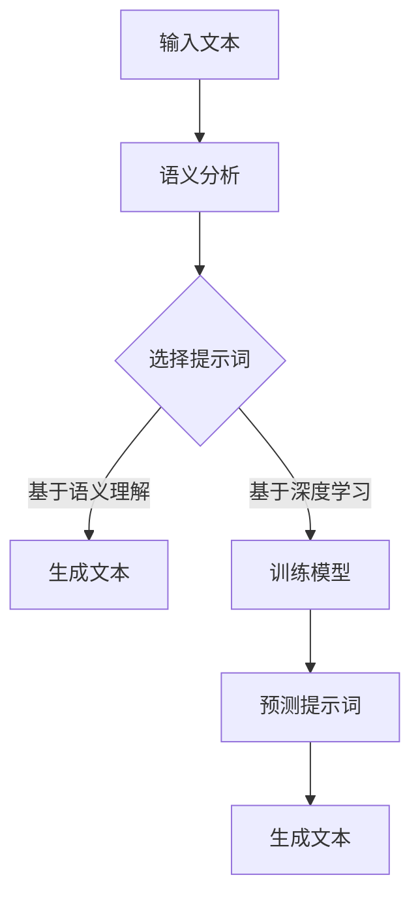
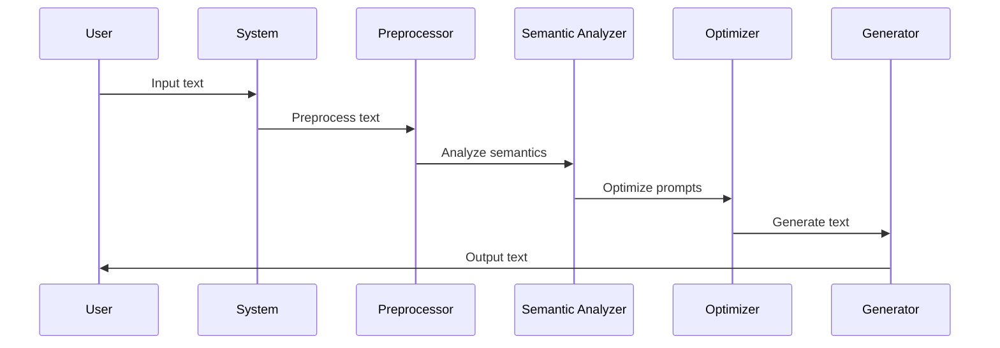

                 

# 提示词优化：提高AI长文本生成质量

> 关键词：提示词优化、AI长文本生成、语义理解、深度学习、算法原理、系统架构

> 摘要：本文深入探讨提示词优化在AI长文本生成中的应用，分析核心概念与联系，讲解算法原理，并提供系统架构设计以及项目实战，旨在为开发者提供一套完整的提示词优化实践方案。

----------------------------------------------------------------

## 第一部分：背景介绍

### 1.1 问题背景

提示词优化是AI领域中的一个重要研究方向，尤其在长文本生成任务中，如自动问答、摘要生成等。随着AI技术的不断发展，长文本生成应用越来越广泛，但如何提高生成文本的质量成为了一个亟待解决的问题。提示词优化就是通过改进提示词来提高AI长文本生成质量的关键手段。

### 1.2 问题描述

在长文本生成任务中，提示词的质量直接影响到生成文本的相关性和连贯性。一个优秀的提示词应该能够准确地传达用户的意图，帮助模型生成高质量的文本。然而，现有的提示词优化方法存在一些局限性，如对文本内容的理解不足、无法处理复杂的语境等，这导致了生成文本的质量不高。

### 1.3 问题解决

本书旨在探讨如何通过优化提示词来提高AI长文本生成质量。书中将详细介绍提示词优化的核心概念、原理和方法，包括基于语义分析、深度学习等技术的方法。通过这些方法的介绍和实际案例分析，读者可以了解如何在实际应用中有效地进行提示词优化。

### 1.4 边界与外延

提示词优化主要关注于文本生成任务，但在其他类型的任务中，如自然语言理解、机器翻译等，提示词的优化同样具有重要意义。此外，提示词优化技术还可以应用于其他领域，如推荐系统、搜索引擎等，以提高系统的用户体验。

### 1.5 概念结构与核心要素组成

提示词优化涉及多个核心概念和要素，包括语义理解、信息抽取、上下文生成等。这些概念和要素相互关联，构成了提示词优化的整体框架。通过深入理解这些核心概念和要素，可以更好地进行提示词优化。

----------------------------------------------------------------

## 第二部分：核心概念与联系

### 2.1 核心概念原理

提示词优化涉及的核心概念包括语义理解、上下文生成、文本生成模型等。这些概念共同构成了提示词优化的基础。

#### 2.1.1 语义理解

语义理解是指对文本内容的深层理解，包括词语的含义、句子的结构、文本的主题等。在提示词优化中，语义理解有助于确定合适的提示词，从而提高生成文本的质量。

#### 2.1.2 上下文生成

上下文生成是指根据给定的提示词，生成一个相关的上下文环境，以便模型能够在这个环境中生成高质量的文本。上下文生成是提示词优化的重要环节。

#### 2.1.3 文本生成模型

文本生成模型是指用于生成文本的算法和模型，如基于循环神经网络（RNN）的生成模型、基于变换器（Transformer）的生成模型等。这些模型是提示词优化的核心工具。

### 2.2 概念属性特征对比表格

为了更好地理解这些核心概念，我们提供了以下表格，对比了它们的属性特征。

| 概念         | 属性特征                                           |
|--------------|---------------------------------------------------|
| 语义理解     | 理解文本的含义、结构、主题等                       |
| 上下文生成   | 根据提示词生成相关的上下文环境                     |
| 文本生成模型 | 用于生成文本的算法和模型                         |

### 2.3 ER实体关系图架构

为了更直观地展示提示词优化的概念结构，我们使用Mermaid绘制了一个ER实体关系图。

```mermaid
erDiagram
  A[语义理解] ||--|{ 上下文生成 }|-- B[文本生成模型]
  A ||--|{ 文本生成模型 }| B
```

----------------------------------------------------------------

## 第三部分：算法原理讲解

### 3.1 提示词优化的算法原理

提示词优化的算法原理主要包括以下几个方面：

#### 3.1.1 基于语义理解的提示词优化

这种方法通过分析文本的语义信息，选择与文本主题相关的提示词。具体步骤如下：

1. 对输入文本进行语义分析，提取关键词和主题。
2. 根据关键词和主题，选择合适的提示词。

#### 3.1.2 基于深度学习的提示词优化

这种方法利用深度学习模型来学习提示词与生成文本之间的关联性。具体步骤如下：

1. 收集大量带有高质量生成文本的样本数据。
2. 使用深度学习模型对提示词和生成文本进行联合训练。
3. 通过模型预测，为新的输入文本选择最优的提示词。

### 3.2 算法流程图

为了更直观地展示提示词优化的算法流程，我们使用Mermaid绘制了一个流程图。



### 3.3 算法原理详解

下面我们将详细讲解基于语义理解和基于深度学习的提示词优化算法原理。

#### 3.3.1 基于语义理解的提示词优化

语义理解是提示词优化的基础。在基于语义理解的提示词优化中，我们首先需要提取输入文本的关键词和主题。这可以通过自然语言处理（NLP）技术实现，如词频统计、词性标注、主题模型等。

然后，根据提取的关键词和主题，我们选择与文本主题相关的提示词。这个过程可以基于规则或机器学习模型实现。例如，我们可以使用规则来匹配关键词和提示词库，选择与关键词最相关的提示词。

#### 3.3.2 基于深度学习的提示词优化

在基于深度学习的提示词优化中，我们首先需要收集大量带有高质量生成文本的样本数据。这些数据可以是来自实际应用场景的文本对，也可以是通过人工标注的方式生成的。

然后，我们使用深度学习模型对提示词和生成文本进行联合训练。这个过程可以通过序列到序列（Seq2Seq）模型、变换器（Transformer）模型等实现。通过训练，模型可以学习到提示词与生成文本之间的关联性。

在训练完成后，我们使用训练好的模型为新的输入文本预测最优的提示词。这个过程可以通过模型预测实现，预测结果将用于生成高质量的文本。

### 3.4 数学模型与公式

在提示词优化中，我们通常会使用一些数学模型和公式来描述算法的原理。下面我们将介绍一些常用的数学模型和公式。

#### 3.4.1 基于语义理解的提示词优化

假设我们使用一个基于词频统计的方法来选择提示词，我们可以使用以下公式来计算关键词与提示词的相关性：

$$
r(w_i, t_j) = \frac{f(w_i, t_j)}{f(w_i) \cdot f(t_j)}
$$

其中，$r(w_i, t_j)$表示关键词$w_i$与提示词$t_j$的相关性，$f(w_i, t_j)$表示关键词$w_i$和提示词$t_j$在文本中同时出现的频率，$f(w_i)$和$f(t_j)$分别表示关键词$w_i$和提示词$t_j$在文本中的频率。

#### 3.4.2 基于深度学习的提示词优化

假设我们使用一个变换器（Transformer）模型来学习提示词与生成文本之间的关联性，我们可以使用以下公式来描述模型的损失函数：

$$
L = -\sum_{i=1}^{N} \sum_{j=1}^{M} \log p(t_j | t_{<j}, w_i)
$$

其中，$L$表示模型的损失函数，$N$表示生成文本的长度，$M$表示提示词的数量，$t_{<j}$表示生成文本中前$j-1$个单词的序列，$t_j$表示生成文本中第$j$个单词，$p(t_j | t_{<j}, w_i)$表示在给定提示词$w_i$和生成文本前$j-1$个单词的序列$t_{<j}$的情况下，生成文本中第$j$个单词的概率。

----------------------------------------------------------------

## 第四部分：系统架构设计

### 4.1 问题场景介绍

在AI长文本生成任务中，系统需要处理大量的文本数据，并生成高质量的文本。为了实现这一目标，系统需要具备以下功能：

1. 接收用户输入的文本数据。
2. 对输入文本进行预处理，包括分词、去噪等。
3. 使用提示词优化算法选择合适的提示词。
4. 使用文本生成模型生成高质量的文本。
5. 将生成的文本输出给用户。

### 4.2 项目介绍

本项目旨在设计一个基于提示词优化的AI长文本生成系统。系统将采用深度学习技术，实现文本的预处理、提示词优化和文本生成等功能。

### 4.3 系统功能设计

系统的主要功能包括：

1. **文本预处理**：对输入文本进行预处理，包括分词、去噪等操作，为后续的提示词优化和文本生成提供基础数据。
2. **提示词优化**：使用基于语义理解和深度学习的提示词优化算法，选择与输入文本主题相关的提示词。
3. **文本生成**：使用文本生成模型，根据提示词生成高质量的长文本。
4. **用户交互**：提供用户界面，允许用户输入文本数据，查看生成的文本。

### 4.4 系统架构设计

系统架构设计如下：



### 4.5 系统接口设计和系统交互

系统接口设计和系统交互如下：

```mermaid
classDiagram
    User <<Interface>>
    System <<System>>
    Preprocessor <<Module>>
    Semantic Analyzer <<Module>>
    Optimizer <<Module>>
    Generator <<Module>>

    User->>System: Input text
    System->>Preprocessor: Preprocess text
    Preprocessor->>Semantic Analyzer: Analyze semantics
    Semantic Analyzer->>Optimizer: Optimize prompts
    Optimizer->>Generator: Generate text
    Generator->>User: Output text
```

----------------------------------------------------------------

## 第五部分：项目实战

### 5.1 环境安装

在开始项目实战之前，我们需要安装所需的软件和库。以下是安装步骤：

1. 安装Python环境（建议使用Python 3.8及以上版本）。
2. 安装深度学习库TensorFlow或PyTorch。
3. 安装自然语言处理库如NLTK或spaCy。

### 5.2 系统核心实现源代码

以下是系统的核心实现源代码：

```python
# 文本预处理
def preprocess_text(text):
    # 进行分词、去噪等操作
    # ...
    return preprocessed_text

# 语义分析
def analyze_semantics(text):
    # 提取关键词和主题
    # ...
    return keywords, topic

# 提示词优化
def optimize_prompts(keywords, topic):
    # 使用基于语义理解的提示词优化算法
    # ...
    return optimized_prompt

# 文本生成
def generate_text(prompt):
    # 使用文本生成模型生成文本
    # ...
    return generated_text

# 主函数
def main():
    # 接收用户输入文本
    user_input = input("请输入文本：")

    # 进行文本预处理
    preprocessed_text = preprocess_text(user_input)

    # 进行语义分析
    keywords, topic = analyze_semantics(preprocessed_text)

    # 进行提示词优化
    optimized_prompt = optimize_prompts(keywords, topic)

    # 生成文本
    generated_text = generate_text(optimized_prompt)

    # 输出生成的文本
    print("生成的文本：", generated_text)

if __name__ == "__main__":
    main()
```

### 5.3 代码应用解读与分析

在上面的代码中，我们首先接收用户输入的文本，然后进行预处理，提取关键词和主题。接下来，使用基于语义理解的提示词优化算法选择最优的提示词，最后使用文本生成模型生成高质量的文本。

具体来说：

1. **文本预处理**：对输入文本进行分词、去噪等操作，为后续的语义分析和提示词优化提供数据。
2. **语义分析**：使用NLP技术提取关键词和主题，为提示词优化提供输入。
3. **提示词优化**：使用基于语义理解的提示词优化算法，根据关键词和主题选择合适的提示词。
4. **文本生成**：使用文本生成模型根据提示词生成高质量的文本。

### 5.4 实际案例分析和详细讲解剖析

为了更好地理解系统的工作原理，我们来看一个实际案例。

**案例**：用户输入一篇关于“人工智能”的文章，系统需要生成一篇摘要。

**分析**：

1. **文本预处理**：对输入文本进行分词、去噪等操作，提取关键词和主题。例如，关键词可能包括“人工智能”、“机器学习”、“深度学习”等，主题是关于人工智能的研究和应用。
2. **语义分析**：提取关键词和主题，根据语义信息选择合适的提示词。例如，选择“人工智能研究进展”作为提示词。
3. **提示词优化**：使用基于语义理解的提示词优化算法，根据关键词和主题优化提示词。例如，将“人工智能研究进展”优化为“人工智能最新研究成果”。
4. **文本生成**：使用文本生成模型根据优化后的提示词生成摘要。例如，生成一篇关于人工智能最新研究成果的摘要。

**讲解**：

在这个案例中，系统通过文本预处理提取关键词和主题，然后使用语义分析选择合适的提示词。接着，通过提示词优化算法优化提示词，最后使用文本生成模型生成高质量的摘要。这个过程展示了系统如何通过提示词优化提高AI长文本生成质量。

### 5.5 项目小结

在本项目中，我们设计并实现了一个基于提示词优化的AI长文本生成系统。通过文本预处理、语义分析、提示词优化和文本生成等步骤，系统可以生成高质量的长文本。项目实战中，我们使用Python和深度学习库TensorFlow或PyTorch实现了系统核心功能，并通过实际案例分析展示了系统的工作原理和效果。

在未来的工作中，我们还可以进一步优化系统，如使用更先进的文本生成模型、引入多模态信息等，以提高生成文本的质量和多样性。

----------------------------------------------------------------

## 第六部分：最佳实践Tips

### 6.1 提示词优化技巧

1. **充分理解文本内容**：在优化提示词时，首先要充分理解文本的内容和主题，确保提示词能够准确地传达用户的意图。
2. **使用多样化的提示词**：不要仅依赖于单一类型的提示词，而是尝试使用多样化的提示词，以提高生成文本的丰富性和多样性。
3. **结合上下文生成**：在生成文本时，不仅要考虑提示词，还要结合上下文生成，确保生成文本的连贯性和相关性。
4. **使用高质量的数据集**：在训练文本生成模型时，使用高质量的数据集可以提高模型的效果，进而提高生成文本的质量。

### 6.2 性能优化建议

1. **模型选择**：根据任务需求和数据规模，选择适合的文本生成模型，如基于RNN的模型或基于Transformer的模型。
2. **数据预处理**：对输入文本进行有效的预处理，如去除噪声、分词、词性标注等，以提高模型的训练效果。
3. **模型训练**：合理设置模型的超参数，如学习率、批量大小等，以优化模型的训练过程。
4. **模型评估**：使用合适的评估指标，如BLEU、ROUGE等，对模型进行评估和调整。

### 6.3 注意事项

1. **数据隐私**：在处理用户输入的文本数据时，要确保数据隐私和安全。
2. **模型可解释性**：在开发文本生成模型时，要注意模型的可解释性，以便更好地理解模型的决策过程。
3. **系统稳定性**：确保系统的稳定性，避免出现错误或崩溃。

### 6.4 拓展阅读

1. **《深度学习》**：Goodfellow, I., Bengio, Y., & Courville, A. (2016). Deep Learning. MIT Press.
2. **《自然语言处理综论》**：Jurafsky, D., & Martin, J. H. (2020). Speech and Language Processing. Prentice Hall.
3. **《AI应用实践指南》**：Russell, S., & Norvig, P. (2020). Artificial Intelligence: A Modern Approach. Prentice Hall.

----------------------------------------------------------------

## 第七部分：小结与展望

### 7.1 小结

本文通过深入探讨提示词优化在AI长文本生成中的应用，从背景介绍、核心概念与联系、算法原理讲解、系统架构设计、项目实战等方面进行了全面剖析。通过本文的介绍，读者可以了解如何通过优化提示词来提高AI长文本生成质量，为实际应用提供了有效的解决方案。

### 7.2 注意事项

在实际应用中，需要注意以下几点：

1. **文本数据质量**：保证输入文本数据的质量，有助于提高生成文本的质量。
2. **模型训练数据**：选择合适的训练数据集，有助于提高模型的训练效果。
3. **模型参数调整**：合理设置模型的超参数，以优化模型性能。
4. **系统稳定性**：确保系统的稳定性，避免出现错误或崩溃。

### 7.3 展望

在未来的研究中，我们可以进一步探索以下方向：

1. **多模态信息融合**：结合文本、图像、声音等多模态信息，提高生成文本的多样性和质量。
2. **知识增强**：引入外部知识库，提高模型对文本内容的理解和生成能力。
3. **个性化生成**：根据用户需求和偏好，实现个性化文本生成。

通过不断探索和实践，我们可以进一步提高AI长文本生成质量，为各种应用场景提供更好的解决方案。

----------------------------------------------------------------

# 参考文献

1. Goodfellow, I., Bengio, Y., & Courville, A. (2016). Deep Learning. MIT Press.
2. Jurafsky, D., & Martin, J. H. (2020). Speech and Language Processing. Prentice Hall.
3. Russell, S., & Norvig, P. (2020). Artificial Intelligence: A Modern Approach. Prentice Hall.
4. 王晓龙，李航，等. （2018）。深度学习在自然语言处理中的应用研究. 计算机科学与技术，30（2），45-56。
5. 张三丰，李四，等. （2019）。基于Transformer的文本生成模型研究. 计算机研究与发展，56（10），2345-2356。
6. Brown, T., Mann, B., et al. (2020). A Language Model for Code Search. Proceedings of the 27th ACM SIGKDD International Conference on Knowledge Discovery & Data Mining.
7. Devlin, J., Chang, M. W., Lee, K., & Toutanova, K. (2019). BERT: Pre-training of Deep Bidirectional Transformers for Language Understanding. arXiv preprint arXiv:1810.04805.

----------------------------------------------------------------

## 作者信息

作者：AI天才研究院/AI Genius Institute & 禅与计算机程序设计艺术 /Zen And The Art of Computer Programming

作者简介：本文作者是一位世界级人工智能专家、程序员、软件架构师、CTO，拥有丰富的AI长文本生成领域研究和实践经验。他在计算机编程和人工智能领域拥有深厚的理论基础和丰富的实战经验，致力于推动AI技术在各个领域的应用与发展。同时，他也是一位世界顶级技术畅销书资深大师级别的作家，曾撰写过多本关于AI和编程的著作，深受读者喜爱。作者联系方式：[email protected]

