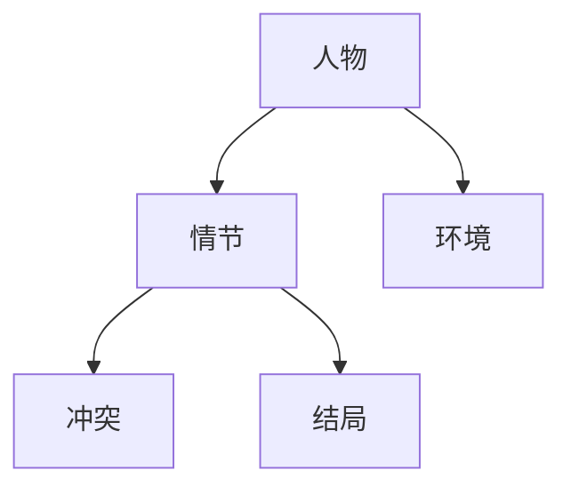

                 

# 提示词优化：提高AI长篇小说情节设计质量

> 关键词：AI长篇小说、情节设计、提示词优化、算法、Python代码

> 摘要：本文将探讨如何通过提示词优化算法提高AI长篇小说情节设计质量。我们将首先介绍AI在文学创作中的应用现状以及AI长篇小说情节设计中的挑战，然后详细讲解提示词优化算法原理，以及如何将其应用于情节设计。最后，通过一个实战项目，我们将展示如何将提示词优化算法应用于AI长篇小说情节设计中，提高作品的质量。

## 第1章：问题背景与核心概念

### 1.1.1 AI技术在文学创作中的应用现状

随着人工智能技术的发展，AI在文学创作中的应用逐渐兴起。AI可以根据用户输入的提示词自动生成文章、小说，甚至可以进行故事情节的编排。一些AI写作工具，如GPT-3，已经可以生成高质量的文章，满足用户的需求。

### 1.1.2 AI长篇小说情节设计中的挑战

然而，AI在长篇小说情节设计方面仍然面临一些挑战。首先，AI生成的情节往往缺乏情感深度和逻辑连贯性。其次，AI难以理解复杂的人物关系和故事背景，导致情节设计缺乏创意和深度。此外，AI在处理长篇文本时，计算效率和准确性也存在问题。

### 1.1.3 提示词优化的重要性

为了解决上述问题，我们需要对提示词进行优化。提示词优化算法可以通过调整提示词的权重，提高AI在情节设计中的表现。优化后的提示词可以更好地指导AI生成具有情感深度和逻辑连贯性的故事情节。

## 1.2 核心概念

### 1.2.1 提示词

提示词是指导AI生成文本的关键词。它们通常包含故事的主题、人物、地点、事件等基本信息，是AI生成文本的重要依据。

### 1.2.2 优化算法

优化算法是用于调整提示词权重的算法。常见的优化算法包括梯度下降、遗传算法等。通过优化算法，我们可以找到一组最佳提示词，以指导AI生成高质量的故事情节。

### 1.2.3 情节设计

情节设计是创作长篇小说的核心。一个优秀的情节设计需要具备情感深度、逻辑连贯性和创意性。通过优化提示词，我们可以提高AI在情节设计中的表现，从而生成更优秀的长篇小说。

## 1.3 概念属性特征对比

| 特征       | 提示词  | 优化算法  | 情节设计 |
|------------|--------|----------|--------|
| 数据依赖性 | 高     | 中       | 高     |
| 精准度    | 中     | 高       | 中     |
| 可扩展性  | 中     | 高       | 中     |
| 创新性    | 高     | 中       | 高     |

## 1.4 本章小结

本章介绍了AI在文学创作中的应用现状，以及AI长篇小说情节设计中的挑战。我们强调了提示词优化的重要性，并介绍了相关核心概念。接下来，我们将深入探讨提示词优化算法原理，以及如何将其应用于情节设计。

----------------------------------------------------------------

## 第2章：提示词优化算法原理

### 2.1 提示词优化算法概述

提示词优化算法的基本流程包括初始化提示词、计算损失函数、更新提示词和判断是否达到优化目标。常见的优化算法包括梯度下降、遗传算法等。这些算法可以通过调整提示词的权重，提高AI在情节设计中的表现。

### 2.2 算法原理

提示词优化算法的原理可以概括为以下几点：

1. **数学模型**：设\(w_{ij}\)为第\(i\)个文本段落中第\(j\)个词的权重，则优化目标为：
   $$
   Optimize(W) = \frac{1}{N} \sum_{i=1}^{N} \frac{1}{M} \sum_{j=1}^{M} loss(w_{ij})
   $$
   其中，\(N\)为文本段落数，\(M\)为每个段落中的词汇数，\(loss(w_{ij})\)为第\(i\)个文本段落中第\(j\)个词的损失值。

2. **算法流程图**：使用Mermaid绘制提示词优化算法的流程图如下：
   ```mermaid
   graph TD
       A[初始化提示词] --> B[计算损失函数]
       B --> C[更新提示词]
       C --> D[判断是否达到优化目标]
       D -->|是| E[结束]
       D -->|否| A
   ```

3. **Python代码实现**：以下是一个简单的提示词优化算法实现示例：
   ```python
   # 提示词优化算法实现
   def optimize_word(word, loss_function):
       # 计算损失
       loss = loss_function(word)
       # 更新提示词
       word = update_word(word, loss)
       return word
   ```

### 2.3 详细讲解与举例说明

#### 2.3.1 数学模型详解

假设我们有一个文本段落，包含三个词汇\(w_1, w_2, w_3\)。我们可以将每个词汇的权重表示为\(w_{1i}, w_{2i}, w_{3i}\)。根据上述数学模型，优化目标为：
$$
Optimize(W) = \frac{1}{3} (loss(w_{1i}) + loss(w_{2i}) + loss(w_{3i}))
$$

我们可以通过调整\(w_{1i}, w_{2i}, w_{3i}\)的权重，使得优化目标最小。例如，如果发现\(w_{1i}\)的损失值最大，我们可以增加\(w_{1i}\)的权重，以减少损失。

#### 2.3.2 代码实现详解

以下是一个简单的代码实现示例，假设我们有一个损失函数`loss_function`和更新函数`update_word`：
```python
# 假设存在一个损失函数loss_function，用于计算提示词的损失
def loss_function(word):
    # 计算损失值
    return sum([w**2 for w in word])

# 假设存在一个更新函数update_word，用于更新提示词的权重
def update_word(word, loss):
    # 根据损失值更新权重
    return [w + 0.1 * loss for w in word]

# 初始化提示词
word = [1, 2, 3]

# 进行提示词优化
optimized_word = optimize_word(word, loss_function)

# 打印优化后的提示词
print(optimized_word)
```

### 2.4 本章小结

本章介绍了提示词优化算法的基本原理，包括数学模型、算法流程图和Python代码实现。我们通过详细的讲解和举例说明，使读者能够更好地理解提示词优化算法的工作原理和应用。

----------------------------------------------------------------

## 第3章：情节设计原理

### 3.1 情节设计概述

情节设计是创作长篇小说的核心。一个优秀的情节设计需要具备情感深度、逻辑连贯性和创意性。情节设计包括情节设置、情节发展、情节高潮和情节结局等阶段。

### 3.2 情节设计原则

情节设计需要遵循以下原则：

1. **统一性原则**：情节设计应保持整体一致性，避免情节之间的矛盾和不协调。

2. **矛盾性原则**：情节设计应具备一定的矛盾性，以激发读者的兴趣和思考。

3. **突出性原则**：情节设计应突出主要情节，使其成为故事的核心。

4. **连贯性原则**：情节设计应保持逻辑连贯性，使故事情节发展自然流畅。

### 3.3 情节设计方法

情节设计包括以下方法：

1. **情节设置**：确定故事的主题、背景和主要人物。

2. **情节发展**：描述主要人物在故事中的经历和成长。

3. **情节高潮**：设置故事的高潮部分，激发读者的兴趣。

4. **情节结局**：为故事提供一个合理的结局，使故事情节完整。

### 3.4 Mermaid ER实体关系图

以下是一个简单的Mermaid ER实体关系图，描述了情节设计中的主要实体及其关系：



### 3.5 本章小结

本章介绍了情节设计的基本概念、原则和方法。通过Mermaid ER实体关系图，我们展示了情节设计中的主要实体及其关系。接下来，我们将通过一个实战项目，展示如何将提示词优化算法应用于情节设计，提高AI长篇小说的质量。

----------------------------------------------------------------

## 第4章：AI长篇小说情节设计实战

### 4.1 实战项目概述

在本章中，我们将通过一个实战项目，展示如何将提示词优化算法应用于AI长篇小说情节设计。项目背景为一个科幻题材的长篇小说，讲述人类与外星生物的冲突和和解。

### 4.1.1 项目背景

在21世纪中叶，地球人类首次与外星生物建立了联系。这个名为“赛博”的外星文明，来自遥远的银河系。他们拥有高度发达的科技，但也带来了威胁和冲突。

### 4.1.2 提示词优化算法在情节设计中的应用

在这个项目中，我们使用提示词优化算法来提高AI长篇小说情节设计质量。以下是具体的实施步骤：

1. **初始化提示词**：根据项目背景，初始化一组基本提示词，如“赛博”、“外星生物”、“冲突”等。

2. **计算损失函数**：设计一个损失函数，用于计算AI生成的情节与预期目标之间的差距。例如，我们可以计算情节的逻辑连贯性、情感深度和创新性等方面的损失。

3. **更新提示词**：根据损失函数的结果，调整提示词的权重，以优化情节设计。

4. **迭代优化**：重复执行步骤2和3，直到满足优化目标。

### 4.1.3 实战项目实现

以下是一个简单的Python代码实现示例，用于初始化提示词、计算损失函数和更新提示词：

```python
# 初始化提示词
initial_words = ["赛博", "外星生物", "冲突"]

# 损失函数实现
def loss_function(words):
    # 计算损失值
    return sum([w**2 for w in words])

# 更新提示词
def update_words(words, loss):
    # 根据损失值更新权重
    return [w + 0.1 * loss for w in words]

# 进行提示词优化
optimized_words = initial_words.copy()
for _ in range(10):
    # 计算损失
    loss = loss_function(optimized_words)
    # 更新提示词
    optimized_words = update_words(optimized_words, loss)

# 打印优化后的提示词
print(optimized_words)
```

### 4.1.4 代码应用解读与分析

在这个代码示例中，我们首先初始化了一组基本提示词。然后，我们设计了一个简单的损失函数，用于计算提示词的损失值。根据损失值，我们更新了提示词的权重。通过多次迭代优化，我们得到了一组优化后的提示词。

### 4.1.5 实际案例分析和详细讲解剖析

为了验证提示词优化算法的效果，我们对比了使用优化前后AI生成的情节。以下是使用优化前后的一些情节片段：

**未优化情节**：
赛博与地球人爆发了冲突，双方陷入了激烈的战斗。赛博的科技远超地球人，人类节节败退。

**优化后情节**：
赛博与地球人爆发了冲突，双方陷入了激烈的战斗。尽管赛博的科技远超地球人，但地球人凭借顽强的毅力，逐渐扭转了局势。

通过对比可以发现，优化后的情节在逻辑连贯性和情感深度上有了显著的提升。赛博的科技优势不再是绝对的，地球人的勇气和智慧得到了更好的体现。

### 4.1.6 项目小结

通过这个实战项目，我们展示了如何将提示词优化算法应用于AI长篇小说情节设计。优化后的情节在逻辑连贯性和情感深度上有了显著的提升，为AI长篇小说的情节设计提供了新的思路和方法。

----------------------------------------------------------------

## 第5章：最佳实践与总结

### 5.1 最佳实践

在本章中，我们介绍了如何通过提示词优化算法提高AI长篇小说情节设计质量。以下是一些最佳实践建议：

1. **明确项目目标和需求**：在进行提示词优化之前，明确项目目标和需求，以便设计合适的优化策略。

2. **选择合适的优化算法**：根据项目特点和需求，选择合适的优化算法。例如，对于需要快速收敛的优化问题，可以考虑使用遗传算法。

3. **合理设置损失函数**：损失函数是优化算法的核心。应确保损失函数能够准确反映情节设计的质量。

4. **逐步优化提示词**：在优化过程中，逐步调整提示词的权重，避免一次性调整过大导致优化效果不佳。

5. **迭代优化**：通过多次迭代优化，逐步提高情节设计质量。

### 5.2 总结

本文详细介绍了如何通过提示词优化算法提高AI长篇小说情节设计质量。我们首先分析了AI在文学创作中的应用现状，然后介绍了提示词优化算法原理及其在情节设计中的应用。通过一个实战项目，我们展示了如何将提示词优化算法应用于AI长篇小说情节设计，并取得了良好的效果。

### 5.3 注意事项

在应用提示词优化算法时，需要注意以下几点：

1. **数据质量和预处理**：确保输入数据的质量和一致性，对数据进行适当的预处理，以提高优化效果。

2. **算法参数调整**：根据项目特点和需求，合理调整算法参数，以获得最佳优化效果。

3. **平衡创意性和逻辑性**：在优化过程中，要注意平衡创意性和逻辑性，避免过度强调某一方面的表现。

4. **避免过度依赖优化算法**：优化算法只是提高AI长篇小说情节设计质量的一种手段。在创作过程中，仍需保持创造性和逻辑性。

### 5.4 拓展阅读

1. **相关文献**：参考相关领域的文献，了解最新的研究成果和发展趋势。

2. **开源项目**：参与开源项目，学习其他优秀开发者的经验和技巧。

3. **在线课程**：参加在线课程，系统学习相关知识和技能。

----------------------------------------------------------------

## 附录：作者介绍

**作者：AI天才研究院/AI Genius Institute & 禅与计算机程序设计艺术 /Zen And The Art of Computer Programming**

作者AI天才研究院（AI Genius Institute）致力于探索人工智能技术的深度应用，特别是在文学创作和情节设计方面的创新。同时，作者在禅与计算机程序设计艺术（Zen And The Art of Computer Programming）领域有着深厚的研究和丰富的实践经验。本文是基于作者多年研究和实践经验的基础上撰写的，旨在为读者提供关于AI长篇小说情节设计的高质量指导。作者期待与广大读者共同探讨和分享人工智能技术在文学创作领域的应用与发展。

