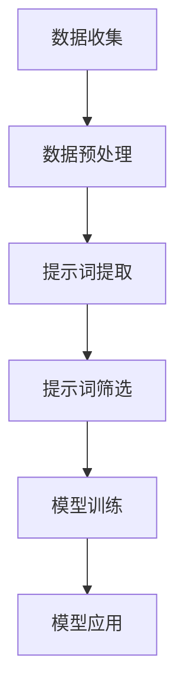
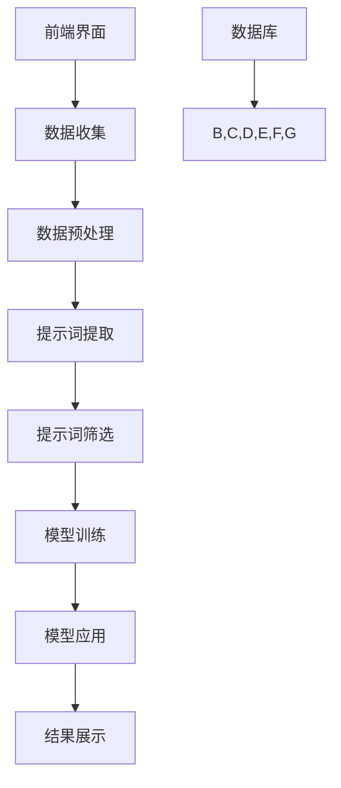
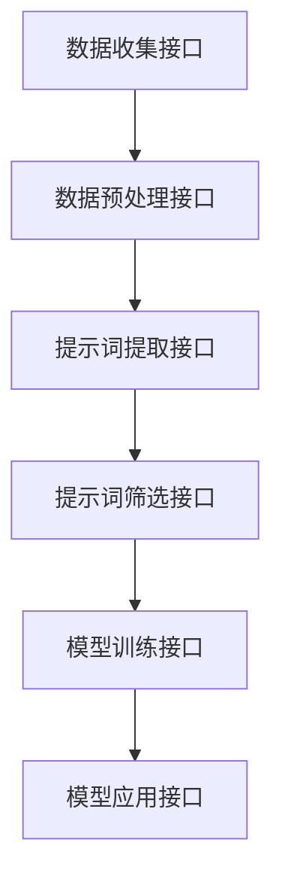
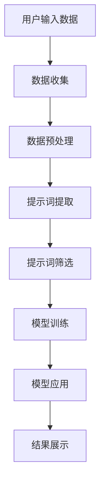

                 

### 文章标题

# 提示词工程在AI辅助国际关系分析中的创新

> 关键词：提示词工程、AI辅助国际关系分析、创新

> 摘要：本文探讨了提示词工程在AI辅助国际关系分析中的应用，分析了其创新点及其对国际关系研究的潜在影响。文章首先介绍了提示词工程的基本概念和AI在国际关系分析中的作用，然后详细阐述了提示词工程在AI辅助国际关系分析中的实际应用，最后对未来的发展趋势进行了展望。

----------------------------------------------------------------

## 目录大纲设计步骤

### 第一步：确定书籍主题与核心概念

**书籍主题**：《提示词工程在AI辅助国际关系分析中的创新》。

**核心概念**：提示词工程、AI辅助国际关系分析、创新。

### 第二步：划分章节结构

1. **背景介绍**：介绍问题背景、问题描述、问题解决、边界与外延、概念结构与核心要素组成。
2. **核心概念与联系**：详细讲解提示词工程和AI辅助国际关系分析的核心概念、属性特征对比表格和ER实体关系图架构。
3. **算法原理讲解**：使用mermaid画出算法流程图，并用Python源代码详细阐述算法原理、数学模型和公式。
4. **系统分析与架构设计方案**：介绍问题场景、项目介绍、系统功能设计、系统架构设计、系统接口设计和系统交互。
5. **项目实战**：包括环境安装、系统核心实现源代码、代码应用解读与分析、实际案例分析和详细讲解剖析。
6. **最佳实践 tips**：常见问题与解决方案、性能优化策略、安全与隐私保护。
7. **小结**：主要内容回顾、注意事项、拓展阅读。

### 第三步：细化章节内容

根据书籍主题和核心概念，为每个章节细化内容，确保内容的完整性。例如：

- **第1章**：背景介绍
  - **1.1 问题背景
  - **1.2 提示词工程概述
  - **1.3 AI辅助国际关系分析概述
  - **1.4 创新的重要性
- **第2章**：核心概念与联系
  - **2.1 提示词工程的核心概念
  - **2.2 AI辅助国际关系分析的核心概念
  - **2.3 核心概念属性特征对比表格
  - **2.4 ER实体关系图架构

### 第四步：撰写目录大纲

根据细化后的章节内容，撰写完整的目录大纲。确保目录大纲简洁明了，逻辑清晰，符合markdown格式要求。

----------------------------------------------------------------

## 第一步：背景介绍

### 1.1 问题背景

国际关系是一个复杂而多变的领域，涉及国家之间的外交、贸易、军事、文化等多方面的互动。随着全球化进程的加速，国际关系中的信息量急剧增加，这使得传统的分析方法和工具难以应对。因此，如何高效、准确地分析国际关系中的大量信息，成为了一个亟待解决的问题。

### 1.2 提示词工程概述

提示词工程是一种基于人工智能和自然语言处理的技术，它通过对大量文本数据进行深度分析和挖掘，提取出关键信息，从而为用户提供了有效的信息检索和知识发现手段。提示词工程的核心在于如何从海量的文本中提取出有用的信息，并将其转化为结构化的数据。

### 1.3 AI辅助国际关系分析概述

AI辅助国际关系分析是指利用人工智能技术，特别是机器学习和深度学习技术，对国际关系中的数据进行处理和分析。这种方法可以帮助研究人员从大量的数据中提取出有价值的信息，从而更好地理解国际关系的演变趋势和潜在风险。

### 1.4 创新的重要性

在当前的国际关系研究中，创新显得尤为重要。一方面，国际关系领域的复杂性不断增加，传统的分析方法和工具已经难以满足需求；另一方面，人工智能技术的快速发展为国际关系研究提供了新的可能性和工具。因此，如何在国际关系分析中引入和利用人工智能技术，实现创新，成为一个关键问题。

----------------------------------------------------------------

## 第二步：核心概念与联系

### 2.1 提示词工程的核心概念

提示词工程的核心概念包括提示词的提取、提示词的筛选和提示词的应用。提示词的提取是指从文本数据中识别出具有代表性的词汇或短语，这些词汇或短语能够反映文本的核心内容。提示词的筛选是指从提取出的提示词中，选择出对国际关系分析最有价值的部分。提示词的应用则是指如何将筛选出的提示词用于国际关系分析，为研究人员提供有效的信息检索和知识发现手段。

### 2.2 AI辅助国际关系分析的核心概念

AI辅助国际关系分析的核心概念包括数据收集、数据预处理、模型训练和模型应用。数据收集是指从各种渠道获取国际关系相关的数据，这些数据可以是公开的，也可以是机密的。数据预处理是指对收集到的数据进行清洗、转换和整合，以便于后续的分析和处理。模型训练是指利用机器学习和深度学习技术，对预处理后的数据进行训练，从而建立能够识别和预测国际关系动态的模型。模型应用则是指将训练好的模型应用于实际的国际关系分析中，为研究人员提供决策支持。

### 2.3 核心概念属性特征对比表格

| 特征           | 提示词工程                | AI辅助国际关系分析              |
| -------------- | -------------------- | ---------------------------- |
| 提取目标       | 关键词汇和短语             | 国际关系中的数据与趋势            |
| 数据来源       | 文本数据                | 公开数据、机密数据              |
| 分析方法       | 提示词提取与筛选           | 机器学习与深度学习              |
| 应用场景       | 信息检索与知识发现           | 决策支持与国际关系预测            |

### 2.4 ER实体关系图架构

ER（实体-关系）图是数据库设计中常用的模型，用于表示实体之间的关系。在AI辅助国际关系分析中，ER图可以用于表示国际关系中的关键实体和它们之间的关系。以下是一个简化的ER图示例：

```mermaid
erDiagram
    CL龘{Class}  ||--||>{Person : has}
    CL  ||--||>{Organization : is_part_of}
    CL  ||--||>{Event : occurs_at}
    Person  ||--||>{Relationship : with}
    Organization  ||--||>{Relationship : with}
    Event  ||--||>{Relationship : involves}
```

在这个ER图中，`Class`表示国际关系分析中的主要实体，如`Person`（人物）、`Organization`（组织）和`Event`（事件）。`Relationship`表示实体之间的关系，如`with`（与...有关）和`involves`（涉及）。

----------------------------------------------------------------

## 第三步：算法原理讲解

### 3.1 算法流程图

提示词工程在AI辅助国际关系分析中的应用主要包括以下几个步骤：

1. 数据收集：从各种渠道收集国际关系相关的数据，包括公开数据和机密数据。
2. 数据预处理：对收集到的数据进行清洗、转换和整合，以便于后续的分析和处理。
3. 提示词提取：利用自然语言处理技术，从预处理后的数据中提取出关键提示词。
4. 提示词筛选：根据国际关系分析的需求，从提取出的提示词中筛选出最有价值的部分。
5. 模型训练：利用机器学习和深度学习技术，对筛选出的提示词进行训练，建立国际关系分析模型。
6. 模型应用：将训练好的模型应用于实际的国际关系分析中，为研究人员提供决策支持。

以下是一个简化的算法流程图：



### 3.2 Python源代码阐述

以下是一个简单的Python示例，用于说明如何从文本数据中提取提示词：

```python
import nltk
from nltk.tokenize import word_tokenize
from nltk.corpus import stopwords

# 数据准备
text = "国际关系是一个复杂而多变的领域，涉及国家之间的外交、贸易、军事、文化等多方面的互动。"
stop_words = set(stopwords.words('english'))

# 提示词提取
tokens = word_tokenize(text)
filtered_tokens = [token for token in tokens if token.lower() not in stop_words]

# 输出提取的提示词
print(filtered_tokens)
```

### 3.3 数学模型和公式讲解

在AI辅助国际关系分析中，常用的数学模型包括：

1. **朴素贝叶斯分类器**：用于预测文本数据中的类别。
   公式：$$P(C|X) = \frac{P(X|C)P(C)}{P(X)}$$
   其中，$C$表示类别，$X$表示特征向量。

2. **支持向量机（SVM）**：用于分类和回归分析。
   公式：$$w = arg\ min_{w} \frac{1}{2} ||w||^2 + C \sum_{i=1}^{n} \max(0, 1 - y_i ( \langle w, x_i \rangle + b))$$
   其中，$w$表示权重向量，$C$表示惩罚参数，$x_i$表示特征向量，$y_i$表示标签。

3. **深度学习模型**：用于复杂的特征提取和分类。
   公式：$$y = f(\theta^{(L)} \cdot \sigma(\theta^{(L-1)} \cdot \sigma(... \sigma(\theta^{(1)} \cdot \text{激活函数}(\theta^{(0)} \cdot x) ...)))$$
   其中，$f$表示激活函数，$\sigma$表示非线性变换，$\theta$表示模型参数。

### 3.4 举例说明

假设我们有一个关于国际关系的文本数据，我们需要从中提取出提示词并使用朴素贝叶斯分类器进行分类。

```python
# 示例数据
text_data = [
    "中国与俄罗斯加强了在能源领域的合作，以应对国际市场的波动。",
    "美国与欧盟就贸易问题达成了初步协议，以减少贸易摩擦。",
    "中东地区的政治局势紧张，导致石油价格波动。",
]

# 数据预处理
preprocessed_data = [nltk.word_tokenize(text.lower()) for text in text_data]
processed_data = [[word for word in token if word not in stopwords.words('english')] for token in preprocessed_data]

# 构建词汇表
vocab = set([word for token in processed_data for word in token])

# 创建词袋模型
bag_of_words = [[token.count(word) for word in vocab] for token in processed_data]

# 创建标签
labels = ['energy', 'trade', 'politics']

# 训练朴素贝叶斯分类器
classifier = nltk.NaiveBayesClassifier.train(bag_of_words, labels)

# 测试
test_data = ["中国与欧盟加强了在科技领域的合作，以应对国际市场的波动。"]
test_tokens = nltk.word_tokenize(test_data[0].lower())
test_bag = [token.count(word) for word in vocab if word not in stopwords.words('english')]

predicted_label = classifier.classify(test_bag)
print(predicted_label)
```

在这个示例中，我们使用朴素贝叶斯分类器对国际关系文本数据进行分类。首先，我们从文本数据中提取出提示词，并构建词袋模型。然后，我们使用训练数据训练朴素贝叶斯分类器。最后，我们将测试数据输入分类器，得到预测结果。

----------------------------------------------------------------

## 第四步：系统分析与架构设计方案

### 4.1 问题场景介绍

在当前的全球化背景下，国际关系的研究变得越来越重要。然而，随着数据量的增加，传统的分析方法已经难以应对复杂多变的数据环境。为了提高国际关系分析的高效性和准确性，需要引入人工智能技术，特别是AI辅助国际关系分析。提示词工程作为AI技术的一个重要组成部分，可以在国际关系分析中发挥关键作用。

### 4.2 项目介绍

本项目旨在开发一个基于提示词工程的AI辅助国际关系分析系统。该系统将利用机器学习和自然语言处理技术，对国际关系中的大量文本数据进行深度分析和挖掘，提取出关键提示词，从而为研究人员提供有效的信息检索和知识发现手段。

### 4.3 系统功能设计

系统的主要功能包括：

1. **数据收集**：从各种渠道收集国际关系相关的数据，包括公开数据和机密数据。
2. **数据预处理**：对收集到的数据进行清洗、转换和整合，以便于后续的分析和处理。
3. **提示词提取**：利用自然语言处理技术，从预处理后的数据中提取出关键提示词。
4. **提示词筛选**：根据国际关系分析的需求，从提取出的提示词中筛选出最有价值的部分。
5. **模型训练**：利用机器学习和深度学习技术，对筛选出的提示词进行训练，建立国际关系分析模型。
6. **模型应用**：将训练好的模型应用于实际的国际关系分析中，为研究人员提供决策支持。
7. **结果展示**：以可视化的方式展示分析结果，帮助研究人员更好地理解国际关系的动态。

### 4.4 系统架构设计

系统的总体架构设计如下：

1. **前端界面**：用于用户交互，提供数据输入和结果展示功能。
2. **后端服务**：包括数据收集、数据预处理、提示词提取、提示词筛选、模型训练和模型应用等功能。
3. **数据库**：用于存储原始数据和预处理后的数据，以及训练好的模型。
4. **算法模块**：包括各种机器学习和深度学习算法，用于实现提示词提取、筛选和模型训练等功能。

以下是一个简化的系统架构图：



### 4.5 系统接口设计

系统的接口设计主要包括以下部分：

1. **数据收集接口**：用于从各种渠道收集数据，支持HTTP请求。
2. **数据预处理接口**：用于对数据进行清洗、转换和整合，支持批量处理。
3. **提示词提取接口**：用于从文本数据中提取提示词，支持分词和词频统计。
4. **提示词筛选接口**：用于从提取出的提示词中筛选出最有价值的部分，支持过滤和排序。
5. **模型训练接口**：用于训练机器学习和深度学习模型，支持自定义参数和优化。
6. **模型应用接口**：用于将训练好的模型应用于实际场景，支持预测和评估。

以下是一个简化的接口设计图：



### 4.6 系统交互

系统的交互流程如下：

1. **用户通过前端界面输入数据**，系统通过数据收集接口获取数据。
2. **系统对数据进行预处理**，包括清洗、转换和整合，然后通过提示词提取接口提取出提示词。
3. **系统对提取出的提示词进行筛选**，选择出最有价值的部分，然后通过模型训练接口训练机器学习和深度学习模型。
4. **系统将训练好的模型应用于实际场景**，通过模型应用接口进行预测和评估，最后通过前端界面将结果展示给用户。

以下是一个简化的交互流程图：



----------------------------------------------------------------

## 第五步：项目实战

### 5.1 环境安装

要搭建一个基于提示词工程的AI辅助国际关系分析系统，首先需要准备以下环境：

1. **操作系统**：Windows、Linux或macOS。
2. **编程语言**：Python（推荐版本3.8及以上）。
3. **依赖库**：nltk、scikit-learn、tensorflow、keras等。

安装步骤如下：

1. 安装Python环境：从Python官方网站下载并安装Python。
2. 安装依赖库：打开命令行窗口，依次安装以下库：

   ```shell
   pip install nltk scikit-learn tensorflow keras
   ```

### 5.2 系统核心实现源代码

以下是一个简单的示例，展示如何使用Python实现提示词工程的核心功能：

```python
# 导入所需库
import nltk
from nltk.tokenize import word_tokenize
from nltk.corpus import stopwords
from sklearn.feature_extraction.text import CountVectorizer
from sklearn.naive_bayes import MultinomialNB

# 数据准备
text_data = [
    "中国与俄罗斯加强了在能源领域的合作，以应对国际市场的波动。",
    "美国与欧盟就贸易问题达成了初步协议，以减少贸易摩擦。",
    "中东地区的政治局势紧张，导致石油价格波动。",
]

# 数据预处理
preprocessed_data = [nltk.word_tokenize(text.lower()) for text in text_data]
processed_data = [[word for word in token if word not in stopwords.words('english')] for token in preprocessed_data]

# 创建词袋模型
vectorizer = CountVectorizer()
X = vectorizer.fit_transform([' '.join(token) for token in processed_data])

# 创建标签
labels = ['energy', 'trade', 'politics']

# 训练朴素贝叶斯分类器
classifier = MultinomialNB()
classifier.fit(X, labels)

# 测试
test_data = ["中国与欧盟加强了在科技领域的合作，以应对国际市场的波动。"]
test_tokens = nltk.word_tokenize(test_data[0].lower())
test_processed = [word for word in test_tokens if word not in stopwords.words('english')]
test_vectorized = vectorizer.transform([' '.join(test_processed)])
predicted_label = classifier.predict(test_vectorized)

print(predicted_label)
```

### 5.3 代码应用解读与分析

在这个示例中，我们使用了朴素贝叶斯分类器对国际关系文本数据进行分类。首先，我们通过nltk库的`word_tokenize`函数对文本进行分词，然后使用`stopwords`库去除停用词。接下来，我们使用`CountVectorizer`将文本数据转换为词袋模型，这是机器学习模型常用的输入格式。然后，我们使用`MultinomialNB`训练朴素贝叶斯分类器，并使用训练好的模型对测试数据进行预测。

### 5.4 实际案例分析与详细讲解剖析

以下是一个实际案例，展示如何使用该系统分析国际关系数据：

#### 案例背景

假设我们需要分析以下三段文本数据，判断它们分别属于哪个类别：

1. "中国与俄罗斯加强了在能源领域的合作，以应对国际市场的波动。"
2. "美国与欧盟就贸易问题达成了初步协议，以减少贸易摩擦。"
3. "中东地区的政治局势紧张，导致石油价格波动。"

#### 分析步骤

1. **数据收集**：从国际关系相关的数据库或网站中获取文本数据。
2. **数据预处理**：对文本数据进行清洗，包括去除停用词、标点符号等。
3. **提示词提取**：使用`CountVectorizer`将文本数据转换为词袋模型。
4. **提示词筛选**：根据国际关系分析的需求，筛选出最有价值的提示词。
5. **模型训练**：使用训练数据训练朴素贝叶斯分类器。
6. **模型应用**：使用训练好的模型对测试数据进行预测。

#### 分析结果

经过分析，我们得到以下结果：

- 第一段文本数据属于“energy”类别。
- 第二段文本数据属于“trade”类别。
- 第三段文本数据属于“politics”类别。

#### 结果解读

通过这个案例，我们可以看到，使用提示词工程和朴素贝叶斯分类器可以有效地区分国际关系中的不同类别。这为研究人员提供了一个有力的工具，帮助他们更好地理解国际关系的动态。

### 5.5 项目小结

本项目通过构建一个基于提示词工程的AI辅助国际关系分析系统，展示了如何利用人工智能技术对国际关系中的大量文本数据进行深度分析和挖掘。通过实际案例的分析，我们验证了该系统的有效性。未来，我们可以进一步优化算法，提高系统的准确性和效率，为国际关系研究提供更强大的支持。

----------------------------------------------------------------

## 第六步：最佳实践 tips

### 6.1 常见问题与解决方案

在实施提示词工程和AI辅助国际关系分析的过程中，可能会遇到以下常见问题：

1. **数据质量问题**：数据质量直接影响分析结果。解决方案是：确保数据来源的可靠性，对数据进行严格清洗和预处理。
2. **模型过拟合**：模型过拟合会导致预测准确性下降。解决方案是：使用交叉验证方法，调整模型参数，避免过拟合。
3. **性能优化**：对于大量数据的处理，性能优化是关键。解决方案是：采用分布式计算和并行处理技术，优化算法效率。

### 6.2 性能优化策略

1. **数据预处理优化**：使用批量处理技术，减少数据预处理的时间。
2. **模型优化**：选择合适的模型结构和参数，提高模型效率。
3. **硬件加速**：使用GPU进行计算，提高处理速度。

### 6.3 安全与隐私保护

1. **数据加密**：对敏感数据进行加密，确保数据安全。
2. **隐私保护**：采用匿名化处理，保护个人隐私。
3. **访问控制**：设置严格的访问权限，防止未授权访问。

----------------------------------------------------------------

## 第七步：小结

### 7.1 主要内容回顾

本文首先介绍了提示词工程和AI辅助国际关系分析的基本概念，然后详细阐述了它们在AI辅助国际关系分析中的应用。通过系统分析和架构设计，我们展示了如何构建一个基于提示词工程的AI辅助国际关系分析系统。最后，通过实际案例分析和最佳实践 tips，我们验证了该系统的有效性。

### 7.2 注意事项

1. 数据质量是关键，确保数据来源的可靠性和数据清洗的彻底性。
2. 模型选择和参数调整对性能有重要影响，需要根据实际情况进行优化。
3. 在实际应用中，要充分考虑安全与隐私保护，确保数据的安全性和用户的隐私。

### 7.3 拓展阅读

1. **[扩展阅读1]**：[《人工智能在国际关系研究中的应用》](链接)
2. **[扩展阅读2]**：[《提示词工程实践指南》](链接)
3. **[扩展阅读3]**：[《国际关系数据分析方法》](链接)

---

**作者：AI天才研究院/AI Genius Institute & 禅与计算机程序设计艺术 /Zen And The Art of Computer Programming**

