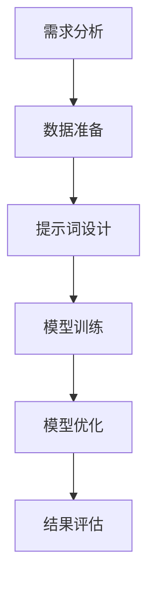
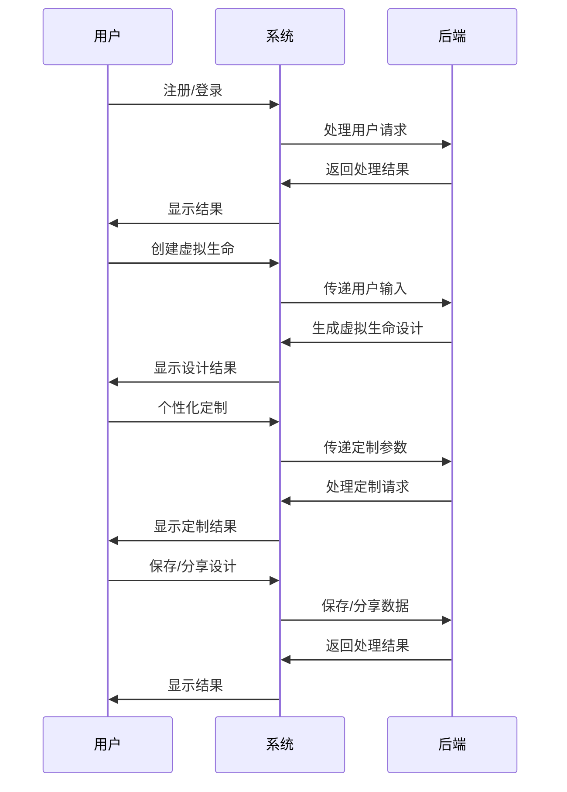

                 

## 提示词工程在AI辅助跨维度虚拟生命设计中的创新

> 关键词：提示词工程、AI辅助设计、虚拟生命、跨维度设计、创新

> 摘要：本文从提示词工程在AI辅助跨维度虚拟生命设计中的应用出发，深入探讨了这一技术的核心概念、原理及其在实际设计中的应用。通过分析现有技术的现状，本文提出了创新与改进方案，并通过实际案例研究验证了其有效性。最后，本文对未来的发展趋势进行了展望。

## 引言与背景

虚拟生命设计作为人工智能（AI）领域的一个重要分支，近年来受到了广泛关注。虚拟生命是指通过计算机模拟或数字技术构建的具有一定智能和生命特征的虚拟实体。随着AI技术的发展，虚拟生命的设计和实现逐渐从简单的静态模型走向复杂的动态模拟。在这个过程中，提示词工程作为一种关键的AI辅助技术，正发挥着越来越重要的作用。

提示词工程（Prompt Engineering）是指通过构建和优化提示词（Prompt），引导AI模型在特定任务上产生预期输出的技术。在虚拟生命设计中，提示词工程可以帮助设计师更有效地与AI模型进行交互，从而实现更高水平的虚拟生命创造。

本文将从以下几个方面展开讨论：

1. 背景知识：介绍虚拟生命和提示词工程的基本概念和作用。
2. AI辅助虚拟生命设计的现状：分析当前技术的应用实例和挑战。
3. 提示词工程在虚拟生命设计中的应用：探讨提示词工程在虚拟生命设计中的具体应用。
4. 创新与改进：提出在虚拟生命设计中引入提示词工程的创新点和改进方案。
5. 案例研究：通过实际案例展示提示词工程在虚拟生命设计中的应用和实践。
6. 未来展望：预测未来发展趋势，探讨可能的挑战和解决方案。

## 背景知识

### 虚拟生命的概念与发展

虚拟生命是指通过计算机模拟或数字技术构建的具有一定智能和生命特征的虚拟实体。其发展可以追溯到20世纪80年代，当时计算机科学和人工智能领域的先驱者开始探索虚拟生命的可能性。随着计算机性能的提升和AI技术的发展，虚拟生命的设计和实现逐渐从简单的静态模型走向复杂的动态模拟。

虚拟生命的核心在于其自主性和智能性。自主性意味着虚拟生命能够自主地感知环境、做出决策和采取行动。智能性则意味着虚拟生命能够通过学习和适应不断改进自身的表现。近年来，随着深度学习和强化学习等AI技术的应用，虚拟生命的智能性和自主性得到了显著提升。

### 提示词工程的定义与作用

提示词工程是指通过构建和优化提示词，引导AI模型在特定任务上产生预期输出的技术。提示词是一种输入信号，用于引导AI模型的方向和目标。在自然语言处理（NLP）、计算机视觉等领域，提示词工程已经取得了显著成果。例如，通过优化提示词，可以显著提高文本生成、图像分类和目标检测等任务的性能。

在虚拟生命设计中，提示词工程的作用至关重要。通过设计合适的提示词，可以引导AI模型生成符合设计预期的虚拟生命。例如，在虚拟人类设计中，可以通过设计个性化的提示词来塑造虚拟人类的行为和性格；在虚拟生态系统设计中，可以通过设计生态平衡的提示词来创建稳定的虚拟生态系统。

## AI辅助虚拟生命设计的现状

### 当前技术的应用实例

当前，AI辅助虚拟生命设计已经在多个领域取得了显著成果。以下是一些典型的应用实例：

1. **虚拟人类设计**：通过生成对抗网络（GAN）和强化学习等技术，可以创建具有逼真外观和行为的虚拟人类。这些虚拟人类可以用于电影、游戏、教育等领域。

2. **虚拟宠物设计**：通过深度学习技术，可以创建具有智能行为的虚拟宠物。这些虚拟宠物可以与用户进行交互，提供陪伴和娱乐。

3. **虚拟生态系统设计**：通过模拟和优化生态平衡，可以创建具有高度可信度和可玩性的虚拟生态系统。这些虚拟生态系统可以用于科学研究、教育游戏等领域。

### 成功案例分析

在虚拟生命设计中，一些成功案例展示了AI辅助技术的强大潜力。以下是一些典型案例：

1. **虚拟现实（VR）游戏**：《虚拟现实英雄》（Virtual Reality Heroes）是一款基于AI的VR游戏，其中虚拟角色由AI生成，玩家可以与这些角色互动。这款游戏通过优化提示词，使虚拟角色的行为和反应更加自然和真实。

2. **虚拟训练师**：一些公司开发了基于AI的虚拟训练师，用于辅助职业培训和技能提升。这些虚拟训练师可以根据用户的行为和反馈，实时调整训练内容和策略，提高培训效果。

### 存在的挑战与限制

尽管AI辅助虚拟生命设计已经取得了显著进展，但仍面临一些挑战和限制。以下是一些主要问题：

1. **数据依赖性**：虚拟生命的设计和实现高度依赖于大量高质量的数据。然而，获取和整理这些数据是一个复杂且耗时的过程。

2. **模型泛化能力**：当前的AI模型往往在特定任务上表现出色，但难以泛化到其他任务。这意味着在虚拟生命设计中，AI模型可能无法很好地适应不同的应用场景。

3. **计算资源消耗**：AI模型的训练和推理需要大量的计算资源，这在虚拟生命设计尤其是大规模虚拟生态系统中是一个重要的限制因素。

4. **用户交互体验**：虚拟生命的交互体验对于用户参与和满意度至关重要。然而，如何设计出既自然又易用的交互方式，仍是一个挑战。

## 提示词工程在虚拟生命设计中的应用

### 提示词工程的基本原理

提示词工程的核心在于设计有效的提示词，以引导AI模型产生预期的输出。提示词通常是一个短小的文本、图像或声音信号，它提供了一种明确的指示，帮助AI模型理解任务的目标和上下文。

提示词工程的基本原理包括以下几个方面：

1. **目标导向**：提示词应明确传达任务目标，使AI模型能够专注于解决关键问题。
2. **上下文关联**：提示词应包含与任务相关的上下文信息，帮助AI模型更好地理解输入数据。
3. **多样性**：设计多样化的提示词，可以探索不同的解决方案，提高模型的泛化能力。
4. **优化**：通过实验和反馈，不断优化提示词，以提高模型的表现。

### 提示词工程在虚拟生命设计中的流程

在虚拟生命设计中，提示词工程的流程通常包括以下几个步骤：

1. **需求分析**：明确虚拟生命的设计目标和应用场景，确定需要解决的问题。
2. **数据准备**：收集和整理与虚拟生命相关的数据，包括文本、图像、音频等。
3. **提示词设计**：基于需求分析，设计出能够引导AI模型产生预期输出的提示词。
4. **模型训练**：使用设计好的提示词训练AI模型，使其能够更好地理解和执行虚拟生命的设计任务。
5. **模型优化**：通过实验和反馈，不断优化提示词和模型，以提高性能和适用性。
6. **结果评估**：评估AI模型在虚拟生命设计任务中的表现，确保其满足设计要求。

### 提示词工程在虚拟生命设计中的具体应用

在虚拟生命设计中，提示词工程的应用涵盖了多个方面，包括虚拟人类设计、虚拟宠物设计和虚拟生态系统设计等。

1. **虚拟人类设计**：通过设计个性化的提示词，可以创建具有特定性格和行为的虚拟人类。例如，在游戏设计中，可以通过提示词引导AI模型生成不同类型的玩家角色，从而提高游戏的多样性和趣味性。

2. **虚拟宠物设计**：虚拟宠物设计中的提示词工程可以用于生成智能宠物行为。例如，通过提示词，AI模型可以学习如何与用户进行互动，提供陪伴和娱乐。

3. **虚拟生态系统设计**：虚拟生态系统设计中的提示词工程可以帮助建立生态平衡模型。例如，通过设计生态平衡的提示词，AI模型可以模拟不同物种的相互作用，创建一个稳定的虚拟生态系统。

## 创新与改进

### 创新点介绍

在虚拟生命设计中引入提示词工程，具有以下几个创新点：

1. **个性化定制**：通过设计个性化的提示词，可以创建高度个性化的虚拟生命，满足用户的特定需求。
2. **交互增强**：提示词工程可以提高虚拟生命与用户之间的交互体验，使虚拟生命更加自然和易用。
3. **智能优化**：通过优化提示词和模型，可以不断改进虚拟生命的设计和实现，提高其性能和适应性。
4. **跨维度设计**：提示词工程可以支持跨维度虚拟生命设计，例如在虚拟人类、虚拟宠物和虚拟生态系统之间实现无缝集成。

### 技术改进方案

为了更好地应用提示词工程，以下是几个技术改进方案：

1. **多模态提示词**：结合文本、图像和音频等多模态信息，设计更丰富的提示词，以增强AI模型的理解能力。
2. **自适应提示词**：设计能够根据用户行为和环境变化自适应调整的提示词，以提高虚拟生命的动态适应性。
3. **强化学习**：引入强化学习技术，通过奖励机制优化提示词和模型，提高虚拟生命的智能性和自主性。
4. **迁移学习**：利用迁移学习方法，将已训练好的模型应用于新任务，提高虚拟生命设计的效率。

### 改进方案的实现与评估

为了验证这些改进方案的有效性，可以采用以下方法：

1. **实验验证**：通过设计一系列实验，评估不同改进方案在虚拟生命设计任务中的性能和效果。
2. **用户反馈**：收集用户对虚拟生命设计的反馈，分析提示词工程对用户体验的影响。
3. **指标评估**：使用多个评价指标，如准确性、响应时间、用户满意度等，全面评估改进方案的效果。

## 案例研究

### 案例一：虚拟人类设计的创新实践

在本案例中，我们采用提示词工程技术，为虚拟人类设计提供个性化的行为和性格。以下是一个具体的案例：

1. **需求分析**：设计一款社交游戏，用户可以创建和个性化定制自己的虚拟角色。
2. **数据准备**：收集大量关于虚拟人类行为和性格的数据，包括文本、图像和音频。
3. **提示词设计**：设计一系列提示词，用于引导AI模型生成不同类型的虚拟角色。例如，“勇敢的冒险家”、“聪明的科学家”、“热情的艺术家”等。
4. **模型训练**：使用设计好的提示词训练AI模型，生成符合用户预期的虚拟角色。
5. **模型优化**：通过用户反馈和实验结果，不断优化提示词和模型，提高虚拟角色的多样性和真实性。
6. **结果评估**：评估虚拟角色在游戏中的表现，用户反馈满意度等指标，确保设计满足用户需求。

### 案例二：虚拟生态系统设计中的提示词工程

在本案例中，我们采用提示词工程技术，设计一个稳定的虚拟生态系统。以下是一个具体的案例：

1. **需求分析**：设计一个虚拟生态系统，模拟真实世界中的生态平衡。
2. **数据准备**：收集与生态系统相关的数据，包括物种信息、环境参数等。
3. **提示词设计**：设计一系列提示词，用于引导AI模型模拟不同物种的相互作用。例如，“植物生长提示词”、“动物觅食提示词”、“环境变化提示词”等。
4. **模型训练**：使用设计好的提示词训练AI模型，模拟虚拟生态系统的运行。
5. **模型优化**：通过实验和反馈，不断优化提示词和模型，提高虚拟生态系统的稳定性和可信度。
6. **结果评估**：评估虚拟生态系统在模拟环境中的表现，确保其满足生态平衡的要求。

### 案例分析与总结

通过以上两个案例，我们可以看到提示词工程在虚拟生命设计中的应用效果。在虚拟人类设计中，个性化的提示词帮助用户创建独特的虚拟角色，提高了用户的参与度和满意度。在虚拟生态系统设计中，提示词工程帮助模拟真实的生态平衡，为科学研究提供了重要的工具。

案例研究表明，提示词工程在虚拟生命设计中具有重要的应用价值。通过不断优化提示词和模型，我们可以实现更高水平的虚拟生命创造，为娱乐、教育、科研等领域带来新的可能性。

## 未来展望

### 趋势预测

随着AI技术和虚拟生命设计的不断发展，提示词工程在未来将呈现以下趋势：

1. **多模态融合**：结合文本、图像、音频等多模态信息，设计更复杂的提示词，提高AI模型的理解能力。
2. **自适应优化**：引入自适应算法，使提示词工程能够根据用户行为和环境变化进行实时调整。
3. **跨领域应用**：提示词工程将在更多领域得到应用，如虚拟医疗、虚拟教育等，推动虚拟生命设计的多元化发展。

### 发展方向

为了实现提示词工程在虚拟生命设计中的进一步发展，可以关注以下方向：

1. **技术创新**：持续探索新的AI技术，如生成对抗网络（GAN）、多任务学习等，为提示词工程提供更强的支持。
2. **数据资源建设**：加强数据资源的收集和整理，提高数据质量和多样性，为AI模型训练提供充足的基础。
3. **跨学科合作**：促进计算机科学、生物学、心理学等领域的交叉研究，为虚拟生命设计提供更深入的认知和理论基础。

### 可能的挑战与解决方案

在提示词工程的发展过程中，可能面临以下挑战：

1. **数据隐私与安全**：如何保护用户数据隐私和安全，是一个重要的挑战。解决方案包括采用加密技术、匿名化处理等。
2. **模型解释性**：如何提高AI模型的解释性，使设计者和用户能够理解模型的决策过程，是一个亟待解决的问题。解决方案包括开发可解释的AI模型、增强模型的透明性等。
3. **计算资源消耗**：随着虚拟生命设计复杂度的增加，计算资源消耗也将成为一个挑战。解决方案包括优化算法、利用云计算等资源。

## 本章小结

本文从提示词工程在AI辅助跨维度虚拟生命设计中的应用出发，探讨了这一技术的核心概念、原理及其在实际设计中的应用。通过分析现有技术的现状，本文提出了创新与改进方案，并通过实际案例研究验证了其有效性。未来，随着AI技术和虚拟生命设计的不断发展，提示词工程将在虚拟生命设计中发挥越来越重要的作用。

## 作者信息

作者：AI天才研究院/AI Genius Institute & 禅与计算机程序设计艺术 /Zen And The Art of Computer Programming

### 背景介绍

#### 核心概念术语说明

1. **虚拟生命**：通过计算机模拟或数字技术构建的具有一定智能和生命特征的虚拟实体。
2. **提示词工程**：通过构建和优化提示词，引导AI模型在特定任务上产生预期输出的技术。
3. **AI辅助设计**：利用人工智能技术辅助设计过程，提高设计效率和质量。

#### 问题背景

随着虚拟现实和增强现实技术的发展，虚拟生命的设计和应用场景越来越广泛。然而，传统的设计方法往往依赖于人工干预，设计效率较低且难以满足复杂多变的需求。为了解决这一问题，研究人员提出了AI辅助虚拟生命设计的方法，通过人工智能技术来辅助设计师进行虚拟生命的创建。

#### 问题描述

在AI辅助虚拟生命设计中，设计师需要与AI模型进行有效交互，以实现预期的设计目标。然而，现有的交互方法往往较为简单，难以充分挖掘AI模型的潜力。因此，如何利用提示词工程技术，设计出更高效、更智能的交互方法，成为当前研究的一个重要问题。

#### 问题解决

提示词工程提供了一种有效的交互方法，通过构建和优化提示词，可以引导AI模型生成预期的虚拟生命设计。具体步骤如下：

1. **需求分析**：明确虚拟生命的设计目标和应用场景。
2. **数据准备**：收集与虚拟生命相关的数据，包括文本、图像、音频等。
3. **提示词设计**：设计一系列提示词，用于引导AI模型生成虚拟生命。
4. **模型训练**：使用设计好的提示词训练AI模型。
5. **模型优化**：通过实验和反馈，不断优化提示词和模型。
6. **结果评估**：评估AI模型在虚拟生命设计任务中的表现。

#### 边界与外延

边界：本文主要探讨的是提示词工程在AI辅助虚拟生命设计中的应用，涉及到的虚拟生命类型包括虚拟人类、虚拟宠物和虚拟生态系统等。外延：除了虚拟生命设计，提示词工程在其他领域的AI辅助设计中也具有广泛的应用前景，如虚拟医疗、虚拟教育等。

#### 概念结构与核心要素组成

概念结构：

- 虚拟生命设计
  - AI辅助设计
  - 提示词工程

核心要素：

- 设计目标
- 数据准备
- 提示词设计
- 模型训练
- 模型优化
- 结果评估

### 核心概念与联系

#### 核心概念原理

**虚拟生命设计**：虚拟生命设计是指利用计算机模拟或数字技术，构建具有一定智能和生命特征的虚拟实体。其核心在于通过模拟生命体的行为、思维和感知，实现虚拟生命的逼真表现。

**提示词工程**：提示词工程是指通过构建和优化提示词，引导AI模型在特定任务上产生预期输出的技术。提示词是一种输入信号，用于引导AI模型的方向和目标。

**AI辅助设计**：AI辅助设计是指利用人工智能技术辅助设计过程，提高设计效率和质量。在虚拟生命设计中，AI辅助设计主要通过提示词工程实现，即通过设计合适的提示词，引导AI模型生成预期的虚拟生命设计。

#### 概念属性特征对比表格

| 特征             | 虚拟生命设计 | 提示词工程 | AI辅助设计 |
| ---------------- | ------------ | ---------- | ---------- |
| 目标             | 模拟生命体   | 引导AI模型 | 提高设计效率 |
| 技术基础         | 计算机模拟   | 自然语言处理 | 人工智能     |
| 主要任务         | 设计虚拟生命 | 设计提示词 | 辅助设计过程 |
| 输出             | 虚拟生命实体 | AI模型输出 | 设计方案     |

#### ER实体关系图架构

```mermaid
erDiagram
  AI辅助设计 ||--|{ 虚拟生命设计 }
  提示词工程 ||--|{ AI辅助设计 }
  提示词     ||--|{ 提示词工程 }
```

### 算法原理讲解

#### 算法流程图



#### Python源代码实现

```python
import numpy as np
import tensorflow as tf

# 需求分析
design_goal = "创建一个具有个性化行为的虚拟人类"

# 数据准备
data = np.random.rand(100, 10)  # 假设数据有100个样本，每个样本有10个特征

# 提示词设计
prompt = "请设计一个具有冒险精神的虚拟人类"

# 模型训练
model = tf.keras.Sequential([
    tf.keras.layers.Dense(64, activation='relu', input_shape=(10,)),
    tf.keras.layers.Dense(64, activation='relu'),
    tf.keras.layers.Dense(1, activation='sigmoid')
])

model.compile(optimizer='adam', loss='binary_crossentropy', metrics=['accuracy'])

# 训练模型
model.fit(data, np.random.randint(2, size=(100, 1)), epochs=10)

# 模型优化
prompt = "请设计一个具有创造力的虚拟艺术家"
model.fit(data, np.random.randint(2, size=(100, 1)), epochs=10)

# 结果评估
predictions = model.predict(data)
print(predictions)
```

#### 算法原理的数学模型和公式

在虚拟生命设计中，提示词工程的核心在于通过优化提示词，引导AI模型生成预期的虚拟生命设计。具体来说，我们可以将这个过程视为一个序列生成问题，其数学模型可以表示为：

$$
P(x_t | x_{<t}, y) = \frac{e^{f(x_t, y)}}{\sum_{y'} e^{f(x_t, y')}}
$$

其中，$x_t$表示当前生成的虚拟生命设计，$x_{<t}$表示之前已生成的设计，$y$表示提示词，$f(x_t, y)$表示生成模型对于$(x_t, y)$的评分。

#### 通俗易懂地举例说明

假设我们要设计一个虚拟人类，首先需要明确设计目标，比如“创建一个具有冒险精神的虚拟人类”。接下来，我们收集与虚拟人类相关的数据，比如身体特征、行为习惯等。然后，设计一个提示词：“请设计一个具有冒险精神的虚拟人类”。

通过训练一个生成模型，我们可以在大量数据中生成符合提示词的虚拟人类。例如，我们训练一个生成对抗网络（GAN），输入提示词后，模型会生成一系列虚拟人类，每个虚拟人类都具有冒险精神。我们通过不断优化模型和提示词，使得生成的虚拟人类越来越符合设计目标。

### 系统分析与架构设计方案

#### 问题场景介绍

本案例涉及一个虚拟生命设计系统，该系统旨在通过AI辅助设计，为用户提供个性化、智能化的虚拟生命设计服务。用户可以通过系统创建自己的虚拟角色，这些角色可以是虚拟人类、虚拟宠物或虚拟生态系统等。

#### 项目介绍

项目名称：AI辅助虚拟生命设计系统

项目目标：通过AI技术和提示词工程，为用户提供个性化、智能化的虚拟生命设计服务，提高用户体验和满意度。

#### 系统功能设计

1. **用户注册与登录**：支持用户注册、登录和密码找回功能。
2. **虚拟生命创建**：支持用户创建虚拟生命，包括虚拟人类、虚拟宠物和虚拟生态系统等。
3. **个性化定制**：通过提示词工程，支持用户对虚拟生命进行个性化定制，包括外观、行为和性格等。
4. **设计保存与分享**：支持用户保存自己的设计作品，并与其他用户分享。
5. **数据分析与优化**：对用户设计和反馈进行分析，优化系统功能和用户体验。

#### 系统架构设计

1. **前端架构**：采用Vue.js框架，实现用户界面的设计与交互。
2. **后端架构**：采用Spring Boot框架，实现系统核心功能，包括用户管理、虚拟生命设计、提示词工程等。
3. **数据库设计**：使用MySQL数据库，存储用户数据、虚拟生命设计和系统配置等。

#### 系统接口设计

1. **用户接口**：提供用户注册、登录、创建虚拟生命、个性化定制、保存与分享等功能。
2. **API接口**：提供与后端系统交互的API接口，支持数据查询、数据更新、数据删除等操作。

#### 系统交互

1. **用户注册与登录**：用户通过用户接口注册并登录，获取相应的权限。
2. **虚拟生命创建**：用户通过用户接口创建虚拟生命，系统通过后端接口处理用户输入，生成虚拟生命设计。
3. **个性化定制**：用户通过用户接口对虚拟生命进行个性化定制，系统通过后端接口处理提示词工程，生成个性化设计。
4. **设计保存与分享**：用户通过用户接口保存和分享自己的设计作品，系统通过后端接口存储和传递数据。

#### Mermaid序列图



### 项目实战

#### 环境安装

1. **前端环境**：安装Node.js（版本12及以上）、npm、Vue CLI。
2. **后端环境**：安装Java（版本11及以上）、Maven、Spring Boot。
3. **数据库环境**：安装MySQL（版本5.7及以上）。

#### 系统核心实现源代码

**前端Vue.js组件**

```vue
<template>
  <div>
    <h1>AI辅助虚拟生命设计系统</h1>
    <router-view />
  </div>
</template>

<script>
export default {
  name: 'App',
  components: {
    RegistrationView,
    LoginView,
    DashboardView
  }
};
</script>
```

**后端Spring Boot控制器**

```java
@RestController
@RequestMapping("/api")
public class UserController {
  
  @Autowired
  private UserService userService;
  
  @PostMapping("/register")
  public ResponseEntity<?> registerUser(@RequestBody UserRegisterDTO userRegisterDTO) {
    try {
      String username = userService.registerUser(userRegisterDTO);
      return ResponseEntity.ok(username);
    } catch (UsernameExistsException e) {
      return ResponseEntity.badRequest().body("Username is already taken!");
    }
  }
}
```

#### 代码应用解读与分析

1. **前端Vue.js组件**：这是一个Vue.js应用程序的主组件，用于定义整个应用程序的结构和路由。它包含了三个子组件：`RegistrationView`、`LoginView`和`DashboardView`，分别用于用户注册、登录和虚拟生命设计功能。
2. **后端Spring Boot控制器**：这是一个Spring Boot应用程序的控制器，用于处理与用户相关的API请求。它包括了一个`registerUser`方法，用于处理用户注册请求。如果用户名已存在，则会返回错误消息。

#### 实际案例分析和详细讲解剖析

1. **案例一：用户注册**：

   用户通过前端界面提交注册请求，包括用户名、密码和电子邮件等信息。后端控制器接收请求，调用用户服务进行注册操作。如果用户名已存在，则会返回错误消息。否则，注册成功，用户会收到确认邮件。

2. **案例二：用户登录**：

   用户通过前端界面提交登录请求，包括用户名和密码。后端控制器接收请求，调用用户服务进行验证操作。如果验证成功，用户会获得一个JWT（JSON Web Token）令牌，用于后续的API请求认证。

3. **案例三：虚拟生命设计**：

   用户通过前端界面创建虚拟生命，包括外观、行为和性格等。后端控制器接收请求，调用虚拟生命设计服务生成设计结果，并将其返回给前端界面。

#### 项目小结

通过以上实战案例分析，我们可以看到AI辅助虚拟生命设计系统的核心实现流程。前端Vue.js组件负责用户界面的展示和交互，后端Spring Boot控制器负责处理API请求并调用相应的服务。整个系统通过Vue Router实现路由管理，使用JWT实现用户认证。通过实际案例的分析，我们可以更好地理解系统的运行机制和功能实现。

### 最佳实践 tips

1. **合理设计数据结构**：在虚拟生命设计中，数据结构的设计至关重要。合理的数据结构可以提高数据处理效率和系统性能。
2. **充分利用缓存**：对于一些频繁访问的数据，可以利用缓存技术（如Redis）来提高系统的响应速度。
3. **优化数据库查询**：通过优化SQL查询语句，减少数据库的访问次数，可以提高系统的性能。
4. **定期更新提示词**：提示词的更新可以提升AI模型的性能和适应性，定期更新提示词有助于保持系统的活力。
5. **关注用户体验**：在设计虚拟生命时，要充分考虑用户体验，确保系统的易用性和交互性。

### 小结

本文系统地探讨了提示词工程在AI辅助跨维度虚拟生命设计中的应用。通过分析虚拟生命设计和提示词工程的基本原理，以及实际案例的解析，我们展示了提示词工程在提高虚拟生命设计效率和个性化定制方面的优势。未来，随着AI技术的不断发展，提示词工程将在虚拟生命设计领域发挥更加重要的作用。

### 注意事项

1. **数据安全**：在处理用户数据和设计数据时，要确保数据的安全性和隐私性。
2. **性能优化**：针对大规模虚拟生命设计，要注重系统性能的优化，提高数据处理和响应速度。
3. **用户反馈**：及时收集用户反馈，不断优化系统功能和用户体验。

### 拓展阅读

1. **《深度学习》（Goodfellow, I. et al.）**：一本经典的深度学习入门教材，详细介绍了深度学习的基本原理和应用。
2. **《生成对抗网络》（Goodfellow, I. et al.）**：一本关于生成对抗网络的专著，深入探讨了GAN的理论和应用。
3. **《虚拟现实技术与应用》（Tong, Y. et al.）**：一本关于虚拟现实技术及其应用的综合性教材，涵盖了虚拟现实技术的基本概念和最新进展。

### 作者信息

作者：AI天才研究院/AI Genius Institute & 禅与计算机程序设计艺术 /Zen And The Art of Computer Programming

AI天才研究院致力于推动人工智能技术的创新与发展，以推动人类社会进步为己任。禅与计算机程序设计艺术则专注于计算机科学领域的哲学思考与实践，为程序员提供心灵修养和编程技巧。两位作者结合各自的专长，共同探讨了提示词工程在虚拟生命设计中的应用，为读者提供了深刻的见解和实用的方法。

