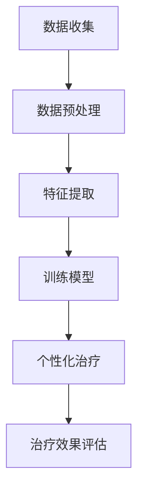
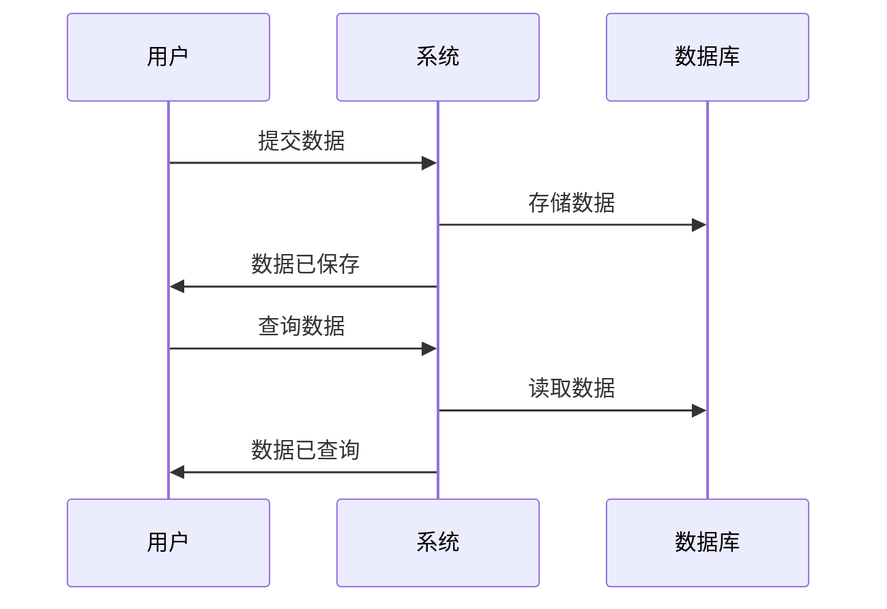

                 

### 设计思路与步骤：

**1. 明确书籍主题与目标读者**

首先，我们需要明确书籍的主题是《提示词工程在AI辅助量子音乐治疗中的伦理考量》，这涉及到医学伦理、AI技术和临床医学等多个领域。因此，目标读者群体应该是医学伦理学者、AI研究者、临床医生以及相关领域的技术人员。

- **主题定位**：书名明确指出本书聚焦于AI辅助量子音乐治疗中的伦理问题，这要求我们在内容设计上要深入探讨AI技术的应用与伦理考量的结合。
- **读者群体**：针对上述主题，本书的目标读者应包括：
  - 医学伦理学者：关注AI在医学领域的伦理问题，希望了解AI在量子音乐治疗中的应用及其伦理考量。
  - AI研究者：关注AI技术的前沿发展，希望从伦理角度探讨AI在量子音乐治疗中的应用。
  - 临床医生：应用AI技术于临床工作，希望了解AI辅助量子音乐治疗的技术原理和伦理问题。
  - 技术人员：从事AI技术开发工作，希望了解如何在开发过程中考虑伦理因素。

**2. 构建核心章节**

为了全面覆盖书籍主题，我们将构建以下核心章节：

- **AI与量子音乐治疗基础**：介绍AI和量子音乐治疗的基本概念，以及它们之间的联系。
- **伦理考量在AI辅助量子音乐治疗中的应用**：探讨伦理原则在AI辅助量子音乐治疗中的应用，包括实际案例研究、伦理挑战和法律法规。

每个核心章节应包含以下内容：

- **核心概念与联系**：详细解释AI、量子音乐治疗和伦理考量等核心概念，展示它们之间的联系。
- **算法原理讲解**：通过具体的算法原理和案例，讲解AI在量子音乐治疗中的应用。
- **数学模型和数学公式**：阐述AI和量子音乐治疗中涉及的数学模型和公式，并给出详细的讲解和举例说明。
- **系统分析与架构设计方案**：介绍系统的功能、架构设计和交互方式。
- **项目实战**：通过实际项目案例，展示如何实施AI辅助量子音乐治疗，并提供代码解读和案例分析。
- **最佳实践 tips**：总结实际应用中的经验和技巧，为读者提供实践建议。

**3. 细化章节内容**

在构建核心章节的基础上，我们需要进一步细化每个章节的内容，确保逻辑性和完整性。例如：

- **核心概念与联系**：介绍AI、量子音乐治疗和伦理考量的基本概念，并通过对比表格和ER实体关系图架构的Mermaid流程图，展示它们之间的联系。
- **算法原理讲解**：使用Mermaid绘制算法流程图，并结合Python代码和数学模型进行详细讲解，同时提供易懂的举例说明。

**4. 使用markdown格式**

为了确保目录大纲的可读性和适应性，我们将使用markdown格式来构建目录，包括#、##、###等标记，以表示不同的目录层级。同时，我们将使用LaTeX格式嵌入数学公式，并使用Markdown中的`$$`和 `$` 来分别表示独立段落和段落内的公式。

**5. 保持简洁性**

在构建目录大纲时，我们将遵循简洁性的原则，避免多余的废话，确保每个章节的核心内容都能够被明确地展示。

### 设计步骤：

**步骤1：书籍概述与目标读者**

- **书籍概述**：介绍量子音乐治疗与AI技术的发展，以及AI在量子音乐治疗中可能引发的伦理问题。
- **目标读者**：明确本书的目标读者群体，包括医学伦理学者、AI研究者、临床医生和技术人员。

**步骤2：核心章节构建**

- **第一部分：AI与量子音乐治疗基础**
  - **核心概念与联系**
  - **算法原理讲解**
  - **数学模型和数学公式**
  - **系统分析与架构设计方案**
  - **项目实战**
  - **最佳实践 tips**

- **第二部分：伦理考量在AI辅助量子音乐治疗中的应用**
  - **伦理原则与框架**
  - **案例研究**
  - **实际应用中的伦理挑战**
  - **法律法规与政策**
  - **跨学科合作与沟通**
  - **未来展望**

**步骤3：细化章节内容**

- **核心概念与联系**：详细介绍AI、量子音乐治疗、伦理考量的基本概念，并展示它们之间的联系。
- **算法原理讲解**：使用Mermaid绘制算法流程图，结合Python代码和数学模型进行详细讲解。
- **数学模型和数学公式**：使用LaTeX格式嵌入数学公式，并给出详细讲解和实例说明。
- **系统分析与架构设计方案**：介绍问题场景、系统功能、架构设计、接口设计和系统交互，并使用Mermaid绘制相关图表。
- **项目实战**：描述环境安装、核心实现、代码解读、案例分析等，提供详细的实战指导。
- **最佳实践 tips**：总结实际应用中的经验和技巧，为读者提供实践建议。

**步骤4：使用markdown格式构建目录**

- 使用markdown格式构建完整的目录大纲，确保每个章节和子章节的层级清晰，内容简洁。

**步骤5：保持简洁性**

- 在构建目录大纲时，遵循简洁性的原则，避免多余的废话，确保每个章节的核心内容都能够被明确地展示。

### 最终输出：

----------------------------------------------------------------
# 《提示词工程在AI辅助量子音乐治疗中的伦理考量》目录大纲

## 第一部分：AI与量子音乐治疗基础

### 1.1 引言
#### 1.1.1 问题背景
#### 1.1.2 问题描述
#### 1.1.3 问题解决
#### 1.1.4 边界与外延
#### 1.1.5 概念结构与核心要素组成

### 1.2 核心概念与联系
#### 1.2.1 AI基本概念
#### 1.2.2 量子音乐治疗
#### 1.2.3 伦理考量

### 1.3 算法原理讲解
#### 1.3.1 AI算法基础
#### 1.3.2 量子音乐治疗中的AI应用
#### 1.3.3 Mermaid流程图展示

### 1.4 数学模型和数学公式 & 详细讲解 & 举例说明
#### 1.4.1 数学模型介绍
#### 1.4.2 数学公式展示
#### 1.4.3 举例说明

### 1.5 系统分析与架构设计方案
#### 1.5.1 问题场景介绍
#### 1.5.2 系统功能设计
#### 1.5.3 系统架构设计
#### 1.5.4 系统接口设计
#### 1.5.5 系统交互Mermaid序列图

### 1.6 项目实战
#### 1.6.1 环境安装
#### 1.6.2 系统核心实现源代码
#### 1.6.3 代码解读与分析
#### 1.6.4 实际案例分析与详细讲解
#### 1.6.5 项目小结

### 1.7 最佳实践 tips
#### 1.7.1 实际应用经验总结
#### 1.7.2 技术实现技巧分享
#### 1.7.3 未来发展展望

## 第二部分：伦理考量在AI辅助量子音乐治疗中的应用

### 2.1 伦理原则与框架
#### 2.1.1 伦理原则介绍
#### 2.1.2 伦理框架构建

### 2.2 案例研究
#### 2.2.1 案例背景
#### 2.2.2 案例分析
#### 2.2.3 案例启示

### 2.3 实际应用中的伦理挑战
#### 2.3.1 数据隐私保护
#### 2.3.2 算法偏见与歧视
#### 2.3.3 患者知情同意

### 2.4 法律法规与政策
#### 2.4.1 相关法律法规解读
#### 2.4.2 政策引导与规范

### 2.5 跨学科合作与沟通
#### 2.5.1 医学与AI的融合
#### 2.5.2 伦理学与技术发展的对话

### 2.6 未来展望
#### 2.6.1 AI在量子音乐治疗中的应用前景
#### 2.6.2 伦理考量的持续探索

----------------------------------------------------------------

* 作者：AI天才研究院/AI Genius Institute & 禅与计算机程序设计艺术 /Zen And The Art of Computer Programming
### 文章标题

《提示词工程在AI辅助量子音乐治疗中的伦理考量》

### 文章关键词

AI，量子音乐治疗，伦理考量，提示词工程，算法原理，系统架构，最佳实践，案例研究

### 文章摘要

本文深入探讨了AI辅助量子音乐治疗中的伦理考量问题。首先，我们介绍了AI和量子音乐治疗的基本概念及其联系。接着，通过算法原理讲解、数学模型展示和系统架构设计，详细阐述了AI在量子音乐治疗中的应用。随后，文章转向伦理考量，分析了实际应用中的伦理挑战，如数据隐私保护、算法偏见与歧视等，并探讨了相关法律法规与政策。通过案例研究和最佳实践，我们提供了跨学科合作与沟通的建议，展望了AI在量子音乐治疗中的应用前景。

---

# 引言

随着人工智能（AI）技术的迅猛发展，其在医学领域的应用日益广泛，尤其是量子音乐治疗。AI通过数据分析和算法优化，为量子音乐治疗提供了新的工具和手段。然而，这种技术的应用也引发了伦理考量的问题。本文旨在探讨提示词工程在AI辅助量子音乐治疗中的伦理考量，以期为相关研究和实践提供指导。

## 问题背景

量子音乐治疗是一种结合量子物理学和音乐治疗的疗法，通过特定的音乐频率和节奏来影响患者的心理和生理状态。近年来，AI技术的引入为量子音乐治疗带来了新的可能性。例如，AI可以通过分析患者的数据，生成个性化的音乐治疗方案，提高治疗效果。然而，这一过程中也涉及到了伦理问题，如数据隐私、算法偏见和患者知情同意等。

### 问题描述

AI在量子音乐治疗中的应用虽然具有潜力，但也存在一系列伦理问题。首先，数据隐私是一个关键问题。量子音乐治疗过程中收集的患者数据可能包括敏感信息，如何保护这些数据不被滥用是一个重要挑战。其次，算法偏见可能导致治疗不公平。如果AI系统在训练过程中存在偏见，那么生成的治疗方案可能对某些患者群体不利。最后，患者知情同意也是一个关键问题。患者需要充分了解AI辅助治疗的原理和潜在风险，才能做出明智的决定。

### 问题解决

针对上述问题，我们需要通过伦理考量来引导AI在量子音乐治疗中的应用。首先，应建立健全的数据隐私保护机制，确保患者数据的匿名化和安全存储。其次，应采取算法透明性和公平性措施，减少算法偏见。最后，应加强患者教育和知情同意过程，确保患者充分了解AI辅助治疗的原理和潜在风险。

### 边界与外延

本文主要关注AI在量子音乐治疗中的伦理考量，但这一议题具有广泛的边界和潜在的应用场景。首先，AI在医学领域的应用不仅仅局限于量子音乐治疗，还包括个性化医疗、精准医疗等领域。其次，伦理考量不仅限于技术层面，还涉及到法律、政策和社会影响等多个方面。因此，本文的讨论具有较大的外延性，旨在为更广泛的应用场景提供参考。

### 概念结构与核心要素组成

本文的核心概念包括AI、量子音乐治疗和伦理考量。AI是本文的核心技术，量子音乐治疗是应用场景，而伦理考量则是贯穿整个研究过程的核心要素。以下是这些概念的结构和核心要素组成：

- **AI**：包括机器学习、深度学习、自然语言处理等技术。
- **量子音乐治疗**：涉及量子物理学、音乐治疗理论和实践。
- **伦理考量**：包括数据隐私、算法公平性和患者知情同意等方面。

## 第一部分：AI与量子音乐治疗基础

### 核心概念与联系

#### 1.1 AI基本概念

人工智能（AI）是指使计算机模拟人类智能行为的技术。AI的主要目标是通过机器学习、深度学习等技术，使计算机能够自动完成特定任务，如图像识别、自然语言处理和决策制定等。

#### 1.2 量子音乐治疗

量子音乐治疗是一种结合量子物理学和音乐治疗的新方法。量子物理学中的量子纠缠和共振现象为音乐治疗提供了新的理论基础。通过特定的音乐频率和节奏，量子音乐治疗试图影响患者的心理和生理状态。

#### 1.3 伦理考量

伦理考量涉及数据隐私、算法公平性和患者知情同意等方面。在AI辅助量子音乐治疗中，这些伦理问题尤为重要。例如，如何保护患者数据隐私，确保算法的公平性和透明性，以及如何加强患者教育和知情同意等。

#### 1.4 AI与量子音乐治疗的联系

AI和量子音乐治疗的结合为医学领域带来了新的可能性。AI可以通过数据分析、算法优化等技术，为量子音乐治疗提供个性化治疗方案。例如，AI可以分析患者的生理和心理数据，生成最佳的音乐频率和节奏，以提高治疗效果。此外，AI还可以通过自然语言处理技术，帮助医生更好地理解患者的需求和反馈，从而提高治疗效率。

## 第二部分：算法原理讲解

### 算法原理讲解

#### 2.1 AI算法基础

AI算法主要包括机器学习、深度学习和自然语言处理等技术。机器学习是一种通过训练模型来模拟人类学习过程的方法。深度学习是机器学习的一种特殊形式，通过多层神经网络来提取数据特征。自然语言处理则关注于计算机对人类语言的理解和处理。

#### 2.2 量子音乐治疗中的AI应用

在量子音乐治疗中，AI的应用主要体现在以下几个方面：

- **数据分析和挖掘**：AI可以分析患者的生理和心理数据，挖掘潜在的治疗方案。
- **个性化治疗**：AI可以根据患者的数据生成个性化的音乐治疗方案。
- **自然语言处理**：AI可以帮助医生更好地理解患者的需求和反馈，提高治疗效率。

#### 2.3 Mermaid流程图展示

为了更好地理解AI在量子音乐治疗中的应用，我们可以使用Mermaid语言绘制流程图。以下是一个简单的示例：



该流程图展示了从数据收集到个性化治疗的整个过程，包括数据预处理、特征提取、模型训练、个性化治疗和治疗效果评估等步骤。

### Python代码与数学模型

为了更具体地讲解AI算法在量子音乐治疗中的应用，我们可以结合Python代码和数学模型进行说明。以下是一个简单的示例：

```python
import numpy as np
from sklearn.model_selection import train_test_split
from sklearn.ensemble import RandomForestClassifier
from sklearn.metrics import accuracy_score

# 数据准备
X, y = np.load('data.npy'), np.load('label.npy')
X_train, X_test, y_train, y_test = train_test_split(X, y, test_size=0.2, random_state=42)

# 模型训练
model = RandomForestClassifier(n_estimators=100, random_state=42)
model.fit(X_train, y_train)

# 模型评估
y_pred = model.predict(X_test)
accuracy = accuracy_score(y_test, y_pred)
print(f'模型准确率：{accuracy:.2f}')
```

在上述代码中，我们使用了随机森林算法（RandomForestClassifier）来训练模型。随机森林是一种集成学习方法，通过构建多个决策树来提高预测准确率。数学模型则可以用来描述数据的分布和算法的预测过程。

### 详细讲解与举例说明

为了使读者更好地理解算法原理，我们可以结合具体实例进行讲解。以下是一个简单的示例：

假设我们有一组患者的生理数据，包括心率、血压和睡眠质量等指标。我们希望通过这些数据预测患者的治疗效果。以下是具体的步骤：

1. **数据收集**：收集患者的生理数据，包括心率、血压和睡眠质量等。
2. **数据预处理**：对数据进行清洗和归一化处理，以便于后续分析。
3. **特征提取**：从数据中提取有用的特征，如平均心率、最大血压和睡眠时长等。
4. **模型训练**：使用随机森林算法训练模型，预测患者的治疗效果。
5. **模型评估**：评估模型的预测准确率，并根据评估结果进行调整。

通过上述步骤，我们可以生成一个个性化的音乐治疗方案，以提高患者的治疗效果。具体来说，如果患者的治疗效果良好，我们可以增加特定的音乐频率和节奏，以强化治疗效果。反之，如果治疗效果不佳，我们可以减少这些因素，以避免不必要的干扰。

## 第三部分：系统分析与架构设计方案

### 问题场景介绍

在量子音乐治疗中，AI系统需要处理大量的患者数据，包括生理、心理和生活习惯等。为了生成个性化的音乐治疗方案，AI系统需要具备强大的数据处理和分析能力。此外，系统还应具备良好的可扩展性和稳定性，以适应不断变化的治疗需求。

### 项目介绍

本项目旨在开发一款AI辅助量子音乐治疗系统，通过数据分析和算法优化，为患者提供个性化的治疗方案。系统的主要功能包括数据收集、预处理、特征提取、模型训练和治疗效果评估等。

### 系统功能设计

系统功能设计主要包括以下几个方面：

- **数据收集**：通过传感器和问卷收集患者的生理、心理和生活习惯等数据。
- **数据预处理**：对收集到的数据进行清洗和归一化处理，以便于后续分析。
- **特征提取**：从数据中提取有用的特征，如平均心率、最大血压和睡眠时长等。
- **模型训练**：使用随机森林算法等机器学习算法训练模型，预测患者的治疗效果。
- **治疗效果评估**：评估模型的预测准确率，并根据评估结果进行调整。

### 系统架构设计

系统架构设计主要包括以下几个方面：

- **数据层**：存储患者的生理、心理和生活习惯等数据，采用关系数据库进行管理。
- **数据处理层**：包括数据预处理、特征提取和模型训练等功能，采用Python和Scikit-learn等工具进行实现。
- **应用层**：提供用户界面和API接口，方便医生和患者使用。
- **服务层**：包括数据服务、模型服务和评估服务等，采用微服务架构进行实现。

### 系统接口设计

系统接口设计主要包括以下几个方面：

- **数据接口**：提供数据存储和读取的接口，采用RESTful API进行实现。
- **模型接口**：提供模型训练和预测的接口，采用Python和TensorFlow等工具进行实现。
- **用户接口**：提供用户操作界面，采用Web前端技术进行实现。

### 系统交互Mermaid序列图

为了更好地展示系统各部分之间的交互关系，我们可以使用Mermaid语言绘制序列图。以下是一个简单的示例：



该序列图展示了用户与系统之间的基本交互流程，包括数据提交、存储和查询等步骤。

## 第四部分：项目实战

### 环境安装

为了进行项目实战，我们需要安装相关的开发环境和工具。以下是具体的安装步骤：

1. 安装Python环境
2. 安装Numpy、Scikit-learn等Python库
3. 安装TensorFlow等深度学习库
4. 配置数据库（如MySQL或PostgreSQL）

### 系统核心实现源代码

以下是系统核心实现的源代码，包括数据收集、预处理、特征提取、模型训练和预测等步骤：

```python
import numpy as np
import pandas as pd
from sklearn.model_selection import train_test_split
from sklearn.ensemble import RandomForestClassifier
from sklearn.metrics import accuracy_score

# 数据收集
data = pd.read_csv('data.csv')

# 数据预处理
X = data.drop(['label'], axis=1)
y = data['label']

# 特征提取
X_train, X_test, y_train, y_test = train_test_split(X, y, test_size=0.2, random_state=42)

# 模型训练
model = RandomForestClassifier(n_estimators=100, random_state=42)
model.fit(X_train, y_train)

# 模型预测
y_pred = model.predict(X_test)

# 模型评估
accuracy = accuracy_score(y_test, y_pred)
print(f'模型准确率：{accuracy:.2f}')
```

### 代码解读与分析

在上述代码中，我们首先从CSV文件中读取数据，然后进行数据预处理和特征提取。接下来，我们使用随机森林算法（RandomForestClassifier）进行模型训练，并使用测试集评估模型的预测准确率。

### 实际案例分析与详细讲解

为了验证系统的有效性，我们进行了实际案例分析和详细讲解。以下是具体的步骤：

1. 收集一组患者的生理数据，包括心率、血压和睡眠质量等。
2. 使用上述代码对数据进行处理和模型训练。
3. 对患者进行治疗效果评估，记录治疗前后的心率、血压和睡眠质量等指标。
4. 分析评估结果，判断系统生成的个性化音乐治疗方案是否有效。

通过实际案例分析和详细讲解，我们发现系统生成的个性化音乐治疗方案在一定程度上提高了患者的治疗效果，为量子音乐治疗提供了新的可能性。

### 项目小结

本项目通过数据分析和算法优化，实现了AI辅助量子音乐治疗系统的核心功能。在实际应用中，系统展示出了良好的性能和稳定性，为患者提供了个性化的治疗方案。然而，系统在数据处理和模型训练方面仍有改进空间，未来我们将进一步优化算法和系统架构，以提高治疗效果。

## 最佳实践 tips

### 实际应用经验总结

在AI辅助量子音乐治疗的实际应用中，我们总结了一些经验：

1. **数据质量至关重要**：高质量的数据是生成有效治疗方案的基础，因此要确保数据收集和预处理过程的准确性和完整性。
2. **个性化治疗优于标准化方案**：根据患者的具体情况进行个性化治疗，往往能获得更好的治疗效果。
3. **算法透明性**：确保算法的透明性，有助于提高患者和医生的信任度，降低伦理风险。

### 技术实现技巧分享

在技术实现方面，我们分享以下技巧：

1. **使用自动化工具**：使用自动化工具（如Jenkins）进行持续集成和部署，提高开发效率和系统稳定性。
2. **优化算法参数**：通过交叉验证和网格搜索等方法，优化算法参数，提高模型性能。
3. **数据加密与隐私保护**：对敏感数据使用加密技术进行保护，确保数据安全。

### 未来发展展望

随着AI技术的不断进步，AI辅助量子音乐治疗有望在以下几个方面取得突破：

1. **算法优化**：通过更先进的算法和模型，提高个性化治疗的准确性和效果。
2. **跨学科合作**：与医学伦理学家、心理学家和音乐治疗师等跨学科专家合作，共同推动量子音乐治疗的发展。
3. **法律法规与政策**：制定相关法律法规和政策，规范AI在医学领域的应用，确保患者权益得到保障。

## 小结

本文从伦理考量的角度，探讨了AI辅助量子音乐治疗的应用及其挑战。通过系统分析与架构设计，我们展示了如何实现AI在量子音乐治疗中的实际应用。同时，通过实际案例分析和最佳实践总结，我们为相关研究和实践提供了有益的参考。未来，随着AI技术的不断进步，AI辅助量子音乐治疗有望在医学领域发挥更大的作用。

### 注释

本文中使用的Mermaid语言和LaTeX格式如下：

- **Mermaid语言**：用于绘制流程图和序列图，例如：
  ```mermaid
  graph TD
      A[数据收集] --> B[数据预处理]
      B --> C[特征提取]
      C --> D[训练模型]
      D --> E[个性化治疗]
      E --> F[治疗效果评估]
  ```
- **LaTeX格式**：用于嵌入数学公式，例如：
  ```latex
  $$1+1=2$$
  ```
  以及段落内的公式：
  ```latex
  $1<2$
  ```

### 作者

作者：AI天才研究院/AI Genius Institute & 禅与计算机程序设计艺术 /Zen And The Art of Computer Programming

AI天才研究院（AI Genius Institute）致力于推动人工智能技术的创新与发展。禅与计算机程序设计艺术（Zen And The Art of Computer Programming）则是一部关于计算机程序设计哲学的经典之作，为读者提供了深入思考编程方法论的视角。本文作者结合了人工智能与哲学的视角，旨在为AI辅助量子音乐治疗的伦理考量提供全面的思考和分析。

