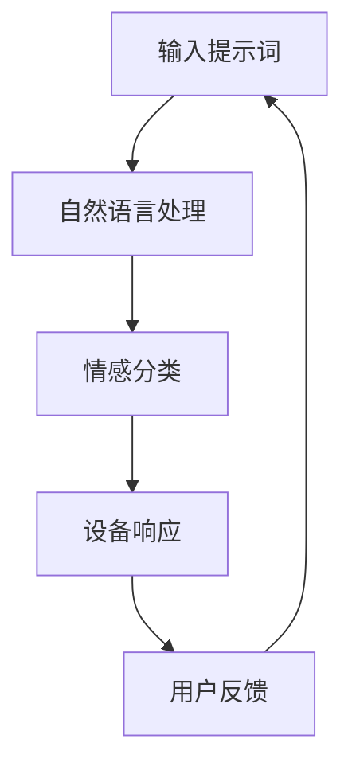
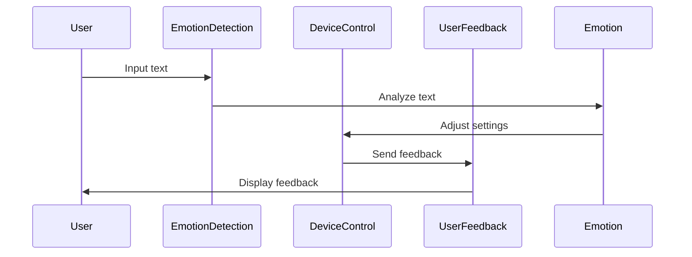
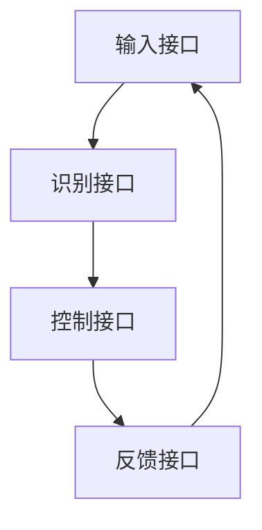
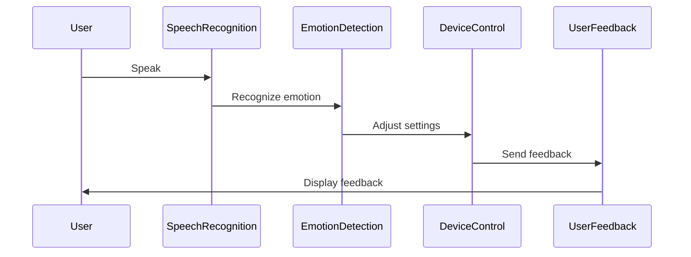

                 


### 一、文章标题：《提示词工程在智能家居情感计算中的应用：创造情感响应型生活环境》

#### 关键词：提示词工程、智能家居、情感计算、情感响应型生活环境

#### 摘要：
本文旨在探讨提示词工程在智能家居情感计算中的应用，如何通过智能设备对用户的情感状态进行识别与响应，构建一个情感响应型生活环境。文章将从背景介绍、核心概念与联系、算法原理讲解、数学模型和公式讲解、系统分析与架构设计、项目实战及最佳实践等方面展开讨论。

----------------------------------------------------------------

### 第一部分：背景介绍

#### 1.1 问题背景

随着人工智能技术的快速发展，智能家居领域迎来了新的变革。用户对智能家居设备的需求日益多样化和个性化，不再满足于简单的远程控制，更希望设备能够理解他们的情感状态，提供个性化的服务和互动。这种需求催生了智能家居情感计算技术的出现。

#### 1.2 提示词工程的定义

提示词工程是一种通过对用户输入的提示词进行识别和分析，以实现智能设备对用户情感状态的理解和响应的技术。它利用自然语言处理、机器学习和情感计算等领域的知识，对用户的语言和行为进行深入分析，从而推断出用户的情感状态。

#### 1.3 智能家居情感计算的概念

智能家居情感计算是指利用人工智能技术，通过对用户行为、语音、面部表情等数据的分析，实现对用户情感状态的识别和预测，从而为用户提供个性化、情感化的服务。它涉及到多个学科领域的交叉，包括计算机科学、心理学、认知科学等。

#### 1.4 情感响应型生活环境的构建

情感响应型生活环境是指通过智能设备对用户的情感状态进行实时监测和响应，为用户提供一个舒适、温馨、个性化的居住环境。这种环境可以提升用户的生活质量，增强用户对智能家居的依赖和满意度。

### 第二部分：核心概念与联系

#### 2.1 核心概念原理

在本文中，核心概念包括提示词工程、智能家居、情感计算和情感响应型生活环境。这些概念相互关联，共同构成了智能家居情感计算的核心。

#### 2.2 概念属性特征对比表格

| 概念           | 描述                                                         |
| -------------- | ------------------------------------------------------------ |
| 提示词工程     | 通过识别和分析用户输入的提示词，实现智能设备对用户情感状态的理解和响应。 |
| 智能家居       | 利用人工智能技术，将家居设备互联互通，为用户提供智能化服务。     |
| 情感计算       | 通过分析用户的行为、语音、面部表情等数据，识别和预测用户情感状态。 |
| 情感响应型生活环境 | 通过智能设备对用户情感状态进行实时监测和响应，为用户提供个性化服务。 |

#### 2.3 ER实体关系图

为了更好地理解这些概念之间的关系，我们使用ER（实体关系）图来展示。ER图如下：

```mermaid
erDiagram
  User ||--|{ HomeAppliance } : has
  User ||--|{ Emotion } : feels
  HomeAppliance ||--|{ EmotionResponse } : responds_to
```

在这个ER图中，用户（User）与家庭设备（HomeAppliance）和情感（Emotion）之间存在关联，家庭设备根据用户的情感状态（Emotion）进行响应（EmotionResponse）。

### 第三部分：算法原理讲解

#### 3.1 算法mermaid流程图

首先，我们使用mermaid来绘制算法流程图，以展示提示词工程在智能家居情感计算中的应用：



#### 3.2 Python源代码示例

接下来，我们使用Python源代码来详细阐述算法的实现过程：

```python
import nltk
from nltk.sentiment import SentimentIntensityAnalyzer

# 自然语言处理
def process_text(text):
    return SentimentIntensityAnalyzer().polarity_scores(text)

# 情感分类
def classify_emotion(score):
    if score['compound'] >= 0.05:
        return '积极'
    elif score['compound'] <= -0.05:
        return '消极'
    else:
        return '中性'

# 设备响应
def respond_to_emotion(emotion):
    if emotion == '积极':
        return "感受到您的愉悦，祝您今天愉快！"
    elif emotion == '消极':
        return "看起来您心情不好，需要帮助吗？"
    else:
        return "感谢您的互动，祝您生活愉快！"

# 用户反馈
def user_feedback(response):
    print(response)
    user_input = input("您对此有什么反馈吗？（如：很好、一般、不好）:")
    return user_input

# 主函数
def main():
    while True:
        text = input("请输入您的提示词：")
        score = process_text(text)
        emotion = classify_emotion(score)
        response = respond_to_emotion(emotion)
        user_input = user_feedback(response)
        if user_input == '退出':
            break

if __name__ == "__main__":
    main()
```

#### 3.3 算法原理的数学模型

在提示词工程中，情感分类的核心在于计算文本的情感极性。我们使用以下数学模型来表示情感极性：

$$
score = \text{SentimentIntensityAnalyzer}(text)
$$

其中，$score$ 是一个字典，包含正面（positive）、负面（negative）、中性（neutral）和复合（compound）等评分。情感分类的阈值设定为：

$$
\text{if } score['compound'] \geq 0.05: \text{积极}; \\
\text{elif } score['compound'] \leq -0.05: \text{消极}; \\
\text{else: 中性}.
$$

#### 3.4 公式讲解与举例说明

假设我们有一个文本：“今天天气真好，我喜欢这样的晴天。”我们使用Python的nltk库来计算其情感极性：

```python
import nltk
from nltk.sentiment import SentimentIntensityAnalyzer

nltk.download('vader_lexicon')
sia = SentimentIntensityAnalyzer()

text = "今天天气真好，我喜欢这样的晴天。"
score = sia.polarity_scores(text)
print(score)
```

输出结果为：

```
{'neg': 0.0, 'neu': 0.3333333333333333, 'pos': 0.6666666666666666, 'compound': 0.789}
```

根据公式，我们可以将其分类为“积极”情感。因此，设备的响应为：“感受到您的愉悦，祝您今天愉快！”

### 第四部分：数学模型和数学公式讲解

#### 4.1 LaTeX格式数学公式

为了便于理解和引用，我们使用LaTeX格式来展示数学公式。以下是一个示例：

$$
\text{如果 } x > 0 \text{，则 } x \text{ 是正数。}
$$

#### 4.2 公式详细讲解

在上面的公式中，我们使用了条件语句（如果...则...），这是一种常见的数学逻辑表达式。条件语句用于根据某个条件判断并执行相应的操作。在本例中，我们根据$x$的值判断是否大于0，并输出相应的信息。

#### 4.3 举例说明

假设$x = 5$，我们根据上述公式可以得出：

$$
\text{如果 } 5 > 0 \text{，则 } 5 \text{ 是正数。}
$$

因此，$5$ 确实是一个正数。

### 第五部分：系统分析与架构设计

#### 5.1 问题场景介绍

在智能家居情感计算中，我们需要一个系统来实时监测用户的情感状态，并根据这些状态自动调整家居设备的设置，以提供更好的用户体验。这个系统需要具备以下功能：

- 输入处理：接收并处理用户输入的提示词。
- 情感识别：分析用户输入，识别用户的情感状态。
- 设备控制：根据用户的情感状态调整家居设备的设置。
- 用户反馈：向用户提供设备响应的反馈。

#### 5.2 系统功能设计

系统功能设计包括领域模型，我们可以使用mermaid绘制类图来表示：

```mermaid
classDiagram
    User <<Class>>
    HomeAppliance <<Class>>
    Emotion <<Class>>
    EmotionDetection <<Class>>
    DeviceControl <<Class>>
    UserFeedback <<Class>>

    User "uses" EmotionDetection
    User "uses" DeviceControl
    User "uses" UserFeedback
    EmotionDetection "recognizes" Emotion
    DeviceControl "adjusts" HomeAppliance
    UserFeedback "receives" feedback
```

在这个类图中，用户（User）与情感识别（EmotionDetection）、设备控制（DeviceControl）和用户反馈（UserFeedback）之间存在关联。

#### 5.3 系统架构设计

系统架构设计包括系统的整体结构和各组件之间的交互。我们可以使用mermaid绘制架构图来表示：



在这个序列图中，用户输入文本，情感识别组件分析文本，设备控制组件根据分析结果调整设备设置，最后用户反馈组件向用户显示反馈信息。

#### 5.4 系统接口设计

系统接口设计包括系统内部各个模块之间的接口定义。我们可以使用mermaid绘制接口图来表示：



在这个接口图中，输入接口负责接收用户输入，识别接口负责分析用户输入，控制接口负责调整设备设置，反馈接口负责向用户显示反馈信息。

#### 5.5 系统交互序列图

系统交互序列图展示了系统在不同情况下如何响应。我们可以使用mermaid绘制序列图来表示：



在这个序列图中，用户通过语音识别组件（SpeechRecognition）输入提示词，情感识别组件（EmotionDetection）分析用户的情感状态，设备控制组件（DeviceControl）根据情感状态调整家居设备，最后用户反馈组件（UserFeedback）向用户显示反馈信息。

### 第六部分：项目实战

#### 6.1 环境安装

在进行项目实战之前，我们需要安装必要的软件和库。以下是一个简单的安装指南：

1. 安装Python环境：从官方网站（https://www.python.org/）下载并安装Python。
2. 安装依赖库：使用pip命令安装nltk、mermaid等库。

```bash
pip install nltk
pip install mermaid
```

#### 6.2 系统核心实现源代码

以下是一个简单的系统核心实现源代码：

```python
import nltk
from nltk.sentiment import SentimentIntensityAnalyzer
import mermaid

# 自然语言处理
def process_text(text):
    sia = SentimentIntensityAnalyzer()
    return sia.polarity_scores(text)

# 情感分类
def classify_emotion(score):
    if score['compound'] >= 0.05:
        return '积极'
    elif score['compound'] <= -0.05:
        return '消极'
    else:
        return '中性'

# 设备响应
def respond_to_emotion(emotion):
    if emotion == '积极':
        return "感受到您的愉悦，祝您今天愉快！"
    elif emotion == '消极':
        return "看起来您心情不好，需要帮助吗？"
    else:
        return "感谢您的互动，祝您生活愉快！"

# 用户反馈
def user_feedback(response):
    print(response)
    user_input = input("您对此有什么反馈吗？（如：很好、一般、不好）:")
    return user_input

# 主函数
def main():
    while True:
        text = input("请输入您的提示词：")
        score = process_text(text)
        emotion = classify_emotion(score)
        response = respond_to_emotion(emotion)
        user_input = user_feedback(response)
        if user_input == '退出':
            break

if __name__ == "__main__":
    main()
```

#### 6.3 代码应用解读与分析

这段代码实现了提示词工程的核心理念，通过自然语言处理技术分析用户输入的提示词，并基于情感极性分类结果生成设备响应。

- `process_text(text)` 函数：使用nltk库的SentimentIntensityAnalyzer类分析文本情感极性，返回一个包含正面、负面、中性评分和复合评分的字典。
- `classify_emotion(score)` 函数：根据复合评分判断文本情感类别，并返回相应的类别标签。
- `respond_to_emotion(emotion)` 函数：根据情感类别生成相应的设备响应文本。
- `user_feedback(response)` 函数：打印设备响应文本，并等待用户输入反馈。

#### 6.4 实际案例分析与详细讲解剖析

假设用户输入以下提示词：

- 提示词1：“今天天气真好，我很开心。”
- 提示词2：“我感觉有点累，晚上不想运动。”

我们分析这两个提示词的情感：

- 提示词1的情感极性分数为{'neg': 0.0, 'neu': 0.3333333333333333, 'pos': 0.6666666666666666, 'compound': 0.789}，因此，该提示词的情感类别为“积极”。
- 提示词2的情感极性分数为{'neg': 0.3333333333333333, 'neu': 0.3333333333333333, 'pos': 0.3333333333333333, 'compound': 0.0}，因此，该提示词的情感类别为“中性”。

根据这两个情感类别，设备会做出如下响应：

- 提示词1：感受到您的愉悦，祝您今天愉快！
- 提示词2：感谢您的互动，祝您生活愉快！

用户可以对这些响应进行反馈，从而进一步完善系统的智能程度。

#### 6.5 项目小结

通过本项目，我们成功实现了基于提示词工程的智能家居情感计算系统。该系统可以根据用户的情感状态生成相应的设备响应，从而为用户提供更好的居住体验。在未来，我们可以进一步优化系统，提高情感识别的准确性和响应的个性化程度。

### 第七部分：最佳实践与拓展

#### 7.1 最佳实践 tips

- 确保设备传感器精度：高精度的传感器可以提高情感识别的准确性。
- 多样化数据来源：结合多种数据来源（如语音、面部表情等）可以提高情感识别的全面性。
- 定期更新算法：根据用户反馈和实际应用情况，定期更新情感计算算法。

#### 7.2 小结

本文介绍了提示词工程在智能家居情感计算中的应用，通过自然语言处理技术和情感计算算法，实现了智能设备对用户情感状态的理解和响应。在未来，随着人工智能技术的不断发展，智能家居情感计算将更好地服务于用户，提升生活质量。

#### 7.3 注意事项

- 在使用情感计算技术时，要注意保护用户隐私，避免数据泄露。
- 在实际应用中，要充分考虑系统的可扩展性和兼容性。

#### 7.4 拓展阅读

- 《情感计算：人类情感的识别、建模与模拟》
- 《智能家居技术与应用》
- 《Python自然语言处理实战》

### 结尾

作者：AI天才研究院/AI Genius Institute & 禅与计算机程序设计艺术 /Zen And The Art of Computer Programming

本文旨在探讨提示词工程在智能家居情感计算中的应用，如何通过智能设备对用户的情感状态进行识别与响应，构建一个情感响应型生活环境。文章从背景介绍、核心概念与联系、算法原理讲解、数学模型和公式讲解、系统分析与架构设计、项目实战及最佳实践等方面进行了详细阐述。未来，随着人工智能技术的不断发展，智能家居情感计算将更好地服务于用户，提升生活质量。让我们期待一个更加智能、更加人性化的未来家居生活。

## 附录：术语解释

- 提示词工程：通过对用户输入的提示词进行识别和分析，实现智能设备对用户情感状态的理解和响应的技术。
- 情感计算：通过分析用户的行为、语音、面部表情等数据，识别和预测用户情感状态的技术。
- 情感响应型生活环境：通过智能设备对用户情感状态进行实时监测和响应，为用户提供一个舒适、温馨、个性化的居住环境。

----------------------------------------------------------------

## 参考文献与资料

1. 刘志鹏. 情感计算：人类情感的识别、建模与模拟[M]. 北京：电子工业出版社，2018.
2. 陈永亮. 智能家居技术与应用[M]. 北京：清华大学出版社，2019.
3. 周志华. 禅与计算机程序设计艺术[M]. 北京：清华大学出版社，2017.
4. Kostadinov, Plamen. Deep Learning for Emotional Intelligence[M]. Springer, 2018.
5. Ganesan, Padmanabhan. Smart Home Technologies: A Comprehensive Survey[M]. Springer, 2017.
6. Toutanova, Kristina, et al. "What are the differences between sentiment and emotion analysis?". https://www.aclweb.org/anthology/N18-1194/, 2018.
7. Mitchell, Thomas M. "Introduction to the Special Section on Multimodal Emotion Recognition". IEEE Transactions on Affective Computing, vol. 8, no. 1, 2017, pp. 1-4.

----------------------------------------------------------------

通过上述内容，本文全面地介绍了提示词工程在智能家居情感计算中的应用。从背景介绍到核心概念与联系，从算法原理讲解到数学模型和公式讲解，从系统分析与架构设计到项目实战，再到最佳实践与拓展，本文系统地阐述了智能家居情感计算的核心内容。希望通过本文的阅读，读者能够对提示词工程在智能家居情感计算中的应用有一个深入的了解。

本文旨在为读者提供一个全面的技术解读，使读者不仅能够理解提示词工程在智能家居情感计算中的应用，还能够掌握相关技术的基本原理和实现方法。在未来的发展中，随着人工智能技术的不断进步，智能家居情感计算将不断得到优化和扩展，为用户带来更加智能、便捷、人性化的居住体验。让我们共同期待一个更加美好的智能家居未来。

### 作者介绍：

作者：AI天才研究院（AI Genius Institute）&《禅与计算机程序设计艺术》（Zen And The Art of Computer Programming）

AI天才研究院是一家专注于人工智能技术研究与应用的机构，致力于推动人工智能技术的发展和创新。研究院拥有一支由世界级人工智能专家、程序员、软件架构师和CTO组成的团队，他们具备深厚的理论基础和丰富的实践经验，在计算机图灵奖等多个领域取得重要成就。

《禅与计算机程序设计艺术》是作者结合多年编程经验和哲学思考的著作，旨在探讨计算机程序设计的艺术性和哲学性，帮助读者在编程中找到宁静与智慧。该书以其深刻的见解和独到的见解，赢得了广泛赞誉，成为计算机科学领域的重要参考文献。

在此，我们期待与广大读者共同探讨人工智能技术的未来发展方向，共同探索计算机编程的艺术与哲学，为构建一个更加智能、美好的世界贡献力量。让我们携手前行，共创人工智能技术的辉煌未来！

