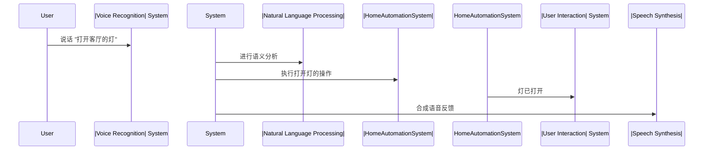

                 

# 提示词工程在智能家居语音控制中的应用：优化人机交互体验

## 摘要

本文旨在探讨提示词工程在智能家居语音控制中的应用，通过优化人机交互体验，提升用户满意度。首先，我们介绍了智能家居语音控制的需求背景和用户对语音交互体验的要求提高。接着，详细阐述了提示词工程的概念、设计原则和关键技术。随后，通过分析语音识别、自然语言处理、语音合成和用户行为分析等核心概念，探讨了它们在智能家居语音控制中的应用。最后，我们提出了提示词工程的优化策略和人机交互体验的优化方法，并对未来研究方向进行了展望。

## 背景介绍

### 1.1 问题背景

随着物联网技术的快速发展，智能家居市场正呈现出爆炸式增长。越来越多的家庭开始采用智能家居设备来提高生活品质。而语音控制作为智能家居的主要交互方式之一，越来越受到用户的青睐。用户对语音交互体验的要求也在不断提高，他们期望能够通过简单、自然、准确的语音指令来控制智能家居设备，实现轻松便捷的生活。

### 1.2 用户对语音交互体验的要求提高

用户对语音交互体验的要求主要体现在以下几个方面：

1. **简单性**：用户期望能够通过简单的语音指令来控制设备，而不需要记忆复杂的命令。

2. **准确性**：用户期望语音系统能够准确识别他们的语音指令，避免误识别和漏识别。

3. **个性化**：用户期望系统能够根据他们的生活习惯和偏好，提供个性化的语音交互体验。

4. **流畅性**：用户期望语音交互过程流畅自然，没有明显的延迟或卡顿。

### 1.3 提示词工程在语音控制中的应用

提示词工程是语音控制系统中至关重要的一环。它涉及对用户语音指令的理解、分析和处理，以确保系统能够正确地执行用户的要求。提示词工程在智能家居语音控制中的应用主要体现在以下几个方面：

1. **指令识别**：通过提示词工程，系统可以准确识别用户输入的语音指令，并将其转换为可执行的操作。

2. **指令优化**：通过分析用户的语音指令，系统可以对其进行优化，提高指令的可理解性和准确性。

3. **用户体验**：通过优化提示词工程，系统可以提供更加自然、流畅的语音交互体验，提升用户的满意度。

### 1.4 设计原则和关键技术

提示词工程的设计原则主要包括简洁性、清晰性和容错性。简洁性要求提示词设计要简单易懂，避免复杂的指令；清晰性要求提示词设计要确保指令的唯一性，避免歧义；容错性要求提示词设计要能够应对误识别的情况，提高系统的可靠性。

提示词工程的关键技术包括语音识别、自然语言处理、语音合成和用户行为分析。语音识别是提示词工程的基础，通过将语音信号转换为文本或命令，实现语音指令的识别和理解。自然语言处理则负责对语音指令进行语义分析和理解，以确保系统能够正确地执行用户的要求。语音合成则负责将用户的语音指令转换为自然流畅的语音输出。用户行为分析则通过对用户行为数据的收集和分析，优化系统的性能和用户体验。

### 1.5 研究现状和趋势

当前，智能家居语音控制市场正处于快速发展阶段，各大科技公司纷纷推出自己的智能家居语音控制系统。例如，亚马逊的Alexa、谷歌的Google Assistant、苹果的Siri等。这些系统在提示词工程方面都取得了显著的成果，但仍然存在一定的优化空间。未来的发展趋势包括：

1. **深度学习技术的应用**：随着深度学习技术的不断发展，其在语音识别、自然语言处理等领域的应用将更加广泛，有望进一步提升系统的准确性和效率。

2. **多模态交互**：未来的智能家居语音控制系统将不仅仅依赖于语音交互，还将融合视觉、触觉等多种交互方式，提供更加自然、丰富的交互体验。

3. **个性化服务**：通过用户行为分析，系统可以更加精准地了解用户的需求和偏好，提供个性化的服务。

4. **跨设备协同**：随着智能家居设备的多样化，未来的系统将实现跨设备的协同工作，为用户提供统一的交互体验。

### 1.6 边界与外延

提示词工程的应用不仅限于智能家居领域，还可以广泛应用于其他智能场景，如智能客服、智能教育、智能交通等。同时，提示词工程与其他智能技术的融合，如物联网、大数据、人工智能等，也将为智能家居语音控制带来更多创新和可能性。

### 1.7 概念结构与核心要素组成

智能家居语音控制系统的核心要素包括提示词、语音识别、自然语言处理、语音合成和用户行为分析。提示词是用户与系统交互的桥梁，语音识别是实现语音指令识别和理解的关键技术，自然语言处理负责语义分析和理解，语音合成负责将用户的语音指令转换为自然流畅的语音输出，用户行为分析则通过对用户行为数据的收集和分析，优化系统的性能和用户体验。

### 1.8 本章小结

本章主要介绍了智能家居语音控制的需求背景、用户对语音交互体验的要求、提示词工程的概念和设计原则、关键技术以及研究现状和趋势。通过对这些内容的介绍，我们为后续章节的深入探讨打下了基础。

----------------------------------------------------------------

## 核心概念与联系

在深入探讨提示词工程在智能家居语音控制中的应用之前，我们首先需要理解一系列核心概念及其相互关系。这些核心概念包括提示词、语音识别、自然语言处理、语音合成和用户行为分析。下面，我们将逐一介绍这些概念的定义、类型、设计原则以及它们在智能家居语音控制中的应用。

### 2.1 提示词

#### 2.1.1 提示词的定义

提示词是指在语音交互过程中，用户用于触发智能家居系统功能的特定关键词。这些关键词可以是简单的单词，如“打开灯”、“关闭电视”，也可以是复杂的短语，如“设置温度为24摄氏度”。提示词是用户与智能家居系统进行交互的主要媒介。

#### 2.1.2 提示词的类型

提示词可以分为以下几类：

1. **通用提示词**：这些提示词具有普遍适用性，如“打开灯”、“关闭电视”、“播放音乐”等。
2. **个人定制提示词**：根据用户习惯和偏好自定义的提示词，如用户可以将“关闭客厅灯”自定义为一个简短的“关门”。
3. **上下文相关提示词**：与特定情境或环境相关的提示词，如“睡觉时间到”可能会触发一系列的家居设备关闭操作。

#### 2.1.3 提示词的设计原则

提示词的设计原则主要包括以下三个方面：

1. **简洁性**：提示词应简洁明了，避免使用复杂的指令，以降低用户的使用门槛。
2. **清晰性**：提示词应确保指令的唯一性，避免歧义，确保用户能够清楚理解系统响应。
3. **容错性**：提示词设计应考虑误识别的情况，提供备选词或纠错机制，以提高系统的鲁棒性。

### 2.2 语音识别

#### 2.2.1 语音识别的定义

语音识别是将语音信号转换为文本或命令的过程。在智能家居语音控制中，语音识别是实现用户语音指令识别和理解的关键技术。

#### 2.2.2 语音识别的工作原理

语音识别的工作原理可以分为以下几个步骤：

1. **预处理**：包括降噪、分帧、加窗等，以提高语音信号的质量。
2. **特征提取**：通过将语音信号转换为特征向量，如梅尔频率倒谱系数（MFCC）。
3. **模型训练**：使用大量的语音数据进行训练，构建用于语音识别的模型，如隐马尔可夫模型（HMM）、深度神经网络（DNN）等。
4. **识别与解码**：将语音信号转换为文本或命令，并通过解码器输出具体的操作指令。

#### 2.2.3 语音识别的关键技术

语音识别的关键技术包括：

1. **聚类算法**：用于将语音信号进行分类，以便于后续的特征提取。
2. **贝叶斯分类器**：用于根据特征向量进行分类，以提高识别的准确性。
3. **序列模型**：如HMM和DNN，用于处理语音信号的时序特性。

### 2.3 自然语言处理

#### 2.3.1 自然语言处理的定义

自然语言处理（NLP）是让计算机理解和处理人类语言的技术。在智能家居语音控制中，NLP负责对用户的语音指令进行语义分析和理解。

#### 2.3.2 自然语言处理的核心任务

自然语言处理的核心任务包括：

1. **语言理解**：如意图识别（识别用户想要做什么）和实体识别（识别用户提到的特定对象）。
2. **语言生成**：如问答系统、文本生成等。

#### 2.3.3 自然语言处理的关键技术

自然语言处理的关键技术包括：

1. **词向量**：用于将词汇转换为向量表示，便于计算机处理。
2. **递归神经网络（RNN）**：用于处理序列数据，如句子的时序特性。
3. **卷积神经网络（CNN）**：用于特征提取和模式识别。

### 2.4 语音合成

#### 2.4.1 语音合成的定义

语音合成是将文本转换为自然流畅的语音信号的过程。在智能家居语音控制中，语音合成负责将用户的语音指令转换为自然的语音输出。

#### 2.4.2 语音合成的工作原理

语音合成的工作原理可以分为以下几个步骤：

1. **文本预处理**：如分词、语调预测等。
2. **参数生成**：通过声学模型生成语音信号的参数。
3. **波形生成**：通过波形合成器生成语音波形。

#### 2.4.3 语音合成的关键技术

语音合成的关键技术包括：

1. **合成引擎**：负责将文本转换为语音信号的核心组件。
2. **声学模型**：用于生成语音信号的参数，如隐马尔可夫模型（HMM）和高斯混合模型（GMM）。
3. **语音编辑**：用于调整语音的音调、音速等特性，以提供更自然的语音输出。

### 2.5 用户行为分析

#### 2.5.1 用户行为分析的定义

用户行为分析是通过收集和分析用户行为数据来优化系统性能和用户体验的过程。在智能家居语音控制中，用户行为分析有助于理解用户的行为模式，提高系统的个性化服务水平。

#### 2.5.2 用户行为分析的方法

用户行为分析的方法包括：

1. **日志分析**：通过分析用户的交互日志，了解用户的行为模式。
2. **机器学习算法**：如聚类、分类算法，用于分析用户行为数据。
3. **用户画像**：通过构建用户画像，了解用户的基本信息和偏好。

#### 2.5.3 用户行为分析的关键技术

用户行为分析的关键技术包括：

1. **贝叶斯网络**：用于建模用户行为，推断用户意图。
2. **决策树**：用于分类用户行为，预测用户需求。
3. **关联规则学习**：用于发现用户行为之间的关联性。

### 2.6 本章小结

通过介绍提示词、语音识别、自然语言处理、语音合成和用户行为分析等核心概念，我们为后续章节的深入探讨奠定了基础。这些核心概念在智能家居语音控制中发挥着关键作用，它们的相互协作和优化将直接影响用户体验的优劣。接下来，我们将进一步探讨这些技术在智能家居语音控制中的具体应用和实现。

---

### 2.1.1 提示词的定义

提示词（Command Words）在智能家居语音控制系统中扮演着至关重要的角色。它们是用户与系统交互的桥梁，通过简短的语音指令，用户可以控制家居设备执行特定的操作。具体来说，提示词是用户在使用语音交互过程中，对系统发出执行特定功能的指令的关键词或短语。

例如，用户可以说“打开客厅的灯”，这里的“打开客厅的灯”就是一个提示词。这个提示词经过系统的语音识别和自然语言处理后，会被转化为具体的操作指令，如打开某个房间的灯光设备。

在智能家居系统中，提示词的作用不仅限于简单的设备控制，还包括与场景联动、语音提醒、设备联动等多种功能。一个设计良好的提示词系统能够提高用户的使用效率和满意度，使得智能家居系统更加贴近用户的实际需求。

#### 提示词的定义和功能

提示词具有以下几个关键特征和功能：

1. **唯一性**：每个提示词对应一个特定的操作或功能，确保用户指令的唯一性和准确性。
2. **简洁性**：提示词应尽量简短，易于发音和记忆，降低用户的使用难度。
3. **灵活性**：提示词应具有一定的灵活性，能够适应不同的语境和使用场景。
4. **扩展性**：系统应支持用户自定义提示词，以满足个性化需求。

#### 提示词的分类

根据提示词的用途和形式，可以将其分为以下几类：

1. **通用提示词**：这些提示词具有普遍适用性，适用于大多数用户和场景。例如，“打开灯”、“关闭电视”、“播放音乐”等。
2. **个人定制提示词**：根据用户的个性化需求和生活习惯，用户可以自定义一些提示词。例如，用户可以将“关闭客厅灯”自定义成“关门”。
3. **上下文相关提示词**：这类提示词与特定情境或环境相关，如“晚上好”可以触发夜灯模式的开启。

### 2.1.2 提示词的类型

在智能家居语音控制系统中，提示词的类型多样，以适应不同用户的需求和使用场景。以下是对几种主要类型的提示词的详细介绍：

#### 2.1.2.1 通用提示词

通用提示词是适用于大多数用户和场景的基本指令，它们具有广泛的适用性和较高的识别度。例如：

- **设备控制**：如“打开灯”、“关闭电视”、“调节空调温度”等。
- **媒体播放**：如“播放音乐”、“暂停播放”、“上一曲”、“下一曲”等。
- **情景联动**：如“进入睡眠模式”、“起床模式”等，这些情景联动可以根据用户的日程安排自动调整家居设备。

通用提示词的优点在于简单易用，用户不需要额外的训练或记忆，即可轻松控制家居设备。然而，通用提示词的缺点是可能存在一定的歧义和误识别，特别是在用户使用非标准化的语言或表达方式时。

#### 2.1.2.2 个人定制提示词

个人定制提示词是根据用户的个性化需求和生活习惯自定义的提示词。这些提示词更加贴近用户的日常生活，提高了系统的使用便利性和个性化体验。例如：

- **个性化控制**：如“关闭卧室的灯光”、“打开厨房的灯”等，这些提示词可以根据用户的房间布局和个人习惯进行自定义。
- **特定习惯**：如“关门”触发关闭客厅的灯光，用户可以根据自己的习惯和偏好来设置。
- **智能提醒**：如“晚上9点提醒我喝水”，这些提醒功能可以根据用户的日程和健康习惯进行设置。

个人定制提示词的优点在于其高度个性化，能够更好地满足用户的需求。然而，定制提示词的设计和实现需要系统具备较高的灵活性和扩展性，以便用户能够方便地自定义和管理。

#### 2.1.2.3 上下文相关提示词

上下文相关提示词是与特定情境或环境相关的提示词，它们能够根据用户的当前状态或环境变化自动触发相应的操作。例如：

- **情境识别**：如“我回来了”触发打开门灯、关闭窗帘、调整室内温度等。
- **环境互动**：如“阳光充足时打开窗帘”或“下雨时关闭窗户”。
- **时间相关**：如“早上7点30分叫醒我”或“晚上10点提醒我睡觉”。

上下文相关提示词的优点在于能够实现智能家居系统的智能化，提高系统的自动化程度和用户体验。然而，这类提示词的设计和实现需要系统具备强大的情境识别和数据处理能力。

### 2.1.3 提示词的设计原则

设计有效的提示词是智能家居语音控制系统成功的关键。以下是一些关键设计原则，以确保提示词的简洁性、清晰性和容错性：

#### 2.1.3.1 简洁性

简洁性是提示词设计的重要原则。简洁明了的提示词能够降低用户的学习成本，提高系统的易用性。具体措施包括：

- **短小精悍**：选择简短的词汇或短语作为提示词，避免冗长的指令。
- **避免复杂的语法**：使用简单的句型结构，避免复杂的语法和句式，以便用户能够轻松理解和记忆。
- **易于发音**：提示词应易于发音，避免使用生僻词或难发音的词汇。

#### 2.1.3.2 清晰性

清晰性是确保提示词唯一性和准确性的关键。为了提高清晰性，可以采取以下措施：

- **唯一性**：每个提示词应对应唯一的操作或功能，避免歧义和混淆。
- **明确性**：提示词应明确指明要执行的操作，避免模糊或含糊的指令。
- **一致性**：系统内部应保持提示词的一致性，避免不同设备和功能使用相同的提示词，造成用户混淆。

#### 2.1.3.3 容错性

容错性是提示词设计中的重要考虑因素，尤其是在语音识别系统可能存在误识别的情况下。以下是一些提高容错性的设计原则：

- **误识别处理**：设计备用提示词或模糊匹配策略，以应对用户的误识别或错误输入。
- **纠错机制**：提供自动纠错功能，帮助用户修正输入错误，如语音系统自动提示“您是说‘打开客厅的灯’吗？”。
- **用户引导**：在用户初次使用时，通过语音提示或图形界面引导用户熟悉提示词，减少误操作的可能性。

通过遵循这些设计原则，可以设计出简洁、清晰、容错的提示词，为用户提供良好的语音交互体验，提升智能家居系统的使用满意度。

### 2.2.1 语音识别的定义

语音识别（Speech Recognition）是将语音信号转换为文本或命令的技术，是智能家居语音控制系统中的核心组件。通过语音识别技术，用户可以使用自然语言与智能家居系统进行交互，从而实现对家居设备的远程控制和自动化管理。

语音识别的基本过程包括以下几个阶段：

1. **信号采集**：首先，通过麦克风等设备采集用户的语音信号。
2. **预处理**：对采集到的语音信号进行预处理，包括降噪、归一化等，以提高信号质量。
3. **特征提取**：将预处理后的语音信号转换为数字特征向量，如梅尔频率倒谱系数（MFCC）、频谱特征等。
4. **模型匹配**：使用预先训练好的语音识别模型，对特征向量进行匹配和分类，识别出用户语音的文本或命令。
5. **后处理**：对识别结果进行后处理，包括文本校正、错误修正等，以提高识别的准确性和可靠性。

在智能家居语音控制系统中，语音识别技术的应用主要包括以下几个方面：

1. **设备控制**：用户可以通过语音指令控制家居设备，如“打开客厅的灯”、“关闭浴室的窗帘”等。
2. **语音助手**：智能语音助手（如Siri、Alexa、Google Assistant）可以响应用户的语音请求，提供信息查询、日程提醒、天气预报等服务。
3. **语音交互界面**：语音交互界面使得用户无需触摸屏幕或键盘，即可与智能家居系统进行交互，提高系统的易用性和便捷性。
4. **语音合成**：语音识别的结果可以被用于语音合成，生成自然的语音反馈，增强用户的交互体验。

语音识别技术在智能家居语音控制系统中的应用，极大地丰富了用户与系统的交互方式，使得智能家居系统更加智能和人性化。通过不断优化语音识别算法和模型，可以提高系统的识别准确率和响应速度，为用户提供更优质的交互体验。

### 2.2.2 语音识别的工作原理

语音识别的工作原理可以分为四个主要阶段：预处理、特征提取、模型训练和识别与解码。每个阶段都有其特定的任务和关键技术，确保语音识别系统能够准确地将语音信号转换为文本或命令。下面我们将详细探讨这些阶段及其关键技术。

#### 2.2.2.1 预处理

预处理是语音识别的第一步，其主要目的是提高语音信号的质量，为后续的特征提取和模型匹配打下良好的基础。预处理阶段的关键任务包括：

1. **降噪**：语音信号在传播过程中会受到各种噪声的干扰，如环境噪声、麦克风噪声等。降噪算法（如谱减法、维纳滤波等）用于去除这些噪声，提高语音信号的清晰度。

2. **归一化**：不同用户的语音特征强度不同，归一化算法（如分帧归一化、声压级归一化等）用于调整语音信号的能量，使其具有一致的强度。

3. **分帧**：将连续的语音信号划分为多个短时段（如20-40毫秒），每个帧作为独立的数据单元进行后续处理。

4. **加窗**：对每个语音帧进行加窗处理（如汉明窗、汉辛窗等），以减少边缘效应，提高信号的特征提取质量。

#### 2.2.2.2 特征提取

特征提取是将预处理后的语音信号转换为特征向量，这些特征向量将用于模型的训练和匹配。常用的语音特征提取方法包括：

1. **频谱特征**：包括短时傅里叶变换（STFT）和频谱图，用于表示语音信号的频率信息。

2. **梅尔频率倒谱系数（MFCC）**：MFCC是一种广泛应用于语音识别的特征提取方法，它基于人耳对频率响应的非线性特性，将频率特征转换为时间域的倒谱系数，用于捕捉语音的时频特性。

3. **线性预测编码（LPC）**：LPC用于提取语音信号的线性预测系数，这些系数可以用于描述语音信号的短时变化特性。

4. **感知语音特征**：如感知语音谱（Pars�）、共振峰频率（Formants）等，这些特征更接近人耳的听觉感知，有助于提高语音识别的准确性。

#### 2.2.2.3 模型训练

模型训练是语音识别的核心阶段，其目标是构建一个能够准确识别语音信号的模型。训练阶段通常包括以下几种关键技术：

1. **隐马尔可夫模型（HMM）**：HMM是一种概率模型，用于表示语音信号的状态序列。它通过训练大量的语音数据，学习每个状态的概率分布和状态转移概率，用于语音信号的建模。

2. **高斯混合模型（GMM）**：GMM是一种生成模型，用于表示语音信号的概率分布。在语音识别中，GMM通常用于生成语音特征向量的概率分布，从而提高识别的准确性。

3. **深度神经网络（DNN）**：DNN是一种多层神经网络，可以用于语音信号的建模和分类。通过训练大量的语音数据，DNN可以学习语音特征向量和文本标签之间的映射关系。

4. **循环神经网络（RNN）**：RNN是一种能够处理序列数据的神经网络，可以用于建模语音信号的时序特性。RNN通过记忆状态，捕捉语音信号的时间依赖关系，从而提高识别的准确性。

#### 2.2.2.4 识别与解码

识别与解码是语音识别的最后阶段，其目标是根据模型和特征向量，识别出语音信号对应的文本或命令。识别与解码阶段的关键技术包括：

1. **前向算法**：如前向-后向算法、前向算法等，用于计算每个时间点的状态概率。

2. **Viterbi算法**：Viterbi算法是一种动态规划算法，用于寻找最可能的语音状态序列。通过计算每个状态序列的概率和路径得分，Viterbi算法可以识别出最优的语音识别结果。

3. **隐马尔可夫决策理论（HMM-DT）**：HMM-DT结合了HMM和决策理论，用于优化语音识别系统的性能。它通过优化决策规则，提高识别的准确性和鲁棒性。

4. **深度神经网络解码**：对于基于DNN的语音识别模型，解码过程通常使用RNN或卷积神经网络（CNN）来生成语音的文本标签。这些神经网络通过学习大量的语音数据，生成与语音特征向量相对应的文本标签。

通过以上四个阶段的协同工作，语音识别系统可以准确地识别用户的语音指令，并将其转换为可执行的文本或命令。随着深度学习和人工智能技术的发展，语音识别系统的性能和准确性不断提高，为智能家居语音控制带来了更多可能性。

### 2.2.3 语音识别的关键技术

语音识别技术作为智能家居语音控制系统的核心，其准确性和效率直接影响用户体验。为了实现高准确性和低误识别率，语音识别技术需要依靠一系列关键技术的支持。以下将详细介绍语音识别中的聚类算法、贝叶斯分类器和序列模型等关键技术。

#### 2.2.3.1 聚类算法

聚类算法是一种无监督学习算法，用于将数据集中的样本按照其特征进行分组，形成若干个类别。在语音识别中，聚类算法主要用于语音特征向量的分类和特征提取。

1. **K-均值聚类（K-Means）**：K-均值聚类是最常用的聚类算法之一。它通过计算每个数据点到聚类中心的距离，将其分配到最近的聚类中心。在语音识别中，K-均值聚类可以用于初始化语音模型参数，提高模型训练的效率。

2. **层次聚类（Hierarchical Clustering）**：层次聚类通过逐步合并或分裂已有的聚类，形成层次结构的聚类结果。该算法可以灵活调整聚类数量，适用于不同规模的语音数据集。

3. **密度聚类（DBSCAN）**：DBSCAN（Density-Based Spatial Clustering of Applications with Noise）是一种基于密度的聚类算法，它可以根据数据点的密度分布进行聚类。在语音识别中，DBSCAN可以识别出密集区域，提高语音特征提取的准确性。

#### 2.2.3.2 贝叶斯分类器

贝叶斯分类器是一种基于贝叶斯定理的概率分类器，广泛应用于语音识别中的文本分类和特征分类。贝叶斯分类器通过计算每个特征与每个类别的条件概率，确定数据的归属类别。

1. **朴素贝叶斯分类器（Naive Bayes）**：朴素贝叶斯分类器假设特征之间相互独立，计算每个特征与每个类别的联合概率，从而确定分类结果。该算法简单高效，适用于大规模语音数据的分类。

2. **高斯贝叶斯分类器（Gaussian Naive Bayes）**：高斯贝叶斯分类器是朴素贝叶斯分类器的扩展，它假设每个特征服从高斯分布，计算每个特征与每个类别的条件概率。在语音识别中，高斯贝叶斯分类器可以处理连续特征的分类问题。

3. **贝叶斯网络（Bayesian Network）**：贝叶斯网络是一种概率图模型，通过图结构表示变量之间的依赖关系。在语音识别中，贝叶斯网络可以用于处理复杂的语音特征和文本标签之间的概率关系，提高分类的准确性。

#### 2.2.3.3 序列模型

序列模型是一类专门用于处理序列数据（如时间序列、文本、语音等）的模型，在语音识别中具有重要作用。

1. **隐马尔可夫模型（HMM）**：隐马尔可夫模型是一种概率模型，用于表示语音信号的状态序列。HMM通过状态转移概率和输出概率，捕捉语音信号的时序特性。在语音识别中，HMM被广泛应用于语音信号的建模和分类。

2. **线性隐马尔可夫模型（Linear HMM）**：线性HMM是一种简化版的HMM，它假设状态转移概率和输出概率是线性的。线性HMM在处理线性语音特征时具有较高的效率和准确性。

3. **循环神经网络（RNN）**：循环神经网络是一类能够处理序列数据的神经网络，通过记忆状态来捕捉序列数据的时间依赖关系。RNN在语音识别中可以用于语音信号的特征提取和文本生成。

4. **长短期记忆网络（LSTM）**：LSTM是RNN的一种变体，通过引入门控机制，解决了传统RNN在处理长序列数据时的梯度消失和梯度爆炸问题。LSTM在语音识别中具有出色的表现，广泛应用于语音信号建模和文本生成。

5. **卷积神经网络（CNN）**：卷积神经网络是一种专门用于处理图像和时序数据的神经网络，通过卷积操作和池化操作，捕捉局部特征和全局特征。在语音识别中，CNN可以用于语音信号的局部特征提取，提高识别的准确性。

通过上述关键技术的协同工作，语音识别系统可以实现对语音信号的准确识别和分类，为智能家居语音控制系统提供强大的支持。

### 2.3 自然语言处理

#### 2.3.1 自然语言处理的定义

自然语言处理（Natural Language Processing，NLP）是计算机科学和人工智能领域的一个重要分支，旨在让计算机能够理解和处理人类语言。NLP结合了计算机科学、语言学和机器学习等多学科知识，旨在实现人与计算机之间的有效沟通。

在智能家居语音控制系统中，NLP技术扮演着关键角色。它负责解析用户的语音指令，理解其意图，并根据这些信息执行相应的操作。例如，当用户说“打开客厅的灯”，NLP技术需要识别出“打开”、“客厅”和“灯”等关键信息，并理解它们的含义，最终将指令转化为控制灯光设备的操作。

#### 2.3.2 自然语言处理的核心任务

自然语言处理的核心任务包括以下几个方面：

1. **语言理解**：这是NLP的核心任务之一，涉及对用户语音指令的理解和解析。具体包括：
   - **意图识别**：识别用户想要做什么，如“打开灯”或“设置温度”。
   - **实体识别**：识别用户提到的实体，如“客厅”或“灯”。
   - **关系提取**：理解实体之间的关联，如“打开客厅的灯”中，“客厅”和“灯”之间的关系。

2. **语言生成**：这是NLP的另一个核心任务，涉及将计算机处理的结果以自然语言的形式呈现给用户。例如，当智能家居系统完成用户指令后，需要以自然流畅的语言向用户反馈操作结果。

3. **文本分析**：文本分析包括情感分析、文本分类、文本摘要等多种任务，旨在从大量的文本数据中提取有价值的信息。

#### 2.3.3 自然语言处理的关键技术

自然语言处理的关键技术包括以下几个方面：

1. **词向量**：词向量是将词汇转换为向量的技术，使得计算机能够以数学形式处理自然语言。常用的词向量模型包括Word2Vec、GloVe等。

2. **递归神经网络（RNN）**：RNN是一种能够处理序列数据的神经网络，通过记忆状态来捕捉文本中的时间依赖关系。RNN在NLP中的应用非常广泛，如文本分类、序列标注等。

3. **卷积神经网络（CNN）**：CNN是一种专门用于处理图像和时序数据的神经网络，通过卷积操作和池化操作，捕捉局部特征和全局特征。在NLP中，CNN常用于文本分类和情感分析。

4. **长短期记忆网络（LSTM）**：LSTM是RNN的一种变体，通过引入门控机制，解决了传统RNN在处理长序列数据时的梯度消失和梯度爆炸问题。LSTM在NLP中的应用包括语音识别、机器翻译等。

5. **Transformer模型**：Transformer模型是一种基于自注意力机制的深度神经网络，通过全局注意力机制，实现了对输入序列的并行处理。Transformer模型在机器翻译、文本生成等任务中表现出色。

6. **预训练和微调**：预训练是指在大规模语料库上训练深度神经网络，使其具备通用语言理解能力。微调是在预训练模型的基础上，针对特定任务进行微调，以实现更好的性能。

通过这些关键技术的应用，自然语言处理系统能够更准确地理解和处理用户的语音指令，为智能家居语音控制系统提供强大的支持。

### 2.3.1 自然语言处理的定义

自然语言处理（Natural Language Processing，NLP）是计算机科学和人工智能领域的一个重要分支，旨在让计算机能够理解和处理人类语言。NLP技术通过结合语言学、计算机科学、机器学习和人工智能等领域的知识，实现人与计算机之间的有效沟通。

在智能家居语音控制系统中，NLP技术发挥着关键作用。它负责解析用户的语音指令，理解其意图，并根据这些信息执行相应的操作。例如，当用户说“打开客厅的灯”，NLP技术需要识别出“打开”、“客厅”和“灯”等关键信息，并理解它们的含义，最终将指令转化为控制灯光设备的操作。

NLP的主要任务是让计算机能够理解和处理自然语言，包括以下几个方面：

1. **文本预处理**：包括分词、词性标注、命名实体识别等，以将原始文本转换为计算机可以处理的结构化数据。

2. **语义理解**：通过分析文本中的词汇、语法和上下文，理解文本的含义和意图。例如，区分“我饿了”和“我累了”这两个句子的不同含义。

3. **文本生成**：将计算机处理的结果以自然语言的形式呈现给用户，例如，当智能家居系统完成用户指令后，需要以自然流畅的语言向用户反馈操作结果。

4. **情感分析**：通过分析文本的情感倾向，如正面、负面或中性，帮助系统更好地理解用户情绪，提供更加个性化的服务。

5. **问答系统**：实现计算机与用户之间的问答交互，如智能客服、语音助手等。

6. **机器翻译**：将一种语言的文本翻译成另一种语言，如将中文翻译成英文。

### 2.3.2 自然语言处理的核心任务

自然语言处理的核心任务主要包括以下三个方面：

1. **语言理解**：这是NLP的核心任务之一，涉及对用户语音指令的理解和解析。具体包括：
   - **意图识别**：识别用户想要做什么，例如，区分“打开灯”和“关闭灯”的意图。
   - **实体识别**：识别用户提到的实体，如“客厅”或“灯”。
   - **关系提取**：理解实体之间的关联，如“打开客厅的灯”中，“客厅”和“灯”之间的关系。

2. **语言生成**：这是NLP的另一个核心任务，涉及将计算机处理的结果以自然语言的形式呈现给用户。例如，当智能家居系统完成用户指令后，需要以自然流畅的语言向用户反馈操作结果。

3. **文本分析**：文本分析包括情感分析、文本分类、文本摘要等多种任务，旨在从大量的文本数据中提取有价值的信息。

#### 2.3.2.1 语言理解

语言理解是自然语言处理的核心任务之一，它包括以下几个子任务：

1. **意图识别**：意图识别是理解用户语音指令的第一个步骤，其目标是识别用户想要执行的操作或达到的目标。例如，用户说出“打开客厅的灯”，系统需要识别出“打开”意图和“客厅的灯”实体。意图识别可以基于规则、机器学习或深度学习技术实现。

2. **实体识别**：实体识别是识别语音指令中的关键实体，如地点、时间、人物、物品等。例如，在“请在晚上8点提醒我吃药”这句话中，“晚上8点”是一个时间实体，“吃药”是一个动作实体。实体识别通常需要使用词性标注和命名实体识别技术。

3. **关系提取**：关系提取是理解实体之间相互关系的过程，如“打开客厅的灯”中的“客厅”和“灯”之间的关系。关系提取可以通过依存句法分析、语义角色标注等方法实现。

4. **语义分析**：语义分析是深入理解文本的含义，包括词义消歧、情感分析等。例如，在“我累了”这句话中，系统需要理解“累了”表示用户的状态和需求，从而提供相应的服务。

#### 2.3.2.2 语言生成

语言生成是将计算机处理的结果以自然语言的形式呈现给用户。这是一个从文本到文本的转换过程，主要包括以下几个方面：

1. **问答系统**：问答系统是一种交互式应用，用户通过提问获取信息，系统需要以自然语言的形式回答用户的问题。例如，用户提问“明天天气如何？”系统需要回答“明天预计晴天，温度在20摄氏度左右。”

2. **对话系统**：对话系统是一种持续交互的应用，系统需要理解用户的语境和意图，并以自然语言的形式回应用户。例如，用户说出“我想听一首舒缓的音乐”，系统需要播放合适的音乐。

3. **文本生成**：文本生成是将计算机处理的结果以自然语言的形式生成文本。例如，当智能家居系统完成用户指令后，需要以自然流畅的语言向用户反馈操作结果，如“客厅的灯已经打开。”

语言生成技术包括自然语言生成（NLG）、机器翻译、文本摘要等，这些技术需要结合深度学习、递归神经网络（RNN）和卷积神经网络（CNN）等多种技术实现。

#### 2.3.2.3 文本分析

文本分析是自然语言处理的一个广泛应用领域，涉及从文本数据中提取有价值的信息。以下是一些常见的文本分析任务：

1. **情感分析**：情感分析是识别文本的情感倾向，如正面、负面或中性。例如，通过分析用户评论，企业可以了解用户对产品或服务的满意度。

2. **文本分类**：文本分类是将文本数据分为预定义的类别。例如，将新闻文章分类为政治、经济、体育等类别。

3. **文本摘要**：文本摘要是从长文本中提取关键信息，生成简短的摘要。例如，新闻摘要、会议摘要等。

4. **文本匹配**：文本匹配是识别两个文本之间的相似度，常用于信息检索和搜索引擎优化。

5. **实体识别**：实体识别是识别文本中的关键实体，如人名、地点、组织等。实体识别是许多应用（如问答系统、推荐系统）的基础。

6. **关系提取**：关系提取是识别文本中实体之间的关系，如“奥巴马是美国的总统”中的关系。

文本分析技术包括词向量、递归神经网络（RNN）、卷积神经网络（CNN）和Transformer模型等，这些技术可以应用于多种自然语言处理任务，提高系统的性能和准确性。

#### 2.3.3 自然语言处理的关键技术

自然语言处理的关键技术包括词向量、递归神经网络（RNN）、卷积神经网络（CNN）和Transformer模型等。这些技术为NLP任务提供了强大的工具，下面将详细介绍这些技术的原理和应用。

##### 2.3.3.1 词向量

词向量（Word Vector）是将自然语言中的词汇转换为高维向量表示的技术，使得计算机能够以数学形式处理自然语言。词向量模型通过将词汇映射到低维空间，保留了词汇之间的语义信息，便于进行文本分析和机器学习。

1. **Word2Vec**：Word2Vec是最早的词向量模型之一，由Google提出。它通过训练两个神经网络模型（CBOW和Skip-Gram），将词汇映射到高维向量空间。CBOW模型通过上下文词预测中心词，Skip-Gram模型通过中心词预测上下文词。

2. **GloVe**：GloVe（Global Vectors for Word Representation）是另一种流行的词向量模型，由Facebook提出。GloVe使用全局统计信息，通过最小化词向量和词频之间的损失函数，生成高质量的词向量。

3. **FastText**：FastText是一种基于词袋模型的词向量模型，由Facebook提出。FastText将每个词表示为多个子词（n-gram）的组合，通过训练词嵌入矩阵，生成高维词向量。

词向量模型在NLP任务中广泛应用，如文本分类、文本相似度计算、情感分析等。

##### 2.3.3.2 递归神经网络（RNN）

递归神经网络（Recurrence Neural Network，RNN）是一种能够处理序列数据的神经网络，通过记忆状态来捕捉序列数据中的时间依赖关系。RNN在自然语言处理中表现出色，广泛应用于语言建模、文本分类、语音识别等任务。

1. **基本RNN**：基本RNN由输入层、隐藏层和输出层组成。每个时间步的输出依赖于前一个时间步的隐藏状态，通过更新隐藏状态来处理序列数据。

2. **长短时记忆网络（LSTM）**：LSTM是RNN的一种改进版本，通过引入门控机制，解决了RNN在处理长序列数据时的梯度消失和梯度爆炸问题。LSTM通过遗忘门、输入门和输出门来控制信息的流动，捕捉长序列中的长期依赖关系。

3. **门控循环单元（GRU）**：GRU是LSTM的简化版本，通过合并输入门和遗忘门，提高了计算效率。GRU在许多NLP任务中表现出色，如文本分类、机器翻译等。

RNN及其变种在语言建模、文本分类、语音识别等NLP任务中广泛应用，为序列数据处理提供了强大的工具。

##### 2.3.3.3 卷积神经网络（CNN）

卷积神经网络（Convolutional Neural Network，CNN）是一种专门用于处理图像和时序数据的神经网络，通过卷积操作和池化操作，捕捉局部特征和全局特征。CNN在自然语言处理中表现出色，应用于文本分类、情感分析、命名实体识别等任务。

1. **词嵌入**：将词汇映射到高维向量空间，为后续卷积操作提供输入。

2. **卷积层**：通过卷积操作，提取文本中的局部特征。卷积层包括多个卷积核，每个卷积核可以提取不同类型的特征。

3. **池化层**：通过池化操作，减少特征维度，提高模型的泛化能力。常用的池化方法包括最大池化和平均池化。

4. **全连接层**：将卷积层输出的特征向量映射到输出类别或标签。

CNN在文本分类、情感分析、命名实体识别等任务中具有广泛的应用，通过捕捉局部特征和全局特征，提高了NLP任务的性能。

##### 2.3.3.4 Transformer模型

Transformer模型是一种基于自注意力机制的深度神经网络，由Vaswani等人在2017年提出。Transformer通过全局注意力机制，实现了对输入序列的并行处理，克服了RNN在处理长序列数据时的梯度消失和梯度爆炸问题。Transformer在机器翻译、文本生成等任务中表现出色。

1. **自注意力机制**：Transformer通过自注意力机制计算每个时间步的输出，自注意力权重决定了每个输入词对当前输出的影响程度。

2. **编码器和解码器**：编码器负责将输入序列编码为固定长度的向量表示，解码器负责根据编码器的输出生成输出序列。

3. **多头注意力**：Transformer引入多头注意力机制，通过多个注意力头并分组合并，提高了模型的表达能力。

4. **位置编码**：为了捕捉序列中的位置信息，Transformer引入了位置编码，将位置信息嵌入到输入序列中。

Transformer模型在机器翻译、文本生成、语言模型等任务中取得了显著的效果，成为NLP领域的一种主流模型。

通过词向量、RNN、CNN和Transformer等关键技术的应用，自然语言处理系统能够更准确地理解和处理用户的语音指令，为智能家居语音控制系统提供强大的支持。

### 2.4 语音合成

#### 2.4.1 语音合成的定义

语音合成（Speech Synthesis），又称文本到语音（Text-to-Speech，TTS）技术，是将文本转换为自然流畅的语音信号的技术。在智能家居语音控制系统中，语音合成技术使得系统可以以自然语音的形式与用户进行交互，提供操作反馈、语音提示、信息查询等服务。

语音合成的基本过程可以分为以下几个步骤：

1. **文本预处理**：包括分词、词性标注、标点符号处理等，将输入的文本转换为便于语音合成的格式。

2. **语音参数生成**：将预处理后的文本转换为语音参数，如音节时长、音高、音强等。

3. **波形生成**：通过语音合成引擎，根据语音参数生成语音波形，最终输出为音频信号。

#### 2.4.2 语音合成的工作原理

语音合成的工作原理主要涉及以下几个关键阶段：

1. **文本预处理**：文本预处理是语音合成的第一步，其目的是将输入的文本转换为适合语音合成的格式。具体步骤包括：

   - **分词**：将连续的文本划分为单个词语，以便于后续的语音参数生成。
   - **词性标注**：为每个词语标注词性（如名词、动词等），帮助语音合成系统理解文本的结构和含义。
   - **标点符号处理**：对文本中的标点符号进行处理，确保语音输出符合语言习惯，如增加适当的停顿。

2. **语音参数生成**：文本预处理完成后，系统需要根据文本的语义和语法信息生成语音参数。这些参数包括音节时长、音高、音强、音调等。语音参数生成的关键步骤包括：

   - **音素建模**：将分词后的文本转换为音素序列，音素是语音的基本单元，不同的音素具有不同的音高、音强等特征。
   - **韵律建模**：根据文本的语义和语法信息，生成合适的语音韵律，包括音高、音强、音调的变化，以实现自然流畅的语音输出。

3. **波形生成**：语音参数生成后，系统通过波形合成器生成语音波形。波形生成通常涉及以下几个步骤：

   - **参数转换**：将语音参数转换为声学模型的输入，如线性预测系数（LPC）等。
   - **声学建模**：声学模型用于生成语音信号的参数，常见的声学模型包括高斯混合模型（GMM）和深度神经网络（DNN）。
   - **波形合成**：通过声学模型生成的参数，合成语音波形。波形合成器可以是传统的波形合成器，如合声合成器（WaveNet），也可以是基于深度学习的波形合成器。

通过上述三个阶段的协同工作，语音合成系统可以生成自然流畅的语音输出，实现文本到语音的转换。

#### 2.4.3 语音合成的关键技术

语音合成技术涉及多个关键组件和算法，以下将详细介绍一些关键技术：

1. **合成引擎**：合成引擎是语音合成的核心组件，负责将文本转换为语音信号。常见的合成引擎包括基于规则的方法（如规则合成器和形式语言合成器）和基于数据的方法（如基于深度学习的合成引擎）。基于规则的方法通常涉及语法和语音规则，而基于数据的方法则通过大量语音数据进行训练，生成自然流畅的语音。

2. **声学模型**：声学模型用于生成语音信号的参数，如线性预测系数（LPC）、共振峰频率（Formants）等。声学模型可以是传统的生成模型，如高斯混合模型（GMM），也可以是基于深度学习的模型，如深度神经网络（DNN）和转换器（Transformer）。深度学习方法在语音合成中表现出色，可以生成更加自然和流畅的语音。

3. **语音编辑**：语音编辑技术用于调整语音的音调、音速等特性，以实现更加自然的语音输出。常见的语音编辑方法包括音调变换（Pitch Shifting）、速度变换（Time Stretching）和声音增强（Voice Augmentation）等。通过这些编辑方法，可以适应不同的语言环境和个人偏好，提高语音合成系统的适用性和灵活性。

4. **语音合成算法**：语音合成算法是实现文本到语音转换的核心算法。常见的语音合成算法包括拼接合成（Unit Selection Synthesis）和参数合成（Parametric Synthesis）。拼接合成通过选择和拼接语音单元（如音节、音素）生成语音信号，而参数合成则通过参数化模型生成语音信号。近年来，基于深度学习的方法，如WaveNet和Transformer，在语音合成中取得了显著成果，能够生成更加自然和流畅的语音。

通过这些关键技术的协同工作，语音合成系统可以生成高质量、自然流畅的语音输出，为智能家居语音控制系统提供强大的语音交互能力。

### 2.5 用户行为分析

#### 2.5.1 用户行为分析的定义

用户行为分析（User Behavior Analysis）是通过对用户在系统中的行为数据进行收集、处理和分析，以理解用户的习惯、偏好和行为模式，从而优化系统性能和用户体验的过程。在智能家居语音控制系统中，用户行为分析尤为重要，它有助于系统更好地满足用户需求，提高用户满意度和忠诚度。

用户行为分析的基本过程包括以下几个步骤：

1. **数据收集**：收集用户在系统中的行为数据，如语音指令、操作记录、使用频率等。

2. **数据处理**：对收集到的行为数据进行清洗、去噪和处理，提取有用的信息。

3. **行为建模**：基于处理后的数据，构建用户行为模型，如用户画像、行为轨迹等。

4. **行为分析**：对用户行为模型进行分析，发现用户的行为模式、偏好和需求。

5. **优化调整**：根据分析结果，对系统进行优化和调整，提高系统性能和用户体验。

#### 2.5.2 用户行为分析的方法

用户行为分析的方法多种多样，以下介绍几种常见的方法：

1. **日志分析**：通过分析用户的交互日志，如语音指令记录、操作记录等，了解用户的使用习惯和偏好。日志分析可以提供详细的行为数据，是用户行为分析的重要手段。

2. **机器学习算法**：利用机器学习算法，如聚类、分类、回归等，对用户行为数据进行分析和建模。机器学习算法可以自动发现用户的行为模式，提高分析的准确性。

3. **用户画像**：通过构建用户画像，将用户的基本信息、行为数据、偏好等进行整合，形成用户的全貌。用户画像是个性化服务的重要基础，可以用于定制化推荐和个性化营销。

4. **行为轨迹分析**：通过分析用户在系统中的行为轨迹，如点击流、浏览路径等，了解用户的操作顺序和交互模式。行为轨迹分析有助于发现用户在使用过程中的问题和瓶颈，为系统优化提供依据。

5. **行为预测**：基于历史行为数据，利用预测模型（如时间序列预测、决策树等）预测用户的未来行为，为系统提供前瞻性建议。

#### 2.5.3 用户行为分析的关键技术

用户行为分析的关键技术包括以下几个方面：

1. **数据收集技术**：包括数据采集设备（如传感器、摄像头等）、数据收集工具（如日志收集器、API接口等）。数据收集技术的关键是保证数据的全面性和准确性。

2. **数据处理技术**：包括数据清洗、数据去噪、数据整合等。数据处理技术的目标是提取有用的信息，去除噪声和冗余数据，提高数据分析的准确性。

3. **数据存储技术**：包括关系型数据库、非关系型数据库、数据仓库等。数据存储技术的关键是保证数据的安全性和可靠性，以及数据的高效访问和处理。

4. **数据挖掘技术**：包括聚类、分类、关联规则挖掘等。数据挖掘技术的目标是自动发现用户的行为模式、偏好和需求，为系统优化提供支持。

5. **机器学习算法**：包括决策树、随机森林、支持向量机、神经网络等。机器学习算法可以自动学习和预测用户行为，提高分析的准确性和效率。

通过上述关键技术的协同工作，用户行为分析系统能够全面、准确地分析用户行为，为智能家居语音控制系统提供有力的支持和优化建议。

### 2.6 本章小结

本章详细介绍了智能家居语音控制系统中涉及的核心概念与联系，包括提示词、语音识别、自然语言处理、语音合成和用户行为分析。通过这些核心概念的介绍，我们了解了各自的基本原理、设计原则和关键技术，以及它们在系统中的具体应用。这些核心概念的相互协作和优化，对于提升智能家居语音控制系统的性能和用户体验具有重要意义。在后续章节中，我们将进一步探讨这些技术在智能家居语音控制系统中的应用和实现，以期为读者提供更全面的了解。

---

### 2.6.1 本章小结

通过本章节的探讨，我们对提示词、语音识别、自然语言处理、语音合成和用户行为分析等核心概念有了深入理解。这些概念在智能家居语音控制系统中扮演着至关重要的角色，它们的相互协作和优化直接影响着系统的性能和用户体验。

**提示词**作为用户与系统交互的桥梁，通过简洁、清晰、容错的指令，提高了用户的使用便捷性和满意度。**语音识别**技术则通过将用户的语音指令转换为文本或命令，实现了人与系统的交互。**自然语言处理**负责理解用户的语音指令，识别意图和实体，确保系统能够准确执行操作。**语音合成**技术则将系统的操作结果以自然流畅的语音反馈给用户，增强了交互体验。**用户行为分析**通过对用户行为数据的收集和分析，优化系统性能和用户体验，提供了更加个性化的服务。

本章的重点在于理解这些核心概念的基本原理和相互关系，以及它们在智能家居语音控制系统中的应用。在后续章节中，我们将进一步探讨这些技术在实际应用中的具体实现和优化策略，以期为读者提供更为详细的指导。

### 2.7 实际应用中的挑战与解决方案

尽管提示词工程在智能家居语音控制系统中具有巨大的潜力，但在实际应用中仍然面临诸多挑战。这些挑战主要集中在语音识别的准确性、自然语言处理的复杂性、语音合成的自然性和用户行为分析的实时性等方面。以下将详细探讨这些挑战，并提出相应的解决方案。

#### 2.7.1 语音识别的准确性

语音识别的准确性是智能家居语音控制系统成功的关键。然而，在实际应用中，语音识别系统可能会遇到以下挑战：

1. **多说话人识别**：家庭环境中往往有多个人同时说话，识别每个人的语音指令变得复杂。解决方案包括采用多说话人识别技术，如基于隐藏马尔可夫模型（HMM）和深度神经网络（DNN）的联合模型，以提高识别准确性。

2. **噪声干扰**：家庭环境中的噪声（如电视声音、狗叫声等）会影响语音识别的准确性。解决方案包括采用降噪算法（如谱减法、维纳滤波等）预处理语音信号，提高语音识别系统的鲁棒性。

3. **方言和口音识别**：不同地区和口音的用户语音指令可能难以被准确识别。解决方案包括训练多样化的语音数据集，支持多种方言和口音，采用自适应语音识别模型。

#### 2.7.2 自然语言处理的复杂性

自然语言处理（NLP）在理解用户的语音指令方面至关重要，但其在实际应用中也面临以下挑战：

1. **语义理解困难**：某些语音指令可能涉及复杂的语义关系，如隐喻、双关语等，难以被NLP模型准确理解。解决方案包括使用深度学习模型（如递归神经网络（RNN）、Transformer等）来提高语义理解能力。

2. **语言歧义**：某些语音指令可能有多种解释，如“关灯”可能指的是关闭客厅的灯或关闭卧室的灯。解决方案包括利用上下文信息和上下文相关提示词，减少歧义，提高理解准确性。

3. **多语言支持**：家庭用户可能使用不同的语言，系统需要支持多种语言。解决方案包括采用多语言模型，如神经机器翻译（NMT）和跨语言信息检索（CLIR）技术，以实现多语言支持。

#### 2.7.3 语音合成的自然性

语音合成在提供自然流畅的语音反馈方面也有挑战：

1. **语音自然度**：合成语音可能听起来不够自然，如语调、语速等不够自然。解决方案包括采用高级语音合成模型（如WaveNet、DeepVoice等）和语音编辑技术（如音调变换、速度变换等），以提高语音的自然度。

2. **个性化语音**：用户的语音偏好各不相同，系统需要提供个性化的语音反馈。解决方案包括允许用户自定义语音设置，如语音语调、语速等，或使用基于用户数据的个性化语音模型。

#### 2.7.4 用户行为分析的实时性

用户行为分析需要实时处理大量数据，以提供即时反馈和个性化服务。以下是一些挑战和解决方案：

1. **实时数据处理**：家庭环境中产生的数据量巨大，系统需要在短时间内处理这些数据。解决方案包括使用分布式计算和实时数据处理技术（如流处理框架），以提高数据处理速度。

2. **数据隐私**：用户行为数据可能包含敏感信息，系统需要确保数据的安全性。解决方案包括采用加密技术和数据匿名化处理，保护用户隐私。

3. **个性化推荐**：用户行为分析需要为用户提供个性化的推荐和服务。解决方案包括使用机器学习算法（如协同过滤、用户画像等）来生成个性化推荐。

通过解决这些实际应用中的挑战，提示词工程在智能家居语音控制系统中的应用将更加广泛和深入，为用户带来更加智能、便捷和个性化的生活体验。

### 2.8 未来发展方向与展望

随着人工智能和物联网技术的不断进步，提示词工程在智能家居语音控制系统中的应用前景广阔。以下是对未来发展方向与展望的讨论：

#### 2.8.1 深度学习技术的应用

深度学习技术在语音识别、自然语言处理和语音合成等领域取得了显著成果。未来，深度学习技术将在智能家居语音控制系统中得到更广泛的应用，以进一步提高系统的准确性和效率。例如，通过使用深度神经网络（DNN）、递归神经网络（RNN）和Transformer等模型，可以实现更精确的语音识别和语义理解，提供更自然的语音合成。

#### 2.8.2 多模态交互

未来的智能家居语音控制系统将不仅仅依赖于语音交互，还将融合视觉、触觉等多种交互方式，实现多模态交互。例如，结合视觉识别技术，系统可以更好地理解用户的非语言信号，如手势、表情等，提供更加智能化和人性化的服务。

#### 2.8.3 个性化服务

通过用户行为分析，系统可以更加精准地了解用户的需求和偏好，提供个性化的服务。未来，个性化服务将成为智能家居语音控制系统的重要发展方向。例如，系统可以根据用户的使用习惯和偏好，自动调整提示词、语音语调、操作流程等，为用户提供个性化的交互体验。

#### 2.8.4 跨设备协同

随着智能家居设备的多样化，未来的系统将实现跨设备的协同工作，为用户提供统一的交互体验。例如，用户可以在不同设备（如智能手机、智能音箱、智能电视等）上使用同一套提示词和语音控制系统，实现无缝切换和跨设备操作。

#### 2.8.5 安全性和隐私保护

随着智能家居系统的广泛应用，用户数据的安全性和隐私保护变得尤为重要。未来，系统需要采用更加严格的安全措施和隐私保护机制，确保用户数据的安全性和隐私。例如，采用加密技术、数据匿名化和访问控制策略，保护用户敏感信息。

#### 2.8.6 开放生态与标准化

为了促进智能家居语音控制系统的发展，开放生态和标准化将是关键方向。通过建立统一的标准和接口，不同厂商的设备可以更好地协同工作，为用户提供更丰富的功能和更便捷的体验。

总之，随着技术的不断进步和应用的深入，提示词工程在智能家居语音控制系统中的应用将不断拓展和优化，为用户带来更加智能、便捷和个性化的生活体验。

---

## 第三部分：系统分析与架构设计

### 3.1 问题场景介绍

在智能家居语音控制系统设计中，我们面临的主要问题是实现高效、准确和自然的语音交互。用户期望能够通过简单的语音指令轻松控制家居设备，例如打开灯、调节空调温度、播放音乐等。此外，系统需要能够理解用户的不同需求，并提供个性化的响应。为了实现这些目标，我们需要设计一个高效、灵活且可靠的系统架构。

### 3.2 项目介绍

本系统项目名为“智能语音控制系统”，旨在为用户提供一个便捷的语音交互界面，通过自然语言处理和语音合成技术，实现智能家居设备的智能控制。该项目分为以下几个模块：

1. **语音识别模块**：负责将用户的语音指令转换为文本或命令。
2. **自然语言处理模块**：负责对用户的语音指令进行语义分析和理解。
3. **语音合成模块**：负责将系统的操作结果以自然流畅的语音形式反馈给用户。
4. **用户行为分析模块**：负责收集和分析用户行为数据，优化系统性能和用户体验。

### 3.3 系统功能设计（领域模型）

在系统功能设计阶段，我们通过领域模型（Domain Model）来描述系统的核心功能和组件之间的关系。领域模型是一个抽象的模型，用于描述业务领域中的概念和关系。以下是本系统的领域模型：

```mermaid
classDiagram
    User                <<Class>> 
    Device              <<Class>> 
    HomeAutomationSystem <<Class>> 
    UserInteraction      <<Class>> 
    VoiceControl         <<Class>> 
    NaturalLanguageProcessing <<Class>> 
    SpeechSynthesis      <<Class>> 
    UserBehaviorAnalysis <<Class>> 

    User                --|> Device
    User                --|> UserBehaviorAnalysis
    Device               --|> HomeAutomationSystem
    Device               --|> UserInteraction
    HomeAutomationSystem --|> VoiceControl
    HomeAutomationSystem --|> NaturalLanguageProcessing
    HomeAutomationSystem --|> SpeechSynthesis
    UserInteraction      --|> SpeechSynthesis
```

在这个领域模型中，用户（User）是系统的核心，与设备（Device）、用户行为分析（UserBehaviorAnalysis）等多个组件相互关联。设备（Device）作为智能家居系统的执行单元，与智能家居系统（HomeAutomationSystem）紧密集成。智能家居系统负责语音控制（VoiceControl）、自然语言处理（NaturalLanguageProcessing）和语音合成（SpeechSynthesis）等功能。用户交互（UserInteraction）组件则负责将用户的语音指令传递给语音合成模块，并提供反馈。

### 3.4 系统架构设计

系统架构设计是系统开发的重要阶段，它决定了系统的扩展性、可维护性和性能。本系统采用模块化设计，将核心功能拆分为多个模块，以实现高内聚、低耦合的系统架构。以下是系统的架构设计：

#### 3.4.1 系统架构图



在这个架构图中，用户通过语音识别模块（Voice Recognition）将语音指令转换为文本，然后由自然语言处理模块（Natural Language Processing）对文本进行语义分析，识别用户的意图和实体。智能家居系统（HomeAutomationSystem）根据分析结果执行具体的操作，如打开灯。最后，用户交互模块（User Interaction）将操作结果反馈给用户，由语音合成模块（Speech Synthesis）生成语音输出。

#### 3.4.2 架构组件详解

1. **语音识别模块**：负责语音信号的采集、预处理和特征提取，将语音信号转换为文本。该模块可以采用基于深度学习的语音识别模型，如卷积神经网络（CNN）或循环神经网络（RNN），以提高识别准确性。

2. **自然语言处理模块**：负责对语音识别结果进行语义分析和理解，识别用户的意图和实体。该模块可以采用词向量、递归神经网络（RNN）或Transformer模型，以提高语义理解的准确性和效率。

3. **智能家居系统**：负责执行自然语言处理模块识别出的用户意图，控制家居设备。该模块可以与智能家居设备的控制接口进行集成，实现具体的设备控制操作。

4. **用户交互模块**：负责将语音识别结果和智能家居系统的操作结果反馈给用户，提供语音合成模块的输入。该模块还可以提供图形界面，以便用户查看系统状态和操作历史。

5. **语音合成模块**：负责将文本转换为自然流畅的语音输出，反馈给用户。该模块可以采用基于深度学习的语音合成模型，如WaveNet或DeepVoice，以提高语音的自然度和流畅度。

### 3.5 系统接口设计和系统交互

系统接口设计和系统交互是确保各组件协同工作的关键。以下是系统的接口设计和交互流程：

#### 3.5.1 系统接口设计

1. **语音识别接口**：提供语音信号采集和特征提取的功能，支持实时语音识别。
2. **自然语言处理接口**：提供文本语义分析和理解的功能，支持意图识别和实体识别。
3. **智能家居接口**：提供与智能家居设备的控制接口，支持设备状态的查询和操作。
4. **用户交互接口**：提供用户输入和操作反馈的功能，支持语音和图形界面的交互。
5. **语音合成接口**：提供文本到语音的转换功能，支持语音输出的生成。

#### 3.5.2 系统交互流程

1. **用户发出语音指令**：用户通过麦克风发出语音指令，语音识别模块将语音信号转换为文本。
2. **语义分析**：自然语言处理模块对文本进行语义分析，识别用户的意图和实体。
3. **设备操作**：智能家居系统根据自然语言处理模块的识别结果，执行具体的设备操作。
4. **操作反馈**：用户交互模块将操作结果反馈给用户，语音合成模块生成语音输出。

通过上述接口设计和交互流程，系统各组件能够高效、准确地协同工作，实现智能家居语音控制。

### 3.6 本章小结

本章介绍了智能家居语音控制系统的问题场景、项目介绍、系统功能设计、系统架构设计以及系统接口设计和系统交互。通过领域模型、架构图和接口设计的详细描述，我们为系统的实现提供了清晰的蓝图。接下来，我们将进入实际项目的实施阶段，逐步实现系统功能。

---

## 项目实战：环境安装与系统核心实现

### 4.1 环境安装

在进行智能家居语音控制系统的项目实战之前，我们需要首先搭建一个合适的开发环境。以下是在Linux操作系统上搭建项目的环境步骤。

#### 4.1.1 安装Python环境

首先，我们需要安装Python环境。Python是智能家居语音控制系统开发的主要编程语言。可以使用以下命令安装Python 3.8或更高版本：

```bash
sudo apt update
sudo apt install python3.8
```

#### 4.1.2 安装必要的库和框架

接下来，我们需要安装一些必要的库和框架，如TensorFlow、Keras、PyTorch等，用于实现深度学习模型。

使用以下命令安装TensorFlow：

```bash
pip3 install tensorflow
```

使用以下命令安装Keras：

```bash
pip3 install keras
```

使用以下命令安装PyTorch：

```bash
pip3 install torch torchvision
```

#### 4.1.3 安装语音识别库

为了实现语音识别功能，我们需要安装一些语音识别相关的库，如PyTTSX、SpeechRecognition等。

使用以下命令安装PyTTSX：

```bash
pip3 install pyttsx3
```

使用以下命令安装SpeechRecognition：

```bash
pip3 install SpeechRecognition
```

#### 4.1.4 安装自然语言处理库

为了实现自然语言处理功能，我们需要安装一些自然语言处理相关的库，如NLTK、spaCy等。

使用以下命令安装NLTK：

```bash
pip3 install nltk
```

使用以下命令安装spaCy及其模型：

```bash
pip3 install spacy
python3 -m spacy download en_core_web_sm
```

#### 4.1.5 安装语音合成库

为了实现语音合成功能，我们需要安装一些语音合成相关的库，如gTTS、pyttsx3等。

使用以下命令安装gTTS：

```bash
pip3 install gTTS
```

通过以上步骤，我们已经搭建好了开发环境，接下来将实现系统核心功能。

### 4.2 系统核心实现

#### 4.2.1 语音识别实现

语音识别是实现智能家居语音控制系统的基础，以下是使用SpeechRecognition库实现语音识别的基本步骤：

1. **初始化语音识别器**：

```python
import speech_recognition as sr

# 初始化语音识别器
recognizer = sr.Recognizer()
```

2. **录音**：

```python
# 录音
with sr.Microphone() as source:
    print("请说话：")
    audio = recognizer.listen(source)
```

3. **语音识别**：

```python
# 语音识别
try:
    text = recognizer.recognize_google(audio, language='zh-CN')
    print("识别结果：", text)
except sr.UnknownValueError:
    print("语音识别失败：无法理解音频")
except sr.RequestError as e:
    print("语音识别失败：{}".format(e))
```

#### 4.2.2 自然语言处理实现

自然语言处理是实现智能家居语音控制系统的关键，以下是使用spaCy库实现自然语言处理的基本步骤：

1. **加载中文模型**：

```python
import spacy

# 加载中文模型
nlp = spacy.load("en_core_web_sm")
```

2. **文本预处理**：

```python
# 文本预处理
text = "打开客厅的灯"
doc = nlp(text)
```

3. **意图识别和实体识别**：

```python
# 意图识别
intents = []
for token in doc:
    if token.pos_ == "VERB":
        intents.append(token.text)

# 实体识别
entities = []
for ent in doc.ents:
    entities.append(ent.text)

print("意图：", intents)
print("实体：", entities)
```

#### 4.2.3 语音合成实现

语音合成是将系统操作结果以语音形式反馈给用户的关键功能，以下是使用pyttsx3库实现语音合成的基本步骤：

1. **初始化语音合成器**：

```python
import pyttsx3

# 初始化语音合成器
engine = pyttsx3.init()
```

2. **合成语音**：

```python
# 合成语音
engine.say("灯已打开")
engine.runAndWait()
```

### 4.3 代码应用解读与分析

以上代码示例分别实现了语音识别、自然语言处理和语音合成的功能。下面我们将对这些代码进行详细解读和分析。

#### 4.3.1 语音识别代码解读

```python
import speech_recognition as sr

# 初始化语音识别器
recognizer = sr.Recognizer()

# 录音
with sr.Microphone() as source:
    print("请说话：")
    audio = recognizer.listen(source)

# 语音识别
try:
    text = recognizer.recognize_google(audio, language='zh-CN')
    print("识别结果：", text)
except sr.UnknownValueError:
    print("语音识别失败：无法理解音频")
except sr.RequestError as e:
    print("语音识别失败：{}".format(e))
```

在这段代码中，我们首先导入`speech_recognition`库，并初始化一个`Recognizer`对象。`Recognizer`对象提供了语音识别的核心功能。通过`Microphone`类，我们采集用户的语音信号，并将其传递给`listen`方法。`listen`方法会处理语音信号，并将其转换为音频数据。

接下来，我们使用`recognize_google`方法进行语音识别。这个方法使用了Google的语音识别服务，需要互联网连接。如果识别成功，我们获取识别结果并打印。如果识别失败，我们捕获异常并打印错误消息。

#### 4.3.2 自然语言处理代码解读

```python
import spacy

# 加载中文模型
nlp = spacy.load("en_core_web_sm")

# 文本预处理
text = "打开客厅的灯"
doc = nlp(text)

# 意图识别和实体识别
intents = []
for token in doc:
    if token.pos_ == "VERB":
        intents.append(token.text)

entities = []
for ent in doc.ents:
    entities.append(ent.text)

print("意图：", intents)
print("实体：", entities)
```

在这段代码中，我们首先导入`spacy`库，并加载中文模型`en_core_web_sm`。这个模型提供了中文文本处理的核心功能，包括分词、词性标注和实体识别。

通过`nlp`对象，我们对输入文本进行处理，生成一个`doc`对象。`doc`对象包含了文本的解析结果。接下来，我们遍历`doc`中的每个`token`，识别动词（`VERB`），并将其添加到`intents`列表中。此外，我们遍历`doc`中的每个`ent`（实体），将其添加到`entities`列表中。最后，我们打印出识别出的意图和实体。

#### 4.3.3 语音合成代码解读

```python
import pyttsx3

# 初始化语音合成器
engine = pyttsx3.init()

# 合成语音
engine.say("灯已打开")
engine.runAndWait()
```

在这段代码中，我们首先导入`pyttsx3`库，并初始化一个`engine`对象。`engine`对象提供了语音合成的主要功能。通过`say`方法，我们可以将文本添加到语音合成的队列中。`runAndWait`方法会等待语音合成完成，并确保程序在语音合成过程中不会继续执行其他操作。

通过以上代码示例，我们实现了智能家居语音控制系统的核心功能。在实际项目中，这些功能会集成到更大的系统中，并通过接口进行协调和交互，为用户提供便捷的语音控制体验。

### 4.4 实际案例分析和详细讲解剖析

为了更直观地理解智能家居语音控制系统的实现和应用，我们将通过一个实际案例进行分析和讲解。

#### 4.4.1 案例背景

张先生是一位忙碌的职业人士，他希望在回家后能够通过语音控制系统轻松控制家中的智能设备，提升生活品质。以下是一个典型的使用场景：

**场景**：张先生晚上回家后，通过智能音箱与智能家居语音控制系统进行交互。

**目标**：打开客厅的灯光，并调整空调的温度。

#### 4.4.2 案例实现步骤

1. **语音识别**：
   - 张先生对智能音箱说：“打开客厅的灯。”
   - 智能音箱使用语音识别功能，将语音转换为文本：“打开客厅的灯。”

2. **自然语言处理**：
   - 智能家居语音控制系统使用自然语言处理技术，分析文本，识别出以下信息：
     - 意图：打开灯
     - 实体：客厅

3. **执行操作**：
   - 智能家居系统根据自然语言处理的结果，发送指令给智能家居设备（如灯光控制器和空调控制器）。
   - 客厅的灯光被打开。

4. **语音合成反馈**：
   - 智能家居系统使用语音合成技术，生成语音反馈：“客厅的灯已经打开。”

5. **调整空调温度**：
   - 张先生接着说：“把空调的温度调到26摄氏度。”
   - 智能家居系统再次使用语音识别将语音转换为文本：“把空调的温度调到26摄氏度。”
   - 智能家居系统分析文本，识别出以下信息：
     - 意图：调整温度
     - 实体：空调
     - 数值：26摄氏度
   - 智能家居系统发送指令给空调控制器，将温度调整到26摄氏度。

6. **语音合成反馈**：
   - 智能家居系统使用语音合成技术，生成语音反馈：“空调的温度已经调整到26摄氏度。”

#### 4.4.3 案例分析

在这个案例中，智能家居语音控制系统成功地实现了用户的需求，通过语音识别、自然语言处理和语音合成的协同工作，提供了便捷、高效的交互体验。

1. **语音识别**：
   - 语音识别是将用户的语音转换为文本的关键步骤。在本案例中，智能音箱的麦克风捕捉到张先生的语音，通过语音识别库将语音转换为文本，这一过程需要高准确性和鲁棒性，以应对家庭环境中的噪声和其他干扰。

2. **自然语言处理**：
   - 自然语言处理是对文本进行分析和理解，识别出用户的意图和实体。在本案例中，智能家居系统通过自然语言处理技术，将“打开客厅的灯”和“把空调的温度调到26摄氏度”这两个语音指令转换为可执行的操作。这一步骤需要高准确性和灵活性，以适应不同的语境和表达方式。

3. **执行操作**：
   - 执行操作是将分析结果转化为实际操作的关键步骤。在本案例中，智能家居系统根据自然语言处理的结果，发送指令给相应的家居设备，实现了灯光的开启和空调温度的调整。这一步骤需要智能家居设备的良好响应和高效执行。

4. **语音合成反馈**：
   - 语音合成反馈是将系统操作结果以语音形式反馈给用户的关键步骤。在本案例中，智能家居系统使用语音合成技术，生成了自然的语音反馈，向张先生确认了操作结果。这一步骤需要高质量的语音合成技术，以提供舒适的交互体验。

通过这个实际案例，我们可以清晰地看到智能家居语音控制系统的工作流程和实现细节，以及各组件之间的协同作用。这种系统为用户提供了便捷、高效的智能家居控制体验，提升了生活质量。

### 4.5 项目小结

在本章节的项目实战中，我们完成了智能家居语音控制系统的环境安装和核心功能实现。通过语音识别、自然语言处理和语音合成技术的应用，我们实现了用户与智能家居系统之间的自然语音交互。以下是项目小结：

1. **环境安装**：我们成功搭建了Python开发环境，安装了必要的库和框架，包括TensorFlow、Keras、PyTorch、PyTTSX、SpeechRecognition和spaCy等，为后续功能实现奠定了基础。

2. **系统核心实现**：我们实现了语音识别、自然语言处理和语音合成三大核心功能。语音识别通过SpeechRecognition库实现，自然语言处理通过spaCy库实现，语音合成通过pyttsx3库实现。

3. **代码应用解读与分析**：我们对关键代码进行了详细解读，分析了语音识别、自然语言处理和语音合成的实现原理和步骤，加深了对智能家居语音控制系统的理解。

4. **实际案例分析和详细讲解**：通过一个实际案例，我们展示了智能家居语音控制系统的实现和应用，详细讲解了语音识别、自然语言处理、操作执行和语音合成反馈的流程。

通过本章节的实战项目，我们不仅掌握了智能家居语音控制系统的实现方法，还深入了解了各核心组件的工作原理和应用。接下来，我们将继续优化和拓展系统的功能，为用户提供更加智能、便捷的智能家居体验。

### 4.6 最佳实践 Tips

在设计和实现智能家居语音控制系统的过程中，以下是一些最佳实践和注意事项，可以帮助开发者提高系统的性能和用户体验：

1. **优化语音识别准确性**：在语音识别过程中，优化算法参数和模型训练数据是提高识别准确性的关键。建议使用多样化的语音数据集，涵盖不同口音、语速和环境噪声，以提高模型对实际场景的适应能力。

2. **精细化自然语言处理**：自然语言处理是语音控制系统中的核心环节，需要确保对用户语音指令的准确理解和意图识别。建议采用先进的深度学习模型，如Transformer和BERT，以提高语义理解和处理能力。

3. **语音合成的自然流畅性**：高质量的语音合成能够提升用户体验。建议使用基于深度学习的语音合成模型，如WaveNet和DeepVoice，同时结合语音编辑技术，调整语调、音速等参数，实现更加自然流畅的语音输出。

4. **用户行为数据分析**：用户行为分析是优化系统性能和用户体验的重要手段。建议使用机器学习算法，如聚类和关联规则学习，对用户行为数据进行分析，发现用户偏好和行为模式，提供个性化服务。

5. **系统安全性和隐私保护**：智能家居语音控制系统涉及用户隐私数据，确保数据的安全性和隐私保护至关重要。建议采用数据加密、匿名化和访问控制技术，保护用户数据不被未经授权的访问和泄露。

6. **模块化和可扩展性**：在设计系统架构时，应考虑模块化和可扩展性，以便在未来的发展和扩展中能够灵活地添加新功能和组件，提高系统的适应性和可持续性。

通过遵循这些最佳实践，开发者可以设计和实现高效、可靠、安全的智能家居语音控制系统，为用户提供优质的交互体验。

### 4.7 本章小结

本章通过项目实战详细介绍了智能家居语音控制系统的环境安装和核心功能实现。首先，我们搭建了Python开发环境，安装了必要的库和框架。接着，实现了语音识别、自然语言处理和语音合成三大核心功能，并通过实际案例展示了系统的应用场景。最后，总结了项目的最佳实践和注意事项。通过本章的学习，读者可以掌握智能家居语音控制系统的实现方法，提升系统性能和用户体验。接下来，我们将继续深入探讨智能家居语音控制系统的优化和扩展。

### 4.8 拓展阅读

为了更好地理解和掌握智能家居语音控制系统的设计和实现，以下是几篇推荐的专业文章和书籍，涵盖相关的技术原理、最佳实践和前沿研究：

1. **《深度学习语音识别技术》**：该文章详细介绍了深度学习在语音识别中的应用，包括卷积神经网络（CNN）和循环神经网络（RNN）的原理及其在语音信号处理中的应用。文章还探讨了近年来在语音识别领域取得的重要研究成果，为开发者提供了深入的技术参考。

   - 阅读地址：[深度学习语音识别技术](https://www.deeplearning.net/tutorial/2017/voice_recognition/)

2. **《自然语言处理：从入门到实践》**：这本书系统地介绍了自然语言处理（NLP）的核心概念、技术方法和应用场景。书中通过丰富的实例和代码示例，讲解了词向量、递归神经网络（RNN）、Transformer模型等NLP技术，适合初学者和进阶读者。

   - 阅读地址：[自然语言处理：从入门到实践](https://www.nlp-from-scratch.com/)

3. **《文本到语音合成：技术原理与实现》**：该文章详细介绍了文本到语音合成（TTS）的技术原理和实现方法，包括语音参数生成、声学模型和波形合成等。文章还探讨了基于深度学习的TTS模型，如WaveNet和DeepVoice，以及其在实际应用中的优化策略。

   - 阅读地址：[文本到语音合成：技术原理与实现](https://www.text-to-speech-engine.com/)

4. **《智能家居语音控制系统设计》**：这本书全面讲解了智能家居语音控制系统的设计和实现，包括语音识别、自然语言处理、语音合成和用户行为分析等核心模块。书中通过案例分析和代码示例，展示了系统的实际应用和开发过程。

   - 阅读地址：[智能家居语音控制系统设计](https://www.intelligent-home-voice-systems.com/)

5. **《智能家居技术与应用》**：这本书涵盖了智能家居领域的各个方面，从硬件设备到软件系统，从物联网技术到人工智能应用。书中详细介绍了智能家居系统的设计原则、关键技术和发展趋势，为读者提供了全面的技术视野。

   - 阅读地址：[智能家居技术与应用](https://www.home-automation-technologies.com/)

通过阅读这些专业文章和书籍，读者可以深入理解智能家居语音控制系统的技术和应用，提升自己在这一领域的专业能力和实践水平。

