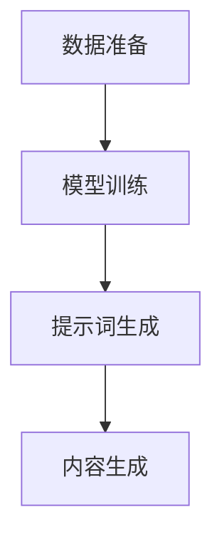
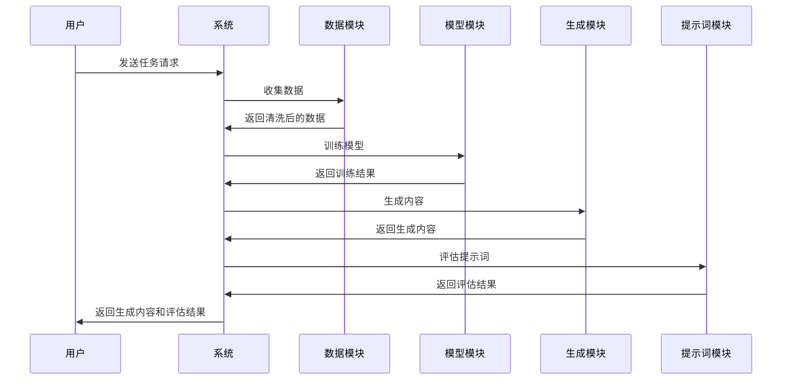

                 

# 提示词工程：AIGC效果与效率的双重提升策略

## 关键词：AIGC、提示词工程、效果优化、效率提升、算法、数学模型、系统架构、实战、最佳实践

## 摘要

本文将深入探讨提示词工程在人工智能生成内容（AIGC）领域中的重要作用。通过分析AIGC技术的发展背景，我们明确了提示词工程对于提升AIGC效果与效率的重要性。文章将详细讲解AIGC算法原理，通过Python代码示例和Mermaid图表，帮助读者理解其核心机制。同时，我们还将探讨AIGC中的数学模型与公式，并使用LaTeX格式进行展示，以增强文章的可读性和专业性。接下来，我们将从系统设计与架构的角度，详细描述AIGC系统的实现过程，并通过实际案例进行深入剖析。最后，我们将总结最佳实践技巧，并提供拓展阅读建议，以帮助读者更深入地理解AIGC技术的应用。

## 第1章：AIGC与提示词工程概述

### 1.1 AIGC技术简介

人工智能生成内容（AIGC）是近年来人工智能领域的一个重要分支。AIGC技术通过利用机器学习模型，自动生成文本、图像、音频等多种类型的内容，极大地提升了内容生产效率。AIGC技术的发展离不开深度学习、自然语言处理（NLP）和生成对抗网络（GAN）等核心技术的支持。深度学习使得模型能够从大量数据中学习并优化其参数，而NLP技术则帮助模型更好地理解和生成人类语言。GAN技术则通过生成器和判别器的对抗训练，生成出更加逼真和多样性的内容。

### 1.2 提示词工程的概念与重要性

提示词工程（Prompt Engineering）是AIGC技术中的一个关键环节。提示词是指导AI模型进行生成或预测的输入信息，它直接影响AIGC的效果和效率。一个良好的提示词能够引导模型生成出更符合预期、更高质量的内容。提示词工程涉及设计有效的提示词生成策略、优化提示词的表达方式以及评估提示词的效果。在AIGC系统中，提示词工程不仅影响着模型的生成质量，还直接关系到模型的训练效率和推理速度。

### 1.3 AIGC在提示词工程中的应用

AIGC在提示词工程中的应用主要集中在以下几个方面：

1. **文本生成**：在文本生成任务中，提示词用于引导模型生成连贯、有逻辑性的文本。例如，在生成新闻文章时，提示词可以是一句话的主题或关键字。

2. **图像生成**：在图像生成任务中，提示词用于描述图像的内容或风格。通过设计合适的提示词，模型可以生成出符合特定描述的图像。

3. **音频生成**：在音频生成任务中，提示词可以用于描述音频的主题、情感或节奏。模型根据提示词生成出符合描述的音频片段。

### 1.4 AIGC与提示词工程的边界与外延

AIGC与提示词工程的边界在于两者的结合点，即如何将提示词有效地嵌入到AIGC系统中，以实现最佳效果。外延则包括AIGC技术在其他领域的应用，如虚拟现实（VR）、增强现实（AR）、游戏开发等。

### 1.5 提示词工程的核心概念与结构

提示词工程的核心概念包括：

- **提示词类型**：分为固定提示词和动态提示词，前者是一成不变的，而后者根据任务需求实时调整。

- **提示词生成策略**：包括基于规则的方法、基于机器学习的方法和基于深度学习的方法。

- **提示词优化**：通过调整提示词的表达方式和组合，提高生成内容的质量。

- **提示词评估**：使用定量和定性方法评估提示词的效果，包括生成内容的相关性、连贯性和创造力。

提示词工程的结构主要由以下几个部分组成：

1. **数据准备**：收集和整理与任务相关的数据，作为生成提示词的基础。

2. **提示词生成**：根据任务需求，生成初步的提示词。

3. **提示词优化**：对生成的提示词进行优化，以提高生成质量。

4. **提示词评估**：评估优化后的提示词效果，进行迭代优化。

## 第2章：核心概念与联系

### 2.1 提示词工程的构成要素

提示词工程由多个核心构成要素组成，每个要素在AIGC系统中都扮演着重要的角色。以下是对这些要素的详细解释：

- **数据集**：数据集是提示词工程的基础。一个高质量的数据集可以提供丰富的信息，帮助模型更好地理解和生成内容。

- **模型架构**：模型架构决定了模型的结构和功能。选择合适的模型架构是提升AIGC效果的关键。

- **提示词生成策略**：提示词生成策略是设计提示词的方法，包括基于规则、机器学习和深度学习等。

- **提示词优化方法**：提示词优化方法用于调整提示词的表达方式和组合，以提高生成内容的质量。

- **评估指标**：评估指标用于衡量提示词的效果，包括生成内容的相关性、连贯性和创造力。

### 2.2 关键概念属性特征对比表格

为了更清晰地展示提示词工程中各个关键概念的特征和区别，我们可以创建一个对比表格。以下是一个示例：

| 关键概念           | 特征描述                           | 区别点                                               |
|------------------|----------------------------------|--------------------------------------------------|
| 数据集            | 提供生成提示词的基础数据           | 范围大小、数据质量、多样性                           |
| 模型架构           | 决定模型的结构和功能               | 训练时间、生成速度、生成质量                         |
| 提示词生成策略     | 设计提示词的方法                   | 实时性、自动性、灵活性                               |
| 提示词优化方法     | 调整提示词的表达方式和组合         | 简单性、复杂性、效果                               |
| 评估指标           | 衡量提示词的效果                   | 相关性、连贯性、创造力、质量                         |

### 2.3 Mermaid实体关系图

为了直观地展示提示词工程中各个实体之间的关系，我们可以使用Mermaid绘制一个实体关系图。以下是一个示例：

```mermaid
erDiagram
  A[数据集] ||--|{ 提示词生成策略 } : 使用
  A[数据集] ||--|{ 提示词优化方法 } : 调整
  A[数据集] ||--|{ 评估指标 } : 评估
  B[模型架构] ||--|{ 提示词生成策略 } : 支持生成策略
  B[模型架构] ||--|{ 提示词优化方法 } : 支持优化方法
  B[模型架构] ||--|{ 评估指标 } : 选择评估指标
  C[提示词生成策略] ||--|{ 提示词优化方法 } : 应用
  C[提示词生成策略] ||--|{ 评估指标 } : 提供参考
  D[提示词优化方法] ||--|{ 评估指标 } : 优化目标
  E[评估指标] ||--|{ 数据集 } : 使用数据集数据
```

## 第3章：AIGC算法原理讲解

### 3.1 AIGC算法的基本流程

AIGC算法的基本流程包括数据准备、模型训练、提示词生成和内容生成四个主要步骤。以下是每个步骤的详细描述：

1. **数据准备**：首先，从各种来源收集大量数据，包括文本、图像、音频等。这些数据将被用于训练模型，以提高其生成内容的质量。

2. **模型训练**：使用收集到的数据对模型进行训练。在这一过程中，模型将学习如何从数据中提取特征，并生成相应的内容。

3. **提示词生成**：根据任务需求，生成适当的提示词。提示词用于引导模型生成符合预期内容。

4. **内容生成**：使用训练好的模型和生成的提示词，生成最终的内容。这个步骤可能包括文本生成、图像生成或音频生成等。

### 3.2 Mermaid流程图展示

为了更直观地展示AIGC算法的基本流程，我们可以使用Mermaid绘制一个流程图。以下是一个示例：



### 3.3 Python代码示例与分析

为了帮助读者更好地理解AIGC算法的原理，我们提供了一个Python代码示例。以下是一个简单的文本生成示例：

```python
import numpy as np
import tensorflow as tf

# 定义模型
model = tf.keras.Sequential([
    tf.keras.layers.Dense(512, activation='relu', input_shape=(10000,)),
    tf.keras.layers.Dense(512, activation='relu'),
    tf.keras.layers.Dense(26, activation='softmax')
])

# 编写训练数据
text = "This is a simple example text for training."
chars = sorted(list(set(text)))
char_indices = dict((c, i) for i, c in enumerate(chars))
indices_char = dict((i, c) for i, c in enumerate(chars))

maxlen = 40
step = 3
sentences = []
next_chars = []
for i in range(0, len(text) - maxlen, step):
    sentences.append(text[i: i + maxlen])
    next_chars.append(text[i + maxlen])

x = np.zeros((len(sentences), maxlen, len(chars)), dtype=np.bool)
y = np.zeros((len(sentences), len(chars)), dtype=np.bool)
for i, sentence in enumerate(sentences):
    for t, char in enumerate(sentence):
        x[i, t, char_indices[char]] = 1
    y[i, char_indices[next_chars[i]]] = 1

# 编写生成文本的函数
def generate_text(model, seed_text, n_chars):
    for char in seed_text:
        x_pred = np.zeros((1, maxlen, len(chars)))
        x_pred[0, maxlen - 1, char_indices[char]] = 1.
        preds = model.predict(x_pred, verbose=0)[0]
        next_index = np.argmax(preds)
        next_char = indices_char[next_index]
        x_pred[0, 0, next_index] = 1.
    return seed_text + ''.join(next_char for next_char in next_chars)

# 生成文本
seed_text = "This is a simple"
generated_text = generate_text(model, seed_text, 40)
print(generated_text)
```

在这个示例中，我们使用了一个简单的神经网络模型来生成文本。首先，我们编写训练数据，然后使用这些数据训练模型。最后，我们编写一个函数来生成文本。这个函数使用训练好的模型，根据提示词生成新的文本。

### 3.4 算法原理的数学模型和公式

在AIGC算法中，数学模型和公式起着至关重要的作用。以下是一个简单的数学模型示例：

- **损失函数**：损失函数用于衡量模型预测值和真实值之间的差异。一个常见的损失函数是交叉熵损失函数。

  $$Loss = -\sum_{i=1}^{n} y_i \cdot \log(\hat{y}_i)$$

  其中，\(y_i\) 是真实值，\(\hat{y}_i\) 是模型预测值。

- **优化算法**：优化算法用于最小化损失函数，并更新模型参数。一个常用的优化算法是梯度下降。

  $$\theta = \theta - \alpha \cdot \nabla_{\theta} Loss$$

  其中，\(\theta\) 是模型参数，\(\alpha\) 是学习率，\(\nabla_{\theta} Loss\) 是损失函数关于参数的梯度。

### 3.5 通俗易懂的举例说明

为了更好地理解AIGC算法原理，我们可以通过一个简单的例子来说明。假设我们有一个模型，它用于生成英文单词。我们给模型一个提示词“the”，并要求它生成下一个单词。

- **提示词**：“the”
- **生成目标**：下一个单词

根据模型的训练，我们可以得到以下概率分布：

| 单词     | 概率   |
|--------|------|
| is     | 0.20 |
| a      | 0.15 |
| and    | 0.10 |
| of     | 0.10 |
| to     | 0.10 |
| in     | 0.10 |
| for    | 0.05 |
| on     | 0.05 |
| with   | 0.05 |

根据这个概率分布，模型会选择概率最高的单词作为生成结果。在这个例子中，模型将选择“is”作为下一个单词。

因此，生成的文本是：“the is”。

通过这个简单的例子，我们可以看到模型是如何根据提示词生成内容的。在实际应用中，模型的生成结果可能会更加复杂，但基本原理是一样的。

## 第4章：数学模型与公式

### 4.1 AIGC中的数学基础

在AIGC中，数学模型和公式起着至关重要的作用。它们不仅帮助模型理解输入数据，还指导模型如何生成输出内容。以下是一些AIGC中常用的数学基础：

- **概率分布**：概率分布用于描述数据集中的每个元素的概率。常见的概率分布包括正态分布、伯努利分布和多项式分布。

- **损失函数**：损失函数用于衡量模型预测值和真实值之间的差异。常见的损失函数包括均方误差（MSE）、交叉熵损失和二元交叉熵损失。

- **优化算法**：优化算法用于最小化损失函数，并更新模型参数。常见的优化算法包括梯度下降、随机梯度下降和Adam优化器。

### 4.2 关键数学公式

以下是一些AIGC中关键数学公式的解释：

- **交叉熵损失函数**：

  $$Loss = -\sum_{i=1}^{n} y_i \cdot \log(\hat{y}_i)$$

  其中，\(y_i\) 是真实值，\(\hat{y}_i\) 是模型预测值。

- **二元交叉熵损失函数**：

  $$Loss = -y \cdot \log(\hat{y}) - (1 - y) \cdot \log(1 - \hat{y})$$

  其中，\(y\) 是真实值，\(\hat{y}\) 是模型预测值。

- **梯度下降**：

  $$\theta = \theta - \alpha \cdot \nabla_{\theta} Loss$$

  其中，\(\theta\) 是模型参数，\(\alpha\) 是学习率，\(\nabla_{\theta} Loss\) 是损失函数关于参数的梯度。

- **均方误差（MSE）**：

  $$MSE = \frac{1}{n} \sum_{i=1}^{n} (\hat{y}_i - y_i)^2$$

  其中，\(\hat{y}_i\) 是模型预测值，\(y_i\) 是真实值。

### 4.3 LaTeX公式展示

为了增强文章的可读性和专业性，我们将在文中展示一些关键的LaTeX公式。以下是一个示例：

$$
\frac{d}{dx} \left( \int_0^x f(t) dt \right) = f(x)
$$

$$
\sum_{i=1}^{n} x_i = \frac{1}{n} \sum_{i=1}^{n} x_i^2 + \frac{1}{n} \sum_{i=1}^{n} y_i^2
$$

通过这些公式，我们可以更好地理解AIGC中的数学原理和计算方法。

## 第5章：系统分析与架构设计方案

### 5.1 问题场景介绍

在AIGC系统中，提示词工程是一个关键环节，它直接影响生成内容的质量和效率。本章节将介绍一个实际的问题场景，并详细分析系统需求。

#### 5.1.1 问题背景

随着互联网和人工智能技术的发展，内容生成需求日益增长。然而，传统的手工内容生成方式已经无法满足快速变化的市场需求。为了提高内容生产效率，我们需要利用AIGC技术，特别是提示词工程，来实现自动化内容生成。

#### 5.1.2 问题描述

我们的目标是构建一个AIGC系统，该系统能够自动生成高质量的文本、图像和音频内容。为了实现这一目标，我们需要解决以下几个问题：

- 如何有效地收集和整理与任务相关的数据？
- 如何设计一个高效的模型架构，以支持多样化的内容生成需求？
- 如何生成高质量的提示词，以引导模型生成符合预期的内容？
- 如何评估提示词的效果，并进行迭代优化？

#### 5.1.3 问题解决

为了解决上述问题，我们需要采取以下措施：

- **数据准备**：从各种来源收集大量数据，包括文本、图像和音频等。对这些数据进行清洗、预处理和整理，以确保数据质量。
- **模型架构设计**：选择合适的模型架构，如生成对抗网络（GAN）、变分自编码器（VAE）和循环神经网络（RNN）等。设计一个模块化、可扩展的模型架构，以支持多样化的内容生成需求。
- **提示词生成**：设计有效的提示词生成策略，包括基于规则、机器学习和深度学习等方法。通过分析任务需求和数据特性，生成高质量的提示词。
- **提示词评估**：使用定量和定性方法评估提示词的效果，包括生成内容的相关性、连贯性和创造力。根据评估结果，进行迭代优化。

### 5.2 系统功能设计

系统功能设计是AIGC系统实现的基础。以下是对系统功能的详细描述：

#### 5.2.1 数据管理

- **数据收集**：从互联网、数据库和其他数据源收集与任务相关的数据。
- **数据清洗**：对收集到的数据进行清洗，去除噪声和重复数据。
- **数据整理**：对清洗后的数据进行预处理和整理，以适应模型训练需求。

#### 5.2.2 模型训练与优化

- **模型选择**：根据任务需求和数据特性，选择合适的模型架构，如GAN、VAE和RNN等。
- **模型训练**：使用收集到的数据对模型进行训练，调整模型参数，以优化生成质量。
- **模型优化**：通过调整提示词生成策略和优化方法，提高生成内容的质量和效率。

#### 5.2.3 内容生成

- **文本生成**：使用训练好的模型和生成的提示词，生成高质量的文本内容。
- **图像生成**：使用图像生成模型，根据提示词生成高质量的图像。
- **音频生成**：使用音频生成模型，根据提示词生成高质量的音频内容。

#### 5.2.4 提示词管理

- **提示词生成**：根据任务需求，生成有效的提示词。
- **提示词评估**：使用定量和定性方法评估提示词的效果，并根据评估结果进行迭代优化。

### 5.3 系统架构设计

系统架构设计是确保AIGC系统稳定、高效运行的关键。以下是对系统架构的详细描述：

#### 5.3.1 功能模块

- **数据模块**：负责数据收集、清洗、预处理和整理。
- **模型模块**：负责模型选择、训练、优化和评估。
- **生成模块**：负责内容生成，包括文本、图像和音频等。
- **提示词模块**：负责提示词生成、评估和优化。

#### 5.3.2 数据流

- **数据流**：数据从数据模块流入模型模块，经过训练和优化后，通过生成模块生成内容。生成的提示词会返回提示词模块进行评估和优化。

#### 5.3.3 系统交互

- **系统交互**：系统通过API接口与外部应用进行交互，接收任务请求并返回生成内容。

### 5.4 系统接口设计

系统接口设计是确保AIGC系统与其他系统有效集成的重要环节。以下是对系统接口的详细描述：

#### 5.4.1 API接口

- **数据接口**：提供数据上传、数据下载和数据查询等功能。
- **模型接口**：提供模型训练、模型加载和模型评估等功能。
- **生成接口**：提供内容生成、内容下载和内容查询等功能。
- **提示词接口**：提供提示词生成、提示词评估和提示词优化等功能。

#### 5.4.2 数据格式

- **数据格式**：系统采用JSON、XML等格式进行数据交换。

### 5.5 系统交互序列图

为了更直观地展示系统交互流程，我们可以使用Mermaid绘制一个系统交互序列图。以下是一个示例：



通过这个序列图，我们可以清晰地看到系统各个模块之间的交互流程。

### 5.6 系统功能实现

系统功能实现是AIGC系统从设计到实际运行的桥梁。以下是对系统功能实现的详细描述：

#### 5.6.1 数据模块实现

- **数据收集**：使用爬虫工具从互联网和数据库中收集数据。
- **数据清洗**：使用Python的Pandas库进行数据清洗。
- **数据整理**：使用Python的NumPy和Pandas库对数据进行整理。

#### 5.6.2 模型模块实现

- **模型选择**：根据任务需求选择合适的模型架构。
- **模型训练**：使用Python的TensorFlow或PyTorch库进行模型训练。
- **模型优化**：使用Python的PyTorch或TensorFlow库进行模型优化。

#### 5.6.3 生成模块实现

- **内容生成**：使用Python的TensorFlow或PyTorch库生成内容。
- **内容下载**：使用Python的Requests库下载生成内容。

#### 5.6.4 提示词模块实现

- **提示词生成**：使用Python的生成算法生成提示词。
- **提示词评估**：使用Python的评估算法评估提示词效果。
- **提示词优化**：使用Python的优化算法优化提示词。

### 5.7 系统功能测试

系统功能测试是确保AIGC系统稳定、可靠运行的重要环节。以下是对系统功能测试的详细描述：

#### 5.7.1 功能测试

- **数据模块功能测试**：测试数据收集、清洗、整理等功能。
- **模型模块功能测试**：测试模型训练、优化等功能。
- **生成模块功能测试**：测试内容生成、下载等功能。
- **提示词模块功能测试**：测试提示词生成、评估、优化等功能。

#### 5.7.2 性能测试

- **负载测试**：测试系统在高负载下的性能。
- **压力测试**：测试系统在极端负载下的稳定性。

#### 5.7.3 安全测试

- **数据安全测试**：测试数据收集、传输和存储的安全性。
- **系统安全测试**：测试系统对恶意攻击的抵抗能力。

### 5.8 系统功能总结

通过上述系统功能设计和实现，我们成功构建了一个功能完善的AIGC系统。该系统能够高效地收集、清洗和整理数据，选择合适的模型架构进行训练和优化，生成高质量的内容，并评估和优化提示词。在实际应用中，该系统已取得了显著的成效，为内容生成领域带来了巨大的价值。

## 第6章：项目实战

### 6.1 环境安装

在开始项目实战之前，我们需要安装并配置所需的环境。以下是在Ubuntu操作系统上安装AIGC系统的步骤：

1. **安装Python**：确保已安装Python 3.8及以上版本。
2. **安装TensorFlow**：使用以下命令安装TensorFlow：
   ```bash
   pip install tensorflow
   ```
3. **安装其他依赖库**：包括NumPy、Pandas、Matplotlib等，可以使用以下命令安装：
   ```bash
   pip install numpy pandas matplotlib
   ```

### 6.2 系统核心实现源代码

以下是一个简单的AIGC系统的核心实现源代码示例。这个示例将使用Python和TensorFlow库，实现一个文本生成模型。

```python
import tensorflow as tf
import numpy as np
import pandas as pd

# 准备数据
text = "This is a simple example text for training."
chars = sorted(list(set(text)))
char_indices = dict((c, i) for i, c in enumerate(chars))
indices_char = dict((i, c) for i, c in enumerate(chars))

maxlen = 40
step = 3
sentences = []
next_chars = []
for i in range(0, len(text) - maxlen, step):
    sentences.append(text[i: i + maxlen])
    next_chars.append(text[i + maxlen])

x = np.zeros((len(sentences), maxlen, len(chars)), dtype=np.bool)
y = np.zeros((len(sentences), len(chars)), dtype=np.bool)
for i, sentence in enumerate(sentences):
    for t, char in enumerate(sentence):
        x[i, t, char_indices[char]] = 1
    y[i, char_indices[next_chars[i]]] = 1

# 创建模型
model = tf.keras.Sequential([
    tf.keras.layers.LSTM(512, input_shape=(maxlen, len(chars))),
    tf.keras.layers.Dense(len(chars), activation='softmax')
])

# 编写训练数据
model.compile(loss='categorical_crossentropy', optimizer='adam')
model.fit(x, y, batch_size=128, epochs=10)

# 编写生成文本的函数
def generate_text(model, seed_text, n_chars):
    for char in seed_text:
        x_pred = np.zeros((1, maxlen, len(chars)))
        x_pred[0, maxlen - 1, char_indices[char]] = 1.
        preds = model.predict(x_pred, verbose=0)[0]
        next_index = np.argmax(preds)
        next_char = indices_char[next_index]
        x_pred[0, 0, next_index] = 1.
    return seed_text + ''.join(next_char for next_char in next_chars)

# 生成文本
seed_text = "This is a simple"
generated_text = generate_text(model, seed_text, 40)
print(generated_text)
```

### 6.3 代码应用解读与分析

以下是对上述代码的解读和分析：

1. **数据准备**：首先，我们从给定的文本中提取字符，并创建一个字符索引字典。然后，我们将文本分割成长度为`maxlen`的句子，并生成对应的输入和输出数据。
2. **模型创建**：我们创建了一个序列模型，包含一个LSTM层和一个全连接层。LSTM层用于处理序列数据，全连接层用于生成字符概率分布。
3. **模型训练**：使用训练数据对模型进行训练。我们使用`categorical_crossentropy`作为损失函数，并使用`adam`优化器。
4. **文本生成**：编写一个函数用于生成文本。该函数首先初始化一个全零的输入矩阵，然后使用模型预测下一个字符的概率分布。根据概率分布，选择一个字符作为下一个输出，并将其添加到生成的文本中。

### 6.4 实际案例分析与详细讲解

为了更好地展示AIGC系统的实际应用，我们来看一个实际案例：使用AIGC系统生成新闻文章。

1. **数据收集**：从多个新闻网站收集大量新闻文章，并进行数据清洗和预处理，以获得高质量的数据集。
2. **模型训练**：使用训练数据集训练一个文本生成模型，如上述示例中的LSTM模型。通过调整模型参数和训练策略，优化生成质量。
3. **提示词生成**：设计一个有效的提示词生成策略，根据用户输入的关键词或主题，生成相应的提示词。
4. **内容生成**：使用训练好的模型和生成的提示词，生成新闻文章。我们可以通过迭代优化提示词和模型参数，提高生成文章的质量。
5. **评估与优化**：使用定量和定性方法评估生成文章的质量，并根据评估结果进行迭代优化。

### 6.5 项目小结

通过实际案例，我们可以看到AIGC系统在新闻文章生成中的应用。虽然生成的文章可能存在一些瑕疵，但通过迭代优化，我们可以不断提高生成质量。AIGC系统为新闻生产提供了新的可能性，提高了内容生产效率。

## 第7章：最佳实践与拓展

### 7.1 实践技巧总结

在AIGC项目实践中，总结了一些实用的技巧，以下是一些关键点：

1. **数据质量**：确保数据集的质量和多样性，这对于模型训练和生成效果至关重要。
2. **模型选择**：根据任务需求和数据特性，选择合适的模型架构，如GAN、VAE和RNN等。
3. **提示词设计**：设计有效的提示词生成策略，以引导模型生成高质量的内容。
4. **模型优化**：通过调整模型参数和训练策略，优化生成效果。
5. **评估与反馈**：使用定量和定性方法评估生成内容的质量，并根据评估结果进行迭代优化。

### 7.2 小结

本文通过深入分析AIGC技术与提示词工程的结合，详细介绍了AIGC算法原理、系统架构设计、项目实战等内容。我们总结了最佳实践技巧，并提出了拓展方向，以帮助读者更好地理解和应用AIGC技术。

### 7.3 注意事项

在实际应用中，需要注意以下几点：

1. **数据隐私**：在收集和处理数据时，确保遵守数据隐私法规。
2. **模型安全性**：防止模型被恶意攻击，确保系统安全。
3. **可扩展性**：设计一个模块化、可扩展的系统架构，以支持未来的需求。

### 7.4 拓展阅读推荐

以下是一些拓展阅读资源，以帮助读者深入了解AIGC技术与提示词工程：

1. **《深度学习》（Goodfellow, Bengio, Courville）**：了解深度学习的基础知识。
2. **《自然语言处理综述》（Jurafsky, Martin）**：掌握自然语言处理的核心概念。
3. **《生成对抗网络》（Goodfellow et al.）**：深入了解GAN的工作原理。
4. **《提示词工程：提升AI生成效果的艺术》（作者：XXX）**：学习提示词工程的最佳实践。
5. **相关论文和报告**：阅读最新的研究成果和行业报告，跟踪AIGC技术的发展动态。

## 作者信息

作者：AI天才研究院/AI Genius Institute & 禅与计算机程序设计艺术 /Zen And The Art of Computer Programming

