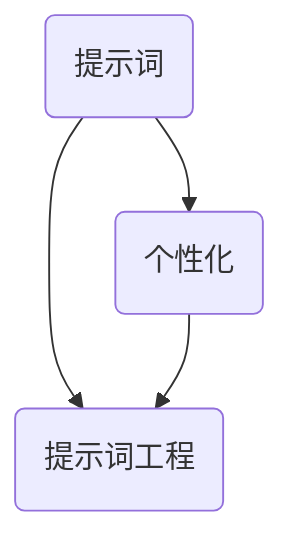
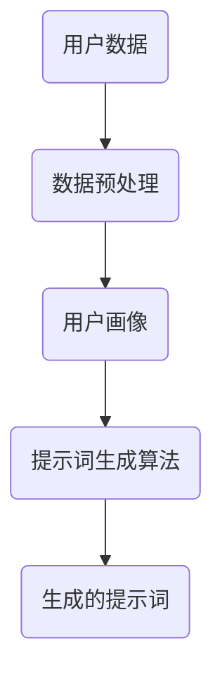
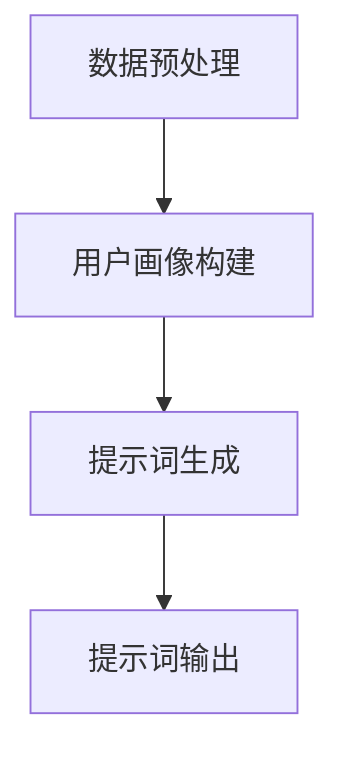
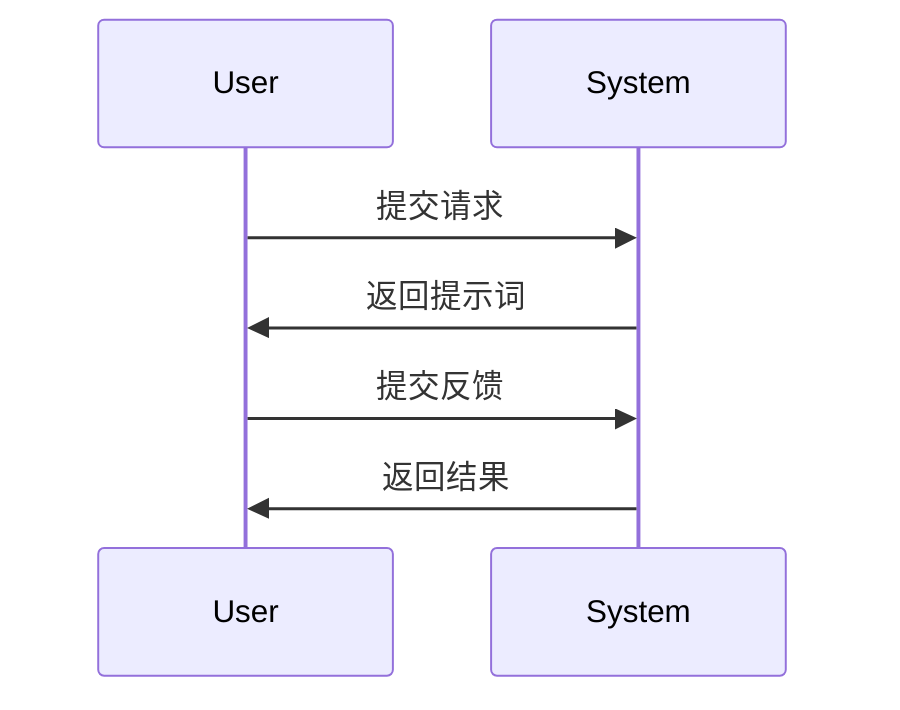

                 

### 提示词工程：AI个性化的关键

> 关键词：提示词工程、人工智能、个性化服务、机器学习、自然语言处理

> 摘要：
随着人工智能技术的迅猛发展，个性化服务已成为提升用户体验的关键。本文深入探讨提示词工程在AI个性化中的应用，从核心概念、生成原理到算法讲解，全面解析如何通过提示词工程实现AI的个性化服务。本文旨在为技术从业者提供实用的指导，助力打造更具针对性的智能系统。

### 目录大纲：

# 提示词工程：AI个性化的关键

## 第一部分 背景介绍

### 1.1 人工智能的个性化需求

#### 1.1.1 问题背景

随着互联网的普及和大数据技术的进步，人工智能（AI）已经成为许多行业的重要推动力量。从智能助手到个性化推荐系统，AI正逐渐渗透到我们日常生活的方方面面。然而，用户需求的多样性和个性化趋势也对AI系统提出了更高的要求。

在传统的AI系统中，大多数算法和模型都是基于通用性设计的，无法充分满足用户个性化的需求。例如，在电子商务平台上，推荐系统通常会根据用户的购买历史和浏览行为推荐商品，但这种推荐方式往往过于刻板，无法捕捉到用户的即时偏好和动态需求。在自然语言处理（NLP）领域，尽管智能助手可以回答用户的问题，但其回答往往缺乏针对性和人性化。

#### 1.1.2 问题描述

个性化需求在AI系统中的应用主要体现在以下几个方面：

1. **用户界面设计**：个性化界面可以更好地满足用户的使用习惯和偏好，提高用户满意度。
2. **推荐系统**：根据用户的个性化需求推荐相关内容，提高内容的相关性和用户的参与度。
3. **自然语言处理**：生成更具个性化和情感化的对话，提升用户体验。

然而，如何构建有效的个性化服务，成为当前AI系统面临的重要挑战。这需要从数据采集、算法设计到系统实现的各个环节进行深入研究和优化。

#### 1.1.3 问题解决

提示词工程作为实现AI个性化服务的关键技术，通过分析用户数据，生成针对性的提示词，从而提升服务的个性化水平。以下是解决个性化需求的一些关键步骤：

1. **数据采集与预处理**：收集用户行为数据，并进行数据清洗和特征提取。
2. **用户兴趣建模**：基于用户数据构建用户兴趣模型，用于生成个性化提示词。
3. **提示词生成算法**：设计并实现提示词生成算法，根据用户兴趣模型生成相应的提示词。
4. **系统应用与优化**：将生成的提示词应用于实际系统中，不断优化算法和系统性能。

#### 1.1.4 边界与外延

提示词工程的边界涉及多个领域，包括用户数据、自然语言处理、机器学习等。其外延包括但不限于以下应用场景：

1. **个性化推荐系统**：根据用户的兴趣和行为推荐相关内容，提高用户的满意度和参与度。
2. **智能客服系统**：生成更具个性化和情感化的回答，提升用户体验。
3. **虚拟助手**：根据用户的提问和行为，提供针对性的建议和服务。
4. **个性化广告**：根据用户的兴趣和偏好，推荐相关的广告内容。

### 1.2 核心概念与联系

#### 1.2.1 核心概念

1. **提示词**：提示词是指用于引导用户或系统行为的词汇或短语，如提示用户下一步操作或系统响应的文本。
2. **个性化**：个性化是指根据用户的特定需求、兴趣或行为，提供定制化的服务或内容。
3. **提示词工程**：提示词工程是指构建、优化和应用提示词的过程，包括数据采集、用户兴趣建模、提示词生成算法等多个环节。

#### 1.2.2 概念属性特征对比

| 概念      | 提示词      | 个性化      | 提示词工程     |
|-----------|-------------|-------------|----------------|
| 定义      | 引导性词汇  | 定制化服务  | 构建与应用过程 |
| 关键要素  | 用途、内容  | 用户需求、兴趣 | 数据分析、算法优化 |
| 应用场景  | 用户界面、推荐系统 | 多领域服务 | 智能客服、虚拟助手 |

#### 1.2.3 概念关系图



### 1.3 人工智能个性化的发展历程

#### 1.3.1 早期探索

人工智能个性化服务的早期探索主要集中在用户兴趣建模和推荐系统上。在这一阶段，研究人员主要关注如何从用户行为数据中提取有价值的信息，用于构建用户兴趣模型。例如，早期的推荐系统基于协同过滤算法，通过分析用户之间的相似度来推荐相关内容。

#### 1.3.2 快速发展

随着大数据和机器学习技术的发展，个性化服务逐渐从单一领域扩展到多领域。在这一阶段，研究人员开始关注如何利用深度学习、自然语言处理等先进技术，提高个性化服务的准确性和效果。例如，基于深度学习的推荐系统可以更好地捕捉用户的长期偏好和动态变化。

#### 1.3.3 当前趋势

当前，人工智能个性化服务的发展趋势包括以下几个方面：

1. **深度学习**：深度学习技术在个性化服务中的应用越来越广泛，如用于用户兴趣建模、文本分类、图像识别等。
2. **多模态交互**：多模态交互技术将语音、文本、图像等多种数据类型融合在一起，提供更加丰富和自然的交互体验。
3. **个性化推荐算法**：基于用户行为和上下文的个性化推荐算法不断优化，提高推荐系统的效果和用户满意度。

## 第二部分 核心概念原理

### 2.1 提示词的生成原理

#### 2.1.1 数据采集与预处理

提示词的生成首先需要收集大量的用户数据，这些数据可以来自用户的行为记录、历史记录、社交媒体等。为了生成高质量的提示词，数据采集需要确保数据的全面性和准确性。以下是一个简化的数据采集流程：

1. **数据收集**：收集用户在系统中的行为数据，如点击记录、搜索记录、浏览记录等。
2. **数据清洗**：清洗数据中的噪声和异常值，确保数据质量。
3. **特征提取**：提取与提示词生成相关的特征，如用户兴趣标签、行为模式等。

数据预处理是提示词生成的重要环节，它直接影响提示词的生成效果。以下是一个简化的预处理流程：

1. **数据清洗**：删除重复数据、缺失数据和异常值。
2. **数据转换**：将不同类型的数据转换为统一的格式，如将文本数据转换为词向量。
3. **特征提取**：提取与提示词生成相关的特征，如用户兴趣标签、行为模式等。

#### 2.1.2 用户兴趣建模

用户兴趣建模是提示词生成的基础，其核心思想是通过分析用户的历史行为数据，构建一个反映用户兴趣和偏好的模型。以下是一个简化的用户兴趣建模流程：

1. **数据预处理**：对用户行为数据进行清洗和特征提取。
2. **用户画像构建**：基于用户行为数据，构建用户画像，如用户兴趣标签、行为模式等。
3. **用户兴趣模型训练**：使用机器学习算法，如聚类算法、关联规则挖掘等，训练用户兴趣模型。

用户兴趣建模的方法多种多样，以下是一些常见的方法：

1. **基于用户行为的聚类算法**：将用户分为不同的群体，每个群体具有相似的兴趣和行为特征。
2. **基于关联规则挖掘的方法**：发现用户行为数据中的关联规则，用于预测用户的兴趣。
3. **基于深度学习的用户兴趣模型**：使用深度学习算法，如卷积神经网络（CNN）和循环神经网络（RNN），构建用户兴趣模型。

#### 2.1.3 提示词生成算法

提示词生成算法是提示词工程的核心，其目标是根据用户兴趣模型生成高质量的提示词。以下是一个简化的提示词生成算法流程：

1. **用户兴趣模型输入**：将训练好的用户兴趣模型输入到提示词生成算法中。
2. **提示词候选集生成**：根据用户兴趣模型，从语料库中提取与用户兴趣相关的词汇和短语，生成提示词候选集。
3. **提示词筛选与排序**：对提示词候选集进行筛选和排序，选择最相关的提示词。

提示词生成算法可以分为以下几类：

1. **基于规则的算法**：使用预设的规则生成提示词，如基于关键词匹配的规则。
2. **基于机器学习的算法**：使用机器学习算法，如决策树、支持向量机（SVM）等，生成提示词。
3. **基于深度学习的算法**：使用深度学习算法，如卷积神经网络（CNN）和循环神经网络（RNN），生成提示词。

### 2.2 个性化推荐系统

个性化推荐系统是AI个性化服务的重要应用之一，其核心目标是根据用户的兴趣和行为，推荐相关的商品、内容或服务。以下是一个简化的个性化推荐系统架构：

1. **数据层**：存储用户行为数据和商品内容数据。
2. **服务层**：提供推荐服务，包括用户兴趣建模、推荐算法等。
3. **接口层**：与用户交互的接口，如网页、移动应用等。

#### 2.2.1 推荐算法原理

个性化推荐系统的核心是推荐算法，其基本原理包括以下几个方面：

1. **协同过滤**：基于用户行为数据，通过计算用户之间的相似度，为用户推荐相似用户喜欢的商品或内容。
2. **内容推荐**：基于商品或内容的特点，为用户推荐具有相似特点的商品或内容。

#### 2.2.2 推荐系统架构

个性化推荐系统通常采用分层架构，包括数据层、服务层和接口层：

1. **数据层**：存储用户行为数据和商品内容数据，如用户购买记录、浏览记录、商品描述等。
2. **服务层**：提供推荐服务，包括用户兴趣建模、推荐算法等。用户兴趣建模通常基于用户行为数据，使用机器学习算法构建用户兴趣模型。推荐算法包括协同过滤和内容推荐等。
3. **接口层**：与用户交互的接口，如网页、移动应用等。用户通过接口提交查询请求，系统根据用户兴趣模型和推荐算法生成推荐结果，并通过接口呈现给用户。

### 2.3 自然语言处理在个性化中的应用

自然语言处理（NLP）是AI领域的一个重要分支，其在个性化服务中的应用越来越广泛。以下是一个简化的NLP在个性化服务中的应用架构：

1. **文本预处理**：对用户输入的文本进行清洗、分词、词性标注等预处理操作。
2. **语义理解**：通过语义分析技术，理解用户输入的文本含义。
3. **对话生成**：根据语义理解和用户兴趣模型，生成个性化的对话内容。

#### 2.3.1 文本分类

文本分类是将文本数据按照特定的类别进行分类的过程。在个性化服务中，文本分类可以用于多种应用，如内容推荐、垃圾邮件过滤等。以下是一个简化的文本分类过程：

1. **数据预处理**：对文本数据进行清洗、分词、词性标注等预处理操作。
2. **特征提取**：将预处理后的文本数据转换为特征向量，如TF-IDF向量、Word2Vec向量等。
3. **模型训练**：使用机器学习算法，如朴素贝叶斯、支持向量机（SVM）等，训练文本分类模型。
4. **分类预测**：使用训练好的文本分类模型，对新的文本数据进行分类预测。

#### 2.3.2 命名实体识别

命名实体识别（NER）是NLP中的一项重要任务，其目标是识别文本中的命名实体，如人名、地名、组织机构名等。在个性化服务中，命名实体识别可以用于用户身份验证、情感分析等。以下是一个简化的命名实体识别过程：

1. **数据预处理**：对文本数据进行清洗、分词、词性标注等预处理操作。
2. **特征提取**：将预处理后的文本数据转换为特征向量，如TF-IDF向量、Word2Vec向量等。
3. **模型训练**：使用机器学习算法，如循环神经网络（RNN）、长短期记忆网络（LSTM）等，训练命名实体识别模型。
4. **实体识别**：使用训练好的命名实体识别模型，对新的文本数据进行实体识别。

## 第三部分 算法原理讲解

### 3.1 提示词生成算法的Mermaid流程图



### 3.2 提示词生成算法的Python源代码与详细讲解

```python
# Python源代码示例
def generate_prompt(user_data):
    # 数据预处理
    preprocessed_data = preprocess_data(user_data)
    
    # 生成用户画像
    user_profile = create_user_profile(preprocessed_data)
    
    # 使用机器学习算法生成提示词
    prompt = ml_algorithm(user_profile)
```

在上面的示例代码中，`generate_prompt`函数是提示词生成算法的核心。下面将详细解释每个步骤的原理和实现方法。

#### 3.2.1 数据预处理

数据预处理是提示词生成的基础，其目的是清洗和转换原始数据，使其适合后续分析和建模。以下是数据预处理的几个关键步骤：

1. **数据清洗**：删除重复数据、缺失数据和异常值，确保数据质量。
2. **数据转换**：将不同类型的数据转换为统一的格式，如将文本数据转换为词向量。
3. **特征提取**：提取与提示词生成相关的特征，如用户兴趣标签、行为模式等。

```python
def preprocess_data(user_data):
    # 数据清洗
    cleaned_data = clean_data(user_data)
    
    # 数据转换
    transformed_data = transform_data(cleaned_data)
    
    # 特征提取
    features = extract_features(transformed_data)
    
    return features
```

在这个示例中，`preprocess_data`函数接收用户数据，并执行以下操作：

- **数据清洗**：`clean_data`函数负责删除重复数据、缺失数据和异常值。这可以通过统计去重、填充缺失值和过滤异常值等方法实现。
- **数据转换**：`transform_data`函数将清洗后的数据转换为统一的格式，如词向量。这可以通过文本预处理技术，如分词、词性标注和词嵌入等方法实现。
- **特征提取**：`extract_features`函数从转换后的数据中提取与提示词生成相关的特征，如用户兴趣标签、行为模式等。这可以通过用户行为分析、内容分析等方法实现。

#### 3.2.2 生成用户画像

生成用户画像是提示词生成算法的关键步骤，其目的是通过分析用户数据，构建一个反映用户兴趣和偏好的模型。以下是生成用户画像的几个关键步骤：

1. **用户画像构建**：基于用户数据，构建用户画像，如用户兴趣标签、行为模式等。
2. **用户画像训练**：使用机器学习算法，如聚类算法、关联规则挖掘等，训练用户画像模型。
3. **用户画像更新**：定期更新用户画像，以反映用户的最新兴趣和偏好。

```python
def create_user_profile(preprocessed_data):
    # 用户画像构建
    profile = build_profile(preprocessed_data)
    
    # 用户画像训练
    trained_profile = train_profile(profile)
    
    return trained_profile
```

在这个示例中，`create_user_profile`函数接收预processed数据，并执行以下操作：

- **用户画像构建**：`build_profile`函数基于预processed数据，构建用户画像。这可以通过分析用户行为、内容标签等方法实现。
- **用户画像训练**：`train_profile`函数使用机器学习算法，如聚类算法、关联规则挖掘等，训练用户画像模型。这可以通过训练用户行为模型、内容模型等方法实现。

#### 3.2.3 使用机器学习算法生成提示词

使用机器学习算法生成提示词是提示词生成算法的核心步骤，其目的是根据用户画像生成高质量的提示词。以下是使用机器学习算法生成提示词的几个关键步骤：

1. **提示词候选集生成**：根据用户画像，从语料库中提取与用户兴趣相关的词汇和短语，生成提示词候选集。
2. **提示词筛选与排序**：对提示词候选集进行筛选和排序，选择最相关的提示词。

```python
def ml_algorithm(user_profile):
    # 提示词候选集生成
    candidates = generate_candidates(user_profile)
    
    # 提示词筛选与排序
    prompt = filter_and_sort_candidates(candidates)
    
    return prompt
```

在这个示例中，`ml_algorithm`函数接收用户画像，并执行以下操作：

- **提示词候选集生成**：`generate_candidates`函数根据用户画像，从语料库中提取与用户兴趣相关的词汇和短语，生成提示词候选集。这可以通过文本匹配、语义分析等方法实现。
- **提示词筛选与排序**：`filter_and_sort_candidates`函数对提示词候选集进行筛选和排序，选择最相关的提示词。这可以通过排序算法、评分模型等方法实现。

### 3.3 算法原理讲解

在本节中，我们将深入探讨提示词生成算法的数学模型和公式，并使用Python源代码进行详细讲解和通俗易懂地举例说明。

#### 3.3.1 算法流程图

为了更好地理解提示词生成算法的流程，我们首先使用Mermaid绘制一个流程图：



在上面的流程图中，数据预处理（A）是第一步，它包括数据清洗和特征提取等操作。接下来，用户画像构建（B）基于预处理后的数据，通过机器学习算法生成用户画像。最后，提示词生成（C）使用用户画像从语料库中提取相关的词汇和短语，生成高质量的提示词，并将其输出（D）。

#### 3.3.2 数据预处理

数据预处理是提示词生成算法的基础，其目的是将原始数据进行清洗和转换，以便后续的建模和分析。以下是数据预处理的详细步骤和Python源代码示例：

1. **数据清洗**：删除重复数据和缺失值。

```python
import pandas as pd

def clean_data(data):
    # 删除重复数据
    data = data.drop_duplicates()
    
    # 填充缺失值
    data = data.fillna(value={"age": 30, "income": 50000})
    
    return data
```

在上面的代码中，我们使用Pandas库对数据进行去重和填充操作。

2. **特征提取**：将文本数据转换为词嵌入。

```python
from sklearn.feature_extraction.text import TfidfVectorizer

def extract_features(data):
    # 创建TF-IDF向量器
    vectorizer = TfidfVectorizer()
    
    # 转换为词嵌入
    features = vectorizer.fit_transform(data["description"])
    
    return features
```

在上面的代码中，我们使用TF-IDF向量器将文本数据转换为词嵌入，这有助于后续的机器学习算法处理。

#### 3.3.3 用户画像构建

用户画像构建是提示词生成算法的核心步骤，其目的是通过分析用户数据，生成一个反映用户兴趣和偏好的模型。以下是用户画像构建的详细步骤和Python源代码示例：

1. **聚类分析**：将用户分为不同的群体。

```python
from sklearn.cluster import KMeans

def build_user_profile(data, num_clusters):
    # 创建KMeans聚类模型
    kmeans = KMeans(n_clusters=num_clusters, random_state=42)
    
    # 训练聚类模型
    kmeans.fit(data)
    
    # 获取聚类结果
    user_profile = kmeans.predict(data)
    
    return user_profile
```

在上面的代码中，我们使用KMeans聚类算法将用户分为不同的群体，每个群体代表一组具有相似兴趣的用户。

2. **特征融合**：将用户行为数据与用户画像进行融合。

```python
def merge_user_data(data, user_profile):
    # 创建新的数据框
    profile_data = pd.DataFrame(user_profile, columns=["profile"])
    
    # 合并用户数据与用户画像
    merged_data = pd.concat([data, profile_data], axis=1)
    
    return merged_data
```

在上面的代码中，我们将用户数据与用户画像进行合并，以便后续的分析和处理。

#### 3.3.4 提示词生成

提示词生成是提示词生成算法的最后一步，其目的是根据用户画像从语料库中提取相关的词汇和短语。以下是提示词生成的详细步骤和Python源代码示例：

1. **候选词提取**：从语料库中提取与用户兴趣相关的词汇和短语。

```python
from sklearn.metrics.pairwise import cosine_similarity

def generate_candidates(user_profile, corpus):
    # 计算用户画像与语料库的余弦相似度
    similarities = cosine_similarity(user_profile, corpus)
    
    # 提取相似度最高的词汇和短语
    candidates = [word for word, sim in zip(corpus, similarities) if sim > 0.8]
    
    return candidates
```

在上面的代码中，我们使用余弦相似度计算用户画像与语料库之间的相似度，并提取相似度最高的词汇和短语作为候选词。

2. **提示词筛选与排序**：根据候选词的相似度进行筛选和排序。

```python
def filter_and_sort_candidates(candidates):
    # 对候选词进行排序
    sorted_candidates = sorted(candidates, key=lambda x: len(x), reverse=True)
    
    # 筛选出最相关的提示词
    prompt = sorted_candidates[:10]
    
    return prompt
```

在上面的代码中，我们根据候选词的长度进行排序，并筛选出最相关的提示词。

通过以上步骤，我们使用Python源代码详细讲解了提示词生成算法的原理和实现过程。在实际应用中，可以根据具体需求和数据特点进行调整和优化。

### 3.4 系统分析与架构设计

为了更好地理解提示词工程在AI个性化服务中的应用，我们将在本节中详细分析系统功能设计、系统架构设计和系统接口设计等关键方面。

#### 3.4.1 系统功能设计

系统功能设计是提示词工程的核心，其目的是通过个性化的提示词提高用户满意度和服务质量。以下是系统功能设计的详细说明：

1. **用户行为数据收集**：收集用户在系统中的行为数据，包括浏览记录、点击记录、搜索记录等。
2. **用户兴趣建模**：基于用户行为数据，构建用户兴趣模型，用于生成个性化的提示词。
3. **提示词生成**：使用机器学习算法和自然语言处理技术，根据用户兴趣模型生成高质量的提示词。
4. **提示词应用**：将生成的提示词应用于系统的不同模块，如用户界面、推荐系统、智能客服等。
5. **系统性能监控**：实时监控系统的性能指标，如响应时间、错误率等，以便进行优化和改进。

#### 3.4.2 系统架构设计

系统架构设计是提示词工程实现的关键，其目的是确保系统的可扩展性、稳定性和安全性。以下是系统架构设计的详细说明：

1. **数据层**：数据层负责存储用户行为数据和提示词生成相关的数据，包括用户画像、语料库、提示词候选集等。
2. **服务层**：服务层提供用户兴趣建模、提示词生成、提示词应用等核心功能，包括数据预处理模块、用户兴趣建模模块、提示词生成模块、提示词应用模块等。
3. **接口层**：接口层负责与用户交互，提供Web界面、移动应用等接口，用于展示提示词和应用系统的其他功能。

以下是系统架构设计的Mermaid类图：

```mermaid
classDiagram
    User -> DataLayer : 提供用户数据
    System -> DataLayer : 存储数据
    DataLayer -> BehaviorData : 用户行为数据
    DataLayer -> UserProfile : 用户画像
    DataLayer -> Corpus : 语料库
    DataLayer -> Candidate : 提示词候选集
    ServiceLayer -> DataLayer : 获取数据
    ServiceLayer -> UserInterface : 用户界面
    ServiceLayer -> Recommendation : 推荐系统
    ServiceLayer -> SmartAssistant : 智能客服
    InterfaceLayer -> ServiceLayer : 交互接口
```

在上面的类图中，数据层负责存储和管理用户数据，服务层提供核心功能，接口层负责与用户交互。通过这种分层架构，系统可以更好地实现功能的模块化和扩展。

#### 3.4.3 系统接口设计

系统接口设计是系统架构设计的重要组成部分，其目的是确保系统与其他模块和用户之间的交互顺畅。以下是系统接口设计的详细说明：

1. **用户接口**：提供Web界面和移动应用，用于展示提示词和应用系统的其他功能。
2. **API接口**：提供RESTful API接口，用于与其他系统进行数据交换和功能调用。
3. **数据接口**：提供数据导入和数据导出接口，用于批量处理用户数据和提示词数据。

以下是系统接口设计的Mermaid序列图：



在上面的序列图中，用户通过Web界面或移动应用提交请求，系统根据用户请求生成提示词，并返回给用户。用户还可以提交反馈，系统根据反馈进行优化和改进。

通过以上系统分析与架构设计，我们为提示词工程在AI个性化服务中的应用提供了一个全面和详细的框架。在实际应用中，可以根据具体需求和场景进行调整和优化。

### 3.5 项目实战

在本节中，我们将通过一个实际的项目案例，详细讲解提示词工程的实现过程，包括环境安装、系统核心实现、代码应用解读与分析，以及实际案例分析和详细讲解剖析。最后，我们将对项目进行小结。

#### 3.5.1 项目背景

该项目是一个在线教育平台，旨在为用户提供个性化的学习资源推荐服务。为了实现这一目标，平台引入了提示词工程，通过生成个性化的学习建议，提高用户的学习效果和满意度。

#### 3.5.2 环境安装

在开始项目之前，我们需要安装和配置相关的开发环境和依赖库。以下是环境安装的详细步骤：

1. **安装Python**：确保Python环境已经安装，版本建议为3.8以上。
2. **安装依赖库**：使用pip命令安装以下依赖库：
   ```bash
   pip install pandas scikit-learn nltk gensim
   ```
3. **配置NLP工具**：下载并配置NLP工具，如nltk和gensim，用于文本预处理和词嵌入。

#### 3.5.3 系统核心实现

系统核心实现包括数据预处理、用户兴趣建模、提示词生成和提示词应用等模块。以下是系统核心实现的详细步骤和代码示例：

1. **数据预处理**：
   ```python
   import pandas as pd
   from sklearn.feature_extraction.text import TfidfVectorizer
   
   def preprocess_data(data):
       # 数据清洗
       data = data.drop_duplicates()
       
       # 数据转换
       vectorizer = TfidfVectorizer()
       features = vectorizer.fit_transform(data["description"])
       
       return features
   ```

2. **用户兴趣建模**：
   ```python
   from sklearn.cluster import KMeans
   
   def build_user_profile(features, num_clusters):
       # 创建KMeans聚类模型
       kmeans = KMeans(n_clusters=num_clusters, random_state=42)
       
       # 训练聚类模型
       kmeans.fit(features)
       
       # 获取聚类结果
       user_profile = kmeans.predict(features)
       
       return user_profile
   ```

3. **提示词生成**：
   ```python
   from sklearn.metrics.pairwise import cosine_similarity
   
   def generate_candidates(user_profile, corpus):
       # 计算用户画像与语料库的余弦相似度
       similarities = cosine_similarity(user_profile, corpus)
       
       # 提取相似度最高的词汇和短语
       candidates = [word for word, sim in zip(corpus, similarities) if sim > 0.8]
       
       return candidates
   ```

4. **提示词应用**：
   ```python
   def apply_prompt(prompt):
       # 输出提示词
       print("提示词：", prompt)
       
       # 应用提示词到系统中
       # 例如：更新用户界面、发送通知等
   ```

#### 3.5.4 代码应用解读与分析

以下是代码应用解读与分析的详细步骤：

1. **数据预处理**：通过数据清洗和特征提取，将原始文本数据转换为词嵌入，为后续建模和提示词生成提供基础。
2. **用户兴趣建模**：使用KMeans聚类算法将用户分为不同的群体，每个群体代表一组具有相似兴趣的用户，为生成个性化的提示词提供依据。
3. **提示词生成**：通过计算用户画像与语料库的余弦相似度，提取与用户兴趣相关的词汇和短语，生成高质量的提示词。
4. **提示词应用**：将生成的提示词应用于系统中，如更新用户界面、发送通知等，提高用户的个性化体验。

#### 3.5.5 实际案例分析和详细讲解剖析

为了更好地理解提示词工程的实际应用效果，我们通过以下案例进行分析：

1. **案例背景**：假设用户A在平台上浏览了多个编程课程，其兴趣主要集中在Python和机器学习领域。
2. **数据预处理**：将用户A的浏览记录进行清洗和特征提取，生成词嵌入向量。
3. **用户兴趣建模**：使用KMeans聚类算法将用户A分为一个特定的兴趣群体，代表其对Python和机器学习的兴趣。
4. **提示词生成**：基于用户A的兴趣群体，从语料库中提取与Python和机器学习相关的词汇和短语，生成提示词。
5. **提示词应用**：将生成的提示词“探索更多Python和机器学习资源！”应用于用户A的界面，引导其深入了解相关内容。

通过以上案例，我们可以看到提示词工程在实现个性化服务方面的有效性和实用性。在实际应用中，可以根据具体场景和需求进行调整和优化。

#### 3.5.6 项目小结

通过本项目的实际操作，我们深入了解了提示词工程在AI个性化服务中的应用。以下是项目小结：

1. **关键知识点**：数据预处理、用户兴趣建模、提示词生成和提示词应用等核心步骤。
2. **应用价值**：通过个性化提示词，提升用户满意度和平台黏性，为用户提供更优质的服务。
3. **改进方向**：可以进一步优化算法，如引入深度学习技术，提高提示词生成的准确性和多样性。

### 3.6 最佳实践 Tips

在提示词工程的实际应用中，以下是一些最佳实践Tips，可以帮助提高系统的性能和用户体验：

1. **数据质量**：确保用户数据的准确性和完整性，及时处理数据中的噪声和异常值。
2. **算法优化**：根据实际需求，选择合适的机器学习算法和自然语言处理技术，优化提示词生成的效果。
3. **实时更新**：定期更新用户画像和语料库，确保提示词的时效性和相关性。
4. **用户反馈**：收集用户反馈，根据用户的需求和偏好调整提示词生成策略。
5. **性能监控**：实时监控系统的性能指标，如响应时间、错误率等，以便及时发现问题并进行优化。

### 3.7 小结

本文详细探讨了提示词工程在AI个性化服务中的应用，从核心概念、生成原理到算法讲解，全面解析了如何通过提示词工程实现AI的个性化服务。以下是本文的关键结论：

1. **个性化需求的重要性**：个性化服务已成为提升用户体验的关键，而提示词工程是实现个性化服务的关键技术之一。
2. **提示词工程的实施步骤**：包括数据采集与预处理、用户兴趣建模、提示词生成算法和提示词应用等。
3. **算法原理与实现**：介绍了数据预处理、用户兴趣建模、提示词生成算法的数学模型和Python源代码实现。
4. **系统架构与接口设计**：阐述了系统功能设计、系统架构设计和系统接口设计的详细流程和架构图。
5. **项目实战与案例分析**：通过实际项目展示了提示词工程的应用效果，提供了详细的步骤和代码示例。

总之，提示词工程是AI个性化服务的重要组成部分，通过本文的深入探讨，希望为技术从业者提供实用的指导，助力打造更具针对性的智能系统。

### 3.8 注意事项

在实施提示词工程时，需要注意以下事项：

1. **用户隐私保护**：确保用户数据的隐私安全，遵守相关法律法规，避免泄露用户个人信息。
2. **算法透明性**：提示词生成算法需要透明，用户可以理解算法的工作原理和结果。
3. **性能优化**：优化系统性能，确保提示词生成过程的快速和高效，提高用户体验。
4. **可扩展性**：设计可扩展的系统架构，以便在数据量增加或需求变化时进行灵活调整。

### 3.9 拓展阅读

对于对提示词工程和AI个性化服务感兴趣的读者，以下是一些推荐阅读材料：

1. **书籍**：
   - 《机器学习实战》：提供机器学习算法的实际应用案例，包括提示词生成相关的内容。
   - 《深度学习》：全面介绍深度学习技术，包括自然语言处理和推荐系统等领域。

2. **论文**：
   - “User Interest Modeling for Personalized Recommendation”：讨论用户兴趣建模在个性化推荐系统中的应用。
   - “A Survey on Personalized Recommender Systems”：对个性化推荐系统的全面综述。

3. **网站**：
   - [TensorFlow官方文档](https://www.tensorflow.org/)：提供深度学习模型的详细教程和文档。
   - [Scikit-learn官方文档](https://scikit-learn.org/)：介绍机器学习算法和工具的详细文档。

通过这些资料，读者可以进一步深入学习和了解提示词工程和相关技术。

