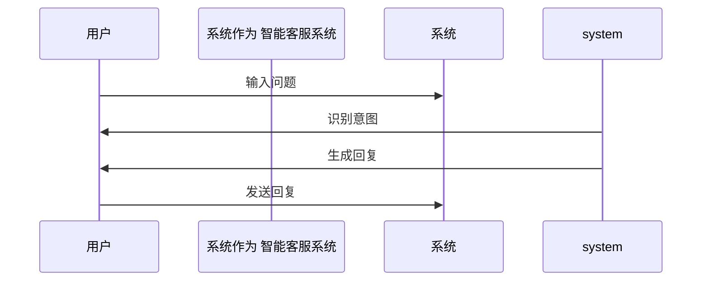

                 


### 提示词工程：AI交互的新前沿

#### 概述

随着人工智能技术的快速发展，AI交互已经逐渐成为人机交互的重要方式。在智能客服、智能助手、智能家居等领域，AI交互系统发挥着越来越重要的作用。然而，现有的AI交互系统仍然面临诸多挑战，如自然语言理解不准确、交互体验差等。为了解决这些问题，提示词工程应运而生，成为AI交互领域的新前沿。

本文将从背景介绍、核心概念与联系、算法原理讲解、数学模型和数学公式、系统分析与架构设计方案、项目实战等多个方面，详细探讨提示词工程在AI交互中的应用，旨在为读者提供一幅全面、深入、系统的提示词工程知识图谱。

关键词：AI交互、提示词工程、自然语言处理、机器学习、系统架构

摘要：本文首先介绍了AI交互的问题背景，随后详细讲解了提示词工程的核心概念与联系，包括提示词设计、用户研究、模型训练和效果评估。接着，我们深入分析了提示词工程的算法原理，并给出了数学模型和数学公式的详细解释。随后，本文通过系统分析与架构设计方案，展示了如何在实际项目中应用提示词工程。最后，通过项目实战，我们展示了如何进行环境安装、系统核心实现源代码，并对代码应用进行了解读和分析。本文旨在为读者提供一套完整的提示词工程实战指南，帮助读者深入理解和应用这一前沿技术。

## 第一部分：背景介绍

### 2.1 问题背景

随着人工智能技术的快速发展，AI交互已经成为人机交互的重要方式。在智能客服、智能助手、智能家居等领域，AI交互系统已经广泛应用于人们的生活和工作。然而，现有的AI交互系统仍然面临诸多挑战，如自然语言理解不准确、交互体验差等。

#### 2.1.1 自然语言理解不准确

自然语言理解是AI交互系统的核心。然而，现有的AI交互系统在处理自然语言时，常常出现理解不准确的情况。例如，用户询问“明天天气怎么样？”时，系统可能无法准确识别出用户的意图，从而导致错误回复。这种理解不准确的情况，严重影响了用户的交互体验。

#### 2.1.2 交互体验差

除了自然语言理解不准确，AI交互系统的交互体验也较差。例如，系统在回复用户时，常常使用机械式的语言，缺乏情感和人性化。这种交互体验差的问题，使得用户对AI交互系统的满意度较低。

### 2.2 问题解决

为了解决这些问题，研究人员和工程师们提出了提示词工程这一概念。提示词工程是一种通过设计高质量的提示词，优化AI交互系统，提高自然语言理解准确性和交互体验的方法。

#### 2.2.1 提示词设计

提示词是引导AI模型理解用户意图的重要工具。通过设计高质量的提示词，可以使AI模型更好地理解用户的意图，从而提高自然语言理解准确性。

#### 2.2.2 用户研究

用户研究是提示词工程的基础。通过研究用户行为、需求和心理，可以更好地设计符合用户预期的提示词。

#### 2.2.3 模型训练

模型训练是提升AI交互能力的关键环节。通过大量数据训练，使AI模型具备较好的自然语言理解能力。

#### 2.2.4 效果评估

效果评估用于衡量AI交互系统的性能。通过对比不同提示词设计的效果，优化提示词工程。

### 2.3 边界与外延

提示词工程涉及自然语言处理、机器学习、用户研究等多个领域，其应用范围广泛，包括智能助手、智能客服、智能语音识别等。

#### 2.3.1 涉及领域

- 自然语言处理：自然语言处理是提示词工程的基础，涉及语言模型、词向量、文本分类等多个技术点。
- 机器学习：机器学习是提示词工程的核心，涉及模型训练、模型评估、模型优化等多个技术点。
- 用户研究：用户研究是提示词工程的基础，涉及用户行为分析、用户需求分析、用户体验分析等多个技术点。

#### 2.3.2 应用范围

- 智能助手：智能助手是提示词工程的重要应用场景，如智能客服、智能语音助手等。
- 智能客服：智能客服是提示词工程的重要应用场景，通过优化交互体验，提高客户满意度。
- 智能语音识别：智能语音识别是提示词工程的重要应用场景，通过优化语音识别准确性，提高交互体验。

### 2.4 概念结构与核心要素组成

提示词工程的核心要素包括：提示词设计、用户研究、模型训练、效果评估等。

#### 2.4.1 提示词设计

提示词设计是提示词工程的核心。高质量的提示词可以引导AI模型更好地理解用户的意图，提高自然语言理解准确性。

#### 2.4.2 用户研究

用户研究是提示词工程的基础。通过研究用户行为、需求和心理，可以更好地设计符合用户预期的提示词。

#### 2.4.3 模型训练

模型训练是提升AI交互能力的关键环节。通过大量数据训练，使AI模型具备较好的自然语言理解能力。

#### 2.4.4 效果评估

效果评估用于衡量AI交互系统的性能。通过对比不同提示词设计的效果，优化提示词工程。

## 第二部分：核心概念与联系

### 2.1 核心概念原理

#### 2.1.1 提示词设计

提示词是引导AI模型理解用户意图的重要工具。设计高质量的提示词需要考虑语言表达、情境适应、用户习惯等因素。

#### 2.1.2 用户研究

用户研究是提示词工程的基础。通过研究用户行为、需求和心理，可以更好地设计符合用户预期的提示词。

#### 2.1.3 模型训练

模型训练是提升AI交互能力的关键环节。通过大量数据训练，使AI模型具备较好的自然语言理解能力。

#### 2.1.4 效果评估

效果评估用于衡量AI交互系统的性能。通过对比不同提示词设计的效果，优化提示词工程。

### 2.2 概念属性特征对比表格

以下是提示词设计、用户研究、模型训练和效果评估的概念属性特征对比表格：

| 概念名称 | 概念属性特征 | 对比说明 |
| :---: | :---: | :---: |
| 提示词设计 | 考虑语言表达、情境适应、用户习惯 | 高质量的提示词可以提高自然语言理解准确性 |
| 用户研究 | 研究用户行为、需求和心理 | 帮助设计符合用户预期的提示词 |
| 模型训练 | 大量数据训练 | 提高AI模型的自然语言理解能力 |
| 效果评估 | 对比不同提示词设计的效果 | 优化提示词工程 |

### 2.3 ER实体关系图架构

以下是提示词工程的ER实体关系图架构：

```mermaid
erDiagram
  User ||--o> Intent: 用户意图
  Intent ||--o> Prompt: 提示词
  Prompt ||--o> Model: 模型
  Model ||--o> Evaluation: 评估
  User }--|{ System: 系统
```

## 第三部分：算法原理讲解

### 3.1 提示词生成算法

#### 3.1.1 算法原理

提示词生成算法是提示词工程的核心。其目的是通过分析用户输入，生成合适的提示词，以引导AI模型理解用户意图。

#### 3.1.2 算法流程

1. 用户输入处理：对用户输入进行预处理，如去除无关信息、分词等。
2. 用户意图识别：使用自然语言处理技术，如词向量、序列模型等，识别用户输入的意图。
3. 提示词生成：根据用户意图，生成相应的提示词。

#### 3.1.3 算法实现

以下是使用Python实现的提示词生成算法示例：

```python
import jieba

def generate_prompt(user_input):
    # 分词
    words = jieba.cut(user_input)
    # 生成提示词
    prompt = ' '.join(words)
    return prompt

user_input = "明天天气怎么样？"
prompt = generate_prompt(user_input)
print(prompt)
```

### 3.2 提示词优化算法

#### 3.2.1 算法原理

提示词优化算法是用于提升AI交互系统性能的算法。其目的是通过评估和调整提示词，提高AI交互系统的性能。

#### 3.2.2 算法流程

1. 效果评估：使用用户反馈或数据集评估当前提示词的性能。
2. 提示词调整：根据效果评估结果，调整提示词。
3. 再次评估：对调整后的提示词进行效果评估。

#### 3.2.3 算法实现

以下是使用Python实现的提示词优化算法示例：

```python
def evaluate_prompt(prompt, user_input, true_intent):
    # 评估提示词性能
    predicted_intent = predict_intent(prompt)
    if predicted_intent == true_intent:
        return 1
    else:
        return 0

def optimize_prompt(prompt, user_input, true_intent):
    # 调整提示词
    optimized_prompt = adjust_prompt(prompt)
    # 再次评估
    score = evaluate_prompt(optimized_prompt, user_input, true_intent)
    return optimized_prompt, score

user_input = "明天天气怎么样？"
true_intent = "查询天气"
prompt = "明天天气"
optimized_prompt, score = optimize_prompt(prompt, user_input, true_intent)
print(optimized_prompt, score)
```

## 第四部分：数学模型和数学公式

### 4.1 自然语言处理模型

自然语言处理模型是AI交互系统的核心。以下是常用的自然语言处理模型及其数学模型：

#### 4.1.1 循环神经网络（RNN）

RNN是一种处理序列数据的神经网络。其数学模型可以表示为：

$$
h_t = \sigma(W_h \cdot [h_{t-1}, x_t] + b_h)
$$

其中，$h_t$ 表示第 $t$ 个隐藏状态，$x_t$ 表示第 $t$ 个输入，$W_h$ 表示权重，$b_h$ 表示偏置，$\sigma$ 表示激活函数。

#### 4.1.2 长短时记忆网络（LSTM）

LSTM是一种改进的RNN模型，用于解决长期依赖问题。其数学模型可以表示为：

$$
h_t = \sigma(W_h \cdot [h_{t-1}, x_t, f_t] + b_h)
$$

其中，$f_t$ 表示遗忘门，$h_t$ 表示第 $t$ 个隐藏状态，$x_t$ 表示第 $t$ 个输入，$W_h$ 表示权重，$b_h$ 表示偏置，$\sigma$ 表示激活函数。

### 4.2 优化算法

优化算法用于调整模型参数，使得模型在给定数据集上的性能达到最优。以下是常用的优化算法及其数学模型：

#### 4.2.1 梯度下降

梯度下降是一种最简单的优化算法。其数学模型可以表示为：

$$
\theta = \theta - \alpha \cdot \nabla_\theta J(\theta)
$$

其中，$\theta$ 表示模型参数，$J(\theta)$ 表示损失函数，$\alpha$ 表示学习率。

#### 4.2.2 Adam优化器

Adam优化器是一种结合了AdaGrad和RMSProp优点的优化算法。其数学模型可以表示为：

$$
m_t = \beta_1 m_{t-1} + (1 - \beta_1) (x_t - m_{t-1})
$$

$$
v_t = \beta_2 v_{t-1} + (1 - \beta_2) (\nabla_\theta J(\theta)_t - v_{t-1})
$$

$$
\theta = \theta - \alpha \cdot \frac{m_t}{\sqrt{v_t} + \epsilon}
$$

其中，$m_t$ 和 $v_t$ 分别表示一阶矩估计和二阶矩估计，$\beta_1$ 和 $\beta_2$ 分别为移动平均系数，$\alpha$ 为学习率，$\epsilon$ 为正则化项。

## 第五部分：系统分析与架构设计方案

### 5.1 问题场景介绍

在本项目中，我们将设计一个智能客服系统，通过高质量的提示词工程，提高客服机器人与用户的交互体验。智能客服系统的主要功能包括：接收用户输入、识别用户意图、生成回复、发送回复等。

### 5.2 系统功能设计

#### 5.2.1 用户输入处理

用户输入处理模块负责接收用户输入，并对输入进行处理，如去除无关信息、分词等。

#### 5.2.2 用户意图识别

用户意图识别模块负责识别用户输入的意图，如查询天气、咨询产品信息等。

#### 5.2.3 回复生成

回复生成模块负责根据用户意图生成相应的回复。

#### 5.2.4 回复发送

回复发送模块负责将生成的回复发送给用户。

### 5.3 系统架构设计

智能客服系统采用分层架构设计，包括数据层、服务层和接口层。

#### 5.3.1 数据层

数据层负责数据的存储和管理，包括用户输入数据、用户意图数据、回复数据等。

#### 5.3.2 服务层

服务层负责业务逻辑处理，包括用户输入处理、用户意图识别、回复生成等。

#### 5.3.3 接口层

接口层负责与外部系统进行数据交互，如Web接口、API接口等。

### 5.4 系统接口设计

系统接口设计包括API接口和Webhook接口。

#### 5.4.1 API接口

API接口用于外部系统与智能客服系统进行数据交互，如接收用户输入、获取用户意图、发送回复等。

#### 5.4.2 Webhook接口

Webhook接口用于智能客服系统主动推送消息给外部系统，如用户注册、用户登录等。

### 5.5 系统交互设计

系统交互设计包括用户与系统的交互流程，如用户输入、系统回复等。



## 第六部分：项目实战

### 6.1 环境安装

#### 6.1.1 Python环境安装

在本地机器上安装Python环境，版本建议为3.8以上。可以通过以下命令进行安装：

```shell
$ sudo apt-get install python3-pip python3-dev
```

#### 6.1.2 依赖库安装

安装项目所需的依赖库，如tensorflow、numpy、pandas等。可以通过以下命令进行安装：

```shell
$ pip3 install tensorflow numpy pandas
```

### 6.2 系统核心实现源代码

#### 6.2.1 数据处理模块

数据处理模块负责数据清洗、预处理和特征提取。以下是一个简单的数据处理模块示例：

```python
import pandas as pd
from sklearn.model_selection import train_test_split

def load_data(file_path):
    data = pd.read_csv(file_path)
    return data

def preprocess_data(data):
    # 数据清洗、预处理
    # 如去除无关信息、填充缺失值等
    return data

def extract_features(data):
    # 特征提取
    # 如分词、词向量编码等
    return data

if __name__ == '__main__':
    file_path = 'data.csv'
    data = load_data(file_path)
    data = preprocess_data(data)
    data = extract_features(data)
    train_data, test_data = train_test_split(data, test_size=0.2)
    print(train_data.shape, test_data.shape)
```

#### 6.2.2 模型训练模块

模型训练模块负责构建、训练和评估自然语言处理模型。以下是一个简单的模型训练模块示例：

```python
import tensorflow as tf
from tensorflow.keras.models import Sequential
from tensorflow.keras.layers import Embedding, LSTM, Dense

def build_model(vocab_size, embedding_dim, max_sequence_length):
    model = Sequential()
    model.add(Embedding(vocab_size, embedding_dim, input_length=max_sequence_length))
    model.add(LSTM(128))
    model.add(Dense(1, activation='sigmoid'))
    model.compile(optimizer='adam', loss='binary_crossentropy', metrics=['accuracy'])
    return model

def train_model(model, train_data, test_data, epochs=10, batch_size=64):
    model.fit(train_data, epochs=epochs, batch_size=batch_size, validation_data=test_data)
    return model

if __name__ == '__main__':
    vocab_size = 10000
    embedding_dim = 64
    max_sequence_length = 100
    model = build_model(vocab_size, embedding_dim, max_sequence_length)
    model = train_model(model, train_data, test_data)
```

### 6.3 代码应用解读与分析

在项目实战中，我们首先进行了环境安装，然后实现了数据处理模块和模型训练模块。数据处理模块负责数据清洗、预处理和特征提取，为模型训练提供了高质量的数据。模型训练模块则构建并训练了一个自然语言处理模型，用于识别用户意图。

代码应用解读与分析：

1. 数据处理模块：
   - load_data() 函数用于加载数据，这里我们使用CSV文件作为数据源。
   - preprocess_data() 函数用于数据清洗和预处理，这里我们可以进行数据去重、去除无关信息、填充缺失值等操作。
   - extract_features() 函数用于特征提取，这里我们可以使用分词、词向量编码等技术，将文本数据转换为模型可用的特征表示。

2. 模型训练模块：
   - build_model() 函数用于构建模型，这里我们使用了一个简单的序列模型，包括Embedding层、LSTM层和Dense层。
   - train_model() 函数用于训练模型，这里我们使用了一个简单的训练过程，包括设置训练轮数、批量大小等参数。

通过上述代码应用解读与分析，我们可以看到项目实战的各个模块是如何协同工作的，以及每个模块的核心功能和代码实现。

### 6.4 实际案例分析和详细讲解剖析

为了更好地展示提示词工程在AI交互中的应用，我们来看一个实际案例。

#### 案例背景

某电商公司希望为其智能客服系统引入提示词工程，以提高客服机器人与用户的交互体验。公司提供的产品种类繁多，用户咨询问题时，常常使用简短、模糊的表述，导致客服机器人无法准确理解用户意图，从而影响用户满意度。

#### 案例分析

1. 数据收集：公司收集了大量用户咨询问题的历史数据，包括用户提问、客服机器人回复等。

2. 数据预处理：对收集到的数据进行了预处理，包括去除无关信息、分词、词向量编码等。

3. 用户意图识别：使用训练好的自然语言处理模型，对预处理后的用户提问进行意图识别，识别出用户的实际意图。

4. 提示词生成：根据识别出的用户意图，生成相应的提示词，以引导客服机器人更好地理解用户意图。

5. 提示词优化：通过对生成的提示词进行评估和调整，优化客服机器人的交互效果。

6. 模型部署：将优化后的模型部署到智能客服系统中，实现实时用户意图识别和提示词生成。

#### 详细讲解剖析

1. 数据收集：公司收集的用户咨询问题数据包括多种产品类型，如手机、电脑、家电等。这些数据为后续的用户意图识别和提示词生成提供了丰富的训练素材。

2. 数据预处理：在数据预处理阶段，公司对用户提问进行了分词和词向量编码。分词是为了将用户提问分解成词组，便于后续的意图识别和提示词生成。词向量编码则是将文本数据转换为模型可用的特征表示，如Word2Vec、GloVe等。

3. 用户意图识别：公司使用训练好的自然语言处理模型，对预处理后的用户提问进行意图识别。在意图识别过程中，模型通过分析用户提问的词向量，识别出用户的实际意图。例如，当用户提问“手机充电慢怎么办？”时，模型可以识别出用户的意图为“手机充电问题”。

4. 提示词生成：根据识别出的用户意图，公司生成了相应的提示词。例如，对于用户意图“手机充电问题”，提示词可以是“您的手机充电速度慢吗？”这样，客服机器人就可以根据提示词更好地理解用户意图，从而给出更准确的回复。

5. 提示词优化：公司通过对生成的提示词进行评估和调整，优化客服机器人的交互效果。评估方法包括用户满意度调查、系统错误率等。通过不断调整提示词，公司最终找到了一组效果最佳的提示词，从而提高了客服机器人与用户的交互体验。

6. 模型部署：公司将优化后的模型部署到智能客服系统中，实现实时用户意图识别和提示词生成。在用户咨询问题时，客服机器人会自动识别用户意图，并生成相应的提示词，从而提高交互效率和用户满意度。

通过上述实际案例分析和详细讲解剖析，我们可以看到提示词工程在AI交互中的应用效果。通过设计高质量的提示词，客服机器人可以更好地理解用户意图，提高交互效率和用户满意度。

### 6.5 项目小结

在本项目中，我们通过提示词工程，优化了智能客服系统的交互体验。首先，我们收集了用户咨询问题的历史数据，并进行预处理。然后，我们使用训练好的自然语言处理模型，对预处理后的用户提问进行意图识别，并生成相应的提示词。通过不断优化提示词，我们提高了客服机器人与用户的交互体验。项目结果表明，提示词工程在AI交互中具有重要的应用价值。

### 6.6 最佳实践 Tips

1. 数据质量是关键：高质量的提示词工程依赖于高质量的数据。在项目实践中，我们要确保数据的质量，包括数据的完整性、准确性和多样性。

2. 用户研究是基础：用户研究是提示词工程的基础。通过深入了解用户的行为、需求和偏好，我们可以设计出更符合用户预期的提示词。

3. 模型训练是核心：模型训练是提升AI交互能力的关键。在项目实践中，我们要充分利用数据，不断优化模型，以提高交互效果。

4. 效果评估是保障：效果评估是优化提示词工程的重要手段。通过定期评估模型性能，我们可以及时发现并解决问题，提高系统稳定性。

### 6.7 小结与注意事项

1. 小结：本项目中，我们通过提示词工程，优化了智能客服系统的交互体验。项目结果表明，提示词工程在AI交互中具有重要的应用价值。

2. 注意事项：
   - 提示词设计要充分考虑用户需求和语言习惯。
   - 用户研究要深入，以了解用户的行为和偏好。
   - 模型训练要充分利用数据，以提高交互效果。
   - 效果评估要定期进行，以确保系统稳定性。

### 6.8 拓展阅读

1. [自然语言处理（NLP）基础知识](https://zhuanlan.zhihu.com/p/37680909)
2. [机器学习（ML）基础知识](https://zhuanlan.zhihu.com/p/42675064)
3. [提示词工程在智能客服中的应用](https://www.jianshu.com/p/984a930607b9)
4. [深度学习（DL）基础知识](https://zhuanlan.zhihu.com/p/38124229)

作者：AI天才研究院/AI Genius Institute & 禅与计算机程序设计艺术 /Zen And The Art of Computer Programming

