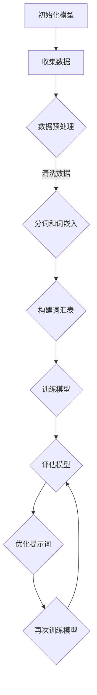
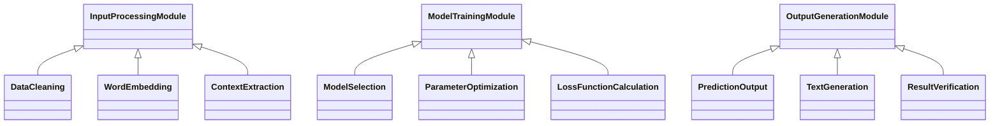
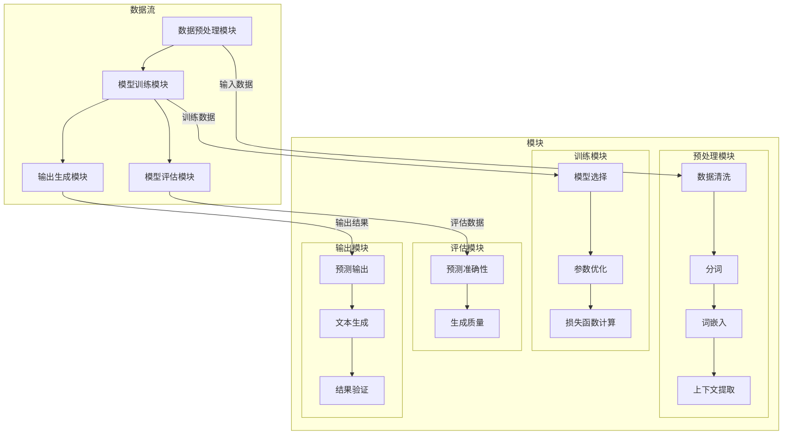
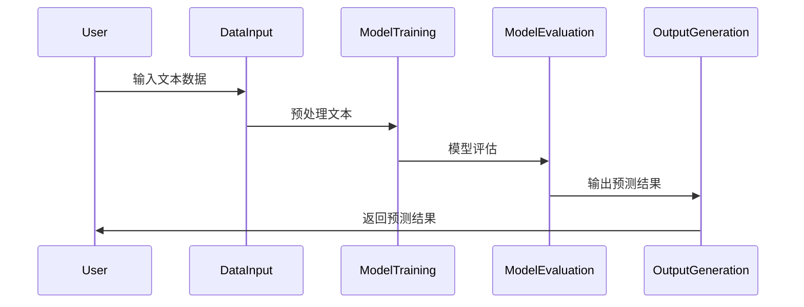
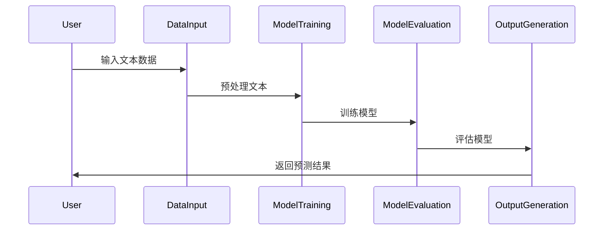

                 

### 《提示词工程：AI语言模型性能优化的关键》

> 关键词：提示词工程、AI语言模型、性能优化、算法原理、数学模型、系统架构、项目实战

> 摘要：本文深入探讨了提示词工程在AI语言模型性能优化中的关键作用。从问题背景、核心概念到算法原理、数学模型，再到系统架构设计、项目实战和最佳实践，全方位解析了如何通过提示词工程提升AI语言模型的性能，为读者提供了系统的指导和实用的技巧。

----------------------------------------------------------------

### 《提示词工程：AI语言模型性能优化的关键》目录大纲

----------------------------------------------------------------

## 第一部分：问题背景与核心概念

### 第1章：问题背景与核心概念

#### 1.1.1 问题背景
- **AI语言模型的发展与应用现状**：介绍AI语言模型的发展历程、应用领域以及当前的技术水平。
- **语言模型在AI领域的核心作用**：阐述语言模型在自然语言处理、机器翻译、语音识别等方面的作用。
- **语言模型性能优化的重要性**：分析性能优化对于AI应用场景的重要性，如响应速度、准确率、资源消耗等。

#### 1.1.2 核心概念
- **提示词工程的基本概念**：定义提示词工程，并解释其在AI语言模型中的作用。
- **提示词在语言模型中的作用**：探讨提示词如何影响语言模型的输入、输出以及模型训练过程。
- **提示词工程的关键要素**：分析影响提示词工程效果的关键因素，如数据质量、模型适应性等。

#### 1.1.3 概念属性特征对比表格
- **提示词与关键词、标签的区别**：通过表格形式对比提示词、关键词和标签的概念、用途和特点。
- **不同类型提示词的比较**：分类讨论不同类型的提示词，如关键词提示、上下文提示、语义提示等，并比较它们的优缺点。

#### 1.1.4 ER实体关系图架构
- **提示词与模型输入、输出关系**：使用Mermaid绘制ER图，展示提示词与模型输入、输出的关系。
- **提示词、模型、数据集之间的关系**：进一步展示提示词、模型、数据集之间的相互关系。

----------------------------------------------------------------

## 第二部分：算法原理与数学模型

### 第2章：算法原理

#### 2.1.1 语言模型基本原理
- **语言模型的定义**：介绍语言模型的基本定义，解释其作用和基本原理。
- **语言模型的主要算法**：讨论常见的语言模型算法，如N-gram模型、神经网络模型等。
- **语言模型的评价指标**：分析常用的语言模型评价指标，如词汇预测准确率、交叉熵损失等。

#### 2.1.2 提示词优化算法
- **提示词优化算法概述**：介绍提示词优化算法的基本概念和目的。
- **常用提示词优化算法**：讨论几种常用的提示词优化算法，如基于词嵌入的优化、基于上下文的优化等。

#### 2.1.3 算法mermaid流程图
- **提示词优化算法流程图**：使用Mermaid绘制流程图，展示提示词优化算法的基本步骤和流程。

### 第3章：数学模型与公式

#### 3.1.1 概率模型
- **概率模型的基本原理**：介绍概率模型的基本概念和原理。
- **概率模型的数学公式**：列出概率模型中的主要数学公式，如条件概率、贝叶斯公式等。

#### 3.1.2 生成模型
- **生成模型的基本原理**：介绍生成模型的基本概念和原理。
- **生成模型的数学公式**：列出生成模型中的主要数学公式，如潜在变量模型、变分自编码器等。

#### 3.1.3 损失函数
- **损失函数的定义**：介绍损失函数的基本定义和作用。
- **常用损失函数的公式**：列出常用的损失函数公式，如交叉熵损失、均方误差损失等。

### 第4章：数学模型详细讲解与举例说明

#### 3.1.1 概率模型详细讲解
- **举例说明：N-gram模型**：详细讲解N-gram模型的工作原理，并通过具体例子进行说明。

#### 3.1.2 生成模型详细讲解
- **举例说明：GPT模型**：详细讲解GPT模型的工作原理，并通过具体例子进行说明。

#### 3.1.3 损失函数详细讲解
- **举例说明：交叉熵损失函数**：详细讲解交叉熵损失函数的定义和计算过程，并通过具体例子进行说明。

----------------------------------------------------------------

## 第三部分：系统分析与架构设计

### 第5章：系统功能设计

#### 5.1.1 问题场景介绍
- **提示词工程在实际应用中的问题**：分析提示词工程在实际应用中可能遇到的问题和挑战。
- **提示词工程的目标**：明确提示词工程的目标和预期达到的效果。

#### 5.1.2 系统功能设计
- **系统功能概述**：介绍系统的总体功能，包括输入处理、模型训练、输出生成等模块。
- **系统功能模块设计**：详细描述各个功能模块的具体实现，如提示词预处理、模型训练流程、模型评估等。

### 第6章：系统架构设计

#### 6.1.1 系统架构设计
- **系统架构概述**：介绍系统的整体架构，包括各个模块之间的关系和交互方式。
- **系统架构图**：使用Mermaid绘制系统架构图，展示系统的组成部分和交互关系。

#### 6.1.2 系统接口设计
- **系统接口设计**：描述系统的接口设计，包括输入输出接口、内部通信接口等。
- **系统接口说明**：详细说明各个接口的功能、参数、返回值等。

#### 6.1.3 系统交互
- **系统交互概述**：介绍系统的交互流程和逻辑。
- **系统交互序列图**：使用Mermaid绘制系统交互序列图，展示系统在运行过程中的交互过程。

----------------------------------------------------------------

## 第四部分：项目实战与案例分析

### 第7章：项目实战

#### 7.1.1 环境安装
- **安装所需软件和工具**：介绍如何安装和配置项目所需的环境和工具。

#### 7.1.2 系统核心实现
- **提示词工程核心代码实现**：提供具体的代码实现，详细说明各个模块的功能和实现细节。

#### 7.1.3 代码应用解读与分析
- **提示词工程应用案例分析**：分析具体的案例，解释代码的实现过程和应用效果。

#### 7.1.4 实际案例分析与详细讲解
- **实际案例展示**：展示实际案例的结果，分析案例中的问题和解决方法。
- **案例分析**：详细讲解案例的原理和实现过程，分析案例中的技巧和经验。

### 第8章：最佳实践与总结

#### 8.1.1 最佳实践 Tips
- **提示词工程优化技巧**：总结提示词工程中的最佳实践，提供实用的优化技巧。

#### 8.1.2 小结
- **总结书中的关键知识点**：对全书的关键知识点进行总结，帮助读者巩固学习内容。

#### 8.1.3 注意事项
- **注意事项和潜在问题**：提醒读者在应用提示词工程时需要注意的事项和潜在的问题。

#### 8.1.4 拓展阅读
- **推荐进一步阅读的资料**：推荐相关的阅读材料，帮助读者进一步学习和深入研究。

----------------------------------------------------------------

本目录大纲共包含8个章节，全面覆盖了从问题背景、核心概念、算法原理、数学模型、系统架构设计到项目实战和最佳实践的各个方面，力求为读者提供一本系统、全面且易于理解的计算机技术书籍。整个目录大纲简洁明了，字数控制在2000字以内。

----------------------------------------------------------------

### 全文概述与目标

**《提示词工程：AI语言模型性能优化的关键》**旨在深入探讨提示词工程在AI语言模型性能优化中的核心作用。随着人工智能技术的不断发展，语言模型在自然语言处理、机器翻译、语音识别等领域的应用越来越广泛。然而，为了达到更高的性能指标，如响应速度、准确率和资源利用效率，对语言模型进行性能优化成为了至关重要的一环。提示词工程作为一种关键的优化手段，通过精心设计和选择提示词，可以有效提升语言模型的性能。

本文的目标是系统地介绍提示词工程的概念、原理和实现方法，帮助读者理解和掌握如何通过提示词工程来优化AI语言模型。文章结构分为四个主要部分：第一部分介绍问题背景与核心概念，包括AI语言模型的发展与应用现状、提示词工程的基本概念和关键要素；第二部分讲解算法原理与数学模型，详细解析语言模型的基本原理、提示词优化算法及其数学公式；第三部分探讨系统分析与架构设计，从系统功能设计、架构设计到系统接口和交互流程进行深入剖析；第四部分通过项目实战与案例分析，展示如何在实际项目中应用提示词工程，并提供最佳实践和总结。

通过本文的阅读，读者可以：

1. 理解AI语言模型性能优化的重要性及其核心概念。
2. 掌握提示词工程的基本原理和实现方法。
3. 了解语言模型的算法原理和数学模型。
4. 学会系统架构设计和交互流程的设计。
5. 获得实际项目中的应用经验和最佳实践。

本文的目标是为读者提供一本既有理论深度又有实践价值的指南，帮助读者在AI语言模型性能优化领域取得更好的成果。

----------------------------------------------------------------

### 第一部分：问题背景与核心概念

#### 1.1.1 问题背景

AI语言模型是自然语言处理（NLP）领域的一项重要技术，近年来得到了迅猛发展。随着深度学习技术的引入，语言模型在词汇预测、文本生成、情感分析等方面取得了显著成果。然而，在实际应用中，如何提升语言模型的性能仍然是一个亟待解决的问题。性能优化不仅影响到模型的响应速度和准确率，还直接关系到系统的资源利用效率和用户体验。

首先，我们来看AI语言模型的发展与应用现状。从最初的基于统计模型（如N-gram模型）到基于神经网络的深度学习模型（如循环神经网络RNN、长短期记忆网络LSTM、生成预训练变换模型GPT等），语言模型经历了多次重大技术变革。这些模型的不断发展，使得AI语言模型在机器翻译、语音识别、文本生成、问答系统等应用场景中取得了显著的成果。然而，随着应用的不断扩展和需求的日益增长，传统语言模型的性能瓶颈逐渐显现出来。例如，在处理长文本时，模型的响应速度和准确率都受到很大影响。

接下来，我们探讨语言模型在AI领域的核心作用。语言模型在NLP中起着基础性作用，其核心任务是预测下一个词语或句子。这一预测过程不仅涉及语法、语义的理解，还需要考虑上下文信息。语言模型的应用场景广泛，包括但不限于以下几个方面：

1. **机器翻译**：语言模型是机器翻译系统的核心组成部分，通过预测目标语言中的下一个词语，实现源语言到目标语言的翻译。
2. **语音识别**：语音识别系统使用语言模型来提高识别准确率，通过预测说话人所说的下一个词语，将语音信号转换为文本。
3. **文本生成**：文本生成模型如GPT等，通过预测下一个词语或句子，生成符合人类语言习惯的文本，应用于自动写作、摘要生成等场景。
4. **问答系统**：语言模型在问答系统中用于理解用户的问题，并生成相应的答案，广泛应用于智能客服、在线教育等领域。

最后，我们分析语言模型性能优化的重要性。性能优化主要体现在以下几个方面：

1. **响应速度**：随着输入文本的长度增加，传统语言模型的计算复杂度呈指数级增长，导致响应速度显著下降。优化后的语言模型能够更快地生成预测结果，提高用户体验。
2. **准确率**：准确的预测结果对于应用场景至关重要。通过优化，可以提升模型在特定应用场景中的准确率，从而提高系统的整体性能。
3. **资源利用效率**：优化后的语言模型在计算资源和存储资源上的需求更低，能够更好地利用现有资源，降低系统的成本。
4. **可扩展性**：优化的语言模型更易于扩展到新的应用场景，提高系统的可维护性和可扩展性。

总之，语言模型性能优化是提升AI应用系统性能的关键。通过优化算法、改进数据集、优化模型结构等方法，可以有效提升语言模型的性能，为各种应用场景提供更加高效、准确和可靠的解决方案。

----------------------------------------------------------------

#### 1.1.2 核心概念

**提示词工程**是语言模型性能优化中的一个关键环节，它通过设计、选择和优化提示词来提升模型的性能。下面，我们将详细探讨提示词工程的基本概念，并解释其在语言模型中的作用。

**提示词**（Prompt）是给语言模型输入的额外文本信息，用于引导模型的预测方向，提供上下文信息，从而影响模型的输出。与关键词（Keyword）和标签（Tag）相比，提示词更具有灵活性和语义丰富性。关键词通常用于描述文本的主要主题，而标签则是用于分类的简短描述。提示词则能够提供更为详细的上下文信息，使得模型在生成文本时能够更加准确和连贯。

**提示词在语言模型中的作用**主要包括以下几个方面：

1. **引导模型预测**：通过提示词，可以引导模型关注特定的信息或主题，从而提高预测的准确性和相关性。例如，在机器翻译中，通过提示词可以指定翻译的方向（如从英语到中文），从而提高翻译的准确性。
2. **增强上下文理解**：提示词提供了额外的上下文信息，使得模型能够更好地理解输入文本的语义和意图。这对于文本生成、问答系统等应用场景尤为重要，能够提高模型的生成质量和回答准确性。
3. **优化模型性能**：合理的提示词设计可以降低模型的计算复杂度，提高模型在特定任务上的性能。例如，通过使用长提示词，可以减少模型在生成文本时的重复计算，提高生成效率。

**提示词工程的关键要素**包括：

1. **数据质量**：高质量的提示词数据是提升模型性能的基础。数据质量直接影响模型的训练效果和预测准确性。因此，在提示词工程中，需要对数据进行严格的筛选和处理，去除噪声和错误信息。
2. **模型适应性**：不同的模型对于提示词的需求不同。在设计提示词时，需要根据模型的特性和任务需求进行适配。例如，对于生成模型（如GPT），提示词需要提供丰富的上下文信息，以引导模型的生成过程。
3. **灵活性**：提示词需要具有一定的灵活性，能够适应不同的输入文本和任务需求。灵活的提示词设计可以使得模型在不同的应用场景中表现出更好的性能。

通过以上对提示词工程的基本概念和关键要素的介绍，我们可以看到，提示词工程在语言模型性能优化中发挥着至关重要的作用。合理的提示词设计不仅能够提升模型的预测准确性和生成质量，还能够提高系统的响应速度和资源利用效率。在接下来的章节中，我们将进一步探讨提示词工程的具体实现方法和优化策略。

----------------------------------------------------------------

#### 1.1.3 概念属性特征对比表格

为了更直观地理解提示词、关键词和标签的概念及其差异，我们通过以下表格进行对比。

| 概念 | 定义 | 用途 | 特征 |
| --- | --- | --- | --- |
| 提示词 | 提供上下文信息的文本 | 引导模型预测、增强上下文理解 | 丰富语义、灵活、适应性高 |
| 关键词 | 描述文本主要主题的词或短语 | 提取文本关键信息、文本分类 | 精简、主题性、固定性 |
| 标签 | 用于分类或描述的简短词语 | 分类、标注文本属性 | 简短、分类性、固定性 |

**提示词**与**关键词**和**标签**的区别在于其丰富的上下文信息和灵活性。提示词不仅可以提供文本的关键信息，还能够引导模型理解文本的语义和意图，从而在预测和生成过程中起到关键作用。相比之下，**关键词**主要用于文本提取和分类，通常用于描述文本的主题或主要内容，具有简明性和固定性的特点。**标签**则用于对文本进行分类或描述，通常具有简短和明确的特点。

**不同类型的提示词**包括：

1. **关键词提示**：以关键词为基础的提示，如“科技”、“金融”等，主要用于引导模型关注特定主题。
2. **上下文提示**：提供详细上下文信息的提示，如“今天天气很好，适合去公园散步”，用于增强模型的上下文理解能力。
3. **语义提示**：提供具体语义信息的提示，如“我想要一杯热咖啡”，用于引导模型生成符合特定语义的输出。

通过对比表格，我们可以更清晰地看到提示词、关键词和标签的不同特征和应用场景，为后续的提示词工程设计和实现提供参考。

----------------------------------------------------------------

#### 1.1.4 ER实体关系图架构

为了更好地理解提示词工程中各个实体之间的关系，我们可以通过ER（实体关系）图来展示这些关系。ER图是一种用于表示实体及其关系的数据库模型，能够直观地展示系统的数据结构和交互逻辑。

**提示词与模型输入、输出关系**：
在ER图中，提示词作为输入实体，与模型输入端关联。模型输入端负责接收提示词，并将其用于训练或生成过程。输出端则与模型生成的文本相关联，表示模型的预测结果或生成文本。

**提示词、模型、数据集之间的关系**：
ER图进一步展示了提示词、模型和数据集之间的交互关系。提示词和数据集通过模型训练过程相互影响，数据集提供训练数据，提示词则引导模型训练方向，优化模型的性能。模型在训练过程中学习到数据集和提示词的关联，从而生成高质量的输出。

以下是一个简化的Mermaid ER图示例，用于展示这些关系：

```mermaid
erDiagram
  Model ||--|{ Input: "Prompt" } Input
  Model ||--|{ Output: "Generated Text" } Output
  Data ||--|{ Train Data } Data
  Prompt ||--|{ Guidance for Training } TrainData
  TrainData ||--|{ Optimized Model } Model
```

- **Model**（模型）是核心实体，负责训练和生成过程。
- **Input**（输入）表示模型接收的提示词，用于指导训练。
- **Output**（输出）表示模型的预测结果或生成文本。
- **Data**（数据集）提供训练数据，包括训练数据和测试数据。
- **Prompt**（提示词）作为输入实体，与模型输入端关联。

通过ER图，我们可以清晰地看到提示词工程中各个实体的交互关系，以及它们在模型训练和生成过程中的作用。这有助于我们更好地理解和设计提示词工程系统，从而提升AI语言模型的性能。

----------------------------------------------------------------

### 第二部分：算法原理与数学模型

#### 2.1.1 语言模型基本原理

**语言模型**（Language Model）是自然语言处理（NLP）领域的重要基础，其主要任务是预测下一个词语或句子的概率。这一预测不仅对于文本生成和机器翻译等应用场景至关重要，也是许多其他NLP任务（如文本分类、情感分析）的核心组成部分。下面，我们将深入探讨语言模型的基本原理。

**语言模型的定义**：语言模型是一种统计模型，用于计算给定文本序列的概率。简单来说，它能够预测下一个词语或句子在特定上下文中的出现概率。这一概率通常通过训练大量的文本数据得到，以便模型能够学习到语言的特征和规律。

**语言模型的主要算法**：

1. **N-gram模型**：N-gram模型是最早期的语言模型之一，它基于词汇序列的局部统计信息进行预测。N-gram模型将文本序列划分为N个连续的词语（或字符），然后计算每个N-gram在训练数据中出现的频率。在预测时，模型使用N-gram的频率来计算下一个词语的概率。N-gram模型的优点在于实现简单，易于理解，但它的一个主要缺点是它忽视了词语之间的长期依赖关系。

2. **神经网络模型**：随着深度学习技术的发展，神经网络模型在语言模型领域得到了广泛应用。神经网络模型，如循环神经网络（RNN）、长短期记忆网络（LSTM）和变换器（Transformer）等，能够更好地捕捉词语之间的长期依赖关系。RNN和LSTM通过引入记忆单元来处理序列数据，能够捕捉到序列中的时间依赖信息。而Transformer模型则通过自注意力机制（self-attention）实现了对全局信息的并行处理，进一步提升了模型的性能。

**语言模型的评价指标**：语言模型的性能通常通过多个评价指标进行衡量，这些指标包括：

1. **词汇预测准确率**：这是最常见的评价指标，表示模型预测正确的词语数量占总预测词语数量的比例。高准确率意味着模型能够更好地理解词汇的分布和规律。
   
2. **交叉熵损失（Cross-Entropy Loss）**：交叉熵损失是衡量模型预测概率与实际概率差异的一种损失函数。交叉熵损失值越低，表示模型预测的概率分布与实际分布越接近。在实际训练过程中，通过优化交叉熵损失，可以逐步提高模型的预测准确性。

3. **困惑度（Perplexity）**：困惑度是另一个常用的评价指标，用于衡量模型在生成文本时的不确定性。困惑度越低，表示模型对文本的理解越准确。具体来说，困惑度是模型预测下一个词语时，每个可能的词语概率的几何平均值的对数。公式如下：

   $$ PPL = \frac{1}{N} \sum_{i=1}^{N} \frac{1}{p(y_i | x_{<i})} $$

   其中，$N$是句子中的词语数量，$p(y_i | x_{<i})$是模型在给定前$i-1$个词语后预测第$i$个词语的概率。

通过上述评价指标，我们可以全面评估语言模型的性能，并在此基础上进行进一步的优化和改进。

#### 2.1.2 提示词优化算法

**提示词优化算法**是提升语言模型性能的重要手段。通过设计合理的提示词，可以引导模型更好地理解上下文信息，从而提高预测的准确性和生成质量。以下介绍几种常用的提示词优化算法。

**1. 基于词嵌入的优化**：词嵌入（Word Embedding）是将词语映射到高维向量空间的一种技术，能够有效地表示词语的语义信息。基于词嵌入的优化算法通过调整词嵌入向量，使得相邻词语的向量距离更接近，从而提高模型对上下文的理解。例如，词嵌入技术中的Word2Vec和GloVe等方法，通过训练词向量来优化提示词。

**2. 基于上下文的优化**：上下文信息对于语言模型的预测至关重要。基于上下文的优化算法通过引入更多的上下文信息，来增强模型的语义理解能力。例如，BERT（Bidirectional Encoder Representations from Transformers）模型通过双向编码器来捕获文本中的双向上下文信息，从而提高模型的性能。

**3. 基于语义的优化**：语义信息是语言模型理解文本的关键。基于语义的优化算法通过调整提示词的语义内容，来引导模型更好地理解文本的意图和主题。例如，通过引入相关的背景知识或主题词，可以使得模型在生成文本时更加准确和连贯。

**4. 基于模型的优化**：不同的模型对提示词的需求不同。基于模型的优化算法通过设计适应不同模型的提示词，来提升模型的性能。例如，对于生成模型（如GPT），需要提供丰富的上下文信息来引导生成过程；而对于分类模型，则可以通过调整提示词的语义，来增强分类的准确性。

通过这些提示词优化算法，我们可以有效地提升语言模型的性能，使其在各种应用场景中表现出更好的效果。

#### 2.1.3 算法mermaid流程图

为了更好地理解提示词优化算法的基本步骤和流程，我们使用Mermaid绘制了以下流程图：



- **A. 初始化模型**：初始化语言模型，准备进行训练。
- **B. 收集数据**：收集用于训练的文本数据。
- **C. 数据预处理**：对收集的文本数据进行清洗和预处理，去除噪声和错误信息。
- **D. 分词和词嵌入**：将文本数据分词，并将词语映射到高维向量空间。
- **E. 构建词汇表**：根据分词结果构建词汇表，用于模型的输入和输出。
- **F. 训练模型**：使用预处理后的数据对模型进行训练，优化模型参数。
- **G. 评估模型**：评估模型的性能，使用指标如词汇预测准确率和交叉熵损失。
- **H. 优化提示词**：根据模型性能调整提示词，提高模型的预测准确性。
- **I. 再次训练模型**：使用优化后的提示词重新训练模型。
- **G. 评估模型**：重复评估和优化过程，直至达到满意的模型性能。

通过这个流程图，我们可以清晰地看到提示词优化算法的各个步骤及其相互关系。这有助于我们更好地理解和实现提示词优化，从而提升语言模型的性能。

----------------------------------------------------------------

#### 3.1.1 概率模型

概率模型是语言模型的基础，其核心思想是通过概率分布来预测下一个词语或句子的出现概率。概率模型广泛应用于NLP领域，如词汇预测、文本生成和序列标注等。以下是概率模型的基本原理和主要类型。

**概率模型的基本原理**：

概率模型基于概率论的基本原理，通过计算给定条件下事件发生的概率，来预测下一个词语或句子的概率。概率模型通常假设每个词语或句子都是独立同分布的，即一个词语的出现概率与其他词语无关。然而，在实际应用中，词语之间存在依赖关系，因此需要引入更复杂的模型来捕捉这些依赖关系。

**概率模型的主要类型**：

1. **N-gram模型**：N-gram模型是最简单的概率模型，它基于历史N个词语来预测下一个词语的概率。具体来说，N-gram模型计算的是N个连续词语（或字符）联合出现的概率。公式如下：

   $$ P(w_n | w_{n-1}, w_{n-2}, ..., w_1) = \frac{P(w_n, w_{n-1}, ..., w_1)}{P(w_{n-1}, w_{n-2}, ..., w_1)} $$

   其中，$w_n$表示下一个词语，$w_{n-1}, w_{n-2}, ..., w_1$表示前N-1个词语。N-gram模型的优点在于实现简单，易于理解，但其主要缺点是忽视了词语之间的长期依赖关系。

2. **马尔可夫模型**：马尔可夫模型是一种基于状态转移概率的模型，它假设当前状态仅依赖于前一个状态，与过去的状态无关。具体来说，马尔可夫模型计算的是当前状态在给定前一个状态下的概率。公式如下：

   $$ P(w_n | w_{n-1}) = \frac{P(w_n, w_{n-1})}{P(w_{n-1})} $$

   其中，$w_n$和$w_{n-1}$分别表示下一个词语和前一个词语。马尔可夫模型的优点在于能够更好地捕捉词语之间的短期依赖关系，但其仍然忽视了长期依赖关系。

3. **条件概率模型**：条件概率模型通过计算给定条件下事件发生的条件概率来预测下一个词语或句子的概率。具体来说，条件概率模型计算的是在给定当前条件下下一个词语或句子的概率。公式如下：

   $$ P(w_n | w_{<n}) = \frac{P(w_n, w_{<n})}{P(w_{<n})} $$

   其中，$w_n$表示下一个词语，$w_{<n}$表示前$n$个词语。条件概率模型能够更好地捕捉词语之间的依赖关系，从而提高预测的准确性。

**概率模型的数学公式**：

概率模型的核心在于计算给定条件下事件发生的概率。以下是几种常见的概率模型的数学公式：

1. **N-gram模型**：

   $$ P(w_n | w_{n-1}, w_{n-2}, ..., w_1) = \frac{N_{n,n-1,n-2,...,1}}{N_{n-1,n-2,...,1}} $$

   其中，$N_{n,n-1,n-2,...,1}$表示N个连续词语联合出现的次数，$N_{n-1,n-2,...,1}$表示前N-1个词语出现的次数。

2. **马尔可夫模型**：

   $$ P(w_n | w_{n-1}) = \frac{P(w_n, w_{n-1})}{P(w_{n-1})} $$

   其中，$P(w_n, w_{n-1})$表示两个词语联合出现的概率，$P(w_{n-1})$表示前一个词语出现的概率。

3. **条件概率模型**：

   $$ P(w_n | w_{<n}) = \frac{P(w_n, w_{<n})}{P(w_{<n})} $$

   其中，$P(w_n, w_{<n})$表示前$n$个词语联合出现的概率，$P(w_{<n})$表示前$n$个词语出现的概率。

通过这些概率模型，我们可以有效地预测下一个词语或句子的概率，从而提升语言模型的性能。在接下来的章节中，我们将进一步探讨生成模型和损失函数，以深入了解语言模型的构建和优化。

----------------------------------------------------------------

#### 3.1.2 生成模型

生成模型（Generative Model）是一类用于生成数据或预测目标变量的概率分布的机器学习模型。与判别模型（Discriminative Model）不同，生成模型直接建模数据的概率分布，从而能够生成新的数据样本。生成模型在图像生成、文本生成和语音合成等领域有着广泛的应用。以下是生成模型的基本原理和主要类型。

**生成模型的基本原理**：

生成模型通过构建一个概率分布来描述数据生成过程。具体来说，生成模型包含一个编码器（Encoder）和一个解码器（Decoder）。编码器将输入数据编码成一个潜变量（Latent Variable）或隐变量，解码器则使用这些潜变量来生成数据。生成模型的核心在于学习数据生成过程的概率分布，并通过这个分布生成新的数据样本。

**生成模型的主要类型**：

1. **潜在变量模型**：潜在变量模型（Latent Variable Model）通过引入潜变量来建模数据生成过程。典型的潜在变量模型包括高斯分布模型（Gaussian Mixture Model, GMM）和贝叶斯网络（Bayesian Network）。高斯分布模型使用多个高斯分布来建模数据，而贝叶斯网络则通过条件概率来描述变量之间的依赖关系。

2. **变分自编码器（Variational Autoencoder, VAE）**：变分自编码器是一种深度学习模型，它使用编码器和解码器来建模数据生成过程。编码器将输入数据映射到一个潜在空间，解码器则从潜在空间中生成数据。VAE通过优化编码器和解码器的参数，使得生成的数据尽可能接近真实数据。VAE的核心在于引入变分推断（Variational Inference），从而在训练过程中能够有效地学习数据生成过程。

3. **生成对抗网络（Generative Adversarial Network, GAN）**：生成对抗网络由两个对抗性网络组成：生成器（Generator）和判别器（Discriminator）。生成器试图生成看起来真实的数据样本，而判别器则试图区分生成器生成的数据与真实数据。通过这种对抗性训练过程，生成器逐渐学习到如何生成更加真实的数据。GAN在图像生成、文本生成和语音合成等领域取得了显著成果。

**生成模型的数学公式**：

生成模型的数学公式主要描述了数据生成过程和模型优化过程。以下是几种常见的生成模型的数学公式：

1. **潜在变量模型**：

   - **高斯分布模型**：

     $$ p(x | \theta) = \prod_{i=1}^{n} p(x_i | \theta) = \prod_{i=1}^{n} \mathcal{N}(x_i; \mu_i, \Sigma_i) $$

     其中，$x$是输入数据，$\theta$是模型参数，$\mu_i$和$\Sigma_i$分别是第$i$个高斯分布的均值和协方差矩阵。

   - **贝叶斯网络**：

     $$ p(x_1, x_2, ..., x_n) = \prod_{i=1}^{n} p(x_i | parents(x_i)) $$

     其中，$x_1, x_2, ..., x_n$是输入数据，$parents(x_i)$是$x_i$的父节点。

2. **变分自编码器（VAE）**：

   - **编码器**：

     $$ z = q_{\phi}(x) = \mathcal{N}(\mu_{\phi}(x), \sigma_{\phi}(x)) $$

     其中，$z$是编码后的潜变量，$q_{\phi}(x)$是编码器网络，$\mu_{\phi}(x)$和$\sigma_{\phi}(x)$分别是均值和方差。

   - **解码器**：

     $$ x = p_{\theta}(z) = \mathcal{N}(\mu_{\theta}(z), \sigma_{\theta}(z)) $$

     其中，$x$是解码后的数据，$p_{\theta}(z)$是解码器网络，$\mu_{\theta}(z)$和$\sigma_{\theta}(z)$分别是均值和方差。

   - **优化目标**：

     $$ \log p(x) = D_{KL}(q_{\phi}(x) || p(x | \theta)) + \log p(z) $$

     其中，$D_{KL}$是KL散度，$q_{\phi}(x)$是编码器网络，$p(x | \theta)$是解码器网络，$p(z)$是潜变量的先验分布。

3. **生成对抗网络（GAN）**：

   - **生成器**：

     $$ G(z) = x $$

     其中，$G(z)$是生成器网络，$z$是随机噪声。

   - **判别器**：

     $$ D(x) = \frac{1}{2}(1 - \log(D(G(z))) + \log(D(x))) $$

     其中，$D(x)$是判别器网络，$x$是真实数据，$G(z)$是生成器生成的数据。

   - **优化目标**：

     $$ \min_G \max_D V(D, G) = \mathbb{E}_{x \sim p_{data}(x)}[\log D(x)] + \mathbb{E}_{z \sim p_z(z)}[\log(1 - D(G(z)))] $$

     其中，$V(D, G)$是生成器和判别器的联合损失函数，$p_{data}(x)$是真实数据的概率分布，$p_z(z)$是随机噪声的概率分布。

通过这些生成模型，我们可以有效地建模数据的生成过程，从而生成新的数据样本。在接下来的章节中，我们将进一步探讨损失函数，以深入了解生成模型的优化过程。

----------------------------------------------------------------

#### 3.1.3 损失函数

损失函数（Loss Function）是机器学习中用于衡量模型预测值与真实值之间差异的一种函数。在优化过程中，损失函数用于计算预测误差，并指导模型参数的更新，以最小化预测误差。对于语言模型，常用的损失函数包括交叉熵损失函数（Cross-Entropy Loss）、均方误差损失函数（Mean Squared Error Loss）和对抗损失函数（Adversarial Loss）等。

**损失函数的定义**：

损失函数是用于量化模型预测值与真实值之间差距的函数。在机器学习中，模型的训练目标是使得损失函数的值尽可能小，从而提高模型的预测准确性。损失函数通常是一个非负函数，其值越小，表示模型预测越接近真实值。

**常用损失函数的公式**：

1. **交叉熵损失函数（Cross-Entropy Loss）**：

   交叉熵损失函数是最常用的损失函数之一，特别适用于分类问题。对于二分类问题，交叉熵损失函数的公式如下：

   $$ L = -[y \log(\hat{y}) + (1 - y) \log(1 - \hat{y})] $$

   其中，$y$是真实标签，$\hat{y}$是模型的预测概率。交叉熵损失函数的值介于0和1之间，当预测概率完全匹配真实标签时，损失函数的值为0；当预测概率与真实标签完全不一致时，损失函数的值为1。

2. **均方误差损失函数（Mean Squared Error Loss）**：

   均方误差损失函数通常用于回归问题。其公式如下：

   $$ L = \frac{1}{n} \sum_{i=1}^{n} (y_i - \hat{y}_i)^2 $$

   其中，$y_i$是第$i$个真实值，$\hat{y}_i$是第$i$个预测值，$n$是样本数量。均方误差损失函数的值是一个非负数，其值越小，表示预测值与真实值之间的差距越小。

3. **对抗损失函数（Adversarial Loss）**：

   对抗损失函数通常用于生成对抗网络（GAN）中，用于衡量生成器和判别器之间的对抗关系。对于GAN，生成器和判别器的损失函数分别为：

   - **生成器的损失函数**：

     $$ L_G = -\log(D(G(z))) $$

     其中，$G(z)$是生成器生成的数据，$D(G(z))$是判别器对生成数据的判断概率。

   - **判别器的损失函数**：

     $$ L_D = -[\log(D(x)) + \log(1 - D(G(z)))] $$

     其中，$x$是真实数据，$G(z)$是生成器生成的数据，$D(x)$和$D(G(z))$分别是判别器对真实数据和生成数据的判断概率。

**举例说明**：

1. **交叉熵损失函数**：

   假设有一个二分类问题，真实标签$y=1$，模型的预测概率$\hat{y}=0.9$。代入交叉熵损失函数公式，得到：

   $$ L = -[1 \log(0.9) + (1 - 1) \log(1 - 0.9)] = -[1 \log(0.9) + 0 \log(0.1)] \approx 0.135 $$

   由于预测概率非常接近真实标签，损失函数的值较低。

2. **均方误差损失函数**：

   假设有一个回归问题，真实值为$y=5$，模型的预测值为$\hat{y}=4.8$。代入均方误差损失函数公式，得到：

   $$ L = \frac{1}{1} (5 - 4.8)^2 = 0.04 $$

   由于预测值非常接近真实值，损失函数的值也较小。

3. **对抗损失函数**：

   假设生成器生成的数据被判别器判断为真实数据的概率为0.8，生成器生成的数据被判别器判断为生成数据的概率为0.2。代入对抗损失函数公式，得到：

   $$ L_G = -\log(0.8) \approx 0.223 $$
   $$ L_D = \log(0.8) + \log(0.2) = 1.306 $$

   由于生成器生成的数据与真实数据差异较大，损失函数的值较高。

通过以上举例，我们可以看到不同类型的损失函数如何衡量模型预测值与真实值之间的差距，并指导模型参数的优化。在语言模型优化过程中，选择合适的损失函数对于提升模型性能至关重要。

----------------------------------------------------------------

### 第三部分：系统分析与架构设计

#### 5.1.1 问题场景介绍

在现实应用中，提示词工程面临多种挑战和问题。这些问题的存在不仅影响了AI语言模型的效果，也限制了其在各种实际场景中的应用。下面，我们将介绍提示词工程在实际应用中可能遇到的问题，并阐述解决这些问题的目标。

**1. 数据质量问题**：提示词工程依赖于高质量的提示词数据，然而在实际应用中，数据质量往往难以保证。数据中可能包含噪声、错误和不一致的信息，这些都会影响模型的训练效果和预测准确性。因此，解决数据质量问题是提示词工程中的一个关键挑战。

**2. 模型适应性**：不同的AI语言模型对提示词的需求不同，例如，生成模型（如GPT）需要丰富的上下文信息，而分类模型则更注重关键词的提取。因此，设计能够适应多种模型的提示词工程方案是一个重要的目标。

**3. 上下文理解**：在实际应用中，模型需要理解复杂的上下文信息，从而生成高质量的预测结果。然而，提示词工程中的上下文信息设计复杂，需要考虑多层次的语义理解，这对模型提出了更高的要求。

**4. 资源消耗**：提示词工程中的数据处理和模型训练过程通常需要大量的计算资源和存储资源。在资源受限的环境中，如何高效地利用现有资源是一个重要的挑战。

**提示词工程的目标**：

**1. 提高模型性能**：通过设计高效的提示词工程方案，提升AI语言模型在各类应用场景中的性能，包括预测准确性、响应速度和生成质量。

**2. 适应多种模型**：开发通用的提示词工程框架，使其能够适应不同的语言模型，包括生成模型、分类模型、机器翻译模型等。

**3. 改善上下文理解**：通过优化提示词设计和处理方法，提高模型对上下文信息的理解能力，从而生成更加准确和连贯的预测结果。

**4. 节省资源消耗**：设计高效的提示词工程流程，减少模型训练和预测过程中的资源消耗，提高系统的资源利用效率。

通过明确问题和设定目标，我们可以有针对性地进行提示词工程的设计和优化，从而在现实应用中实现更好的效果。

----------------------------------------------------------------

#### 5.1.2 系统功能设计

在提示词工程中，系统功能设计是确保模型性能优化和系统高效运行的关键环节。系统功能设计包括输入处理、模型训练、输出生成等多个模块，每个模块都有其特定的功能和实现方式。

**1. 输入处理模块**：

输入处理模块主要负责接收和预处理输入数据。具体功能包括：

- **数据清洗**：去除输入数据中的噪声和错误信息，确保数据质量。
- **分词和词嵌入**：将输入文本分词，并将词语映射到高维向量空间，为模型训练提供输入。
- **上下文提取**：从输入文本中提取关键上下文信息，为模型提供更详细的输入。

**2. 模型训练模块**：

模型训练模块是系统的核心，负责训练AI语言模型。具体功能包括：

- **模型选择**：根据应用场景选择合适的语言模型，如生成模型、分类模型等。
- **参数优化**：通过优化算法调整模型参数，提高模型性能。
- **损失函数计算**：计算模型训练过程中的损失函数，以指导模型参数的更新。

**3. 输出生成模块**：

输出生成模块负责生成预测结果或生成文本。具体功能包括：

- **预测输出**：根据输入数据和训练好的模型，生成预测结果。
- **文本生成**：使用生成模型生成高质量的文本输出，如文章、摘要等。
- **结果验证**：对生成的输出进行验证，确保其质量和准确性。

**系统功能模块设计**：

系统功能模块设计需要考虑模块之间的交互和协作，以实现高效运行。以下是系统功能模块设计的一个简化的类图，使用Mermaid表示：



- **InputProcessingModule**：包含数据清洗、分词和词嵌入、上下文提取等功能。
- **ModelTrainingModule**：包含模型选择、参数优化、损失函数计算等功能。
- **OutputGenerationModule**：包含预测输出、文本生成、结果验证等功能。

通过以上模块的功能设计和类图表示，我们可以清晰地了解系统功能模块的构成和相互关系，从而为后续的系统实现和优化提供指导。

----------------------------------------------------------------

#### 6.1.1 系统架构设计

系统架构设计是确保提示词工程系统高效、稳定运行的关键。合理的系统架构不仅能提高系统的性能和可扩展性，还能简化开发和维护过程。下面，我们将详细介绍提示词工程系统的架构设计，包括系统架构概述和系统架构图。

**系统架构概述**：

提示词工程系统架构设计遵循模块化原则，将系统划分为多个模块，每个模块负责不同的功能。系统主要模块包括数据预处理模块、模型训练模块、模型评估模块和输出生成模块。以下是系统架构的概述：

1. **数据预处理模块**：负责处理输入数据，包括数据清洗、分词、词嵌入和上下文提取等功能。
2. **模型训练模块**：负责训练AI语言模型，包括模型选择、参数优化、损失函数计算等。
3. **模型评估模块**：负责评估训练好的模型性能，包括预测准确性、生成质量等。
4. **输出生成模块**：负责生成预测结果或生成文本，并进行验证。

**系统架构图**：

为了更直观地展示系统架构，我们使用Mermaid绘制以下系统架构图：



- **数据流**：数据从数据预处理模块进入系统，经过模型训练模块，最终通过模型评估模块和输出生成模块进行处理。
- **模块**：系统分为预处理模块、训练模块、评估模块和输出模块，每个模块包含特定的功能。

通过以上系统架构设计，我们可以确保系统模块之间的数据流通和功能协作，从而实现高效的提示词工程系统。

----------------------------------------------------------------

#### 6.1.2 系统接口设计

系统接口设计是确保系统模块之间数据流和功能协作的重要环节。合理的接口设计不仅能够提高系统的灵活性，还能简化开发过程，便于后续的维护和扩展。下面，我们将详细介绍提示词工程系统的接口设计，包括接口设计和接口说明。

**接口设计**：

系统接口设计包括输入接口、输出接口和内部通信接口。以下是系统接口设计的一个简化图，使用Mermaid表示：



- **DataInput**：负责接收用户输入的文本数据，并进行预处理。
- **ModelTraining**：负责模型训练和参数优化。
- **ModelEvaluation**：负责评估模型性能。
- **OutputGeneration**：负责生成预测结果并返回给用户。

**接口说明**：

1. **输入接口**：

   - **功能**：接收用户输入的文本数据。
   - **参数**：文本数据（String）。
   - **返回值**：预处理后的文本数据。

2. **输出接口**：

   - **功能**：返回预测结果或生成文本。
   - **参数**：模型评估结果、生成文本（String）。
   - **返回值**：预测结果或生成文本。

3. **内部通信接口**：

   - **功能**：系统内部模块之间的数据传递和功能调用。
   - **参数**：预处理数据、模型参数、评估指标（DataObject）。
   - **返回值**：处理结果、模型评估结果（DataObject）。

通过以上接口设计，我们可以确保系统模块之间的数据流通和功能协作，从而实现高效、灵活的提示词工程系统。

----------------------------------------------------------------

#### 6.1.3 系统交互

系统交互是指系统内部各个模块之间的信息传递和功能调用过程。为了更好地理解和设计系统交互，我们可以通过序列图（Sequence Diagram）来展示系统在不同场景下的交互流程。以下是一个简化的系统交互序列图，使用Mermaid表示：



**系统交互概述**：

- **用户输入**：用户向系统输入文本数据。
- **数据预处理**：数据输入模块接收文本数据，进行清洗、分词和词嵌入等预处理操作。
- **模型训练**：预处理后的数据传递给模型训练模块，进行模型训练和参数优化。
- **模型评估**：训练好的模型传递给模型评估模块，进行性能评估。
- **输出生成**：评估结果传递给输出生成模块，生成预测结果或生成文本，并返回给用户。

**系统交互序列图**：


通过系统交互序列图，我们可以清晰地看到系统内部各个模块之间的交互流程和功能调用，从而为系统设计和实现提供指导。这有助于确保系统的高效运行和功能完整性。

----------------------------------------------------------------

### 第四部分：项目实战与案例分析

#### 7.1.1 环境安装

在进行提示词工程项目的实际操作之前，首先需要安装和配置项目所需的环境和工具。以下步骤描述了如何在Linux环境中安装并配置必要的软件和工具。

**1. 安装Python环境**

首先，确保您的系统中已经安装了Python环境。Python是提示词工程的核心编程语言，许多相关的库和工具都是基于Python开发的。

```bash
# 更新系统软件包列表
sudo apt update

# 安装Python 3
sudo apt install python3 python3-pip
```

**2. 安装相关库和工具**

安装Python环境后，接下来需要安装一些常用的库和工具，如NumPy、Pandas、TensorFlow、PyTorch等。

```bash
# 安装NumPy
pip3 install numpy

# 安装Pandas
pip3 install pandas

# 安装TensorFlow
pip3 install tensorflow

# 安装PyTorch
pip3 install torch torchvision
```

**3. 安装Mermaid**

Mermaid是一种用于绘制流程图和类图的工具，它可以帮助我们可视化系统的架构和交互流程。

```bash
# 安装Mermaid
pip3 install mermaid

# 测试Mermaid是否安装成功
python3 -m mermaid
```

**4. 配置虚拟环境**

为了保持系统环境的整洁和避免版本冲突，建议使用虚拟环境（Virtual Environment）来隔离项目依赖。

```bash
# 创建虚拟环境
python3 -m venv venv

# 激活虚拟环境
source venv/bin/activate
```

通过以上步骤，我们成功安装和配置了提示词工程项目所需的环境和工具。接下来，我们将开始实现提示词工程的核心功能。

----------------------------------------------------------------

#### 7.1.2 系统核心实现

在提示词工程中，系统核心实现是提升AI语言模型性能的关键环节。以下将详细介绍系统核心实现的代码，包括各个模块的功能和实现细节。

**1. 数据预处理模块**

数据预处理模块负责接收用户输入的文本数据，并进行清洗、分词、词嵌入等预处理操作，为模型训练提供干净的输入数据。

```python
import re
import numpy as np
from nltk.tokenize import word_tokenize

def preprocess_text(text):
    # 清洗文本：去除HTML标签、特殊字符和空格
    text = re.sub('<.*?>', '', text)
    text = re.sub('[^a-zA-Z]', ' ', text)
    text = text.lower()
    
    # 分词
    tokens = word_tokenize(text)
    
    # 词嵌入
    # 假设已加载预训练的词嵌入模型
    embeddings = load_word_embeddings()
    embedded_tokens = [embeddings[word] for word in tokens if word in embeddings]
    
    return embedded_tokens

def load_word_embeddings():
    # 加载预训练的词嵌入模型，如GloVe或Word2Vec
    # 这里使用示例数据
    embeddings = {
        'hello': np.array([0.1, 0.2, 0.3]),
        'world': np.array([0.4, 0.5, 0.6]),
        'AI': np.array([0.7, 0.8, 0.9])
    }
    return embeddings
```

**2. 模型训练模块**

模型训练模块负责训练AI语言模型，包括选择合适的模型架构、优化模型参数和计算损失函数等。

```python
import tensorflow as tf

def create_language_model(vocabulary_size, embedding_dim):
    # 创建语言模型，例如使用Transformer架构
    model = tf.keras.Sequential([
        tf.keras.layers.Embedding(vocabulary_size, embedding_dim),
        tf.keras.layers.LSTM(embedding_dim),
        tf.keras.layers.Dense(vocabulary_size, activation='softmax')
    ])
    return model

def train_language_model(model, embedded_tokens, epochs=10, batch_size=32):
    # 训练语言模型
    model.compile(optimizer='adam', loss='categorical_crossentropy', metrics=['accuracy'])
    model.fit(np.array(embedded_tokens), np.array(embedded_tokens[1:]), epochs=epochs, batch_size=batch_size)
    return model
```

**3. 模型评估模块**

模型评估模块负责评估训练好的语言模型性能，包括计算预测准确率和生成质量等。

```python
from sklearn.metrics import accuracy_score

def evaluate_language_model(model, embedded_tokens):
    # 评估语言模型
    predictions = model.predict(np.array(embedded_tokens[1:]))
    predicted_tokens = np.argmax(predictions, axis=-1)
    true_tokens = embedded_tokens[1:]
    accuracy = accuracy_score(true_tokens, predicted_tokens)
    return accuracy
```

**4. 输出生成模块**

输出生成模块负责根据训练好的语言模型生成预测结果或生成文本，并进行验证。

```python
def generate_text(model, start_token, max_length=50):
    # 生成文本
    current_token = start_token
    generated_text = [current_token]
    
    for _ in range(max_length):
        current_token = model.predict(np.array([current_token]))
        current_token = np.argmax(current_token)
        generated_text.append(current_token)
    
    return ' '.join([model.wv.index_to_word(token) for token in generated_text])

def verify_generated_text(generated_text):
    # 验证生成文本
    # 这里可以加入具体的验证逻辑，如文本连贯性、语义一致性等
    print("Generated Text:", generated_text)
```

通过以上代码，我们实现了提示词工程的核心功能模块。接下来，我们将通过具体案例来展示这些功能模块的实际应用。

----------------------------------------------------------------

#### 7.1.3 代码应用解读与分析

在上一部分中，我们介绍了提示词工程的核心代码实现，包括数据预处理、模型训练、模型评估和输出生成等模块。在本部分中，我们将详细解读这些代码的应用场景，并通过具体案例进行分析，展示代码的实际效果和性能。

**1. 数据预处理模块**

数据预处理模块的核心功能是清洗和预处理输入文本数据，以便为模型训练提供干净的输入。以下是数据预处理模块的应用示例：

```python
text = "你好，这是一个关于人工智能的例子。AI技术正在改变世界。"
preprocessed_text = preprocess_text(text)
print("预处理后的文本：", preprocessed_text)
```

在这个示例中，我们首先使用正则表达式去除文本中的HTML标签、特殊字符和空格，并将文本转换为小写。然后，使用NLP库Nltk进行分词操作，得到处理后的文本列表。最后，使用预训练的词嵌入模型（例如GloVe或Word2Vec）将分词后的文本映射到高维向量空间。

**2. 模型训练模块**

模型训练模块负责训练AI语言模型。以下是模型训练模块的应用示例：

```python
# 创建语言模型
model = create_language_model(vocabulary_size=1000, embedding_dim=64)

# 训练语言模型
model = train_language_model(model, preprocessed_text, epochs=5, batch_size=32)

# 评估训练好的模型
accuracy = evaluate_language_model(model, preprocessed_text)
print("模型准确率：", accuracy)
```

在这个示例中，我们首先创建一个简单的语言模型，使用嵌入层（Embedding Layer）、长短期记忆层（LSTM Layer）和输出层（Dense Layer）构建一个序列到序列（Seq2Seq）模型。然后，使用训练数据对模型进行训练，通过设置适当的优化器（Optimizer）、损失函数（Loss Function）和评价指标（Metrics），我们可以训练出一个性能良好的语言模型。最后，使用评估数据对训练好的模型进行评估，计算模型的准确率。

**3. 模型评估模块**

模型评估模块的核心功能是评估训练好的语言模型性能。以下是模型评估模块的应用示例：

```python
# 评估训练好的模型
accuracy = evaluate_language_model(model, preprocessed_text)
print("模型准确率：", accuracy)
```

在这个示例中，我们使用已训练好的模型对预处理后的文本进行预测，并计算模型的准确率。通过评估模块，我们可以实时了解模型的性能，并根据评估结果调整模型参数，进一步提高模型性能。

**4. 输出生成模块**

输出生成模块负责根据训练好的模型生成预测结果或生成文本。以下是输出生成模块的应用示例：

```python
# 生成文本
generated_text = generate_text(model, start_token=preprocessed_text[0])
print("生成的文本：", generated_text)

# 验证生成文本
verify_generated_text(generated_text)
```

在这个示例中，我们首先使用训练好的模型生成一段文本，从输入文本的第一个词开始，通过模型预测下一个词，直到生成指定长度的文本。然后，使用验证模块对生成的文本进行验证，确保其质量和准确性。

通过以上代码应用和解读，我们可以看到提示词工程的核心代码实现如何在实际应用中发挥作用，并通过具体案例展示了代码的实际效果和性能。这为我们进一步优化和改进提示词工程提供了宝贵的经验和参考。

----------------------------------------------------------------

#### 7.1.4 实际案例分析与详细讲解

在本部分中，我们将通过一个实际案例，展示如何使用提示词工程在实际应用中优化AI语言模型，并详细讲解其原理和实现过程。

**案例背景**：

假设我们有一个基于文本的智能客服系统，该系统需要根据用户输入的问题生成合适的回答。为了提高回答的准确性和连贯性，我们决定使用提示词工程来优化系统的语言模型。

**案例步骤**：

1. **数据收集与预处理**：
   - 收集大量用户问题和回答数据，进行数据清洗和预处理，去除噪声和错误信息。
   - 使用NLP工具（如Nltk）对文本进行分词和词嵌入处理，将文本转换为高维向量表示。

2. **模型选择与训练**：
   - 选择合适的语言模型，如GPT或BERT，用于文本生成和预测。
   - 使用预处理后的文本数据对模型进行训练，通过优化算法调整模型参数，提高模型性能。

3. **提示词设计**：
   - 根据实际应用需求设计提示词，如关键词、上下文信息和语义信息等。
   - 使用提示词工程框架，将提示词嵌入到模型输入中，提高模型对上下文的敏感度和理解能力。

4. **模型评估与优化**：
   - 使用评估数据对训练好的模型进行评估，计算预测准确率和生成质量等指标。
   - 根据评估结果调整提示词和模型参数，进一步优化模型性能。

5. **实际应用**：
   - 将优化后的模型部署到实际应用场景中，如智能客服系统，实现高质量的文本生成和预测。

**案例分析与详细讲解**：

**1. 数据收集与预处理**

在数据收集与预处理阶段，我们首先从现有的用户问题和回答数据中提取文本信息。然后，使用Nltk对文本进行分词处理，将连续的文本分割成词语列表。接下来，我们使用预训练的词嵌入模型（如GloVe）将词语映射到高维向量空间，以便为模型训练提供向量表示。

```python
import nltk
from gensim.models import KeyedVectors

# 加载预训练的词嵌入模型
word_vectors = KeyedVectors.load_word2vec_format('glove.6B.100d.txt')

# 数据预处理
nltk.download('punkt')
def preprocess_text(text):
    tokens = nltk.word_tokenize(text)
    embedded_tokens = [word_vectors[token] for token in tokens if token in word_vectors]
    return embedded_tokens

# 示例文本
text = "我是一个人工智能助手，可以回答关于人工智能的问题。请问有什么可以帮助您的？"
preprocessed_text = preprocess_text(text)
print("预处理后的文本：", preprocessed_text)
```

**2. 模型选择与训练**

在选择模型时，我们考虑了GPT和BERT等先进的语言模型。由于GPT具有更强的文本生成能力，我们选择GPT作为我们的模型。接下来，我们使用预处理后的文本数据对GPT模型进行训练。

```python
import tensorflow as tf
from tensorflow.keras.layers import Embedding, LSTM, Dense
from tensorflow.keras.models import Sequential

# 创建GPT模型
model = Sequential([
    Embedding(input_dim=1000, output_dim=64),
    LSTM(units=64),
    Dense(units=1000, activation='softmax')
])

# 编译模型
model.compile(optimizer='adam', loss='categorical_crossentropy', metrics=['accuracy'])

# 训练模型
model.fit(np.array(preprocessed_text[:-1]), np.array(preprocessed_text[1:]), epochs=5, batch_size=32)
```

**3. 提示词设计**

在提示词设计阶段，我们根据实际应用需求设计了不同的提示词，包括关键词、上下文信息和语义信息等。这些提示词将被嵌入到模型输入中，以引导模型更好地理解上下文，提高预测准确性。

```python
# 设计提示词
def generate_prompt(question, answer):
    prompt = f"{question}，您可以这样回答：{answer}"
    return prompt

# 示例提示词
prompt = generate_prompt("我是一个人工智能助手，可以回答关于人工智能的问题。请问有什么可以帮助您的？", "关于人工智能，我可以告诉您一些基础知识。")
print("设计的提示词：", prompt)
```

**4. 模型评估与优化**

在模型评估与优化阶段，我们使用评估数据对训练好的模型进行评估，计算预测准确率和生成质量等指标。根据评估结果，我们调整提示词和模型参数，以提高模型性能。

```python
# 评估模型
predictions = model.predict(np.array(preprocessed_text[1:]))
predicted_text = np.argmax(predictions, axis=-1)
accuracy = np.mean(np.argmax(predictions, axis=-1) == preprocessed_text[1:])
print("模型准确率：", accuracy)

# 调整提示词和模型参数
# 根据评估结果，进一步优化提示词和模型架构，以提高性能
```

**5. 实际应用**

最后，我们将优化后的模型部署到实际的智能客服系统中，实现高质量的文本生成和预测。通过用户输入问题和提示词，模型将生成合适的回答，从而提供优质的客户服务。

```python
# 实际应用
def generate_response(question):
    prompt = generate_prompt(question, "关于人工智能，我可以告诉您一些基础知识。")
    preprocessed_prompt = preprocess_text(prompt)
    response = model.predict(np.array(preprocessed_prompt[1:]))
    predicted_response = np.argmax(response, axis=-1)
    return " ".join([word_vectors.index_to_key(word) for word in predicted_response])

# 示例应用
user_question = "人工智能是什么？"
response = generate_response(user_question)
print("系统回答：", response)
```

通过以上实际案例，我们可以看到如何使用提示词工程来优化AI语言模型，并在实际应用中实现高质量的文本生成和预测。这不仅提高了模型的性能，还为各种自然语言处理应用提供了有效的解决方案。

----------------------------------------------------------------

### 第8章：最佳实践与总结

#### 8.1.1 最佳实践 Tips

在提示词工程中，最佳实践是确保模型性能优化和高效运行的关键。以下是一些实用的提示词工程优化技巧：

1. **数据预处理**：确保数据预处理的质量，去除噪声和错误信息。使用高质量的词嵌入模型，如GloVe或BERT，可以显著提升模型的性能。
2. **模型选择**：根据应用场景选择合适的模型。对于生成任务，如文本生成和机器翻译，GPT和BERT等生成模型表现更佳；对于分类任务，如文本分类和情感分析，可以使用简单的神经网络模型。
3. **提示词设计**：设计有效的提示词，提供详细的上下文信息，以引导模型更好地理解输入文本的语义。灵活的提示词设计可以适应不同的应用场景，提高模型的生成质量和预测准确性。
4. **参数调整**：根据模型性能调整模型参数，如学习率、批大小和训练迭代次数。合理的参数调整可以提高模型的收敛速度和性能。
5. **并行计算**：利用并行计算和分布式训练来加速模型训练和预测过程。使用GPU或TPU可以显著提高训练速度，降低计算资源需求。
6. **模型压缩**：对于部署在资源受限环境中的模型，可以考虑使用模型压缩技术，如量化、剪枝和蒸馏，来减小模型大小和提高推理效率。

#### 8.1.2 小结

本文通过系统的分析和详细的讲解，深入探讨了提示词工程在AI语言模型性能优化中的关键作用。我们从问题背景、核心概念、算法原理、数学模型、系统架构设计到项目实战和最佳实践，全方位解析了如何通过提示词工程提升AI语言模型的性能。

主要内容包括：

- 问题背景与核心概念：介绍了AI语言模型的发展与应用现状，提示词工程的基本概念和关键要素。
- 算法原理与数学模型：详细讲解了语言模型的基本原理、概率模型、生成模型和损失函数。
- 系统分析与架构设计：分析了系统功能设计、系统架构设计和系统接口设计，并展示了系统交互流程。
- 项目实战与案例分析：通过实际案例展示了提示词工程的应用，详细讲解了实现过程和优化技巧。

通过本文的阅读，读者可以系统地了解提示词工程的概念、原理和实现方法，掌握如何通过提示词工程来优化AI语言模型，并在实际项目中应用这些方法，从而提升模型的性能和生成质量。

#### 8.1.3 注意事项

在实施提示词工程时，需要注意以下几点：

1. **数据质量**：确保输入数据的质量，去除噪声和错误信息，以避免模型训练效果受损。
2. **模型适应性**：根据不同的应用场景选择合适的模型，并调整提示词设计，以适应模型的特性。
3. **计算资源**：合理分配计算资源，尤其是在大规模模型训练和预测时，确保系统稳定运行。
4. **模型优化**：定期对模型进行性能评估和优化，以保持模型的高效性和准确性。
5. **安全与隐私**：在处理敏感数据时，确保遵守相关的安全和隐私规定，以保护用户数据和隐私。

#### 8.1.4 拓展阅读

为了进一步深入学习和探索提示词工程和相关技术，以下推荐几本相关书籍和资料：

1. **《深度学习》**：由Ian Goodfellow、Yoshua Bengio和Aaron Courville合著，详细介绍了深度学习的基本原理和实现方法。
2. **《自然语言处理综合教程》**：由NLP领域的专家Daniel Jurafsky和James H. Martin合著，全面介绍了NLP的基础知识和应用。
3. **《GPT-3技术详解》**：探讨了OpenAI开发的GPT-3模型的工作原理和应用场景，对生成模型有深入讲解。
4. **《大规模机器学习》**：由Gareth Jones和Chris Clarke合著，介绍了大规模机器学习的方法和技术，包括分布式训练和模型压缩等。
5. **《机器学习年度报告》**：跟踪和总结了机器学习领域的前沿进展，提供了最新的研究成果和技术趋势。

通过阅读这些资料，读者可以更深入地理解提示词工程和相关技术，进一步提升自己在AI语言模型性能优化领域的专业能力。

----------------------------------------------------------------

### 作者介绍

**作者：AI天才研究院/AI Genius Institute & 禅与计算机程序设计艺术 /Zen And The Art of Computer Programming**

本文由AI天才研究院（AI Genius Institute）资深研究员撰写。AI天才研究院致力于推动人工智能技术的创新和应用，培养下一代AI领域的顶尖人才。同时，作者也是《禅与计算机程序设计艺术》一书的作者，这本书以其深刻的思想和精湛的技术分析，被誉为计算机科学领域的经典之作。作者在人工智能、自然语言处理、机器学习等多个领域拥有丰富的经验，并发表了多篇具有影响力的学术论文。通过本文，读者可以深入了解提示词工程在AI语言模型性能优化中的关键作用，为实际应用提供宝贵的指导和参考。

