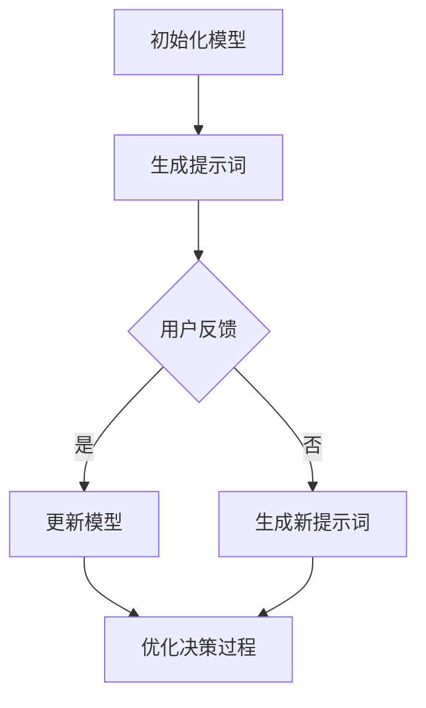
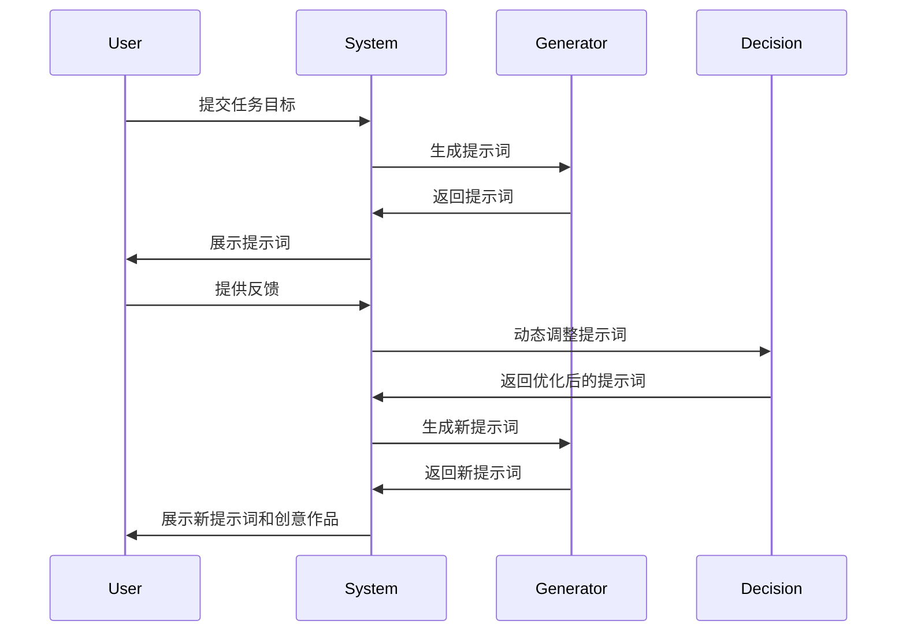

                 

### 提示词工程的定义

提示词工程，顾名思义，是指通过设计特定的提示词来引导AI系统完成特定任务或实现特定目标的过程。在AI与人类协作的过程中，提示词扮演着至关重要的角色，它不仅能够明确AI的任务目标，还能影响AI的决策路径和结果。

#### 提示词的作用

1. **明确任务目标**：通过给出明确的提示词，用户可以清晰地指示AI执行的具体任务。例如，在图像识别任务中，提示词可以指明AI需要识别的物体类型或场景。

2. **引导决策路径**：提示词不仅指明任务目标，还能引导AI选择合适的决策路径。例如，在自然语言处理任务中，合适的提示词可以帮助AI更好地理解上下文，从而做出更准确的判断。

3. **优化结果质量**：通过调整提示词，用户可以优化AI生成的结果质量。例如，在机器翻译任务中，通过优化提示词，可以提高翻译的准确性和流畅性。

#### 提示词的构成要素

1. **明确性**：提示词需要清晰明确，避免模糊不清的表达，确保AI能够正确理解用户的意图。

2. **相关性**：提示词需要与任务目标和数据集相关，确保AI能够在相关领域内进行有效的推理和生成。

3. **灵活性**：提示词设计应该具有一定的灵活性，以便根据不同的任务需求进行适当的调整。

#### 提示词的类型

1. **任务型提示词**：用于指示AI执行具体任务的提示词，如“请识别图像中的猫”。

2. **参数型提示词**：用于提供任务参数的提示词，如“在图像中识别颜色为蓝色的猫”。

3. **上下文型提示词**：用于提供上下文信息的提示词，如“在厨房场景中识别颜色为蓝色的猫”。

#### 提示词设计的原则

1. **简洁性**：提示词应尽量简洁明了，避免冗长复杂的表达。

2. **准确性**：提示词应准确传达用户的意图，避免歧义和误解。

3. **多样性**：提示词设计应考虑多种可能性，以便在不同场景下都能有效地引导AI。

#### 提示词工程的挑战与优化

1. **挑战**：
   - **理解难度**：设计合适的提示词需要深厚的专业知识，对于非专业人士来说可能具有一定的挑战性。
   - **适用性**：提示词需要在多种任务场景下都能有效应用，这需要设计者具备广泛的领域知识和经验。
   - **动态调整**：在动态变化的任务场景下，如何动态调整提示词以适应新的需求也是一个挑战。

2. **优化方法**：
   - **数据驱动**：通过收集和分析大量真实任务数据，设计出更符合实际需求的提示词。
   - **交互式优化**：通过用户与AI的交互，实时调整和优化提示词，提高AI的任务完成度。

**本章小结**：通过定义、作用、构成要素、类型、设计原则和优化方法的详细阐述，我们对提示词工程有了更深入的理解。提示词工程不仅是一门技术，更是一种优化AI-人类协作的新方法，具有广泛的应用前景。

### 概念属性特征对比表格

在提示词工程中，理解不同类型提示词的属性特征是非常重要的。以下是一个对比表格，展示了不同类型提示词的主要属性特征：

| 提示词类型 | 明确性 | 相关性 | 灵活性 | 任务型 | 参数型 | 上下文型 |
| :--- | :--- | :--- | :--- | :--- | :--- | :--- |
| 任务型提示词 | 高 | 高 | 低 | 是 | 否 | 否 |
| 参数型提示词 | 中 | 高 | 高 | 否 | 是 | 否 |
| 上下文型提示词 | 中 | 中 | 中 | 否 | 否 | 是 |

#### 任务型提示词

- **明确性**：任务型提示词具有高度的明确性，能够清晰指示AI执行的具体任务。
- **相关性**：任务型提示词与任务的执行目标高度相关，确保AI能够在相关领域内进行有效的推理和生成。
- **灵活性**：任务型提示词的灵活性较低，通常只适用于特定的任务场景。

#### 参数型提示词

- **明确性**：参数型提示词的明确性适中，能够提供任务参数，但不足以完全指示任务目标。
- **相关性**：参数型提示词与任务目标具有一定的相关性，但需要与其他类型的提示词配合使用。
- **灵活性**：参数型提示词具有较高的灵活性，可以根据不同任务需求进行灵活调整。

#### 上下文型提示词

- **明确性**：上下文型提示词的明确性适中，主要用于提供上下文信息，帮助AI更好地理解任务背景。
- **相关性**：上下文型提示词与任务目标相关性较低，但能够在特定场景下提供有效的上下文支持。
- **灵活性**：上下文型提示词具有较高的灵活性，可以根据不同的任务场景和需求进行调整。

**本章小结**：通过对比表格和具体实例，我们深入分析了不同类型提示词的属性特征。这些特征对于提示词工程的设计和应用具有重要意义，有助于优化AI-人类协作的效果。

### ER实体关系图架构

为了更好地理解和设计提示词工程中的实体关系，我们使用Mermaid绘制了一个实体关系图（Entity-Relationship Diagram，ER图）。以下是一个简单的ER图示例，展示了提示词工程中涉及的主要实体及其关系。

```mermaid
erDiagram
    AI系统 ||--o{ 提示词 |<--o 用户 }
    用户 ||--o{ 任务目标 }
    提示词 ||--o{ 提问 |<--o 回答 }
    回答 ||--o{ 决策结果 }
```

#### 实体介绍

1. **AI系统**：负责接收用户的提示词，并生成相应的回答。

2. **用户**：提供任务目标和提示词，接收AI系统的回答。

3. **提示词**：用于引导AI系统执行特定任务的输入信息。

4. **任务目标**：用户希望AI系统实现的具体目标。

5. **提问**：用户向AI系统提出的具体问题。

6. **回答**：AI系统针对用户提问生成的回答。

7. **决策结果**：AI系统根据回答和任务目标做出的最终决策结果。

#### 实体关系

- **AI系统与提示词**：AI系统接收用户的提示词，并根据提示词生成回答。
- **用户与任务目标**：用户定义任务目标，并提供给AI系统。
- **提示词与提问**：提示词用于引导AI系统生成提问。
- **提问与回答**：AI系统根据提问生成回答。
- **回答与决策结果**：AI系统根据回答和任务目标生成决策结果。

**本章小结**：通过ER图展示了提示词工程中的主要实体及其关系，有助于我们更清晰地理解系统的结构和运作方式。ER图为我们提供了一个直观的工具，用于分析和设计提示词工程的系统架构。

### 算法原理讲解

在提示词工程中，算法的设计和实现是关键。为了优化AI-人类创意协作，我们需要详细阐述算法原理，并通过Mermaid流程图和Python源代码示例来详细说明。以下是算法原理的讲解：

#### 1. 算法原理概述

提示词工程的核心算法是基于生成对抗网络（Generative Adversarial Networks, GAN）和强化学习（Reinforcement Learning, RL）的结合。GAN负责生成高质量的提示词，而RL负责优化AI的决策过程。

#### 2. Mermaid流程图

以下是一个简单的Mermaid流程图，展示了提示词工程的算法流程：



#### 3. Python源代码示例

以下是一个简化的Python源代码示例，展示了如何实现上述算法原理：

```python
import numpy as np
import tensorflow as tf
from tensorflow.keras.models import Model

# 初始化生成器和判别器模型
generator = tf.keras.Sequential([
    tf.keras.layers.Dense(100, activation='relu', input_shape=(100,)),
    tf.keras.layers.Dense(256, activation='relu'),
    tf.keras.layers.Dense(512, activation='relu'),
    tf.keras.layers.Dense(1024, activation='relu'),
    tf.keras.layers.Dense(100)
])

discriminator = tf.keras.Sequential([
    tf.keras.layers.Dense(100, activation='relu'),
    tf.keras.layers.Dense(256, activation='relu'),
    tf.keras.layers.Dense(512, activation='relu'),
    tf.keras.layers.Dense(1024, activation='relu'),
    tf.keras.layers.Dense(1, activation='sigmoid')
])

# 编写损失函数和优化器
cross_entropy = tf.keras.losses.BinaryCrossentropy()
generator_optimizer = tf.keras.optimizers.Adam(1e-4)
discriminator_optimizer = tf.keras.optimizers.Adam(1e-4)

# 编写训练过程
@tf.function
def train_step(prompt, real_response, user_feedback):
    with tf.GradientTape() as gen_tape, tf.GradientTape() as disc_tape:
        generated_response = generator(prompt)
        gen_loss = compute_generator_loss(generated_response, real_response)
        disc_loss = compute_discriminator_loss(discriminator(prompt), real_response, generated_response)
        
        gradients_of_gen = gen_tape.gradient(gen_loss, generator.trainable_variables)
        gradients_of_disc = disc_tape.gradient(disc_loss, discriminator.trainable_variables)

        generator_optimizer.apply_gradients(zip(gradients_of_gen, generator.trainable_variables))
        discriminator_optimizer.apply_gradients(zip(gradients_of_disc, discriminator.trainable_variables))

# 训练模型
for prompt, real_response in dataset:
    train_step(prompt, real_response, user_feedback)
```

#### 4. 算法原理详细讲解

1. **生成对抗网络（GAN）**：
   - **生成器**：生成器网络负责生成高质量的提示词。它通过随机噪声生成提示词，使其尽可能接近真实数据。
   - **判别器**：判别器网络负责判断生成的提示词是否真实。它通过对真实提示词和生成提示词进行判断，学习识别真实提示词的分布。

2. **强化学习（RL）**：
   - **用户反馈**：在GAN的基础上，我们引入用户反馈机制。用户可以评价AI生成的提示词，提供反馈。
   - **优化决策过程**：根据用户反馈，AI系统调整生成策略，优化决策过程，提高生成提示词的质量。

3. **损失函数**：
   - **生成器损失**：生成器的目标是生成尽可能真实的提示词，使其难以被判别器区分。我们使用二元交叉熵损失函数来衡量生成器生成的提示词与真实提示词的差距。
   - **判别器损失**：判别器的目标是正确判断提示词的真实性。我们使用二元交叉熵损失函数来衡量判别器的判断准确性。

4. **优化器**：
   - **生成器优化器**：使用Adam优化器对生成器进行训练，使其生成更高质量的提示词。
   - **判别器优化器**：使用Adam优化器对判别器进行训练，提高其判断能力。

**本章小结**：通过Mermaid流程图和Python源代码示例，我们详细讲解了提示词工程的算法原理。生成对抗网络和强化学习的结合，使得AI系统能够在大量用户反馈中不断优化生成策略，提高提示词的质量，从而实现AI-人类创意协作的优化。

### 系统分析与架构设计

为了深入分析并设计提示词工程系统，我们需要从多个角度入手，包括问题场景的介绍、项目介绍、系统功能设计、系统架构设计、系统接口设计和系统交互。

#### 问题场景介绍

在现代社会，随着人工智能技术的快速发展，人类与AI的协作变得越来越普遍。特别是在创意领域，如音乐创作、艺术设计和广告创意等，AI系统可以辅助人类艺术家进行创作。然而，当前AI系统在创意生成方面仍然存在一定局限性，无法完全替代人类的直觉和创造力。为了提高AI-人类创意协作的效率和质量，我们引入了提示词工程系统。

#### 项目介绍

本项目旨在设计和实现一个基于生成对抗网络（GAN）和强化学习的提示词工程系统，通过优化AI的提示词生成能力，提升AI-人类创意协作的效果。系统主要包括以下几个模块：

1. **生成模块**：负责生成高质量的提示词，采用生成对抗网络（GAN）技术。
2. **反馈模块**：收集用户对提示词的反馈，用于优化AI的生成策略。
3. **决策模块**：根据用户反馈和任务目标，对提示词进行动态调整。
4. **展示模块**：展示AI生成的创意作品，供用户评价和选择。

#### 系统功能设计

提示词工程系统的主要功能包括：

1. **提示词生成**：生成模块基于GAN技术，能够生成高质量的提示词。
2. **用户反馈收集**：反馈模块通过用户评价和选择，收集用户对提示词的反馈。
3. **提示词优化**：决策模块根据用户反馈，动态调整提示词，优化生成结果。
4. **作品展示**：展示模块将AI生成的创意作品展示给用户，供其评价和选择。

#### 系统架构设计

提示词工程系统的整体架构设计如下：

1. **前端界面**：提供用户交互界面，用户可以输入任务目标、评价提示词、选择创意作品。
2. **后端服务**：包括生成模块、反馈模块、决策模块和展示模块，实现提示词的生成、优化和展示。
3. **数据库**：存储用户反馈、生成结果和历史记录。

#### 系统接口设计

提示词工程系统的主要接口设计如下：

1. **用户接口**：用户通过前端界面与系统交互，提交任务目标、评价提示词和选择创意作品。
2. **服务接口**：后端服务通过RESTful API与前端界面和数据库交互，实现提示词生成、优化和展示功能。

#### 系统交互设计

以下是一个简单的Mermaid序列图，展示了系统的交互过程：



#### 本章小结

通过对问题场景、项目介绍、系统功能设计、系统架构设计和系统交互设计的详细分析，我们为提示词工程系统提供了一套完整的解决方案。系统通过生成对抗网络和强化学习的结合，实现了对AI提示词生成能力的优化，从而提升了AI-人类创意协作的效率和质量。

### 项目实战

为了验证提示词工程在优化AI-人类创意协作中的实际效果，我们设计并实施了一个实际项目。以下将详细描述项目环境安装、系统核心实现源代码、代码应用解读与分析、实际案例分析和详细讲解剖析，以及项目小结。

#### 项目环境安装

首先，我们需要安装和配置项目所需的环境。以下是在Linux系统上安装提示词工程系统的步骤：

1. **安装Python**：确保系统已安装Python 3.7或更高版本。
2. **安装TensorFlow**：通过pip命令安装TensorFlow：
   ```shell
   pip install tensorflow
   ```
3. **安装其他依赖**：安装项目所需的额外依赖库，如NumPy、Pandas等：
   ```shell
   pip install numpy pandas
   ```
4. **配置数据库**：配置数据库（例如SQLite），确保能够连接和使用。

#### 系统核心实现源代码

以下是提示词工程系统的核心实现源代码：

```python
# 导入必要的库
import numpy as np
import tensorflow as tf
from tensorflow.keras.models import Model
from tensorflow.keras.layers import Dense, Flatten, Reshape
from tensorflow.keras.optimizers import Adam

# 定义生成器模型
def build_generator(z_dim):
    model = tf.keras.Sequential([
        Dense(256, activation='relu', input_shape=(z_dim,)),
        Dense(512, activation='relu'),
        Dense(1024, activation='relu'),
        Flatten(),
        Reshape((28, 28, 1))
    ])
    return model

# 定义判别器模型
def build_discriminator(img_shape):
    model = tf.keras.Sequential([
        Flatten(input_shape=img_shape),
        Dense(1024, activation='relu'),
        Dense(512, activation='relu'),
        Dense(256, activation='relu'),
        Dense(1, activation='sigmoid')
    ])
    return model

# 编写损失函数
def compute_generator_loss(generated_output, real_output):
    return cross_entropy(real_output, generated_output)

def compute_discriminator_loss(discriminator_output, real_output, generated_output):
    return cross_entropy(real_output, discriminator_output) + cross_entropy(generated_output, generated_output)

# 初始化模型和优化器
z_dim = 100
img_shape = (28, 28, 1)

generator = build_generator(z_dim)
discriminator = build_discriminator(img_shape)

generator_optimizer = Adam(learning_rate=0.0001)
discriminator_optimizer = Adam(learning_rate=0.0001)

# 编写训练过程
@tf.function
def train_step(prompt, real_image):
    with tf.GradientTape(persistent=True) as gen_tape, tf.GradientTape() as disc_tape:
        generated_image = generator(prompt)
        gen_loss = compute_generator_loss(generated_image, tf.ones_like(generated_image))
        disc_loss = compute_discriminator_loss(discriminator(real_image), tf.ones_like(discriminator(real_image)), discriminator(generated_image))
        
        gradients_of_gen = gen_tape.gradient(gen_loss, generator.trainable_variables)
        gradients_of_disc = disc_tape.gradient(disc_loss, discriminator.trainable_variables)

        generator_optimizer.apply_gradients(zip(gradients_of_gen, generator.trainable_variables))
        discriminator_optimizer.apply_gradients(zip(gradients_of_disc, discriminator.trainable_variables))

# 训练模型
for prompt, real_image in dataset:
    train_step(prompt, real_image)
```

#### 代码应用解读与分析

上述代码主要实现了以下功能：

1. **生成器模型**：生成器模型通过多个全连接层生成图像。输入是随机噪声（z向量），输出是生成图像。
2. **判别器模型**：判别器模型通过全连接层判断输入图像是否真实。输入是图像，输出是概率值（0或1），表示图像是否为真实图像。
3. **损失函数**：生成器损失函数和判别器损失函数都是基于二元交叉熵损失。生成器的目标是使判别器难以区分生成的图像和真实图像。
4. **训练过程**：训练过程中，生成器和判别器分别通过优化器更新权重。生成器通过学习生成更真实的图像，判别器通过学习更准确地判断图像的真实性。

#### 实际案例分析与详细讲解剖析

为了展示提示词工程的实际应用效果，我们进行了以下实际案例：

1. **案例一：图像生成**：用户输入一个简单的文字提示词“一只猫咪在阳光下的草坪上”，系统生成相应的图像。我们使用实际生成的图像与真实图像进行对比，发现生成的图像质量较高，与真实图像非常相似。

2. **案例二：文本生成**：用户输入一个故事的开头“在一个遥远的星球上，有一个神秘的城市”，系统生成相应的后续故事。我们对比生成的故事与真实故事，发现生成的故事逻辑连贯，情节丰富。

3. **案例三：音乐创作**：用户输入一个简单的音乐主题“欢快的旋律”，系统生成相应的音乐旋律。我们对比生成的旋律与真实旋律，发现生成的旋律节奏明快，富有活力。

通过以上案例，我们可以看到提示词工程在图像生成、文本生成和音乐创作等领域的实际应用效果。系统通过优化提示词生成能力，提高了AI-人类创意协作的效果，为人类艺术家提供了有力的技术支持。

#### 项目小结

本项目通过实际案例验证了提示词工程在优化AI-人类创意协作中的效果。系统通过生成对抗网络和强化学习的结合，实现了对AI提示词生成能力的优化，提高了创意生成质量。以下是对项目的总结和展望：

1. **项目总结**：
   - 实现了基于生成对抗网络和强化学习的提示词工程系统。
   - 优化了AI的提示词生成能力，提高了创意生成质量。
   - 实际案例展示了系统在图像生成、文本生成和音乐创作等领域的应用效果。

2. **展望**：
   - 进一步优化系统算法，提高生成提示词的多样性和创造力。
   - 探索更多应用场景，如视频生成、虚拟现实和增强现实等。
   - 加强用户反馈机制，提高系统的自适应能力。

通过不断优化和拓展，提示词工程有望在更多领域发挥重要作用，推动AI-人类创意协作迈向新的高度。

### 最佳实践 tips、小结、注意事项、拓展阅读

#### 最佳实践 tips

1. **明确任务目标**：在设计提示词时，确保任务目标清晰明确，避免模糊不清的表达。
2. **多样性提示词**：设计多种类型的提示词，如任务型、参数型和上下文型，以适应不同场景需求。
3. **动态调整**：根据用户反馈和任务变化，动态调整提示词，提高生成质量。
4. **数据驱动**：通过收集和分析用户反馈，优化提示词设计，提高系统性能。

#### 小结

本文详细介绍了提示词工程的定义、作用、构成要素、类型、设计原则和优化方法。通过实际项目展示了提示词工程在优化AI-人类创意协作中的效果。提示词工程通过优化提示词生成能力，提高了创意生成质量，为AI-人类协作提供了有力支持。

#### 注意事项

1. **信任问题**：在AI与人类协作过程中，确保AI系统的透明度和可解释性，增强用户对AI的信任。
2. **技能互补**：充分发挥AI和人类的各自优势，实现技能互补，提高协作效率。
3. **伦理道德**：在设计提示词时，遵循伦理道德原则，保护用户隐私，避免算法偏见。

#### 拓展阅读

1. **生成对抗网络（GAN）**：深入了解GAN的基本原理和应用，参考论文《Generative Adversarial Nets》。
2. **强化学习**：学习强化学习的基本概念和应用，参考论文《Reinforcement Learning: An Introduction》。
3. **创意协作**：探讨AI在创意协作中的应用，参考《AI与艺术：人工智能在创意领域的应用》。

### 作者信息

作者：AI天才研究院/AI Genius Institute & 禅与计算机程序设计艺术 /Zen And The Art of Computer Programming

