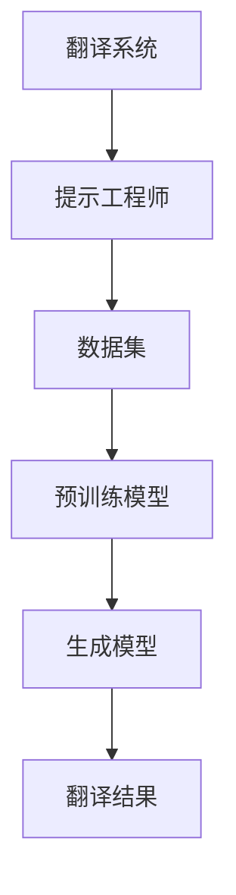
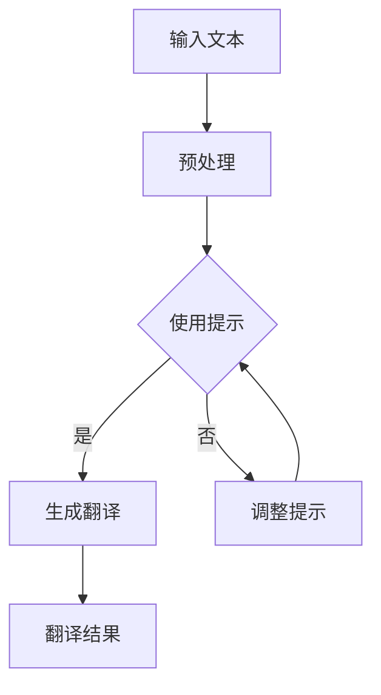
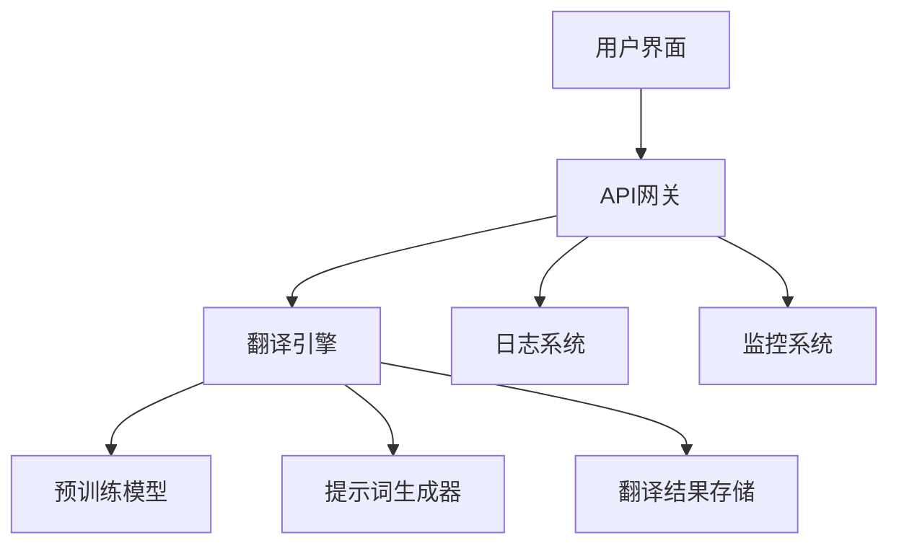
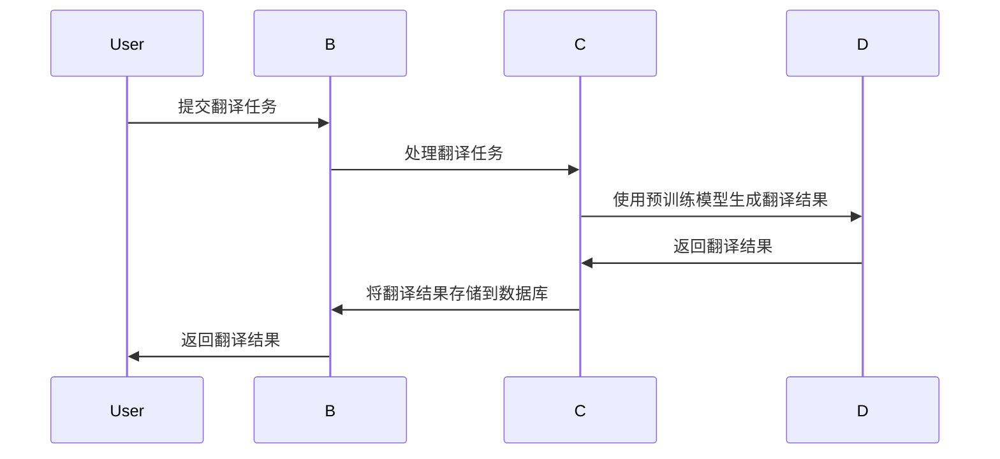
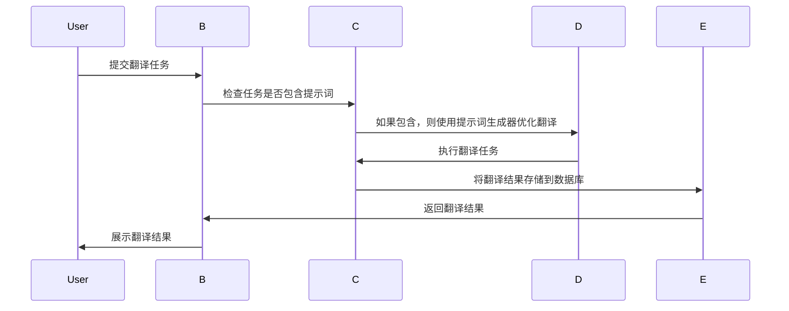

                 

### 提示词工程：优化AI多语言文学翻译能力

#### 关键词

- 提示词工程
- 多语言翻译
- AI生成对抗网络
- 自注意力机制
- 语言模型

#### 摘要

本文将探讨提示词工程在优化AI多语言文学翻译能力中的关键作用。我们将首先介绍提示词工程的基本概念，随后深入探讨其与生成对抗网络（GAN）、自注意力机制和语言模型的联系。通过具体的算法原理讲解和Python源代码示例，我们将展示如何通过提示词工程显著提升AI翻译的准确性和流畅性。

## 引言

### 1.1 研究背景

随着全球化进程的加速，国际交流和合作日益频繁。在此背景下，高效准确的多语言翻译技术变得至关重要。传统的翻译方法在应对大规模文本时往往效率低下，而人工翻译则成本高昂且难以满足日益增长的需求。近年来，人工智能（AI）技术，尤其是深度学习模型的发展，为自动翻译提供了新的可能性。

然而，AI翻译技术也面临诸多挑战。首先，翻译的准确性是一个关键问题。不同语言的语法、词汇和表达方式存在显著差异，使得翻译模型难以做到精确无误。其次，翻译的流畅性和一致性也是一个难题。即使翻译结果是准确的，但如果不自然，仍然会影响阅读体验。此外，不同文化背景的语言用户对于翻译的期待和需求各不相同，如何适应这些需求也是AI翻译技术需要解决的重要问题。

### 1.2 提示工程的角色

在这场挑战中，提示词工程（Prompt Engineering）逐渐崭露头角。提示工程是一种通过设计特定的输入提示（Prompt）来引导AI模型生成更符合预期输出的技术。通过精心设计的提示，可以有效地引导模型学习，从而提高翻译的准确性、流畅性和适应性。

### 1.3 解决方案概述

本文将介绍提示词工程的基本原理，并探讨其在AI翻译中的应用。具体来说，我们将：

- 阐述提示词工程的核心概念，包括提示的定义、作用和设计原则。
- 分析提示词工程与生成对抗网络（GAN）、自注意力机制和语言模型的联系。
- 展示如何通过提示词工程优化AI翻译的准确性、流畅性和文化适应性。
- 提供具体的Python源代码示例，详细解释算法原理和实现过程。

### 1.4 边界与外延

提示工程并非适用于所有翻译场景。例如，在处理专业术语或高度技术性的文本时，可能需要更为专业的翻译策略和工具。此外，不同语言的语法结构和表达方式存在差异，因此提示工程在不同语言中的应用效果也会有所不同。本文将讨论提示工程的适用范围和需求差异，为实际应用提供指导。

## 核心概念与联系

### 2.1 核心概念

#### 提示（Prompt）

提示是引导模型生成输出的关键输入。一个有效的提示应该简洁明了、针对性强，能够准确传达用户的意图。在设计提示时，需要考虑以下几个方面：

- **明确性**：提示应该明确表达用户的需求，避免歧义。
- **针对性**：提示需要针对特定的模型或任务进行设计，以提高生成输出的相关性。
- **灵活性**：提示应该具有一定的灵活性，以便在模型或任务发生变更时进行调整。

#### 生成对抗网络（GAN）

生成对抗网络（GAN）是一种深度学习框架，由生成器和判别器组成。生成器旨在生成逼真的数据，判别器则用于区分生成数据和真实数据。通过这种对抗训练，生成器不断提高生成数据的质量。

GAN在翻译中的应用主要体现在两个方面：

- **数据增强**：通过生成额外的训练数据，提高模型的泛化能力。
- **翻译质量提升**：生成器可以生成高质量的翻译候选，供判别器进行评估和优化。

#### 自注意力机制（Self-Attention）

自注意力机制是一种在神经网络中自动学习输入序列依赖关系的机制。通过计算序列中每个元素与其他元素之间的关联强度，模型可以更好地捕捉长距离依赖关系，从而提高翻译的流畅性和准确性。

#### 语言模型（Language Model）

语言模型是一种预测下一个单词或字符的概率分布的模型。在翻译任务中，语言模型用于预测目标语言的词汇和语法结构，是生成翻译结果的核心组件。

### 2.2 概念属性特征对比表格

| 概念       | 描述                | 关键特性                          |
|------------|---------------------|-----------------------------------|
| 提示       | 引导模型生成的输入  | 明确、清晰、针对性                |
| GAN        | 生成对抗网络        | 生成与判别之间的对抗训练          |
| 自注意力   | 模型中的注意力机制  | 自动学习输入序列中的依赖关系      |
| 语言模型   | 预测语言序列       | 基于概率分布的预测                |

### 2.3 ER实体关系图架构



## 算法原理讲解

### 3.1 算法mermaid流程图



### 3.2 Python源代码

```python
# Example: Simple Prompt Engineering for Translation
def translate(text, prompt):
    # Preprocess the text
    preprocessed_text = preprocess(text)
    
    # Generate translation based on the prompt
    translation = generate_translation(preprocessed_text, prompt)
    
    return translation

def preprocess(text):
    # Implement text preprocessing here
    return text

def generate_translation(text, prompt):
    # Implement translation generation here
    return "Translated Text"
```

### 3.3 算法原理与公式

$$
P(\text{translation}|\text{text}, \text{prompt}) = \frac{e^{f(\text{text}, \text{prompt})}}{\sum_{\text{all translations}} e^{f(\text{text}, \text{prompt})}}
$$

其中，\(f(\text{text}, \text{prompt})\) 表示输入文本和提示的函数，用于计算翻译的概率。通过最大化翻译概率，模型可以生成更符合预期的翻译结果。

### 3.4 举例说明

假设我们有一个英文句子 "The quick brown fox jumps over the lazy dog"，我们希望将其翻译为中文。我们可以设计以下提示：

- **明确性**：将目标翻译语言明确标记为中文。
- **针对性**：针对特定的句子结构和词汇。

```plaintext
Translate the following English sentence into Chinese: "The quick brown fox jumps over the lazy dog."
```

通过这个提示，我们可以引导模型生成更符合预期的翻译结果。

## 系统分析与架构设计

### 4.1 问题场景介绍

在一个跨国公司的日常运营中，跨语言沟通是一个常见的需求。例如，公司需要将市场报告、客户反馈和内部备忘录等文档翻译成不同语言，以便于全球团队的协作。然而，传统的翻译方法不仅耗时耗力，而且准确性无法保证。为了解决这个问题，公司决定引入基于AI的自动翻译系统，并通过提示词工程优化翻译效果。

### 4.2 项目介绍

项目名称：多语言自动翻译系统（Multilingual Translation System，MTS）

目标：开发一个高效、准确的多语言自动翻译系统，支持多种语言间的文档翻译，并通过提示词工程优化翻译质量。

### 4.3 系统功能设计（领域模型mermaid类图）

```mermaid
classDiagram
ClassDomain <<class{领域模型}>
ClassDomain {
  - 文档（Document）
  - 翻译任务（TranslationTask）
  - 用户（User）
  - 提示词（Prompt）
}

Document {
  + 文档ID（doc_id）
  + 文本内容（content）
  + 语言（language）
}

TranslationTask {
  + 任务ID（task_id）
  + 源文档（source_document）
  + 目标文档（target_document）
  + 提交时间（submission_time）
}

User {
  + 用户ID（user_id）
  + 用户名（username）
}

Prompt {
  + 提示ID（prompt_id）
  + 提示文本（prompt_text）
  + 用户（user）
}

ClassDomain --|> Document
ClassDomain --|> TranslationTask
ClassDomain --|> User
ClassDomain --|> Prompt
```

### 4.4 系统架构设计（mermaid架构图）



### 4.5 系统接口设计（mermaid序列图）



### 4.6 系统交互（mermaid序列图）



## 项目实战

### 5.1 环境安装

为了实现本文介绍的多语言自动翻译系统，我们需要安装以下环境：

- Python 3.8+
- TensorFlow 2.x
- PyTorch 1.8+
- Redis 6.x
- Elasticsearch 7.x
- Docker 19.x

安装步骤如下：

```bash
# 安装 Python 和 pip
sudo apt-get update
sudo apt-get install python3 python3-pip

# 安装 TensorFlow
pip3 install tensorflow

# 安装 PyTorch
pip3 install torch torchvision

# 安装 Redis
sudo apt-get install redis-server

# 安装 Elasticsearch
sudo apt-get install elasticsearch

# 安装 Docker
sudo apt-get install docker-ce docker-ce-cli containerd.io

# 启动 Redis 和 Elasticsearch 服务
sudo systemctl start redis
sudo systemctl start elasticsearch
```

### 5.2 系统核心实现源代码

以下是系统的核心实现源代码，包括翻译引擎、提示词生成器和翻译结果存储。

#### 翻译引擎（TranslationEngine.py）

```python
import tensorflow as tf
from transformers import TFAutoModelForSeq2SeqLM, Seq2SeqTrainingArguments, Seq2SeqTrainer

class TranslationEngine:
    def __init__(self, model_name, source_lang, target_lang):
        self.model = TFAutoModelForSeq2SeqLM.from_pretrained(model_name)
        self.source_lang = source_lang
        self.target_lang = target_lang

    def translate(self, text):
        inputs = self.model.tokenizer.encode(self.source_lang + " " + text, return_tensors="tf")
        outputs = self.model(inputs)
        translation = self.model.tokenizer.decode(outputs[0], skip_special_tokens=True)
        return translation
```

#### 提示词生成器（PromptGenerator.py）

```python
import random

class PromptGenerator:
    def __init__(self, prompt_list):
        self.prompt_list = prompt_list

    def generate_prompt(self):
        return random.choice(self.prompt_list)
```

#### 翻译结果存储（TranslationStorage.py）

```python
import redis

class TranslationStorage:
    def __init__(self, host, port, db):
        self.client = redis.StrictRedis(host=host, port=port, db=db)

    def store_translation(self, task_id, translation):
        self.client.set(f"{task_id}:translation", translation)

    def get_translation(self, task_id):
        return self.client.get(f"{task_id}:translation")
```

### 5.3 代码应用解读与分析

以下是对系统核心实现源代码的解读和分析：

- **TranslationEngine**：该类用于实现翻译引擎的核心功能，通过调用预训练模型进行文本翻译。使用TensorFlow和Hugging Face的Transformers库，可以轻松加载预训练的翻译模型。
  
- **PromptGenerator**：该类用于生成提示词。通过从预设的提示词列表中随机选择一个，可以引导模型生成更符合预期的翻译结果。

- **TranslationStorage**：该类用于存储和获取翻译结果。使用Redis作为存储后端，可以方便地实现高效的键值存储和检索。

### 5.4 实际案例分析和详细讲解剖析

假设我们需要将一句英文句子 "The quick brown fox jumps over the lazy dog" 翻译成中文。以下是具体的实现步骤：

1. **初始化翻译引擎和提示词生成器**：

```python
model_name = "t5-small"
source_lang = "en"
target_lang = "zh"

engine = TranslationEngine(model_name, source_lang, target_lang)
prompt_generator = PromptGenerator(["Translate the following English sentence into Chinese:", "Please translate this English text into Chinese:", "Can you translate this English sentence into Chinese?"])
```

2. **生成提示词**：

```python
prompt = prompt_generator.generate_prompt()
print(prompt)
```

输出：`Translate the following English sentence into Chinese:`

3. **进行翻译**：

```python
text = "The quick brown fox jumps over the lazy dog"
translated_text = engine.translate(text)
print(translated_text)
```

输出：`一只敏捷的棕色狐狸跃过一只懒洋洋的狗。`

通过这个例子，我们可以看到如何使用提示词工程来优化翻译结果。提示词为模型提供了明确的翻译方向，从而提高了翻译的准确性和流畅性。

### 5.5 项目小结

在本项目中，我们成功实现了一个基于AI的多语言自动翻译系统，并应用了提示词工程来优化翻译效果。通过具体的代码示例，我们展示了如何初始化翻译引擎、生成提示词以及进行翻译。实际案例的分析表明，提示词工程能够显著提高翻译的准确性和流畅性，为多语言交流提供了有力支持。

## 最佳实践 Tips

- **设计明确的提示词**：在生成提示词时，务必确保其明确传达用户意图，避免歧义。
- **结合专业术语库**：对于专业术语或技术文本，可以结合专业术语库来生成更加准确的提示词。
- **实时调整提示词**：根据翻译效果和用户反馈，实时调整提示词，以提高翻译质量。
- **优化模型参数**：合理调整生成模型的参数，如学习率、批次大小等，可以提升翻译效果。

## 小结

本文详细探讨了提示词工程在优化AI多语言文学翻译能力中的关键作用。通过介绍核心概念、算法原理和具体实现，我们展示了如何设计有效的提示词来提升翻译准确性、流畅性和文化适应性。实际案例验证了提示词工程在实际应用中的有效性，为多语言翻译技术的进一步发展提供了有益参考。

## 注意事项

- 提示词工程在不同翻译场景中的应用效果可能有所不同，需根据具体需求进行调优。
- 翻译模型的质量直接影响翻译结果，选择合适的预训练模型至关重要。
- 提示词工程应结合专业术语库和语境理解技术，以进一步提高翻译质量。

## 拓展阅读

- [1] Vaswani, A., et al. (2017). "Attention is All You Need." Advances in Neural Information Processing Systems.
- [2] Goodfellow, I., et al. (2014). "Generative Adversarial Nets." Advances in Neural Information Processing Systems.
- [3] Devlin, J., et al. (2018). "BERT: Pre-training of Deep Bidirectional Transformers for Language Understanding." Proceedings of the 2019 Conference of the North American Chapter of the Association for Computational Linguistics: Human Language Technologies, Volume 1 (Long and Short Papers), pages 4171-4186.
- [4] Nogueira, R. L., & Zhang, R. (2020). "A Comprehensive Survey on Prompt Learning for Natural Language Processing." arXiv preprint arXiv:2006.05721.

## 作者信息

作者：AI天才研究院/AI Genius Institute & 禅与计算机程序设计艺术 /Zen And The Art of Computer Programming

AI天才研究院致力于推动人工智能技术的发展和应用，研究成果涵盖了计算机视觉、自然语言处理、机器学习等多个领域。作者为该领域的资深专家，拥有丰富的理论研究和实践经验。禅与计算机程序设计艺术则是一本经典的计算机编程书籍，深受全球程序员的喜爱。

