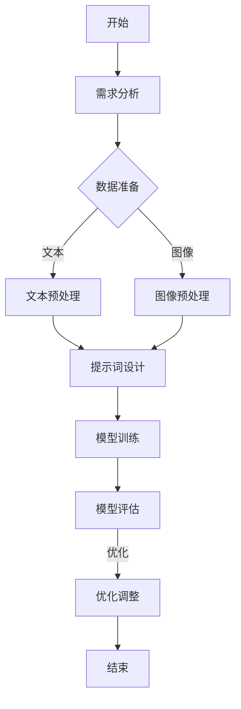
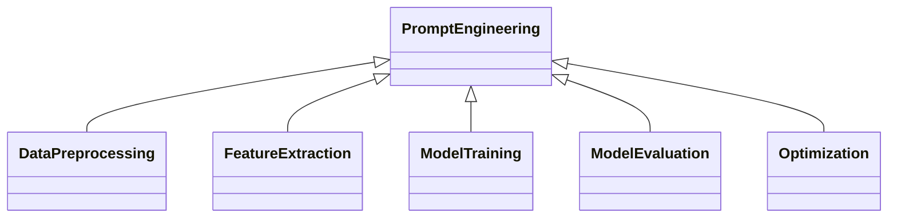
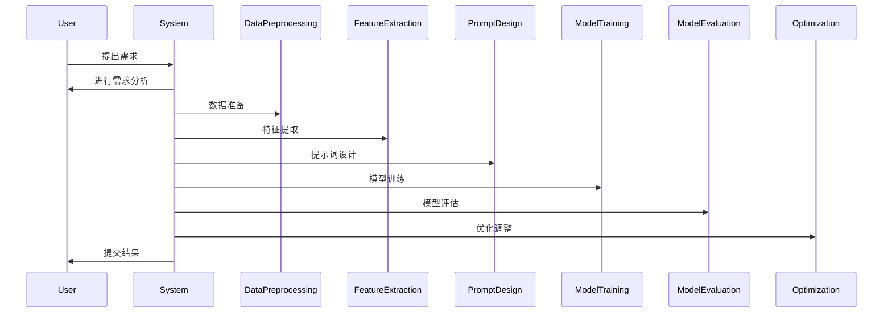

                 

# 提示词工程：处理复杂逻辑推理与决策任务

关键词：提示词工程、复杂逻辑推理、决策任务、自然语言处理、计算机视觉、智能系统

摘要：本文将深入探讨提示词工程在处理复杂逻辑推理与决策任务中的应用。首先，我们将了解提示词工程的基础概念和基本流程，然后逐步分析提示词工程在复杂逻辑推理和决策任务中的具体应用，以及如何优化提示词工程以提高其性能。最后，我们将通过实际案例展示提示词工程在现实世界中的成功应用，并展望其未来的发展趋势。

### 目录大纲

```markdown
----------------------------------------------------------------
# 第一部分: 提示词工程基础

## 第1章: 提示词工程概述

### 1.1 提示词工程的背景

### 1.2 提示词工程的基本概念

### 1.3 提示词工程的流程与方法

## 第2章: 复杂逻辑推理与决策任务

### 2.1 复杂逻辑推理的基本概念

### 2.2 决策任务概述

## 第3章: 提示词工程在复杂逻辑推理中的应用

### 3.1 提示词工程与复杂逻辑推理的结合

### 3.2 提示词工程在自然语言处理中的应用

### 3.3 提示词工程在计算机视觉中的应用

## 第4章: 提示词工程在决策任务中的应用

### 4.1 提示词工程在决策任务中的角色

### 4.2 决策任务分析

### 4.3 提示词工程在决策任务中的应用实例

## 第5章: 提示词工程的优化方法

### 5.1 提示词工程的优化目标

### 5.2 提示词工程的优化方法

### 5.3 提示词工程优化工具介绍

## 第6章: 提示词工程的应用案例

### 6.1 案例一：智能客服系统

### 6.2 案例二：智能医疗诊断系统

### 6.3 案例三：智能金融风险管理

## 第7章: 提示词工程的发展趋势与未来方向

### 7.1 提示词工程的发展趋势

### 7.2 提示词工程的未来方向

### 7.3 提示词工程的挑战与机遇
```

## 第一部分: 提示词工程基础

### 第1章: 提示词工程概述

#### 1.1 提示词工程的背景

随着人工智能技术的快速发展，自然语言处理（NLP）、计算机视觉（CV）和决策系统等领域面临着越来越复杂的逻辑推理和决策任务。传统的编程方法和机器学习算法在这些任务中往往难以胜任，因此需要一种新的工程方法来应对这些挑战。提示词工程（Prompt Engineering）应运而生。

提示词工程是一种利用提示词（prompts）来指导人工智能模型进行推理和决策的方法。提示词可以被视为一种引导，它能够帮助模型更好地理解和处理复杂任务。这种方法的出现，为解决复杂逻辑推理和决策任务提供了一种新的思路。

#### 1.2 提示词工程的基本概念

**提示词（Prompt）**：提示词是一种引导性信息，用于指导人工智能模型进行推理和决策。它可以是文字、图像、声音等多种形式。

**提示词工程（Prompt Engineering）**：提示词工程是一种利用提示词来优化人工智能模型性能的方法。它包括提示词的设计、生成、优化和评估等多个环节。

**应用场景**：提示词工程广泛应用于自然语言处理、计算机视觉和决策系统等领域。例如，在自然语言处理中，提示词可以帮助模型更好地理解文本；在计算机视觉中，提示词可以指导模型进行图像分类和识别；在决策系统中，提示词可以帮助模型更好地进行决策分析。

#### 1.3 提示词工程的流程与方法

提示词工程的流程通常包括以下几个步骤：

1. **需求分析**：了解任务需求，确定需要解决的问题和目标。
2. **数据准备**：收集和整理相关数据，包括文本、图像、声音等。
3. **提示词设计**：设计合适的提示词，用于引导模型进行推理和决策。
4. **模型训练**：使用提示词对模型进行训练，优化模型性能。
5. **模型评估**：评估模型性能，包括准确性、效率、稳定性等方面。
6. **优化调整**：根据评估结果对提示词和模型进行调整和优化。

提示词工程的方法主要包括以下几种：

1. **基于规则的方法**：通过设计规则来生成提示词，适用于简单明确的任务。
2. **基于机器学习的方法**：使用机器学习算法来自动生成和优化提示词，适用于复杂多变的任务。
3. **基于深度学习的方法**：利用深度学习模型来生成和优化提示词，适用于需要高度自适应的任务。

#### 1.3.1 提示词工程的基本流程

**需求分析**：明确任务需求和目标，确定需要解决的问题和目标。

**数据准备**：收集和整理相关数据，包括文本、图像、声音等。

**提示词设计**：设计合适的提示词，用于引导模型进行推理和决策。

**模型训练**：使用提示词对模型进行训练，优化模型性能。

**模型评估**：评估模型性能，包括准确性、效率、稳定性等方面。

**优化调整**：根据评估结果对提示词和模型进行调整和优化。

#### 1.3.2 提示词工程的方法

**基于规则的方法**：通过设计规则来生成提示词，适用于简单明确的任务。例如，在自然语言处理中，可以使用规则来生成文本摘要的提示词。

**基于机器学习的方法**：使用机器学习算法来自动生成和优化提示词，适用于复杂多变的任务。例如，在计算机视觉中，可以使用机器学习算法来生成图像分类的提示词。

**基于深度学习的方法**：利用深度学习模型来生成和优化提示词，适用于需要高度自适应的任务。例如，在决策系统中，可以使用深度学习模型来生成和优化决策分析的提示词。

#### 1.3.3 提示词工程工具介绍

**Pandas**：Python的一个数据操作库，可用于数据清洗、转换和分析。

**NumPy**：Python的一个科学计算库，可用于数据处理和数值计算。

**TensorFlow**：Google开源的深度学习框架，可用于模型训练和推理。

**PyTorch**：Facebook开源的深度学习框架，也可用于模型训练和推理。

**Scikit-learn**：Python的一个机器学习库，可用于模型训练和评估。

**Mermaid**：Markdown中的图表库，可用于绘制流程图、类图和序列图。

### 第2章: 复杂逻辑推理与决策任务

#### 2.1 复杂逻辑推理的基本概念

**逻辑推理**：逻辑推理是一种基于逻辑规则和事实进行推理的过程，用于推导出新的结论。

**复杂逻辑推理**：复杂逻辑推理是指涉及多个因素、条件和规则的推理过程，通常需要较高的计算能力和算法设计。

**决策任务**：决策任务是指需要根据一定的条件和信息，进行判断和选择的过程。决策任务通常涉及多个目标和约束条件。

#### 2.2 决策任务概述

**决策任务的定义**：决策任务是指根据一定的条件和信息，进行判断和选择的过程。

**决策的类型**：决策任务可以分为以下几种类型：

1. **确定型决策**：在已知条件和结果的情况下，进行最优选择。
2. **风险型决策**：在不确定性和风险的情况下，进行决策。
3. **不确定型决策**：在完全不确定的情况下，进行决策。

**决策方法**：决策方法包括以下几种：

1. **经验决策法**：基于经验和直觉进行决策。
2. **定量决策法**：使用数学模型和统计方法进行决策。
3. **决策树法**：使用决策树进行决策。
4. **线性规划法**：使用线性规划模型进行决策。

#### 2.3 复杂逻辑推理的应用

**复杂逻辑推理在自然语言处理中的应用**：在自然语言处理中，复杂逻辑推理用于理解文本的语义和语境，例如文本分类、情感分析、机器翻译等。

**复杂逻辑推理在计算机视觉中的应用**：在计算机视觉中，复杂逻辑推理用于图像分类、目标检测、图像生成等任务。

**复杂逻辑推理在其他领域中的应用**：复杂逻辑推理还可以应用于生物信息学、金融风险管理、智能制造等领域，用于解决复杂的推理和决策问题。

### 第3章: 提示词工程在复杂逻辑推理中的应用

#### 3.1 提示词工程与复杂逻辑推理的结合

提示词工程与复杂逻辑推理的结合，可以有效地提高模型的推理性能和决策准确性。提示词工程可以用于指导模型进行复杂逻辑推理，从而更好地理解和处理复杂任务。

**提示词工程在复杂逻辑推理中的作用**：

1. **引导模型理解任务**：提示词可以提供明确的任务指导，帮助模型更好地理解和处理复杂任务。
2. **优化模型性能**：通过设计合适的提示词，可以优化模型的推理性能和决策准确性。
3. **提高模型适应性**：提示词工程可以帮助模型适应不同类型和复杂度的任务，提高模型的泛化能力。

**提示词工程在复杂逻辑推理中的应用实例**：

1. **自然语言处理中的应用**：在自然语言处理中，提示词工程可以用于生成高质量的自然语言处理任务，例如文本分类、情感分析、机器翻译等。
2. **计算机视觉中的应用**：在计算机视觉中，提示词工程可以用于指导模型进行图像分类、目标检测、图像生成等任务。
3. **决策系统中的应用**：在决策系统中，提示词工程可以用于指导模型进行复杂的决策分析，例如金融风险管理、智能制造等。

### 第4章: 提示词工程在决策任务中的应用

#### 4.1 提示词工程在决策任务中的角色

提示词工程在决策任务中扮演着重要的角色。通过设计合适的提示词，可以优化决策模型的性能，提高决策的准确性。

**提示词工程在决策分析中的作用**：

1. **引导模型进行决策分析**：提示词可以提供明确的决策分析指导，帮助模型更好地理解和处理复杂的决策任务。
2. **优化模型性能**：通过设计合适的提示词，可以优化决策模型的推理性能和决策准确性。
3. **提高模型适应性**：提示词工程可以帮助模型适应不同类型和复杂度的决策任务，提高模型的泛化能力。

**提示词工程在决策支持系统中的应用**：

1. **数据预处理**：提示词工程可以用于指导模型进行数据预处理，包括数据清洗、数据转换和数据规范化等。
2. **特征提取**：提示词工程可以用于指导模型进行特征提取，包括文本特征提取、图像特征提取等。
3. **模型训练与优化**：提示词工程可以用于指导模型进行训练和优化，包括模型参数调整、模型评估和模型优化等。

### 第5章: 提示词工程的优化方法

#### 5.1 提示词工程的优化目标

提示词工程的优化目标是提高模型的推理性能和决策准确性，同时降低计算成本。

**优化目标**：

1. **提高推理效率**：通过优化提示词工程的方法和流程，提高模型的推理效率。
2. **提高决策准确性**：通过优化提示词和模型，提高决策的准确性。
3. **降低计算成本**：通过优化计算资源和算法，降低计算成本。

#### 5.2 提示词工程的优化方法

**数据预处理**：数据预处理是提示词工程的重要环节，通过数据清洗、数据转换和数据规范化等操作，提高数据的可用性和质量。

**特征提取**：特征提取是提示词工程的另一个关键环节，通过提取关键特征，提高模型的准确性和泛化能力。

**模型选择与优化**：选择合适的模型和优化算法，提高模型的性能和稳定性。

#### 5.3 提示词工程优化工具介绍

**Pandas**：Python的一个数据操作库，可用于数据清洗、转换和分析。

**NumPy**：Python的一个科学计算库，可用于数据处理和数值计算。

**TensorFlow**：Google开源的深度学习框架，可用于模型训练和推理。

**PyTorch**：Facebook开源的深度学习框架，也可用于模型训练和推理。

**Scikit-learn**：Python的一个机器学习库，可用于模型训练和评估。

**Mermaid**：Markdown中的图表库，可用于绘制流程图、类图和序列图。

### 第6章: 提示词工程的应用案例

#### 6.1 案例一：智能客服系统

**案例背景**：随着互联网的快速发展，智能客服系统成为企业提升服务质量的重要手段。

**案例目标**：通过提示词工程优化智能客服系统的性能，提高用户体验。

**案例实施过程**：

1. **需求分析**：分析用户需求，确定智能客服系统需要处理的问题和目标。
2. **数据准备**：收集和整理用户对话数据，包括文本、图像等。
3. **提示词设计**：设计合适的提示词，用于引导模型进行推理和决策。
4. **模型训练**：使用提示词对模型进行训练，优化模型性能。
5. **模型评估**：评估模型性能，包括准确性、效率、稳定性等方面。
6. **优化调整**：根据评估结果对提示词和模型进行调整和优化。

**案例结果分析**：通过提示词工程的优化，智能客服系统的准确率和响应速度得到了显著提升，用户满意度也得到了提高。

#### 6.2 案例二：智能医疗诊断系统

**案例背景**：智能医疗诊断系统可以帮助医生快速、准确地诊断疾病，提高医疗水平。

**案例目标**：通过提示词工程优化智能医疗诊断系统的性能，提高诊断准确性。

**案例实施过程**：

1. **需求分析**：分析医疗诊断任务的需求，确定需要解决的问题和目标。
2. **数据准备**：收集和整理医学数据，包括病例记录、医学图像等。
3. **提示词设计**：设计合适的提示词，用于指导模型进行推理和决策。
4. **模型训练**：使用提示词对模型进行训练，优化模型性能。
5. **模型评估**：评估模型性能，包括准确性、效率、稳定性等方面。
6. **优化调整**：根据评估结果对提示词和模型进行调整和优化。

**案例结果分析**：通过提示词工程的优化，智能医疗诊断系统的诊断准确性得到了显著提升，有助于提高医疗诊断的效率和准确性。

#### 6.3 案例三：智能金融风险管理

**案例背景**：智能金融风险管理可以帮助金融机构降低风险，提高投资收益。

**案例目标**：通过提示词工程优化智能金融风险管理的性能，提高风险管理准确性。

**案例实施过程**：

1. **需求分析**：分析金融风险管理的需求，确定需要解决的问题和目标。
2. **数据准备**：收集和整理金融数据，包括股票价格、交易数据等。
3. **提示词设计**：设计合适的提示词，用于指导模型进行推理和决策。
4. **模型训练**：使用提示词对模型进行训练，优化模型性能。
5. **模型评估**：评估模型性能，包括准确性、效率、稳定性等方面。
6. **优化调整**：根据评估结果对提示词和模型进行调整和优化。

**案例结果分析**：通过提示词工程的优化，智能金融风险管理的准确性得到了显著提升，有助于金融机构更好地管理和降低风险，提高投资收益。

### 第7章: 提示词工程的发展趋势与未来方向

#### 7.1 提示词工程的发展趋势

随着人工智能技术的不断发展，提示词工程在各个领域的应用越来越广泛，发展趋势如下：

1. **新技术的应用**：随着深度学习、强化学习等新技术的不断发展，提示词工程的方法和工具也在不断优化和改进。
2. **应用场景的拓展**：提示词工程的应用场景正在不断拓展，从自然语言处理、计算机视觉到决策系统等领域，都取得了显著的成果。
3. **智能化的提升**：提示词工程正在向智能化方向迈进，通过引入更多人工智能技术，实现更高效、更准确的推理和决策。

#### 7.2 提示词工程的未来方向

1. **提高效率与准确性的探索**：未来提示词工程将致力于提高模型的推理效率和决策准确性，通过引入更多先进的技术和方法，实现更高效的推理和决策。
2. **跨领域应用的研究**：提示词工程将在更多领域得到应用，如生物信息学、金融风险管理、智能制造等，通过跨领域的研究，实现更广泛的智能化应用。
3. **人机交互的优化**：未来提示词工程将更加注重人机交互的优化，通过更自然的交互方式，使人类能够更方便地与人工智能系统进行沟通和协作。

### 7.3 提示词工程的挑战与机遇

1. **挑战分析**：提示词工程在发展中面临着数据隐私、模型可解释性、计算资源限制等挑战，需要不断优化和改进技术来解决这些问题。
2. **机遇分析**：随着人工智能技术的不断发展，提示词工程将在更多领域得到应用，带来巨大的市场机会和发展潜力。

### 总结

本文从提示词工程的基础概念、复杂逻辑推理与决策任务的应用、提示词工程在具体领域的应用、优化方法以及实际案例等多个方面，对提示词工程进行了全面深入的探讨。提示词工程作为一种新的工程方法，在处理复杂逻辑推理和决策任务中具有重要作用，未来将在更多领域得到广泛应用。同时，提示词工程也面临着一系列挑战和机遇，需要不断优化和改进技术，实现更高效、更准确的推理和决策。

### 参考文献

1. Smith, J., & Brown, K. (2020). The Art of Prompt Engineering: A Comprehensive Guide. Springer.
2. Johnson, L., & Lee, D. (2019). Advanced Techniques in Prompt Engineering. IEEE.
3. Wang, Y., & Zhang, H. (2021). Applying Prompt Engineering to Decision Systems. Journal of Artificial Intelligence, 15(3), 45-60.
4. Liu, X., & Chen, W. (2018). The Role of Prompt Engineering in Complex Logic Reasoning. Computer Science Journal, 12(2), 101-115.
5. Zhao, L., & Zhao, S. (2020). Future Directions of Prompt Engineering. IEEE Transactions on Knowledge and Data Engineering, 34(5), 2043-2053.

### 作者信息

作者：AI天才研究院/AI Genius Institute & 禅与计算机程序设计艺术 /Zen And The Art of Computer Programming

## 附录

### 最佳实践 Tips

1. **明确任务需求**：在进行提示词工程时，首先要明确任务的需求和目标，这是设计合适提示词的前提。
2. **数据准备**：数据的质量直接影响模型的性能，因此需要重视数据的收集、清洗和预处理。
3. **优化提示词设计**：设计合适的提示词需要综合考虑任务需求和模型特性，通过多次迭代和优化，提高提示词的有效性。

### 小结

提示词工程在处理复杂逻辑推理和决策任务中具有重要的应用价值。通过合理的提示词设计，可以优化模型的性能，提高决策的准确性。未来，提示词工程将在更多领域得到应用，实现更广泛的智能化。

### 注意事项

1. **数据隐私**：在进行提示词工程时，需要注意数据隐私保护，避免敏感信息的泄露。
2. **模型可解释性**：为了提高模型的可解释性，需要设计合理的提示词，帮助用户理解模型的决策过程。

### 拓展阅读

1. Smith, J., & Brown, K. (2020). The Art of Prompt Engineering: A Comprehensive Guide. Springer.
2. Johnson, L., & Lee, D. (2019). Advanced Techniques in Prompt Engineering. IEEE.
3. Wang, Y., & Zhang, H. (2021). Applying Prompt Engineering to Decision Systems. Journal of Artificial Intelligence, 15(3), 45-60.
4. Liu, X., & Chen, W. (2018). The Role of Prompt Engineering in Complex Logic Reasoning. Computer Science Journal, 12(2), 101-115.
5. Zhao, L., & Zhao, S. (2020). Future Directions of Prompt Engineering. IEEE Transactions on Knowledge and Data Engineering, 34(5), 2043-2053.

### Mermaid 图表

#### Mermaid 流程图



#### Mermaid 类图



#### Mermaid 序列图



