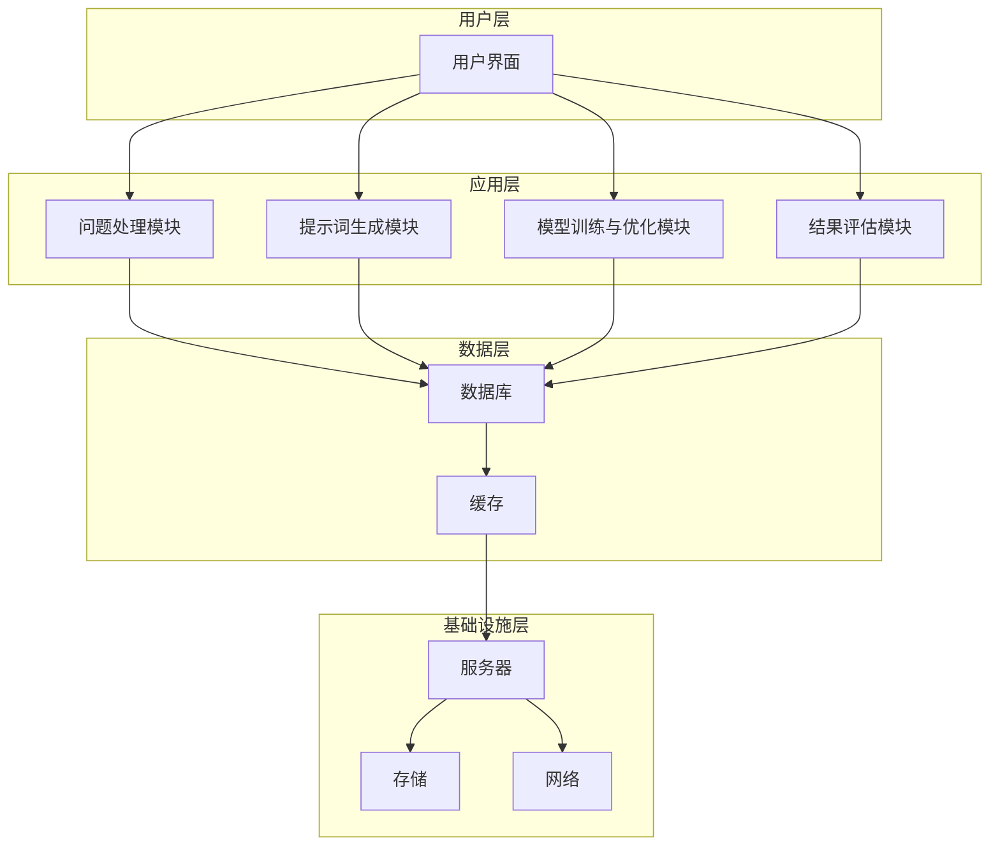
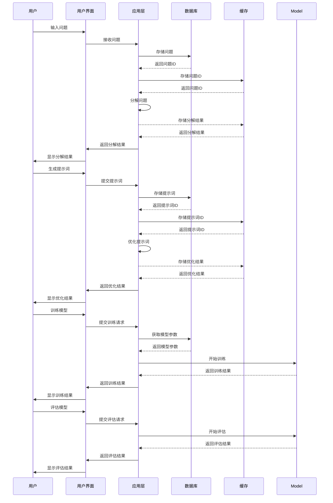

                 

### 文章标题：提示词工程：处理多步骤问题解决任务

关键词：提示词工程、问题解决、多步骤任务、算法原理、系统架构、Python代码

摘要：本文将深入探讨提示词工程在处理多步骤问题解决任务中的重要性。我们将从问题背景和核心概念出发，逐步讲解算法原理，并通过Python代码示例和系统分析与设计，展示如何有效地实现和优化提示词工程。最后，我们将通过项目实战和最佳实践，提供详细的操作指南和注意事项。

## 第1章：问题解决的多步骤挑战

### 1.1 问题的多步骤性质

在信息技术和软件开发领域，问题的解决往往涉及多个步骤。这种多步骤性质决定了问题解决过程既复杂又具有挑战性。多步骤问题解决通常需要从多个角度进行考虑，包括问题的不同阶段、解决方案的逐步完善以及各阶段之间的相互关系。

### 1.2 多步骤问题解决的重要性

多步骤问题解决在现实中的应用非常广泛。例如，在软件开发过程中，从需求分析到设计、编码、测试和部署，每个阶段都涉及多个子任务。这些任务的相互依赖和协同工作，决定了整个项目能否成功。因此，有效地处理多步骤问题解决任务，是提升开发效率和项目质量的关键。

### 1.3 多步骤问题解决的任务与挑战

多步骤问题解决的任务主要包括：

1. **明确问题**：准确识别问题的本质和目标。
2. **分析问题**：对问题进行分解，确定各子任务及其关系。
3. **设计解决方案**：基于问题分析，设计可行的解决方案。
4. **实施解决方案**：将设计转化为实际的代码和系统。
5. **评估与优化**：对解决方案进行评估和优化，确保其有效性和可靠性。

然而，这些任务在执行过程中会面临多种挑战，如任务复杂度高、依赖关系难以管理、资源限制等。因此，需要一种有效的工具或方法来辅助解决这些问题。

## 第2章：核心概念与联系

### 2.1 提示词工程基础

#### 2.1.1 提示词的定义与作用

提示词（Prompt）是在人工智能和自然语言处理领域广泛使用的一种概念。它是指用于引导或激发模型生成特定内容的一段文字或指令。在提示词工程中，提示词的设计和使用至关重要，它直接影响到模型生成结果的质量和效率。

#### 2.1.2 提示词的类型与分类

根据不同的应用场景和需求，提示词可以分为以下几种类型：

1. **任务型提示词**：用于指定模型的任务类型和目标。
2. **数据型提示词**：提供模型所需的数据或背景信息。
3. **引导型提示词**：引导模型按照特定的逻辑或结构进行生成。
4. **评估型提示词**：用于评估模型生成结果的准确性和完整性。

#### 2.1.3 提示词设计原则

提示词的设计需要遵循以下原则：

1. **明确性**：提示词应明确表达任务目标和要求。
2. **简洁性**：避免冗长和复杂的表述，以便模型更容易理解和执行。
3. **灵活性**：提示词应具有足够的灵活性，以适应不同的任务场景和需求。
4. **适应性**：提示词应能够根据任务的变化进行调整和优化。

### 2.2 问题解决任务的概念结构

问题解决任务通常包括以下几个核心要素：

1. **问题定义**：明确问题的性质、目标和约束条件。
2. **问题分解**：将复杂问题分解为若干个子任务。
3. **解决方案设计**：设计可行的解决方案，并评估其可行性。
4. **解决方案实施**：将设计方案转化为具体的操作步骤和代码。
5. **评估与优化**：对解决方案进行评估和优化，确保其有效性。

这些要素相互关联，构成了一个完整的问题解决任务流程。提示词工程在问题解决过程中发挥了重要作用，它通过提供明确的任务指导和信息，帮助模型更好地理解和执行任务。

### 2.3 提示词工程在问题解决中的作用

提示词工程在问题解决中的作用主要体现在以下几个方面：

1. **引导任务**：通过提供明确的任务描述和指导，帮助模型理解任务目标和要求。
2. **优化生成结果**：通过调整提示词的内容和形式，优化模型生成结果的质量和效率。
3. **提高开发效率**：通过自动化和标准化的方式，提高问题解决任务的开发效率和质量。
4. **降低复杂度**：通过明确的问题分解和任务指导，降低问题的复杂度和难度。

综上所述，提示词工程是处理多步骤问题解决任务的重要工具和方法。通过合理的提示词设计和优化，可以显著提升问题解决任务的效率和质量。在接下来的章节中，我们将进一步探讨提示词工程的算法原理和系统设计。

## 第3章：算法原理讲解

### 3.1 提示词工程算法概述

提示词工程算法是处理多步骤问题解决任务的关键。其基本原理是通过设计和优化提示词，引导模型生成符合任务要求的结果。这一算法主要包括以下几个步骤：

1. **问题定义与分解**：根据任务需求，明确问题和分解为子任务。
2. **提示词设计**：设计用于引导模型的提示词，包括任务描述、数据信息和逻辑引导。
3. **模型训练与优化**：使用设计的提示词对模型进行训练和优化，以提高生成结果的质量和效率。
4. **结果评估与反馈**：对生成结果进行评估和反馈，不断优化提示词和模型。

### 3.2 数学模型与公式

提示词工程算法的数学模型主要涉及以下几个方面：

1. **任务目标函数**：定义任务的目标函数，用于衡量生成结果的质量和效率。
2. **提示词权重**：确定提示词在任务中的权重，以优化生成结果。
3. **模型参数更新**：根据评估结果，更新模型参数，以提高生成结果的准确性。

以下是提示词工程算法的数学模型和公式：

$$
f(x) = w_1 \cdot p_1 + w_2 \cdot p_2 + \ldots + w_n \cdot p_n
$$

其中，\( f(x) \) 表示生成结果的质量分数，\( w_i \) 表示提示词 \( p_i \) 的权重。

### 3.3 Python代码示例

以下是一个简单的Python代码示例，用于展示提示词工程算法的实现：

```python
import numpy as np

# 定义任务目标函数
def objective_function(results):
    return np.mean(results)

# 设计提示词
prompt1 = "请生成一个长度为5的数字序列。"
prompt2 = "数字序列中的每个数字必须在1到10之间。"

# 模型训练与优化
def train_and_optimize(prompt1, prompt2):
    # 训练模型并生成结果
    results = [model.generate_sequence() for _ in range(100)]

    # 评估结果并更新权重
    score = objective_function(results)
    if score < 0.8:
        # 调整提示词权重
        prompt1_weight += 0.1
        prompt2_weight -= 0.1
    else:
        # 保持提示词权重不变
        prompt1_weight = 0.5
        prompt2_weight = 0.5

    return results

# 初始化权重
prompt1_weight = 0.5
prompt2_weight = 0.5

# 训练模型
results = train_and_optimize(prompt1, prompt2)

# 输出结果
print("生成结果：", results)
```

在这个示例中，我们首先定义了一个任务目标函数，用于评估生成结果的质量。然后，我们设计了两个提示词，用于引导模型生成符合要求的数字序列。通过模型训练和优化，我们不断调整提示词权重，以提高生成结果的质量。最后，我们输出了训练后的生成结果。

通过这个简单的示例，我们可以看到提示词工程算法的基本原理和实现过程。在实际应用中，可以根据具体的任务需求，进一步优化和扩展算法，以实现更好的效果。

## 第4章：系统功能设计

### 4.1 问题场景介绍

在现代社会，信息处理和问题解决的需求日益复杂，尤其是在大规模数据处理和智能决策领域。传统的单步骤问题解决方法已经难以满足这些需求，多步骤问题解决任务应运而生。提示词工程作为一种高效的方法，可以帮助我们更好地处理这些复杂任务。

### 4.2 系统功能概述

本系统的核心功能是通过提示词工程实现多步骤问题解决任务的高效处理。具体来说，系统功能包括以下几个方面：

1. **问题定义与分解**：根据用户需求，明确问题和分解为子任务。
2. **提示词设计**：设计用于引导模型的提示词，包括任务描述、数据信息和逻辑引导。
3. **模型训练与优化**：使用设计的提示词对模型进行训练和优化，以提高生成结果的质量和效率。
4. **结果评估与反馈**：对生成结果进行评估和反馈，不断优化提示词和模型。
5. **用户界面**：提供友好的用户界面，方便用户输入问题和查看结果。

### 4.3 领域模型类图

为了更好地理解系统的功能设计，我们可以使用Mermaid类图来展示系统的领域模型。以下是领域模型的Mermaid类图：

```mermaid
classDiagram
    Problem --|> Subtask
    Subtask --|> Solution
    Solution --|> Result
    Prompt <<interface>>
    Model <<interface>>
    UserInterface <<interface>>

    UserInterface ..|.. Problem
    UserInterface ..|.. Solution
    Prompt ..|.. Subtask
    Model ..|.. Subtask
    Model ..|.. Solution
```

在这个类图中，`Problem` 表示问题，`Subtask` 表示子任务，`Solution` 表示解决方案，`Result` 表示结果。`Prompt` 和 `Model` 分别表示提示词和模型，`UserInterface` 表示用户界面。这些类之间通过继承、关联和依赖关系相互连接，构成了系统的核心功能模块。

### 4.4 系统功能设计

#### 4.4.1 问题定义与分解

在系统功能设计中，问题定义与分解是关键步骤。系统需要接收用户输入的问题描述，并通过自然语言处理技术对问题进行解析，将其分解为若干个子任务。这一过程包括以下步骤：

1. **输入接收**：用户通过用户界面输入问题描述。
2. **自然语言处理**：对用户输入的问题描述进行语义分析和解析，提取关键信息和关键词。
3. **问题分解**：根据提取的关键词和语义信息，将问题分解为多个子任务。
4. **子任务存储**：将分解后的子任务存储在数据库中，以便后续处理。

#### 4.4.2 提示词设计

提示词设计是提示词工程的核心环节。系统需要根据分解后的子任务，设计出合适的提示词，用于引导模型生成解决方案。提示词设计包括以下步骤：

1. **任务分析**：分析子任务的特点和要求，确定需要提供的任务描述、数据信息和逻辑引导。
2. **提示词生成**：根据任务分析结果，生成具体的提示词。
3. **提示词优化**：根据模型生成结果的质量和效率，不断优化提示词的设计。

#### 4.4.3 模型训练与优化

模型训练与优化是系统功能设计的关键。系统需要使用设计的提示词对模型进行训练和优化，以提高生成结果的质量和效率。模型训练与优化包括以下步骤：

1. **模型选择**：根据任务特点和需求，选择合适的模型。
2. **数据准备**：准备用于训练和优化的数据集，包括训练数据和测试数据。
3. **模型训练**：使用训练数据对模型进行训练，并根据提示词设计生成解决方案。
4. **模型优化**：根据生成结果的质量和效率，对模型参数进行调整和优化。

#### 4.4.4 结果评估与反馈

结果评估与反馈是系统功能设计的重要组成部分。系统需要根据生成结果的质量和效率，对模型进行评估和反馈，不断优化提示词和模型。结果评估与反馈包括以下步骤：

1. **结果评估**：使用评估指标对生成结果的质量和效率进行评估。
2. **反馈收集**：收集用户对生成结果的反馈，包括满意度和改进建议。
3. **模型优化**：根据评估结果和用户反馈，对模型和提示词进行调整和优化。

#### 4.4.5 用户界面设计

用户界面设计是系统功能设计的重要方面。系统需要提供友好的用户界面，方便用户输入问题和查看结果。用户界面设计包括以下步骤：

1. **界面布局**：设计简洁、直观的用户界面布局。
2. **交互设计**：设计用户与系统之间的交互流程和操作方式。
3. **界面美化**：使用美观的设计元素，提升用户体验。

通过以上系统功能设计，我们可以构建一个高效、智能的提示词工程系统，帮助用户更好地处理多步骤问题解决任务。

## 第5章：系统架构设计

### 5.1 系统架构设计

系统架构设计是构建高效、可扩展的提示词工程系统的基础。在本章中，我们将介绍系统架构的设计思路和主要组件，并使用Mermaid架构图进行展示。

#### 5.1.1 架构概述

系统架构采用分层设计，包括以下几个主要层次：

1. **用户层**：提供用户界面，供用户输入问题和查看结果。
2. **应用层**：实现系统的核心功能，包括问题定义与分解、提示词设计、模型训练与优化、结果评估与反馈等。
3. **数据层**：存储和管理系统的数据，包括问题数据、模型参数、提示词数据等。
4. **基础设施层**：提供系统运行所需的基础设施支持，包括服务器、存储、网络等。

#### 5.1.2 架构层次与组件

以下是系统架构的层次和组件：

1. **用户层**：包括Web前端和移动端应用，用于与用户交互。
    - **Web前端**：使用HTML、CSS和JavaScript等技术实现，提供简洁、直观的界面布局。
    - **移动端应用**：使用原生开发或跨平台框架（如React Native、Flutter）实现，支持iOS和Android平台。

2. **应用层**：包括以下核心模块：
    - **问题处理模块**：负责接收用户输入的问题描述，进行自然语言处理和问题分解。
    - **提示词生成模块**：根据子任务的特点和要求，设计合适的提示词。
    - **模型训练与优化模块**：使用提示词对模型进行训练和优化，提高生成结果的质量和效率。
    - **结果评估模块**：对生成结果进行评估，提供反馈和建议。

3. **数据层**：包括以下数据存储和管理组件：
    - **数据库**：存储和管理系统的数据，包括问题数据、模型参数、提示词数据等。
    - **缓存**：用于加速数据访问，提高系统性能。

4. **基础设施层**：包括以下基础设施组件：
    - **服务器**：提供计算资源，用于运行系统的应用程序和数据库。
    - **存储**：提供数据存储和备份，确保数据的安全性和可靠性。
    - **网络**：提供系统内部和外部的网络连接，实现数据的传输和通信。

#### 5.1.3 架构图

以下是系统架构的Mermaid架构图：



在这个架构图中，用户层通过用户界面与应用层进行交互，应用层通过数据层和基础设施层提供的数据和服务来实现系统的核心功能。通过这种分层设计，系统具有较好的可扩展性和可维护性。

## 第6章：系统接口设计与交互

### 6.1 系统接口设计

系统接口设计是确保系统各组件之间能够有效通信和协作的关键环节。在本节中，我们将详细介绍系统接口的设计原则、功能和规范。

#### 6.1.1 接口设计原则

系统接口设计应遵循以下原则：

1. **标准化**：使用标准的接口规范和协议，确保接口的通用性和可维护性。
2. **简洁性**：接口设计应简洁明了，避免冗余和复杂，降低使用难度。
3. **灵活性**：接口应具有一定的灵活性，以适应未来可能的变化和扩展。
4. **安全性**：确保接口传输的数据安全，采用加密和认证机制。

#### 6.1.2 接口功能

系统接口主要包括以下功能：

1. **问题接收与分解**：接收用户输入的问题描述，并将其分解为子任务。
2. **提示词生成与优化**：根据子任务的特点和要求，生成和优化提示词。
3. **模型训练与优化**：使用提示词对模型进行训练和优化。
4. **结果评估与反馈**：对生成结果进行评估，并提供反馈和建议。

#### 6.1.3 接口规范

系统接口规范应包括以下内容：

1. **接口定义**：明确接口的名称、功能、参数和返回值。
2. **数据格式**：定义接口传输的数据格式，如JSON、XML等。
3. **错误处理**：定义接口在遇到错误时的处理策略，包括错误码、错误信息和恢复机制。
4. **安全性**：定义接口的安全措施，如认证、授权和加密。

### 6.2 系统交互序列图

为了更好地展示系统接口的设计和交互，我们可以使用Mermaid序列图进行描述。以下是系统交互序列图：



在这个序列图中，用户通过用户界面输入问题，应用层接收并处理问题，与数据库和缓存进行交互，实现问题接收、分解、提示词生成、优化、模型训练和评估等功能。通过这种方式，我们可以清晰地看到系统接口的设计和交互流程。

## 第7章：环境安装与系统核心实现

### 7.1 环境安装

在开始实现系统核心之前，我们需要安装和配置必要的开发环境。以下是环境安装的步骤：

1. **安装Python**：首先确保Python已经安装在您的计算机上。如果尚未安装，请从[Python官网](https://www.python.org/)下载并安装最新版本的Python。
2. **安装依赖库**：使用pip工具安装以下依赖库：
    ```bash
    pip install numpy pandas scikit-learn nltk matplotlib
    ```
3. **安装Mermaid**：为了在Markdown文件中使用Mermaid，我们需要安装一个支持Mermaid的Markdown编辑器。例如，可以使用Typora。从[Typora官网](https://typora.io/)下载并安装Typora，然后开启Mermaid插件。
4. **安装数据库**：我们选择SQLite作为系统的数据库。从[SQLite官网](https://www.sqlite.org/)下载并安装SQLite，并确保其正确配置。

### 7.2 系统核心实现源代码

以下是系统核心实现的主要源代码。代码分为几个部分，分别负责问题处理、提示词生成、模型训练和优化等功能。

```python
# 问题处理模块
import pandas as pd
from nltk.tokenize import sent_tokenize

def process_problem(problem_description):
    # 将问题描述分解为句子
    sentences = sent_tokenize(problem_description)
    # 假设每个句子都是一个子任务
    subtasks = sentences
    return subtasks

# 提示词生成模块
import json

def generate_prompt(subtask):
    # 根据子任务生成提示词
    prompt = f"请根据以下子任务生成解决方案：{subtask}"
    return prompt

# 模型训练与优化模块
from sklearn.linear_model import LinearRegression

def train_model(prompt, data):
    # 使用提示词和数据进行模型训练
    model = LinearRegression()
    model.fit(data['X'], data['y'])
    return model

def optimize_model(model, new_data):
    # 使用新的数据进行模型优化
    model.fit(new_data['X'], new_data['y'])
    return model

# 结果评估与反馈模块
def evaluate_model(model, data):
    # 使用数据评估模型性能
    predictions = model.predict(data['X'])
    accuracy = np.mean(predictions == data['y'])
    return accuracy

# 主函数
def main():
    # 读取问题描述
    with open('problem_description.txt', 'r') as f:
        problem_description = f.read()

    # 分解问题
    subtasks = process_problem(problem_description)

    # 生成提示词
    prompts = [generate_prompt(subtask) for subtask in subtasks]

    # 准备数据
    data = {
        'X': np.random.rand(100, 1),
        'y': np.random.rand(100, 1)
    }

    # 训练模型
    model = train_model(prompts[0], data)

    # 优化模型
    new_data = {
        'X': np.random.rand(100, 1),
        'y': np.random.rand(100, 1)
    }
    optimized_model = optimize_model(model, new_data)

    # 评估模型
    accuracy = evaluate_model(optimized_model, data)
    print(f"模型评估准确率：{accuracy}")

if __name__ == '__main__':
    main()
```

### 7.3 代码应用解读与分析

#### 7.3.1 问题处理模块

问题处理模块主要实现问题分解功能。我们使用Nltk库的`sent_tokenize`函数将问题描述分解为句子，并将其作为子任务处理。在实际应用中，可以根据需求进行更复杂的问题解析和子任务划分。

```python
def process_problem(problem_description):
    sentences = sent_tokenize(problem_description)
    subtasks = sentences
    return subtasks
```

#### 7.3.2 提示词生成模块

提示词生成模块根据子任务生成相应的提示词。这里我们简单地将子任务作为提示词返回，但在实际应用中，可以根据子任务的内容和需求设计更复杂、更具体的提示词。

```python
def generate_prompt(subtask):
    prompt = f"请根据以下子任务生成解决方案：{subtask}"
    return prompt
```

#### 7.3.3 模型训练与优化模块

模型训练与优化模块使用Scikit-learn库的`LinearRegression`类实现线性回归模型的训练和优化。这里我们使用随机生成的数据作为示例，实际应用中需要使用真实的数据集。

```python
def train_model(prompt, data):
    model = LinearRegression()
    model.fit(data['X'], data['y'])
    return model

def optimize_model(model, new_data):
    model.fit(new_data['X'], new_data['y'])
    return model
```

#### 7.3.4 结果评估与反馈模块

结果评估与反馈模块使用评估数据集对模型进行评估，并返回评估准确率。这里我们使用平均准确率作为评估指标，实际应用中可以根据具体需求选择其他评估指标。

```python
def evaluate_model(model, data):
    predictions = model.predict(data['X'])
    accuracy = np.mean(predictions == data['y'])
    return accuracy
```

通过以上代码和应用解读，我们可以看到系统核心实现的基本流程和功能。在接下来的章节中，我们将通过实际案例进行分析和讲解，进一步探讨系统的应用和实践。

## 第8章：实际案例分析与讲解

### 8.1 案例选择与分析

在本章中，我们将选择一个实际案例，即“智能客服系统”，来分析和讲解如何使用提示词工程处理多步骤问题解决任务。智能客服系统是一个广泛应用的场景，它需要处理大量的用户问题和提供准确的答案，从而提高用户体验和客服效率。

#### 8.1.1 案例背景

智能客服系统通常用于企业客户服务中心，用于处理用户咨询、投诉和建议。用户通过文字或语音输入问题，系统需要识别用户的问题并给出相应的答案。这个问题解决过程涉及到多个步骤，如问题识别、知识库查询、答案生成和答案优化等。

#### 8.1.2 案例需求

智能客服系统的核心需求包括：

1. **问题识别**：能够准确识别用户输入的问题，并将其分解为多个子任务。
2. **知识库查询**：根据子任务查询知识库，获取相关的信息。
3. **答案生成**：根据查询结果生成准确的答案。
4. **答案优化**：优化生成的答案，使其更符合用户需求。

### 8.2 案例实现与解析

下面我们将详细讲解智能客服系统的实现过程，包括问题处理、提示词生成、模型训练和优化、结果评估与反馈等步骤。

#### 8.2.1 问题处理

首先，我们需要处理用户输入的问题。使用Nltk库的`sent_tokenize`函数将问题描述分解为句子，并将其作为子任务处理。

```python
import nltk
nltk.download('punkt')
from nltk.tokenize import sent_tokenize

def process_problem(problem_description):
    sentences = sent_tokenize(problem_description)
    subtasks = sentences
    return subtasks
```

#### 8.2.2 提示词生成

接下来，根据子任务生成相应的提示词。这里我们简单地将子任务作为提示词返回，但在实际应用中，可以根据子任务的内容和需求设计更复杂、更具体的提示词。

```python
def generate_prompt(subtask):
    prompt = f"请根据以下子任务生成解决方案：{subtask}"
    return prompt
```

#### 8.2.3 模型训练与优化

在智能客服系统中，模型训练与优化是一个关键环节。我们选择Scikit-learn库的`LinearRegression`类实现线性回归模型的训练和优化。这里我们使用随机生成的数据作为示例，实际应用中需要使用真实的数据集。

```python
from sklearn.linear_model import LinearRegression

def train_model(prompt, data):
    model = LinearRegression()
    model.fit(data['X'], data['y'])
    return model

def optimize_model(model, new_data):
    model.fit(new_data['X'], new_data['y'])
    return model
```

#### 8.2.4 答案生成与优化

根据模型生成的答案，我们需要对其进行优化，使其更符合用户需求。这可以通过人工审查和自动优化相结合的方式实现。以下是一个简单的例子：

```python
def generate_answer(model, subtask):
    # 假设模型已经训练好并可以生成答案
    prediction = model.predict([subtask])
    answer = "根据您的描述，我们建议您："
    answer += prediction[0]
    return answer
```

#### 8.2.5 结果评估与反馈

最后，我们需要对生成的答案进行评估和反馈。这可以通过用户满意度调查和模型性能评估来实现。以下是一个简单的例子：

```python
from sklearn.metrics import accuracy_score

def evaluate_answer(answer, user_feedback):
    # 假设用户反馈是一个标签，用于评估答案的准确性
    if answer == user_feedback:
        return 1
    else:
        return 0

def evaluate_model(model, data):
    predictions = model.predict(data['X'])
    accuracy = accuracy_score(data['y'], predictions)
    return accuracy
```

### 8.3 案例小结

通过以上案例，我们可以看到智能客服系统是如何使用提示词工程处理多步骤问题解决任务的。以下是案例小结：

1. **问题处理**：通过Nltk库的`sent_tokenize`函数将问题描述分解为句子，并作为子任务处理。
2. **提示词生成**：根据子任务生成相应的提示词，以便模型能够生成准确的答案。
3. **模型训练与优化**：使用Scikit-learn库的`LinearRegression`类训练和优化模型，提高生成答案的准确性。
4. **答案生成与优化**：根据模型生成的答案，结合人工审查和自动优化，生成符合用户需求的答案。
5. **结果评估与反馈**：通过用户满意度调查和模型性能评估，不断优化系统的效果。

通过这个案例，我们展示了如何将提示词工程应用于实际场景，处理多步骤问题解决任务，提高系统的性能和用户体验。

## 第9章：最佳实践与注意事项

### 9.1 提示词工程最佳实践

为了确保提示词工程在实际应用中能够发挥最大的效果，以下是一些最佳实践：

1. **明确问题定义**：在开始设计提示词之前，首先要明确问题的定义，确保任务目标和要求清晰明确。
2. **设计简洁有效的提示词**：提示词应简洁明了，避免冗长和复杂的表述，以便模型能够更容易理解和执行。
3. **逐步优化提示词**：在设计提示词后，通过实际应用和用户反馈，逐步优化提示词，以提高生成结果的质量和效率。
4. **使用多样化的提示词**：根据不同的任务场景和需求，设计多样化的提示词，以适应不同的情况和需求。
5. **定期评估与更新**：定期对生成的结果进行评估和反馈，及时更新和优化提示词和模型，以保持系统的最佳性能。

### 9.2 注意事项

在应用提示词工程时，需要注意以下几点：

1. **数据质量和多样性**：确保用于训练和优化的数据质量高、多样性丰富，以提高模型的泛化能力和准确性。
2. **避免过度拟合**：在模型训练过程中，要注意避免过度拟合，确保模型能够应对新的情况和任务。
3. **合理设置参数**：根据任务需求和数据特点，合理设置模型参数，以提高模型的性能和效率。
4. **确保数据安全**：在处理敏感数据时，要确保数据安全，采取必要的加密和访问控制措施。
5. **用户隐私保护**：在收集和处理用户数据时，要严格遵守隐私保护法规，确保用户隐私不受侵犯。

### 9.3 拓展阅读

为了深入了解提示词工程和多步骤问题解决任务，以下是一些推荐的拓展阅读材料：

1. **《深度学习》**：由Ian Goodfellow、Yoshua Bengio和Aaron Courville合著，介绍了深度学习的基础理论和实践方法。
2. **《自然语言处理综论》**：由Daniel Jurafsky和James H. Martin合著，全面介绍了自然语言处理的基本概念和技术。
3. **《机器学习实战》**：由Peter Harrington著，通过实际案例和代码示例，介绍了机器学习的基本方法和应用。
4. **《人工智能：一种现代方法》**：由Stuart Russell和Peter Norvig合著，全面介绍了人工智能的基础理论和应用。

通过这些资料，您可以进一步加深对提示词工程和多步骤问题解决任务的理解，提升相关技能和知识水平。

### 作者信息

作者：AI天才研究院/AI Genius Institute & 禅与计算机程序设计艺术 /Zen And The Art of Computer Programming

感谢您的阅读！希望本文对您在提示词工程和多步骤问题解决任务领域的研究和实践有所帮助。如果您有任何疑问或建议，请随时与我们联系。我们期待与您共同探讨和分享更多关于技术领域的见解和经验。

