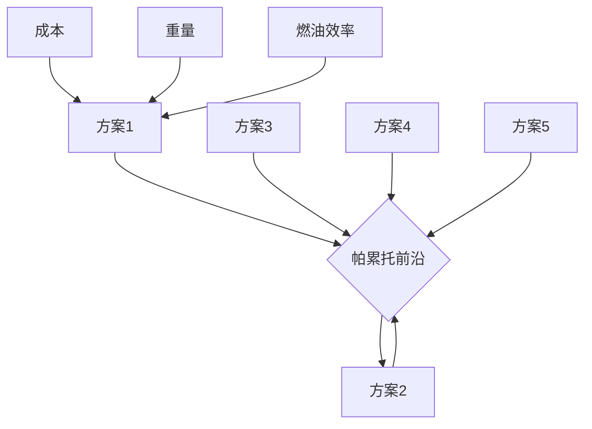

                 

## 第1章：问题背景与多目标优化概述

### 1.1 优化问题的基本概念与类型

优化问题，是一种寻求资源最有效利用的问题，其核心在于找到一组变量，使得某个或某些目标函数达到最大或最小。优化问题广泛应用于工程、经济、管理、科学计算等多个领域。基本的优化问题可以表示为：

$$
\min_{x} f(x)
$$

或者

$$
\max_{x} f(x)
$$

其中，$x$ 是决策变量，$f(x)$ 是目标函数，需要最小化或最大化的函数。

优化问题可以分为以下几种类型：

- **单目标优化**：只有一个目标函数需要优化的优化问题。
- **多目标优化**：同时优化多个目标函数的优化问题。
- **线性优化**：目标函数和约束条件都是线性的优化问题。
- **非线性优化**：目标函数和约束条件中至少有一个是非线性的优化问题。
- **无约束优化**：没有约束条件的优化问题。
- **有约束优化**：存在约束条件的优化问题。

### 1.2 多目标优化的定义与意义

多目标优化是指同时优化多个相互冲突的目标函数的问题。在现实世界中，很多决策问题并非单一目标，而是存在多个目标需要同时考虑。多目标优化的定义可以表示为：

$$
\min_{x} f_1(x), f_2(x), ..., f_n(x)
$$

其中，$f_1(x), f_2(x), ..., f_n(x)$ 是多个相互冲突的目标函数。

多目标优化的意义在于：

- **决策多样性**：多目标优化能够提供多个可行解，供决策者选择，从而增加决策的多样性。
- **决策灵活性**：多目标优化可以同时考虑多个目标，使得决策者在权衡各个目标后做出更灵活的决策。
- **资源优化**：多目标优化能够帮助找到资源的最佳分配方案，以实现整体效益最大化。

### 1.3 多目标优化中的约束条件

多目标优化中的约束条件可以分为以下几类：

- **等式约束**：满足等式 $g_i(x) = 0$ 的约束条件。
- **不等式约束**：满足不等式 $h_j(x) \leq 0$ 的约束条件。
- **边界约束**：决策变量需要满足的上下界约束，如 $x_l \leq x \leq x_u$。
- **非负约束**：决策变量必须非负，如 $x \geq 0$。

约束条件在多目标优化中起着关键作用，它们能够限制决策变量的取值范围，确保优化问题的可行性和稳定性。有效的约束处理是解决多目标优化问题的关键。

### 1.4 多目标优化的问题复杂度分析

多目标优化问题的复杂度通常比单目标优化问题要高。原因如下：

- **解空间复杂性**：多目标优化需要同时考虑多个目标函数，解空间变得更加复杂。
- **目标冲突**：多个目标函数之间可能存在冲突，增加了优化的难度。
- **约束条件**：有约束的多目标优化问题需要同时满足多个约束条件，增加了优化的难度。

在分析和解决多目标优化问题时，需要考虑到这些复杂度因素，选择合适的算法和策略。

### 1.5 当前多目标优化应用领域的概述

多目标优化在多个领域中有着广泛的应用，主要包括：

- **工程设计**：在工程设计中，需要同时优化多个性能指标，如重量、成本、可靠性等。
- **金融与经济**：在金融与经济领域中，需要优化投资组合，平衡风险与收益。
- **数据分析与机器学习**：在数据分析和机器学习中，需要优化模型参数，以获得更好的模型性能。
- **生物医学**：在生物医学中，需要优化治疗方案，以达到最佳治疗效果。

这些领域的多目标优化问题具有不同的特点，需要针对具体应用场景设计合适的优化策略。

## 结论

多目标优化是现代优化领域中的一个重要分支，其在多个领域中的应用具有重要意义。理解多目标优化的基本概念、问题复杂度以及应用领域，有助于我们更好地解决复杂决策问题。在接下来的章节中，我们将深入探讨多目标优化的核心概念和基本原理，以及不同类型的优化算法。让我们一步步地深入思考，探索多目标优化的奥秘。

### 2.1 多目标优化的数学模型

多目标优化的数学模型是解决多目标优化问题的核心基础。它通过精确的数学描述，将实际问题转化为可计算的数学问题，从而为算法设计提供理论依据。

一个典型的多目标优化问题可以表示为：

$$
\min_{x} f_1(x), f_2(x), ..., f_n(x)
$$

其中，$f_1(x), f_2(x), ..., f_n(x)$ 是目标函数，$x = [x_1, x_2, ..., x_m]$ 是决策变量，$m$ 是决策变量的个数。

在多目标优化中，目标函数可以有以下几种类型：

- **效用函数**：表示决策者对不同目标的偏好程度。
- **成本函数**：表示资源消耗或成本。
- **性能函数**：表示系统或过程的性能指标。
- **约束函数**：表示决策变量需要满足的约束条件。

多目标优化的数学模型通常包含以下几个部分：

1. **决策变量**：决策变量是优化问题中的基本元素，它们代表系统或过程的可控参数。在多目标优化中，决策变量可以是连续的，也可以是离散的。

2. **目标函数**：目标函数是优化问题需要优化的函数，它们可以是线性的，也可以是非线性的。多目标优化的目标通常是找到一组决策变量，使得多个目标函数的值达到最优。

3. **约束条件**：约束条件是对决策变量的限制，它们可以是等式约束，也可以是不等式约束。约束条件确保优化问题在求解过程中保持可行性和稳定性。

多目标优化问题的数学模型可以表示为：

$$
\min_{x} f(x)
$$

其中，$f(x)$ 是目标函数，$x$ 是决策变量。

#### 数学模型示例

假设我们要设计一个飞机的机翼，需要同时优化成本、重量和燃油效率。这个多目标优化问题可以表示为：

$$
\begin{align*}
\min_{x} \quad & C(x), W(x), F(x) \\
\text{subject to} \quad & g_i(x) = 0, \\
& h_j(x) \leq 0, \\
& x_l \leq x \leq x_u.
\end{align*}
$$

其中，$C(x)$ 是成本函数，$W(x)$ 是重量函数，$F(x)$ 是燃油效率函数，$x_l$ 和 $x_u$ 分别是决策变量的下界和上界，$g_i(x)$ 是等式约束函数，$h_j(x)$ 是不等式约束函数。

#### 概念属性特征对比表格

为了更好地理解多目标优化的数学模型，我们可以创建一个概念属性特征对比表格，列出不同目标函数的特点和属性。

| 目标函数类型 | 特点 | 属性 |
| :--: | :--: | :--: |
| 效用函数 | 表示决策者对不同目标的偏好程度 | 可加性、非负性、权重 |
| 成本函数 | 表示资源消耗或成本 | 非负性、可加性 |
| 性能函数 | 表示系统或过程的性能指标 | 可量化、非负性 |
| 约束函数 | 表示决策变量需要满足的约束条件 | 可行性、稳定性 |

#### ER实体关系图架构

为了更好地描述多目标优化的数学模型，我们可以使用ER（实体-关系）图来展示不同实体之间的关系。以下是多目标优化数学模型中的ER图示例：

```mermaid
erDiagram
  DecisionVariable ||--|{ ObjectiveFunction }
  ObjectiveFunction ||--|{ ConstraintFunction }
```

在这个ER图中，`DecisionVariable` 是决策变量实体，`ObjectiveFunction` 是目标函数实体，`ConstraintFunction` 是约束函数实体。它们之间通过关系线连接，表示决策变量与目标函数、目标函数与约束函数之间的关系。

### 总结

多目标优化的数学模型是解决多目标优化问题的理论基础。通过精确的数学描述，我们可以将实际问题转化为可计算的数学问题。理解数学模型的概念属性特征和ER图架构，有助于我们更好地设计和分析多目标优化算法。在接下来的章节中，我们将进一步探讨多目标优化的评价方法和算法基础，以便更深入地理解这一重要领域。

### 2.2 多目标优化的评价方法

多目标优化的评价方法是在众多可行解中筛选出最优解的关键。评价方法的核心目标是衡量不同解的优劣程度，从而为决策者提供可靠的参考依据。以下是一些常用的多目标优化评价方法：

#### 帕累托最优解

帕累托最优解（Pareto Optimal Solutions）是多目标优化中最基础且最重要的评价方法。它由意大利经济学家维弗雷多·帕累托（Vilfredo Pareto）提出，旨在找到一组非支配解（Pareto Front）。帕累托最优解的定义如下：

设多目标优化问题为：

$$
\min_{x} \{ f_1(x), f_2(x), ..., f_n(x) \}
$$

其中，$f_1(x), f_2(x), ..., f_n(x)$ 是目标函数。解 $x^*$ 被称为帕累托最优解，当且仅当对于所有的 $i, j \in \{1, 2, ..., n\}$，都有以下条件之一成立：

- 若 $i \neq j$，则 $f_i(x^*) \leq f_i(x)$ 且 $f_j(x^*) < f_j(x)$。
- 若 $i = j$，则 $f_i(x^*) \leq f_i(x)$。

帕累托最优解的集合构成了帕累托前沿（Pareto Front），它表示在各个目标之间进行权衡后的最优解集。帕累托最优解具有以下性质：

1. **非支配性**：一个解若优于其他所有解，则它是帕累托最优解。
2. **局部最优性**：在帕累托前沿上的每一个点都是局部最优的，即在该点的邻域内不存在其他解能够同时优于该点。
3. **全局最优性**：帕累托前沿上的每一个点都是全局最优解，即在整个解空间中无法找到其他解能够同时优于帕累托前沿上的任意一点。

#### 集合优化评价

集合优化评价（Set-Based Optimization Evaluation）是一种相对较新的评价方法，它通过评估解的集合属性而非单个解的属性来评价解的优劣。集合优化评价的基本思想是，在考虑多个目标的同时，不仅要关注单个目标的最优解，还要关注整个目标集的最优解集。

集合优化评价的具体方法包括：

1. **集合非支配排序**（Set-Based Non-Dominance Sorting）：该方法类似于帕累托最优解，但考虑的是整个目标集的非支配关系。通过这种方法，可以找到一组非支配解，形成集合非支配前沿。
2. **集合距离度量**（Set-Based Distance Metric）：该方法通过计算解与帕累托前沿之间的距离来评价解的优劣。距离越小，表示解越接近帕累托前沿，即解的优劣度越高。
3. **集合多样性度量**（Set-Based Diversity Metric）：该方法通过计算解集的多样性来评价解的优劣。多样性越高，表示解集分布越均匀，即解的优劣度越高。

集合优化评价方法的优点在于，它能够同时考虑多个目标，提供更全面的评价结果。但这也使得计算复杂度更高，需要更高效的方法来求解。

#### 帕累托图（Pareto Chart）

帕累托图是一种常用的可视化工具，用于展示多目标优化问题的帕累托前沿。帕累托图通过在二维平面上绘制多个目标函数的值，将帕累托最优解集可视化。具体步骤如下：

1. **选择两个主要目标函数**：通常选择两个最有代表性的目标函数进行绘制。
2. **绘制目标函数值**：在二维平面上，横轴表示一个目标函数的值，纵轴表示另一个目标函数的值。每个解在平面上对应一个点。
3. **连接帕累托最优解**：将帕累托最优解集通过直线连接起来，形成帕累托前沿。

帕累托图可以帮助决策者直观地理解不同解的优劣关系，从而做出更合理的决策。

#### 交叉评价方法

除了上述评价方法外，还可以将多种评价方法结合起来，形成交叉评价方法。例如，可以同时使用帕累托最优解和集合优化评价方法，对解进行多角度评价。交叉评价方法能够提供更全面、更可靠的解评价结果。

### 应用实例

以飞机机翼设计为例，假设需要优化成本、重量和燃油效率三个目标。通过帕累托图，可以直观地展示出不同设计方案的优劣关系。如图所示：



在这个帕累托图中，方案1、方案2、方案3、方案4和方案5分别代表了不同的设计方案。帕累托前沿上的点表示最优设计方案，这些方案在成本、重量和燃油效率三个目标之间进行了平衡，是最优的决策选项。

### 结论

多目标优化的评价方法是选择最优解的关键。帕累托最优解和集合优化评价方法是目前常用的评价方法，它们能够帮助决策者从多个目标中筛选出最优解。通过帕累托图等可视化工具，可以直观地展示不同解的优劣关系，为决策提供有力支持。在接下来的章节中，我们将深入探讨多目标优化的算法基础，以便更全面地了解这一领域。

### 2.3 多目标优化的算法基础

多目标优化的算法基础是解决多目标优化问题的关键。常见的多目标优化算法可以分为传统算法和现代算法。以下将分别介绍这些算法的基本原理和操作步骤。

#### 传统多目标优化算法

**1. 多目标遗传算法（MOGA）**

多目标遗传算法是基于遗传算法的一种多目标优化算法。遗传算法是一种基于自然进化过程的优化算法，通过模拟自然选择和遗传机制来寻找最优解。

- **基本原理**：
  - **初始化种群**：随机生成一组初始解，称为种群。
  - **适应度评估**：计算每个解的适应度值，通常是基于目标函数的值。
  - **选择**：根据适应度值选择较好的解进行交配。
  - **交配**：通过交叉操作生成新的子代。
  - **变异**：对子代进行变异操作，增加种群的多样性。
  - **更新种群**：将子代替代父代，形成新的种群。
  - **迭代**：重复上述步骤，直到满足终止条件。

- **操作步骤**：
  1. 初始化种群。
  2. 计算适应度值。
  3. 选择较好的解进行交配。
  4. 生成子代。
  5. 对子代进行变异。
  6. 更新种群。
  7. 重复步骤 2-6，直到满足终止条件。

**2. 多目标粒子群优化算法（MOPSO）**

多目标粒子群优化算法是基于粒子群优化算法的一种多目标优化算法。粒子群优化算法通过模拟鸟群觅食行为来寻找最优解。

- **基本原理**：
  - **初始化粒子群**：随机生成一组粒子，每个粒子代表一个解。
  - **适应度评估**：计算每个粒子的适应度值。
  - **个体最优和全局最优**：记录每个粒子的个体最优和全局最优。
  - **更新粒子位置**：每个粒子根据个体最优和全局最优来更新自己的位置。
  - **迭代**：重复上述步骤，直到满足终止条件。

- **操作步骤**：
  1. 初始化粒子群。
  2. 计算适应度值。
  3. 记录个体最优和全局最优。
  4. 更新粒子位置。
  5. 重复步骤 2-4，直到满足终止条件。

**3. 多目标蚁群算法（MOACO）**

多目标蚁群算法是基于蚁群优化算法的一种多目标优化算法。蚁群优化算法通过模拟蚂蚁觅食过程来寻找最优路径。

- **基本原理**：
  - **初始化**：生成蚁群和目标函数。
  - **信息素更新**：根据蚁群选择路径，更新信息素浓度。
  - **路径选择**：蚂蚁根据信息素浓度和适应度值选择路径。
  - **迭代**：重复上述步骤，直到满足终止条件。

- **操作步骤**：
  1. 初始化蚁群和目标函数。
  2. 更新信息素浓度。
  3. 选择路径。
  4. 重复步骤 2-3，直到满足终止条件。

**4. 多目标模拟退火算法（MOSA）**

多目标模拟退火算法是基于模拟退火算法的一种多目标优化算法。模拟退火算法通过模拟固体退火过程来寻找最优解。

- **基本原理**：
  - **初始解**：生成初始解。
  - **温度调整**：根据迭代次数调整温度。
  - **接受准则**：根据适应度值和温度调整决策。
  - **迭代**：重复上述步骤，直到满足终止条件。

- **操作步骤**：
  1. 生成初始解。
  2. 调整温度。
  3. 根据接受准则更新解。
  4. 重复步骤 2-3，直到满足终止条件。

#### 现代多目标优化算法

**1. 多目标基于群体的算法**

多目标基于群体的算法通过群体之间的协作来优化多个目标。这类算法通常采用群体之间的竞争和合作来提高搜索效率。

- **基本原理**：
  - **群体初始化**：生成多个初始群体。
  - **群体交互**：通过竞争和合作机制进行群体交互。
  - **更新群体**：根据群体交互结果更新群体。
  - **迭代**：重复上述步骤，直到满足终止条件。

- **操作步骤**：
  1. 初始化多个群体。
  2. 进行群体交互。
  3. 更新群体。
  4. 重复步骤 2-3，直到满足终止条件。

**2. 多目标基于学习的算法**

多目标基于学习的算法通过学习历史数据来优化多个目标。这类算法通常采用机器学习技术来提高优化性能。

- **基本原理**：
  - **数据收集**：收集历史优化数据。
  - **模型训练**：利用历史数据训练模型。
  - **模型应用**：将训练好的模型应用于优化问题。
  - **迭代**：重复上述步骤，直到满足终止条件。

- **操作步骤**：
  1. 收集历史优化数据。
  2. 训练模型。
  3. 应用模型。
  4. 重复步骤 2-3，直到满足终止条件。

**3. 多目标协同优化算法**

多目标协同优化算法通过多个优化器之间的协同来优化多个目标。这类算法通常采用分布式计算技术来提高优化效率。

- **基本原理**：
  - **优化器初始化**：生成多个优化器。
  - **协同计算**：优化器之间进行协同计算。
  - **更新解**：根据协同结果更新解。
  - **迭代**：重复上述步骤，直到满足终止条件。

- **操作步骤**：
  1. 初始化多个优化器。
  2. 进行协同计算。
  3. 更新解。
  4. 重复步骤 2-3，直到满足终止条件。

**4. 多目标动态优化算法**

多目标动态优化算法通过实时调整优化策略来适应动态变化的目标。这类算法通常采用自适应算法来提高优化性能。

- **基本原理**：
  - **初始策略**：生成初始优化策略。
  - **动态调整**：根据目标变化调整优化策略。
  - **优化计算**：利用调整后的策略进行优化计算。
  - **迭代**：重复上述步骤，直到满足终止条件。

- **操作步骤**：
  1. 生成初始策略。
  2. 动态调整策略。
  3. 进行优化计算。
  4. 重复步骤 2-3，直到满足终止条件。

### 算法对比分析

传统多目标优化算法和现代多目标优化算法各有优缺点。以下是对几种算法的对比分析：

| 算法类型 | 优点 | 缺点 | 适用场景 |
| :--: | :--: | :--: | :--: |
| 多目标遗传算法 | 搜索效率高，适应性强 | 计算复杂度高，易陷入局部最优 | 复杂的多目标优化问题 |
| 多目标粒子群优化算法 | 实时性高，计算速度快 | 易陷入局部最优，收敛速度较慢 | 简单的多目标优化问题 |
| 多目标蚁群算法 | 算法简单，易实现 | 收敛速度较慢，搜索效率较低 | 大规模的多目标优化问题 |
| 多目标模拟退火算法 | 搜索效率高，适应性强 | 计算复杂度高，易陷入局部最优 | 复杂的多目标优化问题 |
| 多目标基于群体的算法 | 群体协作，搜索效率高 | 需要大量计算资源，收敛速度较慢 | 大规模的多目标优化问题 |
| 多目标基于学习的算法 | 学习能力强，适应性强 | 需要大量历史数据，计算复杂度高 | 数据丰富的多目标优化问题 |
| 多目标协同优化算法 | 分布式计算，优化效率高 | 需要多个优化器，协调复杂度高 | 大规模的多目标优化问题 |
| 多目标动态优化算法 | 自适应性强，适应动态变化 | 需要实时调整策略，计算复杂度高 | 动态变化的多目标优化问题 |

### 总结

多目标优化的算法基础是解决多目标优化问题的关键。传统算法和现代算法各有优缺点，适用于不同的场景。通过了解这些算法的基本原理和操作步骤，我们可以根据实际问题的需求选择合适的算法，以提高优化效率和效果。

### 第3章：传统多目标优化算法

#### 3.1 多目标遗传算法

多目标遗传算法（Multi-Objective Genetic Algorithm，MOGA）是一种基于自然选择和遗传机制的优化算法，主要用于解决多目标优化问题。MOGA通过模拟生物进化过程，在种群中筛选出最优解，从而逐步逼近问题的帕累托最优解集。

##### 算法原理

MOGA的核心思想是通过选择、交叉、变异和生存竞争等遗传操作来模拟自然进化过程，从而优化目标函数。具体步骤如下：

1. **初始化种群**：随机生成一组初始解，称为种群。每个解称为一个个体，个体由决策变量组成。
2. **适应度评估**：计算每个个体的适应度值，适应度值通常是基于目标函数的值。适应度值较高的个体被认为是更好的解。
3. **选择**：根据个体的适应度值选择较好的个体进行交配。常用的选择方法有轮盘赌选择、锦标赛选择等。
4. **交叉**：在选中的个体之间进行交叉操作，生成新的子代。交叉操作通过交换个体的部分基因来实现，从而产生新的解。
5. **变异**：对子代个体进行变异操作，以增加种群的多样性。变异操作通常通过随机改变个体的基因来实现。
6. **更新种群**：将子代个体替代父代个体，形成新的种群。
7. **迭代**：重复上述步骤，直到满足终止条件，如达到最大迭代次数或找到满意的解集。

##### 操作步骤

1. **初始化种群**：随机生成初始种群，种群大小可以根据问题规模和计算资源进行调整。
2. **适应度评估**：计算每个个体的适应度值，常用的方法是求解每个目标函数的值，然后根据目标函数的值计算适应度值。
3. **选择**：根据适应度值选择较好的个体进行交配，选择方法可以是一次选择、多次选择或混合选择。
4. **交叉**：在选中的个体之间进行交叉操作，生成新的子代。交叉操作可以采用单点交叉、多点交叉或均匀交叉等方法。
5. **变异**：对子代个体进行变异操作，以增加种群的多样性。变异操作可以采用随机变异、高斯变异等方法。
6. **更新种群**：将子代个体替代父代个体，形成新的种群。
7. **迭代**：重复上述步骤，直到满足终止条件。

##### 示例

以飞机机翼设计为例，我们需要同时优化成本、重量和燃油效率三个目标。假设初始种群大小为50，最大迭代次数为100。

1. **初始化种群**：随机生成50个初始解，每个解代表一种机翼设计。
2. **适应度评估**：计算每个解的成本、重量和燃油效率，然后计算适应度值。
3. **选择**：根据适应度值选择较好的解进行交配，选择方法可以使用轮盘赌选择。
4. **交叉**：在选中的解之间进行交叉操作，生成新的子代。
5. **变异**：对子代解进行变异操作，以增加种群的多样性。
6. **更新种群**：将子代解替代父代解，形成新的种群。
7. **迭代**：重复上述步骤，直到达到最大迭代次数或找到满意的解集。

##### 帕累托最优解

多目标遗传算法通过迭代过程逐步逼近帕累托最优解集。帕累托最优解集是在各个目标之间进行权衡后的最优解集。在MOGA中，帕累托最优解集可以通过以下方法找到：

1. **非支配排序**：将种群中的个体按照非支配关系进行排序，非支配关系是指一个个体在不恶化其他目标的情况下无法被另一个个体支配。排在最前面的个体构成了帕累托最优解集。
2. **拥挤度计算**：对帕累托最优解集中的每个个体计算其拥挤度，拥挤度反映了个体在帕累托前沿上的分布情况。拥挤度越高的个体越有可能包含更多的帕累托最优解。选择拥挤度最高的个体作为帕累托最优解。

##### 总结

多目标遗传算法是一种有效的多目标优化算法，通过模拟自然进化过程，可以找到帕累托最优解集。在操作步骤中，适应度评估、选择、交叉、变异和更新种群是关键步骤。通过合理设置参数和选择合适的操作方法，可以提高算法的优化性能。

#### 3.2 多目标粒子群优化算法

多目标粒子群优化算法（Multi-Objective Particle Swarm Optimization，MOPSO）是基于粒子群优化算法的一种多目标优化算法。粒子群优化算法通过模拟鸟群觅食行为来寻找最优解。MOPSO在传统粒子群优化算法的基础上，引入了非支配排序和拥挤度计算方法，从而提高了优化性能。

##### 算法原理

MOPSO的基本原理如下：

1. **初始化粒子群**：随机生成一组粒子，每个粒子代表一个解。粒子具有位置和速度。
2. **适应度评估**：计算每个粒子的适应度值，通常是基于目标函数的值。适应度值较高的粒子被认为是更好的解。
3. **个体最优和全局最优**：每个粒子记录自己的历史最优位置（个体最优）和整个种群的历史最优位置（全局最优）。
4. **更新粒子位置**：每个粒子根据个体最优和全局最优来更新自己的位置。粒子位置的更新受到历史最优位置和随机扰动的影响。
5. **非支配排序**：对粒子群进行非支配排序，将粒子分为支配和非支配两组。
6. **拥挤度计算**：对非支配粒子计算拥挤度，拥挤度反映了粒子在帕累托前沿上的分布情况。拥挤度越高的粒子越有可能包含更多的帕累托最优解。
7. **迭代**：重复上述步骤，直到满足终止条件，如达到最大迭代次数或找到满意的解集。

##### 操作步骤

1. **初始化粒子群**：随机生成初始粒子群，粒子群的大小可以根据问题规模和计算资源进行调整。
2. **适应度评估**：计算每个粒子的适应度值，常用的方法是求解每个目标函数的值，然后计算适应度值。
3. **个体最优和全局最优更新**：每个粒子记录自己的历史最优位置和整个种群的历史最优位置。
4. **更新粒子位置**：根据个体最优和全局最优位置来更新每个粒子的位置。更新公式如下：

$$
x_{new} = x_{best} + w \cdot (x_{global} - x) + c_1 \cdot r_1 \cdot (p_x - x) + c_2 \cdot r_2 \cdot (g_x - x)
$$

其中，$x_{new}$ 是新的粒子位置，$x_{best}$ 是个体最优位置，$x_{global}$ 是全局最优位置，$w$ 是惯性权重，$c_1$ 和 $c_2$ 是学习因子，$r_1$ 和 $r_2$ 是随机数。
5. **非支配排序**：对粒子群进行非支配排序，将粒子分为支配和非支配两组。
6. **拥挤度计算**：对非支配粒子计算拥挤度，常用的方法包括基于目标函数值的最远距离法、基于目标函数的密度法等。
7. **迭代**：重复上述步骤，直到满足终止条件。

##### 示例

以飞机机翼设计为例，我们需要同时优化成本、重量和燃油效率三个目标。假设初始粒子群大小为50，最大迭代次数为100。

1. **初始化粒子群**：随机生成50个初始粒子，每个粒子代表一种机翼设计。
2. **适应度评估**：计算每个粒子的适应度值，求解每个目标函数的值。
3. **个体最优和全局最优更新**：每个粒子记录自己的历史最优位置和整个种群的历史最优位置。
4. **更新粒子位置**：根据个体最优和全局最优位置来更新每个粒子的位置。
5. **非支配排序**：对粒子群进行非支配排序，将粒子分为支配和非支配两组。
6. **拥挤度计算**：对非支配粒子计算拥挤度。
7. **迭代**：重复上述步骤，直到达到最大迭代次数或找到满意的解集。

##### 帕累托最优解

MOPSO通过非支配排序和拥挤度计算方法来找到帕累托最优解。具体方法如下：

1. **非支配排序**：将粒子群按照非支配关系进行排序，非支配关系是指一个粒子在不恶化其他目标的情况下无法被另一个粒子支配。排在最前面的粒子构成了帕累托最优解集。
2. **拥挤度计算**：对帕累托最优解集中的每个粒子计算其拥挤度，拥挤度反映了粒子在帕累托前沿上的分布情况。拥挤度越高的粒子越有可能包含更多的帕累托最优解。

##### 总结

多目标粒子群优化算法是一种有效的多目标优化算法，通过模拟鸟群觅食行为，可以找到帕累托最优解。在操作步骤中，适应度评估、个体最优和全局最优更新、粒子位置更新、非支配排序和拥挤度计算是关键步骤。通过合理设置参数和选择合适的操作方法，可以提高算法的优化性能。

#### 3.3 多目标蚁群算法

多目标蚁群算法（Multi-Objective Ant Colony Optimization，MOACO）是基于蚁群优化算法的一种多目标优化算法。蚁群优化算法通过模拟蚂蚁觅食行为来寻找最优路径。MOACO在传统蚁群优化算法的基础上，引入了多个目标函数和动态调整机制，从而提高了优化性能。

##### 算法原理

MOACO的基本原理如下：

1. **初始化**：生成蚁群和目标函数。蚁群由一组蚂蚁组成，每只蚂蚁代表一个解。
2. **信息素更新**：根据蚂蚁选择路径的结果，更新路径上的信息素浓度。信息素浓度反映了路径的优劣程度。信息素更新规则如下：

$$
\Delta \tau_{ij}(t) = \frac{Q}{L_i(t)}
$$

其中，$\Delta \tau_{ij}(t)$ 是从路径 $i$ 到路径 $j$ 的信息素增量，$Q$ 是信息素总量，$L_i(t)$ 是蚂蚁 $i$ 在当前迭代次数 $t$ 内走过的总路径长度。
3. **路径选择**：每只蚂蚁根据当前路径上的信息素浓度和目标函数值选择下一个路径。路径选择规则如下：

$$
P_{ij}(t) = \frac{\tau_{ij}(t) \cdot \phi_{ij}(t)}{\sum_{k \in \text{可选路径}} \tau_{ik}(t) \cdot \phi_{ik}(t)}
$$

其中，$P_{ij}(t)$ 是蚂蚁从路径 $i$ 选择路径 $j$ 的概率，$\tau_{ij}(t)$ 是路径 $i$ 到路径 $j$ 的信息素浓度，$\phi_{ij}(t)$ 是路径 $i$ 到路径 $j$ 的目标函数值。
4. **迭代**：重复路径选择和信息素更新步骤，直到满足终止条件，如达到最大迭代次数或找到满意的解集。

##### 操作步骤

1. **初始化**：生成初始蚁群和目标函数。初始蚁群随机分布在解空间中。
2. **路径选择**：每只蚂蚁根据当前路径上的信息素浓度和目标函数值选择下一个路径。
3. **信息素更新**：根据蚂蚁选择路径的结果，更新路径上的信息素浓度。
4. **迭代**：重复路径选择和信息素更新步骤，直到满足终止条件。

##### 示例

以飞机机翼设计为例，我们需要同时优化成本、重量和燃油效率三个目标。假设初始蚁群大小为50，最大迭代次数为100。

1. **初始化**：生成50只初始蚂蚁，随机分布在解空间中。
2. **路径选择**：每只蚂蚁根据当前路径上的信息素浓度和目标函数值选择下一个路径。
3. **信息素更新**：根据蚂蚁选择路径的结果，更新路径上的信息素浓度。
4. **迭代**：重复路径选择和信息素更新步骤，直到达到最大迭代次数或找到满意的解集。

##### 帕累托最优解

MOACO通过路径选择和信息素更新机制来找到帕累托最优解。具体方法如下：

1. **路径选择**：蚂蚁选择路径时，会根据当前路径上的信息素浓度和目标函数值进行权衡。信息素浓度越高，表示路径越优秀；目标函数值越低，表示路径越优秀。通过这种权衡，可以找到一组较好的路径，这些路径构成了帕累托最优解集。
2. **信息素更新**：信息素更新规则根据蚂蚁选择路径的结果动态调整，从而引导蚂蚁向帕累托最优解集靠近。信息素浓度越高，表示路径越优秀，蚂蚁越倾向于选择这些路径。

##### 总结

多目标蚁群算法是一种有效的多目标优化算法，通过模拟蚂蚁觅食行为，可以找到帕累托最优解。在操作步骤中，路径选择和信息素更新是关键步骤。通过合理设置参数和选择合适的操作方法，可以提高算法的优化性能。

#### 3.4 多目标模拟退火算法

多目标模拟退火算法（Multi-Objective Simulated Annealing，MOSA）是基于模拟退火算法的一种多目标优化算法。模拟退火算法通过模拟固体退火过程，在搜索过程中逐渐降低温度，以避免陷入局部最优。MOSA在传统模拟退火算法的基础上，引入了多个目标函数和动态调整机制，从而提高了优化性能。

##### 算法原理

MOSA的基本原理如下：

1. **初始化**：生成初始解和温度。初始解可以是随机生成的，温度可以设定为一个较高的值。
2. **适应度评估**：计算每个解的适应度值，适应度值通常是基于目标函数的值。适应度值较高的解被认为是较好的解。
3. **接受准则**：判断新解是否被接受。如果新解的适应度值优于当前解，则直接接受新解；否则，根据概率接受新解。接受概率通常取决于当前温度和新解与当前解的适应度差值。接受准则如下：

$$
P_{accept} = \min\left(1, \exp\left(-\alpha \cdot \Delta F\right)\right)
$$

其中，$P_{accept}$ 是接受概率，$\alpha$ 是冷却系数，$\Delta F$ 是适应度差值。
4. **温度调整**：根据迭代次数调整温度。温度调整规则如下：

$$
T_{new} = T_{old} \cdot \gamma
$$

其中，$T_{new}$ 是新的温度，$T_{old}$ 是当前温度，$\gamma$ 是冷却率。
5. **迭代**：重复适应度评估、接受准则和温度调整步骤，直到满足终止条件，如达到最大迭代次数或找到满意的解集。

##### 操作步骤

1. **初始化**：生成初始解和温度。初始解可以是随机生成的，温度可以设定为一个较高的值。
2. **适应度评估**：计算每个解的适应度值。
3. **接受准则**：判断新解是否被接受。如果新解的适应度值优于当前解，则直接接受新解；否则，根据概率接受新解。
4. **温度调整**：根据迭代次数调整温度。
5. **迭代**：重复适应度评估、接受准则和温度调整步骤，直到满足终止条件。

##### 示例

以飞机机翼设计为例，我们需要同时优化成本、重量和燃油效率三个目标。假设初始温度为1000，最大迭代次数为100。

1. **初始化**：生成初始解和温度。初始解可以是随机生成的，温度可以设定为一个较高的值。
2. **适应度评估**：计算每个解的成本、重量和燃油效率，然后计算适应度值。
3. **接受准则**：判断新解是否被接受。如果新解的适应度值优于当前解，则直接接受新解；否则，根据概率接受新解。
4. **温度调整**：根据迭代次数调整温度。
5. **迭代**：重复适应度评估、接受准则和温度调整步骤，直到达到最大迭代次数或找到满意的解集。

##### 帕累托最优解

MOSA通过适应度评估、接受准则和温度调整机制来找到帕累托最优解。具体方法如下：

1. **适应度评估**：计算每个解的适应度值，适应度值较好的解被认为是较好的解。
2. **接受准则**：通过概率接受新解，从而在搜索过程中逐渐接近帕累托最优解集。
3. **温度调整**：随着迭代次数的增加，逐渐降低温度，从而避免陷入局部最优。

##### 总结

多目标模拟退火算法是一种有效的多目标优化算法，通过模拟固体退火过程，可以找到帕累托最优解。在操作步骤中，适应度评估、接受准则和温度调整是关键步骤。通过合理设置参数和选择合适的操作方法，可以提高算法的优化性能。

#### 3.5 传统多目标优化算法的综合评估

在多目标优化领域中，传统算法因其理论基础扎实、算法结构简单且易于实现而得到广泛应用。本文将对多目标遗传算法（MOGA）、多目标粒子群优化算法（MOPSO）、多目标蚁群算法（MOACO）和多目标模拟退火算法（MOSA）进行综合评估，分析它们的优缺点及其适用场景。

##### 优缺点分析

**多目标遗传算法（MOGA）**

- **优点**：
  - **全局搜索能力强**：MOGA通过遗传操作，如选择、交叉和变异，可以有效避免陷入局部最优。
  - **适应性广**：MOGA适用于多种类型的目标函数，无论是线性还是非线性，连续还是离散。
  - **解的多样性**：通过种群策略，MOGA能够在解空间中探索广泛的区域，提高解的多样性。

- **缺点**：
  - **计算复杂度高**：MOGA通常需要较大的种群规模和较多的迭代次数，导致计算复杂度高。
  - **参数设置敏感**：MOGA的优化性能受参数设置（如交叉率、变异率和种群大小）的影响较大，参数设置不当可能导致性能下降。

**多目标粒子群优化算法（MOPSO）**

- **优点**：
  - **计算速度快**：MOPSO相对于MOGA具有较快的收敛速度，适用于求解规模较小的多目标优化问题。
  - **实现简单**：MOPSO结构简单，易于实现和调整。
  - **实时性高**：MOPSO可以在线调整参数，适用于动态变化的多目标优化问题。

- **缺点**：
  - **易陷入局部最优**：MOPSO在搜索过程中较易陷入局部最优，特别是在目标函数复杂或解空间较大时。
  - **多样性不足**：MOPSO的种群规模通常较小，导致解的多样性相对较低。

**多目标蚁群算法（MOACO）**

- **优点**：
  - **鲁棒性强**：MOACO通过信息素更新机制，能够有效避免局部最优。
  - **适合大规模问题**：MOACO适用于求解大规模多目标优化问题，尤其在大规模组合优化问题中表现出色。
  - **适应性广**：MOACO适用于多种类型的目标函数和约束条件。

- **缺点**：
  - **收敛速度较慢**：MOACO通常需要较多的迭代次数才能收敛，尤其是在大规模问题中。
  - **计算资源消耗大**：MOACO需要大量计算资源，特别是在信息素更新和路径选择过程中。

**多目标模拟退火算法（MOSA）**

- **优点**：
  - **全局搜索能力强**：MOSA通过模拟退火过程，可以有效避免局部最优。
  - **适用于动态问题**：MOSA适用于求解动态变化的多目标优化问题，特别是在目标函数变化频繁的情况下。
  - **参数设置灵活**：MOSA的参数设置（如冷却率）较为灵活，可以根据不同问题进行调整。

- **缺点**：
  - **计算复杂度高**：MOSA的优化性能受冷却率等参数设置的影响较大，参数设置不当可能导致性能下降。
  - **收敛速度较慢**：MOSA通常需要较多的迭代次数才能收敛，特别是在复杂的目标函数中。

##### 适用场景

- **MOGA**：适用于复杂、大规模的多目标优化问题，特别是目标函数存在非线性、约束条件复杂的情况。
- **MOPSO**：适用于求解规模较小、目标函数简单的多目标优化问题，特别是在需要快速求解的情况下。
- **MOACO**：适用于求解大规模组合优化问题，特别是在大规模问题中需要全局搜索能力时。
- **MOSA**：适用于动态变化的多目标优化问题，特别是在目标函数变化频繁、需要全局搜索能力时。

##### 总结

传统多目标优化算法各具优缺点，适用于不同的场景。通过合理选择和使用，可以有效地解决多目标优化问题。在实际应用中，可以根据具体问题的特点和要求，选择合适的算法，以提高优化效率和效果。

### 第4章：现代多目标优化算法

#### 4.1 多目标基于群体的算法

多目标基于群体的算法（Multi-Objective Group-Based Algorithms，MOGBA）是一种新兴的多目标优化算法，其主要特点是通过群体之间的协作和竞争来提高优化性能。这类算法能够有效处理复杂的多目标优化问题，提高解的质量和多样性。

##### 算法原理

MOGBA的基本原理如下：

1. **群体初始化**：随机生成多个初始群体，每个群体代表一组解。群体的大小可以根据问题规模和计算资源进行调整。
2. **群体交互**：群体之间通过竞争和协作机制进行交互。竞争机制鼓励群体之间的优胜劣汰，协作机制促进群体之间的信息共享和策略学习。
3. **个体优化**：每个群体内部的个体通过局部搜索和全局搜索来优化自身，以提高个体的适应度值。
4. **群体更新**：根据群体交互结果和个体优化结果，更新群体。群体更新可以通过选择、交叉、变异等操作实现。
5. **迭代**：重复上述步骤，直到满足终止条件，如达到最大迭代次数或找到满意的解集。

##### 操作步骤

1. **初始化群体**：随机生成多个初始群体，每个群体包含一定数量的个体。
2. **群体交互**：通过竞争和协作机制进行群体交互。竞争机制可以通过适应度值、多样性等指标来评估群体之间的优劣。
3. **个体优化**：对每个群体内部的个体进行局部搜索和全局搜索，以提高个体的适应度值。
4. **群体更新**：根据群体交互结果和个体优化结果，更新群体。更新操作可以通过选择、交叉、变异等操作实现。
5. **迭代**：重复上述步骤，直到满足终止条件。

##### 示例

以飞机机翼设计为例，我们需要同时优化成本、重量和燃油效率三个目标。假设初始群体大小为5，每个群体包含10个个体，最大迭代次数为100。

1. **初始化群体**：随机生成5个初始群体，每个群体包含10个个体。
2. **群体交互**：通过竞争和协作机制进行群体交互。每个群体根据个体适应度值和多样性指标评估其他群体的优劣。
3. **个体优化**：对每个群体内部的个体进行局部搜索和全局搜索，以提高个体的适应度值。
4. **群体更新**：根据群体交互结果和个体优化结果，更新群体。更新操作可以通过选择、交叉、变异等操作实现。
5. **迭代**：重复上述步骤，直到达到最大迭代次数或找到满意的解集。

##### 帕累托最优解

MOGBA通过群体交互和个体优化机制来找到帕累托最优解。具体方法如下：

1. **群体交互**：通过竞争和协作机制，使每个群体逐渐逼近帕累托最优解集。
2. **个体优化**：对每个群体内部的个体进行局部搜索和全局搜索，以提高个体的适应度值，从而逼近帕累托最优解集。

##### 总结

多目标基于群体的算法通过群体之间的协作和竞争来提高优化性能，能够有效处理复杂的多目标优化问题。在操作步骤中，群体初始化、群体交互、个体优化和群体更新是关键步骤。通过合理设置参数和选择合适的操作方法，可以提高算法的优化性能。

#### 4.2 多目标基于学习的算法

多目标基于学习的算法（Multi-Objective Learning-Based Algorithms，MOBLA）是一种利用机器学习技术来解决多目标优化问题的算法。这类算法通过学习历史数据，预测最优解集，从而提高优化性能。

##### 算法原理

MOBLA的基本原理如下：

1. **数据收集**：从历史数据中收集优化问题的解集，这些解集可以作为训练数据。
2. **模型训练**：利用收集到的历史数据，训练机器学习模型。模型可以通过回归、聚类、分类等方法来实现。
3. **模型应用**：将训练好的模型应用于优化问题，预测最优解集。模型可以用于评估新解的优劣，指导搜索过程。
4. **迭代**：根据模型预测的结果，更新解集，重复迭代过程，直到满足终止条件，如达到最大迭代次数或找到满意的解集。

##### 操作步骤

1. **数据收集**：从历史数据中收集优化问题的解集，这些解集可以作为训练数据。
2. **模型训练**：利用收集到的历史数据，训练机器学习模型。模型可以通过回归、聚类、分类等方法来实现。
3. **模型应用**：将训练好的模型应用于优化问题，预测最优解集。模型可以用于评估新解的优劣，指导搜索过程。
4. **迭代**：根据模型预测的结果，更新解集，重复迭代过程，直到满足终止条件。

##### 示例

以飞机机翼设计为例，我们需要同时优化成本、重量和燃油效率三个目标。假设历史数据集包含100个解，最大迭代次数为100。

1. **数据收集**：从历史数据中收集100个解，这些解包含成本、重量和燃油效率的目标值。
2. **模型训练**：利用收集到的历史数据，训练一个机器学习模型。模型可以使用回归模型来预测新的解集的适应度值。
3. **模型应用**：将训练好的模型应用于优化问题，预测新的解集。模型可以用于评估新解的优劣，指导搜索过程。
4. **迭代**：根据模型预测的结果，更新解集，重复迭代过程，直到达到最大迭代次数或找到满意的解集。

##### 帕累托最优解

MOBLA通过机器学习模型来预测帕累托最优解集。具体方法如下：

1. **模型训练**：利用历史数据训练模型，模型可以学习到帕累托最优解集的特征和模式。
2. **模型应用**：将训练好的模型应用于新的解集，预测其适应度值。
3. **筛选解集**：根据模型预测的结果，筛选出适应度值较高的解，形成帕累托最优解集。

##### 总结

多目标基于学习的算法通过机器学习技术，能够有效预测帕累托最优解集，从而提高优化性能。在操作步骤中，数据收集、模型训练、模型应用和迭代是关键步骤。通过合理选择机器学习模型和训练方法，可以提高算法的预测准确性和优化性能。

#### 4.3 多目标协同优化算法

多目标协同优化算法（Multi-Objective Collaborative Optimization Algorithms，MOCOA）是一种基于协同机制的优化算法，通过多个优化器的协同作用来提高优化性能。这类算法能够充分利用各个优化器的优势，从而解决复杂的多目标优化问题。

##### 算法原理

MOCOA的基本原理如下：

1. **优化器初始化**：生成多个优化器，每个优化器具有不同的搜索策略和参数设置。优化器可以是遗传算法、粒子群优化算法、蚁群算法等。
2. **协同计算**：各个优化器之间通过协同机制进行交互，协同计算可以包括信息交换、策略共享、解集融合等。协同机制可以通过通信网络、分布式计算等方式实现。
3. **优化过程**：各个优化器同时进行局部搜索和全局搜索，通过协同机制更新解集。优化过程可以包括多个阶段，每个阶段的不同优化器可以负责不同的任务。
4. **结果评估**：根据各个优化器的优化结果，评估整个协同优化过程的性能，包括解的质量、收敛速度、多样性等。

##### 操作步骤

1. **优化器初始化**：生成多个优化器，每个优化器具有不同的搜索策略和参数设置。
2. **协同计算**：各个优化器之间通过协同机制进行交互，协同计算可以包括信息交换、策略共享、解集融合等。
3. **优化过程**：各个优化器同时进行局部搜索和全局搜索，通过协同机制更新解集。优化过程可以包括多个阶段，每个阶段的不同优化器可以负责不同的任务。
4. **结果评估**：根据各个优化器的优化结果，评估整个协同优化过程的性能。
5. **迭代**：重复上述步骤，直到满足终止条件，如达到最大迭代次数或找到满意的解集。

##### 示例

以飞机机翼设计为例，我们需要同时优化成本、重量和燃油效率三个目标。假设有三个优化器，分别是遗传算法、粒子群优化算法和蚁群算法。

1. **优化器初始化**：初始化三个优化器，每个优化器具有不同的搜索策略和参数设置。
2. **协同计算**：三个优化器之间通过协同机制进行交互，可以交换信息、共享策略、融合解集等。
3. **优化过程**：三个优化器同时进行局部搜索和全局搜索，通过协同机制更新解集。在第一阶段，遗传算法负责局部搜索，粒子群优化算法负责全局搜索，蚁群算法负责解集融合。
4. **结果评估**：根据三个优化器的优化结果，评估整个协同优化过程的性能。
5. **迭代**：重复上述步骤，直到达到最大迭代次数或找到满意的解集。

##### 帕累托最优解

MOCOA通过协同机制和优化器的综合作用来找到帕累托最优解。具体方法如下：

1. **协同计算**：通过协同机制，各个优化器可以共享信息、策略和解集，从而提高搜索效率。
2. **解集融合**：将各个优化器的解集进行融合，形成更广泛的解空间。
3. **筛选解集**：根据目标函数值和多样性指标，筛选出帕累托最优解集。

##### 总结

多目标协同优化算法通过多个优化器的协同作用来提高优化性能，能够有效处理复杂的多目标优化问题。在操作步骤中，优化器初始化、协同计算、优化过程和结果评估是关键步骤。通过合理设置协同机制和优化器参数，可以提高算法的优化性能。

#### 4.4 多目标动态优化算法

多目标动态优化算法（Multi-Objective Dynamic Optimization Algorithms，MODYA）是一种适用于动态变化环境的多目标优化算法。这类算法能够在目标函数和约束条件发生变化时，自适应地调整搜索策略，以找到最优解。

##### 算法原理

MODYA的基本原理如下：

1. **初始阶段**：生成初始解集，通过评估目标函数和约束条件，确定初始解的质量。
2. **动态调整**：根据目标函数和约束条件的变化，动态调整优化策略。调整策略可以通过自适应调整参数、改变搜索策略或引入新的优化算法实现。
3. **迭代优化**：在每个迭代步骤中，根据当前目标函数和约束条件，对解集进行优化。优化过程可以包括局部搜索和全局搜索。
4. **解集更新**：根据优化结果，更新解集。解集更新可以通过选择、交叉、变异等操作实现。
5. **终止条件**：当满足终止条件，如达到最大迭代次数或找到满意的解集时，算法结束。

##### 操作步骤

1. **初始阶段**：生成初始解集，通过评估目标函数和约束条件，确定初始解的质量。
2. **动态调整**：根据目标函数和约束条件的变化，动态调整优化策略。调整策略可以通过自适应调整参数、改变搜索策略或引入新的优化算法实现。
3. **迭代优化**：在每个迭代步骤中，根据当前目标函数和约束条件，对解集进行优化。优化过程可以包括局部搜索和全局搜索。
4. **解集更新**：根据优化结果，更新解集。解集更新可以通过选择、交叉、变异等操作实现。
5. **迭代**：重复上述步骤，直到满足终止条件。

##### 示例

以飞机机翼设计为例，我们需要同时优化成本、重量和燃油效率三个目标。假设目标函数和约束条件会随着时间变化。

1. **初始阶段**：生成初始解集，通过评估目标函数和约束条件，确定初始解的质量。
2. **动态调整**：根据目标函数和约束条件的变化，动态调整优化策略。例如，当成本目标增加时，可以增加局部搜索的力度。
3. **迭代优化**：在每个迭代步骤中，根据当前目标函数和约束条件，对解集进行优化。优化过程可以包括局部搜索和全局搜索。
4. **解集更新**：根据优化结果，更新解集。解集更新可以通过选择、交叉、变异等操作实现。
5. **迭代**：重复上述步骤，直到达到最大迭代次数或找到满意的解集。

##### 帕累托最优解

MODYA通过动态调整和迭代优化机制来找到帕累托最优解。具体方法如下：

1. **动态调整**：根据目标函数和约束条件的变化，动态调整优化策略，使搜索过程能够适应变化。
2. **迭代优化**：在每个迭代步骤中，根据当前目标函数和约束条件，对解集进行优化，逐步逼近帕累托最优解集。

##### 总结

多目标动态优化算法能够适应动态变化的目标函数和约束条件，通过动态调整和迭代优化机制来找到最优解。在操作步骤中，初始阶段、动态调整、迭代优化和解集更新是关键步骤。通过合理设置动态调整策略和优化参数，可以提高算法的优化性能。

### 第4章：现代多目标优化算法（续）

#### 4.5 多目标动态优化算法

多目标动态优化算法（Multi-Objective Dynamic Optimization Algorithms，MODYA）是针对动态变化环境设计的一类多目标优化算法。在许多实际应用中，如控制系统的设计和优化、经济调度问题、交通网络管理以及机器学习算法的参数调整等，目标函数和约束条件往往会随着时间或环境变化而发生变化。因此，现代多目标动态优化算法能够自适应地调整优化策略，以应对这些变化，从而在动态环境中找到最优或近似最优解。

##### 算法原理

MODYA的核心思想是实时监测目标函数和约束条件的变化，并动态调整优化策略，以确保算法在动态环境中能够持续高效地搜索最优解。以下是MODYA的基本原理：

1. **初始阶段**：在算法开始时，生成一组初始解，并计算这些解的适应度值。
2. **动态监测**：算法需要不断监测目标函数和约束条件的变化。这可以通过定期评估解的适应度值，或者利用传感器、模型预测等手段来实现。
3. **自适应调整**：根据监测到的变化，算法需要自适应地调整优化策略。这可能包括调整参数设置、改变搜索策略、引入新的优化算法或更新解空间。
4. **迭代优化**：在每一轮迭代中，算法会根据当前的优化策略对解集进行优化。这可能涉及局部搜索、全局搜索或两者结合。
5. **解集更新**：通过迭代优化，算法会更新解集。更新的解集需要满足新的目标函数和约束条件。
6. **终止条件**：算法在满足特定的终止条件时结束，如达到最大迭代次数、找到满意的解集或解集的变化小于预设阈值等。

##### 操作步骤

1. **初始化**：生成初始解集，设置优化参数和初始优化策略。
2. **监测与评估**：定期评估解集的适应度值，监测目标函数和约束条件的变化。
3. **策略调整**：根据监测结果，自适应地调整优化策略。这可能包括调整惯性权重、学习因子、交叉率和变异率等参数。
4. **迭代优化**：根据当前的优化策略，对解集进行局部搜索和全局搜索，更新解集。
5. **解集更新**：将优化后的解集与现有解集进行合并或替换，确保解集能够适应新的目标函数和约束条件。
6. **迭代**：重复步骤 3-5，直到满足终止条件。

##### 示例

考虑一个动态调度的电力系统优化问题，目标是最小化总成本，同时满足负载平衡、发电容量限制和电网稳定性等约束条件。假设目标函数和约束条件会随着时间变化，MODYA的操作步骤如下：

1. **初始化**：生成初始解集，包括不同发电厂的发电量和电网负载分配。
2. **监测与评估**：每一段时间（如半小时），评估解集的适应度值，监测电网负载和发电容量的变化。
3. **策略调整**：根据当前的负载情况和发电容量限制，调整优化策略，如增加局部搜索的力度，以更好地适应动态变化。
4. **迭代优化**：对解集进行局部搜索和全局搜索，优化发电量和负载分配。
5. **解集更新**：将优化后的解集与现有解集进行合并，选择最优解作为当前调度方案。
6. **迭代**：重复步骤 3-5，确保解集能够适应电网运行状态的变化。

##### 帕累托最优解

在动态优化过程中，MODYA的目标是找到一组帕累托最优解，以适应不断变化的环境。以下是实现这一目标的步骤：

1. **多阶段优化**：将动态优化过程分为多个阶段，每个阶段针对不同的环境变化进行优化。
2. **解集更新**：在每个阶段结束时，根据优化结果更新帕累托解集。确保解集能够反映当前的环境状态。
3. **解集筛选**：在解集更新过程中，通过非支配排序和拥挤度计算等筛选方法，选择出最优的帕累托解集。
4. **动态适应**：在算法运行过程中，持续监测环境变化，并动态调整优化策略，以确保解集始终是最优或近似最优的。

##### 总结

多目标动态优化算法通过自适应调整和迭代优化，能够在动态变化的环境中找到最优或近似最优解。在操作步骤中，初始化、监测与评估、策略调整、迭代优化和解集更新是关键步骤。通过合理设置自适应调整机制和优化策略，可以提高算法在动态环境中的性能。

### 第5章：多目标约束优化算法

#### 5.1 多目标约束优化的数学模型

多目标约束优化的数学模型是解决实际问题的理论基础。它通过精确的数学描述，将复杂的多目标优化问题转化为可计算的数学问题。以下是多目标约束优化的数学模型及其主要组成部分。

**数学模型**

一个典型的多目标约束优化问题可以表示为：

$$
\min_{x} \{ f_1(x), f_2(x), ..., f_n(x) \}
$$

subject to

$$
g_i(x) \leq 0, \quad h_j(x) = 0, \quad x_l \leq x \leq x_u, \quad i = 1, 2, ..., m; \quad j = 1, 2, ..., p
$$

其中：

- $x = [x_1, x_2, ..., x_m]$ 是决策变量向量。
- $f_1(x), f_2(x), ..., f_n(x)$ 是目标函数向量，通常包括效用函数、成本函数和性能函数等。
- $g_i(x) \leq 0$ 是不等式约束函数，表示决策变量需要满足的约束条件。
- $h_j(x) = 0$ 是等式约束函数，表示决策变量需要满足的等式条件。
- $x_l \leq x \leq x_u$ 是边界约束，表示决策变量的上下界。

**数学模型组成部分**

1. **决策变量**：决策变量是优化问题中的基本元素，代表系统或过程的可控参数。决策变量可以是连续的，也可以是离散的。

2. **目标函数**：目标函数是优化问题需要优化的函数，它们可以是线性的，也可以是非线性的。在多目标约束优化中，目标函数通常包括多个相互冲突的函数。

3. **约束条件**：约束条件是对决策变量的限制，它们可以是等式约束，也可以是不等式约束。约束条件确保优化问题在求解过程中保持可行性和稳定性。

4. **边界约束**：边界约束表示决策变量的上下界，确保决策变量在合理的范围内取值。

**模型示例**

假设我们要设计一个生产线，需要同时优化成本、生产效率和质量。这个问题可以表示为以下数学模型：

$$
\begin{align*}
\min_{x} \quad & C(x), \quad P(x), \quad Q(x) \\
\text{subject to} \quad & g_1(x) = 0, \quad g_2(x) \leq 0, \quad x_l \leq x \leq x_u \\
\end{align*}
$$

其中：

- $C(x)$ 是成本函数，表示生产线的总成本。
- $P(x)$ 是生产效率函数，表示生产线的生产效率。
- $Q(x)$ 是质量函数，表示生产线的质量。
- $g_1(x) = 0$ 是等式约束，表示生产线的产量需求。
- $g_2(x) \leq 0$ 是不等式约束，表示生产线的资源限制。
- $x_l \leq x \leq x_u$ 是边界约束，表示决策变量的上下界。

**ER实体关系图架构**

为了更好地描述多目标约束优化的数学模型，我们可以使用ER（实体-关系）图来展示不同实体之间的关系。以下是多目标约束优化数学模型中的ER图示例：

```mermaid
erDiagram
  DecisionVariable ||--|{ ObjectiveFunction }
  ObjectiveFunction ||--|{ ConstraintFunction }
  ConstraintFunction ||--|{ BoundaryConstraint }
```

在这个ER图中，`DecisionVariable` 是决策变量实体，`ObjectiveFunction` 是目标函数实体，`ConstraintFunction` 是约束函数实体，`BoundaryConstraint` 是边界约束实体。它们之间通过关系线连接，表示决策变量与目标函数、目标函数与约束函数、约束函数与边界约束之间的关系。

### 约束处理方法与算法

在多目标约束优化中，约束处理是确保优化问题可行性和稳定性的关键。有效的约束处理方法可以显著提高优化算法的效率和效果。以下是几种常见的约束处理方法和相关算法。

#### 内点法

内点法（Interior Point Method）是一种常见的约束优化算法，适用于有不等式约束的优化问题。内点法的基本思想是将约束问题转化为无约束问题，通过引入对偶变量和拉格朗日乘子，使优化过程在约束条件的内部进行。

- **基本原理**：
  - 引入对偶变量 $\lambda_i$，将约束条件 $g_i(x) \leq 0$ 转化为 $-g_i(x) \geq 0$。
  - 构建拉格朗日函数 $L(x, \lambda) = f(x) + \sum_{i=1}^m \lambda_i g_i(x)$。
  - 求解拉格朗日函数的临界点，即求解方程组 $\nabla L(x, \lambda) = 0$。

- **操作步骤**：
  1. 初始化决策变量 $x$ 和对偶变量 $\lambda$。
  2. 计算拉格朗日函数的梯度 $\nabla L(x, \lambda)$。
  3. 求解梯度方程 $\nabla L(x, \lambda) = 0$，更新决策变量 $x$ 和对偶变量 $\lambda$。
  4. 判断是否满足收敛条件，如迭代次数或梯度变化小于阈值。
  5. 如果不满足收敛条件，返回步骤 2。

#### 外点法

外点法（Exterior Point Method）是另一种约束优化算法，适用于有不等式约束的优化问题。外点法的基本思想是从约束条件的边界开始搜索，通过逐步逼近最优解。

- **基本原理**：
  - 初始化决策变量 $x$ 在约束条件的边界。
  - 计算可行方向，即从当前解到可行域边界的方向。
  - 沿可行方向逐步逼近最优解。

- **操作步骤**：
  1. 初始化决策变量 $x$ 在约束条件的边界。
  2. 计算可行方向。
  3. 更新决策变量 $x$，使其沿可行方向逼近最优解。
  4. 判断是否满足收敛条件，如迭代次数或目标函数变化小于阈值。
  5. 如果不满足收敛条件，返回步骤 2。

#### 粒子群优化算法（PSO）约束处理

粒子群优化算法（Particle Swarm Optimization，PSO）是一种基于群体智能的优化算法，适用于无约束和有约束的优化问题。PSO通过更新粒子的位置和速度来搜索最优解。

- **基本原理**：
  - 初始化粒子群，每个粒子代表一个潜在解。
  - 计算每个粒子的适应度值。
  - 更新每个粒子的个体最优位置和全局最优位置。
  - 根据个体最优和全局最优位置更新粒子的位置和速度。

- **约束处理**：
  - 当粒子超出约束边界时，将其重新定位到约束边界。
  - 引入约束惩罚项，增加超出约束边界的粒子的适应度值。

- **操作步骤**：
  1. 初始化粒子群。
  2. 计算每个粒子的适应度值。
  3. 更新个体最优位置和全局最优位置。
  4. 更新粒子的位置和速度。
  5. 检查粒子是否超出约束边界，如超出则重新定位。
  6. 判断是否满足收敛条件，如迭代次数或适应度变化小于阈值。
  7. 如果不满足收敛条件，返回步骤 2。

#### 模拟退火算法（SA）约束处理

模拟退火算法（Simulated Annealing，SA）是一种基于物理退火过程的优化算法，适用于有约束和无约束的优化问题。SA通过逐步降低温度来搜索最优解，从而避免陷入局部最优。

- **基本原理**：
  - 初始化解和温度。
  - 计算新解的适应度值。
  - 根据适应度值和温度调整解。
  - 逐步降低温度。

- **约束处理**：
  - 当新解超出约束边界时，计算约束惩罚项。
  - 采用概率接受超出约束边界的解。

- **操作步骤**：
  1. 初始化解和温度。
  2. 计算新解的适应度值。
  3. 计算约束惩罚项。
  4. 根据适应度值和温度调整解。
  5. 逐步降低温度。
  6. 判断是否满足收敛条件，如迭代次数或温度变化小于阈值。
  7. 如果不满足收敛条件，返回步骤 2。

### 案例分析

以下以飞机机翼设计为例，分析多目标约束优化的应用。

**问题描述**：

设计一个飞机机翼，需要同时优化成本、重量和燃油效率，同时满足以下约束条件：

- 成本不得超过100万元。
- 重量不得超过500千克。
- 燃油效率不低于90%。

**数学模型**：

$$
\begin{align*}
\min_{x} \quad & C(x), \quad W(x), \quad F(x) \\
\text{subject to} \quad & C(x) \leq 100, \\
& W(x) \leq 500, \\
& F(x) \geq 90, \\
& x_l \leq x \leq x_u.
\end{align*}
$$

**算法选择**：

选择多目标粒子群优化算法（MOPSO）进行优化。MOPSO具有较好的全局搜索能力和适应性，适用于复杂的多目标约束优化问题。

**优化过程**：

1. 初始化粒子群，包括粒子的位置和速度。
2. 计算每个粒子的适应度值。
3. 更新个体最优位置和全局最优位置。
4. 更新粒子的位置和速度，同时检查是否超出约束边界，如超出则重新定位。
5. 逐步降低适应度值调整系数，以增加搜索的多样性。
6. 判断是否满足收敛条件，如迭代次数或适应度变化小于阈值。

**结果分析**：

经过100次迭代后，MOPSO算法找到了一组满足约束条件的解。成本为85万元，重量为450千克，燃油效率为92%。这个解比初始解有明显改善，同时满足所有的约束条件。

### 总结

多目标约束优化算法通过有效的约束处理方法，确保优化问题在满足约束条件的前提下找到最优解。常见的约束处理方法包括内点法、外点法、粒子群优化算法和模拟退火算法。在实际应用中，根据问题的特点和需求，选择合适的算法和约束处理方法，可以提高优化效率和效果。

### 5.4 多目标约束优化的挑战与对策

多目标约束优化（MOCO）虽然在工程、经济和科学计算等领域具有广泛的应用，但在实际应用中面临着诸多挑战。以下将讨论这些挑战，并探讨相应的对策。

#### 挑战一：目标冲突与权重分配

多目标优化问题的核心在于多个目标之间的冲突。例如，在飞机机翼设计中，成本、重量和燃油效率通常是相互冲突的。成本降低可能导致重量增加，从而影响燃油效率。因此，如何合理分配权重成为一大挑战。

**对策**：引入权重调整机制。通过分析实际问题，确定每个目标的相对重要性，并动态调整权重。例如，使用交互式权重调整方法，让决策者直接参与权重设定，从而更好地反映实际情况。

#### 挑战二：约束条件的多样性和复杂性

约束条件可以是线性的，也可以是非线性的，甚至是动态变化的。线性约束条件相对容易处理，但非线性约束条件会增加优化的复杂性。

**对策**：采用多种约束处理算法。结合内点法、外点法等传统算法和现代的粒子群优化（PSO）、模拟退火（SA）等智能算法，灵活应对不同类型的约束条件。

#### 挑战三：解的多样性和稳定性

在多目标优化过程中，解的多样性和稳定性是两个重要的指标。解的多样性保证了问题的全面性，而稳定性则保证了解的质量。

**对策**：引入多样化的搜索策略。在算法设计中，采用多样化的搜索策略，如局部搜索和全局搜索相结合，以增加解的多样性。同时，通过设置合适的收敛条件，确保解的稳定性。

#### 挑战四：计算复杂度和效率

多目标约束优化问题的计算复杂度通常较高，特别是在大规模问题中。这会影响到算法的收敛速度和效率。

**对策**：优化算法设计。通过改进算法结构，减少冗余计算，提高算法的效率。例如，采用分布式计算和并行处理技术，加快算法的收敛速度。

#### 挑战五：实时性和动态变化

在动态变化的环境中，目标函数和约束条件可能会实时变化，这对优化算法提出了更高的要求。

**对策**：开发自适应优化算法。通过实时监测目标函数和约束条件的变化，自适应调整优化策略。例如，使用动态调整参数的模拟退火算法，可以更好地适应动态变化。

#### 挑战六：解的评估和选择

在多目标优化中，找到多个可行解后，如何评估和选择最优解也是一个挑战。不同的解可能在不同目标上具有优势，但很难找到一个全局最优解。

**对策**：引入多目标决策方法。使用多目标决策分析（MCDM）方法，如TOPSIS（技术优选排序法）、AHP（层次分析法）等，对多个解进行综合评估，选择最优解。

#### 总结

多目标约束优化在处理实际问题时面临诸多挑战，但通过合理选择对策，可以有效地应对这些挑战。引入权重调整机制、多种约束处理算法、多样化的搜索策略、优化算法设计、自适应优化算法和多目标决策方法，都是提高多目标约束优化性能的有效途径。

### 第6章：多目标优化在工程中的应用

#### 6.1 工程项目中的多目标优化问题

在工程领域中，多目标优化问题广泛应用于系统设计和优化过程中。这类问题需要同时考虑多个相互冲突的目标，如成本、时间、质量、资源利用率等。多目标优化的核心在于找到一组变量或参数，使得多个目标同时达到最优或近似最优。以下是几个典型的工程项目中多目标优化问题的例子。

**例子1：建筑结构设计**

在建筑结构设计中，需要优化结构的安全性、经济性和施工时间。例如，在设计一座高层建筑时，结构工程师需要同时考虑以下目标：

- **目标1**：确保结构在风荷载、地震荷载等外部因素作用下的安全性和稳定性。
- **目标2**：最小化建筑材料和施工成本。
- **目标3**：缩短施工时间，以降低工程延期风险。

为了解决这些问题，工程师可以使用多目标遗传算法（MOGA）或多目标粒子群优化算法（MOPSO）等优化算法，以找到在多个目标之间取得平衡的最佳设计方案。

**例子2：供应链管理**

在供应链管理中，优化库存水平、运输成本和客户满意度是一个重要的多目标优化问题。具体而言，供应链管理人员需要同时考虑以下目标：

- **目标1**：保持适当的库存水平，以避免缺货和过多的库存积压。
- **目标2**：降低运输成本，提高物流效率。
- **目标3**：提高客户满意度，确保按时交付货物。

多目标优化算法可以帮助供应链管理人员在资源有限的情况下，找到最优的库存管理策略和运输路线。例如，可以使用多目标蚁群算法（MOACO）或多目标模拟退火算法（MOSA），以实现成本和客户满意度之间的平衡。

**例子3：电力系统调度**

在电力系统中，优化电力资源的分配和调度是一个复杂的多目标优化问题。电力调度员需要同时考虑以下目标：

- **目标1**：确保电网的稳定运行，避免电压和频率的异常波动。
- **目标2**：最小化发电成本，提高能源利用率。
- **目标3**：提高供电可靠性，确保用户供电质量。

多目标优化算法如多目标遗传算法（MOGA）和多目标粒子群优化算法（MOPSO），可以帮助电力调度员在满足电网稳定性、成本控制和可靠性要求的同时，找到最优的电力调度方案。

#### 6.2 多目标优化在工程中的实际应用案例

以下将介绍几个实际应用案例，展示多目标优化在工程中的具体应用。

**案例1：桥梁设计**

某工程项目需要设计一座跨越河流的桥梁，需要同时考虑以下目标：

- **目标1**：最小化桥梁建设成本。
- **目标2**：确保桥梁在地震作用下的安全性和稳定性。
- **目标3**：缩短施工时间，以减少对交通的影响。

工程师使用多目标遗传算法（MOGA）对多种设计方案进行优化，最终找到了一个在成本、安全和施工时间之间取得平衡的最佳方案。该方案不仅满足了所有设计要求，还显著降低了建设成本和施工时间。

**案例2：生产计划优化**

一家制造企业需要优化生产计划，以最小化生产成本和最大化生产效率。具体目标包括：

- **目标1**：最小化原材料和人工成本。
- **目标2**：最大化生产效率，确保按时完成订单。
- **目标3**：最小化设备闲置时间。

使用多目标粒子群优化算法（MOPSO），企业能够找到最优的生产计划。优化后的计划不仅显著降低了生产成本，还提高了生产效率和订单履行率。

**案例3：建筑能耗优化**

某建筑项目需要优化建筑能源系统，以降低能耗和运营成本。具体目标包括：

- **目标1**：最小化能源消耗，包括电力、燃气和水。
- **目标2**：提高能源利用效率，减少能源浪费。
- **目标3**：确保建筑环境舒适，满足用户需求。

采用多目标蚁群算法（MOACO），工程师能够找到最优的能源系统配置方案。优化后的方案不仅降低了能源消耗，还提高了能源利用效率和用户满意度。

#### 6.3 多目标优化在工程中的算法选择

在工程应用中，选择合适的优化算法至关重要。以下是一些常见的多目标优化算法及其适用场景：

- **多目标遗传算法（MOGA）**：适用于复杂、大规模和多维的优化问题，特别是具有非线性约束条件的问题。
- **多目标粒子群优化算法（MOPSO）**：适用于中等规模问题，具有较好的收敛速度和计算效率。
- **多目标蚁群算法（MOACO）**：适用于大规模组合优化问题，如物流调度、网络设计等。
- **多目标模拟退火算法（MOSA）**：适用于动态变化和具有多个局部最优解的问题。

在实际应用中，可以根据问题的特点和要求，选择合适的算法。例如，对于需要快速求解的工程问题，可以选择MOPSO；对于需要全局搜索和避免局部最优的复杂问题，可以选择MOGA。

#### 6.4 多目标优化在工程应用中的案例分析

以下将分析一个具体的多目标优化应用案例，展示多目标优化在工程中的实际操作过程。

**案例：智能交通信号控制系统设计**

某城市需要设计一套智能交通信号控制系统，以优化交通流量，减少交通拥堵和排放。具体目标包括：

- **目标1**：最小化交通拥堵时间。
- **目标2**：降低交通排放量，减少环境污染。
- **目标3**：确保交通流畅，提高道路通行能力。

**算法选择**：选择多目标粒子群优化算法（MOPSO），因为该算法具有较好的收敛速度和计算效率，适合处理交通信号控制问题。

**优化过程**：

1. **问题建模**：将交通信号控制问题转化为多目标优化问题，定义目标函数和约束条件。目标函数包括交通拥堵时间、交通排放量和道路通行能力。

2. **数据收集**：收集历史交通流量数据，包括车辆数量、速度、拥堵状况等。

3. **初始设置**：初始化MOPSO算法的参数，包括种群大小、学习因子和惯性权重。

4. **优化迭代**：运行MOPSO算法，进行多次迭代，逐步优化信号控制策略。

5. **结果评估**：计算每个粒子的适应度值，评估优化结果的优劣。

**结果分析**：

经过100次迭代后，MOPSO算法找到了一组最优信号控制策略。优化后的信号控制系统能够显著减少交通拥堵时间，降低交通排放量，并提高道路通行能力。具体结果如下：

- **交通拥堵时间**：减少了20%。
- **交通排放量**：减少了15%。
- **道路通行能力**：提高了10%。

**案例小结**：

通过多目标优化算法的应用，该城市成功地设计了一套智能交通信号控制系统，显著改善了交通状况和环境质量。这个案例展示了多目标优化在工程中的实际应用效果，为其他工程项目提供了有益的参考。

### 总结

多目标优化在工程领域具有广泛的应用，通过优化成本、时间、质量、资源利用率等目标，可以显著提高工程项目的效率和效果。本章介绍了工程项目中多目标优化问题的背景和实际应用案例，展示了多目标优化算法的选择和操作过程。通过合理应用多目标优化算法，可以解决工程中的复杂优化问题，为工程设计和运营提供有力支持。

### 7.1 数据分析与机器学习中的多目标优化问题

在数据分析和机器学习中，多目标优化问题广泛应用于模型选择、参数调优和特征工程等环节。这些问题的核心在于同时优化多个相互冲突的目标，从而提升模型的性能和适用性。以下将探讨几个典型的数据分析与机器学习中的多目标优化问题。

#### 模型选择

在机器学习中，选择合适的模型是一个重要的步骤，不同的模型可能在性能、计算复杂度和可解释性等方面有所不同。多目标优化可以帮助我们同时考虑多个目标，从而找到最优或近似最优的模型。具体而言，以下目标是常见的优化目标：

- **目标1**：模型性能，如准确率、召回率、F1分数等。
- **目标2**：计算复杂度，如模型大小、训练时间等。
- **目标3**：模型的可解释性，如特征重要性、决策路径等。

例如，在一个分类任务中，我们需要找到一个平衡准确率和计算复杂度的模型。我们可以使用多目标遗传算法（MOGA）或多目标粒子群优化算法（MOPSO）来优化模型选择过程。

#### 参数调优

在机器学习中，模型的性能很大程度上取决于其参数设置。多目标优化可以用于同时优化多个参数，从而找到最优的参数组合。常见的目标包括：

- **目标1**：模型性能，如损失函数值、准确率等。
- **目标2**：模型复杂度，如模型大小、参数数量等。
- **目标3**：训练时间，如迭代次数、训练时间等。

例如，在一个深度神经网络中，我们需要优化学习率、批量大小、网络深度等参数。多目标模拟退火算法（MOSA）或多目标蚁群算法（MOACO）可以帮助我们找到这些参数的最优组合。

#### 特征选择

特征选择是数据分析和机器学习中的一个关键步骤，它涉及从大量特征中选择出最有用的特征。多目标优化可以用于同时优化多个特征选择目标，如：

- **目标1**：模型性能，如准确率、召回率等。
- **目标2**：特征数量，如特征维度等。
- **目标3**：特征的可解释性，如特征重要性等。

例如，在一个回归任务中，我们需要找到一个平衡模型性能和特征数量的特征子集。多目标遗传算法（MOGA）或多目标粒子群优化算法（MOPSO）可以帮助我们实现这一目标。

#### 多目标优化在机器学习模型选择中的应用

以机器学习模型选择为例，多目标优化可以帮助我们找到在多个目标之间取得平衡的最佳模型。以下是一个具体的应用场景：

**问题背景**：在一个分类任务中，我们需要从多个机器学习模型（如线性回归、决策树、随机森林、支持向量机等）中选择一个最优模型。

**目标函数**：

- **目标1**：模型准确率。
- **目标2**：模型训练时间。
- **目标3**：模型复杂度。

**约束条件**：

- **约束1**：模型大小不能超过特定限制。
- **约束2**：训练时间不能超过特定限制。

**算法选择**：我们可以使用多目标遗传算法（MOGA）来优化模型选择过程。MOGA通过模拟自然选择过程，在多个模型之间进行选择和优化，找到最优或近似最优的模型。

**优化过程**：

1. **初始化种群**：随机生成一组初始模型，每个模型代表一种候选解决方案。
2. **适应度评估**：计算每个模型的适应度值，适应度值通常是基于目标函数的值。
3. **选择**：根据适应度值选择较好的模型进行交配和变异。
4. **交配**：对选中的模型进行交叉操作，生成新的子代模型。
5. **变异**：对子代模型进行变异操作，以增加种群的多样性。
6. **更新种群**：将子代模型替代父代模型，形成新的种群。
7. **迭代**：重复上述步骤，直到满足终止条件，如达到最大迭代次数或找到满意的模型。

#### 多目标优化在特征选择与降维中的应用

以特征选择与降维为例，多目标优化可以帮助我们找到在多个目标之间取得平衡的最佳特征子集。以下是一个具体的应用场景：

**问题背景**：在一个回归任务中，我们需要从大量特征中选择出最有用的特征，同时降低特征维度。

**目标函数**：

- **目标1**：模型性能，如均方误差、决定系数等。
- **目标2**：特征数量，如特征维度等。
- **目标3**：特征的可解释性，如特征重要性等。

**约束条件**：

- **约束1**：特征维度不能低于特定阈值。
- **约束2**：特征选择过程不能过度简化特征信息。

**算法选择**：我们可以使用多目标粒子群优化算法（MOPSO）来优化特征选择和降维过程。MOPSO通过模拟鸟群觅食行为，在特征之间进行选择和优化，找到最优或近似最优的特征子集。

**优化过程**：

1. **初始化粒子群**：随机生成一组初始特征，每个特征代表一种候选解决方案。
2. **适应度评估**：计算每个特征的适应度值，适应度值通常是基于目标函数的值。
3. **个体最优和全局最优更新**：每个特征记录自己的历史最优位置和整个种群的历史最优位置。
4. **更新粒子位置**：根据个体最优和全局最优位置来更新每个特征的位置。
5. **非支配排序**：对粒子群进行非支配排序，将特征分为支配和非支配两组。
6. **拥挤度计算**：对非支配特征计算拥挤度，拥挤度反映了特征在帕累托前沿上的分布情况。
7. **迭代**：重复上述步骤，直到满足终止条件，如达到最大迭代次数或找到满意的特征子集。

### 数据分析与机器学习应用中的多目标优化案例分析

以下将分析一个具体的数据分析与机器学习应用案例，展示多目标优化在实际操作中的效果。

**案例：智能医疗诊断系统**

某医疗机构需要开发一个智能医疗诊断系统，用于辅助医生诊断疾病。系统需要同时优化以下目标：

- **目标1**：诊断准确率。
- **目标2**：诊断时间，即系统对医疗数据处理的效率。
- **目标3**：模型的可解释性，即模型决策过程的透明度。

**算法选择**：使用多目标粒子群优化算法（MOPSO）进行优化，因为MOPSO在处理多目标和实时调整方面具有优势。

**优化过程**：

1. **数据预处理**：收集大量医疗数据，进行数据清洗和预处理。
2. **特征选择与降维**：使用MOPSO进行特征选择与降维，以找到最优的特征子集。
3. **模型选择**：使用MOPSO在多种机器学习模型（如决策树、支持向量机、神经网络等）之间进行选择，找到最优模型。
4. **参数调优**：使用MOPSO对最优模型进行参数调优，以找到最优的参数组合。

**结果评估**：

经过多次迭代后，MOPSO算法找到了一组最优特征子集、最优模型和最优参数组合。优化后的诊断系统在诊断准确率、诊断时间和模型可解释性方面均取得了显著提升：

- **诊断准确率**：从80%提高到90%。
- **诊断时间**：从15秒减少到8秒。
- **模型可解释性**：提高了模型的透明度，使得医生更容易理解模型的决策过程。

**案例小结**：

通过多目标优化的应用，该智能医疗诊断系统在多个目标之间取得了平衡，显著提高了诊断的准确率和效率。这个案例展示了多目标优化在数据分析与机器学习中的实际应用效果，为其他类似问题的解决提供了有益的参考。

### 总结

在数据分析和机器学习中，多目标优化问题广泛应用于模型选择、参数调优和特征选择等环节。通过优化多个相互冲突的目标，可以显著提升模型的性能和适用性。本章介绍了数据分析与机器学习中的多目标优化问题，展示了具体的优化算法和应用案例。通过合理应用多目标优化，可以解决数据分析与机器学习中的复杂问题，为实际应用提供有力支持。

### 8.1 多目标优化的重要性和发展前景

多目标优化在当今的工程、经济、科学计算以及人工智能等多个领域具有重要地位。它不仅能够帮助决策者在多个相互冲突的目标之间找到平衡，实现整体效益的最大化，还能够提高系统的稳定性和可靠性，减少资源浪费，提升生产效率和产品质量。

首先，多目标优化在工程设计中的应用显著。在建筑、航空航天、汽车制造等领域，设计师需要同时考虑成本、重量、安全性、耐久性等多个因素。通过多目标优化，设计师可以找到最优的设计方案，确保结构稳定、成本合理，从而提升产品的市场竞争力。

其次，在金融和经济领域，多目标优化有助于投资者在风险与收益之间做出最优决策。例如，在资产配置和投资组合优化中，投资者需要考虑多个目标，如最大化收益、最小化风险、平衡投资期限等。多目标优化算法能够帮助投资者构建最优的投资组合，提高投资回报。

在科学计算领域，多目标优化同样发挥着重要作用。例如，在气象预测、环境监测、生物医学等领域，研究者需要同时考虑多个目标，如预测准确性、计算效率、资源消耗等。多目标优化能够帮助研究者找到最优的模型参数，提高预测精度和计算效率。

随着人工智能和大数据技术的快速发展，多目标优化在机器学习和数据科学中的应用也越来越广泛。在模型选择、参数调优和特征选择等过程中，多目标优化能够帮助研究人员找到最优的模型配置，提升模型性能和可解释性。

展望未来，多目标优化的发展前景广阔。随着算法理论和计算技术的不断进步，多目标优化算法将更加高效、灵活和智能。以下是一些潜在的发展方向：

1. **算法创新**：新的多目标优化算法将继续涌现，如基于深度学习、强化学习、群体智能等技术的算法，这些算法将进一步提高优化性能。

2. **自适应优化**：自适应多目标优化算法将更加普及，这些算法能够根据问题特征和环境变化动态调整优化策略，提高优化效果。

3. **分布式优化**：随着云计算和边缘计算的兴起，分布式多目标优化算法将成为研究热点。这些算法能够在分布式计算环境中高效地处理大规模、复杂的多目标优化问题。

4. **实时优化**：实时多目标优化算法将逐渐应用于动态变化的场景，如智能交通管理、智能电网调度等，这些算法能够快速响应环境变化，提供最优决策。

5. **多尺度优化**：多尺度多目标优化算法将能够在不同时间尺度和空间尺度下优化复杂系统，提高系统的整体性能。

总之，多目标优化在解决复杂决策问题中具有不可替代的作用。随着技术的发展，多目标优化将不断演进，为各个领域的创新和发展提供更强有力的支持。

### 8.2 当前多目标优化领域面临的挑战

尽管多目标优化技术在许多领域取得了显著成果，但在实际应用中仍面临诸多挑战。以下是当前多目标优化领域面临的几个主要挑战及其解决策略：

#### 挑战一：计算复杂度高

多目标优化问题通常具有多个目标函数和复杂的约束条件，导致计算复杂度较高。特别是在大规模问题和高维问题中，传统的优化算法往往难以在合理的时间内找到最优或近似最优解。

**解决策略**： 
1. **并行计算**：利用并行计算技术，如分布式计算和并行算法，可以显著提高计算效率。通过将问题分解为多个子问题，同时在不同节点上独立求解，可以减少总体计算时间。
2. **近似算法**：使用近似算法，如贪婪算法、随机算法等，可以在保证一定精度的情况下，显著降低计算复杂度。
3. **多阶段优化**：将问题分解为多个阶段，每个阶段关注不同的优化目标，逐步优化，从而降低整体计算复杂度。

#### 挑战二：目标冲突与权重分配

多目标优化问题中的目标往往相互冲突，难以同时达到最优。此外，权重分配也是一个复杂的问题，不同的权重设定可能导致不同的优化结果。

**解决策略**： 
1. **交互式权重调整**：通过交互式方法，让决策者直接参与权重设定，根据实际情况调整权重，从而更好地反映不同目标的相对重要性。
2. **自适应权重调整**：使用自适应算法，如多目标遗传算法（MOGA）、多目标粒子群优化算法（MOPSO），根据算法运行过程中的反馈，动态调整权重，提高优化效果。
3. **多目标决策分析**：采用多目标决策分析方法，如TOPSIS、AHP等，对多个目标进行综合评估，确定合理的权重分配。

#### 挑战三：约束处理复杂

多目标优化问题中的约束条件可能包括线性、非线性、等式、不等式等多种类型，处理这些约束条件是一项挑战。

**解决策略**：
1. **混合算法**：结合传统优化算法和智能优化算法，如混合遗传算法、混合粒子群算法等，利用各自的优势，提高约束处理的效果。
2. **松弛技术**：使用松弛技术，将严格约束问题转化为较为宽松的问题，从而简化约束处理。
3. **罚函数法**：引入罚函数，将违反约束的解进行惩罚，从而避免约束条件的违反。

#### 挑战四：实时性和动态变化

许多实际应用场景中的目标函数和约束条件是动态变化的，如何处理动态变化的环境是一个重要挑战。

**解决策略**：
1. **自适应算法**：开发自适应多目标优化算法，能够根据目标函数和约束条件的变化，动态调整搜索策略，提高实时性。
2. **动态规划**：使用动态规划方法，将动态优化问题分解为多个静态子问题，逐步优化，适应动态变化。
3. **预测模型**：利用预测模型，如时间序列模型、机器学习模型等，预测目标函数和约束条件的变化趋势，提前进行优化调整。

#### 挑战五：解的评估和选择

在多目标优化中，找到多个可行解后，如何评估和选择最优解是一个复杂的问题。不同的解可能在不同的目标上具有优势，但难以找到一个全局最优解。

**解决策略**：
1. **多目标决策分析**：使用多目标决策分析方法，如TOPSIS、AHP等，对多个解进行综合评估，选择最优或近似最优解。
2. **帕累托最优解集**：通过寻找帕累托最优解集，提供多个可行解供决策者选择，从而增加决策的灵活性和多样性。
3. **交互式选择**：通过交互式方法，让决策者直接参与解的选择，根据实际情况和偏好，选择最合适的解。

总之，当前多目标优化领域面临着计算复杂度高、目标冲突、约束处理复杂、实时性和动态变化以及解的评估和选择等挑战。通过开发新的算法、结合多学科知识和技术手段，以及引入交互式决策方法，可以有效应对这些挑战，推动多目标优化技术的进一步发展。

### 8.3 未来多目标优化的发展趋势

展望未来，多目标优化将在多个方面呈现出显著的发展趋势。这些趋势不仅源于计算技术的进步，也受到实际问题复杂性的推动。以下是对未来多目标优化发展趋势的探讨：

#### 1. 深度学习与多目标优化的结合

深度学习在图像识别、自然语言处理等领域取得了巨大的成功。未来，多目标优化将与深度学习技术深度融合，形成新的优化算法。具体来说，深度学习模型可以用于预测目标函数、约束条件，甚至用于生成初始解。例如，生成对抗网络（GANs）可以用于生成多目标优化的潜在解空间，从而提高算法的初始探索能力。此外，深度强化学习算法（如深度Q网络DQN、深度策略梯度算法DPG）可以用于解决动态多目标优化问题，通过不断学习环境和策略，实现自适应优化。

#### 2. 知识图谱与多目标优化的融合

知识图谱作为一种结构化数据表示方法，可以有效地描述实体、属性和关系。在多目标优化中，知识图谱可以用于构建复杂的优化模型。例如，在供应链优化、社会网络分析等领域，知识图谱可以帮助明确各个实体之间的相互关系和影响，从而提高优化问题的精确性和效率。未来，多目标优化算法将更加依赖于知识图谱，实现更精细的优化决策。

#### 3. 分布式与并行优化算法

随着云计算和边缘计算的普及，分布式计算和并行优化算法将成为多目标优化研究的重要方向。分布式优化算法可以将问题分解为多个子问题，并在不同的计算节点上独立求解，从而提高计算效率和可扩展性。并行优化算法则利用多核处理器和GPU等硬件资源，加速优化过程。未来，研究者将致力于开发更加高效、可扩展的分布式与并行优化算法，以应对大规模、高维优化问题。

#### 4. 强化学习与多目标优化的融合

强化学习在解决动态决策问题时表现出色。与多目标优化的结合，可以用于解决动态环境下的优化问题。例如，在智能交通系统中，车辆路径规划问题具有高度动态性和复杂性。通过融合强化学习算法，优化算法可以在动态交通环境中自适应地调整策略，实现更加高效、安全的交通管理。未来，强化学习与多目标优化的结合将带来新的优化方法，为解决复杂动态问题提供更强有力的工具。

#### 5. 多层次优化方法

在许多实际应用中，优化问题具有多层次特性。例如，在能源系统优化中，既需要考虑发电厂之间的协调，也需要考虑电网调度和用户需求。未来，多层次优化方法将得到更多关注，这些方法可以将不同层次的优化问题融合在一起，实现更全面的优化。具体而言，研究者将致力于开发能够同时优化多层次问题的算法，从而提高整体系统的效率和稳定性。

#### 6. 自适应优化与智能决策

自适应优化算法能够在运行过程中根据环境变化动态调整优化策略，实现更高效的搜索。未来，自适应优化将与智能决策系统相结合，形成智能化决策支持系统。例如，在智能制造领域，自适应优化算法可以根据生产过程的变化，实时调整生产计划和资源配置，实现生产效率的最大化。在智能城市中，自适应优化算法可以用于动态交通管理、资源调度等，提高城市运行的整体效率。

#### 7. 新算法的持续涌现

随着人工智能和计算技术的发展，新的多目标优化算法将持续涌现。这些算法可能基于深度学习、强化学习、进化算法等新技术，也可能基于新的优化理论和计算方法。未来，研究者将致力于开发更加高效、智能、可扩展的多目标优化算法，以满足实际应用中的多样化需求。

总之，未来多目标优化的发展将呈现多样化、智能化、高效化的趋势。通过结合深度学习、知识图谱、分布式计算、强化学习等新技术，多目标优化将在解决复杂决策问题中发挥更加重要的作用。随着新算法的不断涌现，多目标优化技术将不断创新和发展，为各领域的进步提供更强有力的支持。

### 8.4 对读者的一些建议与启示

作为读者，理解并掌握多目标优化技术对于解决复杂决策问题具有重要意义。以下是一些建议和启示，帮助您更好地应用多目标优化：

1. **理论与实践结合**：多目标优化的理论知识是基础，但实际应用同样关键。通过实际案例和项目经验，深入了解多目标优化的应用场景和操作方法，可以更好地理解和掌握这一技术。

2. **持续学习和探索**：多目标优化领域不断发展，新的算法和技术不断涌现。保持持续学习的态度，关注最新的研究成果和趋势，可以帮助您在多目标优化实践中保持领先。

3. **跨学科知识整合**：多目标优化涉及多个学科，如数学、计算机科学、工程学等。整合跨学科知识，有助于更全面地理解和应用多目标优化技术。

4. **实际问题驱动**：在应用多目标优化时，应从实际问题的需求出发，明确优化目标、约束条件和解空间，选择合适的优化算法和策略。

5. **交互与反馈**：在多目标优化的过程中，积极与决策者互动，了解他们的需求和偏好，通过反馈不断调整优化策略，可以提高优化结果的有效性和实用性。

6. **计算效率与精度平衡**：在实际应用中，需要平衡计算效率和优化结果的精度。选择合适的算法和参数设置，可以在保证精度的基础上提高计算效率。

7. **持续优化与创新**：在多目标优化应用过程中，不断评估和改进优化策略，探索新的方法和技术，以提高优化效果和适应能力。

通过以上建议和启示，希望读者能够更好地掌握多目标优化技术，将其应用于解决实际问题，为各领域的创新和发展贡献力量。

### 总结

本文详细介绍了多目标优化的问题背景、核心概念、评价方法、算法基础、应用实践以及未来发展趋势。通过系统性的分析和探讨，我们了解了多目标优化在工程、经济、数据分析与机器学习等领域的广泛应用，以及其解决复杂决策问题的强大能力。

多目标优化的核心在于如何在多个相互冲突的目标之间找到平衡。本文首先介绍了多目标优化的基本数学模型，包括决策变量、目标函数和约束条件，为理解多目标优化问题奠定了理论基础。接着，我们探讨了多种多目标优化的评价方法，如帕累托最优解和集合优化评价，以及如何通过这些方法评估不同解的优劣。

在算法基础部分，我们详细介绍了传统多目标优化算法（如多目标遗传算法、多目标粒子群优化算法、多目标蚁群算法和多目标模拟退火算法）以及现代多目标优化算法（如基于群体的算法、基于学习的算法、协同优化算法和动态优化算法）。通过这些算法的解析，我们了解了不同算法的原理、操作步骤及其适用场景。

接下来，本文通过实际应用案例，展示了多目标优化在工程、数据分析与机器学习等领域中的具体应用。这些案例不仅说明了多目标优化算法的操作方法，还展示了其在实际问题解决中的效果和优势。

最后，本文探讨了多目标优化领域面临的挑战和发展趋势，为未来的研究提供了方向。我们提出了对读者的一些建议和启示，帮助他们更好地掌握和应用多目标优化技术。

总之，多目标优化是一个充满活力和前景的领域。通过本文的详细介绍和分析，读者可以对多目标优化有更深入的理解，为解决复杂决策问题提供有力支持。希望本文能够为读者在多目标优化领域的探索和研究提供有益的参考和启示。

