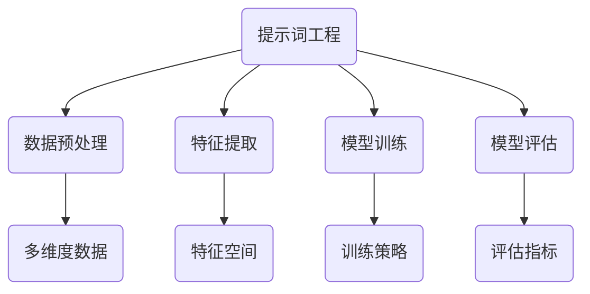
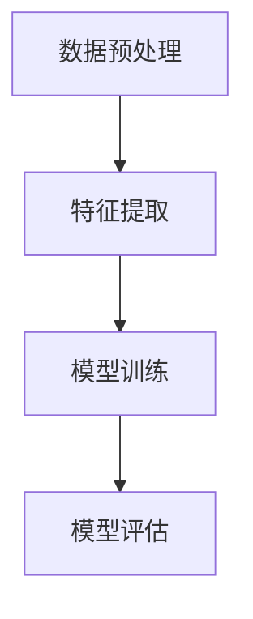
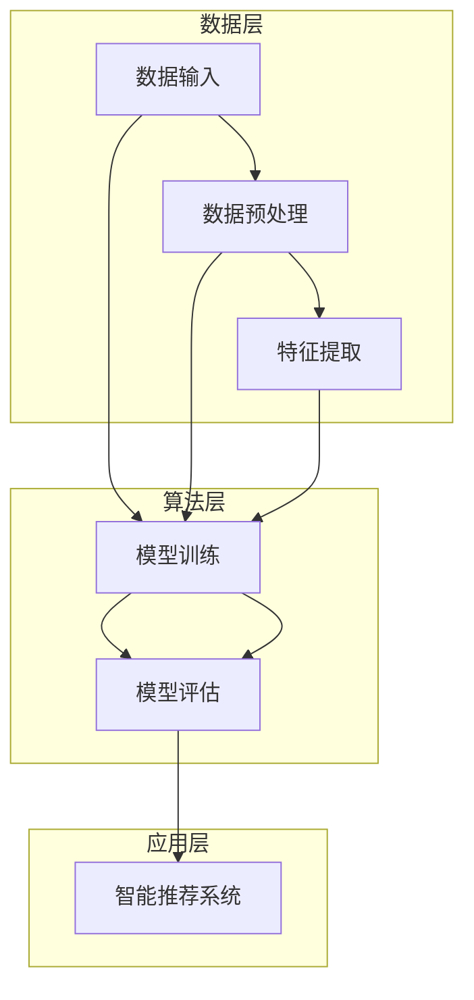
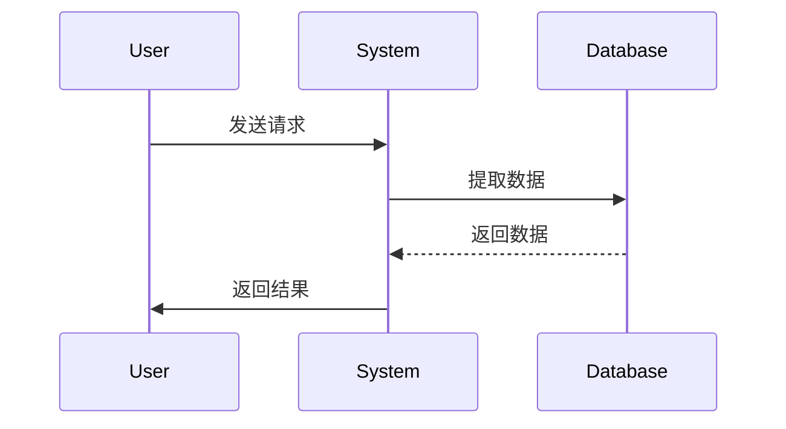

                 

# 提示词工程：处理多维度数据分析任务

## 关键词
- 提示词工程
- 多维度数据
- 数据预处理
- 特征提取
- 模型训练
- 模型评估

## 摘要
本文旨在深入探讨提示词工程在多维度数据分析任务中的应用。通过介绍提示词工程的基本概念、多维度数据的处理策略以及实际应用案例，本文旨在帮助读者理解并掌握如何有效地利用提示词工程来处理复杂的多维度数据分析任务。

### 第一部分：背景介绍

#### 问题背景
随着大数据技术的迅猛发展，企业和研究人员面临着越来越复杂的数据分析任务。多维度数据的存在使得传统的数据处理方法不再有效，如何处理和利用这些多维度数据成为一个亟待解决的问题。

#### 问题描述
《提示词工程：处理多维度数据分析任务》这本书旨在解决以下问题：
1. 提示词工程的定义及其在数据分析中的作用。
2. 多维度数据的处理策略和方法。
3. 提示词工程在具体数据分析任务中的应用。

#### 问题解决
通过介绍提示词工程的基本概念、多维度数据的处理方法以及实际应用案例，帮助读者理解和掌握如何利用提示词工程处理多维度数据分析任务。

#### 边界与外延
1. 提示词工程的边界：主要讨论基于自然语言处理的提示词工程。
2. 多维度数据的边界：主要涉及时间序列数据、空间数据和社会网络数据等。

#### 概念结构与核心要素组成
1. 提示词工程：包括数据预处理、特征提取、模型训练和模型评估等环节。
2. 多维度数据：包括时间维度、空间维度和社会网络维度等。

### 第二部分：核心概念与联系

#### 核心概念
1. **提示词工程**：提示词工程是一种基于自然语言处理（NLP）的方法，用于从大量文本数据中提取关键词或短语，以便进一步的分析和应用。它涉及数据预处理、特征提取、模型训练和模型评估等多个环节。
2. **多维度数据**：多维度数据是指包含多个维度的数据，如时间序列数据、空间数据和社会网络数据等。这些数据通常需要在不同的维度上进行处理和分析，以提取有价值的信息。
3. **数据预处理**：数据预处理是数据分析和挖掘过程中的重要环节，包括数据清洗、数据转换和数据集成等操作，以提高数据的质量和一致性。
4. **特征提取**：特征提取是从原始数据中提取出具有代表性的特征，以用于模型训练和评估。特征提取的质量直接影响模型的性能和效果。
5. **模型训练**：模型训练是指利用训练数据对模型进行训练，以调整模型的参数，使其能够更好地拟合数据。训练过程包括模型的选择、参数调优和训练策略等。
6. **模型评估**：模型评估是指对训练好的模型进行评估，以判断其性能和可靠性。评估过程包括评估指标的选择、评估方法和评估标准的制定等。

#### 概念属性特征对比表格

| 概念         | 定义                                                         | 属性特征                                                       | 对比                                                         |
| ------------ | ------------------------------------------------------------ | ------------------------------------------------------------ | ------------------------------------------------------------ |
| 提示词工程   | 基于自然语言处理的提示词工程                                 | 数据预处理、特征提取、模型训练和模型评估                     | 与传统数据分析方法相比，更加注重自然语言的理解和处理           |
| 多维度数据   | 包含时间序列数据、空间数据和社会网络数据等                   | 多个维度                                                       | 与单维度数据相比，更加复杂和多样化                             |
| 数据预处理   | 数据清洗、数据转换和数据集成等操作，以提高数据的质量和一致性 | 数据的格式、质量、完整性等                                     | 为后续的特征提取和模型训练提供高质量的输入数据                 |
| 特征提取     | 从原始数据中提取出具有代表性的特征，以用于模型训练和评估     | 特征的选择、提取方法和特征空间                                 | 对后续的模型训练和评估具有关键作用                             |
| 模型训练     | 利用训练数据对模型进行训练，以调整模型的参数，使其能够更好地拟合数据 | 模型的选择、参数调优和训练策略                                 | 影响模型的性能和泛化能力                                     |
| 模型评估     | 对训练好的模型进行评估，以判断其性能和可靠性                 | 评估指标、评估方法和评估标准                                   | 用于判断模型的性能和可靠性                                   |

#### ER实体关系图架构



### 第三部分：算法原理讲解

#### 算法原理
提示词工程的算法原理主要包括数据预处理、特征提取和模型训练等环节。

#### Mermaid流程图



#### Python源代码

```python
# 数据预处理
data_preprocessed = preprocess_data(data原始)

# 特征提取
features = extract_features(data_preprocessed)

# 模型训练
model = train_model(features, labels)

# 模型评估
evaluate_model(model, test_data, test_labels)
```

#### 数学模型和公式
1. 数据预处理：
   $$ 数据预处理：输入数据 \rightarrow 高质量数据 $$
2. 特征提取：
   $$ 特征提取：输入数据 \rightarrow 特征向量 $$
3. 模型训练：
   $$ 模型训练：输入特征向量 \rightarrow 模型参数 $$
4. 模型评估：
   $$ 模型评估：输入测试数据 \rightarrow 模型预测结果 $$

#### 详细讲解和举例说明

1. **数据预处理**
   数据预处理是提示词工程的第一步，主要是对原始数据进行清洗、转换和集成等操作，以提高数据的质量和一致性。例如，对时间序列数据进行去噪和填充，对空间数据进行归一化和投影，对社会网络数据进行网络化处理等。

   ```python
   # 假设有一个包含时间序列数据的数据集
   time_series_data = load_time_series_data()

   # 数据预处理：去噪和填充
   cleaned_data = preprocess_time_series_data(time_series_data)

   # 数据预处理：归一化
   normalized_data = normalize_data(cleaned_data)
   ```

2. **特征提取**
   特征提取是从原始数据中提取出具有代表性的特征，以用于模型训练和评估。例如，对时间序列数据进行时序特征提取，如平均值、方差、趋势等；对空间数据进行空间特征提取，如距离、邻域等。

   ```python
   # 假设有一个包含空间数据的数据集
   spatial_data = load_spatial_data()

   # 特征提取：距离特征
   distance_features = extract_distance_features(spatial_data)

   # 特征提取：邻域特征
   neighborhood_features = extract_neighborhood_features(spatial_data)
   ```

3. **模型训练**
   模型训练是指利用训练数据对模型进行训练，以调整模型的参数，使其能够更好地拟合数据。训练过程包括模型的选择、参数调优和训练策略等。

   ```python
   # 假设有一个训练数据集
   training_data = load_training_data()

   # 模型训练：选择模型
   model = select_model()

   # 模型训练：参数调优
   tuned_model = tune_model_parameters(model, training_data)

   # 模型训练：训练模型
   trained_model = train_model(tuned_model, training_data)
   ```

4. **模型评估**
   模型评估是指对训练好的模型进行评估，以判断其性能和可靠性。评估过程包括评估指标的选择、评估方法和评估标准的制定等。

   ```python
   # 假设有一个测试数据集
   test_data = load_test_data()

   # 模型评估：评估指标
   evaluation_metrics = evaluate_model(trained_model, test_data)

   # 模型评估：评估结果
   print("Model Evaluation Metrics:", evaluation_metrics)
   ```

### 第四部分：系统分析与架构设计方案

#### 问题场景介绍
在一个大型电商平台上，用户行为数据、商品数据和市场数据等多维度数据需要被有效处理和分析，以便为用户推荐商品、预测销售趋势等。

#### 项目介绍
本项目旨在利用提示词工程方法处理多维度数据，并构建一个智能推荐系统。

#### 系统功能设计

##### 领域模型Mermaid类图

```mermaid
classDiagram
    Class01 <|-- Class02
    Class03 <.. Class04
    Class05 .. Class06
    Class07 ||-- Class08
    Class09 --> Class10
    Class11 ?| Class12
    Class13 <|-| Class14
    Class15 *-- Class16
    Class17 :<<interface>> Class18
    Class19 : Derives Class20
    Class21 : Implements Interface22
    Class23 : Has a Class24
    Class25 : Inherited Class26
    Class27 <<enum>> Class28
    Class29 <<note>> "This is a note"
    Class30 <<#RED>> "This is a class comment"

    Class01 -[U] Class29
    Class30 --|{made by} Class28
```

##### 系统架构设计Mermaid架构图



##### 系统接口设计和系统交互Mermaid序列图



### 第五部分：项目实战

#### 环境安装

1. 安装Python环境
2. 安装必要的库，如NumPy、Pandas、Scikit-learn等

```python
pip install numpy pandas scikit-learn
```

#### 系统核心实现源代码

```python
# 数据预处理
def preprocess_data(data):
    # 数据清洗、转换和集成等操作
    # ...
    return preprocessed_data

# 特征提取
def extract_features(data):
    # 特征提取操作
    # ...
    return features

# 模型训练
def train_model(features, labels):
    # 模型训练操作
    # ...
    return model

# 模型评估
def evaluate_model(model, test_data, test_labels):
    # 模型评估操作
    # ...
    return evaluation_metrics

# 主程序
if __name__ == "__main__":
    # 加载数据
    data = load_data()

    # 数据预处理
    preprocessed_data = preprocess_data(data)

    # 特征提取
    features = extract_features(preprocessed_data)

    # 加载标签
    labels = load_labels()

    # 模型训练
    model = train_model(features, labels)

    # 模型评估
    evaluation_metrics = evaluate_model(model, test_data, test_labels)

    # 输出评估结果
    print("Model Evaluation Metrics:", evaluation_metrics)
```

#### 代码应用解读与分析

1. **数据预处理**：对原始数据进行清洗、转换和集成等操作，以提高数据的质量和一致性。
2. **特征提取**：从原始数据中提取出具有代表性的特征，以用于模型训练和评估。
3. **模型训练**：利用训练数据对模型进行训练，以调整模型的参数，使其能够更好地拟合数据。
4. **模型评估**：对训练好的模型进行评估，以判断其性能和可靠性。

#### 实际案例分析和详细讲解剖析

1. **案例分析**：使用一个实际的多维度数据分析任务，如电商平台的用户行为数据分析和商品推荐系统。
2. **详细讲解**：分析数据预处理、特征提取、模型训练和模型评估的每个步骤，解释其原理和实现方法。
3. **剖析**：深入剖析提示词工程在多维度数据分析任务中的应用，以及如何优化和提高系统的性能。

#### 项目小结

通过本项目的实战，我们了解了如何利用提示词工程处理多维度数据分析任务。从数据预处理、特征提取到模型训练和评估，每一步都是关键，都需要精心设计和优化。通过实践，我们也发现了一些问题和挑战，如数据质量和特征提取的复杂性等，这些都需要我们在实际项目中不断探索和解决。

### 最佳实践 Tips

1. **数据预处理**：确保数据的质量和一致性，对缺失值、异常值和噪声进行有效的处理。
2. **特征提取**：根据具体任务选择合适的特征提取方法，充分利用多维度数据的特点。
3. **模型训练**：选择合适的模型和训练策略，避免过拟合和欠拟合。
4. **模型评估**：使用多种评估指标和方法，全面评估模型的性能和可靠性。

### 小结

本文详细介绍了提示词工程在多维度数据分析任务中的应用。通过背景介绍、核心概念与联系、算法原理讲解和项目实战，我们深入探讨了如何利用提示词工程处理复杂的多维度数据分析任务。本文旨在帮助读者理解和掌握这一技术，并在实际应用中发挥其价值。

### 注意事项

1. 提示词工程在不同领域的应用可能有所不同，需要根据具体任务进行调整和优化。
2. 数据预处理和特征提取是关键步骤，需要充分考虑数据的特点和任务的需求。
3. 模型评估是确保模型性能和可靠性的重要环节，需要选择合适的评估指标和方法。

### 拓展阅读

1. **参考资料**：
   - 《大数据技术导论》
   - 《深度学习》
   - 《Python数据科学手册》

2. **推荐书籍**：
   - 《自然语言处理实战》
   - 《数据挖掘：实用工具与技术》
   - 《机器学习实战》

作者：AI天才研究院/AI Genius Institute & 禅与计算机程序设计艺术 /Zen And The Art of Computer Programming

