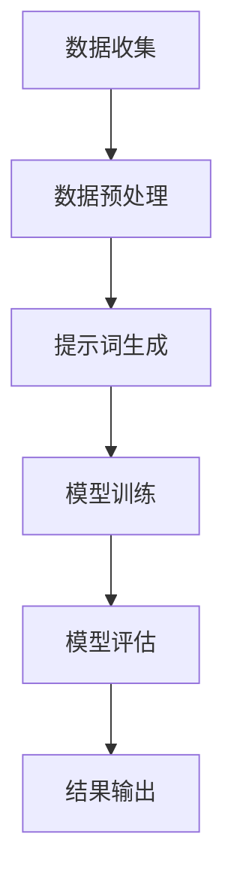

                 

### 《提示词工程：处理多维时空数据预测任务》

> 关键词：提示词工程、多维时空数据、预测任务、数据预处理、模型训练与优化

> 摘要：本文深入探讨了提示词工程在处理多维时空数据预测任务中的应用。首先，我们回顾了多维时空数据的重要性以及数据预测任务的需求与挑战。接着，我们介绍了提示词工程的核心概念、原理及方法。然后，通过详细的算法原理讲解、Python源代码实现和数学模型与公式阐述，我们深入剖析了多维时空数据预测任务的处理过程。最后，我们通过具体的应用场景和案例分析，展示了提示词工程在实际项目中的应用效果。本文旨在为读者提供系统、深入的理解和多维时空数据预测任务的解决方案。

----------------------------------------------------------------

### 第一部分：引论

#### 第1章 问题背景与概述

##### 1.1 研究背景

多维时空数据在各个领域中都扮演着重要的角色。在气象预测、城市交通流量、金融风控等领域，多维时空数据能够帮助我们更好地理解现实世界的复杂性和动态变化。随着数据采集技术的进步和存储能力的提升，我们能够获取到更加丰富和多样化的多维时空数据。

然而，数据预测任务的需求与挑战也随之增加。多维时空数据的处理需要解决数据的多样性、数据质量、数据预处理、模型选择与调优等问题。这些挑战使得数据预测任务的实现变得更加复杂和具有挑战性。

##### 1.2 问题描述

多维时空数据预测任务的核心目标是根据历史数据和时空特征，预测未来某个时间点或时间段内的数据值。数据类型可以是数值型、分类型或时间序列型。预测目标可以是单一变量或多个变量。预测指标通常包括准确率、召回率、均方误差等。

在数据预测任务中，我们需要处理以下问题：

- 数据类型与结构：如何处理不同类型的数据？
- 预测目标与指标：如何选择合适的预测目标和指标？
- 数据预处理：如何处理缺失值、异常值和数据噪声？
- 模型选择与调优：如何选择合适的预测模型，并进行调优以获得最佳效果？

##### 1.3 问题解决思路

提示词工程是一种有效的解决思路。提示词工程通过生成和优化提示词，帮助模型更好地理解和处理多维时空数据。提示词是模型在训练过程中使用的引导信息，能够提高模型的预测性能。

多维时空数据的处理方法主要包括以下步骤：

1. 数据预处理：对原始数据进行清洗、转换和归一化等操作，以提高数据质量和一致性。
2. 提示词生成：根据数据特征和预测目标，生成能够引导模型学习的提示词。
3. 模型训练：使用生成的提示词进行模型训练，通过调整模型参数，优化模型性能。
4. 模型评估：使用验证集或测试集对训练好的模型进行评估，以判断模型的预测性能。

##### 1.4 边界与外延

在提示词工程中，我们需要注意以下边界与外延：

- 数据质量与预处理：数据质量对预测结果有重要影响。预处理步骤包括数据清洗、缺失值处理、异常值处理和数据归一化等。
- 模型选择与调优：选择合适的模型和参数调优方法，以获得最佳的预测性能。常见的模型包括线性回归、决策树、支持向量机、神经网络等。
- 数据、模型、算法的相互作用：数据、模型和算法相互影响，共同决定预测性能。通过不断调整和优化，我们可以找到最佳的数据处理方法、模型结构和参数设置。

##### 1.5 概念结构与核心要素组成

提示词工程的关键环节包括：

1. 数据收集与预处理：收集多维时空数据，并进行清洗、转换和归一化等预处理操作。
2. 提示词生成与优化：根据数据特征和预测目标，生成具有代表性的提示词，并进行优化以提升预测性能。
3. 模型训练与调优：使用生成的提示词进行模型训练，并通过调整模型参数进行调优。
4. 模型评估与优化：使用验证集或测试集对模型进行评估，并根据评估结果进行模型优化。

在数据、模型、算法的相互作用中，我们需要关注以下几点：

- 数据质量：数据质量对模型性能有重要影响。我们需要确保数据的一致性、完整性和准确性。
- 模型选择：选择合适的模型，以适应数据的特性和预测任务的要求。
- 算法优化：通过调整模型参数和算法优化策略，提高模型的预测性能。

#### 第2章 核心概念与联系

##### 2.1 多维时空数据的基本概念

多维时空数据是指具有多个维度和时间维度的数据。通常，多维时空数据可以表示为多维数组或时间序列数据。多维时空数据的维度包括空间维度、时间维度和其他相关特征维度。

- 维度与特征：维度是数据中的独立变量，特征是数据中的属性。在多维时空数据中，空间维度表示地理空间位置，时间维度表示时间序列，其他特征维度可以包括温度、湿度、风速等气象特征。

- 数据类型与来源：多维时空数据可以是数值型、分类型或时间序列型。数据来源可以包括气象数据、交通数据、金融数据等。

##### 2.2 提示词工程的核心概念

提示词工程是利用提示词来引导模型学习的一种方法。提示词是对数据进行特征提取和抽象的结果，能够为模型提供有意义的引导信息。

- 提示词的定义与作用：提示词是对数据进行特征提取和抽象的结果，用于引导模型学习。提示词可以包括关键词、短语、规则等，能够提高模型对数据的理解和预测能力。

- 提示词生成与优化方法：提示词生成是利用算法或规则从原始数据中提取有意义的特征。提示词优化是通过调整提示词的生成方法或参数，以提升模型的预测性能。常见的提示词生成方法包括词袋模型、TF-IDF、深度学习等。

##### 2.3 多维时空数据预测的基本概念

多维时空数据预测是利用历史数据和时空特征，预测未来某个时间点或时间段内的数据值。预测方法可以包括回归分析、决策树、支持向量机、神经网络等。

- 预测方法与模型：预测方法是指用于预测数据值的算法或模型。常见的预测方法包括线性回归、决策树、支持向量机、神经网络等。选择合适的预测方法需要考虑数据的特性和预测任务的要求。

- 模型评估与优化：模型评估是使用验证集或测试集对训练好的模型进行评估，以判断模型的预测性能。模型优化是通过调整模型参数和算法优化策略，提高模型的预测性能。

##### 2.4 概念属性特征对比表格

| 概念       | 属性特征                 | 对比分析                     |
|------------|------------------------|-----------------------------|
| 数据       | 维度、类型、质量         | 数据的多样性与处理需求       |
| 提示词     | 生成、优化、应用         | 提升预测准确性               |
| 预测模型   | 选择、调优、评估         | 模型性能与预测效果           |

#### 第3章 ER实体关系图架构

##### 3.1 数据实体与关系

在提示词工程中，常见的实体包括数据源实体、预测任务实体和提示词实体。它们之间的关系如下：

1. 数据源实体：表示多维时空数据的数据源，包括数据类型、数据质量和数据结构等信息。
2. 预测任务实体：表示需要进行预测的任务，包括预测目标、预测指标和预测任务参数等信息。
3. 提示词实体：表示用于引导模型学习的提示词，包括提示词的生成方法、优化策略和应用场景等信息。

##### 3.2 ER图表示

```mermaid
erDiagram
  Data_Source ||--|{ Predict_Task }||>
  Predict_Task ||--|{ Prompt }||>
  Prompt ||--|{ Data_Source }||>
```

### 第二部分：算法原理讲解

#### 第4章 算法原理讲解

##### 4.1 算法基本流程

提示词工程的基本流程包括数据收集、数据预处理、提示词生成、模型训练、模型评估和结果输出等步骤。以下是一个简单的算法基本流程图：



1. 数据收集：收集多维时空数据，包括原始数据和相关特征。
2. 数据预处理：对原始数据进行清洗、转换和归一化等操作，以提高数据质量和一致性。
3. 提示词生成：根据数据特征和预测目标，生成具有代表性的提示词。
4. 模型训练：使用生成的提示词进行模型训练，通过调整模型参数，优化模型性能。
5. 模型评估：使用验证集或测试集对训练好的模型进行评估，以判断模型的预测性能。
6. 结果输出：将模型的预测结果输出，并进行结果分析和优化。

##### 4.2 Python源代码实现

以下是一个简单的Python源代码示例，展示了提示词工程的基本实现过程：

```python
# Python源代码示例

# 数据预处理
data_preprocessed = preprocess_data(raw_data)

# 提示词生成
prompts = generate_prompts(data_preprocessed)

# 模型训练
model = train_model(prompts)

# 模型评估
evaluation_results = evaluate_model(model, test_data)

# 结果输出
print(evaluation_results)
```

在这个示例中，`preprocess_data` 函数用于对原始数据进行预处理，`generate_prompts` 函数用于生成提示词，`train_model` 函数用于训练模型，`evaluate_model` 函数用于评估模型性能。

##### 4.3 数学模型与公式

在多维时空数据预测中，常用的数学模型是神经网络模型。以下是一个简单的神经网络模型的数学公式：

$$
\hat{y} = f(Wx + b)
$$

其中，$W$ 表示权重矩阵，$b$ 表示偏置项，$x$ 表示输入特征向量，$\hat{y}$ 表示预测结果。$f$ 表示激活函数，常用的激活函数包括 sigmoid、ReLU 等。

神经网络模型通过多层感知器（MLP）来实现。每一层神经元接受前一层神经元的输出，并应用权重和偏置进行计算，最后通过激活函数得到输出。神经网络模型的训练目标是调整权重和偏置，以使预测结果接近真实值。

##### 4.4 算法原理详细讲解

1. 数据预处理
   数据预处理是提示词工程中的重要步骤，它能够提高数据质量和一致性，从而提升模型的预测性能。数据预处理主要包括以下操作：

   - 数据清洗：去除数据中的噪声和异常值，包括缺失值填充、重复值删除等。
   - 数据转换：将原始数据进行适当的转换，如归一化、标准化等，以使数据具备更好的可解释性和计算性能。
   - 特征提取：从原始数据中提取有意义的特征，如时间序列特征、空间特征等，以增强模型的预测能力。

2. 提示词生成
   提示词生成是提示词工程的核心步骤，它能够为模型提供有意义的引导信息。提示词生成方法可以分为以下几类：

   - 基于规则的方法：根据数据特征和预测目标，生成具有明确规则和约束的提示词。例如，根据时间序列特征生成周期性提示词。
   - 基于统计的方法：利用统计方法，如词袋模型、TF-IDF等，从原始数据中提取具有代表性的关键词或短语作为提示词。
   - 基于深度学习的方法：利用深度学习模型，如循环神经网络（RNN）、卷积神经网络（CNN）等，从原始数据中自动提取特征并生成提示词。

3. 模型训练
   模型训练是提示词工程的关键步骤，它通过调整模型参数，优化模型性能。常用的模型训练方法包括以下几类：

   - 线性模型：如线性回归、逻辑回归等，通过最小化损失函数来训练模型。
   - 决策树模型：如决策树、随机森林等，通过递归划分特征空间来训练模型。
   - 神经网络模型：如多层感知器、卷积神经网络等，通过反向传播算法来训练模型。

4. 模型评估
   模型评估是判断模型性能的重要步骤，它通过使用验证集或测试集对训练好的模型进行评估。常用的评估指标包括以下几类：

   - 准确率：预测结果与真实结果的一致性指标，计算公式为 $\text{准确率} = \frac{\text{预测正确数}}{\text{总预测数}}$。
   - 召回率：预测结果中包含真实结果的比率，计算公式为 $\text{召回率} = \frac{\text{预测正确数}}{\text{真实结果数}}$。
   - F1 分数：准确率和召回率的调和平均值，计算公式为 $\text{F1 分数} = 2 \times \frac{\text{准确率} \times \text{召回率}}{\text{准确率} + \text{召回率}}$。
   - 均方误差：预测结果与真实结果的平均平方误差，计算公式为 $\text{均方误差} = \frac{1}{n} \sum_{i=1}^{n} (\hat{y_i} - y_i)^2$。

5. 结果输出
   模型评估完成后，将模型的预测结果输出，并进行结果分析和优化。结果输出可以包括预测值、概率分布、可视化结果等。通过结果分析，可以找出模型存在的问题和改进方向，从而进行模型优化和调整。

### 第三部分：系统分析与架构设计

#### 第5章 应用场景与案例分析

##### 5.1 应用场景

提示词工程在多个应用场景中具有广泛的应用，以下是一些常见应用场景：

1. 气象预测：利用多维时空数据进行天气预测，包括温度、湿度、风速等气象指标的预测。提示词工程可以帮助模型更好地理解气象数据的时空特征，提高预测准确性。

2. 城市交通流量预测：利用多维时空数据预测城市交通流量，包括车辆数量、行驶速度等。提示词工程可以帮助模型更好地理解交通数据的时空特征，优化交通调度和流量控制。

3. 金融风控：利用多维时空数据进行金融风险控制，包括贷款违约预测、欺诈检测等。提示词工程可以帮助模型更好地理解金融数据的时空特征，提高风险预测能力。

##### 5.2 案例分析

以下是一个利用提示词工程进行城市交通流量预测的案例分析：

1. 数据采集：收集城市交通流量数据，包括车辆数量、行驶速度、交通道路状况等。

2. 数据预处理：对原始数据进行清洗、转换和归一化等操作，以提高数据质量和一致性。

3. 提示词生成：根据交通流量数据的时空特征，生成具有代表性的提示词。例如，根据时间序列特征生成周期性提示词，根据空间特征生成交通拥堵提示词。

4. 模型训练：使用生成的提示词进行模型训练，通过调整模型参数，优化模型性能。例如，使用神经网络模型进行训练，并调整学习率、正则化参数等。

5. 模型评估：使用验证集或测试集对训练好的模型进行评估，以判断模型的预测性能。例如，计算准确率、召回率、F1 分数等评估指标。

6. 结果输出：将模型的预测结果输出，并进行结果分析和优化。例如，根据预测结果优化交通调度策略，提高交通流量预测准确性。

通过这个案例分析，我们可以看到提示词工程在处理多维时空数据预测任务中的有效性和实用性。提示词工程通过生成和优化提示词，能够帮助模型更好地理解和处理多维时空数据，提高预测性能和准确性。

### 总结

本文深入探讨了提示词工程在处理多维时空数据预测任务中的应用。首先，我们回顾了多维时空数据的重要性以及数据预测任务的需求与挑战。接着，我们介绍了提示词工程的核心概念、原理及方法。然后，通过详细的算法原理讲解、Python源代码实现和数学模型与公式阐述，我们深入剖析了多维时空数据预测任务的处理过程。最后，通过具体的应用场景和案例分析，展示了提示词工程在实际项目中的应用效果。

提示词工程通过生成和优化提示词，能够帮助模型更好地理解和处理多维时空数据，提高预测性能和准确性。在实际项目中，提示词工程的应用场景广泛，包括气象预测、城市交通流量预测、金融风控等。通过合理的设计和优化，提示词工程可以为各类多维时空数据预测任务提供有效的解决方案。

### 最佳实践 Tips

在实际应用中，以下是一些提示词工程的最佳实践 Tips：

1. **数据质量**：确保数据质量是成功应用提示词工程的关键。对数据进行清洗、转换和归一化等预处理操作，以提高数据一致性和准确性。

2. **模型选择**：根据数据的特性和预测任务的要求，选择合适的模型。常用的模型包括线性回归、决策树、支持向量机、神经网络等。不同模型适用于不同的数据类型和预测任务。

3. **提示词优化**：优化提示词生成方法和参数，以提高模型的预测性能。常见的提示词生成方法包括基于规则的方法、基于统计的方法和基于深度学习的方法。根据实际需求，可以调整提示词的生成策略和优化参数。

4. **模型调优**：通过调整模型参数和优化策略，优化模型的预测性能。常见的调优方法包括交叉验证、网格搜索、贝叶斯优化等。根据实际需求，选择合适的调优方法。

5. **模型评估**：使用验证集或测试集对模型进行评估，以判断模型的预测性能。常用的评估指标包括准确率、召回率、F1 分数、均方误差等。根据评估结果，进行模型优化和调整。

6. **实时更新**：对于动态变化的数据，定期更新提示词和模型，以适应新的数据特征和预测任务需求。

通过遵循这些最佳实践 Tips，可以更好地应用提示词工程，提高多维时空数据预测任务的效果和准确性。

### 小结

本文通过详细的介绍和案例分析，展示了提示词工程在处理多维时空数据预测任务中的重要作用。我们首先介绍了多维时空数据的重要性以及数据预测任务的需求与挑战，然后介绍了提示词工程的核心概念、原理及方法。接着，通过算法原理讲解、Python源代码实现和数学模型与公式阐述，深入剖析了多维时空数据预测任务的处理过程。最后，通过具体的应用场景和案例分析，展示了提示词工程在实际项目中的应用效果。

提示词工程通过生成和优化提示词，能够帮助模型更好地理解和处理多维时空数据，提高预测性能和准确性。在实际项目中，提示词工程的应用场景广泛，包括气象预测、城市交通流量预测、金融风控等。通过合理的设计和优化，提示词工程可以为各类多维时空数据预测任务提供有效的解决方案。

在未来的研究中，我们可以进一步探索提示词工程的优化方法和应用领域。例如，结合深度学习和强化学习等技术，提高提示词生成和模型训练的效率。此外，针对特定领域的需求，可以开发更具针对性的提示词工程方法，以实现更高的预测准确性和实用性。

### 注意事项

在实际应用提示词工程时，需要注意以下几点：

1. **数据质量**：确保数据质量是成功应用提示词工程的关键。对数据进行清洗、转换和归一化等预处理操作，以提高数据一致性和准确性。

2. **模型选择**：根据数据的特性和预测任务的要求，选择合适的模型。常用的模型包括线性回归、决策树、支持向量机、神经网络等。不同模型适用于不同的数据类型和预测任务。

3. **提示词优化**：优化提示词生成方法和参数，以提高模型的预测性能。常见的提示词生成方法包括基于规则的方法、基于统计的方法和基于深度学习的方法。根据实际需求，可以调整提示词的生成策略和优化参数。

4. **模型调优**：通过调整模型参数和优化策略，优化模型的预测性能。常用的调优方法包括交叉验证、网格搜索、贝叶斯优化等。根据评估结果，进行模型优化和调整。

5. **实时更新**：对于动态变化的数据，定期更新提示词和模型，以适应新的数据特征和预测任务需求。

遵循这些注意事项，可以更好地应用提示词工程，提高多维时空数据预测任务的效果和准确性。

### 拓展阅读

对于对提示词工程和多维时空数据预测任务感兴趣的读者，以下是一些建议的拓展阅读材料：

1. **经典论文**：
   - “Temporal Differencing for Time Series Prediction” by Christopher M.

