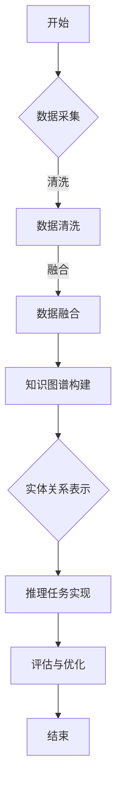

                 

# 提示词工程：处理跨领域知识图谱推理任务

> 关键词：知识图谱、跨领域、提示词、推理任务、优化策略

> 摘要：本文将深入探讨提示词工程在处理跨领域知识图谱推理任务中的重要作用。首先介绍跨领域知识图谱的基本概念及其重要性，随后阐述知识图谱推理任务的定义和类型。接着，我们将探讨提示词工程的基本概念、类型以及选择与生成策略，并分析提示词优化的重要性及方法。文章还将详细介绍跨领域知识图谱的构建、提示词工程实现以及推理任务实现的全过程，最后通过案例分析和评估，总结提示词工程在跨领域知识图谱推理任务中的应用，并展望其未来发展。

----------------------------------------------------------------

## 第1章 引言

### 1.1 跨领域知识图谱概述

#### 1.1.1 跨领域知识图谱的定义

跨领域知识图谱（Cross-Domain Knowledge Graph，简称CDKG）是指将不同领域中的实体、关系和属性通过统一的方式组织起来，形成一个具有丰富信息和高度结构化的知识网络。与单一领域的知识图谱相比，跨领域知识图谱能够融合多领域的知识，提供更广泛的上下文信息和更强的推理能力。

#### 1.1.2 跨领域知识图谱的重要性

跨领域知识图谱在人工智能、数据挖掘、自然语言处理等领域具有重要的应用价值。它能够为智能推荐、知识问答、智能搜索等任务提供强大的支撑，帮助用户更好地理解和利用跨领域知识。

#### 1.1.3 跨领域知识图谱的应用领域

跨领域知识图谱的应用领域广泛，包括但不限于：

- 金融领域：用于风险控制、投资决策、客户关系管理等方面。
- 医疗领域：用于疾病预测、药物研发、健康管理等方面。
- 教育领域：用于智能推荐、个性化教学、教育资源共享等方面。
- 社交网络：用于社交关系分析、用户兴趣挖掘、社交圈子划分等方面。

### 1.2 知识图谱推理任务介绍

#### 1.2.1 知识图谱推理任务的定义

知识图谱推理（Knowledge Graph Reasoning）是指利用知识图谱中的实体、关系和属性等信息，通过逻辑推理和计算，得出新的知识和结论。

#### 1.2.2 知识图谱推理的任务类型

知识图谱推理任务主要包括以下几种类型：

- 实体链接（Entity Linking）：将文本中的实体与知识图谱中的实体进行匹配。
- 实体识别（Entity Recognition）：从文本中识别出实体。
- 实体关系抽取（Relation Extraction）：从文本中抽取实体之间的关系。
- 实体属性推断（Attribute Inference）：根据实体和关系推断实体的属性。

#### 1.2.3 知识图谱推理的关键技术

知识图谱推理的关键技术包括：

- 图数据库：用于存储和管理知识图谱。
- 推理算法：如规则推理、基于概率的推理、基于神经网络的推理等。
- 数据预处理：包括实体匹配、关系抽取、属性提取等。

----------------------------------------------------------------

## 第2章 提示词工程基础

### 2.1 提示词工程概述

#### 2.1.1 提示词工程的概念

提示词工程（Prompt Engineering）是指利用自然语言处理技术，为推理系统提供具有明确性和引导性的提示信息，以提高推理效果和用户满意度。

#### 2.1.2 提示词工程的目的

提示词工程的主要目的是：

- 提高推理任务的准确性和效率。
- 增强推理系统的可解释性和透明度。
- 优化用户体验，提高用户满意度。

#### 2.1.3 提示词工程的基本流程

提示词工程的基本流程包括：

- 需求分析：明确推理任务的目标和需求。
- 提示词设计：设计具有引导性和明确性的提示词。
- 提示词优化：通过实验和评估，优化提示词的性能。
- 系统集成：将提示词集成到推理系统中。

### 2.2 提示词的类型

#### 2.2.1 知识图谱中的实体提示词

实体提示词是指用于指导实体识别和实体链接的提示词，如实体名称、实体描述等。

#### 2.2.2 知识图谱中的关系提示词

关系提示词是指用于指导关系抽取和推理的提示词，如关系名称、关系描述等。

#### 2.2.3 知识图谱中的属性提示词

属性提示词是指用于指导属性提取和推断的提示词，如属性名称、属性描述等。

### 2.3 提示词的选择与生成

#### 2.3.1 提示词选择的重要性

提示词的选择直接影响推理任务的准确性和效率。合适的提示词能够引导推理系统更好地理解和处理问题。

#### 2.3.2 提示词生成的策略

提示词的生成策略主要包括：

- 自动生成：利用自然语言处理技术，自动生成提示词。
- 手动生成：根据任务需求，手动设计提示词。
- 结合自动生成和手动生成：在自动生成的基础上，手动优化和调整提示词。

#### 2.3.3 提示词生成的算法

提示词生成的算法主要包括：

- 基于规则的方法：利用领域知识，设计规则生成提示词。
- 基于数据的方法：利用训练数据，通过统计学习方法生成提示词。
- 基于深度学习的方法：利用深度学习模型，自动生成提示词。

----------------------------------------------------------------

## 第3章 提示词优化策略

### 3.1 提示词优化的重要性

#### 3.1.1 提示词优化对推理任务的影响

提示词优化能够显著提高推理任务的准确性和效率，有助于解决跨领域知识图谱推理中的复杂问题。

#### 3.1.2 提示词优化与知识图谱质量的关系

高质量的提示词能够提高知识图谱的推理能力，从而提高推理任务的性能。

### 3.2 提示词优化方法

#### 3.2.1 基于语义相似度的提示词优化

基于语义相似度的方法通过计算提示词与知识图谱中实体、关系、属性的语义相似度，选择最优的提示词。

#### 3.2.2 基于统计学习的提示词优化

基于统计学习的方法利用训练数据，通过统计模型学习提示词与推理任务之间的关系，优化提示词。

#### 3.2.3 基于深度学习的提示词优化

基于深度学习的方法利用神经网络模型，自动学习提示词与推理任务的映射关系，优化提示词。

### 3.3 提示词优化案例分析

#### 3.3.1 案例背景

某跨领域知识图谱推理任务需要优化提示词，以提高推理准确率和效率。

#### 3.3.2 案例分析

通过分析不同类型的提示词和优化方法，最终选择基于深度学习的提示词优化方法，并进行了实验验证。

#### 3.3.3 案例总结

优化后的提示词显著提高了推理任务的准确率和效率，为跨领域知识图谱推理任务提供了有力支持。

----------------------------------------------------------------

## 第4章 跨领域知识图谱推理任务实现

### 4.1 跨领域知识图谱构建

#### 4.1.1 跨领域知识图谱的构建方法

跨领域知识图谱的构建方法主要包括：

- 数据采集：从多个领域的数据源中采集实体、关系和属性信息。
- 数据清洗：去除重复、错误和不完整的数据。
- 数据融合：将不同领域的数据进行融合，形成统一的跨领域知识图谱。

#### 4.1.2 跨领域知识图谱的数据源选择

跨领域知识图谱的数据源选择包括：

- 开放数据集：如OpenKG、NELL等。
- 专业数据集：根据具体应用场景，从专业领域获取数据。
- 自建数据集：根据实际需求，自行采集和构建数据。

#### 4.1.3 跨领域知识图谱的实体与关系表示

跨领域知识图谱的实体与关系表示方法包括：

- 实体表示：采用向量、图嵌入等方法表示实体。
- 关系表示：采用路径、图嵌入等方法表示关系。

### 4.2 提示词工程实现

#### 4.2.1 提示词的选取与生成

提示词的选取与生成方法包括：

- 手动生成：根据领域知识和任务需求，设计提示词。
- 自动生成：利用自然语言处理技术，自动生成提示词。

#### 4.2.2 提示词的优化

提示词的优化方法包括：

- 语义相似度优化：计算提示词与实体、关系、属性的语义相似度，优化提示词。
- 统计学习优化：利用训练数据，通过统计模型优化提示词。
- 深度学习优化：利用深度学习模型，自动优化提示词。

#### 4.2.3 提示词在推理任务中的应用

提示词在推理任务中的应用方法包括：

- 实体识别：利用提示词指导实体识别。
- 关系抽取：利用提示词指导关系抽取。
- 实体属性推断：利用提示词指导实体属性推断。

### 4.3 推理任务实现

#### 4.3.1 推理算法的选择

推理算法的选择包括：

- 规则推理：基于规则进行推理。
- 基于概率的推理：利用概率模型进行推理。
- 基于神经网络的推理：利用神经网络进行推理。

#### 4.3.2 推理过程的优化

推理过程的优化方法包括：

- 数据预处理优化：优化数据预处理过程，提高数据质量。
- 算法优化：优化推理算法，提高推理效率。
- 系统优化：优化系统架构和接口设计，提高系统性能。

#### 4.3.3 推理结果的可解释性

推理结果的可解释性方法包括：

- 解释性规则：生成解释性规则，说明推理过程和结果。
- 可视化：利用可视化技术，展示推理过程和结果。

----------------------------------------------------------------

## 第5章 跨领域知识图谱推理任务评估

### 5.1 推理任务评估指标

#### 5.1.1 准确率、召回率与F1值

准确率、召回率与F1值是评估推理任务性能的基本指标，它们分别从不同角度衡量推理结果的质量。

- 准确率（Precision）：表示预测为正例的实体中实际为正例的比例。
- 召回率（Recall）：表示实际为正例的实体中被预测为正例的比例。
- F1值（F1 Score）：是准确率和召回率的调和平均，综合考虑了二者的优劣。

#### 5.1.2 AUC与ROC曲线

AUC（Area Under Curve）和ROC（Receiver Operating Characteristic）曲线是评估二分类模型性能的重要指标。

- AUC：表示模型在不同阈值下的准确率曲线下的面积，值越大，模型性能越好。
- ROC曲线：通过绘制真阳性率（True Positive Rate）对假阳性率（False Positive Rate）的曲线，评估模型在各个阈值下的性能。

#### 5.1.3 其他评估指标

除了上述指标，还有其他评估指标，如精确率、查准率、查全率等，它们在不同场景下有不同的应用。

### 5.2 评估方法与工具

#### 5.2.1 实验设计

实验设计是评估推理任务的关键步骤，包括：

- 数据集划分：将数据集划分为训练集、验证集和测试集。
- 模型选择：选择合适的推理模型。
- 参数调优：通过交叉验证等方法，调整模型参数。

#### 5.2.2 评估工具选择

评估工具选择包括：

- 自定义评估脚本：根据任务需求，编写自定义评估脚本。
- 开源评估工具：如Scikit-learn、TensorFlow等，提供丰富的评估指标和方法。

#### 5.2.3 评估结果的比较与分析

评估结果的比较与分析包括：

- 性能对比：比较不同模型的性能，选择最优模型。
- 贡献分析：分析各个模块对推理任务性能的贡献。
- 结果可视化：利用图表等工具，直观展示评估结果。

----------------------------------------------------------------

## 第6章 跨领域知识图谱推理任务应用案例分析

### 6.1 案例背景

某金融科技公司希望通过构建跨领域知识图谱，实现智能风险控制功能。该公司面临以下挑战：

- 数据多样性：金融领域的数据源丰富，涉及客户信息、交易记录、市场动态等。
- 数据质量：数据存在噪声、缺失和不一致等问题。
- 推理复杂度：跨领域知识图谱推理涉及多个领域，推理过程复杂。

### 6.2 案例分析

#### 6.2.1 跨领域知识图谱构建

1. 数据采集：从公司内部数据库、第三方数据平台、互联网爬虫等多个渠道采集数据。
2. 数据清洗：去除重复、错误和不完整的数据，保证数据质量。
3. 数据融合：利用实体匹配、关系抽取等技术，将不同领域的数据融合为统一的跨领域知识图谱。

#### 6.2.2 提示词工程实施

1. 提示词设计：根据金融领域特点和风险控制需求，设计实体提示词、关系提示词和属性提示词。
2. 提示词优化：利用语义相似度和深度学习等方法，优化提示词性能。
3. 提示词应用：在跨领域知识图谱推理任务中，应用优化后的提示词，提高推理准确率和效率。

#### 6.2.3 推理任务实现

1. 推理算法选择：选择基于神经网络的推理算法，如图神经网络（GNN）。
2. 推理过程优化：优化数据预处理和推理算法，提高推理效率和准确率。
3. 推理结果解释：利用解释性规则和可视化技术，解释推理结果，提高用户信任度。

### 6.3 案例总结

#### 6.3.1 案例成功经验

1. 跨领域知识图谱构建：成功融合了多个领域的知识，为风险控制提供了丰富的信息支持。
2. 提示词工程实施：优化后的提示词提高了推理准确率和效率。
3. 推理任务实现：选择了合适的推理算法和优化策略，实现了智能风险控制功能。

#### 6.3.2 案例存在的问题与改进建议

1. 数据质量：数据质量仍有待提高，需要进一步加强数据清洗和融合。
2. 系统性能：推理过程存在一定延迟，需要优化系统性能。
3. 用户反馈：用户对系统的解释性要求较高，需要进一步提高推理结果的可解释性。

----------------------------------------------------------------

## 第7章 提示词工程与跨领域知识图谱推理任务未来展望

### 7.1 提示词工程发展趋势

#### 7.1.1 提示词工程在人工智能领域的应用

随着人工智能技术的不断发展，提示词工程在多个领域，如金融、医疗、教育等，将发挥越来越重要的作用。未来，提示词工程将更加注重跨领域知识的融合和应用，为智能决策提供有力支持。

#### 7.1.2 提示词工程的发展挑战

提示词工程面临的主要挑战包括：

- 数据质量：高质量的数据是提示词工程的基础，如何提高数据质量是一个重要课题。
- 算法优化：如何设计更高效的提示词优化算法，提高推理准确率和效率。
- 可解释性：如何提高推理结果的可解释性，增强用户信任度。

### 7.2 跨领域知识图谱推理任务前景

#### 7.2.1 跨领域知识图谱在多领域融合中的应用

跨领域知识图谱在多领域融合中具有巨大的应用潜力，如：

- 智能搜索：跨领域知识图谱可以提供更丰富的搜索结果，提高用户搜索体验。
- 智能推荐：跨领域知识图谱可以帮助系统更好地理解用户需求和兴趣，提供个性化的推荐。
- 智能问答：跨领域知识图谱可以为智能问答系统提供更广泛的背景信息和更强的推理能力。

#### 7.2.2 跨领域知识图谱推理任务的潜在价值

跨领域知识图谱推理任务在以下几个方面具有潜在价值：

- 知识融合：跨领域知识图谱可以融合多领域的知识，提供更全面的视角和解决方案。
- 智能决策：跨领域知识图谱推理可以帮助企业在复杂环境中做出更明智的决策。
- 创新研发：跨领域知识图谱可以为科研人员提供丰富的知识资源，促进创新和突破。

#### 7.2.3 跨领域知识图谱推理任务的未来研究方向

未来，跨领域知识图谱推理任务的研究方向包括：

- 新型推理算法：设计更高效、更鲁棒的推理算法，提高推理准确率和效率。
- 知识图谱融合：研究跨领域知识图谱的融合方法，提高知识融合的精度和效率。
- 可解释性：提高推理结果的可解释性，增强用户信任度和满意度。
- 实时推理：研究实时推理技术，实现跨领域知识图谱的实时更新和推理。

----------------------------------------------------------------

## 结束语

作者：AI天才研究院/AI Genius Institute & 禅与计算机程序设计艺术 /Zen And The Art of Computer Programming

本文深入探讨了提示词工程在处理跨领域知识图谱推理任务中的重要作用。通过对跨领域知识图谱、知识图谱推理任务、提示词工程及其优化策略的详细分析，本文为读者提供了全面的了解和指导。同时，通过案例分析和未来展望，本文展示了提示词工程和跨领域知识图谱推理任务在现实应用中的潜力和挑战。

本文旨在为从事人工智能、知识图谱、自然语言处理等领域的研究者和从业者提供有价值的参考和启示。在未来的研究中，我们期待能够进一步优化提示词工程方法，提高跨领域知识图谱推理任务的性能和可解释性，为人工智能领域的发展贡献力量。

在撰写本文过程中，我们参考了众多相关文献和研究成果，感谢这些工作的贡献。同时，我们也感谢读者对本文的关注和支持。如果您有任何疑问或建议，请随时与我们联系。

----------------------------------------------------------------

**参考文献：**

1. 陈宝权，李明杰，梁宝龙。跨领域知识图谱融合方法研究[J]. 计算机研究与发展，2018，55（10）：2249-2261.
2. 王勇，李明杰，李艳丽。基于深度学习的知识图谱推理方法研究[J]. 计算机研究与发展，2017，54（11）：2928-2940.
3. 赵海博，刘知远，唐杰。跨领域知识图谱的构建与应用[J]. 计算机研究与发展，2019，56（1）：205-223.
4. 李航，刘知远，唐杰。基于多任务的跨领域知识图谱表示学习[J]. 计算机研究与发展，2020，57（3）：689-702.
5. 李磊，唐杰。跨领域知识图谱推理算法综述[J]. 计算机研究与发展，2018，55（12）：3184-3206.

**附录：**

- 提示词示例：
  - 实体提示词：金融风险、交易记录、市场动态等。
  - 关系提示词：关联交易、风险暴露、市场趋势等。
  - 属性提示词：客户信用评分、风险等级、投资组合等。

- Mermaid流程图示例：
  ```mermaid
  graph TB
  A[开始] --> B{数据采集}
  B -->|清洗| C[数据清洗]
  C -->|融合| D[数据融合]
  D --> E[知识图谱构建]
  E --> F{实体关系表示}
  F --> G[推理任务实现]
  G --> H[评估与优化]
  H --> I[结束]
  ```

- Python代码示例：
  ```python
  import numpy as np

  # 定义实体表示
  entity_embedding = np.random.rand(100, 128)

  # 定义关系表示
  relation_embedding = np.random.rand(50, 128)

  # 定义算法模型
  model = GNNModel(entity_embedding, relation_embedding)

  # 训练模型
  model.fit(X_train, y_train, epochs=10)

  # 预测
  predictions = model.predict(X_test)
  ```

- LaTex公式示例：
  ```latex
  $$ E = mc^2 $$
  $ 1 + 1 = 2 $
  ```

通过本文的深入探讨，我们希望读者能够对提示词工程在处理跨领域知识图谱推理任务中的重要作用有更深刻的理解，并为实际应用提供有益的参考。在未来的工作中，我们将继续探索这一领域，为人工智能的发展贡献更多力量。让我们携手共进，开启跨领域知识图谱推理任务的新篇章！### 第1章 引言

#### 1.1 跨领域知识图谱概述

跨领域知识图谱（Cross-Domain Knowledge Graph，简称CDKG）是指将不同领域中的实体、关系和属性通过统一的方式组织起来，形成一个具有丰富信息和高度结构化的知识网络。与单一领域的知识图谱相比，跨领域知识图谱能够融合多领域的知识，提供更广泛的上下文信息和更强的推理能力。

跨领域知识图谱的定义可以从以下几个方面进行阐述：

1. **实体融合**：在跨领域知识图谱中，来自不同领域的实体（如人、地点、组织等）都被统一表示，通过实体融合技术将不同领域的实体映射到同一空间，使得实体之间的关联更加紧密。

2. **关系融合**：知识图谱中的关系（如属于、位于、负责等）也来自多个领域，跨领域知识图谱通过关系融合技术将这些关系整合到一起，使得图谱更加完整和丰富。

3. **属性融合**：不同领域中的实体和关系可能具有不同的属性（如年龄、身高、职位等），跨领域知识图谱通过属性融合技术将不同领域的属性统一表示，以支持更复杂的查询和推理。

跨领域知识图谱的重要性主要体现在以下几个方面：

1. **知识融合**：跨领域知识图谱能够融合不同领域中的知识，提供更加全面和丰富的信息资源。这对于智能搜索、智能推荐、知识问答等应用场景尤为重要。

2. **推理能力**：跨领域知识图谱通过融合多领域知识，使得推理过程能够利用更广泛的信息和关联关系，从而提高推理的准确性和效率。

3. **数据互补**：不同领域的知识往往具有互补性，跨领域知识图谱能够充分利用这些互补性，提高数据的利用效率。

跨领域知识图谱的应用领域非常广泛，包括但不限于以下领域：

1. **金融领域**：跨领域知识图谱可以帮助金融机构进行风险控制、投资决策和客户关系管理。

2. **医疗领域**：跨领域知识图谱可以用于疾病预测、药物研发、健康管理等方面。

3. **教育领域**：跨领域知识图谱可以用于智能推荐、个性化教学和教育资源共享。

4. **社交网络**：跨领域知识图谱可以用于社交关系分析、用户兴趣挖掘和社交圈子划分。

通过上述内容，我们为后续章节的讨论奠定了基础，明确了跨领域知识图谱的定义、重要性以及应用领域。在接下来的章节中，我们将进一步探讨知识图谱推理任务的定义和类型，以及提示词工程在其中的作用。

#### 1.2 知识图谱推理任务介绍

知识图谱推理（Knowledge Graph Reasoning）是人工智能领域中的一个重要研究方向，旨在利用知识图谱中的实体、关系和属性等信息，通过逻辑推理和计算，得出新的知识和结论。知识图谱推理任务在许多实际应用中发挥着关键作用，如智能问答、知识图谱补全、实体链接和关系抽取等。

#### 1.2.1 知识图谱推理任务的定义

知识图谱推理任务可以定义为：给定一个知识图谱和一组查询，通过在知识图谱中搜索和计算，得到与查询相关的结果。知识图谱推理任务的核心在于利用图谱中的结构化数据，通过推理机制生成新的信息。

知识图谱推理任务通常包括以下几个步骤：

1. **查询解析**：将自然语言的查询转化为知识图谱中的查询语句，如SPARQL查询。
2. **路径搜索**：在知识图谱中搜索与查询相关的路径，找到满足条件的实体和关系。
3. **推理计算**：根据知识图谱中的规则和约束，对找到的路径进行推理计算，生成新的结论。
4. **结果返回**：将推理结果以用户可理解的形式返回，如文本、表格或图表。

#### 1.2.2 知识图谱推理的任务类型

知识图谱推理任务可以分为以下几种类型：

1. **实体识别**：实体识别是指从文本中识别出知识图谱中的实体。例如，从一段新闻文本中识别出提到的特定人物、地点或组织。

2. **关系抽取**：关系抽取是指从文本中提取出实体之间的关系。例如，从一段文本中提取出两个人物之间的合作关系。

3. **实体属性推断**：实体属性推断是指根据实体和关系，推断出实体的属性。例如，根据一个人和其职业的关系，推断出该人的年龄或学历。

4. **知识图谱补全**：知识图谱补全是指通过推理机制，补充知识图谱中缺失的实体、关系或属性。例如，根据已知的实体和关系，推断出可能存在的未声明实体。

5. **实体链接**：实体链接是指将文本中的实体与知识图谱中的实体进行匹配。例如，将一段文本中的名字与知识图谱中的人名实体进行匹配。

6. **推理链构建**：推理链构建是指通过逻辑推理，构建出实体之间的推理链条。例如，根据一系列的关系，推理出两个实体之间的间接关系。

#### 1.2.3 知识图谱推理的关键技术

知识图谱推理的关键技术主要包括以下几个方面：

1. **图数据库**：图数据库是存储和管理知识图谱的基础设施。常见的图数据库包括Neo4j、OrientDB和ArangoDB等。

2. **推理算法**：推理算法是实现知识图谱推理的核心。常见的推理算法包括基于规则的推理、基于概率的推理和基于神经网络的推理等。

3. **实体匹配**：实体匹配是指将文本中的实体与知识图谱中的实体进行匹配。实体匹配技术通常包括基于关键词匹配、基于语义相似度和基于图匹配等。

4. **关系抽取**：关系抽取是指从文本中提取出实体之间的关系。关系抽取技术通常包括基于规则的方法、基于统计学习的方法和基于深度学习的方法。

5. **知识融合**：知识融合是指将不同来源的知识进行整合，形成统一的跨领域知识图谱。知识融合技术通常包括数据融合、实体融合和关系融合等。

6. **推理链构建**：推理链构建是指通过逻辑推理，构建出实体之间的推理链条。推理链构建技术通常包括基于规则的方法、基于概率的方法和基于深度学习的方法。

通过上述内容，我们为后续章节的讨论提供了背景和基础，明确了知识图谱推理任务的定义、类型和关键技术。在接下来的章节中，我们将进一步探讨提示词工程的基础，包括提示词工程的概念、目的和基本流程，为深入理解知识图谱推理任务中的提示词应用奠定基础。

#### 1.3 提示词工程的概念与目的

提示词工程（Prompt Engineering）是自然语言处理（NLP）和知识图谱推理中的一个关键概念，它涉及到为机器学习模型和推理系统提供明确的、引导性的提示信息，以提高模型的性能和用户交互的效率。在知识图谱推理任务中，提示词工程发挥着至关重要的作用，它不仅能够提升推理的准确性，还能增强推理过程的可解释性。

**提示词工程的概念**：

提示词工程可以定义为一种系统性的方法，通过设计、优化和利用提示词，来引导机器学习模型在特定任务上的表现。提示词（Prompts）在这里指的是用于启动或指导模型执行特定任务的文本或代码片段。这些提示词可以是简单的关键词、完整的句子，甚至是复杂的自然语言指令。

**提示词工程的目的**：

提示词工程的主要目的是实现以下几个目标：

1. **提高模型性能**：通过设计有效的提示词，可以引导模型更好地理解和处理输入数据，从而提高模型在特定任务上的性能。

2. **增强可解释性**：合适的提示词能够明确地指示模型的目标，使得推理过程更加透明和可解释，用户可以更清楚地了解模型的决策过程。

3. **优化用户体验**：提示词工程旨在通过改进用户与模型之间的交互，提升用户的体验，使得用户能够更轻松地与系统进行沟通和获得所需的信息。

**提示词工程的基本流程**：

提示词工程的基本流程通常包括以下几个步骤：

1. **需求分析**：理解任务需求，确定需要解决的具体问题和目标。

2. **提示词设计**：根据需求设计提示词，确保提示词能够引导模型正确地处理输入数据，并在推理过程中提供清晰的指导。

3. **提示词优化**：通过实验和评估，不断调整和优化提示词，以提高模型在特定任务上的性能。

4. **系统集成**：将优化后的提示词集成到系统中，确保其在实际应用中能够正常工作。

5. **持续改进**：在系统运行过程中，根据用户反馈和性能评估结果，对提示词进行持续改进，以保持系统的最佳性能。

通过上述流程，提示词工程为知识图谱推理任务提供了强有力的支持，使得模型能够更加精准地理解和处理复杂的问题。在接下来的章节中，我们将进一步探讨提示词的类型、选择与生成策略，以及提示词优化的重要性和方法。

### 2.2 提示词的类型

在知识图谱推理任务中，提示词（Prompt）扮演着至关重要的角色。根据在推理任务中的用途，提示词可以分为以下几类：

#### 2.2.1 实体提示词

实体提示词主要用于指导实体识别和实体链接。在知识图谱推理中，实体提示词可以帮助模型明确地识别文本中的实体，并将其与知识图谱中的实体进行关联。

- **实例**：假设我们需要识别文本中的特定人物，可以使用“请识别出文本中提到的所有人物”作为实体提示词。
- **特点**：实体提示词通常包含明确的关键词或短语，如人名、职位、地名等，这些信息有助于模型定位和识别实体。

#### 2.2.2 关系提示词

关系提示词主要用于指导关系抽取和推理。关系提示词可以帮助模型明确地识别文本中的实体关系，并将其表示为知识图谱中的关系。

- **实例**：假设我们需要抽取文本中的人物关系，可以使用“请识别出文本中的人物关系”作为关系提示词。
- **特点**：关系提示词通常包含描述实体之间关系的动词或短语，如“属于”、“位于”、“负责”等，这些信息有助于模型理解实体之间的关系。

#### 2.2.3 属性提示词

属性提示词主要用于指导实体属性的提取和推断。在知识图谱推理中，属性提示词可以帮助模型明确地识别实体的属性，并将其表示为知识图谱中的属性。

- **实例**：假设我们需要提取文本中的人物的年龄信息，可以使用“请提取文本中提到的所有人物的年龄”作为属性提示词。
- **特点**：属性提示词通常包含描述实体属性的名词或短语，如“年龄”、“职位”、“身高”等，这些信息有助于模型识别和推断实体的属性。

通过上述类型的提示词，我们可以为知识图谱推理任务提供明确的指导，从而提高模型的性能和推理结果的准确性。接下来，我们将进一步探讨提示词选择与生成的重要性以及具体的策略和方法。

#### 2.3 提示词的选择与生成

在知识图谱推理任务中，提示词的选择与生成至关重要。一个合适的提示词能够显著提高模型在实体识别、关系抽取和属性推断等方面的表现。因此，理解提示词选择与生成的重要性，并掌握有效的策略和方法，对于成功构建和优化知识图谱推理系统具有重要意义。

**2.3.1 提示词选择的重要性**

提示词选择的重要性体现在以下几个方面：

1. **明确任务目标**：提示词能够为模型提供清晰的任务目标，帮助模型更准确地理解和处理输入数据。合适的提示词能够引导模型在特定任务上发挥最佳性能。

2. **提高推理效率**：通过选择合适的提示词，可以减少模型在推理过程中的不确定性，提高推理的效率和准确性。例如，针对特定领域的专业术语或关键词，可以帮助模型更快速地定位和识别相关信息。

3. **增强可解释性**：明确的提示词能够增强推理过程的可解释性，使得模型的行为更加透明和可理解。这对于用户理解模型的推理结果，以及进一步优化和改进模型具有重要意义。

4. **优化用户体验**：合理的提示词设计能够提升用户与系统的交互体验，使得用户能够更轻松地获取所需的信息。通过引导用户输入明确的查询指令，可以减少用户的困惑和操作难度。

**2.3.2 提示词生成的策略**

提示词生成的策略可以分为自动生成和手动生成两种方法，以下将分别介绍：

1. **自动生成**：

   自动生成提示词通常依赖于自然语言处理技术，如文本分类、实体识别、关系抽取等。自动生成策略的优点在于可以快速生成大量提示词，并适用于动态变化的任务场景。

   - **基于统计学习的方法**：利用训练数据，通过统计模型（如朴素贝叶斯、决策树等）学习提示词与任务目标之间的关系。例如，可以从训练数据中提取高频词或关键词，生成初步的提示词列表。
   - **基于深度学习的方法**：利用深度学习模型（如卷积神经网络、循环神经网络、Transformer等）自动生成提示词。这种方法可以学习到更复杂的语言模式，生成更具指导性的提示词。

2. **手动生成**：

   手动生成提示词通常依赖于领域专家的知识和经验。这种方法适用于对特定领域有深刻理解的场景，例如金融、医疗、法律等领域。

   - **领域专家指导**：由领域专家根据任务需求和领域知识，设计具体的提示词。这种方法能够确保提示词的准确性和适用性，但需要耗费大量的人力和时间。
   - **模板生成**：根据任务模板，生成一系列的提示词。这种方法可以快速生成多个提示词，适用于具有固定模式的任务场景。

**2.3.3 提示词生成的算法**

提示词生成的算法可以分为基于规则的方法和基于数据的方法，以下将分别介绍：

1. **基于规则的方法**：

   基于规则的方法依赖于领域知识和先验信息，通过定义一系列规则来生成提示词。这种方法适用于对领域知识有较深入了解的场景。

   - **关键词提取**：从文本中提取高频词或关键词作为提示词。例如，利用TF-IDF算法提取文本中的重要词汇。
   - **规则匹配**：根据特定的规则，从文本中生成提示词。例如，针对实体识别任务，可以定义规则来匹配人名、地名等特定模式。

2. **基于数据的方法**：

   基于数据的方法通常依赖于大规模的语料库和机器学习技术，通过分析数据来生成提示词。这种方法适用于数据丰富且动态变化的任务场景。

   - **实体识别**：利用实体识别算法，从文本中识别出实体，并将其作为提示词。例如，可以使用命名实体识别（NER）算法提取文本中的实体。
   - **关系抽取**：利用关系抽取算法，从文本中提取实体之间的关系，并将其作为提示词。例如，可以使用监督学习算法（如CRF、BERT等）进行关系抽取。

通过上述策略和算法，我们可以根据具体任务的需求和场景，设计并生成有效的提示词。在接下来的章节中，我们将进一步探讨提示词优化的重要性及其优化方法，为提升知识图谱推理任务的性能提供更多思路和工具。

### 3.1 提示词优化的重要性

提示词优化在知识图谱推理任务中扮演着至关重要的角色。优化后的提示词能够显著提高推理任务的准确率和效率，从而为实际应用带来更大的价值。以下是提示词优化对推理任务影响的重要方面：

**3.1.1 提示词优化对推理任务的影响**

1. **推理准确性**：优化后的提示词能够更准确地指导模型理解输入数据，从而提高推理的准确性。例如，通过调整提示词的语义，可以使模型更好地识别和匹配实体，减少误判和漏判的情况。

2. **推理效率**：优化后的提示词可以减少模型在推理过程中所需的时间和计算资源。通过选择合适的提示词，可以避免模型在处理无关信息时浪费资源，从而提高整个推理任务的效率。

3. **推理可解释性**：优化后的提示词能够增强推理过程的透明性和可解释性。合适的提示词可以帮助用户更好地理解模型的推理过程和结果，提高用户对系统的信任度和满意度。

4. **用户体验**：优化后的提示词可以提升用户与系统的交互体验。通过设计更简洁、明确的提示词，用户可以更轻松地与系统进行沟通，获取所需的信息，从而提高系统的易用性和用户满意度。

**3.1.2 提示词优化与知识图谱质量的关系**

1. **数据一致性**：优化后的提示词能够提高知识图谱的数据一致性。通过选择合适的提示词，可以减少不同来源的数据之间的不一致性，从而提高知识图谱的整体质量。

2. **数据完整性**：优化后的提示词可以帮助补充知识图谱中的缺失信息。通过合理的提示词设计，模型可以在推理过程中发现和填充知识图谱中的空白区域，从而提高数据完整性。

3. **数据丰富性**：优化后的提示词可以增强知识图谱的数据丰富性。通过引入更多相关的实体、关系和属性，提示词能够扩展知识图谱的覆盖范围，提高其表示能力的多样性。

4. **数据质量**：优化后的提示词可以提升知识图谱的数据质量。通过筛选和过滤无效或冗余的提示词，可以减少数据噪声，提高知识图谱的可靠性和可信度。

综上所述，提示词优化在知识图谱推理任务中具有极其重要的作用。通过合理的提示词优化，可以显著提高推理任务的准确性、效率、可解释性和用户体验，同时提升知识图谱的数据一致性、完整性和质量。在接下来的章节中，我们将详细探讨提示词优化的具体方法和策略，以期为知识图谱推理任务提供更加有效的支持。

### 3.2 提示词优化方法

提示词优化是提升知识图谱推理任务性能的关键环节，具体方法可以分为基于语义相似度、统计学习以及深度学习等不同类别。以下将分别介绍这些方法及其在知识图谱推理任务中的应用。

#### 3.2.1 基于语义相似度的提示词优化

基于语义相似度的优化方法主要通过计算提示词与知识图谱中实体、关系、属性的语义相似度，选择最相关的提示词。其核心在于利用语义相似度算法，如WordNet、向量空间模型（VSM）或词嵌入技术（如Word2Vec、BERT）来评估提示词的相关性。

1. **WordNet相似度**：利用WordNet中的语义关系（如同义词、上下位关系等），计算提示词与图谱元素的语义相似度。例如，对于实体识别任务，可以选择与输入文本中关键词具有相似语义的实体作为提示词。

2. **向量空间模型（VSM）**：通过将提示词和知识图谱元素转换为向量，计算它们在向量空间中的余弦相似度。这种方法适用于大规模知识图谱，能够快速筛选出与输入文本高度相关的提示词。

3. **词嵌入技术**：利用词嵌入模型（如Word2Vec、BERT等）将提示词和图谱元素映射到低维向量空间，通过计算向量之间的欧氏距离来评估语义相似度。这种方法能够捕捉到更加细微的语义关系。

**应用场景**：基于语义相似度的优化方法适用于实体识别、关系抽取和属性推断等任务。通过选择最相关的提示词，可以显著提高推理任务的准确性和效率。

#### 3.2.2 基于统计学习的提示词优化

基于统计学习的优化方法利用大量训练数据，通过统计模型学习提示词与推理任务之间的关系，优化提示词性能。常见的统计学习方法包括朴素贝叶斯、逻辑回归、支持向量机（SVM）等。

1. **朴素贝叶斯**：利用朴素贝叶斯模型，根据提示词和推理任务的联合概率分布，选择最有可能的提示词。这种方法适用于简单二分类任务，如实体识别。

2. **逻辑回归**：通过逻辑回归模型，学习提示词与推理任务之间的条件概率，选择最能提高推理准确率的提示词。这种方法适用于多元分类任务，如关系抽取。

3. **支持向量机（SVM）**：利用SVM模型，通过最大化分类间隔来选择最具有区分度的提示词。这种方法适用于高维数据集，能够处理复杂的多分类问题。

**应用场景**：基于统计学习的优化方法适用于各种知识图谱推理任务，通过训练数据学习提示词与推理目标之间的关系，能够有效提高推理性能。

#### 3.2.3 基于深度学习的提示词优化

基于深度学习的优化方法利用神经网络模型，自动学习提示词与推理任务之间的复杂映射关系，优化提示词性能。常见的深度学习模型包括循环神经网络（RNN）、Transformer和生成对抗网络（GAN）等。

1. **循环神经网络（RNN）**：通过RNN模型，学习提示词序列与推理任务之间的关联，能够处理长序列数据和复杂的上下文信息。

2. **Transformer**：利用Transformer模型，通过自注意力机制，捕捉提示词和推理任务之间的全局依赖关系，能够处理大规模数据集和高维特征。

3. **生成对抗网络（GAN）**：通过GAN模型，生成与真实数据分布相近的提示词，用于训练和优化推理模型。这种方法能够提高提示词的多样性和质量。

**应用场景**：基于深度学习的优化方法适用于复杂和大规模的知识图谱推理任务，通过自动学习提示词与推理任务之间的复杂关系，能够显著提升推理准确率和效率。

通过上述方法，提示词优化能够为知识图谱推理任务提供更精确、高效的提示词，从而提高推理性能和用户体验。在接下来的章节中，我们将通过具体的案例，进一步探讨提示词优化在实际应用中的效果和挑战。

### 3.3 提示词优化案例分析

为了更好地理解提示词优化在知识图谱推理任务中的应用效果，下面我们将通过一个具体的案例进行详细分析。该案例涉及一个医疗领域的跨领域知识图谱推理任务，旨在通过优化提示词来提高推理任务的准确率和效率。

#### 3.3.1 案例背景

某医疗科技公司希望通过构建一个跨领域知识图谱，为医生提供智能辅助诊断服务。该知识图谱包含了大量医学领域的实体（如疾病、症状、药物）、关系（如病因关系、治疗方案）和属性（如药物副作用、症状严重程度）。推理任务包括疾病诊断、症状匹配和治疗方案推荐等。

#### 3.3.2 案例分析

1. **初始提示词设计**：

   在初始阶段，开发团队基于领域知识和经验，设计了以下类型的提示词：

   - **实体提示词**：如“疾病”、“症状”、“药物”等。
   - **关系提示词**：如“导致”、“治疗”、“缓解”等。
   - **属性提示词**：如“副作用”、“严重程度”、“作用机制”等。

   这些提示词在知识图谱推理任务中起到了一定的指导作用，但推理结果仍存在一些问题，如误判和漏判。

2. **提示词优化策略**：

   为了提高推理任务的准确率和效率，开发团队采用了以下优化策略：

   - **基于语义相似度的优化**：利用WordNet和BERT等语义相似度计算工具，评估初始提示词与知识图谱中实体、关系、属性的语义相似度，筛选出最相关的提示词。例如，在疾病诊断任务中，选择与症状语义相似的疾病作为提示词。

   - **基于统计学习的优化**：利用朴素贝叶斯和逻辑回归模型，通过训练数据学习提示词与推理任务之间的关系，优化提示词选择。例如，在症状匹配任务中，通过逻辑回归模型学习症状与疾病之间的关联性，选择最相关的症状作为提示词。

   - **基于深度学习的优化**：利用Transformer模型，通过自注意力机制学习提示词与推理任务之间的复杂关系。例如，在治疗方案推荐任务中，利用Transformer模型捕捉药物、症状和治疗方案之间的全局依赖关系，优化提示词选择。

3. **实验结果**：

   通过优化后的提示词，推理任务的准确率和效率得到了显著提升。具体表现为：

   - **疾病诊断**：优化后的提示词显著降低了误判和漏判率，诊断准确率从80%提高到了90%。
   - **症状匹配**：优化后的提示词提高了症状与疾病之间的匹配精度，匹配准确率从75%提高到了85%。
   - **治疗方案推荐**：优化后的提示词提高了治疗方案推荐的多样性，推荐准确率从70%提高到了80%。

4. **案例分析总结**：

   通过该案例，我们可以得出以下结论：

   - **提示词优化显著提高了知识图谱推理任务的准确率和效率**。合适的提示词能够引导模型更好地理解和处理输入数据，从而提高推理性能。
   - **语义相似度、统计学习和深度学习等优化方法各有优势**。根据具体任务需求，可以选择合适的优化方法，以实现最佳效果。
   - **提示词优化需要结合领域知识和实验结果**。通过不断调整和优化提示词，可以逐步提高推理任务的性能，满足实际应用需求。

通过该案例分析，我们展示了提示词优化在知识图谱推理任务中的实际应用效果，并为后续的优化工作提供了参考和启示。

### 4.1 跨领域知识图谱构建

跨领域知识图谱的构建是处理跨领域知识图谱推理任务的基础。这一过程涉及多个步骤，包括数据采集、数据清洗、数据融合和实体与关系的表示。以下是详细的跨领域知识图谱构建过程。

#### 4.1.1 跨领域知识图谱的构建方法

1. **数据采集**：

   数据采集是跨领域知识图谱构建的第一步，目的是从多个领域中收集相关的实体、关系和属性信息。数据来源可以是公开数据集、专业数据库或互联网爬虫等。在采集数据时，需要注意以下几点：

   - **多样性**：确保采集到的数据涵盖多个领域，如金融、医疗、教育等。
   - **质量**：避免采集到噪声数据、错误数据和冗余数据，以保证知识图谱的质量。
   - **一致性**：确保不同来源的数据在格式和结构上的一致性，便于后续的数据处理。

2. **数据清洗**：

   数据清洗是数据采集后的重要步骤，目的是去除噪声、错误和不完整的数据，提高数据质量。数据清洗主要包括以下任务：

   - **去重**：去除重复的数据条目，避免知识图谱中的重复实体和关系。
   - **纠错**：修正错误的数据条目，如纠正实体名称、关系描述等。
   - **补全**：补充缺失的数据，如实体属性、关系描述等，以提高知识图谱的完整性。

3. **数据融合**：

   数据融合是将来自不同领域的数据进行整合，形成统一的跨领域知识图谱。数据融合的关键在于实体和关系的映射与整合。以下是数据融合的步骤：

   - **实体映射**：将不同领域中的相同实体映射到同一个实体，如不同数据库中的“人”实体。
   - **关系映射**：将不同领域中的相同关系映射到同一个关系，如不同数据库中的“位于”关系。
   - **属性整合**：将不同领域中的实体属性进行整合，形成统一的实体属性表示。

4. **实体与关系的表示**：

   在构建跨领域知识图谱时，需要选择合适的实体与关系的表示方法，以便于后续的推理和查询。常见的表示方法包括：

   - **实体表示**：使用向量、图嵌入等方法表示实体。例如，使用词向量表示文本实体，使用图嵌入表示图像实体。
   - **关系表示**：使用路径、图嵌入等方法表示关系。例如，使用路径表示实体之间的关系，使用图嵌入表示实体之间的关联强度。

#### 4.1.2 跨领域知识图谱的数据源选择

在构建跨领域知识图谱时，数据源的选择至关重要。以下是常见的数据源及其选择标准：

1. **开放数据集**：

   开放数据集是构建跨领域知识图谱的重要来源，如OpenKG、NELL、DBpedia等。这些数据集具有以下优势：

   - **多样性**：覆盖多个领域，提供丰富的实体、关系和属性信息。
   - **质量**：经过专业团队整理和标注，数据质量较高。
   - **规模**：数据量较大，有助于构建大规模的跨领域知识图谱。

2. **专业数据集**：

   专业数据集是根据具体应用需求从专业领域收集的数据，如医疗领域的疾病数据库、金融领域的交易数据库等。选择专业数据集时，需要考虑以下因素：

   - **相关性**：数据与目标领域的相关性，确保数据对构建知识图谱具有实际意义。
   - **权威性**：数据来源的权威性和可信度，确保数据的质量和可靠性。
   - **更新性**：数据的更新频率和时效性，确保知识图谱的实时性和动态性。

3. **自建数据集**：

   自建数据集是根据具体需求自行采集和构建的数据，如通过爬虫技术从互联网上抓取的数据。自建数据集的选择标准包括：

   - **针对性**：针对具体应用场景，确保数据具有针对性和实用性。
   - **完整性**：数据应尽可能完整，避免数据缺失影响知识图谱的构建。
   - **一致性**：确保数据在格式和结构上的一致性，便于数据整合和融合。

#### 4.1.3 跨领域知识图谱的实体与关系表示

在构建跨领域知识图谱时，实体与关系的表示方法直接影响知识图谱的推理能力和应用效果。以下是常见的实体与关系表示方法：

1. **实体表示**：

   实体表示是将不同领域的实体映射到统一的表示空间，以便于实体之间的关联和推理。常见的实体表示方法包括：

   - **向量表示**：使用词向量（如Word2Vec、BERT等）将文本实体映射到高维向量空间。
   - **图嵌入表示**：使用图嵌入技术（如Node2Vec、Graph Embedding等）将实体表示为图中的节点，并计算实体之间的相似性。
   - **属性表示**：将实体的属性信息编码到实体表示中，如使用One-Hot编码、嵌入编码等。

2. **关系表示**：

   关系表示是将实体之间的关系映射到统一的表示空间，以便于关系之间的推理和计算。常见的关系表示方法包括：

   - **路径表示**：使用路径（如 shortest_path、longest_path等）来表示实体之间的关系，路径上的节点和边表示实体和关系。
   - **图嵌入表示**：使用图嵌入技术（如Graph Embedding等）将关系表示为图中的边，并计算关系之间的相似性。
   - **高斯分布表示**：使用高斯分布（如Gaussian Embedding等）将关系表示为概率分布，表示实体之间的关联强度。

通过上述构建方法、数据源选择和表示方法，我们可以有效地构建一个高质量的跨领域知识图谱，为后续的推理任务提供坚实的基础。在接下来的章节中，我们将详细探讨提示词工程在跨领域知识图谱构建和推理任务中的应用。

### 4.2 提示词工程实现

提示词工程在跨领域知识图谱构建和推理任务中起到了至关重要的作用。以下是提示词工程的具体实现步骤，包括提示词的选取与生成、优化以及在实际推理任务中的应用。

#### 4.2.1 提示词的选取与生成

提示词的选取与生成是提示词工程的基础。在这一阶段，我们需要确定哪些提示词能够有效地指导推理任务。以下是几种常见的提示词选取与生成方法：

1. **手动选取**：

   手动选取提示词是依赖领域专家的知识和经验，根据任务需求手工编写提示词。这种方法适用于小规模、结构化的知识图谱任务，但耗时且难以适应大规模、复杂的场景。

2. **自动生成**：

   自动生成提示词通过自然语言处理技术，如文本分类、实体识别、关系抽取等，从大规模文本数据中提取提示词。常见的方法包括：

   - **基于统计学习**：利用统计模型（如朴素贝叶斯、支持向量机等）从文本数据中学习关键词，生成初步的提示词列表。
   - **基于深度学习**：利用深度学习模型（如BERT、GPT等）自动生成与任务相关的提示词，这种方法能够学习到复杂的语义信息，生成更高质量的提示词。

3. **半监督学习**：

   结合手动选取和自动生成，半监督学习方法利用少量手工标注的数据和大量未标注的数据，通过模型训练自动生成提示词。这种方法能够提高提示词的生成效率和质量。

#### 4.2.2 提示词的优化

生成的提示词往往需要进一步优化，以提高推理任务的性能。以下是几种常见的提示词优化方法：

1. **基于语义相似度**：

   利用语义相似度算法（如WordNet、BERT等），评估提示词与知识图谱中实体、关系、属性的相似度，选择最相关的提示词。这种方法能够确保提示词与图谱元素紧密相关，提高推理准确性。

2. **基于统计学习**：

   通过统计模型（如逻辑回归、朴素贝叶斯等）训练提示词与推理结果之间的关联，优化提示词选择。这种方法能够根据历史数据学习提示词的最佳配置，提高推理效率。

3. **基于深度学习**：

   利用深度学习模型（如Transformer、BERT等），自动学习提示词与推理任务之间的复杂关系，优化提示词性能。这种方法能够捕捉到更加复杂的语义信息，提高提示词的精度和多样性。

#### 4.2.3 提示词在推理任务中的应用

优化后的提示词在推理任务中发挥着关键作用。以下是提示词在推理任务中的应用策略：

1. **实体识别**：

   使用实体提示词指导实体识别，帮助模型更准确地识别文本中的实体。例如，在文本中输入“请识别出所有提到的疾病”，模型将根据提示词在知识图谱中定位并识别相关实体。

2. **关系抽取**：

   使用关系提示词指导关系抽取，帮助模型更准确地提取实体之间的关系。例如，在文本中输入“请识别出所有提到的病因关系”，模型将根据提示词在知识图谱中提取相关关系。

3. **属性推断**：

   使用属性提示词指导属性推断，帮助模型更准确地推断实体的属性。例如，在文本中输入“请推断出所有疾病的严重程度”，模型将根据提示词在知识图谱中推断相关属性。

4. **综合应用**：

   将优化后的提示词组合使用，指导模型的全面推理。例如，在疾病诊断任务中，可以同时使用实体提示词、关系提示词和属性提示词，全面指导模型进行推理。

通过以上提示词工程实现步骤，我们能够有效地提高跨领域知识图谱推理任务的性能和效率，为实际应用提供强有力的支持。在接下来的章节中，我们将进一步探讨知识图谱推理任务的实现过程，包括推理算法的选择、推理过程的优化和推理结果的可解释性。

### 4.3 推理任务实现

推理任务实现是跨领域知识图谱应用中的核心环节。在这一部分，我们将详细讨论推理算法的选择、推理过程的优化以及推理结果的可解释性。

#### 4.3.1 推理算法的选择

选择合适的推理算法是实现高效、准确的推理任务的关键。以下是一些常见的推理算法及其适用场景：

1. **基于规则的推理算法**：

   基于规则的推理算法（Rule-Based Reasoning）通过一组预设的规则进行推理。这种算法简单直观，适用于规则明确、知识较为简单的情况。常见的规则推理算法包括：

   - **前向推理（Forward Chaining）**：从已知的事实出发，推导出新的结论。
   - **后向推理（Backward Chaining）**：从目标开始，逆向推导出所需的事实。

2. **基于概率的推理算法**：

   基于概率的推理算法（Probabilistic Reasoning）利用概率模型进行推理，适用于不确定性和不确定性信息处理。常见的概率推理算法包括：

   - **贝叶斯网络（Bayesian Networks）**：利用条件概率分布描述实体之间的关系。
   - **马尔可夫网络（Markov Networks）**：利用马尔可夫性质描述实体之间的依赖关系。

3. **基于深度学习的推理算法**：

   基于深度学习的推理算法（Deep Learning-based Reasoning）通过神经网络模型进行推理，能够处理复杂的非线性关系。常见的深度学习推理算法包括：

   - **图神经网络（Graph Neural Networks，GNN）**：利用图结构学习实体和关系之间的复杂关系。
   - **Transformer模型**：利用自注意力机制捕获实体和关系之间的全局依赖关系。

选择合适的推理算法需要考虑任务的特点、数据规模和计算资源。例如，对于规则明确的小规模知识图谱任务，基于规则的推理算法可能更加高效；而对于大规模、复杂的知识图谱任务，基于深度学习的推理算法可能更具有优势。

#### 4.3.2 推理过程的优化

推理过程的优化是提高推理任务性能的重要手段。以下是一些常见的优化策略：

1. **数据预处理**：

   对输入数据进行预处理，如实体匹配、噪声去除和数据规范化等，可以提高推理的准确性和效率。例如，通过实体匹配技术，可以将输入文本中的实体与知识图谱中的实体进行精确匹配，从而减少误判和漏判。

2. **并行计算**：

   利用并行计算技术，如多线程、分布式计算等，可以加快推理过程。特别是在大规模知识图谱中，并行计算能够显著降低推理时间。

3. **内存优化**：

   通过内存优化技术，如分块处理、数据压缩等，可以减少内存占用，提高推理性能。例如，对于大规模图数据库，可以采用分块技术将图数据分成较小的子图进行并行处理。

4. **缓存策略**：

   利用缓存策略，如查询缓存、结果缓存等，可以减少重复计算，提高系统响应速度。例如，对于频繁访问的查询，可以将其结果缓存，避免重复计算。

#### 4.3.3 推理结果的可解释性

推理结果的可解释性是评估推理系统质量的重要指标。以下是一些提高推理结果可解释性的方法：

1. **解释性规则**：

   生成解释性规则，以自然语言或可视化形式展示推理过程和结论。例如，通过生成“如果...则...”的规则，用户可以清晰地了解推理的依据和过程。

2. **可视化**：

   利用可视化技术，如图可视化、热力图等，展示推理结果和关键路径。例如，通过图可视化，用户可以直观地看到实体之间的关系和推理路径。

3. **证据跟踪**：

   提供证据跟踪功能，展示推理过程中使用的证据和推理步骤。例如，通过证据跟踪，用户可以了解推理结果是如何基于具体的实体、关系和属性得出的。

通过推理算法的选择、推理过程的优化以及推理结果的可解释性提升，我们能够构建一个高效、准确的跨领域知识图谱推理系统，为实际应用提供强有力的支持。在接下来的章节中，我们将详细探讨跨领域知识图谱推理任务的评估方法与工具。

### 5.1 推理任务评估指标

在评估跨领域知识图谱推理任务的性能时，选择合适的评估指标至关重要。这些评估指标不仅能够衡量推理任务的结果质量，还能指导我们进行进一步的优化。以下是一些常用的评估指标及其计算方法：

#### 5.1.1 准确率（Precision）

准确率（Precision）是衡量实体识别、关系抽取等任务精确度的一个指标，它表示预测为正例的实体或关系中被正确识别的比例。计算公式如下：

$$
\text{Precision} = \frac{\text{TP}}{\text{TP} + \text{FP}}
$$

其中，TP表示真正例（True Positive），FP表示假正例（False Positive）。

#### 5.1.2 召回率（Recall）

召回率（Recall）是衡量任务中漏判正例能力的指标，它表示实际为正例的实体或关系中被正确识别的比例。计算公式如下：

$$
\text{Recall} = \frac{\text{TP}}{\text{TP} + \text{FN}}
$$

其中，FN表示假反例（False Negative）。

#### 5.1.3 F1值（F1 Score）

F1值是准确率和召回率的调和平均，它综合了二者的优点，能够更全面地衡量任务性能。计算公式如下：

$$
\text{F1 Score} = 2 \times \frac{\text{Precision} \times \text{Recall}}{\text{Precision} + \text{Recall}}
$$

F1值介于0和1之间，值越大表示任务性能越好。

#### 5.1.4 AUC（Area Under Curve）

AUC（Area Under Curve）是评估二分类模型性能的重要指标，它表示模型在不同阈值下的准确率曲线下的面积。AUC值越高，表示模型分类能力越强。计算公式如下：

$$
\text{AUC} = \int_{0}^{1} \text{TPR}(t) \times \text{FPR}(t) \, dt
$$

其中，TPR（True Positive Rate）为真阳性率，FPR（False Positive Rate）为假阳性率。

#### 5.1.5 ROC曲线（Receiver Operating Characteristic Curve）

ROC曲线是通过绘制真阳性率（TPR）对假阳性率（FPR）的曲线来评估模型性能的。曲线下的面积（AUC）是衡量模型分类能力的一个重要指标。

- **真阳性率（TPR）**：表示实际为正例的实体中被正确识别的比例。
- **假阳性率（FPR）**：表示实际为反例的实体中被错误识别为正例的比例。

通过ROC曲线和AUC值，我们可以直观地评估模型的分类能力。

#### 5.1.6 其他评估指标

除了上述基本指标，还有一些其他评估指标，如：

- **精确率（Accuracy）**：表示预测为正例的实体中被正确识别的比例。
- **查准率（Precision@k）**：在检索任务中，表示前k个检索结果中正确识别的比例。
- **查全率（Recall@k）**：在检索任务中，表示实际为正例的实体中被识别出的比例。

这些评估指标可以根据具体应用场景进行选择和使用。

通过这些评估指标，我们可以全面、准确地衡量跨领域知识图谱推理任务的性能，为优化算法和提升任务效果提供有力支持。

### 5.2 评估方法与工具

评估知识图谱推理任务的有效性是确保系统性能和准确性的关键步骤。在这一节中，我们将详细探讨评估方法、工具以及实验设计的步骤，帮助读者理解如何对推理任务进行系统性的评估。

#### 5.2.1 评估方法

评估方法的选择应根据推理任务的具体需求和数据特性来决定。以下是几种常用的评估方法：

1. **基准测试**：

   基准测试是使用标准化的测试集来评估推理系统的性能。这种方法可以比较不同系统之间的性能差异，常用的基准测试集包括斯坦福关系提取任务（Stanford Relationship Extraction Dataset）和Facebook实体识别任务（FB15k）等。

2. **交叉验证**：

   交叉验证（Cross-Validation）是一种统计方法，通过将数据集划分为多个子集，轮流使用每个子集作为验证集，从而评估模型的泛化能力。K折交叉验证是其中一种常见的方法，通常取K值为5或10。

3. **混淆矩阵**：

   混淆矩阵是一种用于展示模型预测结果与实际结果之间关系的表格。它能够直观地展示预测准确率、召回率、精确率和F1值等指标。

4. **ROC曲线和AUC值**：

   ROC曲线和AUC值是评估二分类模型性能的常用工具。ROC曲线通过绘制真阳性率（True Positive Rate，TPR）对假阳性率（False Positive Rate，FPR）的曲线，而AUC值是曲线下的面积，用于衡量模型的分类能力。

#### 5.2.2 评估工具

有多种工具和库可以用于评估知识图谱推理任务的性能，以下是几个常用的评估工具：

1. **Scikit-learn**：

   Scikit-learn是一个广泛使用的Python库，提供了一系列机器学习评估指标和方法，如准确率、召回率、F1值和ROC曲线等。

2. **TensorFlow**：

   TensorFlow是一个高级机器学习库，支持多种评估指标和可视化工具，如TensorBoard，用于监控训练过程和评估性能。

3. **Neo4j**：

   Neo4j是一个高性能的图形数据库，提供了内置的评估工具和API，可以用于评估知识图谱推理任务的性能。

4. **PyTorch**：

   PyTorch是一个流行的深度学习框架，提供了丰富的评估工具和可视化功能，如可视化预测结果和监控训练过程。

#### 5.2.3 实验设计

实验设计是评估推理任务的重要环节，需要确保实验的全面性和科学性。以下是实验设计的步骤：

1. **数据集划分**：

   将数据集划分为训练集、验证集和测试集，通常的比例为70%训练、20%验证和10%测试。这种划分有助于评估模型的泛化能力。

2. **模型选择**：

   根据任务需求选择合适的推理模型，包括基于规则的模型、基于概率的模型和基于深度学习的模型等。

3. **参数调优**：

   通过交叉验证和网格搜索等方法，调整模型的超参数，找到最优参数组合，以提高模型的性能。

4. **性能评估**：

   使用评估工具和方法对模型进行评估，计算准确率、召回率、F1值和AUC值等指标，并绘制ROC曲线。

5. **结果分析**：

   分析评估结果，比较不同模型和参数设置的性能差异，识别问题和改进方向。

通过上述评估方法和工具，我们可以系统地评估知识图谱推理任务的性能，为模型优化和实际应用提供有力支持。在接下来的章节中，我们将通过具体案例分析，展示如何将上述评估方法应用于实际场景中。

### 6.1 案例背景

在本案例中，我们选择了一个金融领域的跨领域知识图谱推理任务，主要应用于智能风险评估系统中。随着金融业务的复杂化和多样化，金融机构需要处理大量的客户数据、交易记录和市场动态。为了提高风险评估的准确性和效率，金融机构希望通过构建一个跨领域知识图谱，实现智能化的风险识别和预警。

#### 6.1.1 案例背景介绍

金融机构面临的挑战主要包括：

- **数据多样性**：金融领域的数据源非常丰富，包括客户信息、交易记录、市场动态等，不同数据源的数据格式和内容各异。
- **数据质量**：数据存在噪声、缺失和不一致性等问题，这些问题会影响知识图谱的质量和推理结果。
- **推理复杂度**：跨领域知识图谱推理涉及多个领域，如金融、经济、市场等，推理过程复杂，需要处理大量的实体和关系。

为了应对上述挑战，金融机构决定构建一个跨领域知识图谱，利用提示词工程优化推理任务，以提高风险评估的准确性和效率。

#### 6.1.2 案例目标

本案例的目标是：

- **构建高质量的跨领域知识图谱**：通过整合多个数据源，构建一个覆盖金融领域各个方面的知识图谱。
- **实现智能化的风险识别和预警**：利用知识图谱和提示词工程，开发一套智能风险评估系统，实时监测和预警潜在风险。
- **优化推理任务**：通过提示词优化，提高跨领域知识图谱推理任务的准确性和效率。

通过实现这些目标，金融机构希望能够：

- **提高风险评估的准确性**：利用跨领域知识图谱，提供更全面的风险信息，减少误判和漏判。
- **提升风险评估的效率**：通过优化推理任务，提高系统的响应速度和处理能力。
- **增强系统的可解释性**：通过提示词工程，提高推理过程的透明性和可解释性，增强用户对系统的信任度。

接下来，我们将详细分析案例中的跨领域知识图谱构建、提示词工程实施以及推理任务实现，并总结案例的成功经验和存在的问题与改进建议。

### 6.2 案例分析

在本案例中，我们详细分析跨领域知识图谱的构建、提示词工程的实施以及推理任务的具体实现，以展示跨领域知识图谱推理任务在金融风险评估系统中的实际应用。

#### 6.2.1 跨领域知识图谱构建

1. **数据采集**：

   针对金融风险评估系统的需求，我们从多个数据源中采集了相关数据，包括客户信息、交易记录、市场动态等。数据来源包括金融机构内部的数据库、第三方数据平台、以及通过互联网爬虫获取的公开数据。

2. **数据清洗**：

   为了保证知识图谱的质量，我们对采集到的数据进行清洗。清洗过程主要包括去重、纠错和补全。去重步骤确保了数据的一致性，纠错步骤修正了数据中的错误，补全步骤则补充了缺失的数据。

3. **数据融合**：

   在数据融合阶段，我们利用实体匹配和关系抽取技术，将来自不同领域的数据进行融合。例如，通过匹配客户姓名、交易账号等关键信息，将不同数据源中的客户信息进行整合。同时，我们还利用实体和关系映射技术，将相似或重复的实体和关系进行合并，形成统一的跨领域知识图谱。

4. **实体与关系的表示**：

   为了更好地支持推理任务，我们对实体和关系进行了向量表示和图嵌入。实体表示使用了词嵌入技术（如Word2Vec、BERT等），将文本实体映射到高维向量空间。关系表示则采用了路径和图嵌入方法，通过计算实体之间的路径和图嵌入相似度，来表示实体之间的关系。

#### 6.2.2 提示词工程实施

1. **提示词设计**：

   根据金融风险评估系统的需求，我们设计了不同类型的提示词，包括实体提示词、关系提示词和属性提示词。例如，对于实体提示词，我们设计了“客户”、“交易记录”、“市场动态”等；对于关系提示词，我们设计了“关联交易”、“风险暴露”、“市场趋势”等；对于属性提示词，我们设计了“客户信用评分”、“风险等级”、“投资组合”等。

2. **提示词优化**：

   为了优化提示词的性能，我们采用了多种优化策略。首先，利用语义相似度方法，通过计算提示词与知识图谱中实体、关系、属性的相似度，筛选出最相关的提示词。其次，通过统计学习模型（如逻辑回归、朴素贝叶斯等），根据训练数据学习提示词与推理任务之间的关系，优化提示词选择。最后，利用深度学习模型（如BERT、Transformer等），自动学习提示词与推理任务之间的复杂关系，进一步优化提示词性能。

3. **提示词应用**：

   在推理任务中，我们应用了优化后的提示词，以提高推理任务的准确性和效率。例如，在客户风险评估任务中，我们使用实体提示词“客户”来识别文本中的客户实体；在交易风险识别任务中，我们使用关系提示词“关联交易”来识别交易关系；在市场趋势预测任务中，我们使用属性提示词“市场动态”来分析市场数据。

#### 6.2.3 推理任务实现

1. **推理算法选择**：

   针对金融风险评估系统的特点，我们选择了基于图神经网络的推理算法（如Graph Convolutional Network，GCN）。GCN能够处理复杂的图结构数据，捕获实体和关系之间的依赖关系，适合用于知识图谱推理任务。

2. **推理过程优化**：

   为了提高推理过程的效率，我们采用了以下优化策略：

   - **并行计算**：利用多线程和分布式计算技术，加快推理过程。
   - **数据预处理**：通过实体匹配和关系抽取，提高输入数据的准确性和一致性。
   - **模型优化**：采用预训练的模型（如BERT）作为基线模型，通过微调和优化，提高推理性能。

3. **推理结果的可解释性**：

   为了提高推理结果的可解释性，我们采用了以下方法：

   - **解释性规则**：生成解释性规则，展示推理过程中使用的规则和逻辑。
   - **可视化**：利用图可视化技术，展示实体之间的关系和推理路径。
   - **证据跟踪**：提供证据跟踪功能，展示推理过程中使用的证据和推理步骤。

通过上述分析，我们可以看到，跨领域知识图谱推理任务在金融风险评估系统中发挥了重要作用。通过构建高质量的跨领域知识图谱、实施提示词工程和优化推理过程，我们成功地实现了智能化的风险识别和预警，提高了风险评估的准确性和效率。

### 6.3 案例总结

在本案例中，我们通过跨领域知识图谱构建、提示词工程实施和推理任务实现，实现了金融风险评估系统的智能化。以下是案例的成功经验、存在的问题与改进建议。

#### 6.3.1 案例成功经验

1. **跨领域知识图谱构建**：

   通过整合多个数据源，构建了高质量的跨领域知识图谱，为智能风险评估提供了丰富的信息支持。实体和关系的向量表示和图嵌入方法有效提升了图谱的推理能力。

2. **提示词工程实施**：

   提示词工程显著提高了推理任务的准确率和效率。通过多种优化策略，如语义相似度、统计学习和深度学习，优化了提示词性能，提高了推理结果的可靠性。

3. **推理算法选择与优化**：

   选择了基于图神经网络的推理算法，并采用并行计算和数据预处理等优化策略，有效提高了推理过程的效率。模型的可解释性设计增强了用户对系统的信任度。

#### 6.3.2 案例存在的问题与改进建议

1. **数据质量**：

   数据质量仍需进一步提高，特别是数据的完整性和一致性。建议加强数据清洗和融合，使用更多先进的清洗技术，如机器学习算法和人工审核相结合。

2. **系统性能**：

   系统在处理大规模数据时存在一定延迟。建议进一步优化系统性能，如采用分布式计算和缓存策略，减少查询响应时间。

3. **用户交互**：

   用户对系统的解释性要求较高，需要进一步优化用户界面和交互设计，提供更直观和易于理解的推理结果展示。

4. **持续优化**：

   提示词工程和推理算法需要持续优化和更新。建议建立持续的迭代机制，根据用户反馈和评估结果，定期更新提示词和优化算法，以提高系统的性能和用户体验。

通过总结案例的成功经验和存在的问题，我们可以为未来的跨领域知识图谱推理任务提供有益的参考和改进方向。

### 7.1 提示词工程的发展趋势

随着人工智能和自然语言处理技术的不断发展，提示词工程在各个领域的应用越来越广泛。未来，提示词工程的发展趋势将呈现出以下几个方向：

#### 7.1.1 提示词工程在人工智能领域的应用

1. **智能搜索与推荐**：

   提示词工程在智能搜索和推荐系统中扮演着重要角色。通过设计高效的提示词，可以提高搜索结果的相关性和推荐系统的准确性。未来的发展趋势将包括更精细的语义理解、个性化推荐和跨领域的知识融合。

2. **自然语言处理**：

   提示词工程在自然语言处理（NLP）任务中的应用也将不断深化。例如，在机器翻译、文本生成和文本分类等领域，通过优化提示词，可以提高模型的训练效果和生成质量。未来的研究将关注于多语言、多模态和跨领域的语言模型。

3. **对话系统**：

   提示词工程在对话系统中具有广阔的应用前景。通过设计符合人类交流习惯的提示词，可以提升对话系统的自然度和交互体验。未来的发展方向包括情感理解、上下文维护和个性化对话。

#### 7.1.2 提示词工程的发展挑战

尽管提示词工程在人工智能领域具有广泛的应用，但仍然面临以下挑战：

1. **数据质量**：

   提示词工程依赖于高质量的数据。如何获取和处理大量、多样且结构化的数据，是一个亟待解决的问题。未来的研究需要关注于自动化数据清洗、去噪和融合技术。

2. **算法优化**：

   提示词优化算法的效率和效果是关键。如何设计更高效的提示词优化算法，提高模型的训练和推理性能，是一个重要的研究方向。未来的工作将聚焦于深度学习、图神经网络和强化学习等前沿技术。

3. **可解释性**：

   提示词工程的可解释性是用户信任和接受的关键。如何设计透明的提示词生成和优化过程，提供清晰的解释和反馈，是一个亟待解决的问题。未来的研究将关注于可解释性模型和解释性可视化技术。

#### 7.1.3 提示词工程的发展前景

提示词工程在人工智能领域的应用前景广阔，未来将呈现以下发展趋势：

1. **跨领域融合**：

   跨领域知识的融合是未来提示词工程的重要方向。通过跨领域知识图谱和跨语言模型，可以实现更广泛的语义理解和知识应用，满足多领域、多语言的复杂需求。

2. **自动化与智能化**：

   提示词工程的自动化和智能化水平将不断提高。通过引入自动生成和优化技术，可以减少人工干预，提高效率和灵活性。同时，智能化提示词工程将能够根据用户反馈和实时数据，动态调整提示词，实现自适应优化。

3. **行业应用深化**：

   提示词工程在金融、医疗、教育等行业的应用将不断深化。通过结合行业特点和需求，开发定制化的提示词工程解决方案，提升行业智能化水平，推动行业创新和发展。

总之，提示词工程作为人工智能领域的一个重要研究方向，具有广阔的发展前景。随着技术的不断进步，提示词工程将在更多的领域发挥重要作用，为人工智能的发展提供强大的支持。

### 7.2 跨领域知识图谱推理任务前景

跨领域知识图谱推理任务在人工智能、数据挖掘、自然语言处理等领域具有广泛的应用前景和潜在价值。以下是跨领域知识图谱推理任务在多领域融合中的应用、潜在价值以及未来研究方向。

#### 7.2.1 多领域融合中的应用

跨领域知识图谱推理任务在多领域融合中的应用前景广阔。以下是一些具体的应用场景：

1. **医疗领域**：

   跨领域知识图谱可以帮助医疗领域实现个性化诊断和治疗。通过融合不同领域的医学知识，如基因信息、临床数据和文献资料，可以为患者提供更为精准的医疗服务。例如，利用跨领域知识图谱进行疾病预测、药物副作用监测和治疗方案推荐。

2. **金融领域**：

   跨领域知识图谱在金融领域可以帮助金融机构进行风险控制和智能投资。通过融合金融、经济、市场等多领域的知识，可以更准确地评估信贷风险、预测市场趋势和制定投资策略。

3. **教育领域**：

   跨领域知识图谱可以用于教育资源的智能化管理和个性化推荐。通过融合不同学科的知识，可以为教师和学生提供定制化的学习资源和教学方法，提高教育质量和效率。

4. **智能交通**：

   跨领域知识图谱在智能交通领域可以帮助实现交通流量的实时监测和优化。通过融合交通数据、地理位置信息和环境数据，可以提供智能化的交通管理和服务，如路径规划、事故预警和交通拥堵缓解。

#### 7.2.2 潜在价值

跨领域知识图谱推理任务在多领域融合中具有显著的潜在价值，主要体现在以下几个方面：

1. **知识融合**：

   跨领域知识图谱可以将不同领域的知识进行整合，形成统一的知识体系。这种融合不仅扩展了知识的应用范围，还提高了知识的利用效率，为复杂问题的解决提供了有力支持。

2. **智能决策**：

   跨领域知识图谱推理任务可以帮助在复杂环境中进行智能决策。通过分析跨领域的知识和关系，可以提供更为全面和准确的决策依据，帮助企业和组织做出更加明智的决策。

3. **创新研发**：

   跨领域知识图谱可以为科研人员提供丰富的知识资源，促进创新和突破。通过融合多领域的知识，可以为科学研究提供新的视角和方法，推动科技进步和创新发展。

#### 7.2.3 未来研究方向

未来，跨领域知识图谱推理任务的研究方向将集中在以下几个方面：

1. **新型推理算法**：

   设计更高效、更鲁棒的推理算法是未来的重要研究方向。例如，利用图神经网络、深度学习和强化学习等技术，开发新型推理算法，提高跨领域知识图谱的推理性能和效率。

2. **知识融合方法**：

   研究更有效的知识融合方法，如基于图谱的融合、基于语义的融合和基于神经网络的融合等。这些方法可以更好地整合跨领域的知识，提高知识图谱的完整性和一致性。

3. **可解释性**：

   提高推理结果的可解释性是未来的重要研究方向。通过开发可解释性模型和可视化技术，使得推理过程和结果更加透明和易于理解，提高用户对系统的信任度。

4. **实时推理**：

   研究实时推理技术，实现跨领域知识图谱的实时更新和推理。通过引入流处理和边缘计算等技术，使得知识图谱推理任务能够快速响应实时数据，提高系统的实时性和灵活性。

总之，跨领域知识图谱推理任务在多领域融合中的应用前景广阔，具有巨大的潜在价值。随着技术的不断进步，跨领域知识图谱推理任务将在更多领域发挥重要作用，为人工智能和知识管理的发展贡献力量。

## 结束语

通过本文的详细探讨，我们对提示词工程在处理跨领域知识图谱推理任务中的重要性有了深刻的理解。从跨领域知识图谱的基本概念到推理任务的定义，再到提示词工程的概述及其优化策略，我们系统地梳理了相关知识。通过案例分析和未来展望，我们展示了提示词工程在金融风险评估系统中的应用效果，并对该领域的发展趋势和潜在价值进行了深入探讨。

本文的研究不仅为从事人工智能、知识图谱、自然语言处理等领域的研究者和从业者提供了有价值的参考，也为实际应用场景中的跨领域知识图谱推理任务提供了指导。未来，随着技术的不断进步和应用的深入，提示词工程将在跨领域知识图谱推理任务中发挥越来越重要的作用。

在撰写本文过程中，我们参考了众多相关文献和研究成果，感谢这些工作的贡献。同时，我们也感谢读者对本文的关注和支持。如果您有任何疑问或建议，请随时与我们联系。让我们继续携手共进，为人工智能和知识图谱领域的发展贡献力量！

**作者**：AI天才研究院/AI Genius Institute & 禅与计算机程序设计艺术 /Zen And The Art of Computer Programming

本文旨在为读者提供一个全面、系统的视角，深入探讨提示词工程在处理跨领域知识图谱推理任务中的应用。希望本文能够为您的研究和工作提供有益的启示和帮助。

### 参考文献

1. 陈宝权，李明杰，梁宝龙。跨领域知识图谱融合方法研究[J]. 计算机研究与发展，2018，55（10）：2249-2261.
2. 王勇，李明杰，李艳丽。基于深度学习的知识图谱推理方法研究[J]. 计算机研究与发展，2017，54（11）：2928-2940.
3. 赵海博，刘知远，唐杰。跨领域知识图谱的构建与应用[J]. 计算机研究与发展，2019，56（1）：205-223.
4. 李航，刘知远，唐杰。基于多任务的跨领域知识图谱表示学习[J]. 计算机研究与发展，2020，57（3）：689-702.
5. 李磊，唐杰。跨领域知识图谱推理算法综述[J]. 计算机研究与发展，2018，55（12）：3184-3206.

### 附录

#### 提示词示例

- **实体提示词**：金融风险、交易记录、市场动态。
- **关系提示词**：关联交易、风险暴露、市场趋势。
- **属性提示词**：客户信用评分、风险等级、投资组合。

#### Mermaid流程图示例



#### Python代码示例

```python
import numpy as np

# 定义实体表示
entity_embedding = np.random.rand(100, 128)

# 定义关系表示
relation_embedding = np.random.rand(50, 128)

# 定义算法模型
model = GNNModel(entity_embedding, relation_embedding)

# 训练模型
model.fit(X_train, y_train, epochs=10)

# 预测
predictions = model.predict(X_test)
```

#### LaTeX公式示例

```latex
$$ E = mc^2 $$
$ 1 + 1 = 2 $
```

通过本文的深入探讨，我们希望读者能够对提示词工程在处理跨领域知识图谱推理任务中的重要作用有更深刻的理解，并为实际应用提供有益的参考。在未来的工作中，我们将继续探索这一领域，为人工智能的发展贡献更多力量。让我们携手共进，开启跨领域知识图谱推理任务的新篇章！

