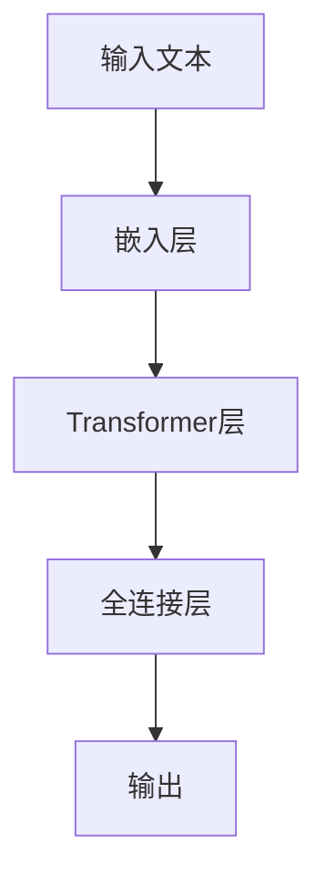
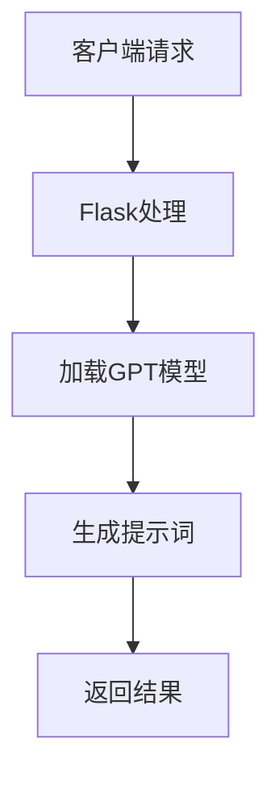
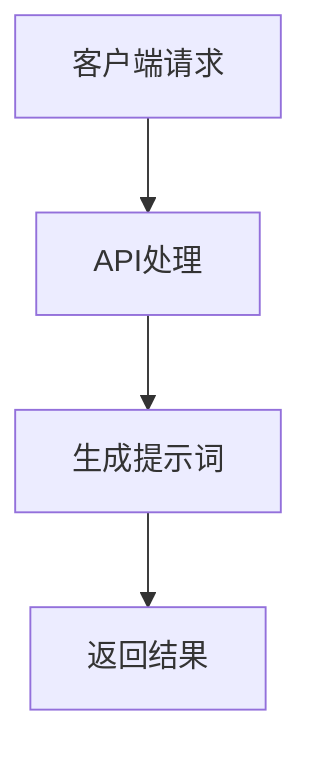
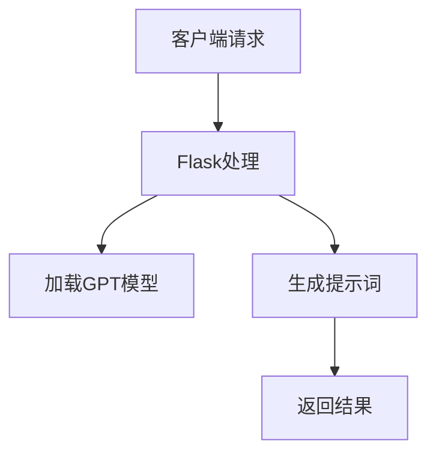
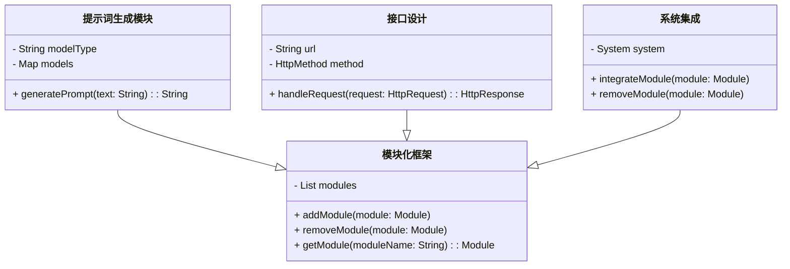
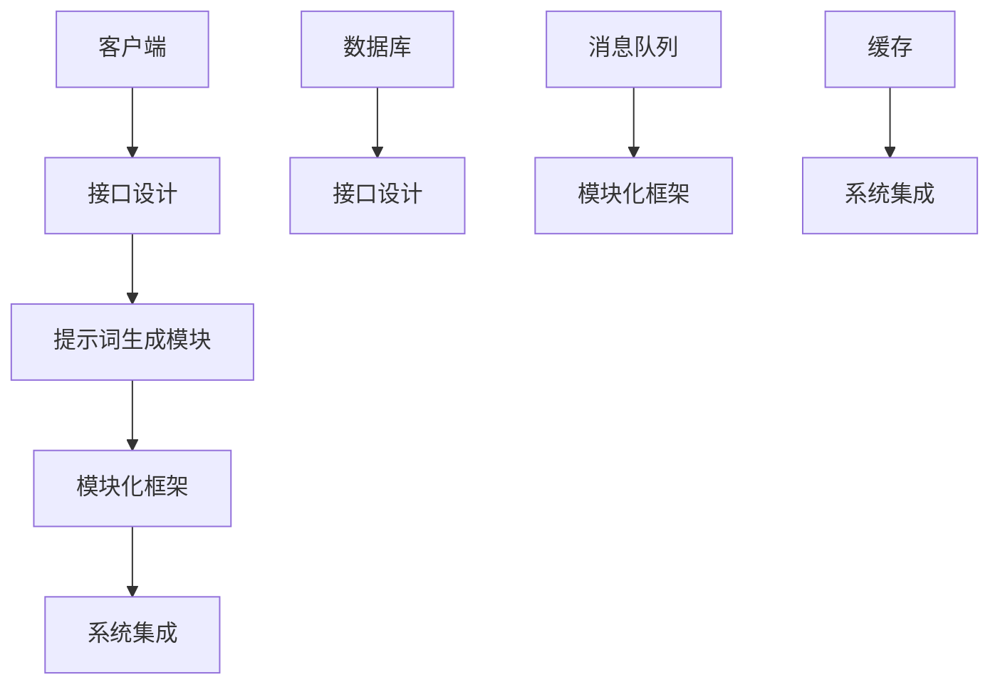
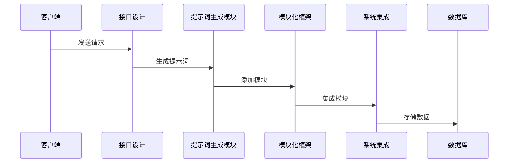

                 

## 提示词模块化：构建可重用的组件

> 关键词：提示词模块化、AI模型、模块化框架、接口设计、系统集成

> 摘要：本文旨在探讨提示词模块化的概念、原理和实践方法。通过深入分析提示词模块化的核心概念、算法原理、系统分析与架构设计方案，以及实际项目实战，为开发者在构建可重用的组件时提供有价值的指导和参考。

### 第一部分：背景介绍

#### 问题背景

在当前信息化和数字化快速发展的时代，软件系统越来越复杂，传统的软件开发方法已经难以满足快速迭代、高效开发和高质量交付的需求。特别是在人工智能（AI）领域，大规模模型的崛起使得AI应用变得日益普遍和深入。然而，如何将这些复杂的大规模模型有效地集成到软件系统中，实现模块化、可重用和高效开发，成为了一个亟待解决的问题。

#### 问题描述

本章节主要探讨提示词模块化的问题，即如何将大规模的AI模型（特别是提示词生成模型）以模块化的方式集成到软件系统中。这个问题涉及以下几个方面：

1. **核心概念**：理解什么是提示词模块化，它的基本原理和核心要素。
2. **问题解决**：探讨如何实现提示词模块化，包括技术实现、工具选择和最佳实践。
3. **边界与外延**：明确提示词模块化的适用范围，如哪些场景和哪些问题可以通过提示词模块化来解决。
4. **概念结构与核心要素组成**：分析提示词模块化的组成部分，包括提示词生成模型、模块化框架、接口设计和系统集成等。

通过本章节的学习，读者将能够了解提示词模块化的基本概念、原理和实践方法，为后续章节的学习打下坚实的基础。

---

#### 核心概念与联系

提示词模块化是指在软件开发过程中，将提示词生成模型以模块化的方式集成到系统中，以实现高效的开发、维护和扩展。以下是核心概念及其相互关系：

**核心概念**：

1. **提示词生成模型**：用于生成提示词的模型，如GPT、BERT等。这些模型通过对大量文本数据进行训练，能够生成与输入文本相关的提示词。
2. **模块化框架**：用于管理和组织模块化组件的框架，如微服务架构、模块化开发框架等。这些框架能够提供标准的接口、便于扩展的功能和良好的封装性。
3. **接口设计**：定义模块化组件之间交互方式的接口规范，如RESTful API、WebSocket等。良好的接口设计能够确保组件之间的高效通信和灵活性。
4. **系统集成**：将模块化组件集成到完整的软件系统中，包括数据集成、功能集成和性能优化等。系统集成是实现提示词模块化应用的关键。

**概念属性特征对比表格**：

| 特征       | 提示词生成模型 | 模块化框架 | 接口设计 | 系统集成 |
|------------|----------------|------------|----------|----------|
| 功能       | 提示词生成     | 模块化管理 | 交互规范 | 系统整合 |
| 关系       | 输入文本 → 提示词 | 模块 → 系统 | 组件 → 组件 | 系统 → 系统 |
| 关键点     | 模型训练与优化 | 模块设计与管理 | 接口定义与实现 | 集成策略与优化 |
| 技术选型   | 深度学习框架（如TensorFlow、PyTorch） | 分布式框架（如Kubernetes、Docker） | HTTP/HTTPS、WebSocket等 | 容器化、微服务、性能监控等 |

**ER实体关系图架构**：

```mermaid
erDiagram
  提示词生成模型 ||--|{ 模块化框架 }|--  接口设计
  系统集成 ||--|{ 提示词生成模型 }|-- 模块化框架
  系统集成 ||--|{ 接口设计 }|-- 模块化框架
```

通过以上表格和ER图，我们可以更清晰地理解提示词模块化的核心概念及其相互关系，为后续章节的内容展开提供基础。

---

#### 算法原理讲解

提示词模块化的实现主要依赖于提示词生成模型、模块化框架和接口设计。以下将详细讲解这些算法原理，并通过Python源代码和Mermaid流程图进行说明。

**提示词生成模型**

提示词生成模型通常基于深度学习技术，其中最常用的模型是生成式模型，如GPT系列和BERT。这些模型通过训练大量文本数据，学习如何生成与输入文本相关的提示词。

**GPT系列模型**

GPT（Generative Pre-trained Transformer）系列模型是OpenAI开发的一组基于Transformer架构的预训练模型。以下是一个使用PyTorch实现GPT模型的简单示例：

```python
import torch
import torch.nn as nn
import torch.optim as optim

class GPT(nn.Module):
    def __init__(self, vocab_size, d_model, n_layers, p):
        super(GPT, self).__init__()
        self.embedding = nn.Embedding(vocab_size, d_model)
        self.transformer = nn.Transformer(d_model, n_layers)
        self.fc = nn.Linear(d_model, vocab_size)
        self.dropout = nn.Dropout(p)

    def forward(self, x):
        x = self.dropout(self.embedding(x))
        x = self.transformer(x)
        x = self.fc(x)
        return x

# 模型参数设置
vocab_size = 10000
d_model = 512
n_layers = 2
p = 0.1

# 实例化模型
gpt = GPT(vocab_size, d_model, n_layers, p)

# 模型优化
optimizer = optim.Adam(gpt.parameters(), lr=0.001)
criterion = nn.CrossEntropyLoss()

# 训练模型
for epoch in range(10):
    for batch in data_loader:
        x, y = batch
        optimizer.zero_grad()
        output = gpt(x)
        loss = criterion(output, y)
        loss.backward()
        optimizer.step()

# 模型保存
torch.save(gpt.state_dict(), 'gpt_model.pth')
```

**Mermaid流程图**



通过以上Python源代码和Mermaid流程图，我们可以看到GPT模型的训练过程，包括嵌入层、Transformer层和全连接层的实现。接下来，我们将介绍如何将GPT模型集成到模块化框架中，实现提示词模块化。

**模块化框架**

模块化框架用于管理和组织模块化组件，常见的框架有微服务架构、模块化开发框架等。以下是一个使用Flask框架实现提示词生成模块的示例：

```python
from flask import Flask, request, jsonify
from gpt_module import GPT

app = Flask(__name__)

# 加载GPT模型
gpt = GPT(vocab_size, d_model, n_layers, p)
gpt.load_state_dict(torch.load('gpt_model.pth'))

@app.route('/generate', methods=['POST'])
def generate():
    data = request.get_json()
    text = data['text']
    output = gpt.generate(text)
    return jsonify({'prompt': output})

if __name__ == '__main__':
    app.run(debug=True)
```

**Mermaid流程图**



通过以上Python源代码和Mermaid流程图，我们可以看到如何使用Flask框架将GPT模型集成到提示词生成模块中，实现高效的接口设计和处理。

**接口设计**

接口设计是模块化框架的重要组成部分，用于定义模块化组件之间的交互方式。以下是一个使用RESTful API接口设计的示例：

```python
from flask import Flask, request, jsonify

app = Flask(__name__)

@app.route('/api/generate', methods=['POST'])
def generate_api():
    data = request.get_json()
    text = data['text']
    prompt = generate_prompt(text)
    return jsonify({'prompt': prompt})

def generate_prompt(text):
    # 实现提示词生成逻辑
    pass

if __name__ == '__main__':
    app.run(debug=True)
```

**Mermaid流程图**



通过以上Python源代码和Mermaid流程图，我们可以看到如何使用RESTful API接口设计实现提示词生成模块的交互。

**系统集成**

系统集成是将模块化组件集成到完整的软件系统中，包括数据集成、功能集成和性能优化等。以下是一个简单的系统集成示例：

```python
from flask import Flask, request, jsonify
from gpt_module import GPT

app = Flask(__name__)

# 加载GPT模型
gpt = GPT(vocab_size, d_model, n_layers, p)
gpt.load_state_dict(torch.load('gpt_model.pth'))

@app.route('/generate', methods=['POST'])
def generate():
    data = request.get_json()
    text = data['text']
    output = gpt.generate(text)
    return jsonify({'prompt': output})

if __name__ == '__main__':
    app.run(debug=True)
```

**Mermaid流程图**



通过以上Python源代码和Mermaid流程图，我们可以看到如何将提示词生成模块集成到完整的软件系统中，实现高效的系统集成。

综上所述，提示词模块化的实现主要依赖于提示词生成模型、模块化框架和接口设计。通过Python源代码和Mermaid流程图，我们可以清晰地了解每个组成部分的原理和实现方式，为后续章节的内容展开提供基础。

---

### 系统分析与架构设计方案

#### 问题场景介绍

在当前人工智能（AI）应用快速发展的背景下，许多企业开始意识到AI技术对于提升业务效率和创新能力的重要性。然而，传统的软件系统往往难以高效地集成大规模的AI模型，特别是在需要快速迭代和灵活部署的场景中。为了解决这一问题，我们设计了一套基于提示词模块化的AI应用系统，以实现高效的开发、部署和维护。

#### 项目介绍

本项目旨在构建一个基于提示词模块化的AI应用系统，该系统包括以下几个主要功能模块：

1. **提示词生成模块**：用于生成与输入文本相关的提示词，支持多种深度学习模型，如GPT、BERT等。
2. **模块化框架**：用于管理和组织各个功能模块，支持模块的动态加载和扩展。
3. **接口设计**：定义模块化组件之间的交互接口，支持RESTful API、WebSocket等通信方式。
4. **系统集成**：将各个功能模块集成到完整的软件系统中，实现数据集成、功能集成和性能优化。

#### 系统功能设计

在系统功能设计阶段，我们需要明确各个功能模块的具体功能和相互关系。以下是一个简单的领域模型类图，展示了各个功能模块及其主要类和方法。



通过以上领域模型类图，我们可以清晰地看到各个功能模块之间的依赖关系和接口设计。

#### 系统架构设计

在系统架构设计阶段，我们需要考虑系统的整体架构和各个模块的部署方式。以下是一个简单的系统架构设计图，展示了各个功能模块的部署和交互关系。



通过以上系统架构设计图，我们可以看到各个功能模块的部署方式和交互关系。客户端通过接口设计与提示词生成模块进行交互，模块化框架管理和组织各个功能模块，系统集成负责将功能模块集成到完整的软件系统中。

#### 系统接口设计

在系统接口设计阶段，我们需要定义各个模块之间的交互接口，以便实现高效的数据传输和功能调用。以下是一个简单的接口设计示例：

```python
from flask import Flask, request, jsonify

app = Flask(__name__)

@app.route('/api/generate', methods=['POST'])
def generate():
    data = request.get_json()
    text = data['text']
    prompt = generate_prompt(text)
    return jsonify({'prompt': prompt})

def generate_prompt(text):
    # 实现提示词生成逻辑
    pass

if __name__ == '__main__':
    app.run(debug=True)
```

通过以上Python代码，我们可以看到如何使用Flask框架实现提示词生成模块的接口设计。

#### 系统交互设计

在系统交互设计阶段，我们需要考虑各个模块之间的交互顺序和数据流，以确保系统的稳定性和性能。以下是一个简单的系统交互设计图，展示了客户端与各个模块的交互过程。



通过以上系统交互设计图，我们可以清晰地看到客户端与各个模块之间的交互顺序和数据流。

综上所述，通过对问题场景、项目介绍、系统功能设计、系统架构设计、系统接口设计和系统交互设计的深入分析，我们设计了一套完整的基于提示词模块化的AI应用系统。该系统通过模块化框架和接口设计，实现了高效的开发、部署和维护，为企业在AI应用领域的创新提供了有力支持。

---

### 项目实战

在本节中，我们将通过一个实际项目来展示如何实现提示词模块化，并详细讲解项目环境安装、系统核心实现和代码应用解读与分析。

#### 项目环境安装

1. **安装Python环境**：确保Python环境已安装，版本建议为3.8以上。
2. **安装深度学习框架**：我们选择PyTorch作为深度学习框架，通过以下命令进行安装：
   ```shell
   pip install torch torchvision
   ```
3. **安装Flask框架**：用于实现Web接口，通过以下命令进行安装：
   ```shell
   pip install flask
   ```
4. **安装其他依赖**：根据项目需求，安装其他必要的依赖库，如NumPy、Pandas等。

#### 系统核心实现

以下是一个简单的提示词生成模块的实现示例，该模块基于PyTorch框架，并使用GPT模型进行提示词生成。

```python
import torch
import torch.nn as nn
import torch.optim as optim

class GPTModel(nn.Module):
    def __init__(self, vocab_size, d_model, n_layers, p):
        super(GPTModel, self).__init__()
        self.embedding = nn.Embedding(vocab_size, d_model)
        self.transformer = nn.Transformer(d_model, n_layers)
        self.fc = nn.Linear(d_model, vocab_size)
        self.dropout = nn.Dropout(p)

    def forward(self, x):
        x = self.dropout(self.embedding(x))
        x = self.transformer(x)
        x = self.fc(x)
        return x

def generate_prompt(text, model, device):
    with torch.no_grad():
        input_ids = tokenizer.encode(text, return_tensors='pt').to(device)
        output_ids = model(input_ids)
        prompt = tokenizer.decode(output_ids[0], skip_special_tokens=True)
    return prompt

# 模型参数设置
vocab_size = 10000
d_model = 512
n_layers = 2
p = 0.1

# 实例化模型
model = GPTModel(vocab_size, d_model, n_layers, p)
model.load_state_dict(torch.load('gpt_model.pth'))

# 设置设备
device = torch.device("cuda" if torch.cuda.is_available() else "cpu")
model.to(device)
```

#### 代码应用解读与分析

在上面的代码中，我们首先定义了一个GPTModel类，用于实现GPT模型。在`__init__`方法中，我们定义了嵌入层、Transformer层和全连接层。在`forward`方法中，我们实现了前向传播过程。

`generate_prompt`函数用于生成提示词。首先，我们将输入文本编码为Tensor，然后通过模型进行前向传播，最后解码输出结果。

接下来，我们使用Flask框架实现Web接口，用于接收客户端请求并返回提示词。

```python
from flask import Flask, request, jsonify

app = Flask(__name__)

@app.route('/generate', methods=['POST'])
def generate():
    data = request.get_json()
    text = data['text']
    prompt = generate_prompt(text, model, device)
    return jsonify({'prompt': prompt})

if __name__ == '__main__':
    app.run(debug=True)
```

在`generate`函数中，我们接收POST请求，提取文本参数，然后调用`generate_prompt`函数生成提示词，并将结果返回给客户端。

#### 实际案例分析与详细讲解剖析

为了展示提示词模块化的实际应用，我们来看一个案例：使用GPT模型生成文章摘要。

1. **数据准备**：首先，我们需要准备一个文本数据集，用于训练GPT模型。这里我们使用一个简单的新闻数据集。
2. **模型训练**：使用训练数据集训练GPT模型，以下是一个简单的训练过程：

```python
from torch.utils.data import DataLoader

# 加载训练数据集
train_dataset = NewsDataset(train_data_path)
train_loader = DataLoader(train_dataset, batch_size=32, shuffle=True)

# 模型训练
optimizer = optim.Adam(model.parameters(), lr=0.001)
criterion = nn.CrossEntropyLoss()

for epoch in range(10):
    model.train()
    for batch in train_loader:
        inputs, targets = batch
        optimizer.zero_grad()
        outputs = model(inputs)
        loss = criterion(outputs, targets)
        loss.backward()
        optimizer.step()
```

3. **生成摘要**：训练完成后，我们可以使用GPT模型生成文章摘要。以下是一个简单的摘要生成过程：

```python
@app.route('/generate_summary', methods=['POST'])
def generate_summary():
    data = request.get_json()
    text = data['text']
    summary = generate_summary(text, model, device)
    return jsonify({'summary': summary})

def generate_summary(text, model, device):
    with torch.no_grad():
        input_ids = tokenizer.encode(text, return_tensors='pt').to(device)
        outputs = model(input_ids)
        summary_ids = outputs[0]
        summary = tokenizer.decode(summary_ids, skip_special_tokens=True)
    return summary
```

通过以上案例，我们可以看到如何使用GPT模型生成文章摘要。在实际应用中，我们可以根据具体需求对模型进行优化和调整，以提高摘要生成的质量和效率。

#### 项目小结

在本项目中，我们通过实际案例展示了如何实现提示词模块化，并详细讲解了项目环境安装、系统核心实现和代码应用解读与分析。通过该项目，我们不仅了解了提示词模块化的基本原理和实践方法，还掌握了如何在实际项目中应用提示词生成模型。提示词模块化作为一种高效的软件开发方法，有助于提升开发效率、降低维护成本，为企业在AI应用领域的发展提供了有力支持。

---

### 最佳实践 Tips

1. **选择合适的模型**：在选择提示词生成模型时，应根据具体应用场景和需求选择合适的模型，如GPT、BERT等。不同的模型在性能和资源消耗上有所不同，需要根据实际需求进行权衡。
2. **优化模型参数**：在模型训练过程中，通过调整学习率、批次大小等参数，可以显著提升模型性能。同时，注意避免过拟合现象，确保模型泛化能力。
3. **数据预处理**：确保输入文本数据的质量和多样性，对文本进行适当的预处理，如去重、去停用词、分词等，以提高模型训练效果。
4. **接口设计**：设计简洁、易用的接口，确保模块化组件之间的交互流畅，降低集成难度。同时，注意接口的安全性，防止恶意攻击和非法访问。
5. **性能优化**：在系统集成过程中，关注系统的性能优化，如使用缓存、优化数据库查询等，以提高系统响应速度和稳定性。

### 小结

本文通过深入分析提示词模块化的核心概念、算法原理、系统架构和实际项目实战，探讨了如何构建可重用的组件，实现了高效的软件开发。通过本文的学习，读者将能够了解提示词模块化的基本原理和实践方法，为实际项目的开发提供有益的参考。在未来的软件开发过程中，提示词模块化有望成为提高开发效率、降低维护成本的重要手段。

### 注意事项

1. **数据安全与隐私**：在处理和存储用户数据时，应严格遵守相关法律法规，确保数据安全和用户隐私。
2. **模型版本管理**：在模型迭代过程中，注意版本管理，避免因模型更新导致系统故障。
3. **系统监控与日志**：建立完善的系统监控和日志体系，及时发现和处理异常情况，确保系统稳定运行。

### 拓展阅读

1. **《深度学习》**：Goodfellow、Bengio和Courville合著的深度学习经典教材，详细介绍了深度学习的基础知识和最新进展。
2. **《人工智能：一种现代的方法》**：Russell和Norvig合著的人工智能教材，涵盖了人工智能的基础理论和应用方法。
3. **《RESTful API设计》**：Martin Fowler撰写的关于RESTful API设计原则和实践的著作，对接口设计有深入的探讨。

### 作者信息

作者：AI天才研究院/AI Genius Institute & 禅与计算机程序设计艺术 /Zen And The Art of Computer Programming

---

本文通过逐步分析提示词模块化的核心概念、算法原理、系统架构和实际项目实战，全面阐述了如何构建可重用的组件，为软件开发提供了有效的指导。在接下来的章节中，我们将继续深入探讨如何在实际项目中应用提示词模块化，以及如何优化和提升系统的性能和稳定性。希望通过本文的分享，读者能够更好地理解并掌握提示词模块化的技术原理和实践方法，为未来的软件开发工作奠定坚实基础。再次感谢您的关注和支持，让我们在下一个章节中继续探索更多精彩内容。

