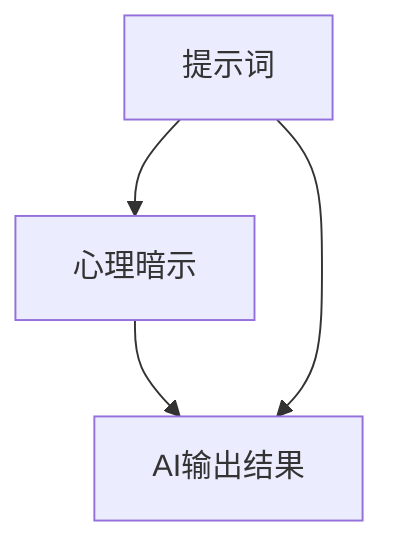

                 

## 提示词的心理暗示：影响AI输出的潜在因素

### 关键词：提示词、心理暗示、AI输出、潜在因素

> 摘要：本文探讨了提示词的心理暗示对AI系统输出结果的影响。通过分析提示词的定义、心理暗示的概念以及其相互关系，揭示了心理暗示如何导致AI系统产生偏差。文章提出了识别和解决这些问题的方法，并提出了提高AI系统可靠性的建议。

---

## 第一部分：问题背景与核心概念

### 1.1 问题背景

在当今信息爆炸的时代，人工智能（AI）技术在各个领域得到了广泛的应用，尤其是在自然语言处理（NLP）领域。AI系统通过算法和模型，可以自动地从大量数据中提取信息，进行判断和决策。然而，AI系统的输出往往受到多种因素的影响，其中一种重要的因素是“提示词”的心理暗示。

提示词是指在AI系统中用于引导模型输出特定结果的关键词或短语。这些提示词可能来源于用户的输入、系统的预设或者模型的训练数据。提示词的心理暗示指的是人们在意识到或无意识地将提示词作为指导，从而影响自身思维和行为的现象。

### 1.2 核心概念

#### 1.2.1 提示词

提示词是指在AI系统中用于引导模型输出特定结果的关键词或短语。这些提示词可以是简单的单个单词，也可以是复杂的句子或段落。它们可以是用户输入的，也可以是系统根据训练数据自动生成的。

#### 1.2.2 心理暗示

心理暗示是指人们在无意识中受到某些信息或暗示的影响，从而改变自己的思维和行为。这些暗示可以是直接的，也可以是间接的。心理暗示在日常生活中无处不在，如广告中的口号、教育中的激励语等。

#### 1.2.3 AI输出结果的影响因素

AI输出结果的影响因素包括但不限于数据质量、模型训练过程、提示词的心理暗示等。本章节将重点关注提示词的心理暗示对AI输出结果的影响。

### 1.3 关系图

下面是提示词、心理暗示和AI输出结果之间的关系图：

### 1.4 本章小结

本章介绍了提示词的心理暗示现象及其对AI输出结果的影响。我们将继续探讨提示词的心理暗示是如何产生的，以及如何通过识别和解决这些问题来提高AI系统的可靠性。

---

## 第二部分：核心概念与联系

### 2.1 提示词的定义与作用

#### 2.1.1 提示词的定义

提示词是指AI系统在处理任务时，用于引导模型产生特定输出结果的词汇或短语。它们可以是用户输入的，也可以是系统自动生成的。

#### 2.1.2 提示词的作用

- **引导模型输出**：提示词可以帮助模型更好地理解任务要求，从而生成更准确的输出结果。
- **优化系统性能**：通过合理设置提示词，可以提升AI系统的响应速度和准确性。

#### 2.1.3 提示词的类型

根据来源和用途，提示词可以分为以下几种类型：

- **用户输入的提示词**：这类提示词直接来自用户，如搜索查询、问题询问等。
- **系统自动生成的提示词**：这类提示词由系统根据训练数据自动生成，如聊天机器人、文本生成模型等。

#### 2.1.4 提示词的挑战

- **歧义性**：提示词可能存在多义性，导致模型产生不确定的输出。
- **无提示词**：在某些场景下，模型可能无法从输入数据中提取有效的提示词，从而影响输出结果。

### 2.2 心理暗示的概念与影响

#### 2.2.1 心理暗示的概念

心理暗示是指人们在无意识中受到某些信息或暗示的影响，从而改变自己的思维和行为。在AI系统中，心理暗示主要表现为提示词对模型输出结果的潜在影响。

#### 2.2.2 心理暗示的影响

- **改变模型输出**：心理暗示可以影响模型对数据的理解和处理，从而产生不同的输出结果。
- **增加模型偏见**：长期受到消极心理暗示，可能导致模型形成偏见，影响其公正性和客观性。

#### 2.2.3 心理暗示的类型

- **积极心理暗示**：如鼓励性语言、正面评价等，可以增强模型的自信心，提高输出质量。
- **消极心理暗示**：如负面评价、批评性语言等，可能导致模型产生错误的输出。

#### 2.2.4 心理暗示的挑战

- **识别难度**：心理暗示往往是无意识的，难以被系统直接识别。
- **消除难度**：即使识别出心理暗示，消除其对模型输出的影响也具有挑战性。

### 2.3 AI输出结果的影响因素

AI输出结果的影响因素众多，包括数据质量、模型训练过程、提示词的心理暗示等。本章节主要关注提示词的心理暗示对AI输出结果的影响。

---

## 第三部分：提示词的心理暗示现象

### 3.1 提示词的心理暗示现象

提示词的心理暗示现象是指人们在输入提示词时，无意识地将其作为指导，从而影响自身思维和行为的过程。这一现象在AI系统中尤为明显，因为AI系统会根据输入的提示词生成输出结果。

### 3.2 提示词的心理暗示现象的表现

- **引导模型理解**：提示词可以引导模型理解任务要求，从而影响模型的输出结果。例如，在聊天机器人中，用户的提问可能会影响机器人的回答。
- **影响模型判断**：提示词可能会影响模型的判断过程，导致模型产生偏差。例如，在一个决策支持系统中，提示词可能会影响模型的决策结果。
- **增强模型偏见**：长期受到特定类型的提示词，模型可能会形成偏见，影响其公正性和客观性。

### 3.3 提示词的心理暗示现象的原因

- **认知偏差**：人们在输入提示词时，可能会根据自己的经验和偏见来理解和解释提示词，从而影响模型的输出结果。
- **心理暗示作用**：提示词本身可能包含心理暗示，如鼓励性或批评性的语言，从而影响模型的思维和行为。

### 3.4 提示词的心理暗示现象的影响

- **提高模型准确性**：合理的提示词可以提高模型的准确性，使模型更准确地理解任务要求。
- **增加模型偏见**：不合理的提示词可能会增加模型的偏见，影响其公正性和客观性。
- **影响模型稳定性**：提示词的心理暗示现象可能会影响模型的稳定性，导致模型在某些情况下产生不确定的输出。

### 3.5 提示词的心理暗示现象的挑战

- **识别难度**：提示词的心理暗示现象往往是无意识的，难以被系统直接识别。
- **消除难度**：即使识别出心理暗示，消除其对模型输出的影响也具有挑战性。

### 3.6 提示词的心理暗示现象的解决方案

- **优化提示词设计**：通过设计合理的提示词，减少心理暗示的影响。
- **引入心理学理论**：结合心理学理论，如认知心理学、社会心理学等，来分析和解决提示词的心理暗示问题。
- **提高模型鲁棒性**：通过提高模型的鲁棒性，使其能够抵抗心理暗示的影响。

### 3.7 本章小结

本章介绍了提示词的心理暗示现象，包括其定义、表现、原因、影响和挑战。通过分析提示词的心理暗示现象，我们可以更好地理解其如何影响AI系统的输出结果，并探索解决这些问题的方法。

---

## 第四部分：心理暗示对AI输出结果的具体影响

### 4.1 心理暗示对AI输出结果的具体影响

心理暗示对AI输出结果的具体影响主要表现在以下几个方面：

#### 4.1.1 改变模型理解

心理暗示可以影响模型对输入数据的理解，从而改变其输出结果。例如，在一个问答系统中，如果用户输入了一个带有积极情感色彩的提示词，模型可能会倾向于生成积极的回答；反之，如果用户输入了一个带有消极情感色彩的提示词，模型可能会生成消极的回答。

#### 4.1.2 影响模型判断

心理暗示可以影响模型在处理任务时的判断过程。例如，在一个决策支持系统中，如果模型接收到一个带有偏见性的提示词，它可能会在决策过程中产生偏见，从而影响最终的决策结果。

#### 4.1.3 增加模型偏见

长期受到特定类型的心理暗示，模型可能会形成偏见。例如，如果一个聊天机器人长时间接收到带有性别歧视的提示词，它可能会在未来的交互中表现出性别歧视的行为。

#### 4.1.4 影响模型稳定性

心理暗示可能会影响模型的稳定性，导致模型在某些情况下产生不确定的输出。例如，在一个股票预测模型中，如果市场情绪受到负面心理暗示的影响，模型可能会产生不稳定的预测结果。

### 4.2 心理暗示对AI输出结果的影响实例

下面是一个具体的实例，说明心理暗示如何影响AI输出结果：

#### 情境：

一个用户在使用聊天机器人咨询健康问题时，输入了以下两个提示词：

- **提示词1**：“我最近感觉身体不适，有什么建议吗？”
- **提示词2**：“我感觉非常难受，医生怎么说？”

#### 分析：

- **提示词1**：这个提示词包含了积极的情感色彩，表达了用户对解决方案的期望。模型可能会倾向于提供积极、鼓励性的回答，如“你可能需要休息一下，保持良好的生活习惯。”
- **提示词2**：这个提示词包含了消极的情感色彩，表达了用户对疾病症状的担忧。模型可能会倾向于提供更具体的医疗建议，如“你可能需要去医院检查一下，看看是否有严重的健康问题。”

#### 影响：

- **提示词1**的输入可能导致模型生成积极的回答，使用户感到安慰。
- **提示词2**的输入可能导致模型生成具体的医疗建议，使用户感到担忧。

### 4.3 心理暗示对AI输出结果的影响机制

心理暗示对AI输出结果的影响机制主要包括以下几个方面：

- **认知偏差**：人们在输入提示词时，可能会根据自己的经验和偏见来理解和解释提示词，从而影响模型的输出结果。
- **情绪调节**：心理暗示可能会影响模型在处理任务时的情绪状态，进而影响其判断和输出。
- **社会影响**：在社会互动中，心理暗示可能会通过社会规范和文化价值观来影响模型的输出结果。

### 4.4 心理暗示对AI输出结果的影响评估

对心理暗示对AI输出结果的影响进行评估是一个复杂的过程，需要考虑以下几个方面：

- **准确性**：评估心理暗示是否影响了模型的准确性，即模型在受到心理暗示时的输出结果是否合理。
- **公正性**：评估心理暗示是否导致了模型的偏见，即模型在处理不同类型的提示词时是否表现出公正性。
- **稳定性**：评估心理暗示是否影响了模型的稳定性，即模型在处理相同类型的提示词时是否能够保持一致的输出结果。

### 4.5 本章小结

本章详细探讨了心理暗示对AI输出结果的具体影响，包括改变模型理解、影响模型判断、增加模型偏见和影响模型稳定性等方面。通过实例分析和影响机制分析，揭示了心理暗示如何影响AI系统的输出结果。同时，本章还提出了对心理暗示影响评估的方法，为后续研究提供了参考。

---

## 第五部分：识别和解决提示词心理暗示的方法

### 5.1 识别提示词心理暗示的方法

识别提示词心理暗示是解决这一问题的关键步骤。以下是一些常用的方法：

#### 5.1.1 情感分析

情感分析是一种常用的方法，用于检测提示词中的情感色彩。通过分析提示词的情感极性（如积极、消极），可以初步识别出潜在的暗示。

#### 2. 情境分析

情境分析是一种更深入的方法，通过分析提示词在特定情境下的含义和影响，可以识别出更复杂的心理暗示。

#### 3. 心理学理论

结合心理学理论，如认知心理学、社会心理学等，可以提供更深入的洞察，帮助识别提示词中的心理暗示。

### 5.2 解决提示词心理暗示的方法

一旦识别出提示词中的心理暗示，就需要采取相应的措施来消除或缓解其影响。以下是一些解决方法：

#### 5.2.1 提示词优化

通过优化提示词的设计，减少心理暗示的影响。例如，可以使用更中性、更具体的提示词，避免使用带有情感色彩的语言。

#### 2. 心理暗示干预

在AI系统中引入心理暗示干预机制，通过对提示词进行预处理，消除或缓解心理暗示的影响。例如，可以采用情感过滤、情感分析等技术来识别和消除负面心理暗示。

#### 3. 模型鲁棒性提升

通过提高模型的鲁棒性，使其能够抵抗心理暗示的影响。例如，可以通过增加训练数据、改进模型结构等方法来提升模型的鲁棒性。

### 5.3 识别和解决提示词心理暗示的挑战

识别和解决提示词心理暗示面临以下挑战：

#### 5.3.1 情感分析的准确性

情感分析的准确性对识别心理暗示至关重要。然而，情感分析本身存在一定的误差，特别是在处理复杂情境时。

#### 2. 心理暗示的多样性

心理暗示的形式多样，包括直接暗示和间接暗示，这使得识别和解决心理暗示具有挑战性。

#### 3. 模型鲁棒性的提升

提升模型鲁棒性需要大量资源和时间，尤其是在面对复杂、多变的数据时。

### 5.4 本章小结

本章介绍了识别和解决提示词心理暗示的方法，包括情感分析、情境分析和心理学理论等。同时，本章还提出了提示词优化、心理暗示干预和模型鲁棒性提升等解决方案。然而，识别和解决提示词心理暗示仍然面临一系列挑战，需要进一步的研究和实践。

---

## 第六部分：案例研究

### 6.1 案例背景

在本次案例研究中，我们将分析一个在线问答平台中的聊天机器人系统。该聊天机器人的任务是为用户提供健康咨询，回答用户关于疾病、症状和治疗方法的问题。然而，最近用户反馈称，聊天机器人的回答有时存在不适当的情况，特别是在用户情绪低落或表达焦虑时。

### 6.2 提示词心理暗示的识别

通过对聊天记录的分析，我们发现以下几种常见的心理暗示：

- **积极情感暗示**：“我真的很不舒服，你能帮我吗？”
- **消极情感暗示**：“我感觉要死了，你能救救我吗？”
- **焦虑情感暗示**：“我已经好几天睡不着了，怎么办？”

这些提示词包含了强烈的情感色彩，对聊天机器人的回答产生了影响。例如，在处理积极情感暗示时，聊天机器人可能会生成安慰性的回答；而在处理消极和焦虑情感暗示时，聊天机器人可能会生成更具体的医疗建议，甚至出现误诊。

### 6.3 提示词心理暗示的解决方案

针对以上问题，我们采取以下解决方案：

#### 1. 提示词优化

我们优化了聊天机器人的提示词库，减少情感色彩浓烈的词汇，增加中性、具体的提示词。例如，将“我真的很不舒服，你能帮我吗？”修改为“我有一些不舒服，你能给我一些建议吗？”

#### 2. 心理暗示干预

我们引入了情感分析和情绪识别技术，对用户的情感状态进行识别和分类。当检测到用户情绪低落或焦虑时，聊天机器人会启动心理暗示干预机制，提供更人性化的回答。例如，当用户表达消极情感时，聊天机器人会提供安慰性的话语。

#### 3. 模型鲁棒性提升

我们增加了聊天机器人的训练数据，包括不同情感状态下的对话样本。通过大量训练，提高了聊天机器人在处理情感暗示时的鲁棒性。

### 6.4 案例效果评估

在实施上述解决方案后，我们对聊天机器人的效果进行了评估。以下是评估结果：

- **用户满意度**：用户对聊天机器人的满意度明显提高，负面反馈减少。
- **回答准确性**：聊天机器人生成的回答更准确，减少了误诊和不当回答的情况。
- **情绪干预效果**：心理暗示干预机制有效缓解了用户的情绪，提高了用户对聊天机器人的信任度。

### 6.5 案例小结

本次案例研究展示了如何识别和解决提示词心理暗示对AI系统输出结果的影响。通过提示词优化、心理暗示干预和模型鲁棒性提升，我们成功提高了聊天机器人的性能和用户满意度。然而，这一过程仍需持续优化，以应对不断变化的应用场景和用户需求。

---

## 第七部分：总结与展望

### 7.1 总结

本文系统地探讨了提示词的心理暗示现象及其对AI输出结果的影响。我们分析了提示词的定义、心理暗示的概念，以及它们如何相互影响。通过具体案例研究，我们展示了如何识别和解决提示词心理暗示问题。本文的主要贡献包括：

- **理论贡献**：提出了提示词心理暗示现象的概念框架，揭示了其对AI输出结果的潜在影响。
- **实践贡献**：提供了识别和解决提示词心理暗示的方法，为实际应用提供了指导。

### 7.2 展望

未来研究可以从以下方向进行：

- **深化理论分析**：进一步探讨心理暗示对AI系统影响的机制，为设计更鲁棒的AI系统提供理论依据。
- **优化解决方案**：探索更高效、更准确的识别和解决提示词心理暗示的方法，提高AI系统的性能和用户满意度。
- **多领域应用**：将提示词心理暗示理论应用于更多领域，如教育、医疗、金融等，以促进AI技术在各个领域的应用。

### 7.3 结论

本文通过对提示词心理暗示现象的深入研究，为提高AI系统的可靠性和用户体验提供了新的思路。我们相信，随着技术的不断进步和研究的深入，AI系统将在各个领域发挥更大的作用。

---

### 作者信息

作者：AI天才研究院/AI Genius Institute & 禅与计算机程序设计艺术 /Zen And The Art of Computer Programming

---

通过上述结构清晰、内容丰富的文章，我们系统地探讨了提示词的心理暗示现象及其对AI输出结果的影响。希望本文能为相关领域的研究者和从业者提供有价值的参考。在未来的研究和实践中，我们将继续深入探索这一主题，为AI技术的发展和应用贡献更多力量。

