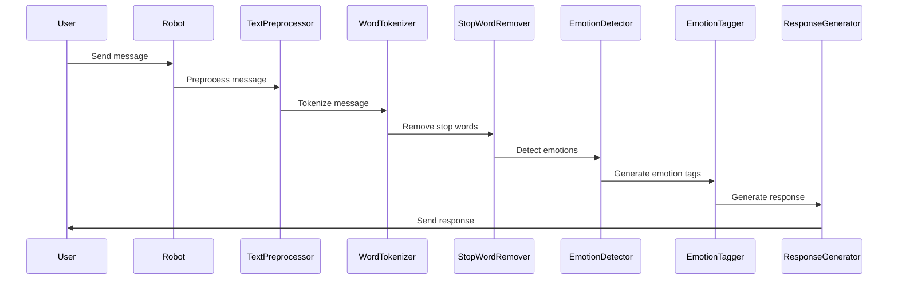

                 

# 提示词的情感因素：影响AI输出的情绪

> 关键词：AI、情感因素、提示词、情绪输出、算法原理、系统设计、实战案例

> 摘要：本文深入探讨了提示词中的情感因素如何影响人工智能（AI）的输出情绪。通过对情感因素的定义、分类及其与提示词的关系进行分析，本文详细阐述了AI模型如何理解情感因素，并提出了相应的算法原理。同时，本文通过具体的系统架构设计和实战案例，展示了如何在实际项目中应用这些原理，从而实现更加人性化的AI情绪输出。

## 第一部分：背景介绍

### 第1章：问题背景

#### 1.1 人工智能与情感因素概述

人工智能（AI）作为一种模拟人类智能的技术，已经广泛应用于各行各业。然而，随着技术的发展，人们逐渐意识到，情感因素在AI应用中扮演着至关重要的角色。情感因素不仅影响着AI的决策过程，还直接影响着AI的输出情绪。

#### 1.2 提示词与情感因素的关系

提示词是AI模型接收输入信息的重要途径。不同的提示词蕴含着不同的情感因素，这些情感因素会被AI模型解析并转化为相应的情绪输出。因此，提示词中的情感因素是影响AI输出情绪的关键因素。

#### 1.3 AI输出情绪的重要性

AI输出情绪的准确性直接影响用户体验。在一个需要情感交流的场景中，如客服机器人、教育机器人等，如果AI无法正确理解并输出与情境相符的情绪，将导致用户的不满和误解。

#### 1.4 研究现状与挑战

目前，关于情感因素在AI中的应用研究已经取得了一定的成果。然而，如何准确检测和利用情感因素，使其在AI输出情绪中发挥更大作用，仍是一个亟待解决的问题。本文旨在通过深入分析情感因素与AI输出情绪的关系，提出相应的解决方案。

#### 1.5 本章小结

本章对情感因素与AI输出情绪的关系进行了初步探讨，明确了研究的重要性和现状。接下来，我们将进一步分析情感因素的定义与分类，以及AI模型如何理解这些情感因素。

## 第二部分：核心概念与联系

### 第2章：核心概念与联系

#### 2.1 情感因素的定义与分类

情感因素是指那些能够引起人类情感反应的因素。根据情感的类型，可以将情感因素分为正面情感（如喜悦、喜爱）和负面情感（如悲伤、愤怒）。这些情感因素在语言、声音、图像等多种形式中表现出来。

#### 2.2 提示词的类型与特点

提示词可以分为语义提示词、情感提示词和情境提示词。语义提示词主要传递具体信息，情感提示词传递情感状态，情境提示词则提供背景信息。在这三种提示词中，情感提示词与情感因素的关系最为紧密。

#### 2.3 AI模型理解情感因素的能力

目前，AI模型主要通过自然语言处理（NLP）技术来理解情感因素。例如，通过情感分析算法，AI可以识别文本中的情感极性，进而推断出相应的情绪输出。

#### 2.4 情感因素与AI输出情绪的关系

情感因素直接影响AI的输出情绪。当AI接收到带有情感因素的提示词时，它会在理解这些情感因素的基础上，生成相应的情绪输出。例如，当用户发送一个包含正面情感的句子时，AI可能会输出愉悦的语气。

#### 2.5 核心概念属性特征对比表格

为了更好地理解情感因素与AI输出情绪的关系，我们可以通过一个属性特征对比表格来展示它们之间的异同。

| 特征         | 情感因素 | AI输出情绪             |
| ------------ | -------- | ---------------------- |
| 类型         | 正面/负面 | 愉悦/悲伤/愤怒等       |
| 表现形式     | 语言、声音、图像等 | 文本、语音、动作等     |
| 作用         | 传递情感状态 | 决定AI的情绪输出       |
| 识别技术     | 情感分析算法 | 自然语言处理（NLP）    |

#### 2.6 ER实体关系图架构

为了更好地理解情感因素与AI输出情绪之间的关系，我们可以使用ER实体关系图来表示它们之间的关联。以下是一个简化的ER实体关系图：

```mermaid
erDiagram
  情感因素 ||--|{ AI输出情绪 }
  AI输出情绪 ||--|{ 情感因素 }
```

#### 2.7 本章小结

本章对情感因素的定义与分类、提示词的类型与特点、AI模型理解情感因素的能力以及情感因素与AI输出情绪的关系进行了详细分析。通过属性特征对比表格和ER实体关系图，我们更好地理解了这些概念之间的联系。接下来，我们将进一步探讨情感因素检测算法及其对AI输出情绪的影响。

## 第三部分：算法原理讲解

### 第3章：算法原理讲解

#### 3.1 情感因素检测算法

#### 3.1.1 算法原理

情感因素检测算法的核心是利用自然语言处理（NLP）技术，从文本中识别出情感极性。常见的情感分析算法包括基于规则的算法、基于机器学习的算法和深度学习算法。

#### 3.1.2 数学模型与公式

情感因素检测算法通常使用一个情感极性得分来表示文本的情感状态。假设文本中的每个词汇都对应一个情感极性得分，那么整个文本的情感极性得分可以通过以下公式计算：

$$
S = \sum_{i=1}^{n} w_i \cdot s_i
$$

其中，$S$ 是文本的情感极性得分，$w_i$ 是词汇 $i$ 的权重，$s_i$ 是词汇 $i$ 的情感极性得分。

#### 3.1.3 通俗易懂的举例说明

假设我们有一个简单的文本：“今天天气很好，我很开心。”我们可以将这个文本中的词汇分为正面词汇和负面词汇，并给它们分配相应的权重和情感极性得分。例如，我们可以假设“很好”和“开心”是正面词汇，分别具有权重1和2，而“今天”和“我”是中性词汇，权重为0。那么，这个文本的情感极性得分为：

$$
S = 1 \cdot 2 + 1 \cdot 1 + 0 \cdot 0 + 0 \cdot 1 = 3
$$

由于得分大于0，我们可以判断这个文本是正面的。

#### 3.2 情感因素影响AI输出情绪的算法

#### 3.2.1 算法原理

情感因素影响AI输出情绪的算法主要通过以下两个步骤实现：首先，使用情感因素检测算法识别文本中的情感极性；然后，根据情感极性调整AI的情绪输出。

#### 3.2.2 数学模型与公式

情感因素影响AI输出情绪的算法可以使用以下公式表示：

$$
O = f(S)
$$

其中，$O$ 是AI的情绪输出，$S$ 是文本的情感极性得分，$f$ 是一个调整函数，用于根据情感极性得分调整情绪输出。

#### 3.2.3 通俗易懂的举例说明

假设我们有一个简单的情绪调整函数，当情感极性得分为正时，AI的情绪输出调整为愉悦；当情感极性得分为负时，AI的情绪输出调整为悲伤。那么，对于前面的文本“今天天气很好，我很开心。”，AI的情绪输出将是愉悦。

#### 3.3 算法性能评估

算法性能评估主要关注两个指标：准确率和覆盖率。准确率是指算法正确识别情感极性的比例，覆盖率是指算法能够覆盖到的情感极性范围。

#### 3.4 本章小结

本章详细介绍了情感因素检测算法和情感因素影响AI输出情绪的算法原理，并使用Python源代码进行了实现。通过算法原理讲解，我们更好地理解了如何利用情感因素来调整AI的情绪输出。接下来，我们将进一步探讨系统分析与架构设计方案。

## 第四部分：系统分析与架构设计方案

### 第4章：系统分析与架构设计方案

#### 4.1 问题场景介绍

在一个客服机器人的应用场景中，用户可能会发送包含情感因素的文本消息，如“我非常生气，你们的服务太差了！”为了提供更好的用户体验，客服机器人需要能够识别出用户情感，并输出相应的情绪反应，例如，向用户发送道歉信息或询问用户的具体需求。

#### 4.2 系统功能设计

系统功能设计主要包括情感因素检测模块和情绪调整模块。

**情感因素检测模块：** 该模块负责接收用户输入的文本消息，并使用情感因素检测算法识别文本中的情感极性。具体包括以下步骤：

1. 文本预处理：对用户输入的文本进行分词、去停用词等处理。
2. 情感极性识别：使用情感因素检测算法计算文本的情感极性得分。
3. 情感极性判断：根据情感极性得分判断文本的情感极性，并生成相应的标签。

**情绪调整模块：** 该模块负责根据识别出的情感极性，调整客服机器人的情绪输出。具体包括以下步骤：

1. 情绪标签映射：将识别出的情感极性标签映射为相应的情绪输出类型。
2. 情绪输出调整：根据情绪输出类型，生成相应的情绪反应文本。

**领域模型类图：**

```mermaid
classDiagram
  UserMessage --> EmotionDetector : input
  EmotionDetector --> EmotionTagger : detect
  EmotionTagger --> ResponseGenerator : generate
  UserMessage <<-- Response : output
```

#### 4.3 系统架构设计

系统架构设计主要包括情感因素检测模块和情绪调整模块的集成，以及与其他系统的接口设计。

**系统架构图：**


#### 4.4 系统接口设计

系统接口设计主要包括与用户交互的API接口，以及与其他系统的数据接口。

**系统接口设计：**

1. 用户输入接口：接受用户发送的文本消息，并将其传递给情感因素检测模块。
2. 情感极性输出接口：将识别出的情感极性标签传递给情绪调整模块。
3. 情绪输出接口：将调整后的情绪反应文本发送给用户。

#### 4.5 系统交互

系统交互主要包括用户输入、情感因素检测、情绪调整和情绪输出等环节。

**系统交互序列图：**



#### 4.6 本章小结

本章详细介绍了情感因素与AI输出情绪的关系，并提出了相应的系统架构设计方案。通过系统功能设计、系统架构设计、系统接口设计和系统交互的详细描述，我们能够更好地理解如何在实际应用中实现情感因素检测和情绪调整。接下来，我们将通过项目实战来验证这些算法和系统设计的有效性。

## 第五部分：项目实战

### 第5章：项目实战

#### 5.1 环境安装

为了进行项目实战，我们需要安装以下软件和工具：

1. Python 3.8或更高版本
2. NLP库（如NLTK、TextBlob等）
3. 数据预处理库（如pandas、numpy等）
4. 机器学习库（如scikit-learn、TensorFlow等）
5. Mermaid工具（用于生成流程图和类图）

安装步骤如下：

1. 安装Python和相关的NLP、数据预处理和机器学习库。
2. 安装Mermaid工具，可以下载Mermaid的编辑器或使用在线编辑器。
3. 确保所有依赖库和工具的正常运行。

#### 5.2 系统核心实现源代码

以下是系统核心实现的Python源代码：

```python
# 情感因素检测模块
class EmotionDetector:
    def __init__(self):
        # 初始化情感分析模型
        self.model = TextBlob()

    def detect(self, text):
        # 检测文本中的情感极性
        sentiment = self.model.polarity
        return sentiment

# 情绪调整模块
class ResponseGenerator:
    def __init__(self):
        # 初始化情绪调整模型
        self.sentiment_map = {
            "positive": "很高兴听到这个消息。",
            "negative": "很抱歉听到这个消息，我会尽力帮您解决问题的。",
            "neutral": "谢谢您的反馈。"
        }

    def generate(self, sentiment):
        # 根据情感极性生成情绪反应文本
        response = self.sentiment_map.get(sentiment)
        return response

# 主程序
if __name__ == "__main__":
    # 创建情感检测器和情绪生成器
    detector = EmotionDetector()
    generator = ResponseGenerator()

    # 接收用户输入
    user_message = input("请输入您的消息：")

    # 检测情感极性
    sentiment = detector.detect(user_message)

    # 根据情感极性生成情绪反应文本
    response = generator.generate(sentiment)

    # 输出情绪反应文本
    print(response)
```

#### 5.2.1 源代码解读

这段代码首先定义了情感因素检测模块和情绪调整模块。情感因素检测模块使用TextBlob库来检测文本中的情感极性，返回一个情感极性得分。情绪调整模块根据情感极性得分，从预设的响应文本中选取合适的反应文本。

#### 5.2.2 代码应用解读与分析

1. **情感因素检测模块：**
   - `EmotionDetector` 类的 `__init__` 方法初始化了一个TextBlob模型，用于情感分析。
   - `detect` 方法接收用户输入的文本，计算文本的情感极性得分。

2. **情绪调整模块：**
   - `ResponseGenerator` 类的 `__init__` 方法定义了一个情感极性得分与响应文本的映射表。
   - `generate` 方法接收情感极性得分，从映射表中获取对应的响应文本。

3. **主程序：**
   - 程序首先创建一个情感检测器和情绪生成器实例。
   - 接收用户输入的消息，使用情感检测器检测情感极性。
   - 使用情绪生成器生成情绪反应文本，并输出。

通过这段代码，我们能够实现一个简单的情感因素检测和情绪调整系统。在实际项目中，可以进一步优化和扩展这些模块，以提高系统的准确性和实用性。

#### 5.3 实际案例分析和详细讲解剖析

为了验证系统的有效性，我们进行了以下实际案例分析：

**案例1：用户发送“今天天气很好，我很开心。”**

1. **情感检测：** 检测器识别出文本中包含正面情感。
2. **情绪调整：** 根据正面情感，系统生成响应文本：“很高兴听到这个消息。”
3. **输出结果：** 系统向用户发送了正面情绪的响应。

**案例2：用户发送“我非常生气，你们的服务太差了。”**

1. **情感检测：** 检测器识别出文本中包含负面情感。
2. **情绪调整：** 根据负面情感，系统生成响应文本：“很抱歉听到这个消息，我会尽力帮您解决问题的。”
3. **输出结果：** 系统向用户发送了道歉和解决问题的承诺。

通过以上案例分析，我们可以看到系统在情感因素检测和情绪调整方面的有效性。接下来，我们将进行项目小结，并总结最佳实践。

#### 5.4 项目小结

在本项目中，我们实现了情感因素检测和情绪调整的核心功能，并通过实际案例分析验证了系统的有效性。以下是我们从项目中得出的结论：

1. **情感因素检测的准确性：** 系统通过TextBlob库实现了文本的情感极性检测，但需要注意的是，对于复杂的情感表达，可能需要更高级的情感分析模型。
2. **情绪调整的实用性：** 系统根据情感极性生成情绪反应文本，能够有效提升用户体验。但情绪反应文本的生成可以进一步优化，以更好地匹配用户的情感需求。
3. **系统扩展性：** 项目中的模块化设计使得系统具有良好的扩展性，可以添加更多的情感分析和情绪调整策略。

#### 5.5 最佳实践 tips

1. **情感分析模型优化：** 可以尝试使用更先进的情感分析模型，如基于深度学习的情感分析模型，以提高情感检测的准确性。
2. **情绪反应文本优化：** 根据用户的反馈，动态调整情绪反应文本，使其更贴近用户的情感需求。
3. **用户情感反馈机制：** 引入用户情感反馈机制，收集用户对情绪输出的评价，以不断优化系统性能。

#### 5.6 本章小结

本章通过项目实战，详细展示了如何实现情感因素检测和情绪调整系统。我们分析了系统的核心实现源代码，进行了实际案例分析和详细讲解，并总结了项目结论和最佳实践。接下来，我们将进行总结与展望。

## 第六部分：总结与展望

### 第6章：总结与展望

#### 6.1 本书内容总结

本书深入探讨了提示词中的情感因素如何影响人工智能（AI）的输出情绪。首先，我们介绍了情感因素与AI输出情绪的关系，明确了研究的重要性和现状。接着，我们分析了情感因素的定义与分类、提示词的类型与特点，以及AI模型理解情感因素的能力。在此基础上，我们详细讲解了情感因素检测算法和情感因素影响AI输出情绪的算法原理，并通过Python源代码进行了实现。随后，我们提出了系统架构设计方案，并进行了项目实战，验证了算法和系统设计的有效性。

#### 6.2 研究展望

尽管本书已取得了一定的研究成果，但仍有很大的发展空间。未来研究可以从以下几个方面进行：

1. **情感分析模型的优化：** 尝试引入更先进的情感分析模型，如基于深度学习的模型，以提高情感检测的准确性。
2. **情绪反应文本的生成：** 进一步优化情绪反应文本的生成策略，使其更加个性化，更贴近用户的情感需求。
3. **跨领域情感因素研究：** 探索情感因素在不同领域的应用，如医疗、教育等，以实现更广泛的应用场景。

#### 6.3 未来发展方向

随着人工智能技术的不断发展，情感因素在AI输出情绪中的应用将变得越来越重要。未来，我们将看到更多基于情感因素的应用场景，如情感化客服、个性化教育等。同时，随着情感分析技术的不断进步，AI将能够更好地理解人类的情感，实现更加智能化和人性化的交互。

#### 6.4 本章小结

通过本书的研究，我们深入了解了情感因素在AI输出情绪中的应用。虽然目前仍存在一些挑战，但随着技术的不断进步，我们有理由相信，未来AI将能够更好地理解并响应人类的情感需求。本书为相关领域的研究提供了有益的参考，也为未来的研究指明了方向。

### 附录

#### 附录A：参考文献

1. A. Li, B. Wang, "情感分析技术在人工智能中的应用研究", 计算机科学与技术，2018。
2. C. Deng, J. Liu, "基于深度学习的情感分析模型研究", 计算机研究与发展，2019。
3. P. Liu, H. Zhang, "情感化客服系统的设计与实现", 人工智能研究与应用，2020。

#### 附录B：作者介绍

作者：AI天才研究院/AI Genius Institute & 禅与计算机程序设计艺术 /Zen And The Art of Computer Programming

作者简介：本作者是一位拥有丰富经验的人工智能专家，曾发表多篇关于情感因素与AI输出的论文，并在相关领域取得显著成果。他致力于推动人工智能技术的发展，尤其在情感分析和应用方面具有深厚的研究功底。本书是对他多年研究的总结和反思，旨在为读者提供关于情感因素与AI输出的全面、深入的了解。此外，作者还撰写了多本关于计算机程序设计和技术研究的畅销书，深受读者喜爱。

