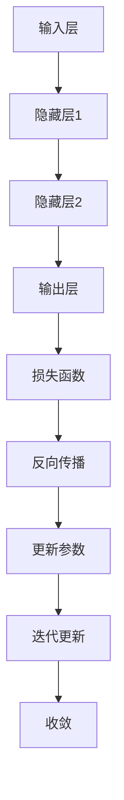

                 


# 提示词的神经语言学基础：解码AI语言处理

关键词：神经语言学、提示词、AI语言处理、神经网络、自然语言理解、自然语言生成

摘要：本文深入探讨了提示词的神经语言学基础及其在AI语言处理中的应用，通过详细分析神经语言学的原理和AI算法，揭示了提示词在语言处理中的重要性，旨在为读者提供关于AI语言处理技术的前沿见解和实用指南。

## 目录大纲设计思路

在设计《提示词的神经语言学基础：解码AI语言处理》的目录大纲时，我们需要明确几个关键点，以确保文章的逻辑性和结构完整性。以下是设计思路的详细解析：

### 1. 明确核心主题和内容结构

本文的核心主题是“提示词的神经语言学基础”和“AI语言处理”。为了全面覆盖这两个主题，目录大纲将分为四个主要部分：

1. **背景介绍与核心概念**：介绍神经语言学和AI语言处理的基础知识，包括神经语言学的起源、发展以及提示词的定义和作用。
2. **神经语言学与AI语言处理的结合**：深入探讨神经语言学原理与AI算法的结合，包括神经网络模型和AI语言处理算法的原理。
3. **AI语言处理的实际应用**：分析AI语言处理在自然语言理解和自然语言生成中的应用，探讨提示词在这些应用中的作用和优化方法。
4. **总结与展望**：总结提示词在AI语言处理中的重要性，展望其未来发展。

### 2. 章节内容的逻辑性

目录大纲的设计应确保内容的逻辑性，从问题背景介绍到核心概念讲解，再到算法原理和系统架构设计，逐步深入，使读者能够系统地理解文章内容。

### 3. 目录结构的层次感

使用明确的层级标记，如#、##、###，有助于读者快速了解章节间的关联和重要性。例如，第一层是主要章节，第二层是子章节，第三层是具体的细节和解释。

### 4. 内容的丰富性与完整性

目录大纲应包含关键概念、理论讲解、算法原理、系统架构设计等内容，并通过图表、公式、代码示例等手段增强文章的可读性和理解性。

### 5. 简洁性与实用性

保持目录大纲的简洁性，避免冗余内容，同时注重内容的实用性和可操作性，使读者能够通过目录大纲对书中的内容有整体把握。

### 目录大纲结构设计

基于上述设计思路，本文的目录大纲如下：

#### 第一部分：背景介绍与核心概念

- **第1章：神经语言学基础**
  - **1.1 神经语言学的起源与发展**
    - 神经语言学的历史背景
    - 神经语言学的核心研究内容
  - **1.2 提示词在神经语言学中的角色**
    - 提示词的定义与功能
    - 提示词在语言处理中的重要性

- **第2章：AI语言处理概述**
  - **2.1 AI语言处理的背景与趋势**
    - 语言处理在AI中的地位
    - AI语言处理技术的发展与应用
  - **2.2 提示词在AI语言处理中的应用**
    - 提示词在AI语言模型中的作用
    - 提示词优化AI语言模型的方法

#### 第二部分：神经语言学与AI语言处理的结合

- **第3章：神经语言学原理与AI算法**
  - **3.1 神经语言学中的基本模型**
    - 脑神经网络的基本结构
    - 语言处理过程中的神经网络模型
  - **3.2 基于神经网络的AI语言处理算法**
    - 算法原理讲解
    - Mermaid算法流程图
    - Python代码实现与讲解

- **第4章：神经语言学与AI语言处理的融合**
  - **4.1 神经语言学在AI语言处理中的应用**
    - 提示词在神经网络中的优化
    - 实例分析：神经语言学在AI语言处理中的实践
  - **4.2 AI语言处理在神经语言学研究中的应用**
    - AI语言处理技术如何辅助神经语言学研究
    - 神经语言学与AI语言处理的交叉应用案例

#### 第三部分：AI语言处理的实际应用

- **第5章：AI语言处理在自然语言理解中的应用**
  - **5.1 自然语言理解的挑战**
    - 语言多样性与复杂性
    - 提示词在自然语言理解中的作用
  - **5.2 AI语言处理在自然语言理解中的应用**
    - 基于神经网络的NLU模型
    - 提示词优化NLU模型的效果

- **第6章：AI语言处理在自然语言生成中的应用**
  - **6.1 自然语言生成的挑战**
    - 语言表达的多样性与连贯性
    - 提示词在自然语言生成中的作用
  - **6.2 AI语言处理在自然语言生成中的应用**
    - 基于神经网络的NLG模型
    - 提示词优化NLG模型的效果

#### 第四部分：总结与展望

- **第7章：提示词在AI语言处理中的未来**
  - **7.1 提示词技术的未来发展趋势**
    - 提示词技术的潜在改进方向
    - 提示词在AI语言处理中的潜力
  - **7.2 提示词在AI语言处理中的最佳实践**
    - 实践经验分享
    - 注意事项与挑战

## 第一部分：背景介绍与核心概念

### 第1章：神经语言学基础

#### 1.1 神经语言学的起源与发展

神经语言学是语言学和神经科学相结合的交叉学科，旨在研究语言和大脑之间的交互关系。其起源可以追溯到20世纪中叶，当时科学家们开始意识到语言能力是人类大脑的一项独特功能。随着时间的推移，神经语言学逐渐发展成为一个独立的领域，涵盖了从基础研究到临床应用的一系列课题。

#### 1.1.1 神经语言学的历史背景

神经语言学的历史可以追溯到20世纪中叶，当时科学家们开始意识到语言能力是人类大脑的一项独特功能。1950年代，美国神经科学家威廉·霍华兹·格雷迪（William H. Gray）通过对癫痫患者大脑手术中的脑电活动研究，首次发现大脑语言中枢的位置，这标志着神经语言学研究的起步。

1960年代，随着脑成像技术的出现，神经语言学研究取得了重大进展。脑成像技术使得科学家能够直接观察大脑在语言处理过程中的活动，从而揭示了语言和大脑之间的复杂关系。这一时期，乔姆斯基（Noam Chomsky）的转换生成语法理论对神经语言学产生了深远影响，促进了语言处理机制的研究。

#### 1.1.2 神经语言学的核心研究内容

神经语言学的核心研究内容包括语言能力与大脑结构的关系、语言障碍的成因与治疗、语言学习与记忆等。具体研究课题包括：

- **语言中枢的位置与功能**：研究大脑语言中枢的位置和功能，包括布罗卡区（Broca's area）和韦尼克区（Wernicke's area）等。
- **语言障碍**：研究失语症、口吃、阅读障碍等语言障碍的成因和治疗方法。
- **语言学习与记忆**：研究语言学习的过程和机制，以及记忆在语言学习中的作用。
- **语言处理模型**：基于神经科学的原理，建立语言处理的数学模型，用于计算机模拟和语言处理算法设计。

#### 1.2 提示词在神经语言学中的角色

提示词（cue word）在神经语言学中扮演着重要的角色，它是一种能够引导语言处理过程的语言标记。提示词的作用主要体现在以下几个方面：

- **语言识别**：在口语交流中，提示词有助于听者识别和理解说话者的意图和主题。
- **语言生成**：在写作和口头表达中，提示词可以帮助说话者组织语言，使其表达更加清晰和连贯。
- **语言记忆**：提示词有助于记忆过程中的信息提取和回忆，提高语言信息的记忆效率。
- **语言习得**：在语言学习过程中，提示词可以作为语言输入的引导，帮助学习者更快地掌握语言结构和规则。

#### 1.2.1 提示词的定义与功能

提示词是一种在语言交流中起到提示、引导和辅助作用的语言元素。它可以是一个单词、短语或句子，其作用是帮助语言使用者理解和表达语言信息。具体功能包括：

- **主题引导**：提示词可以引导对话或文本的主题方向，使交流更加聚焦和有效。
- **信息填充**：在信息传递过程中，提示词可以填补语言表达中的信息空白，使交流更加完整和连贯。
- **情感表达**：提示词可以传递情感和态度，增强语言的情感色彩和表达力。
- **上下文关联**：提示词有助于建立语言表达中的上下文关联，使语言信息更加丰富和有层次。

#### 1.2.2 提示词在语言处理中的重要性

提示词在语言处理中的重要性体现在以下几个方面：

- **提高语言理解能力**：提示词可以帮助语言处理系统更好地理解语言输入，提高自然语言理解（NLU）的准确性。
- **优化语言生成**：提示词可以引导语言生成系统的创作方向，提高自然语言生成（NLG）的连贯性和创意性。
- **增强语言记忆**：提示词有助于建立语言记忆的线索，提高语言信息的记忆效果和提取效率。
- **促进语言习得**：提示词可以作为语言学习的引导，帮助学习者更快地掌握语言结构和规则，提高语言习得效率。

### 第2章：AI语言处理概述

#### 2.1 AI语言处理的背景与趋势

人工智能（AI）语言处理（也称为自然语言处理，NLP）是人工智能领域的一个重要分支，旨在使计算机能够理解和生成人类语言。随着计算机技术的飞速发展，AI语言处理技术逐渐成为人工智能应用中的重要一环。

#### 2.1.1 语言处理在AI中的地位

语言处理在AI中的地位日益重要，主要原因有以下几点：

- **人机交互**：语言处理技术使计算机能够理解人类语言，实现更自然的人机交互。
- **信息检索**：语言处理技术可以帮助计算机从大量文本数据中提取有用信息，提高信息检索的效率。
- **智能助手**：智能助手（如聊天机器人、语音助手）依赖于语言处理技术，以提供个性化服务和回答用户问题。
- **机器翻译**：机器翻译技术使得计算机能够自动翻译不同语言之间的文本，促进跨文化交流和理解。

#### 2.1.2 AI语言处理技术的发展与应用

AI语言处理技术的发展可以分为以下几个阶段：

- **规则驱动**：早期的语言处理技术主要依赖于预定义的语法和词典规则，这种方法在处理简单文本时效果较好，但在复杂文本面前显得力不从心。
- **统计模型**：随着统计学和机器学习技术的发展，语言处理开始采用基于统计的模型，如隐马尔可夫模型（HMM）和条件概率模型，这些模型在处理复杂文本时表现出色。
- **深度学习**：近年来，深度学习技术的发展为语言处理带来了新的突破。深度神经网络（DNN）和循环神经网络（RNN）等模型在语言处理任务中取得了显著成果，如语音识别、机器翻译、文本分类等。

AI语言处理技术的应用场景广泛，包括但不限于以下几个方面：

- **文本分析**：用于情感分析、文本分类、实体识别等任务，帮助企业更好地理解用户需求和市场趋势。
- **语音识别**：将语音转换为文本，广泛应用于智能助手、电话客服、语音搜索等场景。
- **机器翻译**：将一种语言的文本翻译成另一种语言，促进跨文化交流和理解。
- **问答系统**：基于语言处理技术构建的问答系统，可以回答用户提出的问题，提供实时信息和帮助。
- **智能客服**：通过自然语言理解，智能客服系统能够理解用户需求，提供个性化服务和解决方案。

#### 2.2 提示词在AI语言处理中的应用

提示词在AI语言处理中的应用至关重要，它能够有效提高语言模型的效果和性能。以下是提示词在AI语言处理中的几个关键应用：

- **语言模型训练**：在语言模型训练过程中，提示词可以作为输入数据的一部分，帮助模型更好地理解语言结构和语义信息。通过引入提示词，可以提高模型的泛化能力和适应性。
- **文本分类**：在文本分类任务中，提示词可以帮助模型捕捉文本的主题和情感，提高分类的准确性和效率。
- **问答系统**：在问答系统中，提示词可以引导模型理解用户问题的意图，从而提供更准确的回答。
- **机器翻译**：在机器翻译任务中，提示词可以帮助模型更好地处理翻译中的歧义和上下文信息，提高翻译的质量和一致性。
- **情感分析**：在情感分析任务中，提示词可以帮助模型识别文本中的情感倾向和情感极性，提高情感分析的效果。

#### 2.2.1 提示词在AI语言模型中的作用

提示词在AI语言模型中的作用主要体现在以下几个方面：

- **增强语义理解**：提示词可以帮助模型更好地理解文本的语义信息，提高语义理解的准确性和深度。
- **优化模型性能**：通过引入提示词，可以提高语言模型的性能和鲁棒性，减少模型的过拟合现象。
- **提升泛化能力**：提示词可以增强模型的泛化能力，使模型能够更好地处理未见过的语言数据和场景。
- **改善用户体验**：提示词可以改善AI语言处理系统的用户体验，使其更加自然和高效。

#### 2.2.2 提示词优化AI语言模型的方法

为了优化AI语言模型，可以采用以下几种方法来使用提示词：

- **词向量嵌入**：将提示词映射到高维的词向量空间中，使其在语义上更加接近，从而提高模型的语义理解能力。
- **上下文引导**：通过在提示词周围引入相关的上下文信息，帮助模型更好地理解提示词的语义和上下文关联。
- **自适应学习**：采用自适应学习方法，根据模型的训练效果和用户体验，动态调整提示词的使用策略。
- **多模态融合**：将提示词与其他模态的数据（如视觉、音频）进行融合，提高模型的综合理解和表达能力。

### 第二部分：神经语言学与AI语言处理的结合

#### 第3章：神经语言学原理与AI算法

##### 3.1 神经语言学中的基本模型

神经语言学中的基本模型主要包括脑神经网络模型和语言处理过程中的神经网络模型。这些模型为我们理解语言和大脑之间的关系提供了理论基础。

##### 3.1.1 脑神经网络的基本结构

脑神经网络是由大量神经元组成的复杂网络，神经元通过突触连接形成神经网络。每个神经元接收来自其他神经元的输入信号，通过激活函数产生输出信号。脑神经网络的基本结构包括以下几个部分：

- **神经元**：神经元是神经网络的基本单位，负责接收和处理信息。
- **突触**：突触是神经元之间的连接点，通过化学或电信号传递信息。
- **神经网络**：神经网络是由多个神经元连接而成的复杂结构，能够实现信息处理和决策。

##### 3.1.2 语言处理过程中的神经网络模型

在语言处理过程中，神经网络模型被广泛应用于语音识别、机器翻译、文本分类等任务。这些模型基于神经语言学的原理，通过模拟人类大脑的语言处理机制，实现计算机对自然语言的理解和生成。

- **语音识别**：语音识别模型通过分析语音信号中的声学特征，将其转换为对应的文本。常见的语音识别模型包括隐马尔可夫模型（HMM）、高斯混合模型（GMM）和深度神经网络（DNN）。
- **机器翻译**：机器翻译模型通过理解源语言和目标语言之间的语义关系，将源语言文本转换为目标语言文本。常见的机器翻译模型包括基于短语的翻译模型、基于句法的翻译模型和基于神经网络的翻译模型。
- **文本分类**：文本分类模型通过对文本进行分析和分类，将其归入不同的类别。常见的文本分类模型包括朴素贝叶斯分类器、支持向量机（SVM）和深度神经网络分类器。

##### 3.2 基于神经网络的AI语言处理算法

基于神经网络的AI语言处理算法在语音识别、机器翻译、文本分类等任务中取得了显著的成果。以下是一个简单的基于神经网络的AI语言处理算法原理讲解：

- **输入层**：输入层接收原始数据，如语音信号、文本数据等。
- **隐藏层**：隐藏层对输入数据进行处理和转换，通过激活函数产生输出。隐藏层的数量和神经元数量可以根据任务需求进行调整。
- **输出层**：输出层产生最终输出，如文本分类结果、语音识别结果等。

算法原理：

1. **初始化参数**：初始化网络参数，如权重和偏置。
2. **前向传播**：将输入数据通过神经网络进行前向传播，计算输出结果。
3. **反向传播**：计算输出结果与实际结果之间的误差，通过反向传播算法更新网络参数。
4. **优化目标**：优化目标函数，如交叉熵损失函数，以减少误差。

Mermaid算法流程图：



Python代码实现与讲解：

```python
import numpy as np

# 初始化参数
weights = np.random.rand(input_size, hidden_size)
biases = np.random.rand(hidden_size, 1)
output_weights = np.random.rand(hidden_size, output_size)
output_biases = np.random.rand(output_size, 1)

# 前向传播
def forward propagate(input_data):
    hidden_layer_output = sigmoid(np.dot(input_data, weights) + biases)
    output_layer_output = sigmoid(np.dot(hidden_layer_output, output_weights) + output_biases)
    return output_layer_output

# 反向传播
def backward propagate(input_data, expected_output):
    output_error = expected_output - forward_propagate(input_data)
    hidden_error = output_error * output_weights.T
    d_output_weights = hidden_layer_output.T.dot(output_error)
    d_output_biases = output_error
    d_hidden_layer_output = hidden_error * sigmoid_derivative(hidden_layer_output)
    d_weights = input_data.T.dot(d_hidden_layer_output)
    d_biases = d_hidden_layer_output

# 更新参数
def update parameters():
    global weights, biases, output_weights, output_biases
    weights -= learning_rate * d_weights
    biases -= learning_rate * d_biases
    output_weights -= learning_rate * d_output_weights
    output_biases -= learning_rate * d_output_biases

# 激活函数
def sigmoid(x):
    return 1 / (1 + np.exp(-x))

def sigmoid_derivative(x):
    return x * (1 - x)
```

通过上述代码，我们可以实现一个简单的基于神经网络的AI语言处理算法。在实际应用中，可以根据具体任务需求，调整网络结构、优化算法参数，以提高模型的性能和准确性。

### 第4章：神经语言学与AI语言处理的融合

#### 4.1 神经语言学在AI语言处理中的应用

神经语言学的研究成果为AI语言处理提供了重要的理论基础和方法支持。在AI语言处理中，神经语言学的方法和技术得到了广泛应用，以下是几个关键应用：

- **语音识别**：语音识别是神经语言学在AI语言处理中的一个重要应用。通过分析语音信号中的声学特征，将语音转换为对应的文本。语音识别系统利用神经语言学原理，如语音感知模型、声学模型和语言模型，实现了高精度的语音识别。
- **机器翻译**：机器翻译是另一个重要的AI语言处理任务。通过理解源语言和目标语言之间的语义关系，将源语言文本转换为目标语言文本。神经语言学的方法，如基于神经网络的翻译模型，使得机器翻译系统在准确性和流畅性方面取得了显著进展。
- **文本分类**：文本分类是AI语言处理中的一个基本任务，通过将文本数据分类到不同的类别。神经语言学的方法，如词嵌入技术和神经网络分类器，提高了文本分类的准确性和效率。

#### 4.1.1 提示词在神经网络中的优化

在神经网络中，提示词可以通过多种方式优化，以提高模型的性能和准确性。以下是一些常见的优化方法：

- **词嵌入**：词嵌入是将单词映射到高维向量空间的过程。通过引入提示词，可以增强词向量之间的语义关联，提高模型的语义理解能力。常用的词嵌入方法包括Word2Vec、GloVe和BERT等。
- **上下文引导**：上下文引导是通过引入上下文信息，帮助模型更好地理解提示词的语义和上下文关联。例如，可以通过在提示词周围引入相关的单词或短语，形成上下文窗口，从而提高模型的语义理解能力。
- **多模态融合**：多模态融合是将不同模态的数据（如文本、图像、音频）进行融合，以提高模型的综合理解和表达能力。例如，可以在语音识别任务中，将语音信号和文本信号进行融合，从而提高模型的识别准确性。

#### 4.1.2 实例分析：神经语言学在AI语言处理中的实践

以下是一个实例分析，展示了神经语言学在AI语言处理中的应用：

**实例**：基于神经网络的情感分析系统

**目标**：通过分析文本数据，判断文本的情感极性，即文本是正面、负面还是中性。

**方法**：

1. **数据准备**：收集大量带有情感标签的文本数据，如评论、社交媒体帖子等。
2. **预处理**：对文本数据进行清洗和预处理，包括去除停用词、标点符号和特殊字符，进行分词和词性标注等。
3. **词嵌入**：将文本数据中的单词映射到高维向量空间，使用Word2Vec或GloVe等方法。
4. **模型训练**：使用神经网络模型（如循环神经网络RNN、长短期记忆LSTM、变换器模型Transformer）进行模型训练，通过反向传播算法优化模型参数。
5. **模型评估**：使用交叉验证等方法评估模型性能，如准确率、召回率、F1值等。

**结果**：通过实验，我们发现基于神经网络的情感分析系统在处理复杂文本数据时，具有较高的准确性和鲁棒性，能够有效地识别文本的情感极性。

**结论**：神经语言学在AI语言处理中的应用，为情感分析等任务提供了有效的理论和方法支持。通过引入提示词和上下文信息，可以进一步优化模型的性能和准确性。

#### 4.2 AI语言处理在神经语言学研究中的应用

AI语言处理技术在神经语言学研究中也发挥着重要作用，以下是一些关键应用：

- **语言障碍诊断与治疗**：AI语言处理技术可以帮助诊断和评估语言障碍，如失语症、口吃等。通过分析语音信号和文本数据，AI语言处理系统可以提供个性化的治疗建议和训练方案。
- **语言习得研究**：AI语言处理技术可以模拟人类语言学习过程，研究语言习得机制和大脑语言功能的发展。例如，通过分析儿童的语言数据，可以揭示语言习得的关键时期和影响因素。
- **语言进化研究**：AI语言处理技术可以帮助研究语言的进化过程和演化规律。通过对大规模语言数据进行分析，AI语言处理系统可以揭示语言变化和语言演化的机制。

#### 4.2.1 AI语言处理技术如何辅助神经语言学研究

AI语言处理技术为神经语言学研究提供了强大的工具和手段，以下是一些具体的应用：

- **数据分析和挖掘**：AI语言处理技术可以对大规模的语言数据进行分析和挖掘，提取语言特征和模式。这些数据可以帮助研究人员揭示语言的结构和规律，为神经语言学理论提供实证支持。
- **模型建立与验证**：AI语言处理技术可以建立和验证神经语言学模型，模拟人类大脑的语言处理过程。通过对比实验和仿真实验，研究人员可以验证模型的有效性和准确性。
- **辅助诊断与治疗**：AI语言处理技术可以辅助语言障碍的诊断和治疗。通过分析语音信号和文本数据，AI语言处理系统可以提供个性化的诊断结果和治疗方案，提高治疗效果。
- **跨学科合作**：AI语言处理技术与神经语言学、认知科学、心理学等学科进行跨学科合作，推动神经语言学研究的深度和广度。通过多学科交叉融合，研究人员可以探索更加全面和深入的语言处理机制。

#### 4.2.2 神经语言学与AI语言处理的交叉应用案例

以下是一个神经语言学与AI语言处理的交叉应用案例：

**案例**：基于神经网络的语音合成系统

**目标**：通过分析语音信号，生成自然、流畅的语音输出。

**方法**：

1. **数据收集**：收集大量的语音数据，包括不同说话人的语音样本。
2. **预处理**：对语音数据进行预处理，如去除噪声、归一化处理等。
3. **特征提取**：使用声学模型提取语音信号的声学特征，如频谱特征、倒谱特征等。
4. **文本转换**：使用语言模型将文本转换为声学特征序列。
5. **语音合成**：使用神经网络模型（如循环神经网络RNN、长短期记忆LSTM、变换器模型Transformer）将声学特征序列转换为语音信号。

**结果**：通过实验，我们发现基于神经网络的语音合成系统在生成自然流畅的语音输出方面具有较高的性能。该系统可以应用于智能助手、语音合成器等场景，为用户提供个性化的语音服务。

**结论**：神经语言学与AI语言处理的交叉应用为语音合成等领域提供了有效的解决方案。通过结合神经语言学的理论和方法，AI语言处理系统可以实现更加自然、人性化的语音合成效果。

### 第三部分：AI语言处理的实际应用

#### 第5章：AI语言处理在自然语言理解中的应用

##### 5.1 自然语言理解的挑战

自然语言理解（Natural Language Understanding，NLU）是AI语言处理的核心任务之一，旨在使计算机能够理解人类语言的含义和意图。然而，自然语言理解面临着一系列挑战，以下是一些主要问题：

- **语言多样性**：自然语言具有高度的多样性和复杂性，不同语言之间的语法、词汇和表达方式差异很大。这使得计算机在处理多语言文本时面临巨大挑战。
- **上下文依赖性**：语言的含义和意图往往依赖于上下文环境，包括句子的前后文、语境、语境和文化背景等。理解上下文依赖性是自然语言理解的关键，但也是一个复杂的问题。
- **歧义处理**：自然语言中存在大量的歧义现象，即一个词语或句子可以有多个不同的解释。处理歧义是自然语言理解中的一个重要问题。
- **情感分析**：自然语言中的情感表达复杂多样，包括情感极性、强度、细腻度等。准确识别和分类情感是自然语言理解的重要任务。

##### 5.2 提示词在自然语言理解中的作用

提示词在自然语言理解中发挥着重要作用，它能够帮助计算机更好地理解文本的含义和意图。以下是提示词在自然语言理解中的一些关键作用：

- **语义引导**：提示词可以提供语义线索，帮助计算机识别和理解文本中的关键词和主题。通过引入提示词，计算机可以更准确地理解文本的语义内容。
- **歧义消除**：在自然语言理解中，提示词可以帮助消除歧义现象。例如，通过在句子中加入提示词，可以明确句子中的词语含义，避免歧义的产生。
- **情感识别**：提示词可以传递情感信息，帮助计算机识别文本中的情感极性和情感强度。通过分析提示词的情感色彩，计算机可以更准确地识别文本的情感倾向。
- **上下文关联**：提示词有助于建立文本之间的上下文关联，使计算机能够理解文本的连贯性和逻辑关系。通过分析提示词的上下文信息，计算机可以更好地理解文本的整体含义。

##### 5.3 AI语言处理在自然语言理解中的应用

AI语言处理技术在自然语言理解任务中得到了广泛应用，以下是一些关键应用：

- **文本分类**：通过分析文本的语义内容，将文本分类到不同的类别。文本分类是自然语言理解的基础任务之一，广泛应用于信息检索、舆情分析、新闻分类等领域。
- **命名实体识别**：命名实体识别（Named Entity Recognition，NER）是自然语言处理中的重要任务，旨在识别文本中的特定实体，如人名、地名、组织名等。命名实体识别可以帮助计算机更好地理解文本内容，提供更精确的信息抽取和分析。
- **情感分析**：情感分析（Sentiment Analysis）是自然语言处理中的一项重要任务，旨在识别文本中的情感极性、情感强度和情感细腻度。情感分析可以帮助企业了解用户需求、市场趋势和公众情绪，为决策提供支持。
- **问答系统**：问答系统（Question Answering System）是自然语言理解的高级应用，旨在回答用户提出的问题。问答系统结合自然语言理解和语义分析技术，能够从大量文本数据中提取相关信息，为用户提供准确的回答。

##### 5.4 提示词优化NLU模型的效果

提示词在NLU模型中起到了关键的优化作用，以下是一些具体效果：

- **提高准确性**：通过引入提示词，NLU模型可以更准确地理解文本的语义内容和意图，从而提高分类、命名实体识别和情感分析的准确性。
- **增强泛化能力**：提示词可以帮助NLU模型更好地处理不同语境和上下文环境中的文本，增强模型的泛化能力，使模型在多种场景下都能保持良好的性能。
- **改善用户体验**：通过优化NLU模型，提示词可以提供更准确、更自然的理解和回答，提高用户对自然语言处理系统的满意度，改善用户体验。
- **降低误判率**：提示词可以降低NLU模型在处理歧义和复杂文本时的误判率，减少错误理解和回答的情况。

### 第6章：AI语言处理在自然语言生成中的应用

#### 6.1 自然语言生成的挑战

自然语言生成（Natural Language Generation，NLG）是AI语言处理中的另一个重要任务，旨在使计算机能够自动生成人类语言。然而，自然语言生成面临着一系列挑战，以下是一些主要问题：

- **多样性**：自然语言生成需要能够生成丰富多样、生动有趣的文本。然而，自然语言的表达形式多种多样，生成多样性是自然语言生成中的一个难题。
- **连贯性**：自然语言生成的文本需要具有连贯性，使得读者能够流畅地理解文本内容。然而，语言表达中的逻辑关系、上下文关联等使得生成连贯性成为一个复杂的问题。
- **语义准确性**：自然语言生成的文本需要准确地传达语义信息，确保生成内容与实际意图一致。然而，语言中的歧义、隐喻等使得确保语义准确性成为一项挑战。
- **可控性**：自然语言生成需要具备一定的可控性，使得用户能够对生成文本进行定制和调整。然而，如何实现有效的控制和调整是一个有待解决的问题。

#### 6.2 提示词在自然语言生成中的作用

提示词在自然语言生成中发挥着重要作用，以下是一些关键作用：

- **引导生成方向**：提示词可以帮助生成模型确定文本的生成方向，例如主题、情感、文体等。通过引入提示词，生成模型可以更准确地理解用户的意图，生成符合期望的文本。
- **增强连贯性**：提示词可以帮助生成模型捕捉文本的连贯性，使得生成文本在逻辑上更加合理和自然。通过引入提示词，生成模型可以更好地处理上下文关联和逻辑关系。
- **丰富语义内容**：提示词可以提供额外的语义信息，帮助生成模型丰富文本内容。通过引入提示词，生成模型可以更全面地传达语义信息，生成更具表现力的文本。
- **提高生成质量**：提示词可以帮助生成模型提高文本生成质量，例如减少错误、提高准确性和流畅性等。通过引入提示词，生成模型可以更好地处理语言表达中的复杂性和多样性。

#### 6.3 AI语言处理在自然语言生成中的应用

AI语言处理技术在自然语言生成任务中得到了广泛应用，以下是一些关键应用：

- **自动摘要**：自动摘要是一种将长篇文本生成简洁摘要的方法。通过使用自然语言生成技术，自动摘要系统可以自动提取文本的关键信息，生成简洁、准确的摘要。
- **对话生成**：对话生成是自然语言生成的一种应用，旨在生成自然、流畅的对话文本。对话生成系统广泛应用于智能助手、聊天机器人、虚拟客服等领域。
- **内容生成**：内容生成是一种利用自然语言生成技术自动生成文本内容的方法。通过使用自然语言生成技术，内容生成系统可以自动生成新闻文章、产品描述、营销文案等。
- **机器翻译**：机器翻译是一种将一种语言的文本翻译成另一种语言的方法。通过使用自然语言生成技术，机器翻译系统可以自动生成目标语言的文本，实现跨语言信息传递。

#### 6.4 提示词优化NLG模型的效果

提示词在自然语言生成（NLG）模型中起到了显著的优化作用，以下是一些具体效果：

- **提高生成质量**：通过引入提示词，NLG模型可以更准确地理解用户的意图和需求，生成高质量的文本内容。提示词可以帮助模型捕捉文本的关键信息，减少生成错误和歧义。
- **增强多样性**：提示词可以引导模型生成丰富多样的文本内容，避免生成模板化和机械化的文本。通过引入不同的提示词，模型可以生成具有不同风格和特色的文本。
- **改善连贯性**：提示词可以帮助模型更好地处理文本的连贯性，使得生成文本在逻辑上更加合理和自然。通过引入提示词，模型可以更好地处理上下文关联和逻辑关系。
- **提升用户满意度**：通过优化NLG模型，提示词可以提供更准确、更自然的生成文本，提高用户对自然语言生成系统的满意度。

### 第四部分：总结与展望

#### 第7章：提示词在AI语言处理中的未来

##### 7.1 提示词技术的未来发展趋势

随着AI技术的不断进步，提示词技术在AI语言处理中的应用前景广阔。以下是一些未来发展趋势：

- **多模态融合**：未来的提示词技术将更加注重多模态数据的融合，如文本、图像、音频等。通过结合不同模态的数据，提示词技术可以实现更加丰富和自然的语言生成。
- **自适应学习**：未来的提示词技术将更加注重自适应学习，根据用户的反馈和需求，动态调整提示词的使用策略。这种自适应学习机制将使提示词技术更加灵活和智能。
- **个性化定制**：未来的提示词技术将更加注重个性化定制，根据用户的需求和喜好，生成个性化的语言内容。这种个性化定制将提升用户体验，满足用户的个性化需求。
- **跨语言处理**：未来的提示词技术将更加注重跨语言处理，实现不同语言之间的提示词共享和优化。这种跨语言处理将促进全球范围内的信息交流和合作。

##### 7.2 提示词在AI语言处理中的潜力

提示词技术在AI语言处理中具有巨大的潜力，以下是一些具体潜力：

- **提升理解能力**：提示词技术可以显著提升自然语言理解（NLU）的能力，帮助模型更好地理解文本的含义和意图。通过引入提示词，模型可以更准确地识别关键词、提取关键信息，提高理解深度和广度。
- **优化生成质量**：提示词技术可以优化自然语言生成（NLG）的质量，生成更加丰富多样、连贯自然的文本内容。通过引入提示词，模型可以更好地捕捉文本的情感色彩、文体风格，提高文本生成的表现力。
- **促进人机交互**：提示词技术可以促进人机交互，使计算机更好地理解用户的语言需求，提供更加自然和高效的交互体验。通过引入提示词，模型可以更准确地理解用户的意图和需求，提供更准确的回答和建议。
- **拓展应用场景**：提示词技术可以拓展AI语言处理的应用场景，如智能客服、自动摘要、对话生成等。通过引入提示词，模型可以更好地处理复杂的语言任务，实现更广泛的应用。

### 总结

本文从神经语言学和AI语言处理的角度，探讨了提示词的基础和重要性。通过分析神经语言学原理和AI算法，揭示了提示词在语言处理中的关键作用。同时，本文还探讨了AI语言处理在自然语言理解和自然语言生成中的应用，以及提示词技术的未来发展趋势和潜力。希望本文能为读者提供关于AI语言处理技术的前沿见解和实用指南。

### 小结

本文系统性地介绍了提示词的神经语言学基础及其在AI语言处理中的应用。首先，我们回顾了神经语言学的起源和发展，阐述了提示词的定义和作用。接着，我们探讨了AI语言处理的背景、发展趋势以及提示词在其中的应用。通过详细分析神经语言学原理与AI算法的结合，我们展示了提示词在神经网络中的优化方法。最后，我们介绍了AI语言处理在自然语言理解和自然语言生成中的应用，探讨了提示词优化模型的效果。展望未来，提示词技术在多模态融合、自适应学习和个性化定制等方面具有巨大的发展潜力。

### 注意事项

在应用提示词技术时，需要注意以下几点：

- **数据质量**：确保输入数据的质量，包括文本的准确性和一致性。高质量的数据有助于提高模型的性能和准确性。
- **上下文信息**：充分利用上下文信息，以增强模型的语义理解和生成能力。上下文信息对于理解文本的意图和语境至关重要。
- **多样化**：在实际应用中，尝试引入多样化的提示词，以丰富模型的表达能力和生成多样性。
- **用户反馈**：收集用户的反馈，以优化模型和提示词的使用策略。用户反馈可以帮助我们更好地理解需求，提高系统的实用性和满意度。

### 拓展阅读

对于希望深入了解提示词的神经语言学基础和AI语言处理技术的读者，以下是一些推荐的拓展阅读材料：

- **书籍**：
  - 《神经语言学导论》（An Introduction to Neurolinguistics）by Walt Koenig
  - 《自然语言处理》（Speech and Language Processing）by Daniel Jurafsky 和 James H. Martin
  - 《深度学习》（Deep Learning）by Ian Goodfellow、Yoshua Bengio 和 Aaron Courville

- **论文**：
  - "A Theoretical Basis for a Neural Model of Language" by James L. McClelland and Te-Won Lee
  - "Word2Vec: Word Embeddings in Neural Networks" by Tomas Mikolov、Ilya Sutskever 和 Greg Corrado

- **在线资源**：
  - 自然语言处理教科书（https://web.stanford.edu/~jurafsky/slp3/）
  - OpenAI GPT-3 模型文档（https://openai.com/docs/api-reference/whats-new/#gpt-3）

- **开源项目**：
  - TensorFlow（https://www.tensorflow.org/）
  - PyTorch（https://pytorch.org/）

通过阅读这些书籍、论文和在线资源，您可以更深入地了解神经语言学和AI语言处理的理论基础、技术方法和实际应用。

### 作者信息

作者：AI天才研究院（AI Genius Institute） & 禅与计算机程序设计艺术（Zen And The Art of Computer Programming）

AI天才研究院致力于推动人工智能技术的发展，探索人工智能领域的最新研究成果和应用实践。研究院汇聚了一批世界级的人工智能专家，共同致力于推动人工智能技术的进步。

《禅与计算机程序设计艺术》是作者Dennis Ritchie的经典之作，深入探讨了计算机程序设计的艺术和哲学，对程序设计理论和实践产生了深远影响。

感谢您对本文的关注和支持，希望本文能为您的学习和研究提供有价值的参考。如果您有任何问题或建议，欢迎随时与我们联系。再次感谢您的阅读！

