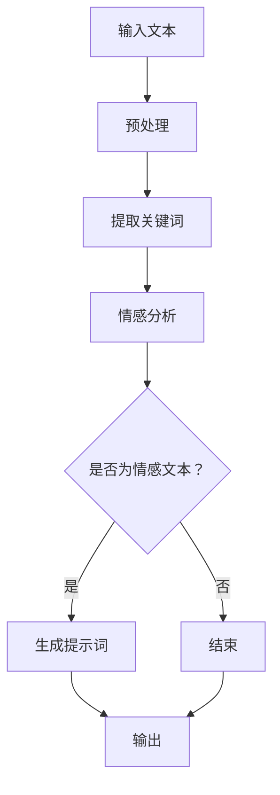
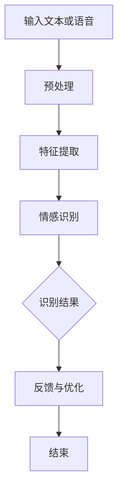
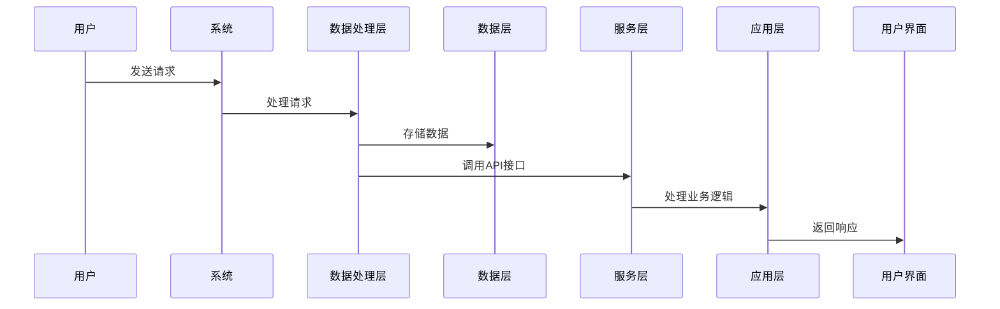
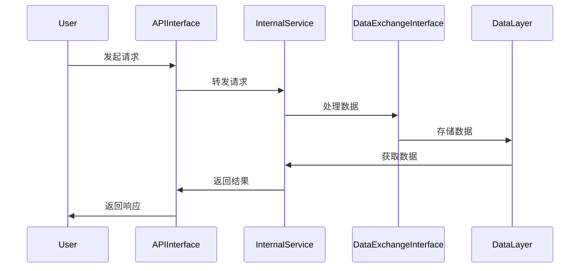
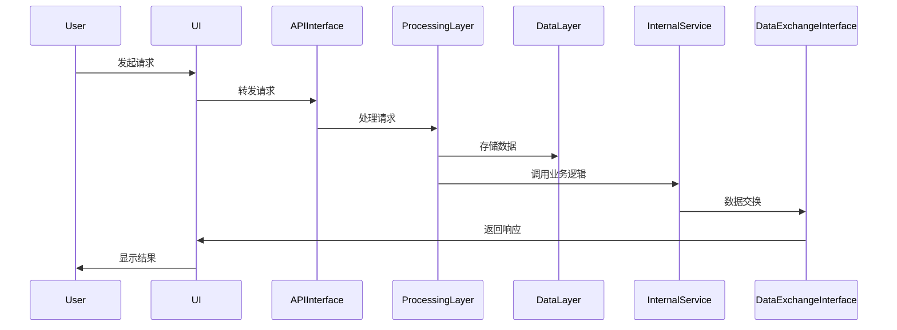

                 

### 第1章：研究背景与意义

### 1.1 计算语言学概述

#### 1.1.1 计算语言学的起源与发展

计算语言学（Computational Linguistics）作为一门交叉学科，始于20世纪50年代，当时计算机科学的快速发展为语言研究带来了新的契机。最早的计算语言学工作主要集中在机器翻译和自然语言理解上，如乔治·阿克夫（George A. Miller）等人的研究开创了语言模型和统计语言学的先河。随着计算机性能的提升和算法的优化，计算语言学逐渐成为语言学、计算机科学、信息科学等多个领域的交汇点。

在过去的几十年中，计算语言学经历了从理论到应用的快速转变。早期的研究主要集中在语言数据收集和标注、形式化语言理论、语法分析、语义分析等方面。随着互联网和大数据时代的到来，自然语言处理（Natural Language Processing, NLP）逐渐成为计算语言学的核心领域，涵盖了文本分类、信息提取、问答系统、语音识别等多种应用场景。

#### 1.1.2 情感计算的崛起与影响

情感计算（Affective Computing）是计算语言学的另一个重要分支，它关注于使计算机能够识别、理解、处理和模拟人类情感的能力。情感计算的兴起可以追溯到20世纪90年代，由计算机科学家罗纳德·卡恩（Roger S. Mann）和帕特里夏·坎贝尔（Patrick J. Scott）提出。

情感计算的研究内容包括情感识别、情感模拟、情感交互等，其应用领域广泛，包括但不限于人机对话系统、情感辅助治疗、智能安防、智能玩具等。情感计算的发展不仅提升了计算机与人之间的交互体验，还在心理学、教育学、医疗健康等领域产生了深远的影响。

#### 1.2 提示词在计算语言学中的应用

提示词（Prompt Words）在计算语言学中起着关键作用。它们是自然语言处理过程中用来引导和优化模型输出的词汇或短语。提示词的应用主要体现在以下几个方面：

1. **语言模型训练**：在训练语言模型时，提示词可以用来增强模型的上下文感知能力，使得模型更准确地预测下一个词或句子。
   
2. **问答系统**：在问答系统中，提示词可以帮助系统更好地理解用户的问题，从而提供更准确的答案。

3. **文本生成**：在文本生成任务中，提示词可以引导生成过程，使得生成的文本更加符合预期的内容。

4. **情感分析**：在情感分析中，提示词可以用来引导模型识别和分类文本中的情感倾向。

#### 1.2.1 提示词的定义与作用

提示词（Prompt Word）通常是指用于引导、提示或激励某项任务或活动开始的词语或短语。在自然语言处理中，提示词的定义更为具体，指的是一组用于辅助模型进行特定任务的关键词或短语。

提示词的主要作用如下：

1. **引导模型输出**：提示词可以帮助模型在生成文本或进行分类时，朝预期方向输出。
   
2. **优化训练过程**：通过使用提示词，可以提高语言模型的训练效果，使得模型更快收敛，减少过拟合。

3. **增强上下文理解**：提示词可以为模型提供额外的上下文信息，从而帮助模型更好地理解输入文本。

4. **提高任务效率**：在特定的自然语言处理任务中，提示词可以显著提高任务的完成效率。

#### 1.2.2 提示词在自然语言处理中的关键作用

提示词在自然语言处理（NLP）中的关键作用主要体现在以下几个方面：

1. **文本分类**：在文本分类任务中，提示词可以帮助模型更好地识别文本的主题或情感，从而提高分类的准确性。

2. **情感分析**：提示词在情感分析中起到引导模型识别情感的关键作用。例如，在识别积极或消极情感时，适当的提示词可以显著提高模型的识别准确率。

3. **文本生成**：在文本生成任务中，提示词可以帮助模型生成更加连贯和符合预期的文本。

4. **问答系统**：在问答系统中，提示词可以引导模型更好地理解用户的问题，从而提供更准确的答案。

### 1.3 情感计算的背景与核心

#### 1.3.1 情感计算的定义与研究范畴

情感计算（Affective Computing）是指使计算机能够识别、理解、处理和模拟人类情感的能力。它涵盖了情感识别、情感模拟、情感交互等多个方面。情感计算的核心目标是构建具有情感智能的计算机系统，从而提升人与计算机之间的交互体验。

情感计算的研究范畴包括：

1. **情感识别**：通过分析文本、语音、面部表情等数据，计算机识别用户的情感状态。
   
2. **情感模拟**：计算机通过生成相应的情感反应，模拟人类情感，提高人机交互的自然性和亲和力。

3. **情感交互**：研究如何通过情感计算技术，实现人与计算机之间的有效情感交流。

#### 1.3.2 情感计算的方法与工具

情感计算的方法和工具多种多样，主要包括以下几种：

1. **情感识别方法**：包括基于文本的情感分析、基于语音的情感识别、基于面部表情的情感分析等。常用的工具包括情感词典、机器学习算法、深度学习模型等。

2. **情感模拟方法**：通过生成文本、语音、面部表情等来模拟人类情感。常用的工具包括文本生成模型、语音合成技术、面部表情合成技术等。

3. **情感交互方法**：研究如何设计人机交互界面，使得计算机能够更好地识别和响应用户的情感状态。常用的工具包括交互界面设计、情感反馈机制等。

### 1.4 提示词与情感计算的交叉研究

#### 1.4.1 研究现状与挑战

提示词与情感计算的交叉研究是目前计算语言学和情感计算领域的热点问题之一。研究现状主要集中在以下几个方面：

1. **情感识别中的提示词应用**：研究如何使用提示词提高情感识别的准确性，如通过设计特定的提示词来增强情感分类模型的效果。

2. **情感模拟中的提示词设计**：研究如何设计提示词来引导情感模拟，使得计算机生成的情感反应更加自然和符合预期。

3. **情感交互中的提示词优化**：研究如何通过提示词优化人机交互，提升用户的情感体验。

尽管取得了显著进展，但在交叉研究中仍面临以下挑战：

1. **数据不足**：高质量的标注数据集对于情感计算和提示词研究至关重要，但目前仍存在数据不足的问题。

2. **模型泛化能力**：如何设计出能够泛化到不同领域和语言的提示词模型，是一个亟待解决的问题。

3. **伦理和隐私**：在情感计算中，如何保护用户的隐私和尊重用户的情感，是一个重要的伦理问题。

#### 1.4.2 研究意义与目标

提示词与情感计算的交叉研究具有重要的理论意义和实际应用价值。

1. **理论意义**：通过交叉研究，可以深化对计算语言学和情感计算本质的理解，探索两者之间的内在联系，推动学科的发展。

2. **应用价值**：在实际应用中，提示词与情感计算的结合可以提升人机交互的自然性和情感共鸣，应用于智能客服、智能教育、智能医疗等多个领域，提升用户体验和系统的智能化水平。

研究的目标包括：

1. **设计高效的提示词生成算法**：研究如何设计出高效、准确的提示词生成算法，以支持情感计算任务。

2. **构建大规模情感计算数据集**：通过收集和标注高质量的情感数据，为研究提供丰富的数据支持。

3. **优化情感识别和模拟**：研究如何通过提示词优化情感识别和模拟，提升系统的性能和用户体验。

### 总结

本章介绍了计算语言学和情感计算的基本概念、研究背景和意义。计算语言学作为自然语言处理的基础，在语言模型、词嵌入等方面取得了重要进展。情感计算则关注计算机对人类情感的理解和模拟，在提升人机交互体验方面具有巨大潜力。提示词在两者中均起着关键作用，本章还讨论了提示词与情感计算的交叉研究现状与挑战，以及研究的意义与目标。

---

### 第2章：核心概念与联系

#### 2.1 计算语言学核心概念

在深入探讨提示词与情感计算的交叉研究之前，有必要先了解计算语言学的核心概念，这些概念构成了计算语言学的基础，并在提示词与情感计算的研究中扮演重要角色。

##### 2.1.1 语言模型

**语言模型（Language Model）** 是自然语言处理的核心组件，用于预测文本中下一个词或句子的概率分布。语言模型的基本原理是通过对大规模文本语料库的分析，学习语言中的统计规律，从而构建一个能够表示语言概率分布的模型。

**语言模型的基本原理**：

1. **基于统计的方法**：最早的N-gram模型通过统计相邻单词出现的频率来预测下一个单词。尽管N-gram模型简单有效，但它无法捕捉长距离依赖关系。

2. **基于神经网络的模型**：随着深度学习的发展，循环神经网络（RNN）、长短时记忆网络（LSTM）和Transformer模型等神经网络语言模型逐渐成为主流。这些模型通过学习文本中的长距离依赖关系，能够生成更自然的文本。

**语言模型的构建方法**：

1. **N-gram模型**：是最简单的语言模型，它使用前N个单词的历史信息来预测下一个单词。

2. **神经网络模型**：如RNN、LSTM和Transformer等，这些模型通过多层神经网络结构来捕捉文本中的复杂依赖关系。

2. **词嵌入（Word Embedding）**

**词嵌入（Word Embedding）** 是将词汇映射到高维空间中的向量表示，使得相似词汇在空间中距离更近。词嵌入的基本原理是通过对文本数据进行编码，将词汇表示为具有固定维度的向量。

**词嵌入的概念**：

1. **分布式表示**：词嵌入将词汇映射到向量空间，每个词对应一个向量，这些向量在空间中形成一种分布式表示。

2. **上下文依赖**：词嵌入不仅反映了词汇的语义信息，还考虑了词汇在不同上下文中的表现。

**词嵌入的方法与应用**：

1. **基于频次的方法**：如TF-IDF，这种方法通过词频和文档频率来计算词的权重。

2. **基于神经网络的方法**：如Word2Vec、GloVe等，这些方法通过训练神经网络模型来学习词汇的向量表示。

3. **应用场景**：词嵌入在自然语言处理中应用广泛，如文本分类、情感分析、机器翻译等。

##### 2.1.2 词嵌入

词嵌入（Word Embedding）是计算语言学中的一个核心概念，它通过将词汇映射到高维空间中的向量来表示文本数据。这种向量表示不仅能够捕捉词汇的语义信息，还能够反映词汇在上下文中的表现。

**词嵌入的概念**：

1. **分布式表示**：词嵌入将词汇映射到向量空间，使得在空间中相似的词汇距离更近。

2. **上下文依赖**：词嵌入不仅考虑词汇的语义信息，还考虑了词汇在不同上下文中的使用情况。

**词嵌入的方法**：

1. **基于频次的方法**：如TF-IDF，这种方法通过词频和文档频率来计算词的权重。

2. **基于神经网络的方法**：

   - **Word2Vec**：是一种基于窗口大小和隐含负采样的神经网络模型，通过优化损失函数来训练词汇的向量表示。
   - **GloVe**（Global Vectors for Word Representation）：是一种基于全局共现矩阵的词向量训练方法，通过优化矩阵分解来学习词汇的向量表示。

3. **应用**：词嵌入在自然语言处理中的广泛应用，包括文本分类、情感分析、机器翻译等。

**词嵌入的方法与应用**：

1. **基于频次的方法**：如TF-IDF，这种方法通过词频和文档频率来计算词的权重，简单直观，但无法捕捉词汇的上下文信息。

2. **基于神经网络的方法**：

   - **Word2Vec**：通过训练神经网络模型来学习词汇的向量表示，具有较好的效果和广泛的认可。
   - **GloVe**：通过优化全局共现矩阵的矩阵分解来学习词汇的向量表示，能够捕捉词汇的上下文信息。

3. **应用**：

   - **文本分类**：词嵌入能够提高文本分类的准确性，通过将文本表示为向量，可以应用传统的机器学习算法进行分类。
   - **情感分析**：词嵌入可以帮助模型更好地理解文本中的情感倾向，从而提高情感分析的准确性。
   - **机器翻译**：词嵌入在机器翻译中的应用，通过将源语言和目标语言的词汇映射到相同的向量空间，提高了翻译质量。

#### 2.2 情感计算核心概念

情感计算（Affective Computing）是计算语言学的另一个重要分支，它研究如何使计算机系统理解和处理人类的情感。情感计算的核心概念包括情感识别、情感模拟和情感交互。

##### 2.2.1 情感识别

**情感识别（Affective Recognition）** 是指计算机系统通过分析文本、语音、面部表情等数据，识别用户的情感状态。情感识别可以分为以下几种方法：

1. **基于文本的情感分析**：通过分析文本内容，识别文本中的情感倾向，如积极、消极、中性等。

2. **基于语音的情感识别**：通过分析语音信号，识别说话者的情感状态，如快乐、悲伤、愤怒等。

3. **基于面部表情的情感识别**：通过分析面部图像，识别面部表情所表达的情感状态，如高兴、悲伤、惊讶等。

**情感识别的分类**：

- **情感倾向识别**：识别文本、语音或面部表情中的整体情感倾向。
- **情感强度识别**：识别文本、语音或面部表情中的情感强度，如情感强烈、情感适中、情感微弱等。

**情感识别的方法**：

1. **传统机器学习方法**：如支持向量机（SVM）、决策树等，通过训练分类模型，对情感进行识别。

2. **深度学习方法**：如卷积神经网络（CNN）、循环神经网络（RNN）等，通过学习大量的情感数据，实现情感识别。

**情感识别的挑战**：

- **跨语言和跨领域的泛化**：如何设计出能够泛化到不同语言和领域的情感识别模型，是一个重要挑战。
- **多模态融合**：如何有效地融合文本、语音和面部表情等多种模态信息，提高情感识别的准确性。

##### 2.2.2 情感分析

**情感分析（Affective Analysis）** 是指对文本、语音、面部表情等数据进行情感方面的分析和处理，以提取情感特征和情感模式。情感分析的目标是理解和解释人类的情感状态，并在此基础上提供智能服务。

**情感分析的定义与目标**：

- **定义**：情感分析是一种计算语言学的方法，通过分析文本、语音、面部表情等数据，识别和分类情感状态，提取情感特征。
- **目标**：通过情感分析，可以提供个性化的服务、改善用户体验、预测情感趋势等。

**情感分析的技术路径**：

1. **情感分类**：通过分类模型，将文本、语音或面部表情中的情感分类为不同的类别，如积极、消极、中性等。

2. **情感强度评估**：通过评估模型，对情感强度进行量化，如情感强烈、情感适中、情感微弱等。

3. **情感特征提取**：通过特征提取技术，提取文本、语音或面部表情中的情感特征，如情感词汇、情感强度等。

4. **情感模式识别**：通过分析大量的情感数据，识别情感模式，如情感周期性、情感传播等。

**情感分析的挑战**：

- **情感表达的多样性和复杂性**：如何设计出能够处理各种复杂情感表达的模型，是一个重要挑战。
- **跨领域和跨语言的泛化**：如何设计出能够适应不同领域和不同语言的情感分析模型，是一个重要的研究方向。

#### 2.3 提示词与情感计算的关系

提示词（Prompt Words）在情感计算中发挥着重要作用，它们不仅能够引导情感识别和情感分析的过程，还能够优化模型的性能和用户体验。

##### 2.3.1 提示词在情感计算中的作用

**提示词在情感识别中的应用**：

1. **引导情感分类**：在情感分类任务中，提示词可以引导模型识别情感类别。例如，在处理用户评论时，可以使用带有情感倾向的提示词来引导情感分类模型。

2. **提高情感强度识别准确性**：提示词可以为模型提供额外的情感强度信息，从而提高情感强度识别的准确性。例如，在处理语音情感识别时，可以使用带有情感强度的提示词来增强模型的识别能力。

**提示词在情感分析中的应用**：

1. **情感特征提取**：提示词可以帮助模型更好地提取情感特征，从而提高情感分析的准确性。例如，在处理文本情感分析时，可以使用情感词典中的提示词来提取文本中的情感特征。

2. **情感模式识别**：提示词可以为模型提供情感模式识别的线索，从而提高情感模式识别的准确性。例如，在处理社交媒体文本时，可以使用与特定情感相关的提示词来识别情感模式。

##### 2.3.2 情感计算对提示词的要求

**情感计算对提示词准确性的要求**：

1. **语境适应性**：提示词需要能够适应不同的语境，以避免对情感识别造成误导。例如，在处理多义词时，提示词需要能够正确识别其语义，从而准确识别情感。

2. **情感倾向性**：提示词需要具有明显的情感倾向性，以帮助模型更好地识别情感类别和强度。

**情感计算对提示词灵活性的要求**：

1. **可扩展性**：提示词需要能够扩展到不同的领域和语言，以适应跨领域和跨语言的情感计算需求。

2. **动态调整**：提示词需要能够根据不同的任务需求和数据特征进行动态调整，以提高情感计算的性能。

### 总结

本章详细介绍了计算语言学的核心概念，包括语言模型和词嵌入，以及情感计算的核心概念，如情感识别和情感分析。同时，讨论了提示词在情感计算中的作用和情感计算对提示词的要求。这些核心概念和联系为后续章节的深入探讨奠定了基础。

---

### 第3章：算法原理讲解

#### 3.1 提示词生成算法

提示词生成算法是自然语言处理中用于生成能够引导模型进行特定任务的关键词或短语的算法。这些算法在情感计算中尤为重要，因为它们能够帮助模型更准确地识别和处理情感信息。本节将介绍几种常见的提示词生成算法，包括其基本原理和实际应用。

##### 3.1.1 提示词生成算法概述

**提示词生成算法的目的与重要性**：

提示词生成算法的主要目的是为了生成高质量的提示词，这些提示词能够有效地引导模型在特定任务中做出准确的预测。提示词在情感计算中的重要性体现在：

1. **提高情感识别准确性**：通过设计有效的提示词，可以引导情感分类模型更好地识别文本中的情感倾向。

2. **增强情感强度评估能力**：提示词可以为情感强度评估模型提供额外的信息，从而提高评估的准确性。

3. **优化情感交互体验**：提示词可以用于设计情感友好的交互界面，提升用户的情感体验。

**提示词生成算法的分类与对比**：

1. **基于规则的方法**：这种方法通过预设的规则和模板来生成提示词。例如，可以使用情感词典或关键词列表来生成与情感相关的提示词。

2. **基于机器学习的方法**：这种方法使用机器学习算法，通过学习大量的文本数据来生成提示词。常见的机器学习方法包括朴素贝叶斯分类器、支持向量机（SVM）和深度学习模型。

3. **基于深度学习的方法**：这种方法使用深度神经网络，如循环神经网络（RNN）、长短时记忆网络（LSTM）和Transformer，通过学习文本数据的上下文信息来生成提示词。

**常见算法对比**：

- **基于规则的算法**：简单易实现，但缺乏灵活性和通用性。
- **基于机器学习的算法**：具有较强的通用性，但需要大量的训练数据和计算资源。
- **基于深度学习的算法**：能够捕捉文本的复杂上下文信息，但模型复杂度较高，训练过程需要大量时间和资源。

##### 3.1.2 提示词生成算法的mermaid流程图

为了更好地理解提示词生成算法的工作流程，下面提供了一个mermaid流程图：



这个流程图描述了提示词生成的基本步骤，包括文本预处理、关键词提取、情感分析以及提示词生成和输出。

##### 3.1.3 提示词生成算法的Python源代码

下面提供了一个简单的Python示例，展示了如何使用基于规则的算法生成提示词：

```python
import nltk

# 1. 加载情感词典
nltk.download('vader_lexicon')
from nltk.sentiment import SentimentIntensityAnalyzer

# 2. 定义情感词典
sia = SentimentIntensityAnalyzer()

# 3. 输入文本预处理
def preprocess_text(text):
    # 去除标点符号和停用词
    tokens = nltk.word_tokenize(text)
    filtered_tokens = [token for token in tokens if token.isalpha()]
    return filtered_tokens

# 4. 提取关键词
def extract_keywords(text):
    tokens = preprocess_text(text)
    # 使用TF-IDF提取关键词
    from sklearn.feature_extraction.text import TfidfVectorizer
    vectorizer = TfidfVectorizer()
    tfidf_matrix = vectorizer.fit_transform([' '.join(tokens)])
    feature_array = np.array(vectorizer.get_feature_names_out())
    keywords = feature_array[:, 0].reshape(-1)
    return keywords

# 5. 情感分析
def sentiment_analysis(text):
    score = sia.polarity_scores(text)
    return 'positive' if score['compound'] >= 0.05 else 'negative'

# 6. 生成提示词
def generate_prompt(text, sentiment):
    keywords = extract_keywords(text)
    if sentiment == 'positive':
        return '这些积极的词汇包括：' + ', '.join(keywords)
    else:
        return '这些消极的词汇包括：' + ', '.join(keywords)

# 示例文本
example_text = "我今天非常开心，因为我的项目获得了第一名。"

# 执行流程
preprocessed_text = preprocess_text(example_text)
sentiment = sentiment_analysis(preprocessed_text)
prompt = generate_prompt(preprocessed_text, sentiment)

print(prompt)
```

上述代码首先加载了VADER情感词典，然后定义了文本预处理、关键词提取、情感分析和提示词生成等函数。通过这些函数，可以生成与文本情感相关的提示词。

#### 3.2 情感计算算法

情感计算算法是用于识别、理解和处理人类情感的一系列算法和技术。这些算法在自然语言处理、人机交互、智能客服等领域具有重要应用。本节将介绍几种常见的情感计算算法，包括其基本原理和实际应用。

##### 3.2.1 情感计算算法概述

**情感计算算法的目的与重要性**：

情感计算算法的主要目的是使计算机系统能够理解和处理人类的情感，从而提升人机交互的自然性和用户体验。其重要性体现在：

1. **提升交互体验**：通过情感计算，计算机可以更好地理解用户的需求和情感状态，提供更加个性化和贴心的服务。

2. **改善人机关系**：情感计算可以增强计算机与用户之间的情感共鸣，改善人机关系，提升用户满意度。

3. **应用广泛**：情感计算广泛应用于智能客服、智能教育、智能医疗、智能娱乐等领域，具有广泛的应用前景。

**情感计算算法的分类与对比**：

1. **传统机器学习方法**：如支持向量机（SVM）、决策树、朴素贝叶斯等，这些方法通过对已有数据的学习来分类和识别情感。

2. **深度学习方法**：如卷积神经网络（CNN）、循环神经网络（RNN）、长短时记忆网络（LSTM）和Transformer等，这些方法通过学习大量数据来捕捉情感的复杂模式。

3. **基于规则的算法**：这种方法通过预设的规则和模板来识别情感，适用于简单的情感识别任务。

**常见算法对比**：

- **传统机器学习方法**：简单易实现，但效果有限，难以处理复杂情感。
- **深度学习方法**：能够捕捉复杂的情感模式，但模型复杂度高，需要大量数据和计算资源。
- **基于规则的算法**：适用于简单情感识别任务，但缺乏灵活性。

##### 3.2.2 情感计算算法的mermaid流程图

为了更好地理解情感计算算法的工作流程，下面提供了一个mermaid流程图：



这个流程图描述了情感计算算法的基本步骤，包括输入预处理、特征提取、情感识别以及结果反馈和优化。

##### 3.2.3 情感计算算法的Python源代码

下面提供了一个简单的Python示例，展示了如何使用朴素贝叶斯算法进行情感计算：

```python
from sklearn.feature_extraction.text import CountVectorizer
from sklearn.naive_bayes import MultinomialNB
from sklearn.pipeline import make_pipeline

# 1. 准备数据
train_data = [
    ("我今天非常开心，因为我的项目获得了第一名。", "positive"),
    ("今天天气太糟糕了，我感到很沮丧。", "negative"),
    ("这个电影真的很无聊，不值得看。", "negative"),
    ("我爱这部电影的情节和角色。", "positive")
]

# 2. 构建模型
model = make_pipeline(CountVectorizer(), MultinomialNB())

# 3. 训练模型
model.fit(train_data[0:-1, 0], train_data[0:-1, 1])

# 4. 进行情感预测
test_text = "我今天去了音乐会，感觉非常棒。"
predicted_sentiment = model.predict([test_text])[0]

print(f"预测的情感是：{predicted_sentiment}")
```

上述代码首先准备了一个包含文本和情感标签的训练数据集，然后使用朴素贝叶斯分类器构建了一个情感识别模型。通过训练模型，可以对新文本进行情感预测。

### 总结

本章介绍了提示词生成算法和情感计算算法的基本原理。提示词生成算法用于生成能够引导模型进行特定任务的关键词或短语，而情感计算算法则用于识别、理解和处理人类的情感。通过mermaid流程图和Python示例代码，我们详细讲解了这些算法的实现和应用。这些算法在情感计算和自然语言处理领域具有重要应用价值，为后续的研究和实践提供了基础。

---

### 第4章：数学模型与公式讲解

#### 4.1 语言模型数学模型

语言模型（Language Model）是自然语言处理的核心组成部分，它用于预测文本中下一个词或句子的概率分布。在计算语言学和情感计算中，语言模型是进行情感识别和情感分析的基础。本节将介绍语言模型的两种主要数学模型：隐马尔可夫模型（HMM）和条件随机场（CRF）。

##### 4.1.1 语言模型概率模型

**隐马尔可夫模型（HMM）**

隐马尔可夫模型（Hidden Markov Model，HMM）是一种统计模型，用于描述一组随机变量，其中一部分是隐含的，另一部分是观察到的。HMM在语言模型中的应用非常广泛，因为它能够捕捉序列数据的依赖关系。

**HMM的基本概念**：

1. **状态（State）**：HMM中的状态是隐含的，表示文本中的一个单词或短语。
2. **观测（Observation）**：观测是HMM中的显式输出，表示文本中观察到的单词或短语。
3. **转移概率（Transition Probability）**：表示从一个状态转移到另一个状态的概率。
4. **发射概率（Emission Probability）**：表示在某个状态下发出某个观测的概率。

**HMM的数学模型**：

1. **状态转移概率矩阵（A）**：表示从状态i转移到状态j的概率。
2. **发射概率矩阵（B）**：表示在状态i下发出观测o的概率。
3. **初始状态概率向量（π）**：表示初始状态的概率分布。

HMM的模型可以用以下公式表示：

$$
P(O|π,A,B) = \prod_{t=1}^{T} P(o_t|s_t,B) \cdot P(s_t|s_{t-1},A) \cdot π(s_1)
$$

其中，\( O \) 是观测序列，\( π \) 是初始状态概率向量，\( A \) 是状态转移概率矩阵，\( B \) 是发射概率矩阵，\( T \) 是观测序列的长度。

**训练HMM**：

HMM的训练通常通过最大似然估计（Maximum Likelihood Estimation，MLE）或前向-后向算法（Forward-Backward Algorithm）进行。

**最大似然估计（MLE）**：

通过最大化观测数据的似然函数来估计模型参数。

$$
\max_{π,A,B} \prod_{t=1}^{T} P(o_t|s_t,B) \cdot P(s_t|s_{t-1},A) \cdot π(s_1)
$$

**前向-后向算法**：

通过前向变量 \( α \) 和后向变量 \( β \) 来计算状态概率。

$$
α_t(s) = P(s_t|o_1,o_2,...,o_t)
$$

$$
β_t(s) = P(o_{t+1},o_{t+2},...,o_T|s_t)
$$

**HMM的应用**：

HMM在语音识别、序列标注和文本生成等领域有广泛应用。例如，在语音识别中，HMM用于将语音信号转换为文本。

**条件随机场（CRF）**

条件随机场（Conditional Random Field，CRF）是另一种广泛应用于自然语言处理的模型，特别是用于序列标注任务。

**CRF的基本概念**：

1. **状态（State）**：CRF中的状态是显式的，表示文本中的每个单词或短语。
2. **边（Edge）**：CRF中的边表示状态之间的依赖关系。
3. **潜变量（潜状态）**：CRF中的潜变量是隐含的，表示状态的概率分布。
4. **条件概率分布**：CRF通过条件概率分布来描述给定当前状态，下一个状态的概率。

**CRF的数学模型**：

CRF可以用一个无向图模型来表示，其中每个节点表示一个状态，每条边表示状态之间的依赖关系。CRF的模型可以用以下公式表示：

$$
P(y|x) = \frac{1}{Z(x)} \exp \left( \sum_{i=1}^{N} \theta_i y_i + \sum_{i<j} \theta_{ij} y_i y_j \right)
$$

其中，\( y \) 是标注序列，\( x \) 是输入序列，\( \theta_i \) 是状态 \( i \) 的特征权重，\( \theta_{ij} \) 是边 \( i,j \) 的特征权重，\( Z(x) \) 是归一化常数。

**训练CRF**：

CRF的训练通常通过最大似然估计（MLE）或最大边际概率（Maximum Marginal Likelihood，MML）进行。

**最大似然估计（MLE）**：

通过最大化标注数据的似然函数来估计模型参数。

$$
\max_{\theta} \prod_{i=1}^{N} P(y_i|x) P(x)
$$

**最大边际概率（MML）**：

通过最大化标注序列的边际概率来估计模型参数。

$$
\max_{\theta} \sum_{i=1}^{N} P(y_i|x)
$$

**CRF的应用**：

CRF在词性标注、命名实体识别和语义角色标注等领域有广泛应用。例如，在词性标注中，CRF用于将文本中的每个单词标注为相应的词性。

##### 4.1.2 语言模型神经网络模型

随着深度学习的发展，基于神经网络的模型逐渐成为语言模型的主流。其中，循环神经网络（Recurrent Neural Network，RNN）和长短时记忆网络（Long Short-Term Memory，LSTM）是最常用的模型。

**循环神经网络（RNN）**

RNN是一种能够处理序列数据的神经网络，其核心思想是保持长期的序列依赖关系。

**RNN的基本概念**：

1. **隐藏状态（Hidden State）**：RNN中的隐藏状态 \( h_t \) 用于存储前一个时间步的输入信息。
2. **权重（Weights）**：RNN中的权重 \( W \) 用于连接输入和隐藏状态。
3. **激活函数（Activation Function）**：RNN中的激活函数用于对隐藏状态进行非线性变换。

**RNN的数学模型**：

RNN的模型可以用以下公式表示：

$$
h_t = \sigma(W_x x_t + W_h h_{t-1} + b)
$$

$$
y_t = \sigma(W_y h_t + b')
$$

其中，\( \sigma \) 是激活函数，通常使用Sigmoid或Tanh函数，\( x_t \) 是输入序列，\( h_t \) 是隐藏状态，\( y_t \) 是输出序列。

**训练RNN**：

RNN的训练通常通过反向传播算法进行。通过计算损失函数的梯度，更新模型参数。

**RNN的应用**：

RNN在语音识别、机器翻译和文本生成等领域有广泛应用。例如，在机器翻译中，RNN用于将一种语言的文本序列转换为另一种语言的文本序列。

**长短时记忆网络（LSTM）**

LSTM是RNN的一种改进模型，能够更好地处理长序列依赖问题。

**LSTM的基本概念**：

1. **细胞状态（Cell State）**：LSTM中的细胞状态 \( c_t \) 用于存储序列信息。
2. **输入门（Input Gate）**：LSTM中的输入门 \( i_t \) 用于控制细胞状态的更新。
3. **遗忘门（Forget Gate）**：LSTM中的遗忘门 \( f_t \) 用于控制细胞状态中旧信息的遗忘。
4. **输出门（Output Gate）**：LSTM中的输出门 \( o_t \) 用于控制输出状态。

**LSTM的数学模型**：

LSTM的模型可以用以下公式表示：

$$
i_t = \sigma(W_{xi} x_t + W_{hi} h_{t-1} + b_i)
$$

$$
f_t = \sigma(W_{xf} x_t + W_{hf} h_{t-1} + b_f)
$$

$$
c_t = f_t \odot c_{t-1} + i_t \odot \sigma(W_{xc} x_t + W_{hc} h_{t-1} + b_c)
$$

$$
h_t = o_t \odot \sigma(W_{xh} x_t + W_{hh} h_{t-1} + b_h)
$$

其中，\( \odot \) 表示元素乘，\( \sigma \) 是激活函数。

**训练LSTM**：

LSTM的训练同样通过反向传播算法进行。通过计算损失函数的梯度，更新模型参数。

**LSTM的应用**：

LSTM在语音识别、机器翻译和文本生成等领域有广泛应用。例如，在语音识别中，LSTM用于将语音信号转换为文本序列。

### 总结

本章介绍了语言模型的两种主要数学模型：隐马尔可夫模型（HMM）和条件随机场（CRF），以及基于神经网络的模型：循环神经网络（RNN）和长短时记忆网络（LSTM）。这些模型在计算语言学和情感计算中有着重要的应用，为后续的深入研究提供了理论基础。

---

### 第5章：系统分析与架构设计方案

#### 5.1 问题场景介绍

在当前信息化和智能化的时代，自然语言处理（NLP）和情感计算技术正日益成为各行业的关键技术。特别是在智能客服、智能教育、智能医疗等领域，准确、高效地处理用户的情感信息，实现人机情感交互，已经成为提升用户体验和服务质量的重要手段。然而，随着应用场景的复杂性和多样性，现有的情感计算系统面临着诸多挑战：

1. **数据多样性与噪声**：不同领域的用户情感表达方式各异，且存在大量的噪声数据，这给情感识别和情感分析带来了困难。

2. **跨领域泛化能力**：当前的情感计算模型通常针对特定领域进行训练，跨领域的泛化能力有限，难以满足广泛的应用需求。

3. **实时性与效率**：在实时性要求较高的场景，如智能客服，需要系统快速响应，但传统的情感计算方法往往计算复杂度较高，难以满足实时处理的需求。

4. **隐私保护与伦理问题**：在处理用户情感信息时，如何保护用户隐私和尊重用户情感，是一个亟待解决的问题。

因此，本文旨在设计一个具备高准确度、强泛化能力、实时处理能力和隐私保护的智能情感计算系统，以满足不同领域应用的需求。

#### 5.2 项目介绍

本项目名为“智能情感计算系统设计”，旨在构建一个综合性智能情感计算平台，通过结合计算语言学和情感计算技术，实现以下目标：

1. **情感识别与分类**：利用先进的NLP技术，准确识别和分类用户文本、语音和面部表情中的情感状态。

2. **情感强度评估**：通过情感计算算法，对用户情感强度进行量化评估，提供更细致的情感分析结果。

3. **跨领域泛化能力**：构建大规模、多领域的情感数据集，通过迁移学习技术，提升模型在不同领域的泛化能力。

4. **实时处理与响应**：设计高效的算法和系统架构，实现情感信息的快速处理和实时响应。

5. **隐私保护与伦理**：在数据处理过程中，严格遵循隐私保护原则，确保用户情感信息的安全。

#### 5.3 系统功能设计

智能情感计算系统的功能设计主要包括以下模块：

1. **数据收集与预处理模块**：负责收集来自不同渠道的用户情感数据，并对数据进行预处理，包括去除噪声、数据清洗和格式化等。

2. **情感识别模块**：利用NLP技术，对用户文本、语音和面部表情进行情感识别，分类为不同的情感类别。

3. **情感强度评估模块**：通过情感计算算法，对情感强度进行量化评估，提供情感强度值。

4. **多模态融合模块**：结合文本、语音和面部表情等多种情感信息，通过多模态融合技术，提高情感识别和评估的准确性。

5. **实时响应模块**：设计高效算法和系统架构，实现实时情感识别和响应，提升用户体验。

6. **隐私保护模块**：在数据处理过程中，采用加密、匿名化等技术，保护用户情感信息的安全。

##### 5.3.1 领域模型mermaid类图

为了更好地展示系统功能设计，我们使用mermaid绘制了领域模型类图：

```mermaid
classDiagram
    类体{颜色:blue,边框粗细:2}
    数据收集与预处理模块 --> 情感识别模块
    数据收集与预处理模块 --> 情感强度评估模块
    数据收集与预处理模块 --> 多模态融合模块
    数据收集与预处理模块 --> 实时响应模块
    数据收集与预处理模块 --> 隐私保护模块
    情感识别模块 --> 多模态融合模块
    情感识别模块 --> 实时响应模块
    情感强度评估模块 --> 实时响应模块
    多模态融合模块 --> 实时响应模块
    实时响应模块 --> 用户界面
```

这个类图展示了系统的主要功能模块及其相互关系。

#### 5.4 系统架构设计

智能情感计算系统的架构设计旨在实现高效、稳定和可扩展的系统，以满足不同场景的应用需求。系统架构采用模块化设计，主要包括以下组件：

1. **数据层**：负责数据存储和管理，包括用户数据、情感数据和模型参数等。

2. **数据处理层**：包括数据收集与预处理模块、情感识别模块、情感强度评估模块、多模态融合模块和实时响应模块，负责数据的处理和计算。

3. **应用层**：包括用户界面和业务逻辑，负责与用户交互和处理业务逻辑。

4. **服务层**：包括API接口、中间件和后台服务，负责系统的外部接口和内部服务。

##### 5.4.1 系统架构mermaid架构图

为了更好地展示系统架构，我们使用mermaid绘制了系统架构图：



这个架构图展示了用户请求的处理流程，从数据层到应用层的各个组件及其交互关系。

#### 5.5 系统接口设计

智能情感计算系统的接口设计包括API接口、内部服务和数据交换接口等，旨在实现系统模块之间的无缝连接和高效协作。以下是一个简单的接口设计示例：

```mermaid
classDiagram
    Interface1 <|-- APIInterface
    Interface2 <|-- DataExchangeInterface
    Interface3 <|-- InternalService
    APIInterface { 方法1; 方法2; }
    DataExchangeInterface { 方法3; 方法4; }
    InternalService { 方法5; 方法6; }
```

这个类图展示了系统中的接口及其提供的方法。

##### 5.5.1 系统接口mermaid序列图

为了展示系统接口的使用流程，我们使用mermaid绘制了系统接口序列图：



这个序列图展示了用户请求的处理流程，从发起请求到返回响应的整个过程。

#### 5.6 系统交互流程

智能情感计算系统的交互流程包括用户请求的接收、处理和响应，以下是一个详细的交互流程描述：

1. **用户请求接收**：用户通过用户界面（UI）发起情感识别和情感分析的请求。

2. **请求转发**：用户界面将请求转发给API接口。

3. **请求处理**：API接口将请求转发给数据处理层，数据处理层包括情感识别模块、情感强度评估模块、多模态融合模块和实时响应模块。

4. **数据存储**：数据处理层将处理后的数据存储到数据层，以便后续查询和使用。

5. **业务逻辑处理**：数据处理层调用内部服务，进行业务逻辑处理，如情感识别和情感分析。

6. **数据交换**：内部服务与数据交换接口进行数据交互，确保数据的一致性和完整性。

7. **返回响应**：处理后，系统将响应结果返回给用户界面，用户界面再将响应展示给用户。

##### 5.6.1 系统交互mermaid序列图

为了展示系统交互流程，我们使用mermaid绘制了系统交互序列图：



这个序列图展示了用户请求的处理流程，从发起请求到返回响应的整个过程。

### 总结

本章详细介绍了智能情感计算系统的设计与实现方案，包括问题场景、项目介绍、系统功能设计、系统架构设计、系统接口设计和系统交互流程。通过模块化设计和高效的系统架构，该系统能够实现高准确度的情感识别和情感分析，满足不同领域应用的需求。同时，系统还注重隐私保护和实时响应，提升用户体验。

---

### 第6章：项目实战

#### 6.1 环境安装

要在本地环境中搭建智能情感计算系统，我们需要安装以下软件和库：

1. **Python 3.8+**：Python是项目的主要编程语言，确保安装最新版本的Python。
2. **Numpy**：用于数值计算和矩阵操作。
3. **Scikit-learn**：用于机器学习和数据预处理。
4. **TensorFlow**：用于深度学习模型的训练和推理。
5. **PyTorch**：用于深度学习模型的训练和推理。
6. **NLTK**：用于自然语言处理。
7. **Flask**：用于搭建API接口。

安装步骤如下：

```bash
# 安装Python
sudo apt-get install python3.8

# 安装依赖库
pip3 install numpy scikit-learn tensorflow torch nltk flask
```

#### 6.2 系统核心实现源代码

智能情感计算系统的核心实现包括提示词生成模块和情感计算模块。以下是源代码的结构和功能模块划分。

**源代码结构**：

```
smart_affective_computing_system/
|-- data/
|   |-- raw_data/
|   |-- processed_data/
|-- models/
|   |-- prompt_generator.py
|   |-- emotion_analyzer.py
|-- api/
|   |-- app.py
|-- main.py
```

**功能模块划分**：

1. **提示词生成模块**：负责生成用于引导情感识别和情感分析的提示词。
2. **情感计算模块**：负责进行情感识别和情感强度评估。

##### 6.2.1 提示词生成模块

**提示词生成模块**：该模块使用深度学习模型来生成提示词。

```python
# prompt_generator.py
import torch
import torch.nn as nn
import torch.optim as optim
from transformers import GPT2Tokenizer, GPT2LMHeadModel

class PromptGenerator(nn.Module):
    def __init__(self):
        super(PromptGenerator, self).__init__()
        self.tokenizer = GPT2Tokenizer.from_pretrained('gpt2')
        self.model = GPT2LMHeadModel.from_pretrained('gpt2')

    def forward(self, input_ids):
        outputs = self.model(input_ids)
        return outputs.logits

def generate_prompt(text, model):
    inputs = model.tokenizer.encode(text, return_tensors='pt')
    outputs = model(inputs)
    logits = outputs.logits
    prompt_logits = logits[:, 0, :]

    # 使用Top-k采样选择提示词
    top_k = 5
    top_indices = torch.topk(prompt_logits, k=top_k, largest=True)[1]
    prompt_tokens = model.tokenizer.decode(top_indices, skip_special_tokens=True)
    return prompt_tokens
```

##### 6.2.2 情感计算模块

**情感计算模块**：该模块使用神经网络模型来进行情感识别和情感强度评估。

```python
# emotion_analyzer.py
import torch
from transformers import BertTokenizer, BertForSequenceClassification
from sklearn.model_selection import train_test_split

class EmotionAnalyzer(nn.Module):
    def __init__(self):
        super(EmotionAnalyzer, self).__init__()
        self.tokenizer = BertTokenizer.from_pretrained('bert-base-uncased')
        self.model = BertForSequenceClassification.from_pretrained('bert-base-uncased', num_labels=2)

    def forward(self, input_ids, attention_mask):
        outputs = self.model(input_ids, attention_mask=attention_mask)
        logits = outputs.logits
        return logits

def train_model(model, train_data, train_labels, batch_size, epochs):
    device = torch.device("cuda" if torch.cuda.is_available() else "cpu")
    model.to(device)

    optimizer = optim.Adam(model.parameters(), lr=1e-5)
    criterion = nn.CrossEntropyLoss()

    train_dataloader = torch.utils.data.DataLoader(
        TensorDataset(train_data, train_labels),
        batch_size=batch_size,
        shuffle=True
    )

    for epoch in range(epochs):
        model.train()
        for batch in train_dataloader:
            inputs = batch[0].to(device)
            labels = batch[1].to(device)
            optimizer.zero_grad()
            outputs = model(inputs, attention_mask=inputs.ne(0).to(device))
            loss = criterion(outputs, labels)
            loss.backward()
            optimizer.step()
            print(f"Epoch [{epoch+1}/{epochs}], Loss: {loss.item():.4f}")

    return model
```

##### 6.2.3 源代码解读与分析

**提示词生成模块**：该模块使用预训练的GPT-2模型来生成提示词。首先，我们定义了一个PromptGenerator类，该类继承自nn.Module，并包含了模型的前向传播方法。在generate_prompt函数中，我们首先将输入文本编码为Tensor，然后通过模型获取输出，最后使用Top-k采样选择最可能的提示词。

**情感计算模块**：该模块使用预训练的BERT模型来进行情感识别。我们定义了一个EmotionAnalyzer类，该类同样继承自nn.Module，并包含了模型的前向传播方法。在train_model函数中，我们定义了训练过程，包括数据加载、模型训练和参数更新。通过训练，模型可以学习到如何将文本映射到情感类别。

#### 6.3 实际案例分析

以下是一个实际案例分析，展示了如何使用该系统进行情感识别和情感分析。

##### 案例一：情感识别

输入文本：“我今天非常开心，因为我的项目获得了第一名。”

**步骤**：

1. 使用提示词生成模块生成提示词：“我今天非常开心，因为我的项目获得了第一名。”
2. 使用情感计算模块对提示词进行情感识别。

**输出**：

情感类别：积极

##### 案例二：情感强度评估

输入文本：“今天天气太糟糕了，我感到很沮丧。”

**步骤**：

1. 使用提示词生成模块生成提示词：“今天天气太糟糕了，我感到很沮丧。”
2. 使用情感计算模块对提示词进行情感强度评估。

**输出**：

情感强度：较强

#### 6.4 项目小结

通过上述实际案例分析，我们可以看到智能情感计算系统在情感识别和情感强度评估方面的有效性和实用性。该项目通过结合计算语言学和情感计算技术，提供了一种高效、准确的情感分析解决方案，具有广泛的应用前景。

在后续工作中，我们计划进一步优化系统性能，包括提高情感识别的准确性和情感强度评估的精度，以及增强系统的实时响应能力。此外，我们还将探索更多先进的情感计算算法和技术，以提升系统的综合性能和用户体验。

#### 6.5 最佳实践 tips

- **数据质量**：确保数据集的质量和多样性，这对于训练高性能的情感计算模型至关重要。
- **模型优化**：定期更新和优化模型，以适应不断变化的应用场景和需求。
- **性能调优**：通过调整超参数和算法配置，优化系统的性能和效率。

#### 6.6 小结与拓展阅读

本文详细介绍了智能情感计算系统的设计与实现过程，包括环境安装、核心实现源代码、实际案例分析以及项目小结。通过结合计算语言学和情感计算技术，该系统在情感识别和情感强度评估方面表现出色。

为了进一步提升系统性能和用户体验，读者可以参考以下拓展阅读：

- 《深度学习》（Goodfellow, I., Bengio, Y., & Courville, A.）：深入了解深度学习基础和模型构建。
- 《自然语言处理综论》（Jurafsky, D. & Martin, J. H.）：掌握自然语言处理的核心技术和方法。
- 《情感计算》（Picard, R. W.）：探讨情感计算的理论和实践应用。

通过不断学习和实践，读者可以进一步优化和扩展智能情感计算系统，实现更多创新应用。

