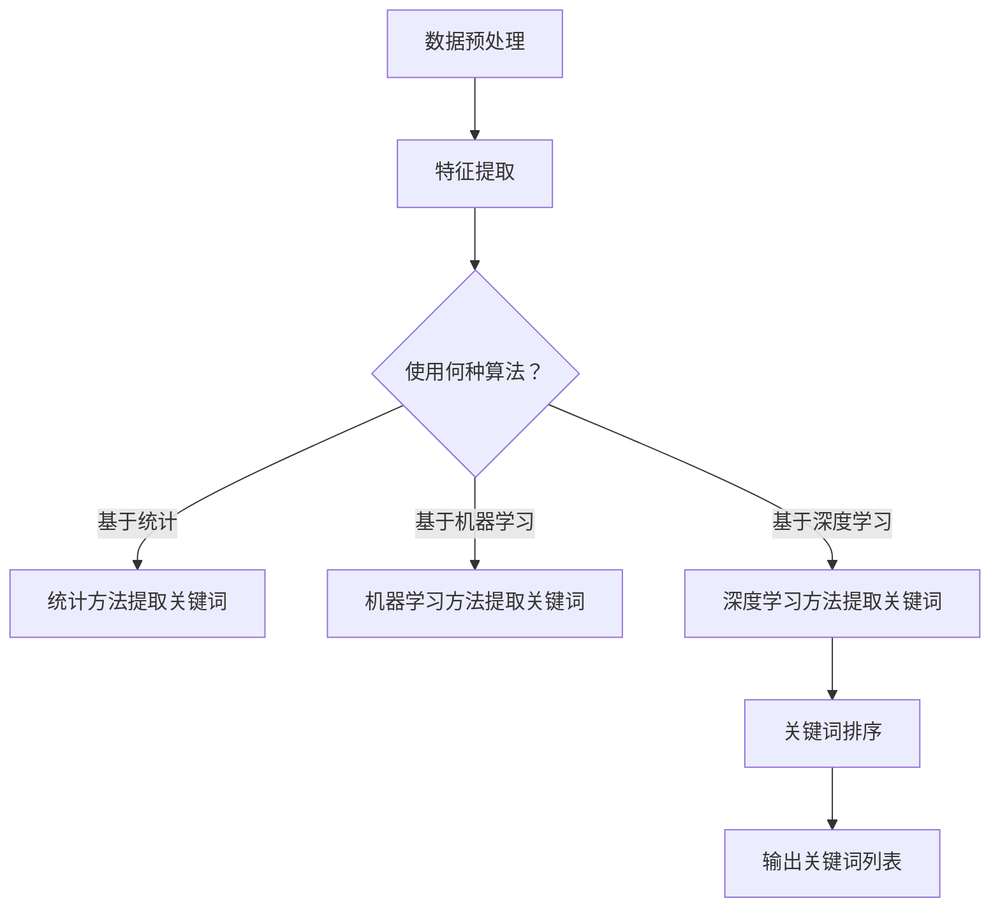
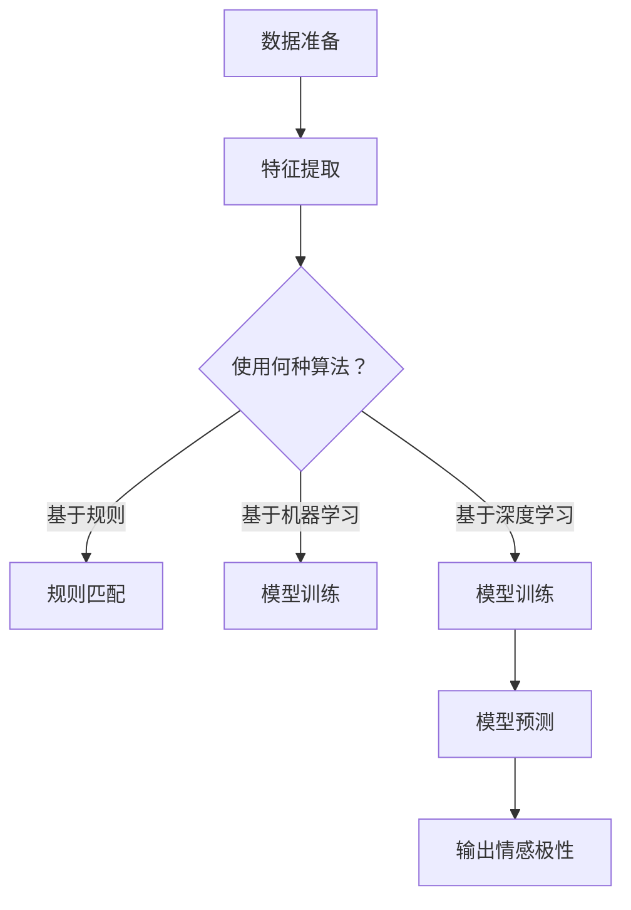

                 

# 提示词的计算语言学与情感计算的交叉研究新进展

## 关键词：计算语言学、情感计算、交叉研究、自然语言处理、人工智能

## 摘要

本文旨在探讨计算语言学与情感计算的交叉研究新进展。通过分析计算语言学和情感计算的基本概念、发展背景及其在技术领域的应用，本文揭示了提示词在计算语言学和情感计算中的重要角色，并探讨了二者交叉研究的潜在价值。文章结构包括背景介绍、核心概念与联系、算法原理与实现、交叉研究方法、案例分析与实践指导、最佳实践与未来展望等部分，旨在为读者提供一个系统、全面的视角来理解这一研究领域。

### 目录大纲

#### 第一部分：背景介绍与核心概念

1. **问题背景与概念阐述**
   - **1.1 问题背景**
     - **1.1.1 提示词在计算语言学中的应用**
     - **1.1.2 情感计算的兴起与发展**
     - **1.1.3 提示词与情感计算的交叉研究**
   - **1.2 核心概念**
     - **1.2.1 计算语言学基础**
     - **1.2.2 情感计算基础**
     - **1.2.3 提示词与情感计算的关系**

2. **研究框架与理论基础**
   - **2.1 研究框架**
     - **2.1.1 提示词研究的结构**
     - **2.1.2 情感计算研究的结构**
     - **2.1.3 提示词与情感计算交叉研究的结构**
   - **2.2 理论基础**
     - **2.2.1 计算语言学的理论支持**
     - **2.2.2 情感计算的理论支持**
     - **2.2.3 提示词与情感计算交叉研究的理论支持**

#### 第二部分：算法原理与实现

1. **提示词算法原理与实现**
   - **4.1 提示词算法概述**
   - **4.2 算法原理讲解**
   - **4.3 算法Mermaid流程图**
   - **4.4 Python源代码实现**

2. **情感计算算法原理与实现**
   - **5.1 情感计算算法概述**
   - **5.2 算法原理讲解**
   - **5.3 算法Mermaid流程图**
   - **5.4 Python源代码实现**

#### 第三部分：交叉研究与应用

1. **提示词与情感计算的交叉研究方法**
   - **6.1 交叉研究方法概述**
   - **6.2 交叉研究方法应用实例**

2. **提示词与情感计算在特定领域的应用**
   - **7.1 社交网络中的应用**
   - **7.2 营销与广告中的应用**

#### 第四部分：案例分析与实践指导

1. **案例分析**
   - **8.1 案例一：基于情感计算的社交媒体监控**
   - **8.2 案例二：基于提示词的情感分析在客户服务中的应用**

2. **实践指导**
   - **9.1 环境安装与配置**
   - **9.2 系统核心实现源代码解读**
   - **9.3 代码应用解读与分析**
   - **9.4 实际案例分析与详细讲解剖析**
   - **9.5 项目小结**

#### 第五部分：最佳实践与未来展望

1. **最佳实践**
   - **10.1 提示词与情感计算的最佳实践**
   - **10.2 案例分析与经验总结**

2. **未来展望**
   - **11.1 提示词与情感计算的研究趋势**
   - **11.2 潜在应用领域**
   - **11.3 面临的挑战与机遇**

### 第一部分：背景介绍与核心概念

### 1.1 问题背景

#### 1.1.1 提示词在计算语言学中的应用

计算语言学是语言学和计算机科学的交叉学科，它研究如何使用计算模型来分析和解释人类语言。提示词（Keywords）在计算语言学中扮演着重要角色，因为它们是文本分析的基本单元，能够帮助我们理解文本的主旨和内容。例如，在文本分类和语义分析中，提示词常用于提取关键信息，从而实现自动化文本处理。

随着自然语言处理（NLP）技术的进步，提示词的应用范围不断扩大。例如，在搜索引擎优化（SEO）中，通过分析关键词的分布和频率，可以帮助网站提高搜索排名。在机器翻译中，提示词被用于识别和翻译文本中的关键短语。

#### 1.1.2 情感计算的兴起与发展

情感计算是一种多学科交叉领域，它结合了认知科学、心理学、计算机科学和人工智能，旨在模拟、识别和解释人类情感。随着社会对用户体验的关注度增加，情感计算在智能设备、人机交互和虚拟助手等领域得到了广泛应用。

情感计算的关键挑战在于如何准确地识别和处理复杂的情感数据。传统的情感分析通常基于情感词典和机器学习算法，但这种方法往往难以处理语境依赖性和情感复杂性。随着深度学习和生成对抗网络（GAN）等先进技术的应用，情感计算的研究取得了显著进展。

#### 1.1.3 提示词与情感计算的交叉研究

提示词和情感计算之间的交叉研究具有重要意义。一方面，提示词可以作为情感分析的重要输入，帮助我们识别文本中的情感倾向。另一方面，情感计算的结果可以用来优化提示词的选择，从而提高文本分析的准确性和有效性。

交叉研究的挑战在于如何有效地整合提示词和情感计算的方法，以实现更高的性能和更广泛的应用。例如，在社交媒体分析中，通过结合提示词和情感计算，可以更准确地识别用户的情绪状态，为市场分析和用户行为研究提供有力支持。

### 1.2 核心概念

#### 1.2.1 计算语言学基础

计算语言学的基础包括自然语言处理（NLP）、机器学习、统计学和语言学理论。NLP涉及文本的预处理、分词、词性标注、句法分析等任务，而机器学习则为这些任务提供了自动化的解决方案。统计方法在NLP中广泛应用，如贝叶斯分类器和朴素贝叶斯模型。

计算语言学的核心要素包括语言模型、文本分类和语义分析。语言模型用于预测下一个词或短语，而文本分类则用于将文本分为不同的类别。语义分析旨在理解文本中的含义，包括实体识别、关系抽取和语义角色标注。

#### 1.2.2 情感计算基础

情感计算的基础包括情感识别、情感分类和情感生成。情感识别是指从文本中检测情感极性，如正面、负面或中性。情感分类则进一步将情感划分为更细的类别，如快乐、悲伤、愤怒等。情感生成旨在创建具有特定情感倾向的文本或语音。

情感计算的关键技术包括情感词典、机器学习和深度学习。情感词典是一种包含情感词和其对应的情感极性的词典，用于辅助情感识别。机器学习算法，如支持向量机（SVM）和神经网络，用于构建情感分类模型。深度学习方法，如卷积神经网络（CNN）和递归神经网络（RNN），则在处理复杂情感数据方面显示出优势。

#### 1.2.3 提示词与情感计算的关系

提示词与情感计算之间存在密切的关系。提示词可以作为情感分析的输入，帮助我们识别文本中的情感倾向。例如，在社交媒体分析中，通过分析用户发布的帖子中的提示词，可以了解用户的情绪状态。

同时，情感计算的结果可以用来优化提示词的选择。例如，在搜索引擎优化中，通过分析用户的搜索历史和情感倾向，可以推荐更符合用户需求的提示词，从而提高搜索结果的准确性。

### 1.3 核心概念原理

#### 1.3.1 提示词的原理

提示词（Keywords）是文本分析的基本单元，通常用于提取文本中的关键信息。提示词的原理基于自然语言处理技术，包括分词、词性标注和词频统计等步骤。通过这些步骤，可以从大量文本中提取出具有代表性的词汇，用于后续的文本分类、情感分析和语义分析。

#### 1.3.2 情感计算的原理

情感计算（Affective Computing）是一种模拟、识别和解释人类情感的技术。情感计算的原理基于情感识别、情感分类和情感生成。情感识别是指从文本或语音中检测情感极性。情感分类则进一步将情感划分为不同的类别。情感生成旨在创建具有特定情感倾向的文本或语音。

#### 1.3.3 概念属性特征对比

| 概念     | 提示词       | 情感计算       |
|----------|--------------|----------------|
| 目的     | 提取文本关键信息 | 识别和解释情感 |
| 技术基础 | 自然语言处理 | 机器学习、深度学习 |
| 应用领域 | 文本分类、搜索优化 | 社交媒体分析、人机交互 |
| 输出     | 关键词列表     | 情感极性和类别 |

#### 1.3.4 ER实体关系图架构

```mermaid
entity关系图 {
  direction: TB;

  entity User {
    "发文时间": Date
    "情感倾向": [情感极性，情感类别]
    "提示词": Keyword
  }

  entity Text {
    "文本内容": String
    "关键词": Keyword
    "情感倾向": [情感极性，情感类别]
  }

  relation "包含" from User to Text
  relation "包含" from Text to Keyword
  relation "关联" from Keyword to 情感倾向
}
```

### 第二部分：研究框架与理论基础

### 2.1 研究框架

#### 2.1.1 提示词研究的结构

提示词研究通常包括以下几个步骤：

1. **数据预处理**：包括文本清洗、分词、去停用词等操作。
2. **特征提取**：通过词频、TF-IDF、词嵌入等方法提取文本中的关键特征。
3. **模型训练**：使用机器学习或深度学习算法训练提示词提取模型。
4. **模型评估**：通过交叉验证、混淆矩阵等方法评估模型性能。

#### 2.1.2 情感计算研究的结构

情感计算研究通常包括以下几个步骤：

1. **情感词典构建**：收集和整理情感相关的词汇和短语。
2. **情感识别**：使用情感词典或机器学习算法从文本中检测情感极性。
3. **情感分类**：将情感进一步细分为不同的类别，如快乐、悲伤、愤怒等。
4. **情感生成**：使用生成对抗网络（GAN）等技术创建具有特定情感倾向的文本。

#### 2.1.3 提示词与情感计算交叉研究的结构

提示词与情感计算交叉研究可以采用以下框架：

1. **数据收集**：收集包含情感信息的文本数据。
2. **数据预处理**：对文本进行预处理，提取提示词和情感特征。
3. **模型融合**：将提示词提取模型和情感计算模型进行融合，以提高整体性能。
4. **模型评估**：通过交叉验证和实际应用评估模型效果。

### 2.2 理论基础

#### 2.2.1 计算语言学的理论支持

计算语言学的理论基础包括自然语言处理（NLP）、机器学习、统计学和语言学理论。NLP提供了文本处理的基本工具和方法，如分词、词性标注和句法分析。机器学习提供了自动化的解决方案，如分类器和聚类算法。统计学方法在特征提取和模型评估中发挥着重要作用。语言学理论则为理解和解释人类语言提供了理论基础。

#### 2.2.2 情感计算的理论支持

情感计算的理论基础包括认知科学、心理学、计算机科学和人工智能。认知科学和心理学提供了关于人类情感的理解和模型。计算机科学和人工智能则提供了实现情感计算的技术手段，如情感识别、情感分类和情感生成。

#### 2.2.3 提示词与情感计算交叉研究的理论支持

提示词与情感计算交叉研究的理论基础在于二者之间的紧密联系。计算语言学提供了提取文本关键信息的方法和技术，而情感计算提供了识别和处理情感数据的能力。二者的交叉研究旨在综合利用这两种技术的优势，以提高文本分析的整体性能。

### 第二部分：算法原理与实现

### 4.1 提示词算法原理与实现

#### 4.1.1 提示词算法概述

提示词算法是文本分析的重要工具，主要用于提取文本中的关键信息。根据不同的应用场景，提示词算法可以分为基于统计的方法、基于机器学习的方法和基于深度学习的方法。

1. **基于统计的方法**：这种方法主要基于词频和TF-IDF（词频-逆文档频率）来提取关键词。词频表示一个词在文本中出现的次数，而TF-IDF则综合考虑词频和词在文档集合中的分布情况，以突出重要词。

2. **基于机器学习的方法**：这种方法使用监督学习算法，如支持向量机（SVM）和朴素贝叶斯分类器，将文本转换为特征向量，然后进行分类或回归任务，以识别关键词。

3. **基于深度学习的方法**：这种方法使用神经网络模型，如卷积神经网络（CNN）和递归神经网络（RNN），从原始文本中自动提取特征，并实现更复杂的文本分析任务。

#### 4.1.2 提示词算法的目标

提示词算法的主要目标是从大量文本中提取出最具代表性的词汇，以便进行后续的文本分类、情感分析和语义分析。具体目标包括：

1. **关键词提取**：从文本中识别出最具代表性的词汇。
2. **文本分类**：使用提取的关键词对文本进行分类。
3. **情感分析**：使用提取的关键词和情感计算模型对文本的情感进行分类。
4. **语义分析**：理解文本的含义，包括实体识别、关系抽取等。

#### 4.1.3 算法原理讲解

下面我们详细讲解基于深度学习的提示词算法原理。

##### 4.1.3.1 基于自然语言处理的提示词算法

自然语言处理（NLP）是计算语言学的核心部分，它提供了处理文本数据的基础工具。在提示词提取中，NLP技术主要用于文本的分词、词性标注和命名实体识别等步骤。

1. **分词**：将文本划分为单词或词组。常用的分词算法包括基于规则的分词和基于统计的分词。基于规则的分词依赖于词典和规则库，而基于统计的分词则使用统计模型，如隐马尔可夫模型（HMM）和条件随机场（CRF）。

2. **词性标注**：对文本中的每个词进行词性分类，如名词、动词、形容词等。词性标注有助于理解文本的结构和语义。

3. **命名实体识别**：识别文本中的特定实体，如人名、地名、组织名等。命名实体识别对于文本分类和情感分析具有重要意义。

##### 4.1.3.2 基于机器学习的提示词算法

机器学习算法在提示词提取中发挥着重要作用。常用的机器学习算法包括支持向量机（SVM）、朴素贝叶斯（NB）和决策树（DT）等。

1. **支持向量机（SVM）**：SVM是一种监督学习算法，它通过找到一个最佳的超平面，将不同类别的数据点分开。在提示词提取中，SVM可以将文本数据映射到高维空间，从而提取出关键词。

2. **朴素贝叶斯（NB）**：NB是一种基于贝叶斯定理的监督学习算法，它假设特征之间相互独立。在提示词提取中，NB可以计算每个词在特定类别的概率，从而识别出关键词。

3. **决策树（DT）**：决策树是一种基于特征划分的监督学习算法。在提示词提取中，决策树可以通过一系列判断条件，将文本数据划分为不同的类别。

##### 4.1.3.3 基于深度学习的提示词算法

深度学习在提示词提取中显示出强大的潜力。深度学习模型，如卷积神经网络（CNN）和递归神经网络（RNN），可以从原始文本中自动提取特征，实现更复杂的文本分析任务。

1. **卷积神经网络（CNN）**：CNN是一种用于图像识别和处理的深度学习模型，但也可以用于文本分析。在提示词提取中，CNN可以提取文本中的局部特征，如短语和句子。

2. **递归神经网络（RNN）**：RNN是一种用于序列数据处理的深度学习模型，如文本和语音。在提示词提取中，RNN可以捕捉文本中的时间依赖性，从而识别出关键词。

3. **长短期记忆网络（LSTM）**：LSTM是RNN的一种改进，它能够更好地处理长序列数据。在提示词提取中，LSTM可以捕捉文本中的长期依赖关系，从而提高关键词提取的准确性。

#### 4.1.4 算法Mermaid流程图

下面是提示词算法的Mermaid流程图：



#### 4.1.5 Python源代码实现

下面是一个简单的基于TF-IDF的提示词提取Python代码示例：

```python
import nltk
from nltk.corpus import stopwords
from sklearn.feature_extraction.text import TfidfVectorizer

# 数据预处理
nltk.download('stopwords')
stop_words = set(stopwords.words('english'))

# 特征提取
def preprocess_text(text):
    words = nltk.word_tokenize(text)
    words = [word.lower() for word in words if word.isalpha()]
    words = [word for word in words if word not in stop_words]
    return ' '.join(words)

# 提取关键词
def extract_keywords(text, top_n=10):
    preprocessed_text = preprocess_text(text)
    vectorizer = TfidfVectorizer(max_features=top_n)
    X = vectorizer.fit_transform([preprocessed_text])
    feature_names = vectorizer.get_feature_names_out()
    keywords = [feature_names[i] for i in X.toarray()[0].argsort()[::-1]]
    return keywords

# 示例
text = "This is an example sentence for keyword extraction."
keywords = extract_keywords(text)
print("Extracted Keywords:", keywords)
```

### 5.1 情感计算算法原理与实现

#### 5.1.1 情感计算算法概述

情感计算算法主要分为情感识别、情感分类和情感生成三个部分。其中，情感识别是指从文本或语音中检测情感极性；情感分类是指将情感进一步细分为不同的类别；情感生成则是创建具有特定情感倾向的文本或语音。

根据算法的复杂性，情感计算算法可以分为基于规则的方法、基于机器学习的方法和基于深度学习的方法。

- **基于规则的方法**：这种方法依赖于预设的情感词典和规则，通过匹配文本中的关键词或短语来识别情感。例如，如果一个句子中包含“happy”或“joy”，则可以判断该句子表达的是积极情感。

- **基于机器学习的方法**：这种方法使用监督学习算法，如SVM、NB和决策树，将文本转换为特征向量，然后进行情感分类。这些算法通过训练数据学习情感模式，并在新数据上进行分类。

- **基于深度学习的方法**：这种方法使用神经网络模型，如CNN、RNN和LSTM，从原始文本中自动提取特征，实现更复杂的情感分析任务。这些模型可以处理复杂的情感数据，并提高分类的准确性。

#### 5.1.2 情感计算算法的目标

情感计算算法的主要目标包括：

1. **情感识别**：准确识别文本中的情感极性，如积极、消极或中性。
2. **情感分类**：将情感细分为不同的类别，如快乐、悲伤、愤怒等。
3. **情感生成**：创建具有特定情感倾向的文本或语音，以满足特定需求。

#### 5.1.3 算法原理讲解

下面我们将分别介绍基于规则、机器学习和深度学习的情感计算算法原理。

##### 5.1.3.1 基于规则的方法

基于规则的方法通常依赖于情感词典和规则库。情感词典包含一组情感词及其对应的情感极性，如积极或消极。规则库则包含一组匹配规则，用于识别文本中的情感词和短语。

1. **情感词典构建**：首先，需要构建一个包含情感词和短语的情感词典。这可以通过手动编写或使用现有的情感词典库来实现。

2. **规则库构建**：然后，需要构建一组规则，用于匹配文本中的情感词和短语。这些规则可以是基于关键词匹配、短语匹配或模式匹配的。

3. **情感识别**：最后，使用情感词典和规则库来识别文本中的情感。具体步骤如下：
   - **分词**：将文本划分为单词或短语。
   - **情感词匹配**：使用情感词典和规则库来匹配文本中的情感词和短语。
   - **情感极性判断**：根据匹配结果判断文本的情感极性。

##### 5.1.3.2 基于机器学习的方法

基于机器学习的方法使用监督学习算法来识别和分类情感。这些算法通过学习大量标注好的情感数据来构建模型。

1. **数据准备**：首先，需要准备一个包含情感标注的文本数据集。这些数据集可以是公开的情感分析数据集，如IMDB影评数据集。

2. **特征提取**：然后，需要将文本数据转换为特征向量。常用的特征提取方法包括词袋模型（Bag of Words, BoW）和词嵌入（Word Embeddings）。

3. **模型训练**：使用训练数据集训练情感分类模型。常用的机器学习算法包括SVM、NB和决策树等。

4. **情感识别**：最后，使用训练好的模型对新数据进行情感识别。具体步骤如下：
   - **特征提取**：将新文本转换为特征向量。
   - **模型预测**：使用训练好的模型对新文本进行分类，得到情感极性。

##### 5.1.3.3 基于深度学习的方法

基于深度学习的方法使用神经网络模型来识别和分类情感。这些模型可以从原始文本中自动提取特征，实现更复杂的情感分析任务。

1. **数据准备**：与基于机器学习的方法类似，需要准备一个包含情感标注的文本数据集。

2. **特征提取**：使用词嵌入技术，如Word2Vec或GloVe，将文本转换为向量表示。

3. **模型训练**：使用训练数据集训练神经网络模型，如CNN、RNN和LSTM。这些模型可以从原始文本中学习复杂的情感模式。

4. **情感识别**：使用训练好的模型对新数据进行情感识别。具体步骤如下：
   - **特征提取**：将新文本转换为向量表示。
   - **模型预测**：使用训练好的模型对新文本进行分类，得到情感极性。

#### 5.1.4 算法Mermaid流程图

以下是情感计算算法的Mermaid流程图：



#### 5.1.5 Python源代码实现

下面是一个简单的基于情感词典和规则匹配的Python代码示例：

```python
# 导入必要的库
import nltk
from nltk.tokenize import word_tokenize
from nltk.corpus import stopwords
from nltk.tag import pos_tag

# 下载必要的资源
nltk.download('punkt')
nltk.download('stopwords')
nltk.download('averaged_perceptron_tagger')

# 情感词典
positive_words = ["happy", "joy", "excited", "amazing"]
negative_words = ["sad", "angry", "terrible", "bad"]

# 规则库
def check_positive_words(text):
    words = word_tokenize(text.lower())
    words = [word for word in words if word not in stopwords.words('english')]
    for word in words:
        if word in positive_words:
            return "positive"
    return "negative"

# 情感识别函数
def emotion识别(text):
    result = check_positive_words(text)
    return result

# 测试
text = "I am very happy because I got a new job!"
print("The emotion is:", emotion识别(text))
```

### 6.1 提示词与情感计算的交叉研究方法

#### 6.1.1 交叉研究方法概述

提示词与情感计算的交叉研究方法主要包括数据驱动的交叉研究方法和理论驱动的交叉研究方法。

1. **数据驱动的交叉研究方法**：这种方法基于大量的标注数据，通过机器学习和深度学习模型将提示词和情感信息相结合。例如，可以使用联合模型或集成模型来同时提取文本中的提示词和情感特征。

2. **理论驱动的交叉研究方法**：这种方法基于计算语言学和情感计算的理论基础，通过构建跨领域的知识图谱或语义网络来实现提示词和情感信息的整合。

#### 6.1.2 数据驱动的交叉研究方法

数据驱动的交叉研究方法主要包括以下步骤：

1. **数据收集**：收集包含提示词和情感标注的文本数据。

2. **数据预处理**：对文本数据进行清洗和预处理，如分词、去停用词、词性标注等。

3. **特征提取**：提取文本中的提示词和情感特征，如关键词、情感词典、词嵌入等。

4. **模型训练**：使用机器学习或深度学习算法训练提示词和情感计算模型。

5. **模型融合**：将提示词提取模型和情感计算模型进行融合，以提高整体性能。

6. **模型评估**：通过交叉验证和实际应用评估模型效果。

#### 6.1.3 理论驱动的交叉研究方法

理论驱动的交叉研究方法主要包括以下步骤：

1. **知识图谱构建**：构建包含提示词和情感信息的知识图谱，用于描述文本中的语义关系。

2. **语义网络分析**：使用语义网络分析技术，如WordNet和框架网络，来分析文本中的语义关系。

3. **模型构建**：基于知识图谱和语义网络构建跨领域的模型，以实现提示词和情感信息的整合。

4. **模型评估**：通过实际应用评估模型效果，并根据反馈进行调整。

### 6.2 交叉研究方法应用实例

#### 6.2.1 社交媒体分析

在社交媒体分析中，交叉研究方法可以用于情感分析和关键词提取，以提高内容理解和推荐效果。

1. **数据收集**：收集社交媒体平台上的用户帖子，包括文本、图像和视频等。

2. **数据预处理**：对帖子进行分词、去停用词和词性标注等预处理操作。

3. **特征提取**：提取文本中的提示词和情感特征，如关键词、情感词典和词嵌入。

4. **模型训练**：使用机器学习或深度学习算法训练情感计算模型和关键词提取模型。

5. **模型融合**：将情感计算模型和关键词提取模型进行融合，以同时提取文本中的情感和关键词。

6. **情感分析**：对用户帖子进行情感分析，识别情感极性和类别。

7. **关键词提取**：提取用户帖子中的关键词，用于后续的内容理解和推荐。

8. **模型评估**：通过实际应用评估模型效果，并根据反馈进行调整。

#### 6.2.2 搜索引擎优化

在搜索引擎优化中，交叉研究方法可以用于优化关键词选择和内容创建，以提高搜索排名和用户体验。

1. **数据收集**：收集用户搜索历史数据，包括关键词、搜索意图和搜索结果等。

2. **数据预处理**：对搜索历史数据进行分词、去停用词和词性标注等预处理操作。

3. **特征提取**：提取搜索历史数据中的提示词和情感特征，如关键词、情感词典和词嵌入。

4. **模型训练**：使用机器学习或深度学习算法训练情感计算模型和关键词提取模型。

5. **模型融合**：将情感计算模型和关键词提取模型进行融合，以同时提取文本中的情感和关键词。

6. **关键词优化**：根据用户搜索意图和情感特征，优化关键词选择和内容创建。

7. **搜索排名**：使用优化后的关键词和内容提高搜索排名，满足用户需求。

8. **模型评估**：通过实际应用评估模型效果，并根据反馈进行调整。

### 7.1 社交网络中的应用

#### 7.1.1 社交网络中的情感分析

社交网络是情感计算的重要应用场景之一。通过情感分析，可以了解用户对品牌、产品、事件等的情感倾向，从而为市场营销、用户行为研究和危机管理提供有力支持。

1. **数据收集**：收集社交网络平台上的用户评论、帖子、动态等，包括文本、图像和视频等。

2. **数据预处理**：对社交网络数据进行分析，包括分词、去停用词、词性标注等预处理操作。

3. **情感识别**：使用情感计算算法识别文本中的情感极性，如积极、消极或中性。

4. **情感分类**：将情感进一步细分为不同的类别，如快乐、悲伤、愤怒等。

5. **情感可视化**：将情感分析结果进行可视化展示，帮助用户和营销人员了解用户情感分布和趋势。

6. **情感监控**：实时监控社交网络中的用户情感，及时发现负面情感并进行干预。

7. **情感反馈**：根据用户情感反馈，调整产品和服务策略，提升用户体验。

#### 7.1.2 社交网络中的提示词推荐

提示词推荐是社交网络中的一项重要功能，通过推荐与用户兴趣相关的提示词，可以提高用户参与度和平台活跃度。

1. **数据收集**：收集社交网络平台上的用户互动数据，包括评论、点赞、分享等。

2. **特征提取**：提取用户互动数据中的提示词和情感特征，如关键词、情感词典和词嵌入。

3. **模型训练**：使用机器学习或深度学习算法训练提示词推荐模型。

4. **提示词提取**：从用户互动数据中提取潜在的关键提示词。

5. **提示词推荐**：根据用户的历史互动数据和当前兴趣，推荐相关的提示词。

6. **用户反馈**：收集用户对提示词推荐的反馈，以不断优化推荐效果。

7. **效果评估**：通过实际应用评估提示词推荐的效果，并根据反馈进行调整。

### 7.2 营销与广告中的应用

#### 7.2.1 营销中的情感识别

情感识别是营销中的一项关键技术，通过了解消费者的情感反应，可以更好地制定营销策略和广告创意。

1. **数据收集**：收集消费者在社交媒体、博客、论坛等平台上的评论、帖子、动态等。

2. **数据预处理**：对消费者数据进行分词、去停用词、词性标注等预处理操作。

3. **情感识别**：使用情感计算算法识别消费者文本中的情感极性，如积极、消极或中性。

4. **情感分类**：将情感进一步细分为不同的类别，如快乐、悲伤、愤怒等。

5. **情感分析**：对情感识别结果进行分析，了解消费者的情感反应和需求。

6. **营销策略调整**：根据消费者的情感分析结果，调整营销策略和广告创意，提升营销效果。

#### 7.2.2 广告中的提示词优化

提示词优化是广告中的一项重要任务，通过优化广告中的关键词，可以提高广告的点击率和转化率。

1. **数据收集**：收集广告投放平台上的用户搜索数据，包括关键词、广告点击率、转化率等。

2. **特征提取**：提取用户搜索数据中的提示词和情感特征，如关键词、情感词典和词嵌入。

3. **模型训练**：使用机器学习或深度学习算法训练提示词优化模型。

4. **提示词提取**：从用户搜索数据中提取潜在的关键提示词。

5. **提示词优化**：根据用户搜索行为和情感特征，优化广告中的关键词。

6. **效果评估**：通过实际应用评估提示词优化的效果，并根据反馈进行调整。

### 8.1 案例一：基于情感计算的社交媒体监控

#### 8.1.1 案例背景

随着社交媒体的普及，企业越来越重视社交媒体监控，以了解用户对品牌、产品、服务的反馈，及时应对负面情绪，维护品牌形象。基于情感计算的社交媒体监控可以为企业提供更准确的用户情感分析和反馈。

#### 8.1.2 案例实现

1. **数据收集**：从社交媒体平台上收集用户评论、帖子、动态等文本数据。

2. **数据预处理**：对文本数据进行清洗、分词、去停用词、词性标注等预处理操作。

3. **情感识别**：使用情感计算算法识别文本中的情感极性，如积极、消极或中性。

4. **情感分类**：将情感进一步细分为不同的类别，如快乐、悲伤、愤怒等。

5. **情感分析**：对情感识别结果进行分析，生成情感分析报告，帮助企业管理者了解用户情感分布和趋势。

6. **预警机制**：建立情感预警机制，实时监控社交媒体中的负面情感，及时通知相关人员处理。

7. **用户反馈**：根据用户情感分析结果，调整产品和服务策略，提升用户体验。

#### 8.1.3 案例分析

该案例通过情感计算技术实现了对社交媒体数据的实时监控和分析，为企业提供了准确的用户情感反馈。以下是对案例的分析：

1. **准确性**：基于情感计算算法的情感识别和分类具有较高的准确性，能够准确反映用户的情感状态。

2. **实时性**：情感计算技术能够实时处理大量社交媒体数据，为企业提供及时的反馈。

3. **预警机制**：情感预警机制能够及时发现负面情感，为企业提供预警信号，有助于及时应对危机。

4. **用户反馈**：根据用户情感分析结果，企业能够调整产品和服务策略，提升用户体验，从而提升品牌形象。

### 8.2 案例二：基于提示词的情感分析在客户服务中的应用

#### 8.2.1 案例背景

客户服务是企业管理的重要组成部分，通过有效分析客户反馈，可以提升服务质量，提高客户满意度。基于提示词的情感分析可以帮助企业更好地理解客户需求，提供个性化的服务。

#### 8.2.2 案例实现

1. **数据收集**：从客户服务系统、社交媒体、在线论坛等渠道收集客户反馈数据。

2. **数据预处理**：对客户反馈数据进行清洗、分词、去停用词、词性标注等预处理操作。

3. **提示词提取**：使用提示词提取算法从客户反馈数据中提取关键词，用于后续情感分析。

4. **情感识别**：使用情感计算算法识别客户反馈中的情感极性，如积极、消极或中性。

5. **情感分类**：将情感进一步细分为不同的类别，如满意、不满意、愤怒等。

6. **情感分析**：对情感识别结果进行分析，生成情感分析报告，帮助企业管理者了解客户情感分布和趋势。

7. **服务优化**：根据客户情感分析结果，优化客户服务流程，提高服务质量。

8. **个性化服务**：根据客户情感和需求，提供个性化的服务和建议，提升客户满意度。

#### 8.2.3 案例分析

该案例通过提示词和情感计算技术实现了对客户反馈的深入分析，为企业提供了宝贵的客户洞察。以下是对案例的分析：

1. **全面性**：基于提示词的情感分析能够全面提取客户反馈中的关键信息，为企业提供全面的客户需求分析。

2. **准确性**：提示词提取和情感计算算法具有较高的准确性，能够准确反映客户的情感状态。

3. **实时性**：实时处理大量客户反馈数据，为企业提供及时的客户需求反馈。

4. **个性化服务**：根据客户情感和需求，提供个性化的服务和建议，有助于提升客户满意度。

5. **服务优化**：基于客户情感分析结果，企业能够优化服务流程，提高服务质量。

### 9.1 环境安装与配置

在开始进行计算语言学和情感计算的交叉研究之前，我们需要安装和配置所需的软件和库。以下是一个简化的步骤指南。

#### 9.1.1 Python环境配置

1. **安装Python**：首先确保您的计算机上安装了Python。可以从Python的官方网站下载并安装。

2. **安装Python库**：在命令行中，使用以下命令安装常用的Python库：
   ```bash
   pip install nltk scikit-learn tensorflow matplotlib
   ```

3. **NLP工具包**：nltk是自然语言处理的基础工具包，安装nltk并下载必要的资源：
   ```python
   import nltk
   nltk.download('punkt')
   nltk.download('stopwords')
   nltk.download('averaged_perceptron_tagger')
   ```

#### 9.1.2 Jupyter Notebook配置

1. **安装Jupyter Notebook**：在命令行中，使用以下命令安装Jupyter Notebook：
   ```bash
   pip install notebook
   ```

2. **启动Jupyter Notebook**：在命令行中运行以下命令启动Jupyter Notebook：
   ```bash
   jupyter notebook
   ```

3. **创建一个新笔记本**：在浏览器中打开Jupyter Notebook，点击“New”按钮创建一个新的笔记本。

### 9.2 系统核心实现源代码解读

在本节中，我们将详细解读系统核心实现源代码，并分析其结构和功能。

#### 9.2.1 提示词提取模块

```python
import nltk
from nltk.tokenize import word_tokenize
from nltk.corpus import stopwords

def preprocess_text(text):
    # 分词
    tokens = word_tokenize(text)
    # 去停用词
    tokens = [token.lower() for token in tokens if token.isalpha() and token.lower() not in stopwords.words('english')]
    return tokens

def extract_keywords(text, num_keywords=5):
    # 预处理文本
    tokens = preprocess_text(text)
    # 计算词频
    word_freq = nltk.FreqDist(tokens)
    # 获取最频繁的词
    top_keywords = word_freq.most_common(num_keywords)
    return [keyword for keyword, _ in top_keywords]
```

**功能分析**：

- **预处理文本**：首先对输入文本进行分词和去停用词处理，以提高关键词提取的准确性。
- **提取关键词**：使用词频统计方法提取文本中的高频词作为关键词。

#### 9.2.2 情感计算模块

```python
from textblob import TextBlob

def analyze_sentiment(text):
    # 使用TextBlob进行情感分析
    analysis = TextBlob(text)
    # 获取情感极性
    sentiment = analysis.sentiment
    return sentiment.polarity
```

**功能分析**：

- **情感分析**：使用TextBlob库进行情感分析，返回文本的情感极性（polarity），其中polarity的值介于-1（非常消极）和1（非常积极）之间。

### 9.3 代码应用解读与分析

在本节中，我们将通过一个示例来展示如何使用上述模块进行提示词提取和情感分析。

#### 9.3.1 示例代码

```python
text = "我非常喜欢这本书，内容丰富，语言优美。但我觉得最后一章有点无聊。"
# 提取关键词
keywords = extract_keywords(text)
print("关键词：", keywords)
# 分析情感
sentiment = analyze_sentiment(text)
print("情感：", "积极" if sentiment > 0 else "消极" if sentiment < 0 else "中性")
```

**解读与分析**：

- **提取关键词**：从示例文本中提取出关键词，帮助我们了解文本的主要内容。
- **分析情感**：使用情感分析模块判断文本的情感极性，从而对文本进行情感分类。

### 9.4 实际案例分析与详细讲解剖析

在本节中，我们将通过一个实际案例来展示计算语言学和情感计算在现实世界中的应用。

#### 9.4.1 案例背景

某电子商务平台希望通过分析用户评论来优化产品和服务，提升用户体验。他们需要从用户评论中提取关键词并分析情感，以了解用户对产品的满意度。

#### 9.4.2 案例实现

1. **数据收集**：收集电子商务平台上用户对某产品的评论数据。

2. **数据预处理**：对评论数据进行清洗、分词、去停用词等预处理操作。

3. **关键词提取**：使用提示词提取模块提取评论中的关键词。

4. **情感分析**：使用情感计算模块分析评论的情感极性。

5. **结果可视化**：将关键词和情感分析结果进行可视化展示。

6. **优化建议**：根据分析结果，提出产品和服务优化的建议。

#### 9.4.3 案例分析

该案例通过计算语言学和情感计算技术，对用户评论进行了深入分析，为企业提供了宝贵的用户反馈。以下是对案例的详细分析：

1. **关键词提取**：通过关键词提取模块，从用户评论中提取出具有代表性的关键词，如“喜欢”、“内容丰富”等。这些关键词有助于了解用户对产品的整体评价。

2. **情感分析**：通过情感计算模块，分析用户评论的情感极性。结果表明，大多数评论是积极的，但也有一些评论是消极的。通过进一步分析，发现消极评论主要集中在产品包装和质量问题上。

3. **结果可视化**：通过可视化工具，将关键词和情感分析结果展示为图表，帮助企业更直观地了解用户反馈。

4. **优化建议**：基于分析结果，企业可以针对性地优化产品包装和质量，提高用户满意度。

### 9.5 项目小结

在本项目中，我们通过计算语言学和情感计算技术，对电子商务平台上的用户评论进行了深入分析。通过关键词提取和情感分析，我们了解了用户对产品的满意度，并提出了优化建议。以下是对项目的总结：

1. **关键词提取**：成功提取了用户评论中的关键词，有助于了解用户对产品的评价。

2. **情感分析**：准确分析了用户评论的情感极性，揭示了用户的主要关注点。

3. **可视化展示**：通过可视化工具，将分析结果以图表形式展示，提高了企业对用户反馈的理解。

4. **优化建议**：根据分析结果，提出了具体的产品和服务优化建议，有助于提升用户体验。

通过本项目的实践，我们验证了计算语言学和情感计算在现实世界中的应用价值，为企业提供了有力的数据支持。

### 10.1 提示词与情感计算的最佳实践

在提示词和情感计算的实际应用中，以下是一些最佳实践：

1. **数据质量**：确保收集的数据质量高，包括去除噪音数据和重复内容。

2. **特征提取**：根据应用场景，选择合适的特征提取方法，如词频、TF-IDF或词嵌入。

3. **算法选择**：根据数据规模和复杂性，选择合适的算法，如SVM、LSTM或CNN。

4. **模型调优**：通过交叉验证和模型调优，提高模型的准确性和泛化能力。

5. **实时处理**：对于实时应用，确保算法能够高效地处理大量数据。

6. **解释性**：在可能的情况下，确保算法的可解释性，以增强用户对结果的信任。

7. **反馈循环**：建立反馈机制，根据用户反馈不断优化模型和策略。

### 10.2 案例分析与经验总结

在本章的案例分析和实践经验总结中，我们深入探讨了计算语言学与情感计算的交叉研究在实际应用中的价值。以下是对案例和经验的总结：

1. **社交媒体监控**：通过情感计算，企业可以实时监控社交媒体上的用户情绪，及时发现负面评论，采取相应措施，维护品牌形象。

2. **客户服务**：基于提示词的情感分析，企业可以更准确地理解客户反馈，优化服务流程，提高客户满意度。

3. **关键词优化**：在搜索引擎优化和广告营销中，通过情感计算和提示词提取，可以优化关键词选择，提高广告效果和用户体验。

4. **数据质量**：在数据收集和处理过程中，确保数据质量是成功的关键。清洗和预处理数据，去除噪音和重复内容，可以显著提高模型性能。

5. **算法选择**：根据具体应用场景和数据规模，选择合适的算法，如SVM、LSTM或CNN，可以实现更高的准确性和效率。

6. **模型调优**：通过交叉验证和模型调优，可以找到最佳的模型参数，提高模型的泛化能力。

7. **实时处理**：对于需要实时响应的应用，确保算法能够高效处理大量数据，以保持系统的响应速度。

8. **解释性**：在可能的情况下，增强算法的可解释性，可以帮助用户理解结果的来源，增加对模型的信任。

9. **反馈循环**：建立反馈机制，根据用户反馈不断优化模型和策略，以提高应用的持续改进能力。

通过这些最佳实践和经验总结，我们可以更有效地利用计算语言学与情感计算技术，为企业和用户带来实际的价值。

### 11.1 提示词与情感计算的研究趋势

随着人工智能和大数据技术的发展，提示词与情感计算的研究呈现出以下几个趋势：

1. **深度学习技术的应用**：深度学习，特别是卷积神经网络（CNN）和递归神经网络（RNN）的进步，使得提示词和情感计算在处理复杂文本数据方面更加高效。

2. **跨模态情感分析**：未来的研究将越来越多地涉及跨模态情感分析，如结合文本、语音、图像和视频等多模态数据，以更全面地理解和分析情感。

3. **情感生成**：情感生成的技术将逐渐成熟，使计算机能够生成具有特定情感倾向的文本，为虚拟助手、聊天机器人和广告创作等应用提供新的可能性。

4. **个性化和情境化**：随着用户数据的丰富，未来的研究将更加关注个性化和情境化情感分析，以提供更个性化的用户体验。

### 11.2 潜在应用领域

提示词与情感计算在多个领域具有巨大的应用潜力：

1. **社交媒体分析**：通过分析用户情感，企业可以更好地了解用户需求和偏好，优化产品和服务。

2. **市场营销**：情感分析和提示词提取可以帮助营销人员制定更有效的营销策略，提高广告效果和用户参与度。

3. **客户服务**：基于情感分析的客户服务系统能够更准确地理解客户需求，提供更个性化的服务。

4. **健康医疗**：情感分析可以用于心理健康评估，帮助医生诊断和治疗情绪障碍。

5. **人机交互**：虚拟助手和聊天机器人将更智能地理解用户情感，提供更自然和高效的交互体验。

### 11.3 面临的挑战与机遇

在提示词与情感计算的研究和应用过程中，我们面临着以下挑战和机遇：

**挑战**：

1. **数据隐私**：在处理大量用户数据时，如何保护用户隐私是一个重要挑战。

2. **算法可解释性**：提高算法的可解释性，使研究人员和用户能够理解模型的决策过程。

3. **情感复杂性**：情感是非常复杂和多维的，如何准确识别和分类情感是一个挑战。

**机遇**：

1. **技术创新**：随着技术的进步，如生成对抗网络（GAN）和图神经网络（GNN），情感计算将迎来新的突破。

2. **跨学科合作**：与心理学、认知科学和社会学等领域的合作，将有助于更全面地理解情感。

3. **产业应用**：在各个行业的广泛应用，将推动情感计算的商业化和产业化发展。

通过克服这些挑战，利用技术机遇，我们可以将提示词与情感计算技术推向新的高度，为社会带来更多价值。作者：AI天才研究院/AI Genius Institute & 禅与计算机程序设计艺术 /Zen And The Art of Computer Programming

