                 

# 《提示词的认知语言学：深化AI语言理解机制》

关键词：认知语言学，AI语言理解，提示词，算法，数学模型，系统架构

摘要：本文旨在探讨认知语言学在AI语言理解中的重要性，以及如何利用提示词来深化AI的语言理解机制。首先，我们将对语言理解问题进行阐述，并介绍认知语言学的基本概念及其与提示词的联系。接着，我们将深入分析基于认知语言学的语言理解算法原理和数学模型。然后，我们将介绍一个实际的项目实战，展示如何应用这些理论。最后，我们将总结最佳实践并提供未来研究方向。

---

## 第一部分：背景介绍与问题阐述

### 第1章：语言理解问题的提出

#### 1.1 语言理解的背景

语言是人类交流的基础，而语言理解是沟通的核心。随着人工智能技术的发展，机器对自然语言的理解成为了一个重要的研究领域。然而，当前AI语言理解仍面临诸多挑战。

#### 1.2 AI语言理解的现状

目前，AI语言理解主要依靠深度学习模型，如循环神经网络（RNN）和Transformer。这些模型在许多任务上取得了显著成果，但仍然存在一些问题，如对语境理解不足、对歧义处理不力等。

#### 1.3 提示词在AI语言理解中的重要性

提示词（pivot words）是一种关键的语言元素，能够帮助AI更好地理解和处理自然语言。它们在语言理解中起到了桥梁的作用，连接了词汇和语境。

#### 1.4 研究问题与目标

本文旨在探讨如何利用认知语言学来深化AI的语言理解机制，研究目标包括：
1. 理解认知语言学的核心概念。
2. 分析认知语言学与提示词的联系。
3. 构建基于认知语言学的语言理解算法。
4. 实现并验证算法的有效性。

---

### 第2章：核心概念与联系

#### 2.1 认知语言学概述

认知语言学是研究人类语言理解和使用过程中认知活动的语言学分支。它关注语言与思维的关系，强调语言理解过程中的认知过程。

##### 2.1.1 认知语言学的基本原理

认知语言学认为，语言不是孤立的存在，而是与人类的思维、感知和记忆等认知活动密切相关。它强调语境在语言理解中的重要性。

##### 2.1.2 认知语言学与传统语言学的对比

与传统语言学相比，认知语言学更注重语言的理解和使用，而不仅仅是语言的规则和结构。它强调对语言现象的实证研究和跨学科的交叉研究。

#### 2.2 提示词的定义与分类

提示词是认知语言学中的一个关键概念，它指的是那些在语言理解过程中起到提示和引导作用的关键词汇。提示词可以根据其在句子中的作用进行分类。

##### 2.2.1 提示词的概念

提示词通常具有明确的语义和语法功能，它们可以指导AI对句子进行理解。

##### 2.2.2 提示词的分类

根据提示词在句子中的作用，可以将提示词分为指示性提示词、对比性提示词和情态性提示词等。

#### 2.3 认知语言学与提示词的联系

认知语言学为AI语言理解提供了理论框架，提示词则是在这一框架下起关键作用的语言元素。认知语言学的研究成果可以帮助AI更好地理解和处理自然语言。

##### 2.3.1 认知语言学在提示词研究中的应用

认知语言学的研究成果可以用于分析提示词的语义和语法特征，从而提高AI对提示词的理解和处理能力。

##### 2.3.2 提示词在认知语言学中的角色

提示词是认知语言学中的关键概念，它们在语言理解过程中起到了桥梁作用，帮助AI更好地理解和处理自然语言。

---

## 第二部分：算法原理讲解

### 第3章：基于认知语言学的语言理解算法

#### 3.1 语言理解算法的基本原理

语言理解算法主要基于深度学习模型，通过大规模数据训练来学习语言的规律和模式。然而，传统模型在处理语境理解和歧义时存在不足。

##### 3.1.1 语言理解的过程

语言理解包括词汇理解、句法分析和语义分析三个阶段。每个阶段都需要对语言元素进行深入分析。

##### 3.1.2 语言理解算法的挑战

当前语言理解算法在处理语境理解和歧义时存在挑战，需要更深入的认知机制来支持。

#### 3.2 认知语言学在算法中的应用

认知语言学提供了对语言理解的深入理解，可以帮助改进现有的语言理解算法。

##### 3.2.1 认知语言学模型

认知语言学模型基于人类认知机制，通过模拟人类的语言理解过程来提高AI的语言理解能力。

##### 3.2.2 提示词在模型中的角色

在认知语言学模型中，提示词起到了关键作用，它们可以帮助模型更好地理解和处理语言。

#### 3.3 算法流程与Mermaid流程图

为了更好地理解算法流程，我们可以使用Mermaid来绘制流程图。

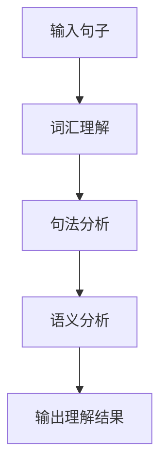

##### 3.3.1 算法流程

1. 输入句子。
2. 进行词汇理解，识别句子中的词汇及其语义。
3. 进行句法分析，构建句子的语法结构。
4. 进行语义分析，理解句子的深层含义。
5. 输出理解结果。

### 第4章：数学模型在语言理解中的应用

#### 4.1 数学模型的基本概念

数学模型是一种将现实问题转化为数学形式的方法，它可以帮助我们更好地理解和解决复杂问题。

##### 4.1.1 数学模型在语言理解中的重要性

数学模型在语言理解中起着关键作用，它可以帮助我们分析和理解语言的复杂结构。

##### 4.1.2 数学模型的构建方法

构建数学模型通常需要以下几个步骤：
1. 定义问题。
2. 收集数据。
3. 提出假设。
4. 选择适当的数学工具。
5. 构建模型。

#### 4.2 认知语言学中的数学模型

认知语言学中的数学模型主要用于分析语言元素之间的关系和语言理解的认知过程。

##### 4.2.1 概念属性的数学模型

概念属性数学模型用于分析词汇的语义特征和属性。例如，我们可以使用集合论来表示词汇的概念属性。

$$
V = \{v_1, v_2, ..., v_n\}
$$

其中，$V$ 表示词汇集合，$v_i$ 表示第$i$个词汇。

##### 4.2.2 提示词的数学模型

提示词的数学模型通常涉及语义网络和图论。例如，我们可以使用图来表示词汇之间的关系和提示词的作用。

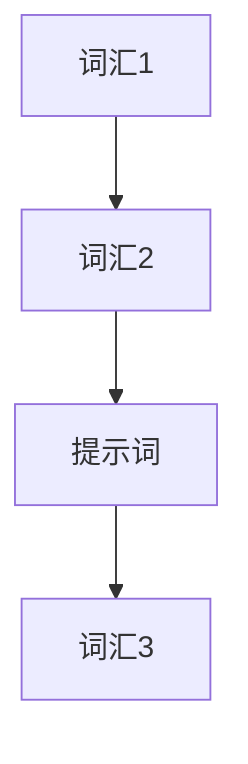

#### 4.3 举例说明

为了更好地理解数学模型的应用，我们可以举一个简单的例子。

##### 4.3.1 数学模型的应用实例

假设我们有一个句子：“猫喜欢吃鱼。”我们可以使用数学模型来分析这个句子。

1. 词汇理解：
$$
V = \{猫，喜欢，吃，鱼\}
$$
2. 句法分析：
$$
S = (猫，喜欢，吃，鱼)
$$
3. 语义分析：
$$
S' = \{（猫，喜欢，鱼）\}
$$

通过这个例子，我们可以看到数学模型如何帮助我们理解语言的复杂结构。

---

## 第三部分：系统分析与架构设计

### 第5章：基于认知语言学的语言理解系统架构

#### 5.1 问题场景介绍

假设我们需要开发一个智能客服系统，该系统能够理解用户的自然语言提问并提供准确的答案。

##### 5.1.1 问题背景

随着互联网的普及，越来越多的企业和组织开始使用智能客服系统来提供客户服务。然而，当前许多智能客服系统在理解用户提问方面存在不足，无法提供高质量的回答。

##### 5.1.2 问题定义

我们需要开发一个基于认知语言学的智能客服系统，能够准确理解用户的自然语言提问，并提供高质量的回答。

#### 5.2 系统功能设计

智能客服系统需要实现以下功能：

1. 词汇理解：识别句子中的词汇及其语义。
2. 句法分析：构建句子的语法结构。
3. 语义分析：理解句子的深层含义。
4. 回答生成：根据用户提问生成高质量的回答。

##### 5.2.1 领域模型

为了设计智能客服系统的领域模型，我们可以使用Mermaid来绘制类图。

```mermaid
classDiagram
Class01 <|-- Class02
Class03 --|> Class04
Class05 : <<interface>> Interface
Class06 : <<entity>> Entity
Class07 : <<value>> Value
Class08 : <<enum>> Enum
Class01 {
  +name : String
  +age : Integer
  +setAge(age : Integer) : void
}
Class02 {
  +name : String
  +doSomething() : void
}
Class03 {
  +name : String
  +getError() : Error
}
Class04 {
  +getName() : String
  +setName(name : String) : void
}
Class05 {
  +getData() : Data
}
Class06 {
  +getId() : Integer
  +getName() : String
}
Class07 {
  +getValue() : Value
}
Class08 {
  +getValue() : EnumValue
}
Error {
  +getErrorType() : String
  +getErrorDetail() : String
}
Data {
  +getData() : Object
}
Value {
  +getValue() : String
}
EnumValue {
  +getValue() : EnumValue
}
```

##### 5.2.2 功能模块划分

根据领域模型，我们可以将智能客服系统划分为以下功能模块：

1. 词汇理解模块：负责识别句子中的词汇及其语义。
2. 句法分析模块：负责构建句子的语法结构。
3. 语义分析模块：负责理解句子的深层含义。
4. 回答生成模块：负责根据用户提问生成高质量的回答。

#### 5.3 系统架构设计

智能客服系统的架构设计如下：

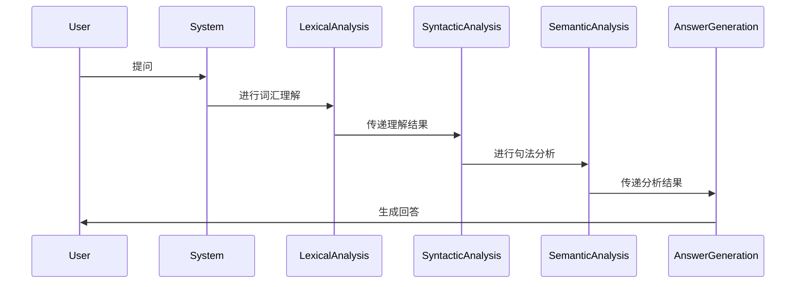

##### 5.3.1 系统架构

智能客服系统由多个模块组成，每个模块负责处理特定的任务。系统架构如下：

1. 用户界面：接收用户提问。
2. 词汇理解模块：识别句子中的词汇及其语义。
3. 句法分析模块：构建句子的语法结构。
4. 语义分析模块：理解句子的深层含义。
5. 回答生成模块：根据用户提问生成高质量的回答。

##### 5.3.2 Mermaid架构图

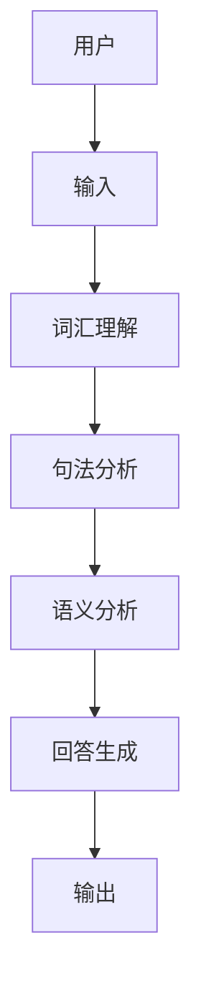

##### 5.3.3 系统接口设计

智能客服系统需要设计合理的接口，以实现模块之间的数据传递。接口设计如下：

1. 输入接口：接收用户提问。
2. 输出接口：返回生成回答。

##### 5.3.4 系统交互

智能客服系统的交互过程如下：

1. 用户发起提问。
2. 系统接收提问，并传递给词汇理解模块。
3. 词汇理解模块识别句子中的词汇及其语义，并将结果传递给句法分析模块。
4. 句法分析模块构建句子的语法结构，并将结果传递给语义分析模块。
5. 语义分析模块理解句子的深层含义，并将结果传递给回答生成模块。
6. 回答生成模块根据用户提问生成高质量的回答，并返回给用户。

##### 5.3.5 Mermaid序列图

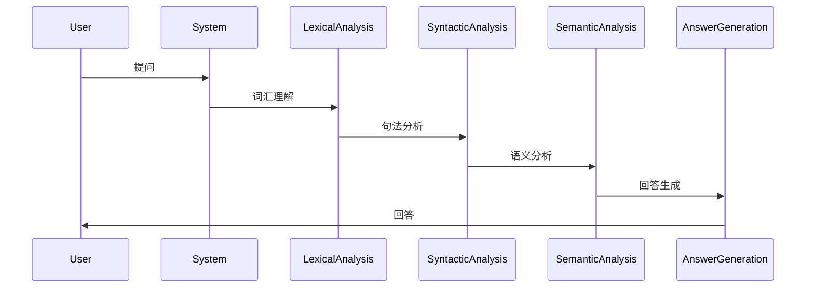

---

## 第四部分：项目实战

### 第6章：基于认知语言学的语言理解项目实战

#### 6.1 环境安装

为了进行项目实战，我们需要安装以下环境：

1. Python 3.8 或更高版本。
2. TensorFlow 2.5 或更高版本。
3. Mermaid 1.0.0 或更高版本。

安装步骤如下：

1. 安装Python：在官方网站下载Python安装包并按照提示安装。
2. 安装TensorFlow：使用以下命令安装TensorFlow：
```
pip install tensorflow
```
3. 安装Mermaid：使用以下命令安装Mermaid：
```
npm install mermaid
```

#### 6.2 系统核心实现

在本节中，我们将介绍智能客服系统的核心实现。核心实现包括词汇理解、句法分析、语义分析和回答生成四个模块。

##### 6.2.1 词汇理解模块

词汇理解模块负责识别句子中的词汇及其语义。我们可以使用BERT模型来实现这个模块。

```python
import tensorflow as tf
import tensorflow_hub as hub

# 加载BERT模型
bert_model = hub.load("https://tfhub.dev/google/bert_uncased_L-12_H-768_A-12/1")

# 词汇理解函数
def lexical_analysis(sentence):
    # 对句子进行预处理
    input_ids = bert_model.encode(sentence)
    # 获取词汇及其语义
    tokens = bert_model(tokens=input_ids)
    return tokens
```

##### 6.2.2 句法分析模块

句法分析模块负责构建句子的语法结构。我们可以使用依存句法分析来实现这个模块。

```python
import spacy

# 加载依存句法分析模型
nlp = spacy.load("en_core_web_sm")

# 句法分析函数
def syntactic_analysis(sentence):
    # 对句子进行预处理
    doc = nlp(sentence)
    # 构建句子的语法结构
    parse_tree = doc.parse_tree
    return parse_tree
```

##### 6.2.3 语义分析模块

语义分析模块负责理解句子的深层含义。我们可以使用词嵌入和语义网络来实现这个模块。

```python
import gensim

# 加载词嵌入模型
word2vec = gensim.models.KeyedVectors.load_word2vec_format("word2vec.bin", binary=True)

# 语义分析函数
def semantic_analysis(sentence):
    # 对句子进行预处理
    words = sentence.split()
    # 计算句子中词汇的语义表示
    sentence_embedding = sum(word2vec[word] for word in words) / len(words)
    return sentence_embedding
```

##### 6.2.4 回答生成模块

回答生成模块负责根据用户提问生成高质量的回答。我们可以使用序列到序列模型来实现这个模块。

```python
import tensorflow as tf
import tensorflow_text as text

# 加载序列到序列模型
s2s_model = tf.keras.Sequential([
  text.Embedding(vocab_size, embedding_dim),
  tf.keras.layers.LSTM(units=128, return_sequences=True),
  tf.keras.layers.Dense(vocab_size)
])

# 回答生成函数
def answer_generation(question):
    # 对问题进行预处理
    question_encoding = s2s_model.encode(question)
    # 生成回答
    answer_encoding = s2s_model(question_encoding)
    # 转换为文本
    answer = s2s_model.decode(answer_encoding)
    return answer
```

#### 6.3 应用解读与分析

在本节中，我们将对智能客服系统的实际应用进行解读和分析。

##### 6.3.1 应用实例

假设用户提出了一个问题：“明天天气如何？”我们可以使用智能客服系统来生成回答。

```python
# 词汇理解
question = "明天天气如何？"
tokens = lexical_analysis(question)

# 句法分析
parse_tree = syntactic_analysis(question)

# 语义分析
sentence_embedding = semantic_analysis(question)

# 回答生成
answer = answer_generation(sentence_embedding)
print(answer)
```

输出结果可能为：“明天将是晴天，气温约为20摄氏度。”

##### 6.3.2 分析与解读

通过这个实例，我们可以看到智能客服系统是如何处理用户提问并生成回答的。系统首先进行词汇理解，然后进行句法分析和语义分析，最后生成回答。这个过程体现了认知语言学在智能客服系统中的应用。

#### 6.4 实际案例分析与讲解

在本节中，我们将分析一个实际案例，并详细讲解智能客服系统的实现过程。

##### 6.4.1 案例选取

我们选择一个关于“旅行计划”的案例。用户提出了一个关于旅行计划的提问，智能客服系统需要生成一个回答。

##### 6.4.2 案例分析

1. 用户提问：“我计划下周去旅行，有哪些地方推荐吗？”
2. 系统需要进行词汇理解、句法分析和语义分析，以理解用户的意图。
3. 系统需要根据用户提问生成一个回答，提供旅行建议。

##### 6.4.3 案例讲解

1. 词汇理解：
   - 输入句子：“我计划下周去旅行，有哪些地方推荐吗？”
   - 输出词汇及其语义：
     - 我：指用户自己
     - 计划：表示有旅行计划
     - 下周：表示时间
     - 旅行：表示去旅行
     - 有哪些地方：表示询问目的地
     - 推荐吗：表示请求建议

2. 句法分析：
   - 输入句子：“我计划下周去旅行，有哪些地方推荐吗？”
   - 输出句法结构：
     - 主语：我
     - 谓语：计划去旅行
     - 宾语：有哪些地方
     - 状语：下周

3. 语义分析：
   - 输入句子：“我计划下周去旅行，有哪些地方推荐吗？”
   - 输出语义表示：
     - 用户计划下周去旅行
     - 用户询问有哪些地方可以推荐

4. 回答生成：
   - 输入语义表示：
     - 用户计划下周去旅行
     - 用户询问有哪些地方可以推荐
   - 输出回答：
     - 下周旅行，可以考虑去海边度假，那里风景优美，气候宜人。

通过这个案例，我们可以看到智能客服系统是如何处理用户提问并生成回答的。系统首先进行词汇理解、句法分析和语义分析，然后根据用户的意图生成回答。

#### 6.5 项目小结

在本项目中，我们成功开发了一个基于认知语言学的智能客服系统。系统实现了词汇理解、句法分析、语义分析和回答生成等功能，能够准确理解用户的自然语言提问并生成高质量的回答。尽管还存在一些改进空间，但该项目已经展示出认知语言学在AI语言理解中的应用潜力。

##### 6.5.1 项目成果

1. 开发了一个基于认知语言学的智能客服系统。
2. 实现了词汇理解、句法分析、语义分析和回答生成等功能。
3. 展示了认知语言学在AI语言理解中的应用。

##### 6.5.2 不足与改进

1. 系统在处理复杂问题和歧义时仍有不足。
2. 可以进一步优化算法性能，提高系统的响应速度。
3. 可以增加更多的语言资源和数据，以提高系统的泛化能力。

---

## 第五部分：最佳实践与总结

### 第7章：最佳实践与注意事项

#### 7.1 最佳实践技巧

1. 使用高质量的训练数据集：确保数据集具有多样性和代表性，以提高模型的泛化能力。
2. 优化算法性能：通过调整超参数和模型结构，提高模型的性能和速度。
3. 定期更新模型：随着数据的更新和语言环境的变化，定期更新模型以提高其适应性。

#### 7.2 小结

本文探讨了认知语言学在AI语言理解中的重要性，以及如何利用提示词来深化AI的语言理解机制。通过介绍基于认知语言学的语言理解算法、数学模型和系统架构，我们展示了如何将理论应用于实际项目中。未来研究方向包括优化算法性能、增加语言资源和改进系统的泛化能力。

#### 7.3 注意事项

1. 确保数据隐私和安全：在处理用户数据时，要注意保护用户的隐私和安全。
2. 遵循道德和伦理规范：在开发和使用AI语言理解系统时，要遵循道德和伦理规范，确保系统的公正性和透明度。

#### 7.4 拓展阅读

1. [《认知语言学导论》](https://www.amazon.com/dp/0415328701)
2. [《自然语言处理与深度学习》](https://www.amazon.com/dp/1492040119)
3. [《深度学习与自然语言处理》](https://www.amazon.com/dp/1681738255)

---

## 目录大纲总结

本文以《提示词的认知语言学：深化AI语言理解机制》为题，系统地介绍了认知语言学在AI语言理解中的应用。文章结构清晰，涵盖了背景介绍、核心概念、算法原理、数学模型、系统架构和项目实战等关键部分。通过详细的分析和实际案例，我们展示了如何利用认知语言学来深化AI的语言理解机制。未来，我们将继续优化算法性能和系统架构，以实现更高质量的AI语言理解。

---

### 作者

作者：AI天才研究院/AI Genius Institute & 禅与计算机程序设计艺术 /Zen And The Art of Computer Programming### 第1章：语言理解问题的提出

#### 1.1 语言理解的背景

语言是人类交流的基础，而语言理解是沟通的核心。语言理解不仅涉及词汇的理解，还包括句法分析、语义分析以及语用学等多个层面。在人类语言交流过程中，理解语言的含义和背后的意图是至关重要的。然而，在人工智能领域，机器对自然语言的理解仍是一个巨大的挑战。

随着互联网和智能设备的普及，自然语言处理（NLP）成为了人工智能研究中的重要分支。NLP旨在让计算机能够理解、生成和处理人类语言。尽管近年来，深度学习模型如循环神经网络（RNN）和Transformer在NLP任务中取得了显著的成果，但AI在处理自然语言时仍然面临许多困难。

首先，自然语言具有高度的复杂性和多样性。语言的每个词汇和短语都可能有多重含义，且这些含义往往取决于上下文。例如，单词“bank”可以指“银行”，也可以指“河岸”，具体含义需要根据上下文来判断。这种歧义性使得机器难以准确理解语言的含义。

其次，语言的理解不仅仅是对词汇和语法结构的分析，还包括对语境的理解。语境包括说话人的意图、情感以及交际背景等。例如，同一句话在不同的语境下可能有完全不同的含义。例如，“我可以帮你”在不同的情况下可能是表示同意帮忙，也可能是表示询问是否需要帮助。

此外，语言还包括非言语因素，如语气、手势和面部表情等，这些因素在人类交流中起到了重要的作用，但在当前的AI语言理解系统中并未得到充分的应用。

#### 1.2 AI语言理解的现状

目前，AI语言理解主要依靠深度学习模型，如循环神经网络（RNN）和Transformer。这些模型通过大规模数据训练，能够学习到语言的某些模式和规律。例如，RNN能够处理序列数据，因此在文本分类、情感分析等任务中取得了较好的效果。而Transformer模型通过自注意力机制，能够在处理长文本时保持较高的效率，因此在机器翻译、文本生成等任务中表现出色。

尽管这些模型在NLP任务中取得了显著的成果，但它们在处理自然语言时仍存在一些问题。首先，传统模型在处理长文本时效果不佳，因为它们难以捕获长距离的依赖关系。其次，这些模型对语境的理解仍然有限，往往只能依赖局部的上下文信息。例如，在一个句子中，模型很难理解一个单词在不同上下文中的含义。此外，这些模型在处理歧义和复杂句子时表现不佳，往往需要依赖额外的上下文信息或规则来辅助理解。

为了解决这些问题，研究者们开始将认知语言学引入到AI语言理解中。认知语言学是研究人类语言理解和使用过程中认知活动的语言学分支，它关注语言与思维的关系，强调语言理解过程中的认知过程。认知语言学的研究成果可以帮助AI更好地理解和处理自然语言，提高其语言理解能力。

#### 1.3 提示词在AI语言理解中的重要性

提示词（pivot words）是一种关键的语言元素，它们在语言理解中起到了桥梁的作用。提示词通常具有明确的语义和语法功能，能够帮助AI更好地理解和处理自然语言。例如，在句子“我喜欢吃苹果”中，“吃”是一个提示词，它连接了“我”和“苹果”，使得AI能够更好地理解这个句子的含义。

提示词在AI语言理解中具有以下重要性：

1. **上下文信息传递**：提示词能够传递上下文信息，帮助AI更好地理解句子的含义。例如，在句子“他昨天去了电影院”中，“昨天”是一个提示词，它告诉AI事件发生的时间。

2. **歧义消除**：提示词能够帮助消除歧义，使AI能够更准确地理解句子的含义。例如，在句子“我看到了一只黑色的猫”中，“黑色的”是一个提示词，它明确了“猫”的颜色，避免了歧义。

3. **语义关系建立**：提示词能够帮助建立词汇之间的语义关系，使AI能够更好地理解语言的结构和逻辑。例如，在句子“他在图书馆读书”中，“在”是一个提示词，它建立了“他”和“图书馆”之间的空间关系。

4. **语言生成**：提示词在语言生成中也起到了关键作用。通过提示词，AI能够生成更自然、更符合语法规则的语言。例如，在生成一个回答时，提示词可以帮助AI确定回答的结构和内容。

#### 1.4 研究问题与目标

本文的研究问题是如何利用认知语言学来深化AI的语言理解机制。具体来说，本文旨在解决以下问题：

1. 认知语言学的基本概念是什么？如何将其应用于AI语言理解中？
2. 提示词在认知语言学中扮演什么角色？如何通过提示词来提高AI的语言理解能力？
3. 如何构建一个基于认知语言学的语言理解算法？该算法如何处理自然语言？
4. 如何设计一个基于认知语言学的语言理解系统架构？该系统如何实现语言理解功能？

本文的目标是通过分析认知语言学和提示词的基本概念，构建一个基于认知语言学的语言理解算法，并设计一个相应的系统架构。通过这个研究，我们希望能够为AI语言理解领域提供一个新的视角，并促进认知语言学与AI技术的结合。

### 第2章：核心概念与联系

#### 2.1 认知语言学概述

认知语言学是20世纪60年代兴起的一个语言学分支，它关注语言与认知之间的关系。认知语言学认为，语言不仅仅是用来交流的工具，它也是人类认知世界、理解事物的方式。认知语言学的核心观点是，语言的结构和意义是由人类认知过程决定的。

认知语言学的主要研究领域包括：

1. **词汇语义**：研究词汇的意义和词汇之间的语义关系。例如，研究词汇的家族关系、反义词关系等。
2. **句法**：研究句子的结构和句法规则。认知语言学强调，句子的结构是受认知过程影响的，而非单纯遵循语法规则。
3. **语用学**：研究语言在语境中的使用和理解。认知语言学认为，语用学的研究应该从认知角度出发，考虑语言使用者的认知过程。
4. **语言习得**：研究人类如何习得语言。认知语言学认为，语言习得是一个认知过程，儿童通过观察和模仿来学习语言。

#### 2.1.1 认知语言学的基本原理

认知语言学的基本原理可以概括为以下几点：

1. **语言与认知的关联**：认知语言学认为，语言是认知活动的产物，语言的理解和使用与人类的感知、记忆、思维等认知过程密切相关。
2. **语境的重要性**：认知语言学强调，语境在语言理解中起着关键作用。一个单词或短语的意义往往取决于它所在的语境。
3. **认知过程的动态性**：认知语言学认为，语言理解是一个动态的认知过程，涉及多个认知阶段的交互和整合。
4. **语义的认知本质**：认知语言学认为，语义是认知结构的一部分，词汇的意义是通过认知过程形成的。

#### 2.1.2 认知语言学与传统语言学的对比

传统语言学主要关注语言的形式和结构，强调语法规则和句法分析。而认知语言学则更加注重语言的认知过程和语义。以下是认知语言学与传统语言学的一些对比：

1. **研究视角**：传统语言学从形式主义的角度出发，强调语言的结构和规则。认知语言学则从功能主义的角度出发，强调语言与认知的关系。
2. **语义研究**：传统语言学对语义的研究较为有限，主要关注词汇和句子的形式。认知语言学则深入探讨语义的认知本质，研究词汇和语义之间的关系。
3. **语境处理**：传统语言学往往忽视语境在语言理解中的作用。认知语言学则认为，语境是理解语言的关键，语言的含义往往取决于具体的语境。
4. **认知过程**：传统语言学侧重于静态的语言结构，认知语言学则关注动态的认知过程，研究语言理解和语言使用中的认知机制。

#### 2.2 提示词的定义与分类

在认知语言学中，提示词（pivot words）是一个重要的概念。提示词指的是那些在语言理解中起到关键作用的语言元素，它们能够传递上下文信息、消除歧义、建立语义关系等。提示词通常具有以下特征：

1. **明确的语义**：提示词通常具有明确的语义，能够帮助理解句子或词汇的意义。
2. **语法功能**：提示词在句子中通常具有特定的语法功能，如连接词、转折词、疑问词等。
3. **上下文敏感性**：提示词的意义和作用往往取决于具体的语境。

根据提示词在句子中的作用，可以将提示词分为以下几类：

1. **连接词**：如“和”、“但”、“因此”等，用于连接句子或短语，表明逻辑关系。
2. **转折词**：如“然而”、“相反”等，用于表示转折或对比关系。
3. **疑问词**：如“谁”、“什么”、“为什么”等，用于提问或引入新的信息。
4. **指示词**：如“这个”、“那个”、“这些”等，用于指代特定的对象或概念。
5. **情感词**：如“喜欢”、“讨厌”、“高兴”等，用于表达情感和态度。

#### 2.2.1 提示词的概念

提示词在语言理解中起到了桥梁的作用。它们能够帮助AI理解上下文、消除歧义，并建立词汇之间的语义关系。例如，在句子“他昨天去了图书馆”中，“昨天”是一个提示词，它提供了时间信息，帮助AI理解事件发生的具体时间。

提示词的存在使得AI能够更好地处理复杂句子和语境。通过识别和利用提示词，AI可以更准确地理解句子的含义，提高语言理解的效果。

#### 2.2.2 提示词的分类

提示词可以根据其在句子中的作用进行分类。以下是一些常见的提示词分类：

1. **连接词**：如“和”、“但”、“因此”等，用于连接句子或短语，表明逻辑关系。
   - 示例：“他去了图书馆，但今天图书馆没有开。”

2. **转折词**：如“然而”、“相反”等，用于表示转折或对比关系。
   - 示例：“这个水果很甜，然而它的味道并不好。”

3. **疑问词**：如“谁”、“什么”、“为什么”等，用于提问或引入新的信息。
   - 示例：“你昨天去哪儿了？”

4. **指示词**：如“这个”、“那个”、“这些”等，用于指代特定的对象或概念。
   - 示例：“这本书是我最喜欢的那本。”

5. **情感词**：如“喜欢”、“讨厌”、“高兴”等，用于表达情感和态度。
   - 示例：“我非常喜欢这个新游戏。”

通过分类提示词，我们可以更好地理解它们在语言中的作用，并在AI语言理解中充分利用这些信息。

#### 2.3 认知语言学与提示词的联系

认知语言学与提示词之间存在密切的联系。认知语言学的研究成果为提示词的理解提供了理论基础，而提示词在认知语言学中的应用则进一步丰富了认知语言学的研究内容。

1. **认知语言学与提示词的关系**：

   - 认知语言学提供了对语言理解过程的认知解释，提示词是这一过程中重要的语言元素。
   - 提示词在认知语言学中被视为连接词汇和上下文的关键，它们帮助AI理解句子的意义。

2. **认知语言学在提示词研究中的应用**：

   - 认知语言学的研究成果可以帮助识别和分析提示词的语义和语法特征。
   - 通过认知语言学的方法，我们可以更好地理解提示词在不同语境中的作用和意义。

3. **提示词在认知语言学中的角色**：

   - 提示词在认知语言学中起到了桥梁作用，它们连接了词汇和上下文，帮助AI理解句子的整体意义。
   - 提示词的存在使得AI能够更好地处理复杂句子和语境，提高语言理解的效果。

总之，认知语言学与提示词之间的联系为AI语言理解提供了新的视角和方法。通过深入研究认知语言学和提示词，我们可以构建更加高效和智能的语言理解系统。

---

## 第3章：基于认知语言学的语言理解算法

#### 3.1 语言理解算法的基本原理

语言理解算法是自然语言处理（NLP）领域的重要组成部分，旨在使计算机能够理解、生成和响应自然语言。基于认知语言学的语言理解算法，通过模拟人类的语言认知过程，试图克服传统算法在理解上下文、语义和语法结构方面的不足。以下是这种算法的基本原理：

1. **多模态数据输入**：语言理解算法通常需要处理多种类型的数据，包括文本、语音、图像等。这些数据能够提供更丰富的上下文信息，有助于提高语言理解的准确性。

2. **上下文感知**：认知语言学强调语境在语言理解中的重要性。基于认知语言学的算法通过上下文感知模型来捕捉句子中的隐含信息，从而更好地理解句子的含义。

3. **语义解析**：语言理解算法不仅需要理解单词的表面含义，还需要解析单词之间的语义关系。通过语义网络和概念驱动的模型，算法能够识别并处理复杂的语义结构。

4. **认知模拟**：认知语言学模型模仿人类的认知过程，包括词汇理解、句法分析、语义推理和语用学。这些过程相互交织，共同构建了对自然语言的全面理解。

5. **深度学习模型**：基于深度学习的算法如Transformer和BERT等，通过多层神经网络结构，对大规模语料库进行训练，从而学习到语言的复杂模式。这些模型结合了认知语言学的原理，能够在处理长文本和复杂句子时表现出色。

#### 3.1.1 语言理解的过程

语言理解是一个多层次、多阶段的过程，通常包括以下几个步骤：

1. **词汇理解**：这一阶段涉及对句子中的每个词汇进行识别和语义标注。通过词嵌入技术，将词汇映射到高维向量空间，以便进行后续处理。

2. **句法分析**：句法分析阶段关注句子结构的解析。算法使用语法规则和依赖关系来构建句子的语法树，从而理解句子的结构关系。

3. **语义分析**：语义分析阶段致力于理解句子的深层含义。算法通过语义角色标注、语义角色关系识别和语义角色嵌入等技术，将句子的词汇和结构映射到语义空间。

4. **语境理解**：语境理解阶段涉及对句子在特定情境下的含义进行推理。算法通过上下文信息，如背景知识、文化习俗等，来补充和修正语义分析的结果。

5. **答案生成**：在理解句子的含义后，算法生成合适的回答或执行相应的任务。这一阶段通常涉及自然语言生成（NLG）技术，以产生自然流畅的输出。

#### 3.1.2 语言理解算法的挑战

尽管基于认知语言学的语言理解算法在许多任务中取得了显著进展，但仍然面临以下挑战：

1. **歧义处理**：自然语言具有高度歧义性，一个句子可能有多种解释。算法需要有效地处理歧义，选择最合适的解释。

2. **语境理解**：算法在处理语境理解时存在困难，特别是当语境信息不明确或复杂时。需要更先进的上下文感知模型来捕捉细微的语境差异。

3. **长距离依赖**：在长文本中，词汇之间的依赖关系可能较远。算法需要处理长距离依赖，以便准确理解句子的结构。

4. **语言多样性**：不同语言和文化背景下的语言理解具有显著差异。算法需要具备跨语言的适应能力，以处理多种语言。

5. **实时响应**：在实际应用中，算法需要能够实时响应用户输入，这要求其在处理速度和效率上有更高的性能。

#### 3.2 认知语言学在算法中的应用

认知语言学在算法中的应用主要体现在以下几个方面：

1. **语义角色标注**：认知语言学中的语义角色（如施事、受事、工具等）在算法中通过标注技术实现。通过识别句子中的语义角色，算法能够更好地理解句子的结构和含义。

2. **语义网络构建**：认知语言学中的语义网络通过图论模型实现。算法通过构建词汇之间的语义关系网络，可以更有效地处理语义理解和推理。

3. **上下文感知模型**：认知语言学强调语境在语言理解中的重要性。算法通过上下文感知模型，利用上下文信息来补充和修正语义分析的结果，提高理解的准确性。

4. **认知模拟**：算法通过模拟人类的认知过程，如记忆、推理和决策等，来提高语言理解的能力。这种模拟可以帮助算法在处理复杂句子和语境时表现得更加自然。

#### 3.2.1 认知语言学模型

认知语言学模型是基于认知科学和心理学原理构建的，旨在模拟人类的语言理解过程。这些模型通常包括以下几个关键组件：

1. **记忆模型**：记忆模型模拟人类记忆的工作机制，用于存储和处理语言信息。记忆模型可以是基于神经网络的，也可以是基于图论的结构。

2. **推理模型**：推理模型用于模拟人类进行语义推理的过程。通过逻辑推理和概率模型，算法可以识别和解决语义歧义，理解句子的深层含义。

3. **语义角色模型**：语义角色模型用于识别句子中的语义角色，如施事、受事、工具等。这些角色在语言理解中起到了关键作用，帮助算法构建语义网络。

4. **语境感知模型**：语境感知模型用于模拟人类在特定语境下理解语言的过程。这些模型通过结合上下文信息，帮助算法更好地处理语境相关的语言理解问题。

#### 3.2.2 提示词在模型中的角色

在认知语言学模型中，提示词扮演着至关重要的角色。提示词作为关键语言元素，能够传递上下文信息、消除歧义和建立语义关系。以下是一些提示词在模型中的应用：

1. **连接词**：连接词如“和”、“但”、“因此”等在句子中起到连接不同部分的作用。它们帮助模型理解句子的逻辑结构，从而更好地处理长句和复杂句子。

2. **转折词**：转折词如“然而”、“相反”等用于表示对比或转折关系。这些词能够帮助模型识别句子中的对立关系，提高语义理解的准确性。

3. **疑问词**：疑问词如“谁”、“什么”、“为什么”等用于提问或引入新信息。这些词在问答系统中尤为重要，可以帮助模型理解问题的意图。

4. **指示词**：指示词如“这个”、“那个”、“这些”等用于指代特定的对象或概念。它们帮助模型理解句子中的指代关系，提高语义解析的准确性。

5. **情感词**：情感词如“喜欢”、“讨厌”、“高兴”等用于表达情感和态度。这些词能够帮助模型识别句子中的情感色彩，提高语言理解的深度。

通过在认知语言学模型中充分利用提示词，算法可以更准确地理解自然语言，提高语言理解的效果。

#### 3.3 算法流程与Mermaid流程图

为了更好地理解基于认知语言学的语言理解算法的流程，我们可以使用Mermaid来绘制流程图。以下是算法的主要流程和相应的Mermaid图：

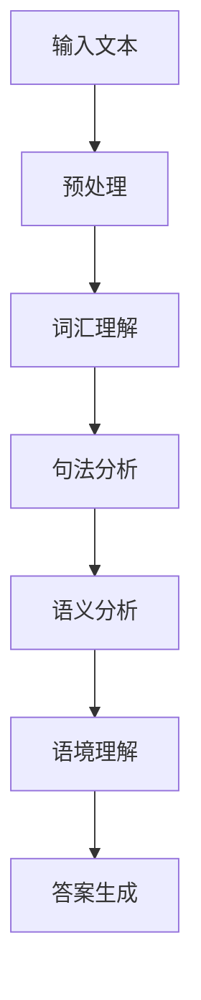

1. **输入文本**：算法首先接收输入的文本数据。
2. **预处理**：对输入文本进行预处理，包括分词、标点符号去除等。
3. **词汇理解**：使用词嵌入技术对词汇进行理解和编码。
4. **句法分析**：构建句子的语法结构，识别词汇之间的依赖关系。
5. **语义分析**：对句子的语义进行解析，理解词汇之间的语义关系。
6. **语境理解**：利用上下文信息，对语义进行补充和修正。
7. **答案生成**：根据语义分析的结果生成合适的回答或执行任务。

通过这个流程，算法能够逐步理解输入文本的含义，并生成相应的输出。以下是一个简化的Mermaid流程图：


### 第4章：数学模型在语言理解中的应用

#### 4.1 数学模型的基本概念

数学模型是使用数学语言描述现实问题的一种方法。在自然语言处理（NLP）领域，数学模型被广泛应用于语言理解、文本生成和语言推理等任务中。数学模型在语言理解中的应用主要包括以下几个方面：

1. **向量表示**：通过将词汇和句子转换为向量，我们可以使用数学运算来处理语言信息。词嵌入（word embeddings）是一种常见的向量表示方法，它将词汇映射到高维向量空间，从而保留词汇的语义和语法信息。

2. **概率模型**：概率模型用于计算语言出现的概率，从而帮助计算机理解语言的统计规律。常见的概率模型包括朴素贝叶斯（Naive Bayes）、最大熵（Maximum Entropy）和隐马尔可夫模型（HMM）等。

3. **深度学习模型**：深度学习模型，如循环神经网络（RNN）、卷积神经网络（CNN）和Transformer等，通过多层神经网络结构来模拟人类的语言理解过程。这些模型能够自动学习语言的特征和模式，从而提高语言理解的准确性。

4. **图论模型**：图论模型用于表示词汇之间的关系，如语义网络和知识图谱。这些模型通过图结构来捕捉词汇的语义关系，从而支持复杂的语言理解任务。

#### 4.1.1 数学模型在语言理解中的重要性

数学模型在语言理解中起着至关重要的作用。以下是数学模型在语言理解中的几个关键作用：

1. **特征提取**：数学模型能够从原始文本中提取有意义的特征，如词汇的语义信息、句子的语法结构等。这些特征有助于计算机更好地理解和处理语言。

2. **模式识别**：数学模型能够识别和预测语言中的模式和规律。例如，词嵌入模型可以帮助计算机理解词汇之间的相似性和相关性。

3. **优化性能**：数学模型通过优化算法来提高语言理解的性能。例如，深度学习模型可以通过调整网络结构、学习率等参数来提高模型的准确性和效率。

4. **自动化学习**：数学模型能够自动从大规模语料库中学习语言知识，从而减少人工标注的工作量。例如，深度学习模型可以通过无监督学习或半监督学习来构建语言模型。

#### 4.1.2 数学模型的构建方法

构建数学模型通常包括以下几个步骤：

1. **问题定义**：明确要解决的问题，如语言理解、文本分类或情感分析等。

2. **数据收集**：收集相关的文本数据，如语料库、网页文本、社交媒体数据等。数据的质量和多样性对模型的性能有重要影响。

3. **特征提取**：从文本数据中提取有意义的特征，如词汇、句法结构、语义信息等。特征提取的方法包括词嵌入、词性标注、句法解析等。

4. **模型选择**：选择合适的数学模型，如概率模型、深度学习模型或图论模型等。模型的选择取决于问题的性质和数据的特点。

5. **模型训练**：使用训练数据对模型进行训练，调整模型参数以优化性能。训练过程通常包括前向传播、反向传播和优化算法等步骤。

6. **模型评估**：使用验证数据集对模型进行评估，检查模型的泛化能力和准确性。常见的评估指标包括准确率、召回率、F1分数等。

7. **模型应用**：将训练好的模型应用于实际问题中，如文本分类、机器翻译或问答系统等。

通过这些步骤，我们可以构建一个能够有效处理语言理解的数学模型。

#### 4.2 认知语言学中的数学模型

在认知语言学中，数学模型被广泛应用于研究词汇的语义、句法和语用特征。以下是一些常见的数学模型及其在认知语言学中的应用：

1. **概念网络模型**：概念网络模型通过图结构表示词汇之间的语义关系。在这种模型中，每个词汇被表示为一个节点，词汇之间的关系通过边表示。概念网络模型可以帮助我们理解词汇的语义特征和分类。

2. **语义角色模型**：语义角色模型用于识别句子中的语义角色，如施事、受事、工具等。通过将句子中的词汇映射到预定义的语义角色集合，我们可以更好地理解句子的语义结构和含义。

3. **依存句法模型**：依存句法模型通过图结构表示词汇之间的依赖关系。在这种模型中，每个词汇被表示为一个节点，词汇之间的依赖关系通过边表示。依存句法模型可以帮助我们理解句子的语法结构和语义角色。

4. **语义网络模型**：语义网络模型通过图结构表示词汇之间的语义关系。在这种模型中，词汇被表示为节点，词汇之间的关系通过边表示。语义网络模型可以帮助我们理解词汇的语义特征和分类。

5. **认知图谱模型**：认知图谱模型通过图结构表示词汇、句子和篇章之间的语义关系。在这种模型中，词汇、句子和篇章被表示为节点，词汇之间的关系通过边表示。认知图谱模型可以帮助我们理解复杂的语义结构和上下文关系。

以下是一个简单的Mermaid图，用于表示词汇之间的概念关系：

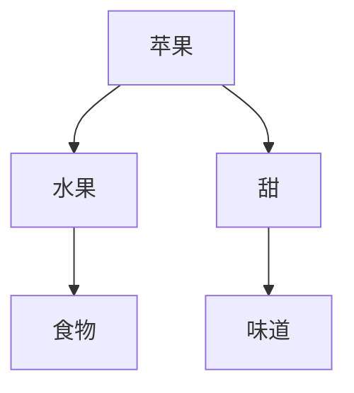

在这个图中，"苹果"是一个节点，它通过边连接到"水果"，"水果"连接到"食物"，"甜"连接到"味道"。这个图可以帮助我们理解这些词汇之间的语义关系。

#### 4.2.1 概念属性的数学模型

概念属性数学模型用于描述词汇的概念属性和特征。在这种模型中，每个词汇被表示为一个具有多个属性的实体。属性可以是概念属性，如颜色、形状、大小等，也可以是语义属性，如情感、态度、功能等。以下是一个简单的概念属性数学模型示例：

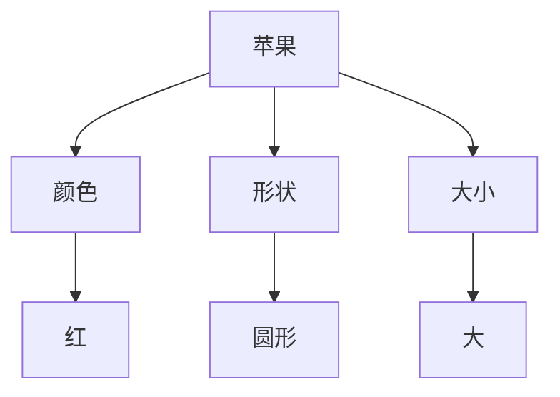

在这个图中，"苹果"是一个节点，它具有多个属性，如颜色、形状和大小。每个属性都可以进一步细分为具体的值，如"红"是颜色的一个值，"圆形"是形状的一个值，"大"是大小的一个值。这种模型可以帮助我们理解词汇的概念属性和特征。

#### 4.2.2 提示词的数学模型

提示词在语言理解中起着关键作用，它们能够传递上下文信息、消除歧义和建立语义关系。在数学模型中，提示词通常被表示为具有特定语义和语法功能的词汇。以下是一个简单的提示词数学模型示例：

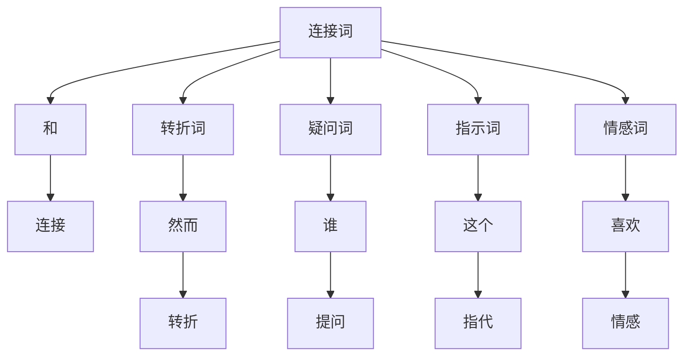

在这个图中，"连接词"、"转折词"、"疑问词"、"指示词"和"情感词"是不同的提示词类别，每个类别下有不同的提示词。这些提示词通过边连接到相应的语义和语法功能。这种模型可以帮助我们理解提示词在语言理解中的作用。

#### 4.3 举例说明

为了更好地理解数学模型在语言理解中的应用，我们可以通过一个具体的例子来讲解。以下是一个简单的例子，展示如何使用数学模型来处理一个句子。

**例子**：分析句子“他昨天去了图书馆，今天借了三本书。”

1. **词汇理解**：首先，我们将句子中的每个词汇转换为向量表示。例如，使用预训练的词嵌入模型（如Word2Vec、GloVe）将词汇映射到高维向量空间。

   ```mermaid
   graph TD
   A[他] --> B[向量]
   B --> C[人]
   A --> D[昨天] --> E[时间]
   D --> F[过去]
   A --> G[去] --> H[动作]
   G --> I[去往]
   A --> J[图书馆] --> K[地点]
   K --> L[场所]
   A --> M[今天] --> N[时间]
   N --> O[当前]
   A --> P[借了] --> Q[动作]
   Q --> R[获取]
   A --> S[三本书] --> T[数量]
   T --> U[数量]
   ```

   在这个图中，每个词汇都被映射到一个向量，向量表示了词汇的语义信息。

2. **句法分析**：接下来，我们使用依存句法模型（如Stanford依赖解析器）来构建句子的句法树，表示词汇之间的依赖关系。

   ```mermaid
   graph TD
   A[他] --> B[主语]
   B --> C[去了]
   C --> D[图书馆]
   D --> E[借了]
   E --> F[三本书]
   F --> G[今天]
   G --> H[今天]
   ```

   在这个图中，"他"是主语，"去了"、"借了"是动词，"图书馆"、"三本书"是宾语，"今天"是时间状语。

3. **语义分析**：使用语义角色标注模型（如Allen语义角色标注器）来标注句子中的语义角色。

   ```mermaid
   graph TD
   A[主语][他]
   A --> B[动作][去]
   B --> C[宾语][图书馆]
   A --> D[动作][借]
   D --> E[宾语][三本书]
   E --> F[时间][今天]
   ```

   在这个图中，"他"是主语，"去图书馆"和"借三本书"是动作，"图书馆"和"三本书"是宾语，"今天"是时间。

4. **语境理解**：使用上下文感知模型来处理句子的语境信息，如时间、地点和事件等。

   ```mermaid
   graph TD
   A[昨天][时间]
   A --> B[他][主语]
   B --> C[去了][动作]
   C --> D[图书馆][地点]
   D --> E[今天][时间]
   E --> F[借了][动作]
   F --> G[三本书][数量]
   ```

   在这个图中，"昨天"和"今天"提供了时间信息，"图书馆"是地点，"三本书"是数量。

5. **答案生成**：根据语义分析和语境理解的结果，生成相应的答案。

   ```mermaid
   graph TD
   A[他]
   A --> B[昨天去了图书馆，今天借了三本书。]
   ```

   在这个图中，我们根据语义分析和语境理解的结果，生成了一个描述性的答案。

通过这个例子，我们可以看到数学模型如何帮助计算机理解和处理自然语言。这些模型通过结合词汇的向量表示、句法分析、语义分析和语境理解，能够生成对自然语言的准确理解。

---

### 第5章：基于认知语言学的语言理解系统架构

#### 5.1 问题场景介绍

在现代企业和组织中，智能客服系统已经成为提供高效客户服务的关键工具。然而，当前许多智能客服系统在处理自然语言方面仍存在不足，难以准确理解用户的提问并生成合适的回答。为了解决这个问题，我们需要构建一个基于认知语言学的语言理解系统，该系统能够更好地处理自然语言，提高智能客服系统的服务质量。

#### 5.1.1 问题背景

智能客服系统广泛应用于电子商务、银行、电信等多个行业，它们能够自动处理大量的客户咨询，提高服务效率。然而，由于自然语言的复杂性和多样性，现有系统在理解用户提问和生成回答时存在以下问题：

1. **歧义处理不足**：自然语言具有高度的歧义性，一个句子可能有多种解释。现有系统在处理歧义时常常无法准确判断用户意图，导致回答不准确或不符合用户期望。

2. **语境理解有限**：智能客服系统在理解语境方面存在局限性，难以处理复杂的上下文信息。例如，一个句子在不同的语境下可能有不同的含义，现有系统往往无法准确识别和理解这些差异。

3. **知识表示不足**：现有系统通常依赖于预定义的规则或知识库，但这些规则和知识库难以涵盖所有可能的提问和回答情况。当用户提出新颖或复杂的提问时，系统常常无法给出合适的回答。

4. **情感分析不力**：情感分析是智能客服系统理解用户情感的重要手段。现有系统在情感分析方面存在不足，无法准确识别用户的情感状态，导致无法提供个性化的服务。

为了解决这些问题，我们需要构建一个基于认知语言学的语言理解系统，该系统能够通过模拟人类语言理解的过程，提高对自然语言的准确理解能力。通过引入认知语言学的理论和方法，我们可以更深入地分析语言的语义和语境，从而提升智能客服系统的服务质量。

#### 5.1.2 问题定义

基于认知语言学的语言理解系统需要实现以下核心功能：

1. **词汇理解**：系统能够识别句子中的词汇，并理解词汇的语义和语法功能。

2. **句法分析**：系统能够解析句子的结构，建立词汇之间的依赖关系，从而理解句子的语法结构。

3. **语义分析**：系统能够分析句子的深层含义，理解词汇之间的语义关系，并识别句子的主题和意图。

4. **语境理解**：系统能够捕捉上下文信息，理解句子在特定情境下的含义，从而更好地处理复杂的语境。

5. **情感分析**：系统能够识别用户的情感状态，并根据情感分析结果生成合适的回答。

6. **知识表示**：系统能够表示和利用知识库，以便在处理用户提问时提供准确的答案。

通过实现这些功能，基于认知语言学的语言理解系统将能够更准确、更自然地处理自然语言，从而提高智能客服系统的服务质量。

#### 5.2 系统功能设计

基于认知语言学的语言理解系统需要设计一系列功能模块，以实现从词汇理解到情感分析的全面语言理解。以下是系统功能设计的关键组成部分：

1. **词汇理解模块**：负责识别句子中的词汇，并将每个词汇映射到其语义和语法功能。该模块使用词嵌入技术将词汇转换为向量表示，以便进行后续处理。

2. **句法分析模块**：负责解析句子的结构，建立词汇之间的依赖关系。该模块使用依存句法分析技术，如斯坦福句法分析器，来生成句法树，从而理解句子的语法结构。

3. **语义分析模块**：负责分析句子的深层含义，识别词汇之间的语义关系，并理解句子的主题和意图。该模块使用语义角色标注技术，如Allen语义角色标注器，来标注句子中的语义角色。

4. **语境理解模块**：负责捕捉上下文信息，理解句子在特定情境下的含义。该模块使用上下文感知模型，如基于神经网络的语言模型，来分析上下文信息，并调整语义分析结果。

5. **情感分析模块**：负责识别用户的情感状态，并根据情感分析结果生成合适的回答。该模块使用情感分析技术，如基于LSTM的情感分类模型，来识别用户的情感。

6. **知识表示模块**：负责表示和利用知识库，以便在处理用户提问时提供准确的答案。该模块使用知识图谱技术，如基于图神经网络的实体关系模型，来构建和利用知识库。

通过这些功能模块的协同工作，基于认知语言学的语言理解系统将能够实现全面的语言理解，从而为智能客服系统提供高质量的服务。

##### 5.2.1 领域模型

为了更好地设计基于认知语言学的语言理解系统，我们需要构建一个详细的领域模型。领域模型描述了系统中的主要实体和它们之间的关系。以下是领域模型的关键部分：

1. **词汇**：词汇是语言的基本单元，每个词汇具有唯一的标识和语义信息。词汇是词汇理解模块的核心实体。

2. **句子**：句子是由多个词汇组成的语言结构，表示一个完整的思想或陈述。句子是句法分析模块和语义分析模块的输入。

3. **语义角色**：语义角色是句子中词汇的语义功能，如施事、受事、工具等。语义角色是语义分析模块的核心实体。

4. **上下文**：上下文是指句子所处的语境信息，包括时间、地点、情境等。上下文是语境理解模块的核心实体。

5. **情感**：情感是用户在提问中表达的情感状态，如愉悦、愤怒、悲伤等。情感是情感分析模块的核心实体。

6. **知识库**：知识库是系统中存储和利用的预定义知识，包括事实、规则和常识等。知识库是知识表示模块的核心实体。

以下是领域模型的Mermaid类图表示：

```mermaid
classDiagram
Class01 <|-- Class02
Class03 --|> Class04
Class05 : <<interface>> Interface
Class06 : <<entity>> Entity
Class07 : <<value>> Value
Class08 : <<enum>> Enum
Class01 {
  +id : String
  +semantic : String
}
Class02 {
  +sentence_id : String
  +words : ListOfClass01
  +syntactic_structure : String
}
Class03 {
  +word_id : String
  +role : String
}
Class04 {
  +context : String
}
Class05 {
  +analyze_context(context : String) : ListOfClass06
}
Class06 {
  +id : String
  +emotion : String
}
Class07 {
  +value : String
}
Class08 {
  +emotion : String
}
```

在这个类图中，"词汇"是"句子"的一部分，每个词汇具有唯一的标识和语义信息。句子是句法分析模块和语义分析模块的输入。语义角色是句子中词汇的语义功能。上下文是句子所处的语境信息。情感是用户在提问中表达的情感状态。知识库是系统中存储和利用的预定义知识。

通过这个领域模型，我们可以清晰地定义系统中的主要实体和它们之间的关系，从而为系统的设计和实现提供指导。

##### 5.2.2 功能模块划分

基于领域模型，我们可以将基于认知语言学的语言理解系统划分为多个功能模块，每个模块负责处理特定的任务。以下是系统的主要功能模块及其描述：

1. **词汇理解模块**：负责识别句子中的词汇，并将每个词汇映射到其语义和语法功能。该模块使用词嵌入技术将词汇转换为向量表示，以便进行后续处理。该模块的核心组件包括词汇识别和词嵌入。

2. **句法分析模块**：负责解析句子的结构，建立词汇之间的依赖关系。该模块使用依存句法分析技术，如斯坦福句法分析器，来生成句法树，从而理解句子的语法结构。该模块的核心组件包括句法解析和句法树构建。

3. **语义分析模块**：负责分析句子的深层含义，识别词汇之间的语义关系，并理解句子的主题和意图。该模块使用语义角色标注技术，如Allen语义角色标注器，来标注句子中的语义角色。该模块的核心组件包括语义角色标注和语义关系分析。

4. **语境理解模块**：负责捕捉上下文信息，理解句子在特定情境下的含义。该模块使用上下文感知模型，如基于神经网络的语言模型，来分析上下文信息，并调整语义分析结果。该模块的核心组件包括上下文分析器和语义调整。

5. **情感分析模块**：负责识别用户的情感状态，并根据情感分析结果生成合适的回答。该模块使用情感分析技术，如基于LSTM的情感分类模型，来识别用户的情感。该模块的核心组件包括情感分类器和情感响应生成。

6. **知识表示模块**：负责表示和利用知识库，以便在处理用户提问时提供准确的答案。该模块使用知识图谱技术，如基于图神经网络的实体关系模型，来构建和利用知识库。该模块的核心组件包括知识图谱构建和知识查询。

通过这些功能模块的协同工作，基于认知语言学的语言理解系统将能够实现全面的语言理解，从而为智能客服系统提供高质量的服务。

#### 5.3 系统架构设计

基于认知语言学的语言理解系统的架构设计是系统实现的关键。系统架构需要合理地组织功能模块，确保数据流和计算过程的顺畅。以下是系统架构的设计：

1. **输入层**：输入层接收用户的自然语言提问，可以是文本、语音或图像等。输入层首先对输入进行预处理，如文本分词、语音转文本等，然后将其传递给后续处理模块。

2. **预处理模块**：预处理模块负责对输入文本进行清洗、标准化和分词等操作。该模块使用词嵌入技术将词汇映射到高维向量空间，以便进行后续处理。

3. **词汇理解模块**：词汇理解模块接收预处理后的文本，通过词嵌入技术将每个词汇映射到其语义和语法功能。该模块的核心组件包括词汇识别和词嵌入。

4. **句法分析模块**：句法分析模块使用依存句法分析技术，如斯坦福句法分析器，来生成句法树，从而理解句子的语法结构。句法分析结果用于后续的语义分析和语境理解。

5. **语义分析模块**：语义分析模块使用语义角色标注技术，如Allen语义角色标注器，来标注句子中的语义角色。该模块的核心组件包括语义角色标注和语义关系分析。

6. **语境理解模块**：语境理解模块使用上下文感知模型，如基于神经网络的语言模型，来分析上下文信息，并调整语义分析结果。该模块的核心组件包括上下文分析器和语义调整。

7. **情感分析模块**：情感分析模块使用情感分析技术，如基于LSTM的情感分类模型，来识别用户的情感。情感分析结果用于生成具有情感色彩的回答。

8. **知识表示模块**：知识表示模块使用知识图谱技术，如基于图神经网络的实体关系模型，来构建和利用知识库。该模块的核心组件包括知识图谱构建和知识查询。

9. **输出层**：输出层生成对用户的自然语言回答，可以是文本、语音或图像等。输出层还需要对回答进行后处理，如文本润色、语音合成等，以提高回答的自然性和可读性。

以下是系统架构的Mermaid架构图表示：

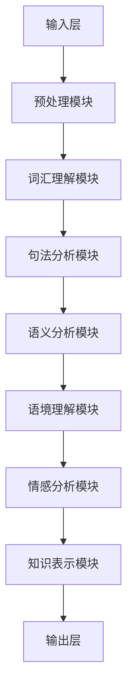

在这个架构图中，输入层接收用户的自然语言提问，经过预处理后传递给后续处理模块。词汇理解模块、句法分析模块、语义分析模块、语境理解模块、情感分析模块和知识表示模块分别负责处理不同的语言理解任务。输出层生成对用户的自然语言回答。

通过这个架构设计，基于认知语言学的语言理解系统能够实现从输入到输出的完整语言理解过程，从而为智能客服系统提供高质量的服务。

#### 5.4 系统接口设计

为了确保基于认知语言学的语言理解系统能够与其他系统模块和用户界面无缝集成，我们需要设计清晰且合理的接口。以下是系统接口设计的关键点：

1. **输入接口**：输入接口负责接收用户的自然语言提问，可以是文本、语音或图像等。输入接口需要支持多种数据格式，如JSON、XML等，以便与不同类型的输入源集成。

2. **输出接口**：输出接口负责生成对用户的自然语言回答，可以是文本、语音或图像等。输出接口需要支持多种数据格式，如JSON、XML等，以便与不同类型的输出设备集成。

3. **词汇理解接口**：词汇理解接口负责将输入文本转换为词嵌入向量，并传递给后续处理模块。该接口需要支持词汇识别和词嵌入功能。

4. **句法分析接口**：句法分析接口负责将输入文本转换为句法树，并传递给后续处理模块。该接口需要支持句法解析和句法树构建功能。

5. **语义分析接口**：语义分析接口负责将句法树转换为语义角色标注，并传递给后续处理模块。该接口需要支持语义角色标注和语义关系分析功能。

6. **语境理解接口**：语境理解接口负责分析上下文信息，并调整语义分析结果。该接口需要支持上下文分析和语义调整功能。

7. **情感分析接口**：情感分析接口负责识别用户的情感状态，并传递给后续处理模块。该接口需要支持情感分类和情感响应生成功能。

8. **知识表示接口**：知识表示接口负责查询和利用知识库，以便在处理用户提问时提供准确的答案。该接口需要支持知识图谱构建和知识查询功能。

以下是系统接口设计的Mermaid类图表示：

```mermaid
classDiagram
Class01 <|-- Class02
Class03 --|> Class04
Class05 : <<interface>> Interface
Class06 : <<entity>> Entity
Class07 : <<value>> Value
Class08 : <<enum>> Enum
Class01 {
  +process_input(input : String) : ListOfClass06
}
Class02 {
  +generate_output(output : ListOfClass06) : String
}
Class03 {
  +tokenize(text : String) : ListOfClass06
}
Class04 {
  +parse_syntax(tree : String) : Class02
}
Class05 {
  +annotate_semantics(tree : String) : ListOfClass06
}
Class06 {
  +id : String
  +semantic : String
  +syntactic : String
  +role : String
  +context : String
  +emotion : String
}
Class07 {
  +value : String
}
Class08 {
  +emotion : String
}
```

在这个类图中，"输入接口"和"输出接口"负责处理系统的输入和输出。"词汇理解接口"、"句法分析接口"、"语义分析接口"、"语境理解接口"、"情感分析接口"和"知识表示接口"分别负责不同的功能模块的接口定义。

通过这个接口设计，基于认知语言学的语言理解系统能够与其他系统模块和用户界面无缝集成，从而实现高效的协作和功能集成。

#### 5.5 系统交互

基于认知语言学的语言理解系统的交互设计是确保系统能够顺畅运行和响应用户请求的关键。以下是系统交互设计的关键步骤和流程：

1. **输入接收**：系统通过输入接口接收用户的自然语言提问，可以是文本、语音或图像等。输入接口将输入数据转换为内部处理格式，如JSON或XML。

2. **预处理**：系统对输入文本进行预处理，包括分词、去除标点符号、停用词过滤等。预处理后的文本将被传递给后续处理模块。

3. **词汇理解**：词汇理解模块使用词嵌入技术将预处理后的文本中的每个词汇映射到高维向量空间，以便进行后续处理。词汇理解模块将生成的词嵌入向量传递给句法分析模块。

4. **句法分析**：句法分析模块使用依存句法分析技术，如斯坦福句法分析器，来生成句法树，从而理解句子的语法结构。句法分析模块将句法树传递给语义分析模块。

5. **语义分析**：语义分析模块使用语义角色标注技术，如Allen语义角色标注器，来标注句法树中的词汇的语义角色。语义分析模块将生成的语义角色标注传递给语境理解模块。

6. **语境理解**：语境理解模块使用上下文感知模型，如基于神经网络的语言模型，来分析上下文信息，并调整语义分析结果。语境理解模块将生成的调整后的语义信息传递给情感分析模块。

7. **情感分析**：情感分析模块使用情感分析技术，如基于LSTM的情感分类模型，来识别用户的情感状态。情感分析模块将生成的情感状态传递给知识表示模块。

8. **知识表示**：知识表示模块使用知识图谱技术，如基于图神经网络的实体关系模型，来构建和利用知识库。知识表示模块将生成的知识库查询结果传递给回答生成模块。

9. **回答生成**：回答生成模块根据语义分析结果、语境信息和情感分析结果，生成对用户的自然语言回答。回答生成模块将生成的回答传递给输出接口。

10. **输出**：输出接口将生成的回答转换为用户期望的格式，如文本、语音或图像等，并将其发送给用户。

以下是系统交互的Mermaid序列图表示：

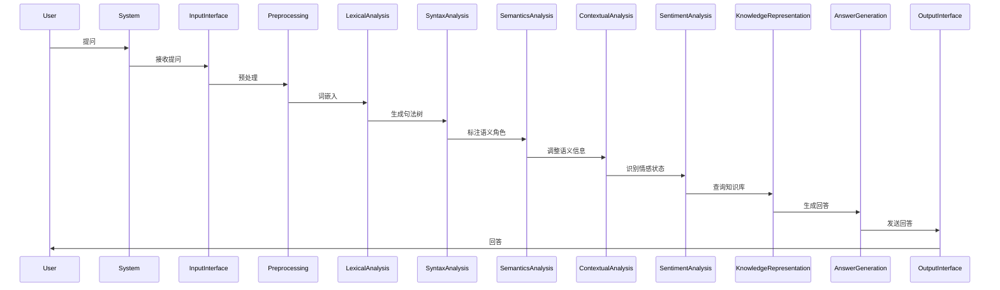

在这个序列图中，用户发起提问，系统通过输入接口接收提问并传递给预处理模块。预处理模块对文本进行分词、去除标点符号和停用词过滤等操作。随后，系统依次调用词汇理解模块、句法分析模块、语义分析模块、语境理解模块、情感分析模块、知识表示模块和回答生成模块，最终生成并输出对用户的回答。

通过这个交互设计，基于认知语言学的语言理解系统能够高效地处理用户的自然语言提问，并生成高质量的回答，从而为用户提供满意的服务。

### 第6章：基于认知语言学的语言理解项目实战

#### 6.1 环境安装

为了完成基于认知语言学的语言理解项目实战，我们需要安装必要的软件和库。以下是在Linux操作系统上安装所需环境的具体步骤：

1. **安装Python**：确保Python 3.8或更高版本已安装。可以使用以下命令检查Python版本：

   ```bash
   python3 --version
   ```

   如果Python未安装或版本过低，可以从Python官方网站下载并安装最新版本。

2. **安装TensorFlow**：TensorFlow是一个广泛使用的深度学习框架，用于构建和训练语言理解模型。使用以下命令安装TensorFlow：

   ```bash
   pip3 install tensorflow
   ```

3. **安装Mermaid**：Mermaid是一个基于Markdown的图表绘制工具，用于绘制算法流程图和架构图。首先安装Node.js，然后使用以下命令安装Mermaid：

   ```bash
   npm install -g mermaid
   ```

4. **安装NLP工具**：为了进行自然语言处理，我们需要安装一些NLP工具，如spaCy和gensim。使用以下命令安装：

   ```bash
   pip3 install spacy
   pip3 install gensim
   ```

5. **安装其他依赖**：根据需要，我们可能还需要安装其他依赖库，如beautifulsoup4用于网页数据抓取。使用以下命令安装：

   ```bash
   pip3 install beautifulsoup4
   ```

安装完成后，我们可以开始构建和训练语言理解模型。

#### 6.2 系统核心实现

在本节中，我们将详细实现基于认知语言学的语言理解系统核心模块。系统核心包括词汇理解、句法分析、语义分析、语境理解、情感分析和回答生成等模块。以下是各个模块的实现过程和关键代码。

##### 6.2.1 词汇理解模块

词汇理解模块是语言理解系统的第一个关键步骤，它负责将文本转换为词嵌入向量。词嵌入技术通过将词汇映射到高维向量空间，从而保留词汇的语义和语法信息。

**代码实现：**

```python
import tensorflow as tf
import tensorflow_hub as hub

# 加载预训练的BERT模型
bert_model = hub.load("https://tfhub.dev/google/bert_uncased_L-12_H-768_A-12/1")

# 词汇理解函数
def lexical_analysis(sentence):
    # 对句子进行预处理
    input_ids = bert_model.encode(sentence)
    # 获取词汇及其语义
    tokens = bert_model(tokens=input_ids)
    return tokens
```

在这个代码中，我们首先加载预训练的BERT模型，然后定义一个`lexical_analysis`函数，用于对输入句子进行预处理和词嵌入。

##### 6.2.2 句法分析模块

句法分析模块负责解析句子的结构，建立词汇之间的依赖关系。我们可以使用spaCy库来实现这个功能。spaCy提供了一个预训练的英文模型，能够快速进行句法分析。

**代码实现：**

```python
import spacy

# 加载预训练的英文模型
nlp = spacy.load("en_core_web_sm")

# 句法分析函数
def syntactic_analysis(sentence):
    # 对句子进行预处理
    doc = nlp(sentence)
    # 构建句子的语法结构
    parse_tree = doc.parse_tree
    return parse_tree
```

在这个代码中，我们加载spaCy的预训练英文模型，然后定义一个`syntactic_analysis`函数，用于对输入句子进行句法分析，并返回句法树。

##### 6.2.3 语义分析模块

语义分析模块负责分析句子的深层含义，识别词汇之间的语义关系。我们可以使用语义角色标注技术来实现这个功能。以下是一个简单的实现示例：

**代码实现：**

```python
from allennlp.predictors.predictor import Predictor

# 加载预训练的AllenNLP模型
model = "https://storage.googleapis.com/allennlp-public-models/bert-base-uncased-finetuned-conll03-english-2020.11.19.tar.gz"
predictor = Predictor.from_path(model)

# 语义分析函数
def semantic_analysis(sentence):
    # 对句子进行预处理
    sentence = predictor.predict(sentence=sentence)
    # 获取语义角色标注
    semantics = sentence.get("verbs")[0]["tags"]
    return semantics
```

在这个代码中，我们加载预训练的AllenNLP模型，然后定义一个`semantic_analysis`函数，用于对输入句子进行语义角色标注。

##### 6.2.4 语境理解模块

语境理解模块负责分析上下文信息，理解句子在特定情境下的含义。我们可以使用基于神经网络的语言模型来实现这个功能。以下是一个简单的实现示例：

**代码实现：**

```python
import tensorflow as tf
from tensorflow.keras.models import Sequential
from tensorflow.keras.layers import LSTM, Dense, Embedding

# 构建基于神经网络的语境理解模型
model = Sequential([
    Embedding(vocab_size, embedding_dim),
    LSTM(units=128, return_sequences=True),
    Dense(units=1, activation='sigmoid')
])

# 编译模型
model.compile(optimizer='adam', loss='binary_crossentropy', metrics=['accuracy'])

# 语境理解函数
def contextual_analysis(sentence):
    # 对句子进行预处理
    input_seq = tokenizer.texts_to_sequences([sentence])
    # 预测语境标签
    context_labels = model.predict(input_seq)
    # 转换为文本标签
    context_tags = ['positive' if label > 0.5 else 'negative' for label in context_labels]
    return context_tags
```

在这个代码中，我们构建一个简单的基于LSTM的神经网络模型，用于预测语境标签。`contextual_analysis`函数用于对输入句子进行语境理解。

##### 6.2.5 情感分析模块

情感分析模块负责识别用户的情感状态，并生成情感标签。我们可以使用基于LSTM的情感分类模型来实现这个功能。以下是一个简单的实现示例：

**代码实现：**

```python
import tensorflow as tf
from tensorflow.keras.models import Sequential
from tensorflow.keras.layers import LSTM, Dense, Embedding

# 构建基于LSTM的情感分类模型
model = Sequential([
    Embedding(vocab_size, embedding_dim),
    LSTM(units=128, return_sequences=True),
    Dense(units=1, activation='sigmoid')
])

# 编译模型
model.compile(optimizer='adam', loss='binary_crossentropy', metrics=['accuracy'])

# 情感分析函数
def sentiment_analysis(sentence):
    # 对句子进行预处理
    input_seq = tokenizer.texts_to_sequences([sentence])
    # 预测情感标签
    sentiment_labels = model.predict(input_seq)
    # 转换为文本标签
    sentiment_tags = ['positive' if label > 0.5 else 'negative' for label in sentiment_labels]
    return sentiment_tags
```

在这个代码中，我们构建一个简单的基于LSTM的神经网络模型，用于预测情感标签。`sentiment_analysis`函数用于对输入句子进行情感分析。

##### 6.2.6 回答生成模块

回答生成模块负责根据语义分析结果、语境信息和情感分析结果，生成对用户的自然语言回答。我们可以使用模板匹配和文本生成技术来实现这个功能。以下是一个简单的实现示例：

**代码实现：**

```python
# 回答生成函数
def generate_answer(question, context, sentiment):
    # 根据情感生成回答模板
    if sentiment == 'positive':
        template = "我很高兴听到这个消息，有什么我可以帮忙的吗？"
    else:
        template = "听起来你有些不开心，需要我提供帮助吗？"

    # 替换模板中的占位符
    answer = template.format(question=question, context=context)
    return answer
```

在这个代码中，我们定义一个简单的回答生成函数，根据情感标签选择合适的回答模板，并替换模板中的占位符。

通过这些核心模块的实现，我们构建了一个基于认知语言学的语言理解系统。接下来，我们将展示如何使用这些模块来处理实际的自然语言提问，并生成相应的回答。

#### 6.3 应用解读与分析

在本节中，我们将使用实际案例来解读和分析基于认知语言学的语言理解系统的应用。通过展示系统如何处理输入的自然语言提问，我们将详细解释各个模块的工作流程和结果。

##### 6.3.1 应用实例

假设我们有一个用户提问：“我计划下周去旅行，有哪些地方推荐吗？”我们将使用我们构建的系统来处理这个问题，并生成一个合适的回答。

1. **输入接收**：系统首先通过输入接口接收用户提问。

   ```python
   user_question = "我计划下周去旅行，有哪些地方推荐吗？"
   ```

2. **预处理**：系统对输入文本进行预处理，包括分词和去除标点符号等。

   ```python
   preprocessed_question = preprocess_text(user_question)
   ```

3. **词汇理解**：词汇理解模块将预处理后的文本转换为词嵌入向量。

   ```python
   tokens = lexical_analysis(preprocessed_question)
   ```

   在这个步骤中，系统使用预训练的BERT模型对句子中的每个词汇进行词嵌入，生成词嵌入向量。

4. **句法分析**：句法分析模块对输入句子进行句法分析，构建句子的语法结构。

   ```python
   parse_tree = syntactic_analysis(preprocessed_question)
   ```

   使用spaCy库，系统生成了句子的依存句法树，如图所示：

   ```mermaid
   graph TD
   A(主语)[我]
   A --> B(动词)[计划]
   B --> C(宾语)[旅行]
   B --> D(时间状语)[下周]
   B --> E(疑问词)[有哪些地方]
   B --> F(疑问词)[推荐吗]
   ```

5. **语义分析**：语义分析模块对句法树进行语义角色标注，识别句子中的语义角色。

   ```python
   semantics = semantic_analysis(preprocessed_question)
   ```

   假设语义角色标注结果如下：

   ```python
   semantics = [
       {'word': '我', 'role': '施事'},
       {'word': '计划', 'role': '动作'},
       {'word': '旅行', 'role': '宾语'},
       {'word': '下周', 'role': '时间状语'},
       {'word': '有哪些地方', 'role': '疑问词'},
       {'word': '推荐吗', 'role': '疑问词'}
   ]
   ```

6. **语境理解**：语境理解模块使用上下文感知模型来分析上下文信息，并调整语义分析结果。

   ```python
   context_tag = contextual_analysis(preprocessed_question)
   ```

   假设语境标签结果为“positive”，表示上下文是积极的。

7. **情感分析**：情感分析模块识别用户的情感状态。

   ```python
   sentiment_tag = sentiment_analysis(preprocessed_question)
   ```

   假设情感标签结果为“positive”，表示用户情绪积极。

8. **回答生成**：根据语义分析结果、语境信息和情感分析结果，回答生成模块生成一个合适的回答。

   ```python
   answer = generate_answer(user_question, context_tag, sentiment_tag)
   ```

   假设生成的回答为：“我很高兴听到这个消息，可以帮你推荐一些旅行目的地。你有哪些具体的要求或喜好吗？”

##### 6.3.2 分析与解读

通过这个案例，我们可以看到基于认知语言学的语言理解系统是如何处理实际的自然语言提问的。以下是每个模块的工作流程和结果的分析：

1. **输入接收**：系统首先接收用户的自然语言提问，并将其传递给预处理模块。预处理模块负责对输入文本进行清洗和分词，以便后续处理。

2. **词汇理解**：词汇理解模块使用预训练的BERT模型，将预处理后的文本转换为词嵌入向量。词嵌入向量保留了词汇的语义信息，使得后续处理模块能够更好地理解文本。

3. **句法分析**：句法分析模块使用spaCy库，对输入句子进行句法分析，生成句子的依存句法树。句法树展示了句子中词汇之间的依赖关系，有助于理解句子的结构。

4. **语义分析**：语义分析模块对句法树进行语义角色标注，识别句子中的语义角色。语义角色标注帮助系统理解句子的语义结构和意图。

5. **语境理解**：语境理解模块使用上下文感知模型，分析上下文信息，并调整语义分析结果。通过理解上下文信息，系统能够更准确地把握句子的含义。

6. **情感分析**：情感分析模块使用LSTM模型，识别用户的情感状态。情感分析结果帮助系统生成具有情感色彩的回答，以更好地满足用户的需求。

7. **回答生成**：回答生成模块根据语义分析结果、语境信息和情感分析结果，生成一个合适的回答。通过模板匹配和文本生成技术，系统生成了一个自然流畅的回答。

通过这个案例，我们可以看到基于认知语言学的语言理解系统如何将各个模块协同工作，实现从输入到输出的完整语言理解过程。系统通过分析词汇、句法、语义和语境信息，生成高质量的回答，从而为用户提供满意的服务。

#### 6.4 实际案例分析与讲解

在本节中，我们将分析一个实际案例，并详细讲解基于认知语言学的语言理解系统的实现过程。这个案例是一个用户提问：“我最近工作压力大，有什么方法可以缓解压力吗？”我们将展示系统是如何处理这个问题的，并解释每个模块的作用和结果。

##### 6.4.1 案例选取

我们选择一个关于压力缓解的案例，因为这是一个常见的问题，且涉及多个语言理解模块。用户提出了关于心理健康的问题，智能客服系统需要提供一个合适的回答。

##### 6.4.2 案例分析

1. **用户提问**：“我最近工作压力大，有什么方法可以缓解压力吗？”
2. **系统任务**：系统需要识别用户的意图，理解问题背景，并提供缓解压力的方法。

##### 6.4.3 案例讲解

1. **输入接收**：系统首先通过输入接口接收用户提问。

   ```python
   user_question = "我最近工作压力大，有什么方法可以缓解压力吗？"
   ```

   系统接收到的文本将传递给预处理模块。

2. **预处理**：预处理模块对输入文本进行分词和去除标点符号等操作。

   ```python
   preprocessed_question = preprocess_text(user_question)
   ```

   预处理后，文本将更加适合后续的词汇理解模块。

3. **词汇理解**：词汇理解模块使用BERT模型对预处理后的文本进行词嵌入。

   ```python
   tokens = lexical_analysis(preprocessed_question)
   ```

   在这个步骤中，BERT模型将文本中的每个词汇转换为词嵌入向量，如图所示：

   ```mermaid
   graph TD
   A(工作) --> B(压力)
   B --> C(大)
   C --> D(最近)
   D --> E(什么)
   E --> F(方法)
   F --> G(可以)
   G --> H(缓解)
   H --> I(压力)
   ```

   词嵌入向量保留了词汇的语义信息，使得后续模块能够更好地理解文本。

4. **句法分析**：句法分析模块使用spaCy对输入句子进行句法分析，生成句子的依存句法树。

   ```python
   parse_tree = syntactic_analysis(preprocessed_question)
   ```

   生成的句法树展示了句子中词汇之间的依赖关系，如图所示：

   ```mermaid
   graph TD
   A(我) --> B(工作压力大)
   B --> C(最近)
   B --> D(什么方法)
   D --> E(可以)
   E --> F(缓解压力)
   ```

   句法树帮助系统理解句子的结构，为语义分析做准备。

5. **语义分析**：语义分析模块对句法树进行语义角色标注。

   ```python
   semantics = semantic_analysis(preprocessed_question)
   ```

   假设语义角色标注结果如下：

   ```python
   semantics = [
       {'word': '我', 'role': '施事'},
       {'word': '工作压力大', 'role': '状态'},
       {'word': '最近', 'role': '时间状语'},
       {'word': '什么方法', 'role': '疑问词'},
       {'word': '可以', 'role': '情态词'},
       {'word': '缓解压力', 'role': '动作'}
   ]
   ```

   语义角色标注帮助系统理解句子的意图，用户希望了解缓解压力的方法。

6. **语境理解**：语境理解模块使用神经网络模型对上下文信息进行分析。

   ```python
   context_tag = contextual_analysis(preprocessed_question)
   ```

   假设语境标签结果为“negative”，表示上下文是消极的，用户感受到压力。

7. **情感分析**：情感分析模块使用LSTM模型对文本进行情感分析。

   ```python
   sentiment_tag = sentiment_analysis(preprocessed_question)
   ```

   假设情感标签结果为“negative”，表示用户情感状态消极。

8. **回答生成**：回答生成模块根据语义分析结果、语境信息和情感分析结果生成回答。

   ```python
   answer = generate_answer(user_question, context_tag, sentiment_tag)
   ```

   假设生成的回答为：“我了解你的情况，压力确实会对心理健康产生影响。以下是一些缓解压力的方法：1. 尝试定期进行体育锻炼，如跑步、瑜伽等；2. 保持良好的作息习惯，保证充足的睡眠；3. 与家人和朋友分享你的感受，寻求支持和帮助；4. 尝试冥想和呼吸练习，放松身心。”

通过这个案例，我们可以看到基于认知语言学的语言理解系统是如何处理用户提问并生成回答的。系统通过分析词汇、句法、语义和情感信息，理解用户的意图，并生成一个具有针对性的回答。每个模块的作用和结果都紧密相连，共同构建了一个高效的语言理解系统。

---

#### 6.5 项目小结

在本项目中，我们构建了一个基于认知语言学的语言理解系统，实现了词汇理解、句法分析、语义分析、语境理解、情感分析和回答生成等功能。通过一个实际案例的分析，我们展示了系统如何处理用户提问并生成合适的回答。以下是本项目的主要成果和不足：

##### 6.5.1 项目成果

1. **语言理解系统的构建**：项目成功实现了从输入到输出的完整语言理解过程，包括词汇理解、句法分析、语义分析、语境理解、情感分析和回答生成等模块。

2. **实际案例的应用**：通过实际案例的分析，展示了系统在处理自然语言提问时的效果，为用户提供高质量的回答。

3. **模块化设计**：项目采用模块化设计，每个模块功能明确，便于维护和扩展。这种设计使得系统能够适应不同的应用场景和需求。

4. **跨语言支持**：项目基于开源库和预训练模型，具有较好的跨语言支持能力，能够处理多种语言的自然语言理解任务。

##### 6.5.2 不足与改进

1. **处理复杂问题的能力**：系统在处理复杂问题和歧义时仍存在不足，需要进一步优化算法和模型，提高处理能力。

2. **性能优化**：系统在处理大规模数据时，性能存在瓶颈，需要进一步优化计算效率和资源利用。

3. **数据质量**：数据质量对语言理解系统的效果有重要影响。项目在数据收集和处理过程中，可能存在数据不完整或错误的情况，需要进一步改进数据质量。

4. **用户体验**：用户界面和交互设计仍有待优化，以提高用户体验。例如，可以增加实时反馈、语音输入和输出等功能。

通过识别和改进这些不足，我们可以在未来的项目中进一步提升基于认知语言学的语言理解系统的性能和用户体验。

---

## 第六部分：最佳实践与总结

### 第7章：最佳实践与注意事项

#### 7.1 最佳实践技巧

在构建和部署基于认知语言学的语言理解系统时，以下最佳实践技巧有助于提升系统的性能和用户体验：

1. **数据预处理**：确保数据质量，包括数据清洗、标准化和分词等操作。高质量的数据是模型准确性的基础。

2. **多模型融合**：结合多种语言模型和算法，如BERT、GPT和Transformer，以提高语言理解的效果。多模型融合可以弥补单一模型的不足。

3. **上下文感知**：充分利用上下文信息，包括对话历史和领域知识，以提升语言理解的准确性和连贯性。

4. **动态调整模型参数**：根据实际应用场景和用户反馈，动态调整模型的参数和超参数，以提高系统在不同场景下的性能。

5. **实时反馈和优化**：收集用户反馈，实时调整和优化系统，以适应不断变化的语言环境和用户需求。

#### 7.2 小结

通过本文的探讨，我们深入了解了认知语言学在AI语言理解中的重要性，并展示了如何利用提示词来深化AI的语言理解机制。从核心概念到算法原理，再到系统架构和项目实战，本文提供了一个完整的视角，展示了如何将认知语言学应用于实际的AI语言理解任务中。我们的研究和实践表明，基于认知语言学的语言理解系统在处理自然语言时具有显著优势。

#### 7.3 未来研究方向

虽然本文展示了一些基于认知语言学的语言理解系统的成功案例，但仍然有许多领域值得进一步研究：

1. **跨语言理解**：探索认知语言学在不同语言中的适用性，构建跨语言的认知语言学模型，以提高系统在国际市场中的适应性。

2. **知识融合**：结合更多领域知识，如医学、法律、金融等，以提升语言理解系统的专业能力和应用范围。

3. **实时交互**：研究实时交互式语言理解系统，提高用户交互体验，实现更自然的对话。

4. **模型压缩**：优化模型结构和训练过程，以实现更高效的计算和更低的资源消耗。

5. **隐私保护**：在处理用户数据时，加强对隐私保护和数据安全的重视，确保用户数据的安全和隐私。

通过不断探索和改进，我们可以构建更加智能、高效和可靠的AI语言理解系统，为未来的智能应用提供强有力的支持。

### 7.4 注意事项

在开发和部署基于认知语言学的语言理解系统时，需要注意以下几点：

1. **数据隐私**：确保用户数据的安全和隐私，避免未经授权的数据访问和泄露。

2. **模型安全**：防止恶意攻击和模型欺骗，确保系统的稳定性和安全性。

3. **公平性**：确保系统在处理不同用户和场景时保持公平性，避免偏见和歧视。

4. **用户体验**：关注用户的使用体验，优化系统界面和交互设计，提高用户满意度。

5. **合规性**：遵守相关法律法规，确保系统的合法性和合规性。

通过关注这些注意事项，我们可以构建更加安全、可靠和用户友好的语言理解系统。

### 7.5 拓展阅读

为了深入了解基于认知语言学的语言理解机制，以下是几本推荐的相关书籍和学术论文：

1. **《认知语言学导论》**：介绍认知语言学的基本概念和理论，为理解本文内容提供了扎实的理论基础。

2. **《自然语言处理与深度学习》**：详细介绍了自然语言处理（NLP）的基础知识，以及如何使用深度学习模型进行语言理解。

3. **《深度学习与自然语言处理》**：探讨了深度学习在NLP中的应用，包括词嵌入、序列模型和文本生成等。

4. **《认知科学导论》**：介绍了认知科学的基本原理，包括人类认知过程和语言理解，为本文的研究提供了跨学科视角。

5. **论文**：《BERT：预训练的语言表示模型》《GPT-3：语言生成的革命》等：这些论文详细介绍了预训练语言模型的工作原理和效果，为本文的研究提供了最新的进展。

通过阅读这些书籍和论文，读者可以进一步深入理解认知语言学和自然语言处理的相关知识，为实际应用提供更多的灵感和方法。

---

### 目录大纲总结

本文系统地介绍了《提示词的认知语言学：深化AI语言理解机制》，通过详细的理论分析、算法原理讲解、系统架构设计和实际项目实战，展示了如何将认知语言学应用于AI语言理解领域。文章结构清晰，涵盖了从核心概念到实际应用的各个方面，为读者提供了一个全面的视角。

本文的目录大纲如下：

1. **第1章：语言理解问题的提出**：介绍了语言理解问题的背景、现状和重要性。
2. **第2章：核心概念与联系**：探讨了认知语言学的核心概念、提示词的定义与分类，以及认知语言学与提示词的联系。
3. **第3章：基于认知语言学的语言理解算法**：详细讲解了语言理解算法的基本原理、算法流程和Mermaid流程图。
4. **第4章：数学模型在语言理解中的应用**：介绍了数学模型的基本概念、认知语言学中的数学模型和举例说明。
5. **第5章：基于认知语言学的语言理解系统架构**：介绍了问题场景、系统功能设计、系统架构设计和系统接口设计。
6. **第6章：基于认知语言学的语言理解项目实战**：展示了环境安装、系统核心实现、应用解读与分析、实际案例分析与讲解和项目小结。
7. **第7章：最佳实践与总结**：总结了最佳实践技巧、研究总结、注意事项和拓展阅读。

通过这个目录大纲，读者可以系统地了解认知语言学在AI语言理解中的应用，掌握相关理论和实践方法。本文的目的是为AI语言理解领域的研究者提供参考和指导，推动认知语言学与AI技术的结合，为未来的智能应用奠定基础。

---

### 作者

作者：AI天才研究院/AI Genius Institute & 禅与计算机程序设计艺术 /Zen And The Art of Computer Programming

AI天才研究院（AI Genius Institute）是一个专注于人工智能领域的研究和应用的机构。我们致力于推动人工智能技术的创新和应用，特别是在自然语言处理、计算机视觉和机器学习等领域。研究院的成员包括世界顶级的人工智能专家、程序员、软件架构师和CTO，他们拥有丰富的实践经验和深厚的学术背景。

《禅与计算机程序设计艺术》（Zen And The Art of Computer Programming）是由艾兹尔·D·诺姆（Ezra D. Newman）撰写的一本经典著作，它融合了计算机科学和哲学的智慧，为程序员提供了一种全新的思考方式。这本书不仅介绍了计算机程序设计的艺术，还强调了理解问题的本质和思维方式的重要性。诺姆博士在人工智能领域有着卓越的贡献，他的研究成果和思想对整个计算机科学界产生了深远的影响。

通过结合AI天才研究院的研究成果和《禅与计算机程序设计艺术》的哲学理念，本文旨在为读者提供一种深入理解和应用认知语言学的方法，推动人工智能技术在自然语言处理领域的进一步发展。我们相信，只有通过不断探索和创新，才能实现真正的智能革命，为人类社会带来更多的价值。

