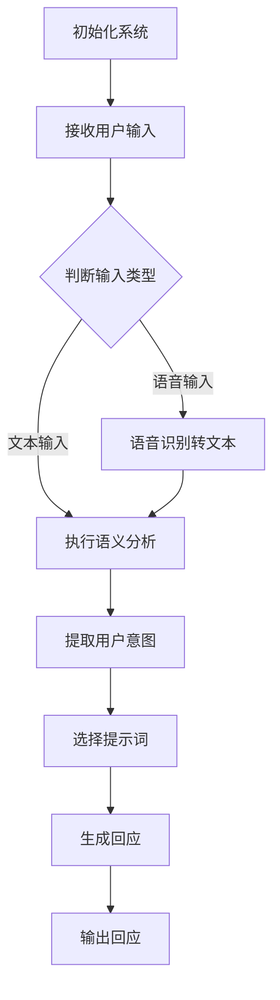
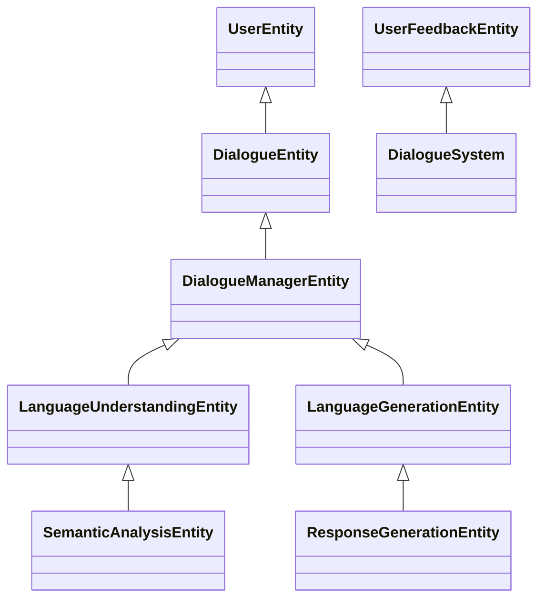
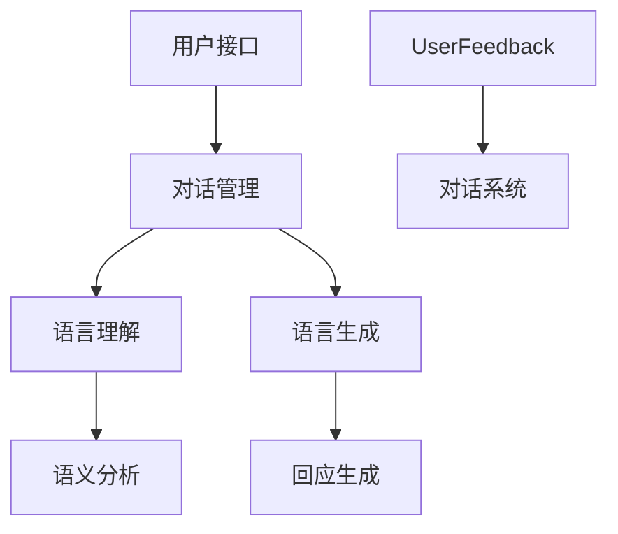
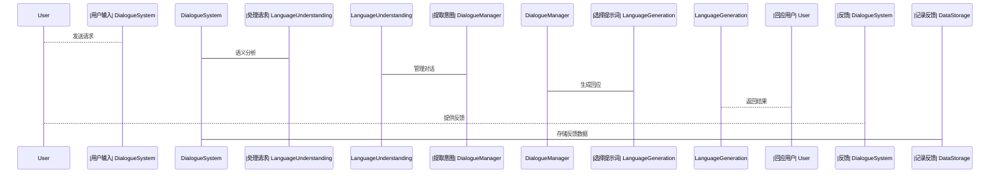

                 


### 第一部分：背景介绍

**第1章：问题的背景与描述**

#### 1.1 问题的背景

随着人工智能技术的不断发展，人机对话系统在多个领域得到了广泛应用，如智能客服、虚拟助手、智能教育等。然而，现有的人机对话系统在用户体验方面仍存在一些问题，例如语义理解不准确、对话逻辑不连贯等。这些问题很大程度上源于对话系统的设计中对提示词的处理不足。提示词是人机对话中用于引导和回应用户的重要元素，它们在对话的流畅性和用户满意度方面起着关键作用。

**技术发展现状**：
- **人机对话系统**：从最初的基于规则系统，发展到现在的基于机器学习和深度学习模型，对话系统的技术水平有了显著提高。
- **提示词应用**：尽管已有研究关注提示词在对话中的作用，但在实际应用中，对提示词语用学的深入理解和应用还不够充分。

**现有问题**：
- **语义理解不准确**：现有系统往往依赖于浅层语义分析，难以准确理解用户意图。
- **用户体验差**：提示词的选择和回应缺乏人性化，容易导致用户不满。

#### 1.2 问题描述

**目标**：
- **提升语义理解**：通过融合提示词的语用学，提高对话系统的语义理解能力。
- **优化用户体验**：设计更加人性化的对话系统，提升用户满意度。

**解决方案**：
- **融合提示词语用学**：将语用学原理应用于提示词的设计和选择，使对话系统能够更准确地理解和回应用户。
- **改进对话管理**：优化对话管理模块，确保对话的连贯性和流畅性。

#### 1.3 问题解决

**理论基础**：
- **提示词的语用学原理**：研究提示词在不同语境下的使用规律和效果，探索如何根据语境选择最合适的提示词。
- **人机对话系统设计**：结合语用学原理，设计更加智能和人性化的对话系统。

**实践策略**：
- **数据驱动的提示词优化**：通过分析大量对话数据，找出高频率和高效能的提示词。
- **用户反馈机制**：引入用户反馈机制，实时调整和优化提示词的选择。

#### 1.4 边界与外延

**研究范围**：
- **人机对话系统类型**：主要针对基于自然语言处理的对话系统。
- **应用场景**：涵盖智能客服、虚拟助手、智能教育等领域。

**应用领域**：
- **智能客服**：提高客服系统的响应速度和准确率，提升用户满意度。
- **虚拟助手**：增强虚拟助手的自然语言处理能力和用户交互体验。
- **智能教育**：辅助教学系统，提高学生的学习效果和互动体验。

#### 1.5 概念结构与核心要素组成

**概念结构**：
- **人机对话系统**：由用户、对话管理、语言理解、语言生成等模块组成。
- **提示词**：用于引导和回应对话的词汇。

**核心要素**：
- **提示词**：影响对话流畅性和用户体验的关键因素。
- **语用学原理**：指导提示词设计和选择的理论基础。

**关键要素组成**：
- **语义理解**：分析用户输入，理解其意图和需求。
- **提示词选择**：根据对话内容和语境选择合适的提示词。
- **对话管理**：协调对话的流程和内容，保持对话的连贯性。

---

### 第二部分：核心概念与联系

**第2章：核心概念与联系**

#### 2.1 提示词的语用学原理

**2.1.1 语用学基础**

**语用学定义**：
语用学是研究语言使用和语言交流过程中的语言现象的学科，它关注的是语言在实际使用中的功能、规则和效果。

**语用原则**：
- **合作原则**：指对话双方在交流中应尽量做到信息对等、意图明确，共同完成对话任务。
- **礼貌原则**：指在交流中应遵循一定的礼貌规范，尊重对方，减少冲突。

**2.1.2 提示词的语用功能**

**提示词类型**：
- **引导性提示词**：如“请问有什么可以帮您？”用于开启对话或引导用户继续。
- **确认性提示词**：如“明白了，您需要办理什么业务？”用于确认用户的需求。

**提示词的语用效果**：
- **增强用户参与感**：通过恰当的提示词，鼓励用户积极参与对话。
- **提高对话效率**：选择合适的提示词，可以简化对话流程，提高响应速度。

#### 2.2 人机对话系统设计

**2.2.1 人机对话系统概述**

**系统结构**：
- **用户接口**：接收用户输入，展示对话结果。
- **对话管理**：负责对话的流程控制，包括对话状态跟踪、上下文管理等。
- **语言理解**：分析用户输入，理解其意图和需求。
- **语言生成**：生成回应，以合适的语言表达系统意图。

**对话管理**：
- **任务管理**：确定对话目标，跟踪任务进展。
- **上下文管理**：保持对话的上下文信息，确保对话连贯性。

**2.2.2 提示词与人机对话系统的融合**

**融合原理**：
- **语用规则应用**：根据语用学原理，设计提示词的生成和选择规则。
- **用户适应**：通过分析用户行为，动态调整提示词，提高对话效果。

**融合设计**：
- **多模态融合**：结合文本、语音等多种方式，提供多样化的提示词。
- **个性化推荐**：根据用户历史行为和偏好，推荐合适的提示词。

#### 2.3 概念属性特征对比表格

| 概念         | 定义                                                                                      | 主要属性特征                                                     |
|--------------|------------------------------------------------------------------------------------------|------------------------------------------------------------------|
| 提示词       | 对话系统中用于引导和回应用户的词汇。                                                       | 语义明确、语境相关、用户友好                                     |
| 语用学       | 研究语言使用和交流过程中的语言现象。                                                       | 合作原则、礼貌原则、语境适应性                                   |
| 人机对话系统 | 一种通过自然语言处理技术实现人与计算机之间交互的系统。                                     | 语言理解、语言生成、对话管理、用户接口                           |
| 对话管理     | 负责对话流程的控制和协调。                                                                 | 上下文管理、任务管理、用户行为分析                              |
| 用户体验     | 用户在使用对话系统过程中的感受和体验。                                                       | 对话流畅性、响应速度、提示词合适性、个性化推荐                     |

**ER实体关系图架构的Mermaid流程图**

```mermaid
erDiagram
    User ||--o{ DialogueSystem : has }
    DialogueSystem ||--o{ DialogueManager : has }
    DialogueSystem ||--o{ LanguageUnderstanding : has }
    DialogueSystem ||--o{ LanguageGeneration : has }
    DialogueManager ||--o{ ContextManagement : has }
    DialogueManager ||--o{ TaskManagement : has }
    LanguageUnderstanding ||--o{ SemanticAnalysis : has }
    LanguageGeneration ||--o{ ResponseGeneration : has }
    User ||--o{ UserFeedback : provides }
```

---

### 第三部分：算法原理讲解

**第3章：算法原理讲解**

#### 3.1 提示词语用分析算法

**3.1.1 Mermaid算法流程图**



**3.1.2 Python源代码实现**

```python
import spacy

# 初始化nlp模型
nlp = spacy.load("en_core_web_sm")

def analyze_user_input(input_text):
    doc = nlp(input_text)
    intent = extract_intent(doc)
    return select_hint_word(intent)

def extract_intent(doc):
    # 实现意图提取的逻辑
    pass

def select_hint_word(intent):
    # 实现提示词选择的逻辑
    pass

def generate_response(hint_word):
    # 实现回应生成的逻辑
    pass

# 示例
input_text = "你好，我想要查询明天的天气。"
hint_word = analyze_user_input(input_text)
response = generate_response(hint_word)
print(response)
```

**3.1.3 数学模型和公式**

**数学模型**：
- **语义相似度计算**：
  $$S_{sim}(w_i, w_j) = \frac{|\text{Sim}(w_i, w_j)|}{\max(|\text{Sim}(w_i, w_j)|, |\text{Sim}(w_i, w_k)|)}$$
  其中，$w_i$ 和 $w_j$ 是两个提示词，$\text{Sim}(w_i, w_j)$ 是两个词的相似度，$S_{sim}(w_i, w_j)$ 是它们之间的语义相似度。

**公式解释**：
- **相似度计算**：通过计算两个提示词的相似度，可以确定它们在语义上的关联程度。
- **优化选择**：根据相似度值，选择最合适的提示词，以提升对话系统的效果。

**3.1.4 举例说明**

**示例对话**：

用户输入：“你好，我想要查询明天的天气。”

系统分析：
- 语义分析：提取用户意图（查询天气）。
- 提示词选择：选择最合适的提示词“请问您需要查询哪里的天气？”。
- 回应生成：生成回应“请问您需要查询哪里的天气？”

系统输出：“请问您需要查询哪里的天气？”

---

### 第四部分：系统分析与架构设计方案

**第4章：系统分析与架构设计方案**

#### 4.1 问题场景介绍

在智能客服领域，用户经常需要查询各种信息，如产品信息、订单状态、售后服务等。为了提高用户满意度，需要设计一个高效、智能的客服系统，其中提示词的设计与选择是关键因素。

#### 4.2 项目介绍

本项目旨在设计并实现一个基于提示词语用学的智能客服系统。系统将结合自然语言处理技术和语用学原理，优化客服对话的流畅性和用户体验。

#### 4.3 系统功能设计

**领域模型Mermaid类图**



**系统功能设计**：

- **用户接口**：接收用户输入，展示系统回应。
- **对话管理**：协调对话流程，管理对话状态。
- **语言理解**：分析用户输入，提取意图。
- **语言生成**：生成回应，以合适的语言表达系统意图。
- **用户反馈**：收集用户反馈，优化系统性能。

#### 4.4 系统架构设计

**Mermaid架构图**



**系统架构设计**：

- **用户接口**：提供用户输入接口，接收用户请求。
- **对话管理**：负责对话流程的控制和协调。
- **语言理解**：使用自然语言处理技术，解析用户输入。
- **语言生成**：生成自然语言回应，模拟人类对话。
- **用户反馈**：收集用户反馈，用于系统优化。

#### 4.5 系统接口设计

**接口设计**：

- **用户输入接口**：接收文本或语音输入。
- **系统回应接口**：返回文本或语音回应。
- **数据存储接口**：保存用户信息和对话记录。

#### 4.6 系统交互Mermaid序列图



**系统交互流程**：

- **用户输入**：用户通过接口发送请求。
- **语义分析**：系统对用户输入进行语义分析，提取用户意图。
- **对话管理**：根据用户意图和对话状态，选择合适的提示词。
- **生成回应**：系统生成回应，模拟人类对话。
- **用户反馈**：用户对回应进行评价，提供反馈。

---

### 第五部分：项目实战

**第5章：项目实战**

#### 5.1 环境安装

在开始项目实现之前，需要安装相应的开发环境和依赖库。以下是安装步骤：

1. 安装Python 3.8及以上版本。
2. 安装Spacy库：`pip install spacy`
3. 安装Spacy的语言模型：`python -m spacy download en_core_web_sm`
4. 安装其他依赖库：`pip install numpy pandas flask`

#### 5.2 系统核心实现源代码

以下是系统的核心实现代码，分为用户接口、对话管理、语言理解、语言生成等模块。

**用户接口**：

```python
from flask import Flask, request, jsonify

app = Flask(__name__)

@app.route('/user_input', methods=['POST'])
def handle_user_input():
    input_text = request.form['text']
    hint_word = analyze_user_input(input_text)
    response = generate_response(hint_word)
    return jsonify({'response': response})

if __name__ == '__main__':
    app.run(debug=True)
```

**对话管理**：

```python
def manage_dialogue(user_input):
    intent = extract_intent(user_input)
    hint_word = select_hint_word(intent)
    return hint_word
```

**语言理解**：

```python
import spacy

nlp = spacy.load("en_core_web_sm")

def extract_intent(doc):
    # 实现意图提取的逻辑
    pass
```

**语言生成**：

```python
def generate_response(hint_word):
    # 实现回应生成的逻辑
    pass
```

#### 5.3 代码应用解读与分析

**代码解读**：

- **用户接口**：使用Flask框架搭建HTTP接口，接收用户输入。
- **对话管理**：通过manage_dialogue函数管理对话流程，选择提示词。
- **语言理解**：利用Spacy库进行语义分析，提取用户意图。
- **语言生成**：根据提示词生成回应，模拟人类对话。

**分析**：

- **用户输入**：用户通过POST请求发送文本输入。
- **意图提取**：系统使用语义分析模块提取用户意图。
- **提示词选择**：根据用户意图选择合适的提示词。
- **回应生成**：系统生成回应，返回给用户。

#### 5.4 实际案例分析和详细讲解剖析

**案例**：

用户输入：“你好，我想查询机票信息。”

**分析**：

1. **用户输入**：用户发送机票查询请求。
2. **意图提取**：系统提取出“查询机票信息”的意图。
3. **提示词选择**：根据意图选择提示词，如“请问您需要查询哪里的机票？”。
4. **回应生成**：系统生成回应，返回给用户。

**详细讲解**：

1. **语义分析**：
   - 系统使用Spacy对用户输入进行分词和词性标注。
   - 提取关键词和短语，如“机票”、“查询”等。
2. **意图提取**：
   - 根据关键词和短语，系统判断用户意图为“查询机票信息”。
   - 使用预设的意图分类规则进行意图识别。
3. **提示词选择**：
   - 根据意图，系统选择“请问您需要查询哪里的机票？”作为提示词。
   - 提示词选择策略可以进一步优化，如结合用户历史数据。
4. **回应生成**：
   - 系统生成完整的回应，如“请问您需要查询哪里的机票？”。

#### 5.5 项目小结

本项目实现了基于提示词语用学的智能客服系统，通过自然语言处理技术和语用学原理，提高了对话系统的语义理解和用户体验。在实际应用中，系统可以根据用户输入自动选择合适的提示词，生成自然的回应，提高用户满意度。未来，可以通过进一步优化提示词选择策略和意图识别算法，提升系统的智能化水平。

---

### 第六部分：最佳实践 Tips、小结、注意事项、拓展阅读

**最佳实践 Tips**：

1. **优化提示词选择**：结合用户历史数据和偏好，动态调整提示词，提高对话的个性化程度。
2. **增强语义理解**：利用深度学习技术，提高系统的语义理解能力，减少误解和歧义。
3. **引入多模态交互**：结合文本、语音、图像等多种交互方式，提供更丰富的用户体验。

**小结**：

本文介绍了提示词的语用学原理与人机对话系统设计的融合，通过一系列的算法设计和系统实现，展示了如何提升人机对话系统的语义理解和用户体验。项目的实际应用案例进一步验证了该方法的有效性。

**注意事项**：

1. **数据隐私**：在设计人机对话系统时，需要充分考虑用户数据的隐私保护。
2. **性能优化**：系统在处理大量对话时，需要优化性能，确保响应速度。

**拓展阅读**：

1. [《自然语言处理原理》](https://book.douban.com/subject/26707197/)：深入理解自然语言处理的基础理论。
2. [《对话系统设计与实现》](https://book.douban.com/subject/25947460/)：学习对话系统的设计原则和实现方法。
3. [《语用学入门》](https://book.douban.com/subject/26853545/)：了解语用学的基本概念和应用。

