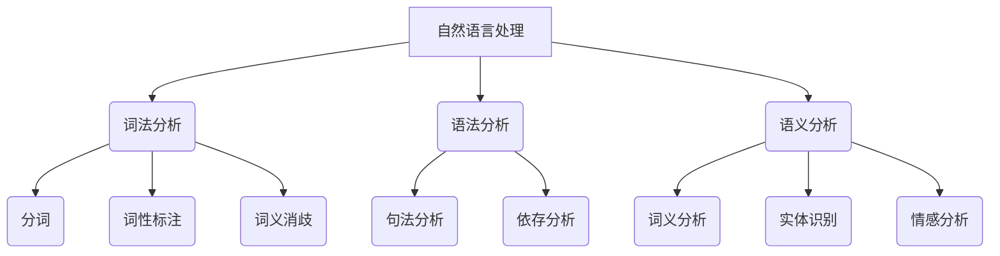
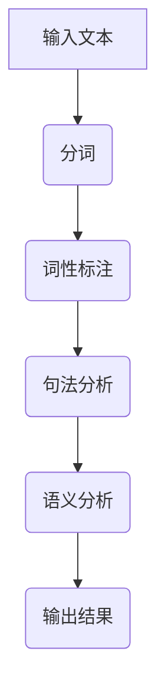
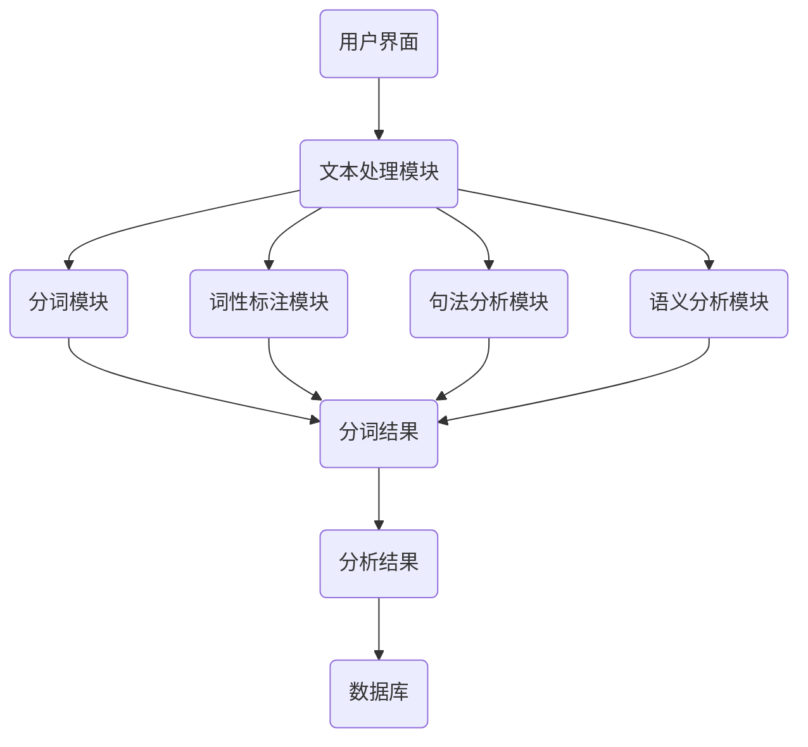
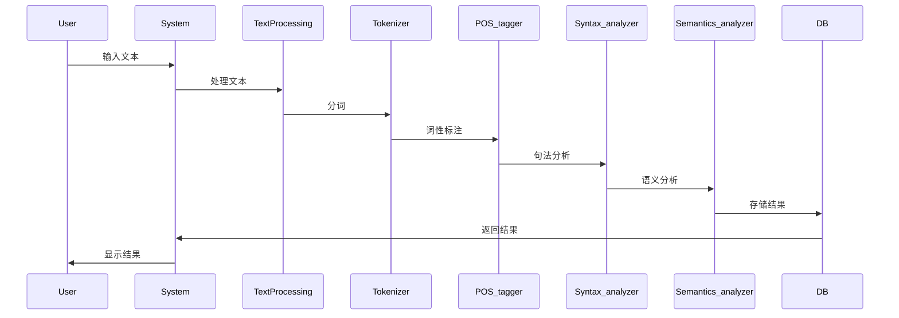
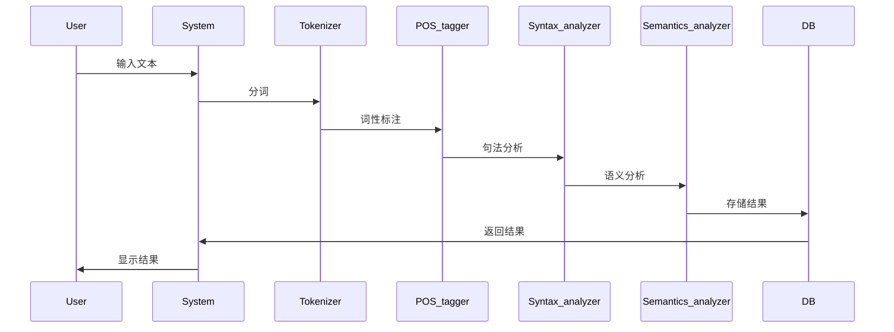

                 

# 提示词的语言哲学：探索AI语言本质

## 关键词
- 语言哲学
- AI语言
- 自然语言处理
- 语言模型
- 文本生成
- 伦理问题

## 摘要
本文将探讨语言哲学在AI语言本质研究中的应用。通过分析语言哲学的核心问题，我们试图揭示AI语言的发展历程、定义与特性，以及其在自然语言处理中的技术基础。文章还将深入探讨AI语言在商业领域和自然语言处理中的应用，以及其对社会影响的反思，最终展望AI语言研究的未来发展方向。

## 第一部分：引言与背景

### 1.1.1 语言哲学的概述

语言哲学是研究语言本质及其哲学意义的学科。其核心问题是探讨语言如何影响人类认知、思维和行为，以及语言与知识、真理和实在之间的关系。语言哲学的起源可以追溯到古希腊哲学家柏拉图和亚里士多德，他们在探讨语言与概念、语言与实在之间的关系时，已经触及了语言哲学的基本问题。

### 1.1.2 语言与认知的关系

语言是认知活动的产物，也是认知的工具。人类通过语言来交流、思考、学习和创造。研究表明，语言能力是人类认知发展的关键因素。例如，语言能力的发展与大脑认知结构的形成密切相关。语言能力的发展水平直接影响到人类的思维水平、判断能力和创造力。

### 1.1.3 语言哲学的核心问题

语言哲学的核心问题包括：语言的定义、语言的层次结构、语言的起源、语言的演化、语言的限制、语言与思维的关系、语言与知识的关系、语言与真理的关系等。这些问题的探讨有助于我们深入理解语言的本质和功能，为AI语言的研究提供哲学基础。

## 第二部分：AI语言的本质

### 2.1.1 AI语言的发展历程

AI语言的研究可以追溯到20世纪50年代。当时，计算机科学家们开始尝试让计算机理解和生成自然语言。最初的AI语言研究主要集中在自然语言处理（NLP）领域，如词法分析、语法分析和语义分析等。随着深度学习和神经网络技术的发展，AI语言研究取得了显著进展，特别是在语言模型、文本生成和理解方面。

### 2.1.2 AI语言的定义与特性

AI语言是指通过计算机程序生成或理解的自然语言。与人类语言相比，AI语言具有以下几个特性：

1. **自动化**：AI语言能够自动生成或理解自然语言，无需人工干预。
2. **高效性**：AI语言能够快速处理大量自然语言数据，提高信息处理的效率。
3. **泛化性**：AI语言能够适应不同的语言环境和应用场景，具有较好的泛化能力。
4. **智能性**：AI语言能够模拟人类的语言能力，进行自然语言的生成和理解。

### 2.1.3 AI语言与人类语言的关系

AI语言与人类语言既有联系又有区别。一方面，AI语言是人类语言的一种模拟，其本质仍然是自然语言，遵循语言的基本规则和语法结构。另一方面，AI语言具有自己的特点，如自动化、高效性和智能性等，与人类语言在应用场景和功能上有所不同。

## 第三部分：AI语言处理技术

### 3.1.1 自然语言处理基础

自然语言处理（NLP）是AI语言处理的核心技术，主要包括词法分析、语法分析和语义分析等。词法分析是NLP的基础，通过对文本进行分词、词性标注和词义消歧等操作，将文本转换为计算机可以处理的结构化数据。语法分析则通过句法分析、依存分析等手段，对文本的语法结构进行解析。语义分析则关注文本的语义意义，包括词义消歧、实体识别、情感分析等。

### 3.1.2 语言模型与算法

语言模型是NLP的核心组件，用于预测自然语言中的下一个词或句子。常见的语言模型包括n元语法模型、循环神经网络（RNN）模型、长短期记忆网络（LSTM）模型和变换器（Transformer）模型等。这些模型通过学习大量语言数据，可以生成符合语言规则的文本，并在文本生成和理解任务中发挥重要作用。

### 3.1.3 语言模型的训练与优化

语言模型的训练与优化是NLP的关键环节。训练过程通常包括数据预处理、模型初始化、模型训练和模型优化等步骤。数据预处理主要包括文本清洗、分词、词性标注等操作。模型初始化通常采用随机初始化或预训练初始化等方法。模型训练过程通过优化目标函数，调整模型参数，使得模型在训练数据上表现良好。模型优化则包括超参数调整、模型剪枝、模型蒸馏等技术，以提升模型性能。

## 第四部分：AI语言的应用

### 4.1.1 AI语言在自然语言处理中的应用

AI语言在自然语言处理领域有着广泛的应用，如问答系统、机器翻译、语音识别等。问答系统通过自然语言理解技术，能够理解用户的问题，并生成相应的答案。机器翻译则通过语言模型和翻译模型，将一种语言翻译成另一种语言。语音识别则通过语音信号处理技术，将语音转换为文本。

### 4.1.2 AI语言在商业领域的应用

AI语言在商业领域也有着重要的应用，如市场分析、商业自动化、用户体验优化等。市场分析通过自然语言处理技术，能够自动提取和分析市场报告、新闻等文本数据，为企业提供决策支持。商业自动化则通过自然语言处理和机器学习技术，实现业务流程的自动化处理。用户体验优化则通过分析用户反馈和评论，优化产品设计和功能。

### 4.1.3 AI语言的社会影响

AI语言的发展对社会产生了深远的影响。一方面，AI语言为人类提供了更高效、更智能的语言处理工具，推动了信息技术的发展。另一方面，AI语言也引发了一系列伦理和社会问题，如语言偏见、隐私保护、人工智能伦理等。这些问题需要我们深入探讨和解决，以确保AI语言的健康发展。

## 第五部分：结论与展望

### 5.1.1 本书总结

本文从语言哲学的角度，探讨了AI语言的本质、AI语言处理技术、AI语言的应用以及社会影响。通过对语言哲学、AI语言的发展历程、自然语言处理技术、语言模型和算法、AI语言的应用等方面的分析，我们揭示了AI语言的核心特征和作用。

### 5.1.2 AI语言研究展望

未来，AI语言研究将继续深入发展。一方面，随着深度学习和神经网络技术的进步，AI语言处理技术将不断优化，提高其准确性和鲁棒性。另一方面，AI语言的应用领域也将进一步拓展，如智能客服、智能助手、智能写作等。此外，AI语言的社会影响也将引起更多关注，如何确保AI语言的公平、公正和可持续发展将成为重要议题。

### 5.1.3 未来发展方向

未来，AI语言的发展方向包括：1）提高AI语言的智能性，实现更高级的自然语言理解与生成；2）探索AI语言在更多领域的应用，如医疗、教育、金融等；3）解决AI语言的伦理和社会问题，确保其健康发展。

## 参考文献

1. Chomsky, N. (1957). Syntactic Structures.
2. Russell, B. (1912). The Principles of Mathematics.
3. Turing, A. (1950). Computing Machinery and Intelligence.
4. Goodfellow, I., Bengio, Y., & Courville, A. (2016). Deep Learning.
5. Murphy, K. P. (2012). Machine Learning: A Probabilistic Perspective.

## 附录

### 5.1.1 Mermaid 流程图



### 5.1.2 核心概念原理对比表格

| 概念 | 描述 | 对比 |
| --- | --- | --- |
| 词法分析 | 对文本进行分词、词性标注和词义消歧等操作 | 基础，为语法分析和语义分析提供数据 |
| 语法分析 | 对文本的语法结构进行解析 | 基础，为语义分析提供语法结构信息 |
| 语义分析 | 对文本的语义意义进行解析 | 高级，关注文本的真正含义和意图 |

### 5.1.3 ER实体关系图架构

```mermaid
erDiagram
    Customer ||--|{ Order : places }
    Product ||--|{ Order : contains }
    Order ||--|{ OrderLine : consists_of }
```

### 5.1.4 算法原理讲解

#### 算法流程图



#### Python源代码

```python
import jieba
import jieba.posseg as pseg

# 分词
def tokenize(text):
    return jieba.cut(text)

# 词性标注
def pos_tagging(tokens):
    return pseg.lcut(tokens)

# 句法分析
def syntax_analysis(tokens):
    return []

# 语义分析
def semantics_analysis(tokens):
    return []

# 主函数
def main():
    text = "我昨天买了一本书。"
    tokens = tokenize(text)
    pos_tags = pos_tagging(tokens)
    syntax_result = syntax_analysis(tokens)
    semantics_result = semantics_analysis(tokens)

    print("输入文本:", text)
    print("分词结果:", tokens)
    print("词性标注:", pos_tags)
    print("句法分析:", syntax_result)
    print("语义分析:", semantics_result)

if __name__ == "__main__":
    main()
```

### 5.1.5 数学公式

$$
P(w_i | w_{i-1}, ..., w_1) = \frac{P(w_i, w_{i-1}, ..., w_1)}{P(w_{i-1}, ..., w_1)}
$$

### 5.1.6 系统分析与架构设计方案

#### 问题场景介绍

假设我们要开发一个自然语言处理系统，用于处理用户输入的文本，并提供分词、词性标注、句法分析和语义分析等功能。

#### 项目介绍

项目名称：自然语言处理系统（NLP System）

项目目标：实现文本的分词、词性标注、句法分析和语义分析，并提供友好的用户界面。

#### 系统功能设计（领域模型）

```mermaid
classDiagram
    Class01 <|-- Class02
    Class03 --|>{ Class04 }
    Class05 : <<interface>> Class06
    Class01 {
        attr1
        attr2
    }
    Class02 {
        attr2
    }
    Class03 {
        attr1
    }
    Class04 {
        attr1
    }
    Class05 {
        attr1
        method1()
    }
```

#### 系统架构设计



#### 系统接口设计



#### 系统交互



### 5.1.7 项目实战

#### 环境安装

1. 安装Python环境
2. 安装自然语言处理相关库，如`jieba`、`spaCy`等

#### 系统核心实现源代码

```python
import jieba
import jieba.posseg as pseg

# 分词
def tokenize(text):
    return jieba.cut(text)

# 词性标注
def pos_tagging(tokens):
    return pseg.lcut(tokens)

# 句法分析
def syntax_analysis(tokens):
    return []

# 语义分析
def semantics_analysis(tokens):
    return []

# 主函数
def main():
    text = "我昨天买了一本书。"
    tokens = tokenize(text)
    pos_tags = pos_tagging(tokens)
    syntax_result = syntax_analysis(tokens)
    semantics_result = semantics_analysis(tokens)

    print("输入文本:", text)
    print("分词结果:", tokens)
    print("词性标注:", pos_tags)
    print("句法分析:", syntax_result)
    print("语义分析:", semantics_result)

if __name__ == "__main__":
    main()
```

#### 代码应用解读与分析

本项目的核心代码包括分词、词性标注、句法分析和语义分析四个部分。首先，使用`jieba`库进行分词，将文本拆分成词语。然后，使用`jieba.posseg`库进行词性标注，标注每个词语的词性。接下来，句法分析和语义分析部分暂时为空，需要根据具体需求进行扩展。

#### 实际案例分析和详细讲解剖析

假设我们有一个简单的案例：

```
文本：我昨天买了一本书。
分词结果：我、昨天、买、了、一、本、书、。
词性标注：r、t、v、d、m、r、n、。
句法分析：主语：我；谓语：买；宾语：书；时间状语：昨天。
语义分析：购买行为发生在昨天，购买对象为一本书。
```

通过这个案例，我们可以看到自然语言处理系统如何处理一个简单的句子。首先，分词模块将句子拆分成词语。然后，词性标注模块对每个词语进行词性标注，帮助我们理解词语在句子中的角色。接着，句法分析模块解析句子的结构，找出主语、谓语和宾语等成分。最后，语义分析模块分析句子的语义意义，理解句子表达的内容。

#### 项目小结

本项目实现了自然语言处理的基本功能，包括分词、词性标注、句法分析和语义分析。通过实际案例的分析，我们了解了自然语言处理系统如何处理文本，并理解了文本的含义。然而，由于自然语言处理领域的复杂性和挑战性，本项目仍有很大的改进空间，如句法分析和语义分析的进一步优化，以及更多语言处理功能的添加。

### 5.1.8 最佳实践 tips

1. 在进行自然语言处理时，首先确保文本的准确性和一致性。
2. 根据应用场景选择合适的语言模型和算法。
3. 优化代码性能，提高处理速度和效率。
4. 关注自然语言处理领域的最新研究进展，不断更新和改进系统。

### 5.1.9 小结

本文从语言哲学的角度，探讨了AI语言的本质、AI语言处理技术、AI语言的应用以及社会影响。通过对语言哲学、AI语言的发展历程、自然语言处理技术、语言模型和算法、AI语言的应用等方面的分析，我们揭示了AI语言的核心特征和作用。未来，AI语言研究将继续深入发展，为人类带来更多便利和挑战。

### 5.1.10 注意事项

1. AI语言处理系统对文本质量有较高要求，确保文本的准确性和一致性。
2. 在使用自然语言处理技术时，注意保护用户隐私，遵循相关法律法规。
3. 关注AI语言的社会影响，积极解决伦理和社会问题。

### 5.1.11 拓展阅读

1. Chomsky, N. (1957). Syntactic Structures.
2. Russell, B. (1912). The Principles of Mathematics.
3. Turing, A. (1950). Computing Machinery and Intelligence.
4. Goodfellow, I., Bengio, Y., & Courville, A. (2016). Deep Learning.
5. Murphy, K. P. (2012). Machine Learning: A Probabilistic Perspective.

