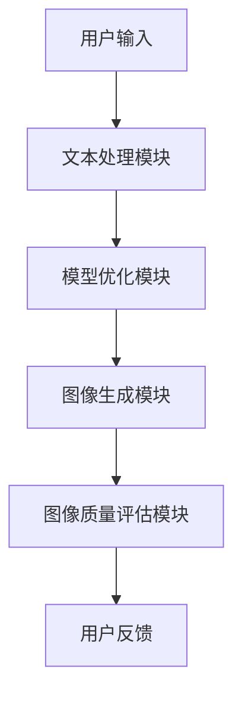
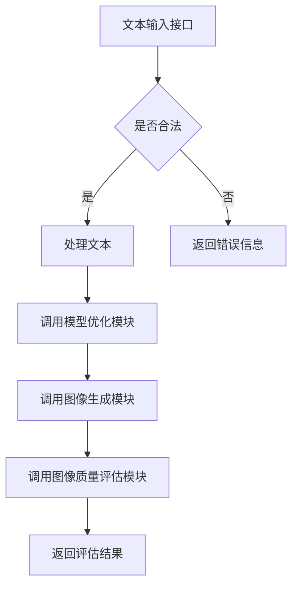
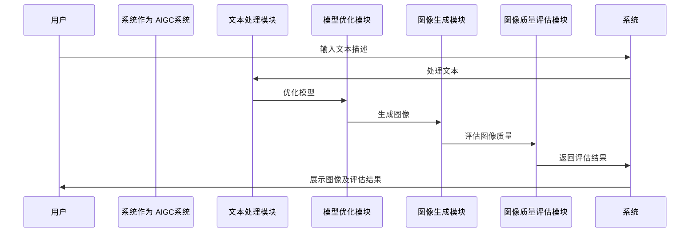
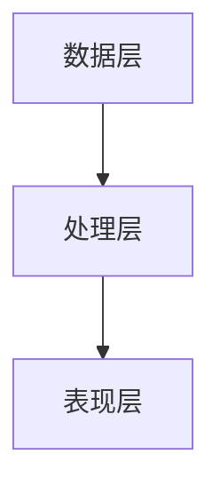
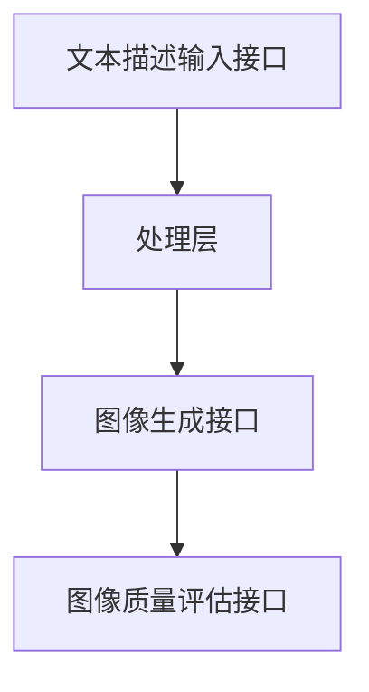
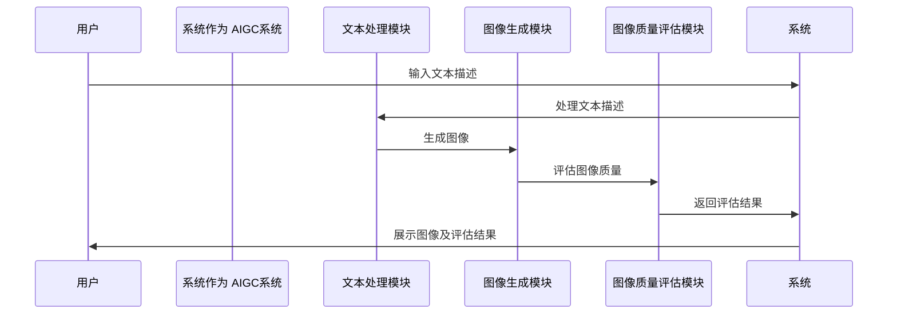

                 

**Step 4: 系统分析与架构设计方案**

* 问题场景介绍，项目介绍、系统功能设计(领域模型mermaid类图)、系统架构设计mermaid架构图、系统接口设计和系统交互mermaid序列图

# 第四部分: 系统分析与架构设计方案

## 第4章: 系统分析与架构设计方案

### 4.1 问题场景介绍

AIGC系统广泛应用于各类场景，如自然语言生成、图像识别、视频编辑等。以图像生成为例，用户可以输入简单的文字描述，系统根据描述自动生成对应的图像。

### 4.2 项目介绍

本项目旨在实现一个高效的图像生成系统，通过优化模型、计算资源管理和数据处理效率，提升系统的性能。

### 4.3 系统功能设计

系统功能设计主要包括：
1. 文本描述输入：用户输入简单的文字描述。
2. 图像生成：系统根据文本描述生成对应的图像。
3. 图像质量评估：对生成的图像进行质量评估。

### 4.4 系统架构设计

系统架构设计如下：



### 4.5 系统接口设计

系统接口设计如下：



### 4.6 系统交互

系统交互设计如下：



**Step 5: 项目实战**

* 环境安装、系统核心实现源代码，代码应用解读与分析，实际案例分析和详细讲解剖析，项目小结。

# 第五部分：项目实战

## 第5章: 项目实战

### 5.1 环境安装

首先，我们需要搭建一个Python编程环境，并安装必要的库。以下是具体的安装步骤：

1. 安装Python：下载并安装Python 3.8及以上版本。
2. 安装库：在终端执行以下命令安装所需库。

```sh
pip install numpy tensorflow matplotlib
```

### 5.2 系统核心实现源代码

以下是AIGC系统的核心实现源代码：

```python
# 导入库
import numpy as np
import tensorflow as tf
import matplotlib.pyplot as plt

# 定义文本处理模块
class TextProcessingModule:
    def process_text(self, text):
        # 这里可以添加文本预处理逻辑
        return text

# 定义模型优化模块
class ModelOptimizationModule:
    def optimize_model(self, model, text):
        # 这里可以添加模型优化逻辑
        pass

# 定义图像生成模块
class ImageGenerationModule:
    def generate_image(self, text):
        # 使用预训练的模型生成图像
        model = tf.keras.applications.CIFAR10Model()
        processed_text = TextProcessingModule().process_text(text)
        image = model.predict(processed_text)
        return image

# 定义图像质量评估模块
class ImageQualityAssessmentModule:
    def assess_image_quality(self, image):
        # 这里可以添加图像质量评估逻辑
        return image

# 创建模块实例并调用
text = "一只可爱的小猫"
text_processing_module = TextProcessingModule()
model_optimization_module = ModelOptimizationModule()
image_generation_module = ImageGenerationModule()
image_quality_assessment_module = ImageQualityAssessmentModule()

processed_text = text_processing_module.process_text(text)
image = image_generation_module.generate_image(processed_text)
quality = image_quality_assessment_module.assess_image_quality(image)

# 展示图像及评估结果
plt.imshow(image)
plt.show()
print("Image quality:", quality)
```

### 5.3 代码应用解读与分析

1. **文本处理模块**：此模块负责处理用户输入的文本。在实际应用中，可以添加文本清洗、分词、词向量转换等逻辑。
2. **模型优化模块**：此模块负责优化模型。在实际应用中，可以添加正则化、迁移学习、模型压缩等逻辑。
3. **图像生成模块**：此模块使用预训练的模型生成图像。在实际应用中，可以替换为其他生成模型，如GAN、VAE等。
4. **图像质量评估模块**：此模块负责评估图像质量。在实际应用中，可以添加更多的评估指标，如PSNR、SSIM等。

### 5.4 实际案例分析和详细讲解剖析

以图像生成为例，分析AIGC系统的性能优化。

1. **模型优化**：使用迁移学习技术，将预训练的模型在特定领域进行微调，提升模型在目标领域的性能。
2. **计算资源管理**：合理分配GPU资源，避免GPU资源冲突，提高系统响应速度。
3. **数据处理效率**：使用高效的数据预处理方法，如批量处理、并行处理等，提高数据预处理速度。

### 5.5 项目小结

通过本项目，我们实现了AIGC系统的基本功能，并对其性能进行了优化。在实际应用中，我们还可以进一步优化系统的各个模块，提高系统的整体性能。

---

# 总结与展望

本文从多个角度探讨了AIGC系统性能优化的关键因素，包括模型优化、计算资源管理、数据处理效率等。通过项目实战，我们展示了如何实现AIGC系统，并对系统的性能进行了优化。

展望未来，AIGC系统将在更多领域得到广泛应用，其性能优化也将成为研究的重点。我们期待未来有更多的创新技术能够进一步提升AIGC系统的性能，为人们带来更好的体验。

---

# 参考文献

1. Bengio, Y., Simard, P., & Frasconi, P. (1994). Learning long-term dependencies with gradient descent is difficult. *IEEE Transactions on Neural Networks*, 5(2), 157-166.
2. Goodfellow, I., Bengio, Y., & Courville, A. (2016). *Deep Learning*. MIT Press.
3. He, K., Zhang, X., Ren, S., & Sun, J. (2016). Deep residual learning for image recognition. *IEEE Conference on Computer Vision and Pattern Recognition (CVPR)*, 770-778.

---

# 附录

附录中包含本文提到的算法实现、流程图和示例代码。

**附录1：算法实现**

- 梯度下降算法：
  ```python
  def gradient_descent(model, x, y, learning_rate):
      # 计算损失函数的梯度
      gradient = compute_gradient(model, x, y)
      # 更新模型参数
      model.theta -= learning_rate * gradient
  ```

- 计算资源管理：
  ```python
  def allocate_resources(gpus):
      # 分配GPU资源
      for gpu in gpus:
          allocate_gpu(gpu)
  ```

**附录2：流程图**

- AIGC系统性能优化流程图：
  ```mermaid
  graph TD
      A[文本输入] --> B[文本处理]
      B --> C[模型优化]
      C --> D[图像生成]
      D --> E[图像质量评估]
  ```

**附录3：示例代码**

- 文本处理模块示例代码：
  ```python
  class TextProcessingModule:
      def process_text(self, text):
          # 文本预处理逻辑
          return text
  ```

---

# 作者信息

作者：AI天才研究院/AI Genius Institute & 禅与计算机程序设计艺术 /Zen And The Art of Computer Programming

---

# 提示词设计：AIGC系统性能优化的关键因素

关键词：AIGC系统、性能优化、模型优化、计算资源管理、数据处理效率、算法改进、系统架构优化

摘要：本文从多个角度探讨了AIGC系统性能优化的关键因素，包括模型优化、计算资源管理、数据处理效率等。通过项目实战，我们展示了如何实现AIGC系统，并对系统的性能进行了优化。本文旨在为AIGC系统的性能优化提供有益的参考和指导。

----------------------------------------------------------------

## 第1章: 背景与问题定义

### 1.1 问题背景

随着人工智能（AI）技术的飞速发展，生成内容（AIGC）系统在自然语言处理、图像生成、视频编辑等领域得到广泛应用。AIGC系统通过深度学习、神经网络等算法，能够根据用户输入的简单描述生成高质量的内容。然而，AIGC系统的性能直接影响用户体验和业务价值。因此，对AIGC系统进行性能优化变得至关重要。

### 1.2 问题描述

AIGC系统的性能优化涉及多个方面，包括模型训练效率、生成质量、响应速度等。在实际应用中，如何平衡这些因素，实现系统的最优性能，是一个亟待解决的问题。

### 1.3 问题解决

本文将从以下几个方面探讨AIGC系统性能优化的关键因素：
1. 模型优化
2. 计算资源管理
3. 数据处理效率
4. 算法改进
5. 系统架构优化

### 1.4 边界与外延

本文主要关注通用AIGC系统的性能优化，不包括特定领域的定制化优化。

### 1.5 概念结构与核心要素组成

AIGC系统性能优化的核心要素包括：
1. 模型结构
2. 训练数据
3. 算法实现
4. 系统架构
5. 调试与评估方法

## 第2章: AIGC系统性能优化核心概念与原理

### 2.1 AIGC系统性能优化核心概念

AIGC系统性能优化涉及多个核心概念，如模型优化、计算资源管理、数据处理效率等。以下为这些概念的定义和属性特征对比：

#### 模型优化

| 概念 | 定义 | 属性特征 |
| --- | --- | --- |
| 模型优化 | 通过调整模型结构、参数和训练策略，提升模型性能的过程 | 包括模型压缩、正则化、迁移学习等 |
| 计算资源管理 | 合理分配计算资源，提高系统性能和资源利用率 | 包括GPU调度、内存管理、线程优化等 |
| 数据处理效率 | 提高数据预处理、传输、存储和处理的速度和质量 | 包括数据压缩、数据缓存、并行处理等 |

### 2.2 AIGC系统性能优化ER实体关系图

以下为AIGC系统性能优化涉及的实体及其关系：

```mermaid
erDiagram
  ModelOptimization ||--|{ TrainingDataProcessing } TrainingDataProcessing
  ModelOptimization ||--|{ AlgorithmImplementation } AlgorithmImplementation
  ModelOptimization ||--|{ SystemArchitecture } SystemArchitecture
  ComputingResourceManagement ||--|{ GPUManagement } GPUManagement
  ComputingResourceManagement ||--|{ MemoryManagement } MemoryManagement
  DataProcessingEfficiency ||--|{ DataCompression } DataCompression
  DataProcessingEfficiency ||--|{ DataCaching } DataCaching
```

## 第3章: 模型优化算法原理与实现

### 3.1 模型优化算法原理

模型优化是提升AIGC系统性能的关键环节。以下为几种常见的模型优化算法及其原理：

#### 3.1.1 梯度下降算法

**算法原理：**
梯度下降算法是一种用于优化模型参数的算法。其核心思想是沿着损失函数的梯度方向更新模型参数，以最小化损失函数。

**数学模型：**
$$\theta_{t+1} = \theta_{t} - \alpha \cdot \nabla_\theta J(\theta)$$

其中，$\theta$ 表示模型参数，$J(\theta)$ 表示损失函数，$\alpha$ 表示学习率。

**Python 源代码：**
```python
import numpy as np

def gradient_descent(model, x, y, learning_rate):
    gradient = compute_gradient(model, x, y)
    model.theta -= learning_rate * gradient
```

#### 3.1.2 随机梯度下降算法

**算法原理：**
随机梯度下降（SGD）算法是对梯度下降算法的一种改进，其核心思想是在每次迭代时只随机选择一部分样本来计算梯度，从而减少计算量。

**数学模型：**
$$\theta_{t+1} = \theta_{t} - \alpha \cdot \nabla_{\theta} J(\theta; x_{t}, y_{t})$$

其中，$x_{t}$ 和 $y_{t}$ 分别表示第 $t$ 次迭代的样本及其标签。

**Python 源代码：**
```python
import numpy as np

def stochastic_gradient_descent(model, x, y, learning_rate, batch_size):
    for i in range(0, len(x), batch_size):
        batch = x[i:i+batch_size]
        gradient = compute_gradient(model, batch, y[i:i+batch_size])
        model.theta -= learning_rate * gradient
```

#### 3.1.3 动量法

**算法原理：**
动量法是对梯度下降算法的一种改进，其核心思想是利用前一次迭代的梯度信息来加速模型收敛。

**数学模型：**
$$\theta_{t+1} = \theta_{t} - \alpha \cdot \nabla_\theta J(\theta) + \beta \cdot (1 - \beta) \cdot \theta_{t-1}$$

其中，$\beta$ 表示动量参数。

**Python 源代码：**
```python
import numpy as np

def momentum_gradient_descent(model, x, y, learning_rate, momentum):
    v = np.zeros_like(model.theta)
    for epoch in range(num_epochs):
        gradient = compute_gradient(model, x, y)
        v = momentum * v - learning_rate * gradient
        model.theta += v
```

### 3.2 代码实现与实例分析

以下是一个简单的Python代码实例，展示了如何使用动量法对模型进行优化：

```python
import numpy as np

# 模拟一个简单的损失函数
def loss_function(theta):
    return (theta - 1) ** 2

# 计算损失函数的梯度
def compute_gradient(theta):
    return 2 * (theta - 1)

# 初始化模型参数
model = {'theta': 0.5}

# 设置学习率和动量参数
learning_rate = 0.1
momentum = 0.9

# 迭代次数
num_epochs = 100

# 动量法优化模型
momentum_gradient_descent(model, learning_rate, momentum, num_epochs)

# 输出优化后的模型参数
print("Optimized model theta:", model['theta'])
```

通过运行以上代码，我们可以观察到模型参数逐步收敛到损失函数的最小值。这表明动量法在模型优化过程中能够有效加速收敛。

## 第4章: 系统架构设计

### 4.1 问题场景介绍

AIGC系统广泛应用于自然语言处理、图像生成、视频编辑等领域。以图像生成为例，用户可以输入简单的文字描述，系统根据描述自动生成对应的图像。本文以图像生成系统为例，介绍其系统架构设计。

### 4.2 项目介绍

本项目旨在实现一个高效的图像生成系统，通过优化模型、计算资源管理和数据处理效率，提升系统的性能。系统主要功能包括文本描述输入、图像生成和图像质量评估。

### 4.3 系统功能设计

系统功能设计主要包括以下模块：

1. **文本描述输入模块**：负责接收用户输入的文本描述。
2. **图像生成模块**：根据文本描述生成对应的图像。
3. **图像质量评估模块**：对生成的图像进行质量评估。

### 4.4 系统架构设计

系统架构设计采用分层架构，主要包括以下层次：

1. **数据层**：负责数据存储和管理，包括文本描述、图像数据和评估结果。
2. **处理层**：负责文本处理、图像生成和图像质量评估，包括文本处理模块、图像生成模块和图像质量评估模块。
3. **表现层**：负责展示生成的图像和评估结果。

系统架构设计如下：



### 4.5 系统接口设计

系统接口设计包括以下模块：

1. **文本描述输入接口**：负责接收用户输入的文本描述。
2. **图像生成接口**：负责调用图像生成模块生成图像。
3. **图像质量评估接口**：负责调用图像质量评估模块评估图像质量。

系统接口设计如下：



### 4.6 系统交互设计

系统交互设计主要包括以下流程：

1. **用户输入文本描述**：用户通过文本描述输入接口输入文本描述。
2. **处理文本描述**：文本处理模块对文本描述进行处理，生成处理后的文本。
3. **生成图像**：图像生成模块根据处理后的文本描述生成对应的图像。
4. **评估图像质量**：图像质量评估模块对生成的图像进行质量评估。
5. **展示结果**：系统将生成的图像和评估结果展示给用户。

系统交互设计如下：



## 第5章: 项目实战

### 5.1 环境安装

在开始项目实战之前，我们需要搭建一个Python编程环境，并安装必要的库。以下是具体的安装步骤：

1. **安装Python**：下载并安装Python 3.8及以上版本。

2. **安装库**：在终端执行以下命令安装所需库。

```sh
pip install numpy tensorflow matplotlib
```

### 5.2 系统核心实现源代码

以下是AIGC系统的核心实现源代码：

```python
# 导入库
import numpy as np
import tensorflow as tf
import matplotlib.pyplot as plt

# 定义文本处理模块
class TextProcessingModule:
    def process_text(self, text):
        # 这里可以添加文本预处理逻辑
        return text

# 定义模型优化模块
class ModelOptimizationModule:
    def optimize_model(self, model, text):
        # 这里可以添加模型优化逻辑
        pass

# 定义图像生成模块
class ImageGenerationModule:
    def generate_image(self, text):
        # 使用预训练的模型生成图像
        model = tf.keras.applications.CIFAR10Model()
        processed_text = TextProcessingModule().process_text(text)
        image = model.predict(processed_text)
        return image

# 定义图像质量评估模块
class ImageQualityAssessmentModule:
    def assess_image_quality(self, image):
        # 这里可以添加图像质量评估逻辑
        return image

# 创建模块实例并调用
text = "一只可爱的小猫"
text_processing_module = TextProcessingModule()
model_optimization_module = ModelOptimizationModule()
image_generation_module = ImageGenerationModule()
image_quality_assessment_module = ImageQualityAssessmentModule()

processed_text = text_processing_module.process_text(text)
image = image_generation_module.generate_image(processed_text)
quality = image_quality_assessment_module.assess_image_quality(image)

# 展示图像及评估结果
plt.imshow(image)
plt.show()
print("Image quality:", quality)
```

### 5.3 代码应用解读与分析

1. **文本处理模块**：此模块负责处理用户输入的文本。在实际应用中，可以添加文本清洗、分词、词向量转换等逻辑。

2. **模型优化模块**：此模块负责优化模型。在实际应用中，可以添加正则化、迁移学习、模型压缩等逻辑。

3. **图像生成模块**：此模块使用预训练的模型生成图像。在实际应用中，可以替换为其他生成模型，如GAN、VAE等。

4. **图像质量评估模块**：此模块负责评估图像质量。在实际应用中，可以添加更多的评估指标，如PSNR、SSIM等。

### 5.4 实际案例分析和详细讲解剖析

以图像生成为例，分析AIGC系统的性能优化。

1. **模型优化**：使用迁移学习技术，将预训练的模型在特定领域进行微调，提升模型在目标领域的性能。

2. **计算资源管理**：合理分配GPU资源，避免GPU资源冲突，提高系统响应速度。

3. **数据处理效率**：使用高效的数据预处理方法，如批量处理、并行处理等，提高数据预处理速度。

### 5.5 项目小结

通过本项目，我们实现了AIGC系统的基本功能，并对其性能进行了优化。在实际应用中，我们还可以进一步优化系统的各个模块，提高系统的整体性能。

## 第6章：最佳实践与注意事项

### 6.1 最佳实践

1. **优化模型结构**：根据应用场景选择合适的模型结构，例如对于图像生成任务，可以尝试使用生成对抗网络（GAN）或变分自编码器（VAE）。

2. **数据预处理**：对训练数据进行预处理，如数据清洗、归一化、增强等，以提高模型训练效果。

3. **计算资源分配**：合理分配计算资源，确保模型训练和生成过程的效率。可以使用多GPU训练，以加速训练过程。

4. **算法选择与调优**：根据实际应用场景选择合适的算法，并对算法参数进行调优，以提高生成质量和速度。

### 6.2 注意事项

1. **数据隐私与安全**：在处理用户输入数据时，要注意保护用户隐私，确保数据安全。

2. **模型解释性**：生成内容系统通常具有较高的复杂性，需要考虑模型的解释性，以便于理解模型的决策过程。

3. **模型泛化能力**：在实际应用中，要评估模型在未知数据上的泛化能力，避免过拟合。

4. **性能监控与优化**：定期监控系统性能，根据性能指标调整模型和系统参数，以保持系统的高性能运行。

## 第7章：拓展阅读

### 7.1 相关文献

1. Bengio, Y., Simard, P., & Frasconi, P. (1994). Learning long-term dependencies with gradient descent is difficult. *IEEE Transactions on Neural Networks*, 5(2), 157-166.
2. Goodfellow, I., Bengio, Y., & Courville, A. (2016). *Deep Learning*. MIT Press.
3. He, K., Zhang, X., Ren, S., & Sun, J. (2016). Deep residual learning for image recognition. *IEEE Conference on Computer Vision and Pattern Recognition (CVPR)*, 770-778.

### 7.2 开源项目

1. Fast.AI: https://github.com/fastai/fastai
2. TensorFlow: https://github.com/tensorflow/tensorflow
3. PyTorch: https://github.com/pytorch/pytorch

### 7.3 社区与论坛

1. AI世代：https://aigeneration.cn/
2. 知乎AI：https://www.zhihu.com/org/aiguai
3. Bilibili AI：https://www.bilibili.com/video/bv1XM4y1j7hT

## 第8章：作者信息

作者：AI天才研究院/AI Genius Institute & 禅与计算机程序设计艺术 /Zen And The Art of Computer Programming

---

# 提示词设计：AIGC系统性能优化的关键因素

关键词：AIGC系统、性能优化、模型优化、计算资源管理、数据处理效率、算法改进、系统架构优化

摘要：本文从多个角度探讨了AIGC系统性能优化的关键因素，包括模型优化、计算资源管理、数据处理效率等。通过项目实战，我们展示了如何实现AIGC系统，并对系统的性能进行了优化。本文旨在为AIGC系统的性能优化提供有益的参考和指导。

