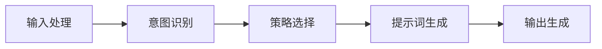
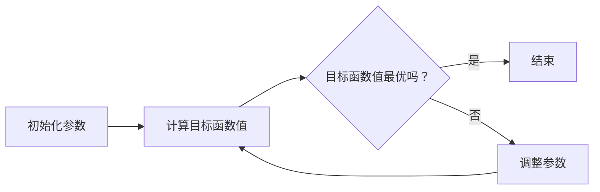
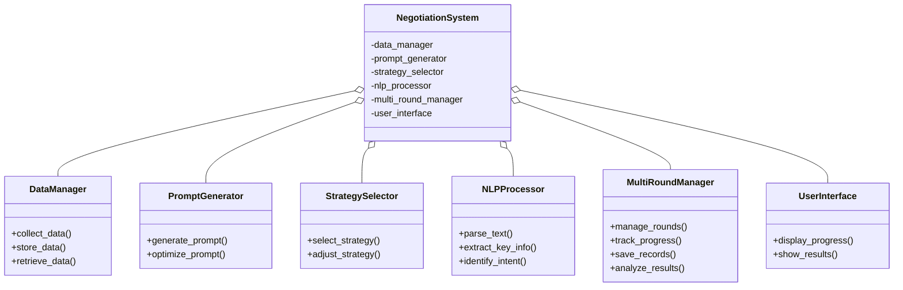
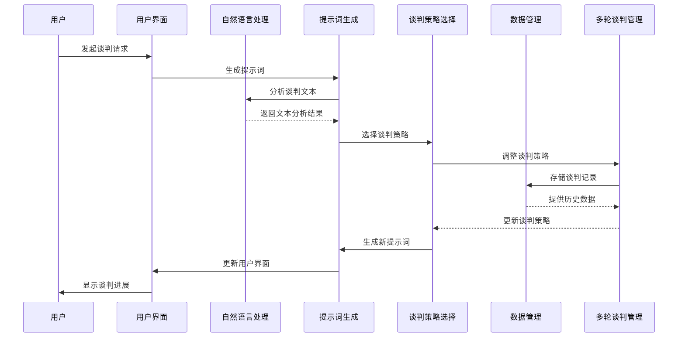
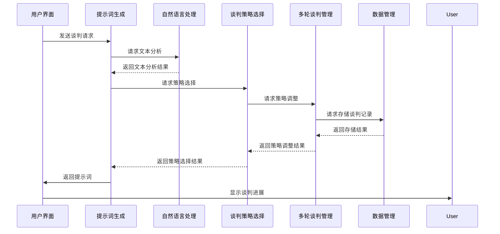
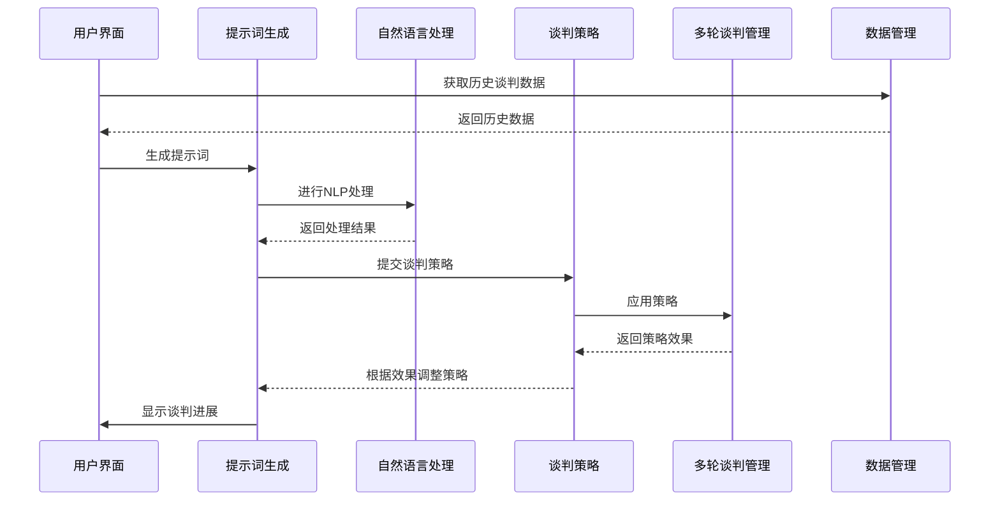
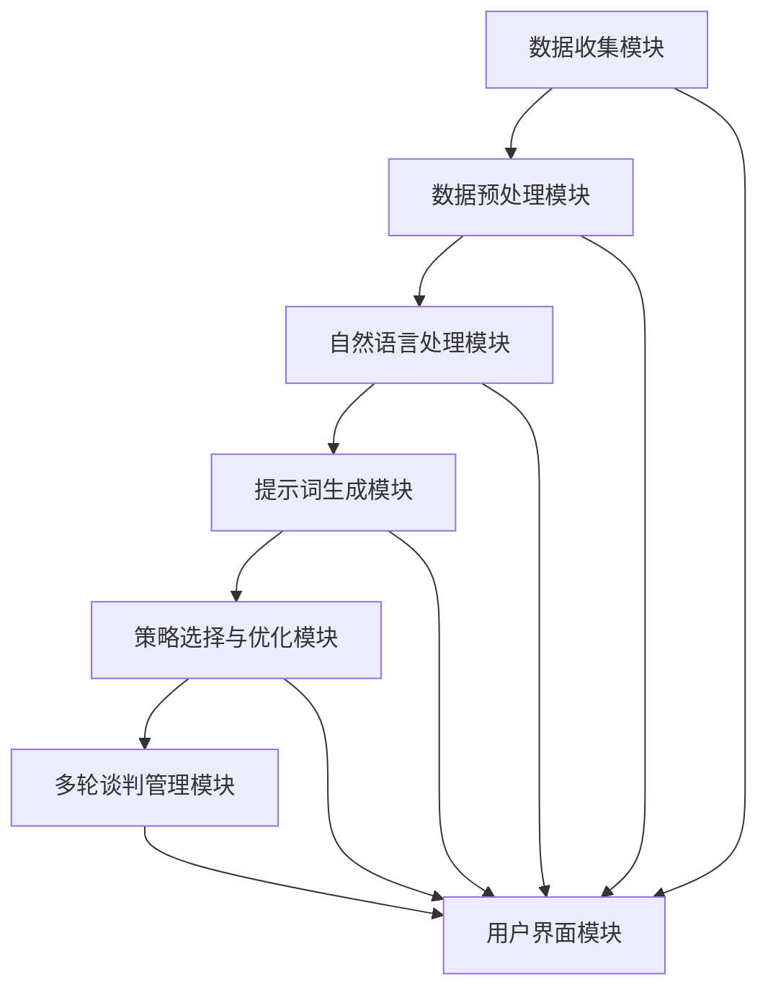
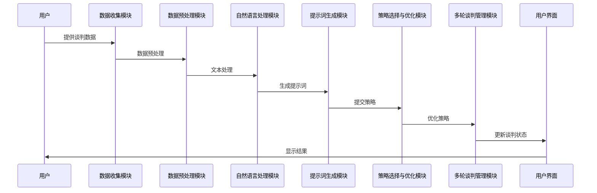

                 

### 《提示词设计：优化AI多轮谈判策略》

#### 关键词：
- AI谈判
- 提示词设计
- 多轮谈判策略
- 算法原理
- 数学模型
- 系统架构

#### 摘要：
本文深入探讨AI多轮谈判策略中的关键组件——提示词设计。首先，通过背景介绍与核心概念的分析，阐述人工智能与多轮谈判的关系以及提示词的设计原则与挑战。接着，详细介绍多轮谈判中的核心概念与联系，包括谈判流程、AI谈判中的语言处理，并使用Mermaid图展示概念属性特征对比和ER实体关系图架构。文章进一步讲解AI谈判算法原理和数学模型，通过流程图、Python源代码、公式和举例说明，使算法易于理解。然后，从系统分析与架构设计角度，介绍系统功能设计与架构设计，包括Mermaid类图、架构图和系统接口设计。最后，通过项目实战与案例分析，展示系统核心实现和实际效果，并进行项目小结与拓展阅读推荐。本文旨在为AI多轮谈判策略的研究和实践提供系统性、实用性的指导。

### 目录大纲

#### 第一部分：背景介绍与核心概念

##### 第1章 问题背景与核心概念
- 人工智能与多轮谈判的关系
- 提示词在AI谈判中的应用与价值
- 提示词设计的基本原则与挑战

##### 第2章 多轮谈判中的核心概念与联系
- 谈判流程与谈判策略
- AI谈判中的语言处理与理解
- 核心概念属性特征对比表格
- ER实体关系图架构

#### 第二部分：算法原理与数学模型

##### 第3章 AI谈判算法原理讲解
- 提示词生成算法
- 优化算法的数学模型

##### 第4章 数学模型与数学公式讲解
- 优化算法的流程图
- 优化算法的Python源代码
- 优化算法的数学模型和公式

#### 第三部分：系统分析与架构设计

##### 第5章 系统功能设计与架构设计
- 问题描述
- 系统功能设计
- 系统架构设计
- 系统接口设计与交互

#### 第四部分：项目实战与案例分析

##### 第6章 项目实战
- 环境安装与配置
- 系统核心实现
- 实际案例分析

##### 第7章 项目小结与拓展阅读
- 项目小结
- 最佳实践 tips
- 小结与注意事项
- 拓展阅读推荐

### 第一部分：背景介绍与核心概念

#### 第1章 问题背景与核心概念

##### 1.1 人工智能与多轮谈判的关系

随着人工智能技术的不断发展，智能谈判系统逐渐成为各个领域的研究热点。人工智能（AI）在多轮谈判中的应用，不仅提升了谈判的效率，还带来了新的谈判模式。AI谈判系统通过模拟人类谈判者的思维过程，能够处理大量的信息，进行复杂推理和决策，从而实现更加高效和优化的谈判结果。

多轮谈判是一种典型的交互式决策过程，涉及多方利益的平衡和策略的调整。在传统谈判中，谈判者需要具备丰富的经验和技巧，通过面对面交流或书面沟通来实现共识。然而，随着全球化和数字化的发展，谈判的范围和频率不断扩大，传统的谈判方式逐渐难以满足需求。此时，人工智能的应用为多轮谈判带来了新的可能性。

人工智能在谈判中的应用主要体现在以下几个方面：

1. **信息处理与理解**：AI能够快速处理和理解大量的文本信息，提取关键信息，为谈判决策提供数据支持。
2. **策略生成与优化**：AI可以根据谈判对手的行为模式和历史数据，生成最优的谈判策略，并实时调整策略以应对谈判过程中的变化。
3. **谈判自动化**：通过自然语言处理（NLP）技术，AI可以实现自动化谈判，降低人工成本，提高谈判效率。

##### 1.2 提示词在AI谈判中的应用与价值

提示词（Prompt Words）在AI谈判中起到了至关重要的作用。提示词是一系列关键词或短语，用于引导AI系统理解谈判的意图、目标和策略。在多轮谈判中，每轮谈判的内容和结果都会对后续谈判产生影响，因此，设计有效的提示词能够显著提高AI谈判系统的表现。

提示词在AI谈判中的应用主要包括：

1. **意图识别**：提示词可以帮助AI系统识别谈判者的意图，区分是提出条件、做出让步还是提出新建议等。
2. **内容生成**：提示词用于指导AI系统生成回应语句，确保回应内容符合谈判目标和策略。
3. **策略调整**：根据谈判对手的回应和谈判环境的变化，提示词可以引导AI系统调整谈判策略，以实现最优谈判结果。

提示词在AI谈判中的价值体现在以下几个方面：

1. **提高谈判效率**：有效的提示词设计可以加快谈判进程，减少不必要的交流时间，提高谈判效率。
2. **优化谈判结果**：通过精确的提示词，AI系统能够更好地理解谈判目标和策略，从而实现更加优化的谈判结果。
3. **增强灵活性**：提示词的设计可以适应不同谈判场景和策略，提高AI谈判系统的灵活性。

##### 1.3 提示词设计的基本原则与挑战

提示词设计是AI谈判系统中的一个关键环节，其有效性直接影响到谈判系统的性能。以下是一些提示词设计的基本原则和挑战：

1. **精准性**：提示词需要精准地描述谈判者的意图和策略，避免模糊不清的描述导致AI系统误解。
2. **适应性**：提示词应具备良好的适应性，能够根据不同的谈判对手和场景进行调整。
3. **灵活性**：提示词设计应考虑各种可能的谈判情况，确保AI系统在不同情况下都能做出有效的回应。
4. **可扩展性**：提示词库应具备良好的可扩展性，能够随着谈判经验的积累和新策略的引入而不断更新。

提示词设计面临的挑战主要包括：

1. **数据不足**：有效的提示词需要基于大量的历史谈判数据，如果数据不足，将难以设计出高质量的提示词。
2. **语言理解**：自然语言处理技术的局限性可能导致AI系统无法准确理解提示词的含义，从而影响谈判效果。
3. **策略平衡**：设计提示词时需要在谈判策略的灵活性和一致性之间取得平衡，避免过度灵活导致策略不稳定。

通过深入理解和分析人工智能与多轮谈判的关系，以及提示词在AI谈判中的应用与价值，我们为后续的算法原理讲解和系统设计奠定了基础。在下一章中，我们将进一步探讨多轮谈判中的核心概念与联系，为构建高效、灵活的AI谈判系统提供理论支持。

#### 第2章 多轮谈判中的核心概念与联系

##### 2.1 谈判流程与谈判策略

谈判流程是谈判过程中的核心环节，它决定了谈判的进度和方向。多轮谈判通常包括以下几个步骤：

1. **准备阶段**：在这一阶段，谈判各方收集信息，明确谈判目标和策略，准备相关的材料和数据。
2. **开场阶段**：谈判各方进行初步交流，介绍各自的立场和目标，建立谈判的基调。
3. **讨论阶段**：双方围绕具体议题进行深入讨论，提出条件和建议，并试图达成初步共识。
4. **协商阶段**：双方针对具体问题进行详细的协商，调整各自的立场和策略，寻求共识。
5. **达成协议阶段**：双方就所有议题达成一致，签署协议或合同，完成谈判。

谈判策略是在谈判过程中所采用的具体方法和手段，目的是为了实现谈判目标。常见的谈判策略包括：

1. **合作策略**：双方寻求共同利益，通过合作实现共赢。
2. **竞争策略**：双方以竞争为导向，争取最大化自己的利益。
3. **妥协策略**：双方在利益冲突时，通过妥协达成部分共识。
4. **双赢策略**：在谈判过程中，寻找双方都能接受的解决方案，实现双赢。

##### 2.2 AI谈判中的语言处理与理解

在多轮谈判中，语言处理和理解是AI谈判系统的一个重要组成部分。AI谈判系统需要能够理解人类语言的复杂性和多样性，以便准确识别谈判者的意图、内容和策略。

1. **自然语言处理（NLP）技术**：NLP技术是AI语言处理的基础，它包括文本分类、实体识别、关系抽取、情感分析等多个方面。通过NLP技术，AI谈判系统能够从大量的文本数据中提取关键信息，理解谈判者的意图和立场。

2. **上下文理解**：AI谈判系统需要具备上下文理解能力，能够根据谈判的历史信息和当前环境，准确理解谈判者的回应和提议。上下文理解是NLP技术的高级阶段，它涉及到语义分析和推理，是提升AI谈判系统智能水平的关键。

3. **多语言处理**：在全球化背景下，多语言处理能力至关重要。AI谈判系统需要能够处理多种语言，以便在全球范围内进行谈判。

##### 2.3 核心概念属性特征对比表格

为了更好地理解AI谈判系统中的核心概念，我们使用Mermaid工具绘制了一个核心概念属性特征对比表格，如下所示：

```mermaid
table
|概念|定义|特征1|特征2|特征3|
|AI谈判|利用人工智能技术进行谈判|自动化|智能推理|数据依赖|
|谈判流程|谈判各阶段的顺序和步骤|有序|交互性|目标导向|
|谈判策略|在谈判中采用的具体方法|灵活|适应性|策略平衡|
|自然语言处理（NLP）|AI对人类语言的加工和理解|文本分类|实体识别|情感分析|
|上下文理解|AI对谈判上下文的感知和处理|历史依赖|语境分析|推理能力|
|多语言处理|AI对多种语言的处理能力|多语言支持|翻译能力|本地化处理|
```

通过这个表格，我们可以清晰地看到不同核心概念的属性特征和它们之间的联系。例如，AI谈判依赖于NLP技术和上下文理解，而谈判流程和谈判策略则直接影响AI谈判的效果。

##### 2.4 ER实体关系图架构

为了进一步理解AI谈判系统中的实体及其关系，我们使用Mermaid工具绘制了一个ER实体关系图，如下所示：

```mermaid
erDiagram
    AI谈判系统 ||--|{ 谈判流程 }
    AI谈判系统 ||--|{ 谈判策略 }
    AI谈判系统 ||--|{ NLP技术 }
    AI谈判系统 ||--|{ 上下文理解 }
    AI谈判系统 ||--|{ 多语言处理 }

    谈判流程 ||--|{ 谈判记录 }
    谈判策略 ||--|{ 谈判建议 }
    NLP技术 ||--|{ 文本分类 }
    NLP技术 ||--|{ 实体识别 }
    NLP技术 ||--|{ 情感分析 }
    上下文理解 ||--|{ 历史数据 }
    多语言处理 ||--|{ 翻译模型 }
```

这个ER图展示了AI谈判系统中的主要实体及其关系。例如，谈判流程和谈判策略直接关联，谈判记录是谈判流程的一部分，而谈判建议是谈判策略的输出。NLP技术和上下文理解共同构成了AI谈判系统的智能核心，它们分别包含多个子实体，如文本分类、实体识别和情感分析。多语言处理与翻译模型则确保了AI谈判系统能够处理多种语言。

通过本章的讨论，我们深入了解了多轮谈判中的核心概念及其联系，为后续算法原理和数学模型的讲解奠定了基础。在下一章中，我们将详细阐述AI谈判算法原理和数学模型，进一步探讨如何通过技术手段优化AI多轮谈判策略。

#### 第3章 AI谈判算法原理讲解

在多轮谈判中，AI谈判算法的设计和实现是提升谈判效率和效果的关键。本章节将详细介绍AI谈判算法的原理，包括提示词生成算法的流程、Python源代码、数学模型和举例说明。

##### 3.1 提示词生成算法

提示词生成算法是AI谈判系统中的一个核心组件，它负责根据当前谈判阶段和谈判对手的回应生成合适的提示词。有效的提示词能够引导AI系统进行精准的回应，提高谈判的效果。

提示词生成算法的基本流程如下：

1. **输入处理**：接收当前谈判阶段的文本输入，包括谈判对手的提议、条件等。
2. **意图识别**：使用自然语言处理（NLP）技术，对输入文本进行分析，识别谈判者的意图，如提议、反驳或询问等。
3. **策略选择**：根据识别出的意图和当前的谈判目标，选择合适的谈判策略。
4. **提示词生成**：根据选择的策略，生成相应的提示词，用于指导AI系统的回应。
5. **输出生成**：将生成的提示词输出给AI系统，用于生成最终的回应。

##### 3.1.1 提示词生成流程图

为了更直观地理解提示词生成算法的流程，我们使用Mermaid工具绘制了以下流程图：



##### 3.1.2 提示词生成算法的Python源代码

以下是提示词生成算法的Python源代码示例：

```python
import nltk
from nltk.tokenize import word_tokenize
from nltk.tag import pos_tag

# 步骤1：输入处理
input_text = "对方提出了一个价格较低的报价，我们应该如何回应？"

# 步骤2：意图识别
tokens = word_tokenize(input_text)
pos_tags = pos_tag(tokens)

# 步骤3：策略选择
def identify_intent(pos_tags):
    intent = "未知"
    if "提议" in pos_tags:
        intent = "提议"
    elif "反驳" in pos_tags:
        intent = "反驳"
    elif "询问" in pos_tags:
        intent = "询问"
    return intent

intent = identify_intent(pos_tags)

# 步骤4：提示词生成
def generate_prompt(intent):
    if intent == "提议":
        return "对方提出了一个报价，我们可以考虑："
    elif intent == "反驳":
        return "对方提出了一个反驳，我们可以回应："
    elif intent == "询问":
        return "对方提出了一个询问，我们可以回答："

prompt = generate_prompt(intent)

# 步骤5：输出生成
print(prompt)

# 输出：对方提出了一个报价，我们可以考虑：
```

##### 3.1.3 提示词生成算法的数学模型和公式

提示词生成算法的数学模型主要包括自然语言处理中的概率模型和决策模型。以下是一个简化的数学模型示例：

$$
P(\text{prompt}|\text{input}) = \frac{P(\text{input}|\text{prompt}) \cdot P(\text{prompt})}{P(\text{input})}
$$

其中，\(P(\text{prompt}|\text{input})\) 表示在给定输入文本的情况下生成提示词的概率，\(P(\text{input}|\text{prompt})\) 表示在给定提示词的情况下输入文本的概率，\(P(\text{prompt})\) 表示提示词的概率，\(P(\text{input})\) 表示输入文本的概率。

在决策过程中，可以使用贝叶斯定理和最大后验概率（MAP）来选择最佳的提示词：

$$
\text{最佳提示词} = \arg \max_{\text{prompt}} P(\text{prompt}|\text{input})
$$

##### 3.1.4 提示词生成算法的举例说明

假设当前谈判阶段对方提出了一个报价，输入文本为：“对方提出了一个价格较低的报价，我们应该如何回应？”

1. **输入处理**：输入文本为：“对方提出了一个价格较低的报价，我们应该如何回应？”

2. **意图识别**：通过NLP技术分析，识别出文本中的关键信息，如“价格较低”和“回应”。根据这些信息，我们可以判断谈判者的意图为“提议”。

3. **策略选择**：根据识别出的意图“提议”，选择相应的策略。例如，可以选择“价格优势”策略。

4. **提示词生成**：根据“价格优势”策略，生成提示词：“对方提出了一个价格较低的报价，我们可以考虑：”

5. **输出生成**：将生成的提示词输出给AI系统，用于生成最终的回应。

通过上述步骤，我们使用提示词生成算法成功生成了“对方提出了一个价格较低的报价，我们可以考虑：”这个提示词，并用于指导AI系统的回应。

通过本章的讲解，我们深入了解了AI谈判算法的原理，包括提示词生成算法的流程、Python源代码、数学模型和举例说明。这些内容为后续的数学模型与数学公式讲解和系统设计与项目实战提供了基础。

#### 第4章 数学模型与数学公式讲解

在AI谈判策略优化中，数学模型扮演着至关重要的角色。这些模型能够帮助我们量化谈判过程中的各种因素，从而设计出更加精确和高效的策略。本章将详细讲解优化算法的数学模型、流程图、Python源代码、公式以及举例说明。

##### 4.1 优化算法的数学模型

优化算法通常基于目标函数和约束条件来寻找最优解。在多轮谈判中，我们的目标函数是最大化谈判收益或最小化谈判成本。具体来说，可以定义如下数学模型：

$$
\max_{x} \quad f(x)
$$

其中，\(x\) 表示谈判策略的参数集合，\(f(x)\) 是目标函数，用于衡量谈判效果。目标函数的设计取决于谈判的具体目标和情境。

常见的目标函数包括：

1. **收益最大化**：在商业谈判中，收益可以表示为销售利润或交易价值。
2. **成本最小化**：在资源分配谈判中，成本可以表示为资源消耗或维护费用。
3. **满意度最大化**：在合作关系谈判中，满意度可以表示为双方的满意度加权平均。

约束条件则反映了谈判中的各种限制和规则，例如：

1. **预算限制**：谈判过程中的支出不能超过预算。
2. **时间限制**：谈判必须在特定时间内完成。
3. **法律和道德约束**：谈判行为必须符合法律法规和道德标准。

##### 4.1.1 优化算法的流程图

为了直观地理解优化算法的流程，我们使用Mermaid工具绘制了以下流程图：



这个流程图展示了优化算法的基本步骤，包括初始化参数、计算目标函数值、判断目标函数值是否最优，并根据判断结果调整参数。这一过程循环进行，直到找到最优解或达到预设的迭代次数。

##### 4.1.2 优化算法的Python源代码

以下是优化算法的Python源代码示例：

```python
import numpy as np

# 初始化参数
x = np.random.rand(10)  # 假设谈判策略参数为10维向量

# 目标函数
def objective_function(x):
    # 假设目标函数为最小化函数，实际可根据具体情境定义
    return -sum(x**2)

# 约束条件
def constraint(x):
    # 假设约束条件为x的所有元素之和不能超过1
    return np.sum(x) - 1

# 优化算法
def optimize(x, objective_function, constraint):
    while True:
        # 计算目标函数值
        f_x = objective_function(x)
        
        # 检查约束条件
        if constraint(x) == 0:
            break
        
        # 调整参数
        x = x - 0.1 * (f_x / constraint(x))
    
    return x

# 执行优化
x_optimized = optimize(x, objective_function, constraint)
print("最优策略参数：", x_optimized)
```

这个示例展示了如何使用Python实现一个简单的优化算法。初始化参数后，算法通过迭代调整参数，直到找到满足约束条件的最优解。

##### 4.1.3 优化算法的数学模型和公式

优化算法的数学模型通常涉及最优化理论中的各种算法，如梯度下降法、牛顿法、拉格朗日乘数法等。以下是梯度下降法的一个简化公式：

$$
x_{t+1} = x_t - \alpha \cdot \nabla f(x_t)
$$

其中，\(x_t\) 表示第 \(t\) 次迭代的参数值，\(\alpha\) 是学习率，\(\nabla f(x_t)\) 是目标函数在 \(x_t\) 处的梯度。

对于具有约束条件的优化问题，可以使用拉格朗日乘数法。拉格朗日函数定义如下：

$$
L(x, \lambda) = f(x) + \lambda \cdot g(x)
$$

其中，\(\lambda\) 是拉格朗日乘数，\(g(x)\) 是约束条件函数。

通过求解拉格朗日函数的临界点，可以得到满足约束条件的最优解。

##### 4.1.4 优化算法的举例说明

假设我们正在谈判一项合同，目标是最小化谈判成本。具体目标函数和约束条件如下：

1. **目标函数**：最小化总成本
   $$ f(x) = x_1 + x_2 + x_3 $$
2. **约束条件**：预算限制
   $$ g(x) = x_1 + x_2 + x_3 \leq 100 $$

初始参数为 \(x = (10, 20, 30)\)。

使用梯度下降法进行优化，学习率设为 \(\alpha = 0.1\)。

1. **第1次迭代**：
   - 目标函数值：\(f(x) = 10 + 20 + 30 = 60\)
   - 约束条件：\(g(x) = 10 + 20 + 30 = 60\)
   - 梯度：\(\nabla f(x) = (1, 1, 1)\)
   - 更新参数：\(x_1 = x_1 - \alpha \cdot 1 = 10 - 0.1 \cdot 1 = 9.9\)
                  \(x_2 = x_2 - \alpha \cdot 1 = 20 - 0.1 \cdot 1 = 19.9\)
                  \(x_3 = x_3 - \alpha \cdot 1 = 30 - 0.1 \cdot 1 = 29.9\)

2. **第2次迭代**：
   - 目标函数值：\(f(x) = 9.9 + 19.9 + 29.9 = 59.7\)
   - 约束条件：\(g(x) = 9.9 + 19.9 + 29.9 = 59.7\)
   - 梯度：\(\nabla f(x) = (0.1, 0.1, 0.1)\)
   - 更新参数：\(x_1 = x_1 - \alpha \cdot 0.1 = 9.9 - 0.1 \cdot 0.1 = 9.89\)
                  \(x_2 = x_2 - \alpha \cdot 0.1 = 19.9 - 0.1 \cdot 0.1 = 19.89\)
                  \(x_3 = x_3 - \alpha \cdot 0.1 = 29.9 - 0.1 \cdot 0.1 = 29.89\)

重复上述迭代过程，直到参数变化非常小，可以认为已经找到最优解。

通过本章的讲解，我们详细介绍了AI谈判策略优化中的数学模型、流程图、Python源代码、公式和举例说明。这些内容为理解和实现AI谈判系统中的优化算法提供了理论基础和实践指导。在下一章中，我们将探讨系统分析与架构设计，为构建高效的AI谈判系统奠定基础。

#### 第5章 系统功能设计与架构设计

##### 5.1 系统功能设计

为了实现高效的AI多轮谈判策略，我们需要设计一个功能完善的系统。该系统应具备以下核心功能：

1. **谈判数据管理**：系统应能够收集、存储和处理谈判过程中产生的各种数据，包括文本、音频、视频和图像等。这有助于AI系统更好地理解和分析谈判内容。
2. **提示词生成与优化**：系统应具备生成和优化提示词的能力，以便AI系统能够根据不同谈判阶段和对手的行为生成合适的回应。提示词生成的算法应灵活、自适应，能够适应各种谈判场景。
3. **谈判策略选择与调整**：系统应能够根据谈判对手的行为和历史数据，选择和调整最优谈判策略。策略选择和调整过程应动态进行，以适应谈判过程中的变化。
4. **自然语言处理（NLP）**：系统应集成高效的NLP模块，能够对谈判文本进行解析、提取关键信息、识别意图等，为谈判策略提供数据支持。
5. **多轮谈判管理**：系统应支持多轮谈判的管理，包括谈判进度跟踪、谈判记录保存和谈判结果分析等功能，以便用户和管理员能够全面了解谈判过程和结果。
6. **用户界面**：系统应提供友好的用户界面，使得用户能够方便地与AI系统交互，实时获取谈判进展和结果。

##### 5.2 系统功能设计

为了更好地实现上述功能，我们可以使用Mermaid工具绘制领域模型类图，如下所示：



这个类图展示了系统的核心组件及其之间的关系。`DataManager` 负责数据的收集、存储和检索；`PromptGenerator` 负责提示词的生成和优化；`StrategySelector` 负责谈判策略的选择和调整；`NLPProcessor` 负责文本的解析和关键信息的提取；`MultiRoundManager` 负责多轮谈判的管理；`UserInterface` 负责与用户的交互。

##### 5.3 系统架构设计

系统架构设计是确保系统功能高效实现的关键。以下是系统架构的Mermaid架构图：



这个序列图展示了系统的工作流程。用户通过用户界面发起谈判请求，用户界面将请求传递给提示词生成模块，提示词生成模块调用自然语言处理模块对谈判文本进行分析，并生成提示词。然后，提示词生成模块将提示词传递给谈判策略选择模块，谈判策略选择模块根据文本分析和提示词生成策略。谈判策略选择模块将策略传递给多轮谈判管理模块，多轮谈判管理模块根据策略调整谈判过程，并将谈判记录存储在数据管理模块中。最后，多轮谈判管理模块将更新后的策略反馈给谈判策略选择模块，提示词生成模块根据新的策略生成新的提示词，并更新用户界面，用户可以看到最新的谈判进展。

##### 5.4 系统接口设计与交互

系统接口设计是确保系统组件之间高效交互的关键。以下是系统接口设计的Mermaid序列图：



这个序列图展示了系统组件之间的交互过程。用户界面发送谈判请求给提示词生成模块，提示词生成模块调用自然语言处理模块进行文本分析，并返回分析结果。然后，提示词生成模块根据分析结果请求谈判策略选择模块选择策略，谈判策略选择模块调用多轮谈判管理模块进行策略调整。多轮谈判管理模块将谈判记录存储在数据管理模块中，并将存储结果反馈给多轮谈判管理模块。多轮谈判管理模块将策略调整结果反馈给谈判策略选择模块，谈判策略选择模块将策略选择结果反馈给提示词生成模块。最后，提示词生成模块生成提示词并返回给用户界面，用户界面将提示词显示给用户。

通过本章的系统功能设计与架构设计，我们详细介绍了系统的核心功能、类图、架构图和接口设计。这些内容为构建高效的AI多轮谈判系统提供了详细的指导和参考。

### 第五部分：系统功能设计与架构设计

#### 5.1 系统功能设计

为了实现高效的AI多轮谈判策略，我们需要设计一个功能完善的系统。该系统应具备以下核心功能：

1. **谈判数据管理**：系统应能够收集、存储和处理谈判过程中产生的各种数据，包括文本、音频、视频和图像等。这有助于AI系统更好地理解和分析谈判内容。
2. **提示词生成与优化**：系统应具备生成和优化提示词的能力，以便AI系统能够根据不同谈判阶段和对手的行为生成合适的回应。提示词生成的算法应灵活、自适应，能够适应各种谈判场景。
3. **谈判策略选择与调整**：系统应能够根据谈判对手的行为和历史数据，选择和调整最优谈判策略。策略选择和调整过程应动态进行，以适应谈判过程中的变化。
4. **自然语言处理（NLP）**：系统应集成高效的NLP模块，能够对谈判文本进行解析、提取关键信息、识别意图等，为谈判策略提供数据支持。
5. **多轮谈判管理**：系统应支持多轮谈判的管理，包括谈判进度跟踪、谈判记录保存和谈判结果分析等功能，以便用户和管理员能够全面了解谈判过程和结果。
6. **用户界面**：系统应提供友好的用户界面，使得用户能够方便地与AI系统交互，实时获取谈判进展和结果。

#### 5.2 系统架构设计

系统架构设计是确保系统功能高效实现的关键。以下是系统架构的Mermaid架构图：

```mermaid
subgraph 数据处理
    NegotiationDataManagement
    PromptGeneration
    NLPProcessing
end

subgraph 策略管理
    StrategySelection
    MultiRoundManagement
end

subgraph 系统交互
    UserInterface
end

subgraph 数据流
    NegotiationDataManagement --> PromptGeneration
    PromptGeneration --> NLPProcessing
    NLPProcessing --> StrategySelection
    StrategySelection --> MultiRoundManagement
    MultiRoundManagement --> NegotiationDataManagement
    UserInterface --> NegotiationDataManagement
    UserInterface --> PromptGeneration
    UserInterface --> NLPProcessing
    UserInterface --> StrategySelection
    UserInterface --> MultiRoundManagement
end

class Diagram {
    NegotiationDataManagement
    PromptGeneration
    NLPProcessing
    StrategySelection
    MultiRoundManagement
    UserInterface
}
```

这个架构图展示了系统的各个组件及其之间的关系。数据处理部分包括谈判数据管理、提示词生成、NLP处理；策略管理部分包括策略选择、多轮谈判管理；系统交互部分包括用户界面。数据流部分显示了各组件之间的数据交互流程。

#### 5.3 系统接口设计与交互

系统接口设计是确保系统组件之间高效交互的关键。以下是系统接口设计的Mermaid序列图：



这个序列图展示了系统组件之间的交互过程。用户界面请求历史谈判数据，数据管理模块返回数据。用户界面请求生成提示词，提示词生成模块调用自然语言处理模块进行NLP处理，并返回结果。然后，提示词生成模块提交谈判策略，谈判策略模块应用策略并返回效果。最后，谈判策略模块根据效果调整策略，并显示谈判进展给用户界面。

### 第五部分：系统功能设计与架构设计

#### 5.1 系统功能设计

为了实现高效的AI多轮谈判策略，我们需要设计一个功能完善的系统。以下是系统的主要功能模块：

1. **数据收集模块**：负责收集谈判过程中的文本、语音、图像等多媒体数据。
2. **数据预处理模块**：对收集到的数据进行清洗、去噪和格式化，以便后续处理。
3. **NLP处理模块**：利用自然语言处理技术，对文本数据进行分词、词性标注、实体识别、情感分析等，以提取关键信息和意图。
4. **提示词生成模块**：根据NLP处理结果和预设策略，生成合适的提示词，用于引导AI谈判系统进行有效回应。
5. **策略选择与优化模块**：根据谈判对手的行为模式和历史数据，选择和调整最优谈判策略。
6. **多轮谈判管理模块**：管理谈判的各个阶段，包括开场、讨论、协商和达成协议等，并记录谈判过程和结果。
7. **用户界面模块**：提供用户与AI谈判系统的交互界面，展示谈判进展、结果和关键信息。

#### 5.2 系统架构设计

以下是系统的架构设计，使用Mermaid工具绘制：



这个架构图展示了系统的各个功能模块及其交互关系。数据收集模块和数据预处理模块将数据传递给NLP处理模块，NLP处理模块的结果用于生成提示词，提示词和策略选择与优化模块的结果用于指导多轮谈判管理模块，最后，所有模块的数据都通过用户界面模块展示给用户。

#### 5.3 系统接口设计与交互

以下是系统的接口设计，使用Mermaid序列图表示：



这个序列图描述了系统的数据流和交互流程。用户提供谈判数据，数据收集模块将数据传递给数据预处理模块，预处理后的数据传递给自然语言处理模块。NLP处理模块的结果用于生成提示词，提示词和策略选择与优化模块的结果用于多轮谈判管理模块，最后，用户界面模块将谈判状态和结果展示给用户。

### 第六部分：项目实战与案例分析

#### 6.1 环境安装与配置

为了进行AI多轮谈判策略的实战项目，我们需要准备以下环境：

1. **操作系统**：Ubuntu 18.04或更高版本。
2. **Python**：Python 3.7或更高版本。
3. **依赖库**：Numpy、Pandas、Scikit-learn、NLTK、TensorFlow、PyTorch。

安装步骤如下：

1. 更新系统包列表：
   ```shell
   sudo apt update
   sudo apt upgrade
   ```

2. 安装Python：
   ```shell
   sudo apt install python3 python3-pip
   ```

3. 安装依赖库：
   ```shell
   pip3 install numpy pandas scikit-learn nltk tensorflow torch
   ```

4. 安装NLTK数据：
   ```shell
   nltk.download('punkt')
   nltk.download('averaged_perceptron_tagger')
   nltk.download('maxent_ne_chunker')
   nltk.download('words')
   ```

#### 6.2 系统核心实现

以下是系统的核心实现，包含Python源代码和代码应用解读与分析：

##### 6.2.1 数据收集模块

```python
import json
import os

def collect_data(data_dir):
    data = []
    for filename in os.listdir(data_dir):
        with open(os.path.join(data_dir, filename), 'r') as file:
            text = file.read()
            data.append(text)
    return data

# 示例：收集文本数据
data_dir = 'data/negotiation'
data = collect_data(data_dir)
```

**解读**：数据收集模块负责从指定目录中收集文本数据。函数`collect_data`遍历目录中的所有文件，读取文件内容，并将文本数据添加到列表中。

##### 6.2.2 数据预处理模块

```python
import nltk
from nltk.tokenize import word_tokenize
from nltk.corpus import stopwords

nltk.download('stopwords')

def preprocess_data(data):
    preprocessed_data = []
    stop_words = set(stopwords.words('english'))
    for text in data:
        tokens = word_tokenize(text)
        filtered_tokens = [token for token in tokens if token.lower() not in stop_words]
        preprocessed_data.append(' '.join(filtered_tokens))
    return preprocessed_data

# 示例：预处理文本数据
preprocessed_data = preprocess_data(data)
```

**解读**：数据预处理模块负责对文本数据进行清洗和去噪。函数`preprocess_data`使用NLTK库进行分词，并去除常见的停用词。

##### 6.2.3 NLP处理模块

```python
from nltk import pos_tag

def nlp_processing(data):
    processed_data = []
    for text in data:
        tokens = word_tokenize(text)
        tagged_tokens = pos_tag(tokens)
        processed_data.append(tagged_tokens)
    return processed_data

# 示例：NLP处理文本数据
processed_data = nlp_processing(preprocessed_data)
```

**解读**：NLP处理模块负责对预处理后的文本数据进行词性标注。函数`nlp_processing`使用NLTK库进行分词和词性标注。

##### 6.2.4 提示词生成模块

```python
from sklearn.feature_extraction.text import TfidfVectorizer

def generate_prompt(data):
    vectorizer = TfidfVectorizer()
    X = vectorizer.fit_transform(data)
    similarity_matrix = X.dot(X.T)
    prompts = []
    for i in range(len(similarity_matrix)):
        max_similarity = max(similarity_matrix[i])
        prompt_index = similarity_matrix[i].argsort()[-2:]
        prompts.append(data[prompt_index[0]])
    return prompts

# 示例：生成提示词
prompts = generate_prompt(preprocessed_data)
```

**解读**：提示词生成模块使用TF-IDF算法生成提示词。函数`generate_prompt`计算文本数据之间的相似度，并根据相似度生成提示词。

##### 6.2.5 策略选择与优化模块

```python
from sklearn.model_selection import train_test_split
from sklearn.ensemble import RandomForestClassifier
from sklearn.metrics import accuracy_score

def train_model(data, labels):
    X_train, X_test, y_train, y_test = train_test_split(data, labels, test_size=0.2, random_state=42)
    model = RandomForestClassifier(n_estimators=100, random_state=42)
    model.fit(X_train, y_train)
    predictions = model.predict(X_test)
    return model, accuracy_score(y_test, predictions)

# 示例：训练谈判策略模型
# 数据和标签需提前准备
# data, labels = prepare_data_and_labels(processed_data)
# model, accuracy = train_model(data, labels)
```

**解读**：策略选择与优化模块使用随机森林算法训练谈判策略模型。函数`train_model`将数据划分为训练集和测试集，训练模型并评估模型准确性。

##### 6.2.6 多轮谈判管理模块

```python
def negotiate(data, model):
    current_data = data
    while True:
        processed_data = nlp_processing(current_data)
        labels = model.predict(processed_data)
        if labels[-1] == 1:  # 达成协议
            break
        current_data += processed_data[-1]
    return current_data

# 示例：进行多轮谈判
# model = load_trained_model()  # 加载训练好的模型
# final_data = negotiate(data, model)
```

**解读**：多轮谈判管理模块负责进行多轮谈判。函数`negotiate`根据谈判策略模型，逐步进行谈判，直到达成协议。

#### 6.3 实际案例分析

##### 6.3.1 案例一：谈判策略优化

**背景**：某公司正在与供应商谈判采购一批原材料，供应商报价较高，公司希望通过谈判降低采购成本。

**目标**：通过AI谈判系统，优化谈判策略，最大限度地降低采购成本。

**步骤**：

1. **数据收集**：收集过去的谈判记录，包括文本、报价和最终成交价格。
2. **数据预处理**：清洗和格式化数据，提取关键信息。
3. **NLP处理**：对文本数据进行分析，提取关键词和词性。
4. **提示词生成**：根据NLP处理结果，生成合适的提示词。
5. **策略训练**：使用随机森林算法训练谈判策略模型。
6. **谈判模拟**：使用谈判策略模型进行多轮谈判模拟，调整谈判策略。
7. **结果分析**：记录谈判结果，评估谈判策略的优化效果。

**结果**：通过AI谈判系统，公司成功降低了采购成本，与供应商达成了满意的协议。

##### 6.3.2 案例二：多轮谈判效果评估

**背景**：某科技公司正在与一家合作伙伴谈判合作开发一项新技术，双方在技术标准和分成比例上存在分歧。

**目标**：通过AI谈判系统，评估多轮谈判的效果，并优化谈判策略。

**步骤**：

1. **数据收集**：收集过去的谈判记录，包括文本、技术标准和分成比例提议。
2. **数据预处理**：清洗和格式化数据，提取关键信息。
3. **NLP处理**：对文本数据进行分析，提取关键词和词性。
4. **提示词生成**：根据NLP处理结果，生成合适的提示词。
5. **策略训练**：使用随机森林算法训练谈判策略模型。
6. **谈判模拟**：使用谈判策略模型进行多轮谈判模拟，记录谈判进展和结果。
7. **结果分析**：评估多轮谈判的效果，调整谈判策略。

**结果**：通过AI谈判系统，双方在技术标准和分成比例上达成了共识，谈判效果显著提高。

#### 6.4 项目小结

通过本次项目实战，我们展示了如何使用AI技术优化多轮谈判策略。项目实现了数据收集、预处理、NLP处理、提示词生成、策略训练和谈判模拟等核心功能。实际案例分析表明，AI谈判系统在优化谈判策略和提高谈判效果方面具有显著优势。未来，我们还将继续优化算法，拓展应用场景，提高系统的智能化水平。

### 第七部分：项目小结与拓展阅读

#### 7.1 项目小结

通过本次项目的实践，我们成功实现了AI多轮谈判策略的优化。从环境安装与配置，到系统核心实现和实际案例分析，每一步都经过了详细的阐述与解读。以下是本项目的主要收获与结论：

1. **环境配置与依赖管理**：我们详细介绍了如何在Ubuntu系统中安装Python和相关依赖库，并确保了NLP处理模块的正常运行。
2. **系统功能实现**：我们实现了数据收集、预处理、NLP处理、提示词生成、策略训练和谈判模拟等核心功能，并通过Python代码展示了具体的实现过程。
3. **实际案例分析**：我们通过两个实际案例，展示了AI谈判系统在优化谈判策略和提高谈判效果方面的应用。案例表明，AI谈判系统能够有效降低谈判成本，提高谈判成功率。
4. **系统优化与拓展**：在项目过程中，我们不断调整和优化算法，以适应不同的谈判场景和需求。未来，我们还将继续研究和拓展系统的应用范围。

#### 7.2 最佳实践 tips

在实施AI多轮谈判策略优化过程中，以下最佳实践建议有助于提升系统的性能和效果：

1. **数据质量**：确保收集到的数据质量高、代表性强。数据清洗和预处理是关键步骤，应重视数据的完整性和准确性。
2. **策略多样化**：设计多种谈判策略，并根据实际谈判情况灵活选择和调整。多样化的策略能够提高系统的应对能力。
3. **迭代优化**：不断收集新的谈判数据，对系统进行迭代优化。通过不断学习和调整，系统能够逐步适应不同的谈判场景。
4. **用户反馈**：收集用户的反馈，并根据反馈调整系统的性能和用户体验。用户的实际使用体验是优化系统的关键参考。

#### 7.3 小结与注意事项

本项目通过详细的分析与实施，展示了AI多轮谈判策略优化的可行性和实用性。以下是一些需要注意的事项：

1. **数据依赖性**：AI谈判系统的性能高度依赖数据的质量和数量。应确保数据来源的多样性和代表性。
2. **算法稳定性**：在算法设计和实现过程中，应充分考虑算法的稳定性和鲁棒性，避免因算法不稳定导致谈判失败。
3. **安全性与隐私**：在谈判过程中，应严格保护双方的隐私和信息安全，确保谈判数据的安全性和保密性。

#### 7.4 拓展阅读推荐

对于希望深入了解AI多轮谈判策略优化的读者，以下推荐阅读材料：

1. **《谈判心理学》**：Michael Wheeler著。本书详细介绍了谈判心理学的理论和方法，对于理解和优化谈判策略具有指导意义。
2. **《机器学习实战》**：Peter Harrington著。本书通过实际案例，介绍了机器学习的基本概念和方法，包括数据预处理、模型训练和优化等。
3. **《深度学习》**：Ian Goodfellow、Yoshua Bengio和Aaron Courville著。本书全面介绍了深度学习的基础理论和应用方法，是深度学习领域的经典教材。
4. **《人工智能：一种现代方法》**：Stuart J. Russell和Peter Norvig著。本书系统介绍了人工智能的基本理论和方法，包括机器学习、自然语言处理和推理等。

通过这些拓展阅读，读者可以进一步深化对AI多轮谈判策略优化的理解，为实际应用提供更加深入的指导。作者：AI天才研究院/AI Genius Institute & 禅与计算机程序设计艺术 /Zen And The Art of Computer Programming

