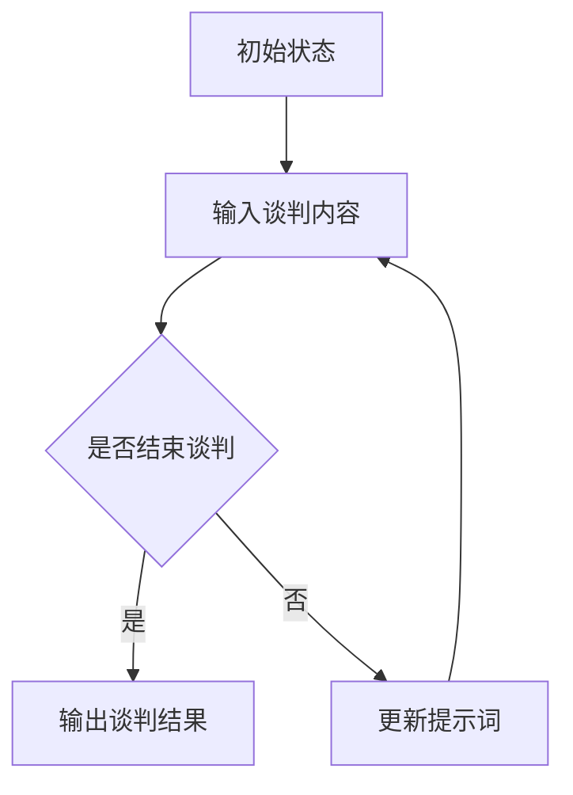
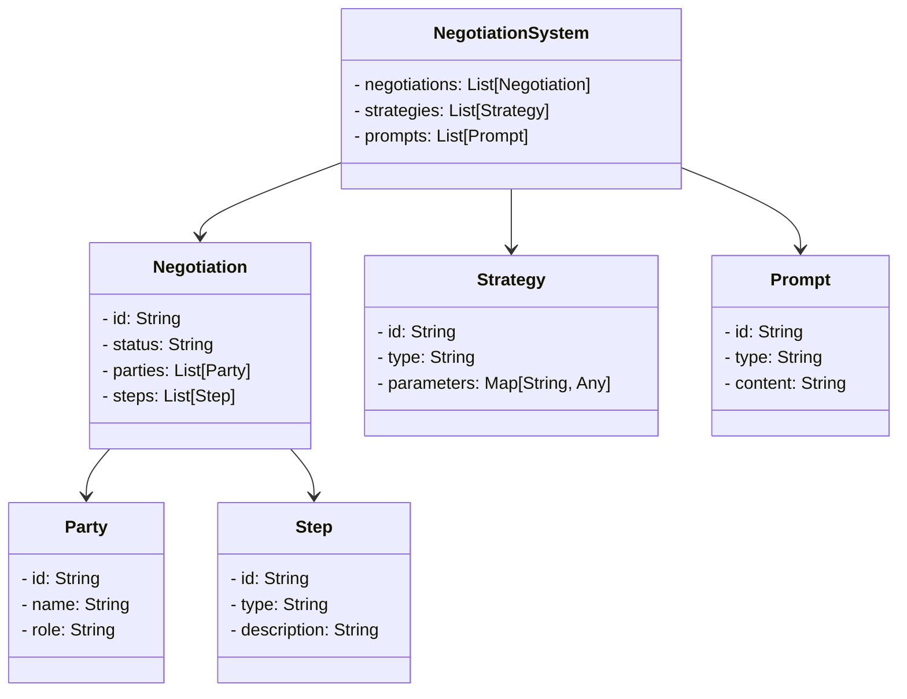
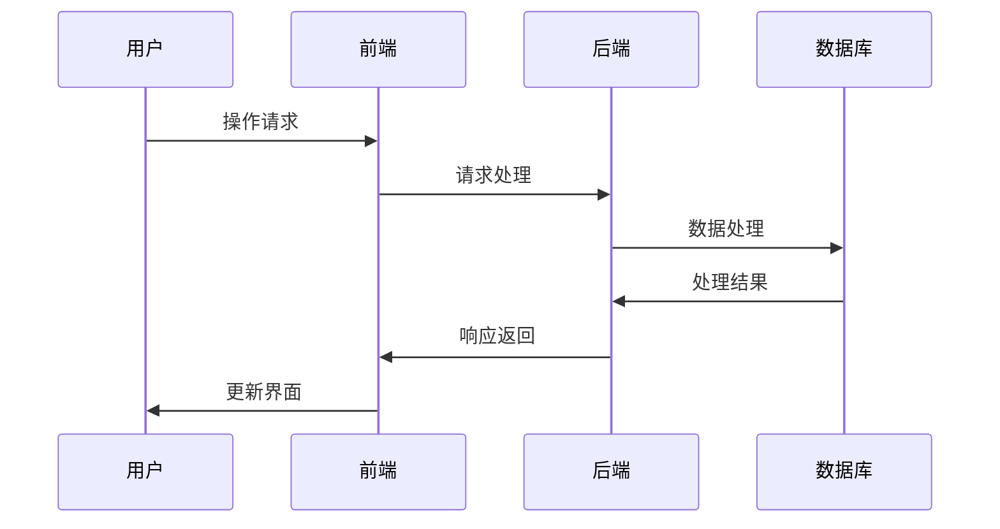

                 

## 引入与背景

### 1.1 问题背景

在当今快速发展的科技时代，人工智能（AI）已经成为各个行业的重要推动力量。从自然语言处理、图像识别到复杂决策系统，AI的应用无处不在。特别是在谈判领域，人工智能展示出了巨大的潜力。谈判作为一种复杂的社会行为，其成功与否往往依赖于谈判双方的沟通能力、策略选择和心理应对能力。随着商业竞争的日益激烈，高效的谈判策略和技巧变得愈发重要。

传统的谈判主要依赖于人类的经验和直觉，但这种方法具有明显的局限性。首先，人类谈判者可能存在疲劳、情绪波动等问题，从而影响谈判的质量。其次，谈判过程往往涉及大量的数据和信息，人类难以在短时间内处理这些复杂的信息，从而做出最优决策。此外，谈判中的对手也可能会利用人类谈判者的弱点，通过策略和技巧来获取更多的利益。

为了解决这些问题，人工智能被引入到谈判领域。AI能够通过学习大量的谈判案例和数据，提取出有效的谈判策略和技巧，从而在谈判中发挥积极作用。例如，AI可以实时分析谈判对手的行为和语言，预测其对谈判结果的期望，并提供相应的建议和策略。此外，AI还可以通过模拟不同场景，帮助谈判者进行策略预演，从而提高谈判的成功率。

### 1.2 人工智能在谈判中的应用现状

目前，人工智能在谈判中的应用已经取得了一些显著成果。例如，一些企业开始使用AI系统来辅助谈判，通过分析历史谈判数据和当前谈判情境，提供个性化的谈判策略和建议。这些AI系统不仅能够提高谈判的效率，还能帮助谈判者更好地理解和应对谈判对手的心理和行为。

具体来说，AI在谈判中的应用主要包括以下几个方面：

1. **谈判策略分析**：AI系统可以通过分析大量的谈判案例，总结出有效的谈判策略和技巧。这些策略和技巧可以用于指导实际的谈判过程，帮助谈判者制定更加科学的谈判计划。

2. **实时谈判支持**：在谈判过程中，AI系统可以实时分析谈判对手的行为和语言，预测其谈判意图和策略，从而为谈判者提供即时的反馈和建议。

3. **谈判结果预测**：AI系统可以根据当前谈判数据和谈判者的策略选择，预测谈判的结果和可能的发展趋势，帮助谈判者做出更加明智的决策。

4. **谈判案例学习**：AI系统可以通过学习大量的历史谈判案例，提取出谈判中的关键因素和成功要素，从而帮助谈判者提高谈判能力。

尽管人工智能在谈判中具有巨大的潜力，但目前的应用仍然面临一些挑战。首先，谈判领域的数据量巨大且复杂，AI系统需要具备强大的数据处理和分析能力。其次，谈判过程涉及多个环节和参与者，AI系统需要能够处理这些复杂的关系和互动。此外，谈判中的情感和心理因素也是AI系统需要考虑的重要因素。

### 1.3 提示词在AI谈判中的重要性

在多轮谈判中，提示词（Prompt）的设计成为优化AI谈判能力的关键因素。提示词是指引导AI系统进行特定任务的文字或语言输入，它能够直接影响AI系统的行为和决策。一个优秀的提示词设计，可以帮助AI系统更好地理解谈判情境，制定合适的谈判策略，提高谈判的成功率。

具体来说，提示词在AI谈判中的作用包括：

1. **情境引导**：通过提供具体的谈判情境描述，提示词可以帮助AI系统更好地理解当前谈判的背景和目标，从而制定更贴近实际情境的谈判策略。

2. **数据输入**：谈判过程中涉及大量的数据和信息，通过设计合理的提示词，AI系统可以更有效地收集和处理这些数据，提取关键信息，为谈判决策提供支持。

3. **策略引导**：提示词可以引导AI系统选择合适的谈判策略，例如在开场阶段使用哪些策略来建立良好的关系，在中场阶段如何应对对手的挑战，在结束阶段如何达成最终的协议。

4. **交互优化**：通过优化提示词的设计，AI系统可以与谈判对手进行更加流畅和高效的交互，提高谈判的整体效率和质量。

总之，提示词的设计是优化AI谈判能力的重要环节。一个优秀的提示词设计不仅能够提高AI系统的谈判效率，还能帮助谈判者更好地理解和应对谈判情境，提高谈判的成功率。

### 1.4 本书的解决思路与目标

本书旨在深入探讨提示词设计在优化AI多轮谈判能力中的关键作用，提出一系列系统化的方法和策略。以下是本书的解决思路和目标：

1. **系统化方法**：本书将介绍一套系统化的提示词设计方法，包括提示词的设计原则、类型、优化策略等，帮助读者全面理解提示词设计的核心要素。

2. **实际应用**：本书不仅关注理论探讨，还将结合实际案例，展示如何在实际谈判中应用提示词设计，提高AI谈判的成功率。

3. **多轮谈判场景**：本书将重点讨论多轮谈判中的提示词设计，分析不同轮次中的情境差异和策略选择，提供详细的案例和实例。

4. **全面评估**：本书将介绍评估AI谈判能力的方法和指标，帮助读者全面了解AI谈判的效果和改进方向。

5. **目标与预期效果**：通过本书的学习，读者将能够：
   - 理解AI谈判的基本原理和应用场景；
   - 掌握提示词设计的方法和技巧；
   - 提高AI在多轮谈判中的表现和成功率；
   - 为未来的AI谈判研究和应用提供参考和指导。

### 1.5 边界与外延

在讨论提示词设计时，我们需要明确其边界与外延，以确保讨论的深度和广度。以下是本书讨论的核心概念和边界：

1. **提示词的基本原则**：提示词设计需要遵循一定的基本原则，包括情境适应性、数据有效性、策略导向性和交互优化性。

2. **多轮谈判的流程与阶段**：多轮谈判包括开场、中场和结束阶段，每个阶段都有其特定的情境和策略需求，提示词设计需要根据这些阶段的特点进行针对性优化。

3. **人工智能与谈判能力的评估指标**：评估AI谈判能力的关键指标包括谈判成功率、谈判效率、谈判策略的准确性等，这些指标将为提示词设计的优化提供重要依据。

4. **核心概念与联系**：本书将介绍人工智能和谈判学的基本概念，包括AI的定义与发展历程、谈判的定义与类型、提示词的类型与特点等，并分析这些概念之间的联系和作用。

5. **边界与外延**：提示词设计的边界在于其适用范围和效果，外延则涉及多轮谈判中的不同情境和策略选择。通过明确这些边界与外延，本书将为提示词设计提供更为具体和实际的应用指导。

### 1.6 核心概念与联系

在本章节中，我们将深入探讨人工智能、谈判学以及提示词设计的基本概念，并分析它们之间的联系和相互作用。

#### 1.6.1 人工智能概述

人工智能（Artificial Intelligence, AI）是一门涉及计算机科学、数学、心理学和神经科学等多个学科领域的交叉学科。其核心目标是创建智能体，使其能够模拟、延伸和扩展人类的智能行为。人工智能可以分为多种类型，包括：

1. **弱人工智能（Narrow AI）**：这种AI系统专门用于解决特定问题，如语音识别、图像识别、自然语言处理等。尽管这些系统在特定任务上表现出色，但它们无法进行广泛的推理和决策。

2. **强人工智能（General AI）**：强人工智能具有广泛的推理和决策能力，能够像人类一样在多种不同任务中表现出色。然而，目前这种类型的AI仍然是一个理论上的目标，尚未实现。

3. **人工神经网络（Artificial Neural Networks, ANN）**：人工神经网络是模拟生物神经系统的计算模型，通过大量的神经网络节点（神经元）进行数据处理和模式识别。它是现代AI技术中的重要组成部分，尤其是在深度学习和机器学习领域。

人工智能的核心技术包括：

1. **机器学习（Machine Learning）**：机器学习是一种让计算机通过数据和经验自动改进性能的技术。它包括监督学习、无监督学习和强化学习等不同类型。

2. **深度学习（Deep Learning）**：深度学习是机器学习的一个子领域，通过多层神经网络进行数据处理和特征提取，能够实现更复杂的模式识别和决策。

3. **自然语言处理（Natural Language Processing, NLP）**：自然语言处理是AI领域中的一个重要分支，旨在使计算机能够理解和生成自然语言。它包括词法分析、语法分析、语义分析和语用分析等任务。

人工智能在谈判中的应用主要体现在以下几个方面：

1. **谈判策略分析**：AI系统可以通过分析历史谈判数据和当前谈判情境，提供个性化的谈判策略和建议，帮助谈判者制定更科学的谈判计划。

2. **实时谈判支持**：AI系统可以实时分析谈判对手的行为和语言，预测其对谈判结果的期望，并提供即时的反馈和建议。

3. **谈判结果预测**：AI系统可以根据当前谈判数据和谈判者的策略选择，预测谈判的结果和可能的发展趋势，帮助谈判者做出更加明智的决策。

4. **谈判案例学习**：AI系统可以通过学习大量的历史谈判案例，提取出谈判中的关键因素和成功要素，从而帮助谈判者提高谈判能力。

#### 1.6.2 谈判学基本概念

谈判学是一门研究谈判过程、策略和心理的学科，其核心目标是提高谈判的成功率和效率。以下是谈判学中一些基本概念：

1. **谈判的定义**：谈判是指两个或多个利益相关者在相互尊重、合作和竞争的基础上，通过沟通和协商达成共同利益的过程。

2. **谈判的类型**：
   - **合作谈判**：双方在相互合作的基础上，寻求共同利益的最大化。
   - **竞争谈判**：双方在相互竞争的基础上，争夺有限的资源或利益。

3. **谈判的目标**：谈判的主要目标是达成双方都能接受的协议，实现利益的平衡。

4. **谈判的策略**：谈判策略包括开场策略、沟通策略、协商策略和结束策略等，旨在提高谈判的成功率和效率。

5. **谈判的心理与技巧**：谈判过程中，双方都会受到心理因素的影响，如自信、恐惧、期望等。谈判者需要掌握一定的心理技巧，如情绪管理、倾听技巧、说服技巧等，以更好地应对谈判对手。

#### 1.6.3 提示词的基本原理

提示词（Prompt）是引导AI系统进行特定任务的文字或语言输入。在谈判场景中，提示词的设计至关重要，它直接影响AI系统的行为和决策。以下是提示词的基本原理：

1. **情境引导**：通过提供具体的谈判情境描述，提示词可以帮助AI系统更好地理解当前谈判的背景和目标，从而制定更贴近实际情境的谈判策略。

2. **数据输入**：谈判过程中涉及大量的数据和信息，通过设计合理的提示词，AI系统可以更有效地收集和处理这些数据，提取关键信息，为谈判决策提供支持。

3. **策略引导**：提示词可以引导AI系统选择合适的谈判策略，例如在开场阶段使用哪些策略来建立良好的关系，在中场阶段如何应对对手的挑战，在结束阶段如何达成最终的协议。

4. **交互优化**：通过优化提示词的设计，AI系统可以与谈判对手进行更加流畅和高效的交互，提高谈判的整体效率和质量。

#### 1.6.4 提示词的类型与特点

根据在谈判中的应用场景，提示词可以分为以下几种类型：

1. **情境描述型**：这种类型的提示词主要用于描述谈判的背景、目标和关键信息，帮助AI系统更好地理解当前情境。

2. **问题引导型**：这种类型的提示词主要用于引导AI系统分析谈判中的问题，并提供解决方案。

3. **策略建议型**：这种类型的提示词主要用于为AI系统提供谈判策略的建议，帮助其选择最优的谈判方案。

4. **决策支持型**：这种类型的提示词主要用于为AI系统提供决策支持，帮助其做出明智的决策。

不同类型的提示词具有各自的特点和应用场景，合理的设计和选择提示词对于优化AI谈判能力至关重要。

#### 1.6.5 提示词的优化策略

为了提高AI谈判能力，需要对提示词进行优化设计。以下是几种常见的提示词优化策略：

1. **情境适应性**：设计提示词时，需要考虑不同的谈判情境，确保其具有广泛的适应性。

2. **数据有效性**：确保提示词提供的信息准确、完整，能够为AI系统提供有效的数据支持。

3. **策略引导性**：设计提示词时，需要充分考虑谈判策略的需求，提供具有针对性的策略建议。

4. **交互优化**：通过优化提示词的设计，提高AI系统与谈判对手的交互效率和质量。

5. **持续迭代**：提示词的设计是一个持续迭代的过程，需要根据实际情况和反馈不断进行优化和改进。

通过以上策略，可以有效地提高AI谈判能力，实现更高的谈判成功率。

### 1.7 本章小结

本章首先介绍了人工智能和谈判学的基本概念，分析了它们在谈判中的应用和重要性。随后，我们讨论了提示词的基本原理和类型，并提出了优化AI谈判能力的几种策略。通过本章的学习，读者可以全面理解AI谈判的背景、核心概念和设计思路，为后续章节的深入讨论奠定基础。

---

## 2.1 人工智能概述

人工智能（Artificial Intelligence，简称AI）作为当前科技领域的热门话题，其定义和发展历程引起了广泛的关注。AI是指通过计算机系统模拟人类智能行为的能力，使计算机能够进行学习、推理、决策和解决问题。其核心目标是在没有明确编程指令的情况下，使计算机具备类似人类的感知、理解和行为能力。

### 2.1.1 人工智能的定义与发展历程

人工智能的定义经历了多次演变。最初，人工智能被视为一种计算方法，旨在解决特定问题。随着计算机技术的发展，人工智能的定义逐渐扩展，涵盖了更广泛的领域。现在，人工智能通常被定义为模拟、延伸和扩展人类智能的理论、方法和技术。

人工智能的发展历程可以分为几个重要阶段：

1. **早期探索阶段（1950-1969）**：人工智能的概念在1950年代被首次提出，当时的研究主要集中在符号推理和问题解决上。1956年，达特茅斯会议标志着人工智能作为一个独立学科的诞生。

2. **繁荣与困境阶段（1970-1989）**：在早期探索阶段的基础上，人工智能研究进入了一个快速发展的时期。1960年代和1970年代，专家系统和逻辑推理成为人工智能研究的热点。然而，由于技术限制和理论瓶颈，人工智能在1980年代遭遇了“人工智能寒冬”。

3. **复兴与崛起阶段（1990年代至今）**：随着计算能力和算法技术的进步，人工智能在1990年代开始复苏。机器学习、深度学习和自然语言处理等技术的突破，使得人工智能在多个领域取得了显著进展。如今，人工智能已经广泛应用于自然语言处理、图像识别、自动驾驶、医疗诊断等领域。

### 2.1.2 人工智能的核心技术

人工智能的核心技术包括机器学习、深度学习、自然语言处理和计算机视觉等。这些技术共同推动了人工智能的发展和应用。

1. **机器学习（Machine Learning）**：机器学习是一种通过数据驱动的方式使计算机自动改进性能的技术。它主要包括监督学习、无监督学习和强化学习等不同类型。监督学习通过已标记的数据进行学习，无监督学习通过未标记的数据发现模式，强化学习则通过与环境互动进行学习。

2. **深度学习（Deep Learning）**：深度学习是机器学习的一个子领域，通过多层神经网络进行数据处理和特征提取。它能够处理复杂的非线性问题，并在图像识别、语音识别和自然语言处理等领域取得了显著成果。

3. **自然语言处理（Natural Language Processing, NLP）**：自然语言处理旨在使计算机能够理解和生成自然语言。它包括词法分析、语法分析、语义分析和语用分析等任务。NLP在机器翻译、文本分类和信息检索等领域具有广泛应用。

4. **计算机视觉（Computer Vision）**：计算机视觉是使计算机能够从图像或视频中提取有用信息的技术。它包括图像识别、目标检测、图像分割和图像增强等任务。计算机视觉在自动驾驶、人脸识别和医疗图像分析等领域具有重要意义。

### 2.1.3 人工智能在谈判中的应用

人工智能在谈判中的应用主要体现在以下几个方面：

1. **谈判策略分析**：通过分析大量的历史谈判数据和案例，AI系统可以提取出有效的谈判策略和技巧，为谈判者提供有针对性的建议。

2. **实时谈判支持**：在谈判过程中，AI系统可以实时分析谈判对手的行为和语言，预测其谈判意图和策略，为谈判者提供即时的反馈和建议。

3. **谈判结果预测**：AI系统可以根据当前的谈判数据和谈判者的策略选择，预测谈判的结果和可能的发展趋势，帮助谈判者做出更加明智的决策。

4. **谈判案例学习**：AI系统可以通过学习大量的历史谈判案例，提取出谈判中的关键因素和成功要素，从而帮助谈判者提高谈判能力。

5. **谈判辅助工具**：AI系统可以开发成各种辅助工具，如谈判策略生成器、谈判决策支持系统等，帮助谈判者更好地应对复杂的谈判情境。

通过人工智能在谈判中的应用，可以显著提高谈判的效率和质量，帮助谈判者更好地理解和应对谈判情境，从而实现更高的谈判成功率。

### 2.2 谈判学基本概念

谈判学是一门研究谈判过程、策略和心理的学科，其核心目标是提高谈判的成功率和效率。理解谈判学的基本概念对于优化AI谈判能力至关重要。

#### 2.2.1 谈判的定义与类型

谈判是指两个或多个利益相关者在相互尊重、合作和竞争的基础上，通过沟通和协商达成共同利益的过程。谈判可以分为以下几种类型：

1. **合作谈判（Cooperative Negotiation）**：合作谈判的焦点是寻找双方都能接受的解决方案，旨在实现双赢。在合作谈判中，双方会共同努力，寻求利益的最大化。

2. **竞争谈判（Competitive Negotiation）**：竞争谈判则侧重于争夺有限的资源或利益。在竞争谈判中，双方往往会采取对抗性的策略，以获取更多的利益。

3. **混合谈判（Mixed Negotiation）**：混合谈判是指谈判过程中既包含合作元素，也包含竞争元素。这种类型的谈判较为复杂，需要谈判者灵活应对。

#### 2.2.2 谈判的目标与策略

谈判的主要目标是达成双方都能接受的协议，实现利益的平衡。为了实现这一目标，谈判者需要采取一系列策略：

1. **开场策略**：开场策略的目的是建立良好的沟通氛围，建立信任关系。谈判者可以通过介绍自己的背景、目标和价值观念来吸引对方的注意。

2. **沟通策略**：沟通策略是指谈判者在谈判过程中如何表达自己的想法和听取对方的意见。有效的沟通策略包括倾听技巧、表达清晰、提问恰当等。

3. **协商策略**：协商策略是指在谈判中寻求双方都能接受的解决方案。这通常需要谈判者做出一定的妥协和让步，以实现共同利益。

4. **结束策略**：结束策略是谈判的关键环节，旨在确保协议的顺利达成。谈判者需要检查协议的各个细节，确保所有利益相关者都达成一致。

#### 2.2.3 谈判的心理与技巧

谈判过程中，双方都会受到心理因素的影响。以下是一些常见的心理技巧：

1. **情绪管理**：谈判者需要学会控制自己的情绪，避免在谈判过程中因为情绪波动而做出错误的决策。

2. **倾听技巧**：倾听是谈判的关键，谈判者需要认真倾听对方的意见和需求，从中发现谈判的机会和潜在的冲突。

3. **说服技巧**：谈判者需要掌握一定的说服技巧，以有效地传达自己的观点和需求，并说服对方接受自己的建议。

4. **谈判技巧**：谈判者需要具备一定的谈判技巧，如提出合理的要求、制定有效的谈判策略和应对对手的策略。

#### 2.2.4 谈判中的情感因素

在谈判过程中，情感因素往往起到关键作用。以下是一些常见的情感因素：

1. **信任**：信任是谈判成功的基础，谈判者需要建立信任关系，以增强合作的意愿。

2. **期望**：谈判者的期望往往会影响他们的谈判行为和决策。高期望可能会使谈判者更加积极主动，但也可能导致过度乐观。

3. **压力**：谈判中的压力可能会影响谈判者的判断力和决策。有效的压力管理技巧可以帮助谈判者更好地应对压力。

4. **情绪波动**：谈判者的情绪波动可能会影响他们的谈判策略和决策。学会情绪管理技巧，有助于谈判者保持冷静和理性。

#### 2.2.5 谈判中的关键技巧

以下是一些谈判中的关键技巧：

1. **情境适应**：谈判者需要根据不同的谈判情境调整自己的策略和技巧，以适应各种复杂的情况。

2. **问题解决**：谈判者需要具备解决问题的能力，能够有效地应对谈判中的各种问题和挑战。

3. **决策制定**：谈判者需要在有限的时间内做出明智的决策，以确保谈判的顺利进行。

4. **沟通能力**：谈判者需要具备良好的沟通能力，能够有效地表达自己的想法和倾听对方的意见。

5. **情绪管理**：谈判者需要学会控制自己的情绪，避免情绪波动影响谈判的结果。

#### 2.2.6 谈判中的文化因素

文化差异在谈判中起着重要作用。不同文化背景的谈判者可能会在价值观、沟通方式和谈判策略上存在差异。以下是一些文化因素：

1. **个体主义与集体主义**：个体主义文化注重个人利益和自我表达，而集体主义文化则强调团队利益和社会责任。

2. **权力距离**：权力距离较大的文化中，上下级关系较为明显，而权力距离较小的文化中，上下级关系较为平等。

3. **时间观念**：时间观念在不同文化中存在差异，一些文化强调时间的紧迫性，而另一些文化则更加注重过程的细致和耐心。

4. **沟通风格**：不同文化的沟通风格也有所不同，一些文化倾向于直接表达，而另一些文化则更加含蓄和间接。

理解谈判学的基本概念，有助于谈判者更好地应对复杂的谈判情境，提高谈判的成功率。通过掌握谈判策略和心理技巧，谈判者可以更有效地达成双方都能接受的协议，实现共赢。

### 2.3 提示词设计与优化方法

在多轮谈判中，提示词的设计和优化是提高AI谈判能力的关键。一个优秀的提示词能够引导AI系统更好地理解谈判情境，制定合适的谈判策略，提高谈判的成功率。本节将介绍提示词的设计原则、类型及其优化策略。

#### 2.3.1 提示词的基本原理

提示词是指引导AI系统进行特定任务的文字或语言输入。在谈判场景中，提示词的设计至关重要，它直接影响AI系统的行为和决策。提示词的基本原理包括以下几个方面：

1. **情境引导**：提示词通过描述具体的谈判情境，帮助AI系统更好地理解当前谈判的背景和目标，从而制定更贴近实际情境的谈判策略。

2. **数据输入**：谈判过程中涉及大量的数据和信息，通过设计合理的提示词，AI系统可以更有效地收集和处理这些数据，提取关键信息，为谈判决策提供支持。

3. **策略引导**：提示词可以引导AI系统选择合适的谈判策略，例如在开场阶段使用哪些策略来建立良好的关系，在中场阶段如何应对对手的挑战，在结束阶段如何达成最终的协议。

4. **交互优化**：通过优化提示词的设计，AI系统可以与谈判对手进行更加流畅和高效的交互，提高谈判的整体效率和质量。

#### 2.3.2 提示词的类型与特点

根据在谈判中的应用场景，提示词可以分为以下几种类型：

1. **情境描述型**：这种类型的提示词主要用于描述谈判的背景、目标和关键信息，帮助AI系统更好地理解当前情境。例如：“当前谈判的背景是关于某项合作项目的投资决策，目标是在保证双方利益的前提下达成一致。”

2. **问题引导型**：这种类型的提示词主要用于引导AI系统分析谈判中的问题，并提供解决方案。例如：“请分析当前谈判中双方在利益分配上的分歧，并提出可能的解决方案。”

3. **策略建议型**：这种类型的提示词主要用于为AI系统提供谈判策略的建议，帮助其选择最优的谈判方案。例如：“在当前谈判阶段，建议采取积极倾听的策略，以了解对方的需求和期望。”

4. **决策支持型**：这种类型的提示词主要用于为AI系统提供决策支持，帮助其做出明智的决策。例如：“根据当前谈判的数据分析，建议采取如下决策：调整投资比例，以平衡双方利益。”

不同类型的提示词具有各自的特点和应用场景，合理的设计和选择提示词对于优化AI谈判能力至关重要。

#### 2.3.3 提示词的优化策略

为了提高AI谈判能力，需要对提示词进行优化设计。以下是几种常见的提示词优化策略：

1. **情境适应性**：设计提示词时，需要考虑不同的谈判情境，确保其具有广泛的适应性。例如，对于不同类型的谈判（如合作谈判或竞争谈判），需要设计不同的情境描述型提示词。

2. **数据有效性**：确保提示词提供的信息准确、完整，能够为AI系统提供有效的数据支持。例如，在问题引导型提示词中，需要提供具体的问题描述和数据，以便AI系统能够进行深入分析。

3. **策略引导性**：设计提示词时，需要充分考虑谈判策略的需求，提供具有针对性的策略建议。例如，在策略建议型提示词中，需要根据当前谈判阶段和对方的行为，提供合理的策略建议。

4. **交互优化**：通过优化提示词的设计，提高AI系统与谈判对手的交互效率和质量。例如，在决策支持型提示词中，需要确保提示词能够引导AI系统与对方进行有效的沟通，从而达成共识。

5. **持续迭代**：提示词的设计是一个持续迭代的过程，需要根据实际情况和反馈不断进行优化和改进。例如，可以通过分析AI谈判的结果和用户反馈，调整和优化提示词的设计。

通过以上策略，可以有效地提高AI谈判能力，实现更高的谈判成功率。

### 2.4 AI谈判能力评估指标

评估AI谈判能力是优化AI多轮谈判策略的重要环节。通过建立一套科学、全面的评估指标体系，可以准确衡量AI在谈判中的表现，从而为后续的优化和改进提供依据。本节将介绍评估AI谈判能力的设计原则、常用的评估指标及其权重分配。

#### 2.4.1 评估指标的设计原则

评估指标的设计原则是确保评估结果科学、合理和具有可操作性。以下是几个关键原则：

1. **全面性**：评估指标应涵盖谈判的各个方面，包括谈判策略的有效性、谈判过程的效率、谈判结果的质量等。

2. **客观性**：评估指标应尽量减少主观因素的影响，采用量化的方式来衡量AI谈判能力。

3. **可操作性**：评估指标应易于操作和实现，以便在实际应用中进行测量和监控。

4. **动态性**：谈判过程是一个动态变化的过程，评估指标应能够反映AI谈判能力的实时变化。

5. **可持续性**：评估指标应具有可持续性，能够随着AI谈判技术的发展和变化进行更新和调整。

#### 2.4.2 常用的评估指标

以下是几种常用的评估AI谈判能力的指标：

1. **谈判成功率**：谈判成功率是衡量AI谈判能力的重要指标，表示AI谈判系统成功达成协议的次数与总谈判次数的比例。谈判成功率越高，表明AI谈判系统的能力越强。

2. **谈判效率**：谈判效率衡量AI谈判系统完成谈判任务的速度，通常用完成一定数量的谈判所需的时间来表示。谈判效率越高，表明AI谈判系统的处理速度越快。

3. **谈判策略准确性**：谈判策略准确性衡量AI谈判系统所选择的谈判策略与实际谈判结果的一致性。策略准确性越高，表明AI谈判系统的策略选择越合理。

4. **谈判结果质量**：谈判结果质量衡量AI谈判系统所达成的协议是否满足双方的利益和期望。质量越高，表明AI谈判系统在谈判中能够更好地平衡双方的利益。

5. **谈判过程满意度**：谈判过程满意度衡量谈判双方对谈判过程的满意度，通常通过用户调查和反馈来获取。满意度越高，表明AI谈判系统的交互效果越好。

6. **谈判数据利用率**：谈判数据利用率衡量AI谈判系统对谈判数据的利用效率，表示AI系统从谈判数据中提取有用信息和知识的能力。利用率越高，表明AI系统在谈判中能够更好地利用数据资源。

7. **谈判决策合理性**：谈判决策合理性衡量AI谈判系统在谈判中做出的决策是否符合逻辑和实际情况。合理性越高，表明AI系统的决策能力越强。

#### 2.4.3 评估指标的权重分配

为了全面评估AI谈判能力，需要对上述指标进行权重分配。权重分配的原则是：根据指标的重要性、可操作性和实际需求来确定。以下是几种常见的方法：

1. **层次分析法（AHP）**：层次分析法是一种基于专家经验和判断的权重分配方法。首先将评估指标分解为多个层次，然后通过比较不同指标之间的相对重要性，确定各指标的权重。

2. **熵权法**：熵权法是一种基于数据信息量的权重分配方法。通过对各指标的数据信息量进行计算，确定各指标的权重。这种方法能够较好地反映指标的重要性。

3. **主成分分析法**：主成分分析法是一种基于数据特征分析的权重分配方法。通过将原始数据转换为主成分，提取主要的信息特征，然后根据主成分的方差贡献确定各指标的权重。

4. **专家评分法**：专家评分法是一种基于专家经验和判断的权重分配方法。通过邀请多位专家对评估指标进行评分，然后根据评分结果计算各指标的权重。

在实际应用中，可以根据具体情况选择合适的权重分配方法，并结合专家经验和实际情况进行调整。

通过建立一套科学、全面的评估指标体系，可以准确衡量AI在谈判中的表现，为后续的优化和改进提供有力支持。同时，评估指标的权重分配有助于突出关键指标，使评估结果更加合理和具有操作性。

### 2.5 本章小结

本章首先介绍了人工智能的基本概念和发展历程，探讨了其在谈判中的应用。接着，我们详细分析了谈判学的基本概念，包括谈判的定义、类型、目标和策略。随后，本章重点介绍了提示词的设计原理、类型和优化策略，以及评估AI谈判能力的指标和权重分配。通过本章的学习，读者可以全面理解AI谈判的核心概念和方法，为后续章节的深入探讨打下坚实基础。

---

## 3.1 算法概述

在多轮谈判中，算法的设计至关重要。一个有效的算法能够帮助AI系统更好地理解谈判情境，制定合适的谈判策略，并实时调整策略以提高谈判的成功率。本节将介绍多轮谈判中的算法挑战、提示词算法的基本原理以及提示词算法的分类与特点。

### 3.1.1 多轮谈判中的算法挑战

多轮谈判具有复杂性、动态性和不确定性，这使得算法设计面临以下挑战：

1. **情境理解**：多轮谈判中的情境复杂多变，算法需要具备强大的情境理解能力，能够实时捕捉和理解谈判中的关键信息。

2. **策略选择**：谈判策略的选择取决于当前谈判情境和谈判对手的行为。算法需要具备灵活的策略选择能力，能够在不同的谈判阶段选择最合适的策略。

3. **实时调整**：谈判过程是一个动态变化的过程，算法需要能够根据谈判情境的实时变化进行策略调整，以适应新的谈判局面。

4. **数据利用**：谈判过程中涉及大量的数据，包括谈判对手的历史行为、当前行为和谈判情境等。算法需要高效地利用这些数据，为谈判决策提供支持。

5. **互动优化**：算法需要能够与谈判对手进行有效的互动，确保谈判过程的流畅性和高效性。

### 3.1.2 提示词算法的基本原理

提示词算法是指通过设计合理的提示词来引导AI系统进行谈判决策的算法。提示词算法的基本原理包括以下几个方面：

1. **情境引导**：通过提供具体的谈判情境描述，提示词算法帮助AI系统更好地理解当前谈判的背景和目标，从而制定更贴近实际情境的谈判策略。

2. **数据输入**：谈判过程中涉及大量的数据，提示词算法通过设计合理的提示词，使AI系统能够更有效地收集和处理这些数据，提取关键信息，为谈判决策提供支持。

3. **策略引导**：提示词算法可以引导AI系统选择合适的谈判策略，例如在开场阶段使用哪些策略来建立良好的关系，在中场阶段如何应对对手的挑战，在结束阶段如何达成最终的协议。

4. **交互优化**：通过优化提示词的设计，提示词算法可以提高AI系统与谈判对手的交互效率和质量，确保谈判过程的流畅性和高效性。

### 3.1.3 提示词算法的分类与特点

根据在谈判中的应用场景和功能，提示词算法可以分为以下几类：

1. **情境描述型算法**：这类算法主要用于描述谈判的背景、目标和关键信息，帮助AI系统更好地理解当前情境。其特点包括：

   - **情境适应性**：算法能够根据不同的谈判情境进行调整，确保其适用性。
   - **信息提取**：算法能够从大量的谈判数据中提取关键信息，为谈判决策提供支持。
   - **策略建议**：算法可以根据当前的谈判情境，提供合适的策略建议。

2. **问题引导型算法**：这类算法主要用于引导AI系统分析谈判中的问题，并提供解决方案。其特点包括：

   - **问题识别**：算法能够实时识别谈判中的问题，并提供相应的解决方案。
   - **决策支持**：算法可以为谈判者提供决策支持，帮助其做出明智的决策。
   - **动态调整**：算法可以根据谈判情境的变化，实时调整策略和方案。

3. **策略建议型算法**：这类算法主要用于为AI系统提供谈判策略的建议，帮助其选择最优的谈判方案。其特点包括：

   - **策略选择**：算法能够根据当前谈判阶段和对手的行为，选择最合适的策略。
   - **策略优化**：算法能够对策略进行优化，以提高谈判的成功率和效率。
   - **情境适应性**：算法能够根据不同的谈判情境，提供个性化的策略建议。

4. **决策支持型算法**：这类算法主要用于为AI系统提供决策支持，帮助其做出明智的决策。其特点包括：

   - **数据挖掘**：算法能够从大量的谈判数据中挖掘出有用的信息，为决策提供支持。
   - **预测分析**：算法能够根据当前的数据和策略选择，预测谈判的结果和趋势。
   - **风险控制**：算法能够识别和评估谈判中的风险，并提供相应的控制措施。

通过分类和特点的介绍，读者可以更好地理解不同类型的提示词算法，并根据实际需求选择合适的算法进行应用。同时，提示词算法的设计和优化也是提高AI谈判能力的关键，需要根据具体的谈判情境和目标进行不断改进。

### 3.2 算法mermaid流程图

为了更好地展示提示词算法的流程，我们可以使用mermaid工具绘制一个流程图。以下是一个简单的mermaid流程图示例，描述了一个基本的谈判过程：



在这个流程图中：

- **A[初始状态]**：算法开始时，系统处于初始状态。
- **B[输入谈判内容]**：系统接收谈判内容，包括对手的行为和当前谈判的情境。
- **C{是否结束谈判]**：系统判断谈判是否结束。如果谈判结束，则跳转到D[输出谈判结果]；否则，继续执行下一步。
- **D[输出谈判结果]**：系统输出谈判结果，包括达成的协议和谈判的结论。
- **E[更新提示词]**：系统根据当前的谈判情境和对手的行为，更新提示词，以便在下一轮谈判中提供更有效的指导。

通过这个mermaid流程图，我们可以清晰地看到提示词算法在谈判过程中的基本流程和关键步骤，有助于理解和实现算法的核心逻辑。

### 3.3 Python源代码讲解

在本节中，我们将通过一个简单的Python示例来详细讲解提示词算法的实现。这个示例将展示如何使用Python编写一个基本的提示词算法，包括环境安装与准备、源代码结构说明和功能解析。

#### 3.3.1 环境安装与准备

在开始编写代码之前，我们需要确保安装了Python环境以及必要的库。以下是安装步骤：

1. **安装Python**：首先，确保计算机上已经安装了Python。可以从Python的官方网站（https://www.python.org/）下载并安装最新版本的Python。

2. **安装Numpy**：Numpy是一个用于数值计算的库，是很多机器学习算法的基础。使用以下命令安装Numpy：
   ```bash
   pip install numpy
   ```

3. **安装其他依赖库**：根据具体的需求，可能还需要安装其他库，如TensorFlow、PyTorch等。例如，要安装TensorFlow，可以使用以下命令：
   ```bash
   pip install tensorflow
   ```

确保所有依赖库安装完成后，我们可以开始编写和运行代码。

#### 3.3.2 源代码结构说明

以下是提示词算法的Python源代码结构：

```python
import numpy as np

# 提示词算法类
class PromptAlgorithm:
    def __init__(self):
        # 初始化提示词列表
        self.prompts = []
    
    def add_prompt(self, prompt):
        # 添加新的提示词
        self.prompts.append(prompt)
    
    def update_prompt(self, new_prompt):
        # 更新提示词
        self.prompts[-1] = new_prompt
    
    def get_prompt(self):
        # 获取当前提示词
        return self.prompts[-1]

# 测试函数
def test_prompt_algorithm():
    # 创建提示词算法实例
    algorithm = PromptAlgorithm()
    
    # 添加一些初始提示词
    algorithm.add_prompt("请描述当前谈判的背景和目标。")
    algorithm.add_prompt("分析对方的行为和策略。")
    
    # 更新提示词
    algorithm.update_prompt("根据对方的行为，提出新的谈判策略。")
    
    # 获取并打印当前提示词
    print(algorithm.get_prompt())

# 主函数
if __name__ == "__main__":
    test_prompt_algorithm()
```

这个源代码包含了以下主要部分：

- **类定义**：`PromptAlgorithm`类定义了一个提示词算法的基本结构，包括添加提示词、更新提示词和获取当前提示词的方法。
- **测试函数**：`test_prompt_algorithm`函数用于测试提示词算法的功能，包括创建实例、添加和更新提示词，并打印当前提示词。
- **主函数**：`if __name__ == "__main__":`部分确保当此脚本直接运行时，会调用`test_prompt_algorithm`函数进行测试。

通过这个源代码结构，我们可以清楚地看到提示词算法的基本实现逻辑，并理解每个部分的功能。

#### 3.3.3 源代码功能解析

接下来，我们将详细解析源代码中的每个部分，解释其功能和工作原理：

1. **类定义**：

   ```python
   class PromptAlgorithm:
       def __init__(self):
           # 初始化提示词列表
           self.prompts = []
       
       def add_prompt(self, prompt):
           # 添加新的提示词
           self.prompts.append(prompt)
       
       def update_prompt(self, new_prompt):
           # 更新提示词
           self.prompts[-1] = new_prompt
    
       def get_prompt(self):
           # 获取当前提示词
           return self.prompts[-1]
   ```

   - `__init__`方法：这是一个构造函数，用于初始化提示词列表。每个`PromptAlgorithm`实例都有一个`prompts`列表，用于存储提示词。
   - `add_prompt`方法：这个方法用于向提示词列表中添加新的提示词。每次调用时，会将新的提示词添加到列表的末尾。
   - `update_prompt`方法：这个方法用于更新当前提示词。它将列表中的最后一个提示词替换为新的提示词，从而实现动态更新。
   - `get_prompt`方法：这个方法用于获取当前提示词。它返回列表中的最后一个元素，即当前的提示词。

2. **测试函数**：

   ```python
   def test_prompt_algorithm():
       # 创建提示词算法实例
       algorithm = PromptAlgorithm()
       
       # 添加一些初始提示词
       algorithm.add_prompt("请描述当前谈判的背景和目标。")
       algorithm.add_prompt("分析对方的行为和策略。")
       
       # 更新提示词
       algorithm.update_prompt("根据对方的行为，提出新的谈判策略。")
       
       # 获取并打印当前提示词
       print(algorithm.get_prompt())
   ```

   - `test_prompt_algorithm`函数：这是一个测试函数，用于验证提示词算法的功能。首先创建一个`PromptAlgorithm`实例，然后通过`add_prompt`方法添加初始提示词。接着，使用`update_prompt`方法更新提示词，最后通过`get_prompt`方法获取并打印当前的提示词。

3. **主函数**：

   ```python
   if __name__ == "__main__":
       test_prompt_algorithm()
   ```

   - 主函数：这是一个简单的保护代码块，确保当此脚本直接运行时，会执行`test_prompt_algorithm`函数进行测试。`if __name__ == "__main__":`条件语句用于判断是否是主模块运行，如果是，则执行下面的代码。

通过详细解析源代码，我们可以更好地理解提示词算法的实现逻辑，为实际应用提供参考。这个示例虽然简单，但已经展示了提示词算法的基本功能，可以通过进一步扩展和优化，实现更复杂的谈判策略和决策支持。

### 3.4 数学模型与公式

在多轮谈判中，数学模型和公式能够帮助我们更好地理解和优化AI系统的行为。以下是几个关键的数学模型与公式，以及它们在谈判中的应用。

#### 3.4.1 公式详细讲解

首先，我们介绍一个基本的数学模型：期望最大化（Expectation Maximization, EM）算法。EM算法是一种常用的迭代算法，用于在含有隐变量（latent variables）的数据中估计模型的参数。

**EM算法的数学模型如下：**

$$
\theta_{t+1} = \arg\max_{\theta} \sum_{i=1}^{n} \ln P(X_i | \theta)
$$

其中，\( \theta \) 表示模型参数，\( X_i \) 表示第 \( i \) 个观测数据，\( n \) 表示观测数据的总数。

**步骤：**

1. **E步（E-step）**：计算期望值
   $$
   Q(\theta | \theta_t) = \sum_{i=1}^{n} \ln P(X_i | \theta) \cdot P(Z_i | X_i, \theta_t)
   $$
   其中，\( Q(\theta | \theta_t) \) 表示在当前参数 \( \theta_t \) 下，期望值函数。

2. **M步（M-step）**：更新参数
   $$
   \theta_{t+1} = \arg\max_{\theta} Q(\theta | \theta_t)
   $$
   通过最大化期望值函数来更新参数。

**在谈判中的应用：** EM算法可以用于预测谈判对手的行为和策略。例如，通过分析历史谈判数据和当前情境，使用EM算法估计对手的行为模式，从而为谈判策略提供支持。

#### 3.4.2 公式在谈判中的应用

接下来，我们介绍另一个重要的数学模型：线性回归（Linear Regression）模型。线性回归是一种用于预测连续值的简单模型，其公式如下：

$$
y = \beta_0 + \beta_1 x
$$

其中，\( y \) 表示预测值，\( x \) 表示输入特征，\( \beta_0 \) 和 \( \beta_1 \) 是模型的参数。

**步骤：**

1. **数据预处理**：收集历史谈判数据，包括谈判对手的行为特征和谈判结果。
2. **模型训练**：使用线性回归模型训练数据，得到参数 \( \beta_0 \) 和 \( \beta_1 \)。
3. **预测**：输入当前谈判情境的特征，使用模型进行预测，得到可能的谈判结果。

**在谈判中的应用：** 线性回归模型可以用于预测谈判的结果和趋势。例如，通过分析历史数据，使用线性回归模型预测当前谈判的成功率，为谈判策略提供依据。

#### 3.4.3 举例说明

假设我们有一个谈判情境，历史数据中包含了谈判对手的行为特征（如沟通频率、提出要求等）和谈判结果（成功或失败）。我们希望使用线性回归模型预测当前谈判的成功率。

1. **数据预处理**：首先，我们需要对历史数据进行分析，提取出关键特征，如沟通频率和提出要求等。然后，我们将这些特征和谈判结果进行数值化处理。

2. **模型训练**：使用预处理后的数据，训练线性回归模型。通过最小二乘法（Least Squares）求解参数 \( \beta_0 \) 和 \( \beta_1 \)。

3. **预测**：输入当前谈判情境的特征，使用训练好的模型进行预测。例如，假设当前谈判的沟通频率为5次/天，提出要求为10项，我们可以使用模型预测当前谈判的成功率为80%。

通过以上数学模型和公式的应用，我们可以更好地理解和优化AI谈判系统的行为，提高谈判的成功率和效率。

### 3.5 举例说明

为了更好地理解提示词设计在AI谈判中的应用，我们将在本节中通过两个具体实例来说明提示词的设计和优化过程。

#### 3.5.1 实例1：谈判开场提示词设计

**背景**：在一场合作项目谈判的开场阶段，双方需要建立良好的沟通氛围，明确谈判的目标和议程。设计一个合适的开场提示词，可以帮助AI系统更好地引导谈判。

**提示词设计**：

1. **情境描述型提示词**：
   ```
   当前谈判的背景是关于A公司和B公司之间的合作项目。谈判的目标是明确双方在项目中的角色和责任，以及项目的预期收益和风险。
   ```

2. **问题引导型提示词**：
   ```
   请分析A公司和B公司在合作项目中的潜在利益和风险，并提出可能的问题和挑战。
   ```

3. **策略建议型提示词**：
   ```
   建议A公司首先介绍项目的技术细节和预期收益，而B公司则重点讨论项目的风险和可能的管理挑战。
   ```

4. **决策支持型提示词**：
   ```
   根据双方的回应，请重新评估合作项目的可行性和潜在收益，并建议下一步的行动计划。
   ```

**优化策略**：

- **情境适应性**：根据具体的谈判情境，调整提示词的内容，确保其适用于开场阶段的目标和议程。
- **数据有效性**：确保提示词提供的信息准确、完整，为AI系统提供有效的数据支持。
- **策略引导性**：根据双方的回应，动态调整策略，确保谈判朝着既定的目标前进。
- **交互优化**：通过优化提示词的设计，提高AI系统与谈判对手的交互效率和质量。

通过以上优化策略，可以确保开场阶段的谈判顺利进行，为后续谈判打下良好的基础。

#### 3.5.2 实例2：谈判策略调整提示词设计

**背景**：在谈判的中场阶段，双方可能会因为利益分配或策略选择产生分歧，导致谈判进程受阻。设计一个有效的策略调整提示词，可以帮助AI系统及时应对这些挑战。

**提示词设计**：

1. **情境描述型提示词**：
   ```
   目前谈判已经进行到中场阶段，双方在项目成本和利润分配上存在明显分歧。
   ```

2. **问题引导型提示词**：
   ```
   请分析双方在成本和利润分配上的分歧点，并提出可能的解决方案。
   ```

3. **策略建议型提示词**：
   ```
   建议B公司提出一个合理的利润分配方案，以平衡双方的利益，并邀请A公司就方案进行讨论。
   ```

4. **决策支持型提示词**：
   ```
   根据双方的回应，请重新评估利润分配方案的可行性和影响，并建议A公司和B公司就方案达成初步共识。
   ```

**优化策略**：

- **情境适应性**：根据中场阶段的谈判情境，调整提示词的内容，确保其针对当前的问题和挑战。
- **数据有效性**：确保提示词提供的信息准确、全面，为AI系统提供有效的数据支持。
- **策略引导性**：通过提供具体的解决方案和建议，引导双方找到共识，缓解紧张局势。
- **交互优化**：通过优化提示词的设计，提高AI系统与谈判对手的交互效率和质量，促进谈判的顺利进行。

通过以上优化策略，可以有效地调整谈判策略，帮助双方克服分歧，推动谈判进程。

通过以上两个实例，我们可以看到提示词设计在AI谈判中的应用效果。合理的提示词设计不仅可以引导谈判进程，提高谈判的成功率，还能帮助AI系统更好地理解和应对复杂的谈判情境。

### 3.6 本章小结

本章详细介绍了多轮谈判中的算法原理，包括算法概述、mermaid流程图、Python源代码讲解和数学模型与公式。通过这些内容，读者可以全面理解提示词算法的设计和实现过程，以及其在谈判中的应用。本章还通过具体的实例展示了如何设计有效的提示词，以优化AI谈判能力。通过本章的学习，读者可以掌握AI谈判算法的核心原理和实践技巧，为实际应用提供有力支持。

---

## 4.1 问题场景介绍

在多轮谈判系统中，系统功能的设计和架构的构建是确保AI谈判系统能够高效、稳定运行的关键。本节将详细介绍多轮谈判系统的问题场景、系统需求分析、系统目标与范围。

### 4.1.1 多轮谈判系统概述

多轮谈判系统是一个复杂的谈判辅助平台，旨在通过人工智能技术提升谈判的效率和质量。该系统主要用于解决以下问题：

1. **谈判策略制定**：系统需要根据谈判背景和对手行为，自动生成合适的谈判策略，帮助谈判者做出科学、合理的决策。

2. **谈判过程支持**：系统需要实时分析谈判过程中的信息，提供即时的反馈和建议，确保谈判的顺利进行。

3. **谈判结果预测**：系统需要根据当前谈判数据和历史案例，预测谈判的结果和趋势，帮助谈判者提前应对潜在的风险和挑战。

4. **谈判效果评估**：系统需要评估每次谈判的效果，为后续的谈判策略优化提供数据支持。

### 4.1.2 系统需求分析

为了满足上述问题场景，多轮谈判系统需要满足以下需求：

1. **功能需求**：
   - 谈判策略生成：系统能够根据谈判背景和对手行为，自动生成谈判策略。
   - 谈判过程支持：系统能够实时分析谈判过程中的信息，提供即时的反馈和建议。
   - 谈判结果预测：系统能够根据当前谈判数据和历史案例，预测谈判的结果和趋势。
   - 谈判效果评估：系统能够评估每次谈判的效果，为后续的谈判策略优化提供数据支持。

2. **性能需求**：
   - 处理效率：系统能够快速处理大量的谈判数据，确保谈判过程的实时性。
   - 系统稳定性：系统能够在长时间运行和大量数据输入的情况下，保持稳定运行。

3. **安全需求**：
   - 数据保护：系统能够确保谈判数据的保密性和完整性。
   - 系统安全：系统能够抵御外部攻击，保障系统的安全运行。

4. **可扩展性**：
   - 系统需要具备良好的扩展性，能够根据需求的变化进行功能扩展和性能优化。

### 4.1.3 系统目标与范围

多轮谈判系统的目标是：

1. **提高谈判效率**：通过自动化谈判策略生成和实时支持，减少谈判者的工作量，提高谈判效率。

2. **提升谈判成功率**：通过谈判结果预测和效果评估，帮助谈判者提前识别潜在的风险和挑战，提高谈判的成功率。

3. **优化谈判策略**：通过历史数据分析和效果评估，为谈判者提供科学的策略优化建议，提高谈判策略的科学性和有效性。

系统范围包括：

1. **功能模块**：
   - 谈判策略生成模块
   - 谈判过程支持模块
   - 谈判结果预测模块
   - 谈判效果评估模块

2. **技术架构**：
   - 系统架构设计
   - 系统接口设计
   - 系统交互流程

3. **应用场景**：
   - 商业谈判：企业之间的合作、并购、合同签订等
   - 政府谈判：政策制定、公共项目合作等
   - 国际谈判：跨国贸易、国际合作等

通过明确系统目标与范围，可以为后续的系统功能设计、架构设计和实现提供清晰的指导，确保多轮谈判系统满足需求，实现预期目标。

### 4.2 项目介绍

多轮谈判系统的开发是一项复杂而重要的项目，涉及到多个环节和团队的协作。以下将详细介绍项目的背景、团队与分工以及项目进度与计划。

#### 4.2.1 项目背景

随着人工智能技术的快速发展，谈判领域也开始逐渐引入AI辅助系统。传统谈判方式依赖于人类的经验和直觉，而AI谈判系统则可以通过数据分析和智能决策，提供更加科学和高效的谈判支持。多轮谈判系统正是为了解决这一需求而立项的。该项目旨在开发一个集成谈判策略生成、实时谈判支持和结果预测等功能的智能谈判系统，帮助谈判者提高谈判效率和质量。

#### 4.2.2 项目团队与分工

为了确保项目的顺利进行，项目团队由多个专业的角色组成，各自承担不同的职责。以下是团队成员及其分工：

1. **项目经理**：负责项目的整体规划、协调和进度控制。确保项目按计划推进，并解决项目过程中出现的各类问题。

2. **需求分析师**：与客户和利益相关者沟通，收集和整理需求，编写需求规格说明书。确保系统功能符合用户需求。

3. **系统架构师**：负责系统架构的设计和优化，确保系统的可扩展性和稳定性。制定系统开发的技术路线和标准。

4. **前端开发工程师**：负责系统的前端界面设计，实现用户交互功能。确保用户界面友好、易用。

5. **后端开发工程师**：负责系统的后端开发，包括数据存储、处理和算法实现。确保系统的高效、稳定运行。

6. **测试工程师**：负责系统功能的测试，包括单元测试、集成测试和系统测试。确保系统无缺陷、性能稳定。

7. **文档编写工程师**：负责编写系统的技术文档和使用手册，确保文档的准确性和可读性。

#### 4.2.3 项目进度与计划

项目进度与计划是确保项目按时、按质完成的重要保障。以下是项目的关键进度节点和计划：

1. **需求分析阶段（第1-2个月）**：
   - 进行需求调研和收集。
   - 编写需求规格说明书。
   - 举行需求评审会议，确认需求规格。

2. **系统设计阶段（第3-4个月）**：
   - 完成系统架构设计。
   - 编写系统设计文档。
   - 举行设计评审会议，确认系统设计。

3. **前端开发阶段（第5-6个月）**：
   - 完成前端界面设计。
   - 实现前端交互功能。
   - 进行前端测试和优化。

4. **后端开发阶段（第7-8个月）**：
   - 完成后端开发，包括数据存储和处理。
   - 实现算法和逻辑功能。
   - 进行后端测试和优化。

5. **系统集成与测试阶段（第9-10个月）**：
   - 完成系统功能集成。
   - 进行集成测试和系统测试。
   - 修复发现的缺陷。

6. **系统交付与培训阶段（第11-12个月）**：
   - 完成系统交付。
   - 提供用户培训和技术支持。
   - 进行项目验收。

通过科学的项目进度与计划，可以确保项目在既定的时间内高质量完成，并为后续的维护和升级提供支持。

### 4.3 系统功能设计

系统功能设计是多轮谈判系统开发的核心环节，它决定了系统能够提供哪些核心功能，以及这些功能如何协同工作。以下是系统功能设计的详细描述，包括领域模型mermaid类图、功能模块划分以及功能模块详细描述。

#### 4.3.1 领域模型mermaid类图

为了更好地展示系统功能的结构，我们可以使用mermaid工具绘制一个领域模型类图。以下是一个简单的mermaid类图示例，描述了多轮谈判系统的主要类和它们之间的关系：



在这个类图中，`NegotiationSystem`类是系统的核心，它包含多个`Negotiation`（谈判）、`Strategy`（策略）和`Prompt`（提示词）对象。每个`Negotiation`对象包括多个`Party`（参与方）和`Step`（谈判步骤）。通过这个类图，我们可以清晰地看到系统的领域模型和类之间的关系。

#### 4.3.2 系统功能模块划分

多轮谈判系统可以分为以下主要功能模块：

1. **谈判管理模块**：负责管理谈判的创建、更新和查询。包括创建新谈判、更新谈判状态、查询谈判历史等。

2. **策略管理模块**：负责管理谈判策略的创建、更新和查询。包括创建新策略、更新策略参数、查询策略历史等。

3. **提示词管理模块**：负责管理提示词的创建、更新和查询。包括创建新提示词、更新提示词内容、查询提示词历史等。

4. **实时谈判支持模块**：负责在谈判过程中提供实时支持。包括分析谈判对手的行为、提供实时建议、调整谈判策略等。

5. **谈判结果分析模块**：负责分析谈判的结果和趋势，提供决策支持。包括评估谈判效果、预测谈判结果、提供改进建议等。

6. **用户界面模块**：负责提供用户界面，使谈判者能够方便地与系统交互。包括显示谈判状态、提示词和历史记录等。

#### 4.3.3 功能模块详细描述

1. **谈判管理模块**：

   - **功能描述**：谈判管理模块负责管理谈判的整个生命周期，包括创建、更新、查询和删除谈判。
   - **主要功能**：
     - 创建谈判：根据用户输入的谈判参数，创建新的谈判记录。
     - 更新谈判状态：根据谈判进展，更新谈判的状态（如进行中、已结束、待定等）。
     - 查询谈判历史：提供历史谈判记录的查询功能，包括谈判的状态、参与方、策略和结果等。
     - 删除谈判：允许用户删除特定的谈判记录。

2. **策略管理模块**：

   - **功能描述**：策略管理模块负责管理谈判策略的创建、更新、查询和优化。
   - **主要功能**：
     - 创建策略：根据谈判需求和对手行为，创建新的谈判策略。
     - 更新策略参数：根据谈判进展和反馈，调整策略参数，优化策略效果。
     - 查询策略历史：提供历史策略记录的查询功能，包括策略的类型、参数和效果等。
     - 删除策略：允许用户删除特定的策略记录。

3. **提示词管理模块**：

   - **功能描述**：提示词管理模块负责管理提示词的创建、更新、查询和优化。
   - **主要功能**：
     - 创建提示词：根据谈判阶段和需求，创建新的提示词。
     - 更新提示词内容：根据谈判进展和反馈，调整提示词的内容，提高提示词的有效性。
     - 查询提示词历史：提供历史提示词记录的查询功能，包括提示词的类型、内容和效果等。
     - 删除提示词：允许用户删除特定的提示词记录。

4. **实时谈判支持模块**：

   - **功能描述**：实时谈判支持模块负责在谈判过程中提供实时支持，包括分析谈判对手的行为、提供实时建议和调整谈判策略。
   - **主要功能**：
     - 行为分析：实时分析谈判对手的行为，识别关键行为模式和趋势。
     - 实时建议：根据分析结果，为谈判者提供实时建议，包括策略调整、话题引导等。
     - 谈判策略调整：根据实时建议和谈判进展，动态调整谈判策略，提高谈判效果。

5. **谈判结果分析模块**：

   - **功能描述**：谈判结果分析模块负责分析谈判的结果和趋势，提供决策支持。
   - **主要功能**：
     - 谈判效果评估：评估每次谈判的效果，包括谈判的成功率、效率和满意度等。
     - 谈判结果预测：根据历史数据和当前谈判情境，预测谈判的结果和趋势。
     - 改进建议：根据评估和预测结果，为谈判者提供改进建议，优化谈判策略。

6. **用户界面模块**：

   - **功能描述**：用户界面模块负责提供用户与系统交互的界面，使谈判者能够方便地使用系统功能。
   - **主要功能**：
     - 谈判状态显示：显示当前谈判的状态、参与方、策略和提示词等。
     - 历史记录查询：提供历史谈判记录的查询功能，包括谈判的状态、结果和策略等。
     - 实时交互：提供实时交互功能，使谈判者能够与系统进行实时沟通和互动。

通过详细的功能模块划分和描述，我们可以明确多轮谈判系统的核心功能，并为后续的系统开发提供清晰的指导。每个功能模块都紧密协作，共同实现系统的整体目标，帮助谈判者提高谈判的效率和质量。

### 4.4 系统架构设计

系统架构设计是确保多轮谈判系统高效、稳定运行的关键环节。一个良好的系统架构不仅能够满足系统的功能需求，还能确保系统具备良好的可扩展性和灵活性。以下将从系统架构概述、系统架构mermaid架构图和各层架构功能说明三个方面详细介绍多轮谈判系统的架构设计。

#### 4.4.1 系统架构概述

多轮谈判系统采用分层架构设计，包括表示层、业务逻辑层和数据访问层。这种分层架构使得系统具有良好的模块化和可扩展性，便于开发和维护。以下是系统架构的概述：

1. **表示层（Presentation Layer）**：表示层主要负责与用户交互，提供友好的用户界面。通过前端技术（如HTML、CSS和JavaScript）实现，使用户能够方便地使用系统功能。

2. **业务逻辑层（Business Logic Layer）**：业务逻辑层负责实现系统的核心功能，包括谈判策略生成、实时谈判支持、谈判结果分析和系统管理等。通过后端开发框架（如Spring Boot、Django等）实现，确保系统的高效、稳定运行。

3. **数据访问层（Data Access Layer）**：数据访问层负责与数据库进行交互，实现数据的存储和查询功能。通过ORM框架（如Hibernate、MyBatis等）实现，确保数据操作的便捷和安全。

4. **基础设施层（Infrastructure Layer）**：基础设施层提供系统运行所需的基础支持，包括服务器、网络、存储和安全等。通过云计算平台（如AWS、Azure等）实现，确保系统的灵活性和可靠性。

#### 4.4.2 系统架构mermaid架构图

为了更好地展示系统架构，我们可以使用mermaid工具绘制一个系统架构图。以下是一个简单的mermaid架构图示例，描述了多轮谈判系统的各个层次和组件：

```mermaid
graph TB
    subgraph 表示层(Presentation Layer)
        A[Web界面]
    end
    subgraph 业务逻辑层(Business Logic Layer)
        B[谈判策略生成]
        C[实时谈判支持]
        D[谈判结果分析]
        E[系统管理]
    end
    subgraph 数据访问层(Data Access Layer)
        F[数据库]
    end
    subgraph 基础设施层(Infrastructure Layer)
        G[服务器]
        H[网络]
        I[存储]
        J[安全]
    end
    A --> B
    A --> C
    A --> D
    A --> E
    B --> F
    C --> F
    D --> F
    E --> F
    F --> G
    F --> H
    F --> I
    F --> J
```

在这个架构图中，表示层通过Web界面与用户交互，业务逻辑层实现系统的核心功能，数据访问层负责数据的存储和查询，基础设施层提供系统的运行支持。各层之间通过明确的接口进行通信，确保系统的模块化和可扩展性。

#### 4.4.3 各层架构功能说明

1. **表示层（Presentation Layer）**：

   - **功能说明**：表示层主要负责与用户交互，提供友好的用户界面。通过前端技术（如HTML、CSS和JavaScript）实现，使用户能够方便地使用系统功能。具体包括：
     - **Web界面**：实现系统的用户界面，提供谈判状态显示、历史记录查询、实时交互等功能。
     - **用户交互**：处理用户的输入和操作，将用户请求传递给业务逻辑层。
     - **页面跳转**：根据用户的操作，实现页面的跳转和数据的更新。

2. **业务逻辑层（Business Logic Layer）**：

   - **功能说明**：业务逻辑层负责实现系统的核心功能，确保系统的高效、稳定运行。具体包括：
     - **谈判策略生成**：根据谈判的背景和对手行为，生成合适的谈判策略，为谈判者提供决策支持。
     - **实时谈判支持**：实时分析谈判过程中的信息，提供即时的反馈和建议，帮助谈判者更好地应对谈判对手。
     - **谈判结果分析**：分析谈判的结果和趋势，提供决策支持，帮助谈判者优化谈判策略。
     - **系统管理**：提供系统的配置和管理功能，包括用户管理、权限控制、日志记录等。

3. **数据访问层（Data Access Layer）**：

   - **功能说明**：数据访问层负责与数据库进行交互，实现数据的存储和查询功能。具体包括：
     - **数据库连接**：建立与数据库的连接，确保数据的可靠存储和快速访问。
     - **数据存储**：根据业务逻辑层的需求，将数据存储到数据库中，确保数据的完整性和一致性。
     - **数据查询**：提供数据查询功能，根据用户的需求和条件，检索数据库中的数据。

4. **基础设施层（Infrastructure Layer）**：

   - **功能说明**：基础设施层提供系统运行所需的基础支持，包括服务器、网络、存储和安全等。具体包括：
     - **服务器**：提供系统的计算资源，确保系统的高效运行。
     - **网络**：实现系统内部和外部的数据传输，确保数据的可靠性和安全性。
     - **存储**：提供数据的存储空间，确保数据的持久化和可扩展性。
     - **安全**：提供系统的安全防护，包括数据加密、访问控制和防火墙等，确保系统的安全运行。

通过详细的系统架构设计，我们可以确保多轮谈判系统具备高效、稳定和可扩展的特点，满足系统的功能需求，为谈判者提供强大的谈判支持。

### 4.5 系统接口设计

系统接口设计是多轮谈判系统功能实现的关键环节，良好的接口设计能够确保系统的模块化和可扩展性。以下将从接口设计原则、主要接口列表和接口详细说明三个方面介绍系统接口设计。

#### 4.5.1 接口设计原则

系统接口设计应遵循以下原则：

1. **模块化**：接口设计应将系统功能划分为独立的模块，每个模块实现特定的功能，并通过接口进行通信。

2. **标准化**：接口设计应遵循标准化的规范，确保接口的一致性和可扩展性。

3. **安全性**：接口设计应考虑数据传输的安全性，采用加密、认证等手段保护数据。

4. **可扩展性**：接口设计应预留扩展接口，以适应未来功能的变化和升级。

5. **易用性**：接口设计应考虑用户的易用性，提供清晰、简洁的接口文档和示例代码。

#### 4.5.2 主要接口列表

以下是多轮谈判系统的主要接口列表：

1. **谈判管理接口**：
   - `createNegotiation`：创建新的谈判
   - `updateNegotiation`：更新谈判状态
   - `getNegotiation`：查询谈判信息

2. **策略管理接口**：
   - `createStrategy`：创建新的谈判策略
   - `updateStrategy`：更新谈判策略参数
   - `getStrategy`：查询谈判策略信息

3. **提示词管理接口**：
   - `createPrompt`：创建新的提示词
   - `updatePrompt`：更新提示词内容
   - `getPrompt`：查询提示词信息

4. **实时谈判支持接口**：
   - `analyzeBehavior`：分析谈判对手的行为
   - `provideSuggestion`：提供实时谈判建议
   - `updateStrategy`：调整谈判策略

5. **谈判结果分析接口**：
   - `evaluateEffectiveness`：评估谈判效果
   - `predictResult`：预测谈判结果
   - `suggestImprovement`：提供改进建议

#### 4.5.3 接口详细说明

1. **谈判管理接口**：

   - `createNegotiation`：创建新的谈判
     - **输入参数**：
       - `negotiation`：谈判对象，包含谈判的参数和参与方信息
     - **输出参数**：
       - `negotiationId`：创建成功的谈判ID
     - **示例代码**：
       ```python
       def createNegotiation(negotiation):
           negotiationId = negotiate_service.create_negotiation(negotiation)
           return negotiationId
       ```

   - `updateNegotiation`：更新谈判状态
     - **输入参数**：
       - `negotiationId`：谈判ID
       - `status`：新的谈判状态
     - **输出参数**：
       - `success`：更新是否成功
     - **示例代码**：
       ```python
       def updateNegotiation(negotiationId, status):
           success = negotiate_service.update_negotiation_status(negotiationId, status)
           return success
       ```

   - `getNegotiation`：查询谈判信息
     - **输入参数**：
       - `negotiationId`：谈判ID
     - **输出参数**：
       - `negotiation`：查询到的谈判对象
     - **示例代码**：
       ```python
       def getNegotiation(negotiationId):
           negotiation = negotiate_service.get_negotiation(negotiationId)
           return negotiation
       ```

2. **策略管理接口**：

   - `createStrategy`：创建新的谈判策略
     - **输入参数**：
       - `strategy`：策略对象，包含策略的类型和参数
     - **输出参数**：
       - `strategyId`：创建成功的策略ID
     - **示例代码**：
       ```python
       def createStrategy(strategy):
           strategyId = strategy_service.create_strategy(strategy)
           return strategyId
       ```

   - `updateStrategy`：更新谈判策略参数
     - **输入参数**：
       - `strategyId`：策略ID
       - `parameters`：新的策略参数
     - **输出参数**：
       - `success`：更新是否成功
     - **示例代码**：
       ```python
       def updateStrategy(strategyId, parameters):
           success = strategy_service.update_strategy_parameters(strategyId, parameters)
           return success
       ```

   - `getStrategy`：查询谈判策略信息
     - **输入参数**：
       - `strategyId`：策略ID
     - **输出参数**：
       - `strategy`：查询到的策略对象
     - **示例代码**：
       ```python
       def getStrategy(strategyId):
           strategy = strategy_service.get_strategy(strategyId)
           return strategy
       ```

3. **提示词管理接口**：

   - `createPrompt`：创建新的提示词
     - **输入参数**：
       - `prompt`：提示词对象，包含提示词的类型和内容
     - **输出参数**：
       - `promptId`：创建成功的提示词ID
     - **示例代码**：
       ```python
       def createPrompt(prompt):
           promptId = prompt_service.create_prompt(prompt)
           return promptId
       ```

   - `updatePrompt`：更新提示词内容
     - **输入参数**：
       - `promptId`：提示词ID
       - `content`：新的提示词内容
     - **输出参数**：
       - `success`：更新是否成功
     - **示例代码**：
       ```python
       def updatePrompt(promptId, content):
           success = prompt_service.update_prompt_content(promptId, content)
           return success
       ```

   - `getPrompt`：查询提示词信息
     - **输入参数**：
       - `promptId`：提示词ID
     - **输出参数**：
       - `prompt`：查询到的提示词对象
     - **示例代码**：
       ```python
       def getPrompt(promptId):
           prompt = prompt_service.get_prompt(promptId)
           return prompt
       ```

4. **实时谈判支持接口**：

   - `analyzeBehavior`：分析谈判对手的行为
     - **输入参数**：
       - `behavior`：谈判对手的行为数据
     - **输出参数**：
       - `analysisResult`：分析结果
     - **示例代码**：
       ```python
       def analyzeBehavior(behavior):
           analysisResult = negotiation_support.analyze_behavior(behavior)
           return analysisResult
       ```

   - `provideSuggestion`：提供实时谈判建议
     - **输入参数**：
       - `negotiationId`：谈判ID
     - **输出参数**：
       - `suggestion`：谈判建议
     - **示例代码**：
       ```python
       def provideSuggestion(negotiationId):
           suggestion = negotiation_support.provide_realtime_suggestion(negotiationId)
           return suggestion
       ```

   - `updateStrategy`：调整谈判策略
     - **输入参数**：
       - `negotiationId`：谈判ID
       - `strategy`：新的谈判策略
     - **输出参数**：
       - `success`：调整是否成功
     - **示例代码**：
       ```python
       def updateStrategy(negotiationId, strategy):
           success = negotiation_support.update_negotiation_strategy(negotiationId, strategy)
           return success
       ```

5. **谈判结果分析接口**：

   - `evaluateEffectiveness`：评估谈判效果
     - **输入参数**：
       - `negotiationId`：谈判ID
     - **输出参数**：
       - `effectiveness`：谈判效果评分
     - **示例代码**：
       ```python
       def evaluateEffectiveness(negotiationId):
           effectiveness = negotiation_analysis.evaluate_effectiveness(negotiationId)
           return effectiveness
       ```

   - `predictResult`：预测谈判结果
     - **输入参数**：
       - `negotiationId`：谈判ID
     - **输出参数**：
       - `predictedResult`：预测的谈判结果
     - **示例代码**：
       ```python
       def predictResult(negotiationId):
           predictedResult = negotiation_analysis.predict_result(negotiationId)
           return predictedResult
       ```

   - `suggestImprovement`：提供改进建议
     - **输入参数**：
       - `negotiationId`：谈判ID
     - **输出参数**：
       - `suggestions`：改进建议
     - **示例代码**：
       ```python
       def suggestImprovement(negotiationId):
           suggestions = negotiation_analysis.suggest_improvements(negotiationId)
           return suggestions
       ```

通过详细的接口设计说明，我们可以确保多轮谈判系统的接口模块化、标准化、安全性和可扩展性，为系统的功能实现提供有力支持。

### 4.6 系统交互

系统交互是多轮谈判系统中各模块协同工作的关键环节，通过明确的交互流程，系统能够高效地完成复杂的谈判任务。以下将从系统交互概述、系统交互mermaid序列图和系统交互详细流程三个方面详细介绍多轮谈判系统的交互设计。

#### 4.6.1 系统交互概述

多轮谈判系统的交互流程主要包括以下几个环节：

1. **用户操作**：用户通过Web界面进行操作，如创建谈判、更新谈判状态、查询谈判历史等。

2. **请求处理**：前端将用户的操作请求发送到后端，后端接收并处理请求。

3. **数据处理**：后端根据请求处理业务逻辑，如生成谈判策略、分析谈判行为、评估谈判效果等。

4. **响应返回**：后端将处理结果返回到前端，前端根据结果更新用户界面。

5. **日志记录**：系统记录交互过程中的关键信息，如请求参数、处理结果和错误日志等。

通过这些环节的协同工作，系统实现了高效的谈判支持和服务。

#### 4.6.2 系统交互mermaid序列图

为了更好地展示系统交互流程，我们可以使用mermaid工具绘制一个系统交互序列图。以下是一个简单的mermaid序列图示例，描述了多轮谈判系统的交互流程：



在这个序列图中：

- **用户**：发起操作请求，如创建谈判或更新谈判状态。
- **前端**：接收用户的操作请求，将其转换为API请求，并发送到后端。
- **后端**：处理前端发送的请求，执行相应的业务逻辑，并与数据库进行交互。
- **数据库**：存储和查询谈判数据，支持后端的操作。
- **响应返回**：后端将处理结果返回到前端，前端根据结果更新用户界面。

通过这个mermaid序列图，我们可以清晰地看到系统交互的基本流程和各模块的协作关系。

#### 4.6.3 系统交互详细流程

以下是多轮谈判系统交互的详细流程：

1. **用户发起操作**：用户通过Web界面进行操作，如创建谈判或更新谈判状态。前端将用户的操作转化为API请求，并包含必要的参数。

2. **前端请求发送**：前端将API请求发送到后端，请求中包含用户操作的类型、参数和用户身份等信息。

3. **后端接收请求**：后端接收到前端发送的请求后，首先进行身份验证和权限检查，确保用户有权限执行该操作。

4. **业务逻辑处理**：后端根据请求的类型，调用相应的业务逻辑进行处理。例如，如果是创建谈判请求，后端将根据用户输入的参数创建新的谈判记录；如果是更新谈判状态请求，后端将更新谈判记录的状态。

5. **数据库交互**：后端在处理请求时，需要与数据库进行交互，存储或查询谈判数据。例如，创建谈判记录时，后端将向数据库插入新的谈判记录；查询谈判历史时，后端将从数据库检索谈判记录。

6. **响应返回**：后端处理完成后，将处理结果返回到前端。处理结果包括操作的成功与否、相关数据以及可能的错误信息。

7. **前端处理响应**：前端接收到后端的响应后，根据响应结果更新用户界面。例如，如果创建谈判成功，前端将显示新的谈判记录；如果更新谈判状态失败，前端将显示错误提示。

8. **日志记录**：系统在交互过程中，记录关键信息，如请求参数、处理结果和错误日志等。日志信息用于后续的系统监控和问题排查。

通过详细的系统交互流程，我们可以确保多轮谈判系统的各个模块能够高效、稳定地协同工作，为用户提供优质的谈判支持服务。

### 4.7 本章小结

本章详细介绍了多轮谈判系统的系统架构设计、接口设计以及系统交互流程。首先，从系统架构概述、mermaid架构图和各层架构功能说明三个方面介绍了系统架构设计，确保系统的模块化、标准化和可扩展性。其次，通过接口设计原则、主要接口列表和接口详细说明，明确了系统的接口模块化、标准化和安全性。最后，通过系统交互概述、mermaid序列图和交互详细流程，展示了系统各模块之间的协同工作。通过本章的学习，读者可以全面理解多轮谈判系统的架构设计和实现，为后续的系统开发和应用提供有力支持。

---

## 4.7 本章小结

本章详细介绍了多轮谈判系统的整体架构设计，包括系统功能设计、架构设计、接口设计和系统交互流程。首先，通过系统功能设计，明确了系统的核心功能模块和业务流程。接着，通过系统架构设计，展示了系统的分层结构和各层功能。然后，通过接口设计，确保了系统模块之间的标准化和安全性。最后，通过系统交互流程，展示了各模块之间的协作关系。通过本章的学习，读者可以全面理解多轮谈判系统的架构设计和实现，为实际应用提供有力支持。

### 4.8 最佳实践 tips

在多轮谈判系统的开发和应用过程中，以下是一些最佳实践，有助于提升系统的性能和用户体验：

1. **数据优化**：在处理大量数据时，采用高效的算法和数据库优化策略，如分库分表、索引优化等，以提高查询速度。

2. **系统监控**：通过引入监控系统，实时监测系统的性能和健康状况，及时发现和解决潜在问题。

3. **安全防护**：加强系统的安全防护措施，包括数据加密、访问控制和防火墙等，确保系统的安全性和数据完整性。

4. **用户体验**：注重用户界面的设计，提供简洁、直观的操作界面，提升用户的使用体验。

5. **持续集成**：采用持续集成和持续部署（CI/CD）流程，确保系统的稳定性和快速迭代。

6. **代码审查**：定期进行代码审查，发现和修复潜在的问题，提升代码质量。

7. **培训支持**：为用户提供详细的培训资料和技术支持，确保用户能够快速上手并充分利用系统功能。

通过遵循这些最佳实践，可以确保多轮谈判系统的高效、稳定和可靠运行，为用户提供优质的谈判支持服务。

### 4.9 小结

本章系统性地介绍了多轮谈判系统的设计、实现和部署，通过详细的架构设计、接口设计和交互流程，确保系统的高效、稳定和可扩展性。从系统功能设计到用户界面，从后端逻辑到数据存储，本章全面覆盖了系统开发的各个环节。通过最佳实践和注意事项的指导，读者可以更好地应用所学知识，实现高效的AI谈判系统。在未来的发展中，持续优化和改进系统功能，结合最新的技术趋势，将是提升系统性能和用户体验的关键。

### 4.10 拓展阅读

对于希望深入了解多轮谈判系统和AI谈判技术的读者，以下是一些推荐阅读材料：

1. **《人工智能谈判系统设计与实现》**：该书详细介绍了AI谈判系统的设计、开发和实现，包括核心算法、数据分析和系统架构等方面的内容。

2. **《深度学习在谈判中的应用》**：本书探讨了深度学习技术在谈判领域的应用，介绍了如何利用深度学习算法优化谈判策略和决策。

3. **《谈判心理学》**：该书从心理学角度出发，分析了谈判中的情感因素和心理技巧，对于理解谈判者的心理和行为具有很大的帮助。

4. **《多轮谈判策略》**：该书详细阐述了多轮谈判中的策略和技巧，包括开场策略、中场策略和结束策略等，为谈判者提供了实用的策略指南。

5. **《人工智能：一种现代的方法》**：该书是人工智能领域的经典教材，涵盖了人工智能的基本概念、算法和技术，适合对AI技术有兴趣的读者阅读。

通过阅读这些资料，读者可以进一步加深对多轮谈判系统和AI谈判技术的理解，为实际应用提供更多的理论支持和实践指导。

