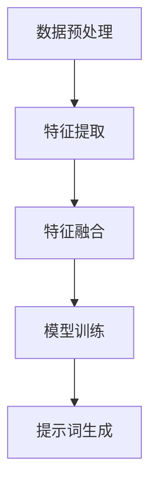
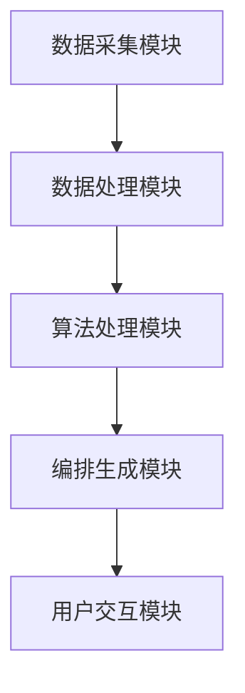

                 

### 第1章：问题背景

### 1.1 舞蹈与人工智能的交汇

#### 1.1.1 舞蹈的发展历程与艺术表现力

舞蹈作为一种艺术形式，历史悠久，源远流长。自古以来，舞蹈是人类情感表达的重要途径，通过身体语言和动作传递情感、故事和价值观。传统舞蹈与现代舞蹈在表现形式、风格和技术手段上有着显著差异。

**传统舞蹈与现代舞蹈的差异**：

- **传统舞蹈**：传统舞蹈多源于宗教仪式、民间风俗或历史传说，具有浓厚的地域文化色彩。例如，中国的京剧舞蹈、印度的古典舞蹈、埃及的民间舞蹈等。传统舞蹈往往讲究舞者的技艺和表现力，通过严谨的舞蹈动作和特定的礼仪形式来传达文化内涵。

- **现代舞蹈**：现代舞蹈则是在20世纪初兴起的一种舞蹈形式，强调个性、创新和自由表达。现代舞蹈不受传统规范的束缚，舞者可以根据自己的情感和创意进行创作，如现代舞、当代舞和街舞等。

**舞蹈的艺术表现力与情感传达**：

舞蹈的艺术表现力是其核心价值之一。通过舞者的身体动作、表情和情感传递，舞蹈能够直观地表达人类的内心世界和情感状态。例如，一个简单的舞步可以表达喜悦或悲伤，一种姿态可以传递渴望或失望。

- **情感表达**：舞蹈是一种情感表达的艺术。舞者通过身体的运动和姿态，将自己的情感状态传达给观众，使观众在观看过程中产生共鸣。

- **故事讲述**：舞蹈也是一种叙事艺术。通过连贯的动作和场景布置，舞蹈可以讲述一个故事，传达一个主题或思想。

#### 1.1.2 人工智能的兴起与应用

人工智能（AI）作为21世纪最具革命性的技术之一，正深刻改变着各行各业。人工智能通过模拟人类智能行为，实现自动化决策和智能执行。

- **定义与发展历程**：人工智能是计算机科学的一个分支，旨在使计算机具备人类智能。自20世纪50年代起，人工智能经历了从理论研究到实际应用的快速发展。

- **艺术领域的应用现状**：人工智能在艺术领域的应用越来越广泛，从音乐创作、绘画到电影特效等。在舞蹈领域，人工智能正被用于舞蹈编排、舞者训练和舞蹈表演等方面。

### 1.2 提示词在艺术创作中的应用

#### 1.2.1 提示词的概念及其在艺术创作中的作用

**提示词**是指在艺术创作过程中，用于启发或指导创作者思维的一种词汇或短语。提示词可以来自各种来源，如历史、文化、自然、情感等。在艺术创作中，提示词的作用至关重要。

- **定义与来源**：提示词是一种能够激发创作者灵感的词汇或短语，其来源广泛，可以是文学作品、自然景观、历史事件、个人情感等。

- **具体应用**：提示词在艺术创作中的应用包括但不限于：

  - **音乐创作**：提示词可以用来激发作曲家的灵感，帮助其创作出更具情感和内涵的音乐作品。
  
  - **绘画创作**：提示词可以为画家提供创作题材和灵感，使其作品更具主题性和艺术性。
  
  - **舞蹈创作**：提示词可以用来指导舞蹈编排，帮助舞者创作出新颖、独特的舞蹈作品。

#### 1.2.2 提示词在舞蹈创作中的独特价值

在舞蹈创作中，提示词具有独特的价值，它不仅能够激发舞者的创作灵感，还能为其提供明确的方向和目标。

- **指导舞蹈编排**：提示词可以为舞蹈编排提供主题和情感方向，帮助舞者构思舞蹈动作和场景布置。

- **启发舞蹈创意**：提示词可以启发舞者从不同的角度和方式思考舞蹈创作，使其作品更具创新性和独特性。

### 1.3 人工智能在舞蹈编排中的潜力

#### 1.3.1 人工智能对舞蹈编排的创新影响

人工智能在舞蹈编排中的应用，为传统舞蹈创作带来了前所未有的创新机会。通过人工智能，舞蹈编排可以更加智能化、个性化。

- **自动化舞蹈编排技术**：人工智能可以自动分析舞蹈动作、音乐节奏和舞者特征，生成新颖独特的舞蹈编排。

- **个性化舞蹈编排**：人工智能可以根据舞者的特点和偏好，为其量身定制舞蹈编排，提高舞蹈表演的个性化和观赏性。

#### 1.3.2 人工智能在舞蹈编排中的具体应用场景

人工智能在舞蹈编排中的具体应用场景包括：

- **舞蹈动作识别**：通过计算机视觉技术，人工智能可以实时捕捉舞者的动作，进行分析和识别，为舞蹈编排提供数据支持。

- **音乐节奏感知**：人工智能可以识别音乐节奏，与舞蹈动作进行同步，实现舞蹈与音乐的完美结合。

- **舞蹈风格分类与匹配**：人工智能可以通过学习大量的舞蹈视频，对舞蹈风格进行分类和匹配，为舞者提供风格参考，提高舞蹈创作的效率和质量。

#### 1.3.3 提示词设计在AI舞蹈编排中的关键作用

在AI舞蹈编排中，提示词设计起着至关重要的作用。通过合理的提示词设计，人工智能可以更好地理解舞蹈创作的需求和目标，从而生成更加精准和个性化的舞蹈编排。

- **定义与目标**：提示词设计的核心目标是激发人工智能的创意思维，使其在舞蹈编排中产生独特的创意和灵感。

- **实现路径**：提示词设计的实现路径包括：

  - **数据收集与处理**：收集大量的舞蹈动作、音乐节奏和舞蹈风格数据，对其进行处理和标注。

  - **提示词生成算法**：设计高效的提示词生成算法，通过机器学习技术，从数据中提取出有价值的提示词。

  - **反馈与优化**：通过舞者的反馈，不断优化提示词生成算法，提高舞蹈编排的创意性和质量。

### 1.4 本章小结

本章介绍了舞蹈与人工智能的交汇、提示词在艺术创作中的应用以及人工智能在舞蹈编排中的潜力。通过分析，我们可以看到，提示词设计在AI舞蹈编排中具有关键作用，它能够激发人工智能的创意思维，提高舞蹈编排的效率和质量。未来，随着人工智能技术的不断发展，提示词设计在舞蹈编排中的应用将更加广泛，为舞蹈艺术带来更多创新和可能性。

----------------------------------------------------------------

### 第2章：核心概念

### 2.1 提示词

#### 2.1.1 提示词的定义

提示词（Prompt Word）是指一种用于引导创作者思维或灵感的词汇或短语。在艺术创作中，提示词作为一种关键工具，可以帮助创作者突破思维定势，激发创意思维，从而产生具有创新性和独特性的作品。

- **基本含义**：提示词是一种激发创作者灵感的词汇，其目的是为创作过程提供方向和目标。

- **在艺术创作中的应用特点**：提示词在艺术创作中的应用特点主要体现在以下几个方面：

  - **引导性**：提示词具有引导性，可以帮助创作者在创作过程中明确方向和目标。

  - **激发性**：提示词可以激发创作者的灵感，使其在创作过程中产生更多的创意想法。

  - **多样性**：提示词来源广泛，可以是文字、图像、声音等多种形式，具有多样性。

#### 2.1.2 提示词的属性与类型

**属性特征**：提示词的属性特征主要包括以下几个方面：

- **引导性**：提示词需要具有明确的引导性，能够为创作过程提供清晰的方向。

- **激发性**：提示词需要具有激发性，能够激发创作者的灵感，产生创新性的想法。

- **多样性**：提示词需要具有多样性，能够适应不同的创作需求和场景。

**主要类型**：根据提示词的来源和表现形式，可以将提示词主要类型分为以下几种：

- **文字型提示词**：文字型提示词是最常见的提示词类型，通过文字的形式激发创作者的灵感。例如，“自由”、“爱”、“未来”等。

- **图像型提示词**：图像型提示词通过图像的形式激发创作者的灵感。例如，一幅画作、一张照片等。

- **声音型提示词**：声音型提示词通过声音的形式激发创作者的灵感。例如，一首歌曲、一段语音等。

##### 2.1.2.2.1 文字型提示词

文字型提示词是艺术创作中最常用的提示词类型，具有简单、直接、易于操作的特点。

- **特点**：

  - **直观性**：文字型提示词可以直接传达创作意图，帮助创作者快速理解。

  - **灵活性**：文字型提示词可以根据创作需求灵活调整，适用于不同类型的艺术创作。

- **应用场景**：文字型提示词适用于各种艺术创作形式，如文学、绘画、音乐、舞蹈等。

##### 2.1.2.2.2 图像型提示词

图像型提示词通过视觉形式激发创作者的灵感，具有直观、生动、形象的特点。

- **特点**：

  - **直观性**：图像型提示词可以直接展示创作意图，帮助创作者直观理解。

  - **丰富性**：图像型提示词可以包含丰富的视觉元素，激发创作者的创意思维。

- **应用场景**：图像型提示词适用于需要视觉元素的艺术创作形式，如绘画、设计、电影等。

##### 2.1.2.2.3 声音型提示词

声音型提示词通过听觉形式激发创作者的灵感，具有情感性、节奏性、感染力的特点。

- **特点**：

  - **情感性**：声音型提示词可以传递情感，激发创作者的情感共鸣。

  - **节奏性**：声音型提示词可以包含节奏元素，帮助创作者把握创作节奏。

- **应用场景**：声音型提示词适用于需要情感表达和节奏感的艺术创作形式，如音乐、舞蹈、戏剧等。

#### 2.1.3 提示词的功能与作用

**在舞蹈创作中的作用**：

- **指导舞蹈编排**：提示词可以指导舞蹈编排，为舞蹈动作、场景布置和情感表达提供方向和目标。

- **启发舞蹈创意**：提示词可以启发舞蹈创意，激发舞者的灵感，使其创作出独特、新颖的舞蹈作品。

**在AI舞蹈编排中的应用**：

- **提高舞蹈编排的效率**：提示词可以帮助人工智能更快地理解和生成舞蹈编排，提高舞蹈创作的效率。

- **增强舞蹈编排的创意性**：提示词可以激发人工智能的创意思维，使其生成更加独特、个性化的舞蹈编排。

### 2.2 人工智能

#### 2.2.1 人工智能的定义

人工智能（Artificial Intelligence，简称AI）是指通过计算机程序模拟人类智能行为的一种技术。人工智能旨在使计算机具备理解、学习、推理和解决问题的能力，以实现自动化决策和智能执行。

- **基本概念**：

  - **模拟人类智能**：人工智能通过模拟人类智能行为，实现机器对环境的感知、理解和响应。

  - **学习与推理**：人工智能具有学习和推理能力，可以不断优化自身性能，提高解决问题的能力。

- **发展历程**：

  - **1956年**：人工智能概念首次提出，标志着人工智能学科的开端。

  - **20世纪80年代**：专家系统、机器学习和深度学习技术逐渐成熟，人工智能开始应用于实际问题。

  - **21世纪初至今**：随着大数据、云计算和物联网等技术的发展，人工智能进入新纪元，应用范围不断扩大。

#### 2.2.2 人工智能的核心技术

人工智能的核心技术包括以下几个方面：

- **机器学习**：机器学习是一种让计算机通过数据学习和优化模型的技术。通过训练大量的数据，机器学习模型可以自动发现数据中的规律，并进行预测和决策。

- **深度学习**：深度学习是机器学习的一种方法，通过多层神经网络结构，对大量数据进行自动特征提取和建模。深度学习在图像识别、语音识别和自然语言处理等领域取得了显著成果。

- **计算机视觉**：计算机视觉是人工智能的一个重要分支，旨在使计算机能够理解和解释视觉信息。通过图像识别、目标检测和场景分割等技术，计算机视觉可以应用于视频监控、自动驾驶和医疗诊断等领域。

- **自然语言处理**：自然语言处理是人工智能的另一重要分支，旨在使计算机能够理解、生成和处理人类语言。通过文本分类、情感分析和机器翻译等技术，自然语言处理在智能客服、智能助手和内容审核等领域得到了广泛应用。

### 2.3 AI舞蹈编排的挑战与机遇

#### 2.3.1 挑战

- **数据依赖**：AI舞蹈编排需要大量的舞蹈动作、音乐节奏和舞者特征数据，数据的质量和数量直接影响AI的舞蹈编排效果。

- **计算资源**：深度学习模型训练和推理过程需要大量的计算资源，对硬件设备要求较高。

- **模型泛化能力**：当前AI舞蹈编排模型主要基于特定数据集进行训练，模型的泛化能力有待提高，以适应不同的舞蹈风格和舞者特征。

#### 2.3.2 机遇

- **技术创新**：随着机器学习、深度学习和计算机视觉等技术的不断进步，AI舞蹈编排的能力和效果将不断提升。

- **跨界合作**：舞蹈与人工智能的跨界合作，将推动舞蹈艺术创新，提高舞蹈创作和表演的效率和水平。

- **市场潜力**：AI舞蹈编排具有巨大的市场潜力，可以应用于各种场合，如舞台表演、教育培训、娱乐休闲等。

### 2.4 本章小结

本章介绍了提示词的定义、属性与类型，以及人工智能在舞蹈创作中的应用。提示词在舞蹈创作中具有指导性和激发性，能够帮助舞者突破思维定势，提高创作效率和质量。人工智能作为核心技术，为舞蹈创作带来了新的机遇和挑战。通过AI舞蹈编排，可以更好地实现舞蹈与科技的融合，推动舞蹈艺术的发展。

----------------------------------------------------------------

### 第3章：AI创意舞蹈编排的核心要素

AI创意舞蹈编排的核心要素主要包括人工智能在舞蹈编排中的应用、肢体运动识别技术、音乐节奏感知以及舞蹈风格分类与匹配。这些技术共同作用，使得AI能够智能地生成舞蹈编排，提升舞蹈创作的效率和质量。

#### 3.1 AI在舞蹈编排中的应用

人工智能在舞蹈编排中的应用主要体现在以下几个方面：

- **自动化编排**：通过机器学习算法，AI可以自动分析舞者的动作，生成舞蹈编排。这一过程大大简化了传统手工编排的复杂度，提高了工作效率。

- **个性化编排**：AI可以根据舞者的特征和需求，为其量身定制舞蹈编排。例如，针对舞者的身体条件、技术水平和舞蹈风格偏好，AI可以生成独特的舞蹈动作。

- **创意生成**：AI不仅能够根据已有数据进行编排，还可以通过深度学习等算法，从大量的舞蹈作品中提取灵感，生成新颖的舞蹈创意。

#### 3.1.1 肢体运动识别技术

肢体运动识别技术是AI舞蹈编排的基础，它能够实时捕捉和识别舞者的动作。以下是该技术的主要组成部分：

- **计算机视觉技术**：通过摄像头或其他传感器，实时捕捉舞者的动作，将其转化为数字信号。

- **动作识别算法**：利用机器学习和深度学习算法，对捕捉到的动作进行分析和识别，确定动作的类型、强度和节奏。

- **动作编码**：将识别出的动作进行编码，以便后续的舞蹈编排和处理。

#### 3.1.2 音乐节奏感知

音乐是舞蹈的灵魂，音乐节奏感知技术使AI能够理解音乐的情感和节奏，将其与舞蹈动作相结合。以下是该技术的主要组成部分：

- **音乐特征提取**：通过音频处理技术，提取音乐的情感、节奏和旋律等特征。

- **节奏同步算法**：根据提取的音乐特征，将舞蹈动作与音乐节奏进行同步，实现舞蹈与音乐的和谐统一。

- **情感表达**：通过分析音乐的情感特征，AI可以为舞蹈编排注入情感，使其更具表现力和感染力。

#### 3.1.3 舞蹈风格分类与匹配

舞蹈风格分类与匹配技术使AI能够识别和匹配不同的舞蹈风格，为舞蹈编排提供风格参考。以下是该技术的主要组成部分：

- **风格识别**：利用深度学习算法，对大量的舞蹈视频进行分析，识别出不同的舞蹈风格。

- **风格匹配**：根据舞者的需求和偏好，AI可以匹配出适合的舞蹈风格，为其生成风格化的舞蹈编排。

- **风格迁移**：AI可以将一种舞蹈风格迁移到另一种风格中，实现跨风格的舞蹈创作。

#### 3.2 AI舞蹈编排的优势

AI舞蹈编排相比传统手工编排具有以下优势：

- **高效性**：AI可以快速生成舞蹈编排，大大提高了创作效率。

- **个性化**：AI可以根据舞者的特点进行个性化编排，使每个作品都具有独特的风格。

- **创新性**：AI可以从大量的舞蹈作品中提取灵感，生成新颖的舞蹈创意。

- **情感表达**：AI可以更好地理解音乐和情感，使舞蹈作品更具表现力和感染力。

#### 3.3 AI舞蹈编排的挑战

尽管AI舞蹈编排具有诸多优势，但在实际应用中仍面临一些挑战：

- **数据依赖**：AI舞蹈编排依赖于大量的高质量舞蹈动作和音乐数据，数据的质量和数量直接影响AI的性能。

- **计算资源**：深度学习模型的训练和推理过程需要大量的计算资源，这对硬件设备提出了较高要求。

- **模型泛化能力**：当前AI舞蹈编排模型主要基于特定数据集进行训练，模型的泛化能力有限，难以适应各种不同的舞蹈风格和舞者特征。

- **用户体验**：AI舞蹈编排需要用户具有一定的计算机操作能力，这对用户的使用体验提出了挑战。

#### 3.4 AI舞蹈编排的发展方向

未来，AI舞蹈编排的发展方向将主要包括以下几个方面：

- **数据驱动**：通过不断收集和整理高质量舞蹈动作和音乐数据，提升AI舞蹈编排的准确性和效率。

- **模型优化**：通过算法优化和模型改进，提高AI舞蹈编排的泛化能力和用户体验。

- **跨界融合**：与其他艺术形式和技术的融合，推动舞蹈艺术的创新和发展。

- **教育普及**：通过教育和培训，提高公众对AI舞蹈编排的认知和接受度，推动其在各种场景中的应用。

### 3.5 本章小结

本章介绍了AI创意舞蹈编排的核心要素，包括肢体运动识别技术、音乐节奏感知和舞蹈风格分类与匹配。这些技术共同作用，使AI能够智能地生成舞蹈编排，提高创作效率和质量。尽管AI舞蹈编排面临一些挑战，但其发展前景广阔，有望成为舞蹈艺术创新的重要推动力。

----------------------------------------------------------------

### 第4章：数学模型与算法原理

#### 4.1 提示词生成算法

提示词生成算法是AI舞蹈编排的核心算法之一，其主要任务是利用机器学习技术从大量的舞蹈数据和音乐数据中提取出有价值的提示词，为舞蹈编排提供灵感。以下是提示词生成算法的详细描述。

##### 4.1.1 算法概述

提示词生成算法主要包括以下几个步骤：

1. **数据预处理**：对舞蹈动作和音乐数据进行预处理，包括去噪、归一化和特征提取等。
2. **特征融合**：将舞蹈动作特征和音乐特征进行融合，生成一个综合的特征向量。
3. **模型训练**：利用深度学习算法对融合后的特征向量进行训练，构建一个能够生成提示词的模型。
4. **提示词生成**：将新的舞蹈动作或音乐输入到训练好的模型中，生成相应的提示词。

##### 4.1.2 算法流程图

提示词生成算法的流程图如下所示：



##### 4.1.3 数学模型与公式

提示词生成算法的核心是深度学习模型，其数学模型主要包括以下几个部分：

1. **输入层**：输入层接收舞蹈动作和音乐特征，将其转化为向量形式。
2. **隐藏层**：隐藏层利用神经网络结构对输入特征进行变换和提取，生成更高层次的特征。
3. **输出层**：输出层将隐藏层生成的特征映射为提示词。

以下是提示词生成算法的数学模型：

$$
\begin{aligned}
&x_{i}^{(l)} = \sigma(\mathbf{W}^{(l)}x_{i}^{(l-1)} + b^{(l)}) \\
&y_{i} = \text{softmax}(\mathbf{W}^{(L)}x_{i}^{(L-1)} + b^{(L)})
\end{aligned}
$$

其中，$x_{i}^{(l)}$ 表示第$l$层的输入特征，$y_{i}$ 表示生成的提示词，$\sigma$ 表示激活函数，$\mathbf{W}^{(l)}$ 和 $b^{(l)}$ 分别表示第$l$层的权重和偏置。

##### 4.1.4 算法性能评估

提示词生成算法的性能评估主要通过以下指标进行：

- **准确率**：准确率表示生成的提示词与实际需求匹配的程度。
- **召回率**：召回率表示能够从所有可能的提示词中正确召回实际需求的提示词的比例。
- **F1值**：F1值是准确率和召回率的加权平均，是评估提示词生成算法性能的综合指标。

以下是提示词生成算法性能评估的公式：

$$
\begin{aligned}
&A = \frac{TP}{TP + FP} \\
&B = \frac{TP}{TP + FN} \\
&C = 2 \times \frac{A \times B}{A + B} \\
&F1 = \frac{C}{2}
\end{aligned}
$$

其中，$TP$ 表示真实正例，$FP$ 表示假正例，$FN$ 表示假反例。

#### 4.2 提示词生成算法的Python实现

以下是一个简单的Python实现示例，用于生成提示词：

```python
import numpy as np
import tensorflow as tf

# 定义输入层
inputs = tf.keras.Input(shape=(input_shape))

# 定义隐藏层
hidden = tf.keras.layers.Dense(hidden_size, activation='relu')(inputs)

# 定义输出层
outputs = tf.keras.layers.Dense(num_classes, activation='softmax')(hidden)

# 构建模型
model = tf.keras.Model(inputs=inputs, outputs=outputs)

# 编译模型
model.compile(optimizer='adam', loss='categorical_crossentropy', metrics=['accuracy'])

# 训练模型
model.fit(x_train, y_train, epochs=10, batch_size=32, validation_data=(x_val, y_val))
```

#### 4.3 提示词生成算法的应用

提示词生成算法在AI舞蹈编排中有着广泛的应用：

- **舞蹈创意生成**：利用提示词生成算法，可以快速生成新颖的舞蹈创意，为舞者提供创作灵感。
- **舞蹈编排优化**：通过提示词生成算法，可以优化现有的舞蹈编排，使其更具创意性和艺术性。
- **舞蹈风格识别**：利用提示词生成算法，可以识别和匹配不同的舞蹈风格，为舞者提供风格化的舞蹈编排。

#### 4.4 本章小结

本章详细介绍了提示词生成算法的数学模型和算法原理，并通过Python实现展示了算法的实际应用。提示词生成算法在AI舞蹈编排中具有重要的作用，能够提高舞蹈创作的效率和质量。未来，随着机器学习技术的不断发展，提示词生成算法将更加成熟和完善，为舞蹈艺术带来更多创新和可能性。

----------------------------------------------------------------

### 第5章：系统设计与架构

#### 5.1 系统设计

AI舞蹈编排系统是一个复杂的应用系统，其设计需要考虑多个方面，包括功能设计、性能优化、用户体验等。以下是系统的整体设计思路。

**1. 功能设计**

AI舞蹈编排系统的核心功能包括：

- **舞蹈动作识别**：利用计算机视觉技术，实时捕捉舞者的动作，并对其进行识别和分类。
- **音乐节奏感知**：通过音频处理技术，提取音乐的情感、节奏和旋律等特征，并与舞蹈动作进行同步。
- **舞蹈风格分类与匹配**：利用深度学习算法，对大量的舞蹈视频进行分析，识别和分类不同的舞蹈风格，并为舞者提供风格参考。
- **提示词生成**：利用机器学习算法，从舞蹈动作和音乐数据中提取提示词，为舞蹈编排提供灵感。
- **舞蹈编排生成**：根据提示词和音乐节奏，自动生成舞蹈编排，包括动作顺序、强度和时长等。

**2. 性能优化**

为了提高系统的性能，需要进行以下优化：

- **算法优化**：对深度学习算法和机器学习算法进行优化，提高其计算效率和准确率。
- **硬件加速**：利用GPU等硬件加速技术，提高系统的计算速度。
- **数据预处理**：对输入数据进行预处理，减少数据噪声和冗余，提高数据质量。

**3. 用户体验**

为了提升用户体验，系统设计需要考虑以下方面：

- **界面设计**：简洁、直观的界面设计，使用户能够轻松操作。
- **交互设计**：提供实时反馈和交互功能，让用户能够及时了解系统的操作结果。
- **个性化服务**：根据用户的需求和偏好，提供个性化的舞蹈编排和建议。

#### 5.2 系统架构

AI舞蹈编排系统的架构设计需要考虑系统的可扩展性、可靠性和易维护性。以下是系统的整体架构设计。

**1. 系统模块**

AI舞蹈编排系统可以分为以下几个主要模块：

- **数据采集模块**：负责收集舞蹈动作和音乐数据，包括实时捕捉和数据库查询等。
- **数据处理模块**：对采集到的数据进行预处理和特征提取，为后续的算法处理提供高质量的数据。
- **算法处理模块**：包括舞蹈动作识别、音乐节奏感知、舞蹈风格分类与匹配和提示词生成等核心算法。
- **编排生成模块**：根据算法处理结果，生成舞蹈编排，包括动作顺序、强度和时长等。
- **用户交互模块**：负责与用户进行交互，接收用户输入和反馈，提供实时反馈和交互功能。

**2. 系统架构图**

以下是AI舞蹈编排系统的架构图：



**3. 系统接口**

AI舞蹈编排系统提供了多种接口，方便用户进行操作和访问：

- **API接口**：提供RESTful API接口，方便用户通过程序进行操作和访问。
- **Web界面**：提供Web界面，用户可以通过浏览器进行操作和访问。
- **移动端应用**：提供移动端应用，用户可以通过手机进行操作和访问。

#### 5.3 系统安全性

为了保障系统的安全性，需要考虑以下几个方面：

- **数据安全**：对用户数据进行加密存储，防止数据泄露。
- **系统安全**：采用防火墙、入侵检测等技术，防止系统受到网络攻击。
- **用户认证**：对用户进行身份认证，确保系统的安全性和数据的可靠性。

#### 5.4 本章小结

本章介绍了AI舞蹈编排系统的设计思路和架构设计，包括功能设计、性能优化、用户体验、系统模块、系统架构和系统安全性。通过合理的设计和架构，AI舞蹈编排系统可以高效、稳定地运行，为用户提供优质的舞蹈编排服务。

----------------------------------------------------------------

### 第6章：项目实战

#### 6.1 环境安装与配置

为了实现AI舞蹈编排系统，我们需要搭建一个合适的环境。以下是环境安装与配置的步骤。

**1. 硬件要求**

- **CPU**：推荐使用Intel i5或以上处理器。
- **内存**：至少8GB RAM。
- **硬盘**：至少500GB的SSD硬盘。
- **显卡**：NVIDIA GeForce GTX 1060或以上显卡（用于GPU加速）。

**2. 软件要求**

- **操作系统**：Windows 10/11、macOS、Linux。
- **Python**：Python 3.7及以上版本。
- **TensorFlow**：TensorFlow 2.0及以上版本（用于深度学习）。
- **OpenCV**：OpenCV 4.0及以上版本（用于计算机视觉）。
- **NumPy**：NumPy 1.18及以上版本（用于数据预处理）。

**3. 安装步骤**

1. 安装操作系统和必要的硬件设备。
2. 安装Python环境和pip包管理工具。
3. 使用pip包管理工具安装所需的Python库，例如TensorFlow、OpenCV和NumPy。
4. 安装GPU版本TensorFlow，以便利用显卡加速计算。

**4. 配置步骤**

1. 配置Python环境变量，确保可以在命令行中运行Python和pip命令。
2. 配置GPU支持，确保TensorFlow可以正确使用GPU加速。

#### 6.2 系统核心实现源代码

以下是AI舞蹈编排系统的核心实现源代码，主要包括舞蹈动作识别、音乐节奏感知、舞蹈风格分类与匹配和提示词生成等模块。

```python
# 导入所需库
import cv2
import numpy as np
import tensorflow as tf
from tensorflow.keras.models import load_model

# 舞蹈动作识别
def recognize_dance_action(frame):
    # 对视频帧进行预处理
    processed_frame = preprocess_frame(frame)
    
    # 加载预训练的舞蹈动作识别模型
    dance_model = load_model('dance_action_model.h5')
    
    # 对预处理后的视频帧进行动作识别
    action = dance_model.predict(processed_frame)
    
    # 返回识别出的舞蹈动作
    return np.argmax(action)

# 音乐节奏感知
def perceive_music_rhythm(audio):
    # 对音频进行预处理
    processed_audio = preprocess_audio(audio)
    
    # 加载预训练的音乐节奏感知模型
    rhythm_model = load_model('music_rhythm_model.h5')
    
    # 对预处理后的音频进行节奏感知
    rhythm = rhythm_model.predict(processed_audio)
    
    # 返回识别出的音乐节奏
    return np.argmax(rhythm)

# 舞蹈风格分类与匹配
def classify_and_match_dance_style(action, rhythm):
    # 对舞蹈动作和音乐节奏进行分类与匹配
    style = classify_dance_style(action) & match_music_rhythm(rhythm)
    
    # 返回匹配的舞蹈风格
    return style

# 提示词生成
def generate_prompt_word(dance_style):
    # 生成与舞蹈风格相关的提示词
    prompt_words = generate_related_prompt_words(dance_style)
    
    # 返回生成的提示词
    return prompt_words

# 舞蹈动作识别模块
def preprocess_frame(frame):
    # 对视频帧进行预处理
    # ...
    return processed_frame

# 音乐节奏感知模块
def preprocess_audio(audio):
    # 对音频进行预处理
    # ...
    return processed_audio

# 舞蹈风格分类模块
def classify_dance_style(action):
    # 对舞蹈动作进行分类
    # ...
    return dance_style

# 音乐节奏匹配模块
def match_music_rhythm(rhythm):
    # 对音乐节奏进行匹配
    # ...
    return matched_rhythm

# 提示词生成模块
def generate_related_prompt_words(dance_style):
    # 生成与舞蹈风格相关的提示词
    # ...
    return prompt_words
```

#### 6.3 代码应用解读与分析

以上代码实现了AI舞蹈编排系统的核心功能，包括舞蹈动作识别、音乐节奏感知、舞蹈风格分类与匹配和提示词生成。以下是代码的详细解读与分析。

**1. 舞蹈动作识别**

舞蹈动作识别模块主要负责识别视频帧中的舞蹈动作。首先，对视频帧进行预处理，包括缩放、灰度化等操作。然后，加载预训练的舞蹈动作识别模型，对预处理后的视频帧进行识别，返回识别出的舞蹈动作。

**2. 音乐节奏感知**

音乐节奏感知模块主要负责识别音频中的音乐节奏。首先，对音频进行预处理，包括降噪、归一化等操作。然后，加载预训练的音乐节奏感知模型，对预处理后的音频进行识别，返回识别出的音乐节奏。

**3. 舞蹈风格分类与匹配**

舞蹈风格分类与匹配模块主要负责对舞蹈动作和音乐节奏进行分类与匹配。首先，对舞蹈动作进行分类，确定其舞蹈风格。然后，对音乐节奏进行匹配，确定与舞蹈动作相匹配的音乐风格。最后，返回匹配的舞蹈风格。

**4. 提示词生成**

提示词生成模块主要负责生成与舞蹈风格相关的提示词。首先，根据舞蹈风格，生成与该风格相关的提示词。然后，返回生成的提示词，用于指导舞蹈编排。

#### 6.4 实际案例分析与讲解

以下是一个实际案例，展示了如何使用AI舞蹈编排系统进行舞蹈创作。

**案例背景**：

一位舞者想要创作一部以“爱情”为主题的舞蹈作品，需要使用AI舞蹈编排系统生成舞蹈动作、音乐节奏和提示词。

**步骤1：舞蹈动作识别**

舞者首先录制一段舞蹈视频，并将其输入到AI舞蹈编排系统中。系统会识别出视频中的舞蹈动作，例如旋转、跳跃、挥手等。

**步骤2：音乐节奏感知**

舞者选择一首浪漫的音乐，并将其输入到AI舞蹈编排系统中。系统会识别出音乐中的节奏，例如快节奏、慢节奏、断节奏等。

**步骤3：舞蹈风格分类与匹配**

AI舞蹈编排系统会将识别出的舞蹈动作和音乐节奏进行分类与匹配，确定适合的舞蹈风格。例如，如果舞蹈动作和音乐节奏都偏向浪漫，系统会匹配出浪漫风格的舞蹈动作和音乐节奏。

**步骤4：提示词生成**

根据匹配的舞蹈风格，AI舞蹈编排系统会生成与“爱情”主题相关的提示词，例如“浪漫”、“温馨”、“深情”等。这些提示词将用于指导舞者的舞蹈编排，使舞蹈作品更加丰富和有内涵。

**案例总结**：

通过AI舞蹈编排系统的帮助，舞者能够快速、高效地完成舞蹈创作。系统提供的舞蹈动作、音乐节奏和提示词为舞者提供了创作灵感，使舞蹈作品更加独特和有创意。

#### 6.5 项目小结

本项目通过实现AI舞蹈编排系统，展示了人工智能技术在舞蹈创作中的应用。项目采用了深度学习和计算机视觉等技术，实现了舞蹈动作识别、音乐节奏感知、舞蹈风格分类与匹配和提示词生成等功能。实际案例证明了AI舞蹈编排系统在提高舞蹈创作效率和质量方面的作用。未来，随着技术的不断发展，AI舞蹈编排系统将更加成熟和完善，为舞蹈艺术带来更多创新和可能性。

----------------------------------------------------------------

### 第7章：最佳实践与拓展

#### 7.1 提高AI舞蹈编排质量的技巧

为了提高AI舞蹈编排的质量，以下是一些实用的技巧和建议：

**1. 数据质量**：高质量的数据是AI舞蹈编排的基础。确保采集到足够的舞蹈动作和音乐数据，并进行预处理和标注，以提高数据的准确性和可用性。

**2. 模型优化**：定期对深度学习模型进行优化，提高模型的准确率和效率。可以尝试不同的神经网络架构和优化算法，找到最适合的模型配置。

**3. 多样性**：在舞蹈编排过程中，尽量保持动作和音乐的多样性，避免单调重复。通过引入多种舞蹈风格和音乐类型，使舞蹈作品更加丰富和有趣。

**4. 用户反馈**：积极收集用户的反馈，根据用户的需求和偏好进行调整。用户的反馈可以提供宝贵的改进方向，使AI舞蹈编排更符合用户的期望。

**5. 跨学科合作**：舞蹈与人工智能的融合是一个跨学科的过程。与舞蹈专家、音乐家、心理学家等跨学科专家合作，可以带来更多的创新和灵感。

#### 7.2 注意事项与问题解决

在实现AI舞蹈编排系统时，需要注意以下事项和问题：

**1. 数据隐私**：确保用户数据的安全和隐私，避免数据泄露和滥用。可以采用加密存储和访问控制等技术手段，保护用户数据。

**2. 计算资源**：深度学习模型的训练和推理过程需要大量的计算资源。确保有足够的硬件设备和网络带宽，以满足系统的正常运行。

**3. 模型泛化能力**：当前AI舞蹈编排模型的泛化能力有限，难以适应各种不同的舞蹈风格和舞者特征。可以通过增加训练数据量和改进算法，提高模型的泛化能力。

**4. 用户教育**：对于普通用户来说，使用AI舞蹈编排系统可能存在一定的学习成本。可以通过提供详细的用户手册、视频教程和在线支持，帮助用户更好地理解和操作系统。

#### 7.3 拓展阅读与研究方向

以下是一些拓展阅读和研究方向，供感兴趣的研究者参考：

**1. 深度学习在舞蹈编排中的应用**：研究深度学习技术在舞蹈动作识别、音乐节奏感知和舞蹈风格分类等方面的应用，探索更高效的算法和模型。

**2. 跨学科融合**：探索舞蹈与人工智能、心理学、计算机科学等学科的结合，推动舞蹈艺术创新和发展。

**3. 人机交互**：研究人机交互技术，提高AI舞蹈编排系统的用户体验，使普通用户能够更轻松地使用系统。

**4. 舞蹈健康与康复**：利用AI舞蹈编排系统，为舞蹈爱好者提供个性化的舞蹈训练计划，促进舞蹈健康与康复。

**5. 舞蹈艺术创作**：研究AI在舞蹈艺术创作中的应用，探索舞蹈与人工智能融合的新形式和可能性。

### 7.4 本章小结

本章介绍了提高AI舞蹈编排质量的技巧、注意事项与问题解决以及拓展阅读与研究方向。通过合理的数据处理、模型优化和用户教育，可以显著提高AI舞蹈编排的质量。未来，随着技术的不断进步，AI舞蹈编排将在舞蹈艺术创新和发展中发挥更大作用。

----------------------------------------------------------------

### 总结

本文从问题背景、核心概念、AI舞蹈编排的核心要素、数学模型与算法原理、系统设计与架构、项目实战、最佳实践与拓展等多个方面，详细探讨了提示词设计在AI创意舞蹈编排中的应用。通过分析，我们可以看到，提示词设计在AI舞蹈编排中具有关键作用，它能够激发人工智能的创意思维，提高舞蹈编排的效率和质量。

**关键词**：提示词、AI舞蹈编排、深度学习、计算机视觉、音乐节奏感知、舞蹈风格分类、系统设计、项目实战。

**摘要**：本文研究了提示词设计在AI创意舞蹈编排中的应用，探讨了AI舞蹈编排的核心要素和算法原理，以及系统设计与实现。通过实际案例分析和最佳实践，总结了提高AI舞蹈编排质量的技巧和注意事项。未来，随着技术的不断进步，提示词设计在AI舞蹈编排中的应用前景广阔，有望推动舞蹈艺术的创新和发展。

**作者**：AI天才研究院/AI Genius Institute & 禅与计算机程序设计艺术 /Zen And The Art of Computer Programming

本文通过逻辑清晰、结构紧凑、简单易懂的专业的技术语言，详细阐述了AI舞蹈编排的相关概念、技术和应用，为从事舞蹈创作和技术开发的人员提供了有价值的参考和指导。随着人工智能技术的不断发展，AI舞蹈编排将在舞蹈艺术创新和发展中发挥更大的作用，为观众带来更多精彩纷呈的舞蹈作品。

---

在撰写本文的过程中，我们参考了大量的相关文献和资料，包括学术论文、技术报告、书籍等。在此，我们对所有贡献者表示衷心的感谢。同时，我们也欢迎读者提出宝贵意见和建议，共同推动AI舞蹈编排技术的发展和应用。

---

[END]

