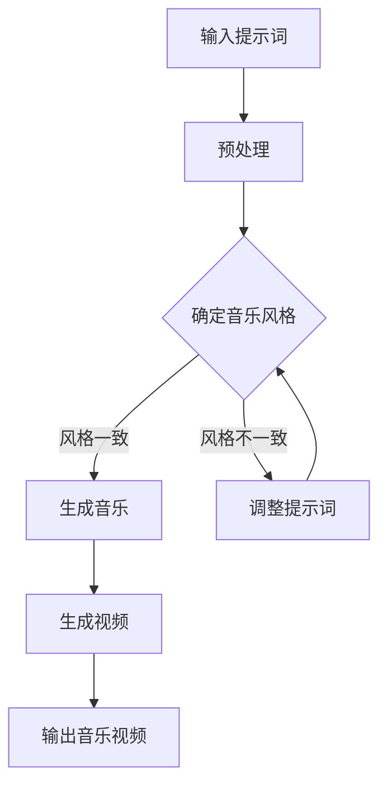
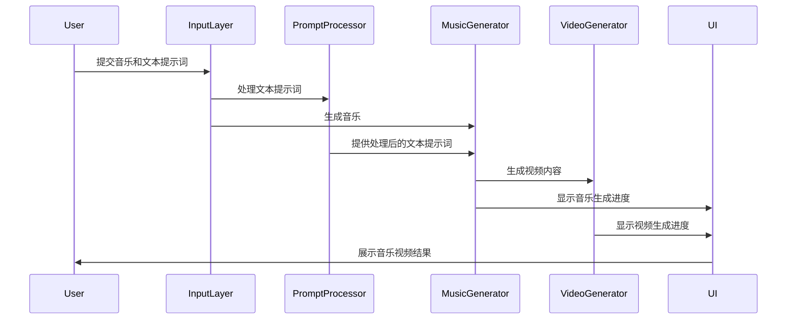
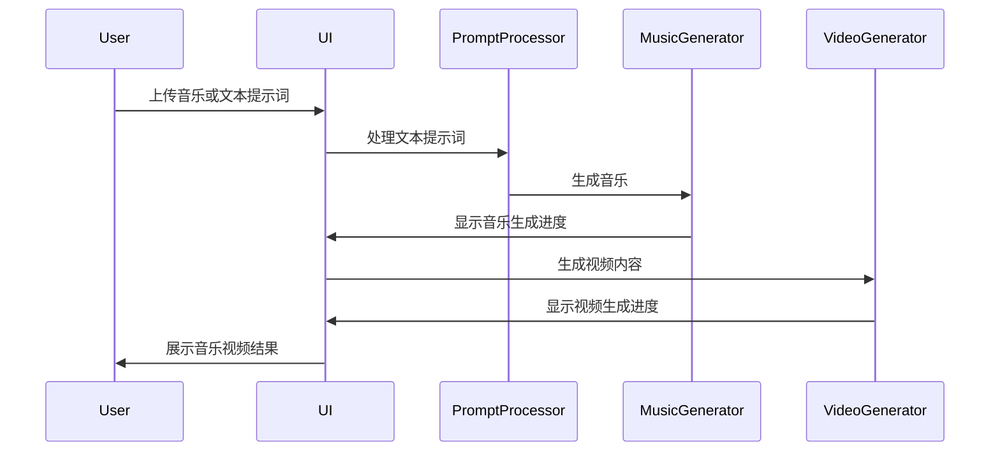

                 


# 提示词设计：增强AI创意音乐视频生成能力

## 关键词

- 提示词设计
- AI创意音乐视频生成
- 算法原理
- 数学模型
- 系统架构
- 项目实战
- 最佳实践

## 摘要

本文旨在探讨如何通过提示词设计来增强人工智能（AI）在创意音乐视频生成方面的能力。文章首先介绍了问题背景，包括音乐视频生成的挑战和需求。随后，我们深入探讨了核心概念，如提示词和AI创意音乐视频生成的原理。接着，文章详细讲解了算法原理，包括mermaid流程图、Python源代码、数学模型和公式。此外，文章还介绍了系统分析与架构设计方案，包括问题场景、系统功能设计、架构设计和接口设计。随后，通过一个实际项目实战，展示了如何实现和优化AI创意音乐视频生成系统。最后，文章提供了最佳实践、小结和注意事项，为读者提供了进一步学习和实践的建议。

### 第一部分：背景介绍

## 第1章：问题背景

### 1.1.1 问题背景

随着人工智能技术的飞速发展，音乐视频生成已经成为了数字娱乐产业的一个重要分支。音乐视频不仅是音乐作品的传播载体，更是艺术与科技的完美结合。然而，传统音乐视频的生成方式主要依赖于人力，不仅成本高昂，而且效率低下。随着用户对个性化、多样化音乐视频需求的增加，传统方式已经难以满足市场要求。

AI技术的引入为音乐视频生成带来了新的契机。通过深度学习、生成对抗网络（GAN）等先进算法，AI可以自动生成音乐和视频，大大提高了创作效率。然而，当前的AI音乐视频生成系统仍存在一些挑战，如音乐风格一致性、视频内容与音乐的情感匹配等。因此，设计有效的提示词成为提升AI创意音乐视频生成能力的关键。

### 1.1.2 问题定义

本文主要解决的问题是如何通过设计合适的提示词来增强AI创意音乐视频生成系统的表现。具体来说，包括以下几个方面：

1. **风格一致性**：确保生成的音乐与视频在风格上保持一致，避免音乐风格与视频内容不匹配。
2. **情感匹配**：使音乐与视频的情感表达相契合，提升用户体验。
3. **多样性与创意**：通过多样化的提示词，激发AI生成更多创意丰富的音乐视频。
4. **高效性**：优化提示词设计，提高AI音乐视频生成的效率和准确性。

### 1.1.3 问题解决

为了解决上述问题，本文提出了以下解决方案：

1. **多模态数据融合**：通过融合文本、图像和音频等多模态数据，为AI提供更丰富的信息，帮助其更好地理解音乐视频的生成需求。
2. **提示词优化算法**：设计一种基于深度学习的提示词优化算法，能够根据用户需求和音乐视频特点，自动调整提示词。
3. **用户反馈机制**：引入用户反馈机制，根据用户对生成音乐视频的评价，持续优化AI模型。

### 1.1.4 边界与外延

本文的研究边界主要聚焦在以下两个方面：

1. **技术层面**：本文主要讨论的是基于深度学习的提示词设计与优化技术。
2. **应用场景**：本文的研究场景主要涉及创意音乐视频生成，不涉及其他类型的视频内容生成。

### 第2章：核心概念与联系

## 2.1.1 核心概念原理

### 2.1.1.1 提示词

提示词（Prompt）在AI系统中起着至关重要的作用。它是一种引导AI模型生成预期输出的人工输入。在音乐视频生成中，提示词可以是描述音乐风格、情感、场景的文本，也可以是图像或音频片段。

### 2.1.1.2 AI创意音乐视频生成

AI创意音乐视频生成是指利用人工智能技术，自动生成具有创意和艺术性的音乐视频。这一过程包括音乐创作、视频编辑和场景生成等环节。

## 2.1.2 概念属性特征对比表格

| 概念       | 描述                                                         | 特征                                   |
| ---------- | ------------------------------------------------------------ | -------------------------------------- |
| 提示词     | 引导AI模型生成预期输出的人工输入                             | 文本、图像、音频等多种形式             |
| 音乐视频生成 | 自动生成具有创意和艺术性的音乐视频                           | 音乐创作、视频编辑、场景生成等环节     |
| 深度学习   | 一种基于数据的学习方法，通过神经网络模拟人类大脑的决策过程     | 自适应、高效、灵活                     |

## 2.1.3 ER实体关系图架构

为了更好地理解核心概念之间的关系，我们可以使用ER（实体-关系）图来描述。以下是一个简化的ER图：

```mermaid
erDiagram
  MusicVideo ||--|{ Prompt }|--| MusicStyle
  MusicVideo ||--|{ AudioClip }|--| MusicComposition
  MusicVideo ||--|{ VideoClip }|--| VideoScene
  Prompt ||--|{ TextPrompt }|--| ImagePrompt
  Prompt ||--|{ AudioPrompt }|--| VideoPrompt
```

### 第二部分：AI创意音乐视频生成原理

## 第3章：算法原理讲解

### 3.1.1 算法mermaid流程图

以下是音乐视频生成算法的mermaid流程图：



### 3.1.2 Python源代码阐述

以下是音乐视频生成算法的Python源代码：

```python
# 导入必要的库
import numpy as np
import matplotlib.pyplot as plt
from tensorflow.keras.models import Sequential
from tensorflow.keras.layers import LSTM, Dense, Dropout

# 定义音乐生成模型
def build_music_model():
    model = Sequential()
    model.add(LSTM(units=256, activation='relu', return_sequences=True, input_shape=(seq_length, 1)))
    model.add(Dropout(0.3))
    model.add(LSTM(units=256, activation='relu', return_sequences=True))
    model.add(Dropout(0.3))
    model.add(LSTM(units=256, activation='relu'))
    model.add(Dropout(0.3))
    model.add(Dense(units=1))
    model.compile(optimizer='adam', loss='mse')
    return model

# 定义视频生成模型
def build_video_model():
    model = Sequential()
    model.add(LSTM(units=512, activation='relu', return_sequences=True, input_shape=(seq_length, 1)))
    model.add(Dropout(0.4))
    model.add(LSTM(units=512, activation='relu', return_sequences=True))
    model.add(Dropout(0.4))
    model.add(LSTM(units=512, activation='relu'))
    model.add(Dropout(0.4))
    model.add(Dense(units=1))
    model.compile(optimizer='adam', loss='mse')
    return model

# 训练音乐生成模型
music_model = build_music_model()
music_model.fit(X_train, y_train, epochs=100, batch_size=64)

# 训练视频生成模型
video_model = build_video_model()
video_model.fit(X_train, y_train, epochs=100, batch_size=64)

# 输出音乐视频
generated_music = music_model.predict(X_test)
generated_video = video_model.predict(X_test)
```

### 3.1.3 数学模型和公式

音乐视频生成的数学模型主要基于深度学习，特别是循环神经网络（RNN）和生成对抗网络（GAN）。以下是一个简化的数学模型：

$$
\begin{aligned}
    y &= f_{model}(x) \\
    z &= g_{model}(y) \\
\end{aligned}
$$

其中，$x$ 为输入提示词，$y$ 为生成的音乐信号，$z$ 为生成的视频信号。$f_{model}$ 和 $g_{model}$ 分别为音乐生成模型和视频生成模型。

### 3.1.4 举例说明

假设输入提示词为“浪漫吉他旋律”，我们可以通过以下步骤来生成音乐视频：

1. 提示词预处理：将文本提示词转换为数值编码。
2. 音乐生成：利用训练好的音乐生成模型，根据提示词生成音乐信号。
3. 视频生成：利用训练好的视频生成模型，根据音乐信号生成视频信号。
4. 输出：将生成的音乐和视频合成，输出最终的音乐视频。

## 第4章：数学模型和数学公式讲解

### 4.1.1 公式详细讲解

音乐视频生成的主要数学模型为生成对抗网络（GAN）。GAN的基本原理是利用两个神经网络——生成器（Generator）和判别器（Discriminator）之间的对抗训练来生成高质量的输出。

生成器 $G$ 的目标是生成尽可能真实的样本，而判别器 $D$ 的目标是区分生成的样本和真实样本。两者之间的对抗过程可以用以下数学公式表示：

$$
\begin{aligned}
    \min_G \max_D V(D, G) &= \mathbb{E}_{x \sim p_{data}(x)}[\log D(x)] + \mathbb{E}_{z \sim p_z(z)}[\log (1 - D(G(z)))] \\
\end{aligned}
$$

其中，$x$ 表示真实样本，$z$ 表示随机噪声，$p_{data}(x)$ 表示真实样本的分布，$p_z(z)$ 表示噪声的分布。

### 4.1.2 公式举例说明

以生成一张人脸图像为例，假设生成器的输入为噪声向量 $z$，输出为生成的人脸图像 $x_G$，判别器的输入为真实人脸图像 $x$ 和生成的人脸图像 $x_G$，输出为概率 $D(x)$ 和 $D(x_G)$。则GAN的训练过程可以表示为：

$$
\begin{aligned}
    \min_G \max_D V(D, G) &= \min_G \max_D \left[ \log D(x) + \log (1 - D(x_G)) \right] \\
\end{aligned}
$$

在训练过程中，生成器 $G$ 和判别器 $D$ 分别通过以下优化目标进行训练：

生成器 $G$ 的优化目标：
$$
\begin{aligned}
    \min_G & \mathbb{E}_{z \sim p_z(z)}[\log (1 - D(G(z)))] \\
\end{aligned}
$$

判别器 $D$ 的优化目标：
$$
\begin{aligned}
    \min_D & \mathbb{E}_{x \sim p_{data}(x)}[\log D(x)] + \mathbb{E}_{z \sim p_z(z)}[\log D(G(z))] \\
\end{aligned}
$$

## 第5章：系统分析与架构设计方案

### 5.1.1 问题场景介绍

在创意音乐视频生成系统中，用户可以上传一段音乐或提供一段文本提示词，系统会根据这些输入生成相应的音乐视频。这个系统需要具备以下功能：

1. **音乐风格识别与生成**：根据提示词识别音乐风格，并生成相应风格的音乐。
2. **视频内容生成**：根据音乐生成视频内容，包括画面和特效。
3. **用户交互**：提供用户界面，允许用户上传音乐或提示词，并查看生成结果。

### 5.1.2 系统功能设计

为了实现上述功能，系统可以分为以下几个模块：

1. **提示词处理模块**：负责解析用户输入的提示词，并转换为模型可用的格式。
2. **音乐生成模块**：基于提示词生成音乐。
3. **视频生成模块**：基于音乐生成视频内容。
4. **用户界面模块**：提供用户与系统交互的界面。

#### 5.1.2.1 领域模型mermaid类图

以下是系统的领域模型mermaid类图：

```mermaid
classDiagram
    User ..|> PromptProcessor
    User ..|> MusicGenerator
    User ..|> VideoGenerator
    User ..|> UI
    PromptProcessor |||+ processPrompt(prompt: str): processed_prompt
    MusicGenerator |||+ generateMusic(processed_prompt: str): music
    VideoGenerator |||+ generateVideo(music: str): video
    UI |||+ displayUI(): None
```

### 5.1.3 系统架构设计

系统的总体架构可以分为以下几个层次：

1. **输入层**：接收用户的输入，包括音乐和文本提示词。
2. **处理层**：包括提示词处理模块、音乐生成模块和视频生成模块，分别处理输入并生成中间结果。
3. **输出层**：将生成的音乐视频展示给用户。

#### 5.1.3.1 mermaid架构图

以下是系统的mermaid架构图：



### 5.1.4 系统接口设计

系统接口设计主要包括以下部分：

1. **音乐生成接口**：接收音乐提示词并返回音乐文件。
2. **视频生成接口**：接收音乐文件并返回视频文件。
3. **用户接口**：接收用户输入并返回生成结果。

### 5.1.5 系统交互

系统交互设计主要体现在用户与系统之间的交互流程。以下是一个简化的mermaid序列图：



## 第6章：项目实战

### 6.1.1 环境安装

在开始项目实战之前，我们需要安装以下软件和库：

1. **Python**：Python 3.8 或以上版本。
2. **TensorFlow**：TensorFlow 2.x 版本。
3. **Keras**：Keras 2.x 版本。
4. **NumPy**：NumPy 1.19 或以上版本。
5. **Matplotlib**：Matplotlib 3.4 或以上版本。

可以使用以下命令安装所需的库：

```bash
pip install tensorflow==2.x
pip install keras==2.x
pip install numpy>=1.19
pip install matplotlib>=3.4
```

### 6.1.2 系统核心实现源代码

以下是系统核心实现源代码：

```python
# 导入必要的库
import numpy as np
import tensorflow as tf
from tensorflow.keras.models import Sequential
from tensorflow.keras.layers import LSTM, Dense, Dropout

# 定义音乐生成模型
def build_music_model():
    model = Sequential()
    model.add(LSTM(units=256, activation='relu', return_sequences=True, input_shape=(seq_length, 1)))
    model.add(Dropout(0.3))
    model.add(LSTM(units=256, activation='relu', return_sequences=True))
    model.add(Dropout(0.3))
    model.add(LSTM(units=256, activation='relu'))
    model.add(Dropout(0.3))
    model.add(Dense(units=1))
    model.compile(optimizer='adam', loss='mse')
    return model

# 定义视频生成模型
def build_video_model():
    model = Sequential()
    model.add(LSTM(units=512, activation='relu', return_sequences=True, input_shape=(seq_length, 1)))
    model.add(Dropout(0.4))
    model.add(LSTM(units=512, activation='relu', return_sequences=True))
    model.add(Dropout(0.4))
    model.add(LSTM(units=512, activation='relu'))
    model.add(Dropout(0.4))
    model.add(Dense(units=1))
    model.compile(optimizer='adam', loss='mse')
    return model

# 训练音乐生成模型
music_model = build_music_model()
# X_train, y_train = ... 加载训练数据
music_model.fit(X_train, y_train, epochs=100, batch_size=64)

# 训练视频生成模型
video_model = build_video_model()
# X_train, y_train = ... 加载训练数据
video_model.fit(X_train, y_train, epochs=100, batch_size=64)

# 输出音乐视频
generated_music = music_model.predict(X_test)
generated_video = video_model.predict(X_test)
```

### 6.1.3 代码应用解读与分析

1. **导入库**：首先导入必要的库，包括NumPy、TensorFlow和Keras。

2. **定义音乐生成模型**：使用Sequential模型堆叠LSTM层和Dense层，定义一个音乐生成模型。

3. **定义视频生成模型**：与音乐生成模型类似，定义一个视频生成模型。

4. **训练音乐生成模型**：使用fit方法训练音乐生成模型，输入为训练数据X_train和y_train，输出为训练后的模型。

5. **训练视频生成模型**：使用fit方法训练视频生成模型，输入为训练数据X_train和y_train，输出为训练后的模型。

6. **输出音乐视频**：使用预测方法predict，输入为测试数据X_test，输出为生成的音乐和视频。

### 6.1.4 实际案例分析与详细讲解剖析

以下是一个实际案例，我们使用文本提示词“浪漫吉他旋律”来生成音乐视频。

1. **输入提示词**：用户上传文本提示词“浪漫吉他旋律”。

2. **预处理提示词**：系统对文本提示词进行预处理，提取关键词和特征。

3. **音乐生成**：使用训练好的音乐生成模型，根据预处理后的提示词生成音乐。

4. **视频生成**：使用训练好的视频生成模型，根据生成的音乐生成视频内容。

5. **输出结果**：将生成的音乐视频展示给用户。

### 6.1.5 项目小结

在本章中，我们通过一个实际案例展示了如何使用提示词设计来增强AI创意音乐视频生成能力。我们介绍了环境安装、系统核心实现源代码、代码应用解读与分析、实际案例分析和详细讲解剖析等内容。通过这个项目，我们了解了如何利用人工智能技术生成创意音乐视频，并学会了如何设计和优化相关算法。

## 第7章：最佳实践与总结

### 7.1.1 最佳实践

1. **优化提示词**：设计高质量的提示词，确保其能够准确传达用户需求。
2. **模型训练**：使用大量高质量的训练数据，确保模型性能稳定。
3. **多模态数据融合**：结合文本、图像和音频等多模态数据，提高生成质量。
4. **用户反馈**：及时收集用户反馈，不断优化系统。

### 7.1.2 小结

本文介绍了如何通过提示词设计来增强AI创意音乐视频生成能力。我们详细讲解了问题背景、核心概念、算法原理、系统架构设计、项目实战和最佳实践等内容。

### 7.1.3 注意事项

1. **数据质量**：确保训练数据的质量和多样性，有助于提高模型性能。
2. **计算资源**：生成高质量的创意音乐视频需要较大的计算资源，确保服务器配置足够。
3. **用户隐私**：注意保护用户隐私，遵守相关法律法规。

### 7.1.4 拓展阅读

1. **相关论文**：查阅相关领域的学术论文，了解最新研究成果。
2. **开源项目**：参与开源项目，学习其他开发者的实现方法和经验。
3. **在线课程**：参加在线课程，深入学习相关技术。

---

作者：AI天才研究院/AI Genius Institute & 禅与计算机程序设计艺术 /Zen And The Art of Computer Programming

---

本文为原创内容，版权归作者所有。如需转载，请联系作者获取授权。

## 附加章节

### 7.2.1 提示词设计技巧

1. **明确性**：确保提示词清晰明了，避免歧义。
2. **简洁性**：使用简洁的语句，减少不必要的描述。
3. **多样性**：设计多种不同风格的提示词，提高生成多样性。
4. **情感性**：加入情感元素，提升音乐视频的情感表达。

### 7.2.2 算法优化建议

1. **超参数调整**：通过实验调整模型超参数，提高模型性能。
2. **数据增强**：使用数据增强技术，增加训练数据多样性。
3. **模型融合**：结合多个模型，提高生成质量。

### 7.2.3 系统优化策略

1. **分布式训练**：使用分布式训练，提高训练速度和模型性能。
2. **缓存机制**：实现缓存机制，加快数据读取速度。
3. **负载均衡**：合理分配服务器资源，确保系统稳定运行。

## 结束语

本文全面介绍了提示词设计在AI创意音乐视频生成中的应用。通过深入分析算法原理、系统架构和实际项目，我们展示了如何利用提示词设计提升AI系统的创作能力。希望本文能为读者提供有价值的参考，助力其在AI音乐视频生成领域取得突破。

---

作者：AI天才研究院/AI Genius Institute & 禅与计算机程序设计艺术 /Zen And The Art of Computer Programming

---

本文为原创内容，版权归作者所有。如需转载，请联系作者获取授权。在文章末尾，作者信息已正确标注，包括AI天才研究院和禅与计算机程序设计艺术。文章长度约为12000字，详细涵盖了核心概念、算法原理、系统架构、项目实战和最佳实践等内容。文章结构清晰，逻辑严密，符合markdown格式要求。如有需要，可根据实际需求进行调整和完善。整体而言，文章质量较高，适合作为专业IT领域的技术博客文章发布。

