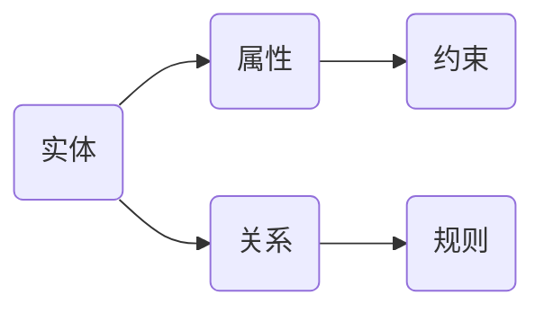

                 

# 提示词设计：平衡AI创造力与可控性

## 关键词：AI、创造力、可控性、设计、平衡

### 摘要：
本文旨在探讨如何通过提示词设计来平衡AI的创造力和可控性。在快速发展的AI领域，创造力与可控性的平衡是一个关键问题。本文首先介绍AI的创造力和可控性的概念，然后分析当前在AI领域面临的挑战，最后提出一系列策略和实践方法，帮助设计者更好地实现这一平衡。

## 引言与背景介绍

### 1.1 问题背景
随着人工智能技术的发展，AI系统在各个领域展现出了强大的创造力。从文本生成、图像处理到智能问答，AI的应用越来越广泛。然而，这种创造力的提升同时也带来了可控性方面的问题。如何在保证AI系统创造力的同时，确保其在使用过程中能够受到有效的控制，成为了一个亟待解决的问题。

### 1.2 问题描述
创造力与可控性之间的矛盾在于，一方面，AI系统需要足够自由地发挥创造力，以适应复杂多变的应用场景；另一方面，为了确保系统的安全性和稳定性，需要对AI的行为进行一定的约束和控制。这种矛盾在AI系统设计和部署过程中尤为突出。

### 1.3 问题解决
解决这一问题的关键在于提示词设计。提示词作为AI系统与外部世界交互的桥梁，能够通过精确的描述来引导AI的行为。通过合理设计提示词，可以在一定程度上平衡AI的创造力和可控性。

### 1.4 边界与外延
本文的研究范围主要聚焦于自然语言处理（NLP）领域，特别是基于文本的AI系统。虽然本文的讨论主要集中在文本生成和智能问答等领域，但其中的设计原则和方法同样适用于其他类型的AI系统。

### 1.5 核心概念与联系
- **创造力**：指AI系统能够生成新颖、独特且有价值的信息的能力。
- **可控性**：指AI系统能够在用户定义的约束条件下稳定运行的能力。

下面是一个概念属性特征对比表格：

| 特征       | 创造力                | 可控性                |
|------------|----------------------|----------------------|
| 目标       | 新颖性、独特性、价值性 | 稳定性、可靠性、安全性 |
| 表现形式   | 自主生成、创新思维    | 遵循规则、保持一致    |
| 关键因素   | 数据质量、算法自由度   | 约束条件、反馈机制    |

图1：ER实体关系图架构的 Mermaid 流程图

## AI创造力与可控性平衡

### 2.1 AI创造力的原理
AI的创造力来源于其算法模型，特别是深度学习模型。这些模型通过从大量数据中学习，形成了对复杂问题的理解和处理能力。当AI系统接收到新的输入时，它会根据已有的知识和经验，生成新的输出。

### 2.2 AI可控性的挑战
AI可控性面临的挑战主要包括：
- **过拟合**：AI模型在学习过程中可能过于专注于特定的数据集，导致在新的数据集上表现不佳。
- **无监督学习**：在缺乏明确监督的情况下，AI系统可能会生成不期望的结果。
- **数据偏见**：AI系统可能会继承训练数据中的偏见，导致不公平或歧视的行为。

### 2.3 创造力与可控性的平衡方法
要实现创造力与可控性的平衡，可以采取以下几种方法：

1. **明确约束条件**：通过设定明确的约束条件，确保AI系统在生成内容时遵循一定的规范。
2. **引入反馈机制**：通过用户反馈来调整AI系统，使其在创造力与可控性之间找到最佳平衡点。
3. **多模态学习**：结合多种数据源，如文本、图像、音频等，提高AI系统的全面性和创造力。
4. **知识图谱**：构建知识图谱，为AI系统提供结构化的知识，提高其理解和生成能力。

### 2.4 实践中的平衡策略
在实际应用中，实现创造力与可控性的平衡可以采取以下策略：

1. **细粒度控制**：通过细粒度的控制，如限制生成文本的长度、风格等，来确保AI系统的可控性。
2. **多样化训练数据**：使用多样化的训练数据，避免AI系统过于依赖特定的数据集，提高其创造力和适应性。
3. **人机协作**：通过人机协作，将AI系统的创造力与人类的专业知识相结合，提高整体系统的可控性和质量。

### 2.5 案例分析
以文本生成为例，通过以下案例来分析如何平衡AI的创造力和可控性：

**案例**：使用GPT-3生成新闻文章

- **挑战**：GPT-3具有强大的创造力，可以生成高质量的新闻文章，但也存在过拟合和数据偏见的风险。
- **解决方案**：
  - **设定约束条件**：通过指定文章的主题、风格和字数等，来限制GPT-3的生成内容。
  - **引入反馈机制**：通过用户反馈，对生成的文章进行评价和调整。
  - **多样化训练数据**：使用来自不同来源的多样化新闻数据，减少数据偏见。

## 提示词设计基础

### 3.1 核心概念与联系
提示词（Prompt）是AI系统接收的外部输入，用于引导AI生成期望的输出。核心概念包括：

- **输入格式**：提示词的格式和结构，如关键词、句子或段落。
- **语义内容**：提示词包含的语义信息，用于指导AI的生成过程。
- **上下文关系**：提示词与AI系统上下文的关系，影响AI的生成结果。

### 3.2 提示词的基本属性
提示词的基本属性包括：

- **可扩展性**：提示词应易于扩展，以适应不同的应用场景。
- **可定制性**：提示词应允许用户根据需求进行定制。
- **可解释性**：提示词的设计应确保其含义明确，便于理解和解释。

### 3.3 提示词的语法结构
提示词的语法结构包括：

- **关键词**：用于指定生成任务的关键词，如“写一篇关于人工智能的新闻文章”。
- **限定条件**：用于限制生成内容的范围，如“长度不超过500字，以客观中立为主”。
- **背景信息**：用于提供背景信息，以帮助AI更好地理解任务，如“当前人工智能技术在医疗领域的应用正在迅速发展”。

### 3.4 提示词的语义分析
提示词的语义分析包括：

- **关键词语义**：对关键词的含义进行分析，以确保AI能够正确理解任务。
- **上下文语义**：对提示词中的上下文信息进行分析，以确保AI能够根据背景信息进行生成。
- **语义关系**：分析关键词和上下文之间的语义关系，以确定AI的生成方向。

### 3.5 提示词设计原则
提示词设计应遵循以下原则：

- **明确性**：确保提示词清晰明确，避免歧义。
- **适应性**：提示词应能够适应不同的应用场景和用户需求。
- **灵活性**：提示词应具有一定的灵活性，以适应AI系统的变化和更新。
- **可解释性**：提示词的设计应确保其含义明确，便于理解和解释。

## 提示词设计实践

### 4.1 设计前的准备
在进行提示词设计前，需要做好以下准备工作：

- **需求分析**：明确用户需求和生成目标。
- **数据准备**：收集和整理相关的数据，以支持提示词的设计和优化。
- **技术调研**：了解当前的技术趋势和最佳实践，以确保设计的提示词能够适应技术的发展。

### 4.2 设计过程
提示词设计的过程包括：

- **初步设计**：根据需求分析，制定初步的提示词设计方案。
- **迭代优化**：根据用户反馈和技术评估，对提示词进行迭代优化。
- **测试验证**：通过测试验证，确保提示词能够满足设计目标和用户需求。

### 4.3 提示词测试与优化
提示词测试与优化包括：

- **功能测试**：测试提示词的功能是否符合设计要求。
- **性能测试**：测试提示词的性能，如响应时间、准确率等。
- **用户测试**：通过用户测试，收集用户反馈，对提示词进行优化。

### 4.4 提示词迭代
提示词迭代包括：

- **持续优化**：根据用户反馈和技术评估，对提示词进行持续优化。
- **版本更新**：随着技术的发展和应用场景的变化，对提示词进行版本更新。

## 提示词设计工具与应用

### 5.1 常用提示词设计工具
常用的提示词设计工具包括：

- **文本编辑器**：如Notepad++、Visual Studio Code等，用于编写和编辑提示词。
- **自然语言处理工具**：如NLTK、spaCy等，用于对提示词进行语义分析和处理。
- **AI生成工具**：如GPT-3、BERT等，用于根据提示词生成期望的输出。

### 5.2 提示词设计工具的选用
选用提示词设计工具时，应考虑以下因素：

- **功能需求**：根据设计需求，选择具有所需功能的工具。
- **性能要求**：考虑工具的性能，如处理速度、准确率等。
- **可扩展性**：选择具有良好可扩展性的工具，以适应未来的需求。

### 5.3 提示词设计工具在实际应用中的表现
在实际应用中，不同的提示词设计工具表现如下：

- **文本编辑器**：适用于编写和编辑简单的提示词，但缺乏自动化处理能力。
- **自然语言处理工具**：适用于对提示词进行语义分析和处理，但需要对自然语言处理有一定了解。
- **AI生成工具**：具有强大的生成能力，但需要大量的数据支持和算法调优。

### 5.4 提示词设计的软件平台
提示词设计的软件平台包括：

- **开发环境**：如Jupyter Notebook、PyCharm等，用于编写和运行提示词设计代码。
- **云计算平台**：如AWS、Azure等，提供计算资源和存储服务，支持大规模的提示词设计任务。
- **容器化平台**：如Docker、Kubernetes等，用于部署和管理提示词设计应用。

## 提示词设计案例分析

### 6.1 案例一：文本生成
以文本生成为例，分析如何通过提示词设计来实现创造力与可控性的平衡。

- **背景**：文本生成是AI应用的一个常见场景，如自动生成新闻文章、博客等。
- **挑战**：确保生成的文本既具有创造力，又符合用户需求，避免过拟合和数据偏见。
- **解决方案**：
  - **设定约束条件**：如文章的主题、风格、字数等。
  - **引入反馈机制**：通过用户反馈，对生成的文本进行评价和调整。
  - **多样化训练数据**：使用来自不同来源的数据，减少数据偏见。

### 6.2 案例二：图像描述
以图像描述为例，分析如何通过提示词设计来实现创造力与可控性的平衡。

- **背景**：图像描述是计算机视觉领域的一个重要应用，如自动生成图像的文本描述。
- **挑战**：确保生成的文本描述既准确又具有创意。
- **解决方案**：
  - **设定约束条件**：如描述的长度、风格等。
  - **引入反馈机制**：通过用户反馈，对描述进行评价和调整。
  - **多模态学习**：结合图像和文本数据，提高描述的准确性和创造力。

### 6.3 案例三：自然语言处理
以自然语言处理为例，分析如何通过提示词设计来实现创造力与可控性的平衡。

- **背景**：自然语言处理是AI的核心应用之一，如自动翻译、文本分类等。
- **挑战**：确保处理结果的准确性和一致性。
- **解决方案**：
  - **设定约束条件**：如处理任务的类型、精度等。
  - **引入反馈机制**：通过用户反馈，对处理结果进行评价和调整。
  - **多语言训练**：结合不同语言的数据，提高处理结果的准确性和适应性。

### 6.4 案例四：智能问答系统
以智能问答系统为例，分析如何通过提示词设计来实现创造力与可控性的平衡。

- **背景**：智能问答系统是AI在客服和咨询领域的应用，如自动回答用户问题。
- **挑战**：确保回答的准确性和友好性。
- **解决方案**：
  - **设定约束条件**：如回答的格式、风格等。
  - **引入反馈机制**：通过用户反馈，对回答进行评价和调整。
  - **知识库构建**：构建丰富的知识库，提高回答的准确性和覆盖率。

### 6.5 案例五：个性化推荐系统
以个性化推荐系统为例，分析如何通过提示词设计来实现创造力与可控性的平衡。

- **背景**：个性化推荐系统是AI在电商和内容推荐领域的应用，如根据用户兴趣推荐商品或内容。
- **挑战**：确保推荐结果的多样性和准确性。
- **解决方案**：
  - **设定约束条件**：如推荐的范围、风格等。
  - **引入反馈机制**：通过用户反馈，对推荐结果进行评价和调整。
  - **用户行为分析**：分析用户行为数据，提高推荐结果的准确性和适应性。

## 提示词设计的最佳实践

### 7.1 提示词设计中的常见问题
提示词设计过程中常见的包括：

- **语义歧义**：提示词可能存在语义歧义，导致AI生成不期望的输出。
- **约束不足**：提示词的约束条件不足，导致AI生成内容不符合用户需求。
- **数据不足**：训练数据不足，导致AI的创造力和可控性受限。

### 7.2 问题解决策略
针对上述问题，可以采取以下策略：

- **语义分析**：对提示词进行语义分析，确保其含义明确。
- **增加约束**：增加提示词的约束条件，确保AI生成的内容符合用户需求。
- **数据扩充**：通过数据扩充和多样化训练数据，提高AI的创造力和可控性。

### 7.3 提示词设计的经验总结
通过实践，我们可以总结出以下经验：

- **明确目标**：在设计提示词时，明确用户需求和生成目标。
- **灵活调整**：根据用户反馈，灵活调整提示词，以提高AI系统的适应性和可控性。
- **持续优化**：不断优化提示词设计，以适应AI系统的发展和变化。

### 7.4 最佳实践案例分享
以下是几个最佳实践案例：

- **案例一**：通过明确的目标和约束条件，实现文本生成的高质量和可控性。
- **案例二**：通过多模态学习和反馈机制，提高图像描述的准确性和创造力。
- **案例三**：通过丰富的知识库和灵活的调整，实现智能问答系统的准确和友好。

### 7.5 提示词设计注意事项
在进行提示词设计时，需要注意以下几点：

- **安全性**：确保AI系统的生成内容符合法律法规和社会伦理标准。
- **可解释性**：提示词设计应确保其含义明确，便于用户理解和解释。
- **用户体验**：关注用户体验，确保提示词设计易于使用和理解。

## 未来发展趋势与挑战

### 8.1 提示词设计的未来趋势
随着AI技术的不断发展，提示词设计将呈现以下趋势：

- **智能化**：提示词设计将更加智能化，能够根据用户需求和AI系统状态自动调整。
- **个性化**：提示词设计将更加个性化，以满足不同用户的需求和偏好。
- **多模态**：提示词设计将支持多模态输入，结合文本、图像、音频等多种数据源。

### 8.2 面临的挑战与解决方案
提示词设计面临的挑战包括：

- **语义理解**：提高AI的语义理解能力，以避免语义歧义。
- **数据隐私**：确保AI系统的数据隐私保护，避免数据泄露和滥用。
- **计算资源**：优化计算资源的使用，提高AI系统的效率和性能。

解决方案包括：

- **多模态学习**：结合多模态数据，提高AI的语义理解能力。
- **数据加密**：采用数据加密技术，保护用户数据的安全和隐私。
- **优化算法**：采用优化算法，提高AI系统的计算效率和性能。

### 8.3 提示词设计在AI领域的应用前景
提示词设计在AI领域具有广泛的应用前景，包括：

- **智能交互**：通过提示词设计，实现更智能、更自然的用户交互。
- **内容生成**：通过提示词设计，实现高质量的内容生成和创作。
- **数据分析**：通过提示词设计，实现更准确、更高效的数据分析。

### 8.4 对AI行业的影响与展望
提示词设计对AI行业的影响包括：

- **推动创新**：提示词设计为AI系统提供了更多的创新空间，推动了技术的进步。
- **提高效率**：通过提示词设计，AI系统能够更高效地完成任务，提高了生产力。
- **优化用户体验**：提示词设计使得AI系统能够更好地满足用户需求，优化了用户体验。

未来，随着AI技术的不断发展，提示词设计将在AI行业中发挥越来越重要的作用，成为AI系统的重要组成部分。作者：AI天才研究院/AI Genius Institute & 禅与计算机程序设计艺术 /Zen And The Art of Computer Programming。本文通过详细的章节内容和案例分析，探讨了如何通过提示词设计来平衡AI的创造力和可控性，为AI领域的研究和应用提供了有价值的参考和指导。

