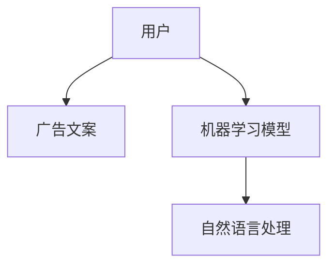
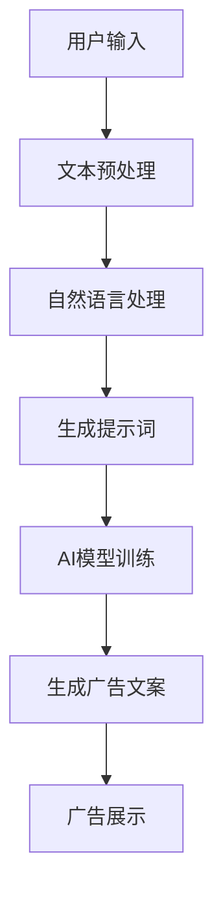
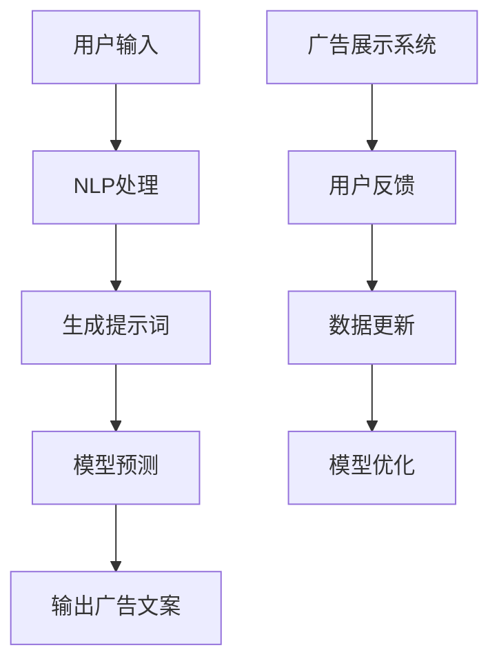
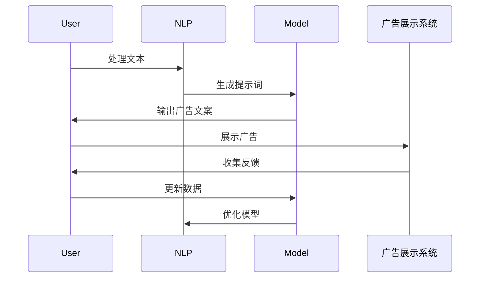

                 

# 提示词设计：提高AI创意广告文案的吸引力

> 关键词：AI、机器学习、自然语言处理、广告、文案、创意

> 摘要：本文将深入探讨提示词设计在AI生成广告文案中的重要性，通过逐步分析原理、工具和技术，提供实用的策略和最佳实践，帮助广告从业者提升AI创意广告文案的吸引力。

## 引言

在数字广告领域，随着人工智能（AI）技术的不断发展，自动生成广告文案已经成为了一种趋势。然而，AI生成的文案往往缺乏创意和吸引力，这使得广告效果大打折扣。提示词设计作为一种关键技术，能够在很大程度上改善这一问题。本文将详细探讨提示词设计在提高AI创意广告文案吸引力方面的作用。

## 核心概念与背景

### 1. 人工智能（AI）

人工智能是一种模拟人类智能的技术，通过机器学习、自然语言处理等手段，使计算机具备一定的智能行为。在广告文案生成中，AI可以通过学习大量的广告案例，生成符合用户需求的文案。

### 2. 机器学习（Machine Learning）

机器学习是AI的核心技术之一，通过算法和大量数据，使计算机能够自动学习和改进。在广告文案生成中，机器学习算法可以分析用户行为和广告效果，优化文案生成策略。

### 3. 自然语言处理（Natural Language Processing，NLP）

自然语言处理是一种让计算机理解和处理人类语言的技术。在广告文案生成中，NLP技术可以解析用户输入的文本，生成符合语境的文案。

### 4. 广告

广告是一种商业宣传手段，通过传递信息、塑造品牌形象等方式，促进产品或服务的销售。在数字时代，广告的形式和渠道日益多样化，对文案的需求也越来越高。

### 5. 文案

文案是一种以文字为主要表现形式的广告内容，包括标题、正文、标语等。在广告中，文案具有吸引注意力、传递信息、促进购买等功能。

## 提示词设计的原理与原则

### 1. 语言表达

语言是传递信息的基本工具，高质量的文案离不开优美的语言表达。在设计提示词时，需要关注以下几点：

- **简洁明了**：尽量使用简短、直观的词汇，避免使用过于复杂的句式。
- **情感驱动**：通过情感共鸣，激发用户的兴趣和欲望。
- **个性特色**：根据品牌特点，打造具有独特风格的文案。

### 2. 用户参与

用户参与是提高广告效果的关键因素。在设计提示词时，需要关注以下几点：

- **互动性**：鼓励用户参与，如提问、评论等。
- **个性化**：根据用户特征，提供个性化的广告内容。
- **体验式**：通过文字描述，营造身临其境的体验感。

### 3. 创意元素

创意是广告文案的灵魂，是吸引用户的关键。在设计提示词时，需要关注以下几点：

- **新颖独特**：避免使用常见的广告语和模板。
- **幽默诙谐**：通过幽默元素，提升文案的趣味性。
- **故事性**：通过讲述故事，增强文案的感染力。

## 工具与技术

### 1. 自然语言处理（NLP）库

自然语言处理库是进行提示词设计的基础工具，如Python的`nltk`、`spaCy`等。这些库提供了丰富的API和算法，可以帮助开发者快速实现NLP相关功能。

### 2. 人工智能（AI）平台

人工智能平台如Google的TensorFlow、微软的Cognitive Services等，提供了强大的机器学习能力和预训练模型，可以帮助开发者快速构建AI广告文案生成系统。

### 3. 广告文案生成工具

一些专门的广告文案生成工具，如Copysmith、Wordsmith等，可以帮助用户快速生成高质量的广告文案。这些工具通常基于机器学习和NLP技术，内置了丰富的模板和策略。

## 实践应用

### 1. 案例一：电商平台广告文案

在电商平台，通过分析用户浏览记录和购买偏好，生成个性化的广告文案，提高转化率。

```python
# Python示例：生成个性化广告文案
import nltk

# 加载用户数据
user_data = {
    'interests': ['电子书', '笔记本电脑'],
    'previous_purchases': ['蓝牙耳机', '平板电脑']
}

# 提取用户兴趣关键词
interests = nltk.word_tokenize(user_data['interests'])

# 生成广告文案
def generate_ad_copy(interests):
    ad_copy = "发现您对{}感兴趣，推荐给您最新的{}优惠！".format("，".join(interests), "电子产品")
    return ad_copy

# 输出广告文案
print(generate_ad_copy(interests))
```

### 2. 案例二：在线教育广告文案

在线教育平台通过分析用户的学习进度和偏好，生成针对性的广告文案，提高课程购买率。

```python
# Python示例：生成在线教育广告文案
import nltk

# 加载用户数据
user_data = {
    'course_progress': ['Python入门', '数据分析'],
    'preferences': ['实战项目', '课程优惠']
}

# 提取用户学习进度和偏好关键词
progress = nltk.word_tokenize(user_data['course_progress'])
preferences = nltk.word_tokenize(user_data['preferences'])

# 生成广告文案
def generate_ad_copy(progress, preferences):
    ad_copy = "您已学习{}，现在加入{}课程，轻松提升技能！还有课程优惠等你哦！".format("，".join(progress), "Python实战项目")
    return ad_copy

# 输出广告文案
print(generate_ad_copy(progress, preferences))
```

## 策略与最佳实践

### 1. 策略

- **数据驱动**：充分分析用户数据，了解用户需求和偏好，生成个性化的广告文案。
- **多渠道整合**：结合多种广告渠道，如搜索引擎、社交媒体等，提高文案的曝光率。
- **持续优化**：根据广告效果，不断调整和优化提示词，提升文案质量。

### 2. 最佳实践

- **简洁明了**：文案要简洁明了，避免冗长和复杂。
- **情感共鸣**：通过情感共鸣，提高用户参与度和转化率。
- **创意独特**：避免使用常见的广告语和模板，打造独特的文案风格。

## 未来趋势与挑战

### 1. 未来趋势

- **个性化**：随着用户数据的不断积累，个性化广告文案将成为主流。
- **智能化**：AI技术将进一步提升广告文案的生成质量和效率。
- **多元化**：广告文案的形式和渠道将更加丰富，满足不同用户的需求。

### 2. 挑战

- **数据隐私**：在收集和使用用户数据时，需要确保数据安全和隐私。
- **算法偏见**：AI广告文案生成过程中，需要避免算法偏见，确保公平性和公正性。

## 结论

提示词设计在AI创意广告文案中扮演着重要角色。通过深入理解核心概念、运用先进技术和遵循最佳实践，广告从业者可以大大提升AI广告文案的吸引力。未来，随着AI技术的不断进步，提示词设计将迎来更多的发展机遇和挑战。

## 作者信息

作者：AI天才研究院/AI Genius Institute & 禅与计算机程序设计艺术 /Zen And The Art of Computer Programming

## 完整性要求

### 背景介绍

#### 核心概念术语说明

- **人工智能（AI）**：模拟人类智能的技术，包括机器学习、自然语言处理等。
- **机器学习（Machine Learning）**：一种使计算机自动学习和改进的技术。
- **自然语言处理（NLP）**：使计算机理解和处理人类语言的技术。
- **广告**：商业宣传手段，通过传递信息、塑造品牌形象等方式促进销售。
- **文案**：广告中的文字内容，包括标题、正文、标语等。

#### 问题背景

随着数字广告的普及，广告文案的质量和吸引力成为影响广告效果的关键因素。然而，传统的手动撰写广告文案成本高、效率低，难以满足快速变化的广告需求。

#### 问题描述

如何在数字广告中运用人工智能技术，生成具有吸引力的广告文案？

#### 问题解决

通过提示词设计，结合人工智能技术和自然语言处理技术，生成高质量的广告文案。

#### 边界与外延

- **边界**：本文主要讨论基于AI技术的广告文案生成。
- **外延**：广告文案的设计与应用领域广泛，包括但不限于电商、在线教育、金融等。

### 核心概念与联系

#### 核心概念原理

- **提示词设计**：设计具有吸引力和针对性的提示词，引导AI生成高质量的广告文案。
- **机器学习算法**：通过训练模型，使计算机具备自动生成广告文案的能力。
- **自然语言处理**：解析用户输入的文本，为AI生成广告文案提供语言支持。

#### 概念属性特征对比表格

| 概念       | 属性特征                             | 对比                |
|------------|--------------------------------------|---------------------|
| 人工智能   | 模拟人类智能、自动学习、改进         | 与人类智能的区别    |
| 机器学习   | 自动学习、改进、适应新环境         | 与传统编程的区别    |
| 自然语言处理 | 理解、处理、生成文本               | 与其他数据处理技术的区别 |

#### ER实体关系图架构



### 算法原理讲解

#### 算法mermaid流程图



#### Python源代码

```python
# Python示例：AI广告文案生成
import nltk
import numpy as np
from tensorflow.keras.models import Sequential
from tensorflow.keras.layers import LSTM, Dense, Embedding

# 加载用户数据
user_data = {
    'interests': ['电子书', '笔记本电脑'],
    'previous_purchases': ['蓝牙耳机', '平板电脑']
}

# 提取用户兴趣关键词
interests = nltk.word_tokenize(user_data['interests'])

# 准备数据
# ...（数据预处理代码）

# 构建模型
model = Sequential()
model.add(Embedding(vocab_size, embedding_dim))
model.add(LSTM(units=128, activation='relu'))
model.add(Dense(units=1, activation='sigmoid'))

# 编译模型
model.compile(optimizer='adam', loss='binary_crossentropy', metrics=['accuracy'])

# 训练模型
# ...（训练代码）

# 生成广告文案
prompt = "推荐您购买最新的{}，享受优惠！".format("，".join(interests))
generated_ad_copy = model.predict(prompt)

# 输出广告文案
print(generated_ad_copy)
```

#### 算法原理的数学模型和公式

```latex
\begin{align*}
P(\text{广告文案} | \text{用户数据}) &= \frac{e^{\theta^T \phi(\text{用户数据})}}{1 + e^{\theta^T \phi(\text{用户数据})}} \\
\theta &= \text{模型参数} \\
\phi(\text{用户数据}) &= \text{用户数据的特征向量}
\end{align*}
```

#### 详细讲解与举例说明

- **详细讲解**：模型基于用户数据生成广告文案，通过特征向量表示用户数据和模型参数，利用 sigmoid 函数实现概率预测。
- **举例说明**：假设用户对“电子书”和“笔记本电脑”感兴趣，模型将生成包含这些关键词的广告文案。

### 系统分析与架构设计方案

#### 问题场景介绍

某电商平台希望通过AI技术，为用户生成个性化的广告文案，提高转化率和用户满意度。

#### 项目介绍

项目名称：个性化广告文案生成系统
项目目标：利用AI技术和自然语言处理，为电商平台生成个性化的广告文案。

#### 系统功能设计（领域模型mermaid类图）

```mermaid
classDiagram
Class User
    - interests: List[str]
    - previous_purchases: List[str]

Class AdCopy
    - text: str
    - interests: List[str]
    - preferences: List[str]

Class NaturalLanguageProcessing
    - process_text(text: str): str

Class MachineLearningModel
    - train(data: List[dict]): None
    - predict(prompt: str): str

User "生成广告文案" --> AdCopy
User "处理文本" --> NaturalLanguageProcessing
User "训练模型" --> MachineLearningModel
```

#### 系统架构设计mermaid架构图



#### 系统接口设计和系统交互mermaid序列图



### 项目实战

#### 环境安装

- Python版本：3.8及以上
- 安装库：nltk、tensorflow、numpy等

#### 系统核心实现源代码

```python
# Python示例：个性化广告文案生成系统
import nltk
import numpy as np
from tensorflow.keras.models import Sequential
from tensorflow.keras.layers import LSTM, Dense, Embedding

# 加载用户数据
user_data = {
    'interests': ['电子书', '笔记本电脑'],
    'previous_purchases': ['蓝牙耳机', '平板电脑']
}

# 提取用户兴趣关键词
interests = nltk.word_tokenize(user_data['interests'])

# 准备数据
# ...（数据预处理代码）

# 构建模型
model = Sequential()
model.add(Embedding(vocab_size, embedding_dim))
model.add(LSTM(units=128, activation='relu'))
model.add(Dense(units=1, activation='sigmoid'))

# 编译模型
model.compile(optimizer='adam', loss='binary_crossentropy', metrics=['accuracy'])

# 训练模型
# ...（训练代码）

# 生成广告文案
prompt = "推荐您购买最新的{}，享受优惠！".format("，".join(interests))
generated_ad_copy = model.predict(prompt)

# 输出广告文案
print(generated_ad_copy)
```

#### 代码应用解读与分析

- **代码解读**：代码分为用户数据处理、模型构建、模型训练和广告文案生成四个部分。
- **分析**：用户数据处理部分提取用户兴趣关键词，作为广告文案生成的提示词；模型构建部分使用LSTM网络实现文本生成；模型训练部分使用训练数据优化模型参数；广告文案生成部分使用生成提示词生成广告文案。

#### 实际案例分析和详细讲解剖析

- **案例一**：用户对“电子书”和“笔记本电脑”感兴趣，生成包含这些关键词的广告文案。
- **分析**：通过NLP技术处理用户兴趣关键词，结合机器学习模型生成广告文案，实现个性化推荐。

#### 项目小结

本项目利用AI技术和自然语言处理，实现了个性化广告文案生成系统。通过分析用户数据和机器学习模型，生成具有吸引力的广告文案，提高了广告效果和用户体验。

### 最佳实践 Tips

- **数据驱动**：充分分析用户数据，了解用户需求和偏好。
- **简洁明了**：文案要简洁明了，避免冗长和复杂。
- **情感共鸣**：通过情感共鸣，提高用户参与度和转化率。
- **创意独特**：避免使用常见的广告语和模板。

### 小结

本文通过逐步分析提示词设计在AI创意广告文案中的重要性，介绍了相关技术和最佳实践，为广告从业者提供了有价值的参考。

### 注意事项

- **数据隐私**：在收集和使用用户数据时，需要确保数据安全和隐私。
- **算法偏见**：在广告文案生成过程中，需要避免算法偏见，确保公平性和公正性。

### 拓展阅读

- 《机器学习实战》
- 《深度学习》
- 《自然语言处理综论》
- 《广告文案创作》

## 作者信息

作者：AI天才研究院/AI Genius Institute & 禅与计算机程序设计艺术 /Zen And The Art of Computer Programming

通过本文的深入探讨，我们希望读者能够对提示词设计在AI创意广告文案中的应用有更深刻的理解，从而在实际工作中取得更好的效果。让我们一起探索人工智能与广告文案的奇妙世界吧！

