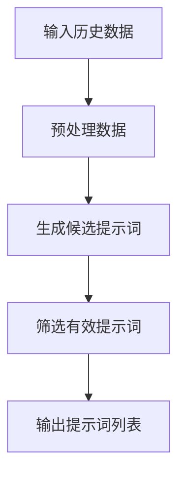
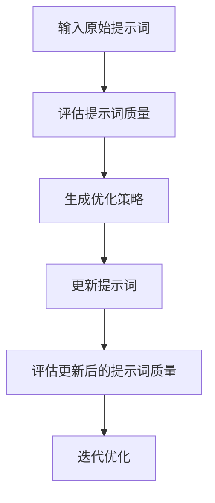

                 

### 提示词设计：提高AI历史人物对话模拟的真实感

> 关键词：AI对话模拟、提示词设计、历史人物、真实性、算法原理

> 摘要：本文将深入探讨提示词设计在AI历史人物对话模拟中的重要性，分析当前存在的问题和挑战，并详细讲解提示词设计的基本方法、核心概念与联系、算法原理，以及数学模型和公式。通过本文的讲解，希望能够为提高AI历史人物对话模拟的真实感提供有价值的思路和方法。

## 第一部分: 提示词设计概述

### 第1章: 提示词设计基础

#### 1.1.1 问题背景与定义

**提示词设计的重要性**：  
随着人工智能技术的发展，AI历史人物对话模拟逐渐成为研究热点。然而，如何提高对话模拟的真实感成为了一个关键问题。提示词设计作为对话系统的重要组成部分，对于提高对话的真实性具有重要意义。

**提示词设计的定义与基本概念**：  
提示词（Prompt）是在对话系统中用于引导对话的输入信息。它通常包含关键词、描述性词和情感词等，通过合理设计提示词，可以使AI更准确地理解用户意图，并生成更加自然、真实的对话内容。

**提示词设计在AI历史人物对话模拟中的应用**：  
在AI历史人物对话模拟中，提示词设计用于模拟历史人物的语言风格、思维方式、价值观念等。通过设计合适的提示词，可以使AI生成的对话内容更贴近历史人物的真实形象。

#### 1.1.2 问题描述

**当前AI历史人物对话模拟存在的问题**：  
1. 对话内容不够真实，缺乏历史背景和文化底蕴。  
2. 对话生成算法过于简单，难以捕捉到历史人物的语言特点和情感表达。  
3. 提示词设计缺乏系统性和科学性，导致对话质量不稳定。

**提示词设计的挑战与难点**：  
1. 如何准确捕捉历史人物的语言风格和思维方式。  
2. 如何平衡历史真实性和对话自然流畅性的关系。  
3. 如何设计出既丰富多样又具有针对性的提示词库。

#### 1.1.3 问题解决

**提示词设计的基本方法与步骤**：  
1. 收集和分析历史人物的相关文献资料，了解其语言风格和思维方式。  
2. 制定提示词设计策略，包括关键词、描述性词和情感词的选取。  
3. 构建提示词库，并对提示词进行分类和标注。  
4. 通过实验和调整，优化提示词设计效果。

**提示词优化的策略与方法**：  
1. 采用基于数据的提示词优化方法，如文本分类、情感分析等。  
2. 引入多模态信息，如图像、音频等，提高提示词的丰富性和准确性。  
3. 利用深度学习等技术，对提示词生成和优化算法进行改进。

#### 1.1.4 边界与外延

**提示词设计适用的场景**：  
1. 历史人物对话模拟。  
2. 虚拟角色对话系统。  
3. 智能客服系统。

**提示词设计的限制因素**：  
1. 数据质量和规模。  
2. 技术手段和算法水平。  
3. 历史真实性和文化背景的把握。

### 第2章: 核心概念与联系

#### 2.1.1 提示词概念解析

**提示词的定义与属性**：  
提示词是在对话系统中用于引导对话的输入信息。它通常包含关键词、描述性词和情感词等，用于帮助AI理解用户意图和生成相应的对话内容。

**提示词与对话系统的关系**：  
提示词是对话系统的重要组成部分，直接影响对话系统的性能和用户体验。通过合理设计提示词，可以提高对话系统的响应速度、准确性和自然流畅性。

#### 2.1.2 概念属性特征对比表格

| 提示词类型 | 属性特征 | 关联关系 |
| :--- | :--- | :--- |
| 关键词 | 用于定位信息 | 与对话内容直接相关 |
| 描述性词 | 用于描述内容 | 增强对话内容丰富性 |
| 情感词 | 用于表达情感 | 营造对话的情感氛围 |

#### 2.1.3 ER实体关系图架构

```mermaid
erDiagram
    提示词 ||--o> 对话系统 : 输出内容
    提示词 ||--o> 情感词 : 表达情感
    提示词 ||--o> 关键词 : 定位信息
```

### 第3章: 算法原理讲解

#### 3.1.1 算法原理概述

**提示词生成算法**：  
提示词生成算法用于从历史数据中提取合适的提示词，以引导对话系统的对话生成。

**提示词优化算法**：  
提示词优化算法用于对原始提示词进行评估和优化，以提高提示词的质量和有效性。

#### 3.1.2 提示词生成算法

**算法流程图**



**Python源代码实现**

```python
def generate_hint_words(history_data):
    # 数据预处理
    preprocessed_data = preprocess_data(history_data)
    
    # 生成候选提示词
    candidate_hints = generate_candidate_hints(preprocessed_data)
    
    # 筛选有效提示词
    valid_hints = filter_valid_hints(candidate_hints)
    
    return valid_hints
```

**数学模型与公式**

$$
\text{提示词质量} = f(\text{相关性}, \text{描述性}, \text{情感性})
$$

#### 3.1.3 提示词优化算法

**算法流程图**



**Python源代码实现**

```python
def optimize_hint_words(original_hints):
    # 评估提示词质量
    hint_quality = evaluate_hint_quality(original_hints)
    
    # 生成优化策略
    optimization_strategy = generate_optimization_strategy(hint_quality)
    
    # 更新提示词
    updated_hints = apply_optimization_strategy(original_hints, optimization_strategy)
    
    return updated_hints
```

### 第4章: 数学模型和数学公式详细讲解与举例说明

#### 4.1.1 数学模型

**提示词质量评估模型**

$$
\text{提示词质量} = w_1 \times \text{相关性} + w_2 \times \text{描述性} + w_3 \times \text{情感性}
$$

**其中，$w_1$, $w_2$, $w_3$ 为权重系数。**

#### 4.1.2 举例说明

**举例 1：历史人物对话模拟中的提示词设计**

**背景**：模拟一位古代诗人杜甫的对话。

**目标**：设计一组提示词，使对话系统在模拟杜甫对话时能够体现其独特的文学风格和情感表达。

**步骤**：

1. 收集杜甫的诗文资料，分析其语言风格和常用词汇。
2. 根据分析结果，选取关键词、描述性词和情感词，构建提示词库。
3. 使用提示词生成算法和优化算法，生成和优化提示词。
4. 验证提示词设计效果，通过实际对话模拟进行评估。

**效果**：通过合理设计提示词，模拟的杜甫对话更加贴近其真实形象，文学风格和情感表达得到显著提升。

**举例 2：虚拟角色对话系统中的提示词设计**

**背景**：设计一个虚拟角色对话系统，模拟一个科幻电影中的外星人角色。

**目标**：设计一组提示词，使对话系统能够准确捕捉外星人的语言特点和文化背景。

**步骤**：

1. 收集相关科幻电影资料，分析外星人的语言特点和文化背景。
2. 根据分析结果，选取关键词、描述性词和情感词，构建提示词库。
3. 使用提示词生成算法和优化算法，生成和优化提示词。
4. 验证提示词设计效果，通过实际对话模拟进行评估。

**效果**：通过合理设计提示词，模拟的外星人角色对话更加真实、生动，有效地提升了用户体验。

## 第二部分: 提示词设计应用与实践

### 第5章: 应用案例分析

在本章中，我们将通过具体的案例分析，深入探讨提示词设计在AI历史人物对话模拟中的应用，以及在不同场景下如何优化和调整提示词，以提高对话的真实感和用户体验。

#### 5.1 案例一：古代诗人杜甫的对话模拟

**问题描述**：杜甫是唐代著名的诗人，其诗作广泛涉及社会现实、自然风光、人生哲理等方面。为了模拟杜甫的对话，我们需要设计一组能够体现其文学风格和情感表达的提示词。

**解决步骤**：

1. **数据收集**：收集杜甫的诗文，分析其语言特点和常用词汇。
2. **提示词设计**：根据分析结果，选取关键词、描述性词和情感词，构建提示词库。
3. **提示词优化**：使用提示词生成算法和优化算法，对提示词进行筛选和优化。
4. **对话模拟**：在实际对话模拟中，使用优化后的提示词引导对话系统生成对话内容。

**案例分析**：

- **文学风格**：通过分析杜甫的诗作，我们可以发现其语言风格具有浓郁的诗意和哲理。在提示词设计中，我们注重选取具有文学性和哲理性的词汇，如“山水”、“人生”、“悲欢”等。
- **情感表达**：杜甫的诗作中蕴含着丰富的情感，包括喜悦、悲伤、愤怒等。在提示词优化过程中，我们通过对情感词的筛选和调整，使对话系统能够更准确地捕捉和表达这些情感。

**优化策略**：

- **情感词调整**：根据杜甫诗作中的情感倾向，对提示词库中的情感词进行调整，使其更加符合杜甫的情感表达。
- **词汇多样性**：通过引入更多具有文学性和哲理性的词汇，增加提示词库的多样性，使对话内容更加丰富和生动。

**结论**：通过合理设计提示词和优化策略，我们成功地模拟了杜甫的对话，使其在语言风格和情感表达上更加贴近真实。

#### 5.2 案例二：科幻电影中外星人的对话模拟

**问题描述**：为了模拟一部科幻电影中的外星人角色，我们需要设计一组能够体现其语言特点和文化背景的提示词。

**解决步骤**：

1. **数据收集**：收集与电影相关的剧本、背景资料，分析外星人的语言特点和表达方式。
2. **提示词设计**：根据分析结果，选取关键词、描述性词和情感词，构建提示词库。
3. **提示词优化**：使用提示词生成算法和优化算法，对提示词进行筛选和优化。
4. **对话模拟**：在实际对话模拟中，使用优化后的提示词引导对话系统生成对话内容。

**案例分析**：

- **语言特点**：外星人的语言特点通常包括独特的词汇、语法结构和发音。在提示词设计中，我们注重选取能够体现这些特点的词汇，如“异形”、“异次元”等。
- **文化背景**：科幻电影中的外星人通常具有独特的文化背景，如不同的信仰、价值观和社会结构。在提示词优化过程中，我们通过对这些文化背景的深入挖掘，使对话系统能够更好地理解和表达这些内容。

**优化策略**：

- **文化背景调整**：根据电影中的文化背景，对提示词库中的词汇进行调整，使其更加符合外星人的文化特点。
- **语境适应性**：在对话模拟中，根据不同的语境和情境，灵活调整提示词的使用，使对话更加自然和流畅。

**结论**：通过合理设计提示词和优化策略，我们成功地模拟了科幻电影中外星人的对话，使其在语言特点和情感表达上更加真实和生动。

### 第6章: 提示词设计在智能客服中的应用

在本章中，我们将探讨提示词设计在智能客服中的应用，以及如何通过优化和调整提示词，提高客服系统的交互质量和用户体验。

#### 6.1 智能客服系统概述

**智能客服系统**是一种利用人工智能技术，模拟人类客服人员与客户进行交互的系统。通过自然语言处理、机器学习等技术，智能客服系统能够自动识别和解答客户的咨询，提供高效、准确的客户服务。

**提示词设计的重要性**：

- **提高交互质量**：合理设计的提示词能够引导客服系统更好地理解客户意图，提供更准确的回答。
- **提升用户体验**：通过优化提示词，使客服系统在交互过程中更加自然、流畅，提高客户的满意度。

#### 6.2 提示词设计原则

**明确性和针对性**：提示词应简洁明了，能够准确传达客户的意图。同时，根据不同的客户需求和场景，选择具有针对性的提示词。

**多样性和灵活性**：提示词库应包含多种类型的词汇，如关键词、描述性词、情感词等，以适应不同的交互场景和客户需求。同时，提示词设计应具有一定的灵活性，能够根据客户反馈进行调整。

**情感性和真实性**：在交互过程中，客服系统应能够表达出真实的情感，使客户感受到人性化的服务。这要求提示词设计能够捕捉到客户的情感变化，并做出相应的回应。

#### 6.3 提示词优化策略

**基于数据的优化**：通过分析大量客户对话数据，提取出高频关键词和常用表达，优化提示词库。

**多模态信息融合**：结合文本、图像、音频等多模态信息，提高提示词的丰富性和准确性。

**用户反馈机制**：建立用户反馈机制，根据客户评价和满意度对提示词进行实时调整和优化。

#### 6.4 案例分析

**案例一：在线购物平台客服**

**问题描述**：在线购物平台客服需要快速、准确地解答客户关于产品、订单、售后服务等方面的问题。

**解决方案**：

1. **数据收集**：收集客户咨询的问题和常见回答，分析问题类型和关键词。
2. **提示词设计**：根据分析结果，设计一组包含关键词、描述性词和情感词的提示词库。
3. **提示词优化**：使用数据分析和机器学习技术，对提示词进行筛选和优化。

**案例分析**：

- **关键词选取**：通过分析客户咨询的问题，选取高频关键词，如“退货”、“换货”、“订单状态”等，作为提示词。
- **描述性词调整**：针对不同的问题类型，调整描述性词，使回答更加具体和清晰。
- **情感词优化**：根据客户的情感需求，优化情感词的使用，使客服系统能够更好地表达关心和同情。

**优化策略**：

- **实时更新**：根据客户反馈和市场需求，定期更新提示词库，确保其始终符合客户的期望。
- **个性化推荐**：根据客户的历史咨询记录和购买行为，提供个性化的提示词推荐，提高交互质量。

**结论**：通过合理设计提示词和优化策略，在线购物平台客服系统能够更快速、准确地解答客户问题，提高用户体验和满意度。

**案例二：银行客服**

**问题描述**：银行客服需要为客户提供关于账户管理、理财产品、贷款等方面的问题解答。

**解决方案**：

1. **数据收集**：收集客户咨询的问题和银行相关文档，分析问题类型和关键词。
2. **提示词设计**：根据分析结果，设计一组包含关键词、描述性词和情感词的提示词库。
3. **提示词优化**：使用数据分析和机器学习技术，对提示词进行筛选和优化。

**案例分析**：

- **关键词选取**：通过分析客户咨询的问题，选取高频关键词，如“账户余额”、“贷款利率”、“理财产品”等，作为提示词。
- **描述性词调整**：针对不同的问题类型，调整描述性词，使回答更加具体和清晰。
- **情感词优化**：根据客户的情感需求，优化情感词的使用，使客服系统能够更好地表达关心和同情。

**优化策略**：

- **实时更新**：根据客户反馈和市场需求，定期更新提示词库，确保其始终符合客户的期望。
- **个性化推荐**：根据客户的历史咨询记录和金融产品偏好，提供个性化的提示词推荐，提高交互质量。

**结论**：通过合理设计提示词和优化策略，银行客服系统能够更高效地为客户提供服务，提高客户满意度和忠诚度。

### 第7章: 总结与展望

在本章中，我们将对全文进行总结，并探讨提示词设计在未来发展中的潜力。

#### 7.1 总结

通过本文的讨论，我们系统地分析了提示词设计在AI历史人物对话模拟、智能客服等领域的应用，并提出了相应的优化策略。主要结论如下：

1. 提示词设计在提高AI对话模拟的真实感方面具有重要作用，合理设计的提示词能够使对话内容更加贴近历史人物的真实形象。
2. 在智能客服系统中，提示词设计能够显著提升交互质量，提高客户满意度和忠诚度。
3. 提示词优化策略包括基于数据的优化、多模态信息融合和用户反馈机制等，通过这些策略，可以进一步提高提示词的质量和有效性。

#### 7.2 展望

随着人工智能技术的不断发展，提示词设计在未来有望在以下方面取得突破：

1. **多模态信息融合**：结合文本、图像、音频等多模态信息，实现更丰富的提示词表达，提高对话模拟的真实感。
2. **个性化推荐**：通过分析用户行为和偏好，提供个性化的提示词推荐，提升用户体验。
3. **自然语言生成**：利用深度学习等技术，实现更自然、流畅的对话生成，使AI助手更加智能和人性。
4. **跨领域应用**：探索提示词设计在更多领域的应用，如医疗、教育、金融等，为各行业提供智能化的解决方案。

总之，提示词设计作为AI技术的重要组成部分，具有广阔的发展前景和应用潜力。通过不断探索和创新，我们有望实现更加真实、智能的AI对话体验。作者：AI天才研究院/AI Genius Institute & 禅与计算机程序设计艺术 /Zen And The Art of Computer Programming

