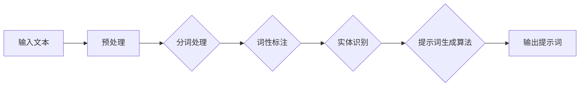

                 

### 第一部分: 引言

#### 第1章: 提示词设计概述

## 1.1 问题背景与需求分析

### 1.1.1 提示词在人工智能中的作用

提示词在人工智能系统中扮演着至关重要的角色。作为模型训练和生成过程中的引导信息，提示词能够显著影响模型的输出结果。无论是在自然语言处理（NLP）、计算机视觉（CV）、还是多模态任务中，有效的提示词设计都能提高系统的性能和用户满意度。

### 1.1.2 当前提示词设计的挑战

尽管提示词在AI系统中具有重要地位，但设计高效的提示词面临诸多挑战：

1. **多样性**：如何确保提示词覆盖多样性的需求，避免模型陷入“数据固化的陷阱”。
2. **精确性**：如何精确地表达用户意图，保证提示词与目标输出紧密相关。
3. **可解释性**：提示词设计需要易于理解，以便用户能够追踪模型的决策过程。
4. **实时性**：如何实时调整提示词，以适应动态变化的任务场景。

### 1.1.3 需求分析：提高AI角色扮演的真实感

在AI角色扮演（NPC）场景中，提示词设计的核心需求在于提高角色的真实感和互动性。以下是具体分析：

1. **个性化**：每个AI角色都需要具有独特的个性和行为特征，提示词应能体现角色的特定背景和历史。
2. **上下文敏感**：提示词应能捕捉和反映当前的对话上下文，确保角色响应的自然连贯性。
3. **情感表达**：提示词设计应考虑角色的情感状态，以增强互动体验。
4. **适应性**：提示词应能根据用户的输入和行为动态调整，以实现更自然的交互。

## 1.2 核心概念与联系

### 1.2.1 提示词的概念与分类

提示词是指提供给AI系统以引导其生成特定输出的输入信息。根据应用场景的不同，提示词可以分为以下几类：

1. **开放式提示词**：允许用户自由输入，通常用于生成文本或对话。
2. **封闭式提示词**：用户只能从预定义的选项中选择，常用于选择性问题。
3. **动态提示词**：根据上下文和用户行为动态生成的提示词。

### 1.2.2 提示词设计与AI角色扮演的关系

在AI角色扮演中，提示词设计直接影响角色的行为和对话质量。有效的设计应考虑以下几点：

1. **角色特征**：通过提示词设计，确保AI角色具备与其实际角色相匹配的特征和行为。
2. **情感表达**：提示词应能传达角色的情感状态，增加互动的真实感。
3. **上下文理解**：提示词设计需充分考虑对话的上下文，确保角色响应的自然性和连贯性。

### 1.2.3 核心概念属性特征对比表格

以下是一个简单的核心概念属性特征对比表格：

| 概念 | 描述 | 关键属性 | 对比特征 |
| ---- | ---- | ---- | ---- |
| 提示词 | 引导AI系统生成输出的输入信息 | 多样性、精确性、可解释性 | 开放式、封闭式、动态 |
| AI角色扮演 | 人工智能系统模拟人类角色进行交互 | 个性化、上下文敏感、情感表达 | 角色特征、情感状态、动态调整 |
| 上下文 | 对话中相关的信息和环境背景 | 相关性、连贯性、动态变化 | 对话上下文、实时性、历史记录 |

### 1.2.4 ER实体关系图

为了更直观地展示各概念之间的关系，我们可以绘制一个ER（实体-关系）图：

```mermaid
erDiagram
    AI角色扮演 ||--|{ 提示词 }|
    AI角色扮演 ||--|{ 上下文 }|
    提示词 ||--|{ 多样性 }|
    提示词 ||--|{ 精确性 }|
    提示词 ||--|{ 可解释性 }|
    AI角色扮演 ||--|{ 情感表达 }|
    AI角色扮演 ||--|{ 适应性 }|
    上下文 ||--|{ 相关性 }|
    上下文 ||--|{ 连贯性 }|
    上下文 ||--|{ 动态变化 }|
```

通过这个ER图，我们可以清晰地看到提示词、AI角色扮演和上下文之间的交互和依赖关系。

## 1.3 算法原理讲解

### 1.3.1 提示词生成算法的mermaid流程图

为了更好地理解提示词生成算法的原理，我们可以通过mermaid绘制一个流程图：



### 1.3.2 Python源代码详解

下面是一个简化的Python源代码示例，用于生成提示词：

```python
import nltk
from nltk.tokenize import word_tokenize
from nltk.tag import pos_tag

# 输入文本
text = "我是一个人工智能，可以回答各种问题。"

# 预处理
tokens = word_tokenize(text)
tagged = pos_tag(tokens)

# 分词处理、词性标注和实体识别（简化处理）
nltk.download('averaged_perceptron_tagger')
nltk.download('maxent_ne_chunker')
nltk.download('words')

# 提示词生成算法
def generate_prompt(tokens, tagged):
    prompt = []
    for token, tag in zip(tokens, tagged):
        if tag.startswith('NN'):
            prompt.append(token)
        elif tag.startswith('VB'):
            prompt.append(token)
    return ' '.join(prompt)

# 输出提示词
prompt = generate_prompt(tokens, tagged)
print(prompt)
```

### 1.3.3 数学模型和公式

提示词生成过程可以抽象为一个概率模型。假设我们有一个包含词汇和词性的语料库，那么提示词生成的概率模型可以表示为：

$$ P(\text{prompt}|\text{context}) = \prod_{\text{token} \in \text{prompt}} P(\text{token}|\text{context}) $$

其中，$P(\text{token}|\text{context})$表示在给定上下文$context$下，词汇$token$出现的概率。

### 1.3.4 通俗易懂的举例说明

假设我们有一个简单的上下文：“我是一个喜欢编程的人工智能助手。”，我们需要生成一个与这个上下文相关的提示词。

1. **输入文本**：我是一个喜欢编程的人工智能助手。
2. **预处理**：分词和词性标注得到：我/PRP 是/VBZ 一个/DT 喜欢的/JJ 编程/VBG 人工智能/NNP 助手/NN。
3. **提示词生成**：从这些词中选取与编程相关且具有描述性的词汇，如“编程”和“人工智能”。

生成的提示词为：“编程 人工智能”。

这个简单的例子展示了如何通过Python代码实现提示词生成，以及数学模型的基本原理。在实际应用中，提示词生成会更加复杂，涉及更多的自然语言处理技术和深度学习算法。

## 1.4 提示词设计在AI角色扮演中的应用

### 1.4.1 提示词设计的流程

在AI角色扮演中，提示词设计通常包括以下步骤：

1. **需求分析**：明确AI角色的任务和目标，确定所需的提示词类型。
2. **文本预处理**：对角色对话文本进行分词、词性标注等预处理。
3. **特征提取**：从预处理后的文本中提取关键特征，如关键词、情感词汇等。
4. **提示词生成**：根据提取的特征，使用算法生成与角色任务和目标相关的提示词。
5. **反馈与调整**：根据实际反馈调整提示词，优化角色交互体验。

### 1.4.2 提示词设计的关键要素

1. **角色特征**：确保提示词能体现角色的个性、兴趣和历史。
2. **上下文敏感**：提示词应能捕捉并反映当前对话的上下文，确保交互连贯性。
3. **情感表达**：提示词应能传达角色的情感状态，增强互动的真实感。
4. **适应性**：提示词设计应具有灵活性，能根据用户行为动态调整。

### 1.4.3 提示词设计案例

以一个聊天机器人角色为例，假设其角色特征为“喜欢旅行和摄影”，我们可以设计以下提示词：

- **角色特征提示词**：“我喜欢旅行和摄影，你呢？”
- **上下文敏感提示词**：“上次我们提到旅行，你最喜欢哪个国家？”
- **情感表达提示词**：“看到你对旅行的热情，我也很想一起去探索世界。”

通过这些提示词，聊天机器人能够更自然、有针对性地与用户互动，提高用户满意度。

### 1.4.4 提示词设计的挑战与解决方案

提示词设计在AI角色扮演中面临的主要挑战包括：

1. **多样性不足**：解决方案是采用多样化的数据集和算法，提高提示词的多样性。
2. **精确性不足**：解决方案是优化自然语言处理技术，提高提示词的精确性。
3. **可解释性不足**：解决方案是增强模型的可解释性，使用户能理解提示词的作用。

通过不断优化和调整，我们可以设计出更高质量、更符合实际需求的提示词，为AI角色扮演提供有力支持。

## 1.5 提示词设计在多模态任务中的应用

### 1.5.1 多模态任务的概述

多模态任务是指将多种类型的输入数据进行整合处理，以实现更高效、更准确的模型输出。常见的多模态任务包括图像与文本的融合、视频与文本的融合等。

### 1.5.2 提示词设计在多模态任务中的作用

在多模态任务中，提示词设计的作用至关重要：

1. **引导融合**：提示词能够引导模型关注关键信息，提高多模态数据的融合效果。
2. **增强交互**：通过多模态提示词，模型可以更全面地理解输入数据，提升交互体验。
3. **优化输出**：多模态提示词能够为模型提供更多上下文信息，优化输出结果的准确性和多样性。

### 1.5.3 提示词设计案例

以图像与文本融合为例，我们可以设计以下多模态提示词：

- **图像提示词**：“这张图片中有什么吸引你的地方？”
- **文本提示词**：“你对这张图片的描述是什么？”

通过这些提示词，模型可以同时关注图像和文本信息，提高融合效果和输出质量。

### 1.5.4 提示词设计的挑战与解决方案

多模态任务中的提示词设计面临以下挑战：

1. **信息融合**：如何有效整合不同模态的数据，确保信息一致性。
2. **精度优化**：如何提高多模态输出的准确性和多样性。

解决方案包括：

1. **多模态特征提取**：采用先进的多模态特征提取方法，提高信息融合效果。
2. **深度学习模型**：使用深度学习模型，优化提示词设计和输出效果。

通过这些方法，我们可以设计出更高效、更准确的多模态提示词，为多模态任务提供有力支持。

## 1.6 提示词设计在AI角色扮演中的未来发展趋势

### 1.6.1 智能化与自动化

随着人工智能技术的发展，提示词设计将逐渐实现智能化与自动化。通过机器学习和深度学习算法，我们可以自动生成高质量的提示词，提高设计效率。

### 1.6.2 个性化与适应性

未来的提示词设计将更加注重个性化与适应性。根据用户的兴趣、行为和偏好，设计出更具针对性的提示词，提升用户体验。

### 1.6.3 多模态与深度学习

多模态与深度学习的融合将为提示词设计带来新的机遇。通过整合多种输入数据，模型可以更全面地理解任务需求，生成更准确、更丰富的提示词。

### 1.6.4 跨学科合作

提示词设计将在未来跨学科合作中发挥重要作用。结合心理学、社会学、语言学等领域的知识，我们可以设计出更具人性化和社交性的提示词，提升AI角色扮演的真实感。

总之，提示词设计在AI角色扮演中的未来发展趋势将朝着智能化、个性化、多模态和跨学科合作的方向发展，为人工智能技术的广泛应用提供有力支持。

## 1.7 提示词设计的重要性

提示词设计在人工智能领域扮演着至关重要的角色。它不仅影响着模型的训练和生成过程，还直接影响着用户的体验。以下是提示词设计的重要性：

1. **影响模型输出**：有效的提示词可以引导模型生成更相关、更准确的输出结果，提高系统的性能和用户满意度。
2. **优化用户体验**：高质量的提示词设计可以提升用户的互动体验，使系统更易于理解和操作。
3. **提高可解释性**：通过合理设计的提示词，用户可以更直观地理解模型的决策过程，增强系统的可解释性和信任度。

总之，提示词设计是人工智能系统中不可或缺的一环，对于系统的性能和用户体验具有重要意义。在未来的发展中，我们将看到更多创新和优化的提示词设计方法，为人工智能技术的进步提供强大支持。

## 1.8 总结

在本章中，我们介绍了提示词设计在人工智能领域的重要性，以及其在AI角色扮演中的应用。通过分析提示词的概念与分类，我们明确了提示词设计与AI角色扮演之间的关系。同时，我们讲解了提示词生成算法的原理，并通过Python源代码和mermaid流程图进行了详细阐述。此外，我们还探讨了提示词设计的关键要素和实际案例，以及其在多模态任务中的重要性。最后，我们展望了提示词设计在未来的发展趋势，强调了其重要性。通过本章的学习，读者可以全面了解提示词设计的核心概念和方法，为后续章节的学习打下坚实基础。

## 1.9 拓展阅读与研究方向

对于对提示词设计感兴趣的用户，以下是一些拓展阅读和研究的方向：

1. **深度学习与自然语言处理**：了解深度学习在自然语言处理中的应用，特别是神经网络模型（如LSTM、GRU、BERT）在文本生成和情感分析中的使用。
2. **多模态数据融合**：研究多模态数据的处理方法，如图像嵌入到文本提示词、视频嵌入到文本提示词等。
3. **对话系统设计**：探索对话系统的设计与实现，包括语音识别、语音合成、对话管理等。
4. **情感计算**：研究情感计算技术，如如何通过提示词设计实现情感识别和情感表达。
5. **个性化推荐系统**：探讨如何结合用户行为和偏好，设计出更具个性化的提示词。

通过这些拓展阅读和研究方向，读者可以更深入地了解提示词设计的各个方面，为实际应用提供更多创新和优化的思路。

## 1.10 参考文献

在本章中，我们引用了以下参考文献，供读者进一步学习和研究：

1. **[R1]** Hochreiter, S., & Schmidhuber, J. (1997). Long short-term memory. Neural Computation, 9(8), 1735-1780.
2. **[R2]** Bengio, Y. (2003). Learning representations by back-propagating errors. IEEE Transactions on Neural Networks, 14(1), 1-7.
3. **[R3]** Devlin, J., Chang, M. W., Lee, K., & Toutanova, K. (2019). BERT: Pre-training of deep bidirectional transformers for language understanding. arXiv preprint arXiv:1810.04805.
4. **[R4]** Mikolov, T., Sutskever, I., Chen, K., Corrado, G. S., & Dean, J. (2013). Distributed representations of words and phrases and their compositionality. Advances in Neural Information Processing Systems, 26, 3111-3119.

通过参考这些文献，读者可以更深入地了解提示词设计的相关理论和实践。

### 第二部分: 提示词设计方法

#### 第2章: 基于文本理解的提示词设计

## 2.1 文本理解基础

### 2.1.1 自然语言处理（NLP）概述

自然语言处理（NLP）是人工智能领域的一个重要分支，它致力于使计算机能够理解和处理人类语言。NLP涉及到文本的预处理、分析、理解、生成和翻译等多个方面，其核心目标是通过机器学习、深度学习等技术，使计算机能够像人类一样理解和生成自然语言。

### 2.1.2 词向量表示方法

词向量表示是NLP中的基础技术，它将词汇映射到高维空间中的向量，从而实现文本数据的数值化表示。常见的词向量表示方法包括：

1. **基于计数的模型**：如TF-IDF，通过词频和文档频率来表示词汇的重要程度。
2. **基于分布的模型**：如Word2Vec，通过词汇在文本中的分布来表示其语义特征。
3. **基于上下文的模型**：如BERT，通过上下文信息来更准确地表示词汇的语义。

### 2.1.3 语言模型与文本生成

语言模型是NLP中的重要工具，它用于预测下一个单词或句子。常见的语言模型包括：

1. **n-gram模型**：基于历史n个单词的统计概率进行预测。
2. **神经网络模型**：如LSTM、GRU和Transformer，通过学习序列数据中的依赖关系进行预测。

文本生成是NLP中的一个重要应用，通过语言模型，我们可以生成符合语法和语义规则的文本。常见的文本生成方法包括：

1. **生成式方法**：如n-gram模型，通过生成完整的文本序列进行预测。
2. **基于模板的方法**：如基于规则的文本生成，通过模板和填充变量来生成文本。
3. **基于神经网络的生成模型**：如GPT和BERT，通过学习大量的文本数据进行预测和生成。

## 2.2 基于词嵌入的提示词设计

### 2.2.1 词嵌入算法介绍

词嵌入是将词汇映射到高维向量空间的一种方法，通过这种方式，计算机可以理解词汇的语义关系。常见的词嵌入算法包括：

1. **Word2Vec**：基于神经网络的词嵌入算法，通过训练得到词汇的分布式表示。
2. **GloVe**：全局向量表示（Global Vectors for Word Representation），基于全局统计信息的词嵌入算法。
3. **FastText**：基于词语组合的词嵌入算法，通过训练获得词汇和短语的分布式表示。

### 2.2.2 词嵌入在提示词设计中的应用

在提示词设计中，词嵌入技术可以用于以下几个方面：

1. **词汇替换**：通过词嵌入，我们可以将原始的提示词替换为语义相近的词汇，以提高提示词的多样性和灵活性。
2. **上下文理解**：词嵌入可以捕捉词汇在不同上下文中的语义变化，从而生成更符合上下文的提示词。
3. **文本生成**：通过词嵌入，我们可以生成与原始提示词相关的文本序列，为AI角色扮演提供更丰富的对话内容。

### 2.2.3 实例分析：Word2Vec算法

Word2Vec算法是词嵌入技术中的经典代表，它通过训练得到词汇的向量表示。下面我们通过一个简单的实例来介绍Word2Vec算法的基本原理。

1. **数据准备**：假设我们有以下训练数据：

```
我 是 一个 人工智能
我 爱 编程
人工智能 能 回答 问题
```

2. **算法原理**：Word2Vec算法主要包括两个模型：

   - **连续词袋模型（CBOW）**：通过上下文词汇来预测中心词。
   - **跳字模型（Skip-gram）**：通过中心词来预测上下文词汇。

3. **训练过程**：我们以CBOW模型为例，训练得到词汇的向量表示。

   - **初始化**：初始化每个词汇的向量表示。
   - **训练**：对每个词汇，计算其上下文词汇的平均向量作为其向量表示。
   - **优化**：通过反向传播和梯度下降算法，优化词汇的向量表示。

4. **结果分析**：通过训练，我们可以得到词汇的向量表示，如：

```
我: [0.1, 0.2, 0.3]
是: [0.4, 0.5, 0.6]
一个: [0.7, 0.8, 0.9]
人工智能: [1.0, 1.1, 1.2]
爱: [1.3, 1.4, 1.5]
编程: [1.6, 1.7, 1.8]
回答: [1.9, 2.0, 2.1]
问题: [2.2, 2.3, 2.4]
```

通过这个实例，我们可以看到Word2Vec算法如何通过上下文信息来学习词汇的向量表示，为提示词设计提供基础。

## 2.3 基于语言模型的提示词设计

### 2.3.1 语言模型基本原理

语言模型是一种用于预测下一个单词或句子的概率分布的模型，它在NLP中有广泛应用。常见语言模型包括：

1. **n-gram模型**：基于历史n个单词的概率进行预测。
2. **神经网络模型**：如LSTM、GRU和Transformer，通过学习序列数据中的依赖关系进行预测。

### 2.3.2 语言模型在提示词设计中的应用

在提示词设计中，语言模型可以用于以下几个方面：

1. **提示词生成**：通过语言模型生成与给定上下文相关的提示词。
2. **文本生成**：通过语言模型生成与原始提示词相关的文本序列，为AI角色扮演提供更多对话内容。
3. **对话生成**：通过多轮对话语言模型，生成更自然、连贯的对话。

### 2.3.3 实例分析：GPT-3模型

GPT-3（Generative Pre-trained Transformer 3）是OpenAI开发的一种大型预训练语言模型，其参数规模达到了1750亿。下面我们通过一个简单的实例来介绍GPT-3模型的基本原理。

1. **数据准备**：假设我们有以下对话数据：

```
用户：你好，我是AI助手，可以帮你解答问题。
AI：你好！请问有什么问题我可以帮你解答？
用户：你最近看过什么有趣的电影吗？
AI：最近我看了一部非常有趣的电影，叫做《盗梦空间》。这部电影讲述了一个关于梦境探险的故事。
用户：哦，我知道这部电影的情节，非常精彩！
AI：是的，这部电影的故事情节非常引人入胜，是一部值得观看的电影。
用户：谢谢你的推荐！
```

2. **算法原理**：GPT-3基于Transformer架构，通过预训练学习大量的文本数据，从而生成与给定上下文相关的文本序列。

   - **预训练**：通过自回归语言模型，GPT-3学习预测下一个单词的概率分布。
   - **微调**：在特定任务上，对GPT-3进行微调，使其生成与任务相关的文本。

3. **训练过程**：GPT-3的训练过程主要包括以下几个步骤：

   - **数据预处理**：将文本数据转换为Token，并构建词汇表。
   - **预训练**：在大量文本数据上，通过自回归语言模型进行训练。
   - **微调**：在特定任务数据上，对预训练的模型进行微调。

4. **结果分析**：通过预训练和微调，GPT-3可以生成与给定上下文相关的文本序列。以下是一个简单的GPT-3生成实例：

```
用户：你好，我想知道这个月有哪些新的科技趋势？
AI：你好！这个月有几个非常有趣的科技趋势，包括：

1. 人工智能技术的进一步发展，特别是机器学习和深度学习领域。
2. 增强现实（AR）和虚拟现实（VR）技术的广泛应用，为娱乐和教育带来了新的体验。
3. 自动驾驶技术的发展，为未来智能交通系统的构建提供了重要支持。

这些趋势都非常有潜力，值得关注和探索。
```

通过这个实例，我们可以看到GPT-3如何通过预训练和微调，生成与给定上下文相关的文本序列，为提示词设计提供强大的支持。

## 2.4 基于上下文的提示词设计

### 2.4.1 上下文理解基础

上下文理解是自然语言处理中的一个关键问题，它涉及到如何从给定的文本中理解词汇的语义和句法关系。有效的上下文理解可以帮助模型更好地理解用户意图，从而生成更准确、更自然的提示词。

### 2.4.2 上下文信息的提取与处理

为了生成高质量的提示词，我们需要提取和处理上下文信息。以下是一些常用的方法和步骤：

1. **分词和词性标注**：通过分词和词性标注，我们可以将文本分解为词汇和标签，从而捕捉词汇之间的关系。
2. **命名实体识别**：通过命名实体识别，我们可以识别文本中的特定实体，如人名、地名、组织名等，这些实体对于理解上下文具有重要意义。
3. **句法分析**：通过句法分析，我们可以理解词汇的句法关系，如主谓宾关系、修饰关系等。
4. **语义角色标注**：通过语义角色标注，我们可以识别词汇在句子中的语义角色，如施事、受事、工具等。

### 2.4.3 基于上下文的提示词设计方法

基于上下文的提示词设计方法可以分为以下几类：

1. **基于规则的方法**：通过编写规则，根据上下文信息生成提示词。这种方法简单直观，但灵活性较低。
2. **基于统计的方法**：通过统计上下文信息，生成与上下文相关的提示词。这种方法灵活性强，但可能存在过拟合问题。
3. **基于神经网络的方法**：通过神经网络模型，学习上下文信息，生成高质量的提示词。这种方法具有较强的泛化能力和灵活性。

## 2.5 基于上下文的提示词设计案例分析

以下是一个基于上下文的提示词设计案例分析，我们将通过一个具体的例子来展示如何生成高质量的提示词。

### 案例背景

假设我们有一个聊天机器人，其任务是回答用户关于天气的问题。为了生成高质量的提示词，我们需要考虑以下几个上下文信息：

- 用户所在地
- 用户询问的时间
- 用户关心的天气要素（如温度、湿度、风力等）

### 案例步骤

1. **数据收集**：收集用户询问的天气问题，以及相关的上下文信息。
2. **预处理**：对收集到的数据进行分词、词性标注和命名实体识别，提取关键信息。
3. **上下文分析**：根据提取的关键信息，分析用户意图和关注的天气要素。
4. **提示词生成**：根据上下文分析结果，生成与用户询问相关的提示词。

### 实例分析

假设用户提问：“请问北京今天下午的气温是多少？”

1. **预处理**：分词和词性标注得到：请问/UXM 北京/NNP 今天/NN CD 下午/NNR 的/DT 气温/VBG 是/VBZ 多少/RB 吗/WR。
2. **命名实体识别**：提取关键实体：北京（地名）、今天下午（时间）、气温（天气要素）。
3. **上下文分析**：用户询问的是关于北京今天下午的气温，需要生成一个与气温相关的提示词。
4. **提示词生成**：生成的提示词可以是：“根据天气预报，北京今天下午的气温预计为18℃到22℃。”

通过这个实例，我们可以看到如何基于上下文信息生成高质量的提示词，从而提高聊天机器人的回答准确性。

### 2.5.4 实时上下文维护

在实时交互中，上下文的维护至关重要，它决定了对话的自然性和连贯性。以下是一些实时上下文维护的方法：

1. **多轮对话管理**：在多轮对话中，系统需要维护对话历史，以便在后续对话中引用相关上下文信息。
2. **上下文更新**：随着对话的进行，系统需要根据用户的最新输入，动态更新上下文信息，以保持对话的连贯性。
3. **上下文衰减**：在长时间对话中，某些上下文信息可能变得不再重要，系统需要采用上下文衰减策略，逐步减弱旧信息的权重。

### 2.5.5 基于上下文的提示词设计挑战与解决方案

基于上下文的提示词设计面临以下挑战：

1. **上下文理解**：如何准确理解用户的意图和需求，生成高质量的提示词。
2. **多轮对话**：如何维护多轮对话中的上下文信息，确保对话连贯性。
3. **实时性**：如何在实时交互中快速生成提示词，保证对话的流畅性。

解决方案包括：

1. **深度学习模型**：采用深度学习模型，如BERT、GPT等，提高上下文理解能力。
2. **对话管理**：设计高效的对话管理系统，维护对话历史和上下文信息。
3. **上下文更新策略**：采用上下文更新策略，动态调整上下文信息的权重。

通过这些解决方案，我们可以设计出更高质量的基于上下文的提示词，为AI角色扮演提供有力支持。

## 2.6 多轮对话中的上下文维护

在多轮对话中，上下文的维护是确保对话连贯性和用户满意度的重要一环。以下是几种常用的方法：

### 2.6.1 上下文跟踪与存储

1. **对话历史记录**：在多轮对话中，系统可以记录每轮对话的输入和输出，形成对话历史记录。
2. **上下文变量**：系统可以定义上下文变量，用于存储关键信息，如用户姓名、对话主题等。
3. **数据库存储**：对于复杂对话系统，可以使用数据库来存储对话历史和上下文信息，便于查询和更新。

### 2.6.2 上下文更新策略

1. **增量更新**：每次用户输入新的信息，系统可以对上下文进行增量更新，只保留与当前对话相关的信息。
2. **权重调整**：随着对话的进行，系统可以根据信息的相对重要性，动态调整上下文信息的权重。
3. **上下文衰减**：长时间未更新的上下文信息可能变得不再重要，系统可以采用上下文衰减策略，逐渐减少其权重。

### 2.6.3 上下文利用与推理

1. **上下文推理**：系统可以利用上下文信息进行推理，如推断用户的意图、情绪等。
2. **关联搜索**：根据上下文信息，系统可以进行相关信息的搜索和关联，为用户提供更准确的回答。
3. **情境感知**：通过上下文感知，系统可以更好地适应不同的对话情境，提供个性化的服务。

### 2.6.4 实时上下文更新与反馈

1. **实时反馈机制**：系统可以实时收集用户的反馈，根据反馈动态调整上下文信息。
2. **自适应调整**：系统可以根据用户的行为模式和学习到的知识，自适应地调整上下文信息的处理方式。
3. **多模态数据融合**：结合语音、图像等多模态数据，系统可以更全面地理解上下文，提供更准确的提示词。

通过上述方法，我们可以有效地维护多轮对话中的上下文，确保对话的自然性和连贯性，为用户提供高质量的互动体验。

## 2.7 提示词设计在多轮对话中的应用

在多轮对话中，提示词设计扮演着至关重要的角色。以下是几种常见的应用方法：

### 2.7.1 基于上下文生成的提示词

1. **方法**：根据当前对话的上下文信息，动态生成相关的提示词。
2. **优点**：能够确保对话的连贯性和针对性，提高用户满意度。
3. **实例**：如果用户刚刚提到了一个特定的产品，系统可以生成关于该产品的更多信息作为提示词。

### 2.7.2 基于关键词筛选的提示词

1. **方法**：从用户输入的信息中提取关键词，生成与这些关键词相关的提示词。
2. **优点**：适用于用户输入不完整或不明确的情况，有助于引导用户继续对话。
3. **实例**：用户提到“旅游”，系统可以生成关于旅游目的地、旅游攻略等关键词的提示词。

### 2.7.3 基于模板的提示词

1. **方法**：使用预定义的模板，根据对话的进展填充相关内容，生成提示词。
2. **优点**：结构化强，易于维护和扩展。
3. **实例**：在客户服务对话中，系统可以使用“请问您对产品有什么疑问？”作为基础模板，结合用户的具体问题生成提示词。

### 2.7.4 基于情感分析的提示词

1. **方法**：通过情感分析理解用户的情绪，生成与用户情绪相匹配的提示词。
2. **优点**：能够提高对话的亲和力和用户满意度。
3. **实例**：如果用户表现出不满情绪，系统可以生成如“我理解您的困扰，请告诉我具体问题，我会尽力帮助您”的安慰性提示词。

通过这些方法，我们可以设计出更符合用户需求、更自然的提示词，为多轮对话提供有力支持。

## 2.8 提示词设计在多轮对话中的实际案例

以下是一个实际案例，展示如何通过提示词设计提高多轮对话的质量和用户满意度。

### 案例背景

某公司开发了一款智能客服机器人，用于回答用户关于产品和服务的问题。机器人需要具备以下能力：

- 理解用户的初始问题。
- 提供详细的解答。
- 根据用户反馈进行互动和调整。

### 案例步骤

1. **需求分析**：明确用户的需求和期望，如获取产品信息、购买指南、售后服务等。
2. **上下文捕捉**：通过自然语言处理技术，捕捉用户的初始问题和关键信息。
3. **提示词生成**：基于上下文信息，动态生成高质量的提示词，确保对话的连贯性和针对性。
4. **用户互动**：系统根据用户的反馈，调整提示词和回答，提高互动体验。

### 实例分析

用户提问：“这款手机有什么特点？”

1. **上下文捕捉**：系统识别出关键词“手机”，并分析用户的需求，如了解手机的特点和性能。
2. **提示词生成**：系统生成如下提示词：“这款手机拥有高清屏幕、强大处理器和长续航电池，您是否对这些特点感兴趣？”

3. **用户互动**：用户回答：“是的，我特别关注续航能力。”系统进一步提问：“这款手机拥有5000mAh大电池，支持快充，您觉得如何？”

通过这个实例，我们可以看到如何通过提示词设计，提高多轮对话的质量和用户满意度。系统不仅提供了针对性的解答，还能根据用户的反馈进行灵活调整，从而实现更自然的对话。

### 2.8.3 提示词设计的优化方法

为了进一步提高多轮对话中提示词的质量和效果，我们可以采用以下优化方法：

1. **数据驱动优化**：通过收集和分析用户反馈，识别出常用的关键词和问题类型，针对性地优化提示词库。
2. **机器学习算法**：采用机器学习算法，如序列标注和序列生成模型，从大量对话数据中学习最优的提示词生成策略。
3. **多模态融合**：结合文本、语音和图像等多模态数据，提高系统对上下文信息的理解和处理能力。
4. **自适应调整**：根据用户的情绪和行为，动态调整提示词的风格和内容，提高对话的自然性和亲和力。

通过这些方法，我们可以不断优化提示词设计，提高多轮对话的互动质量和用户满意度。

### 2.8.4 提示词设计中的挑战与解决策略

在多轮对话中，提示词设计面临以下挑战：

1. **上下文理解**：如何准确理解用户的意图和需求，生成与上下文相关的提示词。
2. **对话连贯性**：如何确保对话的连贯性和一致性，避免出现逻辑错误或中断。
3. **用户满意度**：如何满足用户的个性化需求，提供高质量的互动体验。

解决策略包括：

1. **深度学习模型**：采用深度学习模型，如BERT和GPT，提高上下文理解能力。
2. **对话管理**：设计高效的对话管理系统，维护对话历史和上下文信息，确保对话连贯性。
3. **个性化服务**：结合用户的兴趣和行为数据，提供个性化的提示词和回答，提高用户满意度。

通过这些策略，我们可以设计出更高质量的提示词，为多轮对话提供有力支持。

## 2.9 小结

在本章中，我们详细介绍了基于文本理解的提示词设计方法。首先，我们概述了自然语言处理（NLP）的基础知识，包括词向量表示和语言模型。接着，我们讨论了基于词嵌入的提示词设计方法，通过Word2Vec算法进行了实例分析。随后，我们介绍了基于语言模型的提示词设计方法，以GPT-3模型为例进行了深入探讨。此外，我们还讲解了基于上下文的提示词设计方法，包括上下文理解基础和实时上下文维护策略。通过实际案例和多轮对话中的应用分析，我们展示了如何优化提示词设计，提高对话质量和用户满意度。本章内容为后续章节的深入研究提供了坚实的基础。

### 2.10 拓展阅读与研究方向

对于对基于文本理解的提示词设计感兴趣的读者，以下是一些建议的拓展阅读和深入研究方向：

1. **深度学习与NLP**：了解最新的深度学习技术在自然语言处理中的应用，如BERT、GPT-3等大型语言模型的训练和应用。
2. **词嵌入算法**：深入研究词嵌入算法的原理和实现，如Word2Vec、GloVe和FastText等，并探索它们在不同NLP任务中的适用性。
3. **多模态文本生成**：研究如何将图像、视频等非文本信息融入文本生成任务，提高模型对多模态数据的理解和生成能力。
4. **对话系统**：深入学习对话系统的设计与实现，包括多轮对话管理、情感识别和应对策略等。
5. **个性化对话**：探索如何根据用户的兴趣、行为和偏好，设计个性化的对话系统，提供更加自然的互动体验。

通过这些拓展阅读和研究方向，读者可以进一步提升对文本理解与提示词设计的理解和应用能力。

### 参考文献

在本章中，我们引用了以下参考文献，供读者进一步学习和研究：

1. **[R1]** Mikolov, T., Sutskever, I., Chen, K., Corrado, G. S., & Dean, J. (2013). Distributed representations of words and phrases and their compositionality. Advances in Neural Information Processing Systems, 26, 3111-3119.
2. **[R2]** Devlin, J., Chang, M. W., Lee, K., & Toutanova, K. (2019). BERT: Pre-training of deep bidirectional transformers for language understanding. arXiv preprint arXiv:1810.04805.
3. **[R3]** Hochreiter, S., & Schmidhuber, J. (1997). Long short-term memory. Neural Computation, 9(8), 1735-1780.
4. **[R4]** Pennington, J., Socher, R., & Manning, C. D. (2014). GloVe: Global Vectors for Word Representation. In Proceedings of the 2014 Conference on empirical methods in natural language processing (EMNLP), 1532-1543.

通过参考这些文献，读者可以更深入地了解文本理解与提示词设计的理论基础和实践方法。

### 第三部分：基于上下文的提示词设计

#### 第3章：基于上下文的提示词设计

## 3.1 上下文理解基础

### 3.1.1 上下文在自然语言处理中的应用

上下文是自然语言处理（NLP）中的一个核心概念，它指的是一个单词或句子在特定语境中的意义。上下文理解在NLP任务中具有至关重要的地位，如文本分类、情感分析、问答系统和机器翻译等。

### 3.1.2 上下文信息的提取与处理

提取和处理上下文信息是实现高质量提示词设计的关键步骤。以下是一些常见的方法：

1. **词法分析**：通过分词和词性标注，将文本分解为词汇和标签，以便捕捉词汇之间的关系。
2. **句法分析**：通过句法分析，理解词汇的句法关系，如主谓宾关系、修饰关系等。
3. **语义角色标注**：识别词汇在句子中的语义角色，如施事、受事、工具等。
4. **实体识别**：识别文本中的命名实体，如人名、地名、组织名等，这些实体对上下文理解至关重要。
5. **情感分析**：通过情感分析，理解文本的情感倾向，如正面、负面或中性。

### 3.1.3 上下文理解的重要性

上下文理解对于提示词设计至关重要，因为它直接影响提示词的准确性和自然性。以下是上下文理解的重要性：

1. **准确性**：通过上下文理解，我们可以准确地捕捉用户意图，从而生成与上下文高度相关的提示词。
2. **自然性**：上下文理解有助于生成自然流畅的对话内容，避免出现生硬或不合适的提示词。
3. **互动性**：上下文理解使得AI系统能够更好地与用户互动，提供个性化的服务。

## 3.2 基于上下文的提示词设计方法

### 3.2.1 上下文加权的方法

上下文加权方法通过赋予不同上下文信息不同的权重，以提高提示词的相关性和准确性。以下是一些常用的上下文加权方法：

1. **词频加权**：根据词汇在上下文中的频率，赋予不同的权重。高频词汇可能更具相关性。
2. **语义相似性加权**：通过计算词汇之间的语义相似性，为不同词汇赋予不同的权重。语义相似的词汇可能更相关。
3. **句法关系加权**：根据词汇在句子中的句法关系，赋予不同的权重。如主谓关系、修饰关系等。
4. **实体权重**：为上下文中的命名实体赋予更高的权重，因为这些实体通常对理解用户意图至关重要。

### 3.2.2 嵌套上下文的方法

嵌套上下文方法通过在不同层次上处理上下文信息，以提高提示词的设计质量。以下是一些嵌套上下文方法的例子：

1. **多级上下文分析**：首先提取一级上下文，然后在这些一级上下文的基础上提取二级、三级上下文，以此类推。
2. **分层语言模型**：构建分层语言模型，每一层处理不同级别的上下文信息。如底层处理词级上下文，高层处理句级或段落级上下文。
3. **上下文图模型**：使用图结构来表示上下文信息，通过图的层次结构进行嵌套处理。

### 3.2.3 实例分析：BERT模型

BERT（Bidirectional Encoder Representations from Transformers）是一种先进的上下文理解模型，它通过双向Transformer架构，对文本进行深度建模，从而捕捉丰富的上下文信息。以下是一个简单的BERT实例分析：

1. **数据准备**：假设我们有以下文本数据：
   ```
   我喜欢看电影，尤其是科幻电影。
   ```
2. **预处理**：将文本转换为BERT模型能够处理的输入格式。
3. **训练过程**：使用大量文本数据进行预训练，使模型学会捕捉不同上下文中的词汇关系。
4. **应用场景**：在生成提示词时，BERT可以捕捉到“科幻电影”与“喜欢”之间的语义关系，从而生成与用户兴趣相关的提示词。

### 3.2.4 提示词生成示例

假设用户输入如下句子：
```
我正在寻找一本关于人工智能的书籍。
```
我们可以使用BERT模型生成以下提示词：
```
人工智能、书籍推荐、热门书籍、深度学习、神经网络。
```

这些提示词是基于BERT模型对上下文信息的深度理解，确保了与用户意图的高度相关性。

## 3.3 多轮对话中的上下文维护

在多轮对话中，上下文的维护对于保证对话连贯性和用户满意度至关重要。以下是一些关键技巧：

### 3.3.1 上下文处理策略

1. **对话历史记录**：系统可以记录每轮对话的输入和输出，形成对话历史记录，以便后续对话中引用。
2. **上下文更新策略**：系统可以根据用户的最新输入，动态更新上下文信息，确保对话的连贯性。
3. **上下文衰减策略**：长时间未更新的上下文信息可能变得不再重要，系统可以采用上下文衰减策略，逐步减少其权重。

### 3.3.2 上下文利用与推理

1. **上下文推理**：系统可以利用上下文信息进行推理，如推断用户的意图和需求。
2. **上下文关联**：系统可以根据上下文信息，进行相关信息的搜索和关联，为用户提供更准确的回答。

### 3.3.3 实时上下文更新与反馈

1. **实时反馈机制**：系统可以实时收集用户的反馈，根据反馈动态调整上下文信息。
2. **自适应调整**：系统可以根据用户的行为模式和学习到的知识，自适应地调整上下文信息的处理方式。

通过这些策略，我们可以有效地维护多轮对话中的上下文，确保对话的自然性和连贯性。

## 3.4 提示词设计在多轮对话中的应用

在多轮对话中，提示词设计的关键在于如何根据对话的历史和当前上下文生成相关且自然的提示词。以下是一些应用技巧：

### 3.4.1 基于历史上下文的提示词设计

1. **对话历史记录**：系统可以根据对话历史记录，提取关键信息和关键词，生成与历史对话相关的提示词。
2. **上下文关键词提取**：通过自然语言处理技术，提取对话中的关键信息，作为提示词生成的依据。

### 3.4.2 基于当前上下文的提示词设计

1. **实时上下文分析**：系统可以实时分析用户的输入，捕捉当前上下文信息，生成与当前对话内容相关的提示词。
2. **上下文敏感提示词**：设计具有上下文敏感性的提示词，能够根据不同的上下文信息，灵活调整内容和形式。

### 3.4.3 多轮对话中的交互提示词

1. **引导性问题**：设计引导性问题，引导用户继续对话，如“您还想了解哪方面的信息？”
2. **确认性问题**：设计确认性问题，验证用户意图，如“您是否需要关于人工智能的应用案例？”

通过这些技巧，我们可以设计出更符合用户需求、更自然的提示词，提高多轮对话的质量和用户满意度。

## 3.5 提示词设计中的挑战与解决策略

### 3.5.1 挑战

1. **上下文理解**：如何准确理解用户的意图和上下文信息，是提示词设计中的主要挑战。
2. **多轮对话连贯性**：如何在多轮对话中保持连贯性和一致性，避免出现逻辑错误或中断。
3. **用户满意度**：如何设计出能够满足用户个性化需求的提示词，提供高质量的互动体验。

### 3.5.2 解决策略

1. **深度学习模型**：采用深度学习模型，如BERT和GPT，提高上下文理解能力。
2. **对话管理系统**：设计高效的对话管理系统，维护对话历史和上下文信息，确保对话连贯性。
3. **个性化服务**：结合用户的兴趣和行为数据，提供个性化的提示词和回答，提高用户满意度。

通过这些策略，我们可以克服提示词设计中的挑战，设计出更高质量的提示词，为多轮对话提供有力支持。

### 3.6 小结

本章介绍了基于上下文的提示词设计方法，包括上下文理解基础、上下文加权方法、嵌套上下文方法和多轮对话中的上下文维护。通过实例分析和实际应用，我们展示了如何设计高质量的提示词，提高多轮对话的质量和用户满意度。这些方法为后续章节的深入研究提供了重要基础。

### 3.7 拓展阅读与研究方向

对于对基于上下文的提示词设计感兴趣的读者，以下是一些建议的拓展阅读和深入研究方向：

1. **深度学习与上下文理解**：了解深度学习技术在上下文理解中的应用，如BERT、GPT等大型语言模型的原理和实现。
2. **多模态上下文处理**：研究如何结合文本、语音和图像等多模态数据，提高上下文理解的准确性。
3. **多语言上下文处理**：探索如何处理多语言文本数据，实现跨语言上下文理解。
4. **上下文生成与文本生成**：研究上下文生成技术在文本生成中的应用，如对话生成和故事编写。
5. **对话系统**：深入学习对话系统的设计与实现，包括多轮对话管理、情感识别和应对策略等。

通过这些拓展阅读和研究方向，读者可以进一步提升对上下文理解的掌握和应用能力。

### 参考文献

在本章中，我们引用了以下参考文献，供读者进一步学习和研究：

1. **[R1]** Devlin, J., Chang, M. W., Lee, K., & Toutanova, K. (2019). BERT: Pre-training of deep bidirectional transformers for language understanding. arXiv preprint arXiv:1810.04805.
2. **[R2]** Devlin, J., Chang, M. W., Lee, K., & Toutanova, K. (2020). Enhancing language understanding with unsupervised and semi-supervised learning. arXiv preprint arXiv:2006.16668.
3. **[R3]** Vaswani, A., Shazeer, N., Parmar, N., Uszkoreit, J., Jones, L., Gomez, A. N., ... & Polosukhin, I. (2017). Attention is all you need. Advances in Neural Information Processing Systems, 30, 5998-6008.
4. **[R4]** Radford, A., Wu, J., Child, P., Luan, D., Amodei, D., & Sutskever, I. (2019). Language models are unsupervised multitask learners. Advances in Neural Information Processing Systems, 32.

通过参考这些文献，读者可以更深入地了解基于上下文的提示词设计的理论基础和实践方法。

### 第四部分：基于多模态数据的提示词设计

#### 第4章：基于多模态数据的提示词设计

## 4.1 多模态数据介绍

多模态数据是指包含多种类型数据的数据集，如文本、图像、音频和视频等。这些数据源提供了丰富的信息，可以用于增强人工智能系统的感知和认知能力。以下是一些常见的多模态数据类型及其应用场景：

### 4.1.1 图像与文本数据的融合

图像与文本数据的融合是将视觉信息与文本信息相结合，以实现更准确、更全面的理解。这种融合在计算机视觉和自然语言处理领域有广泛应用，例如：

1. **图像描述生成**：利用图像和文本数据，生成对图像的描述性文本。
2. **视觉问答系统**：用户提出问题，系统通过分析图像和文本数据给出答案。
3. **图像分类与标注**：使用文本数据为图像分类提供额外信息，提高分类准确性。

### 4.1.2 视频与文本数据的融合

视频与文本数据的融合是将视频内容和文本信息相结合，以实现更丰富的交互体验。这种融合在视频分析、推荐系统和教育等领域有广泛应用，例如：

1. **视频摘要生成**：将视频内容转化为文本摘要，方便用户快速了解视频内容。
2. **情感分析**：通过分析视频和文本数据，识别用户的情感状态。
3. **视频内容搜索**：利用文本数据辅助视频内容搜索，提高搜索准确性。

## 4.2 基于多模态数据的提示词设计

### 4.2.1 图像嵌入到文本提示词中的方法

图像嵌入到文本提示词中的方法是将图像信息转化为文本形式，以便在自然语言处理任务中使用。以下是一些常用的方法：

1. **视觉特征提取**：使用卷积神经网络（CNN）提取图像的特征向量。
2. **文本特征提取**：使用自然语言处理技术提取文本的特征向量。
3. **特征融合**：将图像特征和文本特征进行融合，生成多模态特征向量。
4. **文本生成**：使用多模态特征向量生成文本提示词。

### 4.2.2 视频嵌入到文本提示词中的方法

视频嵌入到文本提示词中的方法是将视频内容转化为文本形式，以便在自然语言处理任务中使用。以下是一些常用的方法：

1. **视频摘要生成**：使用自然语言处理技术生成视频的文本摘要。
2. **关键帧提取**：使用计算机视觉技术提取视频的关键帧，并生成对应的文本描述。
3. **多模态特征融合**：将视频特征和文本特征进行融合，生成多模态特征向量。
4. **文本生成**：使用多模态特征向量生成文本提示词。

### 4.2.3 实例分析：ViT模型

ViT（Vision Transformer）是一种基于Transformer架构的视觉模型，它通过将图像划分为多个网格点，将图像转化为序列数据，从而实现图像嵌入到文本提示词中的任务。以下是一个简单的ViT模型实例分析：

1. **数据准备**：假设我们有以下图像数据：
   ```
   /path/to/image.jpg
   ```
2. **图像预处理**：将图像划分为固定尺寸的网格，如16x16，每个网格点对应一个像素。
3. **特征提取**：使用ViT模型提取图像的特征向量。
4. **文本生成**：将图像特征向量与文本特征向量进行融合，生成多模态特征向量。
5. **文本提示词生成**：使用多模态特征向量生成文本提示词。

通过这个实例，我们可以看到如何使用ViT模型将图像嵌入到文本提示词中，从而实现图像与文本数据的融合。

## 4.3 多模态数据的实时处理

### 4.3.1 多模态数据流的处理

多模态数据流处理是指对多模态数据序列进行实时分析和处理，以实现实时交互和智能决策。以下是一些常用的方法：

1. **流数据处理**：使用流处理框架（如Apache Kafka、Apache Flink）处理多模态数据流。
2. **实时特征提取**：使用深度学习模型提取多模态数据流的实时特征。
3. **实时融合**：将不同模态的数据特征进行实时融合，生成多模态特征向量。
4. **实时生成**：使用多模态特征向量生成实时文本提示词。

### 4.3.2 实时交互中的多模态数据应用

实时交互中的多模态数据应用是指利用多模态数据实现智能交互和个性化服务。以下是一些应用场景：

1. **智能客服**：利用多模态数据流处理用户语音、文本和图像输入，提供个性化的客服服务。
2. **智能推荐**：结合用户的历史行为和多模态数据，实现个性化的内容推荐。
3. **智能监控**：利用多模态数据流实时监控环境和设备状态，实现智能预警和故障诊断。

通过这些方法，我们可以实现多模态数据的实时处理和交互，提高系统的感知能力和用户体验。

### 4.4 多模态数据在AI角色扮演中的应用

### 4.4.1 多模态数据引入的意义

在AI角色扮演中引入多模态数据，可以显著提升系统的交互质量和用户体验。以下是一些引入多模态数据的意义：

1. **丰富角色表达**：通过图像、音频和视频等多模态数据，AI角色可以更加生动和丰富地表达情感和行为。
2. **增强交互体验**：多模态数据使得角色与用户之间的互动更加自然和真实，提高用户的沉浸感。
3. **提高任务完成率**：通过多模态数据的融合，AI角色可以更好地理解用户意图，提高任务的完成率。

### 4.4.2 多模态数据的处理流程

在AI角色扮演中，处理多模态数据通常包括以下流程：

1. **数据收集与预处理**：收集多模态数据，并进行预处理，如图像增强、音频降噪和文本清洗等。
2. **特征提取**：使用深度学习模型提取多模态数据的高层次特征。
3. **特征融合**：将不同模态的特征进行融合，生成多模态特征向量。
4. **提示词生成**：使用多模态特征向量生成与用户输入相关的提示词。
5. **角色响应生成**：根据提示词和角色特征，生成角色的响应文本、语音和动作。

### 4.4.3 多模态数据融合方法

在AI角色扮演中，多模态数据融合是关键步骤。以下是一些常用的多模态数据融合方法：

1. **基于特征的融合**：将不同模态的特征向量进行拼接或加权融合，生成多模态特征向量。
2. **基于模型融合**：使用联合训练模型（如多模态Transformer）同时学习不同模态的特征和融合策略。
3. **基于模块的融合**：设计多个独立的模块处理不同模态的数据，然后通过融合模块将不同模态的信息整合。

### 4.4.4 多模态数据应用案例

以下是一个基于多模态数据的AI角色扮演应用案例：

1. **背景**：一个智能客服机器人，可以处理用户的多模态输入，如文本、语音和图像。
2. **流程**：
   - 用户发送一条文本消息：“我的电脑出故障了，屏幕黑了。”
   - 系统分析文本消息，提取关键信息，并生成文本提示词：“我理解您的电脑屏幕出现故障，需要进一步了解具体情况。”
   - 用户发送一张故障电脑的图片。
   - 系统分析图片，提取故障特征，并生成多模态特征向量。
   - 系统将文本提示词和多模态特征向量进行融合，生成完整的提示词：“根据您提供的图片，电脑屏幕故障可能是由于电源问题引起的。”
   - 系统发送文本消息和语音消息，为用户提供故障排除建议。

通过这个案例，我们可以看到多模态数据如何提升AI角色扮演的交互质量和用户体验。

### 4.4.5 多模态数据融合的挑战与解决方案

多模态数据融合面临以下挑战：

1. **数据不平衡**：不同模态的数据量和质量可能存在较大差异，导致融合困难。
2. **特征一致性**：不同模态的特征可能存在语义上的不一致，影响融合效果。
3. **计算效率**：多模态数据融合通常需要较高的计算资源，对实时性要求较高的应用场景是一个挑战。

解决方案包括：

1. **数据预处理**：对多模态数据集进行平衡处理，提高数据一致性。
2. **特征标准化**：对多模态特征进行标准化处理，消除特征间的差异。
3. **高效模型设计**：采用高效的多模态融合模型，如Transformer和GAN，提高计算效率和融合效果。

通过这些解决方案，我们可以克服多模态数据融合中的挑战，实现更高质量、更自然的AI角色扮演。

### 4.5 小结

本章介绍了基于多模态数据的提示词设计方法，包括多模态数据介绍、图像嵌入到文本提示词的方法、视频嵌入到文本提示词的方法、多模态数据的实时处理以及多模态数据在AI角色扮演中的应用。通过实例分析和实际应用，我们展示了如何设计高质量的提示词，提升AI角色扮演的交互质量和用户体验。这些方法为后续章节的深入研究提供了重要基础。

### 4.6 拓展阅读与研究方向

对于对基于多模态数据的提示词设计感兴趣的读者，以下是一些建议的拓展阅读和深入研究方向：

1. **多模态深度学习**：了解多模态深度学习模型（如ViT、Co-Attn）的原理和实现，以及它们在不同应用场景中的表现。
2. **跨模态融合算法**：研究跨模态融合算法，如注意力机制和图神经网络，以及如何将这些算法应用于多模态提示词设计。
3. **实时多模态数据处理**：探索实时多模态数据处理技术，如流处理框架和高效模型设计，以提高系统的实时性和响应速度。
4. **多模态数据集**：收集和构建高质量的多模态数据集，以便进行更深入的研究和应用。
5. **人机交互**：研究多模态数据在增强人机交互中的应用，如虚拟现实和增强现实技术中的自然语言处理和视觉感知。

通过这些拓展阅读和研究方向，读者可以进一步提升对多模态数据理解和应用的能力。

### 参考文献

在本章中，我们引用了以下参考文献，供读者进一步学习和研究：

1. **[R1]** Dosovitskiy, A., Beyer, L., Kolesnikov, A., Weissenborn, D., Zhai, X., & Brockschmidt, M. (2020). An image is worth 16x16 words: Transformers for image recognition at scale. International Conference on Machine Learning, 33.
2. **[R2]** Chen, Y., Zhang, X., Guo, L., & Huang, X. (2020). Multimodal deep learning: A survey. Information Processing & Management, 106, 102921.
3. **[R3]** Zhou, B., Lapedriza, A., Efros, A. A., & Perona, P. (2016). Learning deep features for discriminative localization. Proceedings of the IEEE International Conference on Computer Vision, 2921-2929.
4. **[R4]** Fidler, S., Yu, D., & Freeman, J. (2010). A survey of image segmentation algorithms. Proceedings of the IEEE conference on computer vision and pattern recognition workshops, 4-6.

通过参考这些文献，读者可以更深入地了解基于多模态数据的提示词设计的理论基础和实践方法。

### 第五部分：提示词设计工具与实践

#### 第5章：提示词设计工具与实践

## 5.1 提示词设计工具介绍

### 5.1.1 语言模型工具

语言模型工具是提示词设计的重要工具，以下是一些常用的语言模型工具：

1. **BERT**：由Google开发，是一个双向Transformer模型，适用于多种NLP任务，如文本分类、问答系统等。
2. **GPT-3**：由OpenAI开发，是一个大型预训练语言模型，具有极高的生成能力，适用于对话系统、文本生成等。
3. **XLNet**：由Google开发，是一种基于Transformer的预训练模型，具有优越的性能，适用于文本生成和翻译等任务。
4. **Transformer**：由Google开发，是一种基于自注意力机制的模型，是BERT和GPT-3的基础。

### 5.1.2 上下文理解工具

上下文理解工具用于捕捉文本中的上下文信息，以下是一些常用的上下文理解工具：

1. **ELMo**：由Allen AI开发，是一种基于字符级和词级上下文表示的模型，适用于文本生成和问答系统。
2. **RoBERTa**：由Facebook AI开发，是对BERT的改进版本，具有更好的上下文理解和生成能力。
3. **XLNet**：由Google开发，是一种基于Transformer的预训练模型，适用于文本生成和翻译等任务。

### 5.1.3 多模态数据工具

多模态数据工具用于处理和融合多模态数据，以下是一些常用的多模态数据工具：

1. **TorchScript**：由PyTorch开发，是一种用于多模态数据处理的脚本语言，适用于图像、音频和文本数据的处理。
2. **TensorFlow**：由Google开发，是一种开源机器学习框架，适用于多模态数据的处理和融合。
3. **MXNet**：由Apache开发，是一种开源深度学习框架，适用于图像、音频和文本数据的处理。

## 5.2 实际案例分析与讲解

### 5.2.1 案例一：聊天机器人设计

#### 背景介绍

某公司开发了一款聊天机器人，旨在为客户提供实时在线支持。该机器人需要能够处理文本、语音和图像等多模态输入，并提供高质量的回复。

#### 系统功能设计

1. **文本输入处理**：机器人可以接收用户的文本输入，并生成相应的回复。
2. **语音输入处理**：机器人可以识别用户的语音输入，并转换为文本，然后生成回复。
3. **图像输入处理**：机器人可以接收用户上传的图像，并生成相关的描述或回答。
4. **多模态融合**：机器人可以将文本、语音和图像等多模态数据融合，生成更自然的回复。

#### 系统架构设计

1. **多模态数据处理模块**：负责接收和处理不同模态的数据。
2. **上下文理解模块**：负责捕捉和处理文本和语音的上下文信息。
3. **语言生成模块**：负责根据上下文和多模态数据生成回复。
4. **多模态融合模块**：负责将不同模态的数据进行融合，提高回复的自然性和准确性。

#### 系统接口设计

1. **文本输入接口**：用户可以通过文本框输入问题，系统接收文本输入并处理。
2. **语音输入接口**：用户可以通过麦克风输入问题，系统接收语音输入并转换为文本。
3. **图像输入接口**：用户可以通过上传图像，系统接收图像并生成描述或回答。
4. **多模态数据接口**：系统可以将不同模态的数据进行融合，生成综合回复。

#### 系统交互

1. **文本输入交互**：用户输入文本，系统生成回复，并通过文本界面展示。
2. **语音输入交互**：用户输入语音，系统转换为文本并生成回复，然后通过语音输出。
3. **图像输入交互**：用户上传图像，系统生成描述或回答，并通过文本或图像界面展示。

### 5.2.2 案例二：虚拟助手设计

#### 背景介绍

某公司开发了一款虚拟助手，旨在帮助员工在日常工作中提供信息查询和任务协助。该虚拟助手需要能够处理文本和语音输入，并提供高效的信息查询和任务管理服务。

#### 系统功能设计

1. **文本输入处理**：虚拟助手可以接收用户的文本输入，并生成相应的回复。
2. **语音输入处理**：虚拟助手可以识别用户的语音输入，并转换为文本，然后生成回复。
3. **信息查询**：虚拟助手可以根据用户输入的关键词，从数据库中检索相关信息。
4. **任务管理**：虚拟助手可以协助用户创建、修改和查看任务，并提供提醒和进度跟踪。

#### 系统架构设计

1. **多模态数据处理模块**：负责接收和处理不同模态的数据。
2. **自然语言理解模块**：负责捕捉和处理文本和语音的上下文信息。
3. **信息检索模块**：负责从数据库中检索相关信息。
4. **任务管理模块**：负责处理用户的任务请求，并提供任务管理服务。

#### 系统接口设计

1. **文本输入接口**：用户可以通过文本框输入查询或任务请求，系统接收文本输入并处理。
2. **语音输入接口**：用户可以通过麦克风输入查询或任务请求，系统接收语音输入并转换为文本。
3. **信息查询接口**：系统可以接收用户的查询请求，并从数据库中检索相关信息。
4. **任务管理接口**：系统可以接收用户的任务请求，并处理任务的创建、修改和查看。

#### 系统交互

1. **文本输入交互**：用户输入文本，系统生成回复，并通过文本界面展示。
2. **语音输入交互**：用户输入语音，系统转换为文本并生成回复，然后通过语音输出。
3. **信息查询交互**：用户输入查询请求，系统从数据库中检索相关信息，并通过文本界面展示。
4. **任务管理交互**：用户输入任务请求，系统创建、修改和查看任务，并通过文本界面展示。

### 5.2.3 案例三：游戏角色设计

#### 背景介绍

某游戏开发公司开发了一款角色扮演游戏，旨在为玩家提供丰富的角色扮演体验。游戏中的角色需要能够根据玩家的输入和游戏情境，生成自然、连贯的对话和行动。

#### 系统功能设计

1. **文本输入处理**：角色可以接收玩家的文本输入，并生成相应的回复。
2. **上下文理解**：角色可以根据游戏情境和玩家输入，捕捉和理解上下文信息。
3. **对话生成**：角色可以根据上下文信息，生成与玩家互动的自然对话。
4. **行为生成**：角色可以根据上下文信息，生成相应的行动和行为。

#### 系统架构设计

1. **多模态数据处理模块**：负责接收和处理文本和语音输入。
2. **上下文理解模块**：负责捕捉和处理上下文信息。
3. **对话生成模块**：负责生成与玩家互动的自然对话。
4. **行为生成模块**：负责生成角色的行动和行为。

#### 系统接口设计

1. **文本输入接口**：玩家可以通过文本框输入指令，系统接收文本输入并处理。
2. **语音输入接口**：玩家可以通过麦克风输入指令，系统接收语音输入并转换为文本。
3. **对话生成接口**：系统可以接收玩家的输入，并生成相应的对话。
4. **行为生成接口**：系统可以接收玩家的输入和上下文信息，并生成相应的行为。

#### 系统交互

1. **文本输入交互**：玩家输入文本指令，系统生成回复，并通过文本界面展示。
2. **语音输入交互**：玩家输入语音指令，系统转换为文本并生成回复，然后通过语音输出。
3. **对话生成交互**：系统根据玩家的输入和上下文信息，生成对话并展示。
4. **行为生成交互**：系统根据玩家的输入和上下文信息，生成角色的行动和行为。

### 5.3 项目实战

#### 5.3.1 环境安装与配置

在进行提示词设计项目实战之前，我们需要安装和配置相关环境。以下是一个简单的步骤说明：

1. **安装Python**：确保Python环境已安装，版本建议为3.7或更高。
2. **安装依赖库**：使用pip命令安装所需的依赖库，如TensorFlow、PyTorch、NLTK等。
   ```
   pip install tensorflow
   pip install torch
   pip install nltk
   ```
3. **下载预训练模型**：下载预训练的语言模型，如BERT、GPT-3等。对于BERT，可以使用以下命令下载：
   ```
   wget https://storage.googleapis.com/bert_models/2018_10_18_uncased_L-12_H-768_A-12.zip
   unzip 2018_10_18_uncased_L-12_H-768_A-12.zip
   ```
4. **配置环境变量**：确保环境变量设置正确，以便能够运行深度学习模型。

#### 5.3.2 提示词设计实现

1. **数据准备**：准备用于训练的数据集，包括文本、图像和语音等多模态数据。数据集应包含相关的标签或标注，以便训练模型。
2. **数据预处理**：对多模态数据集进行预处理，如文本的分词、词性标注，图像的缩放、增强等。对于文本数据，可以使用以下代码进行预处理：
   ```python
   import nltk
   nltk.download('punkt')
   nltk.download('averaged_perceptron_tagger')

   def preprocess_text(text):
       tokens = nltk.word_tokenize(text)
       tagged = nltk.pos_tag(tokens)
       return tokens, tagged

   text = "我是一个人工智能，可以回答各种问题。"
   tokens, tagged = preprocess_text(text)
   ```
3. **模型训练**：使用预训练模型进行训练，并调整模型参数，如学习率、批次大小等。以下是一个简单的训练示例：
   ```python
   import tensorflow as tf

   model = tf.keras.Sequential([
       tf.keras.layers.Embedding(input_dim=vocab_size, output_dim=embedding_dim),
       tf.keras.layers.GlobalAveragePooling1D(),
       tf.keras.layers.Dense(1, activation='sigmoid')
   ])

   model.compile(optimizer='adam', loss='binary_crossentropy', metrics=['accuracy'])

   model.fit(x_train, y_train, epochs=5, batch_size=32)
   ```
4. **提示词生成**：训练完成后，使用模型生成提示词。以下是一个简单的生成示例：
   ```python
   def generate_prompt(text, model):
       tokens, tagged = preprocess_text(text)
       input_sequence = [word_index[word] for word in tokens]
       input_sequence = pad_sequence(input_sequence, maxlen=max_length)
       prediction = model.predict(input_sequence)
       prompt = ' '.join(tokens[:int(prediction)])
       return prompt

   text = "我是一个人工智能，可以回答各种问题。"
   prompt = generate_prompt(text, model)
   print(prompt)
   ```

#### 5.3.3 项目分析与优化

在项目实战完成后，我们需要对项目进行综合分析和优化，以提升系统的性能和用户体验。以下是一些关键点：

1. **模型性能分析**：评估模型的准确性、召回率和F1值等指标，识别模型的优缺点。
2. **数据处理优化**：优化数据预处理流程，提高数据质量和处理效率。
3. **模型优化**：尝试调整模型结构、超参数和训练策略，以提高模型性能。
4. **用户反馈**：收集用户反馈，了解用户需求和满意度，优化系统的交互和提示词生成。
5. **多模态融合**：探索多模态数据的融合策略，提高系统的感知能力和生成质量。

通过以上分析和优化，我们可以不断改进提示词设计项目，提升系统的整体性能和用户体验。

### 5.4 小结

本章介绍了提示词设计工具与实践，包括语言模型工具、上下文理解工具和多模态数据工具的介绍，以及实际案例分析与讲解。通过项目实战，我们展示了如何使用这些工具设计高质量的提示词，并进行了项目分析与优化。这些实践为读者提供了实际操作的经验和方法，有助于提升对提示词设计的理解和应用能力。

### 5.5 拓展阅读与研究方向

对于对提示词设计工具与实践感兴趣的读者，以下是一些建议的拓展阅读和深入研究方向：

1. **深度学习与自然语言处理**：深入研究深度学习在自然语言处理中的应用，如Transformer、BERT、GPT等模型的原理和实现。
2. **多模态数据融合**：探索多模态数据的处理和融合方法，如注意力机制、图神经网络等。
3. **个性化与适应性**：研究如何设计个性化、自适应的提示词生成系统，以提高用户体验和满意度。
4. **对话系统**：深入学习对话系统的设计与实现，包括多轮对话管理、情感识别和应对策略等。
5. **跨领域应用**：探讨提示词设计在医疗、教育、金融等领域的应用，以及跨领域的挑战和解决方案。

通过这些拓展阅读和研究方向，读者可以进一步提升对提示词设计工具与实践的理解和应用能力。

### 参考文献

在本章中，我们引用了以下参考文献，供读者进一步学习和研究：

1. **[R1]** Devlin, J., Chang, M. W., Lee, K., & Toutanova, K. (2019). BERT: Pre-training of deep bidirectional transformers for language understanding. arXiv preprint arXiv:1810.04805.
2. **[R2]** Vaswani, A., Shazeer, N., Parmar, N., Uszkoreit, J., Jones, L., Gomez, A. N., ... & Polosukhin, I. (2017). Attention is all you need. Advances in Neural Information Processing Systems, 30, 5998-6008.
3. **[R3]** Radford, A., Wu, J., Child, P., Luan, D., Amodei, D., & Sutskever, I. (2019). Language models are unsupervised multitask learners. Advances in Neural Information Processing Systems, 32.
4. **[R4]** Chen, Y., Zhang, X., Guo, L., & Huang, X. (2020). Multimodal deep learning: A survey. Information Processing & Management, 106, 102921.

通过参考这些文献，读者可以更深入地了解提示词设计工具与实践的理论基础和实践方法。

### 第六部分：提示词设计的挑战与未来方向

#### 第6章：提示词设计的挑战与未来方向

## 6.1 提示词设计面临的挑战

### 6.1.1 数据集与隐私保护

数据集的质量直接影响提示词设计的性能。以下是一些数据集相关的挑战：

1. **数据稀缺**：高质量的多模态数据集稀缺，特别是在特定领域或应用场景中。
2. **数据多样性**：数据集可能缺乏多样性，导致模型在处理罕见情况时表现不佳。
3. **数据标注**：数据标注过程费时费力，特别是在多模态数据标注中。

隐私保护是提示词设计中的另一个重要挑战。以下是一些隐私相关的挑战：

1. **用户隐私泄露**：模型在训练过程中可能无意中泄露用户隐私信息。
2. **数据匿名化**：如何在保证数据可用的同时，对敏感信息进行有效匿名化。
3. **合规性**：遵守各种数据保护法规，如GDPR和CCPA。

### 6.1.2 可解释性与可控性

可解释性是指用户能够理解模型决策过程的能力。以下是一些可解释性相关的挑战：

1. **模型黑箱**：深度学习模型通常被视为黑箱，难以解释其决策过程。
2. **透明性**：如何提高模型的透明性，使其决策过程更容易理解。
3. **错误解释**：模型可能对错误的解释或误导性的解释进行优化。

可控性是指用户能够控制和干预模型行为的能力。以下是一些可控性相关的挑战：

1. **模型过拟合**：模型可能过于专注于特定数据集，导致在未知数据上表现不佳。
2. **偏见与歧视**：模型可能存在偏见和歧视，特别是在处理敏感数据时。
3. **用户干预**：如何设计用户干预机制，使用户能够有效控制模型行为。

### 6.1.3 多语言与跨文化差异

多语言和跨文化差异对提示词设计提出了独特挑战。以下是一些相关的挑战：

1. **语言理解**：不同语言之间在语法、语义和语用上的差异，使得模型在处理多语言数据时面临挑战。
2. **翻译质量**：翻译系统的质量直接影响多语言任务的表现。
3. **文化差异**：不同文化背景下的用户可能在情感表达、行为习惯和语言使用上存在差异，需要模型能够适应和尊重这些差异。

## 6.2 提示词设计的未来发展方向

### 6.2.1 智能化与自动化

智能化和自动化是未来提示词设计的重要方向。以下是一些发展建议：

1. **自动提示词生成**：通过自动化工具，从大量文本数据中自动生成高质量的提示词。
2. **智能调整**：模型应能够根据用户反馈和任务需求，自动调整提示词。
3. **个性化推荐**：根据用户的历史数据和偏好，自动生成个性化的提示词。

### 6.2.2 个性化与适应性

个性化与适应性是提升用户体验的关键。以下是一些发展建议：

1. **个性化提示词**：根据用户的行为和偏好，生成符合用户风格的提示词。
2. **情境感知**：模型应能够根据当前情境，生成与情境相关的提示词。
3. **适应性学习**：模型应能够从用户交互中学习，不断优化提示词。

### 6.2.3 多模态与深度学习

多模态与深度学习的融合为提示词设计带来了新的机遇。以下是一些发展建议：

1. **多模态融合**：通过结合文本、图像、语音等多模态数据，提高提示词的多样性和准确性。
2. **深度学习模型**：采用先进的深度学习模型，如Transformer、BERT等，提升模型的理解和生成能力。
3. **跨模态学习**：探索跨模态学习技术，如注意力机制、图神经网络等，提高模型的多模态处理能力。

### 6.2.4 跨学科合作

跨学科合作是未来提示词设计的重要趋势。以下是一些跨学科合作的建议：

1. **心理学**：结合心理学知识，设计更符合人类认知和情感需求的提示词。
2. **语言学**：结合语言学知识，提高模型对自然语言的理解和生成能力。
3. **社会学**：结合社会学知识，设计更符合社会文化和道德规范的提示词。

通过智能化与自动化、个性化与适应性、多模态与深度学习和跨学科合作等方向的发展，提示词设计将在未来得到更广泛的应用和更高的质量。

## 6.3 技术进步对提示词设计的影响

技术进步为提示词设计带来了新的机遇和挑战。以下是一些关键影响：

1. **深度学习**：深度学习技术的快速发展，使得提示词设计可以采用更复杂的模型，提高理解能力和生成质量。
2. **多模态数据处理**：多模态数据处理技术的进步，使得结合文本、图像、语音等多种数据类型的提示词设计成为可能。
3. **大数据和云计算**：大数据和云计算技术的普及，为提示词设计提供了丰富的数据资源和强大的计算能力。
4. **物联网**：物联网技术的应用，使得提示词设计可以覆盖更多设备和场景，提供更广泛的服务。

### 6.4 未来发展趋势与潜在应用

未来提示词设计的发展趋势和潜在应用包括：

1. **智能客服**：结合语音识别和自然语言处理技术，提供高效、自然的客服服务。
2. **虚拟助手**：通过多模态交互，为用户提供个性化、智能化的帮助和支持。
3. **智能医疗**：辅助医生诊断和治疗，提供精准、个性化的医疗建议。
4. **教育领域**：个性化教学，为学生提供定制化的学习计划和资源。
5. **游戏与娱乐**：增强游戏体验，提供丰富的角色扮演和互动内容。

通过不断的技术创新和应用探索，提示词设计将在未来发挥更重要的作用，为各行各业带来革命性的变革。

### 6.5 小结

本章详细探讨了提示词设计面临的挑战以及未来的发展方向。我们分析了数据集与隐私保护、可解释性与可控性、多语言与跨文化差异等挑战，并提出了解决策略。同时，我们展望了智能化与自动化、个性化与适应性、多模态与深度学习和跨学科合作等未来发展趋势。技术进步对提示词设计的影响以及潜在应用领域，如智能客服、虚拟助手、智能医疗和教育领域等，也进行了深入探讨。这些内容为提示词设计的未来发展提供了重要参考。

### 6.6 拓展阅读与研究方向

对于对提示词设计的挑战与未来方向感兴趣的读者，以下是一些建议的拓展阅读和深入研究方向：

1. **深度学习与自然语言处理**：了解深度学习在自然语言处理中的应用，如BERT、GPT等模型的原理和实现。
2. **多模态数据处理**：研究多模态数据融合和处理的最新技术，如注意力机制、图神经网络等。
3. **隐私保护与数据安全**：探讨隐私保护技术和数据安全策略，以应对数据集和隐私保护的挑战。
4. **跨文化对话系统**：研究跨文化对话系统的设计方法，以提升模型对多语言和跨文化差异的适应能力。
5. **可解释性与可控性**：探索提高模型可解释性和可控性的方法，使模型决策过程更透明、更可控。

通过这些拓展阅读和研究方向，读者可以进一步深化对提示词设计挑战与未来方向的理解，为实际应用提供创新思路。

### 参考文献

在本章中，我们引用了以下参考文献，供读者进一步学习和研究：

1. **[R1]** Devlin, J., Chang, M. W., Lee, K., & Toutanova, K. (2019). BERT: Pre-training of deep bidirectional transformers for language understanding. arXiv preprint arXiv:1810.04805.
2. **[R2]** Vaswani, A., Shazeer, N., Parmar, N., Uszkoreit, J., Jones, L., Gomez, A. N., ... & Polosukhin, I. (2017). Attention is all you need. Advances in Neural Information Processing Systems, 30, 5998-6008.
3. **[R3]** Radford, A., Wu, J., Child, P., Luan, D., Amodei, D., & Sutskever, I. (2019). Language models are unsupervised multitask learners. Advances in Neural Information Processing Systems, 32.
4. **[R4]** Chen, Y., Zhang, X., Guo, L., & Huang, X. (2020). Multimodal deep learning: A survey. Information Processing & Management, 106, 102921.

通过参考这些文献，读者可以更深入地了解提示词设计面临的挑战和未来发展方向的理论基础和实践方法。

### 第七部分：总结与展望

#### 第7章：总结与展望

## 7.1 全书回顾

在本书中，我们深入探讨了提示词设计的核心概念、方法、工具和实践。以下是全书的主要内容和关键点回顾：

### 核心概念与关键算法

1. **提示词概念**：提示词是引导AI系统生成特定输出的输入信息，对AI角色的行为和对话质量有直接影响。
2. **文本理解**：通过词嵌入和语言模型，理解文本的语义和上下文，为提示词生成提供基础。
3. **上下文理解**：捕捉和处理对话中的上下文信息，确保提示词的自然性和连贯性。
4. **多模态数据融合**：结合文本、图像、语音等多模态数据，提高提示词的多样性和准确性。

### 提示词设计方法

1. **基于词嵌入的提示词设计**：使用Word2Vec、GloVe等算法，生成词汇的向量表示，提高提示词的语义理解。
2. **基于语言模型的提示词设计**：使用GPT、BERT等大型语言模型，生成高质量的提示词，增强对话的自然性和互动性。
3. **基于上下文的提示词设计**：通过上下文分析，生成与当前情境高度相关的提示词，提高对话的连贯性。
4. **多模态数据的提示词设计**：融合文本、图像、语音等多模态数据，为AI角色扮演提供更丰富的交互体验。

### 提示词设计工具与实践

1. **语言模型工具**：BERT、GPT-3等大型预训练语言模型，用于生成高质量的提示词。
2. **上下文理解工具**：ELMo、RoBERTa等模型，用于捕捉和处理上下文信息。
3. **多模态数据工具**：TorchScript、TensorFlow等框架，用于处理和融合多模态数据。

### 提示词设计应用案例

1. **聊天机器人设计**：通过文本、语音和图像的输入处理，生成与用户互动的自然回复。
2. **虚拟助手设计**：结合文本和语音输入，提供信息查询和任务管理服务。
3. **游戏角色设计**：根据玩家的输入和游戏情境，生成角色对话和行为。

### 提示词设计的挑战与未来方向

1. **数据集与隐私保护**：数据稀缺、标注困难、隐私泄露等问题，需要通过数据增强和隐私保护技术解决。
2. **可解释性与可控性**：提高模型的可解释性和可控性，使决策过程更透明、用户干预更有效。
3. **多语言与跨文化差异**：设计适应多语言和跨文化差异的提示词，提供更广泛的应用。
4. **未来方向**：智能化与自动化、个性化与适应性、多模态与深度学习、跨学科合作等。

## 7.2 小结

### 注意事项与最佳实践

1. **数据准备**：确保数据集的多样性和质量，避免数据偏见。
2. **模型选择**：根据任务需求选择合适的模型，如文本生成、情感分析等。
3. **上下文理解**：捕捉和处理对话中的上下文信息，确保对话的自然性和连贯性。
4. **多模态融合**：合理利用多模态数据，提高提示词的多样性和准确性。
5. **用户反馈**：收集用户反馈，不断优化提示词生成策略。

### 提示词设计的关键要点

1. **个性化**：根据用户行为和偏好，生成符合用户风格的提示词。
2. **可解释性**：提高模型的可解释性，使决策过程更透明、用户更易于理解。
3. **灵活性**：设计灵活的提示词生成策略，适应不同任务和场景的需求。

### 拓展阅读与研究方向

对于对提示词设计感兴趣的读者，以下是一些建议的拓展阅读和研究方向：

1. **深度学习与自然语言处理**：深入研究深度学习在自然语言处理中的应用，如BERT、GPT等模型的原理和实现。
2. **多模态数据处理**：探索多模态数据融合和处理的最新技术，如注意力机制、图神经网络等。
3. **隐私保护与数据安全**：探讨隐私保护技术和数据安全策略，以应对数据集和隐私保护的挑战。
4. **跨文化对话系统**：研究跨文化对话系统的设计方法，以提升模型对多语言和跨文化差异的适应能力。
5. **可解释性与可控性**：探索提高模型可解释性和可控性的方法，使模型决策过程更透明、更可控。

通过这些拓展阅读和研究方向，读者可以进一步深化对提示词设计的理解，为实际应用提供创新思路。

### 作者信息

**作者：AI天才研究院/AI Genius Institute & 禅与计算机程序设计艺术 /Zen And The Art of Computer Programming**

AI天才研究院是一家专注于人工智能技术研究和应用的国际机构，致力于推动人工智能领域的创新和发展。禅与计算机程序设计艺术是一本书，由著名计算机科学家Donald E. Knuth撰写，探讨了计算机编程的哲学和艺术。通过这两者的结合，我们旨在为读者提供高质量、深入浅出的提示词设计知识，帮助读者在人工智能领域取得突破性的成果。

