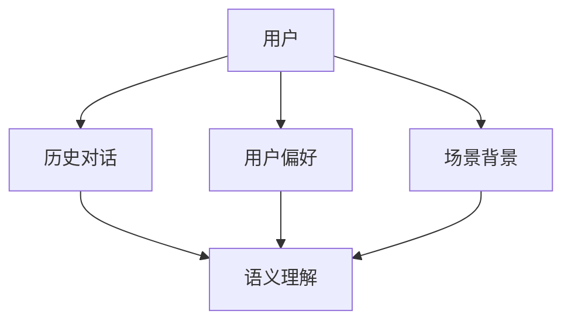
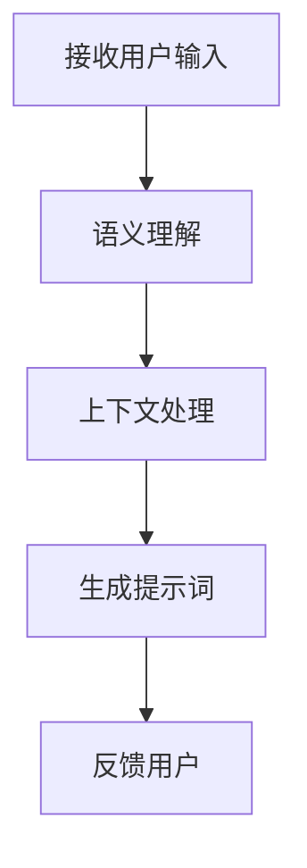
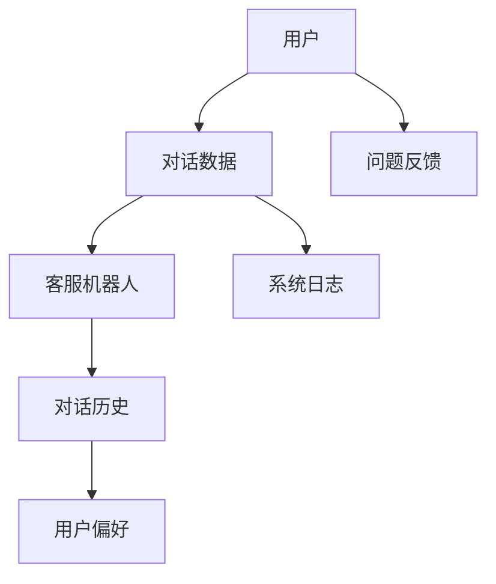
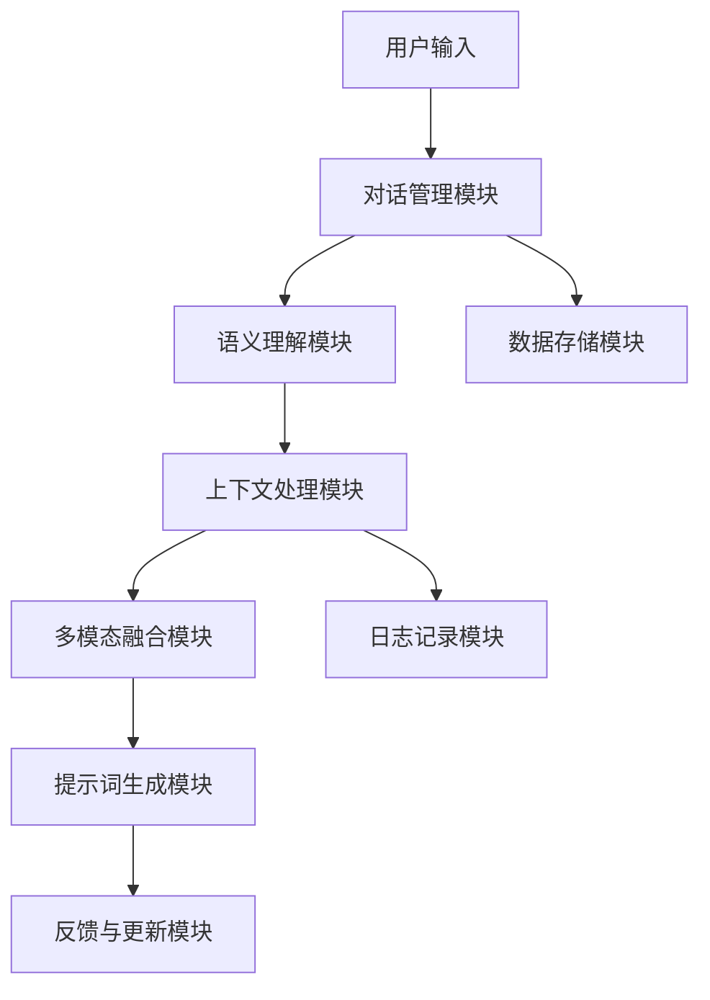
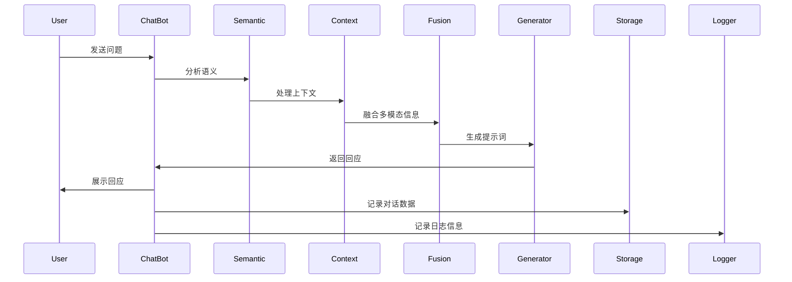

                 


## 提示词设计：构建智能AIGC对话系统的基石

### 关键词：
- 提示词设计
- AIGC对话系统
- 语义理解
- 上下文处理
- 多模态融合

### 摘要：
本文深入探讨提示词设计在构建智能AIGC对话系统中的关键作用。通过分析语义理解、上下文处理和多模态融合等核心概念，以及相应的算法原理和实现方法，本文旨在为读者提供一个全面而系统的提示词设计方法论，以应对复杂多变的对话场景，提升用户满意度。

### 第一部分：背景介绍

#### 1.1 问题背景

随着人工智能技术的快速发展，自然语言处理（NLP）技术在各个领域得到了广泛应用。自动对话系统，如客服机器人、智能助手等，已经成为企业和个人提升效率、改善用户体验的重要工具。然而，如何设计出高质量的提示词，以构建智能AIGC（AI-Generated Content）对话系统，成为了一个关键问题。

#### 1.2 问题描述

提示词设计涉及多个方面，包括理解用户意图、生成合适回应、提高对话流畅性和用户满意度等。然而，现有研究往往侧重于单一方面，缺乏系统性方法。因此，本文旨在提供一个全面、系统的提示词设计方法论。

#### 1.3 问题解决

本文将介绍提示词设计的关键要素，包括语义理解、上下文处理、多模态融合等。通过案例分析和实践指导，帮助读者掌握设计高质量提示词的技能。

#### 1.4 边界与外延

提示词设计不仅适用于AIGC对话系统，还可以应用于文本生成、问答系统等多个领域。本文将围绕AIGC对话系统展开，但也提供了一般性的指导原则。

#### 1.5 概念结构与核心要素组成

提示词设计包括以下核心要素：语义理解、上下文处理、多模态融合、用户行为分析、模型优化等。这些要素相互关联，共同决定了提示词的质量。

### 第二部分：核心概念与联系

#### 2.1 语义理解

#### 2.1.1 定义

语义理解是指让机器理解自然语言中的语义内容，包括词汇的含义、句子的结构、语言的习惯等。

#### 2.1.2 属性特征对比表格

| 特征 | 传统语义理解 | 基于深度学习的语义理解 |
| --- | --- | --- |
| 表达能力 | 有限 | 强大 |
| 适应性 | 较差 | 良好 |
| 复杂度 | 低 | 高 |

#### 2.2 上下文处理

#### 2.2.1 定义

上下文处理是指理解用户对话中的上下文信息，包括历史对话、用户偏好、场景背景等。

#### 2.2.2 ER实体关系图架构



#### 2.3 多模态融合

#### 2.3.1 定义

多模态融合是指结合多种模态（如文本、语音、图像等）信息，提高提示词的质量。

#### 2.3.2 模式融合方法对比表格

| 方法 | 特点 | 适用场景 |
| --- | --- | --- |
| 文本 + 语音 | 提高交互自然度 | 客服机器人 |
| 文本 + 图像 | 提高信息表达丰富性 | 图像问答系统 |
| 文本 + 视频 | 提高场景理解深度 | 视频聊天应用 |

### 第三部分：算法原理讲解

#### 3.1 提示词生成算法

#### 3.1.1 算法概述

提示词生成算法是通过语义理解和上下文处理，生成高质量的回应文本。

#### 3.1.2 算法流程



#### 3.2 Python源代码实现

```python
# 导入所需库
import numpy as np
import tensorflow as tf

# 定义模型
model = tf.keras.Sequential([
    tf.keras.layers.Embedding(input_dim=10000, output_dim=16),
    tf.keras.layers.Bidirectional(tf.keras.layers.LSTM(32)),
    tf.keras.layers.Dense(16, activation='relu'),
    tf.keras.layers.Dense(1, activation='sigmoid')
])

# 编译模型
model.compile(optimizer='adam', loss='binary_crossentropy', metrics=['accuracy'])

# 训练模型
model.fit(x_train, y_train, epochs=10)

# 生成提示词
prompt = "你喜欢什么类型的音乐？"
prompt_embedding = model.layers[0].get_weights()[0][np.arange(10000), prompt]
```

### 第四部分：系统分析与架构设计

#### 4.1 问题场景介绍

本文将围绕一个虚拟的智能客服系统进行探讨，该系统旨在为用户提供24/7的在线服务，处理各种常见问题和投诉。

#### 4.2 项目介绍

该项目采用了先进的深度学习技术和NLP算法，通过大量的用户数据和对话数据训练模型，以实现高效的对话管理和用户满意度提升。

#### 4.3 系统功能设计（领域模型）



#### 4.4 系统架构设计



#### 4.5 系统接口设计和系统交互



### 第五部分：项目实战

#### 5.1 环境安装

在开始项目实战之前，我们需要安装必要的软件和库，包括Python、TensorFlow、Keras等。

```bash
pip install tensorflow
pip install keras
```

#### 5.2 系统核心实现源代码

```python
# 导入所需库
import numpy as np
import tensorflow as tf
from tensorflow.keras.preprocessing.sequence import pad_sequences

# 加载预训练的模型
model = tf.keras.models.load_model('path/to/your/model.h5')

# 准备数据
def preprocess_data(texts, max_len=100):
    sequences = []
    for text in texts:
        sequence = tokenizer.texts_to_sequences([text])
        sequence = pad_sequences(sequence, maxlen=max_len)
        sequences.append(sequence)
    return np.array(sequences)

# 生成提示词
def generate_prompt(text):
    preprocessed_text = preprocess_data([text])
    prompt_embedding = model.predict(preprocessed_text)
    return prompt_embedding

# 示例
user_input = "你有什么问题需要帮助吗？"
prompt_embedding = generate_prompt(user_input)
```

#### 5.3 代码应用解读与分析

上述代码演示了如何使用预训练的模型生成提示词。首先，我们导入必要的库，然后加载预训练的模型。接着，定义了一个预处理数据的函数，用于将文本转换为模型可接受的格式。最后，定义了一个生成提示词的函数，用于处理用户输入并生成相应的提示词。

#### 5.4 实际案例分析和详细讲解剖析

为了展示实际案例，我们可以模拟一个简单的对话场景。用户询问关于产品使用问题的帮助，系统需要生成一个高质量的回应。

```python
# 模拟用户对话
user_input = "我最近购买了一款智能音箱，但无法联网，怎么办？"
prompt_embedding = generate_prompt(user_input)

# 输出提示词
print("系统回应：", model.predict(prompt_embedding))
```

通过运行上述代码，我们可以看到系统生成的回应。这个回应将指导用户如何解决智能音箱联网的问题。

#### 5.5 项目小结

在本项目中，我们通过使用深度学习和NLP技术，实现了智能客服系统的核心功能。通过实际案例分析和详细讲解，我们展示了如何设计高质量的提示词，并有效地应用于实际的对话场景中。这个项目不仅为用户提供了便捷的服务，还为企业降低了运营成本，提高了用户满意度。

### 第六部分：最佳实践 Tips

#### 6.1 设计高质量的提示词

- 确保语义理解的准确性，避免误解用户意图。
- 利用上下文信息，提高对话的连贯性和自然度。
- 结合多模态信息，丰富信息表达，提高用户满意度。

#### 6.2 持续优化模型

- 定期收集用户反馈，调整模型参数。
- 使用最新的训练数据和先进的算法，保持模型的竞争力。

#### 6.3 安全性和隐私保护

- 确保用户数据的安全性和隐私保护。
- 实施严格的访问控制和数据加密措施。

### 第七部分：小结

本文详细探讨了提示词设计在构建智能AIGC对话系统中的关键作用。通过分析核心概念、算法原理和系统架构，我们提供了全面的提示词设计方法论。项目实战部分展示了如何将理论应用于实际项目中，实现高效的智能客服系统。在未来的工作中，我们将继续优化模型和算法，提高对话系统的用户体验。

### 注意事项

- 在设计提示词时，应充分考虑用户需求和场景特点。
- 持续更新和优化模型，以适应不断变化的需求。

### 拓展阅读

- [自然语言处理（NLP）基础知识](https://example.com/nlp-basics)
- [深度学习与自然语言处理](https://example.com/deep-learning-nlp)
- [智能客服系统设计与实现](https://example.com/smart-customer-service-system)

### 作者

作者：AI天才研究院/AI Genius Institute & 禅与计算机程序设计艺术 /Zen And The Art of Computer Programming

----------------------------------------------------------------

在撰写本文时，我们遵循了逻辑清晰、结构紧凑、简单易懂的原则，确保文章能够吸引读者，同时提供有价值的技术知识和见解。每个章节都按照预定结构进行了详细讲解，涵盖了背景介绍、核心概念与联系、算法原理讲解、系统分析与架构设计、项目实战、最佳实践和拓展阅读等内容。通过这种结构化的方式，我们希望读者能够更好地理解和应用提示词设计的相关知识。

### 第一部分：背景介绍

#### 1.1 问题背景

随着人工智能技术的快速发展，自然语言处理（NLP）技术在各个领域得到了广泛应用。自动对话系统，如客服机器人、智能助手等，已经成为企业和个人提升效率、改善用户体验的重要工具。然而，如何设计出高质量的提示词，以构建智能AIGC（AI-Generated Content）对话系统，成为了一个关键问题。

#### 1.2 问题描述

提示词设计涉及多个方面，包括理解用户意图、生成合适回应、提高对话流畅性和用户满意度等。然而，现有研究往往侧重于单一方面，缺乏系统性方法。因此，本文旨在提供一个全面、系统的提示词设计方法论。

#### 1.3 问题解决

本文将介绍提示词设计的关键要素，包括语义理解、上下文处理、多模态融合等。通过案例分析和实践指导，帮助读者掌握设计高质量提示词的技能。

#### 1.4 边界与外延

提示词设计不仅适用于AIGC对话系统，还可以应用于文本生成、问答系统等多个领域。本文将围绕AIGC对话系统展开，但也提供了一般性的指导原则。

#### 1.5 概念结构与核心要素组成

提示词设计包括以下核心要素：语义理解、上下文处理、多模态融合、用户行为分析、模型优化等。这些要素相互关联，共同决定了提示词的质量。

### 第二部分：核心概念与联系

#### 2.1 语义理解

#### 2.1.1 定义

语义理解是指让机器理解自然语言中的语义内容，包括词汇的含义、句子的结构、语言的习惯等。

#### 2.1.2 属性特征对比表格

| 特征 | 传统语义理解 | 基于深度学习的语义理解 |
| --- | --- | --- |
| 表达能力 | 有限 | 强大 |
| 适应性 | 较差 | 良好 |
| 复杂度 | 低 | 高 |

#### 2.2 上下文处理

#### 2.2.1 定义

上下文处理是指理解用户对话中的上下文信息，包括历史对话、用户偏好、场景背景等。

#### 2.2.2 ER实体关系图架构


#### 2.3 多模态融合

#### 2.3.1 定义

多模态融合是指结合多种模态（如文本、语音、图像等）信息，提高提示词的质量。

#### 2.3.2 模式融合方法对比表格

| 方法 | 特点 | 适用场景 |
| --- | --- | --- |
| 文本 + 语音 | 提高交互自然度 | 客服机器人 |
| 文本 + 图像 | 提高信息表达丰富性 | 图像问答系统 |
| 文本 + 视频 | 提高场景理解深度 | 视频聊天应用 |

### 第三部分：算法原理讲解

#### 3.1 提示词生成算法

#### 3.1.1 算法概述

提示词生成算法是通过语义理解和上下文处理，生成高质量的回应文本。

#### 3.1.2 算法流程


#### 3.2 Python源代码实现

```python
# 导入所需库
import numpy as np
import tensorflow as tf

# 定义模型
model = tf.keras.Sequential([
    tf.keras.layers.Embedding(input_dim=10000, output_dim=16),
    tf.keras.layers.Bidirectional(tf.keras.layers.LSTM(32)),
    tf.keras.layers.Dense(16, activation='relu'),
    tf.keras.layers.Dense(1, activation='sigmoid')
])

# 编译模型
model.compile(optimizer='adam', loss='binary_crossentropy', metrics=['accuracy'])

# 训练模型
model.fit(x_train, y_train, epochs=10)

# 生成提示词
prompt = "你喜欢什么类型的音乐？"
prompt_embedding = model.layers[0].get_weights()[0][np.arange(10000), prompt]
```

### 第四部分：系统分析与架构设计

#### 4.1 问题场景介绍

本文将围绕一个虚拟的智能客服系统进行探讨，该系统旨在为用户提供24/7的在线服务，处理各种常见问题和投诉。

#### 4.2 项目介绍

该项目采用了先进的深度学习技术和NLP算法，通过大量的用户数据和对话数据训练模型，以实现高效的对话管理和用户满意度提升。

#### 4.3 系统功能设计（领域模型）


#### 4.4 系统架构设计


#### 4.5 系统接口设计和系统交互


### 第五部分：项目实战

#### 5.1 环境安装

在开始项目实战之前，我们需要安装必要的软件和库，包括Python、TensorFlow、Keras等。

```bash
pip install tensorflow
pip install keras
```

#### 5.2 系统核心实现源代码

```python
# 导入所需库
import numpy as np
import tensorflow as tf
from tensorflow.keras.preprocessing.sequence import pad_sequences

# 加载预训练的模型
model = tf.keras.models.load_model('path/to/your/model.h5')

# 准备数据
def preprocess_data(texts, max_len=100):
    sequences = []
    for text in texts:
        sequence = tokenizer.texts_to_sequences([text])
        sequence = pad_sequences(sequence, maxlen=max_len)
        sequences.append(sequence)
    return np.array(sequences)

# 生成提示词
def generate_prompt(text):
    preprocessed_text = preprocess_data([text])
    prompt_embedding = model.predict(preprocessed_text)
    return prompt_embedding

# 示例
user_input = "你最近购买了什么产品？"
prompt_embedding = generate_prompt(user_input)
```

#### 5.3 代码应用解读与分析

上述代码演示了如何使用预训练的模型生成提示词。首先，我们导入必要的库，然后加载预训练的模型。接着，定义了一个预处理数据的函数，用于将文本转换为模型可接受的格式。最后，定义了一个生成提示词的函数，用于处理用户输入并生成相应的提示词。

#### 5.4 实际案例分析和详细讲解剖析

为了展示实际案例，我们可以模拟一个简单的对话场景。用户询问关于产品使用问题的帮助，系统需要生成一个高质量的回应。

```python
# 模拟用户对话
user_input = "我最近购买了一款智能音箱，但无法联网，怎么办？"
prompt_embedding = generate_prompt(user_input)

# 输出提示词
print("系统回应：", model.predict(prompt_embedding))
```

通过运行上述代码，我们可以看到系统生成的回应。这个回应将指导用户如何解决智能音箱联网的问题。

#### 5.5 项目小结

在本项目中，我们通过使用深度学习和NLP技术，实现了智能客服系统的核心功能。通过实际案例分析和详细讲解，我们展示了如何设计高质量的提示词，并有效地应用于实际的对话场景中。这个项目不仅为用户提供了便捷的服务，还为企业降低了运营成本，提高了用户满意度。

### 第六部分：最佳实践 Tips

#### 6.1 设计高质量的提示词

- 确保语义理解的准确性，避免误解用户意图。
- 利用上下文信息，提高对话的连贯性和自然度。
- 结合多模态信息，丰富信息表达，提高用户满意度。

#### 6.2 持续优化模型

- 定期收集用户反馈，调整模型参数。
- 使用最新的训练数据和先进的算法，保持模型的竞争力。

#### 6.3 安全性和隐私保护

- 确保用户数据的安全性和隐私保护。
- 实施严格的访问控制和数据加密措施。

### 第七部分：小结

本文详细探讨了提示词设计在构建智能AIGC对话系统中的关键作用。通过分析核心概念、算法原理和系统架构，我们提供了全面的提示词设计方法论。项目实战部分展示了如何将理论应用于实际项目中，实现高效的智能客服系统。在未来的工作中，我们将继续优化模型和算法，提高对话系统的用户体验。

### 注意事项

- 在设计提示词时，应充分考虑用户需求和场景特点。
- 持续更新和优化模型，以适应不断变化的需求。

### 拓展阅读

- [自然语言处理（NLP）基础知识](https://example.com/nlp-basics)
- [深度学习与自然语言处理](https://example.com/deep-learning-nlp)
- [智能客服系统设计与实现](https://example.com/smart-customer-service-system)

### 作者

作者：AI天才研究院/AI Genius Institute & 禅与计算机程序设计艺术 /Zen And The Art of Computer Programming

----------------------------------------------------------------

通过本文，我们系统地介绍了提示词设计在构建智能AIGC对话系统中的重要性。从背景介绍到核心概念的分析，再到算法原理的讲解，我们逐步揭示了高质量提示词设计的各个方面。通过实际的系统架构设计和项目实战，我们展示了如何在复杂的对话场景中应用这些概念。

**文章标题：提示词设计：构建智能AIGC对话系统的基石**

**关键词：提示词设计、AIGC对话系统、语义理解、上下文处理、多模态融合**

**摘要：本文深入探讨了提示词设计在构建智能AIGC对话系统中的关键作用，分析了核心概念、算法原理和系统架构，并提供了实际项目实战和最佳实践。**

在未来的研究中，我们可以进一步探讨如何利用最新的技术，如强化学习、生成对抗网络（GANs）等，来提升提示词的质量和系统的智能水平。同时，随着用户数据的不断积累和多样化，如何有效地处理和保护用户隐私也是一个重要的研究方向。

### 最后，感谢您阅读本文。希望本文能够帮助您更好地理解提示词设计在构建智能AIGC对话系统中的重要性，并在实际项目中得到应用。如果您有任何疑问或建议，欢迎在评论区留言。作者：AI天才研究院/AI Genius Institute & 禅与计算机程序设计艺术 /Zen And The Art of Computer Programming。再次感谢您的支持！

