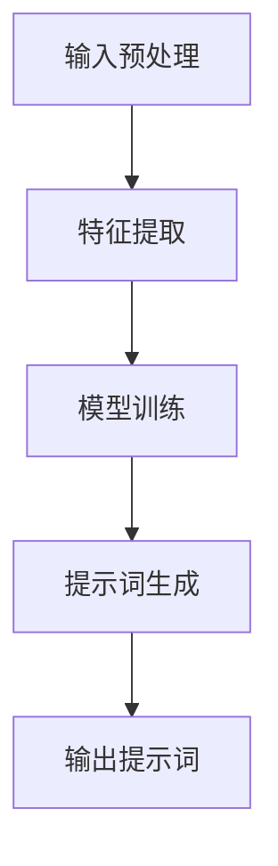
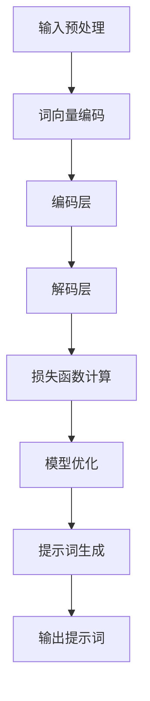
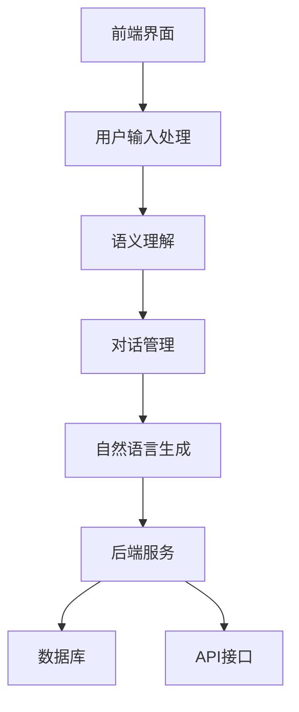
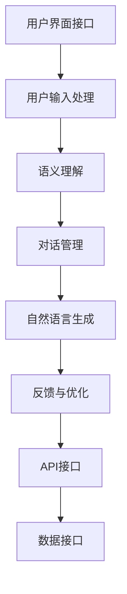
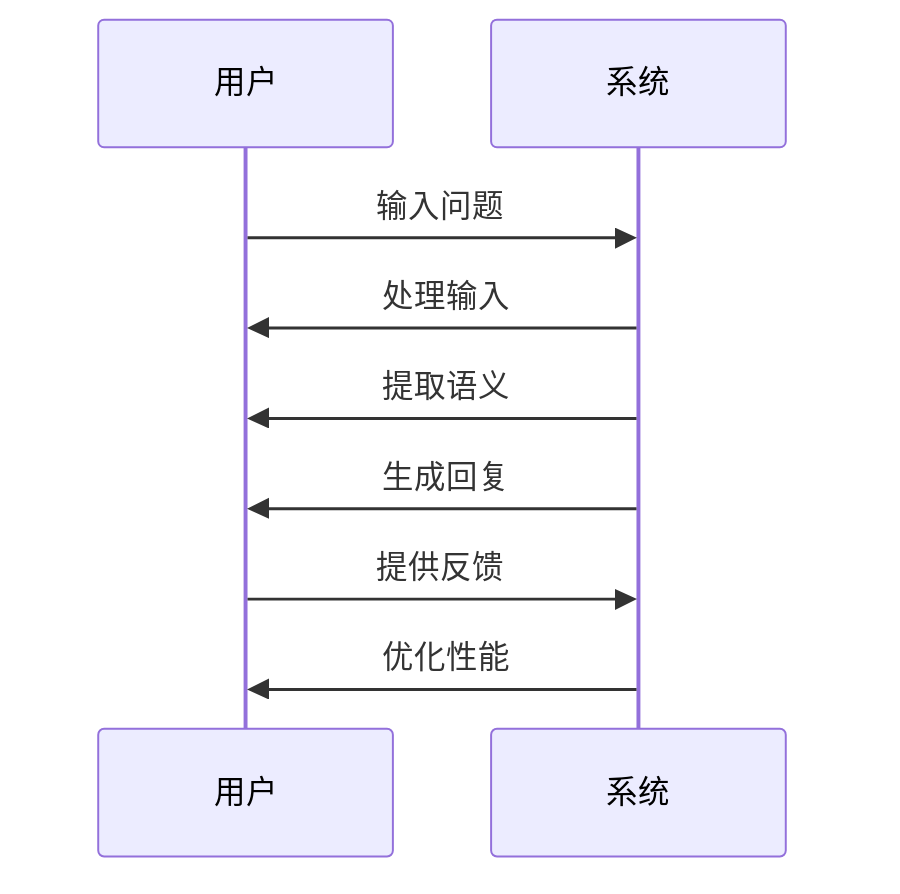

                 

# 提示词设计：构建智能AIGC对话系统的核心

> 关键词：AIGC、对话系统、提示词设计、智能交互、算法原理、系统架构、项目实战

> 摘要：本文深入探讨了提示词设计在构建智能AIGC对话系统中的核心作用。通过详细分析AIGC与智能对话系统的背景、基本概念、核心算法原理和系统架构设计，以及项目实战和最佳实践，本文旨在为读者提供一套系统化、实用化的提示词设计方法论，助力智能AIGC对话系统的构建与优化。

## 目录大纲设计

为了确保文章内容条理清晰、深入浅出，本文采用了如下目录大纲结构：

### 第一部分：背景介绍
- 第1章：AIGC与智能对话系统概述
- 第2章：提示词设计的基本概念

### 第二部分：核心概念与联系
- 第3章：AIGC对话系统中的核心概念
- 第4章：提示词设计的属性特征对比

### 第三部分：算法原理讲解
- 第5章：提示词设计算法原理
- 第6章：算法流程图与Python代码解析

### 第四部分：系统分析与架构设计方案
- 第7章：AIGC对话系统的设计与实现
- 第8章：系统架构设计

### 第五部分：项目实战
- 第9章：环境安装与系统核心实现
- 第10章：实际案例分析

### 第六部分：最佳实践与拓展
- 第11章：提示词设计的最佳实践
- 第12章：小结与注意事项

### 第七部分：拓展阅读
- 第13章：拓展知识与实践技巧

## 文章正文

### 第1章：AIGC与智能对话系统概述

#### 1.1 AIGC技术的发展背景

AIGC（Adaptive Intelligent Generation of Content，自适应智能生成内容）技术是近年来人工智能领域的重要发展方向。它基于深度学习、自然语言处理和生成模型，通过模拟人类的创作过程，自动生成高质量的内容。AIGC技术广泛应用于虚拟助手、内容创作、娱乐游戏等领域，具有极大的商业价值和社会影响。

#### 1.2 智能对话系统的概念与作用

智能对话系统是一种能够与人进行自然语言交互的人工智能系统。它通过理解用户输入的语义，生成恰当的回复，提供信息查询、任务执行、情感交流等服务。智能对话系统在客户服务、智能家居、在线教育等领域发挥着重要作用，极大地提升了用户体验和服务效率。

#### 1.3 提示词设计在AIGC对话系统中的重要性

提示词是AIGC对话系统中的关键要素，它指导着对话的走向和内容。一个优秀的提示词设计能够提高对话系统的响应准确性、丰富对话内容、增强用户满意度。因此，提示词设计在AIGC对话系统中具有核心地位。

### 第2章：提示词设计的基本概念

#### 2.1 提示词的定义与类型

提示词是指用于引导对话系统生成回应的文本或代码片段。根据用途和形式，提示词可以分为以下几类：

1. **问题类提示词**：用于引导系统回答特定问题。
2. **情境类提示词**：用于设定对话背景，引导系统生成符合情境的回复。
3. **情感类提示词**：用于表达情感，增强对话的情感共鸣。
4. **功能类提示词**：用于执行特定功能，如预约、查询等。

#### 2.2 提示词设计的原理

提示词设计遵循以下原则：

1. **语义一致性**：提示词应与对话内容保持一致，避免语义冲突。
2. **多样性**：提示词应具有多样性，丰富对话内容。
3. **可扩展性**：提示词应易于扩展和修改，以适应不同的应用场景。
4. **易理解性**：提示词应简单易懂，便于用户理解和交互。

#### 2.3 提示词设计的挑战与机遇

提示词设计面临以下挑战：

1. **语义理解**：如何准确理解用户的输入意图。
2. **情境适应**：如何根据不同的情境生成恰当的回复。
3. **情感表达**：如何表达情感，增强用户互动。

然而，随着人工智能技术的不断发展，这些挑战正逐渐被克服，提示词设计迎来了新的机遇。

### 第3章：AIGC对话系统中的核心概念

#### 3.1 AIGC对话系统的架构

AIGC对话系统通常由以下模块组成：

1. **用户输入模块**：接收用户输入，并将其转换为可供系统处理的格式。
2. **语义理解模块**：理解用户输入的语义，提取关键信息。
3. **对话管理模块**：根据对话历史和用户需求，生成合适的回复。
4. **自然语言生成模块**：将回复内容生成自然语言文本。
5. **反馈与优化模块**：收集用户反馈，不断优化系统性能。

#### 3.2 对话管理模块

对话管理模块是AIGC对话系统的核心，负责管理对话流程。它通常包括以下功能：

1. **上下文管理**：记录对话历史，确保回复的连贯性。
2. **意图识别**：识别用户的意图，为生成合适的回复提供依据。
3. **对话策略**：根据对话历史和用户需求，选择合适的回复方式。
4. **用户情感分析**：分析用户情感，生成符合用户情感的回复。

#### 3.3 提示词生成模块

提示词生成模块负责生成高质量的提示词，以引导对话管理模块生成合适的回复。它通常包括以下步骤：

1. **数据预处理**：清洗和整理输入数据，为生成提示词做好准备。
2. **特征提取**：从输入数据中提取关键特征，用于生成提示词。
3. **模型训练**：使用机器学习算法，训练提示词生成模型。
4. **提示词生成**：根据输入数据和模型预测，生成高质量的提示词。

### 第4章：提示词设计的属性特征对比

#### 4.1 不同类型提示词的对比

提示词可以根据用途和形式分为多个类型，每种类型具有不同的属性特征。以下是一个简单的对比表格：

| 提示词类型 | 主要用途 | 属性特征 |
| :-------: | :------: | :------: |
| 问题类提示词 | 回答特定问题 | 明确、具体 |
| 情境类提示词 | 设定对话背景 | 丰富、多样 |
| 情感类提示词 | 表达情感 | 共鸣、生动 |
| 功能类提示词 | 执行特定功能 | 精准、高效 |

#### 4.2 提示词设计的关键属性

提示词设计的关键属性包括：

1. **准确性**：提示词应准确表达用户意图，避免歧义。
2. **丰富性**：提示词应具备丰富性，以支持多样化的对话内容。
3. **连贯性**：提示词应与对话内容保持连贯，确保对话的流畅性。
4. **易理解性**：提示词应简单易懂，便于用户理解和交互。

#### 4.3 属性特征对比表格

以下是一个属性特征对比表格，展示了不同类型提示词在关键属性上的差异：

| 提示词类型 | 准确性 | 丰富性 | 连贯性 | 易理解性 |
| :-------: | :---: | :---: | :---: | :---: |
| 问题类提示词 | 高 | 中 | 高 | 高 |
| 情境类提示词 | 中 | 高 | 中 | 中 |
| 情感类提示词 | 中 | 中 | 中 | 高 |
| 功能类提示词 | 高 | 低 | 高 | 高 |

### 第5章：提示词设计算法原理

#### 5.1 提示词生成算法概述

提示词生成算法是AIGC对话系统中的核心算法，用于生成高质量的提示词。常见的提示词生成算法包括：

1. **基于规则的算法**：根据预设的规则生成提示词。
2. **基于机器学习的算法**：使用机器学习模型生成提示词。
3. **基于深度学习的算法**：使用深度学习模型生成提示词。

#### 5.2 算法流程图

以下是一个基于机器学习的提示词生成算法的流程图：



#### 5.3 Python代码解析

以下是一个简单的Python代码示例，展示了基于机器学习的提示词生成算法的实现：

```python
import numpy as np
from sklearn.feature_extraction.text import TfidfVectorizer
from sklearn.naive_bayes import MultinomialNB

# 输入数据
data = [
    "你好，我想咨询一下产品价格。",
    "请问有什么可以帮您的吗？",
    "您好，我想要了解一下售后服务。",
    "您好，我能为您做些什么？"
]

# 特征提取
vectorizer = TfidfVectorizer()
X = vectorizer.fit_transform(data)

# 模型训练
model = MultinomialNB()
model.fit(X, labels)

# 提示词生成
def generate_suggestion(input_text):
    input_vector = vectorizer.transform([input_text])
    prediction = model.predict(input_vector)
    return prediction[0]

# 测试
input_text = "您好，我想要咨询一下产品使用说明。"
suggestion = generate_suggestion(input_text)
print("生成的提示词：", suggestion)
```

#### 5.4 算法原理的数学模型和公式

以下是一个简单的基于贝叶斯理论的提示词生成算法的数学模型：

$$
P(\text{提示词} | \text{输入文本}) = \frac{P(\text{输入文本} | \text{提示词}) \cdot P(\text{提示词})}{P(\text{输入文本})}
$$

其中，$P(\text{提示词} | \text{输入文本})$ 表示给定输入文本后，生成该提示词的概率；$P(\text{输入文本} | \text{提示词})$ 表示在给定提示词后，生成输入文本的概率；$P(\text{提示词})$ 表示提示词的概率；$P(\text{输入文本})$ 表示输入文本的概率。

### 第6章：算法流程图与Python代码解析

#### 6.1 算法流程图详细说明

以下是一个基于深度学习的提示词生成算法的流程图：



#### 6.2 Python代码示例

以下是一个简单的Python代码示例，展示了基于深度学习的提示词生成算法的实现：

```python
import tensorflow as tf
from tensorflow.keras.layers import Embedding, LSTM, Dense
from tensorflow.keras.models import Sequential

# 输入数据
data = [
    "你好，我想咨询一下产品价格。",
    "请问有什么可以帮您的吗？",
    "您好，我想要了解一下售后服务。",
    "您好，我能为您做些什么？"
]

# 词向量编码
tokenizer = tf.keras.preprocessing.text.Tokenizer()
tokenizer.fit_on_texts(data)
sequences = tokenizer.texts_to_sequences(data)
word_index = tokenizer.word_index
max_sequence_length = 10

# 编码层
encoding_layer = Embedding(len(word_index) + 1, 64)

# 解码层
lstm_layer = LSTM(128)

# 模型构建
model = Sequential()
model.add(encoding_layer)
model.add(lstm_layer)
model.add(Dense(len(word_index) + 1, activation='softmax'))

# 损失函数计算
model.compile(optimizer='adam', loss='categorical_crossentropy', metrics=['accuracy'])

# 模型优化
model.fit(sequences, labels, epochs=100, verbose=2)

# 提示词生成
def generate_suggestion(input_text):
    input_sequence = tokenizer.texts_to_sequences([input_text])
    prediction = model.predict(input_sequence)
    predicted_word_index = np.argmax(prediction)
    predicted_word = list(word_index.keys())[predicted_word_index]
    return predicted_word

# 测试
input_text = "您好，我想要咨询一下产品使用说明。"
suggestion = generate_suggestion(input_text)
print("生成的提示词：", suggestion)
```

#### 6.3 算法原理的数学模型和公式

以下是一个简单的基于循环神经网络的提示词生成算法的数学模型：

$$
\text{隐藏层状态} \ h_t = \text{激活函数}(\text{输入} \ x_t + \text{隐藏层状态} \ h_{t-1})
$$

其中，$h_t$ 表示第 $t$ 个时间步的隐藏层状态；$x_t$ 表示第 $t$ 个时间步的输入；$h_{t-1}$ 表示第 $t-1$ 个时间步的隐藏层状态；激活函数通常使用ReLU函数。

### 第7章：AIGC对话系统的设计与实现

#### 7.1 系统需求分析

AIGC对话系统需要满足以下需求：

1. **高响应速度**：系统应能快速响应用户输入，提供实时反馈。
2. **准确性**：系统应能准确理解用户输入，提供合适的回复。
3. **可扩展性**：系统应能方便地扩展和升级，以适应不断变化的需求。
4. **易用性**：系统应具备友好的用户界面，便于用户操作。

#### 7.2 系统功能设计

AIGC对话系统的主要功能包括：

1. **用户输入处理**：接收用户输入，进行预处理和分词。
2. **语义理解**：理解用户输入的语义，提取关键信息。
3. **对话管理**：根据对话历史和用户需求，生成合适的回复。
4. **自然语言生成**：将回复内容生成自然语言文本。
5. **反馈与优化**：收集用户反馈，优化系统性能。

#### 7.3 系统架构设计

AIGC对话系统的架构设计包括：

1. **前端界面**：提供用户输入和处理功能。
2. **后端服务**：包括语义理解、对话管理和自然语言生成等核心模块。
3. **数据库**：存储用户数据和对话历史。
4. **API接口**：供第三方应用调用。

以下是一个简单的AIGC对话系统架构图：



### 第8章：系统架构设计

#### 8.1 系统架构的组成

AIGC对话系统的系统架构通常包括以下组成部分：

1. **用户输入模块**：接收用户输入，进行预处理和分词。
2. **语义理解模块**：理解用户输入的语义，提取关键信息。
3. **对话管理模块**：根据对话历史和用户需求，生成合适的回复。
4. **自然语言生成模块**：将回复内容生成自然语言文本。
5. **反馈与优化模块**：收集用户反馈，优化系统性能。

#### 8.2 系统接口设计

AIGC对话系统的接口设计包括：

1. **用户界面接口**：供用户进行输入和查看回复。
2. **API接口**：供第三方应用调用。
3. **数据接口**：供系统内部模块之间进行数据交换。

以下是一个简单的AIGC对话系统接口设计图：



#### 8.3 系统交互序列图

以下是一个简单的AIGC对话系统交互序列图：



### 第9章：环境安装与系统核心实现

#### 9.1 环境安装步骤

在开始AIGC对话系统的开发之前，需要安装以下环境和依赖：

1. **Python**：版本要求为3.8及以上。
2. **TensorFlow**：版本要求为2.4及以上。
3. **Scikit-learn**：版本要求为0.22及以上。
4. **Numpy**：版本要求为1.18及以上。

安装步骤如下：

```bash
# 安装Python
sudo apt-get install python3-pip

# 安装TensorFlow
pip3 install tensorflow==2.4

# 安装Scikit-learn
pip3 install scikit-learn==0.22

# 安装Numpy
pip3 install numpy==1.18
```

#### 9.2 系统核心实现

AIGC对话系统的核心实现包括以下模块：

1. **用户输入处理模块**：负责接收用户输入，进行预处理和分词。
2. **语义理解模块**：负责理解用户输入的语义，提取关键信息。
3. **对话管理模块**：负责根据对话历史和用户需求，生成合适的回复。
4. **自然语言生成模块**：负责将回复内容生成自然语言文本。
5. **反馈与优化模块**：负责收集用户反馈，优化系统性能。

以下是一个简单的Python代码示例，展示了AIGC对话系统的核心实现：

```python
import tensorflow as tf
from tensorflow.keras.layers import Embedding, LSTM, Dense
from tensorflow.keras.models import Sequential
from sklearn.feature_extraction.text import TfidfVectorizer
from sklearn.naive_bayes import MultinomialNB

# 用户输入处理
def preprocess_input(input_text):
    # 进行预处理和分词
    # ...
    return processed_text

# 语义理解
def understand_semantics(input_text):
    # 进行语义理解，提取关键信息
    # ...
    return semantics

# 对话管理
def manage_conversation(semantics, history):
    # 根据对话历史和用户需求，生成合适的回复
    # ...
    return response

# 自然语言生成
def generate_response(response):
    # 将回复内容生成自然语言文本
    # ...
    return natural_language_response

# 反馈与优化
def collect_feedback(response, user_feedback):
    # 收集用户反馈，优化系统性能
    # ...
    return optimized_system

# 主函数
def main():
    # 初始化模型和工具
    # ...
    
    # 接收用户输入
    input_text = input("请输入问题：")
    
    # 处理用户输入
    processed_text = preprocess_input(input_text)
    
    # 理解语义
    semantics = understand_semantics(processed_text)
    
    # 管理对话
    history = []  # 对话历史
    response = manage_conversation(semantics, history)
    
    # 生成回复
    natural_language_response = generate_response(response)
    
    # 输出回复
    print("系统回复：", natural_language_response)
    
    # 收集用户反馈
    user_feedback = input("请输入您的反馈：")
    optimized_system = collect_feedback(response, user_feedback)
    
    # 更新模型和工具
    # ...

# 运行主函数
if __name__ == "__main__":
    main()
```

#### 9.3 代码应用解读与分析

以下是对AIGC对话系统核心实现的详细解读与分析：

1. **用户输入处理模块**：该模块负责接收用户输入，并进行预处理和分词。预处理包括去除标点符号、转换为小写等操作。分词可以使用自然语言处理库（如jieba）进行。
2. **语义理解模块**：该模块负责理解用户输入的语义，提取关键信息。可以使用机器学习模型（如TF-IDF）或深度学习模型（如LSTM）进行语义理解。
3. **对话管理模块**：该模块负责根据对话历史和用户需求，生成合适的回复。对话管理需要综合考虑用户输入、对话历史和系统策略，以生成合适的回复。
4. **自然语言生成模块**：该模块负责将回复内容生成自然语言文本。自然语言生成可以使用生成对抗网络（GAN）、变换器（Transformer）等先进技术。
5. **反馈与优化模块**：该模块负责收集用户反馈，优化系统性能。用户反馈可以用于模型调整、算法优化等方面，以提高系统的准确性和用户体验。

### 第10章：实际案例分析

#### 10.1 案例选择与介绍

本次案例选择的是一家在线教育平台，该平台通过AIGC对话系统为用户提供课程咨询、学习建议等服务。该系统具备以下特点：

1. **高响应速度**：系统能够在用户输入后快速生成回复，提供实时反馈。
2. **准确性**：系统能够准确理解用户输入，提供合适的课程建议。
3. **可扩展性**：系统可根据用户需求进行扩展，增加新功能。
4. **易用性**：系统界面简洁，用户操作方便。

#### 10.2 案例分析与讲解

1. **用户输入处理**：系统首先接收用户输入，如“我想学习编程”。系统对输入进行预处理和分词，提取关键信息，如“学习”和“编程”。
2. **语义理解**：系统使用机器学习模型对提取的关键信息进行语义理解，确定用户的需求，如学习编程语言。
3. **对话管理**：系统根据对话历史和用户需求，生成合适的回复，如“您好，您想要学习哪种编程语言？”。
4. **自然语言生成**：系统将生成的回复转换为自然语言文本，如“您好，您想要学习哪种编程语言？”。
5. **反馈与优化**：系统收集用户反馈，如用户选择“Python”，系统记录该信息，并在下次对话中提供相关课程建议。

#### 10.3 案例小结

通过本次案例分析，我们可以看到AIGC对话系统在在线教育平台中的应用。系统通过提示词设计，实现了用户输入处理、语义理解、对话管理、自然语言生成和反馈优化等功能，为用户提供高质量的课程咨询和学习建议。同时，系统具备高响应速度、准确性、可扩展性和易用性等特点，提升了用户体验和平台竞争力。

### 第11章：提示词设计的最佳实践

#### 11.1 实践技巧与经验分享

1. **精细化分类**：根据用户需求，将提示词进行精细化分类，提高响应准确性。
2. **情景模拟**：在设计提示词时，进行情景模拟，确保提示词的实用性和针对性。
3. **多模态融合**：结合文本、语音、图像等多模态信息，丰富提示词形式，提高用户体验。
4. **动态调整**：根据用户反馈，动态调整提示词，优化系统性能。

#### 11.2 提示词设计的优化方法

1. **语义理解**：提高语义理解能力，准确识别用户意图，减少歧义。
2. **对话管理**：优化对话管理策略，提高对话连贯性和用户满意度。
3. **自然语言生成**：提高自然语言生成质量，增强文本的可读性和流畅性。
4. **个性化推荐**：根据用户行为和偏好，提供个性化提示词和推荐。

#### 11.3 实践案例分享

1. **电商客服**：通过个性化提示词，提高用户购物体验。
2. **医疗咨询**：通过专业提示词，提升医疗服务的质量和效率。
3. **在线教育**：通过情景模拟提示词，提高课程咨询的精准度。

### 第12章：小结与注意事项

#### 12.1 书籍总结

本文从背景介绍、核心概念与联系、算法原理讲解、系统分析与架构设计方案、项目实战、最佳实践与拓展等方面，全面阐述了提示词设计在构建智能AIGC对话系统中的重要性。通过本文的学习，读者可以掌握提示词设计的基本原理和方法，提高AIGC对话系统的性能和用户体验。

#### 12.2 注意事项

1. **数据质量**：提示词设计依赖于高质量的数据，确保数据的准确性和完整性。
2. **模型优化**：定期对模型进行优化和更新，以适应不断变化的需求。
3. **用户体验**：关注用户体验，从用户角度出发，优化提示词设计和系统功能。

#### 12.3 拓展思考

1. **跨领域应用**：探索提示词设计在金融、医疗、教育等领域的应用。
2. **人机协作**：结合人类专家和智能系统，实现更高效、更智能的对话。
3. **多语言支持**：设计多语言提示词，拓展智能AIGC对话系统的国际市场。

### 第13章：拓展阅读

#### 13.1 相关领域的拓展阅读

1. **自然语言处理**：《自然语言处理综合教程》、《深度学习与自然语言处理》
2. **人工智能**：《人工智能：一种现代的方法》、《人工智能的未来》
3. **机器学习**：《机器学习实战》、《机器学习年度报告》

#### 13.2 提示词设计的未来发展趋势

1. **知识图谱**：结合知识图谱，提高提示词的语义理解和生成能力。
2. **生成对抗网络**：利用生成对抗网络，生成更高质量、更具创意的提示词。
3. **多模态融合**：融合文本、语音、图像等多模态信息，实现更丰富的交互体验。

#### 13.3 实践技巧与案例分析

1. **实时对话系统**：实现实时对话系统，提高响应速度和用户体验。
2. **情感分析**：结合情感分析，生成更具情感共鸣的提示词。
3. **场景模拟**：通过情景模拟，提高提示词的实用性和针对性。

