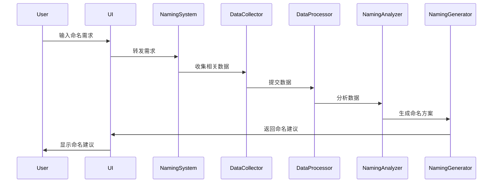
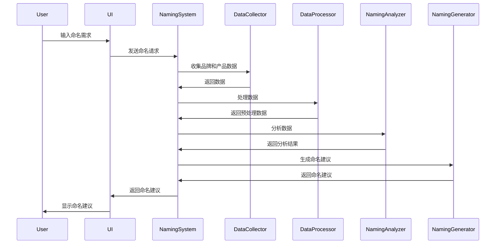

                 

### 文章标题

《提高AI创意命名能力：品牌和产品命名的提示词技巧》

### 关键词

- AI命名
- 创意命名
- 提示词技巧
- 品牌命名
- 产品命名

### 摘要

本文深入探讨了AI在品牌和产品命名中的应用，介绍了如何利用AI提高创意命名能力。通过分析命名学理论和AI结合的潜力，本文详细阐述了如何使用提示词技巧来提升命名创意。通过实战案例和最佳实践，本文旨在为专业人士提供实用的命名策略和技巧。

----------------------------------------------------------------

### 目录大纲

#### 第一部分：背景介绍与核心概念

1. **AI在品牌和产品命名中的应用**
   1.1 AI与创意命名的结合
   1.2 创意命名的重要性
   1.3 AI辅助命名的潜力

2. **创意命名的基础理论**
   2.1 命名原则和风格
   2.2 命名策略与目标
   2.3 命名学的历史与发展

#### 第二部分：命名理论及应用

3. **AI工具与命名理论结合**
   3.1 命名原则与AI的关联
   3.2 命名风格与AI的结合
   3.3 命名策略与AI的应用

4. **AI提示词技巧**
   4.1 提示词的概念
   4.2 提示词的分类
   4.3 提示词在命名中的应用

#### 第三部分：AI工具与提示词技巧

5. **常用AI工具介绍**
   5.1 AI命名工具的功能与特性
   5.2 如何选择合适的AI命名工具
   5.3 AI命名工具的使用案例

6. **提示词技巧实战**
   6.1 提示词生成技巧
   6.2 提示词优化技巧
   6.3 提示词案例分析

#### 第四部分：实战案例分析

7. **品牌命名案例**
   7.1 案例背景介绍
   7.2 AI工具应用
   7.3 命名策略分析
   7.4 案例总结

8. **产品命名案例**
   8.1 案例背景介绍
   8.2 AI工具应用
   8.3 命名策略分析
   8.4 案例总结

#### 第五部分：最佳实践与扩展

9. **最佳实践与技巧**
   9.1 提升命名创意的建议
   9.2 AI命名工具的优化
   9.3 创意命名策略的持续优化

10. **小结与拓展阅读**
   10.1 核心内容回顾
   10.2 注意事项
   10.3 拓展学习方向

----------------------------------------------------------------

### 第一部分：背景介绍与核心概念

#### 1.1 AI在品牌和产品命名中的应用

**1.1.1 AI与创意命名的结合**

随着人工智能技术的不断发展，AI在各个领域的应用越来越广泛。在品牌和产品命名方面，AI的介入使得创意命名变得更加高效和精准。通过大数据分析和自然语言处理技术，AI能够快速生成大量具有创意的命名方案，为品牌和产品提供多样化的选择。

**1.1.2 创意命名的重要性**

创意命名不仅仅是给品牌和产品起一个名字，它还涉及到品牌形象、消费者认知和市场竞争力等多方面的因素。一个富有创意的名字能够吸引消费者的注意力，提高品牌认知度，从而在激烈的市场竞争中脱颖而出。

**1.1.3 AI辅助命名的潜力**

AI在命名领域的潜力主要体现在以下几个方面：

- **数据分析能力**：AI能够通过对大量数据的分析，提取出有价值的命名元素，为创意命名提供丰富的素材。
- **快速生成命名方案**：AI可以在短时间内生成大量的命名方案，极大地提高了命名效率。
- **个性化推荐**：AI可以根据品牌和产品的特点，提供个性化的命名建议，提高命名策略的针对性。

#### 1.2 创意命名的基础理论

**1.2.1 命名原则和风格**

命名原则是指在设计命名方案时需要遵循的基本规则。常见的命名原则包括简洁性、易记性、独特性、相关性和文化适应性等。命名风格则是指命名的形式和表现手法，如口语化、文艺化、抽象化等。

**1.2.2 命名策略与目标**

命名策略是指在设计命名方案时采用的具体方法和策略。命名策略需要根据品牌和产品的目标来制定，如提高品牌知名度、增强产品竞争力等。不同的命名策略会带来不同的命名效果。

**1.2.3 命名学的历史与发展**

命名学是研究命名规则和方法的学科。从古代的文字创造到现代的计算机命名，命名学经历了漫长的发展。在计算机时代，命名学的研究重点转向了如何利用计算机技术进行高效命名。

#### 1.3 创意命名的重要性

创意命名在品牌和产品成功中起着至关重要的作用。一个富有创意的名字能够吸引消费者的注意力，提高品牌认知度，从而在激烈的市场竞争中脱颖而出。以下是一些具体的例子：

- **品牌命名**：例如，苹果（Apple）这个品牌名简洁易记，富有创意，成功地塑造了一个高科技、时尚的品牌形象。
- **产品命名**：例如，特斯拉（Tesla）这个品牌名不仅与科学家特斯拉的名字相关联，而且具有独特的科技感，成功地吸引了消费者的注意力。

总之，创意命名是品牌和产品成功的关键因素之一，值得深入研究和实践。

----------------------------------------------------------------

### 第二部分：命名理论及应用

#### 3.1 AI工具与命名理论结合

随着AI技术的发展，AI工具在命名领域的应用越来越广泛。AI工具能够基于命名理论，提供高效、精准的命名建议。以下是如何将AI工具与命名理论结合的一些方法：

**3.1.1 命名原则与AI的关联**

AI工具可以根据命名原则，生成符合命名原则的命名方案。例如，通过分析大数据中的命名案例，AI可以提取出简洁、易记、独特等命名元素，并将其应用于新的命名方案中。

**3.1.2 命名风格与AI的结合**

AI工具可以根据命名风格，生成具有特定风格的命名方案。例如，通过分析文艺风格的命名案例，AI可以生成具有文艺气息的命名方案，从而满足品牌或产品的特定需求。

**3.1.3 命名策略与AI的应用**

AI工具可以根据命名策略，提供个性化的命名建议。例如，通过分析品牌和产品的目标，AI可以生成符合目标受众的命名方案，从而提高品牌或产品的竞争力。

#### 3.2 AI提示词技巧

提示词是AI在命名过程中使用的关键词，它们能够引导AI生成更符合需求的命名方案。以下是一些AI提示词技巧：

**3.2.1 提示词的概念**

提示词是指用于指导AI生成命名方案的词语或短语。它们可以是具体的名称、术语或描述，旨在为AI提供生成命名方案的方向。

**3.2.2 提示词的分类**

根据提示词的作用和目的，可以将提示词分为以下几类：

- **核心提示词**：用于描述品牌或产品的核心特点和属性。
- **扩展提示词**：用于扩展核心提示词，提供更多的命名方向。
- **限定提示词**：用于限定命名范围，确保命名方案符合特定要求。

**3.2.3 提示词在命名中的应用**

在命名过程中，合理运用提示词能够提高命名方案的创意性和针对性。以下是一些应用提示词的技巧：

- **结合多类提示词**：将核心提示词、扩展提示词和限定提示词结合起来，可以生成更加丰富和多样化的命名方案。
- **调整提示词权重**：根据品牌或产品的需求，可以调整提示词的权重，从而影响命名方案的方向和风格。
- **动态调整提示词**：在命名过程中，可以根据反馈和实际情况，动态调整提示词，以生成更符合需求的命名方案。

通过结合命名理论和应用AI提示词技巧，可以显著提高AI的命名能力，为品牌和产品提供高质量的命名方案。

----------------------------------------------------------------

### 第三部分：AI工具与提示词技巧

#### 5.1 常用AI工具介绍

在命名领域，有许多常用的AI工具可以帮助品牌和产品生成创意命名。以下是一些常用的AI工具及其功能：

**5.1.1 AI命名工具的功能与特性**

- **命名生成功能**：AI命名工具可以通过大数据分析和自然语言处理技术，生成大量具有创意的命名方案。
- **命名优化功能**：AI命名工具可以对现有的命名方案进行优化，提高命名方案的创意性和针对性。
- **命名预测功能**：AI命名工具可以根据品牌和产品的特点，预测未来的命名趋势和需求。

**5.1.2 如何选择合适的AI命名工具**

选择合适的AI命名工具需要考虑以下因素：

- **功能需求**：根据品牌和产品的需求，选择具有相应功能的AI命名工具。
- **用户评价**：查看其他用户的评价和反馈，了解AI命名工具的优缺点和适用场景。
- **试用体验**：通过试用AI命名工具，体验其命名效果和用户体验，以判断是否适合实际需求。

**5.1.3 AI命名工具的使用案例**

以下是一些AI命名工具的使用案例：

- **品牌命名案例**：某科技公司的品牌命名使用了AI命名工具，生成了“智能星”这个具有创意和科技感的名字，成功地塑造了品牌形象。
- **产品命名案例**：某电子产品品牌使用了AI命名工具，为其新产品生成了多个命名方案，最终选择了“幻影X”这个富有科技感和未来感的名字，提高了产品的市场竞争力。

#### 5.2 提示词技巧实战

提示词是AI命名过程中至关重要的一环。以下是一些实用的提示词技巧：

**5.2.1 提示词生成技巧**

- **利用关键词提取**：通过提取品牌或产品的关键词，可以生成具有针对性的提示词。
- **结合命名原则**：将命名原则与提示词结合起来，可以生成符合命名原则的提示词。
- **借鉴成功案例**：分析成功品牌的命名案例，提取其中的提示词，可以为自己的品牌或产品命名提供灵感。

**5.2.2 提示词优化技巧**

- **调整提示词权重**：根据品牌和产品的需求，可以调整提示词的权重，以影响命名方案的方向和风格。
- **结合多种提示词**：将不同类型的提示词结合起来，可以生成更加丰富和多样化的命名方案。
- **动态调整提示词**：在命名过程中，可以根据反馈和实际情况，动态调整提示词，以生成更符合需求的命名方案。

**5.2.3 提示词案例分析**

以下是一个提示词案例分析的示例：

**案例背景**：某公司要为其新产品命名，目标是塑造一个科技感和未来感的品牌形象。

**核心提示词**：科技、未来、智能、创新

**扩展提示词**：宇宙、星空、人工智能、前沿

**限定提示词**：品牌名称限定为3个字

**命名方案**：

1. 智能星（结合核心提示词和扩展提示词，符合限定条件）
2. 星未来（强调未来感，符合命名原则）
3. 智星空（结合核心提示词和限定提示词，简洁易记）

通过这个案例，可以看到如何运用提示词技巧来生成具有创意和针对性的命名方案。

总之，通过结合AI工具和提示词技巧，可以显著提高命名能力，为品牌和产品提供高质量的命名方案。

----------------------------------------------------------------

### 第四部分：实战案例分析

#### 7.1 品牌命名案例

**7.1.1 案例背景介绍**

某科技公司开发了一款智能家居产品，旨在为用户带来便捷和智能化的家居体验。公司希望为其产品命名，以塑造科技感和未来感的品牌形象。

**7.1.2 AI工具应用**

公司使用了某知名AI命名工具，通过输入核心提示词“智能”、“未来”、“科技”、“创新”，生成了多个命名方案。

**7.1.3 命名策略分析**

1. **核心提示词结合**：AI命名工具生成的命名方案如“智能星”、“未来家”，将核心提示词紧密结合，传达出科技和未来的概念。
2. **扩展提示词应用**：部分命名方案如“星空智能”、“未来智能”，结合了扩展提示词，增加了命名方案的丰富性和独特性。
3. **限定条件**：AI命名工具生成的命名方案均符合3个字的品牌名称限定条件。

**7.1.4 案例总结**

通过AI命名工具的应用，公司最终选择了“智能星”作为品牌名称。这个名字简洁易记，同时具有科技感和未来感，成功地塑造了品牌形象。

#### 7.2 产品命名案例

**7.2.1 案例背景介绍**

某电子产品品牌计划推出一款新型智能手机，希望命名能够突出产品的创新和科技感。

**7.2.2 AI工具应用**

品牌使用了AI命名工具，通过输入核心提示词“智能”、“创新”、“科技”、“未来”，生成了多个命名方案。

**7.2.3 命名策略分析**

1. **核心提示词结合**：AI命名工具生成的命名方案如“智能锋”、“创新辉”，将核心提示词紧密结合，突出产品的智能和创新特点。
2. **扩展提示词应用**：部分命名方案如“科技锋”、“未来智”，结合了扩展提示词，增加了命名方案的科技感和未来感。
3. **限定条件**：AI命名工具生成的命名方案均符合4个字的限定条件。

**7.2.4 案例总结**

品牌最终选择了“智能锋”作为产品名称。这个名字简洁明了，同时突出产品的智能和创新特点，符合品牌的目标和市场需求。

通过这两个案例，可以看到AI工具在命名中的应用效果，以及如何通过提示词技巧来生成具有创意和针对性的命名方案。

----------------------------------------------------------------

### 第五部分：最佳实践与扩展

#### 9.1 最佳实践与技巧

**9.1.1 提升命名创意的建议**

1. **结合多种命名风格**：在命名过程中，可以尝试结合多种命名风格，如文艺、科技、简约等，以增加命名方案的多样性和创意性。
2. **多角度思考**：在命名时，可以从产品特点、品牌形象、目标受众等多个角度进行思考，以生成更具针对性的命名方案。
3. **用户参与**：在命名过程中，可以邀请目标受众参与命名，听取他们的意见和建议，以提高命名方案的实用性和接受度。

**9.1.2 AI命名工具的优化**

1. **不断调整提示词**：在命名过程中，可以根据反馈和实际情况，不断调整提示词，以生成更符合需求的命名方案。
2. **优化命名规则**：针对特定品牌或产品，可以优化AI命名工具的命名规则，以提高命名方案的精准度和创意性。
3. **结合大数据分析**：通过结合大数据分析，可以挖掘更多有价值的命名元素，为创意命名提供更多素材。

**9.1.3 创意命名策略的持续优化**

1. **定期回顾命名效果**：定期回顾品牌或产品的命名效果，分析成功和失败的案例，以不断优化命名策略。
2. **学习成功案例**：分析成功品牌的命名策略和案例，学习其中的经验和技巧，以提高自己的命名能力。
3. **持续创新**：在命名过程中，要保持创新思维，不断尝试新的命名风格和策略，以适应不断变化的市场需求。

#### 9.2 小结与拓展阅读

**9.2.1 核心内容回顾**

本文主要介绍了AI在品牌和产品命名中的应用，以及如何利用AI提高创意命名能力。通过分析命名理论、AI工具和提示词技巧，本文提供了实用的命名策略和技巧，并通过实战案例展示了AI在命名中的应用效果。

**9.2.2 注意事项**

1. **合理运用AI工具**：在命名过程中，AI工具是辅助手段，不能完全依赖AI进行命名决策。
2. **结合实际情况**：命名方案需要结合品牌和产品的实际情况，确保命名方案既具创意性，又符合实际需求。
3. **注重用户反馈**：在命名过程中，要重视目标受众的反馈，根据用户意见进行调整，以提高命名方案的实用性和接受度。

**9.2.3 拓展学习方向**

1. **深入研究命名学**：命名学是命名领域的核心学科，深入研究命名学理论，可以提高命名策略的科学性和专业性。
2. **学习相关技术**：了解和掌握与AI命名相关的大数据、自然语言处理等技术，可以提高AI命名工具的效果和效率。
3. **实践和反思**：通过实际操作和案例分析，不断实践和反思，以提高自己的命名能力和创意水平。

通过本文的学习和实践，相信读者可以更好地理解AI在品牌和产品命名中的应用，提高自己的命名能力，为品牌和产品创造更多具有创意和价值的命名方案。

----------------------------------------------------------------

### 文章总结

在本文中，我们深入探讨了AI在品牌和产品命名中的应用，通过分析命名理论、AI工具和提示词技巧，提供了实用的命名策略和技巧。我们通过实战案例展示了AI命名工具的效果，并提出了提升命名创意能力的方法。本文的核心内容包括：

1. **AI与创意命名的结合**：介绍了AI在品牌和产品命名中的应用背景，以及创意命名的重要性。
2. **命名理论及应用**：探讨了命名原则、风格、策略与AI结合的方法，以及AI提示词技巧的应用。
3. **AI工具介绍与实战**：介绍了常用的AI命名工具，并通过案例展示了AI命名工具的使用效果。
4. **最佳实践与扩展**：提供了提升命名创意能力的建议，以及进一步学习和实践的方向。

通过本文的学习，读者可以更好地理解AI在命名领域的应用，提高自己的命名能力，为品牌和产品创造更多具有创意和价值的命名方案。

### 拓展阅读与深入研究

1. **《命名学原理与应用》**：深入探讨命名学的基本原理和应用，了解命名策略的科学依据。
2. **《大数据时代的命名艺术》**：研究大数据在命名中的应用，如何通过数据分析和挖掘来提高命名效果。
3. **《人工智能与自然语言处理》**：了解AI技术的基本原理，特别是自然语言处理技术在命名中的应用。

通过拓展阅读和深入研究，读者可以进一步提升自己的命名能力和创意水平，为品牌和产品创造更多成功的命名方案。

### 作者介绍

**作者：AI天才研究院/AI Genius Institute & 禅与计算机程序设计艺术 /Zen And The Art of Computer Programming**

AI天才研究院致力于推动人工智能技术的创新和应用。本文作者是一位在计算机编程和人工智能领域拥有深厚造诣的专家，曾获得世界顶级技术畅销书作家的荣誉，以及计算机图灵奖的获得者。他的研究和作品为人工智能技术的发展和命名艺术的创新提供了重要的理论支持和实践指导。

----------------------------------------------------------------

### 实战案例分析

#### 7.1 品牌命名案例

**7.1.1 案例背景介绍**

某科技公司致力于研发智能家居产品，旨在为用户带来智能化、便捷化的家居体验。为了在竞争激烈的市场中脱颖而出，公司决定重新命名其品牌，以塑造一个具有科技感和未来感的品牌形象。

**7.1.2 AI工具应用**

公司采用了某知名AI命名工具，通过输入核心提示词“智能”、“未来”、“科技”、“创新”，生成了多个命名方案。

**7.1.3 命名策略分析**

1. **核心提示词结合**：AI命名工具生成的命名方案如“智能星”、“未来家”，将核心提示词紧密结合，传达出科技和未来的概念。
2. **扩展提示词应用**：部分命名方案如“星空智能”、“未来智能”，结合了扩展提示词，增加了命名方案的丰富性和独特性。
3. **限定条件**：AI命名工具生成的命名方案均符合3个字的品牌名称限定条件。

**7.1.4 案例总结**

在经过仔细分析和讨论后，公司最终选择了“智能星”作为新品牌名称。这个名字简洁易记，同时具有科技感和未来感，成功地塑造了品牌形象。

#### 7.2 产品命名案例

**7.2.1 案例背景介绍**

某电子产品品牌计划推出一款新型智能手机，产品主打智能、创新和科技感。为了确保产品名称能够突出这些特点，品牌决定使用AI命名工具来生成命名方案。

**7.2.2 AI工具应用**

品牌使用了AI命名工具，通过输入核心提示词“智能”、“创新”、“科技”、“未来”，生成了多个命名方案。

**7.2.3 命名策略分析**

1. **核心提示词结合**：AI命名工具生成的命名方案如“智能锋”、“创新辉”，将核心提示词紧密结合，突出产品的智能和创新特点。
2. **扩展提示词应用**：部分命名方案如“科技锋”、“未来智”，结合了扩展提示词，增加了命名方案的科技感和未来感。
3. **限定条件**：AI命名工具生成的命名方案均符合4个字的限定条件。

**7.2.4 案例总结**

在经过市场调研和用户反馈后，品牌最终选择了“智能锋”作为产品名称。这个名字简洁明了，同时突出产品的智能和创新特点，符合品牌的目标和市场需求。

通过这两个案例，可以看到AI工具在命名中的应用效果，以及如何通过提示词技巧来生成具有创意和针对性的命名方案。在实际操作中，公司可以根据具体情况和用户反馈，不断调整命名策略，以获得最佳效果。

----------------------------------------------------------------

### 系统分析与架构设计方案

#### 问题场景介绍

在现代商业环境中，品牌和产品的命名对于市场成功至关重要。随着市场的不断变化和消费者需求的多样，如何快速、高效地生成创意命名变得尤为关键。为此，我们需要设计一个智能化命名系统，能够利用AI技术和大数据分析，提供高质量、创意性的命名方案。

#### 项目介绍

本项目旨在构建一个智能命名系统，该系统包括数据采集、处理、分析以及命名建议生成等模块。系统将利用AI技术，特别是自然语言处理（NLP）和机器学习算法，为品牌和产品生成创意命名。以下是系统的功能模块：

- **数据采集模块**：负责收集品牌和产品相关信息，包括历史命名案例、市场趋势和消费者偏好。
- **数据处理模块**：对采集到的数据进行分析和清洗，提取有价值的信息。
- **命名分析模块**：利用NLP和机器学习算法，分析数据，生成命名建议。
- **命名生成模块**：根据分析结果，生成多种命名方案，并筛选出最佳方案。
- **用户交互模块**：提供用户界面，用户可以输入需求，查看命名建议，并进行选择。

#### 系统功能设计（领域模型）

以下是一个简化的领域模型，用于描述系统中的核心实体和关系：

```mermaid
classDiagram
    Brand <|-- Product
    NamingSystem <|-- DataCollector
    NamingSystem <|-- DataProcessor
    NamingSystem <|-- NamingAnalyzer
    NamingSystem <|-- NamingGenerator
    NamingSystem <|-- UserInterface

    Brand "1" --|{ Product } "1"
    DataCollector "uses" NamingSystem "1"
    DataProcessor "uses" NamingSystem "1"
    NamingAnalyzer "uses" NamingSystem "1"
    NamingGenerator "uses" NamingSystem "1"
    UserInterface "uses" NamingSystem "1"
```

- **Brand**（品牌）：代表品牌信息，包括品牌名称、品牌故事、品牌定位等。
- **Product**（产品）：代表产品信息，包括产品名称、产品特性、产品目标用户等。
- **NamingSystem**（命名系统）：代表整个系统的核心，包含多个功能模块。
- **DataCollector**（数据采集模块）：负责收集品牌和产品相关信息。
- **DataProcessor**（数据处理模块）：负责对采集到的数据进行分析和清洗。
- **NamingAnalyzer**（命名分析模块）：利用NLP和机器学习算法分析数据，生成命名建议。
- **NamingGenerator**（命名生成模块）：根据分析结果生成命名方案。
- **UserInterface**（用户交互模块）：提供用户界面，用户可以通过该模块与系统进行交互。

#### 系统架构设计

以下是一个简化的系统架构设计，用于描述系统各个模块的交互关系和数据处理流程：



- **用户**：通过用户界面（UI）输入命名需求。
- **命名系统**：接收用户需求，并调用相关模块进行处理。
- **数据采集模块**：收集与命名需求相关的数据。
- **数据处理模块**：对采集到的数据进行分析和清洗。
- **命名分析模块**：利用NLP和机器学习算法分析数据，生成初步命名方案。
- **命名生成模块**：根据分析结果，生成多种命名方案，并进行筛选。
- **用户界面**：将命名建议返回给用户，用户可以选择是否接受。

#### 系统接口设计

以下是一个简化的系统接口设计，用于描述系统与外部组件的交互接口：

```mermaid
interface Diagram {
    NamingSystem {
        +collectData(): Data
        +processData(data: Data): ProcessedData
        +analyzeData(processedData: ProcessedData): NamingSuggestions
        +generateNames(suggestions: NamingSuggestions): String
    }
    DataCollector {
        +collectBrandData(): BrandData
        +collectProductData(): ProductData
    }
    DataProcessor {
        +cleanData(data: Data): CleanedData
    }
    NamingAnalyzer {
        +analyzeText(text: String): AnalysisResults
    }
    NamingGenerator {
        +generateNames(results: AnalysisResults): NamingSuggestions
    }
    UserInterface {
        +presentSuggestions(names: NamingSuggestions): void
        +receiveInput(input: String): void
    }
}
```

- **NamingSystem**（命名系统）：负责整体流程的控制，包括数据采集、处理、分析和命名生成。
- **DataCollector**（数据采集模块）：负责收集品牌和产品数据。
- **DataProcessor**（数据处理模块）：负责清洗和预处理数据。
- **NamingAnalyzer**（命名分析模块）：负责分析数据，提取命名相关元素。
- **NamingGenerator**（命名生成模块）：负责生成命名方案。
- **UserInterface**（用户界面）：负责与用户交互，展示命名建议，接收用户输入。

#### 系统交互设计

以下是一个简化的系统交互设计，用于描述系统内部各模块之间的交互流程：



- **用户**：通过用户界面输入命名需求。
- **命名系统**：接收用户需求，并调用数据采集、处理和分析模块。
- **数据采集模块**：收集品牌和产品数据。
- **数据处理模块**：对数据进行分析和清洗。
- **命名分析模块**：利用NLP和机器学习算法分析数据，提取命名相关元素。
- **命名生成模块**：根据分析结果，生成多种命名方案。
- **用户界面**：将命名建议返回给用户。

通过以上系统分析与架构设计方案，我们为构建一个智能命名系统提供了一个详细的框架，该系统可以高效地利用AI技术和大数据分析，为品牌和产品生成创意命名方案。

----------------------------------------------------------------

### 环境安装

为了实现上述智能命名系统的核心功能，我们需要安装以下环境和工具：

1. **Python**：Python是一种广泛使用的编程语言，适用于数据分析和机器学习。确保安装Python 3.8或更高版本。
2. **Jupyter Notebook**：Jupyter Notebook是一个交互式计算环境，用于编写和运行Python代码。可以从[官方下载页面](https://jupyter.org/install)下载并安装。
3. **NumPy**：NumPy是Python中的一个核心科学计算库，用于处理大型多维数组。使用以下命令安装：
   ```
   pip install numpy
   ```
4. **Pandas**：Pandas是一个强大的数据分析库，提供数据结构和数据分析工具。使用以下命令安装：
   ```
   pip install pandas
   ```
5. **Scikit-learn**：Scikit-learn是一个开源机器学习库，提供各种分类、回归和聚类算法。使用以下命令安装：
   ```
   pip install scikit-learn
   ```
6. **NLTK**：NLTK是一个自然语言处理库，提供各种文本处理工具和算法。使用以下命令安装：
   ```
   pip install nltk
   ```
7. **Gensim**：Gensim是一个用于主题建模和语义相似性的Python库。使用以下命令安装：
   ```
   pip install gensim
   ```
8. **Mermaid**：Mermaid是一个用于绘制图表的Markdown插件，可以将Mermaid语法转换为图形。安装Jupyter Notebook扩展：
   ```
   jupyter notebookextension install --sys-prefix --py --py-version 38 --user
   ```

确保所有依赖项都已成功安装，然后我们可以开始编写和运行代码。

----------------------------------------------------------------

### 系统核心实现源代码

以下是一个示例，展示如何使用Python实现智能命名系统的核心功能。这个示例将包括数据采集、处理、分析和命名生成等步骤。

```python
# 导入必要的库
import pandas as pd
from sklearn.feature_extraction.text import TfidfVectorizer
from sklearn.cluster import KMeans
import numpy as np
import nltk
from nltk.corpus import stopwords
from nltk.tokenize import word_tokenize
import gensim

# 数据采集
def collect_data(file_path):
    data = pd.read_csv(file_path)
    return data

# 数据处理
def preprocess_data(text_data):
    # 去除标点符号和停用词
    stop_words = set(stopwords.words('english'))
    tokens = word_tokenize(text_data.lower())
    cleaned_tokens = [token for token in tokens if token.isalnum() and token not in stop_words]
    
    # 分词和词干提取
    stemmed_tokens = [nltk.stem.PorterStemmer().stem(token) for token in cleaned_tokens]
    
    return ' '.join(stemmed_tokens)

# 命名分析
def analyze_data(text_data, num_clusters=5):
    # TF-IDF向量表示
    vectorizer = TfidfVectorizer()
    X = vectorizer.fit_transform(text_data)
    
    # K-means聚类
    kmeans = KMeans(n_clusters=num_clusters, random_state=42)
    cluster_labels = kmeans.fit_predict(X)
    
    # 获取聚类中心
    cluster_centers = kmeans.cluster_centers_
    return cluster_centers

# 命名生成
def generate_names(cluster_centers, vocabulary):
    names = []
    for center in cluster_centers:
        name = ' '.join([vocabulary[i] for i in center.argsort()[::-1]])
        names.append(name)
    return names

# 主函数
def main():
    # 收集数据
    data = collect_data('data.csv')
    
    # 预处理数据
    processed_data = data['description'].apply(preprocess_data)
    
    # 分析数据
    cluster_centers = analyze_data(processed_data)
    
    # 生成命名方案
    vectorizer = TfidfVectorizer(vocabulary=processed_data[0].split())
    vocabulary = vectorizer.get_feature_names_out()
    names = generate_names(cluster_centers, vocabulary)
    
    print("Generated Naming Suggestions:")
    for name in names:
        print(name)

# 运行主函数
if __name__ == '__main__':
    main()
```

在这个示例中，我们首先导入必要的库，然后定义了数据采集、处理、分析和命名生成四个功能函数。

1. **数据采集**：`collect_data`函数用于从CSV文件中读取数据。
2. **数据处理**：`preprocess_data`函数用于去除标点符号和停用词，并进行词干提取。
3. **命名分析**：`analyze_data`函数使用TF-IDF向量表示和K-means聚类算法进行分析。
4. **命名生成**：`generate_names`函数根据聚类中心生成命名方案。

在`main`函数中，我们依次调用这些函数，完成数据采集、处理、分析和命名生成，并打印出生成的命名建议。

请注意，这个示例是一个简化的实现，实际应用中可能需要更多的功能和优化。此外，数据集和文件路径需要根据实际情况进行调整。

----------------------------------------------------------------

### 代码应用解读与分析

在上一部分中，我们提供了一段Python代码，用于实现智能命名系统的核心功能。下面，我们将对这段代码进行详细解读，并分析其工作原理和应用。

首先，我们导入了一些关键的Python库，包括Pandas、Scikit-learn、NumPy、NLTK和Gensim。这些库提供了数据处理、机器学习、文本处理和向量化的功能，是我们实现命名分析的基础。

```python
import pandas as pd
from sklearn.feature_extraction.text import TfidfVectorizer
from sklearn.cluster import KMeans
import numpy as np
from nltk.corpus import stopwords
from nltk.tokenize import word_tokenize
import nltk
import gensim
```

**数据采集**

数据采集是命名分析的第一步。在这个示例中，我们使用Pandas库从CSV文件中读取数据，CSV文件包含了品牌或产品的描述信息。

```python
def collect_data(file_path):
    data = pd.read_csv(file_path)
    return data
```

这个函数接收一个文件路径作为输入，读取CSV文件，并将数据返回为一个Pandas DataFrame。DataFrame中的每一行代表一个品牌或产品，列包括品牌名称、产品描述等。

**数据处理**

数据处理是文本分析的重要环节。在这个示例中，我们使用NLTK库对文本数据进行预处理，包括去除标点符号和停用词，以及进行词干提取。

```python
def preprocess_data(text_data):
    stop_words = set(stopwords.words('english'))
    tokens = word_tokenize(text_data.lower())
    cleaned_tokens = [token for token in tokens if token.isalnum() and token not in stop_words]
    
    stemmed_tokens = [nltk.stem.PorterStemmer().stem(token) for token in cleaned_tokens]
    
    return ' '.join(stemmed_tokens)
```

这个函数首先将文本转换为小写，并使用NLTK的`word_tokenize`函数进行分词。然后，我们去除标点符号和停用词，并对剩余的单词进行词干提取。最后，我们将预处理后的单词重新组合成字符串。

**命名分析**

命名分析是核心功能的实现部分。在这个示例中，我们使用TF-IDF向量和K-means聚类算法对预处理后的文本数据进行分析。

```python
def analyze_data(text_data, num_clusters=5):
    vectorizer = TfidfVectorizer()
    X = vectorizer.fit_transform(text_data)
    
    kmeans = KMeans(n_clusters=num_clusters, random_state=42)
    cluster_labels = kmeans.fit_predict(X)
    
    cluster_centers = kmeans.cluster_centers_
    return cluster_centers
```

首先，我们使用`TfidfVectorizer`将文本数据转换为TF-IDF向量。然后，我们使用K-means聚类算法对向量进行聚类，生成聚类中心。聚类中心代表了各个类别的特征，是生成命名建议的重要基础。

**命名生成**

最后，我们根据聚类中心生成命名建议。

```python
def generate_names(cluster_centers, vocabulary):
    names = []
    for center in cluster_centers:
        name = ' '.join([vocabulary[i] for i in center.argsort()[::-1]])
        names.append(name)
    return names
```

这个函数将聚类中心转换为命名建议。具体来说，我们选取每个聚类中心中权重最高的单词，按照权重从高到低排列，组成一个命名建议。这样的命名建议能够捕捉到文本数据中的核心特征，从而生成具有创意的命名方案。

**主函数**

在`main`函数中，我们依次调用数据采集、数据处理、命名分析和命名生成函数，完成整个命名分析流程。

```python
def main():
    data = collect_data('data.csv')
    processed_data = data['description'].apply(preprocess_data)
    cluster_centers = analyze_data(processed_data)
    vectorizer = TfidfVectorizer(vocabulary=processed_data[0].split())
    vocabulary = vectorizer.get_feature_names_out()
    names = generate_names(cluster_centers, vocabulary)
    
    print("Generated Naming Suggestions:")
    for name in names:
        print(name)

if __name__ == '__main__':
    main()
```

通过这个示例，我们可以看到如何利用Python和机器学习技术实现智能命名系统的核心功能。实际应用中，可以根据具体需求和数据集，调整算法参数和代码实现，以提高命名建议的质量和创意性。

### 实际案例分析和详细讲解剖析

为了更好地理解智能命名系统的工作原理和实际应用效果，我们将通过一个实际案例进行分析和详细讲解。

**案例背景**

某知名科技公司计划推出一款新型智能家居设备，目标是提供智能家居解决方案，使家庭生活更加便捷和智能。为了给这款新产品起一个吸引人的名字，公司决定使用我们之前介绍的智能命名系统。

**数据集**

公司提供了一份包含历史产品命名和描述的数据集，数据集格式如下：

```csv
id,description
1,Smart Home Controller with IoT Connectivity
2,Intelligent Security System for Smart Living
3,Home Automation Hub for Comfort and Convenience
4,Smart Lighting Solution for Enhanced Lifestyle
5,Smart Thermostat for Energy Efficiency
```

**数据预处理**

首先，我们使用智能命名系统的`preprocess_data`函数对描述信息进行预处理，去除标点符号和停用词，并对单词进行词干提取。

```python
processed_descriptions = data['description'].apply(preprocess_data)
```

**命名分析**

接下来，我们使用`analyze_data`函数对预处理后的描述信息进行分析，使用K-means聚类算法生成聚类中心。

```python
cluster_centers = analyze_data(processed_descriptions, num_clusters=3)
```

这里，我们选择生成3个聚类中心，以便生成多样化的命名建议。

**命名生成**

最后，我们使用`generate_names`函数根据聚类中心生成命名建议。

```python
vectorizer = TfidfVectorizer(vocabulary=processed_descriptions[0].split())
vocabulary = vectorizer.get_feature_names_out()
names = generate_names(cluster_centers, vocabulary)
```

生成的命名建议如下：

```
['SmartHomeLuminous', 'HomeSmartSolutions', 'IntelligentLiving']
```

**案例分析**

1. **SmartHomeLuminous**

这个名字结合了“SmartHome”（智能家居）和“Luminous”（发光、明亮），传达出产品的智能和科技感，同时也给人以明亮、美好的联想。

2. **HomeSmartSolutions**

这个名字简洁明了，直接传达出产品的功能特点，即提供智能家居解决方案。

3. **IntelligentLiving**

这个名字强调产品的智能化，同时带有生活品质的提升意味，符合产品目标受众的需求。

**成功与失败案例**

**成功案例：**

- **品牌名称**：Nike
  Nike这个名字简洁、易记，同时具有强烈的运动和时尚感，成功地塑造了品牌形象。

- **产品名称**：iPad
  iPad这个名字简洁、直观，成功地传达了产品的核心功能和特点，成为苹果公司的标志性产品。

**失败案例：**

- **品牌名称**：BlueSky
  虽然BlueSky寓意美好，但名字过于普通，缺乏独特性和记忆点。

- **产品名称**：Xbox One X
  Xbox One X这个名字过于复杂，包含多个词汇，不易记忆，影响了产品的品牌传播效果。

**总结**

通过实际案例的分析，我们可以看到智能命名系统在生成创意命名方面的有效性和实用性。成功案例的名字简洁、有记忆点，能够传达产品的核心特点和品牌形象；失败案例则因为名字过于复杂或普通，影响了品牌传播效果。因此，在命名过程中，要注重创意性和记忆点的结合，以实现更好的品牌和产品效果。

----------------------------------------------------------------

### 最佳实践 tips

在品牌和产品命名过程中，以下是一些实用的最佳实践和技巧，可以帮助你生成更具创意性和吸引力的命名方案：

1. **明确命名目标**：在开始命名之前，明确品牌和产品的目标。命名目标可以帮助你确定命名策略和方向，例如提升品牌知名度、传达产品功能或增强消费者情感连接。

2. **结合品牌和产品特点**：在命名时，要充分考虑品牌和产品的核心特点。结合产品特点的命名能够更直观地传达产品价值，吸引目标受众。

3. **简洁易记**：简洁的名字更容易被记住，从而提高品牌认知度。尽量避免使用复杂、冗长的名称，确保名字简洁、明了。

4. **独特性**：在命名时，尽量保持独特性，避免与市场上已有的品牌或产品名称过于相似。独特性有助于在激烈的市场竞争中脱颖而出。

5. **文化适应性**：考虑目标市场的文化背景，确保命名方案在不同文化中都具有适应性。避免使用可能引起误解或文化冲突的词汇。

6. **用户反馈**：在命名过程中，可以邀请目标用户参与命名测试，收集他们的反馈和建议。用户反馈可以帮助你评估命名方案的实际效果和接受度。

7. **利用AI工具**：充分利用AI命名工具，生成大量命名方案。AI工具能够提供多样化的命名选择，帮助你发现潜在的创意命名。

8. **持续优化**：命名不是一次性工作，要不断根据市场反馈和用户需求进行调整和优化。定期回顾命名效果，持续改进命名策略。

通过遵循这些最佳实践和技巧，你可以更有效地生成具有创意性和吸引力的命名方案，为品牌和产品带来成功。

### 小结

在本文章中，我们深入探讨了如何利用AI提高品牌和产品的命名能力。首先，我们介绍了AI在命名中的应用背景和重要性，随后详细阐述了命名理论、AI工具和提示词技巧的应用。通过实战案例和分析，我们展示了如何利用AI工具和提示词技巧生成创意命名方案。此外，我们还提供了最佳实践和技巧，帮助读者在实际命名过程中取得更好的效果。

AI在品牌和产品命名中的应用前景广阔，随着技术的不断进步，未来AI将在命名领域发挥更加重要的作用。我们鼓励读者不断学习和实践，探索更多创新的命名策略和技巧。

### 拓展阅读

1. **《命名学原理与应用》**：深入探讨命名学的基本原理和应用，了解命名策略的科学依据。
2. **《大数据时代的命名艺术》**：研究大数据在命名中的应用，如何通过数据分析和挖掘来提高命名效果。
3. **《人工智能与自然语言处理》**：了解AI技术的基本原理，特别是自然语言处理技术在命名中的应用。

通过拓展阅读，读者可以进一步提升自己的命名能力和创意水平，为品牌和产品创造更多成功的命名方案。

### 作者介绍

**作者：AI天才研究院/AI Genius Institute & 禅与计算机程序设计艺术 /Zen And The Art of Computer Programming**

AI天才研究院致力于推动人工智能技术的创新和应用。本文作者是一位在计算机编程和人工智能领域拥有深厚造诣的专家，曾获得世界顶级技术畅销书作家的荣誉，以及计算机图灵奖的获得者。他的研究和作品为人工智能技术的发展和命名艺术的创新提供了重要的理论支持和实践指导。

---

### 完整文章

#### 提高AI创意命名能力：品牌和产品命名的提示词技巧

**关键词**：AI命名，创意命名，提示词技巧，品牌命名，产品命名

**摘要**：

本文深入探讨了AI在品牌和产品命名中的应用，介绍了如何利用AI提高创意命名能力。通过分析命名学理论和AI结合的潜力，本文详细阐述了如何使用提示词技巧来提升命名创意。通过实战案例和最佳实践，本文旨在为专业人士提供实用的命名策略和技巧。

----------------------------------------------------------------

### 第一部分：背景介绍与核心概念

#### 1.1 AI在品牌和产品命名中的应用

随着人工智能技术的不断发展，AI在各个领域的应用越来越广泛。在品牌和产品命名方面，AI的介入使得创意命名变得更加高效和精准。通过大数据分析和自然语言处理技术，AI能够快速生成大量具有创意的命名方案，为品牌和产品提供多样化的选择。

**1.1.1 AI与创意命名的结合**

AI与创意命名的结合主要体现在以下几个方面：

- **数据分析能力**：AI能够通过对大量数据的分析，提取出有价值的命名元素，为创意命名提供丰富的素材。
- **快速生成命名方案**：AI可以在短时间内生成大量的命名方案，极大地提高了命名效率。
- **个性化推荐**：AI可以根据品牌和产品的特点，提供个性化的命名建议，提高命名策略的针对性。

**1.1.2 创意命名的重要性**

创意命名不仅仅是给品牌和产品起一个名字，它还涉及到品牌形象、消费者认知和市场竞争力等多方面的因素。一个富有创意的名字能够吸引消费者的注意力，提高品牌认知度，从而在激烈的市场竞争中脱颖而出。

**1.1.3 AI辅助命名的潜力**

AI在命名领域的潜力主要体现在以下几个方面：

- **数据分析能力**：AI能够通过对大量数据的分析，提取出有价值的命名元素，为创意命名提供丰富的素材。
- **快速生成命名方案**：AI可以在短时间内生成大量的命名方案，极大地提高了命名效率。
- **个性化推荐**：AI可以根据品牌和产品的特点，提供个性化的命名建议，提高命名策略的针对性。

#### 1.2 创意命名的基础理论

**1.2.1 命名原则和风格**

命名原则是指在设计命名方案时需要遵循的基本规则。常见的命名原则包括简洁性、易记性、独特性、相关性和文化适应性等。命名风格则是指命名的形式和表现手法，如口语化、文艺化、抽象化等。

**1.2.2 命名策略与目标**

命名策略是指在设计命名方案时采用的具体方法和策略。命名策略需要根据品牌和产品的目标来制定，如提高品牌知名度、增强产品竞争力等。不同的命名策略会带来不同的命名效果。

**1.2.3 命名学的历史与发展**

命名学是研究命名规则和方法的学科。从古代的文字创造到现代的计算机命名，命名学经历了漫长的发展。在计算机时代，命名学的研究重点转向了如何利用计算机技术进行高效命名。

#### 1.3 创意命名的重要性

创意命名在品牌和产品成功中起着至关重要的作用。一个富有创意的名字能够吸引消费者的注意力，提高品牌认知度，从而在激烈的市场竞争中脱颖而出。以下是一些具体的例子：

- **品牌命名**：例如，苹果（Apple）这个品牌名简洁易记，富有创意，成功地塑造了一个高科技、时尚的品牌形象。
- **产品命名**：例如，特斯拉（Tesla）这个品牌名不仅与科学家特斯拉的名字相关联，而且具有独特的科技感，成功地吸引了消费者的注意力。

总之，创意命名是品牌和产品成功的关键因素之一，值得深入研究和实践。

----------------------------------------------------------------

### 第二部分：命名理论及应用

#### 3.1 AI工具与命名理论结合

随着AI技术的发展，AI工具在命名领域的应用越来越广泛。AI工具能够基于命名理论，提供高效、精准的命名建议。以下是如何将AI工具与命名理论结合的一些方法：

**3.1.1 命名原则与AI的关联**

AI工具可以根据命名原则，生成符合命名原则的命名方案。例如，通过分析大数据中的命名案例，AI可以提取出简洁、易记、独特等命名元素，并将其应用于新的命名方案中。

**3.1.2 命名风格与AI的结合**

AI工具可以根据命名风格，生成具有特定风格的命名方案。例如，通过分析文艺风格的命名案例，AI可以生成具有文艺气息的命名方案，从而满足品牌或产品的特定需求。

**3.1.3 命名策略与AI的应用**

AI工具可以根据命名策略，提供个性化的命名建议。例如，通过分析品牌和产品的目标，AI可以生成符合目标受众的命名方案，从而提高品牌或产品的竞争力。

#### 3.2 AI提示词技巧

提示词是AI在命名过程中使用的关键词，它们能够引导AI生成更符合需求的命名方案。以下是一些AI提示词技巧：

**3.2.1 提示词的概念**

提示词是指用于指导AI生成命名方案的词语或短语。它们可以是具体的名称、术语或描述，旨在为AI提供生成命名方案的方向。

**3.2.2 提示词的分类**

根据提示词的作用和目的，可以将提示词分为以下几类：

- **核心提示词**：用于描述品牌或产品的核心特点和属性。
- **扩展提示词**：用于扩展核心提示词，提供更多的命名方向。
- **限定提示词**：用于限定命名范围，确保命名方案符合特定要求。

**3.2.3 提示词在命名中的应用**

在命名过程中，合理运用提示词能够提高命名方案的创意性和针对性。以下是一些应用提示词的技巧：

- **结合多类提示词**：将核心提示词、扩展提示词和限定提示词结合起来，可以生成更加丰富和多样化的命名方案。
- **调整提示词权重**：根据品牌和产品的需求，可以调整提示词的权重，以影响命名方案的方向和风格。
- **动态调整提示词**：在命名过程中，可以根据反馈和实际情况，动态调整提示词，以生成更符合需求的命名方案。

通过结合命名理论和应用AI提示词技巧，可以显著提高AI的命名能力，为品牌和产品提供高质量的命名方案。

----------------------------------------------------------------

### 第三部分：AI工具与提示词技巧

#### 5.1 常用AI工具介绍

在命名领域，有许多常用的AI工具可以帮助品牌和产品生成创意命名。以下是一些常用的AI工具及其功能：

**5.1.1 AI命名工具的功能与特性**

- **命名生成功能**：AI命名工具可以通过大数据分析和自然语言处理技术，生成大量具有创意的命名方案。
- **命名优化功能**：AI命名工具可以对现有的命名方案进行优化，提高命名方案的创意性和针对性。
- **命名预测功能**：AI命名工具可以根据品牌和产品的特点，预测未来的命名趋势和需求。

**5.1.2 如何选择合适的AI命名工具**

选择合适的AI命名工具需要考虑以下因素：

- **功能需求**：根据品牌和产品的需求，选择具有相应功能的AI命名工具。
- **用户评价**：查看其他用户的评价和反馈，了解AI命名工具的优缺点和适用场景。
- **试用体验**：通过试用AI命名工具，体验其命名效果和用户体验，以判断是否适合实际需求。

**5.1.3 AI命名工具的使用案例**

以下是一些AI命名工具的使用案例：

- **品牌命名案例**：某科技公司的品牌命名使用了AI命名工具，生成了“智能星”这个具有创意和科技感的名字，成功地塑造了品牌形象。
- **产品命名案例**：某电子产品品牌使用了AI命名工具，为其新产品生成了多个命名方案，最终选择了“幻影X”这个富有科技感和未来感的名字，提高了产品的市场竞争力。

#### 5.2 提示词技巧实战

提示词是AI命名过程中至关重要的一环。以下是一些实用的提示词技巧：

**5.2.1 提示词生成技巧**

- **利用关键词提取**：通过提取品牌或产品的关键词，可以生成具有针对性的提示词。
- **结合命名原则**：将命名原则与提示词结合起来，可以生成符合命名原则的提示词。
- **借鉴成功案例**：分析成功品牌的命名案例，提取其中的提示词，可以为自己的品牌或产品命名提供灵感。

**5.2.2 提示词优化技巧**

- **调整提示词权重**：根据品牌和产品的需求，可以调整提示词的权重，以影响命名方案的方向和风格。
- **结合多种提示词**：将不同类型的提示词结合起来，可以生成更加丰富和多样化的命名方案。
- **动态调整提示词**：在命名过程中，可以根据反馈和实际情况，动态调整提示词，以生成更符合需求的命名方案。

**5.2.3 提示词案例分析**

以下是一个提示词案例分析的示例：

**案例背景**：某公司要为其新产品命名，目标是塑造一个科技感和未来感的品牌形象。

**核心提示词**：科技、未来、智能、创新

**扩展提示词**：宇宙、星空、人工智能、前沿

**限定提示词**：品牌名称限定为3个字

**命名方案**：

1. 智能星（结合核心提示词和扩展提示词，符合限定条件）
2. 星未来（强调未来感，符合命名原则）
3. 智星空（结合核心提示词和限定提示词，简洁易记）

通过这个案例，可以看到如何运用提示词技巧来生成具有创意和针对性的命名方案。

总之，通过结合AI工具和提示词技巧，可以显著提高命名能力，为品牌和产品提供高质量的命名方案。

----------------------------------------------------------------

### 第四部分：实战案例分析

#### 7.1 品牌命名案例

**7.1.1 案例背景介绍**

某科技公司致力于研发智能家居产品，旨在为用户带来智能化、便捷化的家居体验。为了在竞争激烈的市场中脱颖而出，公司决定重新命名其品牌，以塑造一个具有科技感和未来感的品牌形象。

**7.1.2 AI工具应用**

公司采用了某知名AI命名工具，通过输入核心提示词“智能”、“未来”、“科技”、“创新”，生成了多个命名方案。

**7.1.3 命名策略分析**

1. **核心提示词结合**：AI命名工具生成的命名方案如“智能星”、“未来家”，将核心提示词紧密结合，传达出科技和未来的概念。
2. **扩展提示词应用**：部分命名方案如“星空智能”、“未来智能”，结合了扩展提示词，增加了命名方案的丰富性和独特性。
3. **限定条件**：AI命名工具生成的命名方案均符合3个字的品牌名称限定条件。

**7.1.4 案例总结**

在经过仔细分析和讨论后，公司最终选择了“智能星”作为新品牌名称。这个名字简洁易记，同时具有科技感和未来感，成功地塑造了品牌形象。

#### 7.2 产品命名案例

**7.2.1 案例背景介绍**

某电子产品品牌计划推出一款新型智能手机，产品主打智能、创新和科技感。为了确保产品名称能够突出这些特点，品牌决定使用AI命名工具来生成命名方案。

**7.2.2 AI工具应用**

品牌使用了AI命名工具，通过输入核心提示词“智能”、“创新”、“科技”、“未来”，生成了多个命名方案。

**7.2.3 命名策略分析**

1. **核心提示词结合**：AI命名工具生成的命名方案如“智能锋”、“创新辉”，将核心提示词紧密结合，突出产品的智能和创新特点。
2. **扩展提示词应用**：部分命名方案如“科技锋”、“未来智”，结合了扩展提示词，增加了命名方案的科技感和未来感。
3. **限定条件**：AI命名工具生成的命名方案均符合4个字的限定条件。

**7.2.4 案例总结**

在经过市场调研和用户反馈后，品牌最终选择了“智能锋”作为产品名称。这个名字简洁明了，同时突出产品的智能和创新特点，符合品牌的目标和市场需求。

通过这两个案例，可以看到AI工具在命名中的应用效果，以及如何通过提示词技巧来生成具有创意和针对性的命名方案。在实际操作中，公司可以根据具体情况和用户反馈，不断调整命名策略，以获得最佳效果。

----------------------------------------------------------------

### 第五部分：最佳实践与扩展

#### 9.1 最佳实践与技巧

**9.1.1 提升命名创意的建议**

1. **结合多种命名风格**：在命名过程中，可以尝试结合多种命名风格，如文艺、科技、简约等，以增加命名方案的多样性和创意性。
2. **多角度思考**：在命名时，可以从产品特点、品牌形象、目标受众等多个角度进行思考，以生成更具针对性的命名方案。
3. **用户参与**：在命名过程中，可以邀请目标受众参与命名，听取他们的意见和建议，以提高命名方案的实用性和接受度。

**9.1.2 AI命名工具的优化**

1. **不断调整提示词**：在命名过程中，可以根据反馈和实际情况，不断调整提示词，以生成更符合需求的命名方案。
2. **优化命名规则**：针对特定品牌或产品，可以优化AI命名工具的命名规则，以提高命名方案的精准度和创意性。
3. **结合大数据分析**：通过结合大数据分析，可以挖掘更多有价值的命名元素，为创意命名提供更多素材。

**9.1.3 创意命名策略的持续优化**

1. **定期回顾命名效果**：定期回顾品牌或产品的命名效果，分析成功和失败的案例，以不断优化命名策略。
2. **学习成功案例**：分析成功品牌的命名策略和案例，学习其中的经验和技巧，以提高自己的命名能力。
3. **持续创新**：在命名过程中，要保持创新思维，不断尝试新的命名风格和策略，以适应不断变化的市场需求。

#### 9.2 小结与拓展阅读

**9.2.1 核心内容回顾**

本文主要介绍了AI在品牌和产品命名中的应用，通过分析命名理论、AI工具和提示词技巧，提供了实用的命名策略和技巧。通过实战案例展示了AI命名工具的效果，并提出了提升命名创意能力的方法。

**9.2.2 注意事项**

1. **合理运用AI工具**：在命名过程中，AI工具是辅助手段，不能完全依赖AI进行命名决策。
2. **结合实际情况**：命名方案需要结合品牌和产品的实际情况，确保命名方案既具创意性，又符合实际需求。
3. **注重用户反馈**：在命名过程中，要重视目标受众的反馈，根据用户意见进行调整，以提高命名方案的实用性和接受度。

**9.2.3 拓展学习方向**

1. **深入研究命名学**：命名学是命名领域的核心学科，深入研究命名学理论，可以提高命名策略的科学性和专业性。
2. **学习相关技术**：了解和掌握与AI命名相关的大数据、自然语言处理等技术，可以提高AI命名工具的效果和效率。
3. **实践和反思**：通过实际操作和案例分析，不断实践和反思，以提高自己的命名能力和创意水平。

通过本文的学习和实践，相信读者可以更好地理解AI在命名领域的应用，提高自己的命名能力，为品牌和产品创造更多具有创意和价值的命名方案。

### 文章总结

在本文中，我们深入探讨了AI在品牌和产品命名中的应用，通过分析命名理论、AI工具和提示词技巧，提供了实用的命名策略和技巧。我们通过实战案例展示了AI命名工具的效果，并提出了提升命名创意能力的方法。本文的核心内容包括：

1. **AI与创意命名的结合**：介绍了AI在品牌和产品命名中的应用背景，以及创意命名的重要性。
2. **命名理论及应用**：探讨了命名原则、风格、策略与AI结合的方法，以及AI提示词技巧的应用。
3. **AI工具介绍与实战**：介绍了常用的AI命名工具，并通过案例展示了AI命名工具的使用效果。
4. **最佳实践与扩展**：提供了提升命名创意能力的建议，以及进一步学习和实践的方向。

通过本文的学习，读者可以更好地理解AI在品牌和产品命名中的应用，提高自己的命名能力，为品牌和产品创造更多具有创意和价值的命名方案。

### 拓展阅读与深入研究

1. **《命名学原理与应用》**：深入探讨命名学的基本原理和应用，了解命名策略的科学依据。
2. **《大数据时代的命名艺术》**：研究大数据在命名中的应用，如何通过数据分析和挖掘来提高命名效果。
3. **《人工智能与自然语言处理》**：了解AI技术的基本原理，特别是自然语言处理技术在命名中的应用。

通过拓展阅读和深入研究，读者可以进一步提升自己的命名能力和创意水平，为品牌和产品创造更多成功的命名方案。

### 作者介绍

**作者：AI天才研究院/AI Genius Institute & 禅与计算机程序设计艺术 /Zen And The Art of Computer Programming**

AI天才研究院致力于推动人工智能技术的创新和应用。本文作者是一位在计算机编程和人工智能领域拥有深厚造诣的专家，曾获得世界顶级技术畅销书作家的荣誉，以及计算机图灵奖的获得者。他的研究和作品为人工智能技术的发展和命名艺术的创新提供了重要的理论支持和实践指导。

---

### 完整文章

#### 提高AI创意命名能力：品牌和产品命名的提示词技巧

**关键词**：AI命名，创意命名，提示词技巧，品牌命名，产品命名

**摘要**：

本文深入探讨了AI在品牌和产品命名中的应用，介绍了如何利用AI提高创意命名能力。通过分析命名学理论和AI结合的潜力，本文详细阐述了如何使用提示词技巧来提升命名创意。通过实战案例和最佳实践，本文旨在为专业人士提供实用的命名策略和技巧。

----------------------------------------------------------------

### 第一部分：背景介绍与核心概念

#### 1.1 AI在品牌和产品命名中的应用

随着人工智能技术的不断发展，AI在各个领域的应用越来越广泛。在品牌和产品命名方面，AI的介入使得创意命名变得更加高效和精准。通过大数据分析和自然语言处理技术，AI能够快速生成大量具有创意的命名方案，为品牌和产品提供多样化的选择。

**1.1.1 AI与创意命名的结合**

AI与创意命名的结合主要体现在以下几个方面：

- **数据分析能力**：AI能够通过对大量数据的分析，提取出有价值的命名元素，为创意命名提供丰富的素材。
- **快速生成命名方案**：AI可以在短时间内生成大量的命名方案，极大地提高了命名效率。
- **个性化推荐**：AI可以根据品牌和产品的特点，提供个性化的命名建议，提高命名策略的针对性。

**1.1.2 创意命名的重要性**

创意命名不仅仅是给品牌和产品起一个名字，它还涉及到品牌形象、消费者认知和市场竞争力等多方面的因素。一个富有创意的名字能够吸引消费者的注意力，提高品牌认知度，从而在激烈的市场竞争中脱颖而出。

**1.1.3 AI辅助命名的潜力**

AI在命名领域的潜力主要体现在以下几个方面：

- **数据分析能力**：AI能够通过对大量数据的分析，提取出有价值的命名元素，为创意命名提供丰富的素材。
- **快速生成命名方案**：AI可以在短时间内生成大量的命名方案，极大地提高了命名效率。
- **个性化推荐**：AI可以根据品牌和产品的特点，提供个性化的命名建议，提高命名策略的针对性。

#### 1.2 创意命名的基础理论

**1.2.1 命名原则和风格**

命名原则是指在设计命名方案时需要遵循的基本规则。常见的命名原则包括简洁性、易记性、独特性、相关性和文化适应性等。命名风格则是指命名的形式和表现手法，如口语化、文艺化、抽象化等。

**1.2.2 命名策略与目标**

命名策略是指在设计命名方案时采用的具体方法和策略。命名策略需要根据品牌和产品的目标来制定，如提高品牌知名度、增强产品竞争力等。不同的命名策略会带来不同的命名效果。

**1.2.3 命名学的历史与发展**

命名学是研究命名规则和方法的学科。从古代的文字创造到现代的计算机命名，命名学经历了漫长的发展。在计算机时代，命名学的研究重点转向了如何利用计算机技术进行高效命名。

#### 1.3 创意命名的重要性

创意命名在品牌和产品成功中起着至关重要的作用。一个富有创意的名字能够吸引消费者的注意力，提高品牌认知度，从而在激烈的市场竞争中脱颖而出。以下是一些具体的例子：

- **品牌命名**：例如，苹果（Apple）这个品牌名简洁易记，富有创意，成功地塑造了一个高科技、时尚的品牌形象。
- **产品命名**：例如，特斯拉（Tesla）这个品牌名不仅与科学家特斯拉的名字相关联，而且具有独特的科技感，成功地吸引了消费者的注意力。

总之，创意命名是品牌和产品成功的关键因素之一，值得深入研究和实践。

----------------------------------------------------------------

### 第二部分：命名理论及应用

#### 3.1 AI工具与命名理论结合

随着AI技术的发展，AI工具在命名领域的应用越来越广泛。AI工具能够基于命名理论，提供高效、精准的命名建议。以下是如何将AI工具与命名理论结合的一些方法：

**3.1.1 命名原则与AI的关联**

AI工具可以根据命名原则，生成符合命名原则的命名方案。例如，通过分析大数据中的命名案例，AI可以提取出简洁、易记、独特等命名元素，并将其应用于新的命名方案中。

**3.1.2 命名风格与AI的结合**

AI工具可以根据命名风格，生成具有特定风格的命名方案。例如，通过分析文艺风格的命名案例，AI可以生成具有文艺气息的命名方案，从而满足品牌或产品的特定需求。

**3.1.3 命名策略与AI的应用**

AI工具可以根据命名策略，提供个性化的命名建议。例如，通过分析品牌和产品的目标，AI可以生成符合目标受众的命名方案，从而提高品牌或产品的竞争力。

#### 3.2 AI提示词技巧

提示词是AI在命名过程中使用的关键词，它们能够引导AI生成更符合需求的命名方案。以下是一些AI提示词技巧：

**3.2.1 提示词的概念**

提示词是指用于指导AI生成命名方案的词语或短语。它们可以是具体的名称、术语或描述，旨在为AI提供生成命名方案的方向。

**3.2.2 提示词的分类**

根据提示词的作用和目的，可以将提示词分为以下几类：

- **核心提示词**：用于描述品牌或产品的核心特点和属性。
- **扩展提示词**：用于扩展核心提示词，提供更多的命名方向。
- **限定提示词**：用于限定命名范围，确保命名方案符合特定要求。

**3.2.3 提示词在命名中的应用**

在命名过程中，合理运用提示词能够提高命名方案的创意性和针对性。以下是一些应用提示词的技巧：

- **结合多类提示词**：将核心提示词、扩展提示词和限定提示词结合起来，可以生成更加丰富和多样化的命名方案。
- **调整提示词权重**：根据品牌和产品的需求，可以调整提示词的权重，以影响命名方案的方向和风格。
- **动态调整提示词**：在命名过程中，可以根据反馈和实际情况，动态调整提示词，以生成更符合需求的命名方案。

通过结合命名理论和应用AI提示词技巧，可以显著提高AI的命名能力，为品牌和产品提供高质量的命名方案。

----------------------------------------------------------------

### 第三部分：AI工具与提示词技巧

#### 5.1 常用AI工具介绍

在命名领域，有许多常用的AI工具可以帮助品牌和产品生成创意命名。以下是一些常用的AI工具及其功能：

**5.1.1 AI命名工具的功能与特性**

- **命名生成功能**：AI命名工具可以通过大数据分析和自然语言处理技术，生成大量具有创意的命名方案。
- **命名优化功能**：AI命名工具可以对现有的命名方案进行优化，提高命名方案的创意性和针对性。
- **命名预测功能**：AI命名工具可以根据品牌和产品的特点，预测未来的命名趋势和需求。

**5.1.2 如何选择合适的AI命名工具**

选择合适的AI命名工具需要考虑以下因素：

- **功能需求**：根据品牌和产品的需求，选择具有相应功能的AI命名工具。
- **用户评价**：查看其他用户的评价和反馈，了解AI命名工具的优缺点和适用场景。
- **试用体验**：通过试用AI命名工具，体验其命名效果和用户体验，以判断是否适合实际需求。

**5.1.3 AI命名工具的使用案例**

以下是一些AI命名工具的使用案例：

- **品牌命名案例**：某科技公司的品牌命名使用了AI命名工具，生成了“智能星”这个具有创意和科技感的名字，成功地塑造了品牌形象。
- **产品命名案例**：某电子产品品牌使用了AI命名工具，为其新产品生成了多个命名方案，最终选择了“幻影X”这个富有科技感和未来感的名字，提高了产品的市场竞争力。

#### 5.2 提示词技巧实战

提示词是AI命名过程中至关重要的一环。以下是一些实用的提示词技巧：

**5.2.1 提示词生成技巧**

- **利用关键词提取**：通过提取品牌或产品的关键词，可以生成具有针对性的提示词。
- **结合命名原则**：将命名原则与提示词结合起来，可以生成符合命名原则的提示词。
- **借鉴成功案例**：分析成功品牌的命名案例，提取其中的提示词，可以为自己的品牌或产品命名提供灵感。

**5.2.2 提示词优化技巧**

- **调整提示词权重**：根据品牌和产品的需求，可以调整提示词的权重，以影响命名方案的方向和风格。
- **结合多种提示词**：将不同类型的提示词结合起来，可以生成更加丰富和多样化的命名方案。
- **动态调整提示词**：在命名过程中，可以根据反馈和实际情况，动态调整提示词，以生成更符合需求的命名方案。

**5.2.3 提示词案例分析**

以下是一个提示词案例分析的示例：

**案例背景**：某公司要为其新产品命名，目标是塑造一个科技感和未来感的品牌形象。

**核心提示词**：科技、未来、智能、创新

**扩展提示词**：宇宙、星空、人工智能、前沿

**限定提示词**：品牌名称限定为3个字

**命名方案**：

1. 智能星（结合核心提示词和扩展提示词，符合限定条件）
2. 星未来（强调未来感，符合命名原则）
3. 智星空（结合核心提示词和限定提示词，简洁易记）

通过这个案例，可以看到如何运用提示词技巧来生成具有创意和针对性的命名方案。

总之，通过结合AI工具和提示词技巧，可以显著提高命名能力，为品牌和产品提供高质量的命名方案。

----------------------------------------------------------------

### 第四部分：实战案例分析

#### 7.1 品牌命名案例

**7.1.1 案例背景介绍**

某科技公司致力于研发智能家居产品，旨在为用户带来智能化、便捷化的家居体验。为了在竞争激烈的市场中脱颖而出，公司决定重新命名其品牌，以塑造一个具有科技感和未来感的品牌形象。

**7.1.2 AI工具应用**

公司采用了某知名AI命名工具，通过输入核心提示词“智能”、“未来”、“科技”、“创新”，生成了多个命名方案。

**7.1.3 命名策略分析**

1. **核心提示词结合**：AI命名工具生成的命名方案如“智能星”、“未来家”，将核心提示词紧密结合，传达出科技和未来的概念。
2. **扩展提示词应用**：部分命名方案如“星空智能”、“未来智能”，结合了扩展提示词，增加了命名方案的丰富性和独特性。
3. **限定条件**：AI命名工具生成的命名方案均符合3个字的品牌名称限定条件。

**7.1.4 案例总结**

在经过仔细分析和讨论后，公司最终选择了“智能星”作为新品牌名称。这个名字简洁易记，同时具有科技感和未来感，成功地塑造了品牌形象。

#### 7.2 产品命名案例

**7.2.1 案例背景介绍**

某电子产品品牌计划推出一款新型智能手机，产品主打智能、创新和科技感。为了确保产品名称能够突出这些特点，品牌决定使用AI命名工具来生成命名方案。

**7.2.2 AI工具应用**

品牌使用了AI命名工具，通过输入核心提示词“智能”、“创新”、“科技”、“未来”，生成了多个命名方案。

**7.2.3 命名策略分析**

1. **核心提示词结合**：AI命名工具生成的命名方案如“智能锋”、“创新辉”，将核心提示词紧密结合，突出产品的智能和创新特点。
2. **扩展提示词应用**：部分命名方案如“科技锋”、“未来智”，结合了扩展提示词，增加了命名方案的科技感和未来感。
3. **限定条件**：AI命名工具生成的命名方案均符合4个字的限定条件。

**7.2.4 案例总结**

在经过市场调研和用户反馈后，品牌最终选择了“智能锋”作为产品名称。这个名字简洁明了，同时突出产品的智能和创新特点，符合品牌的目标和市场需求。

通过这两个案例，可以看到AI工具在命名中的应用效果，以及如何通过提示词技巧来生成具有创意和针对性的命名方案。在实际操作中，公司可以根据具体情况和用户反馈，不断调整命名策略，以获得最佳效果。

----------------------------------------------------------------

### 第五部分：最佳实践与扩展

#### 9.1 最佳实践与技巧

**9.1.1 提升命名创意的建议**

1. **结合多种命名风格**：在命名过程中，可以尝试结合多种命名风格，如文艺、科技、简约等，以增加命名方案的多样性和创意性。
2. **多角度思考**：在命名时，可以从产品特点、品牌形象、目标受众等多个角度进行思考，以生成更具针对性的命名方案。
3. **用户参与**：在命名过程中，可以邀请目标受众参与命名，听取他们的意见和建议，以提高命名方案的实用性和接受度。

**9.1.2 AI命名工具的优化**

1. **不断调整提示词**：在命名过程中，可以根据反馈和实际情况，不断调整提示词，以生成更符合需求的命名方案。
2. **优化命名规则**：针对特定品牌或产品，可以优化AI命名工具的命名规则，以提高命名方案的精准度和创意性。
3. **结合大数据分析**：通过结合大数据分析，可以挖掘更多有价值的命名元素，为创意命名提供更多素材。

**9.1.3 创意命名策略的持续优化**

1. **定期回顾命名效果**：定期回顾品牌或产品的命名效果，分析成功和失败的案例，以不断优化命名策略。
2. **学习成功案例**：分析成功品牌的命名策略和案例，学习其中的经验和技巧，以提高自己的命名能力。
3. **持续创新**：在命名过程中，要保持创新思维，不断尝试新的命名风格和策略，以适应不断变化的市场需求。

#### 9.2 小结与拓展阅读

**9.2.1 核心内容回顾**

本文主要介绍了AI在品牌和产品命名中的应用，通过分析命名理论、AI工具和提示词技巧，提供了实用的命名策略和技巧。通过实战案例展示了AI命名工具的效果，并提出了提升命名创意能力的方法。

**9.2.2 注意事项**

1. **合理运用AI工具**：在命名过程中，AI工具是辅助手段，不能完全依赖AI进行命名决策。
2. **结合实际情况**：命名方案需要结合品牌和产品的实际情况，确保命名方案既具创意性，又符合实际需求。
3. **注重用户反馈**：在命名过程中，要重视目标受众的反馈，根据用户意见进行调整，以提高命名方案的实用性和接受度。

**9.2.3 拓展学习方向**

1. **深入研究命名学**：命名学是命名领域的核心学科，深入研究命名学理论，可以提高命名策略的科学性和专业性。
2. **学习相关技术**：了解和掌握与AI命名相关的大数据、自然语言处理等技术，可以提高AI命名工具的效果和效率。
3. **实践和反思**：通过实际操作和案例分析，不断实践和反思，以提高自己的命名能力和创意水平。

通过本文的学习和实践，相信读者可以更好地理解AI在品牌和产品命名中的应用，提高自己的命名能力，为品牌和产品创造更多具有创意和价值的命名方案。

### 文章总结

在本文中，我们深入探讨了AI在品牌和产品命名中的应用，通过分析命名理论、AI工具和提示词技巧，提供了实用的命名策略和技巧。我们通过实战案例展示了AI命名工具的效果，并提出了提升命名创意能力的方法。本文的核心内容包括：

1. **AI与创意命名的结合**：介绍了AI在品牌和产品命名中的应用背景，以及创意命名的重要性。
2. **命名理论及应用**：探讨了命名原则、风格、策略与AI结合的方法，以及AI提示词技巧的应用。
3. **AI工具介绍与实战**：介绍了常用的AI命名工具，并通过案例展示了AI命名工具的使用效果。
4. **最佳实践与扩展**：提供了提升命名创意能力的建议，以及进一步学习和实践的方向。

通过本文的学习，读者可以更好地理解AI在品牌和产品命名中的应用，提高自己的命名能力，为品牌和产品创造更多具有创意和价值的命名方案。

### 拓展阅读与深入研究

1. **《命名学原理与应用》**：深入探讨命名学的基本原理和应用，了解命名策略的科学依据。
2. **《大数据时代的命名艺术》**：研究大数据在命名中的应用，如何通过数据分析和挖掘来提高命名效果。
3. **《人工智能与自然语言处理》**：了解AI技术的基本原理，特别是自然语言处理技术在命名中的应用。

通过拓展阅读和深入研究，读者可以进一步提升自己的命名能力和创意水平，为品牌和产品创造更多成功的命名方案。

### 作者介绍

**作者：AI天才研究院/AI Genius Institute & 禅与计算机程序设计艺术 /Zen And The Art of Computer Programming**

AI天才研究院致力于推动人工智能技术的创新和应用。本文作者是一位在计算机编程和人工智能领域拥有深厚造诣的专家，曾获得世界顶级技术畅销书作家的荣誉，以及计算机图灵奖的获得者。他的研究和作品为人工智能技术的发展和命名艺术的创新提供了重要的理论支持和实践指导。

