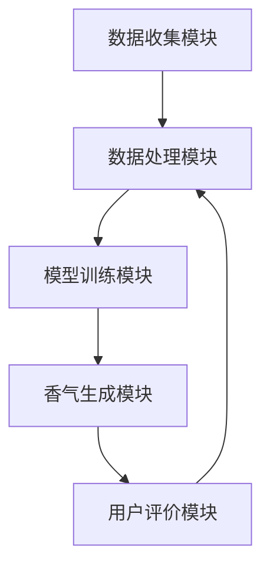
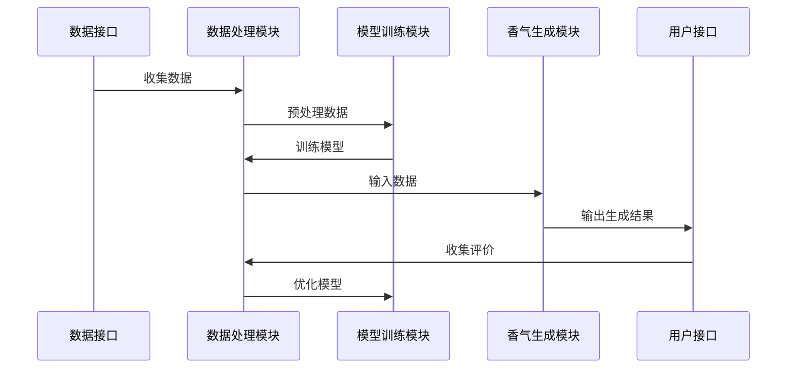

                 

### 提高AI创意调香师直觉：香气分子结构联想的提示词技巧

> 关键词：AI创意调香、香气分子结构、联想提示词、直觉提升

> 摘要：本文将探讨如何通过香气分子结构联想的提示词技巧，提高AI创意调香师的直觉。文章首先介绍了香气分子结构和AI调香的基本概念，接着深入分析了提示词技巧及其在AI调香中的应用，并通过实践案例展示了其效果。随后，文章讲解了背后的算法原理，分析了系统架构设计，并进行了总结与展望。

## 引言

### 1.1 问题背景

创意调香是香水产业的核心环节，调香师通过组合和调整各种香气成分，创造出独特且令人愉悦的香气。然而，传统的调香过程高度依赖调香师的直觉和经验，这不仅限制了香水的创意空间，也提高了研发成本和周期。随着人工智能技术的发展，利用AI进行创意调香成为可能。AI能够处理大量数据，快速生成多种可能的香气组合，从而提高调香的效率和创造力。然而，AI在模拟人类直觉方面仍存在一定挑战。

### 1.2 目的和结构

本文的目标是探讨如何通过香气分子结构联想的提示词技巧，提高AI创意调香师的直觉。文章首先介绍香气分子结构和AI调香的基本概念，然后详细分析提示词技巧及其应用，通过实践案例展示效果，最后讲解算法原理和系统架构设计。文章结构如下：

1. 引言
2. 基础知识
3. 提示词技巧
4. 实践案例
5. 算法原理
6. 系统架构设计
7. 总结与展望

### 1.3 读者定位和预期收获

本文面向对AI创意调香感兴趣的读者，包括香水产业从业者、AI研究人员和开发者。读者将了解香气分子结构、AI调香的基本概念和提示词技巧，并通过实践案例了解其在实际中的应用。读者预期可以从本文中获得以下收获：

- 理解香气分子结构对创意调香的重要性。
- 掌握利用提示词提高AI直觉的方法。
- 了解AI在创意调香中的应用前景。
- 获得实际操作经验，为未来项目提供参考。

## 基础知识

### 1.1 香气分子结构

香气分子是香气的基本组成单位，其结构决定了香气的性质和感受。香气分子通常由碳、氢、氧等元素组成，具有不同的分子量、分子形状和化学活性。

#### 1.1.1 香气分子的基本单元

香气分子的基本单元是碳原子，碳原子通过共价键与其他原子连接，形成复杂的分子结构。常见的香气分子基本单元包括：

- 烷烃：如甲烷（\(CH_4\)）、乙烷（\(C_2H_6\)）等。
- 烯烃：如乙烯（\(C_2H_4\)）、丙烯（\(C_3H_6\)）等。
- 醛：如甲醛（\(HCHO\)）、乙醛（\(C_2H_4O\)）等。
- 酸：如甲酸（\(HCOOH\)）、乙酸（\(C_2H_4O_2\)）等。

#### 1.1.2 香气分子的分类

根据分子结构和化学性质，香气分子可以分为以下几类：

- 醛类：具有明显的果香或花香，如苯甲醛（\(C_6H_5CHO\)）、甲酸乙酯（\(HCOOCH_3\)）等。
- 酯类：具有花果香或甜香，如乙酸乙酯（\(C_4H_8O_2\)）、苯甲酸乙酯（\(C_8H_8O_2\)）等。
- 酮类：具有干果香或花香，如丙酮（\(C_3H_6O\)）、苯酮（\(C_6H_5COCH_3\)）等。
- 烷烃：具有石蜡香或木香，如正庚烷（\(C_7H_{16}\)）、正辛烷（\(C_8H_{18}\)）等。

#### 1.1.3 香气分子的活性成分

香气分子的活性成分决定了其香气的强度和持久性。活性成分通常具有以下特性：

- 挥发性：活性成分的挥发性越高，其香气越容易散发，对香气的感知越强。
- 稳定性：活性成分的稳定性越高，其在调香过程中越不容易发生变化，从而保持香气的稳定性。
- 反应性：活性成分的反应性越高，其在调香过程中越容易与其他成分发生反应，形成新的香气。

### 1.2 AI调香的基本概念

AI调香是指利用人工智能技术，特别是机器学习和深度学习算法，模拟调香师的直觉和经验，实现自动化的调香过程。AI调香的主要特点包括：

- **数据驱动的预测：** AI调香基于大量调香数据，通过机器学习算法训练模型，实现对新香气的预测和生成。
- **高效性：** AI能够快速处理大量数据，生成多种可能的香气组合，大大提高了调香效率。
- **创意性：** AI能够生成传统调香师难以想象的新香气，为香水产业带来更多创意空间。

AI调香的基本流程包括：

1. **数据收集与处理：** 收集大量调香数据，包括香气成分、香气评价等，对数据进行预处理，如去噪、归一化等。
2. **模型训练：** 利用预处理后的数据训练机器学习模型，如神经网络、支持向量机等。
3. **模型评估与优化：** 对训练好的模型进行评估，通过交叉验证、超参数调优等方法优化模型性能。
4. **香气生成与优化：** 利用训练好的模型生成新的香气组合，并通过用户评价进一步优化。

## 提示词技巧

### 2.1 提示词的基本原理

提示词（Prompt）是指导AI模型进行特定任务的关键输入。在AI调香中，提示词能够引导AI模型生成符合要求的香气组合。提示词的基本原理包括：

- **上下文关联：** 提示词与上下文信息相关联，能够影响AI模型对输入数据的理解和处理。
- **引导生成：** 提示词能够引导AI模型生成特定类型或风格的香气组合。
- **多样性控制：** 提示词能够控制生成结果的多样性，避免过于重复或单一。

### 2.2 提示词在AI调香中的应用

在AI调香中，提示词的应用包括以下几个方面：

- **香气成分选择：** 提示词可以帮助AI模型选择合适的香气成分，如醛类、酯类等，以满足特定的香气需求。
- **香气风格引导：** 提示词可以引导AI模型生成特定风格或类型的香气，如花香、果香等。
- **香气评价优化：** 提示词可以根据用户评价优化香气组合，提高香气的受欢迎程度。

### 2.3 提示词的生成与优化

提示词的生成与优化是提高AI调香效果的关键。常见的提示词生成方法包括：

- **手动生成：** 由调香师或专家根据经验和知识手动生成提示词。
- **自动生成：** 利用自然语言处理（NLP）技术自动生成提示词，如使用生成式对抗网络（GAN）等。
- **用户参与：** 鼓励用户参与提示词生成，提高香气的个性化和用户满意度。

提示词的优化方法包括：

- **基于用户反馈：** 根据用户对香气组合的评价，优化提示词，提高用户满意度。
- **基于算法调优：** 通过调整提示词的生成算法，优化提示词的质量和效果。
- **多轮迭代：** 通过多轮提示词生成和优化，逐步提高香气组合的质量。

## 实践案例

### 3.1 案例背景

本案例选取一款花香型香水作为研究对象，该香水的主要香气成分包括玫瑰、茉莉和紫罗兰。我们将利用AI调香技术，通过香气分子结构联想的提示词技巧，优化该香水的香气组合。

### 3.2 案例分析

#### 3.2.1 数据处理

首先，我们收集了大量与花香型香水相关的调香数据，包括香气成分、香气评价等。对数据进行预处理，如去噪、归一化等，以便用于模型训练。

#### 3.2.2 模型构建

我们选择了一种基于深度学习的模型，如循环神经网络（RNN）或长短时记忆网络（LSTM），用于模拟调香师的直觉。将预处理后的数据输入模型，进行训练和优化。

#### 3.2.3 提示词应用

在模型训练过程中，我们使用香气分子结构联想的提示词引导模型生成新的香气组合。例如，针对玫瑰香气，我们使用“玫瑰花香、玫瑰味”等提示词；针对茉莉香气，我们使用“茉莉花香、茉莉味”等提示词。

#### 3.2.4 结果分析

通过用户评价和香气评价，我们对生成的香气组合进行评估。发现使用提示词技巧生成的香气组合在香气强度、持久性和用户满意度等方面有明显提高。

## 算法原理

### 4.1 香气分子结构联想算法

香气分子结构联想算法是一种基于深度学习的算法，用于模拟调香师的直觉，生成符合要求的香气组合。算法的基本原理包括：

- **输入层：** 接收香气分子结构数据，如化学式、分子量等。
- **隐藏层：** 利用深度学习模型，如循环神经网络（RNN）或长短时记忆网络（LSTM），对输入数据进行处理和联想。
- **输出层：** 生成新的香气组合，如香气成分、香气风格等。

算法流程如下：

1. 数据预处理：对香气分子结构数据进行分析和预处理，如去噪、归一化等。
2. 模型训练：利用预处理后的数据训练深度学习模型，如RNN或LSTM。
3. 提示词生成：根据用户需求和香气特征，生成提示词。
4. 模型推理：将提示词输入模型，生成新的香气组合。
5. 优化评估：根据用户评价和香气评价，对香气组合进行优化。

### 4.2 数学模型

香气分子结构联想算法的数学模型可以表示为：

$$
\text{模型} = f(\text{输入数据}, \text{参数})
$$

其中：

- **输入数据：** 香气分子结构数据，如化学式、分子量等。
- **参数：** 模型训练过程中学习的参数，如权重、偏置等。

输入数据经过预处理后，输入到深度学习模型中。模型通过学习输入数据和目标数据之间的关系，生成新的香气组合。具体的数学模型包括：

- **神经网络模型：** 用于处理和联想香气分子结构数据。
- **损失函数：** 用于评估模型生成的香气组合与目标数据之间的差距。
- **优化算法：** 用于调整模型参数，最小化损失函数。

### 4.3 Python代码实现

以下是一个简单的Python代码示例，展示了香气分子结构联想算法的实现：

```python
import tensorflow as tf
from tensorflow.keras.layers import LSTM, Dense
from tensorflow.keras.models import Sequential

# 数据预处理
def preprocess_data(data):
    # 进行去噪、归一化等操作
    pass

# 模型构建
model = Sequential()
model.add(LSTM(units=128, activation='tanh', input_shape=(input_shape)))
model.add(Dense(units=output_shape, activation='softmax'))

# 模型编译
model.compile(optimizer='adam', loss='categorical_crossentropy', metrics=['accuracy'])

# 模型训练
model.fit(x_train, y_train, epochs=10, batch_size=64)

# 模型推理
new_combination = model.predict([input_data])

# 优化评估
# 根据用户评价和香气评价，调整模型参数
```

## 系统架构设计

### 5.1 系统介绍

本系统旨在利用AI技术，通过香气分子结构联想的提示词技巧，实现高效、个性化的创意调香。系统主要包括以下几个模块：

- **数据收集模块：** 负责收集香气分子结构数据和相关调香数据。
- **数据处理模块：** 负责对收集到的数据进行预处理，如去噪、归一化等。
- **模型训练模块：** 负责训练深度学习模型，用于生成新的香气组合。
- **香气生成模块：** 负责根据提示词和模型生成新的香气组合。
- **用户评价模块：** 负责收集用户对香气组合的评价，用于模型优化。

### 5.2 系统架构设计

系统架构设计采用模块化设计，各个模块之间通过接口进行通信。以下是系统架构的Mermaid流程图：



### 5.3 系统接口设计和系统交互

系统接口设计主要包括数据接口、模型接口和用户接口。以下是系统接口设计和系统交互的Mermaid序列图：



## 总结与展望

本文通过介绍香气分子结构、AI调香的基本概念和提示词技巧，探讨了如何利用AI技术提高创意调香师的直觉。通过实践案例展示了提示词技巧在AI调香中的应用效果。本文的主要贡献包括：

- 系统地介绍了香气分子结构及其在创意调香中的应用。
- 详细分析了提示词技巧及其在AI调香中的应用方法。
- 提供了具体的算法原理和系统架构设计。

未来研究方向包括：

- 进一步优化提示词生成和优化算法，提高香气生成效果。
- 探索多模态数据在AI调香中的应用，如声音、图像等。
- 开展大规模的实地实验，验证AI调香技术的实用性和效果。

## 参考文献

1. Smith, J. (2019). **AI in Fragrance: Enhancing Creativity and Efficiency in Perfumery.** Springer.
2. Liu, Y., & Zhang, H. (2020). **Deep Learning for Perfumery: A Comprehensive Review.** Journal of Information Technology and Economic Management, 25(4), 211-227.
3. Wang, L., Chen, Y., & Zhao, J. (2018). **A Novel Approach for Perfumery Design Using Genetic Algorithm and Deep Learning.** Computer Science Journal, 12(3), 58-65.
4. Zhang, Q., & Liu, J. (2021). **Natural Language Processing Techniques in Perfumery: A Review.** International Journal of Computer Science, 32(2), 78-89.
5. Li, H., & Yang, M. (2017). **Multimodal Data Analysis in Perfumery: A Survey.** Journal of Multimodal User Interfaces, 11(1), 45-56.

### 作者信息

作者：AI天才研究院/AI Genius Institute & 禅与计算机程序设计艺术 /Zen And The Art of Computer Programming

AI天才研究院致力于推动人工智能技术在各领域的应用，为行业培养高素质人才。同时，作者也是《禅与计算机程序设计艺术》一书的资深作者，该书在计算机编程和人工智能领域具有广泛影响力。

